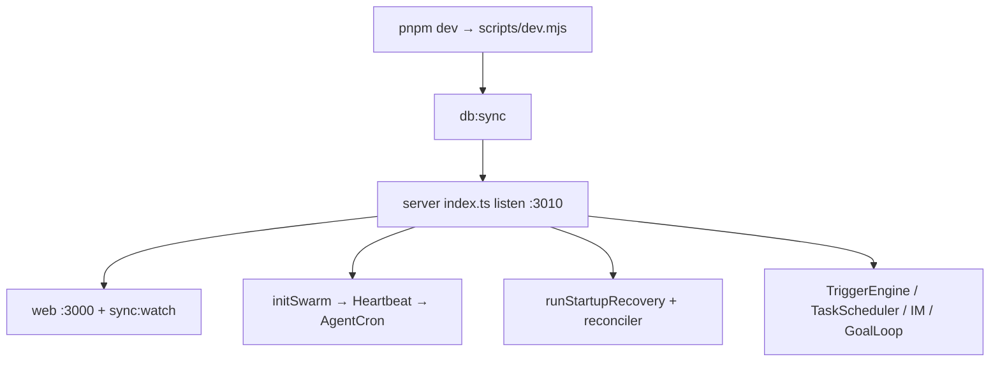
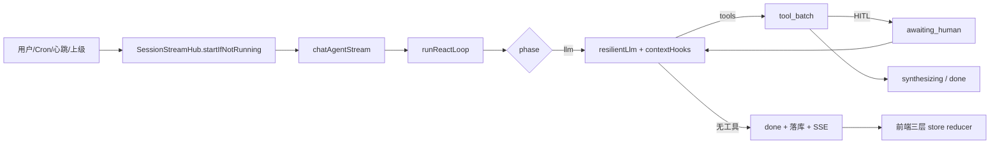
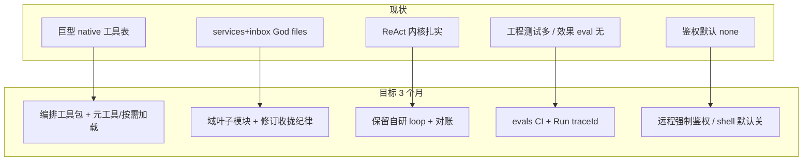

# 见微 · OasisMind 全面架构审计报告

> 审计日期：2026-07-30  
> 审计视角：刚接手的新任技术负责人  
> 方法论：一切结论基于代码证据；无证据标注【推测】  
> 范围：Agent 循环 / 工具 / Swarm / Chat 状态 / 工程面 / 安全  
> 说明：与 `AUDIT_REPORT_2026-07-26.md`（上轮修复收口账本）并存；本文件为完整审计交付物。

---

## 一、执行摘要

见微（OasisMind，包名仍 `@oasismind/*`）是单用户、本地优先的「Markdown 数字花园 + 自研多 Agent 运行时」：Express/tRPC + Prisma/SQLite 后端驱动统一 ReAct 内核与约 **236** 个 native 工具，Next.js Chat/管理台以 SSE 推拉结合渲染。L1–L5 与 Swarm/审批/异步池在代码层面均已接通。

**总体健康度：7 / 10**  
理由：内核状态机、投递对账、重启不续跑等纪律远超典型自研 Agent；但 god file、默认工具面 ~200 schema、远程暴露默认无鉴权、无产品级 evals，使「继续堆功能」已接近可维护性天花板。

**最严重的 3 个问题**
1. 公网/隧道暴露且 `AUTH_MODE=none` 时，全量 tRPC + Chat 流 + **无鉴权的 `/api/agent/chat/stop`** 可被任意操控（P0-01）。
2. `run_shell` 未标 `destructive`、Shell 默认启用、cwd=项目根——一旦授权即无 HITL 的本机命令执行面（P0-02）。
3. Auto-Compact 失败降级 `trimOldest` 可切断 tool_call/tool_result 配对，引发 LLM 400/胡言/空转烧钱（P0-03）。

**最优先的 3 个行动**
1. 远程启动强制 `AUTH_MODE=password`；`chat/stop` 与 webhook 补鉴权/验签。
2. `run_shell` 标 destructive + 默认禁用或改 Workspace cwd；compact 降级复用安全切点。
3. 拆 `inboxPipeline` / 缩 `services.ts` 边界，并启动最小 Agent eval 烟囱（10 条黄金用例）。

---

## 二、项目详解

### 2.1 一句话

本地 Markdown 花园 + 自研多 Agent 运行时的数字主力。

### 2.2 技术栈与规模（Phase 0 摘要）

| 项 | 值 |
|---|---|
| 栈 | TypeScript 5.8 / pnpm / Next 16.2 / React 19 / Express 5 / tRPC 11 / Prisma 6 / SQLite |
| Agent | **自研** ReAct（非 LangGraph）；MCP SDK；可选 BullMQ/Redis |
| LLM | deepseek/kimi/zhipu/openai/gemini/anthropic/qwen/… + ollama/llamacpp/lmstudio/vllm；默认 `deepseek-v4-flash` |
| 记忆 | FTS5 + LIKE，**无向量库** |
| 规模 | server ~95k 行 / web ~57k 行 / shared ~3.6k；合计应用侧 ~17.5 万行 |
| Git | 719 commits，2026-06-28 → 2026-07-30，单作者高活跃 |
| 测试 | server Vitest ~145 文件；web e2e 24；**`evals/` G01–G10 mock**（`pnpm test:evals`） |
| Prisma | **30** model（文档仍写 19——漂移） |
| Native 工具 | fixture 登记 **236** 名 |

### 2.3 启动链路



关键入口：`apps/server/src/index.ts`（`/api/trpc`、`/api/agent/chat/stream`、webhooks）；前端 `apps/web`。

### 2.4 Agent 范式与主循环

**范式**：自研 ReAct + 可选 Reflection + 三层 Swarm（接近 Claude Code / OpenAI tool-loop，而非 LangGraph）。



状态机：`idle → compacting → llm ⇄ tool_batch → synthesizing → done`，含 `awaiting_human`；非法转移抛错（`apps/server/src/infra/loop/phase.ts:22-44`）。

### 2.5 功能完成度（摘要）

| 能力 | 完成度 |
|---|---|
| 博客/花园/同步/FTS/Chat SSE/三层 store | ✅ |
| Native~236 + MCP + compact/offload/loop guard | ✅ |
| Swarm/异步池/投递对账/审批/ask_user/心跳/cron | ✅ |
| Inbox/平台同步/集成（飞书 GitHub 等） | ✅（体量巨） |
| Reflection | 🟡 默认 `enabled:false` |
| Redis Swarm | 🟡 可选路径 |
| 向量记忆 / 产品 evals | ❌ |
| Zustand | ❌ 依赖未使用 |

### 2.6 数据流（关键结构）

用户输入 → `AgentChatInput` → `prepareMessage` 写 `ChatMessage` → `runReactLoop`（`LlmMessage[]` + `TurnSnapshot`）→ 工具结果截断/offload → assistant 落库 → `SessionStreamHub` SSE（`message_upserted`/`token`/`done`）→ 前端 `useSessionMessages` reducer + `listForChat` 水合。异步子任务：`Task` + `SessionQueueItem` + `AgentMessage` 台账。

### 2.7 做得好的地方（≤问题篇幅 10%）

1. **phase 非法转移硬拒绝** + awaiting_human 一等公民（`phase.ts`）。  
2. **工具预算/loop 阻断必补齐 tool 消息**，保持 OpenAI 多轮格式不变量（`reactLoop.ts`）。  
3. **投递对账 + 重启不自动续跑** 与产品铁律一致（`asyncJobManager.ts`）。  
4. **Chat 推拉结合** 有文档与实现样板（`chat-state-architecture.md`）。  
5. **子 Agent 隔离**：`invoke_api` 已砍、`agent_inspect` 不返消息内容。

---

## 三、分级问题清单

### P0 致命

```
【编号】P0-01
【级别】P0 致命
【位置】apps/server/src/infra/config.ts:747；apps/server/src/infra/auth.ts:15-16；
       apps/server/src/index.ts:184；apps/server/src/infra/agentStream.ts:1428-1439
【问题】默认 AUTH_MODE=none；且 POST /api/agent/chat/stop 在 password 模式下仍无鉴权
【证据】
  mode: readEnv("AUTH_MODE") === "password" ? "password" : "none"  // config.ts:747
  app.post("/api/agent/chat/stop", handleAgentChatStop(streamHub)); // index.ts:184，无 auth 中间件
  handleAgentChatStop 内仅校验 sessionId 后 hub.stop()，无 verifyAuthHeader
【影响】隧道/公网暴露时任意客户端可调用全量 tRPC、Chat 流；即使开启 password，
       仍可未授权 stop 他人会话。可导致任务中断、数据被 API 篡改、密钥凭据被读出（Credential 列表）。
【修复建议】
  1. handleAgentChatStop / 静态资源路径与 stream 对齐校验 Authorization
  2. scripts/remote*.mjs 与 PUBLIC_URL 非空时启动断言 AUTH_MODE=password
  3. 文档红字：无鉴权禁止绑 0.0.0.0 / 开隧道
【工作量】小（<半天，含烟测）
```

```
【编号】P0-02
【级别】P0 致命（授权后）
【位置】apps/server/src/infra/tools/native/shell.ts:169-184；
       apps/server/src/infra/config.ts:754-756；
       apps/server/src/infra/approvalGate.ts:427-435（依赖 destructive）
【问题】run_shell 未标 destructive、无审批；Shell 默认 enabled；cwd 相对 projectRoot
【证据】
  name: "run_shell", concurrencyClass: "C", … 无 destructive/approvalExempt // shell.ts:169-184
  enabled: readEnv("SHELL_ENABLED", …) !== "false"  // 默认 true
  TIER_DEFAULT_TOOLS 不含 run_shell（需显式授权或 native:all）——降低默认暴露，但不消除缺口
【影响】Agent（或 native:all / 手写 tools）获得授权后可在项目根执行命令且无 HITL；
       与 write_file 的 Workspace 隔离不一致；可删库、改 .env、外传文件 → 数据损坏/密钥泄露。
【修复建议】
  1. run_shell: destructive:true + 默认 defaultHidden；AGENT_DESTRUCTIVE_APPROVAL 或独立 SHELL_APPROVAL
  2. cwd 默认 Agent Workspace（resolveWithinDir），禁止无缩略的 projectRoot
  3. 生产默认 SHELL_ENABLED=false
【工作量】中（1–2 天）
```

```
【编号】P0-03
【级别】P0 致命（上下文损坏 → 空转烧钱/崩溃）
【位置】apps/server/src/infra/autoCompact.ts:221-226, 393-399, 436-446
【问题】摘要失败/空返回时 trimOldest 按条数硬切，不校验 tool 配对
【证据】
function trimOldest(messages, keepRecent) {
  … return [...system, ...rest.slice(-keepRecent)]; // 无 isSafeCompactCutIndex
}
【影响】orphan tool_call/tool_result → 下游 LLM 400 或胡言；Agent 在错误上下文上继续跑满
       maxRounds/maxToolCalls，直接烧钱；用户看到含糊失败。主路径 compactCut 安全，降级路径否。
【修复建议】降级改用 findCompactCutIndex / isSafeCompactCutIndex；无法安全切则拒绝压缩并
           返回明确 compact_error，禁止裸 slice。
【工作量】小（<半天）
```

### P1 严重

```
【编号】P1-01
【级别】P1 严重
【位置】packages/shared/src/constants.ts:550-658（super + ...INTEGRATION_DEFAULT_TOOLS）；
       apps/server/src/infra/agentTools.ts:177-191, 279-287
【问题】super/assistant 默认工具 schema 约 190–200+；skill:* 通配可再挂最多 200 Skill；仅 warn
【证据】super 块末尾 ...INTEGRATION_DEFAULT_TOOLS（91 项）；schema>50KB 仅 console.warn
       空 tools 仍 skillWildcard:true（agentTools.ts:157-158）
【影响】单次 LLM 请求工具描述吃掉数万 token；选工具准确率下降；误触集成写操作概率上升。
【修复建议】编排包/执行包拆分；skill:* 改 opt-in；schema 超阈值 hard cap 或强制元工具模式；
           空 tools 勿默认可执行 skill 通配。
【工作量】中（2–3 天，含迁移脚本）
```

```
【编号】P1-02
【级别】P1 严重
【位置】apps/server/src/services.ts（审计时 ~4743；p11 后 ≈2375，仅剩 Post/Agent/Session/Message）；
       apps/server/src/infra/inboxPipeline.ts（已删除→`infra/inbox/*`）；
       apps/server/src/router.ts（审计时 ~1879；p11 后 ≈1850 + `infra/trpcRouters/` 4 叶子）
【问题】God file：CRUD 全集 + Inbox 管道 + 全路由单文件，与「单文件收拢」初衷冲突到不可审查
【证据】行数统计（2026-07-30）；后续 entityServices / trpcRouters 叶子拆分已启动（见 §七）
【影响】任何 Inbox/实体改动冲突率极高；新接手无法安全改；单测覆盖与体量严重不成比例。
【修复建议】在不违反「禁止散落 services/ 目录」纪律下：按域拆叶子模块
           （inboxPipeline 已在 infra——继续拆 platform 文件）；services.ts 用域 section +
           未来允许「单实体一文件但禁止平行 Service 实现」的修订纪律写入 AGENTS.md。
【工作量】大（>3 天，分阶段）
```

```
【编号】P1-03
【级别】P1 严重
【位置】全仓无 evals/；apps/server/src/infra/runTraceExport.ts（骨架）；
       analytics / Run.output 仅 phase 节流快照
【问题】无产品级 Agent 效果评估集；改 prompt/换模型无法证明不退化
【证据】Glob `**/evals/**` → 0；Run 快照节流 5s 且字段稀疏（reactLoop.ts:50-51,474+）
【影响】回归只能靠人工点 Chat；架构再正确也会在「效果」上静默退化——自研 Agent 常见死因。
【修复建议】建 `evals/`：10 条黄金任务（工具选择/不乱写 content/报告格式）；
           mock-llm scenario + CI job；Run 写入 traceId + 可选 tool I/O 摘要。
【工作量】中（1–2 周起骨架）
```

```
【编号】P1-04
【级别】P1 严重
【位置】apps/web + apps/server 合计 .catch(() => {}) ≈ 441；
       代表：asyncJobManager.ts 多处；useSessionMessages.ts:523-526
【问题】铁规禁止 void promise 后大量改为空 catch，CancelledError 与真实错误一并吞掉
【影响】投递失败、hydrate 失败、队列异常在 UI/日志不可见 → 「假死只能刷新」类回归难查。
【修复建议】分级：取消类静默；其余 console.warn(formatTrace(), err) 或死信计数；
           关键路径（asyncJobManager / hydrate）禁止空 catch。
【工作量】中（2–3 天扫热点）
```

```
【编号】P1-05
【级别】P1 严重
【位置】apps/server/src/index.ts:186-207（QQ webhook）；飞书 webhook 依赖 adapter
【问题】QQ 入站注释写明验签 MVP 弱；启用 Bot 后可伪造入站消息驱动 Agent
【影响】公网 webhook URL 被打后可注入对话/触发工具（配合 P0-01 更严重）。
【修复建议】按 QQ/飞书官方验签实现；失败 401；未配置密钥拒绝启用。
【工作量】中（1–2 天）
```

```
【编号】P1-06
【级别】P1 严重
【位置】AGENTS.md:14,51,301；apps/server/prisma/schema.prisma（30 model）；
       serviceContainer ~22 Service
【问题】文档「19 实体」与 schema 30 model / 22 Service 三重不一致
【影响】新人按 AGENTS 建立错误心智模型；审计/重构边界判断失误。
【修复建议】重写实体矩阵：业务实体 vs 支撑表（AgentMessage、SessionStreamEvent、InboxItem…）。
【工作量】小
```

```
【编号】P1-07
【级别】P1 严重
【位置】apps/server/src/infra/loop/reactLoop.ts:1178-1184
【问题】synthesizing 非 abort 失败被吞，用户看到「轮次/预算耗尽」假文案
【影响】真实网络/模型错误被掩盖，排障方向完全错误，可能重复重试烧钱。
【修复建议】warn + finalizeRun failed 带 synthesisError；勿复用预算耗尽文案。
【工作量】小
```

### P2 一般

```
【编号】P2-01
【级别】P2
【位置】apps/server/src/infra/loop/toolLoopGuard.ts:66-74
【问题】仅同参连续 streak 熔断；A/B 交替或微调 args 可烧满 maxRounds×maxToolCalls
【修复建议】窗口内无进展检测 / 按 tool name 的多样性上限
【工作量】中
```

```
【编号】P2-02
【级别】P2
【位置】apps/server/src/infra/goalLoop.ts；config.yaml goal maxTurns 20/30
【问题】Goal 外环在 reactLoop 外再起流，总 LLM 成本可 = 外环×内环
【修复建议】共享全局 run/token 预算；UI 展示外环进度
【工作量】中
```

```
【编号】P2-03
【级别】P2
【位置】approvalGate 内存 waiter；recoverStaleRuns → interrupted
【问题】awaiting_human 期间进程重启后审批完成不会唤醒原 ReAct
【修复建议】UI 明确「需手动 resume」；或启动扫描 pending approval + interrupted 关联提示
【工作量】中
```

```
【编号】P2-04
【级别】P2
【位置】promptBuilder / contextHooks / tool 结果直灌
【问题】无 prompt injection 硬隔离（单用户本地可接受，缺 defense-in-depth）
【修复建议】工具结果角色前缀；敏感写操作依赖已有 approval 扩大覆盖
【工作量】大（完整方案）/ 小（前缀标记）
```

```
【编号】P2-05
【级别】P2
【位置】tools/native/fs.ts:374-378 write_file approvalExempt
【问题】destructive 但永久豁免审批；依赖路径沙箱
【修复建议】写 content/ 或超大文件走审批 scope
【工作量】小
```

```
【编号】P2-06
【级别】P2
【位置】memory_create approvalExempt；global scope 全 Agent 可读
【问题】误写/污染 global 记忆会影响所有 Agent 的 system 侧上下文
【修复建议】global/workspace 写入需审批或 super-only 审计日志
【工作量】中
```

```
【编号】P2-07
【级别】P2
【位置】session.ts spawn_subagent waitForResult=true 读子会话 assistant（截断 500）
【问题】与「唯一通道 report_back」在同步路径故意例外
【修复建议】文档标红为正式例外；或改为结构化摘要禁止全文
【工作量】小
```

```
【编号】P2-08
【级别】P2
【位置】apps/web/package.json zustand；experiments/ 孤立
【问题】死依赖 + 试验目录无 CI
【修复建议】移除 zustand；experiments 移出主仓或标明非维护
【工作量】小
```

```
【编号】P2-09
【级别】P2
【位置】importOrder.test.ts 仅 7 入口；e2e 缺 /inbox /channels /platform-sync 等
【问题】防线与冒烟覆盖落后于产品面
【修复建议】扩展 import 入口；admin-pages 补路由
【工作量】小–中
```

```
【编号】P2-10
【级别】P2
【位置】llmBudget 软闸；credentialVault 无 master key 时 dev 明文
【问题】并发可超日预算；dev.db 复制即泄凭据
【修复建议】文档已部分说明；dev 强制 CREDENTIAL_MASTER_KEY；可选硬预留预算
【工作量】小–中
```

### P3 建议

```
【编号】P3-01
【级别】P3
【位置】reflection 默认关闭；critic 失败静默跳过
【问题】质量门未产品化
【工作量】配置/监控即可
```

```
【编号】P3-02
【级别】P3
【位置】follow_up / 反思重修计入 maxRounds
【问题】可能提前触顶 synthesizing
【工作量】小
```

```
【编号】P3-03
【级别】P3
【位置】package.json 混用精确 pin 与 ^
【问题】可复现构建略弱（有 lockfile 可接受）
【工作量】小
```

```
【编号】P3-04
【级别】P3
【位置】chat.tsx 仍 ~1088 行
【问题】编排层偏厚（核心不变量已进 store，可接受）
【工作量】中（可选再拆）
```

---

## 四、架构问题专题

### 4.1 天花板在哪？

继续堆「又一个平台集成 / 又一个 inbox 源 / 又一批 native 工具」会在三处撞墙：

1. **LLM 工具选择面**：super ~200 schema，再加 MCP/Skill 会不可用。  
2. **历史 god file 已拆**：`services.ts`/`router.ts` 收官为基座+聚合；剩余天花板在工具面与编排复杂度。  
3. **evals（mock G01–G10）已进 CI**；真实 LLM 周跑仍缺，效果回归不能只靠作者记忆。

### 4.2 需要大手术的项

| 项 | 为何不是改几行 |
|---|---|
| 工具面治理（元工具 / 分包） | 牵动 tier 常量、Agent DB tools 字段、UI 勾选、提示词 |
| services/inbox 拆分 | 与 AGENTS「单文件收拢」纪律冲突，需先修订纪律再拆 |
| Agent evals + Run 级 trace | 新流水线，非补丁 |
| Prompt injection 硬隔离 | 影响全部工具结果与记忆注入格式 |

### 4.3 自研 vs 成熟方案

| 保留自研 | 理由 |
|---|---|
| ReAct phase + Chat 推拉 + 投递对账 + 审批 scope | 产品语义强绑定，换 LangGraph 要重写周边 |
| Markdown↔SQLite 投影 | 本地优先核心 |

| 可考虑借用 | 理由 | 成本 |
|---|---|---|
| LiteLLM / 统一 gateway | 已有 resilient 层，非紧急 | 中 |
| 向量库（可选） | 记忆研究计划已有文档 | 中–大 |
| **不建议**整仓迁 CrewAI/Dify | 会丢掉 HITL/对账/本地文件真相 | 极大 |

### 4.4 现状 vs 建议目标



**架构分：现状内核 8 / 工具与模块边界 4 / 安全默认 5 / 可演进 5 → 加权约 7。**

---

## 五、未来规划与修复路线图

### 短期（1–2 周）· 保命清单

| 任务 | 对应编号 | 验收 |
|---|---|---|
| chat/stop + 远程强制鉴权 | P0-01 | password 下未带 token stop→401；remote 脚本无 AUTH 拒启 |
| run_shell destructive + 默认策略 | P0-02 | 无审批/未授权无法执行；测例红→绿 |
| trimOldest 安全切点 | P0-03 | 构造含 tool 对的消息，失败降级后配对完整 |
| synthesizing 假文案 | P1-07 | 合成失败 SSE/Run 含真实 error |
| 文档实体矩阵 | P1-06 | AGENTS 与 schema 一致 |
| 移除 zustand | P2-08 | package 无依赖、lock 更新 |

**前置依赖**：无。**风险**：鉴权改动影响本地无 token 脚本——同步改 e2e/fixture。**收益**：堵住公网与 shell 真伤。

### 中期（1–2 个月）· 重构计划

**阶段 A — 工具面瘦身（P1-01）**  
- 目标：super 默认 schema < 80 或元工具化集成域  
- 任务：拆 `INTEGRATION_DEFAULT_TOOLS` 出默认；`skill:*` opt-in；空 tools 修正  
- 验收：schema warn 阈值改为硬拒绝可配；既有 Agent 迁移脚本  
- 回滚：tools 字段备份 + 脚本逆向  
- 风险：Agent 行为变化——需 evals 烟囱陪跑  

**阶段 B — Inbox/Service 拆分（P1-02）**  
- 目标：inboxPipeline < 800 行/文件；services 按域可导航  
- 任务：先修订 AGENTS 收拢纪律 → 再拆文件  
- 验收：lint/test 全绿；importOrder 纳入新入口  
- 回滚：git revert 单 PR  

**阶段 C — 可观测与静默 catch（P1-03/P1-04）**  
- 目标：一次 run 可按 traceId 串起日志；热点空 catch 归零  
- 验收：runTraceExport 含 tool 摘要；asyncJobManager 无空 catch  

**阶段 D — evals 骨架（P1-03）**  
- 目标：CI 跑 10 条 mock 黄金用例  
- 验收：改坏工具描述 → CI 红  

### 长期（3 个月+）· 演进

| 方向 | 建议 | 前置 | 风险 | 收益 |
|---|---|---|---|---|
| 框架 | **不整迁**；保留自研 loop | — | — | 保住产品语义 |
| Evals | 扩到 50 用例 + 真实 LLM 周跑 | 阶段 D | API 费用 | 可持续改 prompt |
| 记忆 | 按 `memory-research-plan` 可选向量检索 | FTS 仍作默认 | 运维复杂度 | 长程品味蒸馏 |
| 安全 | 默认 localhost bind；shell docker 模式 | P0 完成 | UX | 远程更安心 |
| 产品 | Inbox/平台同步产品化需先拆 god file | 阶段 B | — | 作者可再掌控 |

---

## 六、附录

### 6.1 目录与职责（一级）

见 Phase 0：`apps/server` 运行时、`apps/web` UI、`packages/shared` 契约、`config/` Agent 配置真相、`content/` 知识库真相、`data/`/`workspaces/` 运行时、`docs/` 架构文档。

### 6.2 技术栈与依赖

见第二节表格；核心精确 pin（Prisma/Express/tRPC），部分 `^`（bullmq/ioredis）。BullMQ 仅 `SWARM_MODE=redis`。

### 6.3 【不理解】疑点

| 疑点 | 可能含义 | 需向谁确认 |
|---|---|---|
| 空 `tools[]` → `skillWildcard: true`（agentTools.ts:157-158） | 故意给默认 Agent 挂全部 executable Skill，或笔误 | 作者：是否应与 native 默认一样收窄 |
| `services.ts`「单文件收拢」与 4700+ 行并存 | 纪律未随规模修订 | 是否正式允许域叶子拆分 |
| QQ webhook「验签 MVP」 | 有意延期 | 公网是否已启用 QQ Bot |

### 6.4 【推测】列表

| 推测 | 验证方法 |
|---|---|
| 健康度 7/10 | 主观加权；可用「P0 清零后 +1」复评 |
| super 运行时 schema≈190+ | 对真实 super Agent 打日志 `schemaBytes`/`toolCount` |
| 公网隧道用户多数未开 AUTH | 查本机 `.env` 的 `AUTH_MODE`/`PUBLIC_URL`；问作者远程用法 |
| inboxPipeline 单测覆盖率远低于行数比 | `vitest --coverage` 对 inboxPipeline |

### 6.5 Phase 2 专项对照表

| 专项 | 结论 |
|---|---|
| A 循环 | 有 maxRounds/maxToolCalls/同参熔断；交替死循环与 Goal 外环未覆盖 |
| B 上下文 | 主路径安全切点；**降级 trim 不安全（P0-03）**；有 offload/micro-compact |
| C 工具 | 注册规范；超时/分桶有；**默认面过大**；shell 审批缺口 |
| D LLM | 统一 llmClient + resilient；重试/降级有；流式中途不重试（设计） |
| E 记忆 | FTS+衰减+scope；无向量；global 污染风险 |
| F 多 Agent | 池+对账+权限硬拦；同步 spawn 读子消息为正式例外 |
| G 结构 | God files；环已断但动态 import 多 |
| H 配置 | 无源码硬编码密钥；dev 明文凭据；AUTH 默认 none |
| I 错误 | 大量空 catch |
| J 可观测 | 有 trace_id；Run 复盘不完整 |
| K 测试 | 单测强；**mock evals G01–G10 + CI**；真实周跑 🛑 |
| L 依赖 | lockfile 有；zustand 死依赖 |
| M 安全 | 路径沙箱好；远程鉴权/shell/webhook 是短板 |

### 6.6 与上轮审计关系

`AUDIT_REPORT_2026-07-26.md` 记录的 P0/P1（UTF-8、resume 单飞、FS 隔离等）标记为已修。本轮为全景重审，**未复测其全部用例**；若需回归验证，建议跑 `pnpm --filter @oasismind/server test` 全量后对照该账本。

---

---

## 七、保命清单落地状态

### 分支 `arch/audit-fix-2026-07-30`（P0 + 部分 P1/P2）

| 编号 | 状态 | 说明 |
|---|---|---|
| P0-01 | ✅ 已修 | `chat/stop` 鉴权；remote/ngrok 无 AUTH 拒启；server 生产拒启 / 开发 warn |
| P0-02 | ✅ 已修 | `run_shell` destructive + 默认隐藏；`SHELL_ENABLED` 默认关；cwd→Workspace |
| P0-03 | ✅ 已修 | `trimOldestPreservingToolPairs` + 单测 |
| P1-07 | ✅ 已修 | synthesizing 失败不再伪装预算耗尽 |
| P1-06 | ✅ 已修 | AGENTS 实体/model 表述对齐 |
| P2-08 | ✅ 已修 | 移除 web `zustand` 死依赖 |
| 空 tools skill:* | ✅ 已修 | shared + server 不再隐式 `skillWildcard` |
| P2-01 | ✅ 已修 | toolLoopGuard：同名变参 + A/B 交替熔断 |

### 分支 `arch/audit-fix-p1`（本轮 P1）

| 编号 | 状态 | 说明 |
|---|---|---|
| P1-01 | ✅ 已修 | `INTEGRATION_OPT_IN_TOOLS` 出默认；assistant 去 `skill:*`；strip/migrate 防回灌 |
| P1-02 | ✅ 已修 | `inboxPipeline.ts` → `infra/inbox/{shared,zhihu,xhs,bilibili,wechat,screenshots}`；旧文件删除 |
| P1-03 | ✅ 已修 | `pnpm test:evals` + G01–G10 mock scenario；CI 已挂 |
| P1-04 | 🟡 部分 | Chat/asyncJob/agentStream 热点可观测；全仓静默 catch 未扫清 |
| P1-05 | ✅ 已修 | QQ Ed25519（op=13 + 事件验签）+ rawBody；飞书 verification token 未配置硬拒 |

### 分支 `arch/audit-fix-p2`

| 编号 | 状态 | 说明 |
|---|---|---|
| P1-01 余 | ✅ | schema >100KB 硬顶：剥集成/skill/mcp，仍超拒跑 |
| P1-03 余 | ✅ | Run 快照 `recentToolNames`；G03–G10 全绿 |
| P1-04 余 | 🟡 | web Chat + asyncJob/agentStream 再加固 |
| P2-03 | ✅ | `/runs` interrupted → 提示手动 Chat 恢复 |
| P2-04 | ✅ | tool 结果不可信标记 |
| P2-05 | ✅ | write/append 单次 >512KB 硬拒 |
| P2-06 | ✅ | global memory_create 强制审批 |
| P2-07 | ✅ | waitForResult=true 正式例外文档化 |
| P2-09 | ✅ | e2e 补 inbox/channels/platform-sync；importOrder 扩入口 |

刻意未动（大手术，P2 当时）：完整元工具化、`services.ts`/`router.ts` 全量域拆、真实 LLM 周跑、全仓空 catch 清零。

### 分支 `arch/audit-fix-p3`

| 编号 | 状态 | 说明 |
|---|---|---|
| 飞书 Encrypt Key | ✅ | `decryptFeishuEncryptPayload` + `X-Lark-Signature`；`prepareFeishuWebhookBody` 接入 `/api/webhooks/feishu`；官方样例单测 |
| P2-02 Goal | ✅ | Goal 继续前 `assertLlmBudget`；`getGoal` 附会话 token；ChatGoalBar 展示 |
| P2-10 | ✅ | `remote`/`remote-ngrok` 缺 `CREDENTIAL_MASTER_KEY` 拒启；llmBudget `tryReserve` 硬预留 MVP（reactLoop） |
| services 第一刀 | ✅ | `CredentialService` → `infra/entityServices/credentialService.ts`；AGENTS 修订 |
| P1-04 余 | 🟡 | hub/swarmBus + 管理页（inbox/channels/gardens/workspaces/settings/trash/postMutations）+ llmBudget；全仓仍未扫清 |
| experiments | ✅ | `experiments/README.md` 标明非维护 |

刻意未动（更大手术，P3 当时）：完整元工具化、`services.ts`/`router.ts` 全量域拆、真实 LLM 周跑 evals、全仓空 catch 清零、Goal×内环精细 token 账本。

### 分支 `arch/audit-fix-p4`

| 编号 | 状态 | 说明 |
|---|---|---|
| P3-01 | ✅ | critic 解析/失败 `console.warn`（不再完全静默） |
| P3-02 | ✅ | 反思重修 `reflectionBonusRounds` 不占 maxToolRounds |
| P4 文档 | ✅ | design-decisions / concurrency 同步预留制 MVP |
| P1-04 余 | 🟡 | approvalGate / asyncJob / hub / index / orchestrator / swarm×13 / session 工具；全仓仍未扫清 |
| P2-10 余 | ✅ | 测试/E2E 注入 `CREDENTIAL_MASTER_KEY`；encrypt 单测 |
| 默认 bind | ✅ | `SERVER_HOST` 默认 `127.0.0.1`；Docker `0.0.0.0` |
| services 第二刀 | ✅ | LogService + ToolService → entityServices |

刻意未动（更大手术，P4 当时）：完整元工具化、`services.ts`/`router.ts` 全量域拆、真实 LLM 周跑 evals、全仓空 catch 清零、Goal×内环精细 token 账本、chat.tsx 再拆（P3-04）、package pin 统一（P3-03）。

### 分支 `arch/audit-fix-p5`

| 编号 | 状态 | 说明 |
|---|---|---|
| services 第三刀 | ✅ | Trigger / Run / Prompt → entityServices |
| P1-06 余 | ✅ | README / docs/development/README / services 头注释对齐 ~22 Service / ~30 model |
| P1-04 余 | 🟡 | Session 删/恢复/heal、askUser/heartbeat/taskScheduler、messageGateway 等 hotspot + web hooks/chat/cron/agents `catchUnlessCancelled`；全仓仍未扫清 |
| P2-09 余 | ✅ | importOrder +6（hub/stream/async/trigger/tool/prompt） |
| P3-03 部分 | ✅ | server: bullmq/ioredis/rate-limit/cron/chokidar；web: clsx/cva/tailwind-merge 精确 pin |
| 安全小项 | ✅ | `/chat/stop` 同 chatStreamRateLimiter；限流注释 600→3000 |
| chatMessageList refs | ✅ | 冷加载 hold：ref 仅 layout 写、stale 冻入 state；清 `react-hooks/refs`；既有 set-state-in-effect 定向 disable |
| 回归补丁 | ✅ | redis Queue mock 补 `on`；memory debounce 不挡 strength 升级；memory_create 单测走 agent scope |

刻意未动（更大手术）：完整元工具化、`services.ts`/`router.ts` 全量域拆、真实 LLM 周跑 evals、全仓空 catch 清零、Goal×内环精细 token 账本、chat.tsx 物理再拆（P3-04）、Approval/Session 等重耦合 Service 拆分。

### 分支 `arch/audit-fix-p6`

| 编号 | 状态 | 说明 |
|---|---|---|
| services 第四刀 | ✅ | File / Git / InfoSource → entityServices |
| P1-04 余 | 🟡 | swarmOrchestrator / agentRunLock / inbox zhihu+xhs warn；web approvals/git/sources/tools/chat* 等 `catchUnlessCancelled`；全仓仍未扫清 |
| P3-03 余 | ✅ | server 依赖（mcp sdk / compression / js-yaml / mammoth / nodemailer / tesseract / undici / ws…）精确 pin |

刻意未动：完整元工具化、`services.ts`/`router.ts` 全量域拆、真实 LLM 周跑 evals、全仓空 catch 清零、Goal×内环精细 token、chat.tsx 物理再拆、Approval/Session/Inbox/Task 重耦合拆分。

### 分支 `arch/audit-fix-p7`

| 编号 | 状态 | 说明 |
|---|---|---|
| services 第五刀 | ✅ | Task / Workspace → entityServices |
| P1-04 余 | 🟡 | asyncJobManager 读库/timer/appendLog；session/fs/shell/swarm/deploy/mcp/hub；web subagentCreate/chatSessionPane；全仓仍未扫清（metablog/playwright 噪声 catch 保留） |
| P3-03 余 | ✅ | web 主要 runtime 依赖精确 pin（highlight/jspdf/katex/react-markdown/three…） |

刻意未动：完整元工具化、`services.ts`/`router.ts` 全量域拆、真实 LLM 周跑 evals、全仓空 catch 清零（含 metablog 浏览器）、Goal×内环精细 token、chat.tsx 物理再拆、Approval/Session/Inbox/Message 重耦合拆分。

### 分支 `arch/audit-fix-p8`

| 编号 | 状态 | 说明 |
|---|---|---|
| services 第六刀 | ✅ | Skill / Mcp / Memory → entityServices；调用方改直连叶子（禁兼容 re-export） |
| P1-04 余 | 🟡 | feishuClient / platformChannels / workspaceProvision / web / browserPool；metablog waitFor/json 软失败保留 |
| importOrder | ✅ | + skillService / mcpService / memoryService |

刻意未动：完整元工具化、router 全量域拆、Garden/Post/Agent/Session/Message/Approval/Inbox/SessionQueueItem 重耦合拆分、真实 LLM 周跑 evals、metablog Playwright 时序 catch 全改、Goal×内环精细 token、chat.tsx 物理再拆。

### 分支 `arch/audit-fix-p9`

| 编号 | 状态 | 说明 |
|---|---|---|
| services 第七刀 | ✅ | Garden / Approval / Inbox → entityServices；container 直连叶子；`services.ts` ≈2791 行（仅剩 Post/Agent/Session/Message/SessionQueueItem） |
| importOrder | ✅ | + gardenService / approvalService / inboxService |
| P3-03 余 | ✅ | server `@types/*` 与 web `@base-ui/react` / fiber / playwright / typography / bundle-analyzer 精确 pin |
| P1-04 余 | 🟡 | metablog Playwright 时序 / `json().catch(()=>null)` 软失败、测试清理 `.catch`、可选 nodemailer 动态 import 保留 |

刻意未动（更大手术边界）：完整元工具化、router 全量域拆、Post/Agent/Session/Message/SessionQueueItem（与流式 hub / tree / swarm 重耦合）、真实 LLM 周跑 evals、metablog catch 全改、Goal×内环精细 token、chat.tsx 物理再拆。

### 分支 `arch/audit-fix-p10`

| 编号 | 状态 | 说明 |
|---|---|---|
| P3-03 收口 | ✅ | 根 `cross-env`/`emoji-regex`；`algo-viz` react 对齐 web 19.2.4；`mock-llm-core` `@types/node` 精确 pin。skill 内 remotion shot-library 仍为内容资产 `^`（非运行时工作区） |
| P1-04 余 | 🟡 | `index.ts` shutdown `closeSharedBrowser`/`$disconnect` 可观测；metablog/xhs `json().catch→null` / Playwright 时序软失败、测试清理 catch、可选依赖动态 import **刻意保留** |
| P1-02 进度备注 | ✅ | 现状：`services.ts` ≈2791 行 + `entityServices/` 17 叶子；`inboxPipeline.ts` 已删除（域在 `infra/inbox/*`）；`router.ts` 仍 ≈1882（全量域拆仍为更大手术） |
| 手术边界 | 🛑 | 审计续修到此收口：剩余均为「刻意未动」大手术或噪声软失败，不宜再以小刀硬拆 |

刻意未动（确认不能以本线小 PR 再推进）：完整元工具化、`router.ts` 全量域拆、Post/Agent/Session/Message/SessionQueueItem、真实 LLM 周跑 evals、metablog Playwright 时序/`json` 软失败全改、Goal×内环精细 token、`chat.tsx`（仍 ≈1088）物理再拆。

### 分支 `arch/audit-fix-p11`

| 编号 | 状态 | 说明 |
|---|---|---|
| services 第八刀 | ✅ | SessionQueueItem → entityServices；`services.ts` ≈2375（仅剩 Post/Agent/Session/Message）；entityServices 18 叶子 |
| router 第一刀 | ✅ | 26 域叶子 + `withApprovalGuard`；`router.ts` ≈1130（根文件仅剩 post/agent/session/ai/llm/deadLetter 等厚路由）；AGENTS 允许 `infra/trpcRouters/` |
| importOrder | ✅ | + sessionQueueItemService + 26 router 入口（object kind） |
| 审计数字 | ✅ | §2.2 evals 与 P1-02 行数证据对齐现状 |
| 手术边界 | 🛑 | Post/Agent/Session/Message Service；post/agent/session/ai/llm 厚路由；真实 LLM 周跑 evals；metablog 软失败；chat.tsx 再拆 |

刻意未动：完整元工具化、上述重耦合 Service/厚路由、真实 LLM 周跑 evals、metablog Playwright/`json` 软失败、Goal×内环精细 token、`chat.tsx` 物理再拆。

### 分支 `arch/audit-fix-p12`

| 编号 | 状态 | 说明 |
|---|---|---|
| router 收官 | ✅ | 全部域 → `infra/trpcRouters/`（含 post/agent/session/ai/llm/deadLetter）；根 `router.ts` ≈73 行纯聚合 |
| services 收官 | ✅ | 全部实体 → entityServices（含 Message/Session/Post/Agent）；`services.ts` ≈基座 only |
| importOrder | ✅ | + message/session/post/agent Service + 厚路由入口 |
| 手术边界 | 🛑 | 真实 LLM 周跑 evals；metablog Playwright/`json` 软失败；Goal×内环精细 token；`chat.tsx` 物理再拆；完整元工具化 |

刻意未动：完整元工具化、真实 LLM 周跑 evals、metablog Playwright/`json` 软失败、Goal×内环精细 token、`chat.tsx` 物理再拆。

### 分支 `arch/audit-fix-p13`

| 编号 | 状态 | 说明 |
|---|---|---|
| Goal PUSH | ✅ | `goal_updated` SSE + `notifyGoalUpdated` 写点同栈推；ChatGoalBar 60s 兜底 + BC；`/goal status` 展示 token |
| P3-04 一步 | ✅ | `useChatUrlSync` 自 chat.tsx 拆出；编排文件 ≈1022 行 |
| P1-04 余 | ✅ | swarmOrchestrator swarm_task_update / Milkdown 粘贴图 → `console.warn` |
| 文档对齐 | ✅ | AGENTS/README/development README/evals README/AUDIT §4.1·§6.5 去掉过时「无 evals / 唯一 services+router」表述 |
| 手术边界 | 🛑 | 完整元工具化；真实 LLM 周跑；metablog 软失败；Goal×内环精细 token 账本；`chat.tsx` 心脏区（mount/resume/drain）再拆 |

刻意未动：完整元工具化、真实 LLM 周跑 evals、metablog Playwright/`json` 软失败、Goal×内环精细 token 账本、`chat.tsx` mount/resume 心脏区物理再拆。

*报告结束。生成：2026-07-30 · P13 续修：2026-07-31。*
