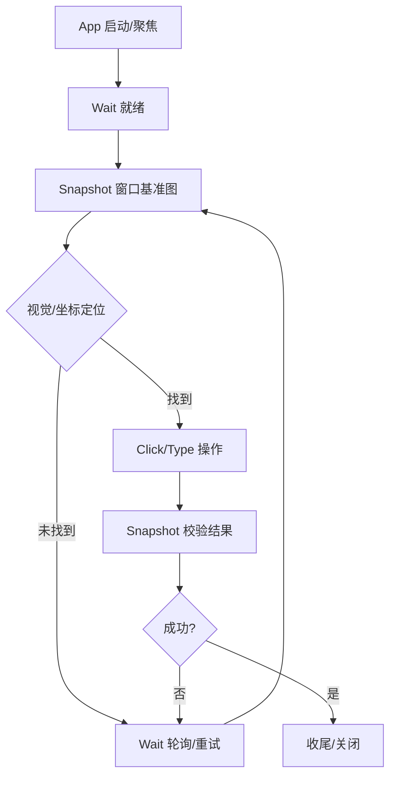

# Windows Desktop Automation Skill

## 核心工具链（windows-mcp）

| 工具 | 用途 | 关键参数 |
|------|------|----------|
| `App` | 启动/聚焦应用 | `app` (exe名或路径), `args`, `waitFor` |
| `Snapshot` | 窗口/屏幕截图 | `target` (window/desktop), `windowTitle`/`processName`, `region` |
| `Click` | 鼠标点击 | `x`, `y`, `button`, `clicks`, `target` (window/desktop) |
| `Type` | 键盘输入 | `text`, `keys` (组合键), `target`, `interval` |
| `Wait` | 显式等待/轮询 | `ms`, `condition` (脚本), `interval`, `timeout` |
| `Screenshot` | 全屏截图（快捷） | 同 Snapshot target=desktop |

> **约定**：优先用 `Snapshot(target=window, windowTitle=...)` 定位窗口内坐标；全屏坐标仅作兜底。

---

## 标准操作模式

### 1. 启动并聚焦应用
```json
{ "app": "notepad.exe", "waitFor": "ready", "timeout": 10000 }
```
- `waitFor: "ready"` 等主窗口出现；若应用启动慢，配合 `Wait` 轮询窗口标题。

### 2. 窗口截图 → 视觉定位 → 点击
```json
// 1. 截图拿窗口句柄与尺寸
{ "target": "window", "windowTitle": "记事本" }
// 2. 基于返回的 width/height 计算相对坐标
// 3. 点击（坐标相对窗口左上角）
{ "target": "window", "windowTitle": "记事本", "x": 100, "y": 50 }
```
- **坐标系**：`target=window` 时 x/y 相对窗口客户区左上角（不含标题栏）。
- **高 DPI**：返回的 `scaleFactor` 若 ≠1，坐标需乘以该因子。

### 3. 文本输入（含组合键）
```json
// 普通文本
{ "target": "window", "windowTitle": "记事本", "text": "hello", "interval": 20 }
// 组合键
{ "target": "window", "windowTitle": "记事本", "keys": ["ctrl", "a"], "interval": 30 }
// 组合键 + 文本
{ "target": "window", "windowTitle": "记事本", "keys": ["ctrl", "v"] }
```

### 4. 显式等待与条件轮询
```json
// 固定等待
{ "ms": 500 }
// 条件轮询（JS 表达式，可访问 windows-mcp 上下文）
{ "condition": "window.exists('记事本')", "interval": 200, "timeout": 5000 }
```
- 优先用条件轮询替代固定 `ms`，提升稳健性。

### 5. 多步流程编排模板


---

## 反模式与避坑

| 反模式 | 正确做法 |
|--------|----------|
| 硬编码绝对屏幕坐标 | 用 `target=window` + 相对坐标；多显示器/缩放下不漂移 |
| 全靠 `Wait {ms: 2000}` 盲等 | 用 `condition` 轮询窗口标题/控件出现 |
| 连续点击不间隔 | `Click` 间加 `Wait {ms: 100-300}` 留 UI 响应时间 |
| 忽略高 DPI 缩放 | 读 `Snapshot` 返回的 `scaleFactor`，坐标 × factor |
| 截图后不校验就下一步 | 关键步骤后 `Snapshot` 对比/OCR 确认状态 |

---

## 典型场景速查

| 场景 | 关键序列 |
|------|----------|
| 启动应用→输入文本→保存 | App → Wait → Snapshot → Type → Keys(ctrl+s) → Wait → Snapshot |
| 点击工具栏按钮 | Snapshot(窗口) → 计算按钮相对坐标 → Click → Wait → Snapshot 校验 |
| 处理弹窗确认 | Wait(condition=弹窗标题) → Snapshot(弹窗) → Click(确定按钮) → Wait 关闭 |
| 拖拽/选择区域 | Click(按下) → Wait → Type(键盘shift+方向键) 或 Click(移动到终点, button=left, down/up 分离) |
| 多窗口切换 | App(聚焦目标窗口) → Wait → Snapshot 确认 |

---

## 与其它工具协作

- **run_shell**：启动 CLI 进程、查进程 `tasklist | findstr notepad`、杀进程 `taskkill /IM notepad.exe /F`
- **host_access (read_file/write_file)**：读写配置文件、导出截图路径、记录坐标预设
- **mcp__windows-mcp__App (args)**：带参数启动（如 `chrome.exe --incognito --new-window https://example.com`）

---

## 调试技巧

1. **可视化调试**：每步 `Snapshot` 存盘，按时间序列回放定位偏移帧。
2. **坐标探测**：先 `Snapshot` 拿窗口矩形，用相对比例（如 0.5, 0.5 中心）点击，再微调。
3. **日志关联**：工具返回的 `windowHandle`/`processId` 关联 `run_shell` 进程查询。

---

## 维护清单

- [ ] 新增常用应用的窗口标题/类名预设（references/app-presets.md）
- [ ] 封装高频组合键为命名常量（references/key-combos.md）
- [ ] 记录典型分辨率/缩放下的坐标基准（references/coordinate-baselines.md）
