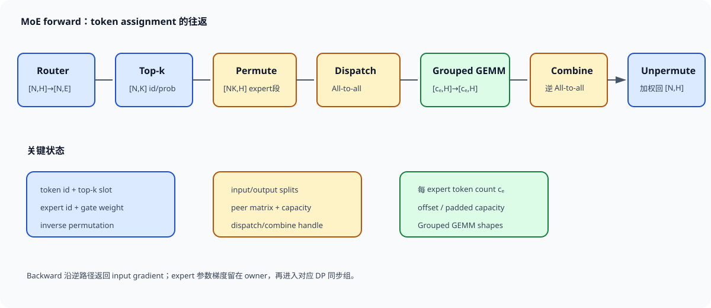

# 专家并行数据流

Mixture of Experts（MoE）层用 router 为每个 token 选择少量专家。参数总量可随专家数增长，而单 token 只激活 top-k 个专家；真正让这种稀疏计算跨设备运行的是 expert parallelism（EP）。专家分布在不同 rank，本地 token 按路由结果发送给 expert owner，计算后再返回原 rank 并按 gate 权重合并。

一层 MoE 的关键路径是 `router → top-k → permute → dispatch → grouped GEMM → combine → unpermute`。其中 dispatch/combine 是两次反向数据交换，permute/unpermute 是本地重排，grouped GEMM 的 shape 由每个专家收到的 token 数决定。任何一步的计数、offset 或所有者映射错误，都可能产生 shape 正常但 token 对错专家的静默错误。

*图 1：本地 token 经 top-k 扩展、按目标 expert 排序并 all-to-all，专家计算后沿逆映射返回。作者绘制。*

## 路由展开与数据重排

### Router 输出与 top-k 展开

设本地 token 数为 $N$，hidden size 为 $H$，全局 routed expert 数为 $E$，每 token 选择 $K$ 个专家。输入展平为

$$
X\in\mathbb{R}^{N\times H}.
$$

Router 通常是线性投影，产生 logits $R=XW_r\in\mathbb{R}^{N\times E}$。经过 softmax/sigmoid 与 top-k 后得到

$$
I,P\in\mathbb{R}^{N\times K},
$$

$I_{n,k}$ 是 expert id，$P_{n,k}$ 是 combine 权重。Top-k 将一个 token 扩展成 $K$ 条 assignment，未裁剪时总 assignment 数为 $A=NK$。原 token id 必须随 assignment 保存，供输出返回后 unpermute。

$N=8192,E=64,K=2$ 时有 16384 条 assignment。若 expert 完全均衡，每个 expert 收到 256 条；真实 router 会形成不均匀直方图 $c_e$，且 $\sum_e c_e=NK$。后续通信、GEMM 和显存都由 $\{c_e\}$ 决定，平均值不能描述最慢专家。

Top-k 输出按 token 排列，相邻 assignment 的目标 expert 通常不同。Grouped GEMM 需要同一 expert 的 token 连续，因此先按 expert id 排序或做 histogram/prefix sum，得到

$$
X_{perm}\in\mathbb{R}^{A\times H},
$$

以及每个 expert 的起止 offset。Permutation map 记录 $X_{perm}$ 的第 $j$ 行来自哪个 token、对应 top-k 槽位和 gate 权重。

若 expert 7 收到 300 条 assignment，它在 permuted buffer 中占一个 $[300,H]$ 连续片段。Grouped GEMM 读取 offset 数组，为多个 expert 执行不同 $M=c_e$、相同 $K=H$ 的矩阵乘。只保存排序后的 token 而漏掉 top-k 槽位，会在 combine 时无法区分同一 token 的两路专家输出。

Permute 是显存与带宽操作。BF16、$A=16384,H=7168$ 时，token buffer 约 234.9 MB；若输入、排序输出、通信 staging 同时存在，峰值可能超过两份。融合 permute 与通信打包能减少 HBM 往返，但逻辑索引仍需验证。

### Dispatch all-to-all 的 split size

设 EP size 为 $P_e$，每 rank 拥有 $E/P_e$ 个专家。根据 expert owner，把本地 permuted token 再按目标 rank 分段，形成 `input_splits[d]`：本 rank 要发给目标 rank $d$ 的 assignment 数。all-to-all 后，rank 收到所有 source 发给本地 experts 的 token，`output_splits[s]` 表示来自 source $s$ 的数量。

发送 hidden activation 的算法字节为

$$
B_{dispatch}=A_{remote}He,
$$

$A_{remote}$ 是目标 expert 不在本 rank 的 assignment 数。均匀路由且 expert 均匀分布时，本地比例约 $1/P_e$，所以

$$
\mathbb{E}[B_{dispatch}]\approx NK\left(1-\frac1{P_e}\right)He.
$$

上述 8192 token、top-2、$H=7168$、BF16、EP=8 的 dispatch 每 rank 约发送 $16384\times7/8\times7168\times2\approx205.5$ MB。Combine 返回同规模 expert output，forward 两次交换约 411 MB，backward 还有对应反向数据流。

Metadata 也要交换：expert id、source token/slot、split size 和可能的量化 scale。其字节通常小于 hidden activation，许多小元数据同步却可能引入 CPU barrier。高性能 dispatcher 尽量让计数和 offset 留在 GPU。

### 专家计算、回传与容量控制

Dispatch 后按本地 expert 重排，rank 上第 $j$ 个专家输入为

$$
X_j\in\mathbb{R}^{c_j\times H}.
$$

两层专家 MLP 可写为

$$
Y_j=W_{2,j}\,\phi(W_{1,j}X_j^\top),
$$

实际 kernel 使用 batch-major 布局。不同 $c_j$ 使每个 GEMM 的 $M$ 不同。逐 expert 发 kernel 会产生许多小调用，Grouped GEMM 将多个问题打包，减少 launch 开销并提高设备利用。

负载不均直接变成计算 straggler。八个本地 experts 的 token 数为 `[80,90,100,110,120,140,180,420]` 时，收到 420 个 token 的 expert，其 GEMM 规模是平均值 155 的 2.7 倍。Grouped GEMM 可改善调度，不能消除总 FLOPs 的不均；rank 仍要等最慢专家完成才进入 combine。

专家容量、FP8 对齐或 grouped kernel tile 可能要求 padding。将每个 expert pad 到容量 $C_e$ 后，计算量按 $E_{local}C_e$ 而非真实 token 数，负载更规则，padding FLOPs 可能很高。

### Combine 与 unpermute
Expert output 沿 dispatch 的逆路径 all-to-all 返回 source rank。返回 buffer 仍按 expert/peer 排列，unpermute 用保存的 inverse map 放回 $[N,K,H]$ 逻辑位置，再按 router 权重求和：

$$
Y_n=\sum_{k=1}^{K}P_{n,k}Y_{n,k}.
$$

若 gate 权重在 top-k 后重新归一化，combine 必须使用归一化值；若框架保留原概率，语义也要一致。一个 token 的某路 assignment 被 capacity 丢弃时，剩余权重是否重归一化会改变输出尺度。

Unpermute 索引错误常表现为 loss 能下降但样本间输出混合。小模型测试应让每个 expert 执行可识别函数，如 expert $e$ 给输入加常数 $e$，再逐 token 手算 top-k 加权结果。

容量公式必须先说明统计范围。若在 dispatch 前由每个 source rank 独立裁剪，那么某个 source 发往某个全局 expert 的容量为

$$
C_{src}=\left\lceil\gamma\frac{NK}{E}\right\rceil.
$$

$N=8192,K=2,E=64,\gamma=1.25$ 时，单个 source 对每个 expert 的容量为 320。EP 组有 $P_e$ 个 source 时，一个 expert owner 聚合后的均匀期望为 $P_eNK/E$，最坏预留可达 $P_eC_{src}$。若系统先获得整个 EP 组的全局计数再裁剪，则 owner 侧容量直接写成

$$
C_{owner}=\left\lceil\gamma\frac{P_eNK}{E}\right\rceil.
$$

两种做法的总上界接近，裁剪顺序和保留 token 却可能不同。Megatron-Core 中 capacity factor 为 `None` 表示不因固定容量丢 token；设置容量后还可选择按概率或位置丢弃，并可 pad 到容量。配置与日志应注明容量发生在 source-local 还是 owner-global 计数之后。

固定容量便于 static shape、CUDA Graph 与通信 buffer 预分配，但 padding 和 token loss 需要监控。单个 source 若为 64 个专家各保留 320 槽，总计 20480，相对本地 16384 assignment 多 25%；owner 汇总多个 source 后，Grouped GEMM 看到的容量还要乘参与 source 数。实际有热点 expert 超容量时，一边 padding 冷 expert，一边丢热点 token，两种浪费可同时发生。

训练与推理的策略可以不同。训练通常更重视不丢 token 和梯度语义；decode 为固定 shape 与低延迟可能接受容量上界或冗余部署。报告吞吐必须同时给 dropped-token rate 和 padding rate。

## 负载均衡与专家质量

Auxiliary loss 可根据 router 概率与实际分配惩罚专家不均，代价是改变优化目标。系数太小无法抑制热点，太大会迫使均匀路由并干扰专家分工。Router z-loss、input jitter 与 group-limited routing又处理不同问题，不能统称为一个 balance 开关。

DeepSeek-V3 报告使用 auxiliary-loss-free load balancing：为 expert 维护动态 bias，根据近期负载调节 top-k 选择，而不把平衡项直接加入主训练 loss。Megatron-Core 当前配置也提供 expert bias 与更新率。Bias 影响选择，router 原始 score 仍可用于 combine 权重；具体实现需核对。

监控至少包含每 expert token count、概率质量、capacity overflow、每 rank 总 token、GEMM 时间和跨节点字节。全局 expert count 均匀而 rank 总量不均，仍会形成通信/计算 straggler；rank 均匀而某 expert长期无人选择，则说明模型容量没有被有效使用。

### 并行坐标、拓扑与 DeepEP

EP 把不同 experts 分到 rank，TP 把同一 expert 的权重矩阵切分，DP 复制相同 expert shard处理不同数据。总布局必须明确 expert id→EP owner→TP shard 的映射。

Megatron-Core all-to-all dispatcher 可在 TP×EP 通信域组织 token 交换，使 dispatch 逻辑适应组合并行。若 expert tensor parallel size 大于 1，token 到达 expert owner 组后还要让 TP ranks 获得匹配输入；额外 all-gather 或 sequence-parallel 布局会增加通信。细粒度 MoE 常将 expert TP 设为 1，让 EP 直接拥有完整小专家，避免小 GEMM 再切窄。

DP 梯度同步只在拥有相同 expert/TP shard 的副本间发生。不同 expert 参数 shape相同也不能放进同一 DP group。共享 expert 通常在所有相关 rank 复制或采用独立并行布局，其计算可与 routed dispatch 重叠。

### 节点拓扑与 group-limited routing

跨节点 dispatch 的代价远高于机内 NVLink。若每节点八卡、EP=64，随机 top-k 会让多数 assignment 跨节点。Group-limited routing 先限制 token 可选择的 expert group/节点，再在组内选 top-k，可降低跨节点 fan-out，但也缩小每 token 的专家候选集。

发送量相同不代表代价相同。200 MB 集中发往一个 peer 与拆成 63 个小分片，启动和拥塞行为不同；热点 expert 所在节点可能同时接收许多 source。记录 peer matrix 才能看到 incast。

专家冗余部署可把热点 expert复制到多 rank，再动态选择副本。它以参数显存和权重同步换负载均衡，适合推理或稳定热点；训练时多个副本的梯度还要归并。

### DeepEP 的两种运行模式

DeepEP 是 DeepSeek 开源的 EP 通信库，提供面向训练与推理 prefill 的高吞吐 normal dispatch/combine kernel。它针对 NVLink 与 RDMA 非对称带宽组织转发，支持 FP8 dispatch，并减少 PyTorch Tensor 与通信 buffer 间复制。Megatron-Core FlexDispatcher 可选择 DeepEP backend。

Normal 模式的目标是大 token batch 吞吐。Dispatch 接收 hidden、top-k expert id/权重及计数信息，返回按本地 expert组织的 token、接收计数和用于 combine 的 handle。Combine 使用 handle 沿逆路径返回，避免重新构造完整路由元数据。

FP8 dispatch 可把 hidden 通信从 BF16 的 2 byte/element 降到约 1 byte/element，并携带 scale。前述 205.5 MB 期望发送量可降到约 102.8 MB，加上 scale与元数据。量化误差、scale粒度和 expert GEMM 输入格式必须与训练配置一致。

Low-latency 模式面向 decode：每 rank token 很少，启动延迟比大带宽更重要。它使用不同 buffer 布局与 kernel，通常预留更大的固定空间以换取稳定、少同步的路径。DeepEP 文档明确区分 normal 与 low-latency API；二者 handle、buffer 规划和适用 workload 不应混用。

Decode 中每个请求每步常只有一个新 token，batch 即便有数百请求，assignment 仍远小于训练 microbatch。Normal 模式为大消息优化的流水可能得不到充分利用；low-latency 模式通过固定上界、RDMA/NVLink 专用路径降低尾延迟。其内存消耗可能明显更高，容量按最大 tokens/rank、experts 与并发请求预留。

把 low-latency benchmark 数字直接用于训练会误导：训练关心持续 GB/s、overlap 与大 grouped GEMM，decode 关心单轮微秒级延迟和 p99。两套模式应分别验收。

取 16 个 rank、每 rank $N=4096$ token、$H=7168$、top-2、BF16、EP=16。均匀路由下本地 assignment 8192，远端比例 15/16。单向 dispatch 每 rank 约

$$
8192\times\frac{15}{16}\times7168\times2\approx110.1\ \text{MB}.
$$

Forward dispatch+combine 约 220.2 MB。若有效 all-to-all 带宽 50 GB/s，纯带宽下界约 4.4 ms；实际还包括 split 元数据、permute、同步和热点 peer。

显存同时存在原输入 58.7 MB、top-k 扩展/permute 117.4 MB、dispatch recv 约117.4 MB、expert中间激活以及 combine 输出。Expert FFN 中间维 $F=2048$，总本地 assignment 8192 时，BF16 中间值约 33.6 MB；SwiGLU 两路与 backward saved tensors 会增加倍数。通信 buffer 预留通常按容量上界，不按本 step 实收。

若最热 rank 收到平均的 1.8 倍，recv token buffer 与 grouped GEMM FLOPs 同时增至 1.8 倍，step 由它决定。平均字节模型需要再乘负载偏斜系数或使用 p95 count。

Combine 的 autograd 将 source token output gradient 按 top-k 路径分发回 expert owner。专家 MLP 计算本地 weight gradient 和 input gradient；input gradient 再经 dispatch 的逆通信返回原 token rank，并按同一 inverse permutation 与 gate 权重合并。

Router gradient取决于 combine 权重和选择语义。Top-k index 本身通常不可导，选中概率的梯度仍流向 router logits；aux loss 或 bias update另有路径。Forward 保存的 index、probability、split与permute map若在 backward 前释放或错位，会直接破坏梯度。

Gradient accumulation 多个 microbatch 时，expert参数梯度累加在 owner rank；DP 同步在累积边界执行。EP dispatch 每个 microbatch仍不可省，因为 token 的 expert owner不同。

All-to-all hang 先比较所有 rank 的 input/output split 总和、peer 顺序和通信 group。某 rank router产生 NaN，top-k id 越界或计数不同，会让其他 rank 等待。日志保存每层 $N,K$、expert histogram、peer matrix与 buffer capacity。

Loss 突变而通信正常时，检查 unpermute index、top-k weight、dropped-token mask。构造 expert 加常数的测试能快速发现 token串位；构造 identity expert可验证 dispatch/combine round trip逐元素一致。

吞吐低但网络带宽不满，可能是 permute HBM、CPU计数同步或小 grouped GEMM。网络满且 compute空闲，优化 dispatch或拓扑；compute长尾明显，则处理 router balance、capacity与expert placement。只报告 all-to-all 时间无法区分这些阶段。

OOM 随负载尖峰出现，检查 recv buffer、capacity padding、expert中间 activation与多个 in-flight microbatch。平均 count安全并不保证热点 step安全。

小规模用 $E=4,K=2,N=8$，为每个 token指定可手算路由。比较单卡顺序执行与 EP=2 的 forward、输入梯度、expert权重梯度和router梯度。测试重复 expert id、零 token expert、全部 token涌向一个 expert、capacity边界和丢弃策略。

性能测试分别记录 router/top-k、permute、dispatch、grouped GEMM、combine、unpermute。对每段报告字节、token count、p50/p95和overlap。Normal与low-latency使用各自真实 batch，不在同一图上只比较峰值带宽。

Checkpoint 改变 EP size时，expert参数按全局 expert id重分配，optimizer state与动态bias一起迁移。恢复后运行同一 batch，router选择、expert输出与一步更新应在容差内一致。

### 性能模型与运行时诊断
Router GEMM FLOPs 约为 $2NHE$。专家数很大时，router并非免费：$N=8192,H=7168,E=256$ 时约30.1 TFLOP，随后还要执行softmax/top-k。Router常用FP32 score提高选择稳定性，即使主干activation是BF16/FP8；低精度舍入可能交换top-k边界附近两个expert的次序，进而改变整条通信路径。

Top-k前后的概率语义要固定。Softmax over all experts后取top-k，与只对top-k logits重新softmax得到的combine weight不同。Group-limited gating还会先选expert group，再选组内experts。数值测试必须复现相同选择顺序、tie-break与归一化。

Router fusion将projection、score、top-k和辅助统计合并，减少中间$[N,E]$写回。Profiler里看不到独立top-k kernel时，不能据此认为路由成本消失，应从融合kernel时间与HBM流量核算。

## 流量矩阵与缓冲峰值

定义 $M_{s,d}$ 为source rank $s$ 发往destination rank $d$ 的assignment数。每行和为本地$NK$，每列和为目标rank收到的总量。均匀路由时各元素接近 $NK/P_e$；热点expert会让某一列明显增大。

八个rank每个有8192 assignment，平均每peer1024。若rank3一列收到16384而其他列约7022/7，rank3的recv、GEMM和combine发送都是平均两倍。全局网络总字节没变，step却由rank3决定。监控矩阵的行列最大值、变异系数和节点聚合，比只报all-to-all总量更能解释长尾。

跨节点拓扑还应把peer matrix聚合为node matrix。Group-limited routing可能让rank级不均仍存在，却显著减少跨节点非零边；收益落在RDMA而非总assignment数。

Forward峰值可近似写为

$$
M_{peak}=M_X+M_{perm}+M_{send}+M_{recv}+M_{expert\_act}+M_{combine}+M_{meta}+M_{workspace}.
$$

高性能实现会复用或别名其中部分buffer，不能默认全部相加，也不能只算recv。以每项hidden buffer117 MB、expert中间activation200 MB、workspace300 MB计，若输入/permute/send三份、recv、combine同时存在，峰值已约1.09 GB。FP8 dispatch只缩通信buffer，router输入与expert saved activation未必同步减半。

Low-latency DeepEP按上界预留slot，实际token很少时allocated仍可能很大。Normal模式的动态count则容易受热点step冲击。两种路径分别记录reserved capacity与实际used tokens。

### 重叠、丢弃与计算效率

Dispatch必须在expert GEMM前送达对应token，但不同expert/peer可分块流水。收到一部分expert token后即可启动该expert GEMM，同时其余peer仍传输。Combine也可在expert输出就绪后分块返回。Overlap要求offset、completion与buffer生命周期足够细粒度。

共享expert计算不依赖routed all-to-all，可与dispatch重叠。Megatron-Core提供shared-expert overlap；EP A2A overlap还可交错相邻microbatch并延迟wgrad。时间线重叠会争用SM、HBM与NIC，开启开关后需比较exposed time和GEMM吞吐，而非只看色块相交。

若dispatch 4 ms、expert compute 8 ms，理想流水接近8 ms而非12 ms。Overlap后compute降速到10 ms、通信降速到6 ms，总时间约10 ms，仍有收益；若共享资源使两者都到12 ms，重叠反而更慢。

被丢assignment可输出零、残差旁路或只保留其他top-k路径。Top-1 token被丢时，MoE分支可能完全没有专家贡献；top-2丢一路时，是否重归一化决定剩余输出放大。Dropped-token rate很低也可能集中在特定领域或长尾token，平均loss不足以判断影响。

测试为热点expert构造超过容量的确定性token，逐项检查保留顺序。`probs`策略应优先高score，`position`策略按出现位置截断；并列score的tie-break需可复现。Backward中被丢路径的expert与router梯度应符合定义。

专家FFN第一层每expert FLOPs约 $2c_eHF$，第二层同量，总计约 $4c_eHF$，SwiGLU还包含双投影。总FLOPs由$\sum c_e=NK$决定，但kernel效率受每个$c_e$影响。大量$c_e<tile_M$时，理论稀疏FLOPs低，硬件利用也低。

Padding到tile倍数可提升单kernel规则性。64个expert平均40 token，tile_M=64时全部pad到64，FLOPs放大60%；负载稍不均时部分expert到80并pad128，浪费更大。报告有效TFLOP/s时分子应区分真实token FLOPs与padding执行FLOPs。

Zero-token expert不能触发非法零维GEMM，也不应破坏offset。Grouped kernel的problem list需跳过或安全表示空expert，checkpoint/optimizer仍保留其参数。

Dispatch返回的handle封装combine所需路由：source/destination布局、offset与通信状态。它只对对应dispatch的token batch有效。跨microbatch复用、提前释放或在不同stream未等待完成，都可能把输出发回错误位置。

Normal dispatch/combine与low-latency API的handle结构和buffer计划不同。模式切换应在明确边界重新初始化，不能把normal handle传给low-latency combine。CUDA Graph捕获还要求metadata与buffer地址满足实现约束。

故障日志记录handle对应的layer、microbatch、token数、top-k与capacity。只记录Tensor地址难以判断它属于哪次路由。

64卡训练，EP=32、DP=2，每rank本地4096 token，top-4、$H=8192$、BF16。每rank assignment为16384，均匀远端比例31/32，dispatch约

$$
16384\times\frac{31}{32}\times8192\times2\approx260\ \text{MB}.
$$

Forward往返约520 MB。跨节点有效带宽40 GB/s给出13 ms纯带宽下界。若expert MLP为18 ms且可隐藏8 ms通信，裸露约5 ms；热点rank token为平均1.5倍时，compute升至约27 ms，通信与recv buffer也增大，step由热点控制。

改FP8 dispatch将activation字节约减半，纯带宽下界约6.5 ms。若量化/scale/permute增加1.5 ms，净节省约5 ms。Grouped GEMM仍使用BF16或FP8由专家配置决定，不能把通信dtype的收益重复算进compute。

每层保存router dtype、score函数、top-k、expert/group数、capacity/drop policy、dispatcher/backend、EP/ETP/DP组与expert placement。每step采样expert histogram、peer matrix、drop/pad、各阶段时间、buffer峰值和网络字节。

数值验收覆盖identity round trip、可识别expert、capacity溢出、零tokenexpert、跨EP重分片与backward。性能验收分别跑均匀合成路由和真实router，二者差值揭示负载与拓扑问题。长时间验收关注p95/p99而非平均step。

### 完整 Shape、分层通信与恢复

### 从 logits 到 capacity slot 的完整 shape

取 $N=4096,H=4096,E=32,K=2$。Router 输入 $X$ 为 `[4096,4096]`，logits 为 `[4096,32]`；top-k index 与 probability 都是 `[4096,2]`。展平后有 8192 条 assignment，token id、slot id、expert id、weight 均为 `[8192]`，复制或索引得到的 hidden 为 `[8192,4096]`。

EP=8 时每 rank拥有4个 experts。Histogram 得到32个$c_e$，prefix sum构造32段；再按owner汇总成8个`input_splits`。若目标rank计数为 `[960,1024,880,1100,980,1200,1000,1048]`，和为8192。BF16 send buffer仍是 $8192\times4096\times2\approx67.1$ MB，只是八段长度不同。

Capacity factor 1.25 给每个 source→expert 分段的容量

$$
C_{src}=\left\lceil1.25\times\frac{8192}{32}\right\rceil=320.
$$

Source 侧固定 slot 布局可表示为 `[32,320,4096]`，BF16 满容量约83.9 MB。真实 assignment 只有67.1 MB，padding上限增加25%。Dispatch 到 EP=8 的 owner 后，本 rank 四个 local experts 的 owner-global 上界为 `[4,2560,4096]`，因为每个 expert 最多从8个 source 各收320条；均匀期望仍是每 expert 2048条。Grouped GEMM 另带真实 count，避免把 padding 输出误当有效 token combine。若实现采用 owner-global 统一容量，直接按 `[4,C_{owner},4096]` 规划。

64卡、每节点8卡、EP=64时，可把expert owner写成 `(node,local_gpu)`。Dispatch先在节点内按目标node聚合，再由少量forwarder走RDMA，目标节点内再散到GPU。这样把大量细peer消息合成节点级大包，代价是额外机内转发与staging。

每rank发送260 MB、远端节点比例7/8时，跨节点约227.5 MB，机内目标约32.5 MB。八卡节点汇聚后理论跨节点总出流约1.82 GB。若八张卡共享两张NIC，每NIC至少承载约0.91 GB/轮；50 GB/s下仅带宽下界18.2 ms。只用单rank字节除NIC带宽会低估节点瓶颈八倍。

Group-limited routing把每token限制到两个expert nodes时，非零node peers从7降到最多2，incast与metadata减少；若热点集中到其中一node，列和仍可能失衡。节点peer matrix与expert histogram要一起看。

单expert第一层 GEMM `[c,H]×[H,F]` 的FLOPs约$2cHF$，读写至少包含权重$HF e_w$与activation$(cH+cF)e_a$。当$c$很小时，权重读取主导，近似算术强度

$$
I\approx\frac{2cHF}{HFe_w}=\frac{2c}{e_w}.
$$

BF16权重下$c=32$约32 FLOP/byte，$c=256$约256 FLOP/byte。热点expert虽然拖慢rank，却可能获得更高GEMM效率；冷expert的小矩阵浪费带宽与launch。Grouped GEMM共享调度开销，无法改变每块权重相对token太少的事实。

Padding从$c=33$到tile 64，执行FLOPs近乎翻倍。Profiler应同时报告真实assignment FLOPs、padded FLOPs与kernel TFLOP/s，否则高硬件利用可能来自计算padding。

### DeepEP 缓冲、通知与训练语义
DeepEP需要预先规划NVLink/RDMA buffer。容量由最大tokens/rank、hidden、top-k、expert数与dtype决定；normal模式偏向大吞吐，可让dispatch数据与combine handle在通信流异步执行。调用方必须等待返回event或notification，再让expert GEMM消费recv buffer。

Notification不是hidden payload，却决定每个peer有多少token、哪些offset已可用。Host提前读取计数会引入同步，完全忽略完成信号则可能读到尚未写完的数据。正确时间线是路由计数/布局准备、kernel发起、通知可见、消费者stream等待、grouped GEMM。

Low-latency路径为decode固定上界预留更大空间，并优化小批次通知与RDMA路径。它不保证训练大batch吞吐，buffer也可能远大于实际token。Normal与low-latency的内存预算、handle和验收指标分别记录。

Drop使某条expert路径输出消失。Top-2若丢一路并把剩余weight从0.6重归一为1.0，输出幅度与不重归一的0.6倍不同；残差能缓和幅度，却不能恢复丢失expert函数。Reroute到次优expert保留两路计算，但改变router选择的条件分布。

Capacity按position丢弃会偏向microbatch前部token；按probability保留高score会让低置信token更易丢。若数据按领域或长度排序，drop可能具有系统性偏差。训练日志除总rate外，还应按位置、领域和expert统计。

Router梯度也受策略影响。Hard drop路径没有expert梯度，gate是否仍收到梯度由实现定义；reroute则向替代expert与对应score传播。改变capacity不能只当系统参数，需要重新验证loss和收敛。

64张H100分8节点，EP=64、ETP=1、DP=1。每rank4096 token、top-4、$H=8192$，BF16 dispatch约260 MB，forward往返520 MB。Router有256 experts时logits `[4096,256]`，FP32约4.2 MB，体积不大但top-k与histogram仍有kernel成本。

假设normal DeepEP dispatch/combine各7 ms，permute/unpermute各1.5 ms，grouped expert GEMM 18 ms。无重叠总计35 ms；dispatch与shared expert遮蔽4 ms、combine与后续工作遮蔽2 ms后，裸露约29 ms。热点rank收到1.4倍token，GEMM升到25 ms且通信到9 ms，层时长可能升到38 ms，均衡收益大于单纯提高峰值带宽。

FP8 dispatch把payload约减半，通信各降到4.5 ms，但量化与scale增加1 ms。均衡情况下层时长可再降约3 ms；热点计算仍为25 ms，主要瓶颈转到load balance与expert placement。

上线前核对global expert id、owner node/GPU、EP/ETP/DP group；用identity expert验证dispatch/combine round trip；用可识别expert验证top-k与unpermute；用热点路由验证capacity、drop/reroute和buffer上界。

性能基线包含均匀、真实、极端热点三种router分布，分别记录peer matrix、node流量、permute、通信、GEMM、combine与显存。Normal训练/prefill和low-latency decode分开测试p50/p95/p99。

长跑监控expert使用漂移、动态bias、drop/pad、NIC拥塞、GPU降频和buffer high-water mark。Checkpoint演练改变EP size并继续一步；故障演练让一个rank延迟或退出，确认超时能报告layer、microbatch、peer与handle，而非只留下集体通信hang。

## 重算、恢复与优化顺序

Activation recompute 会再次执行 MoE forward。若 router 含 jitter、dropout 或动态状态，重算得到另一组 top-k，保存的 expert activation 与 backward 路径就不再对应。Router replay 保存或可复现路由决定，使重算阶段沿用同一 assignment，而不必保存全部专家中间 activation。

最小 replay 状态包括 top-k index、weight、capacity/drop mask，以及生成 permutation 所需的 token 顺序。$N=4096,K=2$ 时，int32 index 与 BF16 weight 约占 $4096\times2\times(4+2)=49$ KB，远小于 `[NK,H]` hidden buffer。若 group-limited gating 或动态 bias 在 forward 后更新，还要确保 replay 使用 forward 时的选择结果。

跨并行度复现不能依赖 local rank 随机种子。Token 的全局样本、位置、layer 和 microbatch 坐标应确定 router jitter/dropout 随机流。项目只要求统计等价时，也要保证 checkpoint 原布局恢复可重现下一步。

EP=8 时每 rank四个experts，改为EP=16后每rank两个。Checkpoint以全局 expert id和参数FQN定位，加载器读取对应权重、$m,v$、step与动态router bias，再切到新owner。按旧rank文件顺序平均拆分无法处理不连续placement或冗余experts。

Shared expert、router和norm可能按DP/TP复制，routed expert按EP分布。State dict元数据要区分这几类所有权。Optimizer state遗漏时，参数加载后的forward仍正确，下一步Adam更新会偏离，因此恢复测试必须执行至少一步。

动态expert placement若周期性迁移热点副本，还要在checkpoint记录逻辑expert到物理副本的映射与合并规则。恢复到静态布局时先还原逻辑参数，再重新选择副本位置，不能把两个冗余副本当作两个不同expert。

一层耗时可分为

$$
T_{moe}=T_{router}+T_{perm}+T_{dispatch}+T_{expert}+T_{combine}+T_{unperm}-T_{overlap}.
$$

若 router+permute 占 25%，更换通信库的上限只有剩余部分；expert长尾占40%时，平衡与placement优先于FP8 dispatch。Amdahl上限应使用裸露时间，已经被shared expert遮住的通信不再重复计入收益。

对每项优化保存前后peer matrix和$c_e$。吞吐提升伴随drop rate上升或router选择改变时，运行的训练目标已经变化；只有有效token、loss语义和数值检查一致，step time才可直接比较。

### 算子不变量与端到端验证

把 top-k 展开后的 assignment 编号为 $a=(n,k)$。Permute 映射 $\pi(a)$ 将 assignment 按 `(owner,expert)` 排序；dispatch 把排序后的行送到 owner。令 $D$ 表示这两个动作组成的稀疏置换算子，则 owner 侧输入为

$$
X_E=DX_A,
$$

$X_A$ 是按 assignment 展开的 token hidden。专家函数逐段作用，得到 $Y_E$。Combine 的通信和 unpermute 使用 $D^\top$ 返回 source：

$$
Y_A=D^\top Y_E,
\qquad
Y_n=\sum_{k=1}^{K}P_{n,k}Y_{A(n,k)}.
$$

若没有 drop 且每条 assignment 恰好出现一次，$D^\top D=I$。Identity expert测试令 $Y_E=X_E$，combine前的 assignment输出应恢复 $X_A$；再按 gate求和。Gate归一化满足 $\sum_kP_{n,k}=1$ 时，最终结果应等于原token hidden。

这个表示也给出 backward。Combine对 expert output gradient先乘 gate，再由 $D$送到owner；专家 input gradient经 $D^\top$回source，并对同一token的 top-k 路径求和。Permutation没有可训练参数，梯度只按逆映射移动。

某些 top-k 实现理论上不会为同一 token返回重复 expert id；自定义router或故障输入仍可能产生重复。系统要明确去重、合并权重或保留两条assignment。保留时，同一expert收到两份相同hidden，combine再按两份权重相加，计算重复但语义确定。

排序稳定性影响 capacity按position截断与确定性。相同 expert id的assignment若随并行kernel调度任意换序，超容量时保留集合可能变化。需要逐步复现时，排序键加入全局token id与 top-k slot，或使用确定性 tie-break。

本 rank dispatch payload为 $AHe$，其中本地 owner部分不经过网络。逻辑远端发送字节

$$
Q_s=\sum_{d\ne s}M_{s,d}He.
$$

每个 destination 的接收字节为 $Q_d=\sum_{s\ne d}M_{s,d}He$。全组网络 payload 是 $\sum_sQ_s$；链路实际字节还取决于 all-to-all算法、节点内转发和RDMA协议。不能把每rank平均字节再乘一个 ring系数，因为 all-to-all并不天然等同于 ring all-reduce。

Combine payload通常与 dispatch expert output同 shape，因此无drop、专家输出hidden仍为 $H$ 时逻辑字节相同。专家输出维变化、量化dtype不同或drop后只返回保留assignment时，二者需要分别计算。Backward的两次交换也按相应梯度dtype计数。

取8 rank、每rank8192 assignment、hidden4096、BF16。均匀时每rank远端7168条，单向约 $7168\times4096\times2=58.7$ MB。全组dispatch网络payload约469.8 MB。若节点级算法让数据经GPU→forwarder→NIC→forwarder→GPU，机内链路还会额外承载聚合与散播，NIC只看跨节点部分。

Source 的 `input_splits[d]` 必须等于 destination看到来自该source的 `output_splits[s]`。交换split metadata后可检查矩阵行列；hidden payload元素数为 split乘 $H$。任何rank使用不同 $K$、drop mask或expert owner表，都会让收发长度不匹配。

启动payload前断言 `sum(input_splits)=A_sent`，接收后断言 `sum(output_splits)=A_recv`，并核对全组发送总数等于接收总数。低延迟路径用固定slot时，真实count与capacity分开记录，不能把padding槽当有效assignment。

### Capacity 与并行布局

Capacity系统至少有 routed assignments、kept assignments与executed slots。前者为 $NK$；kept在drop后减少；executed slots若pad到capacity可能大于kept。定义

$$
r_{drop}=1-\frac{A_{kept}}{NK},
\qquad
r_{pad}=1-\frac{A_{kept}}{A_{exec}}.
$$

$r_{drop}=0,r_{pad}=20\%$ 表示训练语义完整但计算有padding；$r_{drop}=2\%,r_{pad}=0$ 表示没有padding却丢掉2%路由。只报capacity factor无法区分两种代价。

Source-local裁剪还要检查公平性。多个source都向热点expert发送320条时，owner收到均匀的每source配额；某source其实只有50条、另一source有500条，前者空出的270槽不能自动借给后者。Owner-global裁剪可在总容量内选择更高score assignment，却需要全局计数/排序或更复杂协调。

梯度累积每个microbatch独立routing时，capacity通常按本microbatch token计算。把四个microbatch合并路由可共享容量并降低局部方差，却要求更大的dispatch buffer并改变流水。Capacity factor相同，microbatch越小，count随机波动相对越大，drop率可能上升。

比较配置时固定有效token与microbatch划分；若扩大microbatch后drop下降，收益来自统计平滑，不能全部归给dispatcher。Router balance损失也按其定义的token范围计算。

设 expert tensor parallel size为 $T_e$、expert parallel size为 $P_e$。一个expert由 $T_e$ 个rank共同保存时，dispatch后token有两种进入方式。第一种先把同一expert输入复制/all-gather给它的 $T_e$ 个TP rank，每个rank计算权重shard；第二种让token activation本身按sequence维分给TP rank，并在专家MLP边界做sequence-parallel通信。

复制输入时，EP all-to-all只需把assignment送到一个expert group逻辑owner，随后组内broadcast/all-gather。若dispatcher直接把同一token发给 $T_e$ 个rank，网络payload会乘复制因子。Sequence-parallel布局避免完整复制常驻，却增加group内all-gather/reduce-scatter。

专家第一层 column-parallel产生 $F/T_e$ hidden shard，第二层 row-parallel输出局部 $H$贡献并规约。Expert token数 $c_e$ 小时，GEMM宽度和M维都被切小，collective相对开销很高。因此细粒度小expert常取 $T_e=1$；单个expert参数过大或token足够多时，$T_e>1$ 才有容量与算力收益。

拥有同一 global expert id与同一 $T_e$ shard坐标的rank才是参数副本，构成DP group。Expert 7的TP shard0不能与Expert 8的shard0规约，即使shape相同。Group manifest保存 `(expert_id,tp_coord,replica_id)` 到rank映射。

Shared expert若在所有EP rank复制，其DP group可能跨整个EP维；routed expert只在对应owner的副本间同步。混用同一bucket前先按所有权分类，否则collective参与者不一致。

### 负载分层与 Grouped GEMM

Expert不均看 $c_e$；rank不均看本地experts之和 $C_r=\sum_{e\in r}c_e$；node不均看同节点rank总和。三者需要分别优化。Expert count偏斜但热点experts分散到不同rank时，rank总量可能平衡；expert均匀却placement不均或shared expert配置不同，rank仍可能偏斜。

定义 rank imbalance

$$
\rho_{rank}=\frac{\max_r C_r}{(\sum_rC_r)/P_e}.
$$

$\rho=1$ 理想均衡，1.5表示最热rank比平均多50% assignment。Compute时间并不严格线性于 $C_r$，因为不同expert的小GEMM效率不同；再记录每rank padded FLOPs与实测时间。

Peer不均由 $M_{s,d}$ 的最大列、最大元素与非零peer数描述。Rank count均衡时，某destination仍可能从大量source接收许多小包，延迟高于少数大包。Node matrix进一步揭示RDMA incast。

长期热点可把experts重新放置，使同一rank的 $C_r$ 更均衡，或把相关路由expert靠近source。训练中迁移expert需要转移参数、optimizer state和动态bias，并在一致step切换owner；短期热点可能在迁移完成前已经消失。

冗余expert副本适合稳定热点。Router/dispatcher选择副本，多个副本梯度在更新前合并，参数版本保持一致。容量收益以额外权重和optimizer state为代价，Checkpoint记录逻辑expert与副本关系。

对本地 $E_l$ 个experts，第一层问题列表为 $(c_j,H,F)$，第二层为 $(c_j,F,H)$。SwiGLU第一层输出常为 $2F$ 或两个 $F$投影，执行FLOPs约比单激活MLP更高。报告必须用模型实际 $F$ 定义，不能把SwiGLU双分支漏掉。

将counts `[0,7,33,64,129]`、tile $M=64$ 时，若逐expert向上pad，执行rows为 `[0,64,64,64,192]`，真实233行、执行384行，padding率约39.3%。Grouped kernel也可能采用更灵活persistent调度，不等同于每problem独立pad；从profiler或kernel文档确认。

权重读取量为各非空expert的 $HF$ 主项。Token数很少时算术强度低；合并多个expert不能共享不同权重。Expert缓存驻留L2的程度、权重dtype与局部性影响吞吐。热门expert有更大M，往往单位token更高效，但拖慢全局同步。

Count为0时offset仍要保持单调，problem list可跳过该expert。Optimizer state和权重不会因此消失；长期zero-token意味着router没有使用容量，属于模型信号。若动态参数使用要求unused检测，所有rank仍要保持collective顺序。

按peer或expert分块到达后，可提前启动已完整expert的GEMM。若expert 3预计从8个source接收token，只收到前4个source就开始，后续token需要第二次GEMM并在输出offset合并；这可以工作，却增加kernel并改变padding。等待该expert全部source完成只需一次GEMM，但启动更晚。

Chunked overlap在通信块与GEMM tile之间选择粒度。块太大，隐藏窗口小；块太小，notification、launch和小GEMM开销增大。对真实 $c_e$ 分布扫chunk上限，报告exposed通信、GEMM效率和buffer峰值。

Combine同理：某expert输出完成即可返回对应source，但source token的top-k路径全部到齐后才能最终加权输出。为每个token维护pending count，归零才释放到后续层。提前消费缺一路的输出会产生时序相关错误。

Shared expert读取所有本地token，不依赖routed dispatch，可与all-to-all重叠。它和dispatcher同时读activation并写输出，争HBM/SM。独占时shared compute 6 ms、dispatch 5 ms，重叠后分别8 ms与7 ms，阶段为8 ms，比串行11 ms快；若都变11 ms则没有收益。

融合输出前要等shared与routed两路完成。监控分别记录两路event，避免把shared变慢误判成combine通信。显存加入两路中间activation同时存活的峰值。

MoE backward包含 expert parameter gradient、expert input gradient、gate weight gradient与router auxiliary/bias路径。Expert output梯度 $dY_n$ 对 assignment $(n,k)$ 的贡献为 $P_{n,k}dY_n$；同时 gate梯度包含内积

$$
\frac{\partial L}{\partial P_{n,k}}
=\left\langle dY_n,Y_{n,k}\right\rangle.
$$

因此 backward需要 expert输出或可重算信息，不能只保留index。Top-k外expert通常没有主任务梯度；aux loss可对更广router概率产生梯度。动态bias若按计数更新而非梯度下降，属于另一状态路径。

Expert input gradients沿inverse dispatch回到source，对同一token top-k路径求和后进入前层。Gate乘法若在source combine执行，反向乘权也在source；若融合到owner端，通信payload和保存状态不同，数学结果保持一致。

Capacity drop使对应路径的expert输出与梯度缺失。剩余gate重归一化时，归一化导数会耦合保留路径；只在forward改权重、backward仍按原概率会造成错误。小规模手算同时比较router logits梯度。

### 容量案例、交付不变量与错位定位
取EP=8，每source $N=4096,K=2,E=32,H=4096,F=14336$、BF16，source-local $\gamma=1.25$。每source assignment8192，$C_{src}=320$。每expert均匀从8个source收到2048条，owner上4个experts共8192条；owner-global上限每expert2560条。

Hidden dispatch真实均匀recv约 $8192\times4096\times2=64$ MiB。若按上限预留，recv为 $4\times2560\times4096\times2=80$ MiB。SwiGLU两路中间若为 $2F$，真实assignment的BF16主项约 $8192\times2\times14336\times2\approx448$ MiB，明显大于dispatch buffer；backward保存策略继续影响峰值。

某rank收到平均1.5倍token时，真实recv约96 MiB，expert中间主项约672 MiB。若buffer只按均匀64 MiB分配会溢出；按80 MiB固定capacity则在drop前截断，语义变化。Dynamic no-drop路径需按测得p99或可增长allocator留余量。

通信方面，均匀远端比例7/8，source dispatch约56 MiB，combine同量；forward112 MiB。Backward若hidden梯度同dtype再往返112 MiB，整层约224 MiB/rank逻辑远端payload，未计metadata和分层转发。

计数不变量：每个source的kept assignment等于其input splits之和，每个destination接收数等于output splits之和，全组发送总数等于接收总数。索引不变量：每条kept assignment的 `(global_token,slot,expert)` 在round trip后保持一致。

数值不变量：identity experts且gate和为1时输出等于输入；可识别expert函数与手算combine一致；backward的input、expert weight和router gradient与单卡参考在容差内一致。容量不变量：drop、pad、executed三类count能复算，buffer上界覆盖声明策略。

并行不变量：expert owner、ETP shard与DP replica group映射唯一；Checkpoint按global expert id恢复参数、optimizer与bias；改变EP后下一步结果仍与参考一致。四类不变量进入自动测试后，性能调优才不会用更快的错误路径替代原训练语义。

端到端测试可以给第 $n$ 个 token 的第 $k$ 条路由写入唯一编号 $u=nK+k$，再让第 $e$ 个专家返回一个容易辨认的仿射结果，例如 $z=1000e+u$。Combine 后若数值落到了别的 token，便能从结果直接反推出错的是 expert 映射、source rank，还是 top-k slot。这个办法比只比较最终张量的最大误差更有用：两条路径恰好交换、随后又被相同 gate 相加时，最终误差可能为零，编号检查仍能发现 permutation 已经损坏。

边界样例包括：某个 expert 收到零条、某个 source 只向一个 peer 发送、同一 token 的两条路径分居两个节点，以及尾部 microbatch 的 token 数少于常规值。每个样例同时保存 dispatch 前后的编号序列、split 向量和 inverse map。这样一旦扩容、修改路由核或更换 all-to-all 实现，问题会停在第一处失去可逆性的边界，而不会等到 loss 异常后再猜是哪一段通信出了错。

这些检查应在单机、跨节点和改变 EP 大小后三种布局中重复。单机结果正确，只能证明索引与局部 kernel 基本成立；跨节点会加入 split 交换、转发和异步通知；改变 EP 大小则会触发 expert owner 重映射与 checkpoint 重分片。三种路径使用同一批可识别输入，差异才容易定位。

## 参考资料
- [Megatron-Core Mixture of Experts](https://docs.nvidia.com/megatron-core/developer-guide/latest/user-guide/features/moe.html)
- [Megatron-Core Token Dispatcher API](https://docs.nvidia.com/megatron-core/developer-guide/latest/apidocs/core/core.transformer.moe.token_dispatcher.html)
- [DeepEP 官方仓库](https://github.com/deepseek-ai/DeepEP)
- [DeepSeek-V3 Technical Report](https://arxiv.org/abs/2412.19437)
- [Auxiliary-Loss-Free Load Balancing](https://arxiv.org/abs/2408.15664)
