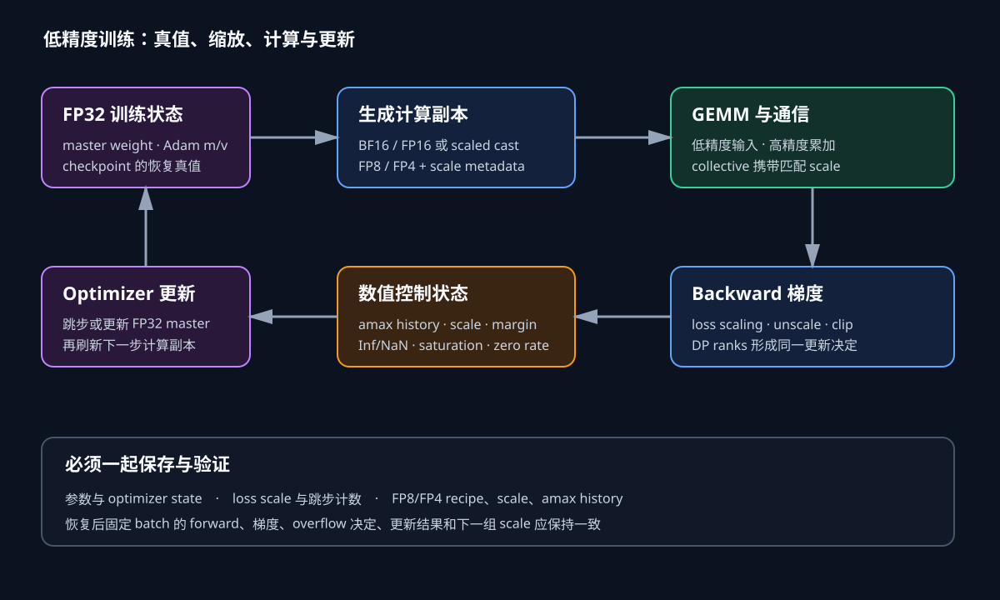

# 数值格式与缩放

低精度训练的速度来自更小的读写字节和更高的矩阵乘吞吐，风险则来自有限范围与粗糙分辨率。一个张量能装进某种格式，只说明它没有立即变成 Inf；许多小值被舍入为零、更新小于参数的 ULP、离群值挤占整个张量的可用刻度，同样会悄悄改变优化轨迹。

训练系统需要为每个张量回答四件事：存储格式是什么，计算时怎样累加，是否带 scale，谁保存可恢复的高精度状态。下面沿参数、activation、梯度、collective 和优化器更新追踪这些选择。

*图 1：FP32 master weight 与优化器状态位于更新路径，BF16/FP16/FP8/FP4 副本服务于计算和通信；amax、scale 与溢出标志构成额外状态。作者绘制。*

## 浮点数怎样花掉有限位数

二进制浮点数由符号、指数和尾数组成。正规数可写成

$$
x=(-1)^s\left(1+\frac{f}{2^p}\right)2^{e-b},
$$

其中 $p$ 是尾数位数，$b$ 是指数偏置。指数控制可表示的数量级，尾数控制同一数量级内相邻数的距离。数值从 1 增长到 2 时指数不变，相邻间隔约为 $2^{-p}$；跨过 2 后间隔也翻倍。因此“保留三位小数”并不是浮点格式的固定属性，绝对精度会随数量级变化。

| 格式 | 符号/指数/尾数 | 最大有限值 | 1 附近间隔 | 常见角色 |
|---|---:|---:|---:|---|
| FP32 | 1/8/23 | 约 $3.4\times10^{38}$ | $2^{-23}$ | master weight、优化器状态、累加与归约 |
| FP16 | 1/5/10 | 65504 | $2^{-10}$ | 旧式混合精度计算、梯度 |
| BF16 | 1/8/7 | 约 $3.4\times10^{38}$ | $2^{-7}$ | 训练计算基线 |
| FP8 E4M3 | 1/4/3 | 448 | 约 $2^{-3}$ | 前向 activation、权重 |
| FP8 E5M2 | 1/5/2 | 57344 | 约 $2^{-2}$ | 动态范围更大的梯度 |
| FP4 E2M1 | 1/2/1 | 编码范围很窄 | 离散值极少 | 必须配合细粒度缩放 |

FP16 最小正规数是 $2^{-14}\approx6.10\times10^{-5}$，最小次正规数是 $2^{-24}\approx5.96\times10^{-8}$。硬件或 kernel 若把次正规数 flush to zero，实际可用下界会更高。BF16 与 FP32 共享 8 位指数，范围宽得多；代价是尾数只有 7 位，数值 1 附近小于约 0.0078125 的增量可能无法单独体现。

### FP16 与 BF16 的取舍发生在哪里

设参数值为 1，优化器想加 $10^{-4}$。FP16 在 1 附近间隔约 $9.77\times10^{-4}$，BF16 约 $7.81\times10^{-3}$，直接写回两者都可能丢掉这次更新。可见 BF16 的大范围并不等于更适合保存小更新；它的优势主要是大值不易溢出，参数更新仍需要 FP32 master weight 或其他补偿机制。

再看梯度 $10^5$。FP16 最大有限值 65504，未缩放就会溢出；BF16 可以表示这个数量级。反过来，同为 1 左右的 activation，FP16 尾数比 BF16 多三位，能分辨更细的差异。工程上通常以 BF16 作为稳健基线，因为深度网络更常被动态范围击穿，矩阵乘累加和优化器更新仍可留在 FP32。

“BF16 不需要 loss scaling”是常见经验，不是格式保证。极小梯度仍可能在 BF16 的局部精度或后续 cast 中消失；某些自定义 kernel、归约路径和优化器也有独立约束。判断依据应是梯度零值率、更新范数和有限性，而非只看 loss 有没有 NaN。

经典混合精度训练保留 FP32 master weight $w_{32}$，每步生成低精度计算副本 $w_c$：

$$
w_c=\operatorname{cast}(w_{32}),\qquad y=\operatorname{GEMM}(x_c,w_c).
$$

反向得到梯度后，优化器在 FP32 中维护 Adam 状态

$$
m_t=\beta_1m_{t-1}+(1-\beta_1)g_t,
$$

$$
v_t=\beta_2v_{t-1}+(1-\beta_2)g_t^2,
$$

$$
w_{32,t}=w_{32,t-1}-\eta\frac{\hat m_t}{\sqrt{\hat v_t}+\epsilon}.
$$

更新完成后再刷新 $w_c$。这样，小更新先在 FP32 master 中积累，累计到足够大时才反映到低精度副本。若模型框架把 BF16 参数本身当唯一真值，则要确认优化器是否以 FP32 状态进行补偿，以及 checkpoint 保存的是哪一份。

70 亿参数的 Adam 训练可做一笔直接估算：BF16 计算参数 14 GB，BF16 梯度 14 GB，FP32 master weight 28 GB，一阶矩 28 GB，二阶矩 28 GB，共 112 GB。若梯度也保留 FP32则再增加 14 GB。ZeRO/FSDP 可以分片这些状态，低精度只改变每份状态的字节，不会自动改变所有权。

### Loss scaling 把小梯度搬进 FP16 范围

设原 loss 为 $L$，缩放后 $L'=s_LL$。链式法则给出

$$
\frac{\partial L'}{\partial w}=s_L\frac{\partial L}{\partial w}.
$$

反向时先让小梯度乘上 $s_L$，避开 FP16 下溢；进入优化器前再除以 $s_L$。假设真实梯度为 $10^{-9}$，取 $s_L=2^{15}=32768$，缩放梯度约 $3.28\times10^{-5}$，仍处于 FP16 次正规区；取 $2^{20}$ 时约为 $1.05\times10^{-3}$，进入稳定得多的正规区。若同一批另有真实梯度 0.1，乘 $2^{20}$ 得 104857，会超过 FP16 的 65504。Scale 必须在保小值与防大值溢出之间移动。

动态策略通常维护当前 scale、连续成功步数和增长/回退规则。一次 backward 后，所有梯度先检查有限性。任何数据并行 rank 发现 Inf/NaN，都要通过归约形成全局标志，整组 rank 一起跳过 optimizer step，并降低 scale。若只有局部 rank 跳步，其参数从这一刻开始不同，下一次 collective 可能把错误扩散为难以定位的 loss 抖动。

梯度裁剪应使用 unscale 后的真实梯度范数，否则阈值也要随 $s_L$ 改变。梯度累积则必须保证多个 microbatch 使用兼容的 scale；中途调整 scale 时，要么清空已有累积，要么把各部分转换到共同尺度。把 unscale、clipping、all-reduce 和 overflow check 的顺序写成明确数据流，比配置一个 `mixed_precision=true` 更重要。

E4M3 用更多尾数换精度，最大有限值 448；E5M2 用更多指数换范围，最大有限值 57344。Transformer Engine 的 HYBRID 配方常让前向使用 E4M3、反向梯度使用 E5M2。这里的“使用”包括 scale、cast、GEMM 和反量化语义，内存里的 8 位编码本身没有完整物理值。

采用乘法 scale 约定时，量化可写成

$$
s=\frac{2^{-m}M}{a_{max}},\quad q=\operatorname{clip}(\operatorname{round}_{F}(sx)),\quad \hat x=q/s,
$$

$M$ 是格式最大有限值，$m$ 是 margin。某 E4M3 张量的 $a_{max}=100$，margin=0，则 $s=4.48$，数值 20 映射到 89.6 附近的 FP8 编码区间，反缩放后回到约 20。margin=1 时目标上界降至 224，$s=2.24$，给下一步分布增长留出一倍空间，同时牺牲部分小值分辨率。

不同库也可能保存反向 scale，即直接存 $a_{max}/M$ 并用除法量化。配置、日志和 checkpoint 必须标明约定；只看到 `scale=0.223` 无法判断应该乘还是除。

Tensorwise scaling 为整个张量保存一个 amax。假设 1024 个值大多位于 $[-1,1]$，只有一个离群值 1000。E4M3 的 scale 为 $448/1000=0.448$，普通值 0.01 被送到 0.00448 附近，可能落入很粗的编码区域甚至归零。离群值虽然没有饱和，却夺走了绝大多数值的有效刻度。

若把离群值所在区域与普通区域分成 block，普通 block 的 amax 为 10，则 scale 为 44.8；同一个 0.01 会映射到 0.448，拥有更多可用编码。Block scaling 用额外 scale metadata 和更复杂布局换取局部动态范围。Transformer Engine 的 blockwise FP8 常见 activation/gradient 使用 $1\times128$ 分块，权重使用 $128\times128$ 分块；MXFP8 则以 32 个连续值共享 scale。具体形状属于配方，不能把“FP8”当成唯一方案。

Per-channel scaling 位于二者之间。权重按输出通道缩放常与 GEMM 布局自然配合；activation 的通道维、token 维或 reduction 维各有不同访存代价。Scale 粒度还决定并行语义：TP 切分 reduction 维时，本地 amax 是否要跨 TP 组归约，取决于 scale 对应的是全局张量还是本地 shard。

### Delayed scaling 为什么需要历史
当前张量的 amax 只有扫描或计算它以后才知道。若 scale 必须先于 GEMM 准备好，就可以用前几步历史估计当前范围。Delayed scaling 保存长度为 $h$ 的 amax history，通过最近值或窗口最大值计算下一步 scale：

$$
a_t^*=\max(a_{t-h+1},\ldots,a_t),\qquad s_{t+1}=\frac{2^{-m}M}{a_t^*}.
$$

窗口最大值对突然变小的分布较保守，scale 恢复得慢；只用最近值反应快，也更容易被噪声推动。假设过去 amax 都在 10 左右，E4M3 scale 约44.8，当前突然出现 1000。旧 scale 会把 1000 映射到44800并裁到448，反量化后只有10，严重饱和。当前 amax 被写入历史后，下一步 scale 才降到0.448。Margin 能缓冲一定突增，却不能吸收百倍变化。

Delayed scaling 的优势是 amax 统计、scale 更新和主计算更容易流水化。代价是 scale 成为跨 step 状态。Activation recompute 若重新执行前向，必须恢复原前向使用的 scale 和 amax 更新位置；重算时再次推进 history，会让同一层第二次计算得到不同结果。Checkpoint 同样要保存 history、当前位置、margin、算法和格式配方。

E2M1 只有 1 位尾数和很小的指数域，常见非负有限值集合非常稀疏，例如 0、0.5、1、1.5、2、3、4、6。单一张量 scale 无法同时覆盖离群值和微小值。NVFP4 等方案因此把四位元素与 block scale 绑定，并保留更高精度累加、部分高精度层和训练配方。

假设一个 block 的值为 `[0.1,0.2,0.4,0.8,1.6,3.2]`，若最大值 3.2 映射到 E2M1 的 6，scale 为1.875。0.1 乘 scale 得0.1875，离最近非零档位0.5仍很远，可能量化成0；若另一个 block 最大值只有0.4，scale为15，0.1映射到1.5，便可准确得多。四位训练的成败很大程度上取决于 block 内分布，而非只取决于全局 amax。

FP4 当前通常绑定 Blackwell 级硬件和具体软件版本。首层、末层、归一化、softmax、router 或异常值明显的算子可保留 BF16/FP8。计算占比高、分布合适的 GEMM 承担四位计算，敏感而 FLOPs 很少的部分留在更宽格式，这才构成有明确边界的混合精度配方。

### Cast、GEMM 与累加器的真实路径
一次线性层前向可拆为：读取高精度或 BF16 参数，获得权重 scale 与 activation scale，执行 fused cast/transpose，低精度 GEMM，在 FP32 或规定的高精度累加器中求和，再按输出配方写回。若输出还要进入残差相加或归一化，常先转回 BF16。

低精度输入不等于低精度累加。点积

$$
y_i=\sum_{j=1}^{H}x_jw_{ij}
$$

可能包含数千项。每项只有 FP8 精度已经带来输入误差，若部分和也用 FP8，舍入会随 $H$ 快速积累。Tensor Core 通常把乘法输入设为低精度、累加留在 FP32 或更宽路径，再在写回时 cast。文档中的“FP8 GEMM”必须同时记录 input、accumulator 和 output dtype。

Cast 不是免费操作。独立读取 BF16 张量、统计 amax、写 FP8、副本转置，再启动 GEMM，会增加数次 HBM 往返。成熟实现把 amax 收集、cast、transpose 或激活函数融合进相邻 kernel。Profiler 应把 cast 与 scale update 放进端到端层时长，不能只比较 GEMM 峰值。

数据并行梯度 all-reduce 可以使用 BF16/FP16 payload，也可采用更激进的压缩；归约累加格式和误差反馈决定结果。FSDP 参数 all-gather 若传 FP8/FP4，接收端需要对应 scale，并在 GEMM 前恢复正确布局。TP 的 all-gather/reduce-scatter位于层内关键路径，节省字节收益明显，也最容易把 scale 同步放到延迟路径上。

Scale 属于谁要随张量分片定义。若每个 FSDP shard 独立量化，all-gather 后得到多个 scale 分段；GEMM kernel必须识别这些边界。若先求全局 amax再用一个 scale，所有 rank要多一次归约，并让最极端 shard支配精度。两种方案都合理，语义和成本不同。

MoE token dispatch 的 activation scale还会随 source rank或token block传播。接收端按expert重排后，原block边界可能被打散；dispatcher要么连同scale metadata一起重排，要么在发送前转成共同格式。只计算 hidden payload 字节，会遗漏scale、offset与重排成本。

## 溢出、下溢与饱和怎样区分

Inf/NaN 是最显眼的失败。检查顺序应沿数据流定位：输入是否有限，cast 前 amax 是否异常，量化饱和比例是否升高，GEMM accumulator 是否溢出，反量化 scale 是否为零或过期，loss unscale 后梯度是否有限。最终 loss 出现 NaN 时，根因可能已发生在数层之前。

下溢更安静。梯度张量的零值比例突然上升、低分位绝对值贴近格式下界、参数更新范数下降而 loss 尚未异常，都是信号。对同一 batch 保存 FP32/BF16 参考梯度，比较 cosine、相对误差和逐层零值率，可以区分真实稀疏梯度与量化归零。

饱和是 FP8/FP4 特有的重点指标。值被 clip 到最大编码后仍然有限，有限性检查不会报警。每层记录 `amax / representable_limit`、最大编码占比和 scale变化，比只看 NaN 更早发现问题。Delayed scaling 下应同时画当前 amax、历史 amax和实际scale，才能看出一步延迟造成的裁剪。

### 一次完整手算

考虑四个 activation：`[0.02, -0.5, 3, 20]`，用 E4M3、margin=1、tensorwise current scaling。Amax为20，目标上界为224，因此

$$
s=224/20=11.2.
$$

缩放后是 `[0.224,-5.6,33.6,224]`。它们分别舍入到 E4M3 可表示值 $q_i$，反缩放得到 $q_i/11.2$。最大值拥有完整安全余量，小值0.02的误差占比最大。若张量中加入离群值2000，scale降到0.112，原来的0.02缩放后只有0.00224，很可能消失。这正是细粒度scale处理离群值的原因。

反向设真实梯度 `[10^{-9},10^{-6},10^{-3},0.05]`，FP16 loss scale取 $2^{20}$。缩放值约为 `[0.00105,1.0486,1048.6,52428.8]`，都低于65504；有限性检查通过，梯度除回原尺度，再执行裁剪和Adam更新。若末项变为0.1，缩放值104857.6溢出，该step各rank统一跳过，scale例如回退到$2^{19}$。

设参数为1，Adam给出更新$3\times10^{-4}$。直接写BF16参数时，小于1附近半个ULP，可能仍为1；写入FP32 master得到0.9997，计算副本暂时舍入为约1。之后多个同向更新累计，低精度副本才发生可见变化，而master保存了中间进度。

可继续训练的 checkpoint 至少包括高精度参数真值、optimizer $m,v$、optimizer step、学习率日程、loss scale及其增长计数、每层FP8/FP4 scale、amax history、history索引、margin、格式配方和scale粒度。模型权重能推理，不代表能无缝续训。

若只恢复参数而重新初始化 delayed-scaling history，最初几步的scale可能由默认值决定，造成短暂饱和或过度保守。若数据并行规模变化，scale state按张量语义重分配，而非按旧rank文件原样复制。Tensorwise全局scale可以广播；blockwise scale随参数block一起重分片。

恢复验收使用固定batch比较恢复前后下一步：forward输出、loss、梯度、溢出决定、参数更新和新scale均应在配方容差内一致。只比较加载后的参数哈希，抓不到optimizer和amax状态缺失。

### 重算、流水线与 microbatch

Activation checkpointing 在 backward 时重算前向。重算必须使用原前向的权重版本、随机状态和scale状态。若第一次前向更新了amax history，重算又更新一次，后续microbatch会看到被推进两次的scale；即使loss暂时正常，执行顺序已影响数值。

流水线并行让多个microbatch交错。Delayed scaling若按层共享状态，需要规定scale按哪个逻辑step更新：每microbatch、每optimizer step，还是按流水线调度中的调用次数。相同模型在1F1B与非交错调度下，不应只因调用顺序不同就采用另一套隐式配方。

梯度累积也会延迟optimizer更新。Loss scale溢出发生在末个microbatch时，前面累积的梯度一并作废。提前归约或写入optimizer状态的实现需要明确提交边界；发生跳步时，未提交的中间状态随该step撤销。

| 现象 | 优先检查 | 常见原因 |
|---|---|---|
| loss突然NaN | 第一处非有限张量、loss scale、accumulator | FP16溢出、scale反向、除零 |
| loss正常但收敛慢 | 梯度零值率、更新/参数范数 | 下溢、master weight缺失 |
| FP8最大编码占比升高 | 当前/历史amax、margin | delayed scale未跟上分布突变 |
| scale周期性剧烈摆动 | amax算法、增长/回退窗口 | 单个离群batch主导 |
| 多卡参数逐步分叉 | overflow all-reduce、scale广播 | rank跳步决定不同 |
| 恢复后数步异常 | amax history、loss scale、recipe | checkpoint漏掉数值控制状态 |
| FP8 GEMM快但step不快 | cast、amax、transpose、collective | 数据准备未融合 |

每层长期记录 activation/weight/gradient amax、scale、饱和率、零值率和非有限计数。全局记录跳步次数、loss scale、梯度范数、更新范数、cast时间、GEMM时间和collective时间。监控本身也有成本，可按层轮转采样；完全没有这些量时，低精度故障只会以loss异常的形式很晚出现。

先得到收敛稳定、吞吐可复现的 BF16 基线，保存固定batch的逐层输出和梯度。随后只替换计算占比最大的线性层，保留norm、softmax、loss和optimizer为高精度，比较端到端step与数值误差。FP8稳定后再考虑低精度collective或更细的FP4配方，能把误差来源分开。

每次变化同时固定global batch、数据顺序、并行布局和optimizer超参。吞吐比较使用有效token/s，数值比较使用相同训练预算下的loss与下游指标。若为了避免溢出而降低学习率、改变clipping或丢弃step，必须把这些变化列为训练配方的一部分。

低精度的最终边界由模型分布、硬件kernel和系统数据流共同决定。格式表给出理论范围，scale把实际分布映射进范围，master state保存长期更新，collective与checkpoint维持跨rank和跨时间的一致性。四者同时成立，低精度才是可恢复的训练方案，而不只是一次跑通的GEMM。

### Scale metadata 的显存和带宽
细粒度缩放并非免费。一个包含 $N$ 个元素的张量，若每 $B$ 个元素共享一个 $e_s$ 字节的scale，metadata占比约为

$$
r=\frac{e_s}{B e_q},
$$

$e_q$ 是每个量化元素的字节数。FP8元素每个1字节、每32个值共享2字节scale时，额外占比约6.25%；若scale还要保存转置布局、对齐填充或历史副本，实际更高。FP4元素每个0.5字节，同样配置的相对占比翻倍。

权重scale可随权重缓存，activation scale则每个microbatch生成。Kernel布局通常要求block连续且按固定边界对齐；张量维度不是block整数倍时要padding。分片边界若切进一个block，框架必须调整分片、复制边界scale或重新量化，不能让两个rank各自用不同amax解释同一逻辑block。

将量化误差写成 $\hat X=X+\Delta X$、$\hat W=W+\Delta W$，低精度矩阵乘得到

$$
\hat Y=(X+\Delta X)(W+\Delta W)
=XW+X\Delta W+\Delta XW+\Delta X\Delta W.
$$

前三个误差项会被矩阵范数和层深放大。某层局部相对误差很小，不代表端到端输出必然稳定；残差连接可能缓和误差，softmax、router top-k 或归一化附近也可能放大边界变化。数值评估既要看逐层误差，也要看离散决定是否变化，例如 top-k expert id、采样token和梯度裁剪是否跨过阈值。

Scale过小会饱和大值，scale过大则把小值压向零；最佳scale并不一定严格由绝对最大值决定。百分位裁剪允许极少离群值饱和，以换取主体分布更多分辨率，但这会改变语义，需要在训练质量与饱和统计中验证。Amax方案保守直接，百分位方案更依赖分布稳定性。

### 随机舍入与确定性
最近值舍入具有系统性：小更新反复落在同一侧阈值时会持续消失。随机舍入按相邻可表示值的距离选择上下档，使期望值接近原值，常用于极低精度更新或状态压缩。它引入额外随机流，也要求checkpoint保存可复现的随机状态。

分布式训练中，随机舍入可按参数全局索引、step和种子生成计数器式随机数，避免依赖kernel线程调度。否则改变TP/FSDP分片或kernel版本就会改变随机序列，恢复虽可继续，逐步复现却失效。项目若只要求统计复现，可以放宽逐元素一致；边界仍需在验收说明中明确。

八位优化器压缩的是 $m,v$ 等长期状态，FP8训练压缩的多是矩阵乘输入。优化器状态经历许多step递推，量化偏差会累积；常见方案按block保存量化值和scale，对小张量、norm参数或异常值保留FP32。它能显著降低常驻显存，却不直接提高前向GEMM吞吐。

把两者同时开启时，要分别计算收益和误差。7B模型中，FP32的$m,v$共56 GB，压到8位理论payload约14 GB，节省远大于仅把14 GB的BF16计算权重降到7 GB FP8；但optimizer解码、更新kernel和scale metadata也占带宽。状态压缩后的checkpoint格式还要支持版本迁移，避免软件升级后无法继续训练。

## 验收用的五组对照

第一组保持BF16全程，提供loss、吞吐和显存基线。第二组只把GEMM输入改为FP8，通信仍为BF16，用于隔离计算收益。第三组加入低精度collective，观察网络字节与scale同步。第四组启用block scaling，比较离群层的饱和率。第五组从checkpoint恢复，验证下一步状态连续。

每组使用相同token序列、global batch、并行布局和训练步数。记录端到端step时间时，分别列出cast/amax、GEMM、collective和optimizer；记录质量时，至少包含loss、梯度范数、更新范数、零值率、饱和率与跳步次数。这样一张表就能把“硬件算得更快”和“训练达到相同目标更快”区分开。

### 一次配置变更的记录样例

假设某层从 BF16 改为 FP8 HYBRID，记录应包含：权重与 activation 使用 E4M3，gradient 使用 E5M2，GEMM 以 FP32 累加，输出写回 BF16；scale 采用长度 16 的 delayed history，窗口最大值算法，margin 为 1；amax 在 TP 组内归约，数据并行梯度仍以 BF16 reduce-scatter；norm 与 softmax 保持 BF16/FP32。Checkpoint 保存每层 history 与 scale，恢复测试比较固定batch的下一步更新。

性能数据还要注明硬件、Transformer Engine 版本、矩阵 shape 和融合状态。相同“FP8 HYBRID”在小矩阵、未融合 cast 或跨节点 scale 同步下可能没有收益。数值数据给出饱和率、零值率、梯度 cosine 和训练指标。配置、系统条件与结果放在一起，别人才知道收益来自格式、kernel，还是另一项同时发生的改动。

在指数固定的区间 $[2^k,2^{k+1})$ 内，尾数有 $p$ 位时相邻正规数间隔为

$$
\operatorname{ULP}(x)=2^{k-p}.
$$

Round-to-nearest 的绝对误差通常不超过半个 ULP，相对误差上界约为 $2^{-(p+1)}$。FP16 在 $[1,2)$ 的 ULP 为 $2^{-10}$；BF16 为 $2^{-7}$。数值到 $[1024,2048)$ 后，FP16 的 ULP 变为 1，BF16 变为 8，因此一个 1000 量级张量上的 0.1 增量无法由两者直接保存。

正规数下界由最小指数决定，次正规数去掉隐含首位，用逐渐下降的有效精度连接到 0。FP16 最小正规数 $2^{-14}$，最小正次正规数 $2^{-24}$；BF16 最小正规数约 $2^{-126}$，最小次正规数约 $2^{-133}$。Kernel是否保留次正规数取决于指令、硬件和编译模式，容量规划不能把理论次正规范围当成稳定训练精度。

最大有限值也依赖具体编码变体。本文表中的 E4M3 最大值 448对应训练系统常见的有限值语义；标准或硬件若采用另一种 NaN/Inf编码，边界可能不同。配置记录使用库暴露的具体 dtype/recipe，而非只写“4指数3尾数”。

### 一次 ULP 手算

取 BF16 参数 $w=1$，相邻较大可表示值约为 $1+2^{-7}=1.0078125$。按最近值舍入时，单次正更新小于约 0.00390625 很可能仍写回 1。FP32 master连续累积 40 次 $10^{-4}$ 后得到 1.004，cast到 BF16时才可能跨过中点。

这不是说40步固定发生一次跳变；优化器更新有符号变化，参数所在指数区间也会变。手算说明 master weight保存了低精度副本看不见的累计信息。直接把 BF16参数作为唯一状态时，需要用优化器设计或随机舍入处理这类更新损失。

量化库常见两种记法。乘法约定保存 $s=M/a$，量化与反量化为

$$
q=Q(sx),\qquad \hat x=q/s.
$$

除法约定保存 $s_{inv}=a/M$，则

$$
q=Q(x/s_{inv}),\qquad \hat x=q\,s_{inv}.
$$

两者满足 $s_{inv}=1/s$。Margin $m$ 通常把目标范围缩到 $M/2^m$，于是乘法 scale 为 $M/(2^ma)$，与前文 $2^{-m}M/a$ 相同。若误把 inverse scale送进乘法接口，$a=100,M=448$ 时本应乘4.48，却乘0.223，动态范围缩小约20倍。

$a=0$ 要单独处理。全零张量无法直接计算 $M/a$；实现可保留前一 scale或设 scale=1，量化结果都为0。NaN/Inf amax也不能进入scale公式，应先触发有限性错误或回退，避免 scale变成0/NaN并污染后续多步。

构造 `[0,M/4,M/2,M]` 对应的反量化目标。采用 $a=M$ 时 scale应为1；把整组乘10后，乘法 scale应变为0.1，inverse scale变为10，量化编码保持近似相同。该比例测试能快速发现日志字段命名与kernel参数方向不一致。

### 点积累加误差怎样增长
点积 $y=\sum_{j=1}^Hx_jw_j$ 包含 $H$ 次乘法与加法。输入量化误差先进入每个乘积，累加器精度再决定部分和舍入。若积用 FP8表示、部分和也频繁回写FP8，大项加入后小项会因 ULP过大而消失；FP32 accumulator让输入误差仍在，却显著降低求和阶段的额外损失。

考虑 4096 项都为 $x_jw_j=10^{-3}$，真值为4.096。若部分和在1附近使用 BF16累加，ULP约0.0078125，后续 $10^{-3}$ 增量可能不再改变和；实际tensor core通常以更宽 accumulator积累，避免这种逐项BF16写回。文档要区分输入格式、乘积路径、accumulator与输出cast。

分块GEMM会先在多个局部accumulator中求和，再合并。不同tile、split-K与TP规约改变加法顺序，低位存在正常差异。数值回归使用误差容差和高精度参考；固定倍数或随scale剧烈变化的偏差不属于求和顺序噪声。

FP32范围很宽，却不是绝对安全。极端输入、错误scale或很长reduction仍可能产生Inf；更常见的是输入cast已饱和，accumulator只是在精确累加错误值。有限性检查同时放在cast前amax、量化后饱和率与GEMM输出。

某些硬件模式为速度采用截断的FP32累加、定期降低精度或特定split accumulation。性能配置中记录相关开关，不能仅凭输出dtype推断内部路径。用全1、交替大/小值及正负抵消向量，比较高精度参考，可暴露累加策略差异。

### Dynamic Loss Scaling 的状态机
定义当前 loss scale 为 $s_t$、增长间隔 $G$、增长因子 $g>1$、回退因子 $0<b<1$。若本步所有梯度有限，成功计数加1；达到 $G$ 后令 $s_{t+1}=g s_t$ 并清零计数。发生溢出时跳过更新，令 $s_{t+1}=b s_t$，成功计数清零。

常用 $g=2,b=1/2$ 只是策略之一。增长过快会周期性溢出并丢step，过慢则让小梯度长期下溢。监控同时报告scale轨迹、跳步率与梯度低分位；scale稳定不代表合理，可能一直保守。

所有数据并行rank的 overflow标志做逻辑OR。若张量/流水并行rank也共同维护同一参数版本，它们同样参与一致决定。只规约DP组，却让另一个PP stage检测到Inf后自行跳步，会让stage参数版本不一致。

设四个microbatch共享同一 $s$，缩放梯度直接累加，末尾统一除以 $s$，等价于先逐个unscale再求和。若中途改变scale，各microbatch贡献必须换到共同单位：第 $i$ 份缩放梯度 $g_i'=s_i g_i$，累加前转为 $g_i'/s_i$，或统一乘到某个共同scale。

生产实现通常固定一次optimizer step内的scale，任何microbatch溢出都丢弃整步累积，流程更简单。Optimizer、scheduler、EMA、step计数和参数都不前进；数据是否重放由训练策略决定并记录。

## FP8 Scale 的并行所有权

权重沿TP输出维切分时，每个shard可独立统计amax并保存scale；这相当于per-shard scaling，精度通常优于用全局最大值支配所有shard。只要GEMM知道各本地权重scale，forward不需要跨TP同步scale。Checkpoint按全局权重区间保存对应metadata。

Activation若在TP rank间逻辑复制，却各自统计出略有差异的amax，后续同一activation会被不同scale量化。数学上每个rank可独立使用自己的量化近似，但误差不再一致；若该Tensor随后做部分和规约，结果仍定义明确。配方若要求相同编码，就需要amax MAX规约，引入一项小collective与依赖。

FSDP all-gather低精度参数时，每个源shard携带scale。接收后形成分段scale的完整逻辑参数，kernel需按block应用；先反量化成BF16再GEMM会增加容量和HBM流量。若先求全局scale再发送，编码简单却可能降低精度。

### Metadata 版本必须跟 Tensor 一起走

异步参数更新后，量化权重与scale属于同一版本。Scale已刷新而编码仍是旧值，或反过来，反量化都会错误。双缓冲将 `(data,scale,amax_history,version)` 作为一个提交单元，消费者只读取完整版本。

流水线迁移、checkpoint与远端参数缓存同样携带recipe id、block shape和scale方向。Shape相同不足以证明解释方式一致；版本升级改变block布局时，旧缓存失效或显式转换。

矩阵 $X\in\mathbb R^{M\times K}$ 沿 $K$ 每32个元素一组scale，scale数组shape近似 $[M,\lceil K/32\rceil]$。若 $M=4096,K=8192$，共有 $4096\times256=1{,}048{,}576$ 个scale。每个scale 2 byte时约2 MiB；FP8数据本身32 MiB，metadata占6.25%。

若转置GEMM还需要与转置布局匹配的scale索引，可能保存第二份metadata或在kernel中变换。权重可预计算两种布局，activation每microbatch生成时则要在cast路径内完成。Scale字节不大，随机访问和对齐也会影响kernel。

$K=8200$ 时需要 $\lceil8200/32\rceil=257$ 组，尾组只有8个真实元素。Padding值不参与amax，量化数据填0；若把未初始化padding纳入统计，scale会被垃圾值污染。分片边界按32对齐可避免一个逻辑block跨rank。

### FP4 打包

FP4两个元素共享一个byte。奇数元素尾部需要padding半byte，block scale另存。逻辑元素数、打包byte、对齐byte与scale byte分别统计，不能直接用 `numel/2` 代表物理大小。Kernel常要求更大的向量对齐，短张量metadata与padding占比会明显提高。

Adam二阶矩通常接近非负且动态范围跨层差异大。将 $m,v$ 分块量化时，每步先反量化、更新、再量化；误差进入下一步状态。设量化算子为 $Q$，则实际递推为

$$
\tilde m_t=Q\left(\beta_1\tilde m_{t-1}+(1-\beta_1)g_t\right).
$$

量化误差不会像临时activation一样在层结束后消失。小参数、norm和bias常保留FP32，因为状态很小且统计分布不适合大block。异常值分离或动态map也用于避免单个值拉大整个block范围。

更新kernel若把整个block反量化到FP32临时buffer，稳态容量虽低，optimizer step峰值仍可能上升。分块流式更新限制workspace，并让scale在block完成后写回。Profile同时记录常驻状态、临时workspace和optimizer耗时。

Checkpoint保存量化值、scale、block形状、算法与step。加载到不同分片布局时按全局参数offset重组block；边界变化可能要求反量化后重新分块，而非复制旧scale数组。

低精度异常通常集中在少数层：输入/输出投影、router、某些attention输出或分布突变层。按层记录饱和、零值与参考误差后，可将敏感层回退BF16，其余保留FP8/FP4。少数层FLOPs占比低时，质量恢复的代价远小于全局回退。

回退要覆盖cast、GEMM、通信与checkpoint状态。只把GEMM输入改BF16，却继续使用旧FP8 scale预处理，路径并未真正恢复基线。配置生成执行清单，明确每个算子的输入、累加、输出与collective dtype。

对照实验一次回退一组层，并复用同一batch比较首个偏差点。误差在回退层之前已经出现，说明根因更早；回退后梯度恢复但forward仍偏差，检查backward dtype与scale。定位完成后再做长训练质量验证。

### 格式验收从可表示值开始
为目标硬件和库写一个小型探针：分别构造0、正负最小次正规、最小正规、1附近相邻值、最大有限值、超范围值、Inf与NaN，执行cast再转回FP32。输出实际编码行为，确认是否保留次正规、溢出是饱和还是Inf、NaN如何传播。理论格式表与探针一起保存。

FP8/FP4再测试量化接口的scale方向。输入 `[a/4,a/2,a,2a]`，其中scale由amax $a$ 计算；前三项应落在合理档位，$2a$按配方饱和或触发统计。将输入整体乘10后，编码分布应近似保持，反量化结果同步乘10。失败通常指向scale/inverse-scale混用或amax更新时机错误。

构造长度递增的全1点积，真实结果依次为128、1024、8192；一项大值加大量小值用于检查小增量是否被吞掉；正负大值抵消用于检查加法顺序。三组输入都比较硬件低精度GEMM、FP32 accumulator参考和库宣称的模式。

若输出随reduction长度出现台阶，检查定期截断、split-K合并和写回dtype。性能更快的累加模式可以采用，但其误差进入训练配方，不能在软件升级后静默改变。关键shape加入回归测试，既测误差也测吞吐。

### 低精度通信的误差反馈
梯度通信压缩为低精度时，可保存残差 $e_t$：发送 $Q(g_t+e_t)$，并令

$$
e_{t+1}=g_t+e_t-\operatorname{dequant}(Q(g_t+e_t)).
$$

残差把本轮未传出的量带到下一步，减少长期偏差。它增加一份常驻状态、量化/反量化kernel和checkpoint内容；使用FP32残差时，显存节省可能小于网络收益。

Error feedback针对通信近似，不能修复更早的FP8 GEMM输入误差。测试先固定BF16计算、只压缩collective，再加入低精度计算。恢复时残差必须跟参数shard一起reshard；丢失残差相当于在断点处重置压缩器状态。

通信scale可以按bucket或block统计。所有rank采用独立scale时，规约前必须把值转到共同数值单位；直接对不同编码整数求和没有意义。框架若先反量化到BF16/FP32再collective，网络payload并未保持低精度，profile需核对实际dtype和字节。

## 参考资料
- [NVIDIA Transformer Engine FP8 Primer](https://docs.nvidia.com/deeplearning/transformer-engine/user-guide/examples/fp8_primer.html)
- [Transformer Engine Common API：DelayedScaling](https://docs.nvidia.com/deeplearning/transformer-engine/user-guide/api/common.html)
- [Transformer Engine FP8 Blockwise Scaling](https://docs.nvidia.com/deeplearning/transformer-engine/user-guide/examples/fp8_block_scaling.html)
- [Megatron-Core Low-Precision Training](https://docs.nvidia.com/megatron-core/developer-guide/latest/user-guide/features/low_precision_training.html)
- [Mixed Precision Training](https://arxiv.org/abs/1710.03740)
