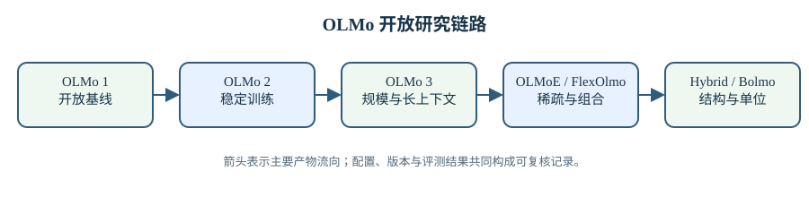

# OLMo 模型技术报告

OLMo 系列的价值不只在于公开权重。模型权重只能回答最终得到了什么，无法解释训练数据怎样组成、优化器为何采用某组参数、一次训练尖峰如何处理、评测结果能否在同一套设置下复现。Ai2 选择把数据、代码、训练日志、中间检查点和研究报告放在同一条开放链路上，使模型研究从比较排行榜数字扩展到比较训练过程。本章按技术演进整理这些报告：OLMo 1 建立全开放基线，OLMo 2 把训练稳定性和后训练纳入同一份报告，OLMo 3 继续扩大规模并更新训练配方；OLMoE、FlexOlmo 和 OLMo Hybrid 分别探索稀疏专家、可组合专家与注意力—循环混合结构；Bolmo 则把建模单位从子词转向字节块。

阅读这些材料时需要区分三种“规模”。总参数量决定模型权重和优化器状态的存储压力，激活参数量更接近每个 token 的前向计算量，训练 token 数则决定参数被数据更新多少次。对 dense 模型而言，总参数与激活参数通常相同；对 MoE 而言，两者可以相差数倍。OLMoE-1B-7B 每个 token 只调用约 1.3B 参数，但设备仍需保存约 6.9B 参数。只按名字中的“1B”比较显存，或只按“7B”比较计算量，都会得到错误结论。本章各篇解析因此尽量同时列出总参数、激活参数、token 预算、上下文长度和硬件口径。

> 图 1: OLMo 模型报告从 dense 开放基线与稳定训练出发，随后分出稀疏专家、可组合专家、混合层和字节块建模路线。

图 1 解析：

- OLMo 1、2、3 构成可连续比较的 dense 主线，重点依次落在开放基线、稳定性和更大规模训练配方。
- OLMoE 与 FlexOlmo 改变容量的组织方式；OLMo Hybrid 与 Bolmo 分别改变序列混合机制和输入单位。
- 箭头表示研究问题的承接关系，不表示后一模型在所有任务上都优于前一模型。跨路线比较仍需固定训练预算和模型阶段。

## 1. 从可复现基线到训练配方

### 1.1. OLMo 1 建立开放链路

OLMo 1 将模型、Dolma 数据集、训练代码和大量中间检查点一起发布。它采用标准 decoder-only Transformer，使研究者可以把结果变化落到具体数据和训练设置，而不必先猜测隐藏的架构改动。报告同时呈现训练损失、下游评测和数据构成，适合作为后续版本的参照系。阅读 [OLMo 1 技术解析](1.3-olmo-1/02-olmo-1-analysis.md) 时，应先确认比较使用的是基座模型还是指令模型，再核对评测是否采用相同提示格式和样本选择。

开放中间检查点带来另一种研究方法：不再只比较训练终点，而是观察能力随 token 数的增长轨迹。某项任务终点较高，可能来自更早形成能力，也可能来自训练后段继续增长；两者对缩短训练预算和选择退火起点的意义不同。检查点还允许研究者分析数据顺序、记忆与遗忘，但这些结论必须结合训练日志和数据去重口径，不能仅凭某两个检查点的差值归因。

### 1.2. OLMo 2 把稳定性问题拆成可验证改动

OLMo 2 重新处理了归一化、初始化、学习率、embedding 衰减和训练尖峰，改动远超简单增加参数。报告把多项改动放进受控实验，并公开失败运行的曲线。这样可以区分“最终分数更高”和“相同预算下更少中断”：前者关心能力，后者关心大规模训练能否按计划完成。具体数值和消融见 [OLMo 2 技术解析](1.4-olmo-2/02-olmo-2-analysis.md)。

训练稳定性也不能压缩成单一损失曲线。激活 RMS、梯度 RMS、更新量与参数量之比、不同层的异常峰值都反映不同故障。梯度裁剪可以限制一次更新，却不能证明产生异常梯度的机制已经消失；降低学习率可能延后尖峰，也可能牺牲相同 token 预算下的学习速度。OLMo 2 报告的意义在于同时给出机制改动、训练行为和最终评测，让这些取舍能够复核。

### 1.3. OLMo 3 延续同一参照系

OLMo 3 在更大训练规模上继续调整数据与模型配方。因为前两代已经提供了相对稳定的参照，第三代的变化可以按“保留什么、替换什么、结果如何”阅读，而不必把每项常见 Transformer 组件重新解释一遍。[OLMo 3 技术解析](1.5-olmo-3/02-olmo-3-analysis.md)将架构、数据日程和评测口径分开核算，避免把规模增长带来的收益全部归给某个局部组件。

跨版本比较最容易忽略后训练差异。基座模型、SFT、偏好优化和可验证奖励训练解决的问题不同，使用的数据也不同。若 OLMo 3 的指令版超过 OLMo 2 的基座版，差值不能直接说明预训练架构更好。可靠的对比应尽量固定模型阶段、提示模板、解码参数和评测实现；无法固定时，结论应限制在报告明确支持的范围内。

## 2. 稀疏专家路线

### 2.1. OLMoE 的细粒度专家

[OLMoE 技术解析](1.7-olmoe/02-olmoe-analysis.md)从参数核算出发：每层有 64 个小专家，每个 token 选择 8 个。八个被激活专家的合计 FFN 宽度与对应 dense 模型接近，而总专家宽度扩大八倍。路由器由 token 表示计算专家分数，选择 top-k 后把 token 分发给相应专家；推理时减少的是每个 token 执行的专家数，并没有减少全部权重的存储需求。

OLMoE 的消融覆盖专家粒度、共享专家、token choice、expert choice、稀疏上循环、负载均衡损失和 router z-loss。结果表明，路由设计必须与容量管理和硬件实现一起判断。更细专家可以提供更多组合，但也会增加分发、排序和 grouped GEMM 的开销；辅助损失可以改善负载，却会改变主任务梯度。论文公开代码使公式中的归一化和实际实现能够逐项比较，这也是全开放报告相对只发布权重的优势。

### 2.2. FlexOlmo 的可组合专家

[FlexOlmo 技术解析](1.2-flexolmo/02-flexolmo-analysis.md)让不同数据拥有者分别训练专家，再把专家组合起来，无需从头训练一个统一 MoE。核心困难是数据不共享时如何获得有效路由，以及移除某个专家后能否同时移除对应数据影响。负偏置路由、公共代理数据和专家初始化共同决定组合后的模型是否仍能利用各领域能力。

这种方案把数据治理要求引入模型结构。删除专家是明确的参数操作，但不能自动证明其训练数据影响已完全消失，因为公共组件、路由器和其他专家可能在训练或蒸馏中接触代理信号。因而“可移除”需要按训练阶段和参数更新路径判断，而不能只看最终目录里少了一个权重文件。解析中列出的论文与代码差异，正用于划清这个边界。

## 3. 注意力之外的计算路径

### 3.1. OLMo Hybrid 的混合层

[OLMo Hybrid 技术解析](1.8-olmo-hybrid/02-olmo-hybrid-analysis.md)把注意力层与线性循环层放入同一模型。注意力可以直接读取上下文中的任意位置，但长序列计算和 KV cache 随长度增长；循环层把历史压入固定状态，单步解码状态较小，却会损失对完整历史的直接访问。混合结构需要决定有限的注意力层放在哪里，以及循环状态承担多少历史压缩，不要求某一种层全面替代另一种。

这条路线的评测需要同时观察训练 FLOPs、墙钟吞吐、长上下文任务和状态追踪任务。只比较困惑度，可能看不到循环层在特定检索任务上的损失；只比较 decode 速度，又可能忽略 prefill 和训练阶段的成本。报告中的缩放律拟合给出预算外推，但外推依赖模型族、数据和训练范围，不能替代目标规模的实际训练。

### 3.2. Bolmo 的字节块建模

[Bolmo 技术解析](1.1-bolmo/02-bolmo-analysis.md)绕开固定子词词表，把字节序列切成可变长度块。编码器把块内字节压成表示，主干模型预测块级表示，解码器再恢复字节。该设计能减少不同语言和代码受到词表切分差异的影响，但计算量取决于每块包含多少字节；边界预测错误还会改变后续序列长度和解码路径。

因此 Bolmo 同时报告 token 吞吐和字节吞吐，并区分真实字节与填充槽位。若只看每秒 token，字节块与子词 token 不是同一单位；若把固定槽位全部算作有效字节，吞吐又会被高估。解析通过模型维度、块压缩率和实验表格复算这些口径，也记录阶段一蒸馏与阶段二语言建模之间的算力分配。

## 4. 阅读顺序与共同边界

### 4.1. 按问题选择入口

希望复现实验时，先读 OLMo 1 和 OLMo 2，建立数据、日志、检查点与评测的共同参照；关注稀疏模型时，从 OLMoE 的受控消融进入，再读 FlexOlmo 的分布式数据所有权场景；关注长上下文计算时，先比较 OLMo 3 与 OLMo Hybrid 的层结构和缓存，再看 Bolmo 如何改变序列单位。各篇 bi 保留原文段落与页标记，适合核对原始表述；analysis 用于复算参数、串联前后版本和解释工程代价。

不同报告的时间跨度较大，评测套件也会更新。MMLU、GSM8K、HumanEval 等名字相同，不代表提示、shot 数、答案抽取和污染控制完全相同；报告内平均分还可能混合不同指标。跨表比较之前，应先确认模型阶段、数据、提示、解码和聚合方式。缺少这些条件时，数字只能说明各自报告设置下的结果。

### 4.2. 开放不等于结论自动成立

公开材料使问题能够被发现和复算，但论文正文、代码、配置和模型卡仍可能出现不一致。训练日程中的学习率、表格平均值、图注与实际曲线、脚本默认参数都需要相互核对。仓库中的 [论文问题台账](../../../docs/development/paper-issues.md)记录已发现的原文内部矛盾；技术解析采用能够由论文表格和代码共同支持的口径，不用猜测填补缺失数据。

最终选择模型时，需要同时考虑能力、训练成本、推理吞吐、显存、数据许可和可审计程度。dense 模型实现简单但每个 token 激活全部参数；MoE 提高参数容量与单 token 计算的比值，却增加路由和通信；混合循环层压缩解码状态，却改变历史信息的访问方式；字节块减少词表依赖，却引入边界与局部编解码成本。本章的几条路线没有共同的单一最优点，它们分别移动了计算、存储、数据与可复现性之间的边界。

## 5. 用同一套量检查不同架构

### 5.1. 单 token 计算只是第一层

对 decoder-only dense Transformer，忽略 embedding 与常数项时，每 token 前向计算大致随激活参数线性增长；训练还要加上反向与优化器更新。MoE 将 FFN 的总容量扩大为 $E$ 个专家，每 token 选 $k$ 个，理想稀疏计算只与 $k/E$ 的专家参数有关。真实墙钟还有路由、token 排序、all-to-all 通信、容量填充与负载不均，所以「激活参数相同」只提供算术起点，还不是相同吞吐的保证。

长序列再加一层。全注意力的 prefill 主项随序列长度二次增长，逐 token 解码的 KV cache 随历史长度线性增长。线性循环层用固定状态替换显式历史，把长度成本压低，代价是过去的多个 token 必须共享有限状态容量。OLMo Hybrid 的问题因此可以写成：把多少层保留为注意力，才能在直接访问历史和压缩状态之间取得平衡。

### 5.2. 建模单位会改变所有分母

子词模型把文本切为 tokenizer 定义的离散单位，Bolmo 则先处理字节，再把多个字节聚合成块。若每个块平均包含 $b$ 个有效字节，长度为 $N$ 字节的文本在主干上约有 $N/b$ 个位置。$b$ 越大，主干序列越短；块内编码、解码与边界预测的压力也随之增加。因此比较 Bolmo 与子词模型时，token 数、序列位置数和原始字节数要分开报告。

损失的分母同样会改变。子词平均交叉熵受词表切分影响，不同 tokenizer 的 perplexity 很难直接排名。把总负对数似然除以原始字节数，得到 bits per byte 或字节归一化损失，才更接近共同尺度。这个尺度仍受 Unicode 编码、文本正规化和数据预处理影响，样本管线必须一起固定。

### 5.3. 架构改进需要三组对照

第一组是等计算对照：固定训练 FLOPs 与 token 数，观察架构能否更有效地利用预算。第二组是等激活规模对照：固定单 token 算术量，检查 MoE 的额外总容量或混合层的状态是否带来收益。第三组是等部署约束对照：在相同显存、批处理、序列长度和延迟目标下比较实际吞吐。三组对照回答的是三个问题，排名很可能不同。

实验还要分离架构与数据。若新模型同时更换语料、训练日程和后训练，成品比较只能说明整套系统的结果。小规模消融能先测某个组件的方向，但小模型结论会随规模、数据和硬件改变，最终仍要在目标尺度上验证。OLMo 公开的中间 checkpoint 和训练日志恰好能补上这一环：我们可以看到差异在哪个训练阶段出现，而不只看末尾一张表。

### 5.4. 缩放曲线怎样参与决策

多个尺寸的小实验常用幂律拟合损失与计算量的关系，形如 $L(C)=L_\infty+aC^{-\alpha}$。$L_\infty$ 表示当前模型族和数据分布下的拟合下限，$\alpha$ 描述预算增长时损失下降的速度。对比两种架构时，只看某个小模型点谁更低还不够；两条曲线可能交叉，拟合指数的小误差也会在大跨度外推时被放大。

因此外推要保留三类不确定性：重复训练导致的随机波动，对拟合区间和函数形式的敏感性，以及从小规模到大规模可能出现的机制变化。MoE 的通信瓶颈、循环层的状态容量和字节块的平均压缩率，都可能随尺寸变化。预测区间大幅重叠时，合理结论是「现有代理实验无法区分」，而不是挑一条均值稍低的曲线宣布胜负。

训练到目标尺度后，预测误差本身就是结果。若某路线在小实验中显著领先，到大模型却落入区间外，需要回查数据配比、优化稳定性、硬件效率和评测噪声。这些偏差会告诉后续实验应该在哪个尺寸补点，比一条看起来很平滑的曲线更有价值。
