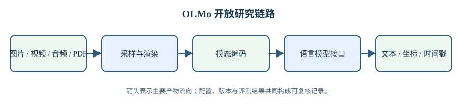

# OLMo 多模态、语音与文档理解

语言模型接收的是离散 token，而图片、视频、语音和 PDF 先要经过各自的采样与编码过程。输入接口决定模型能够看到什么，也决定哪些错误在语言模型之前已经发生。图片缩放会丢失小字，视频抽帧会跳过短暂动作，语音切分会破坏跨段上下文，PDF 页面渲染会把阅读顺序和表格结构压进像素。OLMo 的多模态工作延续全开放路线，不只发布模型权重，还尽量公开标注流程、训练数据、生成管线与评测集，使这些前置选择可以被检查。

本章覆盖五条相连的工作。Molmo 建立图像问答与指点能力，强调由人类标注而非只靠合成回答构造高质量数据；Molmo 2 把输入扩展到视频和多图，并要求输出携带时间与空间位置；OLMoASR 处理语音识别中的规模、噪声与数据开放；olmOCR 从 PDF 页面恢复线性文本；olmOCR 2 进一步把可执行单元测试用于奖励和评测。它们面对的模态不同，但共享三个问题：输入如何离散化，监督信号如何与原始对象对齐，指标是否真的测到部署时关心的错误。

> 图 1: 图片、视频、音频和 PDF 先经过模态专属的采样、渲染与编码，再进入语言模型接口并生成文本或带位置的结构化输出。

图 1 解析：

- 采样与渲染决定原始信号中哪些信息被保留；这一阶段的损失无法由后面的语言模型完整恢复。
- 模态编码把连续信号变成有限长度的表示，表示数量会与文本共同占用上下文和计算预算。
- 输出侧不仅有自然语言，还包括坐标、轨迹和时间戳，因此格式有效性与语义正确性需要分别评测。

## 1. 从图像问答到空间指代

### 1.1. Molmo 的开放视觉数据

[Molmo 技术解析](2.1-molmo/02-molmo-analysis.md)将视觉编码器、连接器和语言模型放在统一训练流程中。视觉编码器把图像分成 patch 并产生连续表示，连接器把视觉维度映射到语言模型可接收的维度，语言模型在视觉 token 与文本 token 上自回归生成。这里的关键不只是组件名称，而是分辨率、patch 数和序列长度之间的约束：提高分辨率可以保留小目标，却会增加视觉 token 数，占用上下文和注意力计算。

Molmo 的“指点”输出把目标位置编码进文本序列。模型不另接一个检测头，而是在回答中生成坐标 token；同一解码过程既产生语言，也产生位置。这样可以复用语言模型训练接口，但坐标量化、多个目标的排列顺序和答案格式都会影响损失。一个语义回答正确但坐标格式无效的样本，在自动评测中仍会失败；反过来，点落在目标框内也不能证明模型解释了图像关系。

### 1.2. 数据质量来自任务分解

多模态数据常从已有图片和网页文本自动配对，但网页替代文本可能只描述文件用途，未必描述画面。Molmo 的标注流程把详细描述、问答和指点拆成不同任务，并通过界面约束标注者观察图片。解析需要把“数据量更大”和“单条监督更可靠”分开：增加弱配对样本主要扩大覆盖，高成本人工标注用于校正描述密度、空间关系和回答风格。

评测同样分为知识问答、图表、OCR、空间指代等类别。总平均分会掩盖能力结构：视觉问答提高，不代表小字读取同步提高；指点准确，不代表长文本描述没有幻觉。阅读表格时应保留每个数据集的指标和样本口径，不能把 exact match、ANLS、point accuracy 与人工偏好直接平均后解释成统一能力。

## 2. Molmo 2 的时间维度

### 2.1. 视频不是独立图片的集合

[Molmo 2 技术解析](2.2-molmo2/02-molmo2-analysis.md)把视频按固定帧率采样，再将多帧视觉 token 与文本消息共同装入上下文。帧率过低会漏掉短动作，帧率过高则迅速耗尽上下文。长视频因此需要在时间覆盖与单帧细节之间分配预算。模型还要区分同一物体跨帧出现与多个相似物体；这项重识别要求视觉表示在外观变化、遮挡和镜头切换后保持关联。

Molmo 2 的输出包含带时间戳的点和轨迹。视频计数需要跨帧识别同一对象，直接累加每帧检测结果会产生重复；轨迹同样要保持对象标识，不能逐帧独立选点。训练数据中的点若在物体内部漂移，模型就会学习到不稳定轨迹。报告把这类问题列为明确限制，说明误差既可能来自模型，也可能来自监督生成管线。

### 2.2. packing 与消息树

视频样本长度差异很大。若每个 batch 按最长样本填充，短样本会浪费大量计算；packing 将多个样本放入一条长序列，并用注意力掩码阻止样本之间互相读取。多轮问答还形成消息树：共享同一视频和对话前缀的多个回答可以复用前缀，但损失只应落在对应的助手输出上。实现若把边界或标签错一位，就会让模型预测用户文本或读取其他样本答案。

因此吞吐数字必须说明是否包含 padding、图像预处理和视频解码。仅报告语言模型每秒 token，可能没有计入从磁盘读取视频、抽帧和视觉编码的成本；端到端部署还受到视频长度、解码并发和缓存策略影响。Molmo 2 的训练优化提升设备利用率，但不能直接等同于用户侧延迟按同一比例下降。

## 3. 语音输入的开放训练

### 3.1. OLMoASR 的识别链路

OLMoASR 将连续波形转换为声学特征，再由编码器提取随时间变化的表示，解码器输出文本。与图像不同，语音错误经常沿时间累积：切分边界可能截断单词，背景声会覆盖局部音素，口音和语速改变声学分布。训练集规模不能单独描述覆盖程度，还需看语言、口音、录音设备、场景和转写规范。

自动语音识别常用词错误率 WER，将替换、删除和插入之和除以参考词数。WER 易于复算，但对标点、大小写、数字规范化和专有名词高度敏感。两个系统若采用不同文本规范化，分数不能直接比较。OLMoASR 的对照译稿与技术解析将把数据来源、音频时长、模型规模和规范化步骤放在同一口径下，避免用单一 WER 覆盖不同错误类型。

### 3.2. 从音频时长到有效监督

公开音频可能带有弱字幕、重复片段或版权限制。过滤过严会缩小口音和场景覆盖，过滤过松会把错位字幕当作监督。有效训练量取决于经过语音活动检测、语言识别、质量筛选和去重后仍与文本对齐的音频，原始总时长无法反映这一点。若使用模型生成伪标签，还要区分原始人工转写与教师模型输出，后者会把教师错误带进学生模型。

长音频部署还需要流式与非流式边界。整段编码可以利用后文改善当前词判断，但延迟随音频长度增长；流式识别限制未来上下文，可以降低延迟，却可能增加边界错误。报告给出的离线基准不能自动证明实时性能，工程选择应同时记录 chunk 大小、右侧上下文、首 token 延迟与持续吞吐。

## 4. PDF 到结构化文本

### 4.1. olmOCR 的页面级生成

olmOCR 将 PDF 页面渲染为图像，再让视觉语言模型生成带结构的文本。页面级生成能够利用二维布局判断栏顺序、标题、表格和公式位置，避免传统 PDF 文本层在复杂排版中产生错序。但渲染分辨率决定小字是否可辨，生成长度限制决定整页内容是否被截断，语言模型还可能补出页面上不存在的词。

评测不能只比较字符重合。段落顺序、表格行列、公式符号和页眉页脚对下游用途的重要性不同。olmOCR 使用多类单元测试检查页面输出，例如文本是否出现、顺序是否正确、目标内容是否被排除。每个测试只约束一个可验证性质，许多测试合起来才近似文档可用性。[olmOCR 对照译稿](2.4-olmocr/01-olmocr-bi.md)保留原报告细节，技术解析进一步区分渲染、模型生成与后处理三段的错误来源。

### 4.2. olmOCR 2 的单元测试奖励

olmOCR 2 把文档单元测试从评测工具扩展为训练奖励。对候选转写运行确定性测试，可以得到比笼统质量分更明确的反馈：某段文本是否存在、两个片段的相对顺序是否正确、页码是否应删除。可验证奖励减少了奖励模型主观偏好，但测试覆盖之外的错误不会受罚；若训练集反复使用固定模式，模型还可能学会满足测试而没有恢复完整页面。

这种方法要求严格隔离训练与评测测试，并持续增加布局和语言覆盖。测试通过率也不能替代人工检查：一页可能通过所有局部断言，却仍遗漏未被断言的段落。部署时应保留页面图像、生成文本和测试结果之间的对应关系，使失败可以回到具体页面复查，而不是只留下整批平均分。

## 5. 共同比较口径

### 5.1. 对齐单位后再比较

图像模型按图片或视觉 token 计量，视频还包含帧数与时长，ASR 常按音频小时和实时因子计量，OCR 则按页数、渲染像素与输出 token 计量。它们不能用一个“样本数”直接比较成本。训练报告至少需要模型参数、输入单位、采样或渲染设置、序列长度、硬件和墙钟时间；推理报告还要说明批量、缓存与预处理是否计入。

数据开放也有不同层次。发布下载链接不等于数据可永久再分发，公开生成脚本不等于原始素材许可证允许复制，提供模型输出不等于有人类参考。每篇解析会分别记录原始数据、派生标注、代码和权重的许可与可获得性，不把“开放”压成一个布尔标签。

### 5.2. 失败应回到输入链路

多模态系统发生错误时，先判断信息在哪一步丢失。原始素材没有目标、采样没有选中关键帧、渲染让小字不可辨、标注坐标错位、序列被截断，都会产生看似相同的错误答案。只有模型已经接收到足够信息而仍生成错误时，问题才主要落在跨模态推理或解码。

这套分解也决定修复顺序。提高语言模型规模无法恢复未采样的视频帧，增加 OCR 后处理无法找回渲染时消失的字符，扩大 ASR 词表不能修复错位字幕。先核对输入转换和监督对齐，再分析模型容量与训练目标，可以避免用昂贵的模型改动掩盖数据管线缺陷。

## 6. 用一条概率链统一图像、语音与文档

### 6.1. 观测、表示与输出

把原始对象记为 $s$，采样或渲染结果记为 $o$，编码后的有限表示记为 $z$，最终文本或坐标序列记为 $y$。整个系统可写成

$$
p(y\mid s)=\sum_{o,z}p(y\mid z)\,p(z\mid o)\,p(o\mid s).
$$

图像缩放、视频抽帧、音频切块和 PDF 渲染都在 $p(o\mid s)$ 中；视觉编码器或声学编码器定义 $p(z\mid o)$；语言模型负责 $p(y\mid z)$。某个关键字符若已经在 $o$ 中消失，后两项只能根据训练分布猜测；猜对一次也不证明模型真的读到了原文。

这个分解给出一个直接的消融方法。先使用固定模型改变分辨率、帧率、chunk 边界或页面渲染，得到观测上限；再固定观测替换编码器，检查表示瓶颈；末尾固定 $z$ 比较语言模型和解码协议。若同时改三层，最终分数可以评价整套系统，机制归因却会混在一起。

### 6.2. 对齐误差比模态名字更重要

多模态监督的核心是对齐。图像问答要把答案与正确图像绑定，指点要把语义指称与坐标绑定，视频要把动作与时间区间绑定，ASR 要把文本与正确音频片段绑定，OCR 则要同时保留字符、阅读顺序和布局关系。对齐偏一帧、一个 chunk 或一栏，交叉熵仍然会推动模型学习，只是学到了错误条件。

这类错误通常不会在总损失里自动显形。若偏移有稳定规律，模型甚至能拟合它，训练曲线看起来很正常。所以数据验收要加入局部反例：小字与低对比页面、快速短动作、说话人重叠、多栏中的跨栏句子，以及带有相似对象的指点任务。它们分别放大采样、时间、声源、阅读顺序和指称歧义。

### 6.3. 从单个分数还原错误向量

同一个输出可以同时有内容、定位、顺序、格式和校准误差。把它们加成总分会隐去权重选择：一份 OCR 结果字符很准却完全错栏，用于检索或许尚可，用于表格数据分析就可能不可用。视频回答的事件类别正确却时间戳偏移，用于摘要和用于视频编辑的结论也不同。

更稳妥的报告保留错误向量，再按用途设置门槛。总分可以帮助快速排序，不应覆盖任一安全或格式硬约束。olmOCR 2 的单元测试展示了一个有用方向：用多个可验证断言替代模糊整体印象。它的上限则由断言覆盖决定，未被测试的段落、表格关系或公式仍需抽样复核。

校准还需要单独检查。模型对图像答案给出高置信，对 OCR 某个字符却没有显式置信度，两者仍可以通过重复采样、token 对数概率或多模型一致性估计不确定性。估计值只有在时间外、设备外和版式外数据上仍与错误率对应，才适合驱动拒答或人工复核。若高置信错误集中在某种口音、字体或镜头运动，问题已经超出平均准确率，需要回到数据覆盖和表示学习定位。
