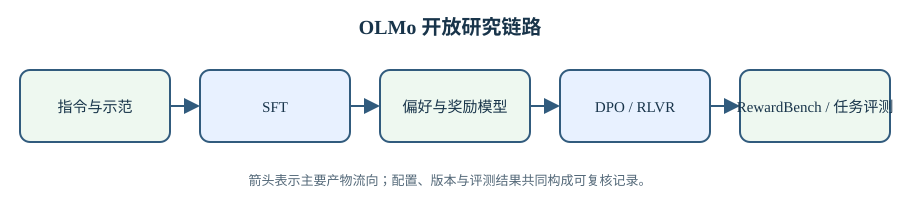

# OLMo 后训练与奖励模型

预训练让模型获得语言与知识能力，后训练决定这些能力如何响应指令、遵守格式并在多个可接受答案中选择输出。OLMo 体系中的 Tülu 系列把数据混合、监督微调、偏好优化和可验证奖励训练放入可复现流程；RewardBench 系列负责检验奖励模型是否能稳定区分更好的回答；DR Tulu 将这条路线扩展到需要搜索、引用和长程组织的深度研究任务。几项工作共享模型与数据基础，但各自优化的对象不同，不能把所有提升都归为“对齐”。

本章先建立三个区分。第一，监督微调直接最大化参考回答的似然，模型学习的是数据中出现的行为；偏好优化比较候选回答，学习的是相对排序；基于可验证奖励的强化学习根据答案是否满足确定条件更新策略。第二，奖励模型的高准确率只说明它在给定候选分布上会排序，不保证把它用于策略优化时不会被利用。第三，评测模型与训练模型必须隔离数据和提示，否则排行榜会把记忆、格式适配与真正的泛化混在一起。

> 图 1: 后训练从指令示范进入 SFT，再由偏好、奖励模型和可验证结果驱动 DPO 或 RLVR，并回到独立任务评测。

图 1 解析：

- SFT 学习示范中出现的行为，DPO 学习候选之间的相对偏好，RLVR 使用可程序验证的结果更新策略，三者的监督对象不同。
- RewardBench 检查奖励模型的排序能力，任务评测检查策略输出；两种结果不能互相替代。
- 评测发现的失败会回到数据筛选和奖励设计，但测试样本不能直接进入训练混合，否则反馈循环会产生污染。

直接入口：[Tülu 2 解析](3.4-tulu-2/02-tulu-2-analysis.md)、[Tülu 3 解析](3.5-tulu-3/02-tulu-3-analysis.md)、[RewardBench 解析](3.2-rewardbench/02-rewardbench-analysis.md)、[RewardBench 2 解析](3.3-rewardbench-2/02-rewardbench-2-analysis.md)、[DR Tulu 解析](3.1-dr-tulu/02-dr-tulu-analysis.md)。

## 1. Tülu 2 的开放后训练基线

### 1.1. 数据混合与监督微调

Tülu 2 从多个指令数据源构造监督微调混合。不同来源在任务类型、回答长度、系统提示和许可证上差异明显，简单拼接会让大数据源支配梯度。混合比例因此既是数据工程选择，也是行为定义：代码样本增加会改变格式和长答案比例，数学样本增加会改变推理轨迹，通用对话增加则可能稀释专业任务。技术解析需要记录每个来源的样本数、去重和过滤，而不能只列数据集名称。

监督微调的损失通常只作用于助手回答 token。若把用户提示也计入损失，模型会花容量复述输入分布；若多轮消息边界处理错误，模型可能学习生成角色标记。packing 可以减少填充计算，但必须用掩码隔离不同会话。Tülu 2 的价值在于公开这些训练细节，使基座模型差异与后训练实现差异可以分别检查。

### 1.2. DPO 的相对偏好

直接偏好优化 DPO 使用同一提示下的 chosen 与 rejected 回答，并以参考模型约束策略不要偏离过远。目标依赖策略与参考模型对两条回答的对数概率差，因此参考模型版本、tokenizer 和长度归一都会改变有效训练信号。DPO 不需要在线采样和独立价值网络，但这不表示它没有分布外问题：训练候选来自既有模型，部署时策略产生的回答可能进入数据未覆盖区域。

评测 DPO 增益时要与 SFT 检查点配对。不同 SFT 基线、不同偏好数据和不同采样温度之间的差值不能直接归给 DPO 算法。Tülu 2 的对照稿与解析按阶段保留模型版本，并区分知识、推理、真实性和对话偏好指标，让后续 Tülu 3 的改变有明确参照。

## 2. Tülu 3 的多阶段配方

### 2.1. 数据策展与能力分区

Tülu 3 扩大并重组指令数据，把通用对话、数学、代码、工具使用和安全等能力分区处理。数据策展不只删除低质量文本，还要控制重复、答案可验证性与评测污染。同一道题的改写若同时进入训练和测试，即使字符串去重没有命中，也会高估泛化。因而报告中的污染检查、来源追踪和保留集设计与训练超参数同等重要。

多阶段流程还会产生能力迁移。后面的偏好或强化学习阶段可能提升目标基准，同时损伤前面监督微调获得的格式遵循和长尾知识。可靠报告应同时给出阶段前后结果，而非只发布最终模型。本章据此把每个检查点看作一组受特定数据更新后的状态，不把“最终更强”解释为所有能力单调增加。

### 2.2. 可验证奖励训练

数学和代码任务能够通过最终答案或测试用例给出确定奖励。可验证奖励减少了奖励模型的主观误差，但奖励通常只覆盖最终结果，推理过程中的无效步骤可能不受惩罚。若答案解析器只接受固定格式，模型还会因为格式而不是内容失败；若测试覆盖不足，错误程序也可能通过。训练前必须验证判分器的正确性、超时行为和重复执行稳定性。

强化学习更新依赖当前策略采样，候选分布会随训练变化。采样数量、温度、优势估计和 KL 约束共同决定更新幅度。只报告最终 pass rate 无法判断收益来自更多采样还是更好的策略。Tülu 3 的解析将训练预算、rollout 数和评测解码设置分开，避免把测试时计算扩展与参数学习混成一个增益。

## 3. RewardBench 的奖励模型评测

### 3.1. 成对准确率测量什么

[RewardBench 技术解析](3.2-rewardbench/02-rewardbench-analysis.md)以同一提示下 chosen 与 rejected 回答构造成对样本。奖励模型分别打分，若 chosen 得分更高则该样本正确。这个指标与分类边界有关，却不要求不同提示之间的绝对分数可比。一个模型可以有很高的成对准确率，同时让所有回答分数集中在狭窄区间；另一个模型分数跨度很大，也不必然有更好的排序。

RewardBench 按 Chat、Chat Hard、Safety、Reasoning 等分区汇总。宏平均让小分区拥有与大分区相近的影响，微平均则受样本数支配。阅读总分前应确认采用何种加权。生成式裁判、序列分类器和 DPO 隐式奖励的接口也不同：生成式模型可能受提示措辞影响，分类器依赖训练时的特殊 token，DPO 模型需要参考模型共同计算。

### 3.2. 排名不等于可用于训练

离线成对数据来自固定模型和标注流程。将奖励模型放入在线优化后，策略会寻找获得高分的输出，包括训练分布之外的模式。这是 Goodhart 风险的具体形式：评测准确率测的是已知候选排序，策略优化要求奖励在不断变化的候选上仍与人类目标一致。RewardBench 能筛掉明显较弱的奖励模型，却不能单独证明长期强化学习安全。

奖励分布、长度相关性和不同类别的错误模式提供了比单一总分更强的证据。若模型持续偏爱长回答，策略可能通过增加冗余得分；若安全分区很高但推理分区接近随机，统一用于所有任务会产生不稳定梯度。部署奖励模型时，应按目标任务检查分区结果，并在策略采样上重新做人工或可验证评估。

## 4. RewardBench 2 的难度更新

### 4.1. 为什么需要更新候选分布

模型能力提升后，早期偏好集中的 rejected 回答可能明显低质，奖励模型无需理解细节就能区分。RewardBench 2 使用更强模型生成候选，并增加事实性、长上下文、代码和安全等细分任务，使成对差异更接近真实选择。更难的数据会让旧模型分数下降，这不表示模型退化，而是评测分布改变。

新评测仍需防止训练污染。奖励模型可能见过公开偏好数据或相同题目，生成式裁判的基础模型也可能记住答案。数据发布时间、题目来源、候选生成模型和去重方法应与结果一起记录。RewardBench 2 的 bi 与 analysis 会保留六类子集的构造和汇总方式，使分数变化能够落到具体类别。

### 4.2. 评测协议本身也是变量

分类器奖励通常直接读取标量，生成式裁判则需要模板、答案顺序和解析器。交换 A/B 位置可能改变结果，要求解释理由可能提高某些任务却增加格式失败。多次采样取多数票又引入测试时计算。榜单必须固定协议，使用者也应在自己的部署模板上复测，而不是假设公开排名会原样迁移。

置信区间同样重要。两个模型只差少量样本时，排名可能随采样波动或子集权重改变。逐题预测和 bootstrap 区间比保留两位小数的总分更能反映不确定性。若子集很小，应报告错误实例，而不是从微小差值推出普遍机制。

## 5. DR Tulu 的动态评分标准

### 5.1. 深度研究为何需要 rubric

深度研究回答包含检索、证据选择、综合和引用，单一正确答案往往不存在。DR Tulu 为任务构造细粒度 rubric，将覆盖要点、事实正确性、来源质量和引用支持拆开评分。rubric 使奖励能指出缺少哪类内容，但它本身也是生成和筛选出来的数据：若评分项遗漏关键事实，模型满足全部条目仍可能得到不完整答案。

搜索环境会随时间变化，网页不可达、内容更新和检索排名都会改变轨迹。训练记录因此需要保存查询、访问时间和证据快照。只保留最终回答无法复现奖励，也无法判断错误来自没有搜到、读错来源还是综合失败。动态 rubric 应随证据演进更新，但测试 rubric 不能被训练过程提前看到。

### 5.2. 从静态答案到过程验证

最终答案奖励把整条研究轨迹压成一个分数，信用分配很弱。过程信息可以检查查询是否相关、引用是否支持相邻陈述、多个来源是否独立。增加过程监督会提高标注和执行成本，还可能让模型适配固定工作流。需要验证的是研究结果，而不是要求所有任务走同一条搜索路径。

DR Tulu 将可验证奖励从短答案扩展到开放式报告，但边界依旧明确：rubric 覆盖范围决定模型能优化什么，检索环境决定模型能看到什么，裁判模型决定开放陈述如何得分。三者任一发生变化，训练曲线与最终分数都要重新解释。工程部署还应保留引用可访问性检查和人工复核入口，不能只依赖聚合奖励。

## 6. 统一复现与使用边界

### 6.1. 阶段化记录

复现后训练结果时，应保存基座、SFT、偏好优化和强化学习各阶段检查点，并为每阶段记录数据版本、模板、tokenizer、有效 batch、学习率、样本长度和随机种子。评测需固定解码参数与答案抽取。若只保留最终权重，出现能力回退时无法定位在哪个阶段发生，也无法区分数据变化与算法变化。

奖励模型还要保存候选生成信息。相同提示配上不同强度的候选，成对准确率会明显变化；策略训练产生的在线候选又不同于离线榜单。定期从当前策略采样并人工复核，是检查奖励漂移的必要步骤。可验证任务则应版本化判分器和测试用例，避免代码更新后历史奖励无法重放。

### 6.2. 没有单一终点

后训练在帮助性、真实性、安全、格式和任务能力之间调整分布。任何聚合分数都隐含权重，换一个部署场景就可能需要不同选择。通用助手重视多轮稳健与安全，代码代理重视可执行测试，研究代理重视证据覆盖和引用支持。选模型时应先确定失败成本，再选择数据、奖励与评测组合。

Tülu 系列提供开放训练配方，RewardBench 系列提供奖励模型压力测试，DR Tulu探索动态研究任务。三者可以连续工作：训练产生策略，评测发现奖励盲区，新候选与新 rubric 再进入下一轮训练。数据来源、评分协议和阶段结果都可追踪时，这一循环才可以审查；只公开最终排行榜无法提供这些证据。

### 6.3. 三种监督信号的数学关系

SFT 对示范 $y^*$ 做最大似然，核心项是 $-\log\pi_\theta(y^*\mid x)$。它给出一个要提高概率的完整轨迹，但不直接说明同一提示下其他回答差在哪里。DPO 使用两条轨迹的相对对数概率，学习 chosen 相对 rejected 的间隔，参考策略则限制间隔通过整体漂移获得。RLVR 从当前策略采样 $y$，用验证器返回的 $R(x,y)$ 改变后续概率，监督分布因此会跟着策略移动。

三者可以按「示范、比较、环境反馈」排列，却不形成必然替代关系。示范质量高而覆盖窄时，SFT 能建立格式和基本行为，难以遍历所有失败；偏好对能告诉模型两个答案的顺序，标注偏差会直接进入方向；验证器能大规模复用，其覆盖不足会变成可被策略利用的漏洞。一个阶段的输出是下一阶段的起始分布，顺序与数据重叠都会改变最终结果。

因此阶段消融要关心轨迹，不只关心终点。在同一基座上保留 SFT、DPO 与 RLVR checkpoint，对相同密封集测试概率、任务成功、长度、格式、安全与校准，才能看出某项能力在哪一步增长或回退。若只对比基座与最终模型，中间某阶段创造、后一阶段又部分损失的能力会被终点差值抵消。

还要把「训练时分布」与「评测时分布」分开。偏好数据里的 rejected 往往由早期模型产生，当前策略的错误可能已经换了形态；可验证任务的训练题能够反复采样，保留题却必须防止测试信息泄漏。定期用当前策略生成新候选，在密封集上检查奖励与真实成功的相关性，可以区分「策略真的变好」与「策略更会过当前判分器」。

当两者分歧时，先回查验证器覆盖、答案解析、候选长度和任务难度，再决定是否继续更新策略。这比盲目增大 KL 惩罚或降低学习率更能定位原因：优化器只能控制如何追逐奖励，无法替奖励补上未被表达的任务要求。
