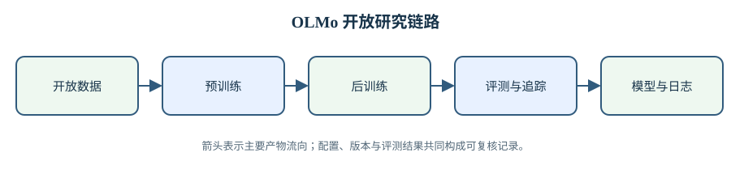

# OLMo · Open Language Model · 全开放语言模型研究

DeepSeek 经常被叫作「源神」, 因为它开源的模型, 论文和 Infra 又多又好, 里面还有一种很难得的工程美学. 但如果把问题收窄到「一个大模型的训练过程究竟开放到了什么程度」, OLMo 可能才是真正的「开源之神」. 它交出来的不只是末份权重, 而是数据, 数据处理代码, 训练配置, 中间 checkpoint, 日志, 评测协议和训练框架. 研究者可以沿着这些材料回到某一步训练, 观察能力何时出现, 一次损失尖峰怎样处理, 换一份数据后哪些任务发生变化.

至少在我见过的项目里, StepFun 是唯一连 SFT 数据也愿意开放出来的团队. OLMo 的开放范围已经很大, 但不同版本和任务的后训练数据并非始终全部发布. 这个缺口反而说明「开放权重」与「开放模型流」之间有多少层次: 预训练数据, mid-training 数据, SFT 示范, 偏好对, 可验证奖励任务, 过滤规则和训练代码, 少一层就少一部分复现实验的能力.

2026 年, Ai2 原 CEO Ali Farhadi 与部分研究者转入 Microsoft SuperIntelligence, 一度让人担心 OLMo 的开放路线会不会停下来. Farhadi 离任时说自己仍会关注 Ai2 接下来的发布, OLMo 负责人之一 Hanna Hajishirzi 也公开表示会继续支持开源与开放科学 AI. 更有说服力的证据还是后续产物本身: OLMo Hybrid, OLMo-core 3 等项目继续发布, 而且训练基础设施仍在向 MoE 和更大规模扩展.

我理解 OLMo 团队的目标并不是每一次都用最终榜单压过最前沿闭源模型. 它更像是在追赶重要技术的同时, 把训练过程变成可以研究的对象. 对个人学习者来说, 这种开放尤其珍贵: 我们通常只看见论文里的最终表格, 很少能看到一套数据怎样进入训练, checkpoint 怎样形成, 后训练怎样接上, 评测又怎样反过来修正配方. 这座知识库要沿完整模型流把这些材料接起来.

OLMo 是 Allen Institute for AI（Ai2）推动的开放语言模型体系。这里的“开放”不只指可以下载权重，还包括训练数据、数据处理代码、模型实现、训练配置、中间检查点、日志和评测协议。只发布权重能够支持推理和微调，却很难回答模型为何获得某项能力；同时发布训练过程，研究者才可以复算参数与预算、定位训练异常、检查数据污染，并验证后续改动是否真的带来收益。

这座花园沿完整模型生命周期组织内容。模型技术报告说明架构和训练配方如何演进；多模态与 OCR 将开放路线扩展到图片、视频、语音和 PDF；后训练与奖励模型处理指令、偏好、可验证奖励与深度研究；数据与评测覆盖语料构建、领域损失、统一协议、文本追踪和规模预测；开源仓库章则从代码边界出发，解释训练、数据处理、后训练、评测和文档解析工具如何协同。论文对照译稿用于核对原文，技术解析用于复算机制、实验口径和工程代价，两者承担不同职责。

> 图 1: OLMo 开放研究链路从数据、预训练、后训练进入评测与追踪，最终交付模型、检查点和运行记录。

图 1 解析：

- 五个节点表示研究产物的主要生成顺序；箭头表示下游阶段直接消费上游的数据、权重或配置。
- 评测与追踪并非训练结束后的附属步骤。它们会发现污染、领域缺口和能力退化，并据此修正数据与训练配方。
- 图中没有把“开放”压缩成许可证。数据来源、处理代码、中间检查点、日志和评测协议都属于复核链路。

## 1. 一条开放链路，而不是一组模型名字

### 1.1. 从 Dolma 到检查点

语言模型先由数据定义。Dolma 汇集网页、代码、论文、百科和书籍等来源，并经过语言识别、质量过滤、去重和敏感信息处理。数据处理会改变主题、语言与重复分布，因此“训练了多少 token”只描述规模，不能替代来源与处理规则。模型训练进一步加入 tokenizer、batch、学习率、优化器和硬件实现；任何一项变化都可能影响最终结果。

OLMo 1 将这些组成部分连在一起，并发布大量中间检查点。中间状态使研究从比较终点扩展到比较轨迹：能力何时出现、某次尖峰前后发生什么、退火阶段改变了哪些任务，都可以沿训练步观察。OLMo 2 和 OLMo 3 在同一参照系下更新稳定性设计、数据和后训练流程，使版本差异能够落到具体改动，而不是只剩排行榜中的一行数字。

### 1.2. 总参数、激活参数与训练预算

阅读模型报告时需要同时记录总参数、每 token 激活参数和训练 token。dense 模型通常激活全部参数；MoE 只调用部分专家，因此总参数决定存储，激活参数更接近单 token 计算。OLMoE-1B-7B 的名称同时保留两种规模：每个 token 激活约 1.3B 参数，总参数约 6.9B。只用其中一个数字比较，会分别忽略显存或计算成本。

训练预算也不能只用 GPU 数量描述。不同设备、精度、并行方式和吞吐会让相同卡数对应不同有效 FLOPs。更可靠的记录包含全局 batch、序列长度、训练步数、token 总量、硬件类型、墙钟时间和实际吞吐。技术解析中的参数复算与日程核对，目的就是把宣传性规模名称还原成可比较的量。

## 2. 模型路线的分叉

### 2.1. dense、稀疏专家与混合层

[模型技术报告](1-模型技术报告/1-模型技术报告.md)从 OLMo 1、2、3 的 dense 路线开始，再进入 OLMoE、FlexOlmo 与 OLMo Hybrid。OLMoE 将 FFN 切成多个小专家，每个 token 只选择一部分；收益是增加总容量而不同比例增加激活计算，代价是路由、通信和权重存储。FlexOlmo 进一步研究数据拥有者分别训练专家后再组合，模型结构因此与数据治理和专家移除边界联系起来。

OLMo Hybrid 把注意力与线性循环层放进同一模型。注意力可以直接访问历史位置，但 KV cache 随上下文增长；循环层把历史压入固定状态，却不再保留对全部 token 的直接读取。Bolmo 则改变序列单位，用字节块替代固定子词。几条路线分别移动了容量、计算、缓存和词表依赖之间的边界，没有一个指标能决定所有场景的最优选择。

### 2.2. 多模态输入先改变数据管线

[多模态与 OCR](2-多模态与OCR/2-多模态与OCR.md)覆盖 Molmo、Molmo 2、OLMoASR 和 olmOCR。图片要切成视觉 patch，视频要抽帧，语音要分段并提取声学表示，PDF 要渲染并恢复阅读顺序。输入转换若丢失信息，扩大语言模型无法把它找回。每篇解析因此先检查采样、分辨率、标注对齐和序列预算，再讨论跨模态推理。

Molmo 的空间指点把坐标编码进文本输出；Molmo 2 增加时间戳、轨迹和多图消息；OLMoASR 面对口音、噪声与流式延迟；olmOCR 用页面级生成处理复杂布局，并以单元测试检查文本、顺序和表格。不同模态使用不同单位，图片数、视频小时、音频小时和 PDF 页数不能直接比较训练量。

## 3. 后训练与奖励的反馈循环

### 3.1. 从示范到偏好和可验证结果

[后训练与奖励模型](3-后训练与奖励模型/3-后训练与奖励模型.md)以 Tülu 2 和 Tülu 3 为主线。监督微调让模型拟合示范回答；偏好优化比较同一提示下的候选；可验证奖励训练通过数学答案或代码测试给出反馈。三种目标接收的监督不同，提升也不能互相替代。最终答案可验证，不表示推理过程每一步都正确；偏好数据能排序候选，不表示奖励在策略分布变化后仍可靠。

RewardBench 与 RewardBench 2 用分区成对数据测试奖励模型。成对准确率衡量 chosen 是否高于 rejected，不要求不同提示间的绝对分数可比。离线榜单也不能证明奖励适合长期在线优化，因为策略会主动寻找评分漏洞。DR Tulu 将奖励扩展到深度研究 rubric，需要同时保存搜索证据、引用与评分条目，才能区分检索失败、来源误读和综合错误。

### 3.2. 每一阶段都要留下状态

后训练可能提高目标任务并损伤其他能力。复现时应保留基座、SFT、偏好优化和强化学习检查点，以及各阶段数据、模板、tokenizer 和解码设置。若只留下最终权重，出现格式退化或知识遗忘时无法定位阶段。OLMo 的开放检查点为这种阶段化分析提供了基础。

奖励和判分器同样需要版本化。测试用例更新会改变历史奖励，裁判提示变化会改变生成式评分，候选模型升级会提高偏好对的难度。报告分数必须绑定协议和数据版本；无法固定时，只能在各自设置内解释，不能把数字直接拼成跨论文排名。

## 4. 数据与评测怎样约束结论

### 4.1. 从领域损失到任务协议

[数据与评测](4-数据与评测/4-数据与评测.md)连接 Dolma、Paloma 与 OLMES。Paloma 按领域测量语言建模损失，揭示总平均掩盖的分布差异；OLMES 固定提示、shot、答案抽取和聚合，使同名任务的结果真正可比。困惑度、bits per byte、多项选择准确率和生成式判分回答不同问题，不能混成一个没有单位的能力值。

Infini-gram 与 OLMoTrace 查询训练文本和模型输出的匹配关系。字符串匹配能发现潜在记忆案例，却不能单独证明生成因果；没有长匹配也不能证明语义信息未出现。追踪结果应回到候选文档和具体 span 人工复核，而不是只看聚合分数。

### 4.2. 小实验预测大训练的条件

DataDecide 用较小实验选择数据配方，Model Ladders用模型梯子外推目标规模，Fluid Benchmarking 和 Signal and Noise 检查评测曲线的斜率、饱和与噪声。这些方法都依赖稳定关系：小模型的数据排名要能迁移，缩放律要在外推范围内合理，评测改进要大于随机波动。结论必须带上置信区间、重复种子和拟合范围。

预测不是大训练的替代品。代理实验用于减少候选，最终运行仍需验证排名；曲线平滑用于观察趋势，不能删除原始异常点；扩大评测样本能降低样本噪声，却不能修复训练种子差异和数据污染。技术解析逐层记录这些边界，避免从一个数字推出超出证据范围的结论。

## 5. 代码仓库是论文的可执行部分

### 5.1. 五个仓库的职责

开源仓库章将整理 OLMo-core、open-instruct、dolma、olmes 与 olmocr。OLMo-core负责模型训练、并行和检查点；open-instruct 实现 Tülu 数据与后训练；dolma 提供语料处理管线；olmes 固化评测任务与协议；olmocr 实现 PDF 渲染、推理和单元测试。这些仓库共同定义了数据格式与实验口径，远比论文附件的下载列表更重要。

阅读仓库时应先确认入口、配置层与产物边界，再追踪关键对象如何流动。训练配置中的默认值可能与论文表格不同，评测脚本的归一化可能只出现在代码，数据工具的过滤顺序也会影响统计。仓库解析将把这些实现与对应论文连接，并注明版本或提交，避免用当前主分支假装复现历史实验。

### 5.2. 各章节之间的依赖关系

第一次进入时，先读模型技术报告章的 OLMo 1 与 OLMo 2，建立参数、训练和开放检查点的参照；再根据问题进入其他章节。关注 MoE 时读 OLMoE 和 FlexOlmo，关注视频与文档时读 Molmo 2 和 olmOCR，关注后训练时读 Tülu 与 RewardBench，关注数据决策时读 Dolma、Paloma、DataDecide 和 Model Ladders。需要复现时，再转入对应仓库解析。

论文、代码和表格数字不一致时，可复算的原始配置、数据和代码路径是判断依据，已知问题记录在 `docs/development/paper-issues.md`。缺页、缺图或来源不可达的材料不参与结论。各章节把结论连接到数据、代码、训练与评测条件，方便检查它成立的范围。

## 6. 怎样把开放材料读成因果链

一个模型版本有改进，并不等于论文中列出的每一项改动都已被单独证明。数据混合、学习率日程、归一化位置和评测协议同时变化时，最终分数只能支持「这套配方在这套协议下更好」。OLMo 的价值在于它把这个黑箱拆开了：中间 checkpoint 提供时间轴，训练日志提供优化状态，数据配方提供输入分布，统一评测则减少测量口径的漂移。

真正可用的分析通常有四步。第一步固定比较单位：是同一个 checkpoint 前后，同等 token 预算下的两种数据，还是同一权重在两套评测协议下的差异。第二步核对变量：tokenizer、序列长度、batch、退火和解码参数有没有同时变。第三步观察过程量：loss 尖峰、梯度范数、各领域损失和不同能力的出现时间。末尾才是终点评测。这个顺序能防止人看到榜单上涨，就把所有改进归给最显眼的新结构。

中间轨迹还能区分两种结果。若一项改动从早期就稳定改变某类领域损失，并在多个后续 checkpoint 上保持，它更像是训练动力学的系统性差异。若只在某个下游评测上突然跳变，需要先排查题目暴露、答案抽取和随机波动。开放 checkpoint 没有自动给出因果，它只是让这种检查第一次真正可做。

### 6.1. 从基础概念进入各篇论文

读 OLMo 时不需要先背完一套大模型术语。遇到预训练报告，先抓住「下一 token 交叉熵」如何把数据分布压进参数，再看数据比例、优化器和结构改动如何影响这个过程。遇到 MoE，把路由器看成每个 token 的条件计算选择，分开总参数、激活参数和跨设备通信。遇到后训练，先问监督信号是示范、成对偏好还是可验证结果，然后再看损失函数。

评测论文的入口则是「被测量」。领域语言建模损失、任务正确率、奖励排序能力和训练文本匹配率各自描述不同对象。先明确随机变量、样本单位和聚合方法，公式就不再是孤立的符号。后面的每篇解析都会在第一次出现时补足这些桥接，再进入论文自己的推导和实验。

此外，这座知识库以可追溯的问题链为阅读单位，范围通常跨过单篇论文。想知道 OLMo 2 为什么更稳定，需要把结构、优化记录与评测轨迹放在一起；想知道某个数据选择是否有效，需要从 Dolma 的处理规则追到 Paloma 的领域损失，再看 DataDecide 与 Model Ladders 能否把小实验的排名带到大模型。这些跨章连接，才是 OLMo 比单个权重文件更值得研究的地方。
