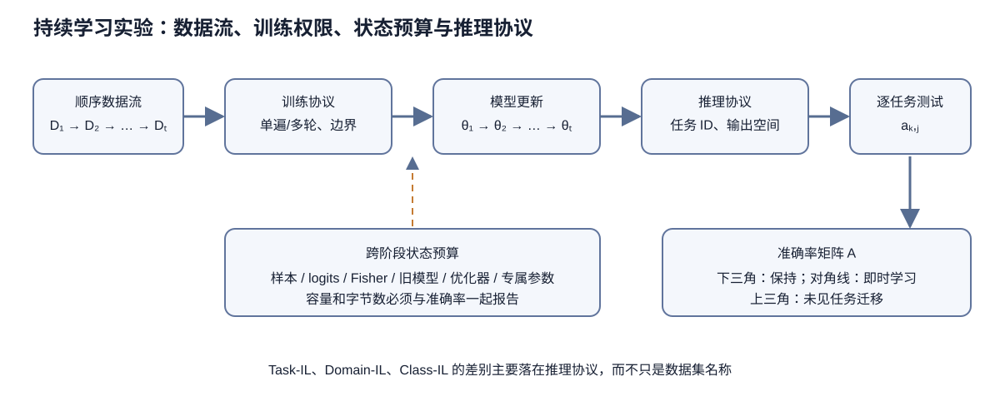

# 持续学习的场景与术语

> 相关阅读: [01 基础与问题定义](../01-基础与问题定义.md) · [2.1 正则化方法](../../02-方法体系/2.1-正则化方法/2.1-正则化方法.md) · [2.2 回放与外部记忆](../../02-方法体系/2.2-回放与外部记忆/2.2-回放与外部记忆.md) · [3.1 评测协议, 指标与任务顺序](../../03-评测与实践/3.1-评测协议指标与任务顺序/3.1-评测协议指标与任务顺序.md)

持续学习研究模型依次在多段数据上训练时, 如何学会新任务而不丢掉旧能力. 讨论具体方法之前, 先要统一场景划分, 术语, 度量和资源约束.

> 图 1: 数据流依次送入模型, 训练协议决定每段数据能看几次、能保存什么状态；推理协议决定任务标识和候选输出空间；各阶段模型在所有测试集上的结果共同组成准确率矩阵.

图 1 把持续学习实验拆成四个不能互相替代的对象. 数据流描述样本到达顺序, 训练协议描述模型在当时可以使用的信息, 状态预算列出参数以外能够跨阶段保留的东西, 推理协议则决定一次预测究竟在几个类别之间竞争. 准确率矩阵记录每个历史模型在各任务测试集上的测量结果. 图中没有预设任务边界一定已知, 也没有把任务标识画进模型输入；这两项都必须由具体实验声明.

## 1 问题设定与三种场景

### 1.1 符号与准确率矩阵

持续学习处理按顺序到达的数据. 设第 $t$ 个阶段 (论文里叫 task, experience 或 context) 提供数据集 $\mathcal{D}_t$, 模型 $f_\theta$ 在 $\mathcal{D}_1, \dots, \mathcal{D}_T$ 上依次训练. 训练第 $t$ 阶段时, 默认拿不到 $\mathcal{D}_1, \dots, \mathcal{D}_{t-1}$ 的全部数据, 只能使用一个容量受限的记忆, 一份旧模型参数, 或者若干统计量.

评测用准确率矩阵. 记 $a_{k,j}$ (GEM 论文记作 $R_{k,j}$) 为模型学完第 $k$ 个任务后在第 $j$ 个任务测试集上的准确率. 矩阵的下三角 ($j \le k$) 反映旧任务的保持情况, 对角线 $a_{k,k}$ 反映刚学完时的水平, 上三角 ($j > k$) 反映尚未训练的任务从已学内容里得到了多少. 第 3.1 篇的全部指标都由这个矩阵算出.

**灾难性遗忘** (catastrophic forgetting) 指模型在新数据上训练后, 旧任务准确率大幅下降. 它的直接原因是参数共享: 新任务的梯度更新了旧任务同样依赖的参数. 如果每个任务都有一个独立网络, 遗忘不会发生, 代价是参数量随任务数线性增长, 也没有任务间的迁移. 持续学习方法都在这两端之间找位置.

需要区分两个常被混用的说法. 「持续学习」(continual learning) 和「终身学习」(lifelong learning) 在多数论文里指同一类问题. 「增量学习」(incremental learning) 多用于分类问题, 常和 class-incremental 连用. 本库统一用「持续学习」, 场景名保留英文缩写.

### 1.2 三种场景的定义

van de Ven & Tolias (2019) 用推理阶段的任务信息区分三种场景:

| 场景 | 推理阶段是否给出任务标识 | 是否需要自己推断任务标识 | 典型输出层 |
|------|------|------|------|
| Task-IL | 给出 | 不需要 | 每个任务一个输出头 (multi-head) |
| Domain-IL | 不给出 | 不需要, 只要解决当前问题 | 所有任务共用一个输出头, 类别集合不变 |
| Class-IL | 不给出 | 需要 | 共用一个输出头, 类别集合逐步扩大 |

三者的差别用 Split MNIST 举例最直接. Split MNIST 把 10 个数字分成 5 个任务, 每个任务两个数字 (0/1, 2/3, ..., 8/9).

- **Task-IL**: 推理阶段告诉模型样本来自第几个任务, 模型只需在该任务的两个数字里选一个. 每个任务有自己的两路输出.
- **Domain-IL**: 不告诉任务标识, 模型只需回答「这是该任务的第一个数字还是第二个数字」, 即判断奇偶. 输出层始终是两路.
- **Class-IL**: 不告诉任务标识, 模型要在已见过的全部数字里选一个. 学完 5 个任务后输出层是十路.

Permuted MNIST 对每个任务的像素施加一个固定的随机置换, 10 个任务共用 0 到 9 的标签. 论文指出它最自然的设定是 Domain-IL: 类别集合不变, 输入分布改变. 它也能按 Task-IL 设定 (告诉模型是哪个置换) 或 Class-IL 设定 (区分「第几个置换下的数字几」, 共 100 类), 但这两种设定在实际应用里少见.

同一个划分在不同论文里的叫法也不同. Split MNIST 用多头输出时被称作 multi-headed, 对应 Task-IL; 用单头输出时被称作 single-headed, 对应 Class-IL. Chaudhry et al. (2018) 用 multi-head 和 single-head 两个词描述同样的区别: single-head 评测中推理阶段不知道任务标识, 模型要在已见过的全部标签里选.

### 1.3 同一数据集上的数字

van de Ven & Tolias (2019) 在两个数据集上测了三个场景. 网络是两层全连接 MLP (Split MNIST 每层 400 个单元, Permuted MNIST 每层 1000 个单元), Adam 优化. Split MNIST 每个任务训练 2000 步, 学习率 0.001; Permuted MNIST 每个任务 5000 步, 学习率 $10^{-4}$. 每个结果取 20 个随机种子的均值.

Split MNIST (论文 Table 4, 平均准确率 %):

| 方法 | Task-IL | Domain-IL | Class-IL |
|------|------|------|------|
| None (直接顺序微调) | 87.19 | 59.21 | 19.90 |
| Offline (全部数据联合训练, 上界) | 99.66 | 98.42 | 97.94 |
| EWC | 98.64 | 63.95 | 20.01 |
| Online EWC | 99.12 | 64.32 | 19.96 |
| SI | 99.09 | 65.36 | 19.99 |
| LwF | 99.57 | 71.50 | 23.85 |
| DGR (生成式回放) | 99.50 | 95.72 | 90.79 |
| DGR+distill | 99.61 | 96.83 | 91.79 |
| iCaRL (存 2000 个样本) | - | - | 94.57 |

Permuted MNIST (论文 Table 5, 平均准确率 %):

| 方法 | Task-IL | Domain-IL | Class-IL |
|------|------|------|------|
| None | 81.79 | 78.51 | 17.26 |
| Offline | 97.68 | 97.59 | 97.59 |
| EWC | 94.74 | 94.31 | 25.04 |
| Online EWC | 95.96 | 94.42 | 33.88 |
| SI | 94.75 | 95.33 | 29.31 |
| LwF | 69.84 | 72.64 | 22.64 |
| DGR | 92.52 | 95.09 | 92.19 |
| DGR+distill | 97.51 | 97.35 | 96.38 |
| iCaRL | - | - | 94.85 |

两张表能读出四件事.

正则化方法 (EWC, Online EWC, SI) 在 Split MNIST 的 Class-IL 上与基线没有差别. 19.90% 约等于只答对最后一个任务: 5 个任务的测试集各占约五分之一, 模型把所有样本都分到最后学到的两个数字里, 准确率就落在 20% 附近. 这三种方法只约束参数离旧值的距离, 不提供任何让旧类别输出保持竞争力的信号. 第 2.1 篇会从损失函数看这一点.

第二, Task-IL 上几乎所有方法都接近上界. Split MNIST 的 Task-IL 基线已有 87.19%, EWC 把它提到 98.64%. 只报 Task-IL 数字的论文, 方法之间的差距被压缩在一两个百分点里.

第三, 回放类方法 (DGR, iCaRL) 在三个场景里都稳定. 论文附录 C 进一步比较了精确回放 (存真实样本): Class-IL 中每类只存 1 个样本, 效果已经超过全部正则化方法. Permuted MNIST 上存 50,000 个样本的精确回放仍低于 DGR+distill.

第四, LwF 在 Permuted MNIST 上明显变差 (Task-IL 69.84%, 低于基线 81.79%). LwF 用当前任务的输入计算旧模型输出作为蒸馏目标. Permuted MNIST 各任务的像素顺序互不相关, 当前任务的输入不能代表旧任务的输入, 蒸馏目标约束不到旧任务输入上的行为. Split MNIST 各任务都是手写数字, 输入分布接近, LwF 在那里有效.

### 1.4 卷积网络与更大数据集

MLP 加 MNIST 的结论在卷积网络上同样成立. Buzzega et al. (2020) 在 DER 论文里用未预训练的 ResNet18 做 Seq-CIFAR-10 (5 个任务, 每个任务 2 类, 每个任务训练 50 个 epoch), 同一次训练分别按 Class-IL 和 Task-IL 评测. 结果取 10 次运行均值 (论文 Table 2):

| 方法 | 缓冲区 | Class-IL | Task-IL |
|------|------|------|------|
| JOINT (上界) | - | 92.20 | 98.31 |
| SGD (顺序微调) | - | 19.62 | 61.02 |
| oEWC | - | 19.49 | 68.29 |
| SI | - | 19.48 | 68.05 |
| LwF | - | 19.61 | 63.29 |
| ER | 200 | 44.79 | 91.19 |
| ER | 500 | 57.74 | 93.61 |
| DER++ | 200 | 64.88 | 91.92 |
| DER++ | 500 | 72.70 | 93.88 |
| DER++ | 5120 | 85.24 | 96.12 |

Task-IL 一列里, 缓冲区 500 的 ER 和 DER++ 只差 0.27 个百分点; 换到 Class-IL, 两者差 14.96 个百分点. 方法优劣只有在 Class-IL 下才能看出来. 不存样本的三种正则化方法, Class-IL 准确率仍然停在 19.5% 左右, 与 Split MNIST 的现象一致.

### 1.5 Class-IL 难在哪里

Task-IL 下, 第 $t$ 个任务的输出头只和本任务的类别竞争. Class-IL 下, 所有类别共用一个 softmax, 训练第 $t$ 个任务时只有本任务类别的样本. 交叉熵对当前类别的 logit 给正梯度, 对其他类别 (包括全部旧类别) 给负梯度, 于是旧类别 logit 被持续压低, 输出层对新类别的偏置越来越大. Masana et al. (2022) 把这种偏向称为 task-recency bias, 并在实验总结里写道: 明确处理 task-recency bias 的方法优于不处理的方法.

这也解释了 Domain-IL 的位置. Domain-IL 的类别集合固定, 不存在新旧类别 logit 的竞争, 但模型没有任务标识可用, 不能为每个域单独维护输出头或归一化统计. Split MNIST 的 Domain-IL 基线是 59.21%, 介于 Task-IL 和 Class-IL 之间. 它的难度主要看相邻域之间的差别.

### 1.5.1 为什么只用新类训练会压低旧类 logit

Class-IL 的偏置可以从一条样本的交叉熵直接算出来. 设模型已经见过旧类别 $1,2$, 当前阶段只出现新类别 $3$, 三个 logit 为 $z=(1.2,0.8,1.0)$. Softmax 概率是

$$
p_c=\frac{e^{z_c}}{e^{1.2}+e^{0.8}+e^{1.0}},
$$

利用 $e^{1.2}\approx3.320$, $e^{0.8}\approx2.226$, $e^{1.0}\approx2.718$, 可得 $p\approx(0.402,0.269,0.329)$. 当前标签 $y=3$, 交叉熵 $\ell=-\log p_3$. 对每个 logit 求导:

$$
\frac{\partial\ell}{\partial z_c}=p_c-\mathbf 1[c=y]
\approx(0.402,0.269,-0.671).
$$

梯度下降执行 $z'_c=z_c-\eta\,\partial\ell/\partial z_c$. 取 $\eta=0.1$, 更新后约为

$$
z'=(1.160,0.773,1.067).
$$

新类 logit 增加 $0.067$, 两个旧类分别下降 $0.040$ 和 $0.027$. 这条样本没有出现旧类, 但 softmax 分母让所有类别参与竞争, 所以旧类仍收到向下更新. 如果当前阶段有一万条新类样本而没有旧类回放, 这种方向会反复累积. 特征提取器也在同时变化, 旧样本即使原来靠较大的 margin 正确分类, margin 也可能从输出层和表示层两端缩小.

回放为什么对 Class-IL 特别重要, 也能在这个导数中看见. 若 batch 中加入一条标签为旧类 $1$ 的样本, 那条样本对自己的梯度是 $p_1-1<0$, 梯度下降会把旧类 $1$ 的 logit 往上推；对新类 $3$ 的梯度是 $p_3>0$, 会把它往下压. 两类样本共同出现时, 更新方向才包含“旧类在什么输入上应当获胜”的信息. 参数正则化只限制 $\theta$ 移动多少, 并没有提供这条输入—类别对应关系, 因而在强 Class-IL 设定下经常只能把崩溃推迟, 很难单独校准新旧类别的竞争.

这段手算仍然只是输出层的一步局部分析. 它不能推出任意回放方法一定有效, 因为缓冲区可能类别失衡、样本过时或只覆盖容易样本；也不能推出 task-recency bias 的全部来源都在 softmax, 因为归一化统计、特征漂移、优化器动量和任务间样本数量差异都会改变结果. 它证明的是更窄的一件事：**在共享输出空间中, 只观察新类的交叉熵本身就会产生压低旧类 logit 的梯度.**

## 2 场景之外需要声明的维度

### 2.1 遍历次数, 任务边界与监督形式

三种场景只描述推理阶段的任务信息. 两篇都写着「Class-IL」的论文, 仍可能在数据流的给法上完全不同: 每个样本看几遍, 训练时知不知道任务在哪里切换, 标签怎么给. 先看遍历次数. GEM 和 A-GEM 采用单遍设定: 每个样本只看一次, batch 大小 10. DER 论文主实验每个任务训练 50 个 epoch. 同一方法换设定, 数字差距很大. DER 论文 Table 5 给出了 Seq-CIFAR-10 单 epoch 的 Class-IL 结果: 缓冲区 500 时 ER 45.22%, DER++ 48.04%; 缓冲区 5120 时 ER 50.28%, DER++ 53.31%; 单 epoch 的联合训练只有 56.74%. 对照第 1.4 节的多 epoch 数字 (缓冲区 500 的 DER++ 72.70%), 单遍设定下方法之间的差距被压缩到 3 个百分点以内.

GDumb (Prabhu et al., 2020) 进一步质疑了在线设定的比较方式. 它在数据到达时只做一件事: 用贪心的类别均衡采样往记忆里放样本. 到推理阶段, 它只用记忆里的样本从头训练一个模型. 这个不针对持续学习做任何设计的方法, 在论文的多个设定里超过了专门设计的在线方法. 它说明不少在线方法的收益可以由「类别均衡的记忆加离线训练」得到.

任务边界是第二个维度. EWC 在任务结束时计算 Fisher 信息并保存参数快照; SI 在任务结束时把路径积分归一化成重要性. 两者都需要知道任务在哪里结束. LwF 在新任务开始时记录旧模型输出, 同样依赖边界. 蓄水池采样 (reservoir sampling) 的 ER, DER 每来一个 batch 就更新缓冲区, 不需要边界. 如果数据流里没有明确的任务切换 (例如分布缓慢漂移), 只有后一类方法能直接使用.

第三个维度是监督形式. 持续学习论文多数是全监督分类. 实际数据流里, 标签可能延迟到达, 只有部分样本有标签, 或者完全没有标签. MAS 计算参数重要性时只用模型输出的 L2 范数, 不需要标签, 可以在无标签数据上更新重要性 (第 2.1 篇). 标签空间的变化也分几种: 只扩展 (Class-IL 的默认假设), 固定 (Domain-IL), 或者同一个标签含义随时间改变. CLEAR 基准用 2004 到 2014 年的 Flickr 图片构造了后一种情况, 固定 11 个类别, 类别对应的视觉外观随年代变化 (第 3.2 篇).

### 2.1.1 任务顺序也是实验变量

即使任务集合完全相同, 到达顺序也会改变难度. 假设三个域分别是新闻、医学和法律文本. 如果新闻与法律的词汇和句式更接近, 顺序“新闻→法律→医学”可能先获得正迁移, 随后再经历一次较大的分布变化；顺序“新闻→医学→法律”则连续遇到两次明显变化. 一次固定顺序的结果把方法能力和这条顺序的偶然性混在了一起.

较完整的协议应先定义允许的顺序集合. 类别增量实验可以用若干随机种子生成类别排列, 每种方法共享完全相同的排列；时间漂移实验不能随意打乱年份, 因为时间方向就是问题的一部分；课程式学习若特意从易到难, 也要把排序规则写成实验条件. 最终结果至少报告不同顺序上的均值和标准差, 不能只挑最有利的一条顺序.

举一个简单例子. 某方法在三条顺序上的最终 ACC 分别为 $0.82,0.78,0.68$, 均值是 $0.76$. 样本标准差为

$$
s=\sqrt{\frac{(0.82-0.76)^2+(0.78-0.76)^2+(0.68-0.76)^2}{3-1}}
\approx0.072.
$$

另一个方法三次都是 $0.75$, 均值只低一个百分点, 却对任务顺序稳定得多. 如果只汇报第一种方法的最好顺序 $0.82$, 会把六个百分点的均值差和七个百分点左右的顺序波动都藏掉. 随机种子还会影响初始化、数据打乱与缓冲区采样, 因而“多个训练种子”和“多个任务顺序”是两层不确定性；预算允许时应采用嵌套实验, 至少不要把两者含糊地统称为运行五次.

任务边界是否已知也要和顺序分开. 已知顺序不等于模型在在线运行时收到切换信号. 研究者可以预先固定一条数据流用于复现, 同时不向算法暴露每个分段的起止位置. 此时依赖任务结束钩子的 EWC 或 SI 需要额外的边界检测机制, 而逐样本更新的 reservoir replay 可以直接运行. 若实验脚本暗中在边界处重置优化器、调学习率或保存教师模型, 算法实际上已经使用了边界信息.

评测时点也要固定. 一种做法是在每个阶段结束后填一整行准确率矩阵, 另一种做法是在数据流中每隔固定样本数评测. 后者能看见阶段内部先学会再遗忘的过程, 但评测更频繁, 也可能诱使研究者反复观察测试集调参. 因此验证集、测试集和早停规则必须分开；持续评测产生更多读数, 并不意味着可以把测试反馈重新送回训练决策.

### 2.2 保留哪些状态

模型以外的状态也影响结果:

- **优化器状态**: Adam 的一阶, 二阶矩是否跨任务保留. Ibrahim et al. (2024) 做大模型继续预训练时, 每次继续训练都重置优化器状态, 理由是开源模型通常不附带优化器状态.
- **归一化统计**: 批归一化 (BN) 的滑动均值和方差会被新任务数据改写. PackNet 在第一个任务之后固定 BN 统计和偏置.
- **外部记忆**: 原始样本, 特征, logits, 生成模型. DER 在缓冲区里同时存样本和网络输出的 logits.
- **历史模型**: LwF 需要上一阶段模型的一份副本来计算蒸馏目标.

这些状态都要计入资源预算, 第 4 节给出清单.

### 2.3 参数能否增长, 从哪里出发

模型本身也有两个维度要声明: 参数量能不能随任务增长, 以及训练从什么初始化开始. PackNet (Mallya & Lazebnik, 2018) 固定网络容量, 每个任务结束后剪掉一部分权重, 腾出来给后续任务. Progressive Neural Networks (Rusu et al., 2016) 每来一个任务新增一列网络, 参数随任务数线性增长, 推理阶段还要靠任务标识选列. 两类方法在「是否存样本」上都是否, 但资源曲线完全不同 (第 2.3 篇).

再看起点. 从随机初始化出发时, 表征本身在持续变化. 从大规模预训练模型出发时, 表征已经稳定, 持续学习只需要调整少量参数. L2P (Wang et al., 2022) 冻结 ImageNet 预训练的 ViT-B/16, 只学一个提示池. Split CIFAR-100 (10 个任务, 每个任务 10 类, Class-IL) 上, 不存任何样本的 L2P 平均准确率 83.83%, 论文给出的 ViT-B/16 联合训练上界是 90.85% (Table 1, Table 2). 同一篇论文 Table 2 里, ResNet18 骨干的上界是 80.41%, 在它上面运行的 SupSup 为 28.34%.

这组数字说明, 换骨干之后上界变了, 方法与上界的差距也变了. 比较方法时要同时报告骨干, 预训练数据和上界.

## 3 稳定性, 可塑性与遗忘的机制

### 3.1 两个方向的失败

稳定性 (stability) 指旧任务的表现不下降, 可塑性 (plasticity) 指新任务能学到应有的水平. 只看遗忘量会漏掉后一种失败. Kirkpatrick et al. (2017) 的 EWC 论文图 2A 给出了三种行为: 普通 SGD 学会任务 B 但忘掉任务 A; 对所有参数施加同样强度的 L2 约束, 任务 A 保住了, 任务 B 却学不进去; EWC 按参数重要性分配约束强度, 两个任务都保持较好.

Chaudhry et al. (2018) 用两个指标分别度量两个方向. 遗忘量定义为任务 $j$ 历史最好准确率与当前准确率之差:

$$
f_j^k = \max_{l \in \{1, \dots, k-1\}} a_{l,j} - a_{k,j}, \quad \forall j < k \tag{1}
$$

学完第 $k$ 个任务后的平均遗忘为 $F_k = \frac{1}{k-1}\sum_{j=1}^{k-1} f_j^k$. 顽固性 (intransigence) 衡量模型学不进新任务的程度:

$$
I_k = a_k^* - a_{k,k} \tag{2}
$$

其中 $a_k^*$ 是参照模型在任务 $k$ 上的准确率, 参照模型用 $\bigcup_{l=1}^{k}\mathcal{D}_l$ 联合训练. 两个指标的取值都在 $[-1, 1]$ 之间, 越低越好. 论文指出顽固性在 single-head 评测中更突出, 并报告每类存少量样本就能显著降低顽固性.

正则化强度对两个指标的作用方向相反. 约束越强, $F_k$ 越小, $I_k$ 越大; 约束越弱则相反. 一个方法只报遗忘量, 读者无法判断它是否以顽固性为代价.

### 3.1.1 从一张小矩阵手算 ACC、BWT、FWT 与遗忘量

只看符号很容易把“最终准确率”“后向迁移”和“遗忘量”混成同一个数. 设有三个任务, 第 $k$ 行记录学完任务 $k$ 后的模型, 第 $j$ 列记录任务 $j$ 的测试集:

$$
A=egin{bmatrix}
0.90 & 0.34 & 0.31\\
0.78 & 0.86 & 0.36\\
0.70 & 0.79 & 0.88
\end{bmatrix}.
$$

上三角的 $0.34,0.31,0.36$ 是模型尚未训练相应任务时的表现. 为了计算前向迁移, 还需要同一架构从随机初始化直接测试的基线, 设三个任务分别为 $b=(0.30,0.32,0.33)$. 所有量都以准确率的小数表示, 计算完成后再换成百分点.

最终平均准确率只读最后一行:

$$
\mathrm{ACC}_3=\frac{1}{3}\sum_{j=1}^{3}a_{3,j}
=\frac{0.70+0.79+0.88}{3}=0.79.
$$

它回答“经历完整数据流后, 三个任务平均做得怎样”. 它没有告诉我们任务 1 的 $0.70$ 是一直很低, 还是从很高的位置跌下来. 后向迁移把最终表现与各任务刚学完时的对角线相比:

$$
\mathrm{BWT}_3=\frac{1}{2}\sum_{j=1}^{2}(a_{3,j}-a_{j,j})
=\frac{(0.70-0.90)+(0.79-0.86)}{2}=-0.135.
$$

负的 $-0.135$ 表示前两个任务平均下降 13.5 个百分点. 若这个值为正, 后续训练反而改善了旧任务；因此 BWT 不能一律叫“遗忘”. Chaudhry 定义的遗忘量使用历史最好值, 对任务 1 和任务 2 分别有

$$
f_1^3=\max(0.90,0.78)-0.70=0.20,
\qquad
f_2^3=0.86-0.79=0.07,
$$

于是 $F_3=(0.20+0.07)/2=0.135$. 这个例子里它恰好等于 $-\mathrm{BWT}_3$, 原因是两个任务的历史最好值都出现在对角线. 如果任务 1 在学完任务 2 后从 $0.90$ 升到 $0.94$, 再跌到 $0.70$, 遗忘量会按 $0.94-0.70=0.24$ 计算, 而 BWT 仍按 $0.70-0.90=-0.20$ 计算. 两个指标此时就不再互为相反数.

前向迁移只使用上三角中“尚未学习便去测试”的格子, 并减去随机基线:

$$
\mathrm{FWT}_3=\frac{(a_{1,2}-b_2)+(a_{1,3}-b_3)+(a_{2,3}-b_3)}{3}
=\frac{(0.34-0.32)+(0.31-0.33)+(0.36-0.33)}{3}=0.01.
$$

这个 $1$ 个百分点只说明先前训练对未见任务的零样本表现略有帮助. 若不同论文使用预训练模型, “随机基线”可能要换成预训练起点的表现, 否则 FWT 会把预训练已经提供的迁移全部记到持续学习方法名下. 还要注意, 有的论文只使用紧邻任务的上三角格子, 有的使用全部上三角；公式口径不同, 同名 FWT 也不能直接比较.

### 3.2 一阶解释: 梯度干扰

设模型当前参数为 $\theta$, 旧任务 A 的损失梯度为 $g_A = \nabla_\theta \mathcal{L}_A(\theta)$, 新任务 B 的梯度为 $g_B$. 用学习率 $\eta$ 沿 $-g_B$ 走一步, 旧任务损失的一阶泰勒展开为

$$
\mathcal{L}_A(\theta - \eta g_B) \approx \mathcal{L}_A(\theta) - \eta\, g_A^\top g_B \tag{3}
$$

当 $g_A^\top g_B > 0$, 这一步同时降低旧任务损失; 当 $g_A^\top g_B < 0$, 旧任务损失上升. 两个梯度夹角小于 90° 时不会造成一阶意义上的遗忘.

GEM (Lopez-Paz & Ranzato, 2017) 把这个条件写成约束: 对记忆中每个旧任务 $k$, 要求更新方向 $\tilde g$ 满足 $\langle \tilde g, g_k \rangle \ge 0$. 违反时求解一个二次规划, 把 $g$ 投影到离它最近的可行方向. A-GEM 把多个约束合成一个, 只要求与一批随机记忆样本的平均梯度内积非负. 两者的推导和代价见第 2.2 篇.

式 (3) 只在步长足够小时成立. 学习率较大, 或者多步累积之后, 二阶项和曲率的作用会显现. EWC 用 Fisher 信息近似旧任务损失在最优点附近的曲率, 是从二阶角度处理同一个问题 (第 2.1 篇).

### 3.2.1 两维参数上的梯度干扰手算

设参数只有两维, 旧任务梯度为 $g_A=(2,-1)^{\mathsf T}$, 新任务梯度为 $g_B=(-1,2)^{\mathsf T}$, 学习率 $eta=0.05$. 两个梯度的内积为

$$
g_A^{\mathsf T}g_B=2\times(-1)+(-1)\times2=-4.
$$

按式 (3), 沿新任务梯度更新一步后, 旧任务损失的一阶变化是

$$
\Delta\mathcal L_A\approx-\eta g_A^{\mathsf T}g_B
=-0.05\times(-4)=0.20.
$$

也就是说, 这一步预计让旧任务损失增加 $0.20$. 内积的绝对值同时受梯度尺度影响, 因而常用余弦相似度只看方向:

$$
\cos\phi=\frac{-4}{\sqrt{2^2+(-1)^2}\sqrt{(-1)^2+2^2}}=-\frac45=-0.8.
$$

夹角大于 $90^\circ$, 干扰很强. 现在把新任务梯度投影到与 $g_A$ 正交的边界. 单个旧任务约束下, 最近的可行方向可以写成

$$
\tilde g
=g_B-\frac{g_A^{\mathsf T}g_B}{g_A^{\mathsf T}g_A}g_A
=(-1,2)^{\mathsf T}-\frac{-4}{5}(2,-1)^{\mathsf T}
=(0.6,1.2)^{\mathsf T}.
$$

复算可得 $g_A^{\mathsf T}\tilde g=2\times0.6-1.2=0$, 所以沿 $-\tilde g$ 更新时, 旧任务损失的一阶变化为零. 投影没有保证旧任务真实损失绝不增加：泰勒展开还有 $O(\eta^2)$ 的曲率项, 记忆 batch 的梯度也只是旧分布梯度的估计. 它同样没有保证新任务下降得与原方向一样快, 因为投影删掉了 $g_B$ 中与旧任务冲突的分量. 这正是稳定性与可塑性的局部几何版本.

多任务 GEM 要同时满足 $G^{\mathsf T}\tilde g\ge0$, $G$ 的每一列对应一个旧任务梯度. 可行域是多个半空间的交集, 投影因此变成二次规划. 若旧任务之间的梯度本身互相冲突, 可行域可能只允许很小的更新；A-GEM 把它们平均成一个参考梯度后计算便宜了, 但单个旧任务仍可能被平均方向掩盖. 所以“内积非负”是一阶、采样条件下的局部约束, 不是长期不遗忘的证明.

### 3.3 权衡点会移动

De Lange et al. (2022) 的综述在统一设定下比较了 11 种方法和 4 个基线, 数据集包括均衡的 Tiny ImageNet, 类别严重不均衡的 iNaturalist, 以及由多个差异很大的识别数据集组成的 RecogSeq. 该综述采用 Task-IL (multi-head) 设定. 他们的结论之一是: 在均衡的小规模 Tiny ImageNet 上各类方法都表现不错, 换到不均衡的 iNaturalist 和任务差异大的 RecogSeq 后, 这种表现不再成立, 参数隔离类方法相对更能承受.

为了在持续学习中合理选超参数, 他们提出两阶段框架. 第一阶段 (Maximal Plasticity Search) 只在新任务上微调一个模型副本, 用粗网格搜索学习率, 得到新任务能达到的最好准确率 $A^*$. 第二阶段 (Stability Decay) 用这个学习率运行持续学习方法, 方法自身的超参数 (例如正则化系数) 先取最大值, 如果新任务准确率比 $A^*$ 低出容忍阈值 $p$, 就把超参数乘以衰减因子 $\alpha$ 后重来. 这个流程只用新任务数据做选择, 不偷看旧任务的验证集, 同时把可塑性的下限交给用户设定.

## 4 资源预算

### 4.1 需要报告的资源

「不存旧数据」「内存高效」这类结论, 要和下面的资源一起报告:

| 资源 | 需要报告的内容 |
|------|------|
| 原始样本 | 样本数, 字节数, 采样策略, 隐私限制 |
| 中间表示 | 特征或 logits 的维度与精度, 能否反推出原始数据 |
| 参数与掩码 | 随任务增长的参数量, 掩码位数, 任务专属模块数量 |
| 统计量 | Fisher 矩阵, 参数快照, 原型, BN 统计的存储尺寸 |
| 计算 | 每个阶段的训练步数, 额外前向/反向次数, 峰值显存 |
| 时间 | 训练吞吐, 适应延迟, 重置或恢复的代价 |

几个具体例子: EWC 每个任务要存一份 Fisher 对角和一份参数快照, Online EWC 把多个任务的 Fisher 合并成一份, 存储不再随任务数增长. PackNet 的掩码对每个参数需要 $\log_2 N$ 位 ($N$ 为任务数); 论文报告 VGG-16 为 537 MB, 加一个任务的掩码约 17 MB, 加三个任务约 34 MB. A-GEM 论文 Table 7 报告了训练时间: Permuted MNIST 上 GEM 3442 秒, A-GEM 477 秒, EWC 403 秒, 普通 SGD 186 秒. 只比准确率的表格看不到这些差别.

参数隔离方法可能不存样本, 却让参数随任务增长; 回放方法参数固定, 却占用数据存储. 两类方法的比较要放在「性能对总资源」的坐标里看.

### 4.2 大模型的显存

传统持续学习实验的骨干多在 ResNet18 (约 11M 参数) 到 ViT-B/16 (约 86M 参数) 之间, 显存不构成限制. 到了数十亿参数的语言模型, 能不能全量更新本身成了问题. 以 70B 参数为例, 按每个参数的字节数估算:

| 项 | 每参数字节 | 70B 模型合计 |
|------|------|------|
| BF16 权重 | 2 | 140 GB |
| BF16 梯度 | 2 | 140 GB |
| FP32 主权重 | 4 | 280 GB |
| Adam 一阶, 二阶矩 (FP32) | 8 | 560 GB |
| 混合精度 Adam 全量训练合计 (不含激活) | 16 | 1120 GB |
| 4-bit 量化权重 | 0.5 | 约 35 GB (另加量化常数) |

16 字节的拆分与 ZeRO 论文 (Rajbhandari et al., 2020) 第 3.1 节一致: 混合精度 Adam 下, 模型状态为 $2\Psi + 2\Psi + 12\Psi = 16\Psi$ 字节, $\Psi$ 为参数量.

由此可以得出几个结论:

- 仅 BF16 权重就是 140 GB, 一张 80 GB 显卡装不下 70B 模型. 冻结权重的 LoRA 省掉了梯度和优化器状态的大头, 但权重本身仍要占 140 GB.
- QLoRA (Dettmers et al., 2023) 把冻结权重量化到 4 bit, 再在上面训练 LoRA, 论文报告在单张 48 GB 显卡上微调 65B 参数模型.
- 全量更新时使用 EWC, 对角 Fisher 用 FP32 存需要 $70\times10^9 \times 4$ 字节, 即 280 GB, 另加一份 140 GB 的 BF16 参数快照.
- 每个任务训练一组 LoRA 参数时, 任务专属存储只有 $r(d+k)$ 量级 ($r$ 为秩, $d, k$ 为被适配矩阵的两维), 参数隔离在这一尺度上变得便宜. O-LoRA 和 InfLoRA 研究的是这些低秩更新之间如何不互相干扰 (第 2.4 篇).

## 5 相邻概念与问题声明

### 5.1 在线学习, 域自适应与长上下文 TTT

**在线学习** (online learning) 的理论框架是遗憾最小化: 样本逐个到达, 模型逐个更新, 目标是累积损失与事后最优的固定假设之差 (regret) 增长得足够慢. 它评价的是整个过程中的累积表现, 不单独度量旧数据上的性能. 持续学习评价的是学完之后对历史分布的保持, 也不一定要求单遍. 「在线持续学习」把两者叠加: 每个样本只看一次, 同时要求保持旧任务. GEM, A-GEM 和 Chaudhry et al. (2019) 的 tiny episodic memory 实验都在这一设定下进行. 单遍结果和多 epoch 结果不能放在同一张表里比较.

**域自适应** (domain adaptation) 的标准设定是先在源域训练, 再适配到一个目标域, 评价只看目标域. TestingTime 适应 (TTA, test-time adaptation) 把适配推迟到部署时, 用无标签的目标数据在推理阶段更新模型. Schneider et al. (2020) 的 BN-adapt 用目标数据重新估计批归一化统计; Tent (Wang et al., 2021) 用目标 batch 的统计做归一化, 并通过最小化预测熵更新 BN 层的仿射参数.

如果 TTA 的状态在一段很长的数据流上一直累积, 不做重置, 它就面对持续学习的问题: 早先的适应会被后来的数据覆盖, 错误的伪标签还会累积. CoTTA (Wang et al., 2022) 研究的就是这种持续 TestingTime 适应. 这类工作的评测通常报告目标流上的错误率, 不按 Task-IL/Class-IL 划分, 也很少报告回到旧域时的表现. 本库第 4 章专门讨论这部分.

**长上下文 TTT** 名字相近, 问题不同. TTT 层 (Sun et al., 2024) 把一个小模型的权重当作序列模型的隐藏状态, 每读入一段 token 就用自监督损失对这组权重做一步梯度更新, 用来压缩长上下文. 它的权重更新在一条序列内发生, 序列结束后不带到下一条序列. 它要解决的是长序列建模的计算复杂度, 与跨任务保持知识是两个问题. 两者的共同点在于: 内循环写入新信息时同样可能覆盖先前写入的信息. 本库第 5 章讨论这部分.

### 5.2 问题声明模板

读一篇持续学习论文, 或者写自己的实验, 可以先填下面这张表:

| 项 | 需要写明的内容 |
|------|------|
| 场景 | Task-IL / Domain-IL / Class-IL, 或无明确任务的数据流 |
| 任务划分 | 任务数, 每个任务的类别或域, 任务顺序及随机化方式 |
| 遍历 | 单遍还是多 epoch, 每个任务的步数 |
| 边界 | 训练时是否知道任务切换 |
| 记忆 | 允许存什么 (样本, logits, 特征, 生成模型), 容量多少 |
| 参数 | 是否允许增长, 增长上限 |
| 起点 | 随机初始化还是预训练模型, 预训练数据是什么 |
| 指标 | 平均准确率, 遗忘, 前向/后向迁移, 顽固性 |
| 重复 | 随机种子数, 任务顺序数, 是否报告标准差 |
| 资源 | 存储, 训练时间, 峰值显存 |

表里空着的项, 就是这篇论文的结果无法与别人直接比较的地方.

## 参考文献

1. van de Ven, G. M., & Tolias, A. S. (2019). [Three scenarios for continual learning](https://arxiv.org/abs/1904.07734). *arXiv:1904.07734*.
2. Buzzega, P., Boschini, M., Porrello, A., Abati, D., & Calderara, S. (2020). [Dark Experience for General Continual Learning: a Strong, Simple Baseline](https://arxiv.org/abs/2004.07211). *NeurIPS 2020*.
3. Chaudhry, A., Dokania, P. K., Ajanthan, T., & Torr, P. H. S. (2018). [Riemannian Walk for Incremental Learning: Understanding Forgetting and Intransigence](https://arxiv.org/abs/1801.10112). *ECCV 2018*.
4. Kirkpatrick, J., et al. (2017). [Overcoming catastrophic forgetting in neural networks](https://arxiv.org/abs/1612.00796). *PNAS*.
5. Lopez-Paz, D., & Ranzato, M. (2017). [Gradient Episodic Memory for Continual Learning](https://arxiv.org/abs/1706.08840). *NeurIPS 2017*.
6. Chaudhry, A., Ranzato, M., Rohrbach, M., & Elhoseiny, M. (2019). [Efficient Lifelong Learning with A-GEM](https://arxiv.org/abs/1812.00420). *ICLR 2019*.
7. Chaudhry, A., et al. (2019). [On Tiny Episodic Memories in Continual Learning](https://arxiv.org/abs/1902.10486). *arXiv:1902.10486*.
8. Prabhu, A., Torr, P. H. S., & Dokania, P. K. (2020). [GDumb: A Simple Approach that Questions Our Progress in Continual Learning](https://www.ecva.net/papers/eccv_2020/papers_ECCV/papers/123470511.pdf). *ECCV 2020*.
9. Masana, M., et al. (2022). [Class-incremental learning: survey and performance evaluation on image classification](https://arxiv.org/abs/2010.15277). *IEEE TPAMI*.
10. De Lange, M., et al. (2022). [A continual learning survey: Defying forgetting in classification tasks](https://arxiv.org/abs/1909.08383). *IEEE TPAMI*.
11. Wang, Z., et al. (2022). [Learning to Prompt for Continual Learning](https://arxiv.org/abs/2112.08654). *CVPR 2022*.
12. Mallya, A., & Lazebnik, S. (2018). [PackNet: Adding Multiple Tasks to a Single Network by Iterative Pruning](https://arxiv.org/abs/1711.05769). *CVPR 2018*.
13. Rusu, A. A., et al. (2016). [Progressive Neural Networks](https://arxiv.org/abs/1606.04671). *arXiv:1606.04671*.
14. Ibrahim, A., et al. (2024). [Simple and Scalable Strategies to Continually Pre-train Large Language Models](https://arxiv.org/abs/2403.08763). *arXiv:2403.08763*.
15. Rajbhandari, S., Rasley, J., Ruwase, O., & He, Y. (2020). [ZeRO: Memory Optimizations Toward Training Trillion Parameter Models](https://arxiv.org/abs/1910.02054). *SC 2020*.
16. Dettmers, T., Pagnoni, A., Holtzman, A., & Zettlemoyer, L. (2023). [QLoRA: Efficient Finetuning of Quantized LLMs](https://arxiv.org/abs/2305.14314). *NeurIPS 2023*.
17. Schneider, S., et al. (2020). [Improving robustness against common corruptions by covariate shift adaptation](https://arxiv.org/abs/2006.16971). *NeurIPS 2020*.
18. Wang, D., Shelhamer, E., Liu, S., Olshausen, B., & Darrell, T. (2021). [Tent: Fully Test-time Adaptation by Entropy Minimization](https://arxiv.org/abs/2006.10726). *ICLR 2021*.
19. Wang, Q., Fink, O., Van Gool, L., & Dai, D. (2022). [Continual Test-Time Domain Adaptation](https://arxiv.org/abs/2203.13591). *CVPR 2022*.
20. Sun, Y., et al. (2024). [Learning to (Learn at Test Time): RNNs with Expressive Hidden States](https://arxiv.org/abs/2407.04620). *arXiv:2407.04620*.
