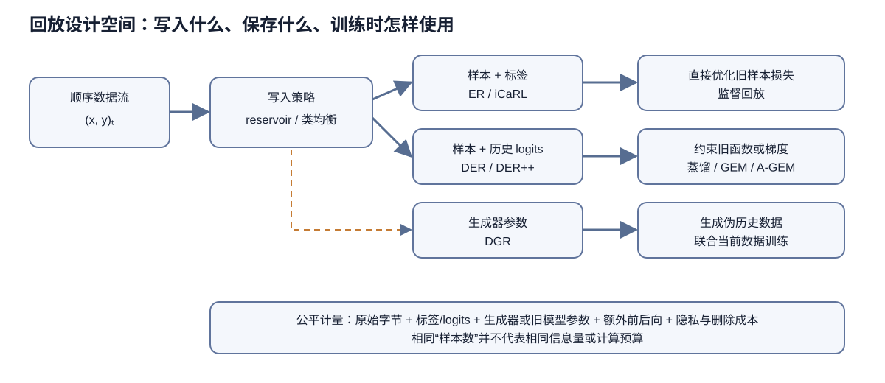

# 回放与外部记忆

> 相关阅读: [1.1 持续学习的场景与术语](../../01-基础与问题定义/1.1-持续学习的场景与术语/1.1-持续学习的场景与术语.md) · [2.1 正则化方法](../2.1-正则化方法/2.1-正则化方法.md) · [2.3 参数隔离与动态架构](../2.3-参数隔离与动态架构/2.3-参数隔离与动态架构.md) · [3.2 基准, 框架与复现实验](../../03-评测与实践/3.2-基准框架与复现实验/3.2-基准框架与复现实验.md)

回放方法在训练新任务时, 让旧任务的样本, 旧模型的输出或生成的样本重新参与梯度计算. 依次讨论样本怎么存 (ER, iCaRL), 怎么用 (GEM, A-GEM, DER, BiC), 只靠记忆训练的 GDumb, 以及用生成器代替存储的 DGR.

> 图 1: 数据流先由写入策略压缩进有限记忆；记忆可以保存标签、历史 logits 或由生成器表示的分布, 训练时分别用于直接回放、梯度约束、函数蒸馏或重建旧数据.

图 1 的三层不能只报其中一层. “用了 500 条记忆”没有说明这些样本怎样进入缓冲区, “用了 replay”也没有说明旧样本是否直接进入交叉熵. ER 读取标签, DER 读取写入时的 logits, DER++ 同时使用两者, GEM 则只把记忆 batch 变成梯度约束. 生成式回放看似没有保存原始样本, 却把历史分布压入生成器参数, 因而仍然占存储和训练预算. 图中没有把任一路线标成固定最优；类别不平衡、任务边界、隐私限制和计算预算都会改变选择.

## 1 存样本: ER 与 iCaRL

### 1.1 ER 的损失与训练流程

Experience Replay (ER) 维护一个容量为 $M$ 的缓冲区 $\mathcal{M}$. 每个训练步取当前数据流的一个 batch $B_t$, 再从缓冲区随机取一个 batch $B_\mathcal{M}$, 在两者的并集上计算损失:

$$
\mathcal{L}_{\text{ER}}(\theta) = \frac{1}{|B_t|}\sum_{(x,y)\in B_t}\ell\big(f_\theta(x), y\big) + \frac{1}{|B_\mathcal{M}|}\sum_{(x,y)\in B_\mathcal{M}}\ell\big(f_\theta(x), y\big) \tag{1}
$$

然后按某个策略把 $B_t$ 中的样本写入缓冲区. 式 (1) 里两项的权重, 两个 batch 的大小, 每个数据流 batch 对应几次回放, 是否对回放样本做数据增强, 都会改变结果, 所以「ER」的数字要连同这些设置一起报告. Class-IL 下, 如果只用新类别的数据训练, 交叉熵只会压低旧类别的 logit; 旧样本, 旧模型的输出或生成样本, 是旧类别 logit 还能得到正向信号的来源. DER 论文对数据流和缓冲区样本都做了数据增强.

### 1.2 蓄水池采样

蓄水池采样 (reservoir sampling) 是最常用的写入策略. 设到目前为止数据流共出现了 $n$ 个样本:

- 若 $n \le M$, 直接写入缓冲区.
- 若 $n > M$, 以概率 $M/n$ 保留第 $n$ 个样本, 并随机替换缓冲区中的一个位置; 否则丢弃.

在任意时刻, 已出现的 $n$ 个样本每个留在缓冲区里的概率都是 $M/n$. 用归纳法: 设处理完第 $n-1$ 个样本后结论成立, 即每个旧样本在缓冲区里的概率为 $M/(n-1)$. 第 $n$ 个样本到来时, 某个旧样本被替换掉的概率是「新样本被保留」乘以「恰好选中它所在的位置」, 即 $\frac{M}{n}\cdot\frac{1}{M} = \frac{1}{n}$. 于是旧样本仍在缓冲区的概率为

$$
\frac{M}{n-1}\cdot\Big(1-\frac{1}{n}\Big) = \frac{M}{n} \tag{1a}
$$

新样本被保留的概率按规则就是 $M/n$, 结论对 $n$ 也成立. 因此缓冲区是数据流的均匀随机样本. 这个策略有两个性质:

- **不需要任务边界**. 写入规则只依赖计数 $n$, 数据流里有没有任务切换都一样. DER 论文用它构造了无边界的实验.
- **不保证类别均衡**. 缓冲区的类别比例跟着数据流走. 如果某个类在数据流里只占很小比例, 它在缓冲区里也只占很小比例, 极端情况下一个都没有. 需要类别均衡时, 要换成按类分配容量的写入策略.
- **对时间均匀**. 每个历史样本留在缓冲区的概率相同, 早期样本和近期样本一视同仁. 分布随时间漂移时, 这未必最好. CLEAR 论文 (Lin et al., 2021) 附录 Table 2 在 MoCo 特征加线性层的设定下比较了偏向近期样本的蓄水池采样: 缓冲区只有一个时间桶大小时, 提高新样本进入缓冲区的概率 (偏置参数 $\alpha = 5.0$, 或随时间变化的 $\alpha = 0.75\, i/k$), 各项指标比普通蓄水池采样 ($\alpha = 1.0$) 高约 1%. 该论文的评测用下一个时间段的数据, 近期样本更接近要预测的分布.

### 1.2.1 容量为 2 的蓄水池手算

取 $M=2$, 数据流依次到达 $x_1,x_2,x_3,x_4$. 前两个样本直接占满缓冲区. $x_3$ 以 $2/3$ 的概率进入, 进入后等概率替换两个位置, 因而 $x_1$ 在这一步被换掉的概率是 $(2/3)(1/2)=1/3$, 留存概率为 $2/3$. 到 $x_4$ 时, 新样本以 $2/4=1/2$ 的概率进入, 条件于进入又以 $1/2$ 的概率命中 $x_1$ 所在位置. 所以

$$
P(x_1\text{最终留存})
=1\times\left(1-\frac13\right)\times\left(1-\frac14\right)
=\frac12.
$$

$x_3$ 的最终留存概率是它先以 $2/3$ 进入, 再以 $3/4$ 避开第四步替换, 同样为 $1/2$；$x_4$ 直接以 $1/2$ 进入. 四个样本的边缘留存概率都等于 $M/n=2/4$. 这不表示任意两个样本的留存事件相互独立, 因为缓冲区始终只能容纳两个位置. 例如 $x_1$ 留存会改变其他样本占据剩余位置的条件概率.

现在把数据流类别写成 $A,A,A,B$. 均匀样本性质意味着 $B$ 的期望槽位只有 $2\times(1/4)=0.5$ 个. 缓冲区完全没有 $B$ 的概率等于从三个 $A$ 中选两个, 再除以从四个样本中选两个:

$$
P(N_B=0)=\frac{\binom32}{\binom42}=\frac12.
$$

也就是说, 样本层面的无偏并不等于类别层面的均衡. 如果评测要求四个类别等权, 而数据流中稀有类只占四分之一, 这个缓冲区有一半概率根本不给稀有类留下监督. 按类 ring buffer 会强制保留 $B$, 代价是它不再近似原始数据流的总体分布. 选哪一个取决于最终风险函数是按样本频率加权, 还是按类别等权.

### 1.3 记忆极小时选哪种策略

Chaudhry et al. (2019) 的「On Tiny Episodic Memories in Continual Learning」研究了缓冲区很小时 ER 的表现. 设定是单遍训练, 每个任务有整数任务标识, 使用多头输出. 他们比较了几种写入策略: 蓄水池采样, 每类一个环形缓冲区 (ring buffer, 保证类别均衡, 存每类最近的样本), 按 k-means 聚类中心选样, 以及 Mean of Features (选特征最接近类均值的样本).

主要结论:

- ER 在 CIFAR 上优于 A-GEM: 每类存 1 个样本时高 1.7 个百分点, 每类 13 个样本时高 5 个百分点以上. 相对微调和 EWC, ER 每类 1 个样本时高 15 个百分点, 13 个样本时高约 28 个百分点.
- 记忆不太小时蓄水池采样最好. 记忆极小 (每类少于 3 个样本) 时, 类别均衡的环形缓冲区, k-means, Mean of Features 更好; 每类 1 个样本时, 蓄水池采样比 k-means 低 3.5 个百分点. 原因就是 1.2 节说的: 记忆极小时蓄水池采样可能漏掉某些类.
- 论文据此提出混合策略: 先用蓄水池采样, 记忆偏小时改成按类均衡.

论文 Table 1 给出每类 1 个样本时的平均遗忘 (越低越好):

| 方法 | MNIST | CIFAR | CUB | miniImageNet |
|------|------|------|------|------|
| 微调 | 0.29 | 0.27 | 0.13 | 0.26 |
| EWC | 0.18 | 0.27 | 0.14 | 0.21 |
| A-GEM | 0.21 | 0.14 | 0.09 | 0.13 |
| MER | 0.14 | 0.19 | 0.10 | 0.15 |
| ER (环形缓冲区) | 0.12 | 0.13 | 0.03 | 0.12 |

记忆样本在训练中被反复使用, 每类只有一个样本时, 模型完全可以把它记住. 这张表说明, 即使如此, 在这些样本上训练仍然比只用它们算约束 (A-GEM) 或完全不用 (EWC) 更能减少遗忘.

### 1.4 iCaRL: 类均值分类与 herding 选样

ER 和蓄水池采样都不按类别管理缓冲区. Rebuffi et al. (2017) 的 iCaRL 面向 Class-IL, 样本按类存放, 分类也按类进行, 有三个组成部分.

**分类规则**. 网络由特征提取器 $\varphi$ 和一层 sigmoid 输出组成, 特征做 L2 归一化. 推理阶段不用输出层, 而是对每个已见类别 $y$ 计算样本集 $P_y$ 的特征均值 $\mu_y = \frac{1}{|P_y|}\sum_{p\in P_y}\varphi(p)$, 把输入判给最近的类均值:

$$
y^* = \arg\min_{y}\ \big\|\varphi(x) - \mu_y\big\| \tag{2}
$$

论文的理由是: 输出层每个类的权重向量与特征提取器解耦, 特征变化时旧类权重不会跟着变, 导致输出失控; 类均值由当前特征提取器重新计算, 会随表征自动更新.

**训练损失**. 学新类别 $s,\dots,t$ 时, 训练集是新数据加全部样本. 对新类别用二元交叉熵, 对旧类别 $1,\dots,s-1$ 用旧网络在同一输入上的输出 $q_i^y$ 做蒸馏目标:

$$
\ell(\Theta) = -\sum_{(x_i,y_i)}\Big[\sum_{y=s}^{t}\big(\delta_{y=y_i}\log g_y(x_i) + \delta_{y\ne y_i}\log(1-g_y(x_i))\big) + \sum_{y=1}^{s-1}\big(q_i^y\log g_y(x_i) + (1-q_i^y)\log(1-g_y(x_i))\big)\Big] \tag{3}
$$

**选样与记忆分配**. 总容量为 $K$ 个样本, 已见 $t$ 个类时每类保留 $m = K/t$ 个. 新类别的样本用 herding 选择: 依次挑选能让已选样本的特征均值最接近该类全体特征均值的样本, 得到一个有序列表. 类别增加时, 旧类只需截掉列表末尾的样本.

iCIFAR-100 实验用 32 层 ResNet, $K = 2000$, 每个增量阶段训练 70 个 epoch, 类别顺序随机 10 次取平均. 论文图 3 的混淆矩阵显示: 只做微调的网络只预测最近一批类别; 只做蒸馏的 LwF.MC 偏向最近几批类别; iCaRL 的预测接近均匀地分布在所有类别上. van de Ven & Tolias (2019) 的 Split MNIST Class-IL 上, 存 2000 个样本的 iCaRL 为 94.57%.

herding 的作用后来被重新检验. Masana et al. (2022) 在统一框架下比较类别增量方法时发现, 随机挑选旧样本的结果与 herding 相当, 任务序列较短时尤其如此; 带旧样本的直接微调 (FT-E) 在若干设定下超过更复杂的方法.

## 2 用记忆约束梯度: GEM 与 A-GEM

### 2.1 GEM 的约束与二次规划

Lopez-Paz & Ranzato (2017, Facebook AI Research) 的 Gradient Episodic Memory 为每个旧任务 $k$ 维护一个记忆 $\mathcal{M}_k$, 存该任务最近的 $m$ 个样本. 与 ER 不同, GEM 不在记忆样本上训练, 损失只在当前样本上计算; 记忆只用来计算旧任务的梯度 $g_k = \nabla_\theta \ell(f_\theta, \mathcal{M}_k)$, 作为约束.

第 1.1 篇式 (3) 说明, 更新方向与 $g_k$ 内积非负时, 旧任务损失一阶意义上不会上升. GEM 要求更新方向 $\tilde g$ 对所有旧任务都满足这一条:

$$
\langle \tilde g, g_k\rangle \ge 0, \quad \forall k < t \tag{4}
$$

若当前梯度 $g$ 已经满足, 直接使用; 否则求离 $g$ 最近的可行方向:

$$
\min_{\tilde g}\ \frac{1}{2}\|g - \tilde g\|_2^2 \quad \text{s.t.}\quad G\tilde g \ge 0 \tag{5}
$$

$G$ 的每一行是一个 $g_k^\top$, 共 $t-1$ 行. 式 (5) 的变量维度是参数量 $p$, 直接求解很贵. 论文转到对偶问题:

$$
\min_{v}\ \frac{1}{2}v^\top G G^\top v + g^\top G^\top v \quad \text{s.t.}\quad v \ge 0 \tag{6}
$$

解出 $v^*$ 后, 投影方向为 $\tilde g = G^\top v^* + g$.

式 (6) 由拉格朗日对偶得到. 对式 (5) 引入乘子 $v \ge 0$, 拉格朗日函数为 $\frac{1}{2}\|\tilde g - g\|^2 - v^\top G\tilde g$. 对 $\tilde g$ 求导并令其为零, 得 $\tilde g = g + G^\top v$. 代回拉格朗日函数, 去掉与 $v$ 无关的常数并取负号, 就是式 (6) 的最小化问题. 由于 $v \ge 0$, 投影后的方向等于原梯度加上若干旧任务梯度的非负组合: 当前梯度与哪个旧任务冲突, 就往哪个旧任务的梯度方向补一点. 对偶问题只有 $t-1$ 个变量. 论文以 CIFAR100 实验为例, 网络有 $p = 1{,}109{,}240$ 个参数, 而对偶变量最多 19 个.

### 2.1.1 两个旧任务约束的几何手算

设参数只有二维, 当前任务梯度 $g=(-2,-1)^{\mathsf T}$, 两个旧任务记忆梯度为

$$
g_1=(1,0)^{\mathsf T},\qquad g_2=(0,1)^{\mathsf T}.
$$

原方向同时违反两个约束, 因为 $g^\mathsf{T}g_1=-2$, $g^\mathsf{T}g_2=-1$. 可行方向必须满足 $\tilde g_1\ge0$ 且 $\tilde g_2\ge0$, 也就是二维平面的第一象限. 离 $(-2,-1)$ 最近的可行点显然是原点, 但可以把它从对偶式完整算出来. 此时

$$
G=\begin{bmatrix}1&0\\0&1\end{bmatrix},\qquad GG^\mathsf{T}=I,
$$

对偶目标为 $\frac12(v_1^2+v_2^2)-2v_1-v_2$, 无约束最优点是 $v^*=(2,1)^{\mathsf T}$, 恰好满足 $v\ge0$. 代回得到

$$
\tilde g=g+G^\mathsf{T}v^*=(-2,-1)+(2,1)=(0,0).
$$

这个结果很重要：GEM 的约束可能让一步更新完全停住. 局部一阶几何下不存在既接近当前梯度、又不伤两个旧任务的非零方向, GEM 因此无法凭空得到同时改善所有任务的更新方向. 若旧梯度改成 $g_1=(1,0)$、$g_2=(1,1)$, 可行域会换成两个半空间的交集, 投影点可能落在边界上, 未必回到原点；真正高维情形也是相同几何, 只是由对偶变量决定哪些约束处于激活状态.

A-GEM 会先把两个旧梯度平均为 $g_{\mathrm{ref}}=(0.5,0.5)$. 由于 $g^\mathsf{T}g_{\mathrm{ref}}=-1.5$, 按式 (8) 投影:

$$
\tilde g=(-2,-1)-\frac{-1.5}{0.5} (0.5,0.5)=(-0.5,0.5).
$$

复算得 $\tilde g^\mathsf{T}g_{\mathrm{ref}}=0$, 平均旧损失的一阶变化被卡在边界上. 可是对单个任务, $\tilde g^\mathsf{T}g_1=-0.5<0$, 任务 1 仍可能变差；对任务 2 则为 $0.5>0$. A-GEM 用一次反向代替多个约束的价格就落在这里：平均梯度允许任务之间互相抵消.

### 2.2 GEM 的实验设置与结果

GEM 的设定是单遍: 每个样本只看一次, batch 大小 10, 共 $T = 20$ 个任务. MNIST 的两个变体 (Permutations, Rotations) 每个任务 1000 个样本. CIFAR100 的每个任务 5 个类, 2500 个样本, 每个任务有自己的分类器, 即 Task-IL 设定.

论文还定义了一组基于准确率矩阵的指标 (ACC, BWT, FWT), 第 3.1 篇给出完整定义. CIFAR100 上随总记忆量变化的 ACC (论文 Table 2):

| 总记忆量 | 200 | 1280 | 2560 | 5120 |
|------|------|------|------|------|
| GEM | 0.487 | 0.579 | 0.633 | 0.654 |
| iCaRL | 0.436 | 0.494 | 0.500 | 0.508 |

记忆从 200 增加到 5120, GEM 的 ACC 提高了 0.167, iCaRL 只提高了 0.072, 而且 1280 之后几乎不再增长. 这组实验是单遍训练, 每个样本只看一次. 一个可能的解释是: iCaRL 的分类依赖特征提取器和类均值, 单遍设定下特征提取器训练不充分, 多出来的样本主要改善类均值的估计, 收益有限. 换到多 epoch 的设定 (3.2 节 DER 的表), 两者的相对位置会反过来, iCaRL 的 Class-IL 明显高于 GEM. 同一对方法的优劣随设定翻转, 是比较回放方法时必须对齐设定的原因.

MNIST Rotations 上随训练轮数变化的 ACC 与 BWT (论文 Table 3):

| 方法 | 1 轮 ACC / BWT | 2 轮 | 5 轮 |
|------|------|------|------|
| GEM | 0.86 / +0.05 | 0.88 / +0.02 | 0.89 / −0.02 |
| EWC | 0.55 / −0.19 | 0.59 / −0.17 | 0.61 / −0.11 |

GEM 在 1 轮时 BWT 为正, 说明学新任务反而提高了旧任务准确率. 式 (4) 只禁止旧任务损失上升, 允许它下降, 正向迁移在约束之内. 轮数增加后 BWT 转负, 一阶约束在更多步的累积下不再精确.

GEM 的代价是每一步都要对 $t-1$ 个旧任务各做一次前向和反向, 再解一个二次规划. 任务越多越慢.

### 2.3 A-GEM 的单约束投影

Chaudhry et al. (2019) 的 Averaged GEM 针对的就是 GEM 每步 $t-1$ 次前向反向加二次规划的开销, 它把 $t-1$ 个约束换成一个: 从全部记忆中随机取一个 batch, 计算平均梯度 $g_{\text{ref}}$, 只要求

$$
\tilde g^\top g_{\text{ref}} \ge 0 \tag{7}
$$

只有一个约束时, 式 (5) 有闭式解. 若 $g^\top g_{\text{ref}} \ge 0$, 取 $\tilde g = g$; 否则

$$
\tilde g = g - \frac{g^\top g_{\text{ref}}}{g_{\text{ref}}^\top g_{\text{ref}}}\, g_{\text{ref}} \tag{8}
$$

即去掉 $g$ 在 $g_{\text{ref}}$ 方向上的分量. 代入可验证 $\tilde g^\top g_{\text{ref}} = g^\top g_{\text{ref}} - g^\top g_{\text{ref}} = 0$, 约束恰好取等号; 而且在所有满足式 (7) 的方向里, 这是离 $g$ 最近的一个, 因为它只改动了 $g$ 在 $g_{\text{ref}}$ 方向上的分量, 与 $g_{\text{ref}}$ 正交的部分原样保留. 每步只需一次额外的前向和反向, 不用解二次规划.

式 (7) 比式 (4) 宽松: 它只要求旧任务的平均损失不上升, 某个具体旧任务的损失仍可能上升. A-GEM 的可行域比 GEM 大, 因此它是另一个算法, 不是 GEM 的精确加速.

### 2.4 A-GEM 的实验结果

A-GEM 论文的实验与 GEM 一样是单遍. Split CIFAR 为 20 个任务, 每个任务 5 类, 前 3 个任务用于交叉验证超参数, 指标在其余 17 个任务上计算. 论文除了平均准确率 $A_T$ 和遗忘 $F_T$, 还定义了学习曲线面积 LCA, 用来衡量前几个 batch 内学得多快. 主要结果 (Table 4 与 Table 7):

| 方法 | P-MNIST $A_T$ (%) | $F_T$ | Split CIFAR $A_T$ (%) | $F_T$ | P-MNIST 用时 (秒) | Split CIFAR 用时 (秒) |
|------|------|------|------|------|------|------|
| 顺序微调 | 47.9 | 0.51 | 42.9 | 0.25 | 186 | 105 |
| EWC | 68.3 | 0.29 | 42.4 | 0.26 | 403 | 250 |
| GEM | 89.5 | 0.06 | 61.2 | 0.06 | 3442 | 5238 |
| A-GEM | 89.1 | 0.06 | 62.3 | 0.07 | 477 | 449 |
| 多任务联合 | 95.3 | - | 68.3 | - | - | - |

A-GEM 的准确率与 GEM 相当, Split CIFAR 上用时约为 GEM 的 1/12. 1.3 节的 Tiny Episodic Memories 论文在相近设定下比较了 A-GEM 和 ER: 同样的记忆, 直接在记忆样本上训练的 ER 更好. GEM 和 A-GEM 只把记忆当约束, 丢掉了记忆样本本身的监督信号.

## 3 校正旧类别的输出: DER, DER++ 与 BiC

### 3.1 DER 与 DER++ 的损失

Buzzega et al. (2020) 的 Dark Experience Replay 在缓冲区里存二元组 $(x, z)$, $z$ 是样本 $x$ 写入缓冲区那一刻网络输出的 logits. 训练损失为

$$
\mathcal{L}_{\text{DER}} = \mathcal{L}_{tc} + \alpha\, \mathbb{E}_{(x,z)\sim\mathcal{M}}\Big[\big\| z - h_\theta(x) \big\|_2^2\Big] \tag{9}
$$

$\mathcal{L}_{tc}$ 是当前任务的分类损失, $h_\theta(x)$ 是当前网络的 logits. DER++ 再存标签, 加一项回放样本的分类损失:

$$
\mathcal{L}_{\text{DER++}} = \mathcal{L}_{\text{DER}} + \beta\, \mathbb{E}_{(x'',y'')\sim\mathcal{M}}\Big[\ell\big(y'', f_\theta(x'')\big)\Big] \tag{10}
$$

两个期望用缓冲区中独立采样的两个 batch 估计. 缓冲区用蓄水池采样维护, 不需要任务边界. $\alpha$ 和 $\beta$ 与学习率一起在验证集上网格搜索. $\beta = 0$ 时 DER++ 退化为 DER; 再令 $\alpha = 0$, 回放项消失, 只剩顺序微调. 反过来, 只保留 $\beta$ 项就是 ER. 所以 DER++ 可以看作 ER 和 DER 的加权组合, 表中三者的差距就是两项各自的贡献.

式 (9) 是一种函数正则: 约束当前网络在旧样本上的输出与过去的网络接近. 它与 LwF (第 2.1 篇) 的区别在于约束发生的位置. LwF 在新任务输入上约束, DER 在旧任务的真实样本上约束. logits 还包含了旧网络对非目标类别的相对判断, 比 one-hot 标签信息量大. 由于 $z$ 在写入时就固定, 早期写入的样本保存的是早期网络的输出.

### 3.1.1 DER++ 的两种旧知识信号怎样共同作用

对一个缓冲区样本, 设写入时 logits 为 $z=(2,0,-1)$, 当前 logits 为 $h=(1,0.5,-0.5)$, 真实标签是类别 1. DER 的平方项为

$$
\|h-z\|_2^2=(1-2)^2+(0.5-0)^2+(-0.5+1)^2=1.5.
$$

对当前 logits 求导得到 $2(h-z)=(-2,1,1)$. 梯度下降会抬高第一类 logit, 压低第二、三类, 把整条相对结构拉回写入时的状态. 标签交叉熵则产生 $p-e_1$. 当前 softmax 约为 $p=(0.547,0.331,0.122)$, 所以梯度约为 $(-0.453,0.331,0.122)$. 它也抬高真类, 但只要求真类最终胜出, 不要求第二类与第三类维持原来的差距.

取 $\alpha=0.2,\beta=1$, 两条旧知识梯度合成

$$
0.2(-2,1,1)+(-0.453,0.331,0.122)
=(-0.853,0.531,0.322).
$$

这说明 DER++ 不是把同一种监督写了两遍. 标签项提供不会随旧模型错误一起漂移的类别锚点, logits 项保存旧模型对非目标类别的“暗知识”. 如果写入时模型尚未学好, logits 可能本身有偏, 标签项能够纠正它；如果多个类别语义接近, logits 的相对大小又比 one-hot 标签提供更多局部结构. $\alpha$ 与 $\beta$ 决定两类信号的比例, 不能脱离缓冲区大小、写入时点和网络校准程度解释.

### 3.2 DER 的实验与结果

DER 的主实验用未预训练的 ResNet18, Seq-CIFAR-10 (5 个任务, 每个 2 类) 每个任务训练 50 个 epoch, Seq-Tiny-ImageNet 100 个 epoch, MNIST 系列 1 个 epoch, SGD 优化, 超参数在 10% 验证集上网格搜索, 结果取 10 次运行均值. 论文 Table 2 的主要数字 (%):

| 方法 | 缓冲区 | S-CIFAR-10 Class-IL | S-CIFAR-10 Task-IL | S-Tiny Class-IL | S-Tiny Task-IL | P-MNIST Domain-IL | R-MNIST Domain-IL |
|------|------|------|------|------|------|------|------|
| JOINT | - | 92.20 | 98.31 | 59.99 | 82.04 | 94.33 | 95.76 |
| SGD | - | 19.62 | 61.02 | 7.92 | 18.31 | 40.70 | 67.66 |
| ER | 200 | 44.79 | 91.19 | 8.49 | 38.17 | 72.37 | 85.01 |
| GEM | 200 | 25.54 | 90.44 | - | - | 66.93 | 80.80 |
| A-GEM | 200 | 20.04 | 83.88 | 8.07 | 22.77 | 66.42 | 81.91 |
| iCaRL | 200 | 49.02 | 88.99 | 7.53 | 28.19 | - | - |
| DER | 200 | 61.93 | 91.40 | 11.87 | 40.22 | 81.74 | 90.04 |
| DER++ | 200 | 64.88 | 91.92 | 10.96 | 40.87 | 83.58 | 90.43 |
| ER | 500 | 57.74 | 93.61 | 9.99 | 48.64 | 80.60 | 88.91 |
| GEM | 500 | 26.20 | 92.16 | - | - | 76.88 | 81.15 |
| A-GEM | 500 | 22.67 | 89.48 | 8.06 | 25.33 | 67.56 | 80.31 |
| iCaRL | 500 | 47.55 | 88.22 | 9.38 | 31.55 | - | - |
| DER | 500 | 70.51 | 93.40 | 17.75 | 51.78 | 87.29 | 92.24 |
| DER++ | 500 | 72.70 | 93.88 | 19.38 | 51.91 | 88.21 | 92.77 |
| ER | 5120 | 82.47 | 96.98 | 27.40 | 67.29 | 89.90 | 93.45 |
| DER | 5120 | 83.81 | 95.43 | 36.73 | 69.50 | 91.66 | 94.14 |
| DER++ | 5120 | 85.24 | 96.12 | 39.02 | 69.84 | 92.26 | 94.65 |

几个规律:

- **缓冲区越小, DER 系相对 ER 的优势越大**. Seq-CIFAR-10 Class-IL 上, 缓冲区 200 时 DER++ 比 ER 高 20.09 个百分点, 500 时高 14.96 个, 5120 时只高 2.77 个. 缓冲区足够大时, 回放已经接近联合训练, 蒸馏项的边际作用变小.
- **GEM 和 A-GEM 在多 epoch 的 Class-IL 下表现差**. 缓冲区 500 时 GEM 为 26.20%, A-GEM 为 22.67%, 都只比 SGD 高几个百分点. 它们只约束梯度方向, 没有给旧类别 logit 正向的监督.
- **Task-IL 拉不开差距**. 缓冲区 500 时 ER, DER, DER++ 的 Task-IL 都在 93% 到 94% 之间.
- **iCaRL 在小缓冲区下有竞争力**. 缓冲区 200 时 iCaRL 的 Class-IL (49.02%) 高于 ER (44.79%), 缓冲区 500 时被 ER 反超.

单 epoch 设定下 (论文 Table 5, Seq-CIFAR-10 Class-IL), 缓冲区 200 时 ER 37.64%, DER++ 41.93%; 500 时 45.22% 和 48.04%; 5120 时 50.28% 和 53.31%; 单 epoch 的联合训练为 56.74%. 差距比多 epoch 设定小得多, 比较方法时要先对齐 epoch 数.

### 3.3 BiC: 偏置校正

DER 在旧样本上约束整条 logits 向量, Wu et al. (2019) 的 BiC (Large Scale Incremental Learning) 处理 Class-IL 中输出层偏向新类别的问题. 他们在保留样本的基础上, 在输出层之后加一个只有两个参数的线性校正层:

$$
q_k = \begin{cases} o_k, & k \text{ 为旧类别} \\ \alpha\, o_k + \beta, & k \text{ 为新类别} \end{cases} \tag{11}
$$

$o_k$ 是原始 logit. 训练分两个阶段. 第一阶段用新数据和旧样本训练网络 (含蒸馏). 第二阶段冻结网络, 只用一个独立的验证集训练 $\alpha$ 和 $\beta$. 验证集从新类别数据和旧样本中按 9:1 划出 (Celeb 数据集上为 4:1), 新旧类别在验证集里的样本数相当, 所以第二阶段学到的是在类别均衡分布下的校正.

论文在 CIFAR-100 上使用 2000 个样本的记忆. 在大规模数据集上收益更明显: 相对此前最好的方法, ImageNet-1000 上高 11.1 个百分点, MS-Celeb-1M (Celeb-10000) 上高 13.2 个百分点.

式 (11) 只有两个参数, 却能显著提高准确率, 说明 Class-IL 中相当一部分错误来自新旧类别 logits 的整体尺度差, 而不是特征本身. Masana et al. (2022) 的 Class-IL 综述也把「明确处理 task-recency bias 的方法优于不处理的方法」列为主要结论之一.

## 4 只靠记忆训练与生成式回放

### 4.1 GDumb

前面的方法都在数据流上持续更新模型, 回放只是附加项. GDumb (Prabhu, Torr, Dokania, ECCV 2020) 的做法只有两步:

1. **采样**: 数据到达时, 用贪心策略维持一个类别均衡的记忆. 记忆未满时直接存入; 已满时, 如果新样本的类别在记忆里样本数较少, 就从样本数最多的类别里删掉一个, 再存入新样本.
2. **学习**: 需要推理时, 只用记忆中的样本从头训练一个模型, 再用它预测.

它在数据流上不做任何梯度更新, 也不针对遗忘设计任何机制. 论文在多种设定下与专门的持续学习方法比较, GDumb 在多数设定里取得更好或相当的结果. 这说明许多方法在报告的设定里, 收益可能主要来自「有一个类别均衡的记忆」, 而不是方法本身. 新方法至少应该与 GDumb 和同等记忆的 ER 比较.

### 4.2 DGR

GDumb 和前面的方法都要存真实样本. Shin et al. (2017) 的 Deep Generative Replay 不存样本, 而是维护一个生成器 $G$ 和一个求解器 $S$ (分类器), 两者合称 scholar. 学第 $i$ 个任务时, 上一阶段的 scholar $(G_{i-1}, S_{i-1})$ 提供回放数据.

训练分两部分:

- **生成器**: 在当前任务的真实输入与 $G_{i-1}$ 生成的输入的混合上训练新的 $G_i$, 真实数据所占比例为 $r$. 这样 $G_i$ 能生成新旧两部分的输入分布.
- **求解器**: 真实数据用真实标签, 生成的输入用旧求解器 $S_{i-1}$ 的输出作为标签:

$$
\mathcal{L}_{\text{train}}(\theta_i) = r\,\mathbb{E}_{(x,y)\sim\mathcal{D}_i}\big[\ell(S(x;\theta_i), y)\big] + (1-r)\,\mathbb{E}_{x'\sim G_{i-1}}\big[\ell(S(x';\theta_i), S(x';\theta_{i-1}))\big] \tag{12}
$$

生成的输入没有真实标签, 只能由旧求解器打标签, 所以旧求解器的错误会进入新求解器的训练目标.

### 4.3 生成式回放的结果与限制

van de Ven & Tolias (2019) 的 DGR 实现用 VAE 作生成器, 旧求解器给生成样本打硬标签; DGR+distill 改用旧求解器的软输出作为蒸馏目标. Split MNIST 的 Class-IL 上 DGR 为 90.79%, DGR+distill 为 91.79%; Permuted MNIST 的 Class-IL 上分别为 92.19% 和 96.38%. 论文附录 C 的对比中, Permuted MNIST 上存 50,000 个真实样本的精确回放仍低于 DGR+distill.

这些数字来自 MNIST, 生成器只需生成 28×28 的灰度手写数字. 生成式回放的限制有三点:

- **生成器也会遗忘**. 第 $i$ 阶段的生成器在混合数据上训练, 旧分布只通过 $G_{i-1}$ 的样本进入. 若 $G_{i-1}$ 已经丢失了某些模式, $G_i$ 无法恢复它们, 误差逐阶段累积.
- **成本**. 生成器的参数, 每个阶段训练生成器的计算, 以及每步生成回放样本的计算, 都要计入资源预算. 与存原始样本比较时, 应把生成器参数换算成等量的样本存储.
- **隐私并不自动成立**. 生成器可能记住训练样本, 「不存原始数据」不等于「不泄露原始数据」.

## 5 大模型上的回放与记忆计量

### 5.1 大模型上的回放

回放在语言模型上同样是最直接的手段, 只是计量单位从「样本数」变成了「token 比例」.

- **继续预训练**. Ibrahim et al. (2024) 用 405M 模型在 Pile 上训练 300B token 之后继续训练, 用算力等价的方式混入旧数据 (回放的 token 从新数据预算中扣除). 弱分布偏移 (继续训练 SlimPajama) 时 5% 回放已足够, 强分布偏移 (继续训练德语 Common Crawl) 时用 25%. 不回放时德语设定的 Pile loss 从并集训练的 2.26 升到 3.56, 1% 回放就降到 2.83.
- **指令微调**. Scialom et al. (2022) 的 Continual-T0 从 T0 3B 出发, 依次学 8 个新的生成任务, 每个旧训练任务取 100,000 条, 回放比例 1% 对应每个任务 1,000 条. 论文报告这样做几乎保持了旧任务的全部表现.

两个结果都说明, 对已经在大规模数据上训练过的模型, 很小比例的旧数据就能显著减少遗忘. 开源模型的预训练数据通常不公开, 这时只能用分布相近的公开语料代替旧数据. [2.4 大模型持续预训练与参数高效适配](../2.4-大模型持续预训练与参数高效适配/2.4-大模型持续预训练与参数高效适配.md) 和 [3.5.1 继续预训练](../../../llm-guide/3-预训练/3.5-继续预训练与长上下文训练/3.5.1-继续预训练/3.5.1-继续预训练.md) 有更详细的数字.

### 5.2 记忆的计量与公平比较

回放方法之间比较, 需要在同一单位下计量记忆:

| 方法 | 缓冲区每个条目存什么 | 额外计算 |
|------|------|------|
| ER | 样本, 标签 | 每步一个回放 batch 的前向和反向 |
| iCaRL | 样本 (按类分配, herding 有序) | 推理阶段计算各类特征均值; 训练时旧网络前向 |
| GEM | 每个任务最近 $m$ 个样本, 标签 | 每步 $t-1$ 次前向和反向, 一个二次规划 |
| A-GEM | 样本, 标签 | 每步一次额外前向和反向, 一次投影 |
| DER | 样本, 写入时的 logits | 每步一个回放 batch |
| DER++ | 样本, logits, 标签 | 每步两个回放 batch |
| BiC | 样本, 标签, 另划出验证集 | 第二阶段训练 2 个参数 |
| DGR | 生成器参数 | 训练生成器, 每步生成样本 |

一张 CIFAR 图片 (32×32×3, 8 位) 占 3072 字节; DER 在 Seq-CIFAR-10 上存 10 个类的 logits, 用 FP32 是 40 字节, 约为图片的 1.3%. 类别数大时 logits 的占比会上升. 类别逐步增加时, 早期写入的 logits 只覆盖当时已有的输出维度, 实现上需要写明新增维度如何处理.

其他需要写明的设置: 缓冲区按样本数还是按字节计; 写入策略是否用到未来信息; 每个数据流 batch 对应几次回放; 回放样本是否做数据增强; 结果是否在多个任务顺序上取均值. 基线至少包括不做回放的顺序微调, 同等记忆的 ER, 以及 GDumb.

### 5.2.1 从样本数换算到字节、token 与训练 FLOPs

“缓冲区 1%”只有给出分母才有意义. 对图像分类, 分母可能是历史样本数；对语言模型继续预训练, 分母通常是本阶段训练 token. 假设新阶段预算为 10 亿 token, 回放比例定义为每个 batch 中旧 token 占 10%, 那么总训练 token 不变时, 新数据实际只训练 9 亿 token, 旧数据占 1 亿. 若另一项实验在 10 亿新 token 之外额外加入 1 亿旧 token, 它的总计算已经增加 10%, 两者不能都只标作“10% replay”.

用标准 decoder Transformer 的粗略训练估算 $6ND$ 来看, $N$ 是参数量, $D$ 是训练 token 数. 一个 7B 模型额外回放 1 亿 token, 增加的计算约为

$$
6\times 7\times10^9\times10^8=4.2\times10^{18}\ \text{FLOPs}.
$$

这个公式忽略激活重计算、稀疏路由、通信和输入长度造成的利用率变化, 但足以说明“只多一点旧数据”并非免费. 若回放从新数据预算中扣除, 计算不变, 代价转化成少看新数据；若额外追加, 新数据不减少, 代价就是更多训练时间和能耗. 因此报告应同时给出旧 token 数、新 token 数、二者采样比例以及总 token 数.

存储也不能只数 token. 假设每个历史样本平均 1024 token, 使用 32 位 token ID, 仅 token 序列约占 $1024\times4=4096$ 字节. 若同时保存 32K 词表的完整 FP16 logits, 每个位置要 $32000\times2=64000$ 字节, 一条序列约 62.5 MiB, 远大于原始 token. 实际系统通常只保存标签、若干位置、Top-k logits、量化 logits 或教师检查点, 正是因为完整暗知识的存储不可承受. “DER 在 CIFAR 上只多 1.3%”不能直接外推到语言模型词表.

Top-k 压缩也有明确损失. 若每个位置保存 20 个候选, 每个候选用 4 字节索引加 2 字节分数, 再保存一个归一化残差, 主体约为 $20\times6=120$ 字节, 比 64KB 小两个数量级. 但尾部类别之间的相对概率被丢掉, 蒸馏目标已不再等同于原模型分布. 评测时要比较的不只是旧任务准确率, 还应检查压缩教师与完整教师的 KL 差异是否会随阶段累积.

### 5.2.2 删除请求与记忆污染

回放缓冲区把历史数据带进未来训练, 因而数据治理不能只管主数据仓库. 样本写入时至少要保存来源标识、许可状态、采集时间和内容哈希, 删除请求到来时才能定位缓冲区副本. DER 还要删除与样本绑定的 logits；生成式回放更麻烦, 因为某条样本的信息已经进入生成器参数, 删除文件并不等于模型完成遗忘.

数据污染同样会被回放放大. 一条 benchmark 样本若进入普通预训练流, 后续 reservoir sampling 可能让它在多个阶段重复出现；类别均衡或难例采样甚至会主动提高它的保留概率. 因此污染检查要发生在写入缓冲区之前, 并记录规则版本. 若规则后来更新, 已存记忆需要重新扫描, 不能只过滤新增数据.

这些治理元数据也占容量, 但不能为了让“有效载荷样本数”看起来更大而忽略. 公平的系统账本至少分成四栏：训练有效载荷、索引与来源元数据、模型或教师状态、额外计算. 在隐私敏感场景中, 还应报告记忆是否加密、谁可以读取、何时过期以及是否能够按来源批量撤销. 回放提高旧能力保持的同时延长了数据生命周期, 这是方法本身带来的工程约束.

### 5.2.3 一个可以直接执行的对照实验

比较回放方法时, 可以先固定同一个数据顺序、骨干、优化器和总训练 token, 再设置四条线. 第一条是不回放的顺序微调, 用来测量数据流本身造成的遗忘；第二条是 reservoir ER, 作为最低复杂度基线；第三条在相同样本和相同回放 batch 上加入 logits, 对应 DER 或 DER++；第四条只使用同一缓冲区计算 A-GEM 约束. 四条线共享写入顺序和数据增强随机种子, 才能把差异归到“记忆怎样被使用”, 而不是样本碰巧不同.

每个阶段结束后保存准确率矩阵的一行, 同时记录新任务准确率、历史平均准确率、峰值显存、额外前后向次数和墙钟时间. 缓冲区容量至少取一个极小值、一个中间值和一个接近联合训练的值. 极小值检验选样策略, 中间值检验方法主要工作区间, 大容量点则能看出复杂约束在 ER 已接近上界后是否还有收益.

还需要两项消融. DER++ 分别令 $\alpha=0$ 与 $\beta=0$, 区分标签回放和 logits 回放；A-GEM 同时报告投影触发比例以及投影后仍让单个旧任务变差的比例. 前者解释收益来自哪条损失, 后者检验平均约束掩盖任务冲突的程度. 若只报最终 ACC, 方法即使靠牺牲某个早期任务换取平均分, 也不会在结果中显现.

还需在相同总计算下做一次对照. 如果原实验把回放作为额外 batch, 就缩减每步更新数或新数据 token, 让各方法总 FLOPs 接近. 一种方法在额外消耗一倍反向计算时得到更高准确率, 仍然可能值得采用, 但结论应写成“用更多计算换来更少遗忘”, 不能写成算法本身无条件更优.

## 参考文献

1. Chaudhry, A., Rohrbach, M., Elhoseiny, M., Ajanthan, T., Dokania, P. K., Torr, P. H. S., & Ranzato, M. (2019). [On Tiny Episodic Memories in Continual Learning](https://arxiv.org/abs/1902.10486). *arXiv:1902.10486*.
2. Rebuffi, S.-A., Kolesnikov, A., Sperl, G., & Lampert, C. H. (2017). [iCaRL: Incremental Classifier and Representation Learning](https://arxiv.org/abs/1611.07725). *CVPR 2017*.
3. Lopez-Paz, D., & Ranzato, M. (2017). [Gradient Episodic Memory for Continual Learning](https://arxiv.org/abs/1706.08840). *NeurIPS 2017*.
4. Chaudhry, A., Ranzato, M., Rohrbach, M., & Elhoseiny, M. (2019). [Efficient Lifelong Learning with A-GEM](https://arxiv.org/abs/1812.00420). *ICLR 2019*.
5. Buzzega, P., Boschini, M., Porrello, A., Abati, D., & Calderara, S. (2020). [Dark Experience for General Continual Learning: a Strong, Simple Baseline](https://arxiv.org/abs/2004.07211). *NeurIPS 2020*.
6. Wu, Y., Chen, Y., Wang, L., Ye, Y., Liu, Z., Guo, Y., & Fu, Y. (2019). [Large Scale Incremental Learning](https://arxiv.org/abs/1905.13260). *CVPR 2019*.
7. Prabhu, A., Torr, P. H. S., & Dokania, P. K. (2020). [GDumb: A Simple Approach that Questions Our Progress in Continual Learning](https://www.ecva.net/papers/eccv_2020/papers_ECCV/papers/123470511.pdf). *ECCV 2020*.
8. Shin, H., Lee, J. K., Kim, J., & Kim, J. (2017). [Continual Learning with Deep Generative Replay](https://arxiv.org/abs/1705.08690). *NeurIPS 2017*.
9. van de Ven, G. M., & Tolias, A. S. (2019). [Three scenarios for continual learning](https://arxiv.org/abs/1904.07734). *arXiv:1904.07734*.
10. Ibrahim, A., et al. (2024). [Simple and Scalable Strategies to Continually Pre-train Large Language Models](https://arxiv.org/abs/2403.08763). *arXiv:2403.08763*.
11. Scialom, T., Chakrabarty, T., & Muresan, S. (2022). [Fine-tuned Language Models are Continual Learners](https://arxiv.org/abs/2205.12393). *EMNLP 2022*.
12. Masana, M., et al. (2022). [Class-incremental learning: survey and performance evaluation on image classification](https://arxiv.org/abs/2010.15277). *IEEE TPAMI*.
13. Lin, Z., Shi, J., Pathak, D., & Ramanan, D. (2021). [The CLEAR Benchmark: Continual LEArning on Real-World Imagery](https://arxiv.org/abs/2201.06289). *NeurIPS 2021 Datasets and Benchmarks*.
