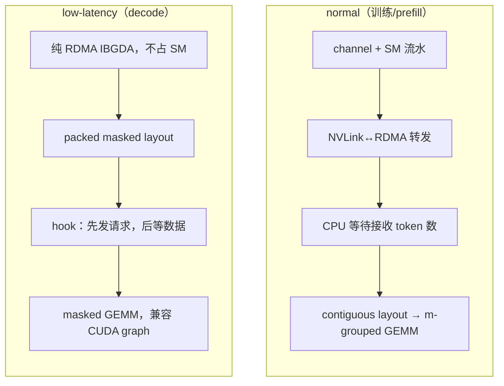
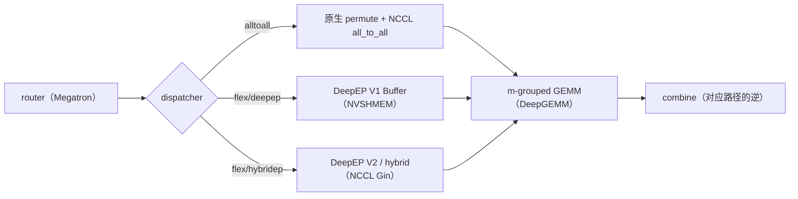

# DeepEP: 节点受限路由下的 MoE all-to-all, 从 NVLink/RDMA 转发到 IBGDA 与 hook 重叠

DeepEP 仓库 ([github.com/deepseek-ai/DeepEP](https://github.com/deepseek-ai/DeepEP)) 的首个提交 `ebfe47e` 日期为 2025-02-24, 项目在 DeepSeek 开源周第二天发布, 作者包括 Chenggang Zhao、Shangyan Zhou、Liyue Zhang 等, 采用 MIT 许可证. main 分支的 `93eb6eb` (2026-09-30) 对应 2026-09-29 发布的 V2.5 (提交 `def8651`); 仓库唯一的 tag 是 `v1.2.1` (2025-09-15). V2.5 删除了 V1 的全部代码与文档, normal kernel、low-latency kernel、IBGDA 与 hook 重叠则都属于 V1. 因此 V1 的机制对应提交 `567632d` (2026-02-03, V1 末个完整状态), V2 与 V2.5 对应 main 分支. 文档的逐段对照见同目录的 `deepep-bi.md`, 昇腾实现见 [DeepEP-Ascend](https://github.com/deepseek-ai/DeepEP-Ascend).

DeepEP 做的事情可以用一句话概括: 把 MoE 层里「按路由把 token 发给专家, 再把专家输出收回来求和」这一对 all-to-all (dispatch 与 combine) 写成专用 GPU kernel. 通用的 NCCL all-to-all 不知道一个 token 会被复制给多少个专家, 也不知道这些专家分布在哪些节点, 只能按 rank 两两交换缓冲区. DeepEP 的出发点是 DeepSeek-V3 的路由约束: 每个 token 最多去 4 个节点. 有了这个约束, 跨节点那一段的字节数有了上界, 节点内的 NVLink 又比网卡快约 3.2 倍, kernel 就可以按「先跨节点, 再节点内分发」的两级路径组织. 训练与 prefill 使用 normal kernel 追求吞吐, decode 使用 low-latency kernel 控制时延; 两者的数据路径和资源分配方式不同.

## 1. 它解决的瓶颈: 节点受限路由与非对称带宽

**DeepSeek-V3 的 EP 形状与 all-to-all 负载**

DeepSeek-V3 的 MoE 层有 1 个共享专家和 256 个路由专家, 每个 token 激活 8 个路由专家, hidden 为 7168 (模型结构见 DeepSeek-V3 解析). 训练时 MoE 用 64 路专家并行, 跨 8 个节点, 每节点 8 张 H800, 每卡放 4 个专家. 这样一来, 每个 token 的 8 个专家副本大多落在别的节点上. 专家并行的一般做法与 all-to-all 的通信量推导见 MoE 专家并行与 All-to-All 通信, 这里只算 DeepEP 关心的那部分.

一个 FP8 token 的载荷是 $7168 \times (1 + 4/128) = 7392$ 字节: 每个元素 1 字节, 每 128 个元素一个 4 字节的 FP32 scale. 一张卡在一个 micro-batch 里处理 4096 个 token, 如果每个副本单独发送, dispatch 一次要发 $4096 \times 8 \times 7392 \approx 242$ MB. 报告给出的计算与通信时间比约为 1:1, 也就是说, 不把这部分通信藏起来, 训练时间会接近翻倍. DeepEP 要解决的就是两件事: 让跨节点的字节数尽可能少, 让剩下的通信尽可能和计算重叠.

### 1.1. 为什么限制每 token 的节点数

V3 的门控先把 256 个专家按节点分成 8 组, 每组取亲和度最高的 2 个求和作为组分, 选出得分最高的 4 个节点, 再在这 4 个节点的 128 个专家里取 top-8. DeepEP 的测试脚本用的是简化版本: [`tests/test_internode.py`](https://github.com/deepseek-ai/DeepEP/blob/567632d/tests/test_internode.py) 取每组的最大分数作为组分, `num_topk_groups` 默认为 `min(num_nodes, 4)`. 限制的效果可以直接算. 设专家数为 $E$, 分成 $G$ 组, 一个 token 在均匀路由下从 $E$ 个专家里无放回地选 $k$ 个, 它命中的组数期望为

$$
\mathbb{E}[\text{命中组数}] = G\left(1 - \binom{E - E/G}{k} \Big/ \binom{E}{k}\right).
$$

不加限制时 $E=256, G=8, k=8$, 期望命中 5.30 个节点, 最坏 8 个; 限到 4 个节点后, 相当于 $E=128, G=4, k=8$, 期望降到 3.63 个, 最坏 4 个. 去掉本节点 (概率 $1/8$) 之后, 每个 token 过网卡的份数从 4.63 降到 3.18, 少了约 31%. 更关键的是上界: 最坏情况从 7 份变成 3 到 4 份, 发送缓冲区和 RDMA 队列可以按这个上界预留. V3 报告还给了另一个角度: 节点内 NVLink 约 160 GB/s, 网卡约 50 GB/s, 比值约 3.2, 所以一个 token 进入目标节点之后, 平均可以在那里分给 3.2 个专家而不让 NVLink 成为瓶颈; 4 个节点合计最多 13 个专家, 当前的 top-8 还有余量.

同一个公式也出现在 V2 的代码里. [`deep_ep/buffers/ep.py`](https://github.com/deepseek-ai/DeepEP/blob/main/deep_ep/buffers/ep.py) 的 `get_theoretical_num_sms` 内部定义了 `get_expected_topk(num_groups)`, 写法就是 `num_groups * (1 - comb(num_experts - num_experts // num_groups, num_topk) / comb(num_experts, num_topk))`, 用它估算每个 token 期望命中的 scale-out 与 scale-up rank 数, 再推出 RDMA 与 NVLink 两侧的流量比例. 也就是说, 均匀路由下的期望命中数是 DeepEP 两代实现共同的流量模型, V1 把它用在默认配置的调参上, V2 把它写进了 SM 数的解析公式.

**非对称域带宽转发: 先 RDMA 到同号卡, 再 NVLink 分发**

两级路径的具体走法是: 源卡 $(n_s, g)$ 上的 token 要发给节点 $n_d$ 上的若干张卡时, 先经 RDMA 发给 $n_d$ 上同号的卡 $(n_d, g)$, 一个节点只发一份; 这张卡收到后, 再经 NVLink 转发给本节点里真正持有目标专家的那几张卡. 这样每张卡只和其他节点的同号卡建立 RDMA 连接, 一个 8 卡节点里的 8 张卡各自走自己的网卡, 不同号之间的流量不会挤到同一块网卡上. 文档把这称为非对称域带宽转发 (asymmetric-domain bandwidth forwarding): RDMA 域与 NVLink 域带宽不同, 转发把字节数大的那一段放到快的 NVLink 上.

转发的代价是 NVLink 上的字节数. 跨节点到达的每一份都要再走一跳 NVLink, 节点内的分发份数接近 token 的专家副本数. 按 1.2 节的数字, RDMA 上每个 token 约 3.18 份, NVLink 上接近 8 份, 两者的比值与带宽比 3.2 大致相当, 两段可以同时跑满. 这也是 normal kernel 必须让 SM 全程参与的原因: NVLink 转发是内存语义的拷贝, 要由 SM 一个字节一个字节地搬, 不能交给网卡. V3 报告里「20 个 SM 用于通信」指的就是这部分开销.

**normal kernel: layout 计算, 通知与转发流水**

**`get_dispatch_layout`: 四个描述路由的张量**

normal dispatch 一次调用要跑三个 kernel: `get_dispatch_layout`, `notify_dispatch` 与 `dispatch` 本身. 第一个在 [`csrc/kernels/layout.cu`](https://github.com/deepseek-ai/DeepEP/blob/567632d/csrc/kernels/layout.cu) 里, 输入是形状 `[num_tokens, num_topk]` 的 `topk_idx`, 输出四个张量: `num_tokens_per_rank` (发往每个 rank 的 token 数), `num_tokens_per_rdma_rank` (发往每个节点的 token 数), `num_tokens_per_expert` (发往每个专家的 token 数), 以及布尔矩阵 `is_token_in_rank` (形状 `[num_tokens, num_ranks]`, 表示第 $i$ 个 token 要不要发给第 $r$ 个 rank). 这里的计数都按 token 去重: 一个 token 选中同一个 rank 上的两个专家, 只算一次.

kernel 的分工按 SM 切开. 模板参数是 `kNumThreads=256, kNumExpertsPerSM=4, kNumRanksPerSM=8`: 前 $\lceil E/4 \rceil$ 个 SM 每个负责 4 个专家, 256 个线程分段扫 `topk_idx`, 在 shared memory 里按线程累加再归约, 得到 `num_tokens_per_expert`; 后面的 SM 每个负责 8 个 rank, 也就是一个节点, 同样扫一遍 `topk_idx`, 对每个 token 判断它落在这 8 个 rank 里的哪几个, 写 `is_token_in_rank`, 同时累加 rank 级与节点级的计数. 256 个专家, EP64 时 grid 是 $64 + 8 = 72$ 个 SM. 这一步不涉及通信, 计算量很小, 后面两步都以它的输出为输入.

**`notify_dispatch`: 交换计数, 前缀和与 CPU 等待**

第二步要解决「接收方事先不知道自己会收多少 token」的问题. [`csrc/kernels/internode.cu`](https://github.com/deepseek-ai/DeepEP/blob/567632d/csrc/kernels/internode.cu) 的 `notify_dispatch` 里, SM 0 负责全局同步与计数交换: 先做一次节点内 barrier 与同号卡之间的跨节点同步, 把本卡发往每个节点, 每个 rank, 每个专家的 token 数用 `nvshmemi_ibgda_put_nbi_warp` 写到对端的对称缓冲区, 再经节点内的 NVLink 缓冲区汇总, 最终算出本卡总共要收多少 token, 写进一块 pinned host 内存 `moe_recv_counter_mapped`. 其余 SM 并行计算按 channel 划分的前缀和矩阵 `rdma_channel_prefix_matrix` 与 `gbl_channel_prefix_matrix`: 一个 channel 处理 token 序列中连续的一段, 前缀和给出每个 channel 在每个目标 rank 的接收缓冲区里从第几个位置开始写. 有了这两张表, 后面各个 channel 可以无锁地并行写入, 写出来的顺序与源 token 顺序一致.

主机侧在 [`csrc/deep_ep.cpp`](https://github.com/deepseek-ai/DeepEP/blob/567632d/csrc/deep_ep.cpp) 里自旋读 `moe_recv_counter_mapped`, 直到 GPU 写入有效值, 超时上限 `NUM_CPU_TIMEOUT_SECS` 为 100 秒 (定义在 [`csrc/kernels/configs.cuh`](https://github.com/deepseek-ai/DeepEP/blob/567632d/csrc/kernels/configs.cuh)). 拿到数字之后, CPU 才能按准确大小分配 `recv_x` 等输出张量, 再 launch 真正的 dispatch kernel. 这一次 GPU 到 CPU 的同步是 normal kernel 不能被 CUDA graph 捕获的原因. 绕开的办法是 `num_worst_tokens`: 调用方给出最坏情况下的接收 token 数, 输出按这个容量分配, 跳过 CPU 等待. V1 文档的示例注释写「this flag is for intranode only」, 但在 `567632d` 的代码里 `internode_dispatch` 也接受 `num_worst_tokens`, 对应 2025-11-05 的提交 `92fe2de` (Enable CUDA Graph for internode dispatch), 文档没有跟着更新.

### 1.2. channel, warp 角色与环形队列

真正的 dispatch kernel 以 channel 为单位组织, 一个 channel 占两个 SM. 节点内版本 ([`csrc/kernels/intranode.cu`](https://github.com/deepseek-ai/DeepEP/blob/567632d/csrc/kernels/intranode.cu)) 最简单: `sm_id % 2 == 0` 的 SM 是发送方, 奇数 SM 是接收方, `num_channels = num_sms / 2`, 每个 channel 负责 token 序列的一段, 对每个目标 rank 有一条 NVLink 环形队列, 发送方写 tail, 接收方推进 head. 跨节点版本把两个 SM 分成转发 SM 与非转发 SM (`is_forwarder = sm_id % 2 == 0`), 在 warp 级别再细分角色. 非转发 SM 上有 7 个 `kRDMASender` warp, 把 token 打包写进发往各节点的 RDMA 发送缓冲区; 1 个 `kRDMASenderCoordinator` warp, 负责按 chunk 提交 RDMA 写并推进远端的 tail; 其余 8 个 `kNVLReceivers` warp, 每个对应一个 NVLink 对端, 从 NVLink 队列里取出 token 写进最终的 `recv_x`. 转发 SM 的前 8 个 warp 是 `kRDMAAndNVLForwarder`, 后面的 warp 被标成 `kForwarderCoordinator`, 但只有第一个干活, 其余直接返回: 前者从 RDMA 接收缓冲区读出别的节点发来的 token, 按 token 附带的目标位图转发到本节点各卡的 NVLink 队列, 后者回收已消费的 RDMA 缓冲区并把新的 head 告诉发送方.

token 在两段之间带着一个 `SourceMeta` 结构, 字段只有两个: `src_rdma_rank` (来自哪个节点) 与 `is_token_in_nvl_rank_bits` (一个 8 位的位图, 第 $j$ 位表示要不要转发给本节点第 $j$ 张卡). 一个 8 卡节点正好用一个字节描述 NVLink 分发, 这也是 `NUM_MAX_NVL_PEERS` 取 8 的原因. 发送顺序上有一个细节: RDMA sender 遍历目标节点时用 `dst_rdma_rank = (i + channel_id + rdma_rank) % kNumRDMARanks`, 不同 channel, 不同源节点的起点错开, 避免所有卡在同一时刻都往同一个节点写造成 incast. 环形队列省显存, 但也带来了复杂度: 生产者与消费者之间靠 head 与 tail 两个计数器同步, 一方超时就会整体卡住, 所以每个等待循环都带 `NUM_TIMEOUT_CYCLES` 的超时打印. V1 文档自己也承认这一点, 建议重写的人改用按最大容量预分配的定长缓冲区 (issue 39).

**combine 的反向路径, 缓存模式与 SM 数**

combine 走的是 dispatch 的反向路径: NVLink 发送方把专家输出写回转发卡, 转发卡在本节点内先把发往同一源 token 的多份输出加起来, 再经 RDMA 发回源节点, 源卡最终做一次归约. 跨节点版本的角色换成 `kNVLSender`, `kNVLAndRDMAForwarder`, `kRDMAReceiver` 与 `kCoordinator`, 转发 SM 变成奇数号 (`is_forwarder_sm = sm_id % 2 == 1`). 节点内先归约, 意味着 RDMA 上回传的是每个 (token, 节点) 一份, 字节数与 dispatch 对称. combine 不需要 layout 与 notify: dispatch 返回的 `handle` 里保存了前缀和矩阵与 `send_head` 等位置信息, combine 直接复用. 训练反向时也一样, dispatch 的反向就是 combine, combine 的反向就是带 `handle` 的缓存模式 dispatch, 不再做 CPU 同步.

SM 数由 `Buffer.set_num_sms` 控制, 文档示例用 24, 即 12 个 channel. 每个 channel 内部的 chunk 大小由 `Config` 决定, 共四个参数: NVLink 与 RDMA 两侧的「一次最多发多少 token」与「接收缓冲区能放多少 token」. [`deep_ep/buffer.py`](https://github.com/deepseek-ai/DeepEP/blob/567632d/deep_ep/buffer.py) 里 `get_dispatch_config` 与 `get_combine_config` 为 EP2 到 EP160 各给了一组在 DeepSeek 内部集群上调好的值, 比如 EP32 dispatch 是 `Config(Buffer.num_sms, 32, 288, 8, 128)`. 文档建议在自己的集群上跑测试脚本重新搜索: [`tests/test_internode.py`](https://github.com/deepseek-ai/DeepEP/blob/567632d/tests/test_internode.py) 对 NVLink chunk 在 4 到 44, RDMA chunk 在 4 到 32 之间按步长 4 做网格搜索. SM 少了, 带宽上不去; SM 多了, 计算可用的 SM 就少. 这组参数要靠实测, 这正是 V2 想用解析公式取代的部分.

**low-latency kernel: IBGDA 与 recv hook**

**消息格式与按专家排布的接收区**

decode 阶段每张卡一次只有几十到一百多个 token, 每个 token 仍要发给 8 个专家. 这时瓶颈从带宽变成了延迟: normal kernel 的三个 kernel, 一次 CPU 同步, 两级转发, 每一步都要付固定开销. low-latency kernel 的做法是把所有这些步骤合进一个 kernel, 并且不做转发: 每个 (token, 专家) 副本直接经 RDMA 发到持有该专家的卡, 每个副本一条消息. 消息格式在 [`csrc/kernels/internode_ll.cu`](https://github.com/deepseek-ai/DeepEP/blob/567632d/csrc/kernels/internode_ll.cu) 的 `dispatch` 里定义: 先是一个 `int4` 的头 (源 token 序号加 3 个保留字段), 然后是 hidden 数据, FP8 模式下再跟 `hidden / 128` 个 FP32 scale. hidden 为 7168 时, FP8 消息 7408 字节, BF16 消息 14352 字节.

接收区按专家排布, 不按源 rank 排布. 目标地址的算法是 `dst_expert_local_idx * num_ranks * num_max_dispatch_tokens_per_rank * num_bytes_per_msg + rank * num_max_dispatch_tokens_per_rank * num_bytes_per_msg + slot_idx * num_bytes_per_msg`: 每个本地专家有一块区域, 区域里每个源 rank 有 `num_max_dispatch_tokens_per_rank` 个槽位, 发送方对目标专家做一次 `atomicAdd` 拿到槽位号. 接收阶段把这些消息解包成形状 `[num_local_experts, num_ranks * num_max_dispatch_tokens_per_rank, hidden]` 的 `packed_recv_x`, 另给 `packed_recv_count` (每个专家实际收了多少) 与 `packed_recv_layout_range` (每个源 rank 在其中的起点与长度). 这个三维布局里大部分行是空的, 但它的形状只取决于配置, 与路由结果无关, 专家 GEMM 可以按 `packed_recv_count` 做 masked grouped GEMM, 整个 decode 步骤也就能被 CUDA graph 捕获.

预留按最坏情况算. [`csrc/config.hpp`](https://github.com/deepseek-ai/DeepEP/blob/567632d/csrc/config.hpp) 的 `LowLatencyLayout` 分配奇偶两套对称缓冲区, 每套含发送区, 接收区与信号区. 接收区大小是 `num_experts * num_max_dispatch_tokens_per_rank * num_bytes_per_msg`, 与 EP 规模无关, 只与专家总数和每卡最大 token 数有关. 取 128 个 token, hidden 7168, 256 个专家, 单套接收区约 455 MiB, 两套加上发送区共约 1.78 GiB. 这就是文档建议 `num_max_dispatch_tokens_per_rank` 小于 256 的原因. 奇偶两套缓冲区轮流使用, 所以文档同时警告: 同一时刻最多只能持有两次 low-latency 调用的结果张量.

### 1.3. IBGDA: GPU 直接敲网卡门铃

发送路径上的 FP8 转换在 kernel 内完成. 除末个 warp 外, 其余 warp 每次处理一个 token: 读 BF16 数据, 每 128 个元素用 `warp_reduce_max<16>` 求出 amax, 算 scale, 转成 E4M3 写进发送缓冲区; `round_scale` 把 scale 取整到 2 的幂, `use_ue8m0` 把 scale 存成 UE8M0 格式, 两者都是为了配合下游 GEMM 对 scale 格式的要求. 转换完成后, 每个 top-k 槽位对应的 warp 调 `nvshmemi_ibgda_put_nbi_warp`, 由 GPU 线程自己组装 RDMA 写请求, 写进网卡的发送队列, 再敲门铃. 末个 warp 统计本卡发往每个专家的 token 数, 等该专家的所有消息都提交之后 (计数器到达 `FINISHED_SUM_TAG * 2`), 用 `nvshmemi_ibgda_amo_nonfetch_add` 把 `-num_tokens_sent - 1` 原子加到接收方的计数槽位里. 取负再减一是为了让 0 保留给「还没到」: 接收方自旋读这个槽位, 读到非零就知道数据已经完整到达, 并从中解出 token 数.

IBGDA (InfiniBand GPUDirect Async) 与 NVSHMEM 默认的 IBRC 传输的区别在于谁来操作网卡. IBRC 下 GPU 把请求交给 CPU 上的代理线程, 由 CPU 提交 RDMA 操作; IBGDA 下 GPU 直接写网卡的工作队列与门铃寄存器, 省掉了 GPU 到 CPU 的往返. decode 时一次 dispatch 要发 $128 \times 8 = 1024$ 条约 7.4 KB 的消息, 几十到一百多微秒内全部发完, CPU 代理的提交速率跟不上. 这也是 V1 要求在驱动里打开 `PeerMappingOverride` 与 `NVreg_EnableStreamMemOPs` 的原因: GPU 要能直接映射网卡的寄存器与队列. 每个本地专家用一个独立的 QP: 文档要求 `num_qps_per_rank` 等于本地专家数, SM 0 上负责计数的那个 warp 会断言 `num_rc_per_pe >= num_local_experts`, 发送时把 `dst_expert_local_idx` 作为 QP 编号传入. 发往不同专家的消息走不同的 QP, 互不排队. 另一个约束在 [`deep_ep/buffer.py`](https://github.com/deepseek-ai/DeepEP/blob/567632d/deep_ep/buffer.py) 里: `NVSHMEM_QP_DEPTH` 默认 1024, 且必须不小于 `(num_max_dispatch_tokens_per_rank + 1) * 2`.

**hook: 把发送与接收拆成两次 launch**

low-latency kernel 内部按 phase 分成两段: `LOW_LATENCY_SEND_PHASE` 做转换, 提交 RDMA 写与计数原子; `LOW_LATENCY_RECV_PHASE` 自旋等计数, 把接收区的消息解包成 `packed_recv_x`. 两段都执行时, 中间用一次 `cg::this_grid().sync()` 保证发送侧的计数清零对接收侧可见. [`csrc/deep_ep.cpp`](https://github.com/deepseek-ai/DeepEP/blob/567632d/csrc/deep_ep.cpp) 在 `return_recv_hook=true` 时只 launch 发送段, 然后返回一个 lambda `recv_hook = [=]() { launcher(LOW_LATENCY_RECV_PHASE); }`. 调用方拿到 hook 后可以先去做别的计算, 需要数据时再调 hook, 这时才 launch 接收段.

这就是「不占 SM 的重叠」的确切含义. 发送段要占满所有 SM, 但只持续几微秒, 发完 kernel 就退出; 之后数据在网卡与网络上传输, 这段时间 GPU 上没有任何通信 kernel 驻留, SM 全部留给计算; 接收段被调起时数据通常已经到达, 只剩解包. 作者在 [issue 179](https://github.com/deepseek-ai/DeepEP/issues/179) 里给出的说法与此一致: 发起阶段占 SM, 传输阶段不占. 文档里的双 micro-batch 图是这样用的: micro-batch A 做 attention 时, B 的 dispatch 在网络上传输; A 做 MoE 时, B 的 combine 在传输, 依此交替. 能这样拆的前提是 RDMA 是消息语义, 网卡在 kernel 退出后继续搬运; NVLink 拷贝是内存语义, 必须由 SM 执行. [issue 95](https://github.com/deepseek-ai/DeepEP/issues/95) 里作者解释早期 low-latency 不走 NVLink 时, 给的正是这条理由. 2025-05-23 的提交 `aae9fa9` 把 `allow_nvlink_for_low_latency_mode` 的默认值改成了允许, 同节点的副本由发送段的 warp 直接拷过去; 参数文档仍写着这个选项「与 hook 式重叠有些不兼容」, 因为同节点那部分的传输时间算在了发送段里.

**combine 的权重归约, LogFMT 与 zero-copy**

low-latency combine 的方向相反: 每张卡把每个本地专家处理过的 token 输出按 `packed_recv_src_info` 记录的源位置发回源卡, 源卡收齐之后, 按 `topk_weights` 加权求和得到最终输出. 加权在接收方做, 意味着专家侧只需发回未加权的 BF16 输出, 每个副本 $7168 \times 2 = 14336$ 字节, 比 dispatch 的 FP8 消息大将近一倍, 这也是低延迟表里 combine 延迟普遍比 dispatch 高的直接原因. combine 同样支持 `return_recv_hook`, 拆法与 dispatch 相同.

combine 还有两个降开销的选项. 一是 `use_logfmt`: 2025-07 到 08 月的提交 `1cf85fb` 与 `c5facf5` 加入了 10 位的 LogFMT 格式: 每组通道求出 amax 与 amin, 在对数域上均匀量化成 10 位, 每组附带一对 BF16 的 amax/amin 作元数据. 测试脚本按 `hidden * 10 / 8 + hidden / 128 * 4` 计字节, 每元素约 1.28 字节, 比 BF16 少约 36%. kernel 只在这一组的 $\log_2 \text{amax} < 0$ 且 amin 严格小于 amax 时转换, 否则这一组仍按 BF16 发送. 分组粒度上, 参数文档写的是「per-64-channel」, 而 kernel 的注释是「Reduce per 128 channels」, 测试脚本的元数据项也按 128 计. 二是 `zero_copy`: 调用方用 `get_next_low_latency_combine_buffer` 拿到下一次 combine 的 RDMA 发送缓冲区, 让专家 GEMM 直接把输出写进去, combine kernel 就省掉一次从 PyTorch 张量到通信缓冲区的拷贝. 后者对应 2025-03-18 合入的 PR 79.

## 2. 性能数字的口径与版本演进

**normal kernel 表: 「瓶颈带宽」是怎么算的**

V1 文档的 normal kernel 表测试条件是: H800, NVLink 最大约 160 GB/s; 每卡一块 CX7 InfiniBand 400 Gb/s 网卡, 最大约 50 GB/s; 每批 4096 个 token, hidden 7168, top-4 组, top-8 专家, FP8 dispatch, BF16 combine. 数字是节点内 EP8 dispatch 153 GB/s, combine 158 GB/s (NVLink); 跨节点 EP16 为 43/43, EP32 为 58/57, EP64 为 51/50 GB/s (RDMA). 这些数字由 [`tests/test_internode.py`](https://github.com/deepseek-ai/DeepEP/blob/567632d/tests/test_internode.py) 打印: RDMA 一栏的分子是 `num_rdma_token_sent * hidden * 2`, 再乘 FP8 系数 `(1 + 4 / 128) / 2`, 其中 `num_rdma_token_sent` 是按节点去重后的 (token, 节点) 对数, 本节点也计入; 分母是 CUDA event 测出的 kernel 时间, 50 次热身, 50 次取平均, 测量前用 256 MB 的写操作冲刷 L2. 所以「瓶颈带宽」是逻辑带宽: 它把本节点那一份也算成了 RDMA 字节. 文档没有说明这一点, V2 的 README 在表注里补上了「logical bandwidth, 含本地 rank 流量」.

有两处口径值得对照代码看. 第一, 文档写「top-4 groups」, 但测试脚本的 `num_topk_groups` 默认是 `min(num_nodes, 4)`: EP16 只有 2 个节点, 实际是 top-2 组; EP32 有 4 个节点, top-4 组等于不加限制. 只有 EP64 (8 节点) 的那一行对应 V3 的 4 节点限制. 第二, 初版 README (提交 `ebfe47e`) 的跨节点数字是 EP16 43/43, EP32 44/47, EP64 46/45 GB/s, 后来 EP32 与 EP64 分别提到 58/57 与 51/50. 提升来自 2025-04-22 合入的 PR 130 (腾讯网络平台部的多 QP 方案, 原先 IBRC 下两卡之间只有一个 QP, 双口网卡与 RoCE 场景受限) 以及随后「normal kernel 一律用 IBGDA」的提交 `3e54b78`.

### 2.1. low-latency 表: 延迟与带宽能互相推出来

low-latency 表的条件是每批 128 个 token, hidden 7168, top-8 专家, FP8 dispatch, BF16 combine, 同样是 H800 加 CX7. [`tests/test_low_latency.py`](https://github.com/deepseek-ai/DeepEP/blob/567632d/tests/test_low_latency.py) 的带宽算法是: 对每个 token 的每个有效 top-k 选择, dispatch 记 `hidden + hidden / 128 * 4 + 16` 字节, combine 记 `hidden * 2` 字节 (LogFMT 时另算), 求和后除以时间. 也就是说表里的带宽等于 $128 \times 8 \times \text{消息字节} / \text{延迟}$. 用 EP64 那一行验证: $128 \times 8 \times 7408 / 173\,\mu\text{s} \approx 43.9$ GB/s, 表里写 43 GB/s; EP8 是 $7.59\,\text{MB} / 77\,\mu\text{s} \approx 98.5$ GB/s, 表里写 98 GB/s. 对得上, 说明带宽一栏不是另外测的, 是由延迟换算出来的.

由此可以读出两件事. 其一, EP8 的 98 GB/s 与 combine 的 127 GB/s 超过了网卡上限, 原因是 EP8 时八张卡在同一节点内, 提交 `aae9fa9` 之后这些副本走 NVLink 拷贝, 而测试脚本照样计入. 初版 README 的 EP8 是 163 us 与 46 GB/s, 当时全走 RDMA. 其二, EP 越大, 同节点的比例越低, 带宽收敛到 39 到 40 GB/s, 约为网卡上限的 80%; 延迟从 EP64 的 173 us 涨到 EP256 的 194 us, 几乎不再增加, 因为每卡发出的字节数固定为约 7.6 MB, 时间主要由网卡带宽决定, 而不是由对端数量决定. 测试脚本默认 `num_experts=288` (256 个路由专家加 32 个冗余专家), 文档没有写出专家总数, 但带宽算法只看每个 token 的选择数, 不受影响.

**版本演进: 从 NVSHMEM 补丁到 NCCL Gin**

V1 的演进集中在 2025 年. 2025-03 加入 low-latency combine 的 zero-copy; 4 月合入多 QP, normal kernel 改用 IBGDA; 5 月 28 日的提交 `9fe9021` 让整个库只用 IBGDA, 5 月 23 日放开 low-latency 的 NVLink; 6 月支持 Ampere (只限节点内), 节点内 normal kernel 支持 CUDA graph, 节点内 kernel 的 LD/ST 换成 TMA; 7 月跨节点 dispatch, combine 与 low-latency combine 发送也陆续换成 TMA, 并加入 10 位 LogFMT. 依赖上, 早期 DeepEP 需要给 NVSHMEM 打补丁 (`third-party/nvshmem.patch`), 2025-07 的一组提交改为兼容上游 NVSHMEM 3.3.9, 加入 CPU 协助的 IBGDA 与非 bond 双口网卡支持. 2025-09-15 打了唯一的 tag `v1.2.1`, 9 月 25 日合入弹性 EP (PR 370, 可以在运行时屏蔽故障 rank), 11 月跨节点 dispatch 也支持了 CUDA graph.

2026-04-30 的提交 `b306af0` 发布 V2, 是一次完整重构: 通信后端从 NVSHMEM 换成 NCCL 的 Gin (GPU-initiated networking) 设备 API, 缓冲区注册成 NCCL 的对称内存窗口, kernel 改由 DeepJIT 在运行时编译; 高吞吐与低延迟两套接口合并成 `ElasticBuffer`, 支持 hybrid (先 scale-out 再 scale-up 的两级路径, 与 V1 normal kernel 同构) 与 direct (每个副本直接发往目标 rank, 与 V1 low-latency 同构) 两种模式, 同时加入 Engram, PP 与 bucket 集合通信等实验特性. 2026-09-29 的 V2.5 (提交 `def8651`) 把 `ElasticBuffer` 拆成 `EPBuffer`, `EngramBuffer`, `PPBuffer` 与 `BucketBuffer`, 加入冗余专家的权重预取与梯度归约, 并删除 V1 的全部代码, NVSHMEM 不再是依赖. V2 时期的 README 写过「up to EP2048」, V2.5 的 README 不再出现这个数字.

**V2 的解析式 SM 数与新性能表**

V2 用 [`deep_ep/buffers/ep.py`](https://github.com/deepseek-ai/DeepEP/blob/main/deep_ep/buffers/ep.py) 的 `get_theoretical_num_sms` 取代 V1 的手调表. 它用 1.2 节的期望命中公式分别算出 scale-out 与 scale-up 的期望命中数, 再按每个 token 估算四个量: SM 读字节, SM 写字节, RDMA 流量与 NVLink 流量. 带宽来自 [`deep_ep/utils/envs.py`](https://github.com/deepseek-ai/DeepEP/blob/main/deep_ep/utils/envs.py): 每 SM 读带宽 `get_sm_read_gbs()` 默认 180 GB/s, 写带宽 `get_sm_write_gbs()` 默认 45 GB/s, NVLink 带宽由 `nvidia-smi nvlink -s` 探测后乘 0.9, RDMA 带宽由 `ibstat` 探测. 先比较 RDMA 与 NVLink 哪一侧耗时长, 把那一侧定为瓶颈, 然后要求 SM 的读写速度跟得上瓶颈链路, 解出所需 SM 数, 再乘 1.3 的余量, 向上对齐到 4 的倍数, 下限 4, 上限为设备 SM 数. `prefer_overlap_with_compute=False` 时下限提到 64. QP 数由 `get_theoretical_num_qps` 给出: direct 模式取 `min(num_sms, 9)`, 减少门铃开销; hybrid 模式取 `num_sms * 16 + 1`, 让每个 channel 有独立 QP, 多出的 1 个给 notify warp.

V2 发布时的性能表 (提交 `a56d615` 的 README) 换了一套条件: 每批 8K 个 token, hidden 7168, top-8, FP8 dispatch, BF16 combine. SM90 加 CX7, EP 8×2 为 90/81 GB/s 用 12 个 SM, EP 8×4 为 61/61 GB/s 用 6 个 SM; SM100 节点内 EP8 在 64 个 SM 时达到 726/740 GB/s (NVLink), 24 个 SM 时 643/675 GB/s. README 给出的对比结论是「峰值性能最高 1.3 倍, SM 数最多省 4 倍」, 以及「V3 式训练的 SM 用量从 24 降到 4 到 6」. 这张表与 V1 的表不宜直接相除: token 数从 4096 变成 8K, V2 的测试脚本 [`tests/ep/test_ep.py`](https://github.com/deepseek-ai/DeepEP/blob/main/tests/ep/test_ep.py) 按每 token 的实际字节 (含 top-k 索引与权重) 计数, 拓扑写法也从「EP16」变成「EP 8×2」. V2.5 的 README 删掉了这张表, 当前 main 上没有官方性能数字.

**部署约束, 局限与昇腾版**

**V1 的 NVSHMEM 依赖与网络配置**

V1 的跨节点与 low-latency kernel 都建立在 NVSHMEM 之上: 所有 RDMA 缓冲区是 NVSHMEM 的对称内存, 每个 rank 分配同样大小, 远端地址可以用本地偏移直接算出; GPU 侧的 `nvshmemi_ibgda_put_nbi_warp` 与 `nvshmemi_ibgda_amo_nonfetch_add` 是 NVSHMEM IBGDA 传输的设备函数. 不设 `NVSHMEM_DIR` 编译时, [`setup.py`](https://github.com/deepseek-ai/DeepEP/blob/567632d/setup.py) 会去掉 `internode.cu` 与 `internode_ll.cu`, 只剩节点内 kernel. `docs/nvshmem.md` 列出的部署前提是: NVSHMEM 3.3.9 或更新; 节点内 NVLink, 节点间 GPUDirect RDMA; IBGDA 可用. 打开 IBGDA 有两种办法, 一是在 `/etc/modprobe.d/nvidia.conf` 里设 `NVreg_EnableStreamMemOPs=1` 与 `PeerMappingOverride=1` 后重建 initramfs 并重启, 二是装 GDRCopy 走 CPU 协助的 IBGDA, 性能略低, 适合不能改驱动的环境.

运行时, [`deep_ep/buffer.py`](https://github.com/deepseek-ai/DeepEP/blob/567632d/deep_ep/buffer.py) 在构造 `Buffer` 时替用户设好一组 NVSHMEM 环境变量: `NVSHMEM_IB_ENABLE_IBGDA=1`, `NVSHMEM_IBGDA_NUM_RC_PER_PE` 等于 `num_qps_per_rank`, `NVSHMEM_QP_DEPTH` 默认 1024, `NVSHMEM_MAX_TEAMS=7`, `NVSHMEM_CUMEM_GRANULARITY` 为 $2^{29}$, 并按 `allow_nvlink_for_low_latency_mode` 设置 `NVSHMEM_DISABLE_P2P`. 这意味着同一进程里的其他 NVSHMEM 用户会受到影响. 网络侧的建议是用 InfiniBand 虚拟通道把 normal, low-latency 与其他流量分开, 经 `NVSHMEM_IB_SL` 选服务等级; 自适应路由在重载时打开, 轻载时用静态路由; 拥塞控制关闭. 还有一处平台相关的风险: 为了读 volatile 数据, V1 用了只读指令 `ld.global.nc.L1::no_allocate.L2::256B`, 这在 PTX 规范里是未定义行为, 只在 Hopper 上实测正确; 目标架构不是 `9.0` 时 `setup.py` 强制关闭它. `DISABLE_SM90_FEATURES=1` 面向 A100 一类的 SM80 设备, 会同时关掉 FP8, TMA 与全部 NVSHMEM 功能, 所以 A100 上的 V1 只有节点内 normal kernel.

### 2.2. V2.5 的依赖与适用条件

V2.5 把部署前提换了一遍. 依赖是 Linux, Python 3.10 及以上, Hopper 或更新的 GPU, CUDA Toolkit 13.1 及以上, 支持 `std::format` 的 C++20 编译器, PyTorch 2.10 及以上, NCCL 2.32.3 及以上. 安装只构建主机侧扩展, kernel 由 DeepJIT 在首次使用时针对当前设备编译, 所以运行环境里必须保留 CUDA toolkit 与主机编译器. PyTorch 与 DeepEP 必须加载同一个 NCCL 共享库, 默认还会复用 PyTorch 进程组的 NCCL communicator (`EP_REUSE_NCCL_COMM=1`). 网卡侧不再需要改驱动注册键, 但带宽探测依赖 `nvidia-smi` 与 `ibstat` 能正常输出; README 另外建议用 `mlxconfig` 把网卡的 `PCI_ATOMIC_MODE` 设为 4, 改善 RDMA 原子操作的性能, 这与 `check_fast_rdma_atomic_support` 决定 hybrid 模式分配 65 还是 129 个 QP 是同一件事.

适用条件可以归纳成几条. 第一, SM 数的解析公式假设路由均匀, 真实负载偏斜时瓶颈 rank 的流量会高于期望值, 公式里乘 1.3 的余量就是为此留的, 偏斜更严重时要手动传 `num_sms` 覆盖. 第二, 所有 rank 必须对 `num_max_tokens_per_rank` 取同一个值, 训练, prefill 与 decode 共用一个 buffer 时要按最大的批来预留. 第三, 通信必须占 SM, README 明确写着不支持零 SM 的 RDMA EP; 把 SM 从 RDMA 路径上拿掉的工作 (Normal-SMFree, Hybrid-EP 等) 都在实验分支里. 第四, 网络只在 InfiniBand 上做过完整测试, RoCE 只是理论兼容; AMD GPU 与 EFA 等网卡要用 Mori-EP, uccl-ep 这类分支或社区实现.

**V1 设计的局限**

V1 的 normal kernel 在通信期间始终占着 SM, 这是 NVLink 转发与环形队列带来的: 转发需要 SM 搬数据, 队列需要 SM 推进 head 与 tail. V3 报告在硬件建议一节里把这一点列为通信方面的第一条, 希望由专门的协处理器承担 IB 与 NVLink 之间的转发与 combine 归约. 第二个局限是 CPU 同步: 接收计数要回到主机才能分配输出, 每层 dispatch 都有一次 GPU 到 CPU 的往返, 在 CUDA graph 下只能改用 `num_worst_tokens` 按最坏情况分配. 第三是调参: `Config` 表与 SM 数都是在 DeepSeek 内部集群上调出的, 换一个集群就要重新搜索.

low-latency kernel 的局限在显存与 QP. 接收区按 `num_experts * num_max_dispatch_tokens_per_rank` 预留, 256 个专家, 128 个 token 时两套缓冲区合计约 1.78 GiB, 专家数或批大小再翻倍就要翻倍显存. QP 数要等于本地专家数, QP 深度要不小于 `(num_max_dispatch_tokens_per_rank + 1) * 2`, 这两条把每卡专家数与最大批大小绑在了网卡资源上. hook 重叠需要框架自己排双 micro-batch 的流水, 四段 (attention, dispatch, MoE, combine) 时间不均时还要手工调整分段, DeepEP 只提供拆分点, 不负责调度. 放开 NVLink 之后, 同节点副本的拷贝时间算进发送段, hook 能藏住的只剩跨节点那部分.

**DeepEP-Ascend: 同一套 API, 不同的通信栈**

[DeepEP-Ascend](https://github.com/deepseek-ai/DeepEP-Ascend) 目前只有一个提交 `3b25377` (2026-09-29), 与 V2.5 同时发布. 它的 Python 包名同为 `deep_ep`, 公开接口对齐 V2.5 的 `EPBuffer`, `PPBuffer`, `EngramBuffer`, `BucketBuffer` 与 `BufferAllocator`, kernel 用 Ascend C 编写, 同样经 DeepJIT 运行时编译; 通信走 HCCL/HCOMM, UBMEM 与 URMA, 而不是 NCCL Gin. 硬件要求是带 UBMEM 互联与 `UBC_CTP`/URMA 通道的 Ascend 950 (A5), 参与通信的 rank 数必须为偶数, 验证过的软件栈是 CANN 9.2.0, Python 3.12, PyTorch 2.13.0 与 `torch_npu` 2.13.0rc1. 测试结果依赖一个提供给 DeepSeek 的 PoC 固件与手工配置, README 建议用户等华为计划在 2026 年 10 月中旬发布的 Atlas 850E 商用 HDK.

接口层面有几处差异. EP 只支持 `do_expand=True` 与 `allow_multiple_reduction=True`, `do_handle_copy` 必须为 `False`; `topk_idx_t` 固定为 int64; 不支持显式指定 RDMA 服务等级与 QP 数; `num_sms` 参数在昇腾上选择的是 AI core 数. hybrid 模式, CPU 侧的 Engram 存储与图捕获都不支持, bucket 只实现了 all-gather, 冗余专家的权重预取与梯度归约只有接口, kernel 尚未实现. 性能表的条件是每 rank 16384 个 token 的容量, hidden 7168, 256 个专家里取 top-6, 32 个 AI core (64 个 AIV), 专家对齐 128, FP8 dispatch (行优先 scale), BF16 combine, 全部经超节点外部的 Clos 网络 (netlayer 1). 结果是 EP8 dispatch 373 到 375 GB/s, combine 345 到 347 GB/s, 到 EP128 降到 313 到 320 与 272 到 278 GB/s; 计时包含发起与排空, 不含末尾的 epilogue. 这组数字的 top-k 是 6 而不是 8, token 容量是 V2 表的两倍, 与 NVIDIA 版的表不能直接比较. README 自己的说法是 EP32 以内 dispatch 达到物理载荷带宽上限的 90% 到 95%, combine 因为本地归约与 URMA 的 HBM 争用仍在优化.

**文档与代码对不上的地方**

对照文档与 `567632d` 的代码, V1 有几处文档没有跟上代码. `DISABLE_SM90_FEATURES` 的说明写成「SM90 设备或 CUDA 11 需要」, 而 `setup.py` 里这个开关面向 SM80, 并会断言关闭 NVSHMEM. normal dispatch 示例的注释说 `num_worst_tokens` 只适用于节点内, 但 `internode_dispatch` 早已支持它. normal kernel 性能表写「top-4 groups」, 测试脚本的默认值却是 `min(num_nodes, 4)`, EP16 与 EP32 两行实际不受 4 节点限制约束. 两张性能表都是含本节点流量的逻辑带宽, V1 文档没有说明. LogFMT 的参数文档写按 64 通道分组, kernel 注释与测试字节公式都是 128.

跨版本的变化也有几处没有交代原因. `allow_nvlink_for_low_latency_mode` 的默认值在 2025-05 从禁止改为允许, 参数文档保留了「与 hook 式重叠有些不兼容」的警告, 但示例里的注释仍写 hook 「without any SM occupation」. 自适应路由的建议从「重载开, 轻载关」变成「所有负载都开」, 拥塞控制从「生产环境没观察到拥塞所以关」变成「验证网络配置后再关」. V2 的 README 写过「up to EP2048」, V2.5 删掉了这句, 同时删掉了整张性能表. low-latency 测试脚本默认 `num_experts=288`, 文档只写了 top-8. 这些都不影响 kernel 的正确性, 但读性能数字与部署建议时要以代码为准.

**参考资料**

- DeepEP 仓库: <https://github.com/deepseek-ai/DeepEP>, V1 最终状态见提交 [567632d](https://github.com/deepseek-ai/DeepEP/tree/567632d), V1 文档见提交 [a56d615](https://github.com/deepseek-ai/DeepEP/tree/a56d615/docs)
- DeepEP-Ascend 仓库: <https://github.com/deepseek-ai/DeepEP-Ascend>
- DeepEP issue 179, normal 与 low-latency kernel 的 SM 占用: <https://github.com/deepseek-ai/DeepEP/issues/179>
- DeepEP issue 95, low-latency dispatch 为什么只用 IBGDA: <https://github.com/deepseek-ai/DeepEP/issues/95>
- zartbot, 分析一下 EP 并行和 DeepSeek 开源的 DeepEP 代码: <https://community.aijishu.com/a/1060000000500689>
- CQzhangyu, Deepseek 的 All-to-all 通信: DeepEP 代码解读: <https://www.cnblogs.com/CQzhangyu/p/18741625>
- KIDGINBROOK, DeepSeek DeepEP 学习 (一) normal notify dispatch: <https://deepseek.csdn.net/67cd35953b685529b707b2df.html>
- Arganzheng, MoE 的通信: all-to-all, DeepEP 与 GPU 发起的通信: <https://arganzheng.life/moe-communication-all-to-all-deepep-and-gpu-initiated.html>

**Dispatch、Combine 与通信性能模型**

DeepEP 的接口可以还原成两个线性算子：dispatch 按路由复制并置换 token，专家计算在重排后的张量上独立执行，combine 再按原 token 聚合加权输出。下面从计算图、通信字节和硬件路径推导它们的正确性与性能边界。

一个 MoE 层的路由专家参数是 $N\cdot3dH$: $N$ 个专家, 每个专家是门控 FFN 的三个矩阵, 模型宽度 $d$, 专家中间维 $H$. DeepSeek-V3 每层 256 个路由专家, $d=7168$, $H=2048$, 一层路由专家约 $256\times3\times7168\times2048\approx1.13\times10^{10}$ 个参数, BF16 下约 22.5 GB. V3 共 61 层, 前三层是稠密 FFN, 其余 58 层是 MoE 层, 合计远超单卡显存. 专家必须分到多张卡上, 这就是专家并行 (EP).

路由器, 共享专家和负载均衡的公式在 2.6 MoE 与 DeepSeek-MoE. 下面看的是路由结果确定之后, token 怎么在卡之间移动, 移动的字节数是多少, 以及各个系统怎样把这段通信藏进计算. 推理部署放在 02, 专家 GEMM 的 kernel 放在 03.

### 2.3. 专家并行的数据流与通信量

**参数放不下, token 要移动**

专家固定在卡上以后, 移动的只能是 token. 设 EP 组有 $R$ 张卡, 每卡持有 $N/R$ 个专家, 本卡有 $t$ 个 token, 每个 token 选 $k$ 个专家. 路由均匀时, 每张卡在一次 dispatch 中发出的数据量约为

$$
V_{\mathrm{dispatch}}=t\,k\,d\,b\cdot\frac{R-1}{R} \tag{1}
$$

字节, 其中 $b$ 是每个元素的字节数, $(R-1)/R$ 是目标专家不在本卡的比例. combine 把专家输出送回源卡, 数据量相同, 方向相反. 式 (1) 与专家数 $N$ 无关, 与 $k$ 和 $d$ 成正比. 专家权重始终留在自己的卡上, 不出现在式 (1) 里; EP 的集合通信搬的是激活. LatentMoE 把路由专家放进宽度 $\ell<d$ 的潜空间, 改的就是式 (1) 里的 $d$.

代入 V3 的数字: $k=8$, $d=7168$. 每 token 每层前向的路由专家计算为 $8\times2\times3\times7168\times2048\approx7.05\times10^8$ FLOPs. dispatch 以 FP8 发送, 8 个副本共 $8\times7168=57344$ 字节; combine 以 BF16 返回, 共 114688 字节. 两者相比, 每字节通信对应约 4100 FLOPs 的专家计算. V3 报告的估计是, 跨节点专家并行让训练中的计算与通信之比约为 1:1, 不做重叠时通信会占去一半时间. 第 3 节的 DualPipe 和第 4 节的通信 kernel 都是围绕这个比例设计的.

**五种切法与 AllReduce**

稠密 Transformer 的并行有 DP, TP, PP 三个轴, 讲法见 6.1.1 分布式训练. MoE 多出一个专家轴, 再加上按序列切激活的 SP, 一共五种:

| 维度 | 切什么 | 主要通信 |
|------|--------|----------|
| 数据并行 (DP) | batch; ZeRO 进一步切优化器状态, 梯度, 参数 | 梯度 AllReduce 或 ReduceScatter |
| 张量并行 (TP) | 单层内的矩阵 | 每层的 AllReduce |
| 流水并行 (PP) | 层 | 相邻 stage 间的激活与梯度点对点传输 |
| 序列并行 (SP) | 序列维度上的激活 | AllGather / ReduceScatter |
| 专家并行 (EP) | 专家 | dispatch / combine 两次 All-to-All |

表中末列分成两类. AllReduce 让每张卡得到同一份聚合结果; All-to-All 让每张卡把不同的 token 发给不同的卡, 再收回属于自己的那些. ring 实现中, $R$ 张卡对 $n$ 字节数据做 AllReduce, 每张卡发送 $V_{\mathrm{AR}}=2\cdot\frac{R-1}{R}\,n$ 字节, ReduceScatter 与 AllGather 各占一半 ([Patarasuk & Yuan, 2009](https://doi.org/10.1016/j.jpdc.2008.09.002)). TP 每层都要对完整激活做 AllReduce, 通信量与 $d$ 和 token 数成正比, 与 $k$ 无关; EP 只移动被路由的 token, 且只有 MoE 层需要. 所以注意力层通常用 DP 或小规模 TP, MoE 层用 EP, 两者在同一批卡上共存.

两种切法的字节数可以按每个 token 在整组卡上的总流量比较. 用 $R$ 路 TP 切专家 FFN 时, $R$ 张卡处理同一批 token, 前向在 FFN 之后做一次 AllReduce, 每个 token 在整组上的流量是 $R\cdot2\frac{R-1}{R}db=2(R-1)db$; 用 $R$ 路 EP 时, 每个 token 只在源卡上, dispatch 加 combine 的流量是 $2kdb\frac{R-1}{R}$. 取 $k=8$: $R=8$ 时两者分别是 $14db$ 和 $14db$, 打平; $R=64$ 时 TP 是 $126db$, EP 约 $15.75db$, 差 8 倍. TP 的流量随 $R$ 线性增长, EP 的流量趋于 $2kdb$ 封顶. TP 还把每个专家的矩阵切得更细, 专家 GEMM 本来就窄, 再切会更难跑满 Tensor Core. 这两点合起来, 是专家数多的模型优先用 EP 的原因.

AllReduce 可以写成 $\mathrm{AllReduce}(x)=\mathrm{AllGather}(\mathrm{ReduceScatter}(x))$. 拆开以后, 中间的 ReduceScatter 结果按序列切分, 两个集合通信之间可以插入只需要局部数据的计算, ReduceScatter 和 AllGather 也能分别与相邻的 GEMM 重叠. 一层里最前面的 QKV GEMM 之前和末尾的 MoE 下投影之后没有可以对插的计算, 这两处的通信藏不住. Kimi K3 的 prefill 用同一办法处理 Block AttnRes: TP 的 AllReduce 拆成 ReduceScatter 与 AllGather, 块内 kernel 在两者之间按序列切分的隐藏状态上运行, 不必在每个 TP rank 上物化全部 block 表示. ZeRO 分三级, ZeRO-1 只切优化器状态, ZeRO-2 再切梯度, ZeRO-3 连参数也切 ([Rajbhandari et al., 2020](https://arxiv.org/abs/1910.02054)); 每级都用更多通信换显存. DeepSeek 的 V2 与 V3 都只用 ZeRO-1, 参数与梯度在每个 DP rank 上完整保存.

**dispatch 与 combine 在计算图上**

单卡 MoE 已经有路由器, dispatch, combine 三块: dispatch 建立 token 到专家的置换, 把同一专家的 token 排到一起; combine 按门控权重把专家输出写回原 token 位置. 上多卡以后, 两步各多一个 rank 维, 映射变成 token 到 rank 再到专家. 路由器仍在本卡计算, 算出 Top-$k$ 下标以后, 下标决定这一层所有通信的目的地.

##### 图 1：专家并行的数据流

- 左侧是各卡上的 token, 右侧是各卡持有的专家 (每卡两个). Top-$k$ 路由器决定每个 token 去哪个专家, 实线是 dispatch, 虚线是 combine.
- 图中每张卡的 token 只画了一条通向同号卡的箭头. 实际的 All-to-All 中每张卡都可能向所有卡发送数据, GPU 0 上的 token 若选中 E2, 就要发往 GPU 1; 式 (1) 的 $(R-1)/R$ 就是这部分跨卡流量.
- combine 回来以后, 各专家输出按门控权重在源卡上加权求和. 负载不均时, 持有热门专家的卡算得久, 其余卡在下一次 All-to-All 前等它.

共享专家不进 All-to-All. 它处理本卡所有 token, 每卡都有一份 (或随 TP 切开), 算完与路由专家的 combine 结果相加, 所以 All-to-All 的数据量跟路由专家数 $k$ 走, 不跟共享专家数走. 把共享专家也当成远端专家 dispatch, 会凭空多出一份通信, 第 3.1 节的 V2 正是利用它不依赖 dispatch 这一点去掩盖通信. 注意力侧的 TP 与专家侧的 EP 拼在一起时, 一层的数据流如图 2.

##### 图 2：张量并行与专家并行的衔接

- 五个阶段依次是输入, TP 切分的注意力 (两个 TP rank 之间 AllReduce), dispatch All-to-All, 各专家计算, combine All-to-All.
- 图中注意力放在 rank 0–1, 专家放在 rank 2–5, 两组卡互不重叠. V3 的训练与推理都是同一批卡既算注意力又持有专家, 分开画只是为了区分两种并行.
- 每个专家整块住在自己的 EP rank 上, 没有再按 TP 切. 图中每个专家只连一个输入方向, 实际每个专家都接收来自所有数据并行分片的 token.

## 3. 早期切分: GShard, Switch 与 Tutel 的 2DH

稠密模型的集合通信每步形状固定, MoE 的 dispatch 不是: 本卡发给每张卡多少 token, 由这一步的路由结果决定, 接收方事先不知道要分配多大的缓冲区. 一种做法是多做一次通信. Meta 在 Llama 4 推理方案 MetaShuffling ([PyTorch Blog, 2025](https://pytorch.org/blog/metashuffling-accelerating-llama-4-moe-inference/)) 里把 EP 的通信写成三次 All-to-All: 第一次交换每个专家收到的 token 数 (形状为 $[E]$ 的计数张量), 第二次按路由把 token 从按数据并行组织换成按专家组织, 第三次在专家算完后换回来. 计数张量只有 $E$ 个整数, 字节数可以忽略, 但它是一次完整的同步点.

计数到手以后还有两种选择. 一是按真实计数分配稠密张量, 不传填充, 但形状每步都变, CPU 要读到计数才能分配, 和 CUDA Graph 不兼容, 适合 eager 模式. 二是把发给每张卡的数据填充到静态上限, 形状固定, 可以被图捕获, 代价是网络上多传了填充. MetaShuffling 两种都实现了, 按运行模式选择. DeepEP 的做法是第三种: 接收方按配置的容量预先分配输出, 真实计数留在 GPU 上, 由后面的专家 GEMM 自己读取有效范围, 不经过 CPU. 这三种选择在推理部署中的取舍见 02 第 4 节.

### 3.1. 早期切分: GShard, Switch 与 Tutel 的 2DH

**GShard 与 Switch**

GShard ([Lepikhin et al., 2020](https://arxiv.org/abs/2006.16668)) 在 Transformer 中每隔一个 FFN 换成 MoE 层. 专家沿设备切分, 每个设备持有一部分专家, 其余层在设备间复制; 注意力沿 batch 维切分. MoE 层前后用 AllToAll 在「按 batch 切」与「按专家切」两种分片之间转换. 用户只给少量张量写分片标注, SPMD 分区器生成每个设备上的程序, 编译时间与设备数无关. 论文在 2048 个 TPU v3 核上用 4 天训练了 600B 参数的多语言翻译模型, 合计 22 TPU 核年, 权重与激活都用 float32. GShard 的容量分组见 2.6 MoE 负载均衡与容量.

Switch Transformer ([Fedus et al., 2021](https://arxiv.org/abs/2101.03961)) 在 Mesh-TensorFlow 上组合数据, 模型与专家三种并行. 论文第 5 节用 $n$ 个核的网格说明各自切什么: 纯数据并行时每个核持有完整权重, 只切 batch, 只有梯度汇总需要通信; 纯模型并行时每个核持有 FFN 中间维的一段, 所有核处理同一批 token, 每层前后都要通信; 专家并行时每个核持有不同的专家, token 按路由在核之间交换. 三者可以叠加, 例如在数据并行的维度上同时切专家, 在模型并行的维度上再切单个专家的中间维. Switch-XXL (395B 参数, 64 个专家) 同时用三种; Switch-C (1571B 参数, 2048 个专家) 只用专家并行. 专家数足够多时, 每个设备放一个或几个专家, 单个专家的矩阵不必再切, TP 的每层 AllReduce 也就省掉了.

**小消息问题与 2DH All-to-All**

式 (1) 只算了总字节数, 没有算消息大小. Tutel ([Hwang et al., 2023](https://arxiv.org/abs/2206.03382)) 附录 A 分析了 NCCL 点对点实现的 Linear All-to-All: $n$ 张卡, 每卡把 $S$ 字节分成 $n$ 块, 每块 $S/n$ 字节, 和所有其他卡两两交换. $S$ 由模型决定, 卡数增加时 $S/n$ 变小, 小消息填不满 NVLink 和 InfiniBand 的带宽. 取 $S=128$ MiB, $n=2048$, 每块只有 64 KiB.

2DH (两维分层) All-to-All 先在节点内交换, 把本节点 $m$ 张卡发往同一张远端卡的块汇聚成一块, 再做节点间 All-to-All. 节点间阶段只有 $n/m$ 个目的地, 每块约 $mS/n$ 字节; 上面的例子取 $m=8$, 跨节点消息从 64 KiB 变成 512 KiB. 直接做节点内汇聚的问题是要在每张卡上做 $O(n/m)$ 次不连续访存, 论文测到 $S=128$ MiB, $m=8$ 时这一步从 $n=8$ 的约 600 μs 涨到 $n=2048$ 的约 5 ms. 2DH 因此在节点内与节点间交换之前各加一次 stride 拷贝, 先把目的地相同的块排到连续地址, 前三个阶段的延迟只与 $S$ 有关, 不随 $n$ 增长. 规模小时 Linear 更快, 规模大时 2DH 更快, Tutel 在运行时按配置选择.

DeepSeek-V3 的两级 dispatch (第 3.3 节) 方向相反: 先跨节点经 IB 发到目标节点上同号的卡, 再在节点内经 NVLink 转发. 两者的共同点是同一份数据在跨节点链路上只走一次, 再在节点内扇出. Tutel 汇聚的是发往同一远端卡的多块数据; V3 合并的是同一 token 发往同一节点上多个专家的副本, 这一点只有在路由器限制了每个 token 的目标节点数之后才成立.

**DeepSeek-V2 与 V3 的训练并行**

**V2: 设备受限路由与共享专家重叠**

DeepSeek-V2 ([DeepSeek-AI, 2024](https://arxiv.org/abs/2405.04434)) 在 H800 集群上用 16 路 zero-bubble 流水并行, 8 路专家并行和 ZeRO-1 数据并行. 激活参数只有 21B, 部分算子在反向时重算以节省激活显存, 因此不需要张量并行, 省去 TP 的通信. 每层的路由专家均匀放在 8 个设备上 ($D=8$), 设备受限路由让每个 token 最多发往 3 个设备 ($M=3$), 对应的设备级与通信级均衡损失见 DeepSeek-MoE. 设备受限路由缩小的是 All-to-All 的目的集合, 不改 Top-$k$ 的可导性.

V2 的另一处系统设计是把共享专家的计算与专家并行的 All-to-All 重叠. 共享专家处理本卡所有 token, 不依赖 dispatch 的结果, 可以在 token 在网络上传输时先算; 路由专家必须等 dispatch 完成. 共享专家越大, 能掩盖的通信越多. V2 还为通信, 路由算法和跨专家的融合线性计算写了专用 CUDA kernel. K3 推理侧把共享专家 GEMM 放在单独 stream 上与其他 kernel 重叠, 思路相同.

**V3 的配置与 DualPipe**

V3 报告 ([DeepSeek-AI, 2024](https://arxiv.org/abs/2412.19437)) 第 3 节: 训练集群 2048 张 H800, 每节点 8 卡, 节点内 NVLink 与 NVSwitch, 节点间 InfiniBand. 并行方式是 16 路 PP, 跨 8 个节点的 64 路 EP, ZeRO-1 DP, 不使用 TP. 每层 256 个路由专家分到 64 张卡, 每卡 4 个, 每节点 32 个, 一层的专家占满 8 个节点; 节点受限路由允许每个 token 去其中至多 4 个节点. 省掉 TP 靠的是显存优化: RMSNorm 与 MLA 上投影在反向时重算, EMA 参数放 CPU, MTP 模块与主模型共享 embedding 和输出头 (DualPipe 把最浅层与最深层放在同一个 PP rank 上, 共享参数在物理上只存一份).

这套配置下每个专家能分到多少 token, 可以直接算. 设 64 张卡每张在一个 micro-batch 里有 $t$ 个 token, EP 组一共 $64t$ 个 token, 每个选 8 个路由专家, 路由均匀时每个专家收到 $64t\times8/256=2t$ 个 token, 每卡 4 个专家合计 $8t$ 行. $t=4096$ 时每个专家 8192 行, 远大于 grouped GEMM 的 tile 高度 128, 填充的比例很小 (见 03 第 2.1 节). EP 度开得大, 本卡专家数少, 每个专家的 batch 就大; 训练侧的 EP 规模和专家 GEMM 的效率是同一件事的两面.

DualPipe 把每个 chunk 拆成注意力, all-to-all dispatch, MLP, all-to-all combine 四部分; 反向 chunk 的注意力与 MLP 再按 ZeroBubble 的做法拆成「对输入求梯度」与「对权重求梯度」两段, 另有 PP 通信. 对一对前向与反向 chunk, 重新排列这些部分, 并手动调整计算与通信各占的 SM 比例, 让 all-to-all 与 PP 通信都被计算掩盖. 整体调度是双向流水: micro-batch 同时从流水线两端送入. 报告 Table 2 比较了三种流水的气泡, $F$ 是前向 chunk 时间, $B$ 是完整反向 chunk 时间, $W$ 是「对权重求梯度」的时间, $F\&B$ 是一对互相重叠的前向与反向 chunk 的时间:

$$
\mathrm{Bubble}_{\mathrm{1F1B}}=(PP-1)(F+B) \tag{2}
$$

$$
\mathrm{Bubble}_{\mathrm{ZB1P}}=(PP-1)(F+B-2W) \tag{3}
$$

$$
\mathrm{Bubble}_{\mathrm{DualPipe}}=\Bigl(\frac{PP}{2}-1\Bigr)(F\&B+B-3W) \tag{4}
$$

代入 V3 的 $PP=16$, 1F1B 为 $15(F+B)$, ZB1P 为 $15(F+B-2W)$, DualPipe 为 $7(F\&B+B-3W)$, 系数从 15 降到 7. 代价是参数存两份, 峰值激活从 $PP$ 份增加到 $PP+1$ 份. V3 的 EP 规模大, 每卡上的专家参数少, 参数存两份对显存影响不大. 与 Chimera 相比, DualPipe 只要求 stage 数和 micro-batch 数能被 2 整除, 不要求 micro-batch 数能被 stage 数整除; micro-batch 增多时气泡与激活都不增长.

### 3.2. 两级 dispatch 的通信量

V3 集群的节点间 IB 为 50 GB/s, 节点内 NVLink 为 160 GB/s, 约 3.2 倍. 节点受限路由让每个 token 最多去 4 个节点: 先按每个节点上亲和度最高的 $k/M=8/4=2$ 个专家的分数之和给节点排序, 选出前 $M=4$ 个节点, 再只在这些节点的专家里做 Top-8. token 的路由决定后, 先经 IB 发送到各目标节点上与源卡同号的 GPU, 到达后立即经 NVLink 转发到持有目标专家的 GPU, 不被后到的 token 阻塞. 这样 IB 与 NVLink 的传输完全重叠.

两级转发改变了式 (1) 的跨节点部分: 同一 token 发往同一节点的多个专家时, IB 上只传一份. 每 token 的 IB 数据量上限是 4 个节点各一份, FP8 下为 $4\times7168=28672$ 字节, 是 8 个副本直接发送的一半. 按 50 GB/s 算, 每 token 每层单向的 IB 传输上限约 0.57 μs; 一张卡在一个 micro-batch 里若有 4096 个 token, 单向 dispatch 的 IB 部分约 2.35 ms, combine 以 BF16 返回再翻倍. 报告的估算是, 在不增加 NVLink 开销的前提下每个 token 平均可以在每个节点选 3.2 个专家, 所以同样的通信代价最多能支持 $4\times3.2\approx13$ 个专家, V3 实际只用 8 个.

**通信 kernel 与通算重叠**

**V3 的通信 kernel 与低精度通信**

V3 的通信 kernel 用 warp specialization 把 20 个 SM 分成 10 个通信通道. dispatch 中 IB 发送, IB 到 NVLink 的转发, NVLink 接收分别由不同的 warp 处理; combine 中 NVLink 发送, NVLink 到 IB 的转发与累加, IB 接收与累加同样分开. 各任务的 warp 数按实际负载动态调整. kernel 使用定制的 PTX 指令并自动调节通信块大小, 减少对 L2 cache 的占用和对其他计算 SM 的干扰. 报告称 20 个 SM 就能跑满 IB 与 NVLink 带宽.

MoE 上投影之前的激活先量化为 FP8 再 dispatch, 与上投影的 FP8 前向计算衔接, 缩放因子取 2 的整数次幂; MoE 下投影之前的激活梯度也这样处理. 前向与反向的 combine 都保留 BF16. dispatch 用 FP8 让式 (1) 中的 $b$ 从 2 降到 1, 另加缩放因子. V3 对激活按 1×128 的 tile 量化 (每个 token 每 128 个通道一个缩放因子), 一个 7168 维的 token 有 $7168/128=56$ 个缩放因子; 若每个按 FP32 的 4 字节存, 是 224 字节, 约为 FP8 主体的 3%. combine 做的是加权求和, 误差会直接进入残差流, 这是它保留 BF16 的原因.

V3 报告第 3.5.1 节写了这套方案的代价: H800 的 132 个 SM 中有 20 个分给通信, 约占 15%, 这部分 SM 上的 Tensor Core 完全闲置. 这些 SM 做四类事: 在 IB 与 NVLink 两个域之间转发数据, 并把发往同一节点多张卡的 IB 流量汇聚到一张卡上发出; 在 RDMA 缓冲区与输入输出缓冲区之间搬运数据; 执行 combine 中的归约; 按专家分块传输时管理细粒度的内存布局. 报告希望硬件把这些任务从 SM 上卸载到 GPU 协处理器或网络协处理器 (例如 NVIDIA SHARP), 并在计算单元看来统一 IB (scale-out) 与 NVLink (scale-up) 两套网络, 让计算单元用读, 写, 多播, 归约等简单原语在统一域内提交通信请求.

**DeepEP**

[DeepEP](https://github.com/deepseek-ai/DeepEP) 是 V3 通信 kernel 的开源实现, 提供高吞吐和低延迟两类 EP All-to-All kernel, 包括 FP8 dispatch. 当前版本把两类接口统一为 `EPBuffer`, 训练, prefill, decode 用同一套 dispatch / combine API, SM 数和 QP 数按 MoE 配置解析估算, 不再靠自动调参. 输出采用为 grouped GEMM 准备的展开布局, 对齐值 `expert_alignment` 取 DeepGEMM contiguous 布局要求的 M 对齐, 布局细节见 03.

dispatch 与 combine 可以与计算 stream 异步执行, 调用立即返回一个事件, 在专家计算需要结果的位置再等待, 中间插入其他计算. 训练把前向的 handle 保存给反向使用, 反向复用已保存的展开布局, 省去再次统计各专家接收数的 CPU 同步. DeepEP 的通信仍要占用 GPU SM, README 写明不支持零 SM 的 RDMA EP, 这对应的正是上一节 V3 报告提出的硬件限制. 冗余专家的权重预取与梯度回收原语用在部署和负载均衡上, 放在 02 讲.

**细粒度通算重叠: Comet 与 Flux**

DualPipe 的重叠粒度是 chunk: 一个 micro-batch 的通信对另一个 micro-batch 的计算. Comet ([Zhang et al., 2025](https://arxiv.org/abs/2502.19811)) 把粒度推到单个 MoE 层内部. 论文统计在常用模型和框架上, MoE 层的设备间通信可以占到整个模型执行时间的 47%; 已有的按 micro-batch 切块流水的做法会降低 GEMM 效率, 掩盖也不充分. 难点在粒度不匹配: 通信按 token 走, grouped GEMM 按 128×128 的 tile 算, 一个专家的一个 tile 需要的 128 个 token 散在多张卡上, 要全部到齐才能开算. Comet 把通信与计算之间共享的缓冲区 (论文称 shared tensor) 沿特定维度分解, 重排数据和算子内的执行顺序, 消掉这种粒度差; 再把通信与计算融合进同一个 kernel, 用线程块特化把两者隔开, 并按负载动态分配各自的线程块数. 论文报告单个 MoE 层加速 1.96 倍, 端到端平均 1.71 倍, 并已在万卡规模的生产集群上使用.

Flux ([Chang et al., 2024](https://arxiv.org/abs/2406.06858)) 处理的是 TP 那一侧的 AllReduce 和 AllGather. 它把通信和依赖它的 GEMM 拆成更细的操作, 再融合进一个更大的 kernel, 在 GEMM 的 tile 粒度上边算边通信. 论文称融合 kernel 最多能掩盖 96% 的通信, 训练相对 Megatron-LM 在 128 卡上最多加速 1.24 倍, 推理相对 vLLM 在 8 卡上 prefill 与 decode 分别最多加速 1.66 倍和 1.30 倍. 同一团队的 Triton-distributed ([Zheng et al., 2025](https://arxiv.org/abs/2504.19442)) 把这类重叠 kernel 的编写搬到 Triton 编译器里, 用通信原语加计算原语描述分布式 kernel. 注意力 TP 的通信交给 Flux 一类方法, 专家侧的 All-to-All 交给 DeepEP 和 Comet 一类方法, 两者作用在一层的不同位置, 可以同时使用.

### 3.3. 参考文献

1. Lepikhin, D., et al. (2020). [GShard: Scaling Giant Models with Conditional Computation and Automatic Sharding](https://arxiv.org/abs/2006.16668).
2. Fedus, W., Zoph, B., & Shazeer, N. (2021). [Switch Transformers: Scaling to Trillion Parameter Models with Simple and Efficient Sparsity](https://arxiv.org/abs/2101.03961). 第 5 节.
3. Hwang, C., et al. (2023). [Tutel: Adaptive Mixture-of-Experts at Scale](https://arxiv.org/abs/2206.03382). MLSys 2023. 附录 A 2DH All-to-All.
4. DeepSeek-AI. (2024). [DeepSeek-V2: A Strong, Economical, and Efficient Mixture-of-Experts Language Model](https://arxiv.org/abs/2405.04434). §3.1.3.
5. DeepSeek-AI. (2024). [DeepSeek-V3 Technical Report](https://arxiv.org/abs/2412.19437). §3.2, §3.3, §3.5.1, Table 2.
6. DeepSeek. [DeepEP](https://github.com/deepseek-ai/DeepEP). README: `EPBuffer`, 异步 dispatch / combine, FP8 dispatch.
7. Zhang, S., et al. (2025). [Comet: Fine-grained Computation-communication Overlapping for Mixture-of-Experts](https://arxiv.org/abs/2502.19811).
8. Chang, L.-W., et al. (2024). [FLUX: Fast Software-based Communication Overlap On GPUs Through Kernel Fusion](https://arxiv.org/abs/2406.06858).
9. Zheng, S., et al. (2025). [Triton-distributed: Programming Overlapping Kernels on Distributed AI Systems with the Triton Compiler](https://arxiv.org/abs/2504.19442).
10. Rajbhandari, S., Rasley, J., Ruwase, O., & He, Y. (2020). [ZeRO: Memory Optimizations Toward Training Trillion Parameter Models](https://arxiv.org/abs/1910.02054). SC20.
11. Patarasuk, P., & Yuan, X. (2009). [Bandwidth Optimal All-reduce Algorithms for Clusters of Workstations](https://doi.org/10.1016/j.jpdc.2008.09.002). *Journal of Parallel and Distributed Computing*, 69(2).
12. Moonshot AI. (2026). [Kimi K3 Technical Report](https://arxiv.org/abs/2607.24653). 推理 kernel 一节.
13. Elango, V., et al. (2026). [LatentMoE](https://arxiv.org/abs/2601.18089).

上一篇讲完了 grouped GEMM 怎么处理 dispatch 送来的 token。这一篇往回补一块：dispatch/combine 本身——那次把 token 从一个 rank 搬到另一个 rank 的 all-to-all——具体是怎么在 GPU 上跑起来的。EP 一章的 dispatch 篇已经介绍过 dispatch 要达成的目标 layout，以及 Megatron 原生路径和 DeepEP fused dispatch 这两条主线在 API 层面的样子；这里要做的是把 DeepEP 这个通信库的实现彻底打开，看看 channel、prefix matrix、IBGDA 这些概念具体指什么，以及本仓库所引版本（`v1.2.1+`，`__version__ = '2.0.0'`）里并存的 V1（legacy/NVSHMEM）和 V2（elastic/NCCL Gin）两套实现差在哪。

这个版本的 DeepEP 正好处在 V1 迈向 V2 的交界点：[[deepep:deep_ep/__init__.py#L88-L89]] 同时导出了 `Buffer`（V1）和 `ElasticBuffer`（V2），而 Megatron 目前用的还是 V1 的 `Buffer`（[[megatron-lm:megatron/core/transformer/moe/fused_a2a.py#L11]]）。下面先讲 V1 的机制，因为它更经典、也是当前的生产路径；讲完再看 V2 相对它做了哪些改动。

代码地图，方便对照：

```
DeepEP/
├── deep_ep/
│   ├── __init__.py                # export Buffer (V1) 和 ElasticBuffer (V2)
│   ├── buffers/
│   │   ├── legacy.py   (713 行)   # V1 Buffer：NVSHMEM 后端的 Python 封装
│   │   └── elastic.py  (928 行)   # V2 ElasticBuffer：NCCL Gin 后端
│   └── include/deep_ep/impls/     # V2 设备端 header-only kernel（JIT 编译）
│       ├── dispatch.cuh  combine.cuh
│       ├── hybrid_dispatch.cuh  hybrid_combine.cuh
│       ├── dispatch_deterministic_prologue.cuh
│       ├── combine_reduce_epilogue.cuh
│       └── engram_fetch.cuh  pp_send_recv.cuh ...
├── csrc/
│   ├── kernels/
│   │   ├── legacy/                # V1 kernels（预编译）
│   │   │   ├── intranode.cu  internode.cu  internode_ll.cu
│   │   │   └── layout.cu  ibgda_device.cuh  buffer.cuh
│   │   └── elastic/               # V2 kernels（JIT）
│   │       ├── dispatch.hpp  combine.hpp  engram.hpp  barrier.hpp
│   │   └── backend/
│   │       ├── nvshmem.cu         # V1 后端
│   │       └── nccl.cu            # V2 NCCL Gin 后端
│   ├── jit/                       # V2 的 JIT 编译框架（类似 DeepGEMM）
│   └── indexing/main.cu           # V2 索引/layout 计算
```

---

**两种工作模式：normal 和 low-latency**

无论 V1 还是 V2，DeepEP 都区分两种工作模式，分别对应训练/prefill 和推理 decode 这两类完全不同的需求。

**Normal 模式：面向吞吐**

这是 EP 一章 dispatch 一篇里一直在用的模式，对应 `dispatch`/`combine` 这两个 API（[[deepep:deep_ep/buffers/legacy.py#L322]] / `:408`）。它的设计目标很直接，就是把 NVLink/RDMA 的带宽打满：

- 用 **channel** 把 token 流切块并行搬运，一对 SM 跑一个 channel，`Buffer.num_sms`（默认 20）就是分给这套机制的 SM 预算。
- 接收端到底会收到多少 token 是运行时才知道的，所以有一次隐式的 CPU 等待（下面第 2 节会展开），这也意味着 normal 模式默认不兼容 CUDA graph，除非显式传 `num_worst_tokens`。
- 支持 FP8 dispatch 配 BF16 combine，跨机时还会走 NVLink 与 RDMA 的两级转发。

**Low-latency 模式：面向延迟**

对应 `low_latency_dispatch` / `low_latency_combine`（[[deepep:deep_ep/buffers/legacy.py#L553]] / `:624`）。decode 阶段每个 rank 一次只有一两百个 token，吞吐早已不是问题，真正要命的是延迟，所以这套路径的实现思路完全不同：

- 纯粹依赖 **IBGDA**（GPU 直接发起 RDMA，不经 CPU 或 proxy，见 §2.4），绕开 normal 模式那一整套 channel 流水线。
- 输出是固定形状的 packed masked layout（[[deepep:deep_ep/buffers/legacy.py#L589-L599]]）：

  ```
  packed_recv_x : [num_local_experts, num_max_dispatch_tokens_per_rank * num_ranks, hidden]
  recv_count    : [num_local_experts]        # 每个 expert 实际收到的数量，即上一篇的 masked_m
  ```

  因为槽位是固定最大值、不需要同步 token 数，这套输出天然兼容 CUDA graph，可以直接喂给上一篇讲的 `m_grouped_*_masked`。
- 更进一步，dispatch 支持 **hook-based** 接收（`return_recv_hook=True`，[[deepep:deep_ep/buffers/legacy.py#L584]]）：调用后立刻返回，只发起 RDMA 请求而不等数据真正到达，先返回一个 `hook`，等真正需要用数据时再调用 `hook()` 去等。这样 RDMA 请求在后台跑，完全不占用 SM，配合 attention/dispatch/MoE/combine 之间的双批次编排就能把通信彻底藏起来：

  !low-latency 的 hook-based double-batch overlap

  > 图：low-latency 模式下，dispatch 只发起请求不等待，计算和下一批的通信因此可以重叠。（DeepEP 项目文档）
- FP8 dispatch 支持 `round_scale` / `use_ue8m0`（[[deepep:deep_ep/buffers/legacy.py#L557]]），scale 按列主序排布以对齐 TMA。
- low-latency 模式只维护两个 buffer，同一时刻最多持有 2 个 LL kernel 的结果（[[deepep:deep_ep/buffers/legacy.py#L564]]）。

两种模式的对比可以归纳成一张图：



切换 normal 和 low-latency 之间还有一个实现细节要注意：两者共用部分 buffer，切换前必须调用 `clean_low_latency_buffer`（[[deepep:deep_ep/buffers/legacy.py#L538]]），因为 low-latency 模式要求相关 buffer 处于零初始化状态。

---

**接收端怎么知道数据落在哪里：notify_dispatch、channel、prefix matrix**

EP 一章那篇提到过，dispatch 在 Python 层面像是一步到位，但内部其实是两个 kernel 加一次 CPU 握手。这一节把这一步拆开看。下面对齐的是 `legacy.py` 的 intranode 路径（[[deepep:deep_ep/buffers/legacy.py#L384-L405]]），也就是 V1 在单机内的实现。

**notify_dispatch：在搬数据之前先把账算清楚**

`get_dispatch_layout` 在每个 rank 上算出的 `num_tokens_per_rank` / `num_tokens_per_expert`，都只是发送侧的局部视角——我要发给谁多少。但接收端要预先分配好 `recv_x` 这块显存，必须先知道一件全局的事：我总共会从所有 rank 收到多少 token，其中每个本地 expert 各收到多少。这是一次跨 rank 的归约，DeepEP 用一个独立的小 kernel `notify_dispatch` 来完成（[[deepep:csrc/kernels/legacy/intranode.cu#L26-L127]]），host 侧的编排逻辑在 [[deepep:csrc/legacy/buffer.hpp#L540-L600]]。

这个 kernel 本质上是对一个 `[num_ranks, num_ranks]` 的小计数矩阵做一次 all-to-all，全程不涉及真正的 token 数据，大致分两步：先让每个 rank 把要发给 rank j 多少这个数字，通过 NVLink P2P 写进 rank j 自己的 buffer，等所有 rank 都写完之后，再在本地沿着源 rank 这一维做一次前缀和——这个前缀和就是下一节要用到的 `rank_prefix_matrix`。与此同时，每个 local expert 的接收总数也会被算出来并向上对齐到 `expert_alignment`，写进一块 host-mapped pinned 内存（`cudaHostAllocMapped`，[[deepep:csrc/legacy/buffer.hpp#L153-L161]]）。

CPU 侧的做法是先把这块内存里的计数器置成 -1，启动 `notify_dispatch` 之后就原地自旋轮询，直到看到所有计数器都变成非负值（带 `LEGACY_NUM_CPU_TIMEOUT_SECS` 超时保护）。只有拿到这个数字，CPU 才能用 `torch.empty` 分配出正确大小的 `recv_x`，然后才能启动真正搬运 token 的 dispatch kernel。这一步正是 EP 一章提到的「绕不开的 CPU 等待」的真正来源：host 端的控制流（要分配多大的 buffer）依赖一个只有 GPU 跑完归约才能知道的数字，CPU 没有别的办法，只能停下来等。这也是 normal 模式默认不兼容 CUDA graph 的根本原因；`num_worst_tokens` 模式（[[deepep:csrc/legacy/buffer.hpp#L571-L577]]）跳过这次等待，直接按最坏情况预先分配显存，换来的是可以入图，但目前只有单机内（intranode）支持。

跨机时这次归约要做两级：先在 RDMA-rank 粒度归约一次，再在 NVLink-rank 粒度归约一次，对应第 3 节要讲的两级转发，也是 `get_dispatch_layout` 要额外返回 `num_tokens_per_rdma_rank` 的原因。

## 4. 跨机转发：NVLink 和 RDMA 的两级接力，以及两种模式的不同取舍

DeepEP 把整条 token 流切成若干个 **channel** 并行搬运，省去一次覆盖所有 token 的大 memcpy。看真正搬数据的那个 kernel（[[deepep:csrc/kernels/legacy/intranode.cu#L211-L546]]，`kNumThreads=768`）是怎么切的：一对 SM block 构成一个 channel，偶数号 block 当发送方、奇数号当接收方（`num_channels = num_sms / 2`，[[deepep:csrc/kernels/legacy/intranode.cu#L239-L247]]），`Buffer.num_sms` 就是这套机制能用的 SM 总预算；block 内部再按目标/源 rank 把线程分组，每组 warp 只负责一个 rank 的搬运；不同 channel 之间按 token 区间分工（`get_channel_task_range`，[[deepep:csrc/kernels/legacy/intranode.cu#L330]]），各自扫描自己那一段。

发送方和接收方之间是一条 ring-buffer 流水（channel 的数据 buffer 物理上落在接收方一侧，发送方通过 NVLink P2P 写进去）：发送方抢一个槽位就把数据写过去，槽位满了就自旋等接收方腾出空间；接收方轮询到新数据就用 TMA 拷进最终的 `recv_x`，然后释放槽位告诉发送方可以复用。`head` 和 `tail` 这对游标就存放在接收方一侧的 NVLink buffer 里（[[deepep:csrc/kernels/legacy/intranode.cu#L271-L274]]）。这条流水让算地址、发数据和收数据、落位置这两件事重叠起来，于是少量的 SM 对就足以把 NVLink 带宽喂满——这正是第 4 节要对比 V2 时的关键参照点：V2 把 channel 的粒度从一对 SM 进一步细化到一个 warp，省 SM 的秘密很大一部分就在这里。

channel 数、chunk 大小、warp 配置这些调优参数在 V1 里是按 EP size 查表得到的，集中在 `Config`（[[deepep:deep_ep/buffers/legacy.py#L245]]，如 `Config(num_sms, 32, 288, 8, 128)`）里；V2 则改成了按带宽模型解析计算（§4.6）。

### 4.1. Prefix matrix：通信前就准备好的地址簿

有了 §2.1 里 `notify_dispatch` 算出的 `rank_prefix_matrix` 和 `channel_prefix_matrix`，接收端的 GPU kernel 就能在完全不依赖 CPU 协调的情况下，把乱序到达的 token 精确地写到按 expert 连续排列的目标位置。直观地说，`rank_prefix_matrix[i][j]` 记录的是发往 rank j 的 token 里、来自 rank 编号不超过 i 的累计数量，接收方用它定位来自某个源 rank 的这一段数据在 `recv_x` 里从哪个偏移开始（[[deepep:csrc/kernels/legacy/intranode.cu#L425]]）；`channel_prefix_matrix` 把这个偏移再细化到 channel 粒度。两者相加，就是「来自源 rank r、channel c 的第 k 个 token」应该落在 `recv_x` 里的确切位置——接收端拿到这个地址后直接写入（`total_offset = rank_offset + channel_start_offset`，[[deepep:csrc/kernels/legacy/intranode.cu#L436-L440]]），不需要任何二次排序或 CPU 参与。

这些矩阵连同其他一些逆变换信息会被打包进 dispatch 返回的 `handle` 里（intranode，[[deepep:deep_ep/buffers/legacy.py#L401]]）：

```python
handle = (rank_prefix_matrix,        # [num_ranks, num_ranks] 每对 rank 间的 token 前缀和
          channel_prefix_matrix,     # [num_ranks, num_channels] 发送侧 channel 前缀和
          recv_channel_prefix_matrix,# 接收侧 channel 前缀和
          recv_src_idx,              # [num_recv_tokens] 每个收到的 token 的源下标
          is_token_in_rank,          # [T, num_ranks] 复用自 layout
          send_head)                 # 发送进度 head 指针
```

其中 `send_head[token, rank]` 记录每个发出的 token 落在 channel ring 的哪个槽位（[[deepep:csrc/kernels/legacy/intranode.cu#L358-L360]]），`recv_src_idx` 记录每个收到的 token 来自哪里。combine 阶段要把结果送回原处，用的正是同一份地址簿，按这两个字段反着走一遍。

跨机场景下还会多出一层 RDMA 前缀矩阵——`rdma_channel_prefix_matrix` / `gbl_channel_prefix_matrix` 以及两段各自的 ring 进度 `send_rdma_head` / `send_nvl_head`（[[deepep:deep_ep/buffers/legacy.py#L479-L495]]），对应两级转发中 RDMA 段和 NVLink 段各自的地址计算，下一节会具体展开。

**IBGDA：GPU 直发 RDMA，不经过 CPU**

V1 的 internode 与 low-latency 路径都依赖 **IBGDA**（InfiniBand GPUDirect Async）：GPU 上的 kernel 直接向网卡 QP 写 work request，不经过 CPU proxy。`Buffer.__init__`（[[deepep:deep_ep/buffers/legacy.py#L105-L126]]）中的一系列 `NVSHMEM_*` 环境变量就是用来开启 IBGDA、设置 QP 数（`NVSHMEM_IBGDA_NUM_RC_PER_PE = num_qps_per_rank`）、QP depth 等参数的。low-latency 模式要求 `num_qps_per_rank == num_local_experts`（[[deepep:docs/legacy.md#L254]]），即每个 local expert 独占一条 QP，以最大化并发。

这也提示了 V1 的整套机制建立在 NVSHMEM 之上：symmetric memory、IBGDA、unique-id 初始化（[[deepep:deep_ep/buffers/legacy.py#L103-L135]]）。NVSHMEM 是一个重量级依赖，初始化复杂，SM 占用偏高——这是 V2 要换掉它的直接动机，第 4 节会展开。

---

**跨机转发：NVLink 和 RDMA 的两级接力，以及两种模式的不同取舍**

跨机通信时，DeepEP 走的是 `internode_dispatch`（[[deepep:deep_ep/buffers/legacy.py#L458]]）。这里有一个不对称的现实需要面对：机内 8 卡之间的 NVLink 带宽有数百 GB/s，跨机的 RDMA 每张 NIC 却只有大约 50 GB/s，还要走 rail fabric。这个拓扑上的原因在 scale-up 域、scale-out 拓扑和集合通信里有更完整的讨论；这里只关心 dispatch kernel 在实现层怎么应对这个不对称，以及 normal 和 low-latency 两种模式在这件事上走了完全不同的路。

地址上，DeepEP 把 global rank 分解成 `rdma_rank * 8 + nvl_rank`（[[deepep:csrc/kernels/legacy/internode.cu#L128]]，`LEGACY_NUM_MAX_NVL_PEERS = 8`），`rdma_rank` 对应节点序号、`nvl_rank` 对应节点内的 GPU 序号。后面所有转发逻辑都建立在这个二级分解之上。

**normal 模式：五种 warp 角色接力完成两级转发**

normal 模式的 internode dispatch kernel 把整个 grid 按 SM 编号分成五种角色（[[deepep:csrc/kernels/legacy/internode.cu#L487]]，`is_forwarder = sm_id % 2 == 0` 决定本 SM 承担哪一档）：奇数号 SM 分别当 RDMA 发送方（`kRDMASender`）和发送协调者（`kRDMASenderCoordinator`），负责把本地 token 经 RDMA 发往远端节点；偶数号 SM 当「接收 RDMA 并转发 NVLink」的角色（`kRDMAAndNVLForwarder`）和转发协调者（`kForwarderCoordinator`），在远端节点上把刚收到的数据经 NVLink 转发出去；剩下的奇数号 SM 当 NVLink 接收方（`kNVLReceivers`），在本节点内收数据并落进 `recv_x`。一个 token 到达远端 expert 的完整路径就是这三档角色的接力，中间用 ring buffer 解耦，两级之间可以重叠进行。

这套设计能省 RDMA 带宽，关键在两点。第一，RDMA 的落点被限定为同号卡（rail-aligned）：源卡 `(A, k)` 发起的 RDMA 永远打到目标节点上 `nvl_rank` 同样是 `k` 的那张卡——normal 模式下 `translate_dst_rdma_rank(dst_rdma_rank, nvl_rank)` 直接返回 `dst_rdma_rank`（[[deepep:csrc/kernels/legacy/internode.cu#L88-L89]]）。NVSHMEM 的 RDMA team 本来就建在同号卡之间，这一跳天然落在同一条 rail 上，不需要经过更上层的 spine。第二，同一批要发往同一个远端节点的 token，无论节点内有几张卡的 expert 会命中它，RDMA 只发一份到入口卡；每个 token 自带一个 `SourceMeta`（[[deepep:csrc/kernels/legacy/internode.cu#L23-L38]]），其中的 `is_token_in_nvl_rank_bits` 是一个 8 位掩码，标出目标节点内哪些卡需要它，负责转发的 warp 读到这个掩码后，再经 NVLink 把 token 扇出给所有命中的卡。这样一来，真正昂贵的 RDMA 跳数只和节点对数有关，和 token 数、expert 数无关；配合 router 侧的 node-limited routing（01 · Router 与 Dispatch 前的 Preprocess 第 1.3 节把每个 token 的跨节点数量封顶），每个 token 至多产生固定几跳 RDMA。

这也解释了 §2.1 里提到的跨机要做两级归约：`rdma_channel_prefix_matrix` / `gbl_channel_prefix_matrix` 对应 RDMA 段的落位前缀，`send_rdma_head` / `send_nvl_head` 是两段各自的 ring 进度，分别服务于上面三档角色里的第一档和后两档（forwarder 用它们定位，[[deepep:csrc/kernels/legacy/internode.cu#L849-L876]]）。

**low-latency 模式：干脆去掉转发这一层**

decode 用的 `low_latency_dispatch`（`internode_ll.cu`）直接砍掉了 NVLink 转发这一级。对每一个 token 和它命中的 expert，都直接算出目标卡的全局 rank `dst_rank = dst_expert_idx / num_local_experts`，一次 IBGDA RDMA 直接打过去（[[deepep:csrc/kernels/legacy/internode_ll.cu#L254-L266]]），不管目标节点内是否有多张卡的 expert 命中同一个 token——如果有，就重复发送多份。同一个 `translate_dst_rdma_rank` 在 low-latency 模式下返回的是 flat 的全局 rank `dst_rdma_rank * 8 + nvl_rank`（[[deepep:csrc/kernels/legacy/internode.cu#L89]]），即「目标是哪张卡就直接发给哪张卡」，不存在「先发同号卡再经 NVLink 散开」这一层。

为什么放弃两级转发带来的去重收益？因为 decode 阶段每个 rank 只有一两百个 token，RDMA 带宽本来就绰绰有余，真正的瓶颈是延迟。多一级转发意味着多一跳 NVLink、多一轮 ring-buffer 握手、还要多等一次 RDMA 元数据，这些都会直接推高延迟。low-latency 模式宁可在极少数情况下重复发送，也要换来每条消息单跳、延迟可预测这个更重要的目标，再叠加 §1.2 讲的 hook 机制把这一跳彻底藏到后台。

两种模式的差异可以归纳成一张表：

| | normal（训练/prefill） | low-latency（decode） |
|---|---|---|
| 转发级数 | 两级：RDMA（同号卡）→ NVLink（节点内扇出） | 一级：直接 RDMA 到目标全局 rank |
| RDMA 跳数 | 与节点对数相关（节点级去重） | 与 token×命中 expert 数相关（不去重） |
| `translate_dst_rdma_rank` | 返回 `dst_rdma_rank`（rail-aligned） | 返回 `dst_rdma_rank*8+nvl_rank`（flat） |
| 优化目标 | 吞吐：节省 RDMA 带宽 | 延迟：单跳、不占 SM |
| 角色分工 | 五种（发送/转发/接收等） | 无转发角色，纯 IBGDA 直发 |

---

**从 V1 到 V2：一次相当彻底的重构**

V2 在项目里被描述为「a complete refactoring of Expert Parallelism」（README News）。逐项对照来看，变化集中在几个方向（信息来源：[[deepep:README.md]]、[[deepep:docs/legacy.md]] 与代码结构）：

| 维度 | V1（legacy） | V2（elastic） |
|---|---|---|
| 通信后端 | NVSHMEM（[[deepep:csrc/kernels/backend/nvshmem.cu]]） | NCCL 新增的 Gin backend（[[deepep:csrc/kernels/backend/nccl.cu]]），header-only，可以直接复用已有的 NCCL communicator |
| 编译方式 | 预编译的 `.cu` 文件（[[deepep:csrc/kernels/legacy/]]） | 完全 JIT（[[deepep:csrc/jit/]]），运行时按实际配置编译 |
| API | `Buffer` + 独立的 low-latency 接口 | 统一的 `ElasticBuffer`，吞吐和延迟两种场景共用一套接口 |
| SM 占用 | 类似 V3 规模的训练需要约 24 个 SM | 4~6 个 SM 即可达到同等或更好性能（见 §4.6） |
| EP 规模 | 实测到 EP 64~160（config 表 [[deepep:deep_ep/buffers/legacy.py#L259]]） | 可以扩展到 EP 2048 |
| SM/QP 数量 | 需要预先跑测试、手动调参选配置 | 按带宽模型直接解析计算（`get_theoretical_num_sms`，[[deepep:deep_ep/buffers/elastic.py#L582]]），无需调参（见 §4.6） |
| GEMM layout | normal=contiguous、low-latency=masked，分开 | 新的统一 GEMM layout |
| buffer | 较省（用 queue，[[deepep:docs/legacy.md#L310]] 提到 queue 的复杂性与死锁风险） | 更大（README Notes：buffer size 比 V1 大） |
| RDMA low-latency 0-SM | 支持 | 不再支持（README Notes） |
| 额外能力 | EP only | 0-SM Engram(RDMA) / 0-SM PP / 0-SM CP，hybrid 与 direct 模式 |

### 4.2. 从 NVSHMEM 换到 NCCL Gin

V1 最大的依赖是 NVSHMEM——一整套独立的 symmetric heap、IBGDA 支持和 unique-id 初始化流程，和框架本身已经建立好的 NCCL communicator 是两套完全独立的东西，初始化复杂，IBGDA 的每个 SM 还要额外承担 QP 和 proxy 的簿记开销。V2 换成了 NCCL 新增的 Gin backend（README 的 Acknowledgement 中鸣谢了 NCCL 团队；NVSHMEM heap 与 NCCL window 的区别、GIN 的 GDAKI/Proxy 后端见 01 · scale-up 域：NVLink / NVSwitch 与 NVL72 rack-scale 超节点 与 03 · RDMA / InfiniBand 底层：从 verbs 到 GPU 直发），好处先是它是 header-only、非常轻量，发起 NVLink/RDMA 请求的设备端路径更薄，这正是后面能用更少 SM 的原因之一；随后它可以直接复用框架已经建立好的 NCCL communicator（`get_nccl_comm_handle(group)`，[[deepep:deep_ep/buffers/elastic.py#L172]]），不必再单独拉起一套 NVSHMEM，buffer 的注册也走 NCCL 自己的 `ncclCommWindowRegister` 接口（§4.5 的混合虚拟地址段也因此可以直接用于 RDMA）。设置 `EP_DISABLE_GIN` 可以回退到非 Gin 路径（见 README 的环境变量说明）。

**完全 JIT 编译**

V2 把 kernel 全部做成 header-only 的形式（[[deepep:deep_ep/include/deep_ep/impls/]]），运行时按实际 shape、架构和配置现场编译（[[deepep:csrc/jit/]]，环境变量 `EP_JIT_*`，缓存目录由环境配置），思路和 DeepGEMM 完全一致：安装阶段不需要编译任何 CUDA 代码，运行阶段才编出针对当前配置的最优 kernel。这一点和下面要讲的解析计算 SM/QP 数量是配套的——既然这些参数是按当前 EP 拓扑现算出来的，kernel 也就应该按这些参数现编，而不是像 V1 那样用一份预编译的 kernel（[[deepep:csrc/kernels/legacy/]] 在 setup 阶段由 nvcc 编译）去应付所有可能的配置。

**统一的 ElasticBuffer，以及它怎么处理那次绕不开的等待**

V2 把 dispatch 和 combine 都收进一个 `ElasticBuffer` 对象里（`elastic.py:708 / 868`），对称性依然成立：dispatch 的反向调用 combine，combine 的反向调用 dispatch，和 V1 完全一致。它内部的 `EPHandle`（[[deepep:deep_ep/buffers/elastic.py#L24]]）取代了 V1 那个不透明的 tuple，字段更清晰：

```python
class EPHandle:
    topk_idx                              # 路由，combine 复用
    num_recv_tokens_per_expert_list       # 每 expert 收到数 (CPU)，给 grouped GEMM
    psum_num_recv_tokens_per_expert        # 对齐 padding 后的前缀和（= GEMM 段 offset）
    token_metadata_at_forward, channel_linked_list   # hybrid 模式的转发元数据
```

其中 `psum_num_recv_tokens_per_expert`（[[deepep:deep_ep/buffers/elastic.py#L41]]）本质上就是把 V1 那套 prefix matrix 显式化成每个 expert 段在输出 buffer 里的起始偏移——§2.1 中 V1 由 `notify_dispatch` 跨 rank 归约得到的前缀和，在 V2 中就是这个字段——直接对应上一篇讲的 grouped GEMM contiguous layout 的分段边界。

关于 §2.1 那次 CPU 等待，V2 给了一个更灵活的处理方式：dispatch 多了一个 `do_cpu_sync` 开关（[[deepep:deep_ep/buffers/elastic.py#L723,L761]]；C++ 侧 [[deepep:csrc/legacy/buffer.hpp#L986-L1032]] 仍是一段 host 上的 `while` 轮询，与 V1 同构），要点在于它可以被显式关闭。首次调用（比如训练或 prefill 阶段）照常等待真实的接收计数；但 decode 阶段的路由通常和上一步高度相似，于是可以把上一次的 `EPHandle` 作为参数传回去（[[deepep:deep_ep/buffers/elastic.py#L786-L793]]），让 V2 直接复用其中缓存的接收计数，强制 `do_cpu_sync=False`，这样整个 dispatch/combine 就可以被 CUDA graph 捕获。这个思路本质上和 V1 用两套完全不同的 kernel（normal 有等待、low-latency 没有）是同一个动机的不同实现方式——V2 用一个统一的接口加一个可以关闭的开关来解决，不再需要维护两套逻辑；EP 一章讲的 V1 `num_worst_tokens` 是出于同一动机的更粗略做法。

**hybrid 模式：更适合大规模跨节点部署**

V2 的 `ElasticBuffer` 还提供了 `allow_hybrid_mode` 选项（[[deepep:deep_ep/buffers/elastic.py#L135]]）。direct 模式下每个 GPU 直接和所有 peer 通信，QP 数量随节点数增长，适合较小的单机内（scale-up）场景；hybrid 模式下多节点场景改用转发聚合流量（`token_metadata_at_forward` / `channel_linked_list`，[[deepep:deep_ep/buffers/elastic.py#L51-L52]]），思路上和 V1 的两级转发接近但更通用，并鼓励每个 channel 使用一条独立 QP（[[deepep:deep_ep/buffers/elastic.py#L702-L703]]），更适合大规模跨节点（scale-out）的 EP 部署。

Megatron 的 `HybridEPDispatch`（[[megatron-lm:megatron/core/transformer/moe/fused_a2a.py#L353]]，`dispatch_with_permute`）对应 DeepEP 的 hybrid-ep 实验分支，它把 permute 也融合进 dispatch，比 V1 的 `FusedDispatch` 再少一次显存往返。这是 Megatron 侧对接 V2/hybrid 的过渡形态。

**elastic buffer：一段横跨 GPU 显存和主机内存的虚拟地址**

V2 名字里的 elastic 不是营销词。它的通信 buffer 是一段连续的虚拟地址，底层物理页一部分落在 GPU 显存上，一部分落在主机（NUMA 本地）内存上——实现上不走常规的 `cudaMalloc`，而是直接调用 CUDA 的虚拟内存管理（VMM）接口自己拼出这段地址空间。参见 `ElasticSymmetricMemory`（[[deepep:csrc/kernels/backend/symmetric.hpp#L145-L186]]）：

```cpp
// 内存布局：[GPU VRAM (前) | CPU RAM / NUMA-local (后)]，一段连续 VA
cuMemAddressReserve(&addr, gpu_bytes + cpu_bytes, 2MB对齐);   // 1) 预留整段虚拟地址

cuMemCreate(&gpu_handle, gpu_bytes, prop=DEVICE);            // 2) 在显存上建物理块
cuMemMap(addr,            gpu_bytes, gpu_handle);            //    映射到 VA 前半段
set_access(addr, gpu_bytes, device_idx);                     //    GPU 可读写

cuMemCreate(&cpu_handle, cpu_bytes, prop=HOST_NUMA[numa_id]); // 3) 在 host NUMA 节点上建物理块
cuMemMap(addr + gpu_bytes, cpu_bytes, cpu_handle);          //    映射到 VA 后半段
set_access(addr + gpu_bytes, cpu_bytes, device_idx, numa_id);//    GPU 和该 NUMA 节点都可读写
```

这样做的好处是，kernel 里访问这块 buffer 就是普通的指针加法：`ptr[i]` 落在前半段读的是显存，落在后半段则透明地经过芯片间互联去读主机内存——地址空间不变，kernel 代码也不用区分。两段物理内存挂在同一个 VA range 上，`prop` 的 `location.type` 一段是 `CU_MEM_LOCATION_TYPE_DEVICE`，另一段是 `CU_MEM_LOCATION_TYPE_HOST_NUMA`（NUMA id 取自该 GPU 的 `CU_DEVICE_ATTRIBUTE_HOST_NUMA_ID`，[[deepep:csrc/kernels/backend/symmetric.hpp#L30]]）。`cuMemSetAccess` 为两段都开启了「GPU 与 host NUMA 节点」双向读写（[[deepep:csrc/kernels/backend/symmetric.hpp#L90-L111]]），并要求 `gpuDirectRDMACapable`（[[deepep:csrc/kernels/backend/symmetric.hpp#L60]]），这样整段 VA 都可以被 `ncclCommWindowRegister` 注册，NCCL Gin 可以直接从这段混合内存发起 RDMA，无需先拷回显存。

多进程、多 rank 的共享由另一个类 `HybridElasticSymmetricMemory` 实现（布局为 `[GPU VRAM | CPU rank0 | CPU rank1 | … | CPU rank(N-1)]`）：每个 rank 在自己的 NUMA 节点上创建 CPU 段，并导出一个 POSIX file-descriptor handle（`create_cpu_handle` 返回 `(pid, fd)`，[[deepep:csrc/kernels/backend/symmetric.hpp#L658-L660]]；Python 侧通过 `_C.create_cpu_handle` 与 `dist.all_gather_object` 交换，[[deepep:deep_ep/buffers/elastic.py#L208-L213]]），随后每个 rank 把所有 peer 的 fd import 进来，依次映射到 GPU 段之后。这样任意 rank 的 kernel 都能用一个 VA 直接寻址任意 peer 的主机内存。

这意味着 buffer 的容量可以超过显存本身，溢出的部分自动落到主机内存上。这个机制目前主要支撑几个仍在推进中的能力：

- **Engram**（0-SM 的远程 KV cache，`engram.hpp` / `engram_fetch.cuh`）：把 KV cache 放在更便宜的主机内存上，按需通过 RDMA 取回；`get_engram_storage_size_hint` 直接返回 `(num_gpu_bytes, num_cpu_bytes)` 两个值（[[deepep:deep_ep/buffers/elastic.py#L280-L306]]）。
- **自动处理不均衡的 EP**：当热点 expert 的 token 超出显存容量时，可以让 buffer 扩展到主机内存，而不是直接 OOM。

当前默认路径仍然是纯 GPU 的 `GPUSymmetricMemory`（`ncclMemAlloc`，[[deepep:csrc/kernels/backend/symmetric.hpp#L124-L140]]）；elastic / hybrid 路径需要通过 `num_cpu_bytes > 0` 加 `allow_hybrid_mode` 显式开启（[[deepep:deep_ep/buffers/elastic.py#L210]]），项目文档里也标注这是实验特性——但这套用 VMM 拼一段跨 GPU/CPU 的连续虚拟地址的机制本身已经完整落地。

### 4.3. 为什么 V2 能用更少的 SM 跑出更好的性能

这是 V2 最反直觉的一点（V3 规模训练的 SM 占用从 24 降到 4~6），也值得单独说清楚。答案分两层：先看 dispatch/combine 这类 kernel 里 SM 到底在干什么，再看 V2 如何把「该用多少 SM」从经验调参变成解析计算。

第一层，这些 kernel 里的 SM 更像 DMA 泵，而不是算力来源。dispatch/combine 没有任何矩阵乘法，warp 做的全部工作就是把 token 从 HBM 读出来、写进通信 buffer 或发起 NVLink/RDMA 请求，接收端再把数据从通信 buffer 拷到目标位置。真正的吞吐天花板是网络链路带宽（机内 NVLink 有 700 GB/s 以上，跨机每张 NIC 的 RDMA 却只有 50 到 90 GB/s），而不是 SM 的数量。所以「需要多少 SM」这个问题的本质，是要让这些 SM 的 HBM 读写带宽刚好喂饱那条真正受限的链路。多给的 SM 纯粹是浪费，更糟的是它们本可以留给和通信重叠执行的 grouped GEMM。

第二层，V2 把这件事从拍脑袋变成了解析计算，即 `get_theoretical_num_sms`（[[deepep:deep_ep/buffers/elastic.py#L582-L687]]）：先把每个 token 在 HBM 上的读写流量、以及实际会经过 NVLink 或 RDMA 的流量分别归一化，找出哪条链路是真正的瓶颈，再算出喂饱这条瓶颈链路所需的 HBM 读、写带宽各自需要多少个 SM，取两者的较大值，加上一点余量。下面是精简后的逻辑：

```python

sm_read  += 1 / num_expected_topk          # 读 token
sm_write += num_nvlink_ranks / num_ranks   # 写 send buffer / 发 NVLink
nvlink_traffic += ...                       # 实际过 NVLink 的份额（去掉 local bypass）
rdma_traffic   += (num_ranks - num_nvlink_ranks) / num_ranks

bounded_traffic, bounded_gbs = max_by(traffic/gbs, {nvlink, rdma})

num_sms = max(bounded_gbs / bounded_traffic * sm_read  / sm_read_gbs,    # 每 SM 读 ~200 GB/s
              bounded_gbs / bounded_traffic * sm_write / sm_write_gbs)   # 每 SM 写 ~50 GB/s
num_sms = align(max(4, ceil(num_sms * 1.25)), 2)        # 25% 余量、偶数、下限 4
num_sms = num_sms if prefer_overlap_with_compute else max(num_sms, 64)
```

可以这样读这段代码：当瓶颈链路是 RDMA、比如每张 NIC 只有 60 GB/s 时，喂饱它所需的 HBM 带宽很小，几个 SM 就够了，于是只需要 4 到 6 个；当瓶颈链路是机内 NVLink、带宽 700 GB/s 时，就需要更多 SM 才能喂满。README 的实测表（[[deepep:README.md#L45-L55]]）正好验证了这个模型：

| Topo | Dispatch bottleneck | #SMs |
|---|---|---|
| EP 8×4（跨机，RDMA） | 61 GB/s (RDMA) | 6 |
| EP 8×2（跨机，RDMA） | 90 GB/s (RDMA) | 12 |
| EP 8（单机，NVLink） | 643 GB/s (NVLink) | 24（min SM）/ 64（max perf） |

`prefer_overlap_with_compute`（[[deepep:deep_ep/buffers/elastic.py#L677]]）这个 flag 直接表达了设计意图：需要与 GEMM overlap 时，就用上面算出的最小值，把 SM 让给计算；不需要 overlap 时，则把 SM 数提高到至少 64，以追求单 kernel 的峰值性能。`num_qps` 用同样的思路解析计算（`get_theoretical_num_qps`，[[deepep:deep_ep/buffers/elastic.py#L689-L706]]）。

但仅有解析公式还不足以解释能用更少 SM 这件事，真正的功劳在两处底层重构（参见 V2 设备端 kernel [[deepep:deep_ep/include/deep_ep/impls/dispatch.cuh]]）。一是 channel 的粒度从一对 SM 细化到一个 warp：§2.2 介绍过 V1 的 channel 由一对 SM block 组成（`num_channels = num_sms/2`），而 V2 在注释中直接写明 "We treat each warp as a channel"（`dispatch.cuh:67`），每个 dispatch warp 独立地按 stride 扫描 token（`token_start = dispatch_warp_idx*kNumSMs + sm_idx`，`dispatch.cuh:272-273`），并独立绑定一条 QP（`get_qp_mode(...)`，hybrid 模式下 `num_qps ≈ num_sms*16+1`，[[deepep:deep_ep/buffers/elastic.py#L704]]）。一个 SM 大约有 16 个 warp，也就意味着一个 V2 的 SM 能顶 V1 大约 16 个 channel 的并发度，自然只需要少一个量级的 SM 就能凑够喂满链路所需的并发通信流。二是把 §2.1 讲的 notify 阶段直接融进了 dispatch kernel 内部，变成其中几个专门的 warp 角色（`dispatch.cuh:77` "Different warp roles"），而不再是独立 launch 的一个 kernel、中间还要卡一次 CPU 握手：前 `kNumNotifyWarps` 个 warp 用 shared memory 上的 atomic 统计各 rank/expert 的计数（`:94-106`），再由全 grid 通过 `red_add` 归约到 workspace（`:112-113`），然后由 SM 0 用 NCCL Gin 的 `put` 把计数发给 peer（`:151-176`），并就地计算 `psum_num_recv_tokens_per_expert`（`:245-251`，即 §4.3 提到的字段）；与此同时其余 warp 在搬运 token。§2.1 那套「跨 rank 归约计数、计算前缀和」的逻辑一步不少，只是从单独的 kernel 变成了与数据搬运同一 grid 内的几个 warp，省掉了一次 kernel launch 和一次 GPU 与 CPU 之间的往返，CPU 同步也退化成了一个可选项（`kDoCPUSync`，`dispatch.cuh:218`），可以被 §4.3 说的 handle 缓存机制关掉。

反过来问，V1 为什么需要 24 个 SM？V1 没有解析模型，依靠一张按 EP size 手工调优的 `Config` 表过量供给（[[deepep:deep_ep/buffers/legacy.py#L245-L290]]，`Buffer.num_sms` 默认 20，V3 训练 recipe 中上调到 24），channel 粒度又粗（一对 SM 一个 channel），再加上 NVSHMEM/IBGDA 要求每个 SM 承担更多 QP/proxy 簿记。V2 在四个方面同时改进——warp 级 channel、融合 notify、NCCL Gin 的轻量 issue 路径（§4.1）、解析式的 SM 数量计算——最终结果是 README News 中的数据：V3 规模的训练中 SM 从 24 降到 4~6，峰值性能反而提升到 1.3 倍，最多节省 4 倍 SM（[[deepep:README.md#L22,L55]]）。说到底，减少 SM 占用可以避免 dispatch/combine 与同卡 grouped GEMM 争抢 SM 资源，把通信真正地藏进计算背后——这也呼应了全站反复出现的通信与计算重叠这条主线。

---

**把 V1/V2 放回整条 pipeline 里看**



把这一篇和上一篇串起来看：训练主力路径要么是 Megatron 原生的 alltoall，要么是 flex 路径配 DeepEP V1 的 normal dispatch，通常带 FP8；decode 阶段则是 DeepEP 的 low-latency 模式（V1）或 ElasticBuffer 的 LL 路径（V2），配上 DeepGEMM 的 masked GEMM 和 CUDA graph。V2 的卖点是明显更少的 SM 占用、更大的 EP 规模、不需要手动调参，以及更轻量的 NCCL Gin 后端；代价是 buffer 更大，并且去掉了 V1 那种完全不占 SM 的 RDMA low-latency 路径。不变的是 EP 一章反复强调的对称性：dispatch 的反向就是 combine，V1、V2 概莫能外，这是 EP 通信库设计上的一条不变式。

延伸阅读：

- V1 的完整文档 [[deepep:docs/legacy.md]] 里有更细的性能表和调参建议（含 normal/LL 的 perf 表、auto-tuning 建议、undefined-behavior PTX 那段 hack）。
- V2 的接口和环境变量在项目 [[deepep:README.md]] 里（`EP_*` 环境变量、traffic isolation/VL、adaptive routing、PCI atomic mode）。
- 项目还提到了几个仍在推进的实验分支，包括去掉 PyTorch 与通信 buffer 之间拷贝的 zero-copy 版本、去掉 RDMA atomic 往返延迟的 eager 版本、融合 permute 的 Hybrid-EP（TMA、NVFP4），以及支持 AMD ROCm 的 Mori-EP。

至此，从 router 到 dispatch、grouped GEMM、combine，再到 DeepEP 的内部机制与 V1/V2 演进，整条 MoE 与 EP 的 infra 通路已经讲完。动手环节见 [[atlas:docs/parallel/05_ep/ep_lab.ipynb]]：用纯 torch 与 `torch.distributed.all_to_all` 在本地把上面的每一段亲手实现一遍，前向与反向都能跑通。

下一篇是 07 · MegaMoE：把 MoE forward 融成单个 kernel：它把这一篇讲的 dispatch/combine 通信，连同上一篇讲的 grouped GEMM 计算，一起塞进了同一个 SM100 kernel，让 NVLink 通信与 tensor core 计算真正重叠。

## 5. 官方接口与版本约束

本稿对照三份文件: 仓库根目录的 `README.md` (V2.5, 对应提交 `93eb6eb`, 2026-09-30), 以及 V2 时期保留的 `docs/legacy.md` 与 `docs/nvshmem.md` (对应提交 `a56d615`, 2026-09-16). 后两份文档在 V2.5 里随 V1 一并删除, 但 V1 的 normal 与 low-latency kernel 设计只有这里有完整描述. 代码块, 表格, 命令与 bibtex 不译. 原文里指向仓库内文件的相对链接, 这里统一改成 GitHub 上的绝对链接.

DeepEP (DeepEveryParallel) 是面向机器学习训练与推理的高性能通信库. 它提供高吞吐与低延迟的专家并行 (EP) all-to-all GPU kernel, 用于 MoE 的 dispatch 与 combine, 包括 FP8 dispatch, 以及冗余专家在 NVLink 上的权重与梯度交换. 它还提供几种实验性原语: 流水并行 (PP), 上下文并行 (CP), 数据并行 (DP) 与远程内存访问 (Engram). 通信 kernel 由 [DeepJIT](https://github.com/deepseek-ai/DeepJIT) 在运行时编译, 配套的扩展在安装时构建.

动态. 昇腾版发布: 在华为 Ascend 950 NPU 上提供相同的 API 与完整性能, 详见 DeepEP-Ascend 仓库.

V2.5 发布, 改动有七项. 一是把 `ElasticBuffer` 拆成 `EPBuffer`, `EngramBuffer`, `PPBuffer` 与 `BucketBuffer`, 共用 `BufferBase` 的生命周期. 二是新增 `BufferAllocator`, 在构造 buffer 之前规划对称张量的分配. 三是经 `BucketBuffer` 提供批量的 all-gather, reduce-scatter 与 all-reduce, 并用 session 支持普通 PyTorch 张量. 四是为动态冗余专家新增 `EPBuffer.lb_prefetch_weights` 与 `EPBuffer.lb_reduce_grads`: 专家计算之前经 NVLink 预取专家权重与量化 scale, 反向时把冗余专家的 FP32 梯度累加回原专家; 这两个原语服务于 MoonEP 与 UltraEP 探索的专家复制方案, 接口与集成要求见「专家负载均衡」一节. 五是支持延后执行的 EP epilogue, 缓存的展开布局, 以及专家之间的零填充. 六是支持放在 GPU 或 CPU 上的多层 Engram 存储, 每层一个等待 hook. 七是彻底移除 V1, 包括其 API, NVSHMEM 后端与旧版文档, NVSHMEM 不再是依赖.

V2 发布: 对专家并行的完整重构, 支持更大的 scale-up 与 scale-out 域, 以及轻量的 **NCCL Gin 后端**.

新特性. 通信 kernel 经 DeepJIT 做 JIT 编译. NCCL Gin 后端提供轻量的设备侧通信 API, 并能复用已有的 NCCL communicator. EPv2 把高吞吐与低延迟两套 API 统一到一个 `EPBuffer` 接口里, 并为分组专家 GEMM 提供展开布局; 支持更大的 scale-up 与 scale-out 域; SM 数与 QP 数用解析方式算出, 不再需要自动调参; hybrid 与 direct 两种模式都保留. 另有三项实验特性: 基于 RDMA 的 Engram, 基于 RDMA 的 PP, 以及面向 CP 与 DP 的 bucket 集合通信 (all-gather, reduce-scatter 与 all-reduce).

注意事项: EP 的 dispatch 与 combine 需要占用 GPU SM, 不支持零 SM 的 RDMA EP; Bucket, Engram 与 PP 是实验特性; Engram 需要提供 `ncclGinOptFlagsWarpGet` 的 NCCL 构建.

> **核对:** V1 文档说 hook 式重叠「不占用任何 SM 资源」, 这里却写「不支持零 SM 的 RDMA EP」, 两处矛盾吗?
> 答: 两句话分别描述不同阶段. V1 的 low-latency kernel 在 [`csrc/deep_ep.cpp`](https://github.com/deepseek-ai/DeepEP/blob/567632d/csrc/deep_ep.cpp) 里拆成两次 launch: `return_recv_hook=true` 时只跑 `LOW_LATENCY_SEND_PHASE`, 接收阶段包成 `recv_hook` 留给调用方. 发送阶段要用 SM 做 FP8 转换并提交 IBGDA 请求, 这几微秒占满 SM; 提交后数据在网卡上传输, 这段时间不占 SM, 「不占 SM」指的就是网卡传输阶段. V2.5 讨论 dispatch 与 combine 整体: [`deep_ep/buffers/ep.py`](https://github.com/deepseek-ai/DeepEP/blob/main/deep_ep/buffers/ep.py) 的 `get_theoretical_num_sms` 将下限设为 4 个 SM, 没有返回 0 的分支. [issue 179](https://github.com/deepseek-ai/DeepEP/issues/179) 也给出了相同解释.

环境要求: Linux; Python 3.10 及以上; NVIDIA Hopper 或更新的 GPU; DeepJIT 编译需要 CUDA Toolkit 13.1 及以上, 且支持目标 GPU; 支持 `std::format` 的 C++20 编译器与标准库; 带 CUDA 的 PyTorch 2.10 及以上; NCCL 2.32.3 及以上; 节点内通信要有 NVLink; 跨节点通信要有 RDMA 网络.

安装时只针对 CUDA 与 NCCL 库构建主机侧的 C++ 扩展. GPU kernel 在运行时由 DeepJIT 针对当前设备编译, 所以安装时不需要能看到 GPU, 也不需要 `TORCH_CUDA_ARCH_LIST`. 运行时要保证 CUDA toolkit 与主机编译器可用. 带宽自动探测用的是 `nvidia-smi` 与 `ibstat`; `BucketBuffer` 目前要求 NVLink 与 RDMA 两侧带宽都能探测到, 即使这个通信组只用其中一种传输.

安装与 CUDA 环境匹配的 NCCL 包, 让 DeepEP 能找到它的头文件与库:

如果是自行安装的 NCCL, 把 `EP_NCCL_ROOT_DIR` 设成包含 `include/` 与 `lib/` 的目录. PyTorch 与 DeepEP 必须加载同一个 NCCL 共享库. 用低于 2.31 的 NCCL 头文件构建时, 编译期与运行期的 NCCL 版本还必须完全一致.

之后在 Python 项目里 import `deep_ep` 即可.

测试脚本需要 NumPy, 会在本机拉起 GPU worker 进程. 跑多节点测试, 要在每个节点上启动同一个脚本, 共用同一组 `MASTER_ADDR` 与 `MASTER_PORT`, `WORLD_SIZE` 设为节点数, `RANK` 设为节点序号. 这是 `deep_ep/utils/envs.py` 里 `init_dist` 的约定, 需要的话按自己的集群改. 如果没有预先设置, 测试默认用 `NCCL_IB_SL=1` 与 `EP_OVERRIDE_RDMA_SL=1`. 权重预取与梯度归约的测试只用一个 NVLink 域; PP 测试需要一个纯 RDMA 的通信组.

### 5.1. V2.5 接口、执行流与环境约束

高吞吐与低延迟两类 EP 操作共用一个 `EPBuffer` 接口. 直接用 MoE 配置初始化 buffer 即可; SM 数与 QP 数由解析公式估算, 每次调用时也可以覆盖.

每个 EP 组建一个 buffer 并复用. 所有 rank 的 `num_max_tokens_per_rank` 必须一致, 取一个能覆盖训练, prefill 与 decode 各自批大小的公共容量. 下面的示例只管理一个 EP 组. 替换 buffer 之前, 先等进行中的操作完成.

训练, 推理 prefill 与推理 decode 用的是同一套 `EPBuffer` dispatch 与 combine API. 示例为分组专家 GEMM 使用展开布局, 并把前向的 epilogue 延后到框架等待结果的时刻. `expert_alignment` 设成分组 GEMM 要求的 token 对齐; 用 DeepGEMM 的话取 `deep_gemm.get_mk_alignment_for_contiguous_layout()`.

`do_cpu_sync=True` 会拿到准确的输出大小与 CPU 侧的各专家计数, 训练与 prefill 通常这样用. 如果用 GPU 侧的接收计数, 比如 decode, 就设为 `False`: 输出按配置的容量分配, 专家 GEMM 必须用 `handle.psum_num_recv_tokens_per_expert` 确定每个专家的有效区间. 路由结果变了就要重新 dispatch; 处在 decode 阶段并不意味着旧的路由 handle 可以复用.

要做通信计算重叠, 先发起通信, 在专家计算需要结果的地方再等待:

展开后的 `recv_topk_weights` 是一维的, 每个专家行一个值. 专家计算要在 combine 之前乘上这些路由权重; combine 只对传入的专家输出求和. combine 的输入必须是 BF16. `bias` 可以在 combine 的 epilogue 里加上共享专家的输出或残差.

训练时要保存前向的 `handle`, 供 `combine_backward` 与 `dispatch_backward` 使用. 上面的反向辅助函数返回张量和一个 event, 使用张量之前先等这个 event. 缓存式 dispatch 会重放保存下来的展开布局, 不再为接收计数做一次 CPU 同步. 在 handle 的所有使用结束之前, 原始的 `topk_idx` 不能改.

dispatch 与 combine 接受 `defer_epilogue=True`, 需与 `async_with_compute_stream=True` 同时设置. 这种模式下调用直接返回一个 `EventOverlap`. 调 `.wait()` 时在当前 stream 上执行被延后的 epilogue, dispatch 返回 `(recv_x, recv_topk_idx, recv_topk_weights, handle)`, combine 返回 `(combined_x, combined_topk_weights)`.

结果由第一次 wait 产生, 要留着给后续计算用. 如果没有别的工作可以重叠, 就立刻调 `.wait()`. `do_zero_padding=True` 会把专家之间的对齐空隙清零; 在不做 CPU 同步的模式下, 它不会把输出里未用到的容量变成有效数据.

如果通信调用之前已经排进了与之无关的计算, 要在排入那段计算之前用 `_buffer.capture()` 捕获「输入就绪」的 event, 再作为 `previous_event` 传入. 这种情况下前向辅助函数会按 EP 的要求设 `allocate_on_comm_stream=True`. 延后的 epilogue 仍在 `.wait()` 时于当前 stream 上执行; 这样一来, 中间那段计算产生的 combine `bias` 也能在这里被用上.

> **拆开:** `defer_epilogue` 把什么东西推迟了, 推迟的那部分为什么要跑在当前 stream 而不是通信 stream?
> 答: 推迟的是 kernel 收完数据之后的整理步骤. dispatch 一侧是把接收缓冲区里的 token 拷成按专家展开, 按 `expert_alignment` 对齐的布局, 并按需零填充, 对应 [`deep_ep/include/deep_ep/impls/ep/dispatch_copy_epilogue.cuh`](https://github.com/deepseek-ai/DeepEP/blob/main/deep_ep/include/deep_ep/impls/ep/dispatch_copy_epilogue.cuh); combine 一侧是对多份专家输出求和并加上 `bias`, 对应 [`deep_ep/include/deep_ep/impls/ep/combine_reduce_epilogue.cuh`](https://github.com/deepseek-ai/DeepEP/blob/main/deep_ep/include/deep_ep/impls/ep/combine_reduce_epilogue.cuh). 放在当前 stream 上有两层原因. 一是这一步的输出马上要被专家 GEMM 或下一层读, 在计算 stream 上执行就不用再插一次跨 stream 同步. 二是 combine 的 `bias` 常常是通信期间并行算出来的共享专家输出, 只有到 `.wait()` 那一刻它才确定已经算完.

`BucketBuffer` 为 CP 与 DP 负载提供批量的 `all_gather`, `reduce_scatter` 与 `all_reduce`. 常规用法下输入必须放在 bucket 自己的存储里. 创建 buffer 之前先用 `BufferAllocator` 规划张量; buffer 构造时, 规划里的 meta 张量会变成指向 buffer 内部的 CUDA 视图.

所有 rank 必须用同一份分配规划. 每个集合通信也接受张量列表, `.wait()` 返回对应的张量或张量列表. 结果是 buffer 内部的视图, all-gather 返回的是展平后的视图. reduce-scatter 与 all-reduce 接受 FP32 输入, 默认对各方贡献求和, 用 `scale` 可以缩放结果. reduce-scatter 还支持 `comm_precision="bf16"`, 通信用低精度, 输入输出张量仍是 FP32.

要用 bucket 之外分配的张量, 把集合通信调用包进 `buffer.session()`. session 负责临时的 bucket 存储和必要的中转拷贝:

纯 NVLink 的 all-gather 路径还支持外部输入源, 前提是显式给出位于 bucket 内的 `dsts`; 一般的 bucket 外输入用 session.

三种集合通信都支持 NVLink, RDMA 与混合域. NVLink 上的归约需要 NCCL 的 multimem 支持. all-gather 由 copy engine 驱动 (`num_sms=0`); reduce-scatter 与 all-reduce 要用 GPU SM. 示例见 bucket 测试与分配测试, 其中包括向多个通信组注册的用法.

### 5.2. 动态专家复制与远程存储

动态专家复制把一个高负载专家的计算分摊到更多 GPU 上. MoonEP 探索了在线规划, 动态冗余专家, 权重预取与梯度归约的组合. UltraEP 根据门控之后的实时负载规划复制与 token 重路由, 并把专家复制限制在 NVLink 域内. `EPBuffer` 暴露的冗余专家通信原语就是受这两项工作启发.

`lb_prefetch_weights` 在专家计算之前把原专家的权重推送到指定的冗余槽位. 它接受单个张量, 也接受一一对应的非空张量序列, 所以权重和量化 scale 可以一起传, 不做 dtype 转换. `lb_reduce_grads` 经 NVLink 读取冗余专家的 FP32 梯度, 原地加到原专家的梯度上. 映射要与前向一致, 归约之前 `expert_grads` 要先初始化为本地贡献或零.

复制规划由调用方给出, 把 token 重路由到选定的专家实例, 以及管理专家 GEMM, 也都是调用方的事. 两个交换操作在每个 NVLink 域内都是集合操作: 域内每个 rank 都必须调用, 没有分到冗余槽位的 rank 也不例外. 它们在通信 stream 上异步执行, 返回 `EventOverlap`, 使用结果之前要调 `.wait()`. `previous_event` 可以指定输入何时就绪, `num_sms=0` 表示用解析公式估算 SM 数.

冗余权重与梯度的存储用 `lb_allocation_plan_or_num_bytes` 预留, 传 `BufferAllocator` 规划或对齐过的字节数都可以. 这块 LB 区域与 EP 的 dispatch/combine buffer 是分开的. 冗余张量必须放在这块区域里, 原专家的权重和梯度用普通的 CUDA 分配即可. NVLink 域内每个 rank 的规划必须有相同的形状与分配顺序.

`redundancy_mapping` 必须是连续的 CUDA int32 张量, 形状为 `[num_nvlink_ranks, num_redundant_experts]`, 域内每个 rank 上内容相同. 元素 `[r, c]` 表示把哪个专家放到域内第 `r` 个 rank 的第 `c` 个冗余槽位, `-1` 表示槽位不用. 专家 ID 的算法是 `owner_rank * num_local_experts + local_expert_idx`, rank 用域内序号. 副本要分给其他 rank, 一个 rank 自己的专家不能出现在它自己的冗余槽位里. 未使用的槽位会被跳过.

所有权重与梯度张量都必须是连续的 CUDA 张量. 原专家张量的首维是 `num_local_experts`, 冗余张量的首维是 `num_redundant_experts`; 后面的维度可以不同, 只要每对张量里每个专家的字节数相等, 且是 `deep_ep.get_num_tma_alignment()` (32 字节) 的整数倍. 域内所有 rank 的 `num_local_experts` 必须相同. 梯度归约只接受二维 FP32 张量, 每个专家的参数要展平成一行, 字节对齐要求相同.

在对应的交换完成之前, 映射和张量存储都要保持有效. 如果冗余存储在多层或多个 micro-batch 之间复用, 反向计算之前要把需要的权重恢复回来, 复用梯度输入之前要先完成梯度归约. 归约不会清空冗余梯度, 下一次累加之前要覆盖或清零. 完整的分配与正确性示例见权重预取测试与梯度归约测试.

`EngramBuffer` 支持放在 GPU 或 CPU 上的存储, 以及经 RDMA 的多层读取. 先用 `get_storage_size_hint` 与 `get_theoretical_config` 确定 buffer 大小和 QP 数, 再用 `set_config` 与 `write` 填充各层的表.

`fetch(indices)` 接受形状为 `[num_layers, num_tokens, num_entries_per_token]` 的 int32 张量, 每层返回一个完成 hook. 使用某层读回的数据之前, 先调用该层对应的 hook. BF16, FP8 与 CPU 存储的示例见 Engram 测试.

`PPBuffer` 在纯 RDMA 的流水线组里, 为相邻 rank 之间提供 `send(x, dst_rank_idx)` 与 `recv(x, src_rank_idx)`. 构造时设置 `num_max_tensor_bytes` 与 `num_max_inflight_tensors`, 预留收发槽位. 输入输出必须是连续的 CUDA 张量, 指针与大小都要 32 字节对齐. 用法见 PP 测试.

运行时变量要在 import `deep_ep` 与创建 buffer 之前设置. 除非另有说明, 开关类变量取 `0` 或 `1`. 下表的默认值假设打包时没有写入构建期默认值.

运行与网络类变量的要点: `EP_BUFFER_DEBUG` 设为 `1` 打印初始化, 拓扑, buffer 大小与 SM 估算的诊断信息, 要关掉就不设, 因为 Python 侧把字符串 `"0"` 也当作开启; `EP_SUPPRESS_NCCL_CHECK` 跳过 import 时对重复 NCCL 库与二进制一致性的检查, 但绕不过 C++ 设备 communicator 的兼容性检查; `EP_AVOID_RECORD_STREAM` 让 EP 与 bucket 操作把张量挂在完成 event 上, 不调 `record_stream`, 这时 event 要一直保留到通信结束; `EP_REUSE_NCCL_COMM` 默认复用 PyTorch 进程组暴露 `_comm_ptr` 的 NCCL communicator; `EP_DEFAULT_RDMA_SL` 与 `EP_OVERRIDE_RDMA_SL` 决定 Gin 的流量类别; `EP_DISABLE_GIN` 只适用于纯 NVLink 场景, 它不会切换到别的 RDMA 后端; `EP_NUM_MAX_LOCAL_RANKS` 只给 Engram 在 hybrid 模式下估算注册存储用, 不是 rank 数上限.

DeepJIT 先读 `EP_JIT_*`, 再以对应的 `DJ_JIT_*` 作为全局回退. 这些变量要在第一次编译 kernel 之前设好. 显式给出的 `EP_JIT_*` 值 (包括打包进去的默认值) 优先于 `DJ_JIT_*`.

DeepJIT 查找 CUDA toolkit 的顺序是 `CUDA_HOME`, `CUDA_PATH`, `PATH` 上的 `nvcc`, 收尾项是 `/usr/local/cuda`.

打包构建时若设置了 `EP_JIT_CACHE_DIR`, `EP_JIT_PRINT_COMPILER_COMMAND`, `EP_JIT_CPP_STANDARD`, `EP_NUM_TOPK_IDX_BITS`, `EP_NCCL_ROOT_DIR`, `EP_DEFAULT_RDMA_SL` 与 `EP_OVERRIDE_RDMA_SL`, 它们会被存成 import 时的默认值; import 时环境里已有的值优先. 运行时覆盖 `EP_NUM_TOPK_IDX_BITS` 不会改变已编译的索引类型.

下面两个开关只影响 `deep_ep/utils/testing.py` 里的 `bench_kineto`, 不影响生产环境的通信:

`EP_USE_NVIDIA_TOOLS` 在用 Nsight 或 Compute Sanitizer 时跳过内部 profiler, 开启期间报出的内部计时只是占位值; `EP_DISABLE_BARRIER_PROFILING` 关掉每次被测迭代之前插入的 barrier 与延迟.

DeepEP 在 InfiniBand 网络上做过完整测试, 理论上也兼容 RoCE.

InfiniBand 通过虚拟通道 (VL) 支持流量隔离. 为避免不同类型的流量互相干扰, 建议把专家并行负载与其余负载放到不同的虚拟通道.

RDMA 服务等级通过 buffer 的 `sl_idx` 参数选择. 优先级是 `EP_OVERRIDE_RDMA_SL` 高于 `sl_idx`, 高于 `EP_DEFAULT_RDMA_SL`, 高于 NCCL 默认值. 流量最终走哪条虚拟通道, 由网络的 SL 到 VL 映射决定.

自适应路由是 InfiniBand 交换机提供的高级路由特性, 能把流量均匀铺到多条路径上. 尽管它会带来额外延迟, 仍建议在所有网络负载条件下都打开.

> **对一下:** 自适应路由这条建议在 V1 与 V2.5 两版文档里不一样, 以哪一版为准?
> 答: 以 V2.5 为准. V1 的 [`docs/legacy.md`](https://github.com/deepseek-ai/DeepEP/blob/a56d615/docs/legacy.md) 写的是重载环境打开, 轻载环境用静态路由; 当前 README 改成「所有负载条件下都打开」. 拥塞控制的说法也变了: V1 说生产环境没观察到明显拥塞所以关掉, V2.5 说先验证网络配置再关, 拥塞避不开时把这类负载放到低优先级的虚拟通道. 两版对应的代码路径也不同, V1 经 NVSHMEM 的 `NVSHMEM_IB_SL` 选服务等级, V2.5 经 [`csrc/kernels/comm/context.cpp`](https://github.com/deepseek-ai/DeepEP/blob/main/csrc/kernels/comm/context.cpp) 把 `sl_idx` 写进 NCCL 的 `ginTrafficClass`. 仓库里没有说明建议改变的原因.

对追求最大带宽的负载, 建议在验证过网络配置之后关闭拥塞控制. 如果拥塞无法避免, 就把这类负载放到优先级较低的虚拟通道上. DeepEP 不会替网络配置拥塞控制.

如果硬件支持, 建议用下面的命令设置网卡的 `PCI_ATOMIC_MODE`, 提升 RDMA 原子操作的性能:

下面这些链接指向独立的实现与研究分支. 其中的特性与依赖只适用于对应分支, 要与当前 API 集成, 先看各分支自己的说明.

各分支的内容. Zero-copy 去掉 PyTorch 张量与通信缓冲区之间的拷贝, 明显降低 normal kernel 的 SM 占用, 作者是腾讯网络平台部. Eager 改用一种低延迟协议, 省掉 RDMA 原子操作带来的额外一次 RTT. Hybrid-EP 是一套新的后端实现, 用 TMA 指令把 SM 占用压到最低并支持更大的 NVLink 域, 提供单 batch 场景下的细粒度通信计算重叠, 为没有 NVLink 的环境提供 PCIe kernel, 并支持 NVFP4 数据类型. AntGroup-Opt 是蚂蚁集团网络平台部的优化系列: Normal-SMFree 把通信 kernel 的执行与网卡上的 token 传输解耦, 让 RDMA 路径不再占 SM, 把 SM 留给计算; LL-SBO 用信号机制把 Down GEMM 的计算与 combine 的发送重叠, 降低端到端延迟; LL-Layered 用按 rail 优化的转发与数据合并改进跨节点 LL 算子的通信, 降低延迟. Mori-EP 基于 MORI 后端提供 ROCm/AMD GPU 支持 (低延迟模式). nvDev 是基于 V2 的分支, 用上最新的 CUDA 特性, 比如在 token 数少时延迟更好的 Compute Fabric Transport (CFT).

社区分支. uccl-ep 让 DeepEP 能跑在异构 GPU (如 Nvidia, AMD) 与异构网卡 (如 EFA, Broadcom, CX7) 上. Infrawaves 的分支在 IBRC 传输里加入多 QP 方案与双口网卡支持. DeepXTrace 是一个诊断分析工具, 用来高效, 准确地定位慢 rank. ROCm/mori 是 AMD 面向性能敏感 AI 负载 (如 Wide EP, KVCache 传输, 集合通信) 的新一代通信库.

致谢. DeepEP 构建在 NCCL 的 Gin 后端之上, 感谢 NCCL 团队及几位成员的支持. 也感谢 MoonEP 与 UltraEP 在动态专家复制, 以及支撑专家负载均衡的权重与梯度交换上的工作.

本仓库以 MIT 许可证发布.

### 5.3. V1 归档实现与性能口径

> 说明: 这是 DeepEP V1 (基于 NVSHMEM) 的归档文档. 最新的 V2 文档见主 README.

DeepEP (DeepEveryParallel) V1 是最初那版面向现代机器学习的高性能通信库, 聚焦专家并行 (EP). 它提供高吞吐, 低延迟的 all-to-all GPU kernel, 也就是通常说的 MoE dispatch 与 combine. 这个库也支持包括 FP8 在内的低精度操作.

为了配合 DeepSeek-V3 论文提出的组限制门控算法, DeepEP V1 提供了一组针对非对称域带宽转发优化的 kernel, 比如把数据从 NVLink 域转发到 RDMA 域. 这组 kernel 吞吐高, 适合训练与推理 prefill. 它们还支持控制 SM (Streaming Multiprocessor) 的数量.

对延迟敏感的推理 decode, DeepEP V1 提供了一组纯 RDMA 的低延迟 kernel, 把时延压到最小. 这个库还引入了一种基于 hook 的通信计算重叠方法, 不占用任何 SM 资源.

注意: 本库的实现与 DeepSeek-V3 论文可能有一些细微差别.

normal kernel 在 H800 上测试 (NVLink 最大带宽约 160 GB/s), 每张卡接一块 CX7 InfiniBand 400 Gb/s 的 RDMA 网卡 (最大带宽约 50 GB/s). 配置按 DeepSeek-V3/R1 的预训练设置: 每批 4096 个 token, hidden 7168, top-4 组, top-8 专家, FP8 dispatch 与 BF16 combine.

低延迟 kernel 同样在 H800 上测试, 每张卡接一块 CX7 InfiniBand 400 Gb/s 的 RDMA 网卡 (最大带宽约 50 GB/s). 配置按 DeepSeek-V3/R1 的典型生产设置: 每批 128 个 token, hidden 7168, top-8 专家, FP8 dispatch 与 BF16 combine.

> **看表:** 低延迟表里 EP=8 的 dispatch 写着 98 GB/s, combine 写着 127 GB/s, 都超过了网卡上限 50 GB/s, 这是怎么回事?
> 答: 表里的带宽是逻辑带宽, 不是网卡口径. [`tests/test_low_latency.py`](https://github.com/deepseek-ai/DeepEP/blob/567632d/tests/test_low_latency.py) 的算法是给每个 token 的每一个有效 top-k 选择都记一份消息字节 (dispatch 按 `hidden + hidden / 128 * 4 + 16`, combine 按 `hidden * 2`), 再除以 kernel 时间, 落在本卡和同节点的那部分也算在内. 2025-05-23 的提交 `aae9fa9` 又让 low-latency 默认走 NVLink: [`csrc/kernels/internode_ll.cu`](https://github.com/deepseek-ai/DeepEP/blob/567632d/csrc/kernels/internode_ll.cu) 里 `nvshmemi_get_p2p_ptr` 对同一 NVLink 域的目标返回非零指针, 走 `UNROLLED_WARP_COPY` 直接拷, 不发 RDMA. EP=8 时八个 rank 都在一台机器里, 这一行量到的基本是 NVLink 加本地拷贝. EP 越大, 同节点的占比越低, 到 EP=128 与 256 回落到 39 到 40 GB/s. 初版 README (提交 `ebfe47e`) 这一行是 46 GB/s, 当时还没有 NVLink 旁路. V2 的 README 把「logical bandwidth, 含本地 rank 流量」写进了表注, V1 的文档没写.

V1 的环境要求: Ampere (SM80), Hopper (SM90) 或其他支持 SM90 PTX ISA 的架构; Python 3.8 及以上; SM80 需要 CUDA 11.0 及以上, SM90 需要 CUDA 12.3 及以上; PyTorch 2.1 及以上; 节点内 NVLink; 跨节点 RDMA 网络.

DeepEP V1 依赖 NVSHMEM, 安装方法见 NVSHMEM 安装指南.

安装期环境变量的作用: `NVSHMEM_DIR` 指向 NVSHMEM 目录, 不指定就会关掉全部跨节点与低延迟特性; `DISABLE_SM90_FEATURES` 控制是否关闭 SM90 特性, 原文写「SM90 设备或 CUDA 11 需要它」 (见下方问答); `TORCH_CUDA_ARCH_LIST` 是目标架构列表; `DISABLE_AGGRESSIVE_PTX_INSTRS` 控制是否关掉激进的 load/store 指令, 细节见后面的未定义行为 PTX 一节.

> **问:** 「SM90 设备或 CUDA 11 需要关掉 SM90 特性」读起来不对, SM90 设备为什么要关 SM90 特性?
> 答: 原文这里写反了, 以代码为准. [`setup.py`](https://github.com/deepseek-ai/DeepEP/blob/567632d/setup.py) 里 `DISABLE_SM90_FEATURES=1` 的分支把 `TORCH_CUDA_ARCH_LIST` 默认设成 `8.0` (注释是 Prefer A100), 关掉 FP8, 新的 launch 方式与 TMA, 并断言 `disable_nvshmem`, 也就是同时关掉跨节点与 low-latency kernel; 不设这个变量时默认目标是 `9.0` (注释是 Prefer H800 series). 所以需要它的是非 SM90 设备 (A100 这类 SM80) 或 CUDA 11 环境, 而且这类环境下 V1 只剩节点内的 normal kernel, 与路线图里「A100 support (intranode only)」一致. 目标架构不是 `9.0` 时, `setup.py` 还会强制 `DISABLE_AGGRESSIVE_PTX_INSTRS=1`.

DeepEP 在 InfiniBand 网络上做过完整测试, 理论上也兼容 RoCE.

InfiniBand 通过虚拟通道 (VL) 支持流量隔离. 为避免不同类型流量互相干扰, 建议把负载分成三类放到不同虚拟通道: 用 normal kernel 的负载, 用 low-latency kernel 的负载, 以及其余负载.

在 DeepEP V1 里, 用 `NVSHMEM_IB_SL` 环境变量控制虚拟通道的分配.

自适应路由是 InfiniBand 交换机提供的高级路由特性, 可以把流量均匀铺到多条路径上. 打开它能彻底消除路由冲突造成的网络拥塞, 但也会带来额外延迟. 为取得最佳性能, 建议重载环境打开自适应路由, 轻载环境改用静态路由.

拥塞控制是关闭的, 因为在生产环境里没有观察到明显的拥塞.

normal kernel 可以用在模型训练或推理 prefill 阶段 (prefill 不含反向), 用法见下面的示例代码.

另外, 在 dispatch 函数内部, 当前 rank 事先并不知道自己要收多少 token, 因此会隐式地让 CPU 等一个 GPU 发来的接收计数信号, 流程见仓库里的 [normal 示意图](https://github.com/deepseek-ai/DeepEP/blob/a56d615/figures/normal.png).

low-latency kernel 可以用在推理 decode 阶段, 用法见下面的示例代码.

双 micro-batch 重叠的做法见仓库里的 [low-latency 示意图](https://github.com/deepseek-ai/DeepEP/blob/a56d615/figures/low-latency.png). 有了接收 hook 接口, RDMA 的网络流量在后台进行, 不占用计算那一侧的任何 GPU SM. 但要注意重叠的分段是可以调的: attention, dispatch, MoE, combine 这四段的执行时间不一定完全相等, 可以按自己的负载调整分段设置.

V1 路线图里已完成的是: 自适应路由支持与低延迟模式下相关代码的重构, A100 的节点内支持, 低延迟 dispatch 的 BF16, 以及节点内低延迟 kernel 的 NVLink 协议. 未完成的是: 把 LD/ST 全换成 TMA 拷贝 (节点内已完成, 跨节点与低延迟未完成), 免 SM 的 kernel 与相应重构, 以及彻底去掉未定义行为的 PTX 指令.

V1 的实现用队列来管理通信 buffer, 省内存, 但带来了复杂度和潜在的死锁. 如果要基于 V1 自己实现一版, 可以考虑直接按最大容量分配定长 buffer, 更简单也更快. 这个替代方案的详细讨论见 issue 39.

这一段讲的是一处未定义行为的 PTX 用法. 为了极致性能, 作者用只读的 `ld.global.nc.L1::no_allocate.L2::256B` 去**读 volatile 数据**. `.nc` 修饰符表示走非一致性缓存, 但在 Hopper 架构上配合 `.L1::no_allocate` 实测能保证正确性, 性能也好很多. 作者的猜测是: 非一致性缓存与 L1 是统一的, 而 L1 修饰符不只是提示而是强约束, L1 里不会有脏数据, 正确性因此得到保证.

起因是 NVCC 无法自动展开 volatile 读的 PTX, 于是改试 `__ldg` (即 `ld.nc`). 即便与手工展开的 volatile 读相比, 它也明显更快 (很可能来自额外的编译器优化), 但结果可能不正确或是脏数据. 查了 PTX 文档发现 Hopper 上 L1 与非一致性缓存统一, 推测 `.L1::no_allocate` 能解决问题, 于是有了这个发现. 如果在别的平台上 kernel 跑不通, 可以在 `setup.py` 里加 `DISABLE_AGGRESSIVE_PTX_INSTRS=1` 把它关掉, 或者提 issue.

为了在自己的集群上拿到更好的性能, 建议把所有测试跑一遍, 用自动调出来的最佳配置. 默认配置是在 DeepSeek 内部集群上调的.

> **回看:** V1 说要自动调参, V2 说「解析式算出 SM 与 QP 数, 不再需要自动调参」, 中间被换掉的是什么?
> 答: 被换掉的是 V1 [`deep_ep/buffer.py`](https://github.com/deepseek-ai/DeepEP/blob/567632d/deep_ep/buffer.py) 里 `get_dispatch_config` 与 `get_combine_config` 那两张按 EP 规模预设的表, 每项是一个 `Config`, 除 SM 数外给出 NVLink 与 RDMA 两侧的 chunk 发送与接收 token 数共四个参数, 从 EP2 一直列到 EP160. V2 的 [`deep_ep/buffers/ep.py`](https://github.com/deepseek-ai/DeepEP/blob/main/deep_ep/buffers/ep.py) 用 `get_theoretical_num_sms` 取代: 它先用组合数算出每个 token 期望命中的 scale-out 与 scale-up rank 数, 再按 RDMA 与 NVLink 的实测带宽 (由 `ibstat` 与 `nvidia-smi nvlink -s` 探测) 判断哪一侧是瓶颈, 最终用「每 SM 的读写带宽」把 SM 数解出来. QP 数由 `get_theoretical_num_qps` 给出: direct 模式取 `min(num_sms, 9)`, hybrid 模式取 `num_sms * 16 + 1`.

重要声明: 本项目既不由 NVIDIA 赞助, 也不由其提供支持. 使用 NVIDIA NVSHMEM 须遵守 NVSHMEM 软件许可协议的条款.

硬件要求: 节点内 GPU 之间要有 NVLink; 跨节点 GPU 之间要有 RDMA 设备; 要支持 InfiniBand GPUDirect Async (IBGDA); 更详细的要求见 NVSHMEM 硬件规格文档. 软件要求是 NVSHMEM v3.3.9 或更新版本.

NVSHMEM 3.3.9 的二进制有几种形式: x86_64 与 aarch64 的 tarball; RPM 与 deb 包; conda-forge 上的 conda 包; PyPI 上的 pip wheel. DeepEP 与上游 NVSHMEM 3.3.9 及更新版本兼容.

NVSHMEM 支持两种要求不同的模式, 用下面任一种方法都能打开 IBGDA 支持.

这种配置打开的是传统的 IBGDA 支持. 修改 `/etc/modprobe.d/nvidia.conf`:

更新内核配置:

这种配置靠 CPU 协助的异步 post-send 操作来打开 IBGDA, CPU 协助版 IBGDA 的更多信息见 NVIDIA 的博客. 它有一点性能损失, 但在不便改驱动注册键的环境下可以用.

下载 GDRCopy: 既有预编译的 deb 与 rpm 包, 也可以从 GDRCopy 的 GitHub 仓库取源码. 按该仓库的说明安装.

如果不是用 RPM 或 deb 包安装 NVSHMEM, 在 shell 配置里设好下面这些环境变量:

安装完成后用 `nvshmem-info -a` 验证, 正常情况下会打印 NVSHMEM 的详细信息.

> **确认:** 这份安装文档要求配驱动的 `NVreg_EnableStreamMemOPs=1` 与 `PeerMappingOverride=1`, 这两项在 V2.5 之后还需要吗?
> 答: 不需要. V2.5 的发布说明写明「Fully remove V1, including its APIs, NVSHMEM backend, and legacy documentation. NVSHMEM is no longer a dependency」, 当前 README 的依赖列表里只剩 NCCL 2.32.3 及以上, 部署前置从「改驱动注册键并重启」变成「装一个与 CUDA 匹配的 NCCL 包」. QP 规划随之换了地方: [`deep_ep/buffers/ep.py`](https://github.com/deepseek-ai/DeepEP/blob/main/deep_ep/buffers/ep.py) 的 `EPBuffer` 在 `allow_hybrid_mode` 下默认分配 65 或 129 个 QP (取决于 `check_fast_rdma_atomic_support` 的结果), 关掉 hybrid 时分配 17 个; 这个数在 [`csrc/kernels/comm/context.cpp`](https://github.com/deepseek-ai/DeepEP/blob/main/csrc/kernels/comm/context.cpp) 里写进 NCCL 的 `ginContextCount`, 取代了 V1 通过 `NVSHMEM_IBGDA_NUM_RC_PER_PE` 环境变量传给 NVSHMEM 的做法.
