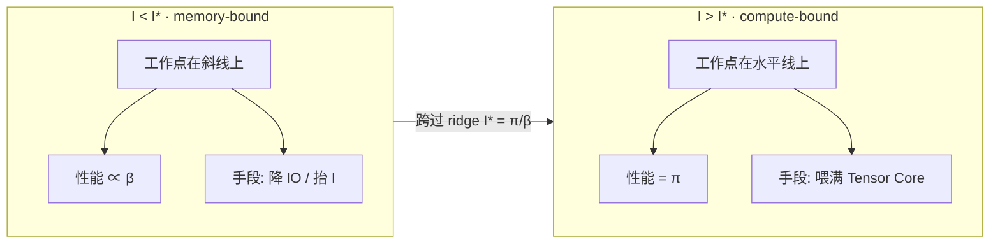
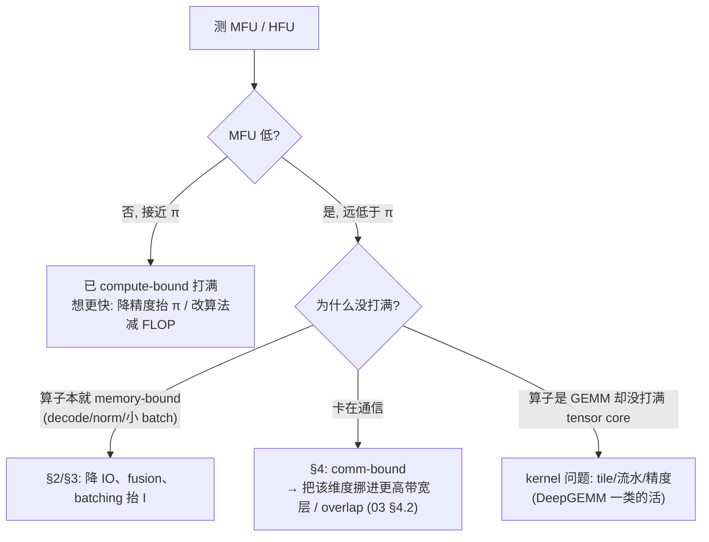
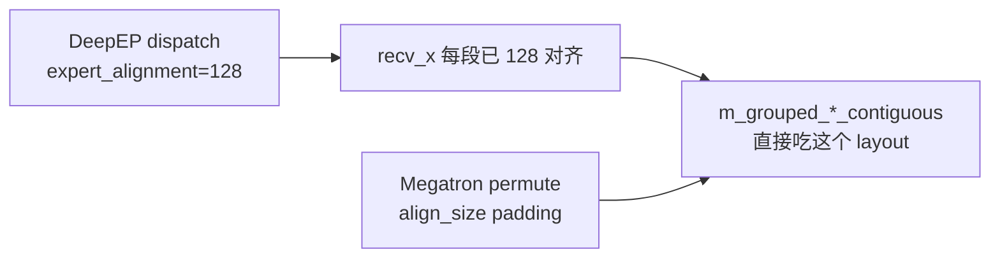
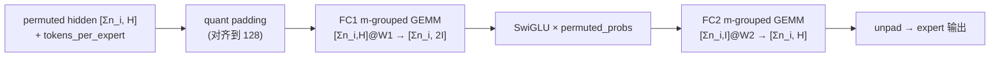
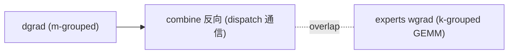

# DeepGEMM 技术解析: Hopper FP8 GEMM 的二级累加 、 细粒度 scale 布局与持久化调度

仓库 [deepseek-ai/DeepGEMM](https://github.com/deepseek-ai/DeepGEMM) 采用 MIT 许可证, 2025-02-25 作为 DeepSeek 开源周第三天的项目发布. 初始提交 `a6d97a1` 只支持 Hopper (SM90) FP8; 到 2026-09-30 的 `057ca59` (Public release 26/09/30), DeepGEMM 已从单一 FP8 GEMM 扩成统一的 tensor core kernel 库, 覆盖 FP8 / FP4 / BF16 GEMM、带通信重叠的 Mega MoE、为 lightning indexer 服务的 MQA 打分 kernel, 以及 HyperConnection 相关 kernel, 全部经 DeepJIT 在运行时编译. 具体实现分布在 `deep_gemm/include/` 的 kernel、`csrc/apis/` 的 host 接口与 `docs/scaling-factor-format.md`. 训练侧需求与量化原理可结合DeepSeek-V3 技术报告解析和FP8 混合精度训练详解阅读; DeepGEMM 接收的是已经量化的张量和 scale, 其主要工作是安排这些数据进入具体的 kernel 路径.

## 1. 它解决的瓶颈与版本演进

**为 DeepSeek-V3 的 FP8 训练与推理提供干净的 GEMM**

DeepSeek-V3 把线性层的前向与反向大量放到 FP8 上算, 用的是细粒度分块量化: 激活按 $1\times128$ 一组 、 权重按 $128\times128$ 一组, 每组一个 FP32 scale. 这套方案把离群值的影响限制在它所在的小块内, 其他块可以用更合适的 scale, 从而在 8 位尾数的前提下保住数值范围. 量化本身的动机与误差分析在上面两篇已有文章里讲过, DeepGEMM 处在它们的下游: 它不负责量化 cast, 只消费已经量化好的 FP8 张量和对应的 scale, 把 $D = C + A @ B$ 这步算快算准. README 的 Notices 一节明确写了这一分工, 输入转置和 FP8 cast 要调用方自己融进上游 kernel.

把 GEMM 单独拎出来做一个库, 原因在于 FP8 GEMM 在 Hopper 上有两个绕不开的难点, 都不是通用 BLAS 库会专门处理的. 一是 tensor core 的 FP8 累加精度不够, 直接用会让训练发散, 需要在 kernel 内部补一层高精度累加; 二是细粒度 scale 让每个 $128$ 长的 K 片都要乘一个不同的因子, 这打断了 tensor core 连续累加的节奏, 要用额外的调度把乘 scale 的开销藏起来. 这两点正是第 2 节的主题. 初始版本的 README 自述核心 kernel 只有约 300 行, 目标是作为学习 Hopper FP8 矩阵乘优化的干净样本, 这个定位一直保留到今天.

### 1.1. 从 Hopper FP8 到统一 kernel 库的演进

DeepGEMM 的能力随 DeepSeek 自身模型和系统需求分批加入. README 的 News 与对应 PR 记录了这些主要节点:

- 2025-02-25 首发: 只支持 Hopper (SM90) FP8, 稠密 GEMM 加 MoE 的 contiguous / masked 两种 grouped GEMM.
- 2025-05-14 (#95): 为 dense 与 MoE 反向加入权重梯度 kernel, 对应 K 轴分组的需求.
- 2025-07-20 (#112): 同时支持 SM90 与 SM100, 并把 JIT 重构成低 CPU 开销的 C++ 模块; 由于 NVCC 12.9 会自动做 FFMA interleaving, 原先的 SASS 后处理脚本退役.
- 2025-09-28 (#200): 为 DeepSeek-V3.2 的 lightning indexer 加入带权 ReLU 的 MQA 打分 kernel.
- 2026-04-16 (#304) 与 2026-09-30 (#462): 引入 Mega MoE 、 FP8xFP4 GEMM 、 FP4 indexer 、 PDL, 以及 locality domain 等优化, 并发布昇腾移植版 DeepGEMM-Ascend.

这条线索有一个清楚的方向: 早期是「把 V3 训练用到的 FP8 GEMM 做到极致」, 中期是「把反向和新架构 (SM100) 补齐」, 后期是「把 MoE 的通信和计算融成一个 mega-kernel, 并支持 V3.2 的稀疏 attention 打分」. 对读代码的人来说, 一个现实的影响是: 2025-07 的重构把文件结构从单个 `fp8_gemm.cuh` 拆成了 `deep_gemm/include/deep_gemm/impls/` 下按架构和数据类型分的多个文件 (如 [`sm90_fp8_gemm_1d1d.cuh`](https://github.com/deepseek-ai/DeepGEMM/blob/main/deep_gemm/include/deep_gemm/impls/sm90_fp8_gemm_1d1d.cuh)), 社区里 2025 年初那批解读文章引用的行号和文件名已经对不上当前代码, 但核心数据流没变.

**Hopper FP8 累加精度与 CUDA core 二级累加**

**FP8 tensor core 的定点累加只保留 14 位**

README 提到的「imprecise FP8 tensor core accumulation」在官方 issue [#50](https://github.com/deepseek-ai/DeepGEMM/issues/50) 中有具体说明. Hopper 的 FP8 GEMM 在 tensor core 内部使用定点累加: 各个尾数乘积按最大指数右移对齐后相加. DeepSeek 的实验发现, 符号位填充右移后只保留每个尾数乘积的最高 14 位, 其余位被截断. 沿 K 方向累加大量 FP8 乘积时, tensor core 因而产生约 14 位尾数精度的中间值, issue 将其记作 FP22, 低于完整 FP32 累加精度. 长 K 下累积的截断误差可能影响训练收敛.

这里的额外精度损失来自累加器, 与 FP8 输入的量化误差是两件事. 把 K 轴切成较短的分段后, tensor core 只负责段内累加, 每段结果再进入 FP32 累加器, 截断误差便被限制在段内. DeepGEMM 取 scale 的 K 粒度 $128$ 作为段长: 每 $128$ 个 K 元素完成一次 tensor core 累加, 取出结果、乘 scale, 随后累加到 FP32. 反量化与二级累加因此落在同一个位置.

**二级累加的实现: `accum` 与 `final_accum` 两个累加器**

在 [`sm90_fp8_gemm_1d1d.cuh`](https://github.com/deepseek-ai/DeepGEMM/blob/main/deep_gemm/include/deep_gemm/impls/sm90_fp8_gemm_1d1d.cuh) 的 math warp group 里, 每个线程持有两组寄存器累加器: `accum[WGMMA::kNumAccum]` 接 tensor core 的 WGMMA 输出, `final_accum[WGMMA::kNumAccum]` 做最终的 FP32 累加, 初值为 $0$. 内层对一个 $128$ 长的 K block 发若干条 WGMMA, 结果落在 `accum`; 等 `warpgroup_wait<0>()` 确认这批 WGMMA 完成后, 代码读入这一 block 对应的 A scale ($\text{scale\_a\_0}$ 、 $\text{scale\_a\_1}$, 对应该线程负责的两行) 和 B scale, 然后做一步 promotion:

```cpp
final_accum[i * 4 + 0] += scale_a_0 * scale_b_0 * accum[i * 4 + 0];
final_accum[i * 4 + 1] += scale_a_0 * scale_b_1 * accum[i * 4 + 1];
final_accum[i * 4 + 2] += scale_a_1 * scale_b_0 * accum[i * 4 + 2];
final_accum[i * 4 + 3] += scale_a_1 * scale_b_1 * accum[i * 4 + 3];
```

这段 FFMA 跑在 CUDA core 上, 乘的是两个 FP32 scale 的积, 加到 FP32 的 `final_accum`. 下一轮 K block 会把 `accum` 覆盖重算, 而 `final_accum` 持续累加. 这就是「二级累加」: 第一级是 tensor core 内部对一截 K 的低精度定点累加 (每 $128$ 个 K 出一个 FP22 级中间结果), 第二级是 CUDA core 把每截的结果乘 scale 后以 FP32 累加. 它不是 FP8 到 BF16 再到 FP32 的类型转换链, 这一点 issue #50 的提问者一开始就问错了方向, 官方作了纠正.

值得单独点出的是读 scale 的位置. 代码注释写明, 所有对共享内存的 scale 读取必须排在 `warpgroup_arrive()` 之前, 否则下一个被调度的 block 可能污染结果. A scale 由 math warp 自己从共享内存读 (`smem_sfa`), B scale 也在 math warp 读 (`smem_sfb`), 而 A 、 B 、 A 的 scale 由 TMA warp 负责搬入. 社区解读把这解释成一种负载均衡: 不把所有搬运都压给生产者 warp, 让消费者分担一点 scale 的加载.

**细粒度 scale 的两种粒度与 1d1d / 1d2d 的分叉**

DeepGEMM 对 scale 粒度的处理分成两套 kernel. [`sm90_fp8_gemm_1d1d.cuh`](https://github.com/deepseek-ai/DeepGEMM/blob/main/deep_gemm/include/deep_gemm/impls/sm90_fp8_gemm_1d1d.cuh) 对应 A 、 B 都是一维 scale 的情形 (A 按 $1\times128$ 、 B 也按每 $128$ 一个), 它的 promotion 里 B scale 对一个 N 方向的 block 是均匀的, 两行 A scale 乘同一个 B scale 即可. [`sm90_fp8_gemm_1d2d.cuh`](https://github.com/deepseek-ai/DeepGEMM/blob/main/deep_gemm/include/deep_gemm/impls/sm90_fp8_gemm_1d2d.cuh) 对应 B 用二维 $128\times128$ 块 scale 的情形, 这正是 V3 权重的量化方式. 此时一个 `BLOCK_N` 内可能跨越两个不同的 B scale, promotion 要区分前半和后半.

代码里用 `kMustUseUniformedScaleB` 和 `num_former_iters` 处理这个分叉. 当 `BLOCK_N` 是 `BLOCK_K`(即 $128$) 的整数倍且不需要非均匀 scale 时, `kMustUseUniformedScaleB` 为真, 一个 block 只读一个 B scale; 否则读两个 ($\text{scale\_b\_0}$ 和 $\text{scale\_b\_1}$), 并用一个编译期能定下来的 `num_former_iters` 决定前多少个累加分量用前一个 scale 、 其余用后一个. 源码注释特别强调「把它做成谓词 (predicate) 对性能很重要, 比写成两个循环好」, 因为谓词配合 `num_former_iters` 的编译期常量化, 让编译器能把分支消成无分支的选择. 这是细粒度 scale 布局在 kernel 内部留下的痕迹: 不规整的 $128\times128$ 边界要靠编译期常量和谓词化来消化, 而不能在运行时用普通分支.

**细粒度 scale 的布局与对齐要求**

### 1.2. UE8M0 打包与 MN-major 的 TMA 对齐

`docs/scaling-factor-format.md` 把 scale 张量的契约写得很细, 核心是两件事: SM100 上 scale 用 UE8M0 格式打包, 以及 scale 张量必须是 MN-major 且 TMA 对齐. UE8M0 是只有 8 位指数 、 没有尾数和符号的格式, 代表一个 $2$ 的整数次幂. 文档 1.2 节要求每个 FP32 scale 值必须恰好是 $2$ 的幂 (位模式 `[0][8 位指数][23 位尾数全 0]`), 设备侧用 `DG_TRAP_ONLY_DEVICE_ASSERT((value & 0x807fffffu) == 0)` 断言. 打包时把 K 方向连续 4 个位置的 8 位指数塞进一个 `int32`, 按 K 下标小端排列, 于是 $4$ 个 UE8M0 占一个 `torch.int`.

MN-major 和对齐是为 TMA 服务的. 文档 7.2 节给出的内存图里, 转换后的张量形状是 $[\text{mn}, \text{packed\_sf\_k}]$, stride 是 $[1, \text{align}(\text{mn}, 4)]$, 即 MN 维连续, 每个 K 切片占 $\text{align}(\text{mn}, 4)$ 个 `int32`. 这里的 $4$ 来自常量 `ALIGN_MN = 16 bytes / sizeof(int32)`, 因为 TMA 要求末维的 stride 是 $16$ 字节的倍数. 切片之间多出来的填充槽 (图里的 `__`) 只为对齐存在, 永远不会被当数据读. 对 M 分组的 PSUM 布局, 组与组之间还有 gap 行, 转换时不读这些行的输入, kernel 为它们写 $0$ (一个安全的有限 scale 码, 因为 UE8M0 的 `0xff` 是 NaN), GEMM 永不消费这些值.

**两条提供路径与 recipe 的广播语义**

文档第 2 节给了两条提供 scale 的路径, 分别服务原型和生产. 路径 A 传未转换的 `float32` scale, 每次 GEMM 调用内部都会启动一个转换 kernel 把它变成所需布局, 适合调试和正确性测试. 路径 B 传已经打包好的 `int32` scale, kernel 只校验布局不再转换, 适合生产: 权重转换一次缓存复用, 激活直接从量化 cast kernel 产出满足契约的 `int32`. `transform_sf_into_required_layout` 是这两条路径的统一入口, 它的分发表 (文档第 4 节) 按输入 dtype 、 粒度和架构决定是转置 、 打包还是只校验.

一个容易踩的点是 recipe 在两条路径下的差异. 路径 B 要求传给 GEMM 的 recipe 满足 $\text{gran\_m} = \text{gran\_n} = 1$, 因为转换过程已经沿 MN 把 scale 广播开了, 只剩 K 粒度有意义. 文档 6.2 节还给出一个更隐蔽的坑: `fp8_einsum` 会在内部把每个操作数及其 scale 置换成 $(\text{batch}, m, n, k)$ 顺序再调批量 GEMM, 所以第 3 节的 stride 契约是在置换之后的张量上检查的. 如果某个 scale 会被置换, 必须在置换后的坐标里做转换再置换回来, 而不能把二维转换结果 reshape 成三维 (因为 MN-major 的输出是非连续的, reshape 会悄悄拷成连续从而破坏 stride, 触发 `DG_HOST_ASSERT`). 这类约束解释了为什么库要专门写一份 scale 格式文档: 布局错了不会算错数, 而是直接在 host 侧断言失败.

**K 分组与 Mega MoE 的额外布局**

K 轴分组的 GEMM (用于 MoE 权重反向) 的 scale 契约与普通 GEMM 不同. 文档第 5 节说明, K 分组沿 K 拼接各组, scale 输入是二维的 $[\text{sum\_sf\_k}, \text{mn}]$, 且 `int32` 预打包路径只在 SM100 且 $\text{gran\_k} = 32$ 时接受, $\text{gran\_k} = 128$ 时必须传 `float32`. 与第 3 节不同, K 分组的打包 scale 是普通连续布局, 不在 MN 方向插填充, 而是把 $\text{mn} \bmod 4 = 0$ 作为硬前置条件. 每组独立打包再拼接: 组内 scale 行数不是 $4$ 的倍数时, 末个打包行尾部的 UE8M0 槽位零填充. PSUM 布局还支持组大小动态, 按 `k_alignment` 填充存储, `ks_cpu` 传对齐后的大小.

Mega MoE 的要求更严, 文档 6.3 节列得很清楚. 它的 recipe 固定为 $(1, 1, 32)$, 权重 scale 必须已经是打包 `int32`, 没有 `float32` 回退也没有自动转换, 传 `float32` 直接被 `check_sf_layout` 拒绝. 而且在满足第 3 节布局之后, 还必须经 `transform_weights_for_mega_moe` 做一步 mega MoE 专属的重排: 把 L1 的 gate / up 行按 8 行粒度交错, 并对 L1 、 L2 的 scale 做一个 UTCCP 的 $128$ 行内转置 (要求 $\text{mn} \bmod 128 = 0$). 激活的 scale 则完全是内部的, 活在 symmetric memory buffer 的切片里, 由 kernel 流水产出, 不作为用户参数. 这说明随着融合程度加深, scale 的布局约束也从「GEMM 通用契约」收紧成「某个 mega-kernel 专用的物理排布」.

**执行骨架: warp 专精 、 TMA 、 持久化调度与底层技巧**

**warp specialization 与 setmaxnreg 的寄存器再分配**

DeepGEMM 的 kernel 按 CUTLASS 的思路做 warp specialization: 把一个 block 里的 warp 分成生产者和消费者两类. 在 [`sm90_fp8_gemm_1d1d.cuh`](https://github.com/deepseek-ai/DeepGEMM/blob/main/deep_gemm/include/deep_gemm/impls/sm90_fp8_gemm_1d1d.cuh) 里, `warp_idx >= kNumMathThreads / 32` 的 warp 进 TMA 分支负责搬数据, 其余进 math 分支执行 WGMMA. 两类 warp 通过一组 full / empty barrier 配对: 生产者等 empty barrier 后发 TMA, 到达 full barrier; 消费者等 full barrier 后算 WGMMA, 算完到达 empty barrier 通知这一级共享内存可以覆盖. 这样数据搬运和矩阵乘在流水的不同级上重叠, 而不是串行等待.

寄存器分配是这套设计能跑起来的关键. 生产者只需要很少的寄存器 (TMA 把数据直接搬进共享内存, 不过寄存器), 消费者 WGMMA 需要很多. 代码用 `warpgroup_reg_dealloc` 和 `warpgroup_reg_alloc` (底层是 `setmaxnreg.aligned` 指令) 做再分配: 当前实现里, 不展开流水时生产者分 $40$ 个 、 消费者分 $232$ 个寄存器, 全展开时分别是 $24$ 和 $240$. 按老版本代码计算，一个 SM 共 $65536$ 个寄存器，$256 \times 232 + 128 \times 40 = 64512$，再加上每个 block 保留的约 1K，恰好容纳两个消费者 warp group 和一个生产者 warp group. 这解释了线程数的约束: 生产者要是 $128$ 的倍数, 消费者要是 WGMMA 的 warp group ($128$) 的倍数, `BLOCK_M` 为 $64$ 时 blockDim 常见是 $256$ 或 $384$. 没有 `setmaxnreg` 的话, 消费者最多只能有 $128$ 个线程.

**TMA 的几种用途与 multicast**

TMA (Tensor Memory Accelerator) 是 Hopper 引入的异步数据搬运硬件, DeepGEMM 把它用在几个地方. 加载侧, A 、 B 以及 A 的 scale 都用 `tma::copy` 从全局内存异步搬进共享内存, kernel 开头还用 `prefetch_tma_descriptor` 预取 TMA 描述符. 存储侧, 输出用 TMA 写回; 在带累加的路径里用 `SM90_TMA_REDUCE_ADD_2D` 在写回时加到已有值, 这对 $D = C + A @ B$ 的 $C$ 项和 K 分组的跨组累加有用. 初始版 README 还列了一条: TMA multicast 只用在 LHS (即 A) 上, 让多个 CTA 共享同一份 A 数据的搬运.

multicast 的边界处理藏在调度器里. [`scheduler/gemm.cuh`](https://github.com/deepseek-ai/DeepGEMM/blob/main/deep_gemm/include/deep_gemm/scheduler/gemm.cuh) 的 `get_swizzled_block_idx` 对 SM90 有一段专门代码: 当 multicast 数大于 $1$ 且一组里的块数是奇数时, 把尾组截掉一个 、 单独起一个单块组, 避免两个本应配对 multicast 的 CTA 一个有一个没有. `is_tma_multicast_valid` 进一步检查: 对 M 分组的 contiguous 布局, 若 M 相邻的两个参与 multicast 的 CTA 落在不同专家组, 就禁用 multicast. SM100 用 2-CTA 的方式, 不能像 SM90 那样动态关掉 multicast, 所以这段带 `__CUDA_ARCH__ < 1000` 的条件编译只给 SM90. 这些细节是把一个理论上整齐的 multicast 落到不规则 token 数的 MoE 上必须补的边界.

### 1.3. 持久化调度 、 block swizzle 与非 2 次幂 block 尺寸

调度器是整个库复用最高的一块, 一个 `Scheduler` 结构同时服务稠密和各种 grouped kernel. 它走持久化调度: 每个 CTA 常驻, 循环调用 `get_next_block`, 用 `(++ current_iter) * kNumSMs + blockIdx.x` 算出下一个输出 tile 的一维任务号, 直到任务号越界返回 false. 这样可以省去「一个 tile 启动一个 CTA」的开销, 寄存器和共享内存也只在 kernel 生命周期开始时分配. 任务号到 $(m, n)$ 的映射走 `get_swizzled_block_idx`: 它按一个 group 大小分块, 候选值为 $8$ 或 $16$, 由 `get_num_1d_blocks_per_group` 根据访存量选择. 同组 CTA 可以复用同一方向的 A 或 B tile, 这些 tile 留在 L2 里跨 CTA 复用. swizzle 的方向取非 multicast 的那一维.

非 $2$ 次幂的 block 尺寸是一个容易被忽略的优化. 初始版 README 举了个例子: $M=256, N=7168$ 时, 若用常规的 $\text{BLOCK\_M}=128, \text{BLOCK\_N}=128$, 只有 $(256/128)\times(7168/128)=112$ 个 block, 用不满 $132$ 个 SM; 改用 $\text{BLOCK\_N}=112$ 就有 $(256/128)\times(7168/112)=128$ 个 block, 让更多 SM 干活. 当前库把这类能力沉淀成工具函数 `set_block_size_multiple_of`, 约束 block 尺寸是某个值的倍数, 配合 JIT 把 block 尺寸当编译期常量来选. README 强调, 把这种不对齐的 block 尺寸和细粒度 scale 一起实现需要仔细优化, 但确实能换来性能, 第 2.3 节的 `num_former_iters` 谓词化就是为了在不规整 block 下仍能消掉分支.

**FFMA SASS interleaving: 一个退役的底层技巧**

初始版 README 里有一条很有代表性的底层技巧, 虽然已经退役, 但值得记录它揭示的问题. DeepSeek 对比 NVCC 12.2 和 12.3 编出来的 CUTLASS FP8 kernel 的 SASS, 发现一串 FADD 指令里有一位被按交错模式翻转. 对照开源 CUDA 汇编器后, 他们判断这位控制 `yield` (让当前 warp 在该指令后让出, 使 warp scheduler 能调度别的 warp 掩盖延迟). 据此写了 `interleave_ffma.py`, 对编译出的二进制里的 FFMA 指令按对定位 $16$ 字节机器码, XOR `0x0800200000000000` 同时翻 `yield` 位和 `reuse` 位 (寄存器复用位, 因为 warp 一旦让出, 下一个执行的可能是别的 warp, 寄存器状态可能被改, 所以 yield 时必须清掉 reuse).

这个后处理给 WGMMA 和第 2.2 节的 promotion FFMA 创造更多重叠窗口, README 自述在某些细粒度 scale 的 FP8 GEMM 上提速 $10\%$ 以上. 2025-07 的重构 (#112) 将其退役: News 说明 NVCC 12.9 已能自动完成 FFMA interleaving, 无须继续修改 SASS. 这段历史反映了 DeepGEMM 的优化深度曾到达机器码层; 编译器补上相同能力后, 手工后处理也随之退出.

**grouped GEMM 两种布局与 V3.2 的 MQA logits**

**contiguous 布局服务训练前向与 prefill**

DeepGEMM 的 grouped GEMM 与 CUTLASS 传统做法不同: 它只在 M 轴分组, N 和 K 必须固定. 这是为 MoE 里所有专家共享同一形状 ($N, K$ 相同) 的场景设计的. contiguous 布局把各专家的 token 沿 M 拼成一个大张量, 每个专家段对齐到 GEMM 的 M block 大小 (由 `get_mk_alignment_for_contiguous_layout` 给出). 对应 API 是 `m_grouped_fp8_gemm_{nt, nn}_contiguous`. 训练前向和推理 prefill 阶段, 每个专家处理的 token 数不同但在一次调用里是已知的, 把它们拼接后用一个 `grouped_layout` 张量标记每个专家的边界即可.

这种布局的好处是和上游通信库零拷贝对接. 社区在 sglang 集成 DeepEP V2 的 issue [#370](https://github.com/deepseek-ai/DeepGEMM/issues/370) 里记录了实际用法: prefill 路径关闭 CUDA graph, DeepEP 以 `do_expand=True` 产出已按专家排好序的二维布局, 直接当 contiguous GEMM 的输入, 用 `handle.psum_num_recv_tokens_per_expert` 作为组偏移, 不需要额外的 scatter / gather. 这里的 contiguous 对齐和 DeepEP 的 token 对齐用同一个 `get_mk_alignment_for_contiguous_layout` 对齐值, 两边才能对上.

**masked 布局服务 decode, K 分组服务权重反向**

decode 阶段的约束不同: 开启 CUDA graph 后, CPU 不知道每个专家收到多少 token, 形状必须静态可捕获. 这时用 masked grouped GEMM: 输入是三维的 $[E_{\text{local}}, \text{expected\_m}, K]$, 加一个 mask (或每专家有效 token 数) 张量, kernel 只计算有效部分, 对应 API 是 `m_grouped_fp8_gemm_nt_masked`. README 举的典型用法是把 DeepEP 低延迟 kernel 的输出直接当输入. issue #370 也点出代价: DeepEP V2 的非扩展输出是二维未排序的, 要接 masked GEMM 得补 scatter / reverse-scatter 等转换 kernel, 这是两种布局在工程落地时真实存在的摩擦.

K 轴分组是第三种布局, 服务 MoE 权重反向. 反向时 $M$ 和 $N$ 固定, 要沿 K 把不同样本的贡献分组累加, 对应 `k_grouped_fp8_gemm_tn_contiguous` (SM100) 或 `k_grouped_fp8_gemm_nt_contiguous` (SM90). 文档第 5 节说明它的 $C$ 累加器约束: 签名虽然默认 $C$ 为 None, 但 K 分组强制 $C$ 非空, 推荐直接把 $C$ 传成和 $D$ 同一个张量做原地累加, 否则 DeepGEMM 会先 `d.copy_(c)` 多一次全量拷贝. 三种布局合起来覆盖了 MoE 的前向 (contiguous) 、 decode (masked) 和反向 (K 分组) 全链路, 共用同一个调度器和同一套二级累加.

**lightning indexer 的 MQA 打分 kernel**

2025-09 (#200) 加入的 MQA logits kernel 服务 DeepSeek-V3.2 的 lightning indexer, 这是 V3.2 稀疏 attention 里给 KV 打分 、 选 top-k 的那一步. kernel 有非分页 (prefill) 和分页 (decode) 两个版本, 以 `fp8_fp4_mqa_logits` 为例, 它对每个 query token $i$ 遍历 $[\text{cu\_seq\_len\_k\_start}[i], \text{cu\_seq\_len\_k\_end}[i])$ 范围内的 KV token $j$, 算 $\text{out}_{ij} = \text{relu}(q_i @ (kv_j \cdot \text{kv\_sf}_j)) \cdot \text{weights}_i$ 再对 head 求和, 得到一个标量 logit. 带权 ReLU 是这里和普通注意力打分不同的地方, README 的伪代码把这步写得很直白.

这个 kernel 的 scale 契约在文档 6.1 节, 和普通 GEMM 不同, 是硬编码的. $q$ 的 scale 和 $kv$ 的 scale dtype 耦合: 传 $q\_sf$ 即选中 MX 模式, 两者都要是打包 UE8M0 的连续 `int32` (仅 SM100); 不传 $q\_sf$ 则 $kv\_sf$ 是每 token 一个 `float32` (仅 SM90), 没有混合模式. MX 的 scale 粒度是沿 `head_dim` 每 $32$ 个元素一块, `head_dim` 不超过 $128$ 时一个 token / head 的至多 $4$ 个 UE8M0 指数正好塞进一个 `int32`. 分页版把 KV 的 scale 融进字节 cache (每 token 的 value 字节后跟 $4$ 个 scale 字节), 而不是单独一个张量. 两个 API 都不清理超出有效 KV 跨度的项, 调用方要自己 mask. 这说明 DeepGEMM 已经从「只做 GEMM」扩展到承载 V3.2 attention 里计算密度最高的打分步.

## 2. 性能边界与 Roofline 分析

**性能数字的口径**

初始版 README 的性能表给了最清楚的口径: 在 H800 上用 NVCC 12.8 测, 覆盖 DeepSeek-V3/R1 推理 (prefill 与 decode, 不含张量并行) 可能用到的形状, 加速比是相对 DeepSeek 内部基于 CUTLASS 3.6 精调的实现算的. 稠密 GEMM 一列里, 大形状如 $M=4096, N=7168, K=16384$ 达到 $1358$ TFLOPS, 加速比约 $1.2\times$; 小 M (如 $M=64$) 的形状加速比更高 (到 $2.7\times$), 因为 JIT 把形状当编译期常量 、 全展开流水对小形状收益大. News 里 2025-04-18 的 $1550$ TFLOPS 是后续几个 PR 优化后的峰值, 对应 H800. 这里要分清: $1358$ 是初版表格里某个具体形状的实测, $1550$ 是优化后的峰值, 两者口径不同.

当前主仓库 README 已经删掉了这张表, 只保留一句「性能追平或超过专家手调的库」, 具体数字散在各 PR 里. 相对地, DeepGEMM-Ascend 的 README 给了完整的昇腾性能表, 口径是 Ascend 950DT (CANN 9.20) 、 用 `bench_msprof` 冷 L2 测, 形状跟随 DeepGEMM 测试套件: 稠密 GEMM 对各类型达到最高 $99.8\%$ 的硬件上限 (BF16 的 $431$ TFLOPS 对上限 $432$), MQA logits 则是 FIX-pipe 瓶颈而非算力瓶颈, FIX pipe 利用率 $99\%$. 两个仓库的性能表硬件不同 (H800 对 Ascend 950DT) 、 基线不同 (CUTLASS 对硬件理论上限), 引用时要带上这些前提.

### 2.1. DeepGEMM-Ascend 与主仓库的关系

[DeepGEMM-Ascend](https://github.com/deepseek-ai/DeepGEMM-Ascend) 是 DeepGEMM 到华为昇腾平台的移植, 2026-09-30 首发, 支持 Ascend 950 系列. 它的定位是完全兼容 DeepGEMM 的 API: 用同一个包名 `deep_gemm`, 支持 BF16 、 FP8 、 FP4 GEMM 、 MQA logits 和 MegaMoE, 用户在昇腾上装这个包就能沿用其他平台的 API 和开发流程. 它对昇腾的 MAD (矩阵乘加) 原语做了一层轻量抽象, 隐藏分形矩阵布局 、 对齐约束 、 地址计算等细节, 并用昇腾特有的稀疏数据加载 、 基于协程的流水线等技巧逼近硬件极限.

两者在 scale 格式上有一处明确差异, 对照时要注意. DeepGEMM-Ascend 的 README 的 NOTE 写明: 昇腾上每对 (两个) UE8M0 scale 沿 K 打进一个 `int16`, 并按 MN-major 存储; 而 NVIDIA 侧是 $4$ 个 UE8M0 打进一个 `int32` (本文 3.1 节). 这是为适配昇腾硬件效率做的物理排布调整, 接口层保持一致, 底层打包不同. 其余接口 (`set_num_sms`, contiguous 对齐, `transform_sf_into_required_layout` 等) 都对齐主仓库, 并额外提供 `set_npu_arch` 、 ACLNN 参考 GEMM 等昇腾专属工具.

**DeepJIT 与主仓库的关系**

[DeepJIT](https://github.com/deepseek-ai/DeepJIT) 是从 DeepGEMM 里抽出来的 JIT 运行时, 2025-09-08 首发公开版, header-only 的 C++20 库, 同时支持 NVIDIA CUDA 和华为昇腾两个后端. DeepGEMM 和 DeepGEMM-Ascend 都把它当底座: 「安装期不编译 、 kernel 全部运行时编译」这个贯穿两仓库的设计, 实现就在 DeepJIT. 它给扩展作者一套共享接口来编译 kernel 源码 、 缓存二进制 、 加载到设备 、 用后端专属选项启动, 并处理源码与 include 哈希 、 内存与磁盘缓存 、 惰性初始化这些基础设施. DeepGEMM README 里 `DG_JIT_*` 环境变量在未设置时回退到全局 `DJ_JIT_*`, 正是因为底层是 DeepJIT (前缀 `DJ`).

从主仓库的角度看, DeepJIT 解释了几个 README 现象. 其一, 缓存目录默认 `$HOME/.dj` 、 支持 `:` 分隔的多根查找, 这是 DeepJIT 的共享缓存设计, 多用户 、 多进程 、 多节点可共享一个缓存目录复用编译产物. 其二, DeepGEMM 把 GEMM 形状 、 block 尺寸 、 流水级数当编译期常量 (本文 4.3 节), 靠的就是 DeepJIT 对每种 config 单独编译一个 kernel 并按源码 、 include 、 编译器版本 、 选项 、 依赖签名算缓存键. 其三, `DG_JIT_DUMP_SASS` 这类 dump 开关 、 以及 `DG_JIT_CHECK_NO_SPILLS` 的 spill 断言, 都是 DeepJIT 的编译诊断能力透出到 DeepGEMM 的环境变量. DeepJIT 的缓存键用的是双状态 FNV-1a, 每个组成部分带字节长度前缀, 最终是 $32$ 字符十六进制, README 明确这是快速校验和而非密码学哈希.

**局限与适用条件**

判断一个 DeepGEMM kernel 是否“正确”，至少要分三层。第一层是布局正确：逻辑矩阵元素、scale 和专家分组经过转置、padding 与 swizzle 后仍对应原来的索引。第二层是数值正确：输出与高精度参考之间的误差落在所选格式、缩放粒度和累加顺序允许的范围内。第三层是训练正确：单次 GEMM 的误差经过残差连接、归一化和反向传播后，不造成 loss 漂移或梯度异常。只做逐元素 `allclose` 能覆盖前两层的一部分，无法代替端到端训练对照。

误差阈值也应随形状变化。$K$ 越长，部分和越多，舍入误差通常越容易积累；输入含离群值时，同一绝对误差又可能对应完全不同的相对误差。测试集因此需要覆盖长 $K$、非整 tile、极小幅值、接近格式上限的数值，以及不同 scale block 交界处，不能只用均匀随机张量。

性能验证也要把形状分布保留下来。单个大方阵的 TFLOPS 很容易接近计算屋顶，MoE 工作负载却包含大量窄而短的矩阵；某些专家只有几个 token，另一些专家接近容量上限。把所有专家 token 合并后只报总 FLOPs，会隐藏空 tile、尾块和调度等待。更可靠的统计应同时给出每组 $M$ 的直方图、有效 FLOPs、读写字节、kernel 墙钟和端到端层耗时，再按真实路由频率加权。

还有一个常见反例：更高的 kernel TFLOPS 不一定带来更高训练吞吐。如果新实现要求额外转置、scale 重排或同步，这些工作可能落在 GEMM 计时区间之外；kernel 自身更快，整层反而更慢。DeepGEMM 把输入量化与若干布局转换交给上游融合，README 的性能表因此只能在相同前处理约定下比较。应用到另一套训练框架时，需要把生产者到消费者的完整数据路径一起计时。

DeepGEMM 的适用边界在 README 的 Notices 和各处约束里写得比较清楚. 它只做 GEMM 本身, 量化 cast 和输入转置要调用方自己融进上游 kernel, 用库里提供的 PyTorch 工具函数会慢. scale 必须是 $2$ 的整数次幂, 这由 UE8M0 格式和设备断言强制, 产 scale 时要传 `round_sf=True`. 硬件上只支持 SM90 和 SM100 (昇腾走单独的 DeepGEMM-Ascend 仓库), 需要 CUDA Toolkit 12.9 以上和支持 C++20 `<format>` 的编译器. grouped GEMM 只在 M (或反向的 K) 轴分组, N 和 K 必须固定, 这对专家形状不一致的 MoE 不适用.

还有两点来自底层机制. 一是 FP8 tensor core 的累加精度 (第 2.1 节) 是硬件特性, 二级累加能缓解但不能消除 FP8 本身的量化误差; 细粒度分块量化决定输入误差, DeepGEMM 负责按既定格式消费量化结果. 二是 JIT 不做 auto-tuning, 而是按形状确定性地选择 block 尺寸、warp group 数、流水级数和 TMA cluster 大小. 选择逻辑位于 `csrc/jit_kernels/heuristics/`, 未充分覆盖的形状可能得不到最优配置; 初始版 README 也明确记录了部分形状表现不佳. 2025-07 的重构还调整了文件与命名, 例如 `gemm_fp8_fp8_bf16_nt` 在新版中改名为 `fp8_gemm_nt`; 旧接口名称不能直接套到当前版本.

**参考资料**

- [从混合精度训练到 DeepGEMM — AIInfra](https://infrasys-ai.github.io/aiinfra-docs/04Train03TrainAcceler/03DSGEMM.html)
- [浅读 DeepGEMM — wu-kan](https://wu-kan.cn/2025/03/03/%E6%B5%85%E8%AF%BB-DeepGEMM/)
- [The DeepGEMM Scheduler Struct — Kingsley Kim](https://kingsleykim.dev/blog/deepgemm-scheduler/)
- [GitHub issue #50: two-level accumulation](https://github.com/deepseek-ai/DeepGEMM/issues/50)
- [GitHub issue #370: DeepEP V2 与 grouped GEMM 布局](https://github.com/deepseek-ai/DeepGEMM/issues/370)

### 2.2. 用 Roofline 判断分块何时有效

GEMM 优化要先判断瓶颈落在计算屋顶还是带宽屋顶。下面从算术强度、tile 复用和小矩阵退化推导 DeepGEMM 各类 kernel 的适用区间，再把 grouped GEMM 的不均衡纳入同一分析。

> 本篇是整章的分析底座。在讲集群、网络、collective 之前，先把一个最朴素也最锋利的问题说清楚：一段 kernel、一个算子、一整层 transformer，它在一块 GPU 上能跑多快，这个上界是由什么决定的？答案就是 roofline——两道天花板（peak compute 与 peak bandwidth）加一个拐点（ridge point）。
>
> 上一篇 00 · GPU 硬件参数：常用量与主流型号对照 已经把 $\pi$ / $\beta$ 的单位、dense vs sparse、各型号的具体数字定下来了。本篇只负责讲清楚「怎么用这些数字判断瓶颈」。它和后面几篇的关系是这样的：`01`/`02` 讲的「带宽瀑布」、`04` 讲的 α-β，本质上都是 roofline 里「带宽这一道天花板」在不同层级（HBM → NVLink → RDMA）上的展开。
>
> 阅读这一篇之前，只需要知道 GPU 有算力和显存带宽两项瓶颈；具体型号的数字见上一篇，FLOP、算术强度、拐点这些概念会在正文里逐一定义。

参考 / 事实来源：

- 单卡峰值算力锚点：DeepGEMM 在 H800 上 FP8 GEMM 冲到 **1550 TFLOPS**（[[deepgemm:README.md#L23]]，News · 2025.04.18），是「compute-bound 算子打满 compute 天花板」的真实证据。
- memory-bound 的范本：FlashAttention 的核心卖点就是 **IO-Awareness**——"Fast and Memory-Efficient Exact Attention with **IO-Awareness**"（[[flash-attention:README.md#L6]]）。后面会用它说明 memory-bound 算子怎么沿 roofline 往右挪。
- 单卡 $\pi$ / $\beta$ / ridge point 的型号对照见 `00_gpu_hw_params` §3；带宽层级的量级沿用 `01` §2，这里不重复推导。

---

**两道天花板加一个拐点**

一块 GPU 的可达性能 $P$ 取计算上界与带宽上界中的较小值：前者由峰值 FLOP/s 决定，后者由峰值 byte/s 决定。而决定你会撞上哪道墙的，是这个算子的 arithmetic intensity——也就是每搬一个 byte，能换来多少次浮点运算。

把它画成一张图会更直观（双对数坐标，横轴是 arithmetic intensity $I$，纵轴是可达性能 $P$）：

```
 P (FLOP/s, log)
   π ┤· · · · · · · ·________________________   ← ① compute roof: P = π (peak FLOP/s)
     │              ╱
     │             ╱
     │            ╱  ← ② memory roof: P = I·β  (这条斜线的斜率 = β, peak bandwidth)
     │           ╱
     │          ╱
     │         ╱
     │        ╱
     └───────┼────────────────────────────────► I (FLOP/byte, log)
            I* = π/β
   ◄ memory-bound ►│◄────── compute-bound ──────►
   (撞带宽墙)        (撞算力墙)
```



> 图：roofline 两种工作点。真实 $I^*$ 按卡代入上一篇 §3——H100 ≈295 FLOP/byte，H200 因带宽更高回落到 ≈206，B200 ≈325。

图里两道线的含义分别是：**compute roof（水平线）**是硬件每秒能做的浮点运算上限 $\pi$（peak FLOP/s），算子再怎么省 IO，也不可能跑得比它快；**memory roof（斜线）**说的是，如果每秒最多能搬 $\beta$ 字节，而这个算子每个字节只够喂 $I$ 次运算，那它每秒最多也就做 $I \cdot \beta$ 次运算，这条斜线的斜率就是带宽 $\beta$。两道墙相交的地方是 **ridge point $I^* = \pi/\beta$**（拐点）：$I < I^*$ 时工作点落在斜线下方，属于 **memory-bound**；$I > I^*$ 时工作点顶到水平线，属于 **compute-bound**。

整章乃至整个 `docs/` 仓库的优化，几乎都可以归结为一句话：要么把工作点沿着 roofline 往上推，逼近自己那道天花板；要么把工作点往右挪，提高 $I$、跨过 ridge point，让算子从 memory-bound 变成 compute-bound。

---

**定义：三个量**

roofline 只涉及三个量，但每一个都要把单位和语义钉清楚，否则后面算 arithmetic intensity 会算错。

| 符号 | 名字 | 单位 | 语义 |
|---|---|---|---|
| $\pi$ | peak compute | FLOP/s | 硬件每秒浮点运算上限。**和精度强绑定**：同一块卡 FP8 的 $\pi$ ≈ BF16 的 ~2×，FP16/BF16 又远高于 FP32。tensor core 的 $\pi$ 远高于 CUDA core。 |
| $\beta$ | peak bandwidth | byte/s | 某一级存储/链路每秒能搬的字节上限。**分层**：HBM（数 TB/s）$\gg$ NVLink（数百 GB/s）$\gg$ RDMA（数十 GB/s），见 `01` §2。 |
| $I$ | arithmetic intensity（也叫 operational intensity） | FLOP/byte | **算子自身的属性，与硬件无关**：完成这次计算总共要做的 FLOP，除以必须跨过那一级存储/链路搬运的 byte。 |

可达性能就是一道取最小值的公式：

$$
P(I) = \min(\pi,\ I \cdot \beta)
$$

当 $I \cdot \beta < \pi$，也就是 $I < I^* = \pi/\beta$ 时，属于 **memory-bound**：性能正比于带宽，这时候加算力没有用，得想办法降 IO 或者升高 $I$。反过来，当 $I \cdot \beta \ge \pi$，也就是 $I \ge I^*$ 时，属于 **compute-bound**：性能顶在 $\pi$ 上，省 IO 也没用，得换更高精度的算力，或者想办法把 tensor core 打满。

**ridge point 的数值与逐代右移的趋势**

代入真实卡的 **dense** 数字（来自 `00_gpu_hw_params`，营销用的 sparse 数字已经折半）：

| 量 | H100 SXM BF16 | H100 SXM FP8 | H200 SXM BF16 | B200 SXM BF16 |
|---|---|---|---|---|
| $\pi$（Tensor Core **dense**） | 989 TFLOP/s | 1979 TFLOP/s（DeepGEMM 实测 H800 FP8 **1550**，[[deepgemm:README.md#L23]]） | 989 | ~2500 |
| $\beta$（HBM） | 3.35 TB/s | 3.35 TB/s | 4.8 TB/s | 7.7 TB/s |
| **$I^* = \pi/\beta$** | **~295** | **~590** | **~206** | **~325** |

这里有一个值得展开说的关键趋势，通常叫 **memory wall**：每一代 GPU，$\pi$ 的增速都远快于 $\beta$——算力翻得比带宽快得多。$I^* = \pi/\beta$ 因此逐代右移：上一代还算 compute-bound 的算子，到了新卡上可能就变成了 memory-bound。这正是为什么近几年的 kernel 工程越来越多是在「省 IO」（fusion、FlashAttention、量化通信），而不是在「堆 FLOP」——因为 ridge point 一直在往前跑，工程师必须追着它调整策略。低精度（FP8/FP4）比较特殊，它一边抬高 $\pi$、一边因为每个元素占用的字节更少而抬高 $I$，是少数能同时把工作点往「上」和往「右」推的手段。

---

**怎么算一个算子的 arithmetic intensity**

roofline 的全部功夫都在「估对 $I$」这一步。规则很简单：分子是这次计算的总 FLOP，分母是必须穿过目标存储层的 byte（通常就是 HBM 的读写量）。下面四类算子基本覆盖了 LLM 里 99% 的情况，把它们的 $I$ 量级记下来，就能一眼判断出瓶颈在哪。

先约定一个贯穿全文的记号：`dtype` 的字节数记为 $s$（BF16/FP16 时 $s = 2$，FP8 时 $s = 1$，FP32 时 $s = 4$）。

**大 GEMM：compute-bound 的代表**

对于 $[M, K] \times [K, N] \to [M, N]$ 这样的矩阵乘，分子是总 FLOP（每个输出元素 $K$ 次乘加，即 $2K$ FLOP），分母是 HBM 流量（读两个输入 + 写一个输出，假设各过一次 HBM）：

$$
\begin{aligned}
\text{FLOP} &= 2MNK \\
\text{bytes} &= (MK + KN + MN) \cdot s \\
I &= \frac{2MNK}{(MK + KN + MN)\,s}
\end{aligned}
$$

取一个「方阵」的直觉：$M = N = K = n$ 时，$I = 2n^3 / (3n^2 \cdot s) = 2n / (3s)$。可以看到 $I$ 是随维度 $n$ 线性增长的——矩阵一旦变大，每个从 HBM 读进来的元素就会被复用 $O(n)$ 次，arithmetic intensity 也就很容易冲过 ridge point。

这就是为什么训练里的大 GEMM（QKV proj、FFN 的 up/down、MoE 的 grouped GEMM）都是 compute-bound，也是为什么 DeepGEMM 能在 H800 上把 FP8 GEMM 干到 **1550 TFLOPS**（[[deepgemm:README.md#L23]]）——它本来就贴着 compute roof 在跑，优化目标是把 tensor core 喂满、别让 $\pi$ 空转，而不是省 IO。有意思的是，一个 compute-bound 算子如果做对了，busbw / HBM 带宽利用率反而应该不高，因为瓶颈根本不在那里。

### 2.3. 矩阵×向量（decode、batch=1）：memory-bound 的代表

把上面的 $N$ 取成 1（相当于一个 token 过一层权重 $[M, K]$）。此时权重必须整块从 HBM 读一遍，远大于读输入向量（$Ks$）与写输出（$Ms$）的开销：

$$
\begin{aligned}
\text{FLOP} &= 2MK \\
\text{bytes} &\approx MKs \\
I &\approx \frac{2MK}{MKs} = \frac{2}{s}
\end{aligned}
$$

代入 $s$ 的具体值：BF16 时 $I \approx 1$，FP8 时 $I \approx 2$（FLOP/byte）。

这里 $I$ 只有 $O(1)$，远远落在 ridge point（H100 BF16 大约 295）的左边——是深度的 memory-bound。直觉上很好理解：算一个 token，需要把整个权重矩阵从 HBM 拉一遍，但每个权重只做了一次乘加运算，算力几乎全程在空转，瓶颈 100% 落在 HBM 带宽上。这正是 LLM decode（自回归逐 token 生成）阶段是 memory-bandwidth-bound 的根本原因（细节见 `04` §5.4 prefill vs decode）。

把工作点往右挪的标准手段是 batching：让 $N$ 个 token 一起过同一份权重（变成 $[M, K] \times [K, N]$），权重只读一遍，却能做出 $N$ 倍的 FLOP，$I$ 因此抬升到大约 $2N/(s + \cdots)$。这正是 continuous batching、大 batch prefill 能拉高 MFU 的 roofline 层面的解释——本质上是用 batch 把 memory-bound 的 GEMV 推成了 compute-bound 的 GEMM。decode 之所以难，就是因为它天然 $N$ 小、抬不动 $I$，所以要么靠 speculative decoding 变相增大每步产出的 token 数，要么干脆接受它是 memory-bound 的事实，按 `04` §5.4 的 low-latency 路线去优化。

**elementwise / norm / softmax / activation：天然 memory-bound**

RMSNorm、LayerNorm、SiLU、residual add、dropout、softmax 里的 exp/归一化，这类逐元素算子的共同特点是：每个元素读进来，做几次运算，再写回去。记 $c$ 为每元素的运算次数（个位数常数），读一遍加写一遍共 $2Ns$ 字节：

$$
\begin{aligned}
\text{FLOP} &\approx cN \\
\text{bytes} &\approx 2Ns \\
I &\approx \frac{c}{2s} = O(1)
\end{aligned}
$$

这类算子永远落在 roofline 的最左边，$I$ 是个常数，跟规模无关。单独跑的话，性能就是 $\approx \beta$，被 HBM 带宽限制在，算力完全闲置。优化只有一条路可走：减少 HBM 往返。**kernel fusion** 是最直接的手段——把 `matmul → bias → activation → ...` 串成一个 kernel，中间结果留在寄存器或 shared memory 里，不落 HBM，相当于把多个低 $I$ 算子的分母合并到一起，整体的 $I$ 就抬高了。**FlashAttention** 也是「降 IO」思路的一次胜利，但它牵涉一个 $[\text{seq}, \text{seq}]$ 的中间矩阵，还要满足「softmax 要看整行」这个约束，比一般的 fusion 微妙不少，值得单独拿出一节完整推导（见 §2.4）。

**attention 的 arithmetic intensity 与 FlashAttention**

attention 值得单独讲，因为它是 LLM 里最典型的「FLOP 本身不大、却被一个中间矩阵的 IO 拖死」的算子，也是理解 FlashAttention 唯一正确的入口。先把 shape 固定下来，再分 prefill / decode 两种情形推导 $I$。

先约定记号（考虑单个 attention head）：序列长 $N$，head dim $d$，$Q, K, V \in [N, d]$，dtype 字节数 $s$。多 head、多 batch 只是把下面所有 FLOP 和 byte 同时乘上 $B \cdot H$，$I$ 本身不变（分子分母同比例放大），所以单 head 推导就够了。整个计算分三步：

$$
\begin{aligned}
S &= QK^{\top}: \quad [N,d]\times[d,N] \to [N,N], & \text{FLOP} &= 2N^2d \\
P &= \mathrm{softmax}(S): \quad \text{row-wise over keys}, & \text{FLOP} &\approx O(N^2) \\
O &= PV: \quad [N,N]\times[N,d] \to [N,d], & \text{FLOP} &= 2N^2d
\end{aligned}
$$

其中 softmax 一步只做 exp 与归一化除法，相对两个 matmul 是低阶项；总 FLOP $\approx 4N^2d$。

**朴素实现：`I` 恒在 ~`d/s`，且与 `N` 无关**

朴素的 attention 实现把三步写成三个独立的 kernel，那张 $[N, N]$ 的 $S$/$P$ 矩阵就必须先落到 HBM 上，再读回来：

```
QKᵀ kernel : 读 Q,K (2Nd) + 写 S (N²)
softmax    : 读 S (N²)   + 写 P (N²)
PV  kernel : 读 P (N²)   + 读 V (Nd) + 写 O (Nd)
```

把三个 kernel 的读写量加起来：$N \gg d$ 时 $N^2$ 项主导，记系数 $c \approx 2 \sim 4$：

$$
\begin{aligned}
\text{bytes} &\approx (2 \sim 4)\, N^2 s + O(Nd)\, s \approx c N^2 s \\
I_{\text{naive}} &= \frac{4N^2d}{cN^2s} = \frac{4}{c} \cdot \frac{d}{s} = \Theta(d/s)
\end{aligned}
$$

这里有一个乍看意外、但很关键的结论：$I_{\text{naive}} \approx d/s$，也就是说它只取决于 head dim，跟序列长度 $N$ 完全无关——因为分子分母里的 $N^2$ 项恰好约掉了。代入 $d = 128, s = 2$，得到 $I \approx 64$，远在 ridge $I^* \approx 295$ 的左边，属于 memory-bound。

这和 §2.1 的 GEMM 形成了一个鲜明的对比：GEMM 的 $I$ 会随维度 $n$ 线性增长，矩阵一大就变成 compute-bound；但 attention 的 $I$ 是一个被 $d$ 卡死的常数，序列拉得再长也不会变成 compute-bound。更糟的是，绝对的 HBM 流量还会随 $N^2$ 暴涨——长上下文场景下，attention 是确凿无疑的 memory wall，此时 $4N^2d$ 次 FLOP 通常还有余量，反复搬运 $N \times N$ 矩阵才构成主要瓶颈。

**FlashAttention：让 `[N,N]` 矩阵从不落 HBM**

既然瓶颈是物化了 $S$/$P$ 这张矩阵，最好的解法就是根本不物化它。但这里有个拦路虎：softmax 归一化需要整行的 max 与 sum，看上去似乎必须先把整行 $S$ 都算出来才行——这正是朴素实现要物化 `[N,N]` 矩阵的理由。FlashAttention 用两个技巧拆掉了这个约束（对应 [[flash-attention:README.md#L6]] 的 **IO-Awareness**；work partitioning 细节见 FA-2，[[flash-attention:README.md#L12]]）。

第一个技巧是 **online softmax**：把「先看整行、再做 softmax」改成分块流式计算，而且在数值上完全等价（exact，不是近似）。做法是维护一个 running max $m$、running 分母 $l$、running 输出累加器 $O_i$，每来一个新的 K/V block 就做一次 rescale：

```
对第 j 个 K/V block，片上算出本块分数 S_j = Q_i·K_jᵀ：
  m_new = max(m, rowmax(S_j))                  # 更新 running max
  p_j   = exp(S_j − m_new)                      # 本块未归一化权重
  l     = l·exp(m − m_new) + rowsum(p_j)        # 旧分母按比例缩小后 + 新分母
  O_i   = O_i·exp(m − m_new) + p_j·V_j          # 旧输出按比例缩小后 + 新输出
  m     = m_new
遍历完所有 j： O_i ← O_i / l                     # 最后一次性归一化
```

其中 $\exp(m - m_{\text{new}})$ 是一个修正因子：每当发现一个更大的 max，就把已经累积的分母 $l$ 和输出 $O_i$ 按比例缩小，从而保证最终结果和「先看到整行再做 softmax」完全等价。所以 FlashAttention 是 exact attention，并不是像 linear attention 那样的近似方法。

第二个技巧是 **tiling**：把 $Q/K/V$ 切成小块，每一对 $(Q_i, K_j, V_j)$ block 载入 SRAM，在片上算出 $S_j$、跑上面的 online-softmax 更新，再把结果直接累加进 $O_i$。这样一来，$S_j$ 全程只停留在 SRAM 里，从来不写 HBM。HBM 流量因此可以重新估算（记 $M$ 为 SRAM 容量；每个 $K, V$ block 只载入一次，被所有 $Q$ block 复用），对比朴素实现的 $\Theta(N^2) \cdot s$：

$$
\begin{aligned}
\text{bytes}_{\text{flash}} &\approx \Theta\!\left(\frac{N^2d^2}{M}\right) s \\
I_{\text{flash}} &\approx \frac{4N^2d}{(N^2d^2/M)\, s} = \Theta\!\left(\frac{M}{ds}\right)
\end{aligned}
$$

由于因子 $d^2/M$ 远小于 1（$d^2$ 约为 $10^4$ 个元素，而 SRAM 容量 $M$ 通常有上百 KB），HBM 流量能降低约一个数量级（FA 论文在 GPT-2 上报告了大约 9 倍更少的 HBM accesses）。$I$ 从 $\sim d/s$ 抬升到 $\sim M/(d \cdot s)$，沿着 roofline 大幅右移，逼近 compute-bound。整个过程一个 FLOP 都没省下来（甚至反向还要多算一点），纯粹靠降低 IO 提速——这是 roofline「往右挪」最经典的一个工程案例。

第三点是存储规模：FlashAttention 只需要保留 $O(N)$ 大小的 per-row 统计量 `softmax_lse`（logsumexp，形状为 `[batch, heads, seqlen_q]`、fp32，见 [[flash-attention:flash_attn/flash_attn_interface.py#L135]]），无需保留 $O(N^2)$ 大小的 $P$ 矩阵，这同时减少了显存占用。反向传播也不存 $S$/$P$，而是用保存下来的 $O$ 和 `softmax_lse` 现场重算 attention block——这正是 §5 里「重计算抬 HFU 不抬 MFU」的一个具体实例；因为 attention 本来就是 memory-bound 的，这点重算的 FLOP 几乎是免费的。

## 3. 算术强度、注意力与专家反向

自回归 decode 每一步只处理 1 个新 token：$Q \in [1, d]$，而 $K, V \in [N, d]$ 是已经缓存下来的 KV（$N$ 是已生成的长度）。此时 $S = [1, N]$、$O = [1, d]$，HBM 流量由「必须把整个 KV cache 读一遍」主导，远大于 $Q, O$ 的 $O(d)$：

$$
\begin{aligned}
\text{FLOP} &= 2Nd\ (QK^{\top}) + 2Nd\ (PV) = 4Nd \\
\text{bytes} &\approx 2Nds \\
I &= \frac{4Nd}{2Nds} = \frac{2}{s} = O(1)
\end{aligned}
$$

这和 §2.2 的 GEMV 是同样的深度 memory-bound，只是卡住的物理量不同：GEMV 卡在读 weight，decode-attention 卡在读 KV cache。所以这里 FlashAttention（也就是 FlashDecoding，沿 KV 维再切分做并行）仍然能省下中间矩阵、提升并行度，但 $I$ 的天花板是由「读 KV cache」这件事限制在的，真正能抬高上界的手段是压缩 KV cache：量化、MQA/GQA（减少 KV head 数）、PagedAttention（省掉冗余读取）。要注意的是，batch decode 能共享权重，却不能共享 KV（每条序列的 KV 都不一样），所以即便 batch 很大，attention 这一段依然是 memory-bound——这也是为什么 LLM serving 里 attention kernel 总是要被单独拿出来优化的 roofline 层面的原因。

### 3.1. 三种 attention 的 `I` 对照

| attention 形态 | 总 FLOP | 主导 bytes | $I$（FLOP/byte） | 相对 ridge $I^* \approx 295$ | 瓶颈物理量 |
|---|---|---|---|---|---|
| 朴素 prefill/train | $4N^2d$ | $\Theta(N^2) \cdot s$（物化 $S$/$P$） | $\sim d/s$（**恒定，与 $N$ 无关**） | $\ll$ → memory-bound | $N \times N$ 矩阵来回搬 |
| FlashAttention prefill/train | $4N^2d$ | $\Theta(N^2 d^2 / M) \cdot s$ | $\sim M/(d \cdot s)$（右移 ~10×） | $\approx$ → 接近 compute | 已逼近算力墙 |
| decode（batch=1, +KV cache） | $4Nd$ | $2Nd \cdot s$ | $2/s = O(1)$ | $\ll$ → memory-bound | 读 KV cache |

**小结：四类算子的 arithmetic intensity 与瓶颈**

| 算子 | $I$ 量级（FLOP/byte） | 相对 ridge $I^* \approx 295$ | 瓶颈 | 优化方向 |
|---|---|---|---|---|
| 大 GEMM（train fwd/bwd、prefill、grouped GEMM） | $O(n)$，几十~几百+ | $\ge$ | **compute-bound** | 打满 tensor core、低精度抬 $\pi$（DeepGEMM） |
| 矩阵×向量（decode batch=1） | $O(1)$，~1–2 | $\ll$ | **memory-bound** | batching 抬 $I$、KV cache 省读、低精度 |
| elementwise / norm / softmax | $O(1)$，常数 | $\ll$ | **memory-bound** | **kernel fusion**、减少 HBM 往返 |
| attention（朴素 vs Flash，§2.4） | 朴素 $\sim d/s$（恒定）→ Flash $\sim M/(d \cdot s)$；decode $2/s$ | $\ll$ → 接近 | memory-bound → 接近 compute | **IO-aware（FlashAttention）；decode 压 KV cache** |

判断的口诀很简单：先估出 $I$，和 $I^*$ 比较。$I \ll I^*$ 时别去碰算力，重点是降 IO；$I \gg I^*$ 时别去碰 IO，重点是喂满算力。方向搞反是性能工作中最常见的浪费。

---

**两个 regime 的优化清单**

把第 2 节的结论按「现在撞的是哪道墙」整理成一张行动表：

| | memory-bound（$I < I^*$，工作点在斜线上） | compute-bound（$I \ge I^*$，工作点在水平线上） |
|---|---|---|
| 现象 | 性能随带宽变化、随算力**不**变；HBM 带宽利用率高、算力利用率低 | 性能顶在 $\pi$、随带宽**不**变；算力利用率高 |
| 第一手段 | **降 IO**：fusion、FlashAttention、不落中间结果 | **打满 tensor core**：tiling、流水、避免 warp stall |
| 抬性能上界 | 抬 $\beta$：换更高带宽存储层（见 §4 通信版）、或抬 $I$ 跨过 ridge | 抬 $\pi$：**降精度**（BF16→FP8→FP4，DeepGEMM） |
| 把工作点往右挪 | **batching**（GEMV→GEMM）、增大 tile、复用数据 | 已在右侧，无需 |
| LLM 实例 | decode、norm/act、朴素 attention | train 的大 GEMM、prefill、grouped GEMM |

这里要注意「抬性能上界」和「打满当前上界」是两件不同的事。如果 MFU 很低（§5），说明还没打满当前那道墙，应该先把它打满；等打满之后还想更快，才轮到「抬上界 / 挪工作点」这一层考虑。

---

**把 roofline 推广到通信：communication roofline**

到目前为止，roofline 讲的还是「单卡、对 HBM」的故事。有意思的是，它可以原样推广到多卡通信上，这正是 roofline 能把整章内容串起来的地方。

做法是把 §1 的「memory roof」里的 $\beta$ 从 HBM 带宽换成互连带宽（NVLink 或 RDMA），同时把 arithmetic intensity 的分母从「HBM byte」换成「跨链路通信的 byte」：定义 **communication intensity $I_{\text{comm}}$（= FLOP / 跨某级互连搬运的 byte）**，可达性能就是 $P = \min(\pi,\ I_{\text{comm}} \cdot \beta_{\text{link}})$。

于是 `01` §2 的带宽瀑布——$\text{HBM} \gg \text{NVLink} \gg \text{RDMA} \gg \text{Ethernet}$——就变成了一摞斜率递减的 roofline：同一个算子，搬运量不变，但把它放到越低的带宽层上，那条 memory/comm roof 的斜线就越平、ridge point 越往右移，也就越容易变成通信带宽 bound。

```
 P (log)
   π ┤········______________________  compute roof
     │      ╱   ╱   ╱
     │     ╱   ╱   ╱      斜率 = β:
     │    ╱   ╱   ╱        HBM   (最陡, 最难被它 bound)
     │   ╱   ╱   ╱         NVLink(中)
     │  ╱   ╱   ╱          RDMA  (最平, 最容易被它 bound)
     └─┼───┼───┼──────────────────────► I (FLOP/byte, log)
   每往低带宽层走一步, ridge point 右移约一个数量级
```

这也给了 大规模训练的并行策略 —— 总览 那张 `TP→CP→PP→DP` rank 排布图一个 roofline 层面的解释，和 `01` §3、`04` §5.1 映射表 完全自洽：

| 并行维度 | 每通信 byte 换来的 FLOP（$I_{\text{comm}}$ 直觉） | 结论 |
|---|---|---|
| **TP / SP** | 低：每层都要 all-reduce 全量 activation，通信 byte 大、夹在关键路径，$I_{\text{comm}}$ 小 | $I_{\text{comm}}$ 小 → 极易 comm-bound → **必须放最陡的那条 roof（NVLink/scale-up）** 才不被带宽限制在 |
| **PP** | 高：只在 micro-batch 边界传一次小激活，搬一点 byte 换一整段 layer 的计算，$I_{\text{comm}}$ 大 | $I_{\text{comm}}$ 大 → 用最平的 RDMA roof 都够 → **可以跨机** |
| **DP / FSDP** | 中高：每 step 才 all-reduce 一次梯度，且可 overlap | 放 scale-out 可接受 |

这些其实可以统一成一句话：该把哪个并行维度摁进 scale-up 域，取决于哪个维度的 $I_{\text{comm}}$ 最小、最容易被通信带宽 bound。TP 的 $I_{\text{comm}}$ 是这几个维度里的峰值（最小），所以它被限制在在 NVLink 域；PP 的 $I_{\text{comm}}$ 最大，所以随便跨机都无所谓。这其实和 `01` §3 用「频率×大小×关键路径」得到的结论是同一件事的两种说法，roofline 只是把它进一步量化成了 arithmetic intensity。

**α-β 模型与 latency roof**

`04` §2.1 的 $T = \alpha + m/\beta$ 和这里的 communication roofline 是互补的关系，两者合起来才是完整的图景。$m/\beta$ 这一项对应 communication roof 的斜线段（bandwidth-bound，大消息场景）；$\alpha$ 这一项则是无论消息多小、带宽利用率多低都逃不掉的固定延迟地板，它对应的是 roofline 在「极小 $I$ / 极小消息」这一端的一道水平延迟墙（latency roof）——此时性能不再正比于 $\beta$，而是被 $\alpha$（跳数 × 单跳延迟）限制在。

所以一个 collective 的真实上界，其实是三道墙取小：compute roof（$\pi$）、bandwidth roof（$I_{\text{comm}} \cdot \beta_{\text{link}}$）、latency roof（大致 消息量/$\alpha$）。`04` 里说的「小消息 latency-bound，要减跳数或换 LL 协议」，对应的就是撞上了 latency roof；「大消息 bandwidth-bound，要靠 ring 搬 $\sim 2n$ 或打满 busbw」，对应的是撞上了 bandwidth roof。可以这样理解两者的关系：roofline 是在空间维度上（每 byte 几次运算）刻画瓶颈，α-β 则是把同一套思想在「消息大小」这根轴上重新展开了一遍。

---

**MFU / HFU：离上界还有多远**

roofline 给出的是理论上界；**MFU（Model FLOPs Utilization）/ HFU（Hardware FLOPs Utilization）** 则是用来衡量「离上界还差多远」的实测指标。

MFU 的定义是 `模型理论必需 FLOP/s（实测）` 除以硬件 peak $\pi$，分子用的是「完成这一步训练在数学上必须做的 FLOP」（前向大约 $2 \cdot \text{params} \cdot \text{tokens}$，加上反向大约是 $3\times$）。HFU 则是把分子换成「硬件实际执行的 FLOP」，其中包含 activation recomputation 这类会重复计算的部分。所以总有 $\mathrm{HFU} \ge \mathrm{MFU}$：重计算会抬高 HFU（因为硬件确实在算），却不会抬高 MFU（因为对模型本身没有多算出有用功）。

怎么用 roofline 来读 MFU：



MFU 低可能只是算子本来就受内存约束，得先用 §2 的方法判断这段工作的性能上限。decode、纯 elementwise 这些阶段 MFU 天生就低，这是 roofline 决定的正常现象；这种情况下该看的指标是 HBM 带宽利用率（是否打满了 memory roof）。总的原则是指标要和算子所在的 regime 匹配：compute-bound 看 MFU，memory-bound 看带宽利用率，comm-bound 看 busbw（`04` §2.5）。

---

### 3.2. Grouped GEMM 的任务组织

- **roofline = 两道天花板取 min**：$P = \min(\pi,\ I \cdot \beta)$。撞哪道墙由算子自身的 arithmetic intensity $I = \text{FLOP/byte}$ 与 ridge point $I^* = \pi/\beta$ 的大小关系决定。
- **四类 LLM 算子的 $I$**：大 GEMM $O(n)$→compute-bound；GEMV/decode $O(1)$→深度 memory-bound（batching 抬 $I$）；elementwise/norm $O(1)$→memory-bound（fusion）；attention（§2.4）朴素 $I \approx d/s$（**与序列长无关的常数**、瓶颈是物化 $N \times N$ 矩阵）→ FlashAttention 用 tiling + online-softmax 让矩阵不落 HBM、$I$ 右移约 10× 逼近 compute-bound，decode-attention 则退化成 $2/s$ 卡在读 KV cache。锚点：DeepGEMM FP8 到 1550 TFLOPS（贴 compute roof）、FlashAttention 降 IO（往右挪）。
- **趋势——memory wall**：$\pi$ 增速快于 $\beta$，ridge point 逐代右移，越来越多算子变 memory-bound；低精度同时抬 $\pi$ 和 $I$，是少数能两头推工作点的手段。
- **优化先判 regime**：$I \ll I^*$ 降 IO，$I \gg I^*$ 喂满算力——搞反方向是最常见的浪费。
- **推广到通信（communication roofline）**：把 $\beta$ 换成互连带宽，$I_{\text{comm}}$ = FLOP/通信 byte。带宽瀑布 = 一摞斜率递减的 roofline；$I_{\text{comm}}$ 最小的并行维度（TP）最易 comm-bound，故限制在 scale-up 域。α-β 模型补上了小消息端的 latency roof——collective 的上界是 compute / bandwidth / latency 三墙取小。
- **MFU/HFU** 是 roofline 的实测刻度；读它之前先用 $I$ 判断该算子本应落在哪个 regime，再选对该看 MFU、带宽利用率还是 busbw。

---

下一篇：01 · scale-up 域：NVLink 与 NVL72 —— 用上一篇的 NVLink 数字，把最陡的那条 roof（scale-up 域）从 8 GPU 扩到 NVL72 的 72 GPU。

> 前面四篇讨论了 MoE 的架构与算法，从本篇开始转向算子与 kernel 视角。本篇的前置是 Expert Parallelism (EP) 的全流程：dispatch 已经把 token 搬运到 expert 所在的 rank，并排成「按 local expert 连续」的 buffer。本篇讨论接下来的第三段：如何用一个 kernel 高效地完成本 rank 上所有 local expert 的 `fc1 → act → fc2` 计算，以及它的反向（dgrad / wgrad）。正文中的 `01`/`02` 等篇号均指 EP 章的对应篇。
>
> 本篇的核心矛盾是：**每个 expert 的权重 shape 相同（$[H, I]$ / $[I, H]$），但 token 数 $n_i$ 各不相同且只有运行时才知道**。逐 expert 单独发起 GEMM 会导致 kernel launch 过多、小 GEMM 无法充分利用算力；padding 到统一大小又会浪费算力。grouped GEMM 正是为解决这一矛盾而设计的。
>
> 代码锚点：Megatron `experts.py`（`TEGroupedMLP` / `GroupedMLP`）、DeepGEMM `m_grouped_*` / `k_grouped_*`。

---

**只沿 M 轴分组**

DeepGEMM 的 README 把这一设计点写得很明确（[[deepgemm:README.md#L80]]）：

> Unlike traditional grouped GEMMs in CUTLASS, DeepGEMM groups only the M-axis, while N and K must remain fixed. This design is tailored for scenarios where experts in an MoE model share the same shape.

也就是说，MoE 的 expert GEMM 形如：

```
fc1:  Y_i = X_i @ W1^T        X_i: [n_i, H]   W1: [I, H]   Y_i: [n_i, I]
                              （各 expert 的 n_i 不同，但 H, I 固定）
```

把所有 expert 的 $X_i$ 沿 $M$（token）维拼接起来，得到一个大矩阵 $X: [\sum_i n_i, H]$，权重为 $W: [E_{\text{local}}, I, H]$。grouped GEMM 用**一个 tile scheduler 扫过整个 $M$ 维**，每个 M-tile 根据它落在哪个 group（即哪个 expert）选取对应的 $W_i$。$N$、$K$ 固定保证了 tile 形状一致，scheduler 也因此简单。

```
        M 维（拼接所有 expert 的 token）
   ┌────────────┬──────┬─────────────┬────┐
X  │ expert0    │ exp1 │  expert2    │... │   每段 [n_i, H]
   └────────────┴──────┴─────────────┴────┘
        │ tile      │       │
        ▼           ▼       ▼
   用 W_0 算    用 W_0 算  用 W_1 算 ...   ← scheduler 按 m_indices 决定取哪个 W
```

与传统做法对比：

- **CUTLASS grouped GEMM**：每个 group 可以有任意的 $(M, N, K)$，scheduler 复杂、元数据较多。
- **DeepGEMM m-grouped**：只有 $M$ 维变化，$N/K$ 固定，因此可以用一个 persistent kernel 跨 group 连续调度，几乎没有额外开销，并且能够利用 Hopper 的 TMA 与 warp specialization。

---

### 3.3. Contiguous 与 masked layout

DeepGEMM 为 MoE 提供了两套 API，分别对应两种部署场景。

**Contiguous layout**

API：`m_grouped_fp8_gemm_nt_contiguous` / `m_grouped_bf16_gemm_nt_contiguous`（[[deepgemm:deep_gemm/__init__.py#L47,L55]]）。

这种 layout 把所有 expert 的 token **真正拼接**成一个 $[M_{\text{total}}, K]$ 张量，并配一个 `m_indices: [M_total]`，标记第 $m$ 行属于哪个 group（expert）。kernel 按 `m_indices` 为每个 tile 选择权重。它对应训练 forward 与推理 prefill 场景。

```
A (tokens) : [M_total, K]      FP8 e4m3 或 BF16
B (weights): [num_groups, N, K]
m_indices  : [M_total]  int    每行的 group id，如 [0,0,0, 1,1, 2,2,2,2, ...]
D (output) : [M_total, N]      BF16
```

这里有一个关键的对齐约束：每个 expert 段在 $M$ 维上必须对齐到 `get_mk_alignment_for_contiguous_layout()`（[[deepgemm:deep_gemm/utils/layout.py#L20]]，Hopper 上通常为 128）。原因是 tile scheduler 假设每个 group 的起点落在 tile 边界上，否则一个 tile 会跨越两个 expert 并取错权重。

这与 `02` 所讲的 dispatch `expert_alignment` 以及 Megatron 的 padding 正好衔接：



`generate_m_grouped_contiguous`（[[deepgemm:tests/generators.py#L294-L299]]）中的 `actual_ms = [expected_m_per_group * uniform(0.7,1.3)]` 模拟的正是「各 expert token 数不等」的真实情况。

**Masked layout**

API：`m_grouped_fp8_gemm_nt_masked`（[[deepgemm:deep_gemm/__init__.py#L49]]）。

decode 阶段，每个 expert 实际收到多少 token 在 kernel launch 时 CPU 并不知道（要兼容 CUDA graph，就不能做 D2H sync）。masked layout 采用**固定的最大槽位加 mask** 的方式：

```
A : [num_groups, max_m, K]     每个 expert 预留 max_m 个槽，多数空着
B : [num_groups, N, K]
masked_m : [num_groups] int     每个 expert 实际有效的 token 数（GPU 上）
D : [num_groups, max_m, N]
```

kernel 只计算每个 group 的前 `masked_m[i]` 行，其余跳过（[[deepgemm:tests/test_fp8_fp4.py#L145-L156]]）。由于 `masked_m` 保存在 GPU 上，**整个 launch 过程 CPU 无需知道 token 数**，因此完全兼容 CUDA graph。

这套 layout 的输入正是 **DeepEP low-latency dispatch 的输出**（[[deepgemm:README.md#L88]]，[[deepep:deep_ep/buffers/legacy.py#L589-L599]]）：

```
DeepEP low_latency_dispatch →
  packed_recv_x : [num_local_experts, max_dispatch_tokens*num_ranks, hidden]   ← 就是 [groups, max_m, K]
  recv_count    : [num_local_experts]                                          ← 就是 masked_m
→ 直接喂给 m_grouped_fp8_gemm_nt_masked
```

| | contiguous | masked |
|---|---|---|
| 场景 | 训练 fwd / prefill | decode |
| token 数已知性 | CPU 已知（dispatch 后 sync） | CPU 未知（GPU 上 masked_m） |
| 内存 | 紧凑（$\sum_i n_i$） | 浪费（$\text{groups} \times \text{max\_m}$） |
| CUDA graph | 否（除非静态） | 是 |
| 配套 DeepEP | normal dispatch | low-latency dispatch |

---

**FP8 grouped GEMM 的数据布局**

DeepGEMM 的 FP8 采用 **per-block (1×128) scaling**，而不是 per-tensor scaling。输入是一个 `(x, x_scales)` tuple：

```
x        : [M, K]        float8_e4m3fn
x_scales : [M, K//128]   float（或 UE8M0 packed）   每 128 个 channel 一个 scale
```

几个实现细节：

- **scale 的 layout 是 mn-major 且 TMA 对齐的**（[[deepep:deep_ep/buffers/legacy.py#L596]] "the last-two-dimension of the scaling tensors are in column-major for TMA compatibility"）。DeepGEMM 提供 `transform_sf_into_required_layout` / `get_mn_major_tma_aligned_*`（[[deepgemm:deep_gemm/__init__.py#L73]]、[[deepgemm:deep_gemm/utils/layout.py]]）完成这一转换。
- **UE8M0**：scale 本身用 8-bit 指数格式打包（`use_ue8m0`，[[deepep:deep_ep/buffers/legacy.py#L582]]），进一步节省 scale 的存储与带宽，这是 DeepSeek-V3.x 采用的配置。
- **端到端不做解量化**：dispatch 输出 FP8，grouped GEMM 直接消费 FP8，最终输出 BF16。中间不还原成 BF16，节省了显存与带宽。

---

**Megatron 的调用：TEGroupedMLP**

Megatron 一侧的入口是 `TEGroupedMLP.forward`（[[megatron-lm:megatron/core/transformer/moe/experts.py#L630]]），dispatcher 向它传入三个量：

```python
def forward(self, permuted_local_hidden_states, tokens_per_expert, permuted_probs):
    #   permuted_local_hidden_states: [Σn_i, H]   按 expert 连续（来自 02 的 dispatch）
    #   tokens_per_expert:            [E_local]    每个 expert 的 n_i（CPU list）
    #   permuted_probs:               [Σn_i]       每个 token 的 router 权重
```

forward 内部（`_fused_forward`, [[megatron-lm:megatron/core/transformer/moe/experts.py#L551-L619]]）：

1. **quantization padding**（[[megatron-lm:megatron/core/transformer/moe/experts.py#L572-L584]]）：使用 FP8/FP4 时把每个 expert 段 pad 到对齐长度（`quantization_padding`），并同步更新 `tokens_per_expert`。在 dropless 路径中，这一步对应 `02` 提到的 `align_size` padding。
2. **fused ops**（[[megatron-lm:megatron/core/transformer/moe/experts.py#L608-L613]]）：一个 TE operation fuser 把 `fc1 → scaled SwiGLU → fc2` 串起来：
   ```
   ops(hidden,          tokens_per_expert,   # FC1: m-grouped GEMM
       permuted_probs,                       # SwiGLU 中同时乘 router 权重
       tokens_per_expert)                    # FC2: m-grouped GEMM
   ```
   需要注意的是，**router 权重 `permuted_probs` 在 SwiGLU 处就已经乘入**（"Scaled SwiGLU", [[megatron-lm:megatron/core/transformer/moe/experts.py#L611]]），而不是等到 combine 阶段。这样 combine 只需要做纯加法的 reduce（见 EP `03`）。
3. **unpadding**（[[megatron-lm:megatron/core/transformer/moe/experts.py#L614-L616]]）：去掉刚才 pad 的行。

`tokens_per_expert` 通过 `.tolist()`（`experts.py:573, 658`）转到 CPU，这是又一个 D2H 同步点，但数据量很小。非 TE 的 `GroupedMLP` 路径流程相同，只是 grouped GEMM 换成后端自己的实现（如 DeepGEMM 或 cuBLAS 的 batched/grouped）。



---

### 3.4. Expert 的反向：dgrad 与 wgrad

一个 grouped linear $Y = X W^{\top}$ 的反向包含两个梯度，**它们分别使用不同的 grouped 模式**，这是本篇最需要记住的一点。

```
forward:   Y_i = X_i @ W_i^T            X_i:[n_i,K]  W_i:[N,K]  Y_i:[n_i,N]

dgrad:     dX_i = dY_i @ W_i            → 还是「M 维(n_i)变、N/K 固定」 = m-grouped
wgrad:     dW_i = dY_i^T @ X_i          → 「K 维(n_i)变、M(N) N(K) 固定」 = k-grouped
```

**dgrad：m-grouped**

$dX = dY W$ 沿 token 维分组，每段乘以对应的 $W_i$，与 forward 同构，使用 `m_grouped_*_contiguous`（只是 A 换成 `dY`、B 换成不转置的 `W`）。layout 与对齐要求与 forward 一致。

**wgrad：k-grouped GEMM**

$dW_i = dY_i^{\top} X_i$：每个 expert 的权重梯度，是该 expert 收到的 $n_i$ 个 token 在**收缩维（$K$ 维，即 token 维）**上的求和。这里变化的是 $K$（每个 group 的 token 数），$M$ 和 $N$ 固定（分别为 out_dim 与 in_dim），因此需要使用 **k-grouped** API：

```python
k_grouped_fp8_gemm_tn_contiguous(...)   # deepgemm/__init__.py:50
```

DeepGEMM README（`:82`）："a K-axis-grouped API for MoE weight backward (with M and N must remain fixed)"。k-grouped 还有专门的 scale 打包 `get_k_grouped_mn_major_tma_aligned_packed_ue8m0_tensor`（[[deepgemm:deep_gemm/__init__.py#L157]]）。

> 直观地说：dgrad 与 forward 一样，是「不同 token 走不同 expert 权重」，因此按 token 维（$M$）分组；wgrad 是「把每个 expert 自己收到的 token 累加成一个权重梯度」，因此按收缩维（$K$）分 expert。**同一个 MoE 层，forward 使用 m-grouped，wgrad 使用 k-grouped**。

**wgrad 的延迟执行**

Megatron 把 expert 的 wgrad 单独拆分为 `backward_dw`（[[megatron-lm:megatron/core/transformer/moe/moe_layer.py#L705-L725]]，`experts.backward_dw()`）。原因是 wgrad 不在反向传播的关键路径上（需要尽快算出并传给上游的是 dgrad），因此可以**延迟到 combine/dispatch 的反向通信期间再计算**，把 wgrad 的计算与 EP all-to-all 的通信重叠起来。这是 MoE 反向加速的标准手法（`config.overlap_dispatch_backward_with_experts_wgrad`，[[megatron-lm:megatron/core/transformer/moe/experts.py#L398]]）。



---

**token 数为 0 与不均衡的处理**

- 某 expert $n_i = 0$：masked 模式直接跳过（`masked_m[i]=0`，[[deepgemm:tests/test_fp8_fp4.py#L150]]）；contiguous 模式该段长度为 0。
- 极度不均衡：contiguous 的对齐 padding 会放大浪费（一个只有 3 个 token 的 expert 也要 pad 到 128）。drop-and-pad / capacity（`01` 第 3 节）或 expert_bias 负载均衡（`01` 第 1.2 节）从源头缓解。
- DeepGEMM 的注释提醒（[[deepgemm:tests/test_fp8_fp4.py#L115]]）：masked 模式下，当实际 `m` 远超 `expected_m_per_group` 时效率会下降，因此 `expected_m_per_group` 需要估计准确。

---

**forward 与 backward 小结**

| | forward | dgrad | wgrad |
|---|---|---|---|
| 公式 | $Y_i = X_i W_i^{\top}$ | $dX_i = dY_i W_i$ | $dW_i = dY_i^{\top} X_i$ |
| grouped 模式 | m-grouped | m-grouped | **k-grouped** |
| DeepGEMM API | `m_grouped_*_contiguous`(训练) / `_masked`(decode) | `m_grouped_*_contiguous` | `k_grouped_*_contiguous` |
| 数据 | dispatch 后的 `recv_x` | combine 反向前的 `dY` | `dY` 与 forward 存的 `X` |
| 调度时机 | 关键路径 | 关键路径 | 可延迟，与 EP 通信 overlap |

---

下一篇：06 · DeepEP：V1 (legacy/NVSHMEM) 与 V2 (elastic/NCCL Gin)。combine 如何把 expert 输出加权送回原 token、为什么「dispatch 的反向就是 combine」，见 EP 章 03 · Combine 与 forward / backward 对称性。

> 读这一章之前，最好已经能用矩阵乘法的视角看 transformer——一个 `Linear` 层的前向就是一次 GEMM，反向再贡献两次 GEMM，因为后面处处会用到这个视角。浮点数的 sign/exponent/mantissa 结构、scaling factor、量化误差这些概念本章不假设你已经知道，`00` 会从头定义。另外，如果你已经读过 00 · Roofline model：性能上界的两道天花板 会更顺——本章会反复借用 roofline 里「两道天花板」的说法来解释低精度为什么真的有效。
>
> 这一章想讲清楚三件事：当前主流的低精度数值格式——FP8 的 E4M3/E5M2、MXFP8/MXFP6/MXFP4、NVFP4——各自是什么、差别在哪里；硬件是怎么支持它们的，Hopper 时代 DeepSeek 用软件的方式把 FP8 大规模训练做成了（DeepSeek-V3 论文加上 DeepGEMM kernel），而到了 Blackwell，tensor core 已经能原生消费 per-block scale；以及在一个真实模型里，究竟哪些部分敢用低精度、哪些必须保持高精度，训练和推理两侧各给出一张「精度地图」。

下面这些是本章依据的代码与文献：

- [[deepgemm:]] —— DeepGEMM（DeepSeek 的 FP8/FP4 GEMM kernel 库），pin 在 commit `88965b07`（2026-06-01），引用给 `path:line`。它的 SM90 路径就是 DeepSeek-V3 论文 §3.3 的工程实现，SM100 路径则是 Blackwell 硬件 block scaling 的直接证据。
- 论文：DeepSeek-V3（[arXiv:2412.19437](https://arxiv.org/abs/2412.19437)）、OCP MX 原始论文（[arXiv:2310.10537](https://arxiv.org/abs/2310.10537)）、NVFP4 预训练（[arXiv:2509.25149](https://arxiv.org/abs/2509.25149)）、MXFP8 预训练 recipe（[arXiv:2506.08027](https://arxiv.org/abs/2506.08027)）、gpt-oss model card（[arXiv:2508.10925](https://arxiv.org/abs/2508.10925)）。
- NVIDIA 官方博客 / 文档：Blackwell Ultra 架构深度文、NVFP4 推理博客、NVFP4 训练博客、FP8 scaling 策略博客、Transformer Engine 文档（URL 见各篇正文）。

---

**低精度的收益、代价与 scaling 粒度**

低精度可以理解成一笔交易：把每个数的 bit 数砍掉一半，roofline 的两道天花板会同时松动——tensor core 的峰值算力 `π` 翻倍（FP8 大约是 BF16 的 2 倍，FP4 大约是 FP8 的 2 倍），每个元素的字节数减半又让 memory-bound 算子的搬运量减半。代价是动态范围和精度都会随之塌缩。能让这笔交易不亏本的工具其实只有一个，那就是 scaling 的粒度——用多细的粒度给数据配上缩放因子。

这笔交易能推出三个推论，整章内容基本都是围绕它们展开的。

第一，`π` 和 `I` 会同时受益（这里借用 roofline 的语言，参见 00 · Roofline model：性能上界的两道天花板）：compute-bound 的大 GEMM 吃到 `π` 翻倍的好处，memory-bound 的 decode、KV cache、权重读取则吃到字节减半的好处。低精度因此是少数能同时把工作点往上、往右推的手段。

第二，bit 数越少，scaling 就必须做得越细。FP16 时代一个全局的 loss scale 就够用；到了 FP8 时代需要 per-tensor 的 scale；DeepSeek 把 FP8 的 scaling 做到了 1×128 / 128×128 的分组粒度；Blackwell 上的 MXFP4/NVFP4 更是细到每 32 个或 16 个元素配一个 scale。粒度不断细化，是贯穿全章的一条主线。

第三，粒度每往下细化一步，都需要硬件在背后买单。纯软件做细粒度 scaling 是有上限的——DeepGEMM 在 Hopper 上就得靠 CUDA core 做一次 promotion 来补齐累加精度；而 Blackwell 直接把 per-block scale 做进了 tensor core 的指令（`tcgen05.mma...block_scale`），软件方案这才算是被硬件正式收编。

!NVIDIA 各代 GPU 最低精度格式的峰值算力演进
> 图：各代 NVIDIA GPU「最小浮点格式」的峰值算力（dense/sparse）：A100 FP16 0.3/0.6 → H100 FP8 1.9/3.9 → B200 FP4 9/18 → GB300 FP4 15/20 PFLOPS。每一代的峰值跃迁几乎都靠更低精度的格式撑出来（NVIDIA 2025, Fig 1；[Introducing NVFP4](https://developer.nvidia.com/blog/introducing-nvfp4-for-efficient-and-accurate-low-precision-inference/)）。

---

## 4. 低精度格式与量化选择

下面这张表按时间顺序排开：格式的 bit 数一路降低，scaling 的粒度也一路细化，这两条线其实互为因果——想再省一点 bit，就不得不把 scale 做得更细一点，才能不牺牲精度。

| 时间 | 硬件 | 主流格式 | scaling 粒度 | 代表系统 / 事件 |
|---|---|---|---|---|
| 2017– | Volta 起 | FP16 + FP32 master | **单 per-tensor** loss scale | mixed precision 训练范式确立 |
| 2020– | A100 | BF16 / TF32 | 不需要 scale（动态范围≈FP32） | BF16 成为训练默认 |
| 2022– | Hopper (SM90) | FP8 E4M3/E5M2 | **per-tensor** delayed scaling（amax 历史） | Transformer Engine；惯例：前向 E4M3、梯度 E5M2 |
| 2024-12 | Hopper | FP8 全 E4M3 | **1×128 activation tile + 128×128 weight block**（FP32 scale，软件实现） | **DeepSeek-V3**：首次在 671B 规模验证 FP8 训练（01） |
| 2023-09 标准 → 2025 硬件落地 | Blackwell (SM100) | **MXFP8 / MXFP6 / MXFP4** | **每 32 元素**共享 E8M0 scale，tensor core 原生消费 | OCP MX v1.0 标准；`tcgen05.mma.kind::mxf8f6f4.block_scale`（02） |
| 2025 | Blackwell | **NVFP4** | **每 16 元素**一个 E4M3 scale + per-tensor FP32 二级 scale | NVFP4 推理 PTQ；12B×10T tokens NVFP4 预训练（02） |
| 2025-08 | — | MXFP4（推理） | 每 32 元素 E8M0 | OpenAI **gpt-oss**：MoE 权重 MXFP4，120B 单卡 80GB 可跑 |
| 2025-08 | — | FP8 + **UE8M0** scale | 1×128/128×128，scale 约束为 2 的幂 | **DeepSeek-V3.1**：SF 全面 UE8M0 化，向 MX 生态对齐（01 §8） |

这张表可以横着看，也可以竖着看：横着看是格式的变化，竖着看是粒度的变化。格式的 bit 数一路下降，从 16 降到 8 再降到 4；scaling 粒度则一路细化，从整张量到 128 个元素再到 32 或 16 个元素。前者省下 bit，后者把精度保住，两者互相成就，缺一不可。

---

### 4.1. 格式概览与硬件支持

各格式精确的 bit 布局、特殊值和量化公式，会放在 `00` 里从头定义，这里先给一张总表建立整体印象。表里的「等效 bit」指元素本身的 bit 数加上 scale 摊到每个元素上的开销，比如 MXFP4 就是 4 + 8/32 = 4.25 bit/元素。

| 格式 | 元素 (S/E/M) | 元素最大幅值 | scale | scale 粒度 | 等效 bit | 硬件原生加速 |
|---|---|---|---|---|---|---|
| FP32 | 1/8/23 | ~3.4e38 | — | — | 32 | 所有 GPU |
| TF32 | 1/8/10 | ~3.4e38 | — | — | 19（存 32 算 10） | A100 起 |
| FP16 | 1/5/10 | 65504 | 全局 loss scale | per-tensor ×1 | 16 | Volta 起 |
| BF16 | 1/8/7 | ~3.4e38 | 不需要 | — | 16 | A100 起 |
| FP8 E4M3 | 1/4/3 | **448**（无 Inf） | FP32，软件管理 | per-tensor（TE）~ 1×128/128×128（DeepSeek） | 8（+scale 开销极小） | Hopper 起 |
| FP8 E5M2 | 1/5/2 | **57344**（有 Inf） | 同上 | 同上 | 8 | Hopper 起 |
| MXFP8 | E4M3/E5M2 | 448 / 57344 | **E8M0**（2 的幂） | **每 32 元素** | 8.25 | Blackwell 起 |
| MXFP6 | E2M3/E3M2 | 7.5 / 28 | E8M0 | 每 32 元素 | 6.25 | Blackwell 起 |
| MXFP4 | E2M1 | **6** | E8M0 | 每 32 元素 | 4.25 | Blackwell 起 |
| NVFP4 | E2M1 | 6 | **E4M3**（带尾数）+ per-tensor FP32 | **每 16 元素** | 4.5 | Blackwell 起 |

硬件层面的算力矩阵如下（dense 峰值，都是量级数字，具体来源见 `02` §1）：

| | BF16 | FP8 | MXFP8 | MXFP4 / NVFP4 |
|---|---|---|---|---|
| Hopper（H100/H800，单卡） | ~1 PFLOPS | ~2 PFLOPS（DeepGEMM 实测 1550 TFLOPS，[[deepgemm:README.md#L23]]） | ✗ | ✗ |
| Blackwell（B200/GB200，单 GPU） | ~2.2–2.5 PFLOPS | ~4.5–5 PFLOPS | 同 FP8（2× BF16） | ~9–10 PFLOPS（4× BF16） |
| Blackwell Ultra（GB300，单 GPU） | — | ~5 PFLOPS | 同 FP8 | ~15 PFLOPS（6× BF16） |

> 这里有一个常被搞混的术语需要澄清：并不存在所谓的「NVFP8」。NVIDIA 的私有格式（带 NV 前缀）只有 NVFP4 一个；8-bit 的 microscaling 格式就是 OCP 标准里的 MXFP8。Blackwell tensor core 原生支持的 microscaling 格式一共只有四种：**MXFP8、MXFP6、MXFP4、NVFP4**（依据是 NVFP4 预训练论文的 Table 1，Transformer Engine 文档的表述也一致）。日常说的「Blackwell FP8」，指的其实是 MXFP8，或者是沿用 Hopper 时代的 per-tensor FP8。

---

**精度地图**

严格意义上「全模型 FP8」或「全模型 FP4」是不存在的——所有生产级方案都是 mixed precision：GEMM 部分吃到低精度带来的算力收益，而那些对误差特别敏感的组件仍然保持高精度。下面两张表分别给出训练侧和推理侧的精度地图，细节和出处见 `01` §7 与 `02` §3–§5。

**训练侧**

| 组件 | DeepSeek-V3（Hopper FP8） | NVIDIA MXFP8 recipe（Blackwell） | NVIDIA NVFP4 recipe（Blackwell） |
|---|---|---|---|
| Linear 的 3 个 GEMM（Fprop/Dgrad/Wgrad） | **FP8 E4M3**，1×128/128×128 SF | **MXFP8**（全 E4M3 + E8M0 scale） | **NVFP4**（Wgrad 输入加 RHT） |
| attention 的 QK^T / score·V（batched GEMM） | 保持 BF16/FP32 | 保持 BF16/FP16 | 保持 BF16/FP32 |
| softmax / LayerNorm / RMSNorm | 原始精度 | 原始精度 | 原始精度 |
| embedding / output head（LM head） | 原始精度（BF16/FP32） | 原始精度 | 原始精度 |
| MoE router / gating | 原始精度 | — | — |
| 敏感层（首/尾部 block） | 不特殊处理 | 全部 block 都可量化 | **尾部 ~15% linear 保持 BF16**（必须，否则发散） |
| 反向 activation 缓存 | FP8（attention 后 Linear 输入用定制 E5M6） | 各存行/列两份 MXFP8 | NVFP4 + stochastic rounding（仅梯度） |
| master weights | **FP32** | FP32 | FP32 |
| weight gradients（累加） | **FP32** | FP32 | FP32 |
| optimizer states（AdamW moments） | **BF16** | — | FP32 |
| MoE dispatch 通信 | **FP8**（SF 为 2 的幂）；combine 保持 **BF16** | — | — |
| 精度结论 | relative loss error **< 0.25%**（16B@1.33T、230B@0.9T tokens） | 8B@15T tokens 与 BF16 差距 **< 0.5% ppl** | 12B@10T tokens，下游与 FP8 baseline 相当 |

**推理侧**

| 组件 | 典型做法 | 代表 |
|---|---|---|
| dense Linear 权重+激活 | FP8 W8A8（per-tensor / per-token / 128×128 block）；Blackwell 上 MXFP8、NVFP4 W4A4 | DeepSeek 官方 FP8 checkpoint；vLLM/SGLang `fp8`/`mxfp8`/`modelopt_fp4` |
| MoE expert 权重 | **MXFP4**（W4A16/W4A4）或 NVFP4 | **gpt-oss**：MoE 权重 MXFP4（占参数 90%+），attention/embedding 保持高精度，120B 单卡 80GB |
| attention 计算 | 默认 BF16/FP16；FP8 KV cache 时 Q/K/V 可在 FP8 域内算（FA3）；INT4 QK + FP8 PV（SageAttention2） | vLLM blog；arXiv:2411.10958 |
| KV cache | **FP8 E4M3**（per-tensor 或 per-head scale），显存减半、decode ITL slope 最低降至 BF16 的 54% | vLLM `kv_cache_dtype="fp8"` |
| embedding / LM head | 保持 BF16/FP16 | gpt-oss、Nemotron NVFP4 checkpoint 同 |
| weight-only 低比特 | W4A16（GPTQ/AWQ + Marlin kernel）：权重 INT4、激活 FP16 | 推理生态主力之一，非 Blackwell 上 NVFP4 也退化为此形态 |

---

**这组文档怎么读**

整章一共四篇，可以按下面这张表按需查阅或顺序通读：

| 文件 | 内容 | 锚点 |
|---|---|---|
| `README.md`（本文） | 全景、演进时间线、格式概览、精度地图 | —— |
| 00 · 数值格式与 scaling 粒度 | 地基部分：浮点格式 S/E/M 语义、量化定义式与误差来源、**scaling 粒度演进**（per-tensor → block → microscaling）、OCP MX 标准、NVFP4 两级 scaling、舍入方式的坑 | OCP MX spec；arXiv:2310.10537 |
| 01 · DeepSeek FP8 与 DeepGEMM：Hopper 软件方案 | Hopper 时代的软件答卷：DeepSeek-V3 FP8 框架（全 E4M3、1×128/128×128、online quantization、N_C=128 promotion）+ DeepGEMM SM90 kernel 逐行对齐 + 精度验证与成本数字 + V3.1 UE8M0 过渡 | [[deepgemm:deep_gemm/include/deep_gemm/impls/sm90_fp8_gemm_1d2d.cuh#L58,L253,L311,L331]] |
| 02 · Blackwell：MXFP8 / MXFP4 / NVFP4 | Blackwell 的硬件答卷：第五代 tensor core 原生 block scaling、MXFP8 预训练 recipe、NVFP4 推理（PTQ 精度/显存/能效）与 NVFP4 预训练四件套、推理生态落地（gpt-oss、vLLM/SGLang、FP8 KV cache） | [[deepgemm:deep_gemm/include/deep_gemm/impls/sm100_fp8_gemm_1d1d.cuh#L54,L277]] |

建议的阅读顺序是：先读本文建立起「粒度细化」这条主线，再读 `00` 把格式与量化的定义讲清楚，然后读 `01` 看纯软件方案在 Hopper 上能做到什么程度，最终读 `02` 看硬件是如何把这套软件方案收编进指令集的。

---

**与全仓主线的呼应**

- **roofline**（00 · Roofline model：性能上界的两道天花板）：低精度会同时抬高 `π`（FP8 大约是 BF16 峰值的 2 倍，FP4 大约是 FP8 峰值的 2 倍）和 `I`（元素字节减半），本文 §0 的两个推论正是由此推出的。
- **forward/backward 对称性**（大规模训练的并行策略 —— 总览）：一个 Linear 层的 Fprop、Dgrad、Wgrad 三个 GEMM 本来就是同一结构的镜像，DeepSeek-V3 把它们全部做成了 FP8，只是 Dgrad 的量化方向（把 1×128 转置成 128×1）需要单独处理——对称性在「量化方向」这个细节上体现得很清楚（`01` §3）。
- **MoE 通信**（Expert Parallelism (EP) —— Infra 视角深入）：DeepSeek-V3 把 dispatch 阶段的 activation 量化到 FP8 再做 all-to-all，combine 阶段则保持 BF16，通信量化其实就是低精度思路在网络上的延伸（`01` §7）。

---

下一篇是 00 · 数值格式与 scaling 粒度，会先把浮点格式是什么、量化误差从哪里来、scaling 粒度为什么是关键变量这几件事说清楚，再进入 DeepSeek 与 Blackwell 各自的工程故事。

> 本文深入解析 FP8 混合精度训练的技术细节,涵盖 FP8-E4M3/E5M2 格式对比,量化策略,以及前向/反向/通信/优化器的 FP8 应用策略.

---

**FP8 格式基础**

**两种常见格式**

FP8 有两种常见表示格式:

| 特性 | BF16 | FP8 (E4M3) | FP8 (E5M2) |
|:-----|:-----|:-----------|:-----------|
| **总位数** | 16 | 8 | 8 |
| **符号位** | 1 | 1 | 1 |
| **指数位** | 8 (Bias: 127) | 4 (Bias: 7) | 5 (Bias: 15) |
| **尾数位** | 7 | 3 | 2 |
| **NaN/Inf** | 标准 IEEE | 仅有 NaN,无 Inf | 标准 IEEE |
| **动态范围** | 非常宽 | 极窄(易溢出)| 较宽 |
| **数值精度** | 较低 | 极低 | 最差 |
| **最大规格化数** | ~3.39×10³⁸ | 448 | 57344 |
| **最小规格化数** | ~1.18×10⁻³⁸ | ~0.0156 | ~6.10×10⁻⁵ |

### 4.2. 格式选择策略

- **E4M3**:精度相对较高,适合前向激活和权重
- **E5M2**:动态范围较宽,适合梯度(防止溢出)

---

**量化与矩阵乘法**

**量化策略**

FP8 的数值范围和精度都较有限,需要精细的量化策略:

- **per-tensor scaling**:对整个张量使用单一缩放因子
- **per-block scaling**:对块级数据使用不同缩放因子(Blackwell 支持)
- **延迟量化**:在计算前动态确定缩放因子

**矩阵乘法中的 FP8**

FP8 矩阵乘法的核心流程:

```
FP8 输入 A × FP8 输入 B → FP32 累加 → 反量化 → 输出
```

关键点:
- 输入使用 FP8 降低带宽
- 累加使用 FP32 保持精度
- 输出根据场景选择精度

---

**训练策略**

**前向计算 FP8 策略**

| 操作 | 输入精度 | 输出精度 | 说明 |
|:-----|:---------|:---------|:-----|
| Linear (Weight) | FP8 (E4M3) | FP8 (E4M3) | 权重静态量化 |
| Linear (Activation) | FP8 (E4M3) | FP8 (E4M3) | 激活动态量化 |
| LayerNorm/RMSNorm | BF16/FP16 | BF16/FP16 | 保持高精度 |
| Softmax | BF16/FP16 | BF16/FP16 | 数值敏感操作 |
| Loss 计算 | FP32 | FP32 | 避免梯度消失 |

**反向计算 FP8 策略**

| 操作 | 输入精度 | 输出精度 |
|:-----|:---------|:---------|
| 梯度 w.r.t 激活 | FP8 (E5M2) | FP8 (E5M2) |
| 梯度 w.r.t 权重 | FP8 (E5M2) | FP32 (用于更新) |
| 激活梯度回传 | FP8 (E5M2) | FP8 (E5M2) |

> 梯度使用 E5M2 是因为其更宽的动态范围可以防止梯度溢出.

**All-Reduce 通信 FP8 策略**

- **梯度 All-Reduce**:使用 FP8 压缩传输,减少通信带宽
- **激活 checkpointing**:FP8 存储激活值,降低显存占用
- **通信-计算重叠**:FP8 压缩降低通信延迟,更容易实现重叠

**优化器 FP8 策略**

| 组件 | 精度 | 说明 |
|:-----|:-----|:-----|
| 一阶矩 (m) | BF16/FP16 | 保持足够精度 |
| 二阶矩 (v) | BF16/FP16 | 避免数值不稳定 |
| 主权重 (master weight) | FP32 | 确保参数更新精度 |
| 更新量 | FP32 | 小量更新需要高精度 |

---

**硬件支持**

**NVIDIA Hopper**

- 原生 FP8 Tensor Core 支持
- 支持 E4M3 和 E5M2
- 需要 Transformer Engine 库配合

**NVIDIA Blackwell**

- 更细粒度的量化策略支持
- 对低精度更友好的微架构设计
- 可能支持更灵活的 FP8/FP4 混合

---

**DeepSeek-V3 的 FP8 实践**

DeepSeek-V3 是首个成功应用 FP8 进行混合精度训练的大模型:

- 大部分计算密集型操作采用 FP8 执行
- 关键操作保持原有数据格式(BF16/FP32)
- 设计了专门的 FP8 训练混合精度框架
- 实现了训练效率和数值稳定性的最优平衡

---

**挑战与最佳实践**

### 4.3. 主要挑战

1. **数值溢出**:FP8 动态范围有限,易出现 Inf/NaN
2. **精度损失**:低精度可能导致模型收敛困难
3. **格式转换**:频繁的 FP8FP32 转换带来开销
4. **硬件依赖**:当前仅 Hopper/Blackwell 有原生支持

**最佳实践**

- **分阶段启用**:先在部分层试用 FP8,逐步扩展
- **精度回退**:检测到溢出时自动回退到更高精度
- **缩放因子校准**:定期重新校准 per-tensor scaling
- **监控指标**:密切跟踪 loss 曲线和梯度范数

---

**未来展望**

FP8 混合精度训练将成为大模型训练的主流方法:
- 硬件原生支持越来越完善
- 算法层面的数值稳定性方案不断成熟
- 从训练扩展到推理部署的全链路 FP8 化

> 参考来源:[大模型演化史(混合精度篇):LLM 训练的下一范式,FP8 混合精度](https://zhuanlan.zhihu.com/p/2025242325429888333)

**FP8 误差如何穿过 V3 残差网络**

DeepGEMM 的二级累加直接服务于 V3 的细粒度 FP8 路线。这里把量化误差、分块缩放和残差传播连起来，区分格式误差、缩放误差与累加误差。

**FP8 混合精度到底混在哪里**

**动态范围与量化误差**

FP8 用 8 个比特表示符号、指数和尾数. E4M3 提供更多尾数精度、较小动态范围, 常用于前向激活与权重; E5M2 指数更多、范围更大, 常用于梯度. V3 不是把全部状态粗暴改成 8 bit. 参数主副本、优化器状态、部分累加与敏感算子保留更高精度, 大矩阵乘的输入使用 FP8, 输出和归约按指定精度处理.

将张量 $x$ 量化前选尺度 $a$, 得到 $Q(x/a)$, 计算后再乘回尺度. 若整张矩阵共享尺度, 一个离群值会把 $a$ 拉大, 大部分普通元素挤在很少的离散档位上. V3 对激活采用 $1\times128$ tile-wise 量化, 对权重采用 $128\times128$ block-wise 量化. 每个小块拥有自己的尺度, 离群值只污染所在块.

举个简化例子. 一组 128 个激活中 127 个绝对值约 0.1, 一个值为 100. 若整层共享最大值尺度, 0.1 可能量化为零或极粗档位; tile 分组至少把影响限制在这 128 个值. 如果离群值分散到每个 tile, 局部量化也无能为力. 因而 FP8 成功依赖激活统计, 分组只能缩小离群影响范围, 无法消除所有误差.

**累加精度与分块求和**

两个长度为 $K$ 的向量做点积, 每项乘积有量化误差, 累加又会产生舍入误差. 若一直在低精度累加, 小项可能被大部分和吞掉. V3 在 Tensor Core 上以有限精度累加, 每隔 128 个乘积把部分和提升到 CUDA Core 的 FP32 寄存器, 再继续下一块. 可写为

$$
y=\sum_{j=1}^{K/128}\operatorname{FP32}\left(\sum_{k=128(j-1)+1}^{128j}\widehat x_k\widehat w_k\right).
$$

块内仍有低精度累加误差, 块间使用 FP32 避免误差随完整 $K$ 长度持续堆积. 代价是把部分和搬出 Tensor Core, 引入额外指令与数据移动. 报告的硬件建议希望未来 Tensor Core 原生支持更高精度累加, 正是为了去掉这段软件补偿.

**哪些部件保持高精度**

嵌入、输出头、MoE 门控、归一化和注意力相关的敏感操作并非全部采用同一种 FP8 路径. 优化器状态需要累积很小的更新, 仍保留 FP32; 权重主副本承担长期参数记忆, 不能只剩每步量化后的 8 bit 值. 通信中的部分张量也根据数值风险选 BF16 或 FP8. 所以「FP8 训练」描述的是主要 GEMM 数据路径, 不是模型文件和每个中间量都只有八位.

附录 B 用两个 16B 级模型训练 2T token 对比 BF16 与 FP8, 验证损失曲线高度接近, 下游分数也接近. 该证据支持方案在这一路径和规模上的数值稳定性. 正式 671B 模型没有一份从头到尾的 BF16 平行训练作对照, 成本太高. 若 FP8 误差只在训练很后期或更大规模累积, 小模型实验可能看不见; 正式训练无不可恢复尖峰则提供另一种稳定性证据, 但不等价于质量零损失.

**可证伪的数值检查**

最直接的检查是同一 checkpoint、同一 batch 同时跑 BF16 参考路径与 FP8 路径, 比较每层输出余弦相似度、最大绝对误差、梯度方向与最终 loss. 再按层深、专家、token 类型分桶. 若误差只在少数专家放大, 可能是那些专家权重存在离群块; 若随层数单调积累, 残差路径没有完全吸收量化噪声; 若训练开始稳定、学习率下降后反而恶化, 小更新可能低于量化分辨率.

另一个实验是固定训练 token, 分别采用全 BF16、仅权重 FP8、权重加激活 FP8、再加入 FP8 通信. 每步记录吞吐、显存和最终质量. 这样才能分清速度来自矩阵乘、通信带宽还是更大 batch. 报告给了整体方案与局部对照, 尚未公开这条完整阶梯.

## 5. 模型侧接口与训练协同

**路由负载的进一步手算**

V3 每个 token 选择 8 个路由专家. 假设一个全局 batch 含 $T$ 个 token, 总分派次数为 $8T$, 256 个专家的平均负载为 $T/32$. 当 $T=16384$ 时, 平均每专家得到 512 次分派. 某专家收到 640 次, 过载率为 25%; 若容量严格按平均值配置, 多出的 128 次必须等待、转移或丢弃. 无辅助损失偏置的目标是让这种差距在容量约束生效前收敛.

随机均匀路由本身也不会让每个专家恰好收到 512 次. 若把每次选择近似看成独立伯努利事件, 单专家负载方差约为 $8T\cdot(1/256)(255/256)$, 标准差约 22.6. 640 次比均值高出约 5.7 个标准差, 很难由随机波动解释; 540 次却可能只是正常起伏. 控制器若对每一点微小偏差都用同样步长修正, 会追逐采样噪声, 因而实际负载统计通常需要在较大 token 集合或滑动窗口上观察.

节点层面也可复算. 若 256 个专家均匀放在 32 个节点, 每节点 8 个专家. 每 token 最多访问 4 个节点, 跨节点发送副本上限为 4, 节点内再分给若干专家. 若 Top-8 恰好在四个节点中各有两个, 没有替换; 若分散在八个节点, 至少四个全局高分专家会失去资格. 受限路由的真实代价取决于专家分数在节点上的聚集程度, 只报节点上限不足以推导质量损失.

共享专家始终激活, 不参与路由均衡. 它的流量等于整个 batch, 比任一路由专家的平均流量高约 32 倍. 训练系统可以专门放置或复制共享专家, 否则它会成为固定热点. decode 部署把共享专家视作必选路由专家并放到冗余卡上, 正是因为训练中的「逻辑共享」最终要落实为物理数据流.

### 5.1. FP8 误差怎样穿过残差网络

设某层理想输出为 $F(h)$, FP8 路径多出误差 $e$, 残差更新为 $h'=h+F(h)+e$. 下一层归一化会削弱整体尺度误差, 却不会自动消除方向误差. 若误差在各层近似独立、均值为零, 累积范数可能按层数平方根增长; 若量化偏差在某些通道方向一致, 则可能近似线性累积. 这也是逐层余弦相似度比只看最终 loss 更敏感的原因.

MoE 让误差传播多了一道离散门槛. FP8 扰动路由 logit 后, 排名第八与第九的专家可能交换. 专家函数差异较大时, 很小的 logit 误差会变成较大的输出变化. V3 将门控相关计算保留较高精度, 可以避免量化直接作用于这道边界; 专家内部 GEMM 使用 FP8, 其误差仍会进入残差. 一套针对性测试应分别量化门控、专家和注意力, 比较专家选择重合率.

缩放因子的估计也有时间维度. 当前 batch 的最大值若直接决定尺度, 偶发离群会让尺度剧烈跳动; 使用历史窗口或延迟缩放更平滑, 又可能跟不上分布突变. V3 的细粒度分组减少每个尺度覆盖的元素数, 让局部统计更贴近当前块. 若数据突然切换领域, 各专家激活分布变化, 缩放策略仍需及时响应.

训练稳定还要区分「不溢出」与「精度足够」. 一个 FP8 run 可以全程没有 NaN, 最终损失却稳定地比 BF16 高一点. 附录对照用于测后一种差异, 溢出日志用于测前一种故障. 二者缺一不可. 正式训练顺利完成证明数值范围受到控制, 小模型 BF16 对照则说明质量差在报告精度内很小.

**MTP 的信息量视角**

标准下一 token 损失估计条件熵 $H(X_{t+1}\mid X_{\le t})$. MTP 模块在拿到真实 $X_{t+1}$ 后估计 $H(X_{t+2}\mid X_{\le t+1})$. 从数据标签看, 每个位置多提供一个监督项; 从条件信息看, 第二项与把序列平移一位后的标准目标相似. 它的特殊之处在于额外目标通过独立模块回传到同一个较早的主干表示 $h_t$, 迫使 $h_t$ 对更远预测仍有用.

如果 MTP 模块容量过大, 它可能主要依靠真实 $x_{t+1}$ 的嵌入和自己的 Transformer block 完成预测, 回到主干的有效信号很弱. 模块太小又无法利用额外条件, MTP loss 居高不下. 消融不仅要比较最终基准, 还应测冻结主干后 MTP 头能学到多少, 以及切断 MTP 到主干的梯度后收益是否消失. 后者若仍有同样收益, 说明提升可能来自更多参数或训练扰动, 而非多 token 表示学习.

推测解码的接受概率还受采样设置影响. 贪心解码时, MTP 候选只要与主模型验证分布的最大概率 token 一致即可; 温度采样需要保持目标分布, 验收规则更复杂. 报告的 85% 到 90% 应连同任务分布、温度和验收算法理解. 长代码中局部语法强, 接受率可能较高; 开放写作的下一句分支多, 接受率可能下降.

若每轮验证两个位置的计算成本为普通一步的 $c$ 倍, 平均前进 $1+p$ 个 token, 理想加速是 $(1+p)/c$. 取 $p=0.85$, 若批量验证使 $c=1.2$, 上限约 1.54 倍; 若实现开销令 $c=1.6$, 只剩约 1.16 倍. 接受率是必要指标, 验证成本才决定最终速度.

**成本表还能推出什么**

**MoE 路由怎样形成 grouped GEMM 的矩阵形状**

专家路由最终会把 token 数转换成一组不同 $、共享 $ 与 $ 的矩阵乘。负载均衡决定组间尺寸分布，专家并行决定通信到达顺序，kernel 调度则决定小组是否能填满 tensor core。下面从 V3 路由公式推到 grouped GEMM 的实际负载。

**无辅助损失均衡的完整推导**

### 5.2. 从路由分数到选择分数

V3 的路由先计算 token $t$ 与专家 $i$ 的亲和度

$$
s_{i,t}=\operatorname{Sigmoid}(u_t^{\mathsf T}e_i),
$$

其中 $u_t$ 是进入 MoE 的隐藏状态, $e_i$ 是专家中心. 选择专家时不直接按 $s_{i,t}$ 排序, 而是加入每个专家的动态偏置 $b_i$:

$$
g'_{i,t}=s_{i,t}+b_i.
$$

节点受限筛选与 Top-$K$ 都看 $g'_{i,t}$; 真正加权专家输出时仍用原始 $s_{i,t}$, 即

$$
y_t=\sum_{i\in\mathcal T_t}s_{i,t}E_i(u_t).
$$

偏置只改变「谁被选中」, 不直接改变「被选中后占多少权重」. 这一区分正是 auxiliary-loss-free 的含义. V2 把负载目标作为可微损失加进总目标, 均衡梯度会穿过门控概率并与语言建模梯度相加; V3 把均衡变成训练控制器, 主损失只优化预测质量.

每个训练步结束后统计专家负载. 若专家 $i$ 的负载高于目标, 将 $b_i$ 减去更新速度 $\gamma$; 低于目标则加上 $\gamma$. 可以把它写成离散反馈:

$$
b_i^{(n+1)}=b_i^{(n)}+\gamma\,\operatorname{sign}(\bar f-f_i^{(n)}),
$$

$f_i^{(n)}$ 是本步接收的 token 数, $\bar f$ 是平均目标. 报告给出正式训练的偏置更新速度先取 $0.001$, 后降到 $0$, 但没有公布完整衰减曲线. 这个控制器像一个只看误差方向的积分调节: 热门专家的选择门槛逐步升高, 冷门专家逐步降低. 它不要求对离散 Top-K 求导.

拿四个专家、Top-1 做手算. 原始分数为 $(0.80,0.76,0.55,0.30)$, 偏置初始为零, 第一个专家被选. 若它连续过载, 偏置变成 $(-0.06,0.02,0.02,0.02)$, 选择分数成为 $(0.74,0.78,0.57,0.32)$, 第二个专家接手; 输出权重使用第二个专家原始的 0.76, 而非加偏置后的 0.78. 如果偏置也进入输出权重, 负载控制会直接缩放主网络激活, 专家输出分布随控制器漂移, 训练更难解释.

**sigmoid 与 softmax 的差别**

V2 在全部路由专家上做 softmax, 一个专家分数升高会压低其余专家概率, 各门控值之和为 1. V3 用逐专家 sigmoid, 每个 $s_i$ 独立落在 0 到 1. 两个 token 即使专家排名相同, 也可以分别呈现「所有专家都很匹配」与「所有专家都不太匹配」. Top-K 决定计算稀疏度, sigmoid 数值决定专家输出强度.

独立门控也改变了均衡控制的几何形状. softmax 对所有 logit 加同一常数毫无影响, 偏置必须改变相对差; sigmoid 后加选择偏置同样按相对排名工作, 但输出强度没有归一化约束. V3 对选中专家的亲和度再做缩放, 让路由专家权重和保持在合适范围. 若多个 sigmoid 同时接近 1, 未缩放的专家和会随 Top-K 增大而放大残差; 若都很小, MoE 路径又会变弱.

一个可证伪问题是 sigmoid 是否独立贡献质量. 应固定专家数量、Top-K、负载控制和训练数据, 只比较 softmax 与 sigmoid, 同时报告主损失、门控和、专家熵与负载. V3 报告把 sigmoid、节点限制和偏置均衡一起用于正式模型, 没有独立给出这张消融表, 因而不能把均衡改进全部记在 sigmoid 上.

**sequence-wise 辅助损失为什么还保留**

「无辅助损失」指不再使用 V2 那种全局专家级、设备级、通信级损失作为主要均衡手段. V3 仍保留一个很小的 sequence-wise balance loss. 对单条序列, 统计各专家获得的分派比例 $f_i$, 再与平均亲和度 $P_i$ 相乘:

$$
\mathcal L_{Bal}=\alpha\sum_i f_iP_i,
$$

其中 $\alpha=0.0001$. 它约束的是每条序列内部的极端路由. 全局 batch 完全均衡仍可能掩盖单序列塌缩: 一条中文长文全去第一组专家, 一条代码长文全去第二组专家, batch 统计很漂亮, 每条序列却只有少量专家得到训练. sequence-wise 项给这种现象轻微惩罚.

它的系数比 V2 的专家级 0.003 小三十倍, 也远小于 V2 的设备级 0.05. 因而主均衡动力来自偏置反馈, 序列损失更像防止局部极端状态的护栏. 如果把它删掉后全局负载仍均匀, 但长序列的专家覆盖数显著下降、验证损失升高, 就证明它捕获了偏置控制遗漏的尺度; 若各项都不变, 这项可以删去.

**控制器的振荡与滞后**

偏置更新速度过大时, 某专家本步略热便被大幅压低, 下步转为过冷, 偏置又反向跳动, 负载在专家间振荡. 速度过小时, 数据分布突然从代码切到中文, 热点要很多步才消退, 中间会发生容量溢出. 合适的 $\gamma$ 取决于 batch token 数、专家数、数据混合与路由分数间隔.

sign 更新只看方向, 不看超载多少. 超载一个 token 与超载一千个 token 得到同样步长, 鲁棒但响应慢. 可替代方案是按归一化负载误差更新, 代价是容易被异常 batch 推得过远. V3 选择固定小步并在训练后期降到零, 相当于先让专家分工与负载共同成形, 收尾时冻结选择边界, 避免 checkpoint 附近仍有控制振荡.

要验证稳定性, 至少应画出专家负载最大值、最小值、变异系数、偏置范数和 token 丢弃率随训练步变化的曲线. Table 5 的最终分数证明方案可用, 却无法展示控制过程是否经历过振荡. 后来的部署仍要复制热门专家, 说明训练均衡不等于任意在线流量都均衡: 线上输入分布会偏离训练混合, 专家热度也会改变.

**MLA 与 V2 的继承账**

### 5.3. DualPipe 的调度逻辑

**流水线气泡从哪里来**

模型切成 $P$ 个流水线阶段, 普通 1F1B 调度需要先填满流水线, 尾部再排空. 每个 micro-batch 的前向和反向还夹着 MoE all-to-all. V3 跨节点专家并行让通信量很大, 若计算与通信串行, GPU 会频繁等待网络.

DualPipe 从流水线两端同时注入 micro-batch, 将前向、输入梯度反向和参数梯度反向拆开排程. 一条 micro-batch 做矩阵计算时, 另一条可以进行专家 dispatch 或 combine. 关键资源约束是计算核、通信 SM、显存缓冲和依赖关系; 「重叠」要求两类工作使用的瓶颈不同. 若通信已经占满内存带宽, 同时跑 GEMM 未必免费; 若网络等待为主, 计算就能遮住大部分延迟.

报告给出训练时最多让 20 个 SM 处理通信, 其余用于计算. 以 H800 的 132 个 SM 计, 通信保留约 15.2% SM. 这些 SM 上的 Tensor Core 在通信核运行时闲置, 所以硬件建议提出专门通信协处理器. DualPipe 把等待藏到计算背后, 却没有让通信字节消失; 网络或转发一旦超过可遮蔽窗口, 气泡仍会露出来.

**节点受限路由的通信上界**

V3 每 token 选 8 个路由专家, 但限制在最多 4 个节点. 每节点 8 卡, 专家并行铺在大量 GPU 上. 不限制节点时, 8 个专家最坏落在 8 个节点, 隐状态需发往 8 处; 节点限制把跨节点目的地减半, 节点内再由高速 NVLink 分发. 选择候选节点时取该节点专家分数之和的前若干项, 再在候选节点内选专家.

这会产生质量与通信的交换. 全局排名第八的专家若位于第五个节点, 会被候选外某个较低分专家替代. 当高分专家集中在少数节点, 交换几乎没有代价; 当它们均匀散开, 限制更强. 可按 token 记录受限与无限制 Top-8 的重合数及被替换分数差, 再与 loss 增量关联. 报告给出最终效果, 没有公开这组分布.

**训练稳定性不是只有 loss spike**

报告称完整训练没有不可恢复的 loss spike, 也没有回滚. 这是大规模训练稳定性的强证据, 但稳定包含多个层面: 数值是否溢出, 路由是否坍缩, 数据 batch 是否异常, 流水线是否死锁, checkpoint 是否可恢复. FP8 可能造成非有限值, MoE 可能出现专家热点, DualPipe 的复杂依赖可能暴露通信竞态. 最终 loss 平滑只覆盖其中一部分.

可复核日志应包含全局 loss、梯度范数、各 FP8 缩放因子、溢出计数、专家负载、偏置范围、丢弃率、流水线气泡与网络吞吐. 若 loss 正常但少数专家长期不被选择, 容量已经浪费; 若负载正常但 FP8 尺度频繁触顶, 数值裕度不足. V3 正式训练走完 14.8T token 说明整套防护有效, 仍不能据此定位每项防护的独立贡献.

**参数量与 FLOPs 手算**

**专家参数**

V3 有 256 个路由专家与 1 个共享专家, 每 token 选择 8 个路由专家. 专家中间宽 2048, 隐藏宽 7168, SwiGLU 每个专家含门投影、上投影、下投影三块, 参数约

$$
3\times7168\times2048=44{,}040{,}192.
$$

每个 MoE 层的专家总参数约 $257\times44.04M=11.32B$. 60 个 MoE 层约 679B, 与整模 671B 略有出入, 原因包括报告配置中专家实现维度、共享方式、参数统计口径以及此处忽略或近似的细节. 这笔粗算的价值在数量级: 绝大多数总参数位于专家 FFN.

单 token 每层激活 8 个路由加 1 个共享专家, 专家参数约 $9\times44.04M=396M$. 60 层约 23.8B, 再加注意力、首层 Dense FFN、嵌入和输出头, 得到论文所说约 37B 激活参数. 这也说明 37B 不能简单由 $671B\times9/257$ 精确得到, 因为全量部件不随路由稀疏.

**训练 FLOPs 的近似**

Dense Transformer 常用每 token 约 $6P$ FLOPs 粗估训练, 其中前向约 $2P$, 反向约前向两倍. 对 MoE 应以激活参数为主, 但路由、注意力、共享嵌入、MTP、重计算和通信都让简单公式偏差. 用 $P_{act}=37B$ 与 14.8T token 粗算:

$$
6\times37\times10^9\times14.8\times10^{12}\approx3.29\times10^{24}\ \text{FLOPs}.
$$

除以 2664K GPU 小时, 平均每 GPU 约 $3.43\times10^{14}$ FLOP/s, 即 343 TFLOP/s. H800 的理论低精度峰值取决于稀疏口径和数据类型, 不能用单一标称数直接算 MFU; 粗算至少表明数量级合理. 论文的 MFU 统计使用更精细的模型 FLOPs 定义, 将通信时间也计入墙钟.

如果错误地用 671B 总参数套 $6PD$, FLOPs 会放大约 18 倍, 完全忽略条件计算. 反过来只算九个专家又会漏掉全量注意力. MoE 成本核算必须明确「总参数」「激活参数」和「实际算子 FLOPs」三种口径.

**token 吞吐与训练天数**

预训练 14.8T token 使用 2664K H800 GPU 小时, 平均单 GPU 吞吐约

$$
\frac{14.8\times10^{12}}{2.664\times10^6\times3600}\approx1543\ \text{token/s/GPU}.
$$

若持续使用 2048 张卡, 2664K GPU 小时相当于约 54.2 天; 4096 张卡约 27.1 天. 这是理想满载换算, 不包含研究消融与中断. 上下文扩展另用 119K GPU 小时, 约为主预训练的 4.47%; 后训练 5K 约为 0.19%.
