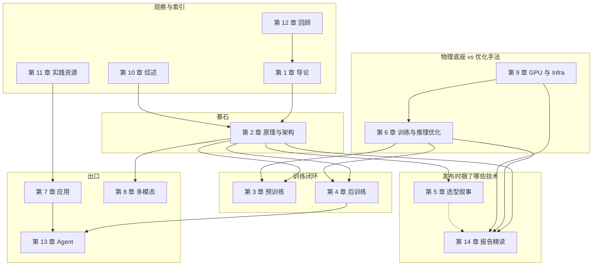

# 知识图谱 · 2026-08

> 旧图在 [1.1 学习路线与知识图谱](./1.1-学习路线与知识图谱.md)（仍写「八章」）。本文件是 **14 章依赖图 + 主题树落点**。空壳不进表。
> 与第 6 / 9 章分工：第 9 章回答「跑在什么硬件/系统上」；第 6 章回答「怎么优化计算」。

## 1. 十四章依赖（mermaid）

第 5 章与第 14 章 **不合并**：第 5 章讲选型/演进故事，第 14 章拆技术报告。两边总览应互相指一句，不要删任一侧。

## 2. 工程轨（必须能走完）

最短工程路径（全部链到非空壳）：

1. [9.1.2 GPU 内存层次与 Roofline](../../9-AI工程化与基础设施/9.1-硬件基础/9.1.2-GPU内存层次与Roofline.md) — 寄存器 / SMEM / L2 / HBM，以及为什么 FlashAttention 存在
2. [9.1.3 卡间互联与集群拓扑](../../9-AI工程化与基础设施/9.1-硬件基础/9.1.3-卡间互联与集群拓扑.md) — NVLink 域 vs IB；NVL72
3. [9.1 硬件基础](../../9-AI工程化与基础设施/9.1-硬件基础/9.1-硬件基础.md) — 代际与 Tensor Core（文末有 2026-08 修订）
4. [6.1 训练基础设施](../../6-训练与推理优化/6.1-训练基础设施/6.1-训练基础设施.md) — DP/TP/PP/EP、DualPipe、精度
5. [6.1.6 DualPipe](../../6-训练与推理优化/6.1-训练基础设施/6.1.6-DualPipe双向流水线并行深度解析.md)
6. [6.1.7 稳定性与训推](../../6-训练与推理优化/6.1-训练基础设施/6.1.7-训练稳定性与训推不一致.md) — loss spike / QAT 对齐 / IcePop；EP/CP 公式在 6.1 与 6.1.1 §2.6
7. [9.4 推理服务框架](../../9-AI工程化与基础设施/9.4-推理服务框架/9.4-推理服务框架.md) — vLLM / TRT-LLM / TGI
8. [9.4.1 SGLang 与 PD](../../9-AI工程化与基础设施/9.4-推理服务框架/9.4.1-SGLang与Prefill-Decode分离.md) — DistServe goodput、Radix 服务位置、Mooncake/NIXL

第 9.4.1 已成文。队列在 `notes/live/PLAN.md`。

## 3. 主题树落点（0.2 节，只链非空壳）

档：`已有` = 体系章有可读正文；`薄` = 有文但缺推导/图/2026 修订；`缺专文` = 概念只散落在第 14 章或总览一句。

### 第 2 章

| 项 | 档 | 落点 |
|----|----|------|
| LayerNorm / RMSNorm | 已有 | [2.1.2 归一化层](../../2-核心原理与架构/2.1-深度学习基础组件/2.1.2-归一化层/2.1.2-归一化层.md) |
| 残差 | 已有 | [2.1.3 残差连接](../../2-核心原理与架构/2.1-深度学习基础组件/2.1.3-残差连接/2.1.3-残差连接.md) |
| HC / mHC | 已有 | [01-Hyper-Connections与mHC](../../2-核心原理与架构/2.1-深度学习基础组件/2.1.3-残差连接/01-Hyper-Connections与mHC.md) |
| XHC | 已有 | [02-xHC Expanded Hyper-Connections](../../2-核心原理与架构/2.1-深度学习基础组件/2.1.3-残差连接/02-xHC-Expanded-Hyper-Connections.md)（arXiv:2607.14530） |
| Gated Residual / GR | 已有 | [03-Gated Residual](../../2-核心原理与架构/2.1-深度学习基础组件/2.1.3-残差连接/03-Gated-Residual.md)（Qwen3.8 报告 §2.2） |
| AttnRes | 已有 | [Kimi Attention Residuals](../../2-核心原理与架构/2.2-基础注意力机制/2.2.2-多头注意力变体/Kimi-Attention-Residuals-深度维注意力聚合.md) |
| FFN / SwiGLU | 已有 | 见 2.1 组件；2026-08：[01-SiTU-GLU](../../2-核心原理与架构/2.1-深度学习基础组件/2.1.1-前馈网络FFN与激活函数/01-SiTU-GLU.md)（K3 有界 GLU） |
| PE / RoPE / ALiBi | 已有 | [01-RoPE 本体](../../2-核心原理与架构/2.1-深度学习基础组件/2.1.4-位置编码/01-RoPE本体-旋转位置编码.md)；外推 [2.5 RoPE/03 YaRN](../../2-核心原理与架构/2.5-长上下文与外推技术/RoPE/03-长度外推：从PI到YaRN的频率扩展.md) |
| MHA / MQA / GQA / MLA | 已有 | [2.3.5 MLA](../../2-核心原理与架构/2.3-高效与稀疏注意力/2.3.5-多头潜在注意力MLA/2.3.5-多头潜在注意力MLA.md) |
| Memory Efficient Attention | **已有专文** | [00-MEA](../../2-核心原理与架构/2.3-高效与稀疏注意力/2.3.1-硬件高效注意力/00-Memory-Efficient-Attention/01-MEA-显存高效注意力.md)（2112.05682；不是 FA） |
| StreamingLLM / Attention Sink | **已有专文** | [10-StreamingLLM](../../2-核心原理与架构/2.3-高效与稀疏注意力/2.3.2-稀疏与压缩注意力/10-StreamingLLM与Attention-Sink/10-StreamingLLM与Attention-Sink.md)（2309.17453；推理 4+窗；gpt-oss/V4 标量 $z'$ 是另一路） |
| H2O / Heavy-Hitter Oracle | **已有专文** | [11-H2O](../../2-核心原理与架构/2.3-高效与稀疏注意力/2.3.2-稀疏与压缩注意力/11-H2O-Heavy-Hitter-Oracle/11-H2O-Heavy-Hitter-Oracle.md)（2306.14048；local 累积分数；20% = H2+最近对半分；不是 FA / StreamingLLM） |
| SnapKV | **已有专文** | [12-SnapKV](../../2-核心原理与架构/2.3-高效与稀疏注意力/2.3.2-稀疏与压缩注意力/12-SnapKV-生成前观测窗/12-SnapKV-生成前观测窗.md)（2404.14469；观测窗 + per-head 选簇；不是观察头） |
| Quest / Query-Aware Sparsity | **已有专文** | [13-Quest](../../2-核心原理与架构/2.3-高效与稀疏注意力/2.3.2-稀疏与压缩注意力/13-Quest-查询感知稀疏/13-Quest-查询感知稀疏.md)（2406.10774；按 query 选页、不驱逐；7.03× 自注意力 / 2.23× 4-bit e2e） |
| PyramidKV | **已有专文** | [14-PyramidKV](../../2-核心原理与架构/2.3-高效与稀疏注意力/2.3.2-稀疏与压缩注意力/14-PyramidKV-层间漏斗/14-PyramidKV-层间漏斗.md)（2406.02069；Information Funneling；层间等差 + 层内 SnapKV；不是 Sinks/Maps） |
| FastGen | **已有专文** | [15-FastGen](../../2-核心原理与架构/2.3-高效与稀疏注意力/2.3.2-稀疏与压缩注意力/15-FastGen-按头自适应/15-FastGen-按头自适应.md)（2310.01801；按头 profiling；win>45% 才叫 negligible；不是 DeepSpeed-FastGen） |
| TOVA / Token Omission Via Attention | **已有专文** | [17-TOVA](../../2-核心原理与架构/2.3-高效与稀疏注意力/2.3.2-稀疏与压缩注意力/17-TOVA-注意力省略/17-TOVA-注意力省略.md)（2401.06104；当前步最低分驱逐；层内平均；1/8=512/4096；4.8×=V100 Table 1） |
| FlashAttention | 已有 | [2.3.1 硬件高效注意力](../../2-核心原理与架构/2.3-高效与稀疏注意力/2.3.1-硬件高效注意力/2.3.1-硬件高效注意力.md) |
| 稀疏 NSA / MoBA / DSA | 已有 | [02 NSA](../../2-核心原理与架构/2.3-高效与稀疏注意力/2.3.2-稀疏与压缩注意力/02-原生稀疏注意力机制NSA/02-原生稀疏注意力机制NSA.md)、[01 MoBA](../../2-核心原理与架构/2.3-高效与稀疏注意力/2.3.2-稀疏与压缩注意力/01-MoBA架构深度解析/01-MoBA架构深度解析.md) |
| CSA / HCA | 已有 | [07 CSA-HCA](../../2-核心原理与架构/2.3-高效与稀疏注意力/2.3.2-稀疏与压缩注意力/07-CSA-HCA-混合压缩注意力/07-CSA-HCA-混合压缩注意力.md) |
| QSA | 已有 | [08 QSA](../../2-核心原理与架构/2.3-高效与稀疏注意力/2.3.2-稀疏与压缩注意力/08-QSA-Qwen稀疏注意力/08-QSA-Qwen稀疏注意力.md) |
| IndexPool | 已有 | [09 IndexPool](../../2-核心原理与架构/2.3-高效与稀疏注意力/2.3.2-稀疏与压缩注意力/09-IndexPool/09-IndexPool.md)（GLM-5.3-Flash；加权池化公式未公开） |
| 线性 / 混合注意力 | 已有 | [2.3.3 线性注意力](../../2-核心原理与架构/2.3-高效与稀疏注意力/2.3.3-线性注意力机制/2.3.3-线性注意力机制.md) |
| KDA | 已有 | [01 Kimi Delta Attention](../../2-核心原理与架构/2.3-高效与稀疏注意力/2.3.3-线性注意力机制/01-Kimi-Delta-Attention-KDA.md)（arXiv:2510.26692） |
| MoE 路由 | 已有 | [2.4.1 MoE](../../2-核心原理与架构/2.4-前沿架构与变体/2.4.1-混合专家模型MoE/2.4.1-混合专家模型MoE.md)、[01 DeepSeek-MoE](../../2-核心原理与架构/2.4-前沿架构与变体/2.4.1-混合专家模型MoE/01-DeepSeek-MoE.md)、[10 Stable LatentMoE / QB](../../2-核心原理与架构/2.4-前沿架构与变体/2.4.1-混合专家模型MoE/10-Stable-LatentMoE与Quantile-Balancing.md) |
| SSM / Mamba | 已有 | [2.4.2 SSM](../../2-核心原理与架构/2.4-前沿架构与变体/2.4.2-状态空间模型SSM/2.4.2-状态空间模型SSM.md)、[2.4.3 Mamba](../../2-核心原理与架构/2.4-前沿架构与变体/2.4.3-Mamba系列/2.4.3-Mamba系列.md) |
| RWKV / Griffin | 已有 | [2.4.4 线性 RNN 与 Griffin](../../2-核心原理与架构/2.4-前沿架构与变体/2.4.4-线性RNN与Griffin/2.4.4-线性RNN与Griffin.md) |
| MTP | 已有 | [2.4.6 MTP](../../2-核心原理与架构/2.4-前沿架构与变体/2.4.6-多Token预测MTP深度解析.md) |
| 长上下文 NTK / YaRN | 已有 | [2.5](../../2-核心原理与架构/2.5-长上下文与外推技术/2.5-长上下文与外推技术.md) |
| DLM 指针 | 已有 | [2.4.7 DLM 指针](../../2-核心原理与架构/2.4-前沿架构与变体/2.4.7-扩散语言模型DLM指针.md) → 兄弟花园 `content/diffusion-llm/`（不抄全书） |

### 第 3–4 章

| 项 | 档 | 落点 |
|----|----|------|
| 数据收集/清洗 | 已有 | [3.1.1](../../3-预训练/3.1-预训练数据/3.1.1-预训练数据收集/3.1.1-预训练数据收集.md)、[3.1.3](../../3-预训练/3.1-预训练数据/3.1.3-数据处理/3.1.3-数据处理.md) |
| Tokenizer BPE | 已有 | [3.3](../../3-预训练/3.3-分词器与Tokenizer/3.3-分词器与Tokenizer.md) |
| Scaling Law | 已有 | [3.2.6](../../3-预训练/3.2-预训练全流程/3.2.6-Scaling-Law/3.2.6-Scaling-Law.md) |
| 继续预训练 | 已有 | [3.2.7](../../3-预训练/3.2-预训练全流程/3.2.7-继续预训练/3.2.7-继续预训练.md) |
| PPL / 大海捞针 / 能力评测 | 已有 | [3.4.1 PPL](../../3-预训练/3.4-预训练评估/3.4.1-困惑度-PPL/3.4.1-困惑度-PPL.md)、[3.4.3 NIAH](../../3-预训练/3.4-预训练评估/3.4.3-大海捞针测试/3.4.3-大海捞针测试.md)、[3.4.2](../../3-预训练/3.4-预训练评估/3.4.2-通用基准/3.4.2-通用基准.md)、[3.4.4](../../3-预训练/3.4-预训练评估/3.4.4-特定能力评估/3.4.4-特定能力评估.md)（旧 `3.3.x` 文件名改枢纽，避免和 Tokenizer 撞号） |
| SFT / PEFT / LoRA | 已有 | [4.2 SFT](../../4-后训练/4.2-SFT/4.2-SFT.md)、[4.3 LoRA](../../4-后训练/4.3-PEFT/01-LoRA低秩适应：原理实现与工业实践.md) |
| PPO / RLHF | 已有 | [4.4.1 PPO](../../4-后训练/4.4-对齐技术/4.4.1-基于奖励模型的RL-RLHF-PPO/04-PPO.md) |
| DPO / KTO / ORPO | 已有 | [4.4.2](../../4-后训练/4.4-对齐技术/4.4.2-无奖励模型的对齐DPO-KTO/4.4.2-无奖励模型的对齐DPO-KTO.md) |
| GRPO / GSPO | 已有 | [02-GRPO](../../4-后训练/4.4-对齐技术/4.4.1-基于奖励模型的RL-RLHF-PPO/02-GRPO.md)、[03-GSPO](../../4-后训练/4.4-对齐技术/4.4.1-基于奖励模型的RL-RLHF-PPO/03-GSPO.md) |
| RLAIF | 已有 | [4.4.3 RLAIF](../../4-后训练/4.4-对齐技术/4.4.3-RLAIF/4.4.3-RLAIF.md) |
| 蒸馏 / OPD | 已有 | [4.6 OPD](../../4-后训练/4.6-OPD/4.6-OPD.md) |
| 持续学习 | 已有 | [4.7](../../4-后训练/4.7-持续学习/4.7-持续学习.md) |
| 测试时计算 | 已有 | [4.5 推理与思考](../../4-后训练/4.5-推理与思考能力/4.5-推理与思考能力.md) |

### 第 6 章与第 9 章

| 项 | 档 | 落点 |
|----|----|------|
| DualPipe | 已有 | [6.1.6](../../6-训练与推理优化/6.1-训练基础设施/6.1.6-DualPipe双向流水线并行深度解析.md) |
| 训练稳定性 | 已有 | [6.1.7](../../6-训练与推理优化/6.1-训练基础设施/6.1.7-训练稳定性与训推不一致.md)（V3 无不可恢复 spike；V4 Anticipatory Routing + SwiGLU clamp；K2 MuonClip） |
| 训推不一致 | 已有 | 同上 6.1.7（V4/K3 QAT；GLM-5 IcePop / `torch.topk`；Step MIS-PO） |
| EP / CP | 已有 | [6.1 §7.5](../../6-训练与推理优化/6.1-训练基础设施/6.1-训练基础设施.md) + [6.1.1 §2.6](../../6-训练与推理优化/6.1-训练基础设施/6.1.1-分布式训练/6.1.1-分布式训练.md)；MoonEP/KCP 不另起教材 |
| FP8 | 已有 | [02-FP8](../../6-训练与推理优化/6.1-训练基础设施/6.1.2-混合精度训练/02-FP8混合精度训练详解.md) |
| FP4 / MXFP4 | 已有 | [03-MXFP4与NVFP4](../../6-训练与推理优化/6.1-训练基础设施/6.1.2-混合精度训练/03-MXFP4与NVFP4.md)；V4 QAT 仍在 [6.1](../../6-训练与推理优化/6.1-训练基础设施/6.1-训练基础设施.md) |
| AdamW 综述 | 已有 | [6.5.1](../../6-训练与推理优化/6.5-优化器/6.5.1-优化器综述：从SGD到AdamW/6.5.1-优化器综述：从SGD到AdamW.md) 2026-08 节按 1711.05101 Algorithm 2 补 LaTeX；2025 ASCII/知乎段保留 |
| Muon | 已有 | [6.5 Muon 专题](../../6-训练与推理优化/6.5-优化器/Muon/01-Muon优化器专题.md) |
| MuonClip / QK-Clip | 已有 | [05-MuonClip 与 Polar Express](../../6-训练与推理优化/6.5-优化器/Muon/05-MuonClip与PolarExpress.md)（含 K3 Per-Head Muon）；K2/K3 报告捆法仍在第 14 章 |
| Polar Express | 已有 | 同上 05 文（arXiv:2505.16932）；Step-3.5-Flash 的 BF16→float16 事故写在专文 §2.3 |
| PagedAttention / KV | 已有 | [6.4.1](../../6-训练与推理优化/6.4-KV缓存与内存优化/6.4.1-PagedAttention原理/6.4.1-PagedAttention原理.md)；[2.3.4 §3.2](../../2-核心原理与架构/2.3-高效与稀疏注意力/2.3.4-高效注意力全景综述/2.3.4-高效注意力全景综述.md) 2026-08：论文是吞吐 2–4× 与 KV 20.4–38.2%，不是 GPU 90%+ |
| 投机解码 / Flash-Decoding | 已有 | [6.6.2](../../6-训练与推理优化/6.6-推理框架与高级优化/6.6.2-投机解码/6.6.2-投机解码.md)（2026-08：EAGLE-3=training-time test）；[6.6.3](../../6-训练与推理优化/6.6-推理框架与高级优化/6.6.3-Flash-Decoding原理与实现.md)（CRFM/PyTorch 2023 split-KV；FA3 是 Hopper 前向核，论文写 inference 未做完） |
| SGLang | 已有 | [9.4.1](../../9-AI工程化与基础设施/9.4-推理服务框架/9.4.1-SGLang与Prefill-Decode分离.md)；Radix 算法仍见 [6.6 §6.4](../../6-训练与推理优化/6.6-推理框架与高级优化/6.6-推理框架与高级优化.md) |
| GPU 内存层次 / Roofline | 已有 | [9.1.2](../../9-AI工程化与基础设施/9.1-硬件基础/9.1.2-GPU内存层次与Roofline.md) |
| 互联 / 集群 | 已有 | [9.1.3](../../9-AI工程化与基础设施/9.1-硬件基础/9.1.3-卡间互联与集群拓扑.md) |
| 非 NVIDIA 加速器地图 | 已有 | [9.1.4](../../9-AI工程化与基础设施/9.1-硬件基础/9.1.4-加速器全景.md)（昇腾单卡 FLOPS 未找到一手，未编） |
| PD 分离 | 已有 | [9.4.1](../../9-AI工程化与基础设施/9.4-推理服务框架/9.4.1-SGLang与Prefill-Decode分离.md)（DistServe + SGLang 文档）；§8.3 只留 2025 动机 |
| CUDA 流与事件 | 已有 | [CUDA流与事件编程](../../9-AI工程化与基础设施/CUDA流与事件编程.md)；已链进 [9.2](../../9-AI工程化与基础设施/9.2-系统软件/9.2-系统软件.md) |

### 第 7–13 章

| 项 | 档 | 落点 |
|----|----|------|
| Prompt / RAG | 已有 | [7.1](../../7-LLM应用开发/7.1-Prompt工程/7.1-Prompt工程.md)、[7.2](../../7-LLM应用开发/7.2-RAG/7.2-RAG.md) |
| Function Calling / MCP | 已有 | [7.4](../../7-LLM应用开发/7.4-FunctionCalling/7.4-FunctionCalling.md)、[7.5 MCP](../../7-LLM应用开发/7.5-MCP/7.5-MCP.md)、[13.1.3](../../13-Agent/13.1-Agent核心组件/13.1.3-工具使用与MCP.md) |
| 上下文工程 | 已有 | [7.6](../../7-LLM应用开发/7.6-上下文工程/7.6-上下文工程.md) |
| CLIP / VLM | 已有 | [8.2 CLIP](../../8-多模态/8.2-CLIP与视觉编码器/01-CLIP与视觉编码器.md)、[8.2.1 LLaVA](../../8-多模态/8.2-视觉语言模型/8.2.1-LLaVA架构深度解析.md) |
| 视觉 token 压缩 / 高分辨率 | 已有 | [8.2.2](../../8-多模态/8.2-视觉语言模型/8.2.2-QFormer与视觉Token压缩.md)、[8.2.4](../../8-多模态/8.2-视觉语言模型/8.2.4-高分辨率VLM的技术挑战.md) |
| 音频 / 视频 / DiT | 已有 | [8.3](../../8-多模态/8.3-音频与语音模型/8.3-音频与语音模型.md)、[8.4](../../8-多模态/8.4-视频理解模型/8.4-视频理解模型.md)、[01 DiT](../../8-多模态/8.6-视频生成模型/01-视频生成与DiT架构.md) |
| omni / 全双工 | 已有 | [8.7 Omni 与全双工](../../8-多模态/8.7-Omni与全双工/8.7-Omni与全双工.md)（级联 / SpeechLM / Omni-Flow；链 MiniCPM-o · GLM-4-Voice · GPT-4o · Astra，不平行百科） |
| Agent harness / 沙箱 / Agentic RL | 已有 | [13.5.1 IDE](../../13-Agent/13.5-Agent应用与治理/13.5.1-IDE与Coding-Agent.md)、[13.3.4 沙箱](../../13-Agent/13.3-Agent系统工程/13.3.4-运行时环境与沙箱.md)、[13.4.1](../../13-Agent/13.4-Agent训练与进化/13.4.1-AgenticRL训练.md) |
| RSI / 自进化 | 兄弟花园 | [content/rsi 0 导读](../../../rsi/0-导读/0-导读.md)（OPD/harness/RSI 分家；机制不并进第 13 章再写一套） |

## 4. 本篇来源

- 本库文件系统盘点（worktree `feat/llm-guide-2026-08-notes`，as_of 2026-08-30）
- NVIDIA CUDA C++ Programming Guide, Memory Hierarchy：https://docs.nvidia.com/cuda/cuda-c-programming-guide/#memory-hierarchy
- NVIDIA H100 数据表：https://www.nvidia.com/en-us/data-center/h100/
- NVIDIA HGX AI Factory Components（H200/B200/B300 显存）：https://docs.nvidia.com/enterprise-reference-architectures/hgx-ai-factory/latest/components.html
- NVIDIA Technical Blog · Rubin：https://developer.nvidia.com/blog/inside-nvidia-rubin-gpu-architecture-powering-the-era-of-agentic-ai/
- xHC：https://arxiv.org/abs/2607.14530
- Qwen3.8-Flash-Next 官方博文：https://qwen.ai/blog?id=qwen3.8-flash-next ；报告 PDF：https://github.com/QwenLM/Qwen3.8-Flash-Next/blob/main/tech_report.pdf
- Kimi K3：https://arxiv.org/abs/2607.24653
- GLM-5.3-Flash：https://docs.z.ai/guides/vlm/glm-5.3-flash ；https://huggingface.co/zai-org/GLM-5.3-Flash
