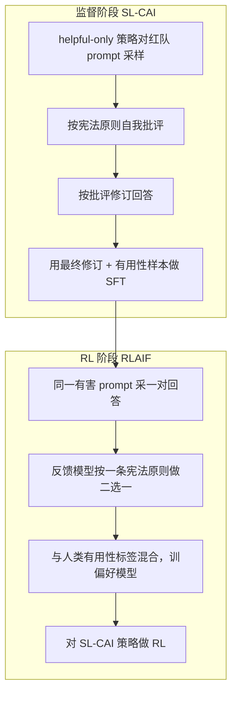

# Claude 1：宪法 AI 刚起步

>  **[返回 14.13-Claude 家族总览](../14.13-Claude.md)** · 已有长 D5：[05-01 核心技术专题](./05-01-Claude-1-核心技术专题.md)· 方法本体：[4.4.3 RLAIF / CAI](../../../4-后训练/4.4-对齐技术/4.4.3-RLAIF/4.4.3-RLAIF.md) · [4.4.1 PPO/RLHF](../../../4-后训练/4.4-对齐技术/4.4.1-基于奖励模型的RL-RLHF-PPO/4.4.1-基于奖励模型的RL-RLHF-PPO.md)

> **解析**：Anthropic 极少透露具体的模型参数量与训练架构。本章内容综合了其官方 System Card、相关安全对齐论文(如 Constitutional AI)与逆向测试数据进行深度推演。

Claude 1 没有公开 Table 1 技术报告，也没有 System Card（System Card 从 Claude 3 才成套发布）。CAI 论文里的 52B 是实验模型，不是产品参数量。

官方轴：

| 材料 | 日期 | 能钉死什么 |
|------|------|------------|
| [Introducing Claude](https://www.anthropic.com/news/introducing-claude) | 2023-03-14 | 产品名 Claude；同日 **Claude Instant**（更快更便宜）；聊天 + developer console API；HHH 研究定位 |
| [Constitutional AI](https://arxiv.org/abs/2212.08073) | 2022-12（论文） | 两阶段 CAI：SL 批评–修订 + RLAIF；**无害性标签不用人类** |
| [Claude’s Constitution](https://www.anthropic.com/research/claudes-constitution) | 2023-05-09 | 产品 Claude **用的原则已相对论文更新**；训练时每次抽一条原则，不是每次扫完全表 |
| [100K context windows](https://www.anthropic.com/news/100k-context-windows) | 2023-05-11 | 窗口从 **9K 扩到 100K** |

Claude Instant 是同一天的速度/成本档，本篇只记一行。

## 1. 产品面：2023-03-14 官方博文写了什么、没写什么

博文把 Claude 定义成「基于 Anthropic 把助手训成 helpful / honest / harmless 的研究」的下一代助手。能力列表是总结、搜索、协作写作、问答、编码。早期客户（Notion、Quora/Poe、DuckDuckGo、Juni Learning、Robin AI、AssemblyAI）的评价停留在「更少有害输出、更好聊、更好steer」，**没有 MMLU / HumanEval 数字**。本篇不把客户引言当基准。

没公开：层数、头数、是否 MoE、优化器、数据配比、预训练 token 数、参数量。旧 D5 §3.1 的「~52B / RoPE / SwiGLU / GQA」是 **2025 推测**。52B 只在 CAI 论文的实验曲线里出现（例如 Figure 2「all 52B RL runs」、Figure 4「models larger than 52B」），那是 **研究用语言模型的尺寸**，不是 2023-03-14 博文对 Claude 产品的声明。2026-08 以「产品参数未找到一手来源」为准。

## 2. 窗口：9K 是官方句子，不是坊间估算

2023-03-14 那篇 *Introducing Claude* **没写**上下文长度。9K 的一手是两个月后的扩窗公告：*We’ve expanded Claude’s context window from 9K to 100K tokens, corresponding to around 75,000 words.* 所以「发布时约 9K、2023-05-11 起 API 上 100K」可以写；「9K 优于 ChatGPT 的 4K」是同期对照，ChatGPT 当时窗口以 OpenAI 自己的文档为准，本篇不把第三方对照表抄进来当 Anthropic 数字。

## 3. 真正能拆的技术：Constitutional AI（本体在第 4 章）

Claude 产品线第一次把论文里的 CAI 接到对外助手。方法细节与公式以 [4.4.3](../../../4-后训练/4.4-对齐技术/4.4.3-RLAIF/4.4.3-RLAIF.md) 和论文为准，这里只写 **这一次发布捆了哪几步**，避免在每个 Claude 目录再抄一遍。

论文要解决的具体问题：先前 HH-RLHF（Bai et al. 2022）里，无害性人类标签会奖励 **evasive**（遇到有害请求就闭嘴），有用性和无害性互相拉扯。CAI 的目标是 **无害但不逃避**：拒绝时解释反对理由，而不是把对话卡死。

两阶段（论文 Figure 1 / §1.2）：

**监督阶段。** 从 helpful RLHF 模型对红队 prompt 采样（往往会给出有害回答）→ 追加「指出何处有害」的批评请求 → 再追加「改写成去掉有害内容」的修订请求。批评与修订指令合起来叫一条 **principle**。论文写了 **16** 条与无害性相关的原则，每一步 **随机抽一条**，同一 prompt 可以串多次修订。最终把「原 prompt + 修订后回答」拿去 SFT；为了保住有用性，SFT 里还混了 helpful 模型在有用性 prompt 上的样本。温度 $T=1$。红队 prompt：42,496 条人类写的（Ganguli et al. 2022）+ 140,335 条模型 few-shot 生成。SFT：一个 epoch，学习率是预训练学习率的 0.5 倍，batch 1024 sequences。

论文 §3.5 对照过「跳过批评、直接修订」：小模型带批评的修订无害性更好，大模型差距变小；他们主结果仍保留批评，理由是过程更可读。

**RL 阶段。** 流程与 RLHF 相同，只把 **无害性比较标签**换成模型打的：把 prompt 和一对回答交给独立反馈模型（论文里是 pretrained LM，不是「另请一家 GPT-4」），用一条宪法原则做成选择题，得到 AI 偏好数据集，再与 **人类有用性**比较数据混合，训偏好模型，最后对 SL-CAI 策略做 RL。这就是他们说的 RLAIF。有用性仍然用人类标签——不是「全程零人类」。

产品宪法博文补充了论文没写进产品规格的两点：(1) 对外 Claude **用的原则已经相对论文更新**（来源包括联合国人权宣言、平台安全惯例、DeepMind Sparrow 原则、以及他们想覆盖非西方视角的条款）；(2) 训练时每次批评/比较 **抽一条**原则，「并不是每次把整部宪法读一遍」，但每条原则在训练中会见到很多次。2026-01-21 他们又发过一版新宪法；那是后话，不要写进 Claude 1 的层配置。

## 4. 0.4 拆面：公开材料填得满的和填不满的

| 面 | 能写到哪 | 空白 |
|----|----------|------|
| 积木 | 无。注意力/FFN/位置编码未公开 | 禁止用「业界推测 RoPE」填 |
| 架构 | 无 Table 1 | 参数量、是否 Dense |
| 数据 | 论文红队 prompt 规模（实验，不是产品卡） | Claude 1 预训练配比 |
| 优化器 | 论文 SFT 相对学习率 0.5；RL 沿用他们先前 RLHF | 产品训练超参 |
| Infra | 未写 | — |
| 稳定性 | 论文动机：HH-RLHF 的 evasiveness | 产品训练事故 |
| 训推 | 未写 MTP/量化/PD | — |
| 后训练 | **CAI 两阶段 + 产品宪法更新** | 产品是否用了论文全部 16 条 |

## 5. 和旧 D5 的边界

[05-01](./05-01-Claude-1-核心技术专题.md) 已经是一篇长叙事，**不造第三份 D5**。2026-08 在那边加勘误：§3.1 架构树不是一手；Elo /「显著优于 RLHF」以论文 Figure 2–3 的 **52B 实验模型**为准，不能直接写成 Claude API 的线上分数。本 D2 只承担「官方能钉死的产品事实 + 把 trick 链回第 4 章」。

## 6. 失效条件

- 把 CAI 论文 52B 写成 Claude 1 的参数量。
- 把 2023-03-14 博文里没有的 MMLU 柱高写进笔记。
- 为 Claude Instant 新建第 14 章空目录。
- 在每个后续 Claude 目录再完整推一遍批评–修订公式；链回 4.4.3 与本篇即可。

## 参考文献

- https://www.anthropic.com/news/introducing-claude（2023-03-14）
- https://arxiv.org/abs/2212.08073 / HTML（Bai et al.，读了摘要、§1–3.5、§4.1 开头；Figure 2–4 的 52B 是实验模型）
- https://www.anthropic.com/research/claudes-constitution（2023-05-09；2026-01-21 更新提示）
- https://www.anthropic.com/news/100k-context-windows（9K → 100K）
- 体系章：`4.4.3-RLAIF.md`（CAI 作为 RLAIF 的特例）
- 同目录已有 D5：`05-01-Claude-1-核心技术专题.md`
