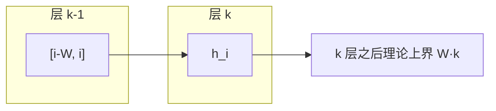

# Mistral 7B: 欧洲开源之光的起跑线

>  **[返回 14.14-Mistral 家族总览](../../14.14-Mistral.md)** · 已有长 D5：[GQA 与 SWA](./05-Mistral-7B-GQA与SWA的效率革命.md)（勿平行第三份）· 体系：[GQA 本体](../../../2-核心原理与架构/2.2-基础注意力机制/2.2.2-多头注意力变体/03-GQA-在性能与缓存之间折中/03-GQA-在性能与缓存之间折中.md) · [FlashAttention](../../../2-核心原理与架构/2.3-高效与稀疏注意力/2.3.1-硬件高效注意力/2.3.1-硬件高效注意力.md)

> 该家族依靠其独特的算力优势与数据护城河，在 LLM 红海中占据了核心生态位。

**材料类型（2026-08）**：有正式技术报告，按报告精读，不是「无 PDF 的公开材料凑数」。轴心是 Jiang 等人 *Mistral 7B*（[arXiv:2310.06825](https://arxiv.org/abs/2310.06825)）；官方博文 [announcing-mistral-7b](https://mistral.ai/news/announcing-mistral-7b/)（2023-09-27）与论文同套数字。上面两行是 2025 占位原文，保留；下面按 0.4 拆面。GQA / SWA 的推导住在第 2 章，本篇只写 **这一次发布捆了什么、和 Llama 2 差在哪**。

## 1. 问题：同样 7B，推理账单为什么打不平

2023 年开源默认坐标是 Llama 2：更大往往更强，KV cache 随序列线性涨，注意力按 $n^2$ 算。部署侧真正卡住的是 **解码时的显存和吞吐**，不是再堆一个 13B。Mistral 7B 的命题写在摘要里：7B 参数，在他们重跑的评测管线上超过当时最好的开源 13B（Llama 2），并在推理、数学、代码上超过当时最好的已发布 34B（Llama 1）；手段是 **GQA 加快解码 + SWA 把任意长度的代价压下去**。Apache 2.0。参考实现 https://github.com/mistralai/mistral-src 。

这不是新注意力理论。GQA 前作是 Ainslie 等人 [arXiv:2305.13245](https://arxiv.org/abs/2305.13245)；SWA 前作是 Sparse Transformer / Longformer。本发布的贡献是 **把这两块钉进一张可部署的 7B 配置表**，并配上 rolling buffer 与 prompt chunk prefill。

## 2. 积木：官方 Table 1，不要用口算顶替

论文 Table 1：

| 参数 | 值 | 这一列在干什么 |
|------|----|----------------|
| dim | 4096 | 模型宽 |
| n_layers | 32 | 深度 |
| head_dim | 128 | 每个头的通道；$32\times 128=4096$，和 dim 对齐 |
| hidden_dim | 14336 | FFN 中间宽（SwiGLU 一类的宽 FFN，报告没在 Table 1 外再展开激活函数名） |
| n_heads | 32 | Query 头数 |
| n_kv_heads | 8 | KV 头数 → **GQA，组大小 $32/8=4$** |
| window_size | 4096 | SWA 窗口 $W$ |
| context_len | **8192** | 报告写下的上下文长度 |
| vocab_size | 32000 | 词表 |

**2026-08 勘误锚点**：同目录旧 D5 把窗口写成「8K 原生 / 32K 靠 SWA 扩展」。论文没有这句。`context_len=8192`；**32k 出现在 rolling buffer 的举例**（见 §4），那是「序列可以比 $W$ 长时 cache 仍固定为 $W$」，不是把官方上下文改成 32K。

GQA 公式不在这里重推。记号：第 $h$ 个 query 头用组 $g(h)=\lfloor h\cdot n_{\mathrm{kv}}/n_{\mathrm{heads}}\rfloor$ 的 $K,V$。缓存里每层每 token 存 $n_{\mathrm{kv}}$ 组而不是 $n_{\mathrm{heads}}$ 组。本体见 [03-GQA](../../../2-核心原理与架构/2.2-基础注意力机制/2.2.2-多头注意力变体/03-GQA-在性能与缓存之间折中/03-GQA-在性能与缓存之间折中.md)。本发布只钉死 **$n_{\mathrm{kv}}=8$**。

## 3. 架构：滑动窗口如何「看起来能看更远」

标准因果注意力里，位置 $i$ 看见 $[0,i]$，计算 $O(n^2)$。SWA：第 $k$ 层位置 $i$ 的隐状态只 attend 上一层 $[i-W,i]$（论文 Figure 1，示意 $W=3$）。递推之后，输入层距离最多 $W\times k$ 的 token 仍能间接影响当前位置。$W=4096$、$k=32$ 时，论文写的 **理论注意跨度约 131K tokens**。这是感受野上界，不是「context_len 变成了 131K」——Table 1 仍然是 8192。

博文/论文同一句工程结果：序列 16K、$W=4096$ 时，改过的 FlashAttention 与 xFormers 相对 vanilla attention **2×**。感谢写给 Tri Dao 和 Daniel Haziza。这是 **infra 面**，不是新公式。

失效条件直接写在机制里：超过 $W$ 的依赖必须穿过中间层，精确拷贝（文档首尾对照、相距很远的两个函数）会衰减。Longformer 还加了全局 token；Mistral 7B **没有**在报告里再加全局 token 支路。

## 4. Infra / 训推：rolling buffer 与 chunk prefill

**Rolling buffer。** 窗口固定 ⇒ cache 可以固定成 $W$。第 $i$ 步的 $K,V$ 写在 $i \bmod W$。$i>W$ 后旧槽被覆盖，cache 体积不再涨。论文 Figure 2 用 $W=4$ 示意。**在 32k token 的序列上，cache 显存降 8×**（$32000/4096\approx 7.8$，约 8），且报告称不影响质量。这句是 32k 在文中的合法位置：它是 **cache 压缩比的分母举例**，不是 Table 1 的 context_len。

**Prefill + chunking。** 生成必须逐 token；prompt 已知，可以先把 $(K,V)$ 填进 cache。prompt 太长就按窗口切块：每一块对自己做因果 mask，对 cache 做滑动窗口，窗口外的更早 token 不再 attend（Figure 3）。这已经是后来 PD 分离里 **prefill 切块** 的雏形，只是 2023 年还没有独立成「prefill 实例 / decode 实例」。服务栈现状见 [9.4](../../../9-AI工程化与基础设施/9.4-推理服务框架/9.4-推理服务框架.md)，本报告点名的部署路径是 **vLLM + SkyPilot**。

训练框架、并行切分、精度、优化器：**报告没写**。2025 占位那句「独特的分布式训练切分」在空壳 `05-01` 里，**不是**这篇论文的内容。不要把占位句读成 Megatron 配置。

## 5. 数据与后训练：公开了什么、没公开什么

预训练配比、清洗、token 数：**未公开**。旧 D5 §5 写「代码占比高 / 去重更激进 / 没有追求万亿 token」——论文正文没有这些句子。2026-08 以「未找到一手来源」为准，不把那一节当事实。

Instruct 变体（论文 §4）：在 Hugging Face 上的 **公开指令数据** 上微调，「No proprietary data or training tricks」。MT-Bench：无系统提示 **$6.84\pm 0.07$**（Table 3 / Table 4）。Chatbot Arena Elo 表里 Mistral 7B Instruct **1031**，Llama 2 13B Chat **1012**（Table 3）。人工偏好：截至 2023-10-06，llmboxing.com 上 Mistral 输出被选 5020 次 vs Llama 2 13B 4143 次。

安全（§5）是 **系统提示 + 自反思分类**，不是 RLHF 专章。推荐系统提示下，175 条 unsafe prompt **100% 拒答**（报告自己的集）。自反思审核：precision 99.4%、recall 95.6%（acceptable 当正类，手工平衡集）。Llama 2 系统提示会把 MT-Bench 拉到 $6.38\pm 0.07$，Mistral 自己的提示 $6.58\pm 0.05$。这是后训练/产品护栏面，不是新奖励模型。

## 6. 评测：只抄 Table 2，不抄博文柱状图

论文强调他们 **自己重跑** 了对照，并注明和 Llama 2 原文协议的两点差异：MBPP 用手验子集；TriviaQA **不提供** Wikipedia 上下文。下面只录 Table 2 里出现的列（百分数按报告）：

| Model | MMLU | HellaSwag | WinoG | PIQA | Arc-e | Arc-c | NQ | TriviaQA | HumanEval | MBPP | MATH | GSM8K |
|-------|------|-----------|-------|------|-------|-------|----|----------|-----------|------|------|-------|
| Llama 2 7B | 44.4 | 77.1 | 69.5 | 77.9 | 68.7 | 43.2 | 24.7 | 63.8 | 11.6 | 26.1 | 3.9 | 16.0 |
| Llama 2 13B | 55.6 | 80.7 | 72.9 | 80.8 | 75.2 | 48.8 | 29.0 | 69.6 | 18.9 | 35.4 | 6.0 | 34.3 |
| Code-Llama 7B | 36.9 | 62.9 | 62.3 | 72.8 | 59.4 | 34.5 | 11.0 | 34.9 | 31.1 | 52.5 | 5.2 | 20.8 |
| Mistral 7B | 60.1 | 81.3 | 75.3 | 83.0 | 80.0 | 55.5 | 28.8 | 69.9 | 30.5 | 47.5 | 13.1 | 52.2 |

知识类压缩比论文自己写低一档：推理 / 理解 / MMLU 上「等效 Llama 2 尺寸」超过 3×；Knowledge 基准大约 1.9×，归因于参数量限制能存的知识。这些是 Figure 5 的叙述，不是又一张我们可以重画的数值柱——按纪律用表，不 GenerateImage 柱状图。博文直方图带官网素材，**不入库**。

## 7. 稳定性与失效

- 报告 **没有** loss spike / 专家崩（这是 dense 7B）。稳定性面几乎空白。
- SWA：理论跨度 $W\times k$ ≠ 可精确检索的跨度；需要逐 token 对齐的长依赖会先坏。
- GQA：KV 路数从 32 收到 8，细对齐任务可能亏，报告没给消融表。GQA 论文里的质量–速度折中见第 2 章，不要把「<0.5% 损失」写成本报告测过的数——那是旧 D5 的概括，**本篇 Table 1 没有这行**。
- Instruct **没有** moderation 机制（博文 Note）。护栏靠可选系统提示，不是默认安全对齐。
- 预训练数据不可复现。

## 8. 这次发布捆了哪些技术（反链）

| 面 | 本发布 | 本体 |
|----|--------|------|
| 积木 | GQA $n_{\mathrm{kv}}=8$；SWA $W=4096$ | [GQA](../../../2-核心原理与架构/2.2-基础注意力机制/2.2.2-多头注意力变体/03-GQA-在性能与缓存之间折中/03-GQA-在性能与缓存之间折中.md)；窗口注意力见 [2.3.4 §4.1](../../../2-核心原理与架构/2.3-高效与稀疏注意力/2.3.4-高效注意力全景综述/2.3.4-高效注意力全景综述.md) |
| 架构 | Table 1 dense decoder | 本篇 |
| 数据 | 预训练未公开；Instruct = 公开 HF 指令数据 | — |
| 优化器 | 未写 | [6.5](../../../6-训练与推理优化/6.5-优化器/) |
| Infra | FlashAttention / xFormers / vLLM / SkyPilot；rolling buffer；chunk prefill | [2.3.1](../../../2-核心原理与架构/2.3-高效与稀疏注意力/2.3.1-硬件高效注意力/2.3.1-硬件高效注意力.md)、[9.4](../../../9-AI工程化与基础设施/9.4-推理服务框架/9.4-推理服务框架.md) |
| 稳定性 | 未写训练事故 | — |
| 训推 | cache $i\bmod W$；prompt 分块 prefill | 与后来 PD 分离相关，但报告没有 PD 这个词 |

叙事侧（第 5 章，不合并）：[05-Mistral-7B-GQA与SWA](../../../5-主流模型全解/5.3-国外大模型/Mistral-AI/05-Mistral-7B-GQA与SWA的效率革命.md)。

## 本篇来源

- 技术报告 HTML：[arXiv:2310.06825](https://arxiv.org/abs/2310.06825)（本会话读了摘要、§1–5、Table 1–4）
- 官方博文：https://mistral.ai/news/announcing-mistral-7b/（本库 `pdfs/Mistral-7B.html` 为该页快照；未把博文配图存进笔记）
- GQA 前作：Ainslie et al., [arXiv:2305.13245](https://arxiv.org/abs/2305.13245)（本篇只点名，公式走第 2 章已有文）
- SWA 前作：Child et al. Sparse Transformer [arXiv:1904.10509](https://arxiv.org/abs/1904.10509)；Beltagy et al. Longformer [arXiv:2004.05150](https://arxiv.org/abs/2004.05150)
- 本库已有长 D5：`05-Mistral-7B-GQA与SWA的效率革命.md`（2026-08 对其 32K / 数据配比做了勘误，不重写第三份）
