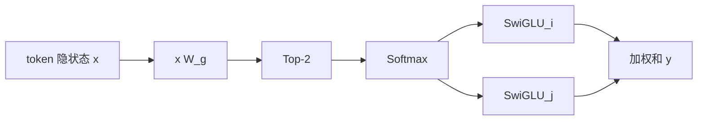

# Mixtral 8x7B: 首个击败 LLaMA 的开源 MoE

>  **[返回 14.14-Mistral 家族总览](../../14.14-Mistral.md)** · 已有长 D5：[稀疏 MoE 路由](./05-Mixtral-8x7B-稀疏MoE路由机制与多语言专家专业化.md)（勿平行第三份）· 前代 D2：[Mistral 7B](../01-Mistral-7B/01-01-Mistral-7B-架构精译.md) · 体系：[2.4.1 MoE](../../../2-核心原理与架构/2.4-前沿架构与变体/2.4.1-混合专家模型MoE/2.4.1-混合专家模型MoE.md) · [Top-K 可导](../../../2-核心原理与架构/2.4-前沿架构与变体/2.4.1-混合专家模型MoE/03-MoE-Top-K运算可导性分析.md) · [DPO](../../../4-后训练/4.4-对齐技术/4.4.2-无奖励模型的对齐DPO-KTO/02-DPO深度解析：从RLHF目标到隐式奖励的完整推导.md)

> 该家族依靠其独特的算力优势与数据护城河，在 LLM 红海中占据了核心生态位。

**材料类型（2026-08）**：有正式技术报告。轴心是 Jiang 等人 *Mixtral of Experts*（[arXiv:2401.04088](https://arxiv.org/abs/2401.04088)）；官方博文 [mixtral-of-experts](https://mistral.ai/news/mixtral-of-experts/)。上面两行是 2025 占位原文，保留。GQA / SWA 已在 Mistral 7B 写过；本篇只写 **这一次相对 7B 改了什么：把每层 FFN 换成 8 专家 Top-2 MoE，并把上下文改成稠密 32k**。

## 1. 问题：参数变贵时，怎样只让每个 token 付一部分账

Dense 模型每个 token 走完整 FFN，参数涨一倍，解码时 HBM 上要搬的权重也涨一倍。MoE 的旧解法（Shazeer 2017 Sparse-gated MoE，[arXiv:1701.06538](https://arxiv.org/abs/1701.06538)）是：FFN 换成 $n$ 个专家，门控只叫醒其中 $K$ 个。总参数随 $n$ 涨，**每个 token 的算力随 $K$ 涨**。Mixtral 把这套钉进和 Mistral 7B 同一张 Transformer 骨架：8 个 SwiGLU 专家，每层每 token **Top-2**。摘要口径：每个 token **能访问 47B 参数，推理时只用 13B 活跃参数**；训练上下文 **32k**。对照 Llama 2 70B / GPT-3.5。Apache 2.0。

和 Mistral 7B 的差不在注意力变体，而在两处（论文 §2 开头）：

1. FFN → MoE 层（§2.1）。
2. **稠密 32k 上下文**。7B 那篇 Table 1 是 `context_len=8192` 加滑动窗口；Mixtral Table 1 是 `context_len=32768`，并且写明「fully dense context length of 32k tokens」。不要把 7B 的 SWA 故事原样贴过来。

## 2. 积木：Table 1 + 门控公式

论文 Table 1：

| 参数 | 值 | 相对 Mistral 7B |
|------|----|-----------------|
| dim / n_layers / head_dim | 4096 / 32 / 128 | 同 |
| hidden_dim | 14336 | 同（现在是 **每个专家** 的 FFN 宽） |
| n_heads / n_kv_heads | 32 / 8 | 同，仍是 GQA |
| context_len | **32768** | 7B 是 8192 |
| vocab_size | 32000 | 同 |
| num_experts | **8** | 新 |
| top_k_experts | **2** | 新 |

注意力侧继续用 GQA，公式见 [03-GQA](../../../2-核心原理与架构/2.2-基础注意力机制/2.2.2-多头注意力变体/03-GQA-在性能与缓存之间折中/03-GQA-在性能与缓存之间折中.md)，这里不重推。

MoE 层：对输入 $x$，有 $n$ 个专家 $\{E_0,\ldots,E_{n-1}\}$。完整写出是（论文式 (1)）

$$
\sum_{i=0}^{n-1} G(x)_i\, E_i(x).
$$

$G(x)$ 稀疏时，门控为 0 的专家可以不算。他们用的实现是对线性层的 logits 做 Top-K 再 Softmax（论文式 (2)，引用 Switch Transformer 那套简单门控 [28]）：

$$
G(x)=\mathrm{Softmax}\bigl(\mathrm{TopK}(x W_g)\bigr),
$$

其中 $(\mathrm{TopK}(\ell))_i=\ell_i$ 若 $\ell_i$ 落在最大的 $K$ 个坐标，否则 $-\infty$。Mixtral 取 $K=2$，专家函数是和 7B 一样的 SwiGLU，于是一层输出（论文式 (3)）

$$
y=\sum_{i=0}^{n-1}\mathrm{Softmax}\bigl(\mathrm{Top2}(x W_g)\bigr)_i\,\mathrm{SwiGLU}_i(x).
$$

Top-K 把多数坐标打成 $-\infty$，Softmax 后对应权重为 0。梯度怎么过 Top-K，见体系章 [03-MoE-Top-K](../../../2-核心原理与架构/2.4-前沿架构与变体/2.4.1-混合专家模型MoE/03-MoE-Top-K运算可导性分析.md)，本报告没有另给一份可导证明。

和 GShard 的两点差（同节明文）：Mixtral **每一层** FFN 都换成 MoE，GShard 是隔一层；第二个专家的门控 Mixtral 用上面这个简单 Top-2，GShard 更花。

## 3. Infra：Megablocks、专家并行、serving

单卡：Megablocks 把 MoE 的 FFN 做成大稀疏矩阵乘，专家分到的 token 数可以不齐。多卡：普通模型并行之外，用 **Expert Parallelism (EP)**——某个专家该算的 token 送到对应 GPU，算完再送回（Shazeer 2017 / GShard 路线）。论文点名 EP 的麻烦是 **负载均衡**：专家热度不均会把单卡打满。这是 infra / 稳定性交界。**本报告没有写他们用了 auxiliary loss。** 旧 D5 路由表里的「辅助损失」不是这篇论文的句子；2026-08 以「未在 2401.04088 声明」为准。

Serving：向 vLLM 提交了改动，接 Megablocks CUDA kernels；SkyPilot 在云上拉 vLLM 端点。致谢 NVIDIA 帮接 TensorRT-LLM 和 Triton，让稀疏 MoE 能跑在 TRT-LLM 上。训练用的集群框架、精度、优化器：**未写**。占位句「独特的分布式训练切分」不是本报告内容。

## 4. 数据、后训练、训推

预训练：多语言数据上调（相对 Mistral 7B），上下文 32k。**配比、token 数、清洗未公开。** Passkey 检索在任意位置、任意长度（直到他们测的窗口）100%；proof-pile 子集上 PPL 随上下文变长单调下降（Figure 4）。这是长上下文能力，不是「SWA 滚出来的 32k」。

Instruct：公开写法是 **SFT + DPO**（Rafailov 等人 [arXiv:2305.18290](https://arxiv.org/abs/2305.18290)）。DPO 公式走第 4 章，这里只记「这次用了它」。MT-Bench **8.30**（论文 §4；Table 3 同行也是 8.30）。LMSys 截图日期 2023-12-22：Arena Elo **1121**，对照 Claude-2.1 1117、GPT-3.5-Turbo 最好 1117、Gemini Pro 1111、Llama-2-70b-chat 1077。截图会过时，当作 2023-12 快照。

训推不一致：训练是 dense 32k 注意力 + 每层 Top-2；推理同样 Top-2，没有 MTP / 量化 / 投机解码专章。EP 在推理时的热专家过载，是他们点名的系统问题，不是算法上的 train–infer 公式差。

## 5. 路由分析：不是「数学专家 / 代码专家」

§5 在 The Pile 验证集上看第 0 / 15 / 31 层：ArXiv、PubMed、PhilPapers 的专家占用几乎一样，**没有按学科分家**。只有合成的 DM Mathematics 稍偏，且主要在首尾层（隐状态更贴输入/输出嵌入）。token 上色例子：Python 的 `self`、英文的 `Question`、缩进，常常进同一专家——更像 **句法/表面形式**，不是主题。

连续 token 容易连着点同一专家。Table 5：第一选择的重复率，第 0 层接近随机 $1/8=12.5\%$；第 15 / 31 层明显更高（ArXiv 第一选择 27.9% / 22.7%）。「第一或第二选择」随机期望约 $46\%$，高层可到 60%+。工程含义论文自己写了：EP 时 **位置局部性更容易把某张卡打满**；反过来也可以做专家缓存（他们引用 Eliseev & Mazur 的 offloading 文）。

旧 D5 标题里的「多语言专家专业化」容易读成「法语专家」。论文 Table 4 证明的是 **多语言基准分数高**（法语 Arc-c 58.2 vs Llama 2 70B 49.9 等），**不是**路由按语言分专家。机制专题可以保留 2025 叙事，但读路由请以 §5 为准。

## 6. 评测：两张表不要混列

Table 2 是他们自己的评测管线（MBPP 手验子集；TriviaQA 不给维基上下文）。活跃参数一行 Mixtral 标 **13B**：

| Model | Active | MMLU | HellaS | HumanE | MBPP | Math | GSM8K |
|-------|--------|------|--------|--------|------|------|-------|
| Llama 2 70B | 70B | 69.9 | 85.4 | 29.3 | 49.8 | 13.8 | 69.6 |
| Mistral 7B | 7B | 62.5 | 81.0 | 26.2 | 50.2 | 12.7 | 50.0 |
| Mixtral 8x7B | 13B | 70.6 | 84.4 | **40.2** | **60.7** | **28.4** | **74.4** |

Table 3 是另一套协议（HellaSwag 10-shot、ARC-c 25-shot、GSM-8K **5-shot**）。那里 Mixtral GSM-8K 是 **58.4%**，Llama 2 70B 53.6%，GPT-3.5 57.1%。旧 D5 §3.1 把 HumanEval 写成 28.4%——那是 Table 2 的 **MATH** 列，不是 HumanEval。2026-08 在原 D5 勘误，数字以本表为准。不要 GenerateImage 画柱状图。

内存：论文明确 **serving 显存跟 47B 稀疏参数成正比**，不是跟 13B 活跃参数成正比；算术强度在 **大 batch** 时才好看，小 batch 还要付路由和多专家加载的开销。

## 7. 稳定性与失效

- 训练事故（loss spike、专家崩）：**报告没写**。不要补一份 Switch 论文里的 auxiliary loss 当成 Mixtral 用过。
- EP 负载不均：报告承认是挑战；连续 token 同专家会加重。
- 专家按主题分工：§5 直接打脸。失效的是「8 个领域专家」这种产品叙事。
- 小 batch 推理：SMoE 额外开销，不一定比同活跃参数的 dense 更快。
- 闭源对照的 Arena 数字是 2023-12 截图。

## 8. 这次发布捆了哪些技术（反链）

| 面 | 本发布 | 本体 |
|----|--------|------|
| 积木 | Top-2 门控 + 每层 SwiGLU 专家；GQA 继承 7B | [2.4.1 MoE](../../../2-核心原理与架构/2.4-前沿架构与变体/2.4.1-混合专家模型MoE/2.4.1-混合专家模型MoE.md)、[Top-K](../../../2-核心原理与架构/2.4-前沿架构与变体/2.4.1-混合专家模型MoE/03-MoE-Top-K运算可导性分析.md)、[GQA](../../../2-核心原理与架构/2.2-基础注意力机制/2.2.2-多头注意力变体/03-GQA-在性能与缓存之间折中/03-GQA-在性能与缓存之间折中.md) |
| 架构 | Table 1；相对 GShard：层层 MoE、简单第二专家 | 本篇 |
| 数据 | 多语言上采样；32k；配比未公开 | — |
| 优化器 | 未写；Instruct 用 DPO | [DPO 推导](../../../4-后训练/4.4-对齐技术/4.4.2-无奖励模型的对齐DPO-KTO/02-DPO深度解析：从RLHF目标到隐式奖励的完整推导.md) |
| Infra | Megablocks、EP、vLLM、TRT-LLM | [9.4](../../../9-AI工程化与基础设施/9.4-推理服务框架/9.4-推理服务框架.md)、[6.1 EP](../../../6-训练与推理优化/6.1-训练基础设施/6.1-训练基础设施.md) |
| 稳定性 | 未写训练事故；点名 EP 负载 | — |
| 训推 | 推理仍 Top-2；cache 按 47B 计 | 本篇 §6 |

第 5 章叙事副本（不合并）：[05-Mixtral-8x7B](../../../5-主流模型全解/5.3-国外大模型/Mistral-AI/05-Mixtral-8x7B-稀疏MoE路由机制与多语言专家专业化.md)。

## 本篇来源

- 技术报告 HTML：[arXiv:2401.04088](https://arxiv.org/abs/2401.04088)（本会话读了摘要、§1–5、Table 1–5、式 (1)–(3)）
- 官方博文：https://mistral.ai/news/mixtral-of-experts/
- 前作：Mistral 7B [arXiv:2310.06825](https://arxiv.org/abs/2310.06825)（本库已写 D2）；Shazeer et al. Sparsely-Gated MoE [arXiv:1701.06538](https://arxiv.org/abs/1701.06538)（本篇只点名）；DPO [arXiv:2305.18290](https://arxiv.org/abs/2305.18290)
- 本库已有长 D5：`05-Mixtral-8x7B-稀疏MoE路由机制与多语言专家专业化.md`（2026-08 勘误参数口径与 HumanEval 列混用，不重写第三份）
