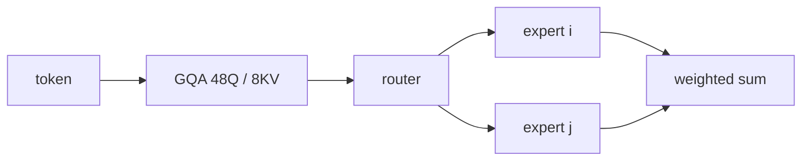

# Grok-1: 314B 巨无霸全开源

>  **[返回 14.15-xAI 家族总览](../../14.15-xAI.md)** · 体系：[GQA](../../../2-核心原理与架构/2.2-基础注意力机制/2.2.2-多头注意力变体/03-GQA-在性能与缓存之间折中/03-GQA-在性能与缓存之间折中.md) · [MoE](../../../2-核心原理与架构/2.4-前沿架构与变体/2.4.1-混合专家模型MoE/2.4.1-混合专家模型MoE.md) · 同代开源 MoE：[Mixtral 8x7B](../../14.14-Mistral/02-Mixtral-8x7B/01-02-Mixtral-8x7B-架构精译.md)

> 该家族依靠其独特的算力优势与数据护城河, 在 LLM 红海中占据了核心生态位。

**没有**独立架构论文。事实源是三份官方页，必须先拆开再读数字：

1. [Announcing Grok](https://x.ai/news/grok) + [Grok-1 Model Card](https://x.ai/news/grok/model-card)（2023-11-03）= **产品** Grok-1：对话微调过。
2. [Open Release of Grok-1](https://x.ai/news/grok-os)（2024-03-17）+ [xai-org/grok-1 README](https://github.com/xai-org/grok-1) = **预训练基座 checkpoint**，Apache 2.0，**没有**对话微调。

同名两份东西。HumanEval / MMLU 表属于 (1)，314B / 8 专家 / GQA 表属于 (2)。不要混成「开源权重就是那张 73% MMLU」。

## 1. 产品 Grok-1（2023-11-03）不是开源那份

xAI 把引擎叫 Grok-1：自回归 Transformer，next-token；再用人与早期 Grok-0 的反馈微调。上下文 **8192**。数据：互联网到 **2023 Q3** + AI Tutors。模型卡写明：语言模型自己不会搜网页；Grok 产品靠外接 search/数据库；仍会幻觉。

前置原型 **Grok-0 = 33B**，官方说在标准 LM 基准上接近 Llama 2 70B，只用大约一半训练资源。正文没给 FLOPs 对照表，本篇不估。

产品 Grok-1 那张表（GSM8k 8-shot / MMLU 5-shot / HumanEval 0-shot pass@1 / MATH 4-shot）：

| 基准 | Grok-0 (33B) | Llama 2 70B | GPT-3.5 | Grok-1 |
|------|--------------|-------------|---------|--------|
| GSM8k | 56.8% | 56.8% | 57.1% | **62.9%** |
| MMLU | 65.7% | 68.9% | 70.0% | **73.0%** |
| HumanEval | 39.7% | 29.9% | 48.1% | **63.2%** |
| MATH | 15.7% | 13.5% | 23.5% | **23.9%** |

匈牙利 2023 年 5 月高考数学（数据集收集之后才公布；人手打分；温度 0.1、同一 prompt）：Grok-1 **59%**（C），Claude 2 **55%**，GPT-4 **68%**（B）。官方写没为这场考试调过。

工程句：训练/推理栈是 **Kubernetes + Rust + JAX**。追求 useful compute per watt 和故障下的 MFU；没有公开并行度表、没有公开参数量。**参数量要等到 2024-03 开源才写 314B。**

## 2. 开源基座（2024-03-17）：314B、Top-2、GQA

开源的是「Grok-1 预训练阶段结束于 **2023 年 10 月**」的 **raw base checkpoint**，明确 **not fine-tuned for any specific application, such as dialogue**。许可证 **Apache 2.0**。自定义训练栈：**JAX + Rust**。

活跃参数口径：314B MoE，**给定 token 上 25% 权重活跃**。README 把它钉成：

| 项 | README |
|----|--------|
| 总参数 | 314B |
| 专家 | 8 专家 MoE，每 token **2** 个专家 |
| 层数 | 64 |
| 注意力 | Query **48** 头，Key/Value **8** 头 |
| 宽度 | embedding **6144** |
| Tokenizer | SentencePiece **131072** |
| 位置 | RoPE |
| 上下文 | **8192** |
| 其它 | 支持 activation sharding 与 8-bit quantization |

48/8 就是 GQA（组大小 6）。公式不在本篇重推，见 [03-GQA](../../../2-核心原理与架构/2.2-基础注意力机制/2.2.2-多头注意力变体/03-GQA-在性能与缓存之间折中/03-GQA-在性能与缓存之间折中.md)。

25% 与 2/8 一致：每 token 只跑两个专家。FFN 隐层宽、路由是否带辅助损失、是否共享专家——**README 和开源公告都没写**。示例仓库自己说 MoE 实现 **not efficient**，是为了验证正确性、避免自定义 kernel。

和 Mixtral 8x7B 的可比点只有骨架：都是 8 专家、Top-2。Mixtral 论文给了 47B/13B 和稠密 32k；Grok-1 开源基座是 314B / 8k / 没有评测表。不要把 Mixtral 的 HumanEval 贴过来。

## 3. 失效条件

- 把 73% MMLU / 63.2% HumanEval 写成开源基座的成绩。
- 给开源权重编对话对齐、RLHF 配方、专家隐层宽。
- 把后文 Grok-2 的「X 数据飞轮 / FLUX」倒灌进 2023–2024 这份。

## 参考文献

- https://x.ai/news/grok （2023-11-03；读完旅程段、基准表、匈牙利考试、K8s/Rust/JAX）
- https://x.ai/news/grok/model-card （8192、Q3 2023、AI Tutors、不自带搜索）
- https://x.ai/news/grok-os （2024-03-17；314B、25% 活跃、Oct 2023 预训练结束、Apache 2.0、基座未微调）
- https://github.com/xai-org/grok-1 README（规格表；MoE 示例实现非高效）
