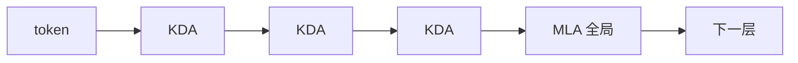

# Kimi Delta Attention：头级遗忘太粗之后，让每个通道自己过期

> 邻居：[2.3.3 线性注意力](../2.3.3-线性注意力机制.md) · [MLA](../../2.3.5-多头潜在注意力MLA/2.3.5-多头潜在注意力MLA.md) · [QSA](../../2.3.2-稀疏与压缩注意力/08-QSA-Qwen稀疏注意力/08-QSA-Qwen稀疏注意力.md)（稀疏 softmax，不是线性）· [AttnRes](../../../2.2-基础注意力机制/2.2.2-多头注意力变体/08-AttnRes-深度维注意力聚合/08-AttnRes-深度维注意力聚合.md)

线性注意力把历史收进固定大小的矩阵状态 $\mathbf{S}_t$，解码不再读整段 KV，但状态容量有限，旧联想会互相覆盖。Delta 规则先擦掉当前 key 上的旧值再写入；Gated DeltaNet 再加一个 **头级** 标量遗忘。Kimi Delta Attention（KDA）把遗忘改成 **通道级** 对角门 $\mathrm{Diag}(\boldsymbol{\alpha}_t)$。公式来自 *Kimi Linear*（arXiv:2510.26692）§2–3。K3 把 KDA 和 AttnRes 捆在一起发布，是同一条技术在更大 MoE 上的用法，不是另一套数学。

## 1. 从累加到「改记忆」

线性注意力的加法记忆（论文式）

$$
\mathbf{S}_t=\mathbf{S}_{t-1}+\mathbf{k}_t\mathbf{v}_t^\top,\qquad \mathbf{o}_t=\mathbf{S}_t^\top\mathbf{q}_t
$$

没有遗忘，状态会涨、会串。DeltaNet 把更新看成对重建损失 $\|\mathbf{S}^\top\mathbf{k}_t-\mathbf{v}_t\|^2$ 做一步梯度，学习率 $\beta_t$：

$$
\mathbf{S}_t=(\mathbf{I}-\beta_t\mathbf{k}_t\mathbf{k}_t^\top)\mathbf{S}_{t-1}+\beta_t\mathbf{k}_t\mathbf{v}_t^\top.
$$

这是经典 delta 规则：先按当前 key 擦，再写新值。Gated DeltaNet（Yang et al.，arXiv:2412.06464）再乘头级 $\alpha_t\in[0,1]$：

$$
\mathbf{S}_t=\alpha_t(\mathbf{I}-\beta_t\mathbf{k}_t\mathbf{k}_t^\top)\mathbf{S}_{t-1}+\beta_t\mathbf{k}_t\mathbf{v}_t^\top.
$$

一个头里所有通道共用同一个遗忘速度。Qwen3-Next / 3.8 的 GDN 层走的是这条头级门（Qwen 报告里 $\alpha_t$ 的参数化见他们式 (10)）。

## 2. KDA：对角遗忘

KDA（论文式 (1)）把标量 $\alpha_t$ 换成对角：

$$
\mathbf{S}_t=(\mathbf{I}-\beta_t\mathbf{k}_t\mathbf{k}_t^\top)\,\mathrm{Diag}(\boldsymbol{\alpha}_t)\,\mathbf{S}_{t-1}+\beta_t\mathbf{k}_t\mathbf{v}_t^\top,\qquad
\mathbf{o}_t=\mathbf{S}_t^\top\mathbf{q}_t.
$$

每个特征维自己的衰减，接近 Gated Linear Attention 的细粒度门，但仍绑在 delta 的 rank-1 擦写上。论文把转移矩阵做成一种受限的 Diagonal-Plus-Low-Rank，好做分块并行；完整 WY / UT 展开是式 (2)–(9)，训练核在 [FLA kda](https://github.com/fla-org/flash-linear-attention/tree/main/fla/ops/kda)。本篇不把分块逆三角阵再抄一遍——已经会线性注意力的人去论文 §3.1，不会的人先记住：**遗忘在通道上，擦写仍是对当前 key 的 rank-1。**

<!-- GenerateImage Prompt: LIGHT THEME ONLY: solid white or off-white canvas, dark charcoal text and arrows, pastel filled boxes with dark outlines. NEVER dark mode, NEVER black/navy/charcoal background, NEVER white text on dark panels, NEVER inverted colors. white academic background, no watermark, no logo, no copyright text, no website URL. Two-panel: left Gated DeltaNet scalar alpha_t one color for whole S; right KDA Diag(alpha_t) four pastel channel gates. -->

> 图 1：遗忘门粒度。左：Gated DeltaNet 一头一个 $\alpha_t$，整份 $S_{t-1}$ 同一速度过期。右：KDA 的 $\mathrm{Diag}(\boldsymbol{\alpha}_t)$，一行一个 $\alpha_i$。两边的 rank-1 擦写仍是 $\mathbf{k}_t\mathbf{k}_t^\top$。K3 的 $g_{\min}=-5$ **不在这张图上**（见 §5）。2026-08 自绘。

**图 1 解析**

- **左**：一个桃盒 $\alpha_t$ 乘进整张网格。Qwen3-Next / 3.8 的 GDN 层走这条头级门。
- **右**：四个颜色不同的 $\alpha_1\ldots\alpha_4$ 组成 $\mathrm{Diag}(\boldsymbol{\alpha}_t)$，箭头各进一行。这才是 *Kimi Linear* 式 (1) 相对 GDN 的差。
- **底栏**：delta 擦写两边都有；变的只是遗忘粒度。不要在这张图上读 $g_{\min}$。
- **不是** [AttnRes](../../../2.2-基础注意力机制/2.2.2-多头注意力变体/08-AttnRes-深度维注意力聚合/08-AttnRes-深度维注意力聚合.md)（深度维对历史层做注意力），也 **不是** [QSA](../../2.3.2-稀疏与压缩注意力/08-QSA-Qwen稀疏注意力/08-QSA-Qwen稀疏注意力.md)（softmax 块稀疏，没有这份矩阵状态）。

相对通用 DPLR，他们把 $a,b$ 都绑到 $\mathbf{k}$ 上，减少半精度里的除法和二次分块 matmul；论文称算子效率大约比通用 DPLR 好一倍（§3.2）。那是 kernel 对照，不是端到端 API。

## 3. Kimi Linear：3:1 而不是纯 RNN

纯线性层的有限状态做不好长程精确检索。Kimi Linear 用 **3 层 KDA : 1 层 MLA**（全局 softmax）。公平对照：3B 激活 / 48B 总，同一套训练配方，相对满 MLA：**KV 最多少约 75%**，1M 上下文解码吞吐最多约 **6×**（摘要；Fig. 1b 给出 1M 上 TPOT 1.84 ms vs MLA 11.48 ms）。1.4T token 的 MMLU-Pro / RULER 点在 Fig. 1a，不要把图上的点估成未写出的第三项基准。

Qwen 的 3:1 是 **GDN : 全注意力（后来变 QSA）**；Kimi 的 3:1 是 **KDA : MLA**。日程形状像，门的粒度和全局层不是同一个积木。

## 4. 和 AttnRes、QSA 不要缠在一起

- **KDA**：序列维上的线性记忆编辑。
- **AttnRes**：深度维上对历史层做注意力（残差聚合）。
- **QSA**：softmax 注意力的块级稀疏，不是 RNN 状态。

K3 可以同时用 KDA 和 AttnRes，那是一份报告里的两张积木。

## 5. K3 相对 *Kimi Linear* 改了的两处（不是新论文）

Kimi K3 报告 §2.1.1 仍引用 2510.26692 的通道对角门。下面两处是 **K3 自己的工程/数值改写**，不要倒灌进 Linear 论文。

**有下界的 log-decay。** Linear / GDN / Mamba-2 用 $g=-e^{A}\operatorname{Softplus}(z)\in(-\infty,0)$。分块形式里 key 要除以累积衰减，倒数在 BF16 里会爆。K3 改成（$g_{\min}=-5$ 固定，$A_h$ 可学、初值 0）

$$
\bm{g}_t^h=g_{\min}\operatorname{Sigmoid}(e^{A_h}\bm{z}_t^h)\in(g_{\min},0)^{d_k},
\qquad
\bm{\alpha}_t^h=\exp(\bm{g}_t^h)\in(e^{g_{\min}},1)^{d_k}.
$$

于是逐步保留 $\alpha>e^{-5}\approx 6.7\times 10^{-3}$，16 token 小块的累积 log-decay 落在 $(-80,0)$，对角块也能走 Tensor Core 稠密乘，不再走 position-pair。

**满秩输出门。** Linear 用低秩门；K3 在 RMSNorm 之后

$$
\bm{y}_t=\mathbf{W}_o\bigl[\operatorname{Sigmoid}(\mathbf{W}_g\bm{x}_t)\odot\operatorname{RMSNorm}(\tilde{\bm{o}}_t)\bigr].
$$

Gated MLA 用同一只满秩门，但 **不对 MLA 输出做 RMSNorm**（K3 式 (7)）。混合比仍是 3:1，骨干末尾再垫一层全局 MLA。

来源：K3 HTML §2.1.1 式 (5)–(7)。完整捆法见 [K3 D2](../../../../14-主流开源模型全景解析与技术报告精读/14.5-Kimi/05-Kimi-K3/01-Kimi-K3-架构精译.md)。

**GLM-5.3-Flash 用法（配置，不是新论文）。** vLLM / SGLang 把 Flash 的线性层点名为 KDA。Hugging Face `config.json`：`gate_lower_bound = -5.0`（与 K3 的 $g_{\min}$ 同一数值）、64 头、`head_dim=128`、`short_conv_kernel_size=4`。官方文档没有写出式 (5) 那套 Sigmoid 参数化——只记配置，不要倒灌成智谱推导。层日程 34 KDA + 11 稀疏 MLA，见 [Flash D2](../../../../14-主流开源模型全景解析与技术报告精读/14.6-GLM/12-GLM-5.3-Flash/01-GLM-5.3-Flash-架构精译.md)。

## 6. 失效条件

- 把 KDA 写成「就是 Mamba」。Delta 擦写 + 对角门，不是 SSM 的离散化。
- 用头级 GDN 的公式冒充 KDA。
- 把 6× 写成任意长度、任意框架的 serving 数字。
- 没打开 2510.26692 就写 DPLR 运算次数。
- 用 unbounded Softplus 门描述 K3 的 KDA。
- 把 Flash 的 `gate_lower_bound=-5.0` 写成已经公开了 K3 式 (5)。

## 本篇来源

- Zhang et al. / Kimi Team, *Kimi Linear*, arXiv:2510.26692（本会话读了摘要、§1–3.2、式 (1)–(9) 的角色；未逐行核完 §6）
- K3 对 decay / 输出门的改写：arXiv:2607.24653 §2.1.1 式 (5)–(7)
- Gated DeltaNet：arXiv:2412.06464
- 核：https://github.com/fla-org/flash-linear-attention/tree/main/fla/ops/kda
- 权重：https://huggingface.co/moonshotai/Kimi-Linear-48B-A3B-Instruct
