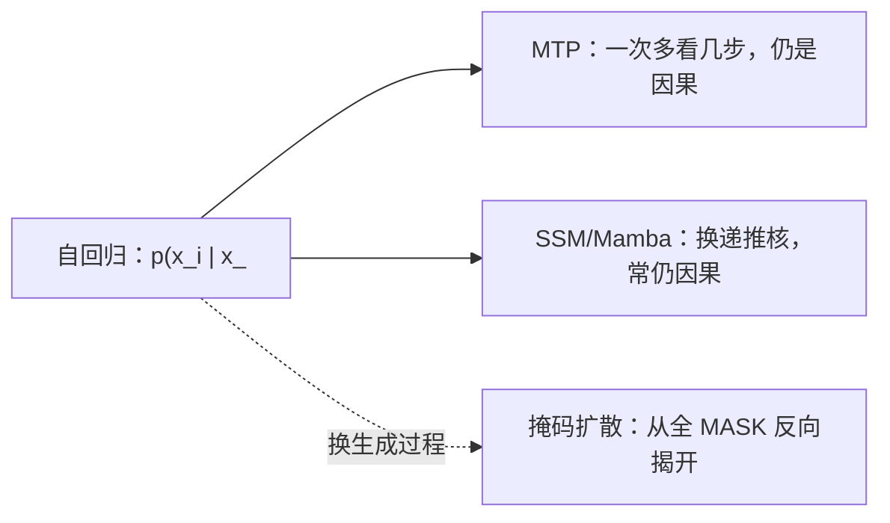

# 扩散语言模型：为什么它不是「又一个注意力变体」

> 本章不把兄弟花园抄进来。机制全文、动画、模型年表在 [`content/diffusion-llm/`](../../../../diffusion-llm/_garden.md)。本篇只回答：它和自回归 LLM 卡在哪、数学上差在哪一步、读完本库第 2 章之后该点哪几篇。

第 2.4 节前面几篇（MoE、SSM、Mamba、Griffin、MTP）仍然活在 **从左到右的条件分布** 里，最多把「下一步」改成「下 $k$ 步」或把注意力换成线性递推。扩散语言模型（Diffusion Language Model, DLM）问的是另一件事：

> 大模型的可扩展性、上下文学习和指令遵循，是不是 **必须** 写成 next-token factorization？

LLaDA 的回答写在论文开头：最大似然 / KL（他们的式 (1)）才是原则；自回归式 (2) 只是其中一种因式分解，不是能力的唯一来源（[arXiv:2502.09992](https://arxiv.org/abs/2502.09992)）。

## 1. 自回归卡住的地方

标准 LLM 把序列 $x=(x^1,\dots,x^L)$ 拆成

$$
p_\theta(x)=p_\theta(x^1)\prod_{i=2}^{L}p_\theta(x^i\mid x^1,\dots,x^{i-1}).
$$

这是 LLaDA 论文式 (2)。它和因果掩码绑死：第 $i$ 位永远看不到右边。三件连带后果不必再发挥——延迟是 $O(L)$ 次串行前向、反转推理（「A 是 B」推不出「B 是 A」）是结构问题、中间位置的硬约束很难在生成中途注入。

MTP（[2.4.6](./2.4.6-多Token预测MTP深度解析.md)）缓解的是 **每次前向吐几个 token**，因式分解仍是左到右。线性 RNN / Mamba 缓解的是 **KV 随 $L$ 涨**，生成方向通常还是因果的。DLM 改的是这条因式分解本身。

## 2. 掩码扩散：前向盖住，反向一起猜

连续图像扩散在像素上加高斯。Token 是词表上的离散 ID，没有「加一点噪声」的几何。主流做法是 **吸收态 / 掩码**：每个位置独立地以比例 $t$ 变成特殊符号 $\mathrm{M}$，以 $1-t$ 保持原 token。$t=1$ 时整句都是 $\mathrm{M}$。

LLaDA 用 Transformer 当 **mask predictor** $p_\theta(\cdot\mid x_t)$：一次前向预测当前所有被掩位置的原 token。训练损失只算这些位置，并除以掩码率 $t$（论文式 (3)）：

$$
\mathcal{L}(\theta)=-\mathbb{E}_{t,x_0,x_t}\left[\frac{1}{t}\sum_{i=1}^{L}\mathbf{1}[x_t^i=\mathrm{M}]\,\log p_\theta(x_0^i\mid x_t)\right],
\quad t\sim U[0,1].
$$

$1/t$ 不是装饰。论文强调：少了这一项（例如 MaskGIT 的启发式）就断了和最大似然下界的关系；有了它，$\mathcal{L}$ 是 $-\mathbb{E}\log p_\theta(x_0)$ 的上界（式 (4)），才能正经过预训练 / SFT 这条 LLM 流水线。

和 BERT 的差别也在这里：BERT 固定掩码率、一步预测；LLaDA 的 $t$ 在 $[0,1]$ 上随机，推理时从 $t=1$ 模拟到 $t=0$，每步可以同时揭开许多位置，也可以把低置信位置重新盖上（论文 Figure 2 的 remask）。

架构改动很小：同一套 Transformer，**去掉因果掩码**（双向看见整句），加上 timestep 条件。RoPE / SwiGLU / RMSNorm 仍可复用——所以它住在第 2.4「变体」，不是另起一套积木章。

## 3. 规模上已经不是玩具，但不要当成 2026 默认主干

LLaDA 8B **从零**预训练 2.3T token（论文写 0.13 million H800 GPU hours），再 SFT 450 万对。作者报告：与同数据自建的 ARM 基线在多任务上可比较；8B 与 LLaMA3 8B 量级的 in-context 能力接近；SFT 后能跟多轮指令；在 **reversal poem completion** 上超过 GPT-4o（摘要原句，不是本库重测）。

这证明「LLM 能力可以不走式 (2)」。它 **没有** 证明 2026-08 的预训练默认应该改成扩散：长序列、KV/缓存生态、投机解码、PD 分离、工具调用轨迹，今天的栈几乎全为自回归写的。选型时把它当成 **另一条生成过程**，需要可控填空、双向补全、或研究非因果似然时再进兄弟花园，而不是在第 14 章每个 MoE 报告里再抄一遍。

LLaDA 2.0（花园里链 [arXiv:2512.15745](https://arxiv.org/abs/2512.15745)）走 AR→扩散转换以降成本。本篇 **未打开** 2.0 PDF，数字不准写；要读转换三阶段，去花园 [llada-frontier](../../../../diffusion-llm/03-models/llada-frontier.md)。

## 4. 在本库怎么走，不要平行再写一套

| 你要的 | 去哪 | 不要 |
|--------|------|------|
| 离散转移矩阵、均匀 vs 吸收态、MDLM 的 ELBO 简化 | [masked-diffusion](../../../../diffusion-llm/02-mechanism/masked-diffusion.md) | 把那篇公式再抄进 llm-guide |
| 为什么要动扩散：延迟 / 反转 / 可控 | [why-diffusion](../../../../diffusion-llm/01-overview/why-diffusion.md) | 在导论再写 800 字家谱 |
| D3PM → Diffusion-LM → MDLM → SEDD → LLaDA 年表 | [representative-models](../../../../diffusion-llm/03-models/representative-models.md) | 在第 14 章给每个 DLM 开空壳 |
| LLaDA 8B / 2.0 训练与 MoE | [llada-frontier](../../../../diffusion-llm/03-models/llada-frontier.md) | 把 GSM8K 表复制过来当本库测过 |
| 和 AR 十维对照 | [diffusion-vs-autoregressive](../../../../diffusion-llm/04-comparison/diffusion-vs-autoregressive.md) | |

和第 2 章其它变体的边界：MoE 是 **稀疏计算**；SSM/Mamba 是 **序列核**；MTP 是 **自回归多 token 目标**；DLM 是 **生成过程**。可以叠（扩散 + MoE），但概念不要并成一个缩写。

## 本篇来源

1. Nie, S., et al. (2025). *Large Language Diffusion Models* (LLaDA). https://arxiv.org/abs/2502.09992 （本篇打开 HTML：摘要、§1、§2.1 式 (1)–(4)、预训练规模数字）
2. 兄弟花园索引（机制与年表，禁止当第二套平行正文）：`content/diffusion-llm/_garden.md`
3. 本库对照：MTP [2.4.6](./2.4.6-多Token预测MTP深度解析.md)；线性递推 [2.4.4](./2.4.4-线性RNN与Griffin/2.4.4-线性RNN与Griffin.md)
4. LLaDA 2.0 PDF 未读；条目留在花园，本篇不填 100B 数字
