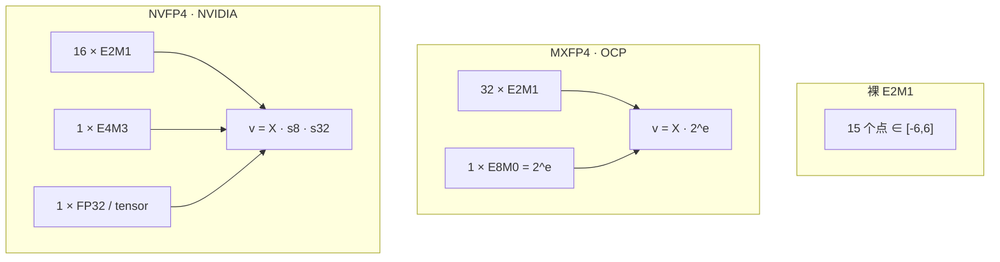

# MXFP4 与 NVFP4

> 接 [01 浮点基础](./01-浮点数基础与BF16混合精度训练.md) · [02 FP8](./02-FP8混合精度训练详解.md) · DeepSeek-V4 用法仍在 [6.1](../6.1-训练基础设施.md) 的 QAT 段，本篇只推导**格式本身**。

4-bit 元素几乎没有尾数。单独一个 E2M1 只能表示大约 $[-6,6]$ 上的十几个点。工业界能拿它做 GEMM，靠的不是「4-bit 忽然变准」，而是 **一块元素共享一个更高比特的 scale**。OCP 把这套叫 Microscaling（MX）；NVIDIA Blackwell 在 MXFP4 之外又加了自家 **NVFP4**。两者元素都是 E2M1，差别在 **块有多大、scale 是 2 的幂还是 FP8**。

<!-- GPT-Image-2 Prompt: Technical educational diagram comparing MXFP4 and NVFP4 block-scaled 4-bit floats on a white academic background, no watermark, no logo, no copyright text, no stock-photo banner, no website URL. Research-paper systems figure, two side-by-side panels, blue and orange accents, clean typography, precise arrows, no decorative art. Left panel labeled MXFP4 OCP: a horizontal row of 32 small squares labeled E2M1 elements, one shared scale box labeled E8M0 power-of-two, arrow to reconstructed values v = X times 2 to the e. Right panel labeled NVFP4 NVIDIA: a shorter row of 16 small squares labeled E2M1, scale box labeled E4M3 FP8, plus an outer FP32 per-tensor scale, arrow to v = X times s8 times s32. Bottom caption bar: both use the same E2M1 grid in minus 6 to plus 6. Minimal academic palette, readable labels. -->

## 1. 问题：4-bit 浮点自己站不住

IEEE 风格写成

$$
v = (-1)^{S}\cdot 2^{E-b}\cdot\bigl(1 + 2^{-m}M\bigr)
$$

规格化；$E=0$ 时改成非规格化（隐含 0，指数钉在 $1-b$）。OCP MX v1.0 §5.3 对 FP8/FP6/FP4 用同一套。FP4 是 **E2M1**：$S$ 1 bit、$E$ 2 bit、$M$ 1 bit，**bias $b=1$**。没有 Inf / NaN 编码。转换必须支持 roundTiesToEven；超出范围至少要能饱和到最大幅度并保留符号。

把 $E,M$ 穷举（正数侧）：

| $E$ | $M$ | 类型 | 值 |
|-----|-----|------|-----|
| 00 | 0 | 零 | $0$ |
| 00 | 1 | 非规格化 | $2^{0}\times 0.5 = 0.5$ |
| 01 | 0 | 规格化 | $2^{0}\times 1.0 = 1$ |
| 01 | 1 | 规格化 | $2^{0}\times 1.5 = 1.5$ |
| 10 | 0 | 规格化 | $2^{1}\times 1.0 = 2$ |
| 10 | 1 | 规格化 | $2^{1}\times 1.5 = 3$ |
| 11 | 0 | 规格化 | $2^{2}\times 1.0 = 4$ |
| 11 | 1 | 规格化 | $2^{2}\times 1.5 = 6$ |

负数对称。OCP Table 5：max normal $\pm 6$，min normal $\pm 1$，subnorm 只有 $\pm 0.5$。NVIDIA 博文举的集合 $\{0,0.5,1,1.5,2,3,4,6\}$ 与这张表一致。

权重、激活的真实动态范围远大于 6。没有块 scale，整个张量只能被压进这 15 个点（含 0）。这就是「裸 FP4」一行：Blackwell 表把它标成 **software scaling**、硬件不帮你乘 scale。

## 2. MX 块：共享 scale 之后，解码是乘法不是 IEEE 单点

OCP MX v1.0 §5.1：一个 MX 块由三件事定死——**scale 类型**、**元素类型**、**块长 $k$**。$k$ 个元素同宽，**一个** scale 共用。物理内存布局规格不规定；重复的 scale 可以压掉。

具体 MXFP4（Table 1）：元素 FP4(E2M1) 4 bit，$k=32$，scale **E8M0** 8 bit。存储粗算 $4 + 8/32 = 4.25$ bit/元素（实现若对重复 scale 再压，会更少；规格允许）。

E8M0（§5.4.1）：**无符号**，等价于 Float32 的偏置指数；bias **127**，可表示指数 $-127\ldots 127$；**没有 Inf**；唯一 NaN 编码是 `11111111`；**没有零编码**（它不是一个带符号的浮点 scale）。

块解码（§5.1，把 HTML 公式还原成工程常用写法）：

- scale 是 NaN $\Rightarrow$ 整块都是 NaN，元素位被忽略。
- 否则每个元素先按 §5.3 解成实数 $X_i\in[-6,6]$，再

$$
v_i = X_i \cdot 2^{e},\qquad e = E_{\mathrm{E8M0}} - 127.
$$

$|v_i|$ 超过 Float32 最大有限值时行为 implementation-defined。规格 **不规定** 怎么从一块 FP32 算出 $e$（§4「Not in scope」）。训练代码里常见的是按块 $\mathrm{amax}$ 取 $\lceil\log_2\rceil$，那是实现，不是 OCP 强制。

E8M0 的好处：反量化是 **移位**，不必真做 FP8 乘法。NVIDIA 博文把这一点说成「simplest」：对不太吃 scale 精度的权重/激活够用。

点积（§6.1）最小语义是：两块 MX 向量做 $\sum_i v_i^{(a)} v_i^{(b)}$。硬件可以在 Tensor Core 里融合「先还原再乘加」，软件仿真则显式乘 $2^{e}$。

## 3. NVFP4：块改成 16，scale 改成 E4M3，外面再加 FP32

NVIDIA 博文 Table 1 把 Blackwell 上三种 4-bit 并排：

| | 裸 FP4 (E2M1) | MXFP4 | NVFP4 |
|--|---------------|-------|-------|
| 元素 | E2M1 | E2M1 | E2M1 |
| 硬件加速的 scale | 否 | 是 | 是 |
| 块 | （软件自己定） | 32，**E8M0** | 16，**E4M3** |
| 相对 FP8 精度风险 | 明显 | 仍可能明显 | 大模型上风险更低（博文口径） |

NVFP4 仍用同一张 E2M1 点集。差在两级：

1. **微块**：每 **16** 个数一个 E4M3（OFP8 的 1-4-3，bias 7）scale。E4M3 能表示 **不是 2 的幂** 的因子，块内拟合比「snap 到 $2^n$」细。
2. **张量级**：再乘一个 **FP32** 的 per-tensor scale，把整张量的动态范围先挪到 E4M3 吃得下的区间。博文写明：E4M3 的 scale 范围比 E8M0 窄，所以需要这第二级。

还原（博文给出的结构，第二级省略时就是微块乘法）：

$$
\hat x_i = X_i^{\mathrm{E2M1}} \cdot s_{\mathrm{E4M3}}^{(b(i))} \cdot s_{\mathrm{FP32}}.
$$

存储：4-bit 元素 + 每 16 个一枚 FP8 scale = **4.5 bit/值**，外加每个张量一个 FP32。相对 FP16 大约 **3.5×** 小，相对 FP8 大约 **1.8×** 小（NVIDIA 文中的 footprint 口径）。

块从 32 收到 16：同一张量多一倍的局部 $\mathrm{amax}$。大张量里大小数混在一起时，一个「伞」scale 会把小数挤进 E2M1 的死区；更小的块就是多买几次局部范围。

## 4. 和 INT4 / 训练栈怎么分家

GPTQ/AWQ 那条是 **整数网格 + 后训练校准**，本体在 [6.3.1.1](../../6.3-模型压缩/6.3.1-量化/6.3.1.1-权重量化.md)。MX/NV 是 **浮点网格 + 块 scale**，Tensor Core 认 scale 元数据。不要把「4-bit」三个字当成同一种格式。

DeepSeek-V4 后训练 QAT 用的是 **MXFP4 那套 E2M1 + 每 32 个 power-of-two scale**，再叠 128×128 的 FP8 tile scale；反量化到 E4M3 在他们写的条件下无损。公式和 QAT 流程图仍在 [6.1](../6.1-训练基础设施.md)，不要在本篇再抄一遍。本篇只管：V4 选的是 **OCP MX 块**，不是 NVFP4 的 16+E4M3。

NVIDIA 用 TensorRT Model Optimizer 把 DeepSeek-R1-0528 从 FP8 **PTQ** 到 NVFP4：七项评测里相对 FP8 **≤1%** 掉点；AIME 2024 上 NVFP4 甚至高 **2%**。这是 **一个模型、一次 PTQ**，不是「凡 NVFP4 都涨分」。能效图注是 GPT-MoE 1.8T、相对 H100：Blackwell **最多 25×** / Blackwell Ultra **最多 50×** per-token——点名模型与基线，不要写成所有 FP4 任务的物理定律。

Hopper 没有原生 MXFP4 MMA。权重可以 MXFP4 存在 HBM 再反量化进 FP8/BF16 kernel——那是存储技巧，不是「H100 有 FP4 Tensor Core」。本篇不以第三方博客的 MI300X 吞吐为据。

## 5. 失效条件

- 把 MXFP4 和 NVFP4 写成一种 checkpoint。
- 给 OCP 编「必须用 $\mathrm{amax}/6$」——规格明确不规定算 scale 的算法。
- 把 V4 的两级 FP8 tile 说成 NVFP4。
- 用 25×/50× 当通用加速比。

## 本篇来源

- OCP Microscaling Formats (MX) Specification v1.0（2023-09-07）：https://www.opencompute.org/documents/ocp-microscaling-formats-mx-v1-0-spec-final-pdf （§5.1–5.4、Table 1/5/7）
- NVIDIA：Introducing NVFP4 for Efficient and Accurate Low-Precision Inference：https://developer.nvidia.com/blog/introducing-nvfp4-for-efficient-and-accurate-low-precision-inference/ （Table 1、两级 scale、R1-0528 PTQ、footprint、能效图注）
- 训练侧用法指针：[6.1 FP4 QAT](../6.1-训练基础设施.md)
