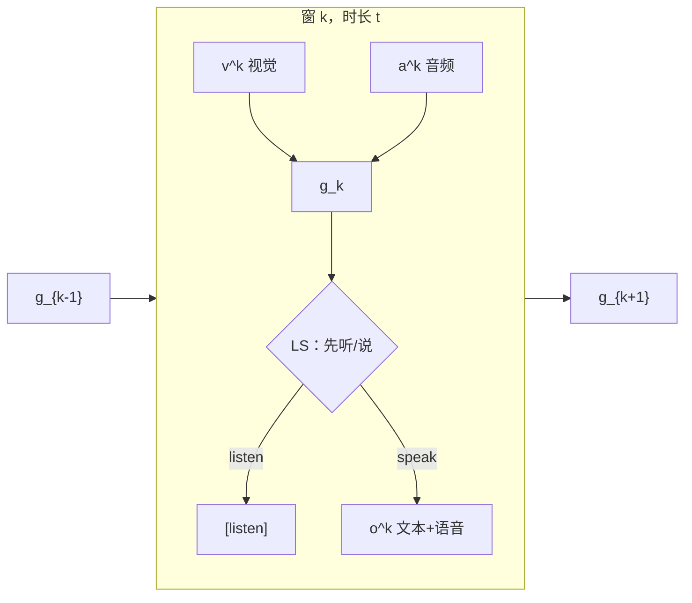

# Omni 与全双工

> 邻居：[8.3 音频与语音](../8.3-音频与语音模型/8.3-音频与语音模型.md) · [8.1 对齐与融合](../8.1-核心概念与架构/8.1-核心概念与架构.md) · [8.5 多模态对齐](../8.5-多模态对齐技术/8.5-多模态对齐技术.md) · [13.1.1 Agent 记忆](../../13-Agent/13.1-Agent核心组件/13.1.1-记忆系统.md)
>
> 模型侧精读（只链不抄）：[GLM-4-Voice 架构](../../14-主流开源模型全景解析与技术报告精读/14.6-GLM/04-GLM-4-Voice/05-GLM-4-Voice-Architecture-Overview.md) · [MiniCPM-o 4.5 Omni-Flow](../../5-主流模型全解/5.2-国内大模型/面壁智能-MiniCPM/05-MiniCPM-o-4.5-Omni-Flow全双工流式交互框架.md) · [GPT-4o 公开材料](../../5-主流模型全解/09-GPT-4o/05-09-GPT-4o-原生多模态端到端架构与Omni统一表示.md) · [Project Astra](../../5-主流模型全解/10-Project-Astra/05-10-Project-Astra-核心技术专题.md)

「Omni」在产品文案里经常等于「什么模态都能进、什么模态都能出」。工程上这至少是 **三件不同的事**。把它们捆成一张规格名片，后面每一份语音/视频报告都会再抄一遍。本篇只回答：每一件卡住的是什么、数学上改的是哪一段、开源报告里谁把它写清楚了、闭源演示里什么不能当成公式。

## 1. 三个经常被混成一个词的问题

| 问题 | 失败长什么样 | 改的是哪一层 |
|------|----------------|--------------|
| **级联** | 听完一整句 → ASR 出字 → LLM 出字 → TTS 出声。中间文本把语气丢掉，错误逐级放大 | 系统拓扑：要不要还经过可读写的文本 |
| **端到端 SpeechLM** | 波形（或离散语音 token）直接进同一个自回归模型，输入输出用同一套语音表示 | 表示：帧率、码本、文本知识怎么迁到语音 |
| **全双工** | 模型正在说的时候，环境里已经出现新画面或插话；说出来的内容相对「此刻」过时 | 交互：感知与生成是否共享时间轴 |

第一件在 2024 年底的 GLM-4-Voice 报告里写得很直：传统 spoken chatbot 是 ASR–LLM–TTS 流水线，被高延迟、复合错误、以及难以捕捉/表达情感拖住（[arXiv:2412.02612](https://arxiv.org/abs/2412.02612) 摘要与 §1）。第二件是同一份报告真正动手做的事：监督语义 tokenizer + 从文本 LLM 继续预训练。第三件要等到 MiniCPM-o 4.5 才被写成可训练的时间窗框架（[arXiv:2604.27393](https://arxiv.org/abs/2604.27393)）：即使已经「能看能听能说」，只要感知和响应还是交替相位，就仍然是半双工。

GPT-4o 官方定义落在第二件的产品形态上，而不是第三件的开源算法。System Card 写：它是自回归 omni 模型，任意组合的文本/音频/图像/视频输入，生成文本/音频/图像；**同一张网络**端到端训练（[arXiv:2410.21276](https://arxiv.org/abs/2410.21276)）。音频响应最快 **232 ms**、平均 **320 ms**。OpenAI **没有**公开统一离散码率或 tokenizer 细节——本篇不编。

Project Astra 落在更外面一层：它是 Google DeepMind 的 **研究原型 / 产品能力试验台**，能力在往 Gemini Live、Search、眼镜形态走，官方页没有可下载的架构报告（[deepmind.google/models/project-astra](https://deepmind.google/models/project-astra/)）。把它当「又一个 tokenizer 论文」会写歪。

> **图 8.7-1** 左：ASR → LLM → TTS 串行，中间必须经过文本。中：单码本语音 token 与文本 token 进同一 Transformer，解码器再还原波形。右：env-visual / env-audio / out-stream 共享时间轴，每个窗先感知再决定听还是说。

## 2. 级联：文本瓶颈在哪

把语音对话写成

$$
x_{\mathrm{wav}} \xrightarrow{\mathrm{ASR}} y_{\mathrm{text}} \xrightarrow{\mathrm{LLM}} z_{\mathrm{text}} \xrightarrow{\mathrm{TTS}} \hat{x}_{\mathrm{wav}}.
$$

每一段都是成熟模块，所以产品上它一直能用。坏处也是结构性的，不是调参能抹掉的。

**延迟相加。** ASR 往往要等一段可识别的语音；LLM 要等一段可解码的文本；TTS 要等一段可合成的句子。三件事串行，首包延迟是三段之和，不是三段的最大值。GLM-4-Voice 把这列为 spoken chatbot 的第一障碍，但报告 **没有**给出「级联一定是若干秒」的统一测量——本篇也不编一个行业平均数。

**错误相乘。** ASR 把专有名词听错，LLM 会在错误文本上认真推理，TTS 再把错答案念得很流畅。中间没有「这句话其实是在问 GPU 显存」这种声学线索可以回灌。

**副语言被丢掉。** 文本 $y_{\mathrm{text}}$ 通常不含语速、情绪、方言。LLM 若只输出字，TTS 只能用自己的默认韵律。用户说「慢一点、用粤语」，级联系统要么做额外的风格标签通道，要么假装没听见。

级联仍然合理的时候：要可审计的转写、要接现成的文本工具链、或者语音只是 LLM 的一种 I/O 皮肤。omni 地图不宣布级联「过时」，只是把它从「默认架构」降成「明确接受文本瓶颈时的选择」。音频表示（波形 / STFT / 梅尔）本身见 [8.3](../8.3-音频与语音模型/8.3-音频与语音模型.md)，这里不重推。

## 3. 端到端 SpeechLM：把语音变成能 next-token 的序列

SpeechLM 的目标是：语音输入和语音输出走 **同一套离散表示**，自回归目标和文本 LLM 一样，只是词表里多了语音码。GLM-4-Voice 对这条路加了三个约束（论文 §3 开头）：低帧率 **单码本**（避免同一时刻预测多层 RVQ）；和文本对齐，以便迁移预训练 LLM；还能高保真还原波形。

### 3.1 监督语义 tokenizer

声学 codec（SoundStream / EnCodec 一类）为了重建，往往要高码率或多层残差量化；纯语义 token（HuBERT 一类）和文本近，但合成难听。GLM-4-Voice 走 CosyVoice 那条 **监督语义** 路：在预训练 ASR（Whisper-large-v3）的 encoder **中间**插入平均池化 + 向量量化，用 ASR 损失逼 token 保住语义，再用 flow-matching 解码器还原波形。

他们最终选用的是 **12.5 Hz、175 bps** 的单码本变体（论文 Table 1）。两行官方数字可以做一次算术核对，不是另找的隐参数：

$$
\frac{175\ \mathrm{bit/s}}{12.5\ \mathrm{frame/s}} = 14\ \mathrm{bit/frame}.
$$

即每帧大约 $2^{14}$ 的码本容量。帧率再降到 6.25 Hz（表里 100 bps）时，LibriSpeech-clean 上的 ASR WER 从 12.5 Hz 的 2.10 跳到 14.41——语义已经不够用。12.5 Hz 相对 50 Hz（600 bps）在 MOSNet 上几乎打平（3.39 vs 3.38），所以他们拿码率换序列长度。码本用 EMA（衰减 0.99）更新，低频向量会重置，这是防 codebook collapse 的标准招，细节见 [架构剖析 §2](../../14-主流开源模型全景解析与技术报告精读/14.6-GLM/04-GLM-4-Voice/05-GLM-4-Voice-Architecture-Overview.md)。

流式推理还要求 **因果**：Whisper encoder 原本不是为边听边编码设计的。论文把卷积改成因果卷积，把双向注意力改成块因果注意力，这样麦克风上的新帧不必等整句结束。

### 3.2 文本知识怎么迁过去

语音小时数远少于网页文本。GLM-4-Voice 不走 Moshi 那种「堆真实语音小时」为主的路线，而是：用 text-to-token 模型把 **已有文本预训练语料**合成「语音 token 与文本交错」的序列，再从 GLM-4-9B 继续预训练，混合无监督语音、交错数据、监督 ASR/TTS，规模写到 **1 trillion tokens**（摘要）。SFT 阶段用 **streaming thoughts** 模板：回复里交替出文本 token 和语音 token，让首包不必等整段文本想完。

这解决的是 **数据配比 / 知识迁移** 面，不是注意力积木面。交错数据的上限是 text-to-token 模型本身的失真：合成腔会进预训练。报告也承认：只在指令数据上同时微调出文本和语音、没有语音预训练的 Mini-Omni 一类做法，文本和语音质量都会严重受限（论文 §2.3）。

MiniCPM-o 4.5 在语音生成上做了另一种分工：LLM backbone（Qwen3-8B）**只出文本域 token 和隐状态**，约 0.3B 的 Llama 语音 token 解码器再出 S3 token，流式 flow-matching 还原波形（论文 §2）。理由写得很工程：若让大模型直接出约 25 token/s 的语音码，实时算力和语言能力都会被拖垮；人说话速度大约对应 backbone **每秒 3–4 步**解码。这是 **训推一致** 上的选择：训练时文本和语音解码器通过隐状态可微相连，推理时文本步数跟得上实时。

## 4. 端到端之后仍可能是半双工

把 ASR 和 TTS 拆掉，并不自动得到「边说边听」。轮次式协议仍然是：

$$
\text{用户整段输入} \;\to\; \text{模型整段生成} \;\to\; \text{下一轮}.
$$

MiniCPM-o 4.5 把这叫 blocked I/O：生成期间新画面、插话、纠正都进不来；行为也必须等显式请求，不能从持续场景里主动开口（论文 §1、Figure 3）。GPT-4o 的 232 / 320 ms 是 **音频响应时延**，System Card 没有把「全双工时间窗算法」写出来。把 GPT-4o 当成 Omni-Flow 的闭源实现，是把产品延迟数字误当成开源框架。

全双工要解决的是另一道题：在连续时间 $t$ 上，感知流和输出流是否耦合。

## 5. Omni-Flow：把交互切成可训练的时间窗

Omni-Flow 把连续交互看成三条对齐的流（论文 §3.1）：

| 流 | 内容 | 角色 |
|----|------|------|
| env-visual | 现场画面 | 输入 |
| env-audio | 现场声音（用户说话也在这里） | 输入 |
| out-stream | 助手的文本和语音 | 输出 |

用户请求不再是特权角色，而是 env-audio 里的一部分世界状态。第 $k$ 个时长为 $t$ 的窗里，视觉 / 音频编码成 $\mathbf{v}^{k}$、$\mathbf{a}^{k}$，输出更新成 $\mathbf{o}^{k}$。无输出时 $\mathbf{o}^{k}$ 只有特殊 token `[listen]`。拼成一组再串起来：

$$
\mathbf{g}_{k}=[\mathbf{v}^{k};\,\mathbf{a}^{k};\,\mathbf{o}^{k}],
\qquad
\text{序列}=\mathbf{g}_{1}\mathbf{g}_{2}\cdots\mathbf{g}_{K}.
$$

组内顺序固定：**先吃新感知，再生成输出**，所以每一步输出都条件于本窗最新观察。$t$ 越小，刷新越勤，越接近「同时听和说」；但每个窗里留给控制和生成的预算也越短。

### 5.1 消融里真正起作用的三个旋钮

论文 Table 1 不是排行榜，是三个设计选择的交叉：

**窗长 $t$。** 主设定 **$t=1.0\,\mathrm{s}$**。$0.2\,\mathrm{s}$ / $0.1\,\mathrm{s}$ 在他们的 AdvBench / AlpacaEval / IFEval / SDQA / MMLU 上都明显掉——不是「越实时越好」。直观：窗太短，模型在每个切片里既做不好「该不该开口」，也做不好连贯内容。

**边界是否显式。** 组与组之间放特殊边界 token，比隐式拼接好。因果 LM 并不会自动分清「刚到的感知」和「自己刚生成的输出」。

**控制与内容是否拆开。** Listen-Speak（LS）先预测二元的听/说控制，再生成内容；Listen-Text（LT）把 `[listen]` 和普通文本放在同一输出空间里直接争。LS 更稳。决定「是否说」和「说什么」缠在一步里，全双工更难学。这也降低对外置 VAD 的依赖：每个窗自己决定要不要出声。

这些数字以论文表为准，本篇不改写成「我们测过」。

### 5.2 TAIL：文本领先和语音播放必须对齐

即使窗已经切好，文本生成时间和语音播放时间仍对不齐。若 $m$ 秒内写出的字，念出来远长于 $m$ 秒，用户听到的就会是「若干窗之前」的状态。固定「几个文本 token 配几个语音 token」同样假定语速几乎恒定。

Time-Aligned Interleaving（TAIL）看的是 **整段交互上已经播出了多久**，而不是每个窗独立凑满 $t$ 秒语音。第 $k$ 窗调节本窗要写多少文本，使得加上新内容之后，播放进度靠近时间边界 $kt$；前面若已经落后，本窗就少写，让语音追上（论文 §3.4）。监督信号来自训练数据里每个文本 token 的起止时间：落在 $[(k-1)t, kt)$ 的文本及其语音 token 归入第 $k$ 窗。

视觉侧，全双工模式把最大分辨率收到 **$448\times 448$**（非双工可达 $2240\times 2240$），切片经 SigLIP 出 1024 token 再被 resampler 压到 64，大约 **16×** 压缩。音频侧 Whisper Medium 以 chunk 流式编码，**每秒 50 个特征 token**，两层 MLP 再做 **5×** 时间压缩，backbone 看到 **每秒 10 个音频 token**（论文 §2）。这是 token 预算，不是又一套 175 bps 的 GLM tokenizer——两套表示不要混着抄。

总参数约 **9B**；论文称端侧全双工可做到 **小于 12GB RAM**。这些是报告自己的部署数字，不是本库复测。

## 6. Omni 当 Agent 系统：Astra 这一档

DeepMind 官方页把 Project Astra 写成：探索通用助手能力，并往 **Gemini Live、Search、眼镜** 等形态送。条目是自然交互、主动回应、上下文对话、工具使用、跨设备记忆、低视力场景的 Visual Interpreter 原型——全部是 **系统能力**，不是层配置。页上写明它是研究原型，trusted tester 计划，**没有** MLA 级别的公式或开源权重。

第 5 章已有演示场景叙事：[Astra 专题](../../5-主流模型全解/10-Project-Astra/05-10-Project-Astra-核心技术专题.md)。本体系章只收三句边界：

1. Astra 证明 omni 的产品形态是 **持续感知 + 记忆 + 工具**，不只是语音码本。
2. 记忆、工具、沙箱的本体在第 13 章，不在第 8 章再写一遍 Agent。
3. 没有技术报告就不要在第 14 章假装有 D2 全文翻译。闭源演示当系统叙事，数字以官方页能核对的为准。

GPT-4o 同理：公开材料够写「单网、多模态 I/O、232/320 ms」，不够写码率和全双工窗长。第 5 章公开材料精读已经承担叙事；本篇不把推测性 tokenizer 画进公式。

## 7. 地图：trick 住哪，第 8 章不再复制

| 机制 | 解决哪面（0.4） | 本体文 | 本篇只记住 |
|------|-----------------|--------|------------|
| 监督语义 tokenizer 12.5 Hz / 175 bps | 积木 + 数据 | [GLM-4-Voice 05](../../14-主流开源模型全景解析与技术报告精读/14.6-GLM/04-GLM-4-Voice/05-GLM-4-Voice-Architecture-Overview.md)、[02 提纲写满稿](../../14-主流开源模型全景解析与技术报告精读/14.6-GLM/04-GLM-4-Voice/02-GLM-4-Voice核心架构剖析.md) | 单码本、中间 VQ、流式因果 |
| 交错语音-文本继续预训练 | 数据 | 同上 | 从文本 LLM 迁知识，不是堆真实小时的唯一解 |
| streaming thoughts | 训推 | 同上 | 文本/语音交替，降首包 |
| Omni-Flow + LS + TAIL | 架构 + 训推 | [MiniCPM-o 4.5](../../5-主流模型全解/5.2-国内大模型/面壁智能-MiniCPM/05-MiniCPM-o-4.5-Omni-Flow全双工流式交互框架.md) · 第 14 章同题 [14.18](../../14-主流开源模型全景解析与技术报告精读/14.18-MiniCPM/15-MiniCPM-o-4.5/05-MiniCPM-o-4.5-Omni-Flow全双工流式交互框架.md) | $t=1.0\,\mathrm{s}$；控制与内容拆开 |
| 早期 omni 实时栈 | 架构 | [MiniCPM-o 2.6](../../5-主流模型全解/5.2-国内大模型/面壁智能-MiniCPM/05-MiniCPM-o-2.6-全模态端到端架构与实时流式交互.md) | 4.5 之前的端到端实时，尚未 Omni-Flow |
| 单网 omni（公开） | 架构（闭源） | [GPT-4o](../../5-主流模型全解/09-GPT-4o/05-09-GPT-4o-原生多模态端到端架构与Omni统一表示.md) | 232 / 320 ms；无公开码率 |
| 持续感知助手 | 系统 / Agent | [Astra](../../5-主流模型全解/10-Project-Astra/05-10-Project-Astra-核心技术专题.md) | 原型；能力进 Gemini Live |
| CLIP / VLM 投影 | 积木 | [8.8 CLIP](../8.8-CLIP与视觉编码器/8.8-CLIP与视觉编码器.md)、[LLaVA](../8.2-视觉语言模型/8.2.1-LLaVA架构深度解析.md) | omni 仍可能用 ViT+投影，不替代对齐课 |

第 5 章讲选型故事，第 14 章拆报告，第 8.7 只保证从导论走进来时 **掉不进空目录**。禁止在每个新 omni 模型目录里再贴一遍 Table 1。

## 8. 何时会失效

- **窗太短。** MiniCPM-o 4.5 自己的消融已经显示 $t\in\{0.2,0.1\}$ 秒质量崩。实时性有下限，不是把 TDM 切片切到帧级就更「全双工」。
- **语音码直接让大模型吐。** 同一报告把「backbone 直接出 ~25 speech token/s」标成效率与语言能力双损；这是分工失效条件，不是绝对禁令。
- **码率再压。** GLM-4-Voice 6.25 Hz 变体在英语 ASR 上已经不能用。175 bps 不是可以随便再除二的超参数。
- **没有一手报告的闭源演示。** Astra / GPT-4o 的内部注意力、码本、是否 LS 控制，公开材料不够写。标未公开，不要用开源论文的符号去填。
- **只要转写审计。** 级联的文本中间态是优点。omni 端到端会把错误藏进不可读的语音码。
- **和 HCA / CSA 混名。** 那些是 DeepSeek-V4 的压缩注意力，住在第 2.3 章，与 Omni-Flow 无关。

## 参考文献

- GLM-4-Voice 技术报告 HTML：[arXiv:2412.02612](https://arxiv.org/abs/2412.02612)（本会话读了摘要、§1–3.1、Table 1）
- MiniCPM-o 4.5 技术报告 HTML：[arXiv:2604.27393](https://arxiv.org/abs/2604.27393)（读了摘要、§1–3.4、Table 1）
- GPT-4o System Card：[arXiv:2410.21276](https://arxiv.org/abs/2410.21276)（读了开篇定位与 232 / 320 ms 句）
- OpenAI 发布说明：https://openai.com/index/hello-gpt-4o/（本会话 WebFetch 超时；延迟数字以 System Card 为准，不另编 tokenizer）
- Project Astra 官方页：https://deepmind.google/models/project-astra/（读了能力列表与「研究原型 / Gemini Live」定位）
- 本库已有长文：GLM-4-Voice 05 / 02；MiniCPM-o 4.5 与 2.6；GPT-4o 公开材料；Astra 专题（只链，不平行再写一套）
