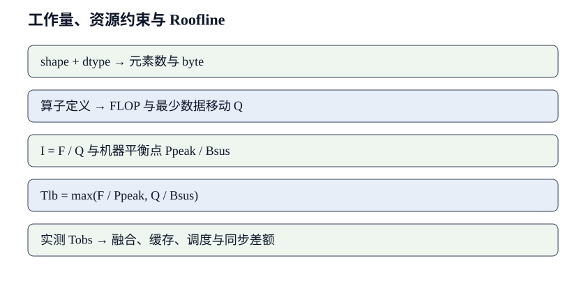

# 从 FLOPs、字节与时延计算性能下界

系统性能分析的第一步是把工作负载变成带单位的量. FLOPs 描述执行了多少算术, byte 描述跨某一级存储接口移动了多少数据, 秒描述明确同步边界内经过的时间. 三者结合后, 才能区分计算上限、带宽上限和调度损失. 这里采用乘法与加法各计 1 FLOP, 十进制带宽使用 byte/s, 容量同时注明 GB 或 GiB.

## 1. 先把工作负载写成可计算对象

资源分析先固定输入 shape、精度、调用次数和测量边界。少一个维度或混用一次调用与一次 step，后面的 roofline 再精确也没有意义。

本节从矩阵乘的算术量开始，再把训练状态和异步计时放进同一个计算模型。目标是让每个数字都能沿公式回到张量，而不是从 profiler 面板抄一个比例。

### 1.1. shape、精度与计数口径

设输入 $X\in\mathbb{R}^{m\times k}$, 权重 $W\in\mathbb{R}^{k\times n}$, 输出 $Y\in\mathbb{R}^{m\times n}$. 元素宽度记为 $w$ byte. 前向矩阵乘 $Y=XW$ 包含 $mkn$ 次乘法与近似相同次数的加法, 按一次乘加计 2 FLOP 得 $F=2mkn$. 若从 HBM 各读取一次 $X,W$, 写回一次 $Y$, 最少流量为 $Q_{min}=w(mk+kn+mn)$. 这个流量是假设完美复用后的下界, 不是所有 kernel 的实测流量.

以 $m=4096,k=n=4096,w=2$ 为例, $F=137438953472$ FLOP, 即约 137.44 GFLOP. $Q_{min}=2(4096^2+4096^2+4096^2)=100663296$ byte, 即 100.66 MB 或 96 MiB. 算术强度约为 1365.3 FLOP/byte. 若误把乘加计成 1 FLOP, 结果会恰好少一半; 比较资料前必须先统一口径.

### 1.2. 训练状态与 activation 的容量

参数量记为 $N_p$. 仅权重容量为 $M_w=N_pw_w$, 其中 $w_w$ 是每个权重的 byte 数. 训练还可能保存梯度、主权重与优化器的一阶和二阶状态. 例如按 FP16 权重 2 byte、FP16 梯度 2 byte、FP32 主权重 4 byte、两个 FP32 Adam 状态各 4 byte 粗算, 每参数为 16 byte; $7\times10^9$ 参数对应 112 GB 十进制容量. 这仍不含 activation、临时 workspace 与 allocator 碎片.

activation 无法由 $BSHL$ 乘一个固定常数准确概括. 每层保存哪些张量由算子实现、反向公式与 checkpoint 边界决定. 容量表应列出张量 shape、dtype、产生时刻、末次消费者和可重算性. **峰值取同一时刻仍然存活的张量之和；发生在不同时段的独立峰值不能直接相加.** 分片或 offload 还会引入传输量和等待时间, 它们与节省的驻留容量一起计算.

### 1.3. 时间边界与同步位置

GPU kernel 异步提交. 主机调用返回的时间不等于设备完成时间. 单 kernel 微基准应使用设备 event 或在计时区间末尾同步; 端到端服务计时则包含排队、主机调度、数据传输和设备执行. 两种口径都成立, 但回答的问题不同. 报告平均数还不够, 服务工作负载应给 p50、p95 或 p99, 因为排队与长度差异主要出现在尾部.

设连续执行 200 次, 前 20 次预热, 对余下 180 次测量. 若总设备时间为 0.36 s, 平均为 2 ms; 这不能推出 p99 为 2 ms. 动态时钟、功耗上限和其他进程会改变分布. 测量记录至少包含 GPU 型号、驱动、CUDA 与框架版本、dtype、完整 shape、是否启用 TF32、预热与重复次数. 没有环境绑定的性能数字不能跨实验复用.

*图 1: 从张量定义到实测差额的五步工作量与资源模型. 图中数量与箭头为这里使用的分析框架, 作者绘制.*

## 2. Roofline 把计算与搬运放到同一张图

Roofline 用算术强度连接工作量与数据移动，并给出计算屋顶和带宽斜坡的较小值。它适合判断优化方向和收益上限，不负责解释所有微架构细节。

使用前必须说明流量来自 HBM、L2 还是其他层级，也要使用目标 shape 的可持续算力/带宽。改变层级却沿用同一个 $Q$，会让结论失去物理意义。

### 2.1. 机器平衡点与性能上界

设设备峰值计算率为 $P_{peak}$ FLOP/s, 对目标访问模式测得的可持续带宽为 $B_{sus}$ byte/s. [Williams、Waterman 与 Patterson 的 Roofline 原论文](https://doi.org/10.1145/1498765.1498785)把 attainable performance 写成峰值计算屋顶与带宽斜坡的较小值. 采用这里的符号, 上界为 $P_{roof}=\min(P_{peak},B_{sus}I)$, 算术强度为 $I=F/Q$, 机器平衡点为 $I^*=P_{peak}/B_{sus}$. 当 $I<I^*$, 带宽屋顶更低; 当 $I>I^*$, 计算屋顶更低. 原论文采用 operational intensity, 分母是 DRAM 流量; 若改画 L2 或 shared-memory 层级 roofline, 必须重新定义 $Q$ 与对应带宽, 不能共用一个分母.

取示意设备 $P_{peak}=100$ TFLOP/s, $B_{sus}=2$ TB/s, 则 $I^*=50$ FLOP/byte. 前例 $I=1365.3$ 高于平衡点, 理想下界为 $F/P_{peak}=1.374$ ms; HBM 下界约 $Q/B_{sus}=0.0503$ ms. 这些数字只适用于假定的持续性能, 不对应某张真实卡. 若 $m=1,k=n=4096,w=2$, $F=33.55$ MFLOP, 最少流量约 33.57 MB, $I$ 接近 1 FLOP/byte, 时间下界转为约 16.8 µs 的带宽项.

### 2.2. 融合为何改变算术强度

两个算子分开执行时, 前一个输出写入 HBM, 后一个再读取. 融合若让中间结果留在 register 或 shared memory, 模型 FLOPs 基本不变, HBM 的 $Q$ 减少. 例如对 $N$ 个 FP16 元素先加 bias 再做激活, 分离实现至少额外写读中间张量 $4N$ byte; 融合可消除这部分流量. 对低算术强度逐元素链, 这往往比增加峰值 FLOPs 更有效.

融合也会延长中间值生命周期, 增加 register 用量, 使每个 SM 同驻 warp 数下降; 某些 shape 还需要额外转换或同步. 因此 **fusion 是在 HBM 流量、片上容量与并行度之间交换资源**. 验证时同时比较 HBM byte、kernel 数、register/thread、occupancy 与总时间. 只看到 kernel 数减少不能证明关键路径缩短.

### 2.3. Roofline 的边界

经典 roofline 只给吞吐上界, 不表示短 kernel 的启动延迟、依赖链、指令混合或 cache miss 细节. 小矩阵即使算术强度高, 也可能无法提供足够并行工作填满 SM. attention 中 softmax 的 reduce 带有同步与数据依赖, 单一 $F/Q$ 难以表达. 分布式执行还多出网络屋顶和集合通信的启动项.

改进方法是分层建模. 先画 HBM roofline 判断外存流量, 再观察 L2 或 shared-memory 层的运算强度, 对短任务另加固定启动项 $\tau$. 预测式可写成 $T\ge \max(F/P,Q/B)+\tau$, 但 $\tau$ 是否与搬运重叠要由时间线判断. Roofline 的用途是缩小排查范围, 不是替代 profiler 和端到端测量.

多层 roofline 的关键是让每一层使用自己的流量，而不是把同一个 $Q$ 除以不同带宽。设某个 kernel 执行 $F$ 次浮点运算，从 HBM 取回 $Q_{HBM}$ byte，穿过 L2 的实际流量为 $Q_{L2}$，进入 shared memory 的流量为 $Q_{SMEM}$。三个算术强度分别是 $I_{HBM}=F/Q_{HBM}$、$I_{L2}=F/Q_{L2}$ 和 $I_{SMEM}=F/Q_{SMEM}$，对应的时间下界为

$$
T_{lb}=\max\left(\frac{F}{P_{sus}},\frac{Q_{HBM}}{B_{HBM}},\frac{Q_{L2}}{B_{L2}},\frac{Q_{SMEM}}{B_{SMEM}}\right).
$$

这里的 $P_{sus}$ 与各层 $B$ 都应来自接近目标 shape 和访问方式的基准。连续读取得到的 HBM 带宽不能直接预测带有 gather、跨页和未合并访问的 kernel；同理，L2 标称带宽也不能代替目标地址分布下的可持续值。分层以后还能解释一种常见现象：融合让 $Q_{HBM}$ 显著下降，HBM 屋顶已经抬高，时间却没有同比下降。若融合后的 tile 被多次从 shared memory 读取，或者 register spill 使数据重新经过 L2/HBM，新的限制可能已经落在片上流量或指令吞吐上。

以一个逐元素链为例，输入和输出各 256 MiB，分离的三个 kernel 每次都读前一结果、写下一结果，HBM 理想流量约为 $3\times512=1536$ MiB；完全融合后只读输入、写输出，理想流量降为 512 MiB。在可持续 1.5 TB/s 下，两者的 HBM 下界约为 1.07 ms 与 0.36 ms。若实测从 1.30 ms 只降到 0.72 ms，省下的 0.58 ms 已经超过单纯启动开销的解释范围，但又没有兑现全部流量收益。此时应核对融合 kernel 的寄存器数量、spill byte、L2 transaction 和有效占用率。Roofline 的差额由这些测量继续分解，直至找到接管关键路径的下一层约束。

## 3. 把 Transformer 拆成计算条目

Transformer 不是一个均匀算子。投影、attention、MLP、归一化在 prefill、decode 和训练中的 shape 与复用不同，需要逐项计算再聚合。

拆分后也保留调用次数和生命周期。某个 20 微秒 kernel 在每层多次出现，累积可能成为主项；一个很大的临时张量若生命周期短，也未必等于稳态容量。

### 3.1. 线性层与 attention score

对 $X\in\mathbb{R}^{B\times S\times H}$ 和 $W\in\mathbb{R}^{H\times H_o}$, 把前两维合并为 $m=BS$, 得线性层 FLOPs $2BSHH_o$. Q、K、V 三个投影若输出维度均为 $H$, 合计 $6BSH^2$ FLOP; 输出投影再加 $2BSH^2$. score 矩阵每头为 $S\times S$, $A$ 个 head 的 $QK^T$ 合计约 $2BAS^2D=2BS^2H$ FLOP, 与 V 相乘再有同量级.

当 $S$ 增大时, attention 的二次项上升; 当 $H$ 很大而 $S$ 较短时, 线性投影的 $H^2$ 项可能占主导. 仅说 attention 是二次复杂度不能判断某个配置的耗时. 还要计入 softmax、mask、归一化和中间张量流量. FlashAttention 的关键收益来自避免把完整 $S\times S$ score 与 probability 矩阵物化到 HBM, 并不改变精确 attention 的数学结果.

### 3.2. Prefill 与 decode 的不同 shape

prefill 的 $m=BS$ 往往较大, 权重可被多个 token 复用; decode 在每个请求每步只有一个新 token, $m$ 很小, 权重读取容易成为主项. decode 还读取历史 KV cache. 设层数 $L$, KV head 数 $A_{kv}$, 每头维度 $D$, 历史长度 $S_c$, K/V 精度宽度 $w_{kv}$, 单请求每步读取量约为 $2LS_cA_{kv}Dw_{kv}$ byte, 省略分页元数据和未命中代价.

取 $L=32,A_{kv}=8,D=128,S_c=4096,w_{kv}=2$, 单步 KV 读取约 536870912 byte, 即 512 MiB. 若 HBM 可持续带宽为 2 TB/s, 仅该读取的理想下界约 0.268 ms. 真实系统还要读取权重、写入新 KV、执行 attention 与通信. GQA 减少 $A_{kv}$ 会线性减少这部分容量与流量, 但不必然按同比例缩短端到端时间.

可以用同一个 7B、32 层的示意模型比较 prefill 与 decode。设 $H=4096$，MLP 中间维度 $H_f=11008$，一次请求的 prompt 长度为 2048。忽略 bias、归一化和词表层，每层四个 attention 投影约需 $8SH^2$ FLOP，门控 MLP 的三个矩阵乘约需 $6SHH_f$ FLOP，两次 attention 矩阵乘约需 $4S^2H$ FLOP。代入后，每层约为 275 GFLOP、277 GFLOP 与 68.7 GFLOP，合计约 621 GFLOP；32 层约 19.9 TFLOP。若目标 GPU 对这些 shape 的可持续计算率为 80 TFLOP/s，主体计算下界约 249 ms。这个数字没有包括词表投影、读取输入输出、kernel 启动和多卡通信，所以只能作为下界。

同一模型进入 batch=1 的 decode 时，新 token 对线性层的有效 FLOPs 大致把上式中的 $S$ 换成 1，attention 又要扫描 2048 个历史位置。算术工作量骤降，14 GB BF16 权重却仍可能在每轮被读取一次；在 1.6 TB/s 的目标访问模式带宽下，权重项已经给出约 8.75 ms 下界。前述 GQA 配置在 2048 长度时还要读取约 256 MiB KV，对应约 0.17 ms。此时继续优化 attention 的算术量，即使把它降为零，也难越过权重读取形成的主屋顶。若把连续批处理提高到 16，权重能够在一轮中服务 16 个新 token，每 token 分摊的权重流量下降；但 KV 流量会按请求长度分别累积，矩阵的 $m$ 维也改变，瓶颈可能从权重带宽转到计算、KV 或调度。prefill 与 decode 因而不能共用一个“每 token 成本”。

这个算例还说明 TTFT 与 TPOT 的优化方向为什么不同。缩短 prompt、采用 chunked prefill 或提高 prefill 的矩阵效率主要影响首次响应；权重量化、连续批处理、KV 量化和 GQA 更直接地作用于逐 token 阶段。二者共享 GPU 时，长 prefill chunk 会占住执行资源，使 decode 请求等待。设备总 FLOPs 并没有增加，用户看到的 TPOT 却可能恶化，所以模型中还要保留调度时间片和排队边界。

### 3.3. 训练 step 的有效工作

训练常用近似会把每 token 模型 FLOPs 表为参数量的常数倍, 但常数依赖是否计 activation、attention 二次项、重算与具体架构. 更可审查的做法是按算子累加前向 FLOPs, 用反向实现确定梯度计算, 再把 checkpoint 重算单列. 有效 token 数为全局 batch 乘序列长度, padding 是否计入也要声明.

若一次 step 的模型有效工作为 $F_{model}$, 设备数为 $p$, 单设备峰值为 $P_{peak}$, step 时间为 $T$, 则 $MFU=F_{model}/(pP_{peak}T)$. 若重算后硬件实际执行 $F_{exec}>F_{model}$, 则按实际指令估算的利用率可能更高. **MFU 下降可能来自通信或空泡, 也可能来自有效工作定义变化; 比较前先锁定分子.**

沿用 7B 模型，设一次训练 step 有 2M 个有效 token，并采用常见的 $6N$ FLOP/token 近似，则模型有效工作约为 $6\times7\times10^9\times2\times10^6=8.4\times10^{16}$ FLOP，即 84 PFLOP。若使用 64 张卡，每卡在目标训练 shape 下可持续 250 TFLOP/s，仅计算下界约为 $84\text{ PFLOP}/(64\times250\text{ TFLOP/s})=5.25$ s。假设实测 step 为 8.0 s，按这个分子得到的利用率约为 65.6%。这个百分比只说明有效模型工作占所选计算屋顶的比例，不能直接说余下 34.4% 全是通信。

若 activation checkpoint 让前向主体额外执行一次，实际执行工作可能增加约一次前向的量，而 $F_{model}$ 仍按不重算的训练目标计数。再假设时间线中数据等待 0.25 s，流水空泡 0.45 s，暴露的集合通信为 0.80 s，checkpoint 重算为 1.10 s，其余差额来自 kernel 未达到可持续屋顶与运行时空档。这些区间不应随意相加：通信可能与重算重叠，数据准备可能发生在设备计算期间。正确做法是先在统一时间线上求关键路径，再分别报告“发生了多久”和“暴露了多久”。例如 NCCL 区间累计 2.4 s，但其中 1.6 s 被反向计算覆盖，对 step 的直接贡献才接近 0.8 s。

训练配置变化后，分子也要重新核对。序列从 2K 增至 8K 时，线性层工作随 token 数增长，attention 的 $S^2$ 项增长更快；启用序列打包会减少 padding，使有效 token 比例上升；MoE 则要区分总参数与每 token 激活参数。若只沿用“$6N$”比较这些配置，MFU 的变化可能来自近似误差，而不是系统退化。算子级 FLOPs、有效 token、padding token、重算 FLOPs 和路由 padding 分列后，训练 step 才能与 profiler 的实际执行对应起来。

## 4. 从估算到实验校准

估算的价值在于形成可证伪预测。实测偏离下界时，差额应沿并行度、cache、同步、launch 或运行时空档逐项定位。

实验同时保留估算输入与原始测量，使硬件或软件变化后能够重新计算。只留下最终百分比，无法判断新版本改变的是工作量还是执行效率。

### 4.1. 差额怎样定位

先对每个大算子算 $F/P$ 与 $Q/B$, 再与 kernel 时间比较. 若实测远高于两项, 检查并行度、访存合并、类型转换、同步和 launch. 若 kernel 之和明显小于 step 时间, 检查 CPU gap、数据等待与通信. 时间线能够区分「kernel 自己慢」和「设备没有工作」, 两者需要完全不同的改动.

一个实用表格应含算子名、输入输出 shape、dtype、调用次数、理论 FLOPs、估计 HBM byte、预测下界、实测时间与关键 profiler 计数器. 调用次数很重要: 20 µs 的小 kernel 每层出现数次, 在深模型和短 decode 中会累积成主要成本. 聚合前保留逐项数据, 才能知道收益来自哪里.

一组可归因实验要冻结模型提交、编译选项、GPU 时钟与功耗限制，保存实际输入 shape 分布，并注明设备计时或请求端到端计时。基线同时给出算子下界和瓶颈预测，例如「decode 受权重 HBM 读取限制，INT4 后模型段的理想时间由 9 ms 降至约 3 ms」。实验只改变一个机制并保留原始 profile；若模型段降到 4 ms，同时新增 1 ms 反量化，差额已经能够解释。恢复基线复跑可以识别温度、邻居任务和软件缓存造成的漂移。真实长度与并发分布上的复验则检查收益能否离开整齐 shape 的微基准继续成立。

测量误差也要进入判断。假设基线重复 30 次，设备段均值 20.0 ms、标准差 0.3 ms；新方案均值 19.8 ms、标准差 0.4 ms。0.2 ms 的差距小于运行波动，不能据此宣布 1% 加速。若优化预测应减少 4 ms，而观测差只有 0.2 ms，更应检查计时边界、实际流量是否下降、编译器是否选择了预期 kernel，而不是扩大重复次数直到得到一个显著数字。相反，若 30 次结果稳定在 16.1 ms，下一步是核对减少的 HBM byte 与 3.9 ms 是否同量级，再确认端到端服务没有把收益转移成更长排队。

跨设备实验还要把慢 rank 与聚合统计分开。八张卡中七张计算段稳定在 40 ms，一张因数据长度或降频达到 47 ms，step 会等待最慢参与者；只看所有 kernel 的平均值约 40.9 ms，会把 6 ms 以上的同步损失藏起来。应同时保存每个 rank 的进入时间、完成时间、时钟与输入 token 数，并把集合通信拆成等待参与者和实际传输两段。若平衡 token 后等待消失，问题属于工作分配；若所有 rank 同时到达而传输仍慢，再检查拓扑、争用和重传。这样得到的归因可以直接导向下一次对照实验。

### 4.2. 误差与敏感性

估算输入本身带误差. 可持续带宽随访问模式改变, 峰值矩阵算力受 shape 对齐与稀疏条件限制, cache 命中率随调度变化. 可对关键参数做区间分析: 若 $B_{sus}$ 在 1.6--2.0 TB/s, 则 32 GB 流量的下界为 20--16 ms. 若结论在整个区间都不改变, 无需追求伪精确的小数.

敏感性还能指导测量优先级. 当预测对 KV 命中率极敏感, 先测 cache 行为; 当计算项始终比通信项大十倍, 没必要先优化网络. 最终报告应保留估算与实测的差值, 并解释新增项, 而不是事后调整参数使模型恰好贴合每个数据点.

### 4.3. 模型细化的停止条件

当前模型能够区分候选方案并产生可证伪实验时，就已经达到决策所需的细度。无法改变候选排序或实验设计的新参数只会增加维护成本。

工作量与资源模型不需要模拟每条指令. 当模型已经能区分主要瓶颈、预测改动方向并给出可证伪实验, 细化就有明确收益. 若两个候选优化的预测差小于测量噪声, 应先改善实验设计. 若业务目标由 p99 决定, 平均吞吐模型也不能替代排队分析.

**模型可用的标志是边界明确, 不是数字足够多.** 每个结论都应注明工作负载、硬件层级、计时区间与省略项. 后续硬件或软件变化时, 只需替换对应参数并重新计算, 而不必把旧经验当成固定规律.

## 5. 三组工作负载的复算练习

前面的公式需要在具体训练、推理和异常场景里反复代入，才能成为工程工具。本节把静态状态、KV、排队、MoE 与 I/O 都写回统一单位。

每个例子都区分理论有效工作和硬件实际执行，并明确省略项。示例数字用于演示计算方法，不替代目标机器上的基准。

### 5.1. 训练状态估算
#### 静态状态不能只报一个「每参数字节数」

仍以 AdamW 为例. 设参数总量为 $N$, 参与训练的低精度参数、梯度、FP32 主参数、两个 FP32 动量分别占 $2N,2N,4N,4N,4N$ byte, 静态状态合计 $16N$ byte. 这个常见估算默认全部状态同时驻留 GPU, 没有量化优化器, 也没有参数冻结. 对 7B 参数, 十进制容量为 112 GB; 换成 GiB 要除以 $2^{30}$, 约 104.3 GiB. 「112 GB 超过 80 GB」与「至少需要两张 80 GB 卡」不是同一句话, 因为还要知道采用哪种分片方式、每张卡预留多少 activation 和通信缓冲.

数据并行只复制这 16 字节, 不会自动减少单卡静态状态. ZeRO-1 分片优化器状态, 单卡近似为 $4N+8N/p+4N$ byte, 前两项分别对应低精度参数与梯度; ZeRO-2 再分片梯度, 近似为 $4N+12N/p$; ZeRO-3 把参数也分片, 理想静态项接近 $16N/p$. 这里把低精度参数与 FP32 主参数合并为每参数 6 byte 后再分片, 只是容量近似. 实际框架可能在更新、聚合或保存 checkpoint 时临时取回完整参数, 所以容量估算还要列出「稳态驻留」与「峰值临时」两行.

取 $N=7\times10^9,p=8$, ZeRO-3 理想静态状态为 14 GB/卡. 若一张卡上观察到 19 GB, 多出的 5 GB 不该直接叫作框架开销: 它可能由通信 bucket、扁平参数缓冲、对齐填充、CUDA context 和 allocator 保留块共同组成. 逐项缩小 bucket、在相同位置读取 allocated 与 reserved memory、关闭 checkpoint 保存后复测, 才能把这些量拆开.

#### activation 要按时间轴求峰值

设 Transformer 有 $L$ 层, micro-batch 为 $B$, 序列长度为 $S$, 隐藏维度为 $H$, 元素宽度为 $w$. 仅保存每层输入这一项就是 $LBSHw$ byte. 但 attention 还可能保存 QKV、softmax 所需统计量, MLP 保存门控前后的中间值; fused kernel 与自定义反向会改变保存集合. 因此 activation 的正确表达是

$$
M_{act}^{peak}=\max_t\sum_{x\in\mathcal{L}(t)} \operatorname{numel}(x)w_x,
$$

其中 $\mathcal{L}(t)$ 表示时刻 $t$ 仍有未来消费者、因而不能释放的张量集合. 这条式子提醒我们: 两个张量各占 4 GiB, 若生命周期不相交, 峰值只增加 4 GiB; 若跨同一个反向区间同时存活, 才增加 8 GiB.

activation checkpoint 把某段内部张量释放, 反向到达该段时重新执行前向. 若每 $c$ 层设一个边界, 粗略保存量由 $O(L)$ 降为 $O(L/c+c)$ 个层级状态, 最优 $c$ 在简化模型里接近 $\sqrt{L}$. 真实网络的层内张量并不等大, attention 的临时 workspace 也未必随 checkpoint 消失, 所以这个量级只用于选择候选配置. 最终要从内存时间线确认峰值落在哪个算子, 然后检查该张量是否真的可重算.

#### 一个 7B 训练配置的容量验算

假设 7B 模型使用 8 张 80 GB GPU、ZeRO-3, 每卡静态状态理想值 14 GB; 实测框架与通信常驻再占 6 GB, 给 CUDA graph 或波动留 4 GB 安全区, activation 与临时 workspace 可用约 56 GB. 设 32 层、$B=2,S=4096,H=4096$, 单个 $[B,S,H]$ BF16 张量为 $2\times4096\times4096\times2=67{,}108{,}864$ byte, 即 64 MiB. 若每层反向需要保留等价于 12 个这种张量, 不做重算约为 $32\times12\times64=24{,}576$ MiB, 即 24 GiB.

这组简算仍缺少词表 logits、attention workspace、长寿命输入、通信临时区和碎片. 例如词表大小 128K 时, $[B,S,V]$ 的 BF16 logits 达 2 GiB; 若交叉熵实现把完整 logits 与额外概率张量同时保留, 峰值会突然跃升. 峰值附近的 allocation 必须按张量归因，模糊常数无法说明哪一项可以释放或复用. 若 fused cross entropy 不物化完整概率矩阵, 容量估算中删去的项目也应明确对应 logits 的哪次写回或哪个保存副本.

### 5.2. 推理工作量与容量
#### 权重流量给 decode 一个朴素下界

batch 较小的自回归 decode 中, 每步各层矩阵向量乘很难充分复用权重. 若模型权重为 $M_w$ byte, 一次迭代近似至少读一遍权重, 理想时间下界为 $M_w/B_{HBM}$. 14 GB 的 BF16 权重在 2 TB/s 下是 7 ms; 若每次迭代只产出一个请求的一个 token, 上界约 143 token/s. 连续批处理把同一遍权重读取摊给 $b$ 个活动序列, 理想吞吐可近似提高到 $bB_{HBM}/M_w$, 直到 GEMM shape、KV 流量、调度和算力屋顶接管.

这个估算也解释了量化为何常能显著改善小 batch decode: 4 bit 权重把主要读取量降到约四分之一, 但反量化 scale、零点和计算 kernel 会带来额外工作. 若端到端只加速 2 倍, 不能据此断言量化 kernel 低效; 先把不随权重字节缩放的 KV cache、采样、调度和网络时间从总时延中分离.

#### KV cache 同时是容量项与逐步流量项

单请求 KV 容量为 $M_{KV}=2LSA_{kv}Dw_{kv}$. 以前文 $L=32,A_{kv}=8,D=128,S=4096,w_{kv}=2$ 为例, 结果为 512 MiB. 100 个同长度请求需要约 50 GiB, 还没计算分页内部碎片. 若 page/block 容纳 $P$ 个 token, 某请求长度为 $S_i$, 分配量按 $\lceil S_i/P\rceil P$ 计算; 整个批次的内部浪费是

$$
M_{frag}=2LA_{kv}Dw_{kv}\sum_i\left(\left\lceil\frac{S_i}{P}\right\rceil P-S_i\right).
$$

page 越小, 内部碎片越少, 但页表更长、元数据访问更多, kernel 合并访问也更难. 这就是分页参数不能只按「显存利用率最高」选择的原因. 同时要测可容纳请求数、decode kernel 时间与调度开销.

每生成一个 token, attention 要读取该请求已有 KV. 对长度不断增长的请求, 单步流量近似正比于当前 $S_i$; 完整生成 $G$ 个 token 的 KV 读取量则含 $\sum_{j=0}^{G-1}(S_0+j)=GS_0+G(G-1)/2$. 因而长输出的后半段天然更贵. 报告「每 token 平均延迟」时若不注明输入长度与输出区间, 会把这一结构性增长掩盖掉.

#### 服务层的端到端时间

设请求到达率为 $\lambda$, 服务系统稳定吞吐能力为 $\mu$. 当利用率 $\rho=\lambda/\mu$ 接近 1, 平均排队时间会快速增加; 动态 batching 又会主动等待短暂窗口以换取更大的 batch. 因此首 token 时延可以拆成排队、prefill 和调度三段, 后续 token 间隔拆成批次等待、decode 执行与输出处理. 吞吐提升并不保证 TTFT 或 p99 同时改善.

推理测量中应至少并列「设备每轮时间」「每轮有效 token 数」「请求排队时间」「每请求上下文长度」. 当连续 batching 将每轮 token 数从 8 提到 64, 设备时间可能从 8 ms 增到 20 ms: 总吞吐从 1000 token/s 增到 3200 token/s, 但一个请求的 token 间隔也可能由 8 ms 变成 20 ms. 业务若需要流式交互, 不能只看聚合吞吐.

#### 用下界核对优化收益

一次优化至少要保留基线、预测和实测三列. 例如融合算子预计减少 8 GB HBM 流量, 在 1.6 TB/s 下最多节省 5 ms; 实测只省 2 ms, profiler 又显示 register/thread 从 96 增至 160、occupancy 下降, 那么差额有具体解释. 若实测省了 9 ms, 反而要检查融合是否还消除了 launch、同步或重复计算, 而不是把超过带宽模型的收益当作惊喜略过.

另一类常见错误是把并发资源相加. 计算与通信完全串行时 $T=T_c+T_n$; 完美重叠时 $T=\max(T_c,T_n)$; 部分重叠可写成 $T=T_c+T_n-T_{overlap}$. 直接使用最大值等于先假定了完美重叠. 时间线若显示 NCCL kernel 与矩阵乘位于同一段, 还要确认两者是否争夺 SM、HBM 或互联带宽; 视觉上的重叠不等于没有相互减速.

最终的工作量与资源模型应该允许另一个人替换 $B,S,H,L,p$ 和硬件参数后重新得到结论. shape、单位、调用次数和同步边界是输入, 算术量、流量、峰值容量与下界是中间结果, profiler 和端到端指标负责纠偏. **经验可以提示先看哪里, 但只有可复算的工作量与资源模型能说明瓶颈为何随工作负载改变.**

### 5.3. 从异常指标反推遗漏项
#### MoE 与稀疏模型的资源计算

Mixture-of-Experts 容易把「总参数」「激活参数」和「实际执行」混在一起. 设每层有 $E$ 个 expert, 每个 token 选择 $k$ 个, 单个 expert 的两层 MLP 中间维度为 $H_f$. 参数容量按全部 $E$ 个 expert 计算, 而理想算术量只按被选中的 $k$ 个计算. 若忽略门控与偏置, 单 token 单层 expert MLP 约为 $4kHH_f$ FLOP; 总 expert 参数则约为 $2EHH_f$. 因此总参数增大 $E/k$ 倍, 不代表每 token FLOPs 同比例增加.

真实执行还受容量与 padding 影响. 令这一批共有 $T$ 个 token, 均匀期望每 expert 接收 $kT/E$, 实现通常为每 expert 预留 $C=\lceil c_fkT/E\rceil$ 个槽位, 其中 $c_f$ 是容量因子. 若内核按固定 $C$ 计算, 实际 expert GEMM 处理 $EC$ 个位置; 有效 token-slot 只有 $kT$, 利用率为 $kT/(EC)$. 当 batch 小、路由偏斜或容量因子较大时, 理论稀疏 FLOPs 与硬件执行 FLOPs 的差会很大.

例如 $E=64,k=2,T=4096,c_f=1.25$, 每 expert 容量为 160, 总槽位 10240, 有效槽位 8192, 即使路由完美均衡也有 20% padding. 若某些 expert 超容量, 系统还要丢弃、转送或走备用 expert, 三种策略的质量和通信代价完全不同. 性能报告至少并列有效 token、分配槽位、最大 expert 负载、丢弃率以及 all-to-all 字节.

专家并行让权重容量按 rank 分散, 但 token 要跨 rank 发送. 若 dispatch 前激活 shape 为 $[T,H]$, 每 token 复制给 $k$ 个 expert, 理想发送载荷约 $kTHw$ byte, 返回结果再有同量级. 这还不含索引、对齐与容量 padding. 当 $H=4096,T=4096,k=2,w=2$, 单次 dispatch 有效载荷为 64 MiB, 往返约 128 MiB. 计算量可能很大, 但小 expert batch 会让 GEMM 不饱和, all-to-all 又可能受最拥塞 rank 限制. MoE 的资源计算必须同时保留容量、计算、通信和负载分布四列.

#### 从单位错误到错误决策

性能表最危险的错误往往很朴素. GB 与 GiB 相差约 7.4%; Gb/s 与 GB/s 相差 8 倍; FLOP 与 FLOP/s 分别是工作量与速率; token/s 若没有说明是每设备、全局还是每请求, 也无法进入公式. 所有原始字段都带单位保存, 展示层再换算, 比在表格里留下裸数字可靠.

利用率同样需要分母. 设备规格表中的峰值可能要求特定 dtype、稀疏模式、功耗和 shape; 一个 BF16 kernel 不应除以 FP8 稀疏峰值. 集群吞吐除以 $pP_{peak}$ 得到的 MFU, 若包含空闲备用卡或异构卡, 分母也会失真. 更稳妥的做法是同时报告模型有效 FLOPs、估计硬件执行 FLOPs、设备时间与端到端时间, 让读者看见每一步如何得到.

再看一个常见误判: 优化后 step 从 1.0 s 降到 0.9 s, 显存从 70 GiB 降到 60 GiB, 不能说性能与容量分别提升 10% 和 14.3% 后相加为 24.3%. 它们是不同维度. 若释放的显存允许 batch 从 8 增到 10, 应重新测量 token/s 和收敛设置; 容量收益通过新的工作负载间接转化为吞吐, 不是可以直接相加的百分比.

复核从量纲开始：FLOP、byte、byte/s 与秒必须闭合。随后核对 shape 和调用次数，再沿时间线确认生命周期与同步边界。下界与实测的差额只有在这些输入可信时才有归因价值；shape 错一维时，再精确的小数也只是在装饰错误结论.

还有一项经常漏掉: 数据准备和 checkpoint 的 I/O. 假设每个训练 step 消费 $T$ 个 token, 平均每 token 编码后占 $b$ byte, step 时间为 $t$, 数据管线必须持续提供至少 $Tb/t$ byte/s. 若每 100 step 保存一次 140 GB checkpoint, 保存窗口为 20 s, 仅写带宽就需 7 GB/s; 若保存与训练重叠, 读取参数、序列化和网络写入还会争用 CPU、PCIe 与存储. 把保存耗时均摊进平均 step 容易掩盖周期性长尾, 更合适的是同时报告稳态 step 与保存窗口的 step 分布.

流水中的缓冲也占容量. 预取 $q$ 个 batch, 每批 token/特征占 $M_b$, 主机 pinned memory 至少增加 $qM_b$; GPU 侧若双缓冲输入, 又增加两份设备张量. 预取过少会让 GPU 等数据, 过多则挤压主机内存并放大取消任务时的浪费. 模型将队列深度写成参数后, 才能通过时间线观察空档, 找到「不再饿 GPU 的最小深度」, 而不是无上限加缓存.

checkpoint 的恢复时间也应单列. 保存 140 GB 状态到对象存储用了 20 s, 不代表故障恢复也只需 20 s; 恢复还包含列举分片、下载、校验、反序列化、重新分发以及数据迭代器定位. 若平均每 $I$ 秒发生一次可恢复故障, 每次损失最近 $C$ 秒计算并花 $R$ 秒恢复, 长期有效利用率会被约 $(C/2+R)/I$ 的比例侵蚀. 缩短保存间隔降低重算损失, 却增加正常运行中的 I/O. 这项权衡与算力 roofline 不在同一层, 但最终都会落到每个有效 token 的时间与成本上.

模型参数和测量结果需要版本化. 模型配置、代码提交、编译选项、驱动与硬件固件任一变化, 都可能让旧参数失效. 原始测量应与结论一起保存，版本回退或换卡时才能重新计算. 一张能追溯输入、公式与设备条件的表, 通常比脱离环境的经验条目更耐用.

若无法复现原始环境, 至少保留 shape、dtype、同步点、重复次数和原始时间分布. 这些字段足以判断新旧结果是否还在回答同一个问题.

能复算、能测量、能被下一次实验推翻的模型，才适合支撑系统选择；预测误差本身也应成为下一轮归因的输入。

## 参考资料

- [Williams, Waterman, Patterson, Roofline: An Insightful Visual Performance Model for Multicore Architectures (2009)](https://doi.org/10.1145/1498765.1498785). Roofline 的一手论文来源; 这里给出的 $P_{roof}=\min(P_{peak},B_{sus}I)$、机器平衡点与「上界而非精确预测」均据此展开.
- [Roofline Model: A Pedagogical Tool for Program Analysis and Optimization, Berkeley/LBNL slides](https://escholarship.org/uc/item/3qf383m0). 已打开全文, 用于复核模型目标是给出性能期望、硬件限制与优化优先级, 并非取代细粒度调优.
- [NVIDIA CUDA C++ Programming Guide: Streams 与显式同步](https://docs.nvidia.com/cuda/cuda-programming-guide/). 用于核对 GPU 工作异步提交、`cudaDeviceSynchronize`、`cudaStreamSynchronize` 以及跨 stream 重叠的条件.
