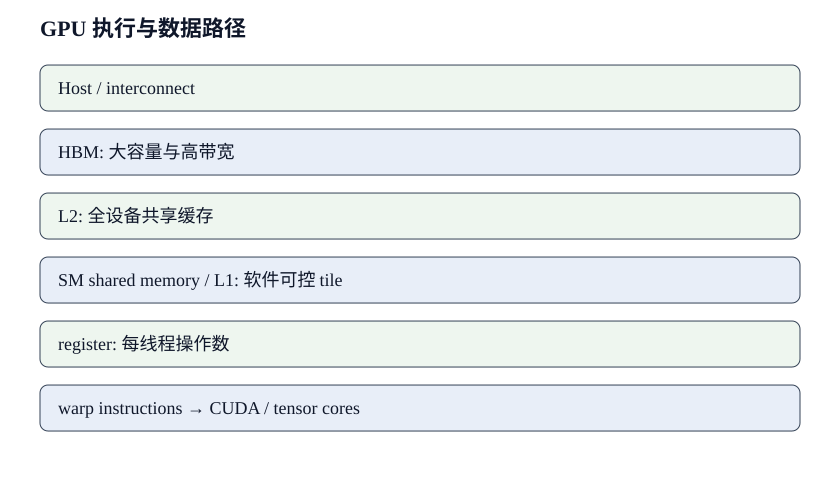

# GPU 执行与存储层次

GPU 的高吞吐来自大量并行线程、专用矩阵执行单元和分层存储. 一个 kernel 没有达到峰值, 可能缺少可并行的 tile, 可能受 register 或 shared memory 限制驻留, 也可能等待 HBM. 本文沿数据真实经过的层级计算容量与流量, 并把 occupancy、带宽和指令吞吐放回同一条时间线.

## 1. 执行层次决定峰值能否兑现

GPU 峰值只有在网格提供足够并行工作、warp 持续可发射且指令 shape 合适时才可能兑现。逻辑张量必须逐层落到 block、warp 和线程。

Register、shared memory、线程和 block 槽位共同限制驻留。提高其中一个指标可能消耗另一个资源，所以本节先建立执行层次的约束关系。

### 1.1. 线程、warp 与 SM 如何分工

GPU 把线程按 warp 调度, 多个 warp 驻留在 streaming multiprocessor, 即 SM. 分析「线程、warp 与 SM 如何分工」时, 输入仍从明确 shape 开始: tile 含多少元素, 每元素多少 byte, 每线程持有多少累加器, 一个 thread block 需要多少 shared memory. 调度器只能从已经驻留且就绪的 warp 中发射指令; 数据依赖、barrier 或访存等待会减少可发射工作. 因而峰值吞吐要求指令类型、shape、并行度和数据供给同时满足, 设备型号本身不会保证利用率.

以 128×128 的 FP16 输入 tile 为例, 单个矩阵占 32768 byte. 若一个 block 同时在 shared memory 保存 A、B 两个 tile, 基础需求为 65536 byte, 还未计双缓冲与 padding. 双缓冲把需求推到 131072 byte. 以 compute capability 9.0 的 H100 为具体环境, [NVIDIA Hopper Tuning Guide](https://docs.nvidia.com/cuda/hopper-tuning-guide/)给出每个 SM 可配置 228 KB shared memory, CUDA 为每个 block 保留 1 KB, 因而单 block 最多可寻址 227 KB; 静态分配仍限 48 KB, 更大的动态分配还需显式 opt-in. 在这个环境中, 131072 byte 能放入单个 block, 但 block 驻留数仍受 register 与线程上限共同约束. **片上复用减少 HBM 流量, 代价是占用有限的 register 和 shared memory 容量.**

### 1.2. register 压力与 occupancy

GPU 把线程按 warp 调度, 多个 warp 驻留在 streaming multiprocessor, 即 SM. 分析「register 压力与 occupancy」时, 输入仍从明确 shape 开始: tile 含多少元素, 每元素多少 byte, 每线程持有多少累加器, 一个 thread block 需要多少 shared memory. 调度器只能从已经驻留且就绪的 warp 中发射指令; 数据依赖、barrier 或访存等待会减少可发射工作. 因而峰值吞吐要求指令类型、shape、并行度和数据供给同时满足, 设备型号本身不会保证利用率.

以 128×128 的 FP16 输入 tile 为例, 单个矩阵占 32768 byte. 若一个 block 同时在 shared memory 保存 A、B 两个 tile, 基础需求为 65536 byte, 还未计双缓冲与 padding. 双缓冲把需求推到 131072 byte. 若目标 SM 可分配 shared memory 为 228 KiB, 仅按该资源最多容纳 1 个这样的 block; register 与线程上限还可能更早限制驻留. **片上复用减少 HBM 流量, 代价是占用有限的 register 和 shared memory 容量.** 实际数值必须查询目标架构与 kernel 编译结果.

### 1.3. shared memory 的 tile 与 bank

GPU 把线程按 warp 调度, 多个 warp 驻留在 streaming multiprocessor, 即 SM. 分析「shared memory 的 tile 与 bank」时, 输入仍从明确 shape 开始: tile 含多少元素, 每元素多少 byte, 每线程持有多少累加器, 一个 thread block 需要多少 shared memory. 调度器只能从已经驻留且就绪的 warp 中发射指令; 数据依赖、barrier 或访存等待会减少可发射工作. 因而峰值吞吐要求指令类型、shape、并行度和数据供给同时满足, 设备型号本身不会保证利用率.

Shared memory 让同一 tile 被多个线程复用，但地址到 bank 的映射会影响并发访问。若一个 warp 的多个地址落到同一 bank，硬件需要拆分事务；padding 或改变布局可以消除冲突，却也会增加容量占用，所以应结合 transaction 数与驻留变化判断收益。

*图 1: 从主机与 HBM 到片上存储和执行单元的数据路径. 图中数量与箭头为本文定义的分析框架, 作者绘制.*

## 2. 存储层次决定字节走多远

同一个元素从 HBM 读取一次后，能否在 L2、shared memory 或 register 被多次复用，决定实际数据移动。逻辑有效字节与硬件 transaction 也可能不同。

本节把合并访问、Tensor Core shape 和融合放在一起看。优化的实质是改变字节路径，同时守住片上容量与并行度。

### 2.1. L2、HBM 与合并访问

GPU 把线程按 warp 调度, 多个 warp 驻留在 streaming multiprocessor, 即 SM. 分析「L2、HBM 与合并访问」时, 输入仍从明确 shape 开始: tile 含多少元素, 每元素多少 byte, 每线程持有多少累加器, 一个 thread block 需要多少 shared memory.

合并访问关注的是一次内存事务里有多少字节真正被线程使用。连续线程读取连续地址时，请求容易合并；stride、错位或稀疏索引则会放大 transaction 数量。此时 L2 命中率即使不低，也不代表 HBM 字节利用充分，仍要同时观察读写吞吐、请求数与有效载荷。

### 2.2. Tensor Core 的 shape 条件

GPU 把线程按 warp 调度, 多个 warp 驻留在 streaming multiprocessor, 即 SM. 分析「Tensor Core 的 shape 条件」时, 输入仍从明确 shape 开始: tile 含多少元素, 每元素多少 byte, 每线程持有多少累加器, 一个 thread block 需要多少 shared memory.

Tensor Core 吞吐依赖 dtype、对齐、布局以及矩阵维度能否落入实现支持的指令形状。逻辑矩阵很大并不足够：边界块、转置 stride 或类型转换都可能让主循环外出现额外路径。判断是否兑现矩阵峰值，应先确认实际指令，再检查数据供给是否让矩阵管线持续工作。

### 2.3. 融合的收益与反作用

GPU 把线程按 warp 调度, 多个 warp 驻留在 streaming multiprocessor, 即 SM. 分析「融合的收益与反作用」时, 输入仍从明确 shape 开始: tile 含多少元素, 每元素多少 byte, 每线程持有多少累加器, 一个 thread block 需要多少 shared memory.

融合省掉中间张量的写回、再次读取和 kernel 启动，但会把更多临时值留在寄存器或 shared memory。融合范围过大时，寄存器溢出、驻留 block 减少或长尾分支可能抵消节省的流量。因此比较融合方案时，要同时核算少搬了多少 byte、增加了多少片上状态，以及端到端时间是否真的下降。

## 3. 流水、同步与短任务

当单个 kernel 变短，启动、依赖与同步会从背景成本变成主要部分。异步拷贝能重叠搬运与计算，但只有 producer/consumer 节奏匹配才有效。

时间线中的空档可能来自主机提交、设备依赖或资源阻塞。三者现象相似，修改位置完全不同，需要先用事件关系区分。

### 3.1. 异步拷贝与流水

GPU 把线程按 warp 调度, 多个 warp 驻留在 streaming multiprocessor, 即 SM. 分析「异步拷贝与流水」时, 输入仍从明确 shape 开始: tile 含多少元素, 每元素多少 byte, 每线程持有多少累加器, 一个 thread block 需要多少 shared memory.

异步拷贝把第 $i+1$ 个 tile 的搬运压进第 $i$ 个 tile 的计算窗口。流水至少需要两组缓冲区和明确的生产者、消费者同步；单轮计算短于搬运时，稳态吞吐仍由数据路径限制。更大的 tile 还会占用片上容量，驻留下降后可能抵消重叠收益。

### 3.2. 分支、同步与尾效应

GPU 把线程按 warp 调度, 多个 warp 驻留在 streaming multiprocessor, 即 SM. 分析「分支、同步与尾效应」时, 输入仍从明确 shape 开始: tile 含多少元素, 每元素多少 byte, 每线程持有多少累加器, 一个 thread block 需要多少 shared memory.

分支本身并不必然昂贵，真正的损失来自同一 warp 内线程走不同路径，或部分 block 更早完成而留下尾波。barrier 则要求参与线程都到达同步点，最慢的一组决定放行时刻。排查时应把分歧比例、同步等待和网格末尾的活跃 SM 数放在同一条时间线上。

### 3.3. 小 kernel 与启动开销

GPU 把线程按 warp 调度, 多个 warp 驻留在 streaming multiprocessor, 即 SM. 分析「小 kernel 与启动开销」时, 输入仍从明确 shape 开始: tile 含多少元素, 每元素多少 byte, 每线程持有多少累加器, 一个 thread block 需要多少 shared memory.

当 kernel 只有几微秒时，主机提交、运行时调度和依赖检查已经与设备执行同量级。此时继续优化一两条设备指令通常收益有限，图捕获、批量提交或融合相邻操作更可能缩短整条路径。测量也应使用设备事件或完整时间线，避免把主机异步返回误当成执行完成。

## 4. 从指标回到资源冲突

Profiler 指标是执行结果的投影，不是根因标签。低 occupancy、高 stall 或高带宽都必须结合 shape、时间和源码区间解释。

矩阵乘与 attention 的算量、流量下界和实测时间共同构成证据。三者的差额可以继续分解到具体存储层级、并行度与同步区间，修改是否有效则由关键路径时间确认。

### 4.1. 用 profiler 形成证据链

GPU 把线程按 warp 调度, 多个 warp 驻留在 streaming multiprocessor, 即 SM. 分析「用 profiler 形成证据链」时, 输入仍从明确 shape 开始: tile 含多少元素, 每元素多少 byte, 每线程持有多少累加器, 一个 thread block 需要多少 shared memory.

证据链应从端到端变慢的区间开始，再落到目标 kernel、源码范围和具体资源。单个计数器只能说明现象，例如 memory stall 可能来自 HBM、L2 miss、依赖链或并发 kernel 争用。只有修改一个假设中的瓶颈并观察关键路径缩短，才算完成因果验证。

### 4.2. 矩阵乘手算案例

GPU 把线程按 warp 调度, 多个 warp 驻留在 streaming multiprocessor, 即 SM. 分析「矩阵乘手算案例」时, 输入仍从明确 shape 开始: tile 含多少元素, 每元素多少 byte, 每线程持有多少累加器, 一个 thread block 需要多少 shared memory.

矩阵乘可先算 $2MNK$ FLOP，再估计输入、输出与中间 tile 的实际字节。两者相除得到算术强度，与机器的计算吞吐/带宽比比较，便能判断理想情况下更接近计算瓶颈还是带宽瓶颈。随后再加入边界 tile、布局转换和驻留限制，逐步解释模型与实测的差距。

### 4.3. attention kernel 的边界

GPU 把线程按 warp 调度, 多个 warp 驻留在 streaming multiprocessor, 即 SM. 分析「attention kernel 的边界」时, 输入仍从明确 shape 开始: tile 含多少元素, 每元素多少 byte, 每线程持有多少累加器, 一个 thread block 需要多少 shared memory.

Attention 的限制随阶段和 shape 改变：长序列 Prefill 具有较大的矩阵乘，Decode 却常由少量 query 读取大量 KV cache。前者更关注 tile 复用与矩阵管线，后者更容易受 HBM 字节和小 batch 并行度限制。把两者混成一个平均利用率，会遮住完全不同的优化方向。

## 5. 把 kernel 映射到 SM 的三组案例

理解 GPU 层次最终要回到具体 kernel。这里从 tile 选择、归约、不规则访问和多 GPU 争用展开，连接公式、计数器与端到端时间。

案例覆盖常见快路径与边界 shape。性能收益必须在相同数值语义下成立，并同时检查 fallback，不能只展示最整齐的一组矩阵。

### 5.1. 矩阵乘的 tile 选择

分析「输出 tile 的二维尺寸」时, 先写一个 thread block 处理的输出范围. 若 block 产生 $T_m\times T_n$ 个输出, K 维每轮消费 $T_k$, A 与 B 的片上输入元素数分别为 $T_mT_k$ 和 $T_kT_n$. 元素宽度为 $w$ byte 时, 单缓冲基础占用为 $wT_k(T_m+T_n)$ byte; 双缓冲近似翻倍. 每线程累加器数再乘寄存器宽度, 才能与目标 SM 的 register file 和 shared-memory 上限比较. 「输出 tile 的二维尺寸」的性能不能脱离这些整数 shape 判断.

取 $T_m=T_n=128,T_k=32,w=2$ 的示意配置, A、B 两块单缓冲共 16384 byte, 双缓冲为 32768 byte. 一个输出 tile 执行约 $2T_mT_nT_k=1048576$ FLOP, 只计从更低层读入的 A、B tile, 本轮片上算术强度为 64 FLOP/byte. 这个结果不含输出写回, 也假定每块数据只读一次. 若边界 tile 只有一半有效元素, 指令和搬运仍可能按完整 tile 发生, 有效利用率随之下降.

增加 tile 可以提高复用, 但会扩大寄存器与 shared-memory 占用. 驻留 block 下降后, 内存等待更难被其他 warp 遮蔽. 因此调优要观察实际时间与 stall 原因, 不能把 occupancy 最大化设成独立目标. 某个计算密集 kernel 即使 occupancy 不高, 仍可能持续填满矩阵执行流水.

分析「K 维分块」时, 先写一个 thread block 处理的输出范围. 若 block 产生 $T_m\times T_n$ 个输出, K 维每轮消费 $T_k$, A 与 B 的片上输入元素数分别为 $T_mT_k$ 和 $T_kT_n$. 元素宽度为 $w$ byte 时, 单缓冲基础占用为 $wT_k(T_m+T_n)$ byte; 双缓冲近似翻倍. 每线程累加器数再乘寄存器宽度, 才能与目标 SM 的 register file 和 shared-memory 上限比较. 「K 维分块」的性能不能脱离这些整数 shape 判断.

若 profiler 显示相关 stall 很高, 先确认采样区间是否只覆盖目标 kernel, 再比较理论上限. 同一 stall 名称可能来自不同根因: 数据未到达、消费者依赖未解除、同步点前负载不均都能让 warp 暂时不可发射. 证据链应包含源代码位置、指令类别、访问层级与时间收益.

分析「warp 数量」时, 先写一个 thread block 处理的输出范围. 若 block 产生 $T_m\times T_n$ 个输出, K 维每轮消费 $T_k$, A 与 B 的片上输入元素数分别为 $T_mT_k$ 和 $T_kT_n$. 元素宽度为 $w$ byte 时, 单缓冲基础占用为 $wT_k(T_m+T_n)$ byte; 双缓冲近似翻倍. 每线程累加器数再乘寄存器宽度, 才能与目标 SM 的 register file 和 shared-memory 上限比较. 「warp 数量」的性能不能脱离这些整数 shape 判断.

分析「累加器精度」时, 先写一个 thread block 处理的输出范围. 若 block 产生 $T_m\times T_n$ 个输出, K 维每轮消费 $T_k$, A 与 B 的片上输入元素数分别为 $T_mT_k$ 和 $T_kT_n$. 元素宽度为 $w$ byte 时, 单缓冲基础占用为 $wT_k(T_m+T_n)$ byte; 双缓冲近似翻倍. 每线程累加器数再乘寄存器宽度, 才能与目标 SM 的 register file 和 shared-memory 上限比较. 「累加器精度」的性能不能脱离这些整数 shape 判断.

分析「shared memory 双缓冲」时, 先写一个 thread block 处理的输出范围. 若 block 产生 $T_m\times T_n$ 个输出, K 维每轮消费 $T_k$, A 与 B 的片上输入元素数分别为 $T_mT_k$ 和 $T_kT_n$. 元素宽度为 $w$ byte 时, 单缓冲基础占用为 $wT_k(T_m+T_n)$ byte; 双缓冲近似翻倍. 每线程累加器数再乘寄存器宽度, 才能与目标 SM 的 register file 和 shared-memory 上限比较. 「shared memory 双缓冲」的性能不能脱离这些整数 shape 判断.

分析「尾块与边界判断」时, 先写一个 thread block 处理的输出范围. 若 block 产生 $T_m\times T_n$ 个输出, K 维每轮消费 $T_k$, A 与 B 的片上输入元素数分别为 $T_mT_k$ 和 $T_kT_n$. 元素宽度为 $w$ byte 时, 单缓冲基础占用为 $wT_k(T_m+T_n)$ byte; 双缓冲近似翻倍. 每线程累加器数再乘寄存器宽度, 才能与目标 SM 的 register file 和 shared-memory 上限比较. 「尾块与边界判断」的性能不能脱离这些整数 shape 判断.

### 5.2. 逐元素与归约 kernel

分析「LayerNorm 的统计量」时, 先写一个 thread block 处理的输出范围. 若 block 产生 $T_m\times T_n$ 个输出, K 维每轮消费 $T_k$, A 与 B 的片上输入元素数分别为 $T_mT_k$ 和 $T_kT_n$. 元素宽度为 $w$ byte 时, 单缓冲基础占用为 $wT_k(T_m+T_n)$ byte; 双缓冲近似翻倍. 每线程累加器数再乘寄存器宽度, 才能与目标 SM 的 register file 和 shared-memory 上限比较. 「LayerNorm 的统计量」的性能不能脱离这些整数 shape 判断.

分析「softmax 的最大值归约」时, 先写一个 thread block 处理的输出范围. 若 block 产生 $T_m\times T_n$ 个输出, K 维每轮消费 $T_k$, A 与 B 的片上输入元素数分别为 $T_mT_k$ 和 $T_kT_n$. 元素宽度为 $w$ byte 时, 单缓冲基础占用为 $wT_k(T_m+T_n)$ byte; 双缓冲近似翻倍. 每线程累加器数再乘寄存器宽度, 才能与目标 SM 的 register file 和 shared-memory 上限比较. 「softmax 的最大值归约」的性能不能脱离这些整数 shape 判断.

分析「softmax 的指数和」时, 先写一个 thread block 处理的输出范围. 若 block 产生 $T_m\times T_n$ 个输出, K 维每轮消费 $T_k$, A 与 B 的片上输入元素数分别为 $T_mT_k$ 和 $T_kT_n$. 元素宽度为 $w$ byte 时, 单缓冲基础占用为 $wT_k(T_m+T_n)$ byte; 双缓冲近似翻倍. 每线程累加器数再乘寄存器宽度, 才能与目标 SM 的 register file 和 shared-memory 上限比较. 「softmax 的指数和」的性能不能脱离这些整数 shape 判断.

分析「残差与 bias 融合」时, 先写一个 thread block 处理的输出范围. 若 block 产生 $T_m\times T_n$ 个输出, K 维每轮消费 $T_k$, A 与 B 的片上输入元素数分别为 $T_mT_k$ 和 $T_kT_n$. 元素宽度为 $w$ byte 时, 单缓冲基础占用为 $wT_k(T_m+T_n)$ byte; 双缓冲近似翻倍. 每线程累加器数再乘寄存器宽度, 才能与目标 SM 的 register file 和 shared-memory 上限比较. 「残差与 bias 融合」的性能不能脱离这些整数 shape 判断.

分析「类型转换」时, 先写一个 thread block 处理的输出范围. 若 block 产生 $T_m\times T_n$ 个输出, K 维每轮消费 $T_k$, A 与 B 的片上输入元素数分别为 $T_mT_k$ 和 $T_kT_n$. 元素宽度为 $w$ byte 时, 单缓冲基础占用为 $wT_k(T_m+T_n)$ byte; 双缓冲近似翻倍. 每线程累加器数再乘寄存器宽度, 才能与目标 SM 的 register file 和 shared-memory 上限比较. 「类型转换」的性能不能脱离这些整数 shape 判断.

分析「长向量跨 block 归约」时, 先写一个 thread block 处理的输出范围. 若 block 产生 $T_m\times T_n$ 个输出, K 维每轮消费 $T_k$, A 与 B 的片上输入元素数分别为 $T_mT_k$ 和 $T_kT_n$. 元素宽度为 $w$ byte 时, 单缓冲基础占用为 $wT_k(T_m+T_n)$ byte; 双缓冲近似翻倍. 每线程累加器数再乘寄存器宽度, 才能与目标 SM 的 register file 和 shared-memory 上限比较. 「长向量跨 block 归约」的性能不能脱离这些整数 shape 判断.

### 5.3. 从时间线诊断执行空档

分析「主机 launch gap」时, 先写一个 thread block 处理的输出范围. 若 block 产生 $T_m\times T_n$ 个输出, K 维每轮消费 $T_k$, A 与 B 的片上输入元素数分别为 $T_mT_k$ 和 $T_kT_n$. 元素宽度为 $w$ byte 时, 单缓冲基础占用为 $wT_k(T_m+T_n)$ byte; 双缓冲近似翻倍. 每线程累加器数再乘寄存器宽度, 才能与目标 SM 的 register file 和 shared-memory 上限比较. 「主机 launch gap」的性能不能脱离这些整数 shape 判断.

分析「数据依赖 stall」时, 先写一个 thread block 处理的输出范围. 若 block 产生 $T_m\times T_n$ 个输出, K 维每轮消费 $T_k$, A 与 B 的片上输入元素数分别为 $T_mT_k$ 和 $T_kT_n$. 元素宽度为 $w$ byte 时, 单缓冲基础占用为 $wT_k(T_m+T_n)$ byte; 双缓冲近似翻倍. 每线程累加器数再乘寄存器宽度, 才能与目标 SM 的 register file 和 shared-memory 上限比较. 「数据依赖 stall」的性能不能脱离这些整数 shape 判断.

分析「barrier 等待」时, 先写一个 thread block 处理的输出范围. 若 block 产生 $T_m\times T_n$ 个输出, K 维每轮消费 $T_k$, A 与 B 的片上输入元素数分别为 $T_mT_k$ 和 $T_kT_n$. 元素宽度为 $w$ byte 时, 单缓冲基础占用为 $wT_k(T_m+T_n)$ byte; 双缓冲近似翻倍. 每线程累加器数再乘寄存器宽度, 才能与目标 SM 的 register file 和 shared-memory 上限比较. 「barrier 等待」的性能不能脱离这些整数 shape 判断.

分析「HBM latency stall」时, 先写一个 thread block 处理的输出范围. 若 block 产生 $T_m\times T_n$ 个输出, K 维每轮消费 $T_k$, A 与 B 的片上输入元素数分别为 $T_mT_k$ 和 $T_kT_n$. 元素宽度为 $w$ byte 时, 单缓冲基础占用为 $wT_k(T_m+T_n)$ byte; 双缓冲近似翻倍. 每线程累加器数再乘寄存器宽度, 才能与目标 SM 的 register file 和 shared-memory 上限比较. 「HBM latency stall」的性能不能脱离这些整数 shape 判断.

分析「低并行度尾波」时, 先写一个 thread block 处理的输出范围. 若 block 产生 $T_m\times T_n$ 个输出, K 维每轮消费 $T_k$, A 与 B 的片上输入元素数分别为 $T_mT_k$ 和 $T_kT_n$. 元素宽度为 $w$ byte 时, 单缓冲基础占用为 $wT_k(T_m+T_n)$ byte; 双缓冲近似翻倍. 每线程累加器数再乘寄存器宽度, 才能与目标 SM 的 register file 和 shared-memory 上限比较. 「低并行度尾波」的性能不能脱离这些整数 shape 判断.

分析「多 stream 竞争」时, 先写一个 thread block 处理的输出范围. 若 block 产生 $T_m\times T_n$ 个输出, K 维每轮消费 $T_k$, A 与 B 的片上输入元素数分别为 $T_mT_k$ 和 $T_kT_n$. 元素宽度为 $w$ byte 时, 单缓冲基础占用为 $wT_k(T_m+T_n)$ byte; 双缓冲近似翻倍. 每线程累加器数再乘寄存器宽度, 才能与目标 SM 的 register file 和 shared-memory 上限比较. 「多 stream 竞争」的性能不能脱离这些整数 shape 判断.

### 5.4. tile 决定复用, 也决定驻留

计算 $C_{M\times N}=A_{M\times K}B_{K\times N}$ 时, 一个 thread block 通常负责 $T_M\times T_N$ 的输出 tile, 沿 $K$ 维以 $T_K$ 分块. 若 A、B 为 FP16, 双缓冲 shared memory 的近似占用为

$$
M_{smem}=2\times2(T_MT_K+T_KT_N)\ \text{byte}.
$$

取 $T_M=T_N=128,T_K=32$, 结果为 32768 byte. 每个 $K$ 分块执行 $2T_MT_NT_K=1{,}048{,}576$ FLOP, 从 global memory 取入 32768 byte, 不计边界与写回时的算术强度约 32 FLOP/byte. 沿 $K$ 走完后, C tile 才写回一次; 因而增大 tile 能提高 A、B 的片上复用.

但是 128×128 个累加值不能都直接放在每线程少量寄存器里. 若 block 有 256 个线程, 平均每线程负责 64 个输出, 仅 FP32 accumulator 就需要 64 个 32-bit register, 再加地址、A/B fragment 和流水状态. register/thread 一旦跨过编译器或硬件的分配台阶, 每个 SM 可驻留 block 数会下降. shared memory 同样按 block 预留: 假设每 SM 可用于 block 的 shared memory 为 164 KiB, 单 block 32 KiB 在容量上最多容纳 5 个, 但线程数、register 和架构限制通常先把数量压低.

这解释了为什么 tile 从 64 改到 128 时, FLOPs 与外存字节模型都更漂亮, kernel 却可能变慢. 较少的活跃 warp 无法遮蔽长依赖或 L2 miss; 边界 tile 也浪费更多线程. 调优时应同时记录 tile shape、每线程寄存器、每 block shared memory、理论 occupancy 与实际 active warps, 再看总时间. occupancy 不是越高越好, 但突然下降通常是资源冲突发生变化的证据.

### 5.5. Tensor Core 要求从逻辑 shape 落到指令 shape

高层张量的 $M,N,K$ 能整除某个数字, 不等于底层一定发出 Tensor Core 指令. dtype、布局、对齐、stride 与库算法选择都会影响指令路径. 以 BF16 GEMM 为例, 宏观 shape 可能是 $[8192,4096]\times[4096,11008]$, 内核仍需把它拆成 warp 级矩阵 fragment. 若 K 维尾部不符合实现要求, kernel 可能加入 padding、掩码或退回另一条路径.

验证应分两步. 第一步看生成或采样到的指令类型, 确认矩阵主循环确实使用目标矩阵指令; 第二步看 Tensor Core 活跃度和 issue stall, 判断这些指令是否连续供给. 指令存在只能证明走对功能路径, 不能证明达到峰值. load pipeline 跟不上、shared-memory bank conflict 或 accumulator 依赖链都可能让矩阵管线空转.

对 LLM 而言, prefill 中 $M=B\times S$ 较大, GEMM 更容易获得良好 tile; decode 的 $M$ 等于活动序列数, 小批次时常变成细长矩阵. 同一权重矩阵在这两个阶段需要不同内核. 因而服务系统若只用训练型大矩阵基准挑硬件, 会系统性高估 decode 利用率.

### 5.6. epilogue 融合的生意怎么算

GEMM 后常接 bias、激活、门控或残差. 分离执行会把 $C$ 写入 HBM, 后续 kernel 再读; epilogue 融合可以在 accumulator 或片上存储中完成这些操作. 对 $M\times N$ 个 BF16 元素, 消除一次写加一次读可少 $4MN$ byte. 当 GEMM 很小或后处理是带宽受限操作时, 这部分相当可观.

融合也可能要求 accumulator 存活更久, 增加 register 压力; 复杂激活还会占用特殊函数单元. 如果后续残差张量布局不同, 为融合加入的转换可能抵消省下的流量. 判断标准仍是端到端关键路径: 比较分离与融合版本的 HBM byte、register/thread、kernel 数和时间. 不能拿「少一次 launch」代替测量, 也不能因为 occupancy 下降就先判融合失败.

### 5.7. 在线 softmax 把大矩阵变成小状态

朴素 attention 先形成 $S\times S$ score, 再写回、读取并做 softmax, 最后与 V 相乘. 对单头长度 $S=8192$ 的 BF16 score, 一张矩阵就是 128 MiB; 多头和 batch 会迅速放大. 分块算法让 Q tile 驻留片上, 依次流过 K/V tile, 同时维护每一行的当前最大值 $m$、归一化和 $l$ 与未归一化输出 $o$.

读到新的 score block $x$ 后, 在线更新可写成

$$
m'=\max(m,\max x),\qquad
l'=e^{m-m'}l+\sum_j e^{x_j-m'},
$$

$$
o'=e^{m-m'}o+\sum_j e^{x_j-m'}v_j.
$$

处理完全部 block 后输出 $o/l$. 旧累计量乘 $e^{m-m'}$ 是关键: 全局最大值变化时, 之前的指数和被转换到新的数值尺度. 这样无需物化完整 score 或 probability, 但要在 register/shared memory 中保存行状态, 并在 tile 内做归约.

### 5.8. Prefill 与 decode 不是同一种 attention 内核

prefill 同时有很多 query, K/V tile 被多个 query 复用, 适合围绕二维 Q×KV 分块. decode 每个序列通常只有一个新 query, 却要扫描长 KV; 并行度更多来自序列、head 与 KV 分块. 若直接复用 prefill kernel, 许多线程会没有有效工作. decode kernel 常把一个 head 的 KV 范围分给多个 warp 或 block, 最后再归约局部 softmax 状态.

这种 split-KV 会增加并行度, 也产生额外中间状态和归约 kernel. 当上下文很短或 batch 已足够大, 拆分收益可能小于归约成本; 当上下文很长而活动序列少, 拆分才能填满 GPU. 调度器需要依据活动序列长度分布选择配置, 不能只用最大上下文长度.

分页 KV cache 又改变地址路径. 逻辑 token 连续, 物理 block 未必连续, kernel 要读取 block table 并计算地址. block 太小使元数据与地址计算增多; block 太大增加内部碎片. 性能分析时将「读取有效 KV 字节」和「地址/页表开销」分开, 才能解释相同 token 数为何随碎片与调度状态变化.

### 5.9. shared-memory bank conflict 不是一句「访存不连续」

shared memory 被划分为多个 bank. 一个 warp 同时访问不同 bank 时可并行服务; 多个线程访问同一 bank 的不同地址会发生序列化, 广播等特例除外. tile 做转置或改变 leading dimension 时, 很容易让原本相邻的线程映射到同一 bank. 常见修复是在 shared-memory tile 的一维加入 padding, 例如把逻辑宽度 32 存成 33, 使下一行起点错开 bank 映射.

padding 会增加 shared memory 占用, 可能降低驻留 block 数. 因而修复前要确认 bank-conflict 指标与时间相关, 修复后同时看冲突下降和 occupancy 变化. 如果 kernel 主要等待 HBM, 消除片上冲突未必影响总时间; 如果冲突位于 Tensor Core 主循环的每次迭代中, 小幅序列化会被 K 循环反复放大.

### 5.10. 三种空档对应三类根因

时间线中相邻 kernel 之间的空档可能来自主机提交不及时、跨 stream 依赖或设备侧资源阻塞. 主机空档通常表现为 CPU 线程在 Python、锁、内存分配或数据准备中停留, GPU 队列没有后续工作. 依赖空档能在 event、同步 API 或通信等待中找到 happens-before 关系. 资源阻塞则可能是前一个 kernel 尚占用全部资源, 看似已提交的后续 kernel 无法并发.

这三类问题的修法不同. 主机受限可以用 CUDA Graph、批量提交或减少解释器开销; 多余同步要改依赖; 资源阻塞需要调整 kernel 或重叠策略. 把所有空档都归因于 launch overhead 会浪费大量调优时间.

短 decode 尤其容易主机受限. 假设一层有若干 5--15 µs kernel, 32 层累积数百次 launch, 单次 launch 与框架调度只要几微秒就不可忽略. 融合与 CUDA Graph 的价值在这里不只减少 HBM 流量, 还把提交路径压缩. 但 graph 会固定部分 shape 和内存地址, 动态 batching 的变化要通过多图、padding 或受控更新处理.

### 5.11. profiler 指标必须和源码区间对齐

硬件计数器是采样区间内的聚合值。混入 warmup、不同 shape 或通信 kernel 后，平均带宽无法对应某个算子。固定输入并完成预热，用标记圈出目标 kernel；持续时间和吞吐给出症状，管线与存储层级利用率缩小范围，细分 stall 用于检验已经提出的原因。

stall 名称不能直接翻译成结论. 「等待内存依赖」可能是 HBM miss、L2 延迟、shared-memory 依赖或 producer 尚未完成; 「not selected」也可能只是有足够 warp 时调度器每周期选择其他 warp. 需要把 source counter、内存吞吐、cache hit 和占用一起解释. 如果一个 kernel 已接近目标 HBM 带宽, 很高的内存等待是带宽型执行的自然表现, 未必存在可消除的异常.

### 5.12. 优化前后的比较要守住 shape 与数值语义

kernel A 比 kernel B 快, 首先要确认二者输入 shape、stride、dtype、累加精度和输出语义一致. TF32、FP16、BF16 的峰值不同; causal mask、dropout、bias 和 ragged sequence 会改变工作. 只比较名字相似的 kernel 没有意义.

数值误差也属于工程边界. 使用低精度累加、近似指数或改变归约顺序后, 输出不可能逐 bit 相同. 应按业务选择误差指标, 并测试极端输入、长序列和不同随机种子. 性能提升若依赖未说明的精度退化, 就不算同一问题上的优化.

**GPU 调优最终是在有限的 register、shared memory、warp 槽位和带宽之间排布工作.** 单一指标只能看到其中一个投影. 把 shape 还原到 block、warp 和指令, 再将 profiler 现象放回时间线, 才能知道下一步该减少字节、增加复用, 还是让提交路径别再把设备饿住.

### 5.13. 归约、逐元素与不规则访问

矩阵乘不是 GPU 的全部. LayerNorm、RMSNorm、softmax 等算子需要沿某一维归约. 设一行有 $H$ 个元素, 一个 block 负责一行, 每个线程先处理若干元素得到局部统计量, 再在 warp 内用 shuffle 归约, 最后跨 warp 借助 shared memory 合并. 读取与写回通常是 $O(H)$ byte, 算术量也是 $O(H)$, 因而更容易受带宽与同步限制.

以 RMSNorm 为例, 输入 $x\in\mathbb{R}^H$, 先算 $r=\left(H^{-1}\sum_i x_i^2+\epsilon\right)^{-1/2}$, 再输出 $y_i=x_ir\gamma_i$. 若输入、权重和输出均为 BF16, 不计 cache 时至少读取 $x$ 与 $\gamma$, 写出 $y$, 约 $6H$ byte; 平方、求和、缩放的 FLOPs 很少. 与残差加法融合可以少一次中间张量写读, 但归约要求所有 $x_i$ 的统计量就绪后才能做最终缩放, 实现可能先保存输入 fragment 或二次读取. 哪条路径更好取决于 H、寄存器容量和数据是否仍在 cache.

softmax 多一步最大值归约, 再做指数和求和. 为数值稳定, 先得到 $m=\max_i x_i$, 再算 $s=\sum_i e^{x_i-m}$ 与 $p_i=e^{x_i-m}/s$. 单个 block 能容纳一行时, 两次归约可在 block 内完成; 行很长时需要多 block 分段并追加合并阶段. 这会产生中间数组和额外 launch. 因而长度从 4096 增至 8192 时, 时间可能在某个实现阈值发生跳变, 不一定平滑翻倍.

embedding lookup、MoE dispatch 和分页 KV 属于不规则访问. 它们的逻辑字节数不大, 但地址分散会降低 cache-line 利用率与请求合并程度. 读取一个 2-byte 元素可能带来更大的内存事务; 此时用有效载荷除以时间得到的带宽很低, 不表示 HBM 空闲. 应同时查看实际 sector/transaction 数与有效字节, 区分「带宽没用满」和「搬了大量无用字节」.

#### 5.13.1. 原子操作与热点

多个线程更新同一地址时, atomic 保证正确性但会序列化冲突更新. scatter-add、histogram 和 MoE token 计数容易出现热点. 如果 key 分布均匀, 冲突分散; 若少数 expert 或 index 热门, 同样的元素数会慢很多. 优化可以先在 warp/block 内局部聚合, 再用较少 atomic 写全局; 代价是 shared memory 与同步.

判断 atomic 瓶颈要保留输入分布. 用均匀随机 key 做出的微基准无法代表偏斜路由. 测试至少覆盖均匀、Zipf 式偏斜和极端单热点, 并报告唯一 key 数与最大频次. 算法若只在均匀分布快, 工程边界就应写出来.

### 5.14. 多 GPU 场景中的 GPU 资源竞争

通信库通常用 GPU kernel 搬运、归约并驱动链路. 它会占用 SM、register、HBM 读写和 copy engine 中的一部分. 训练框架把通信放进独立 stream 后, 只建立了并发机会, 没有保证免费重叠. 如果计算 kernel 已经吃满 HBM, all-reduce 同时读取梯度会让双方带宽下降; 如果计算是 Tensor Core 密集而内存尚有余量, 重叠更可能有效.

可做三组测量: 单独运行计算得到 $T_c$, 单独运行通信得到 $T_n$, 并发运行得到完成时间 $T_{both}$, 同时记录并发时各自 kernel 是否拉长. 理想范围为 $\max(T_c,T_n)\le T_{both}\le T_c+T_n$. 若超过串行和, 说明并发引入严重争用或同步; 若接近最大值, 才能说大部分被隐藏.

copy engine 也有方向与数量限制. H2D、D2H、P2P 和存储 DMA 是否能并发取决于平台路径; pinned host memory 才能支持真正异步的主机传输. 把 pageable memory 传输放进非默认 stream, API 名字仍叫 asynchronous, 运行时却可能先做同步 staging. 时间线与文档要一起看, 不能从调用形式推断硬件行为.

GPU 性能具有热状态。首轮包含 JIT、算法搜索、内存池增长和 cache 冷启动；长时间运行又会受功耗与温度影响。微基准需要预热，固定或记录时钟，并用重复测量给出分布。优化收益和测量抖动同为 1% 时，一次最快结果无法支持加速结论。

#### 5.14.1. 从理论 occupancy 算到可发射 warp

设一个 SM 最多容纳 $W_{max}$ 个 warp、$T_{max}$ 个线程、$B_{max}$ 个 block, register 文件有 $R_{SM}$ 个 32-bit register, shared memory 为 $S_{SM}$ byte. 某 kernel 每 block 有 $T_b$ 个线程、每线程用 $R_t$ 个 register、每 block 用 $S_b$ byte, 则驻留 block 上限是多个约束的最小值:

$$
B_{res}=\min\left(B_{max},\left\lfloor\frac{T_{max}}{T_b}\right\rfloor,\left\lfloor\frac{R_{SM}}{R_tT_b}\right\rfloor,\left\lfloor\frac{S_{SM}}{S_b}\right\rfloor\right).
$$

理论 occupancy 为 $B_{res}\lceil T_b/32\rceil/W_{max}$. 假设 $T_b=256,R_t=128,R_{SM}=65536$, register 约束只允许 2 个 block, 即 16 个 warp; 即使 shared memory 还能放更多也无济于事. 把每线程 register 降到 96 后, register 约束可容纳 2 个 block而非简单变成 3 个，因为 $3\times256\times96=73728$ 仍超上限. 这种离散台阶解释了为何减少几个 register 有时毫无收益, 跨过阈值后却突然加速.

编译器 spill 会把放不下的局部值放到 local memory, 其物理位置通常在设备内存并经 cache 访问. 为提高 occupancy 强制限制 register, 可能用更多 local load/store 换来更多 warp, 得不偿失. 应比较 spill byte、实际吞吐和 kernel 时间, 让资源约束服务于最终时间, 而不是追求满 occupancy.

线程块数量还要覆盖整张卡. 即使单个 SM 上的 occupancy 很好, 总网格只有 16 个 block 而设备有 120 个 SM, 大多数 SM 仍然没有工作. 小 batch decode、很小的词表切片和短序列归约都会遇到这种 grid-level underfill. 可以合并请求、让一个算子处理更多行, 或把单行沿特征/KV 维拆给多个 block; 最后一种做法需要额外归约. 选择时比较「增加并行度省下的主体时间」与「中间写回加归约的时间」, 而不是只看 SM active 百分比.

调优结果还要覆盖尾部 shape. 只对整齐的 4096×4096 矩阵优化, 不能代表词表尾块、ragged batch 或最后一个不满 tile 的序列. 将常见 shape 按线上频率加权, 同时单列最慢边界 shape, 才能避免平均基准很好而请求 p99 被少数退化路径支配.

同一个逻辑算子还可能因 stride、对齐和 batch 分布进入不同 kernel. 验收时把这些调度条件连同最终选择的 kernel 名称一起保存. 若线上慢样本落到未覆盖的 fallback, 需要扩展优化范围或调整调度阈值, 而不是用主路径的峰值解释它.

边界同样重要.

## 参考资料

- [NVIDIA CUDA C++ Programming Guide 13.x: Memory Hierarchy 与 Occupancy](https://docs.nvidia.com/cuda/cuda-programming-guide/). 官方编程模型来源: register 为线程私有, shared memory 属于 block, global memory 为全设备可见; occupancy 由 active warp 与架构上限之比定义, register、shared memory、线程和 block 上限共同约束驻留.
- [NVIDIA Hopper Tuning Guide: Occupancy 与 Unified Shared Memory/L1/Texture Cache](https://docs.nvidia.com/cuda/hopper-tuning-guide/). H100 环境数字来源: 64K 个 32-bit register/SM, 最多 64 个并发 warp/SM, 228 KB shared memory/SM, 227 KB shared memory/block.
- [NVIDIA CUDA C++ Best Practices Guide: Device Memory Spaces](https://docs.nvidia.com/cuda/cuda-c-best-practices-guide/). 用于核对 global、local、shared、texture、constant 与 register 的位置、作用域、缓存及生命周期差异.
