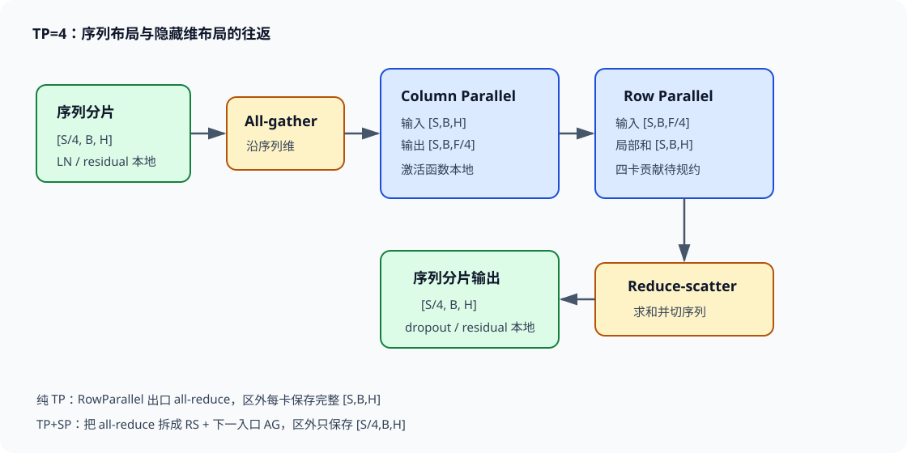

# 张量并行与序列并行

Tensor Parallelism（TP）把一个线性层的权重与 GEMM 放到多张 GPU 上。它解决的是“单层太宽”：隐藏维、FFN 中间维或词表矩阵无法由单卡高效保存和计算。切开矩阵以后，某些结果只是完整输出的一部分，某些结果则是对同一输出的局部贡献；前者可以继续送入匹配的分片算子，后者必须通过 collective 求和。通信位置由线性代数决定，不由框架命名决定。

Sequence Parallelism（SP）复用 TP 通信组，把 TP 区域外原本在每张卡复制的 token activation 沿序列维切分。Megatron-Core 的经典做法将纯 TP 的一次 all-reduce 拆成“进入列并行层前的 all-gather”和“离开行并行层后的 reduce-scatter”。传输量处于同一数量级，LayerNorm、dropout 与 residual 一类逐 token 操作的 activation 却可缩到 $1/T$。

*图 1：TP=4 时，activation 在序列分片布局与隐藏维分片布局之间切换。作者绘制。*

## 1. 从一个线性层的 shape 开始

令输入 $X\in\mathbb{R}^{N\times H}$，其中 $N=S\times B$ 表示本次 micro-batch 的 token 数，$H$ 是隐藏维。线性层权重按 PyTorch 习惯记为 $W\in\mathbb{R}^{K\times H}$，输出

$$
Y=XW^\top\in\mathbb{R}^{N\times K}.
$$

设 TP 规模为 $T$，并假设相关维度能够整除 $T$。列并行沿输出特征切权重：

$$
W=\begin{bmatrix}W_0\\W_1\\\cdots\\W_{T-1}\end{bmatrix},\qquad
W_r\in\mathbb{R}^{K/T\times H}.
$$

每个 rank 都读取完整 $X$，计算

$$
Y_r=XW_r^\top\in\mathbb{R}^{N\times K/T}.
$$

$Y_r$ 是完整输出沿末维的一段，不需要求和。能接收隐藏维分片的下一层可直接消费它；`gather_output=True` 或外部算子要求完整 $K$ 维时，才沿末维 all-gather。Megatron-Core 的 `ColumnParallelLinear` 实现了这套语义。

行并行沿输入特征切权重。把 $X=[X_0,\ldots,X_{T-1}]$，其中 $X_r\in\mathbb{R}^{N\times H/T}$，并把 $W=[W_0,\ldots,W_{T-1}]$，$W_r\in\mathbb{R}^{K\times H/T}$。本地 GEMM 得到

$$
Z_r=X_rW_r^\top\in\mathbb{R}^{N\times K}.
$$

每个 $Z_r$ 都具有完整输出 shape，却只包含输入维的一部分贡献：

$$
Y=\sum_{r=0}^{T-1}Z_r.
$$

因此 `RowParallelLinear` 的出口需要 all-reduce，或者在 SP 模式下用 reduce-scatter 同时求和并沿 token 维切开。bias 只能在规约后加一次；若每个 rank 在求和前都加完整 bias，最终会得到 $T$ 倍 bias。

## 2. 为什么列并行与行并行必须成对

单独使用列并行，输出 $Y_r$ 沿 hidden 维切开，后续普通线性层无法直接读取。Megatron 把两种切法配成一段：第一层 ColumnParallelLinear 产生分片 hidden，中间的逐元素激活函数在本地执行，第二层 RowParallelLinear 直接消费这份分片，并在出口把局部和规约成完整 hidden。中间没有 gather，通信只落在成对区域的边界。

以 MLP 为例，输入 shape 为 $[S,B,H]$，FFN 宽度为 $F$：

$$
[S,B,H]\xrightarrow{\text{column }W_1}
[S,B,F/T]\xrightarrow{\phi}
[S,B,F/T]\xrightarrow{\text{row }W_2}
[S,B,H].
$$

第一层权重从 $[F,H]$ 切成每卡 $[F/T,H]$，第二层从 $[H,F]$ 切成每卡 $[H,F/T]$。每卡参数和 GEMM FLOPs 都约为原来的 $1/T$。激活函数若是 SwiGLU，第一层通常一次产生 gate 与 value 两段，本地输出可写成 $[S,B,2F/T]$，分块原则不变。

Attention 也使用同一配对。QKV projection 是列并行，attention head 按 rank 分配；每卡保存一部分 query heads 以及相应 KV heads，局部完成 QK、softmax 和 PV。输出 projection 是行并行，把各 rank 的 head 输出映射为对完整 hidden 的局部贡献，然后在出口规约。对于 GQA，query head 数与 KV head 数不同，二者都要能按照配置映射到 TP rank；TP 大于 KV head 数时可能复制 KV 或采用更复杂分组，不能继续假设“每卡恰好若干完整 KV head”。

一个 pre-norm Transformer block 含两对边界：attention 的 QKV column → output row，以及 MLP 的 fc1 column → fc2 row。纯 TP forward 通常在两个 row-parallel 出口各发生一次 all-reduce；backward 中，与 column-parallel 输入对应的 dgrad 需要跨 TP rank 求和，因此又有两次规约。框架可能将通信做成异步或融合，但数学依赖仍在这些位置。

## 3. forward 与 backward 的共轭通信

列并行 forward 只计算本地输出 shard。反向时，权重梯度 $dW_r=dY_r^\top X$ 是本地权重对应的梯度，不需要在 TP 组求和；输入梯度则为

$$
dX=\sum_r dY_rW_r,
$$

每个 rank 只有一个局部贡献，所以 dgrad 需要 all-reduce。Megatron-Core 的线性 autograd 实现可异步发起这次 dgrad all-reduce，并与 weight-gradient GEMM 重叠；是否真正隐藏取决于 wgrad 计算窗口和通信对 HBM、计算资源的争用。

行并行 forward 的局部 $Z_r$ 必须 all-reduce。反向收到完整 $dY$ 后，本地输入梯度 $dX_r=dYW_r$ 已对应输入 shard，无须 TP 规约；本地权重梯度也只更新 $W_r$。于是 column 与 row 的通信方向互为镜像：一个在 backward 合并输入梯度，一个在 forward 合并输出部分和。

设边界 activation 含 $M=N H$ 个元素，每元素 $e$ byte。ring all-reduce 每 rank 的算法发送量近似

$$
B_{AR}=2\frac{T-1}{T}Me.
$$

其中 reduce-scatter 和 all-gather 两个阶段各发送 $(T-1)Me/T$。一个 Transformer block 的纯 TP 若 forward 两次、backward 两次同规模 all-reduce，每 rank 发送量约为

$$
B_{block}\approx 8\frac{T-1}{T}NHe.
$$

这是算法字节，未计协议、对齐和多 rail 路由。TP 增大时，每卡 GEMM 约按 $1/T$ 缩小，activation collective 的消息却趋近常数 $2NHe$；因此 TP 不能靠无限加卡线性扩展。

## 4. 一次可复算的 TP=4 MLP

取 $S=4096$、$B=2$、$H=8192$、$F=28672$、BF16，TP=4。token 数 $N=8192$。fc1 每卡权重 shape 为 $[7168,8192]$，约 58.7M 参数，即 117.4 MB；fc2 每卡为 $[8192,7168]$，同样约 117.4 MB。忽略门控倍数时，两层每卡约 234.9 MB，而未切分约 939.5 MB。

fc1 输出每卡 shape 为 $[8192,7168]$，BF16 约 117.4 MB；fc2 本地部分和 shape 为 $[8192,8192]$，约 134.2 MB。四卡 ring all-reduce 在 fc2 出口每 rank 发送

$$
2\times\frac34\times134.2\approx201.3\ \text{MB}.
$$

若有效 collective 带宽为 150 GB/s，纯带宽下界约 1.34 ms。fc2 每卡 GEMM 约含 $2N(F/T)H\approx0.96$ TFLOP；实测 300 TFLOP/s 时约 3.2 ms。通信相当于本地 GEMM 时间的四成，并且位于后继 residual 所需结果之前。TP=8 会把 GEMM 再减半，而 all-reduce 字节只从系数 $3/4$ 增到 $7/8$；若没有更高带宽或更好的重叠，扩展效率会明显下降。

Attention 的消息仍由 $N\times H$ 边界决定，但本地 attention 计算还随序列平方项变化。长序列时 attention FLOPs 提供更大的通信遮蔽窗口；小 batch、短序列或 decode 阶段的 GEMM 很小，collective 启动延迟更突出。同一个 TP 度数在预训练与低 batch 推理中可能得到完全不同的效率。

## 5. SP 把复制 activation 改成序列 shard

纯 TP 的 LayerNorm、dropout、residual 等区域通常在每个 TP rank 上保存完整 $[S,B,H]$ activation。这些算子逐 token 工作，并不需要每张卡同时拥有所有 token。SP 把区域外布局改为

$$
X_r^{SP}\in\mathbb{R}^{S/T\times B\times H}.
$$

进入 column-parallel 层前，沿第 0 维 all-gather，恢复 $[S,B,H]$，随后各 rank 计算自己的 hidden shard $[S,B,K/T]$。row-parallel 层产生 $[S,B,H]$ 的局部部分和后，不做完整 all-reduce，而是 reduce-scatter 到序列维，直接得到下一段逐 token 区域需要的 $[S/T,B,H]$。

all-reduce 可以理解为 reduce-scatter 后接 all-gather。纯 TP 在 row 出口支付两阶段；TP+SP 把 reduce-scatter 留在出口，把 all-gather 移到下一次进入 TP 区的位置。稳态下算法传输量没有凭空消失，却让两个边界之间的 LayerNorm、dropout、residual 输入和其保存的 activation 只驻留 $1/T$ token。

仍取 $[4096,2,8192]$ BF16，完整 activation 为 134.2 MB。TP=4 的 SP shard 为 33.6 MB，每卡少保存约 100.7 MB。一个 block 若有多份需要保留到 backward 的 norm 输入、dropout mask 与 residual，中间状态收益会叠加。Megatron 的常用 activation 估算中，开启 TP 而不开 SP 时，未被 TP 切分的项仍复制；TP+SP 才能让这些线性于 $SBH$ 的项也近似除以 $T$。

SP 不等于 Context Parallelism。经典 SP 主要切开 Transformer 层中逐 token 区域，进入 attention/MLP 的 TP 线性区域仍会 all-gather token。CP 则让网络输入和更广泛的 activation 始终按上下文切分，并专门处理 attention 对全局 KV 的依赖。看到“都沿序列维切”不能据此混用两套通信模型。

## 6. TP+SP 的完整时序

以 MLP 为例，forward 从序列 shard 开始。LayerNorm 在本地 $S/T$ 个 token 上计算；进入 fc1 时 all-gather 序列，形成完整 token、完整 hidden 的输入；ColumnParallelLinear 输出完整 token、$F/T$ hidden；激活函数本地执行；RowParallelLinear 产生完整 token、完整 $H$ 的局部和；reduce-scatter 求和并只留下 $S/T$ token；dropout 与 residual 在序列 shard 上完成。

backward 方向相反。来自 residual 区域的梯度最初按序列切分。为计算 row-parallel 的权重梯度和输入梯度，需要与 forward 保存布局匹配；通信/autograd 映射把相应梯度聚合到 TP 区。穿过 row 与 column GEMM 后，column 输入的 dgrad 不再做完整 all-reduce，而以 reduce-scatter 回到序列布局。Megatron-Core `LinearWithGradAccumulationAndAsyncCommunication` 的当前语义明确写出：`sequence_parallel=True` 时，forward all-gather 输入，backward reduce-scatter 输入梯度，`allreduce_dgrad` 必须关闭。

通信能否异步重叠还受环境和调度约束。wgrad GEMM 必须足够长，dgrad collective 才有隐藏窗口；多个通信流同时争用链路时，单项 microbenchmark 带宽不能直接代入。检查 timeline 时，要把序列 all-gather、row 出口 reduce-scatter、dgrad reduce-scatter和 DP 梯度同步区分开，它们属于不同 process group 或依赖位置。

## 7. 与数据并行组合：两个 group 不做同一件事

总 GPU 数可写成 $W=D\times T$。TP group 内各 rank 处理同一批 token 的不同权重 shard；DP group 内各 rank 拥有相同 TP 坐标的模型 shard，却读取不同样本。TP collective 传 activation，频率达到每层多次；DP collective 传参数梯度，通常按 bucket 在 backward 规约。

以 32 卡、TP=4、DP=8 为例，可把每台四卡节点组成 TP group，八个节点上相同 local rank 组成 DP group。fc1 的每个 TP shard 在八个 DP 副本上重复，DP 只对相同 shard 的梯度 all-reduce 或 reduce-scatter。若误把不同 TP 坐标放入一个 DP bucket，tensor shape 可能相同，语义却是不同权重片段，训练会静默损坏。

TP 通常留在 NVLink/NVSwitch 等 scale-up 域，因为通信逐层、在关键路径上。DP 可以跨节点，梯度 bucket 更容易与 backward 重叠。这个规则仍需服从容量：单节点放不下目标 TP group 时必须跨节点，但要用真实消息大小测 all-reduce 曲线，再把裸露延迟乘以层数。

DP 与 TP 的随机性也不同。dropout 在 TP/SP 布局下要保证逻辑 activation 对应正确随机流；参数初始化要让各 TP shard 拼接后等价于目标完整矩阵。数值单测可在 TP=1 与 TP=2 间比较完整 gather 后的 forward、输入梯度和权重更新，并固定 dropout 或使用模型并行随机数 tracker。

## 8. 性能与数值边界

hidden 或 FFN 维不能被 TP 整除时，需要 padding、不均匀 shard 或降低 TP；padding 会增加无效 FLOPs，非均匀 shard 会产生 straggler。attention head、KV head、词表 shard 也有各自整除约束。SP 还要求被切的第一维能够按 TP 组分配；变长序列打包时应核对实际 flattened token 数与 padding。

TP 过大会把 GEMM 变窄。$[N,H]\times[H,F/T]$ 中的 $F/T$ 太小时，Tensor Core tile 利用、kernel occupancy 和融合机会都会下降。此时显存仍在下降，token/s 却可能变差。选择 TP 的优先目标是让单层和模型状态放得下，然后在候选值上实测；剩余 GPU 更适合增加 DP 或 PP，而非继续切窄单层。

规约顺序会造成浮点差异。TP=1 与 TP=8 的求和树不同，BF16/FP16 下不应要求位级一致，但误差应处于设定容差内，loss 轨迹和梯度范数不能系统漂移。bias 重复相加、dgrad 少规约一次、SP reduce-scatter 又除一次 $T$，都会产生远大于正常舍入的固定比例误差。

通信 hang 常来自 group 或执行顺序不一致。动态分支使部分 rank 跳过 TP 层时，其他 rank 会停在 collective；错误的 rank 映射还可能把 shape 相同的不同样本混到一起。启动产物应保存 DP/TP group 成员、物理主机与设备映射。故障日志记录每个 rank 最近进入的 collective 和 tensor shape，定位信息比单独的超时堆栈完整。

## 9. 端到端选择案例

考虑 32 层、$H=8192$、$F=28672$ 的 dense 模型，micro-batch 有 8192 token。单 block 两个主要 TP 边界均传输 134.2 MB BF16 activation。TP=4 时，一次 ring all-reduce 每 rank 发送约 201.3 MB；forward 与 backward 合计四次，约 805 MB/block，32 层约 25.8 GB/step。200 GB/s 理想下界约 129 ms，实际还要加入启动延迟、竞争和无法重叠的尾部。

若 TP=8，每卡线性计算近似再减半，每次 all-reduce 发送约 $2\times7/8\times134.2=234.9$ MB，整模型约 30.1 GB/step。通信字节反而增加约 17%，同时 GEMM 变窄。只有 TP=4 仍放不下、TP=8 落在更快拓扑或额外显存能显著增大 micro-batch 时，增加 TP 才可能提高端到端吞吐。

开启 SP 后，上述 all-reduce 被边界上的 all-gather 与 reduce-scatter重新安排，算法字节近似不变。假设每层可分片保存的逐 token activation 原为 600 MB，TP=4 后每卡约 150 MB，每层省 450 MB；32 层理论上减少 14.4 GB，实际值还取决于 selective recompute、融合 kernel 保存哪些张量。省出的容量若把 micro-batch 从 1 提到 2，GEMM 效率和通信摊销都可能改善，这才是 SP 对吞吐的间接收益。

配置验收要同时给出四组数字：每卡权重/optimizer/activation 峰值，逐层 TP collective 字节与裸露时间，GEMM shape 与实际吞吐，以及相同 global batch 下的 loss/梯度一致性。只看到显存下降或 NCCL 带宽很高，都不足以证明模型并行方案有效。

## 10. 词表并行避免在模型两端聚合巨型矩阵

输入 embedding 权重 $E\in\mathbb{R}^{V\times H}$ 可沿词表维切成 $T$ 份。rank $r$ 只保存词表区间 $[v_r,v_{r+1})$；输入 token 不在本地区间时，本地 lookup 输出置零，TP all-reduce 后得到正确 embedding。也可以借助后续布局减少独立通信，但所有 rank 必须对 token 到词表 shard 的映射一致。

输出 logits 使用同一份或同形状权重时，每个 rank 只生成 $[N,V/T]$ logits。直接 all-gather 会物化完整 $[N,V]$，大词表下代价很高。Vocab-parallel cross entropy 通过全局 maximum、指数和及目标 token 对应 logit 的规约计算 loss，不必拼出完整 logits。设 $V=128000$、$N=8192$、BF16，完整 logits 约 2.10 GB；TP=8 后每卡局部 logits 约 262 MB。若为了 loss 做完整 all-gather，每 rank ring 发送约 1.84 GB，还要承受 2.10 GB 峰值。分布式交叉熵只规约每 token 的少量统计量，通信从与 $NV$ 成正比降到与 $N$ 成正比。

词表不能整除 TP 时通常 padding 到可分割大小。$V=128003$、TP=8 至少补到 128008，只增加 5 行，影响很小；某些 kernel 还要求更大的对齐倍数，padding 行就必须在采样和 loss 中屏蔽。权重 tying 要保证输入 embedding 和输出 projection 使用同一分片规则，否则保存加载后可能得到两份不再共享的参数。

## 11. Activation 显存为何不是简单除以 TP

TP 只天然缩小沿 hidden/head 切开的中间量。ColumnParallel 输出、QKV、attention head 中间值与 FFN 激活可以近似除以 $T$；LayerNorm 输入、residual、dropout 输入等位于 TP 区外，在纯 TP 下仍以完整 $[S,B,H]$ 复制。把所有 activation 粗暴写成 $M/T$ 会高估收益。

可以把每层保存量拆成

$$
M_{act}^{TP}=M_{sharded}/T+M_{replicated}.
$$

SP 把逐 token 的复制项也按序列切开，近似变为

$$
M_{act}^{TP+SP}=M_{sharded}/T+M_{replicated}/T,
$$

但 attention score、FlashAttention 保存状态、选择性重算与融合算子的实际保存张量还要按实现核对。假设每层可切 hidden 的 activation 为 480 MB，TP 外复制项为 320 MB。TP=4 后每卡为 $480/4+320=440$ MB，只降到原来的 55%；加 SP 后为 $480/4+320/4=200$ MB，才达到四分之一。32 层在不重算的粗略账本中相差 7.68 GB。

Dropout mask 可能按 bit、byte 或融合 kernel 内部状态保存，LayerNorm 也可能只留输入与统计量。可靠方法是按 autograd saved tensor 或 kernel 文档列项，再用峰值采样验证。SP 的“约除以 $T$”描述的是序列可分片项，不能覆盖 allocator workspace、参数、KV cache 或不按序列切分的全局状态。

## 12. All-gather 与 reduce-scatter 的 buffer 也占峰值

进入 ColumnParallel 前的序列 all-gather 需要接收完整输入 buffer。本地 33.6 MB shard 在 TP=4 聚合成 134.2 MB；若实现保留本地输入并另分配输出，聚合时两者合计约 167.8 MB。全局 memory buffer 能减少反复分配，却不会让物理存储消失。并发预取下一组输入时，峰值还要加入第二个完整 buffer。

RowParallel 出口的 reduce-scatter 输入是 134.2 MB 局部部分和，输出为 33.6 MB 序列 shard。通信库采用独立输入/输出时，该边界至少短暂占 167.8 MB；若 residual 的旧 shard、bias/dropout 融合 workspace 同时存活，实际更高。显存公式应写为

$$
M_{peak}=M_{saved}+M_{AG,inflight}+M_{RS,inflight}+M_{workspace}+M_{frag},
$$

而非只计算长期 SP shard。

预分配全局 buffer 还会让 `reserved` 长期不降。判断泄漏时要区分张量逻辑存活量与 allocator 保留量：迭代间 `allocated` 稳定、`reserved` 固定在历史峰值通常是复用；`allocated` 每步增长才表明引用或执行图没有释放。

## 13. 拓扑决定 TP 的实际边界

TP 的每层 collective 对延迟敏感，常映射到单机高速域。八卡节点上 TP=4 有两种常见放置：每机两个独立 TP group，或者一个 TP group 跨两台机器。前者可以让 134.2 MB activation 走 NVLink/NVSwitch，后者至少有部分流量经过 NIC。若机内有效带宽 200 GB/s、机间 25 GB/s，同一 201.3 MB ring all-reduce 的带宽下界分别约 1.0 ms 与 8.1 ms。32 层、每步四次边界通信时，未重叠差距可超过 0.9 秒。

链路带宽不是唯一因素。小消息受 collective 启动、PCIe/NIC 路由和 rank 到设备映射影响；大消息可能受多条通信同时争用。基准应覆盖正文实际的 32 MB、128 MB、512 MB 等消息，并使用相同 process group 与并发背景。单独运行 NCCL test 得到的峰值带宽，只能作为无争用上界。

TP 与 DP 同时通信时，要检查 group 是否共用 NIC。Backward 中 column dgrad collective 与 DP 梯度 bucket 可能重叠；两者各自在独立测试中达到 80% 链路带宽，并发时总带宽不会变成 160%。timeline 中 kernel 重叠却 step 变慢，常见原因就是链路或 HBM 争用，而非异步 API 失效。

## 14. 数值单测从小矩阵证明分块正确

使用 $N=4,H=8,K=12,T=2$ 的 FP64 小矩阵，可以精确验证两类分块。先计算单卡 $Y=XW^\top+b$。列并行将 $W$ 切成两个 $[6,8]$，本地输出拼接后必须逐元素等于 $Y$；行并行把 $X$ 切成两个 $[4,4]$，权重切成两个 $[12,4]$，本地部分和相加后再加一次 bias，同样应等于 $Y$。

反向给定固定 $dY$，比较完整 $dX,dW,db$。列并行的两个 $dX$ 局部贡献求和，行并行的 $dX$ 直接拼接。把 bias 故意放在行并行规约前，测试会得到 $T b$；关闭 column dgrad all-reduce，$dX$ 会只剩一个权重 shard 的贡献。这些故障的误差远大于低精度舍入，适合做持续集成。

SP 测试先把 $X$ 沿第 0 维切分，执行 all-gather → column → row → reduce-scatter，再把输出 shard gather，与纯 TP 输出比较。Backward 同样比较输入梯度 shard。随后加入 dropout，使用能按全局 token 和 hidden 坐标复现的随机流，验证改变 TP 后 mask 的逻辑对应关系。若项目只要求统计等价而非位级复现，也要显式记录标准。

## 15. 从 profiler 还原一个 block

正常的纯 TP forward 在 attention output projection 与 MLP fc2 后看到 all-reduce；backward 在对应 column-parallel 输入梯度处看到规约。TP+SP 则出现进入 column 前的序列 all-gather，以及 row 出口的 reduce-scatter。collective 次数翻倍不必然说明通信量翻倍，因为一轮 all-reduce本来就由 reduce-scatter 与 all-gather 两阶段组成。

profile 需要同时标注 tensor shape、group id 和依赖流。某次 all-gather 晚发起，可能是 CPU hook 调度或前序 LayerNorm 未结束；已发起却未完成，可能是链路争用或某 rank 晚到；完成后 GEMM 仍等待，可能是 stream event 没有正确连接。只看 NCCL kernel 时长无法区分三者。

在每个边界采样 activation checksum 能发现静默 group 错误。TP rank 拼接后的 column 输出与单卡基线一致，row 输出规约后也一致；进入下一 block 的 SP shard 应按全局 token offset 对应。shape 相同并不能证明数据正确，尤其是 packed sequence 或 rank 重排之后。

## 16. 官方实现术语对应

| 数学对象 | Megatron-Core 入口 | 关键语义 |
| --- | --- | --- |
| 输出特征分片 $W_r$ | `ColumnParallelLinear` | forward 本地输出；backward 合并 dgrad |
| 输入特征分片 $W_r$ | `RowParallelLinear` | forward 合并局部和；backward 输出本地 dgrad shard |
| 序列聚合 | `gather_from_sequence_parallel_region` | forward 沿第 0 维 all-gather |
| 序列规约分片 | `reduce_scatter_to_sequence_parallel_region` | 求和并沿第 0 维留下本地 token |
| 词表分片 | `VocabParallelEmbedding`、vocab-parallel cross entropy | 避免完整 embedding/logits 常驻 |
| dgrad 通信重叠 | `LinearWithGradAccumulationAndAsyncCommunication` | collective 与 wgrad GEMM 调度 |

源码与文档版本可能改变函数参数、融合路径和 Transformer Engine 后端，矩阵分块语义不会随名称变化。升级时先核对本地输入输出 shape、collective 映射和 checkpoint shard 元数据，再比较性能开关。

## 17. 用计算—通信比判断 TP 上限

线性层本地计算约为 $2NHK/T$ FLOP，边界 all-reduce 字节约为 $2(T-1)NKe/T$；忽略常数差异后，计算—通信比随输入维 $H$ 增大，随 TP 规模增大而下降。宽模型更能用大 GEMM 覆盖通信，小模型或大 TP 则更快进入带宽、延迟主导区。

取 $H=8192$、BF16、单卡有效算力 300 TFLOP/s、collective 有效带宽 150 GB/s。每处理一个输出元素，本地 GEMM 在 TP=4 下约做 $2H/T=4096$ FLOP，而 all-reduce 平均传输约 $2(T-1)e/T=3$ byte，算术强度约 1365 FLOP/byte。TP=8 时本地计算减半，传输系数升至 3.5 byte，约 585 FLOP/byte。硬件没有改变，通信相对权重已经增加一倍以上。

实际拐点还受 kernel shape 与 overlap 影响。候选 TP 值应分别记录本地 GEMM 时间、collective 独占时间和依赖边裸露时间。若 TP 从 4 增到 8 后 GEMM 节省 1.6 ms，collective 裸露却增加 2.3 ms，更多设备只换来了更低单卡利用率。容量必须用 TP=8 时可以接受这笔代价；容量已有余量时，TP=4 更合理。

## 18. 配置落地前的可复算记录

训练配置至少保存 $S,B,H,F$、attention/Q/KV head 数、词表大小、dtype 与 TP/SP 开关。每个并行线性层记录本地权重、输入和输出 shape；每个 collective 记录类型、元素数、group size 与所在链路。这样可以从配置重新得到参数字节、activation 字节和 ring 通信下界。

性能记录还应包含各 GEMM 的实际 TFLOP/s、collective 的 p50/p95、通信与计算重叠后的 exposed time、每卡 allocated/reserved 峰值。数值记录包含 TP=1 对照 loss、输入梯度、权重梯度与一步更新误差。checkpoint 则验证 TP 度数改变后的重分片和 tied weight。

矩阵 shape 用于解释计算效率，元素数用于复算通信字节，时间线给出裸露延迟，saved tensor 对应 activation 峰值，数值对照确认分块没有改变训练语义。某项实测与推导差距很大时，可沿对应记录定位，避免把不同原因都归到“TP 开销”。

通信复算还要统一 GB 与 GiB。134.2 MB 若指十进制字节，在 150 GB/s 下约 0.895 ms；若实际 profiler 按 MiB 报告，134.2 MiB 等于约 140.7 MB，下界约 0.938 ms。单次差异很小，乘上几十层与多次 collective 后会积累。实验表应同时保存原始元素数与 dtype，展示单位只作为派生结果。

同一原则也适用于有效带宽。ring 公式得到的是每 rank 算法发送量，不能再把收发各算一遍；链路工具若报告双向聚合带宽，则需先换回与公式一致的口径。单位和带宽定义统一后，预测值与 profiler 才能直接比较。

## 参考资料

- [Megatron-Core Parallelism Strategies Guide](https://docs.nvidia.com/megatron-core/developer-guide/latest/user-guide/parallelism-guide.html)
- [Megatron-Core Tensor Parallel Layers API](https://docs.nvidia.com/megatron-core/developer-guide/latest/apidocs/core/core.tensor_parallel.layers.html)
- [Megatron-Core Tensor Parallel Mappings API](https://docs.nvidia.com/megatron-core/developer-guide/latest/apidocs/core/core.tensor_parallel.mappings.html)
- [Megatron-LM `tensor_parallel/layers.py`](https://github.com/NVIDIA/Megatron-LM/blob/main/megatron/core/tensor_parallel/layers.py)
- [Reducing Activation Recomputation in Large Transformer Models](https://arxiv.org/abs/2205.05198)
