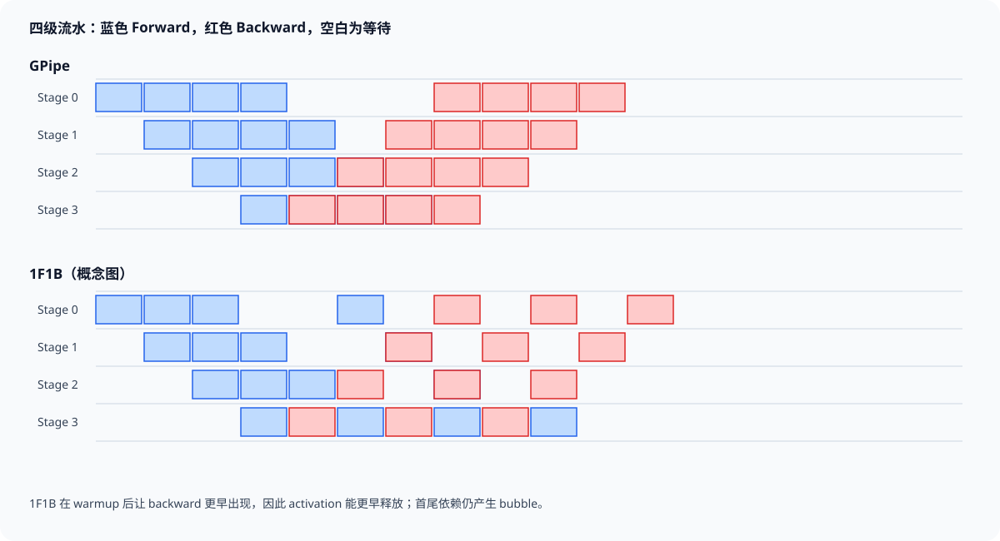

# 流水线并行

Pipeline Parallelism（PP）把连续层分配到多个 stage。一次 microbatch 的 activation 从 stage 0 逐段传到末端，loss 的梯度再沿相反方向返回。每张 GPU 只保存本 stage 的参数与 optimizer state，整个模型因此能跨设备展开；代价是后续 stage 必须等待前序 activation，前序 stage 的 backward 又必须等待后序梯度，依赖链中自然出现空闲区间。

流水调度要回答三个具体问题：每个时刻执行哪个 microbatch 的 forward 或 backward；forward 保存的 activation 要等多久才被 backward 消费；相邻 stage 的 send/recv 是否与计算重叠。GPipe、1F1B 与 interleaved 1F1B 都不改变模型数学，只改变这些事件的排列。Zero-Bubble 和 DualPipe 进一步拆分 backward 或安排双向流水，适用前提与实现来源需要单独说明。

*图 1：四个物理 stage、八个 microbatch 的概念时序。色块表示计算，空白区域为填充、排空或依赖等待。作者绘制。*

## 1. Stage 切分与 P2P 张量

设模型有 $L$ 层，分为 $P$ 个 stage。最简单的均匀切分让每个 stage 持有约 $L/P$ 层，但训练时间不只由层数决定。Embedding、词表输出、attention、dense MLP、MoE 层和多模态编码器的计算与 activation 大小不同；一个慢 stage 会把间隔传播给整条流水。

stage $p$ 完成 forward 后，将边界 activation 发给 $p+1$。反向时，$p+1$ 把该 activation 的梯度发回 $p$。若边界 Tensor shape 为 $[S,B_\mu,H]$，元素宽度为 $e$ byte，单方向消息量为

$$
B_{p2p}=SB_\mu He.
$$

$S=4096$、micro-batch size $B_\mu=1$、$H=8192$、BF16 时，每条消息约 67.1 MB；forward 与 backward 各一次，单 microbatch 每个边界传约 134.2 MB。八个 microbatch 在同一边界累计约 1.07 GB。若开启 SP，Megatron-Core 调度代码会按 TP size 调整 pipeline Tensor 的 sequence 维，边界消息可能变成 $S/T$；实际 shape 必须以 schedule 传给 P2P communicator 的 Tensor 为准。

P2P 不代表通信可忽略。`send_forward_recv_forward`、`send_backward_recv_backward` 或双向组合原语负责相邻 stage 的发送接收；计算流在消费收到的 Tensor 前必须等待通信完成。消息 shape、dtype 或发送顺序不一致时，轻则浪费 padding，重则 collective/P2P 永久等待。

## 2. GPipe：先灌满 forward，再整体 backward

GPipe 把 global batch 分成 $M$ 个 microbatch。所有 stage 先完成这 $M$ 个 forward，再按相反顺序执行 backward。以计算时长相同的理想 stage 为单位，forward 填充需要 $P-1$ 个时隙，backward 排空又有 $P-1$ 个时隙。一次迭代的有用计算为 $2M$ 个时隙，总时长为

$$
T_{GPipe}=2(M+P-1)t,
$$

其中 $t$ 是一个 stage 对一个 microbatch 执行一次 forward 或 backward 的简化时间。bubble 比例为

$$
\beta_{GPipe}=\frac{2(P-1)}{2(M+P-1)}=\frac{P-1}{M+P-1}.
$$

四个 stage、八个 microbatch 时，bubble 为 $3/(8+3)=27.3\%$；$M=32$ 时降为 $8.6\%$。增大 microbatch 数能摊薄填充与排空，却会减小单个 microbatch 的 batch size，或扩大一次 optimizer step 的 global batch/梯度累积次数，二者都会影响 GEMM 效率或优化语义。

GPipe 的主要显存压力来自 activation。stage 0 在进入 backward 前已经为 $M$ 个 microbatch 完成 forward，因此可能同时保留 $M$ 份本 stage 的保存张量。若每个 microbatch 本 stage 保存 2.5 GB，$M=8$ 就需要约 20 GB；$M=32$ 则达到 80 GB。Activation checkpoint 能降低每份大小，但会在 backward 增加重算。

## 3. 1F1B：用 backward 尽早回收 activation

非交错 1F1B 包含 warmup、steady 和 cooldown。stage 先执行一段 forward 填充流水，稳定期交替处理 forward 与 backward，排空阶段完成剩余 backward。Megatron-Core 当前官方 `forward_backward_pipelining_without_interleaving` 实现这类 schedule。

对 pipeline rank $p$，warmup forward 数常与它到末端的距离相关：靠近输入侧的 stage 需要先送出更多 microbatch，靠近输出侧的 stage 更早拿到 loss 并开始 backward。稳定期完成 microbatch $i$ 的 backward 后，对应 activation 即可释放，而 GPipe 要等所有 forward 结束才开始回收。

理想计算均衡且 forward/backward 等长时，非交错 1F1B 的基础 bubble 仍约为

$$
\beta_{1F1B}\approx\frac{P-1}{M+P-1}.
$$

它的主要收益是显存，而非自动消除填充与排空气泡。每个 stage 的在途 activation 数从最坏 $M$ 份降到与 pipeline 深度相关的数量。四级流水中，stage 0 通常保留较多 warmup microbatch，末端较少；精确值还受 schedule、通信重叠与 checkpoint 策略影响。

取 $P=4,M=8$，stage 0 warmup 约需 3 个以上 forward 才能收到首个 backward 的依赖，稳定期随后交替 F/B。若单份保存 activation 为 2.5 GB，峰值可能从 GPipe 的 20 GB 降到约 10 GB 量级，而非固定降为一份。调度表与内存时间线要一起查看，不能把“1F1B”理解成始终只活跃一个 microbatch。

## 4. Interleaved 1F1B 与 virtual stage

Interleaved schedule 把每个物理 stage 的层再分成 $V$ 个 model chunk，也称 virtual pipeline stage。同一 GPU 不再只处理一段连续层，而是持有沿深度分散的多个 chunk。例如 $P=4,V=2$ 时，逻辑上形成 8 个 chunk，物理 rank 0 可能持有 chunk 0 与 4，rank 1 持有 1 与 5，以此类推。

更细的逻辑 stage 缩短单个流水时隙，并让物理 GPU 在等待某个 chunk 的依赖时执行另一个 chunk。理想 bubble 可近似缩小到

$$
\beta_{interleaved}\approx\frac{P-1}{MV+P-1},
$$

或理解为 bubble 时长按 $V$ 缩短；精确值取决于 microbatch grouping 和 schedule table。$P=4,M=8,V=2$ 的粗略比例为 $3/(16+3)=15.8\%$，低于非交错的 27.3%。

代价是 P2P 次数增加。原来一个 microbatch 穿过 $P-1$ 个物理边界；chunk 交错后，逻辑 chunk 之间更频繁地跨 rank，某些返回同一物理设备的边也要调度数据或保持引用。virtual stage 还增加模型 chunk、数据 iterator、activation buffer 与 forward/backward 次序管理。Megatron-Core 官方 `forward_backward_pipelining_with_interleaving` 接收 model 列表，并通过 schedule table 将 microbatch id 与 model chunk id 映射到执行顺序。

V 也不能无限增大。chunk 太细会让单次计算变短，P2P 启动延迟与 CPU 调度占比上升；同一 GPU 保存多个 chunk 参数可能导致局部显存布局与 cache 行为变化。选择 $V$ 时应同时测 bubble、P2P 调用数、单 chunk kernel 时间和 activation 峰值。

## 5. Activation 驻留量沿时间线计算

一个 stage 的 activation 峰值可写为

$$
M_{act,peak}=\max_t\sum_{m\in\mathcal{L}(t)}A_{p,m},
$$

$\mathcal{L}(t)$ 是时刻 $t$ 已完成 forward、尚未完成 backward 的 microbatch 集合，$A_{p,m}$ 是 stage $p$ 为 microbatch $m$ 保存的张量。调度只改变集合的大小和存活区间；checkpoint、SP/CP 与算子融合改变单份 $A_{p,m}$。

假设八层 stage 对每 microbatch 原本保存 3.2 GB。选择性重算把它降到 1.4 GB，1F1B 的最大在途数为 5，则 activation 峰值约 7 GB。若换 GPipe、$M=16$，峰值约 22.4 GB。若 interleaved 让同一物理 rank 的两个 chunk 各有 3 份在途 activation，每份 0.8 GB，总计 4.8 GB；不能只取单 chunk 的 2.4 GB。

Megatron-Core 可在发送后伪释放 pipeline output 的 `.data`，保留 backward 所需的 `grad_fn`，减少边界 Tensor 的存储。该优化不等于释放层内 saved tensors；后者仍要等 backward 或由 checkpoint 重算。Profiler 中 allocated 下降而 reserved 不降，通常表示 allocator 保留了可复用块。

## 6. Stage 不平衡会把局部慢放大为全局 bubble

理想公式假设所有 stage 的时长都是 $t$。实际令 forward/backward 时长为 $t_{p}^{F},t_{p}^{B}$，稳定吞吐受最慢节拍控制：

$$
t_{cycle}\gtrsim\max_p(t_p^F+t_p^B+t_p^{comm}).
$$

四个 stage 的每 microbatch总时长若分别为 18、21、35、20 ms，第三个 stage 让其他 stage 每周期产生约 14—17 ms 等待。增加 microbatch 只能摊薄首尾 bubble，无法消除稳定期的结构性失衡。

参数量平均并不能保证时间平均。词表投影可能参数多且通信大，FlashAttention 随序列长度变化，MoE 层取决于 token 路由，embedding stage 还有数据输入。切分前要得到逐层 forward/backward 时间、activation 边界字节和峰值显存，再用这些权重划分连续层；必要时为特殊层单独调整 stage 边界或使用不均匀 layout。

Straggler 还可能随 step 变化。某个 rank 因降频、NIC 争用或 MoE 负载偏斜晚到，后续 stage 等不到 activation，前序 stage 又可能因 send buffer 或反向依赖停住。应分别记录每个 stage 的 compute、send/recv wait 与空闲区间；只看全局 step time 无法区分固定失衡和偶发慢节点。

## 7. 通信重叠与死锁边界

P2P 可以与相邻 microbatch 的计算重叠。例如 stage 1 计算 microbatch 3 forward 时，通信流发送 microbatch 2 的输出；稳定期还可能同时接收另一方向的梯度。重叠需要独立 buffer、stream event 和一致的 send/recv 顺序。链路与 GEMM 争用 HBM 或 PCIe 时，时间线重叠不保证同等加速。

取边界 activation 67.1 MB，机间有效带宽 25 GB/s，单向下界约 2.68 ms。stage 计算 20 ms 时理论上容易隐藏；virtual chunk 缩到 4 ms 后，通信已经占窗口的三分之二。若 forward send 与 backward recv 同时共享一张 NIC，两个方向的实际带宽还要按硬件双向能力和拓扑重算。

死锁常来自不同 rank 采用不同事件顺序。rank 0 先 send-forward，rank 1 却先等待 backward recv；或者变长序列让发送与接收 shape 不同，都可能永久等待。调试日志应包含 step、microbatch、model chunk、方向、peer、shape、dtype 与通信开始/完成事件。Megatron-Core 的 schedule 以统一表驱动执行，用户自定义分支仍必须确保各 pipeline rank 对 microbatch 数与 forward-only 状态达成一致。

## 8. 与 TP、DP 组合后的 3D 坐标

总设备数可写成 $W=D\times P\times T$。同一 TP group 共同执行一个 stage 的层内矩阵；同一 PP group 串联不同深度；同一 DP group 持有相同 PP/TP 坐标的参数 shard并处理不同数据。三类通信分别主要承载 activation collective、stage P2P 与参数梯度规约。

64 卡取 TP=4、PP=4、DP=4 时，每个 pipeline stage 是四卡 TP 组，四个 stage 串成一份模型，再复制四份。pipeline 边界 Tensor 在启用 SP 后可能以 sequence shard 发送；DP bucket 只同步相同 stage、相同 TP shard 的权重梯度。进程组映射错误即使 shape 相同，也会把不同层或不同 shard 的梯度混合。

拓扑通常把 TP 放在节点内，PP 沿相邻节点连接，DP 跨模型副本。若每节点八卡，可在节点内放两个 TP=4 stage，减少部分 PP 跨节点消息；也可让一个 stage占半节点并把相邻 stage 放在同机。最优排列取决于 TP collective 频率、PP 边界大小和 NIC 数量，必须画出 group 到 GPU/NIC 的映射。

DP 梯度同步可与 backward 重叠，但 1F1B 会让不同 stage 在不同时间生成 bucket。某 stage 的末尾 DP bucket 未完成时，optimizer step 仍要等待。PP 把参数分散后，每个 DP rank 的 bucket 总量下降，却增加跨 stage 的同步尾部差异；profile 要按 stage 查看 DP exposed tail。

## 9. Zero-Bubble 的 W 与 B 拆分

普通 backward 可以拆成输入梯度计算 $B$（backpropagation for input）与权重梯度计算 $W$。$B$ 产生前一 stage 所需的 activation gradient，处在跨 stage 关键路径；$W$ 只更新本 stage 权重，对前一 stage 的 backward 依赖较弱。Zero Bubble Pipeline Parallelism 论文利用这一差别，优先调度 $B$ 继续推动反向波，空隙中再放入 $W$，从而填充传统 1F1B 的 bubble。

这类调度要求实现能分离 dgrad 与 wgrad kernel，管理更复杂的 activation/gradient 生命周期，并处理 optimizer 与梯度累积边界。理论“zero bubble”还依赖 stage 平衡、足够 microbatch、通信可重叠和调度内存预算；P2P、straggler 与不可拆 kernel 仍会产生空闲。

Megatron-Core 官方稳定文档明确提供非交错与 interleaved pipeline schedules；当前代码还包含面向特定通信重叠的 combined 1F1B 路径。Zero-Bubble 的完整调度语义应以其论文与对应实现为准，不能因为概念相近就视为标准 1F1B 的一个默认参数。

## 10. DualPipe 的双向流水边界

DualPipe 随 DeepSeek-V3 技术报告受到关注。它从 pipeline 两端同时注入 microbatch，使同一设备可交错处理来自两个方向的 forward/backward，目标是增加计算与通信重叠并减少 bubble。双向调度尤其需要明确模型 chunk 的放置、两个方向的 activation buffer、通信 peer 与冲突处理。

DualPipe 并非 Megatron-Core 官方 `forward_backward_pipelining_with_interleaving` 的同义词。后者是 virtual stage 上的 interleaved 1F1B；DualPipe 的具体 schedule 与通信重叠来自 DeepSeek 报告和其公开实现语境。将其落到其他框架时，要重新验证算子拆分、MoE 通信、拓扑与显存，而不能直接套用论文 bubble 数字。

双向流水的收益也受边界大小限制。两股 activation/gradient 流若共享同一 NIC，计算重叠增加的同时可能扩大网络排队；同一 GPU 上两个方向的 live activation 会增加峰值。评估应同时报告 bubble、P2P p95、在途 buffer 数和每卡峰值。

## 11. Checkpoint 与故障恢复

PP checkpoint 的每个 shard必须带全局参数名、所属 layer、pipeline rank、TP shard offset 和 optimizer state。只按本地 module 顺序保存，改变 PP size 或 layer layout 后无法判断参数应落到哪个新 stage。Distributed checkpoint 可让各 rank 并行写分片，并在加载时按全局元数据重新切分。

例如 40 层模型从 PP=4（每 stage 十层）恢复到 PP=5（每 stage 八层），第 8、9 层会从旧 rank 0 移到新 rank 1。参数、Adam moments、step 与 tied embedding 都要同步迁移。只成功加载参数而漏掉 optimizer state，会在恢复后的首步改变更新轨迹。

故障发生在 step 中间时，部分 microbatch 已完成 forward，部分已完成 backward，恢复这些瞬态状态通常不划算。训练从最近完整 optimizer step checkpoint 重启，并重放其后的数据。checkpoint 中还需保存数据 sampler、随机数和 consumed samples，保证各 DP 副本重新取得相同 microbatch 顺序。

故障域随 PP group 扩大。一个 stage退出，整条 pipeline 无法继续；若 TP×PP 跨很多节点，单节点故障会影响一整份模型。长期吞吐应扣除 checkpoint、重启和重放时间，而非只比较稳定期 token/s。

## 12. 一个八级流水的手算

设 $P=8,M=32$，各 stage forward 与 backward 都为 12 ms，暂时忽略通信。GPipe/非交错 1F1B 的理想 bubble 比例约

$$
\beta=\frac{7}{32+7}=17.95\%.
$$

总时隙为 $2(32+7)=78$，step 计算时间约 936 ms；其中有用计算 $64\times12=768$ ms，首尾空闲折算 168 ms。若 $M=8$，bubble 上升为 $7/15=46.7\%$，说明深 pipeline 需要足够 microbatch。

加入 50 MB P2P 消息与 25 GB/s 有效带宽，单方向约 2 ms。若每个 12 ms 计算窗口能完全遮住通信，step 仍接近 936 ms；若每个稳定时隙暴露 0.8 ms，64 个主要计算时隙会增加约 51 ms。末端 loss、首尾 fill/drain 和 DP 梯度尾部还会额外增加。

使用 $V=2$ 的 interleaved schedule，粗略 bubble 降为 $7/(64+7)=9.86\%$。每个 chunk 计算约 6 ms，P2P 次数和调度复杂度增加；2 ms 消息相对窗口从六分之一变为三分之一。若额外通信裸露抵消约 75 ms 的 bubble 收益，interleaving 对实际 step time就没有优势。

显存方面，假设非交错 1F1B 的某 stage 最大保留 10 份 activation，每份 0.9 GB，峰值 9 GB；interleaved 两个 chunk 分别保留 6 份、每份 0.5 GB，总计 6 GB。还要加入双向 P2P buffer、参数与 CUDA workspace。用平均 activation 乘单一 microbatch 数会漏掉不同 chunk 同时在途的状态。

## 13. Profile 诊断按空白区域分类

填充/排空气泡出现在 step 首尾，位置稳定，增大 $M$ 或引入 virtual stage 后比例下降。结构性失衡在 steady state 周期出现，快 stage 的空白紧跟慢 stage 节拍；重新切层或调整特殊层位置才有效。Straggler 的空白只在部分 step 出现，并能追到某个 rank 的计算、通信或数据晚到。

P2P 裸露表现为 recv 完成前计算流等待。对比 sender 的 send 发起、网络区间和 receiver 的 wait，可以区分上游计算晚、链路慢与接收过早。若 send 已早早完成而 receiver 仍空闲，依赖可能落在另一个 Tensor、CPU schedule 或 stream event。

Activation OOM 要按 microbatch 与 chunk 标记分配。记录 forward 完成时新增的 saved tensor、backward 后释放量和最大在途集合。GPipe OOM 而 1F1B 正常，通常说明 $M$ 份 activation 驻留；interleaved OOM 则检查多个 chunk 预取、P2P buffer 和 virtual microbatch grouping。

数值验证使用 PP=1 基线与 PP>1 相同 global batch。比较 loss、梯度范数、完整参数更新与 checkpoint 恢复；不同规约顺序允许低精度容差。固定倍数差异常来自 loss 在多个 stage 重复缩放、microbatch 梯度平均错误或 DP/PP 坐标混淆。

## 14. 调度能力与来源对应

| 调度 | 核心时序 | 主要收益 | 主要代价 | 来源边界 |
| --- | --- | --- | --- | --- |
| GPipe | 全部 F 后全部 B | 简单 | activation 驻留高 | GPipe 论文/通用方案 |
| 非交错 1F1B | warmup 后 F/B 交替 | 更早释放 activation | 首尾 bubble 仍在 | Megatron-Core 官方 schedule |
| Interleaved 1F1B | 物理 rank 持有多个 chunk | 缩短 bubble 时隙 | P2P 与调度更复杂 | Megatron-Core 官方 schedule |
| Zero-Bubble | 分离 B 与 W 后填空 | 进一步降低 bubble | kernel 拆分与内存约束 | Zero Bubble PP 论文及其实现 |
| DualPipe | 两端注入双向交错 | 提高重叠机会 | 双向 buffer 与拓扑压力 | DeepSeek-V3 报告/公开实现 |

## 15. 非交错 1F1B 的 warmup 数量

理想流水中，pipeline rank $p\in[0,P-1]$ 到末端还有 $P-p-1$ 个 stage。它至少要让足够多的 forward 进入流水，才可能收到首个 backward。常见非交错 schedule 的 warmup 数可概括为

$$
N_{warmup}(p)=\min(M,P-p-1),
$$

实际实现还会计入通信组合与 forward-only 模式。$P=8,M=32$ 时，rank 0、1、6、7 的基础 warmup 分别约为 7、6、1、0；输入侧因此保留更多 activation，显存峰值通常也更高。$M<P$ 时，前部 stage 可能整个迭代都处于填充/排空，无法形成长 steady state。

Cooldown 数量与尚未执行的 backward 对应。rank 0 最晚接到反向波，却在收到后持续向前一不存在的 stage 计算到输入；rank 7 早早产生 loss 与 backward，却仍要等待后续 microbatch forward 到达。各 rank 的空白位置不同，总 bubble 时长由同一依赖链产生。

Interleaved schedule 的 warmup 还要乘入 model chunk。Megatron-Core 的 `get_pp_rank_microbatches` 和 schedule table根据 PP rank、chunk 数、microbatch grouping 计算执行序列；用非交错的 $P-p-1$ 直接估 interleaved activation，会漏掉同一物理 rank 上其他 chunk 的在途状态。

## 16. Microbatch 数不能脱离 global batch

数据并行规模为 $D$、micro-batch size 为 $B_\mu$、梯度累积 microbatch 数为 $M$ 时，常见 global batch 为

$$
B_{global}=D\,M\,B_\mu.
$$

PP size 不出现在乘积中，因为各 stage 处理的是同一批样本的不同层。把 PP=8 误乘进 global batch，会让 loss scaling 与学习率配置偏离八倍。TP、SP 同样协同处理相同样本，不增加独立数据数。

为了减少 bubble 提高 $M$，有两条路径。固定 $B_\mu$ 会增大 global batch，需要相应评估优化器和收敛；固定 global batch 则要降低 $B_\mu$ 或 DP，过小的本地矩阵可能降低 GEMM 效率。$D=8,B_\mu=2,M=8$ 时 global batch 为 128；把 $M$ 提到 32 且保持 batch 128，只能把 $B_\mu$ 降到 0.5（不可行）或把 DP 降低。此时 bubble 与算子效率存在真实冲突。

Loss 通常在 pipeline 末端按 microbatch 计算，再按有效 token 与累积规则缩放。变长序列时每个 microbatch token 数不同，简单除以 $M$ 会让短 batch 与长 batch 权重相同。保存每个 microbatch 的有效 token，并按全局有效 token 归一化，才能与无 PP 基线保持目标一致。

## 17. 变长序列与多个边界 Tensor

文本预训练的边界常是一个 hidden-state Tensor，多模态 encoder-decoder、skip connection 或 MTP 可能跨 stage 传多个 Tensor。每个 Tensor 都有自己的 shape、dtype 与 backward 梯度；P2P communicator 的发送和接收列表必须一致。只按 $SBH$ 估一条消息会漏掉 mask、position、residual 或辅助分支。

变长序列可采用每 step 最大长度预分配 P2P buffer，实际 microbatch 只使用前缀。这样 schedule 简单，却按最大 shape 传输或保留空间。另一种做法先交换 shape 元数据，再按实际长度分配和通信，会增加小消息与动态分配。Megatron-Core 当前 pipelined schedules 的 shape 处理依赖 `seq_length`、micro batch 与配置；使用 variable sequence 时应以所用版本的函数契约和实测 Tensor shape 为准。

设一个 step 的四个 microbatch 序列长度为 4096、2048、1024、4096，$H=8192$、BF16。统一按 4096 发送时，单边界 forward 总量约 $4\times67.1=268.4$ MB；按实际长度发送约 184.5 MB，减少 31%。动态方案若引入同步或破坏 CUDA Graph，则要把节省的 83.9 MB 与额外调度开销一起测量。

Packed sequence 还要传递样本边界或 attention 元数据。stage 之间只传 hidden state 却在后续 stage 重新猜测 packing，会让 attention mask 与位置编码错位，数值错误可能不触发 shape 异常。

## 18. Stage 切分是一项带容量约束的调度问题

给每层记录 forward 时间 $f_l$、backward 时间 $b_l$、参数状态 $w_l$、保存 activation $a_l$ 与输出边界 $c_l$。连续切分要为每个 stage 选择一段层，使

$$
\max_p\sum_{l\in p}(f_l+b_l)
$$

尽量小，同时满足显存上限，并控制跨边界 $c_l$。只优化计算可能把最大的 activation 放在慢链路边界；只优化参数可能让 attention 或 MoE 集中到一个 stage。

一个 12 层模型的每层总时长若为 `[8,8,8,20,8,8,8,20,8,8,8,20]` ms，按三层平均切成四个 stage，时长分别为 24、36、36、36 ms，第一 stage 每周期空闲 12 ms。把特殊 20 ms 层与更少普通层组合，可接近 32、28、28、28 ms，但必须保持层连续且处理 embedding/output。参数数目完全相同时，运行时仍可相差四分之一。

MoE 的 $f_l,b_l$ 随路由变化，应使用 p95 或带负载分布的时间，而非一次平均 profile。若某 stage 的 expert 负载周期性偏高，重新切层只能缓解固定部分，router balance 与 EP 通信仍需单独处理。

## 19. Virtual stage 的参数与 activation 布局

$V=2$ 不会把物理 GPU 的参数再减半：同一 rank 仍持有两个 chunk，其参数总量约等于非交错时该 rank 的层数。变化发生在执行顺序和边界数量。两个 chunk 若各自有 LayerNorm、通信 buffer 或 CUDA Graph pool，固定开销还可能增加。

Checkpoint 需要保留 model chunk 到全局 layer 的映射。某物理 rank 本地 state dict 中 chunk 0 的第 3 层与 chunk 1 的第 3 层属于不同全局深度，不能只用本地序号作为键。加载到 $V=1$ 时，应按全局 FQN 合并，而非按 chunk 文件顺序拼接。

数据 iterator 也可能按 chunk 组织。只有 pipeline 首端真正读取输入，末端计算 loss，中间 chunk 接收 activation；实现为了统一接口可能传入 iterator 列表。自定义训练循环若让每个 chunk 都 `next()`，会多消费数据并让恢复位置分叉。

## 20. 运行前后的验收记录

启动前保存 layer→stage→chunk 映射、各 process group 成员、边界 Tensor 列表、$D/P/T/V/M/B_\mu$ 和 schedule 名称。根据这些量复算 global batch、bubble 下界、每边界 P2P 字节、每 stage 参数状态和 activation 上界。任何一个维度只存在于启动参数而没有进入映射，都可能是配置未生效。

运行时为每个 microbatch 记录 F/B 开始结束、send/recv 开始结束、chunk id 与 allocated memory。稳定期抽取数十个周期，计算各 stage 的 compute p50/p95、P2P wait、空闲比例与最大 live microbatch 数。首轮编译、autotune 与缓存建立应单独标识，避免把它们当成长期 bubble。

数值验收固定 global batch 和样本顺序，对比 PP=1 与目标 PP 的 loss、梯度范数和更新后参数。性能验收再比较 GPipe、1F1B 或 interleaved；若数值基线不同，step time 没有可比性。恢复验收至少覆盖原布局加载与改变 PP/V 后重分片，并在恢复后继续一步对照不中断轨迹。

上线后还要把 checkpoint 周期和故障加入长期成本。稳定期快 4% 的 interleaved 配置若保存更慢、恢复更复杂或 OOM 余量更小，实际训练完成时间可能更长。最终选择依据是有效 token、目标 loss 与可恢复运行时间的共同结果。

评估日志还应保留通信库、框架提交版本和调度配置。相同的 1F1B 名称在输出释放、P2P 合并、microbatch grouping 与重叠开关上可能存在实现差异，版本信息是复现实测时间线的必要条件。

## 参考资料

- [Megatron-Core Pipeline Schedules API](https://docs.nvidia.com/megatron-core/developer-guide/latest/apidocs/core/core.pipeline_parallel.schedules.html)
- [Megatron-Core Pipeline Parallel Package](https://github.com/NVIDIA/Megatron-LM/blob/main/docs/api-guide/core/pipeline_parallel.md)
- [Megatron-LM `pipeline_parallel/schedules.py`](https://github.com/NVIDIA/Megatron-LM/blob/main/megatron/core/pipeline_parallel/schedules.py)
- [Efficient Large-Scale Language Model Training on GPU Clusters Using Megatron-LM](https://arxiv.org/abs/2104.04473)
- [GPipe: Efficient Training of Giant Neural Networks using Pipeline Parallelism](https://arxiv.org/abs/1811.06965)
- [Zero Bubble Pipeline Parallelism](https://arxiv.org/abs/2401.10241)
- [DeepSeek-V3 Technical Report](https://arxiv.org/abs/2412.19437)
