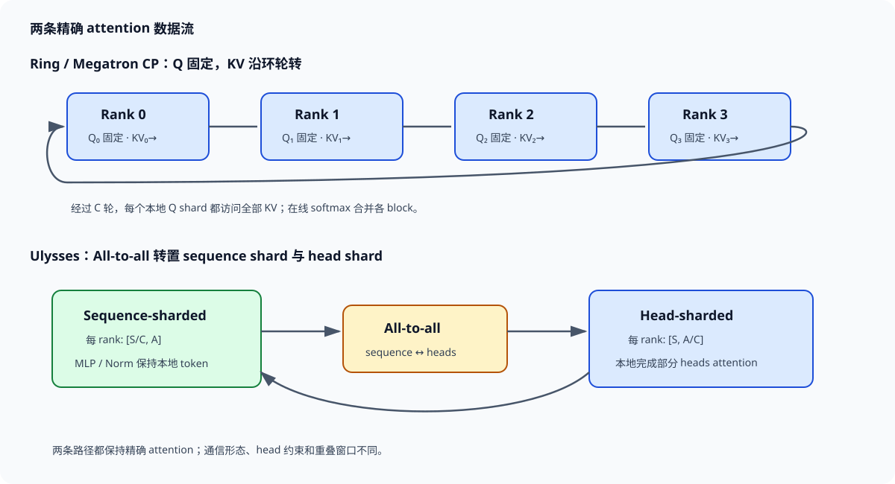

# 上下文并行

Context Parallelism（CP）把一条长序列的 token 分给多张 GPU。LayerNorm、线性层、MLP 与逐元素操作都能独立处理本地 token；self-attention 不行，因为每个 query 要读取其可见范围内的 key/value。CP 的系统问题集中在 attention：如何让本地 query 接触全局 KV，同时避免把完整序列的 activation 长期复制到每张卡。

Megatron-Core 的 CP 将网络输入和各层 activation 持续保持序列分片，只在 attention 内交换 KV，backward 再对 KV gradient 做相应规约。其官方说明把 all-gather/reduce-scatter实现为 ring 上的点对点通信，并可利用 MQA/GQA 较少的 KV heads 降低字节。Ring Attention 论文同样轮转 KV block，并将传输与 blockwise attention 重叠。DeepSpeed-Ulysses 采用另一条路径：all-to-all 在序列分片与 attention-head 分片之间转置布局，让每张卡拿到完整序列的一部分 heads。

*图 1：Ring 路径保留本地 query 并轮转 KV；Ulysses 路径用 all-to-all 将序列 shard 转成 head shard。作者绘制。*

## 1. 序列分片后的 Q/K/V shape

设序列长度为 $S$，batch 为 $B$，query head 数为 $A_q$，KV head 数为 $A_{kv}$，每头维度为 $d$，CP 规模为 $C$。rank $r$ 初始持有

$$
X_r\in\mathbb{R}^{S/C\times B\times H}.
$$

完成本地 QKV projection 后：

$$
Q_r\in\mathbb{R}^{B\times A_q\times S/C\times d},\qquad
K_r,V_r\in\mathbb{R}^{B\times A_{kv}\times S/C\times d}.
$$

非 attention 模块只看到 $S/C$ 个 token，其计算与保存 activation 近似降为单卡的 $1/C$。Attention 中的 $Q_r$ 可以一直留在本 rank；为得到精确输出，它必须依次与所有 $K_j,V_j$ block 计算。最终输出仍对应本地 $S/C$ 个 query，无需把 query 结果沿序列拼成完整副本。

MHA 中 $A_{kv}=A_q$；GQA/MQA 中 $A_{kv}$ 更小。Ring 每轮传输 KV，其字节与 $A_{kv}d$ 成正比，因此 GQA/MQA 的通信收益直接可算。Q 通常不在 ring 上轮转，不能把 QKV 三份全部计入每轮消息。

## 2. Ring 路径：本地 Q，移动 KV

每个 CP rank 从本地 KV block 开始 attention。第 0 轮计算 $Q_r$ 对 $K_r,V_r$；同时或随后把本地 KV 发给下一个 rank，并从上一个 rank 接收另一 block。经过 $C$ 轮，每个 rank 的本地 query 已访问全序列 KV。KV 的所有权轮转，query 和最终输出保持本地。

每个 KV block 大小为

$$
B_{KV,block}=2\cdot B\cdot\frac{S}{C}\cdot A_{kv}\cdot d\cdot e,
$$

系数 2 对应 K 与 V，$e$ 是元素字节。每 rank 需要从其他 $C-1$ 个 rank 接收 block，forward 网络字节近似

$$
B_{ring,fwd}=\frac{C-1}{C}\cdot2BSA_{kv}de.
$$

它随 $C$ 增大趋近一份完整 KV，但本地 attention 计算与 activation 按 $1/C$ 缩小。传输若能被当前 block 的 attention kernel 覆盖，裸露时间由每轮的计算与 P2P 最大值决定；block 太小、KV heads 太少或链路太慢时，通信会进入关键路径。

Backward 需要重新获得相应 KV，计算 $dQ,dK,dV$。不同 query shard 对同一个 KV block 产生梯度贡献，因此 KV gradient 要在其所有者处累加。实现可沿反向 ring 传递 KV 与梯度，或用等价 reduce-scatter 语义归还所有者。只计算本地 query 对本地 KV 的梯度会漏掉跨 rank attention 边。

## 3. 在线 softmax 让 block 顺序不改变结果

完整 attention 对一个 query 的 logits 为 $z_j=qk_j^\top/\sqrt d$。Ring 不能一次保存所有 logits，需要按 KV block 在线合并 softmax。对已经处理的块维护最大值 $m$、指数和 $l$ 与加权输出 $o$。新块得到局部最大值 $m_b$、指数和 $l_b$ 与输出 $o_b$ 后，令

$$
m'=\max(m,m_b),
$$

$$
l'=e^{m-m'}l+e^{m_b-m'}l_b,
$$

$$
o'=\frac{e^{m-m'}l\,o+e^{m_b-m'}l_b\,o_b}{l'}.
$$

这一合并与 FlashAttention 的 blockwise online softmax 同源，在浮点误差容许范围内等价于完整 softmax。实现若只对每块独立 softmax 再相加，会让每个 block 各自归一化，结果明显错误。

数值状态 $m,l,o$ 对每个本地 query 保存，大小随 $S/C$ 而非 $S^2$ 增长。Attention score 不物化完整 $S\times S$ 矩阵，长序列的显存才可能近似线性扩展。

## 4. 因果 attention 的负载不均

因果 mask 下，第 $i$ 个 query 只能访问位置不大于 $i$ 的 KV。若 CP 按连续序列块分配，rank 0 的早期 query 只需很少 KV，末尾 rank 的 query 接近完整上下文。简单地让所有 rank 对所有 KV block 做等量 kernel，会在上三角区域执行可跳过的工作；按 mask 跳过后，各 rank 计算量又严重不均。

粗略看，完整因果 attention 的有效 pair 数为 $S(S+1)/2$。连续分成 $C$ 块后，第 $r$ 个 query block 的有效 KV 块数约为 $r+1$。$C=4$ 时四个 rank 的块级工作比例接近 1:2:3:4，最慢 rank 是最快的四倍，ring 的同步节拍由末尾 rank 主导。

Megatron-Core 官方 CP 强调负载均衡并避免下三角 mask 的额外无效工作。常见思路把序列首尾块配对到同一 rank，使早期 query 的轻负载与晚期 query 的重负载相加。例如八个 chunk 可按 `[0,7]、[1,6]、[2,5]、[3,4]` 分给四个 rank，每组覆盖的因果面积更接近。位置仍是全局位置，物理排列改变后必须保留 token offset 与 mask 映射。

Packed sequence 更复杂：因果边界在每个样本内部重置，不能用一个全局下三角 mask。负载均衡器需要知道 cumulative sequence lengths；把不同样本 token 配对后，attention kernel 仍要阻止跨样本注意。

## 5. Ulysses：从序列 shard 转成 head shard

Ulysses 起点同样是每 rank 持有 $S/C$ token。Q/K/V projection 后，all-to-all 同时做两件事：沿序列维聚合所有 token，并沿 head 维把结果分给各 rank。布局从

$$
[S/C,\ A]
$$

转为

$$
[S,\ A/C],
$$

省略的 batch 与 head-dim 不变。每 rank 获得完整序列、部分 attention heads，可以独立执行这些 heads 的完整 attention。输出再通过第二次 all-to-all 从 head shard 转回 sequence shard，供后续投影、MLP 与残差使用。

Forward 通常对 Q、K、V 做 sequence-to-head all-to-all，并对 attention output 做 head-to-sequence all-to-all。实现可打包 QKV、融合通信或选择不同布局，但总数据量仍由 attention activation 决定。每 rank 在一次全交换中发送给其他 rank 的比例约 $(C-1)/C$。

Ulysses 的直接约束是 attention head 数需要支持按 $C$ 切分。MHA 的 $A_q$ 足够多时容易扩展；GQA 的 KV head 很少，按相同方式切 KV 可能受 $A_{kv}$ 限制。系统可复制 KV、采用混合 ring/all-to-all 或调整组大小，但通信模型随之改变。

## 6. Ring 与 all-to-all 的字节和窗口

Ring 路径主要移动 KV。对 BF16 MHA，完整 KV 为 $2BSA_{kv}de$ byte；每 rank forward 发送约其 $(C-1)/C$。它被拆成 $C-1$ 轮，每轮都可与一个 Q-block×KV-block attention kernel 重叠。延迟项随轮数增加，计算块足够大时可遮蔽。

Ulysses all-to-all移动 QKV 与输出。若 $A_q=A_{kv}=A$，QKV 总量约 $3BSAde$，输出约 $BSAde$，forward 算法发送量近似

$$
B_{ulysses,fwd}\approx4\frac{C-1}{C}BSAde.
$$

它高于只传 KV 的 $2(C-1)BSAde/C$，却使用少量大 collective，并让 attention kernel 看到完整 sequence、部分 heads。实际胜负取决于 all-to-all 拓扑、head 数、GQA 比例和 ring overlap。

Hybrid 方案可在较小 all-to-all group 内转置 heads，再在组间 ring KV。Megatron-Core 当前接口允许不同 `cp_comm_type`，具体支持项与组合随版本变化，配置记录必须保存框架版本和实际 process group。

## 7. 显存怎样随 CP 缩放

参数没有沿 CP 分片，同一 CP group 的各 rank 保存相同模型权重。官方 Megatron-Core parallel state 也明确指出 CP 不影响 weights。降低的是与 token 数相关的 activation：LayerNorm 输入、residual、MLP 中间值、QKV 本地 shard 和 attention 保存状态近似除以 $C$。

每层峰值可写成

$$
M_{act}^{CP}\approx\frac{M_{token}}{C}+M_{comm}+M_{workspace}+M_{global}.
$$

$M_{comm}$ 包括在途 KV block、双缓冲或 all-to-all 输入输出；$M_{workspace}$ 由 attention kernel 决定；$M_{global}$ 是未按序列切分的状态。只写 $M/C$ 会漏掉这些项。

Ring 双缓冲通常同时保存当前与下一 KV block。完整 KV 为 8 GB、$C=8$ 时，本地块 1 GB，双缓冲约 2 GB；如果 backward 还保存额外统计量或预取多个 block，峰值继续上升。Ulysses all-to-all 可能同时保留 sequence-sharded 输入与 head-sharded 输出，布局转换边界也有瞬时副本。

## 8. 一个 128K 序列的手算

取 $S=131072$、$B=1$、$A_q=64$、$A_{kv}=8$、$d=128$、BF16、$C=8$。每 rank 持有 16384 个 query token。单个本地 KV block 大小为

$$
2\times16384\times8\times128\times2\approx67.1\ \text{MB}.
$$

Ring forward 每 rank 向外发送七个 block，约 469.8 MB。若链路有效带宽 50 GB/s，纯带宽下界约 9.4 ms。每轮 attention 计算本地 $16384$ query 与 $16384$ key、64 个 query heads，计算量很大，具备遮蔽 1.34 ms 单轮通信的窗口；具体能否隐藏取决于 kernel 分块与 GQA 的 KV 扩展方式。

本地 Q 约为 $16384\times64\times128\times2=268.4$ MB，本地 KV 67.1 MB。完整序列 QKV 约 2.68 GB，CP 避免每卡长期保存它。若用 MHA 令 $A_{kv}=64$，KV block 增为约 536.9 MB，七轮约 3.76 GB，GQA 对 ring 通信的收益接近八倍。

Ulysses 若按 8 路切 heads，每 rank处理 8 个 query heads。MHA 下 QKV+输出 forward 总发送量近似 $4\times7/8\times BSA_qde\approx7.52$ GB；在这个 GQA 配置下需按 Q 与 KV 的不同 head 数分别核算，且 $A_{kv}=8$ 已达到 CP=8 的整除边界。

## 9. 与 TP、SP、PP、DP 的组合

总卡数常写为

$$
W=D\times P\times T\times C.
$$

TP 切 hidden/head 与权重，CP 切 token；同一个 attention rank 坐标由 TP 与 CP 共同决定。Megatron-Core 示例中，TP=2、CP=2 时，两组 TP rank 分别处理不同序列 shard，具有相同 TP 坐标的 rank 组成 CP 交换关系。

SP 是 TP 区域外的序列分片优化，通常复用 TP group；CP 是独立的上下文维度，让整个网络 activation 保持 token 分片。两者同时开启时，序列维可能先按 CP 切，再按 TP/SP 布局转换，最终本地 token 数与 kernel shape应从实际实现读取。把 SP size 与 CP size 都简单乘到所有 Tensor 上会重复计算收益。

PP stage 间发送的 activation 已按 CP 切分，因此相同 CP 坐标的相邻 stage 互传对应 token shard。PP rank 映射若打乱 CP 坐标，接收端会得到错误序列片段。DP 则在相同 PP、TP、CP 坐标间同步参数梯度并读取不同样本。

高频 TP collective 与 CP ring/all-to-all 可能争用机内互联。拓扑映射可以让 TP 留在 NVLink 子域、CP 扩到另一维，或反过来；最优选择取决于 TP activation 字节、KV heads 和节点网络。group 映射必须与 profile 一起保存。

## 10. Position、RoPE 与全局 token 坐标

序列切分只改变物理所有者，不改变 token 的逻辑位置。rank $r$ 持有连续 chunk 时，本地第 $i$ 个 token 的全局位置为 $rS/C+i$；采用首尾配对负载均衡后，一个 rank 可能持有两个不连续区间，位置不能用单个起点推导。

RoPE 必须使用全局 position id。每个 rank 从零重新编号，会让不同 chunk 的相对相位重复，跨 chunk attention 得到错误位置关系。KV block 在 ring 中移动时已经带有按其原始位置旋转后的 K，接收 rank 不能按当前轮次再次旋转。

ALiBi、relative bias、sliding window 与文档边界同样依赖全局 query/key offset。Blockwise kernel 生成 mask 时需要当前 Q block 和 KV block 的绝对范围。对于 causal mask，若 KV block 完全位于 query block 未来，可以整块跳过；部分相交时才生成块内三角 mask。

Packed sequence 要传 cumulative lengths、position ids 或等价元数据。两个样本恰好落在相邻 CP chunk 时，跨边界 attention 仍必须被禁止；仅靠全局下三角无法识别样本分隔。

## 11. 数值一致性测试

小模型测试可用 $S=16,C=4$、两头 attention 与 FP64。先计算单卡完整 attention，再把 Q/K/V 按连续序列切成四块，模拟 KV ring 和在线 softmax；gather 四个本地输出后应逐元素一致。打乱 KV block 到达顺序，结果仍应在容差内一致，这能验证在线 softmax 合并。

因果测试为每个 query 设置唯一值，检查输出只依赖左侧 token。把首尾 chunk 重新分配给 rank 后，结果仍须相同。RoPE 测试比较 CP=1 与 CP=4 的 Q/K，按全局位置旋转后 gather 应一致；本地从零编号的故障会在 chunk 边界出现周期性偏差。

Backward 比较 $dQ,dK,dV$。$dK,dV$ 必须汇总所有 query shard 的贡献；故意丢掉一轮 ring gradient 后，对应 KV block 的梯度会系统偏小。再执行一步 optimizer update，比较完整参数，覆盖 attention backward 与 DP 梯度同步的组合。

Ulysses 测试执行 sequence-to-head all-to-all、局部 attention、head-to-sequence all-to-all，与完整 attention 比较。head 数无法整除时，测试应在启动阶段报错或验证明确的 padding/复制策略，不能静默丢 head。

## 12. Profile 如何区分计算、通信与负载

Ring timeline 应出现 $C-1$ 轮 recv/send 与 block attention。当前 block kernel 运行时下一 KV block 在通信流传输，理想情况下计算结束后数据已经 ready。每轮都有相似空档，说明单 block计算不足以遮蔽 P2P；只有特定轮次变慢，则检查拓扑跨节点、mask 分支或 rank 晚到。

因果不均衡表现为后半序列 rank 的 attention kernel 总时长更长，其他 rank 在 ring 同步点等待。应用首尾配对后，各 rank 的有效 QK pair 数应接近；若 kernel 仍明显不均，检查 packed lengths、padding 与 GQA head 分配。

Ulysses timeline 主要看两次 all-to-all 的排队和链路。all-to-all 小消息分片多，对跨节点拓扑更敏感；发送字节符合公式而耗时异常时，应检查 rank 排列、NIC rail 与并发 TP/EP collective。布局转换后的 attention kernel shape 应为完整 $S$、$A/C$ heads。

显存采样点包括 QKV projection 后、通信输入输出同时存在时、attention workspace 峰值与返回 sequence shard 后。allocated 逐层上升可能是 KV buffer 引用未释放；reserved 停在历史峰值而 allocated 回落则多为缓存复用。

## 13. 选择 Ring、Ulysses 或混合方案

GQA/MQA 的 KV heads 少，Ring 只移动 KV 的优势明显；attention block 计算足够大时，逐轮 P2P 容易隐藏。CP 很大或本地 block 变小时，轮数和启动延迟增加，overlap 可能失效。

Ulysses 用少量 all-to-all 完成布局转置，适合 head 数充足且 all-to-all 拓扑高效的环境。其扩展规模受 attention head 切分约束，GQA/MQA 可能更早遇到上限。混合方案以较小 Ulysses group 切 heads，再用 ring 扩大序列，可在 head 数与 ring 轮数之间折中。

选择时记录本地 attention kernel 时间、单轮 P2P 或 all-to-all 时间、KV/Q head 数、双缓冲峰值和因果负载差异。同一总通信字节可能因多轮延迟、拓扑与重叠产生完全不同的 exposed time。

## 14. 故障、checkpoint 与可复现布局

CP 不切参数，因此普通模型 checkpoint 的权重内容不依赖 CP size；optimizer 与 DP/TP/PP shard 仍按各自布局保存。改变 CP size 后，参数可复用，数据与 activation 分区在运行期重新建立。若 checkpoint 保存了 sequence-parallel RNG、数据游标或 packed batch 状态，也要恢复到一致逻辑位置。

训练在 step 中间故障时，ring 内可能有在途 KV block，通常从完整 optimizer step 重启，而非恢复 attention 瞬态。CP group 中一个 rank退出会使整个模型副本无法继续；日志应保存 group 成员、全局 token 区间和 ring 前后邻居。

Dropout 随机数需要绑定全局 token/head 坐标。CP size 改变后若按 rank seed 生成，同一 token 会得到不同 mask。项目若要求跨并行度确定性，应使用能从逻辑坐标派生的随机流；只要求统计等价时，也要让同一配置恢复后可复现。

## 15. 官方能力与论文来源

| 路径 | 数据移动 | 本地 attention 布局 | 主要约束 | 来源 |
| --- | --- | --- | --- | --- |
| Megatron-Core CP P2P | ring 轮转 KV，backward 规约 KV gradient | 本地 query × KV block | 轮数、负载均衡、拓扑 | Megatron-Core 官方文档 |
| Ring Attention | blockwise KV ring 与在线 softmax | 本地 query × KV block | overlap 与 causal block 调度 | Ring Attention 论文 |
| DeepSpeed-Ulysses | sequence↔head all-to-all | 完整序列 × 部分 heads | head 整除、all-to-all | Ulysses 论文与官方实现 |
| 混合 A2A+P2P | 小组内 head 转置、组间 KV ring | 二维分组 | 版本支持与复杂映射 | 具体框架实现 |

## 16. Ring backward 中梯度怎样回到所有者

Forward 的 KV block 轮转一圈后可以释放，backward 为每个本地 query 重算或重新取得相关 KV block。处理来自 rank $j$ 的 $K_j,V_j$ 时，本 rank 产生本地 $dK_j^{(r)},dV_j^{(r)}$；真正属于 rank $j$ 的梯度是所有 query shard 贡献之和：

$$
dK_j=\sum_{r=0}^{C-1}dK_j^{(r)},\qquad
dV_j=\sum_{r=0}^{C-1}dV_j^{(r)}.
$$

实现可以让梯度随 KV block 一起沿 ring 累加，回到 owner 时得到完整结果，也可以组织成 reduce-scatter。$dQ_r$ 始终属于本地 query shard，只需累加各 KV block 对它的贡献。这个所有权差异解释了 forward 主要是 KV gather 语义，而 backward 还需要 KV gradient reduction。

采用 activation recompute 时，backward 会重新执行 QKV projection 或 attention forward 的部分计算。通信量模型要区分“重新取得 KV”与“重新计算本地 QKV”：前者增加网络，后者增加 FLOPs。实现若缓存全部远端 KV 可省 backward 通信，却会把每卡 KV 驻留恢复到完整序列，抵消 CP 的显存收益。

数值检查可为每个 KV block 单独统计梯度 checksum。某个 owner 只收到 $C-1$ 个贡献、某轮重复累加或 reduce-scatter 再多除一次 $C$，都会在对应 block 出现固定比例偏差。

## 17. Attention FLOPs 与 ring 通信比

忽略 softmax 低阶项，一个本地 query block与一个 KV block 的 QK 和 PV 计算约为

$$
F_{block}\approx4B\frac{S}{C}\frac{S}{C}A_qd.
$$

一轮 KV 消息为 $2B(S/C)A_{kv}de$ byte。计算—通信比近似

$$
I_{ring}\approx\frac{2(S/C)A_q}{A_{kv}e}\quad\text{FLOP/byte}.
$$

序列 block 越长，ring 越容易隐藏；CP 增大后 $S/C$ 下降，计算窗口缩短。GQA 令 $A_q/A_{kv}$ 增大，也会提高计算相对通信比。

沿用 128K、$C=8$、$A_q=64$、$A_{kv}=8$、BF16 的例子，强度约

$$
\frac{2\times16384\times64}{8\times2}=131072\ \text{FLOP/byte}.
$$

这是 attention 主计算与 KV 字节的理想比例，通常有足够 overlap 空间。若 $S=4096,C=8$，本地 block 只有 512 token，强度降为 4096 FLOP/byte；kernel 更短、启动延迟占比更高，CP 可能没有收益。CP 面向长上下文，不适合仅为增加设备数而切短序列。

## 18. 因果负载的 token-pair 复算

连续 chunk $r$ 含 query 区间 $[rL,(r+1)L)$，$L=S/C$。它的有效 query-key pair 数为

$$
P_r=\sum_{i=rL}^{(r+1)L-1}(i+1)
=\frac{L\left((2r+1)L+1\right)}{2}.
$$

$S=8192,C=4,L=2048$ 时，四个 rank 的 pair 数约为 2.10M、6.29M、10.49M、14.68M，比例接近 1:3:5:7，比“有效 KV block 数”粗算更不均。

将 chunk 0 与 7、1 与 6、2 与 5、3 与 4 配对（先把序列切成 $2C$ 个小块），每个 rank 的两个区间在因果三角形中一轻一重。两块 pair 总数接近，稳态 kernel 时间也更平衡。代价是每 rank 的 token 不连续，position/mask/packing 元数据必须支持两个区间。

Padding 会破坏理论平衡。某 batch 的后半序列大量为 padding 时，首尾配对仍可能让持有真实尾部 token 的 rank 更忙。Profile 应统计有效 query-key pair，而非只看分配 token 数。

## 19. Topology：ring 顺序与 all-to-all 分组

Ring 的相邻 rank 顺序应匹配物理链路。八卡节点内可按 NVLink/NVSwitch 拓扑组成 ring；跨节点时应减少经过同一 NIC 的并发边，或采用分层 ring。逻辑 rank 0→1→2 的编号不保证物理相邻，启动时要保存 hostname、GPU bus id、NIC 与 ring 前后邻居。

同样 67.1 MB block，在 200 GB/s 机内链路下约 0.34 ms，在 25 GB/s 机间链路下约 2.68 ms。八轮中只有一条慢边也会限制同步节拍，因为每轮下一 block 的到达受最慢路径影响。分层算法可能先机内交换，再跨节点聚合，实际流量不再等于简单单 ring 时间。

All-to-all 让每个 rank 同时面向多个 peer，更依赖交换网络与 rail 分配。节点内 head 转置、节点间 ring 是一种自然混合；若反过来让大 all-to-all跨机架，消息碎片和拥塞可能抵消 Ulysses 的少轮次优势。

TP、EP 与 CP 同时使用时，process group 创建顺序和 rank 排列必须显式。两种 collective 使用不同 group 却共享 NIC，仍会争用物理带宽。独立 microbenchmark 只能给上界，真实 timeline 要测并发。

## 20. 变长、滑窗与稀疏 mask 改变数据流

同一 batch 中序列长度不同，可 padding 到统一 $S$ 后按 CP 等分，执行简单但浪费 attention pair。Packed sequence 提高有效 token 比例，却要求每个 rank知道各样本的区间，并在 ring block 到达时生成正确 block mask。

Sliding-window attention 只需访问距离 query 不超过 $W$ 的 KV。若 $W\ll S$，本地 query 不必轮转全部 $C-1$ 个远端 block；通信邻域约为 $W/(S/C)$ 个 chunk。继续按 dense ring 发送完整 KV 会浪费带宽。Global token、prefix-LM 或文档级 mask 又会增加非局部边，最好从 block sparsity 直接生成通信计划。

双向 attention 没有因果三角形，连续均匀 sequence shard 的计算天然平衡，每个 query 访问所有 KV。Megatron-Core 官方说明 CP 支持单向和双向 mask，但负载均衡布局及 kernel 行为仍应由实际版本验证。

Position encoding也随稀疏模式保持全局坐标。滑窗只限制可见范围，不会把窗口内 token 重新编号；跨 CP 边界的相邻 token 仍应拥有连续位置。

## 21. Ulysses 的 backward 与 head 上限

Forward 第一次 all-to-all 后，每 rank持有完整序列的 head 子集。Backward 对这些 heads 计算 $dQ,dK,dV$，再通过逆 all-to-all 回到 sequence-sharded layout，使每个 rank拿回本地 token 的所有 heads。All-to-all 的 autograd 不是简单复制，split 与 concat 的轴必须严格互换。

若 $A_q=32,C=64$，每 rank不足一个 query head，纯 Ulysses 无法按 head 整分。即使通过 padding 到 64 heads，一半计算是无效的。Ring 不要求 $A_q\ge C$，更适合超过 head 数的 CP；混合方案可取 Ulysses group 8、ring group 8，总 CP=64。

GQA 还要处理 Q head 到 KV head 的分组。例如 $A_q=64,A_{kv}=8,C=8$ 时，每个 Ulysses rank可持有 8 个 Q heads 与 1 个 KV head，映射自然；$C=16$ 时 KV 无法继续均分，可复制每个 KV head到两个 rank或改用 ring。复制降低通信复杂度，却增加 KV activation 与 backward gradient规约。

## 22. 端到端容量案例

设 40 层模型在 128K 序列、micro-batch 1 下，每层逐 token 保存张量为 1.6 GB，attention kernel额外状态为 0.4 GB，参数与 optimizer state 每卡 35 GB。CP=8 后逐 token 项理想降为 0.2 GB/层，40 层共 8 GB；attention 状态若同样按 query shard降为 0.05 GB/层，再占 2 GB。

加入 ring 双缓冲 0.14 GB、通信 workspace 2 GB、其他 activation 5 GB、碎片余量 8 GB，峰值约

$$
35+8+2+0.14+2+5+8=60.14\ \text{GB}.
$$

80 GB GPU 有约 20 GB 余量。若只按 $(1.6+0.4)\times40/8+35=45$ GB 估算，会漏掉 15 GB 运行项。序列提升到 256K 时，线性 activation 与 KV block 大致翻倍，attention FLOPs 接近四倍；容量可能仍可接受，step time却由 attention计算主导。

比较 TP 扩容时，TP=8 也能减少一部分 activation，但会切窄所有线性 GEMM并引入逐层 collective。CP 专门缩短本地 token，对长序列更直接。最终配置可取满足单层参数容量的最小 TP，再用 CP 处理上下文。

## 23. 故障模式与定位信号

输出在 CP chunk 边界突变，优先检查 global position、RoPE 与首尾负载均衡的重排。只有跨样本位置异常，则检查 packed cumulative lengths 和 block mask。所有输出数值都偏软或幅度异常，可能是 online softmax 的 $m,l$ 合并错误。

Forward 正确而 $dK,dV$ 偏小，检查 backward ring 是否收齐所有 query shard 贡献；固定缩小 $1/C$ 常来自多除一次 CP size。某 rank梯度异常而其他正常，查看 KV owner、reduce-scatter offset 与 ring 轮次。

吞吐随 CP 增大反而下降，分解本地 attention kernel、每轮 P2P、等待与布局转换。Kernel 时间按预期下降而等待上升，说明 block 太小或拓扑慢；某些 rank kernel 长，说明因果/packing 负载不均；所有 rank 同时慢，可能是 TP/EP collective 争用。

OOM 只在 backward 出现，检查是否为重算重新聚合 KV、KV gradient buffer 与 forward saved tensors 同时存活。OOM 随 step 增长则检查 in-flight request、通信 handle 或缓存引用没有释放。allocated 回落而 reserved不降通常是 allocator 保留，并非活跃 Tensor 泄漏。

## 24. 配置与验收记录

配置文件保存 $S,B,H,A_q,A_{kv},d,C$、mask 类型、position encoding、packing 规则、`cp_comm_type`、TP/SP/PP/DP 规模与框架提交版本。运行时打印每个 CP rank的全局 token区间、ring 邻居、all-to-all group 和物理设备。

通信表从元素数推导每轮 KV byte、轮数、all-to-all split 和有效带宽；显存表列出本地 QKV、双缓冲、online softmax状态、saved activation 与 workspace。Profile 对齐每轮 send/recv 与 attention block，报告 exposed time而非只报 NCCL 总时长。

数值验收包含 CP=1 对照、因果/双向/packed mask、RoPE 全局位置、forward 与 $dQ/dK/dV$、一步参数更新。性能验收固定有效 token 与模型语义，比较 CP 规模时同时报告 padding比例。Checkpoint 验收改变 CP size后继续一步，确认数据位置、随机数与权重更新一致。

长时间测试还要覆盖序列长度分布的尾部。平均 32K 的数据集可能周期性出现 128K batch，峰值显存、ring 轮次内的 kernel 时间和 padding 比例都随之改变；只测固定平均长度无法代表训练稳态与 OOM 风险。

## 25. 在线 Softmax 的合并可以直接验证

对一个 query，把已处理 logits 集合记为 $A$，新 block 记为 $B$。各自最大值、指数和与未归一化加权值为

$$
m_A=\max_{j\in A}z_j,\quad
l_A=\sum_{j\in A}e^{z_j-m_A},\quad
u_A=\sum_{j\in A}e^{z_j-m_A}v_j,
$$

$B$ 同理。令 $m=\max(m_A,m_B)$，则全集指数和满足

$$
l=e^{m_A-m}l_A+e^{m_B-m}l_B,
$$

未归一化输出为

$$
u=e^{m_A-m}u_A+e^{m_B-m}u_B,\qquad o=u/l.
$$

前文的 $o_A,o_B$ 若表示已经归一化的局部输出，就有 $u_A=l_Ao_A,u_B=l_Bo_B$，代入后得到相同合并式。实现时要明确 buffer 保存的是 $u$ 还是 $o$；把已归一化输出当作未归一化值，会漏乘局部指数和。

三个 block 的合并顺序可变化，因为它们都还原到同一全集求和，浮点舍入会产生小差异。单测随机打乱 ring 到达顺序，FP64 结果应非常接近完整 attention；BF16/FP16 的容差按序列长度和 kernel 累加精度设置。极端 logits（例如 1000 与 -1000）用于验证 max-shift 是否避免上溢、下溢。

### 25.1. 因果块的空行处理

某个 KV block 完全位于 query 的未来时，该 block 对对应 query 行没有有效元素。局部最大值不能从被 mask 后的全 `-inf` 直接产生 `exp(-inf-(-inf))`，后者是 NaN。Kernel 可整块跳过，或令局部 $l_B=0,u_B=0$ 并在合并时保持旧状态。

Query 行至少能看到自身及之前 token，完整 attention 的最终 $l>0$；packed 或自定义 mask 可能制造全屏蔽行，需要提前定义输出语义。错误处理常只在 chunk 边界或空样本上出现，使用全有效随机输入不容易发现。

## 26. 双缓冲的事件时序

Ring 常准备 buffer A/B。第 $k$ 轮用 A 计算时，通信流把第 $k+1$ 个 KV block写入 B；计算结束后交换角色。B 在 recv 完成前不能被 attention 读取，A 在 send 和 attention 都完成前不能被下一轮覆盖。每个 buffer 至少关联 recv-ready、compute-done 与 send-done 三类事件。

若 P2P send 可以直接从正在计算的 A 读取，两者会同时访问 HBM；带宽争用可能让 attention 与发送都变慢。另一实现先把本地 KV 发送完再计算，时序安全但无法完全重叠。Profiler 要区分网络暴露等待与 HBM 干扰，单看 CUDA stream 重叠色块不足以判断收益。

设单轮 attention 4 ms、P2P 3 ms，理想双缓冲周期约 4 ms；并发后 attention 变 5 ms、P2P 变 4 ms，周期为 5 ms，仍比串行 7 ms 快。若 attention 变 6 ms、P2P 5 ms，周期 6 ms，只省 1 ms且占用额外 block buffer。$C-1$ 轮会放大这项差异。

### 26.1. 首轮与末轮无法完全重叠

流水开始前，本地 block 已经可用，首轮计算可以与第一次 send/recv并发；末轮计算结束后可能仍要等待最后 send 完成，才能释放源 buffer或进入 backward。稳定周期近似 $\max(T_{attn},T_{p2p})$，总时间还要加填充、排空与事件启动。

简单估算可写为

$$
T_{ring}\gtrsim T_{fill}+(C-1)\max(T_{attn},T_{p2p})+T_{drain}.
$$

当本地 block很小，$T_{fill},T_{drain}$ 与每轮启动不能忽略；这也是短序列扩大 CP 后性能下降的原因之一。

## 27. 分层 Ring 与混合 Ulysses

跨多节点时，可把 $C=C_{intra}C_{inter}$ 分成两维。节点内用 Ulysses all-to-all 将序列 shard 转成 head shard，节点间让相同 head 子组执行 KV ring；也可以节点内先 ring，再在节点代表之间做另一层交换。两种方案的数据布局和通信字节不同，需要从每一步 Tensor shape推导。

例如总 CP=32，每节点 8 卡，取 Ulysses group 8、跨节点 ring 4。若 $A_q=64,A_{kv}=8$，节点内每 rank得到 8 个 Q head、1 个 KV head的完整节点内序列段；跨四节点 ring 时只轮转该 head shard 的 KV，消息比直接 32 路 MHA KV ring更小，ring 轮数也从 31 降为 3。代价是节点内两次 all-to-all和更复杂布局转换。

若 $A_{kv}=4$，Ulysses group 8 无法把 KV head 一一分配，可在节点内复制 KV head，或将 Ulysses group降到 4、ring group升到 8。前者增加 KV activation与 backward规约，后者增加 ring轮数。head 数给出结构上限，拓扑与容量决定可接受组合。

### 27.1. 二维 Rank 坐标

将 CP rank写成 $(u,r)$，$u\in[0,C_u)$ 表示 Ulysses组内坐标，$r\in[0,C_r)$ 表示 ring坐标。All-to-all 固定 $r$、变化 $u$；ring固定 $u$、沿 $r$ 轮转。启动时打印每个 group成员及 GPU/NIC位置，确认 all-to-all留在高速域、ring跨域边数符合设计。

Checkpoint 参数不随 CP切分，RNG、数据 shard和 packed batch元数据仍要使用全局 token坐标。切换 $(C_u,C_r)$ 后重建 layout转换，数值对照保持相同全局序列与 mask。

## 28. Context Parallel 与 FlashAttention 的边界

FlashAttention 在单设备内沿 Q/KV tile计算 online softmax，CP 在设备间沿更大的 KV block分配。两层分块可以嵌套：每轮收到一个远端 KV block，FlashAttention kernel再把它切成片上 tile，并把该 block的统计量合并进 query行状态。CP 不要求物化 block 内 $QK^T$。

Backward 通常需要 forward保存的行最大值与 log-sum-exp，或重算等价统计。每个本地 query只保存一份全局归一化统计；若每个远端 block各存一份，activation会随 CP轮数增长。Kernel接口要支持从前序 block继续更新状态，或在更高层合并 block输出。

Dropout 会给每个 query-key pair生成随机 mask。Ring到达顺序或 CP size改变后，按 kernel调用顺序推进 RNG会给同一逻辑 pair分配不同随机数。若项目要求跨 CP布局确定性，随机数由 `(global_query, global_key, head, layer, step)` 等逻辑坐标派生；只要求单配置恢复一致时，至少保存每个 group的 RNG状态与调度顺序。

### 28.1. 内核约束也影响负载均衡布局

首尾配对后本 rank持有不连续 query区间。Kernel可以分别处理两段并合并输出，也可以在本地重排成连续 buffer并携带 position。前者增加 kernel调用，后者增加 gather/scatter。选择依赖段长、编译图与 kernel是否原生支持多区间。

某些 fused attention接口只接受标准 causal mask和连续位置，packed、多区间或滑窗会落到通用 kernel。理论 pair数下降后，通用路径可能仍比密集融合路径慢。Profile同时记录有效 pair、kernel名称和实际 HBM字节，避免只按 FLOPs预测。

## 29. Backward 通信量逐项展开

本地 query对远端 KV block计算时产生 $dQ_r^{(j)},dK_j^{(r)},dV_j^{(r)}$。$dQ_r$ 在本 rank对所有 $j$ 累加，不需要跨 CP；$dK_j,dV_j$ 要回到 owner并求和。若 backward ring让 KV与其梯度累加器一起移动，每轮 payload可能包含 K、V、dK、dV，约为 forward KV的两倍，具体取决于是否重算和通信融合。

一种时序是 owner发送 K/V和零初始化 dK/dV；每个 query rank消费后把贡献加到随行梯度，继续传给下一 rank，最终回到 owner。另一种让 K/V按 forward方式轮转，本地产生梯度后另做 reduce-scatter。前者把规约融入 ring，后者可使用优化的 collective；算法字节与 buffer峰值需按实现核对。

取前述本地 KV block 67.1 MB。若每轮同时发送 KV与同 dtype dKV，消息约 134.2 MB，七轮约 939.5 MB/rank；若 backward还重传额外统计或使用 FP32梯度累加，字节继续增加。只用 forward 469.8 MB代表整步 CP通信会低估。

### 29.1. 规约缩放只能出现一次

CP 的 dK/dV 是同一样本不同 query shard的贡献之和，数学上需要求和；DP则对不同样本梯度按 loss语义求和或平均。若 CP reduce-scatter沿用默认平均并除以 $C$，梯度会缩小；后续 DP再平均则多一个因子。通信接口的 reduce op与 loss归一化分别记录。

小模型可手算两个 CP rank的 $dK$: 分别保留 query前半与后半，对完整 K求局部贡献，再逐元素相加，与单卡 autograd比较。该测试比只看训练 loss更快发现多除或漏一轮。

## 30. 稀疏 Attention 的通信计划来自 Block 图

Dense attention要求每个 query shard访问全部 KV shard；滑窗、块稀疏或检索式 attention只访问邻接集合。将 query block作为左节点、KV block作为右节点，mask给出二分图边。CP通信只需把存在边的 KV送到对应 query owner，计算量与通信量都由边数决定。

窗口宽度 $W$、block长度 $L=S/C$。若 $W\le L$，多数 query只需要本地与相邻一个 KV block；远端通信从 $C-1$ 轮降到常数轮。边界 query仍要访问前一 rank的尾部，消息可以只包含所需 token，而非完整 block。Global tokens则形成连接所有 query的高扇出小块，可复制到各 rank。

动态 indexer在运行时选择 KV block时，通信计划也随 batch改变。先交换候选 block id，再调度 KV传输；元数据小，但多一次依赖与不规则 peer流量。热门 block可能被多个 rank同时请求，树形广播或复制缓存比逐点发送更合适。容量表加入缓存块及失效版本。

正确性测试从显式 dense mask构造参考，比较稀疏通信结果。Indexer漏选属于算法语义，通信层丢边属于系统错误；用已选 block集合固定输入，可以把两者分开。Position、causal和文档边界仍按全局坐标生成。

## 31. 观测量要与理论项一一对应

每个 rank记录本地有效 query数、有效 query-key pair、每轮 KV byte、attention kernel时间、P2P排队与等待、双缓冲峰值。Pair差异解释计算不均，byte差异解释变长或稀疏计划，等待解释链路与晚到。只给总 step时间无法判断 CP问题落在哪层。

Ring轮次用 `(layer,microbatch,round,block_owner)` 标识。某轮耗时异常时，可以查看它是否跨节点、是否对应部分 causal block、源 rank是否迟到。Backward额外标 dKV owner与贡献计数，owner最终应收到预期数量。

Ulysses记录 all-to-all split sizes与转换前后 shape。若某 rank split为零或 padding明显，head分配已接近扩展上限；collective字节正常而 attention kernel低效，检查每 rank head过少或完整序列过长导致的 tile选择。

容量曲线分别标本地 activation、通信输入输出、attention workspace与 allocator reserved。扩大 CP后 token activation应近似下降，通信固定项占比提高；若总峰值不降，找出未按序列分片的张量或布局转换副本。

## 32. 用 Break-even 条件决定是否扩大 CP

将单层本地 attention 时间近似为 $T_a(C)$，每轮通信为 $T_n(C)$，轮数为 $C-1$。能够充分重叠时，主体近似

$$
T(C)\approx(C-1)\max(T_a(C),T_n(C))+T_{edge},
$$

其中 $T_{edge}$ 汇总填充、排空和布局开销。Dense attention 的每轮本地计算约随 $1/C^2$ 下降，而 block消息随 $1/C$ 下降；扩大 CP后计算窗口比通信更快缩短，最终会越过 $T_a=T_n$ 的点。

假设 $C=4$ 时每轮 attention 8 ms、P2P 2 ms，三轮主体约 24 ms；到 $C=8$ 时每轮 attention约 2 ms、P2P约 1 ms，七轮约 14 ms，仍有收益；到 $C=16$ 时 attention约 0.5 ms、P2P约 0.5 ms，十五轮约 7.5 ms，但启动与边界项可能已有数毫秒。若跨节点让 P2P变为 1.5 ms，主体会升到 22.5 ms，扩容失去意义。

这项估算要和容量同时使用。$C=8$ 若已经把峰值降到安全范围，继续到 16 只为速度服务；实测通信进入关键路径后即可停止。若 $C=16$ 才放得下，只能接受性能代价，或再用 activation checkpoint、TP/SP、低精度等手段改变容量约束。

### 32.1. 端到端速度还包含非 Attention

LayerNorm、MLP 与线性层处理本地 $S/C$ token，理想计算随 $1/C$ 下降；参数权重仍复制，某些小 GEMM 在 token变少后利用率下降。CP group扩大也不会减少 DP梯度字节。单层 attention更快，不保证完整 step按同样比例加速。

测量分别给 attention、非 attention、CP通信、其他 collective和 bubble。若 attention只占 step的 30%，即使它加速两倍，Amdahl上限也约为 $1/(0.7+0.3/2)=1.176$。长序列下 attention占比通常提高，CP才更容易同时满足容量和速度。

## 33. 数据进入 CP Group 的方式

同一 CP group处理同一条逻辑序列。数据 loader可以先让一个源 rank读取完整 packed batch，再沿 token轴 scatter；也可以各 rank从共享样本描述中直接读取自己的区间。前者实现简单，却在源 rank产生完整输入和额外 scatter；后者避免聚合峰值，需要所有 rank对 tokenizer、packing与样本顺序达成一致。

直接分段读取时，每个 rank仍要知道全局 cumulative lengths、position ids与 loss mask。只读取本地 token而没有跨 chunk样本边界，就无法生成正确 attention mask。元数据可以复制，因为其字节远小于 hidden activation；超长 packed batch的边界数组也应计入主机与设备传输。

DP group之间读取不同样本，CP group内部读取同一样本的不同片段。Sampler索引由 DP坐标决定，CP坐标不能推进独立数据游标。若八个 CP rank各自调用一次普通 `next(dataloader)`，会消费八条不同序列并错误拼接。

### 33.1. Loss 与标签的分片

自回归标签是输入向左移动一位，CP chunk边界处的最后 token标签位于下一 chunk的首 token。可以在切分前生成全局 label再 scatter，或让相邻 rank交换一个边界 token。本地从输入独立 shift会把每个 chunk末尾标签设错或丢掉。

词表并行 cross entropy还沿 vocab切 logits。一个 token的 loss先在 TP组内归约，token loss再保留于本地 CP shard；全局有效 token分母在 CP与DP相关组内求和。Padding与文档边界 token按 loss mask排除。若每 rank各自取本地平均再平均，token数不等时会给短 shard过高权重。

验证构造跨 CP边界的短句，让边界前 token的目标只在下一 shard出现。CP=1与目标 CP的逐 token loss、有效 token总数和一步梯度应一致。该用例同时覆盖数据切分、label shift和全局归一化。

## 34. CP Size 变化后的确定性

参数 checkpoint不随 CP切分，随机过程和数据布局会变化。Dropout、attention dropout、随机深度等操作若以 rank-local RNG顺序生成，CP从 4改为 8后，每个 rank处理的 token数量和调用次序改变，同一逻辑 token得到不同 mask。训练可以保持统计正确，却不能逐步复现原轨迹。

要求布局无关确定性时，为随机元素建立逻辑索引。Philox一类计数式 RNG可从 `(seed,step,layer,global_token,head,feature)` 映射到随机数，不依赖物理 rank和调用顺序。实现成本与 kernel支持需评估；若不要求跨布局位级一致，文档仍要区分「相同布局恢复可复现」与「改变 CP 后统计等价」。

Checkpoint至少保存全局 step、数据 sampler、基础 seed与当前布局。相同 CP恢复时比较下一 step的 dropout mask摘要和 loss；改变 CP时比较无 dropout数值基线，再做收敛验证，避免把预期随机差异误判为通信错误。

## 参考资料

- [Megatron-Core Context Parallel Package](https://docs.nvidia.com/megatron-core/developer-guide/latest/user-guide/features/context_parallel.html)
- [Megatron-Core Parallelism Strategies Guide](https://docs.nvidia.com/megatron-core/developer-guide/latest/user-guide/parallelism-guide.html)
- [Ring Attention with Blockwise Transformers for Near-Infinite Context](https://arxiv.org/abs/2310.01889)
- [DeepSpeed Ulysses](https://arxiv.org/abs/2309.14509)
- [DeepSpeed Ulysses 官方说明](https://github.com/deepspeedai/DeepSpeed/blob/master/blogs/deepspeed-ulysses/README.md)
