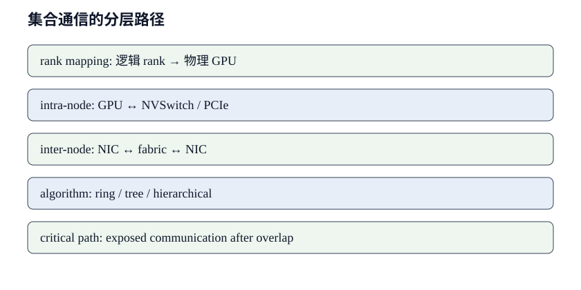

# 拓扑与集合通信成本

分布式性能不能用「总带宽」一个数字解释. 集合通信把逻辑 rank 上的张量映射到物理 GPU、交换芯片、PCIe root complex、NIC 与网络 fabric. 同样的消息大小, ring、tree 和分层算法经过的轮数不同; 同样的算法, rank 映射和并发流又会改变共享链路负载. 这里从消息语义、算法轮次和物理路径三层建立成本模型.

## 先把 collective 写成轮次与字节

集合通信由参与者、轮次、每轮消息和依赖共同定义，其最低成本取决于算法结构。链路峰值只有代入算法字节后才有解释力。

本节从 $\alpha$-$\beta$ 模型、ring 与 tree 开始，明确小消息和大消息由不同项主导。公式是下界，也为后续拓扑偏离提供参照。

### 延迟带宽模型的变量

设参与设备数为 $p$, 每个 rank 的逻辑消息为 $n$ byte, 每轮固定启动代价为 ${\alpha}$ s, 链路每 byte 时间为 $\beta=1/B_{link}$ s/byte. 分析「延迟带宽模型的变量」时必须同时给出算法轮数、每轮发送量和路径中的瓶颈链路. 简单的 ${\alpha}$-$\beta$ 模型忽略协议、chunk、路由竞争与软件开销, 但能区分小消息受启动项控制、大消息受带宽项控制.

取 $p=8,n=1$ GiB, ${\alpha}=5$ µs, 有效单向带宽 $B_{link}=50$ GB/s. ring all-reduce 近似时间 $2(p-1)alpha+2(p-1)n/(pB_{link})$, 启动项为 70 µs, 带宽项约 37.58 ms. 若 $n=64$ KiB, 带宽项约 2.29 µs, 启动项反而主导. 这些是理想链路模型结果, 不是任何具体集群的保证值. **消息大小改变时, 最优集合算法可能随之改变.**

### Ring all-reduce 的两阶段

Ring all-reduce 把消息切为 $p$ 份，依次经历 reduce-scatter 与 all-gather；每个阶段各有 $p-1$ 轮。若每 rank 消息为 $n$ byte，理想情况下每轮传输约 $n/p$ byte，因此大消息的总链路字节接近 $2(p-1)n/p$，小消息则更容易被 $2(p-1)$ 次启动代价支配。

分析「Ring all-reduce 的两阶段」时必须同时给出算法轮数、每轮发送量和路径中的瓶颈链路. 简单的 ${\alpha}$-$\beta$ 模型忽略协议、chunk、路由竞争与软件开销, 但能区分小消息受启动项控制、大消息受带宽项控制.

### Tree 算法与小消息

Tree 算法把依赖深度压到约 $\log_2 p$，适合启动成本占主导的小消息；代价是不同层的链路负载和根节点压力可能更不均衡。比较 tree 与 ring 时不能只看轮数，还要确认实现使用的分块、双树或流水方式，以及树边是否跨越较慢的物理层级。

因此算法选择存在随消息大小变化的交叉点。基准测试应覆盖真实训练或推理中的消息分布，而不是拿单一大张量的峰值替所有 collective 下结论。

*图 1: 从逻辑 rank 到机内、机间链路和关键路径的分层模型. 图中数量与箭头为这里使用的分析框架, 作者绘制.*

### 不同 collective 移动什么数据

All-reduce、all-gather、reduce-scatter 和 all-to-all 的消费者不同，不能只比较名字或总 byte。分片布局决定通信结果下一步能否直接使用。

方向、双向规格和链路共享也影响分母。把双向聚合带宽当作单流有效带宽，会在进入实测前就产生倍数错误。

**All-gather 与 reduce-scatter**

All-gather 让每个 rank 收齐各分片，reduce-scatter 则在归约后只保留本 rank 的结果分片。两者常被组合成分片参数或梯度的生命周期：前者在消费前扩展数据，后者在产生后压回分片。字节模型必须明确这里的 $n$ 指单 rank 初始分片还是完整张量。

分析「All-gather 与 reduce-scatter」时必须同时给出算法轮数、每轮发送量和路径中的瓶颈链路. 简单的 ${\alpha}$-$\beta$ 模型忽略协议、chunk、路由竞争与软件开销, 但能区分小消息受启动项控制、大消息受带宽项控制.

**双向带宽和链路共享**

硬件资料中的双向聚合带宽不能直接作为单个方向的除数。若发送与接收共享端口、交换上行或 NIC，两个方向会争用同一瓶颈；即使物理链路全双工，集合算法的依赖也未必允许峰值同时出现。模型中的 $B_{link}$ 应采用目标路径、目标方向下的有效值。

分析「双向带宽和链路共享」时必须同时给出算法轮数、每轮发送量和路径中的瓶颈链路. 简单的 ${\alpha}$-$\beta$ 模型忽略协议、chunk、路由竞争与软件开销, 但能区分小消息受启动项控制、大消息受带宽项控制.

**拓扑感知的 rank 映射**

Rank 编号描述逻辑邻接，进程放置才决定实际经过 NVLink、PCIe 还是机间网络。若一个 ring 的相邻 rank 频繁跨节点，即使总设备数和消息大小不变，关键路径也会显著增长。拓扑感知映射的目标，是让高频、大消息边尽量落在更快且少共享的链路上。

分析「拓扑感知的 rank 映射」时必须同时给出算法轮数、每轮发送量和路径中的瓶颈链路. 简单的 ${\alpha}$-$\beta$ 模型忽略协议、chunk、路由竞争与软件开销, 但能区分小消息受启动项控制、大消息受带宽项控制.

**分层拓扑与并行策略**

设备组通常同时跨越 GPU、交换芯片、PCIe、NIC 和机间网络。不同并行维度应映射到与其消息频率、大小相匹配的层级。

逻辑 rank 顺序不会自动保证物理邻近。本节把机内/机间 collective、梯度 bucket 和逐层 TP 通信放到真实路径上计算。

## 机内与机间分层

分层 collective 在节点内归约或聚合，由节点代表跨网交换，完成后在节点内分发。这样可以减少慢速机间层看到的并发流或总字节，但会增加阶段依赖。成本应写成各层关键路径之和，并分别使用机内、机间的启动延迟和有效带宽。

分析「机内与机间分层」时必须同时给出算法轮数、每轮发送量和路径中的瓶颈链路. 简单的 ${\alpha}$-$\beta$ 模型忽略协议、chunk、路由竞争与软件开销, 但能区分小消息受启动项控制、大消息受带宽项控制.

### 数据并行的梯度 bucket

数据并行通常把梯度按 bucket 触发归约，使较早完成反向传播的参数能够与后续计算重叠。bucket 太小会增加启动次数，太大又会推迟第一轮通信并让尾桶暴露在关键路径上。合适大小取决于反向计算间隔、带宽和每轮固定开销。

分析「数据并行的梯度 bucket」时必须同时给出算法轮数、每轮发送量和路径中的瓶颈链路. 简单的 ${\alpha}$-$\beta$ 模型忽略协议、chunk、路由竞争与软件开销, 但能区分小消息受启动项控制、大消息受带宽项控制.

### Tensor parallel 的层内通信

Tensor parallel 在层内切分矩阵，常在一次前向或反向中多次交换激活或部分结果。单次消息可能不如梯度大，但调用频率高且依赖紧，较难跨层完全隐藏。因此 TP 组通常优先放在节点内高速互联上，跨节点扩展前要先核算每层裸露延迟。

分析「Tensor parallel 的层内通信」时必须同时给出算法轮数、每轮发送量和路径中的瓶颈链路. 简单的 ${\alpha}$-$\beta$ 模型忽略协议、chunk、路由竞争与软件开销, 但能区分小消息受启动项控制、大消息受带宽项控制.

### 关键路径、重叠与失效模式

通信总时长高不等于都在关键路径，时间线上发生并发也不等于没有代价。依赖窗口和资源争用共同决定真正隐藏的部分。

Pipeline bubble、尾桶梯度、拥塞和迟到 rank 是常见裸露来源。排查需要区分传输慢与参与者晚到，避免所有等待都归因于网络。

### Pipeline parallel 的 activation 与 bubble

Pipeline parallel 在 stage 边界发送 activation 与对应梯度，消息量由 micro-batch、序列长度和隐藏维度决定。增加 micro-batch 数能降低首尾 bubble 占比，却可能带来更多小消息与缓存压力。分析时要把传输放进调度表，而不是孤立地用张量字节除以链路带宽。

分析「Pipeline parallel 的 activation 与 bubble」时必须同时给出算法轮数、每轮发送量和路径中的瓶颈链路. 简单的 ${\alpha}$-$\beta$ 模型忽略协议、chunk、路由竞争与软件开销, 但能区分小消息受启动项控制、大消息受带宽项控制.

**计算通信重叠的上限**

若通信窗口长度为 $T_{comm}$，可并行计算窗口为 $T_{comp}$，在资源互不争用的理想情况下，至少有 $\max(0,T_{comm}-T_{comp})$ 会暴露。现实中计算与通信可能同时争用 HBM、PCIe 或调度资源，所以并发后的总时间还需实测，不能直接取两者最大值。

分析「计算通信重叠的上限」时必须同时给出算法轮数、每轮发送量和路径中的瓶颈链路. 简单的 ${\alpha}$-$\beta$ 模型忽略协议、chunk、路由竞争与软件开销, 但能区分小消息受启动项控制、大消息受带宽项控制.

**拥塞、straggler 与尾延迟**

Collective 的完成时间由最慢参与者决定。某个 rank 晚到、某条共享上行拥塞或后台流量抖动，都会把等待记入通信区间。诊断应对齐各 rank 的进入时刻、传输速率和退出时刻，先区分「到得晚」与「传得慢」，再决定优化计算、放置还是网络。

分析「拥塞、straggler 与尾延迟」时必须同时给出算法轮数、每轮发送量和路径中的瓶颈链路. 简单的 ${\alpha}$-$\beta$ 模型忽略协议、chunk、路由竞争与软件开销, 但能区分小消息受启动项控制、大消息受带宽项控制.

**从公式到时间线的三组案例**

数据并行、张量并行和流水并行产生的消息大小、频率与依赖位置不同；推理与故障场景又会改变可用链路和尾延迟。下面的案例把这些差异代入同一时间模型。

每个案例保留消息 shape、world size、物理路径与可重叠计算。这样扩展不线性时，可以指出是哪条边进入关键路径，而不是只报告通信占比。

**集合算法的可复算例子**

对「8 卡 ring all-reduce」先画出每个 rank 初始持有与最终需要的数据. 设算法有 $r$ 轮, 第 $i$ 轮沿关键链路传输 $q_i$ byte, 则串行近似为 $T=sum_{i=1}^{r}(alpha_i+q_i\beta_i)$. 若若干链路并发且互不共享瓶颈, 取并发路径的最大值; 若它们争用同一 uplink 或 NIC, 流量必须在共享资源上合并. 逻辑发送字节之和不能直接除以所有链路标称带宽.

给一个分层示例: 8 台节点, 每台 8 张 GPU, 每 rank 消息 512 MiB. 机内阶段假设有效带宽 300 GB/s、启动 4 µs, 机间阶段假设每节点有效带宽 50 GB/s、启动 12 µs. 只按 512 MiB 除以 300 GB/s 会得到约 1.79 ms, 却遗漏机间约 10.74 ms 的一次等量传输下界以及算法轮次. 完整预测要按实际分层算法计算每阶段 chunk 大小; 示例只显示为何最慢层级不能被平均带宽掩盖.

并行训练还要把 collective 放回依赖图. 若某个梯度 bucket 在反向结束前 8 ms 就绪, 且通信需要 6 ms, 理论上可以全部遮蔽; 若需要 12 ms, 至少暴露 4 ms. 实际重叠会与计算竞争 HBM、L2 或 PCIe 资源, 所以同时运行的时间可能超过两者最大值.

对「64 卡分层 all-reduce」先画出每个 rank 初始持有与最终需要的数据. 设算法有 $r$ 轮, 第 $i$ 轮沿关键链路传输 $q_i$ byte, 则串行近似为 $T=sum_{i=1}^{r}(alpha_i+q_i\beta_i)$. 若若干链路并发且互不共享瓶颈, 取并发路径的最大值; 若它们争用同一 uplink 或 NIC, 流量必须在共享资源上合并. 逻辑发送字节之和不能直接除以所有链路标称带宽.

诊断时保存每个 rank 的开始与结束时间, 不能只看平均值. collective 由最慢参与者决定完成时刻; 一个 rank 晚到 3 ms, 其他 rank 的等待会被记在通信 API 中, 但根因可能是之前的计算、数据加载或系统中断. 先对齐 rank 时间线, 再判断网络是否真正饱和.

对「tree broadcast」先画出每个 rank 初始持有与最终需要的数据. 设算法有 $r$ 轮, 第 $i$ 轮沿关键链路传输 $q_i$ byte, 则串行近似为 $T=sum_{i=1}^{r}(alpha_i+q_i\beta_i)$. 若若干链路并发且互不共享瓶颈, 取并发路径的最大值; 若它们争用同一 uplink 或 NIC, 流量必须在共享资源上合并. 逻辑发送字节之和不能直接除以所有链路标称带宽.

对「all-gather 参数分片」先画出每个 rank 初始持有与最终需要的数据. 设算法有 $r$ 轮, 第 $i$ 轮沿关键链路传输 $q_i$ byte, 则串行近似为 $T=sum_{i=1}^{r}(alpha_i+q_i\beta_i)$. 若若干链路并发且互不共享瓶颈, 取并发路径的最大值; 若它们争用同一 uplink 或 NIC, 流量必须在共享资源上合并. 逻辑发送字节之和不能直接除以所有链路标称带宽.

对「reduce-scatter 梯度」先画出每个 rank 初始持有与最终需要的数据. 设算法有 $r$ 轮, 第 $i$ 轮沿关键链路传输 $q_i$ byte, 则串行近似为 $T=sum_{i=1}^{r}(alpha_i+q_i\beta_i)$. 若若干链路并发且互不共享瓶颈, 取并发路径的最大值; 若它们争用同一 uplink 或 NIC, 流量必须在共享资源上合并. 逻辑发送字节之和不能直接除以所有链路标称带宽.

对「all-to-all 专家路由」先画出每个 rank 初始持有与最终需要的数据. 设算法有 $r$ 轮, 第 $i$ 轮沿关键链路传输 $q_i$ byte, 则串行近似为 $T=sum_{i=1}^{r}(alpha_i+q_i\beta_i)$. 若若干链路并发且互不共享瓶颈, 取并发路径的最大值; 若它们争用同一 uplink 或 NIC, 流量必须在共享资源上合并. 逻辑发送字节之和不能直接除以所有链路标称带宽.

## 并行策略的通信位置

对「DDP 梯度归约」先画出每个 rank 初始持有与最终需要的数据. 设算法有 $r$ 轮, 第 $i$ 轮沿关键链路传输 $q_i$ byte, 则串行近似为 $T=sum_{i=1}^{r}(alpha_i+q_i\beta_i)$. 若若干链路并发且互不共享瓶颈, 取并发路径的最大值; 若它们争用同一 uplink 或 NIC, 流量必须在共享资源上合并. 逻辑发送字节之和不能直接除以所有链路标称带宽.

对「FSDP 参数聚合」先画出每个 rank 初始持有与最终需要的数据. 设算法有 $r$ 轮, 第 $i$ 轮沿关键链路传输 $q_i$ byte, 则串行近似为 $T=sum_{i=1}^{r}(alpha_i+q_i\beta_i)$. 若若干链路并发且互不共享瓶颈, 取并发路径的最大值; 若它们争用同一 uplink 或 NIC, 流量必须在共享资源上合并. 逻辑发送字节之和不能直接除以所有链路标称带宽.

对「tensor parallel 行并行」先画出每个 rank 初始持有与最终需要的数据. 设算法有 $r$ 轮, 第 $i$ 轮沿关键链路传输 $q_i$ byte, 则串行近似为 $T=sum_{i=1}^{r}(alpha_i+q_i\beta_i)$. 若若干链路并发且互不共享瓶颈, 取并发路径的最大值; 若它们争用同一 uplink 或 NIC, 流量必须在共享资源上合并. 逻辑发送字节之和不能直接除以所有链路标称带宽.

对「tensor parallel 列并行」先画出每个 rank 初始持有与最终需要的数据. 设算法有 $r$ 轮, 第 $i$ 轮沿关键链路传输 $q_i$ byte, 则串行近似为 $T=sum_{i=1}^{r}(alpha_i+q_i\beta_i)$. 若若干链路并发且互不共享瓶颈, 取并发路径的最大值; 若它们争用同一 uplink 或 NIC, 流量必须在共享资源上合并. 逻辑发送字节之和不能直接除以所有链路标称带宽.

对「pipeline stage 边界」先画出每个 rank 初始持有与最终需要的数据. 设算法有 $r$ 轮, 第 $i$ 轮沿关键链路传输 $q_i$ byte, 则串行近似为 $T=sum_{i=1}^{r}(alpha_i+q_i\beta_i)$. 若若干链路并发且互不共享瓶颈, 取并发路径的最大值; 若它们争用同一 uplink 或 NIC, 流量必须在共享资源上合并. 逻辑发送字节之和不能直接除以所有链路标称带宽.

对「序列并行激活」先画出每个 rank 初始持有与最终需要的数据. 设算法有 $r$ 轮, 第 $i$ 轮沿关键链路传输 $q_i$ byte, 则串行近似为 $T=sum_{i=1}^{r}(alpha_i+q_i\beta_i)$. 若若干链路并发且互不共享瓶颈, 取并发路径的最大值; 若它们争用同一 uplink 或 NIC, 流量必须在共享资源上合并. 逻辑发送字节之和不能直接除以所有链路标称带宽.

### 实测偏离模型的原因

对「协议阈值切换」先画出每个 rank 初始持有与最终需要的数据. 设算法有 $r$ 轮, 第 $i$ 轮沿关键链路传输 $q_i$ byte, 则串行近似为 $T=sum_{i=1}^{r}(alpha_i+q_i\beta_i)$. 若若干链路并发且互不共享瓶颈, 取并发路径的最大值; 若它们争用同一 uplink 或 NIC, 流量必须在共享资源上合并. 逻辑发送字节之和不能直接除以所有链路标称带宽.

对「rank 映射跨 NUMA」先画出每个 rank 初始持有与最终需要的数据. 设算法有 $r$ 轮, 第 $i$ 轮沿关键链路传输 $q_i$ byte, 则串行近似为 $T=sum_{i=1}^{r}(alpha_i+q_i\beta_i)$. 若若干链路并发且互不共享瓶颈, 取并发路径的最大值; 若它们争用同一 uplink 或 NIC, 流量必须在共享资源上合并. 逻辑发送字节之和不能直接除以所有链路标称带宽.

对「多 rail 不均衡」先画出每个 rank 初始持有与最终需要的数据. 设算法有 $r$ 轮, 第 $i$ 轮沿关键链路传输 $q_i$ byte, 则串行近似为 $T=sum_{i=1}^{r}(alpha_i+q_i\beta_i)$. 若若干链路并发且互不共享瓶颈, 取并发路径的最大值; 若它们争用同一 uplink 或 NIC, 流量必须在共享资源上合并. 逻辑发送字节之和不能直接除以所有链路标称带宽.

对「网络拥塞」先画出每个 rank 初始持有与最终需要的数据. 设算法有 $r$ 轮, 第 $i$ 轮沿关键链路传输 $q_i$ byte, 则串行近似为 $T=sum_{i=1}^{r}(alpha_i+q_i\beta_i)$. 若若干链路并发且互不共享瓶颈, 取并发路径的最大值; 若它们争用同一 uplink 或 NIC, 流量必须在共享资源上合并. 逻辑发送字节之和不能直接除以所有链路标称带宽.

对「慢 rank 拖尾」先画出每个 rank 初始持有与最终需要的数据. 设算法有 $r$ 轮, 第 $i$ 轮沿关键链路传输 $q_i$ byte, 则串行近似为 $T=sum_{i=1}^{r}(alpha_i+q_i\beta_i)$. 若若干链路并发且互不共享瓶颈, 取并发路径的最大值; 若它们争用同一 uplink 或 NIC, 流量必须在共享资源上合并. 逻辑发送字节之和不能直接除以所有链路标称带宽.

对「重叠挤占计算带宽」先画出每个 rank 初始持有与最终需要的数据. 设算法有 $r$ 轮, 第 $i$ 轮沿关键链路传输 $q_i$ byte, 则串行近似为 $T=sum_{i=1}^{r}(alpha_i+q_i\beta_i)$. 若若干链路并发且互不共享瓶颈, 取并发路径的最大值; 若它们争用同一 uplink 或 NIC, 流量必须在共享资源上合并. 逻辑发送字节之和不能直接除以所有链路标称带宽.

### 数据并行的通信量从梯度 shape 开始

纯数据并行中, 每个 rank 持有完整参数并处理不同 micro-batch, 反向结束后要让梯度一致. 若梯度总大小为 $M$ byte, ring all-reduce 可分成 reduce-scatter 与 all-gather 两段; 每个 rank 每段发送接近 $(p-1)M/p$, 合计网络量约

$$
V_{AR}=2\frac{p-1}{p}M.
$$

这是假定均匀 ring、忽略分块尾部和协议头的算法字节. 若 $p=8,M=14$ GB, 每 rank 约发送 24.5 GB. 在单向有效带宽 200 GB/s 下, 仅带宽项为 122.5 ms; 还要加入每轮启动、跨拓扑慢链路与争用. 用 14 GB 除以 200 GB/s 得 70 ms, 会漏掉 ring 的双阶段系数.

bucket 化让某一层梯度就绪后提前启动 all-reduce, 与更前面层的反向计算重叠. bucket 太大时启动晚, 尾部裸露; 太小时 collective 次数增多, 延迟项和调度开销上升. 设每个 bucket 为 $m$, 数量约 $M/m$, 一个 ring collective 的简化时间为 $2(p-1)\alpha+2(p-1)m/(pB)$. 把 bucket 变小不会改变总带宽项, 却会使总延迟项随 bucket 数增长. 合适大小取决于每层反向时间以及通信能否及时获得网络和 GPU 资源.

梯度累积会改变频率. 若连续 $g$ 个 micro-batch 在本地累加后才同步, 每 optimizer step 的通信量不变, 每个 micro-batch 摊到的通信量约除以 $g$; 代价是参数更新频率降低, activation 与流水安排也可能变化. 通信量估算要写清「每 micro-batch」「每 step」还是「每 token」, 否则不同配置的通信量无法比较.

### 张量并行把通信放进每一层

Megatron 风格张量并行把线性层沿列或行切分. 列并行线性层让每个 rank 计算一部分输出特征, 若下一个算子可继续消费分片结果, 这一步可以不立即聚合; 行并行线性层则对局部部分和做 all-reduce. 一个 Transformer block 通常因此出现若干次激活 collective, 数据量与 $BSH$ 成正比, 而不是与参数量成正比.

以 BF16 激活 $[B,S,H]=[8,2048,8192]$ 为例, 完整张量为 $8\times2048\times8192\times2=256$ MiB. 在 8 路张量并行中一次 ring all-reduce 的每 rank 算法发送量约 $2\times7/8\times256=448$ MiB. 若每层两次、80 层, 一次前向已有 70 GiB 量级的每 rank 网络流量, 反向还会增加 collective. 这说明 TP 适合节点内高带宽互联; 把同样的 TP degree 跨越较慢网络, 常会让每层同步落在关键路径上.

sequence parallel 常把部分激活沿序列维切开, 将某些 all-reduce 改成 reduce-scatter 与 all-gather. 总字节未必显著下降, 但单 rank 驻留 activation 减少, 并让通信位置与后续算子匹配. 判断收益要同时看显存峰值与关键路径, 不能只数 collective 名称.

### Pipeline parallel 的单位是 micro-batch 时间

把 $L$ 层分成 $q$ 个 stage 后, 相邻 stage 交换 activation 与梯度. 若各 stage 单个 micro-batch 时间近似为 $t$, 使用 $m$ 个 micro-batch, 最简单 GPipe 调度的流水利用率近似为 $m/(m+q-1)$. 当 $m=8,q=8$, 仅填充与排空就把理想利用率限制在 $8/15\approx53.3\%$; 增大 micro-batch 数能降低 bubble, 却会增加在途 activation 或要求更复杂的 1F1B 调度.

stage 不平衡更麻烦. 若七个 stage 为 10 ms, 一个 stage 为 16 ms, 稳态节拍由 16 ms 决定, 其他 stage 每轮都等待. 按层数均分很可能碰到 embedding、词表投影或跨阶段通信差异; 应按实测算子时间切分. activation 传输若跨节点, 还要把发送时间算进相邻 stage 的依赖边, 而不是放入一个全局「通信占比」.

**节点内与节点间适合不同算法**

一台机器内的 GPU 可能通过 NVLink/NVSwitch 形成高带宽域, 多机之间则经过 NIC 和交换网络. 若直接对全部 $p=ng$ 张卡做扁平 ring, 每轮可能频繁越过节点边界. 分层 all-reduce 在每个节点内 reduce-scatter, 由对应 shard 跨节点归约, 完成后节点内 all-gather, 让慢链路只承载必要分片.

设每节点 $g=8$ 张 GPU、节点数 $n=16$, 张量 $M$. 节点内阶段的每 GPU 流量量级与 $M(g-1)/g$ 有关, 跨节点阶段处理每 GPU 的 $M/g$ shard. 若把跨节点阶段误写成完整 $M$, 会高估网络需求; 若忽略节点内阶段, 又会低估 NVLink 争用. 两级公式必须分别使用各自的 $\alpha$ 和 $B$.

网卡亲和性也会改变路径. GPU 到 NIC 可能经过不同 PCIe root complex; 某些 pair 能直接 GPUDirect RDMA, 某些会绕行主机或额外交换. rank 放置应让主要跨节点流量走最近 NIC, 并避免所有 rank 同时争用一条上行. 拓扑文件与运行时日志提供的是路由候选, 最终仍需用点对点和 collective 基准确认实际路径.

**带宽分母要与方向和并发一致**

厂商规格可能给出单向、双向聚合或每端口速率. 例如某链路宣称 400 Gb/s, 换成十进制字节上限是 50 GB/s, 还没扣协议与编码开销; 若把 400 直接当 GB/s, 会产生 8 倍错误. 双 rail 系统只有在通信库、路由与消息分片都能利用两张 NIC 时才能把带宽相加.

collective 基准常报告 algorithm bandwidth 与 bus bandwidth. 前者用原始消息大小除以时间, 后者再乘算法相关系数, 试图反映链路承载. 比较不同 collective 或不同 world size 时要确认使用同一列. 一个 8 卡 all-reduce 对 1 GiB 消息耗时 10 ms, algorithm bandwidth 是约 100 GiB/s; 根据 ring 系数换算后的 bus bandwidth 更高, 但应用真正等待的仍是 10 ms.

并发会让单流基准失真. 数据并行 all-reduce、张量并行通信、checkpoint 写入和远程 KV 传输若共享 NIC, 各自都达不到独占带宽. 工作量与资源模型应按时间窗口列出并发流, 对同一瓶颈链路施加总流量约束. 只分别测每条流再取最大值, 等于假设它们互不争用.

**小消息看延迟, 大消息看带宽, 中间段看协议**

简化的 $T=\alpha+n/B$ 能解释两端, 但通信库通常按消息大小选择不同协议与 channel 数. 小消息可能走低延迟协议, 大消息采用更高吞吐的分块流水. 阈值附近的性能并不平滑; 一个 bucket 从 3.9 MiB 增至 4.1 MiB, 可能切换算法, 延迟变化不能只用多出的 0.2 MiB 解释.

因此基准至少要扫对数尺度消息大小, 覆盖实际 bucket 分布, 而不是只测 1 byte 和 1 GiB. 还要测实际 GPU pair、节点数和并发 channel. 将结果画成消息大小到时延/带宽的曲线后, 再把应用中的每个 collective 标到曲线上, 才能知道调 bucket 是否跨过有利阈值.

**重叠上限由依赖图决定**

若计算 $C_1,C_2$ 顺序执行, 通信 $N_1$ 依赖 $C_1$ 的输出, 那么 $N_1$ 最多与 $C_2$ 重叠. 可隐藏时间不超过 $\min(T_{N_1},T_{C_2})$; 尾桶之后没有更多反向计算可供遮蔽, 其通信通常形成 exposed tail. 这段尾巴是许多大规模训练 step 无法完全隐藏通信的原因.

将 bucket 提前只能移动其开始时间, 不能违反梯度就绪依赖. 如果某个大参数层最晚产生梯度, 对应 bucket 再小也要等到该层完成. 参数注册顺序、反向遍历顺序与 bucket 组织不匹配时, 还可能出现 bucket 内大部分梯度已好, 只等一个晚到张量. 重新排序或按就绪顺序分桶往往比盲目缩小 bucket 更有效.

## 计算与通信会争夺设备资源

NCCL kernel 并非在 GPU 外部免费运行. 它需要 SM 线程处理协议, 读取和写入 HBM, 并驱动互联. 当反向 GEMM 已接近 HBM 或 SM 上限, 通信并发可能让二者都变慢. 设独立测量 $T_c=20$ ms、$T_n=12$ ms, 完美无争用重叠下界是 20 ms; 若并发后计算变 24 ms、通信变 15 ms, 总段可能为 24 ms. 仍优于串行 32 ms, 但隐藏量只有 8 ms.

应同时查看默认 stream 与通信 stream 的时间线, 比较独立和并发时各 kernel 时长. 若通信开始后 GEMM 明显拉长, 可以降低 NCCL channel/SM 占用、改变 bucket 大小, 或将某些通信移到计算较轻的区间. 「时间线上有两条重叠色块」只说明并发发生, 没说明重叠有效.

### 一次真实的排障顺序

假设 64 GPU 训练从 8 GPU 扩展后, 每卡 token/s 下降 35%. 先固定每卡 micro-batch 与序列长度, 计算理论强缩放或弱缩放目标; 然后比较单卡 kernel 是否因 shape 或时钟变化而变慢. 若计算稳定, 从 step 时间线找裸露 collective, 记录消息大小、rank 范围和所在并行维度.

相同拓扑、相同消息大小的 collective 基准给出链路与通信库参照. 应用远低于基准时，差额通常落在同步、bucket 就绪、并发争用或 rank 放置；基准本身也低时，再检查链路、NIC 亲和、错误重传与交换网络拥塞. 算法或并行度调整建立在这两组测量之上. 仅凭「通信占比高」归因网络硬件, 会跳过大量软件依赖与拓扑映射问题.

对于偶发长尾, 平均带宽几乎没有诊断价值. 应按 rank 查看 collective 到达时间: 某个 rank 晚到会让其他 rank 在 collective 内等待, 表面上像通信慢, 根因可能是数据加载、ECC 纠错、热降频或前一 kernel 抖动. 将最慢 rank 的上游时间线与节点遥测对齐, 才能区分网络传输慢和参与者迟到.

### 推理系统中的通信量模型

张量并行 decode 每层都可能同步, 小 batch 下消息偏小, $\alpha$ 占比更高. 假设 80 层每层两次 collective, 单次即便只有 15 µs, 串行累积也有 2.4 ms. 对目标 token 间隔 20 ms 的服务, 这已经占 12%. 训练中看起来很快的节点内通信, 到逐 token 路径上仍可能成为硬下限.

prefill/decode 分离系统又增加 KV 传输. 单请求 KV 大小按 $2LSA_{kv}Dw$ 计算; 前例 4096 token 为 512 MiB. 若要在 20 ms 内迁移, 单请求有效带宽就需 25.6 GiB/s, 多请求并发还会争用 NIC. 压缩 KV、选择更近的 decode 节点或让传输与剩余 prefill 重叠, 都必须从这个字节数与截止时间出发.

专家并行的 all-to-all 取决于 token 路由. 平均每 expert token 数均匀并不保证每个 rank 均匀; top-k 路由、容量因子和热门 expert 会产生不对称发送. 通信量之外还要看最大 peer、最大 rank 与 padding. 一个 rank 的拥塞决定 collective 完成时间, 因而报告平均 token 数会掩盖尾部.

**通信优化的核心对象是依赖图上的字节, 不是 collective 名字.** 先确定谁产生、谁消费、跨过哪一级链路、是否与别的工作争用, 再选择 ring、tree、分层算法或并行布局. 公式提供下界, 拓扑决定路径, 时间线负责说明下界为何没有兑现.

### 故障与长尾也是拓扑的一部分

大规模集群里, 平均链路正常不等于一次 collective 正常. collective 的完成时间由最慢参与者决定; 任一 rank 的链路降速、GPU Xid、PCIe 重放或上游计算迟到, 都会把等待传播给全组. 通信库日志里看到某个 all-reduce 用时很长, 只能说明所有 rank 在这次同步边界汇合得晚, 不能直接说明网络传输阶段持续了这么久.

排查要保存每个 rank 的进入与退出时间. 若 rank 17 比其他 rank 晚 40 ms 进入, 而退出几乎同时, 根因在它的上游; 若所有 rank 同时进入, 某一组路径上的 rank 同时晚退出, 再看交换机端口、NIC 计数器和拓扑. 这种 arrived-late 与 transmitted-slow 的区分, 能避免用重启网络掩盖数据加载或 kernel 抖动.

链路故障后的降级路径也要进入容量规划. 双 rail 网络若失去一条 rail, 理论总带宽可能减半; 路由重新收敛期间尾延迟更高. 系统若在正常状态把链路长期压到 90%, 降级后几乎必然拥塞. 所需余量可以由关键 collective 在 N-1 拓扑下的完成时间直接计算。

超时参数不能凭感觉放大. 太短会在合法长尾时误杀作业, 太长又让真正 hang 占住数百 GPU. 可以从消息大小、最慢合法拓扑、拥塞余量和历史 p99.9 推出分层超时, 并在触发时保存最近 collective 序号、各 rank 进度和拓扑状态. 只有错误现场足够完整, 重试才不会把根因擦掉.

### 网络遥测要能映射回作业

交换机端口的丢包或拥塞计数若只有机架视角, 很难对应到某次训练. 运行时应知道 rank 到 GPU、NIC、主机和交换端口的映射, 作业标识与时间范围也要进入遥测查询. 发现某端口 PFC pause 上升后, 才能列出当时经过该端口的作业与 collective, 判断是单作业 incast 还是多个租户叠加.

应用指标同样不能只留「通信占比」. 至少记录 collective 类型、消息大小、world size、并行维度、算法/协议、开始结束时间与 rank 分位数. 这些字段让同一种慢问题可以聚类. 如果 p99 只发生在跨机 all-to-all, 与节点内 all-reduce 的优化方向显然不同.

**从模型设计阶段预估通信**

并行方案不该等训练跑起来再凭 profiler 猜. 已知层数、隐藏维度、序列长度、参数量和 GPU 拓扑后, 可以列出每层 collective DAG. 对每条边写张量 shape、dtype、参与 rank、所在链路和是否有可重叠的后继计算, 再用对应消息大小的实测曲线估时. 这张表足以在开跑前排除明显不合适的 TP/PP/DP 组合.

例如模型必须用 64 GPU, 每节点 8 卡. 让 TP=8 保持节点内, DP=8 跨节点, 则每层 TP activation collective 走高速域, 大梯度 DP collective 跨节点但可 bucket 重叠. 若设 TP=16, 每层同步都跨节点, 即使参数分片更细, 小消息延迟也可能压住 decode 或训练关键路径. TP 跨节点是否成立，取决于分片收益能否覆盖每层新增的跨节点通信。

Pipeline stage 边界也能借此选择. 两个候选切分的计算量相近, 但一个边界发送 $[B,S,H]$ activation, 另一个边界还带额外分支或未融合状态; 后者通信更大. 若边界跨节点, 差异会直接进入流水节拍. 将模块图转换成张量依赖图, 比按层数平均更可靠.

模型架构也会改变资源计算. GQA 减少 KV head 后, 推理 KV 传输与张量并行 attention 通信可能下降; MoE 增加 all-to-all, 却让每 token 激活参数量相对总参数更小; 长上下文增加 activation 与 KV 字节, 但不一定增加数据并行梯度量. 架构论文里的 FLOPs 优势若没有映射到目标集群的链路, 系统吞吐可能走向相反方向.

**一个可执行的验收表**

并行度改变后，数值结果要先与基线对齐，确认分片与归约保留训练语义；每卡峰值显存用于发现通信 buffer 或参数取回造成的容量突增；collective 的次数、字节和 p50/p99 解释通信变化；step/token 端到端时间给出实际收益. 数值错误或容量越界的配置无法进入稳态性能比较，局部速度也没有参考价值.

扩展效率写成 $E(p)=T(1)/(pT(p))$ 时, 要说明 $T(1)$ 是否真的能在单卡运行、全局 batch 是否保持不变. 弱缩放则保持每卡工作量, 比较总吞吐是否近似随 $p$ 增长. 两者回答的问题不同. 大模型单卡放不下时, 可以用最小可运行并行度作基线, 但公式和图例必须明确.

对推理则并列吞吐、TTFT、TPOT 与 p99, 并固定到达分布和长度分布. 增大并行度可能降低单请求计算时间, 也可能增加 collective、减少可容纳副本数. 最终每美元 token 数取决于副本吞吐和服务目标, 不是单次 latency 最低就一定最好.

任意一条张量边都可以展开为字节数、物理路径、算法轮次、可隐藏区间与最慢参与者。这样记录后，collective 的耗时能够回到具体依赖和共享链路，不再只是 profile 中的一段黑盒时间。

无通信基线用于分离计算和 collective. 在相同 shape 下用单 rank、回环或禁用某个并行维度测主体计算；多卡版本变慢时，先检查分片是否生成了效率更差的 kernel，再把剩余差额归给网络. 缺少这组对照时，所谓通信优化可能一直在修补计算 shape 问题.

**参考资料**

- [NVIDIA NCCL 2.32 Collective Operations](https://docs.nvidia.com/deeplearning/nccl/user-guide/docs/usage/collectives.html). 官方语义来源: AllReduce 在每个 rank 得到归约结果; AllGather 按 rank 顺序拼接; ReduceScatter 把归约结果等分; ReduceScatter 后接 AllGather 等价于 AllReduce. NCCL 文档不承诺固定采用 ring 或 tree, 这里的相应公式只标作算法模型.
- [NVIDIA DGX H100/H200 System User Guide: System Topology](https://docs.nvidia.com/dgx/dgxh100-user-guide/introduction-to-dgxh100.html#dgx-h100-200-system-topology). DGX H100 具体环境: 8 张 H100、4 个第三代 NVSwitch、每 GPU 18 条第四代 NVLink, 官方标注 GPU-to-GPU 双向带宽 900 GB/s; 该规格不等于单向有效 collective 带宽.
- [NVIDIA Hopper Tuning Guide: NVLink](https://docs.nvidia.com/cuda/hopper-tuning-guide/). 核对 H100 的 18 条 NVLink 与 900 GB/s 双向带宽, 并用于区分链路规格和应用可达带宽.
- [Patarasuk and Yuan, Bandwidth Optimal All-reduce Algorithms for Clusters of Workstations (2009)](https://doi.org/10.1016/j.jpdc.2009.05.002). ring all-reduce 的带宽最优算法来源; 这里的两阶段、$2(p-1)$ 轮与每轮 $n/p$ byte 成本据此建模.
