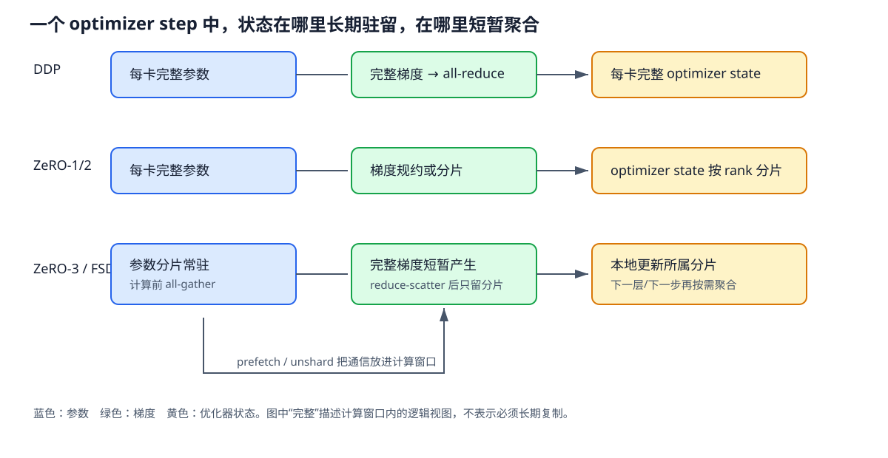

# DDP 与通信重叠

DDP 在每个 rank 保存完整模型，却让不同 rank 读取不同样本。反向传播得到的本地梯度必须合成同一份全局梯度，随后各 rank 才能执行相同的 optimizer update。性能问题就藏在“本地梯度产生”到“全局梯度可用”之间：参数梯度并非同时出现，collective 也不是等反向结束后一次完成。

这里跟随一个 step 中梯度真实出现的顺序，解释 bucket 如何形成、autograd hook 何时把参数标记为 ready、Reducer 何时发起异步 all-reduce，以及 optimizer 为什么仍要等待所有 bucket。图中的 DDP 行给出了状态所有权；ZeRO 与 FSDP 的差别会在后两篇展开。

*图 1：参数、梯度和优化器状态在三类数据并行方案中的常驻位置与临时聚合。作者绘制。*

## 同步语义从全局 batch 开始

设 world size 为 $D$，rank $r$ 的本地 batch 为 $B_r$，所有 rank 在 step 开始时持有相同参数 $\theta_t$。全局样本平均损失的梯度为

$$
g_t=\frac{1}{\sum_r|B_r|}\sum_{r=1}^{D}\sum_{x\in B_r}\nabla_\theta\ell(x;\theta_t).
$$

每个 rank 先计算本地梯度。各 rank 有效样本数相同时，对本地平均梯度求和再除以 $D$，就得到上式。PyTorch DDP 的梯度同步结果遵循平均语义；如果 loss 在本地使用 `sum` reduction，梯度尺度与单机全局 batch 写法会不同。序列 packing 还会让各 rank 的有效 token 数不相等，此时应按全局 token 分子、分母归一化，不能只假设每卡 batch size 相同。

DDP 不广播 optimizer update。all-reduce 完成后，各 rank 拥有数值相同的梯度，并以相同 optimizer state 执行相同更新，因此得到相同的 $\theta_{t+1}$。这个结论要求参数注册顺序一致、所有需要同步的梯度都参与相同 collective，且各 rank 以相同顺序进入通信；某个 rank 少走一个分支，就可能让 collective 永久等待。

### Bucket 把许多小梯度合成通信单元

若每个参数梯度都单独 all-reduce，几千次小 collective 会被启动延迟支配。Reducer 因此在构造 DDP 时按参数顺序、dtype 与容量上限组织 bucket。`bucket_cap_mb` 控制近似容量；实际 bucket 边界还受参数大小和实现重建行为影响。第一次迭代观察到真实梯度 ready 顺序后，实现可以重建 bucket，使后续通信更贴近反向顺序。

设某个 bucket 含梯度 $g_1,\ldots,g_k$，总元素数为 $n_b$，每元素 $w$ byte，则逻辑载荷为 $q_b=n_bw$。Ring all-reduce 可视为 reduce-scatter 加 all-gather，每个 rank 的理想发送量约为

$$
Q_b=2\frac{D-1}{D}q_b.
$$

例如 $D=8$、BF16 梯度 bucket 为 25 MiB 时，每 rank 算法发送量约为 $2\times7/8\times25=43.75$ MiB。若有效链路带宽为 50 GB/s，只计带宽的下界约 0.918 ms；还要加算法轮次的启动延迟、协议开销和共享链路争用。把 1 GiB 总梯度切成 40 个 25 MiB bucket，总算法字节没有减少，改变的是启动次数和每个 bucket 可利用的重叠窗口。

`gradient_as_bucket_view=True` 时，参数的 `.grad` 可以成为 bucket buffer 的视图，省去梯度到通信 buffer 的复制，也减少一份峰值内存。视图不能随意 `detach_()` 或替换存储；自定义 optimizer、梯度处理代码若假设每个 `.grad` 独立分配，需要先核对其原地操作语义。

### Autograd hook 决定 ready 时刻

反向传播从 loss 沿计算图逆序执行。某个参数的梯度累加完成时，DDP 注册的 autograd hook 通知 Reducer：“这个参数在本轮 ready”。Reducer 记录它所属 bucket；只有 bucket 内所有预期参数都 ready，才能对完整 buffer 发起异步 all-reduce。一个很早算完的梯度若与很晚算完的梯度放在同一 bucket，仍要等待后者。

以四层网络为例，反向顺序为 $L_4,L_3,L_2,L_1$。若 bucket A 包含 $L_4,L_3$，bucket B 包含 $L_2,L_1$，时间线可写成：$L_4$ ready 后 A 尚不能通信；$L_3$ ready 时 A 发起 all-reduce，同时设备继续计算 $L_2$；$L_1$ ready 后 B 才能发起通信。A 有 $L_2+L_1$ 的计算窗口可遮蔽，B 后面没有反向计算，未完成部分直接形成 step 尾部。

异步发起不等于 optimizer 可以提前更新。optimizer 读取某个参数前，其 bucket 的规约必须完成；常规 DDP 会在离开 backward 或进入更新边界前等待全部 bucket。否则不同 rank 可能用尚未规约完成的局部梯度更新参数，下一步便从不同的 $\theta$ 开始。

`find_unused_parameters=True` 会从 forward 返回值遍历 autograd 图，提前标记本轮不会产生梯度的参数，避免 Reducer 永远等待。代价是额外图遍历，而且控制流变化会增加调试复杂度。训练图固定且每轮 unused 集合不变时，`static_graph=True` 可省掉重复遍历，并支持部分以往受限的重入 backward 或 checkpoint 场景；图或 unused 集合实际变化时不应强行声明静态。

### 梯度累积与 `no_sync`

设每 rank 的 micro-batch 为 $b$，累积次数为 $a$，数据并行规模为 $D$，则一次 optimizer step 的 global batch 为 $B=abD$。若 loss 在每个 micro-batch 上取平均，常见做法是再除以 $a$ 后 backward，使累积 buffer 对应本 rank 的 $ab$ 个样本；同步轮把各 rank 结果平均，得到 global batch 的平均梯度。

默认 DDP 每次 backward 都会触发 bucket all-reduce。累积 $a=8$ 次却不使用 `no_sync()`，同一批参数会通信八次，总算法字节近似放大八倍。前七次 backward 放在 `with ddp.no_sync():` 内，只向本地 `.grad` 或 bucket view 累加；第八次离开上下文，hook 才按正常路径发起规约。`forward` 也必须位于 `no_sync` 上下文内部，因为 DDP 会在 forward 设置本轮 reducer 状态。

一个常见错误是只给 backward 套 `no_sync`，而 forward 已经在上下文外执行。此时同步抑制可能不生效。另一个错误是八次累积都放进 `no_sync`，随后直接 `optimizer.step()`；各 rank 更新的是不同数据产生的局部梯度，参数从此分叉。正确的边界必须包含一次同步 backward，或者显式完成等价规约后再更新。

累积期间梯度 buffer 持续存活。若框架把前几次梯度保留为独立 tensor，再在同步轮拷入 bucket，峰值会高于只看参数和最终 bucket 的估算。启用 bucket view 后通常可直接原地累加，但混合精度的 unscale、gradient clipping 和 overflow 检查都应放在完整累积结束、同步完成的更新边界；中途裁剪会改变全局梯度方向。

### 重叠能隐藏多少通信

令 bucket $i$ 在 $r_i$ 时刻 ready，通信持续 $c_i$，optimizer 最早在 $T_b$ 时刻需要全部梯度。忽略资源争用时，该 bucket 暴露在反向末尾之外的时间为

$$
E_i=\max(0,r_i+c_i-T_b).
$$

多个 bucket 使用同一 NCCL stream 时还会排队，实际开始时刻为 $s_i=\max(r_i,s_{i-1}+c_{i-1})$，暴露量取 $\max_i(s_i+c_i-T_b,0)$。把 bucket 切小只会让早期 bucket 更早 ready；链路若已被前序通信占满，继续切小会增加启动次数，却不会提前整组通信的完成时刻。

取四段反向计算各 3 ms，两个 bucket 通信各 5 ms。bucket A 在第 6 ms ready，bucket B 在第 12 ms ready。A 从 6 到 11 ms 传输，被后续 6 ms 计算完全遮蔽；B 从 12 到 17 ms 传输，反向已结束，因此 step 至少暴露 5 ms。若把 B 拆成两个 bucket，并分别在 9 ms、12 ms ready，第一块可在 11 到 16 ms 传输，第二块排到 16 到 21 ms；链路串行时反而暴露 9 ms。有效优化需要改变 ready 分布、总字节、带宽或通信与计算的资源冲突，单独减少 bucket 大小没有单调收益。

计算和通信也可能争用 HBM、L2、copy engine 或 SM。单独运行 backward 为 12 ms，collective 为 8 ms，并发后若 backward 变为 15 ms、collective 变为 10 ms，总时间可能达到 17 ms。时间线显示二者重叠了 8 ms，但相对无通信基线仍增加 5 ms。所谓隐藏比例应以无通信计算基线为参照，不能按彩色区间的几何重叠面积计算。

**慢 rank 如何传遍所有设备**

Collective 只有所有参与 rank 到达并完成对应轮次后才能结束。某个 rank 因数据加载晚 4 ms、GPU 降频或前序 kernel shape 更慢，其他 rank 会在 NCCL 调用中等待。Profiler 往往把等待记入通信区间，因此“某 rank 通信时间长”不等于它的网络链路慢。

诊断时为每个 bucket 记录本地 ready、collective enqueue、GPU kernel start 和 completion 四个时间。若同一 bucket 的 ready 在 rank 间相差 4 ms，而 kernel start 随最晚 rank 对齐，根因位于通信之前；若 ready 接近而某条路径吞吐低，再检查 NIC 亲和、rank 放置、链路错误与拥塞。只看所有 rank 的平均通信时间会把迟到者与等待者混在一起。

Straggler 还会跨 step 放大。同步 optimizer 必须等待最慢 rank，较快 rank 随后同时进入下一轮数据读取或 collective，容易制造存储与网络突发。一个偶发 20 ms 慢点可能让后续几个 step 都出现队列抖动。需要同时画 rank 时间线和系统资源曲线，确认延迟是否在故障点后恢复。

**一组可以复现的诊断实验**

实验固定模型、输入 shape、dtype、global batch 和随机种子，记录单 rank backward 作为计算基线。随后启用 DDP，分别测试 1、4、16、64 MiB bucket；每组报告 step time 分布、每个 bucket 的 ready/completion、NCCL 总字节和峰值显存。若字节随 bucket 大小改变，说明统计区间或梯度集合并不一致。

再固定 bucket，测试累积次数 $a=1,2,4,8$。正确使用 `no_sync` 时，每个 optimizer step 的规约次数大体稳定，每 token 通信字节随累积增加而下降；未抑制同步时规约次数与 $a$ 同比增长。比较参数 checksum 和一次更新后的权重，可以同时发现漏同步与 loss 缩放错误。

再人为让一个 rank 在 backward 前延迟 5 ms。若所有 rank 的 collective completion 整体后移约 5 ms，而链路吞吐没有变化，就验证了迟到传播。撤掉延迟后仍持续变慢，则继续检查数据队列、CUDA stream 依赖或网络拥塞。这样的对照实验把“通信慢”拆成到达时间、传输时间和资源争用三个可证伪假设。

**Reducer 维护哪些状态**

Reducer 至少需要知道参数到 bucket 的映射、本轮各参数是否 ready、每个 bucket 尚欠多少梯度、异步 collective 的 work handle，以及本轮是否已经完成全部规约。Backward 开始前，计数器恢复为当前迭代的预期值；hook 每触发一次就登记对应参数。计数归零的 bucket 被标记可规约，通信完成后才能把结果暴露给更新阶段。

同一参数在一次迭代中意外 ready 两次，通常意味着 reentrant backward、参数在多个 checkpoint 区域重复使用，或自定义 autograd 破坏了 Reducer 的预期。参数永远不 ready 则常见于条件分支、提前退出或 forward 返回值没有连接到 loss。错误不能靠延长 collective timeout 修复，因为等待对象本身不会出现。

DDP 要求各 rank 以相同顺序注册参数。Reducer 依赖这个顺序建立一致的 bucket；若两个 rank 的 module 构造分支不同，逻辑上同名参数也可能落入不同 collective。一个 rank 对 bucket A 做 all-reduce，另一个 rank 同时对 bucket B 做 all-reduce，通信序列便无法匹配。启动后可在各 rank 汇总参数名、shape、dtype 与顺序 hash，提前阻止这种静默错配。

第一次 backward 提供了真实 ready 顺序。Bucket rebuild 可以将相邻 ready 的参数放到一起，让早期 bucket 更快填满。重建改变的是通信分组与时机，不改变梯度集合；若模型的控制流使 ready 顺序每轮变化，按首轮重建反而可能让后续某个 bucket等待跨分支参数。此类模型应先统计多轮 ready 分布，再决定固定 bucket、启用 unused 检测或重构控制流。

## 动态图和复杂控制流

Mixture-of-Experts、可选辅助头和按样本路由会让部分参数只在某些迭代参与计算。`find_unused_parameters=True` 通过遍历本轮 autograd 图识别未使用参数，保证 bucket 计数能够归零。但“本轮 unused”并不等于参数可永久删除：下一批数据可能走另一条分支。

设 bucket 内有 100 MiB 参数，其中一个 1 MiB 辅助头只在 10% 的 step 启用。没有 unused 检测时，另外 90% 的 step 会等待其梯度；把辅助头独立成小 bucket 可以减小牵连范围，却增加一次 collective。更稳定的办法是让所有 rank 对分支作出一致决定，并明确无梯度参数在当前 step 的更新语义。

`static_graph=True` 声明 used/unused 集合和图结构在训练期间稳定。它允许 Reducer 缓存遍历结果，并支持一些重入反向组合。该声明是程序不变量，不是性能开关；数据相关分支、训练中解冻参数或改变 checkpoint 包裹范围都会使它失效。升级模型代码后应重新跑多轮参数 ready 集合对比。

### Collective、拓扑与通信 dtype

All-reduce 的逻辑结果固定，具体算法可以是 ring、tree 或分层组合。Ring 的带宽项接近 $2(D-1)q/D$，轮次随 $D$ 增长；tree 的依赖深度约为 $O(\log D)$，更适合启动成本占主导的小消息。跨节点训练常在节点内聚合、节点间交换分片、节点内分发，减少慢速层承载的重复流量。

算法选择必须绑定 bucket 大小和 rank 放置。25 MiB bucket 可能适合持续带宽较高的 ring，几十 KiB 的 bucket 更容易被轮次延迟控制。若 DP group 跨两个不同交换域，平均链路带宽不能代表最慢边；应用基准应同时报告 rank 映射、节点数与每节点 GPU 数。

通信 hook 可以在 bucket ready 后替换默认规约，例如先把梯度转换为 FP16、量化或执行 PowerSGD，再返回规约结果。假设 FP32 bucket 为 100 MiB，转 FP16 后载荷可降到 50 MiB，但会增加转换 kernel、误差与临时 buffer。压缩收益至少满足

$$
T_{encode}+T_{comm}^{compressed}+T_{decode}<T_{comm}^{original}.
$$

Hook 还必须保持 future 完成语义和梯度尺度。若默认 DDP 输出平均梯度，hook 只执行 sum 而漏除 world size，学习率等效放大 $D$ 倍。误差反馈算法还会引入跨 step 常驻残差，checkpoint 必须保存该状态，否则恢复后的优化轨迹发生跳变。

### 数值等价与恢复边界

除以 world size 可以发生在 collective 内、collective 后或 loss 缩放阶段，只要整个链路恰好除一次。以 $D=8,a=4$ 为例，本地四个 micro-batch 的平均 loss 若各自除以 4，累积后再由 DDP 平均，得到 32 份等权 micro-batch 的平均梯度。若代码同时把 loss 除以 $D$，最终梯度会再小八倍。

单元测试可在两张卡上使用确定性线性层和固定样本，比较 DDP 一步更新与单进程拼接全局 batch 的结果。测试同时覆盖 loss 为 mean/sum、累积次数、unused 分支和 bucket view；容差由 dtype 与规约顺序决定。测试失败时比较规约前本地梯度、规约后梯度和 update 三个检查点，能定位多除、漏除或漏同步。

DDP checkpoint 通常只需保存一份完整模型与 optimizer state，但还要保存 step、scheduler、随机数和数据进度。Resume 到不同 world size 时，模型参数可以广播，global batch 和每 rank 数据分片却会改变；保持 $B=abD$ 需要重新选择 $a$ 或 $b$，学习率与 scheduler 的 samples 计数也必须保持连续。

若使用通信压缩残差、动态 loss scaler 或自定义 reducer 状态，这些对象也属于恢复集合。恢复后先执行一个小 step，对比各 rank 参数 checksum 与全局梯度范数，再进入长跑。文件成功加载只能证明字节可读，不能证明下一次 collective 的组、顺序和缩放仍与保存前一致。

### 生产时间线的判读

某训练任务从 8 卡扩到 64 卡后，单卡计算从 120 ms 降到 24 ms，通信区间却达到 18 ms，step 为 39 ms。时间线显示前六个 bucket 与反向重叠，尾部两个在反向结束后持续 15 ms。总通信 18 ms 只是累计量，15 ms exposed tail 才是扩展损失主体。

进一步比较 rank ready 时间，若尾桶在多数 rank 于 22 ms ready，某一 rank 到 31 ms 才 ready，网络优化最多只能处理 31 ms 之后的传输。检查慢 rank 发现对应数据 batch 含更长序列，局部 backward 多 9 ms。按 token 数平衡 batch 后，ready 偏差收敛，尾部随之缩短；链路和 NCCL 配置没有变化。

另一种情况是所有 rank 在 22 ms 左右 ready，collective completion 却分散到 37 ms，并伴随 NIC 重传或跨交换域流量。此时应核对 DP group 放置和网络基准。两种现象在汇总 profiler 中都可能显示「尾桶通信 15 ms」，只有 per-rank ready 与传输事件能够区分计算迟到和链路慢。

### 从参数量算到一次完整 step

考虑一个 7B 参数的稠密模型，BF16 梯度为 $2\times7\times10^9=14$ GB。数据并行规模 $D=8$，每节点 8 卡，DP group 完全位于一台 NVSwitch 机器内。若 Reducer 使用 256 MiB bucket，忽略尾桶未满，共约 $14\text{ GB}/256\text{ MiB}\approx53$ 个 bucket。Ring all-reduce 每 rank 的算法流量为

$$
Q_{rank}=2\frac{D-1}{D}\times14\text{ GB}=24.5\text{ GB}.
$$

目标拓扑对该消息分布的实测有效带宽为 180 GB/s，因此只计带宽的 collective 下界约 $24.5/180=136$ ms。53 次启动若每次端到端固定开销按 8 µs 估算，只增加约 0.42 ms；大 bucket 场景主要受持续带宽控制。这个 136 ms 是全部通信工作量的下界，不等于 step 必然增加 136 ms。

把 backward 按层组分成十段，实测计算时间依次为 18、17、17、16、16、15、15、14、14、13 ms，总计 155 ms。梯度在每段结束时进入若干 bucket。前 45 个 bucket 在 130 ms 前 ready，NCCL stream 能持续工作；剩余 8 个集中在末段 25 ms 内 ready。原配置的尾桶直到 backward 结束才发起，collective 在 183 ms 完成，因此相对 155 ms 无通信基线暴露 28 ms，step 的模型段约为 183 ms。

Profile 进一步显示尾部 256 MiB bucket 混合了多个早期层参数与一个很晚 ready 的 embedding 梯度。将该 embedding 独立放进 64 MiB bucket，并按稳定 ready 顺序重建其余 bucket 后，倒数第二批通信提前 11 ms。总算法字节仍为约 24.5 GB，collective 累计区间也几乎不变，但整组完成时刻降到 174 ms，exposed tail 从 28 ms 降为 19 ms。

继续把所有 bucket 都缩到 64 MiB 后，数量增至约 214。理论带宽项不变，实测却因更多 launch、调度和小消息效率下降，整组完成时刻回升到 179 ms。这个结果说明 bucket 调优改变的是 ready 粒度和排队形状；它不减少梯度字节，也不存在「越小越容易重叠」的单调关系。

若随后启用四次梯度累积和正确的 `no_sync`，每个 optimizer step 仍只规约一次 14 GB 梯度，每 token 通信成本降为原来的四分之一；step 本身多执行三轮本地 forward/backward。若四轮全部同步，总通信流量会变成约 98 GB/rank，链路下界也接近四倍。比较方案时应使用 token/s，而不是只看一个 step 的毫秒数。

**上线前要让失败有明确含义**

**语义检查**

两卡 DDP 的一步更新应与单进程、同一全局 batch 的更新在数值容差内一致。若规约后梯度整体相差固定倍数，检查 loss reduction、累积除数和 world-size 除法；若只少部分参数不同，检查 unused 分支、hook 注册和参数顺序。每个 optimizer step 后收集参数 checksum，rank 间不一致意味着漏同步、collective 序列错位或某 rank 跳过了更新。

用相同样本分别运行 `gradient_as_bucket_view` 开关。结果不同通常说明自定义梯度处理替换、detach 或重建了 `.grad` 存储。启用 `static_graph` 前连续记录多轮 used parameter 集合；集合变化却仍声明静态，会把动态图问题延迟成 reducer 等待或错误梯度。

**性能检查**

报告每个 bucket 的大小、ready、enqueue、kernel start 和 completion，而不是只给 NCCL 总时长。Ready 分散说明反向计算或 bucket 映射决定尾部；ready 接近而 completion 慢才把注意力转向网络和通信算法。单 rank 基线与 DDP 的计算 kernel shape 必须相同，否则所谓通信开销还混入了模型切分或 batch 变化。

分别扫实际使用的 micro-batch、累积次数和序列长度。某个整齐 shape 上的最佳 bucket 可能在 ragged batch 下产生慢 rank。测量需要跨过编译、allocator 扩容和时钟预热，并报告 p50/p99；只有平均值改善而 p99 变差时，同步训练的长期 goodput 可能反而下降。

## 故障检查

让一个 rank 延迟、跳过分支或在 collective 前退出，确认监控能指出最早偏离的 rank 和 bucket。只有统一 timeout 的“通信超时”无法区分数据迟到、控制流错位与链路故障。恢复测试还要在 checkpoint 加载后执行至少一个完整 step，核对参数 checksum、梯度范数、数据位置和 scheduler 计数。

网络降级测试应覆盖一条链路变慢或 rank 映射改变后的 p99。若正常状态已经长期占用接近全部有效带宽，轻微降级就会让 bucket 排队跨过反向结束点。容量规划需保留这种余量，并把降级拓扑的 collective 基准纳入回归。

上线看板还应同时显示有效 token/s、step 各阶段分位数、最早与最晚 bucket ready 的 rank、collective 暴露尾部、数据等待和重试次数。只有 NCCL 利用率时，数据长尾会被误判成网络问题；只有 GPU 利用率时，collective 排队又会被计算掩盖。告警应绑定最早异常事件，并保留少量完整 rank 时间线用于回放。版本变更后若总吞吐下降，看板可以直接回答变化来自输入、反向计算、梯度到达、传输还是更新等待。

回归结果必须绑定模型提交、框架版本、通信库、驱动、拓扑和输入长度分布。同名 bucket 配置在参数注册顺序改变后可能对应完全不同的梯度集合；只保存 `bucket_cap_mb` 无法复现实验。至少要保留参数到 bucket 的映射摘要和各 rank 的 ready 分位数，才能判断新版本改变了计算图还是链路表现。

### 分层 All-Reduce 的流量怎么走

跨节点 DDP 常把 GPU 分为节点内组与节点间组。每节点有 $G$ 张 GPU、节点数为 $N$ 时，一种分层实现会在节点内 reduce-scatter，让每张 GPU 得到梯度的一段；相同 local rank 跨 $N$ 个节点规约对应分段；完成后在节点内 all-gather。大流量优先走 NVLink/NVSwitch，跨节点网络只承载每个 local rank 的分片。

假设 bucket 为 256 MiB，单节点 8 卡、共 16 节点。节点内 reduce-scatter 后每卡保留 32 MiB；跨节点 ring 对这 32 MiB 的每 rank 算法流量约为 $2\times15/16\times32=60$ MiB；节点内还要完成 reduce-scatter 与 all-gather。若直接让 128 个 rank 在同一平面 ring 上处理 256 MiB，算法字节虽然仍接近两倍 payload，慢速跨节点边会承载更多分段并受拓扑映射影响。分层算法的收益来自让不同链路承担匹配其带宽的阶段。

节点内阶段与节点间阶段形成依赖，较小 bucket 更容易流水：bucket A 的跨节点规约进行时，bucket B 可做节点内 reduce-scatter。可是两个阶段可能争用 GPU copy/SM 和 PCIe root，流水深度也会增加在途 buffer。profile 应分别标出 intra-node 与 inter-node kernel，不能把整段都归为一个 NCCL 时间。

拓扑感知还包括 rail、NIC 与 NUMA 亲和。GPU 到 NIC 若经过额外 PCIe switch 或跨 CPU socket，理论网络带宽无法兑现。每个 rank 记录 GPU bus id、NIC、CPU affinity 和 communicator 拓扑摘要；出现单 rank 慢时，先比较路径，而不是把所有节点一起调参。

### Bucket 时间线可以直接手算

设三个 bucket 的 ready 时刻分别为 40、70、100 ms，单通信流上的持续时间为 35、35、20 ms，backward 在 110 ms 结束。第一个从 40 到 75 ms；第二个虽在 70 ms ready，也要等到 75 ms 才开始，至 110 ms 完成；第三个 100 ms ready，却排到 110–130 ms。暴露尾部是 20 ms。

若将第一个 bucket 减半，使两部分在 25、40 ms ready，各耗 19 ms，队列变成 25–44、44–63、70–105、105–125 ms，尾部降为 15 ms；启动和小消息损失已体现在 19 ms 中。若实际半桶各耗 24 ms，完成序列变为 25–49、49–73、73–108、108–128 ms，尾部仍是 18 ms，收益很小。调 bucket 前只需把 profiler 的 ready 与持续时间代入一次，就能淘汰许多没有窗口的方案。

多个通信 stream 不一定让尾部两个 bucket 并行。它们使用相同 NIC/NVLink，底层协议可能共享通道；并发只把带宽分开，还会增加调度。独立 DP group、TP collective 与 checkpoint I/O 同时发生时，也要放进同一链路队列。单独 microbenchmark 的 200 GB/s 不等于训练中每条流都能获得 200 GB/s。

### 通信与计算为何互相拖慢

反向 GEMM 读取权重、activation 并写梯度，all-reduce 同时读取和写入 bucket；两者都可能吃 HBM。假设反向单独需要 12 TB/s，collective 的 GPU 侧搬运需要 4 TB/s，而设备可持续 13 TB/s，并发时总需求超过供给。即使网络尚未满，GEMM 与 collective 都会延长。

某些 collective kernel 还占用 SM 处理规约与协议。为通信保留更多 channel 能提高网络吞吐，却减少计算可用执行资源；channel 太少又让尾部暴露。评估配置时报告单独 backward、单独 collective 和并发后的两者时间，计算干扰系数

$$
I_c=\frac{T_{backward}^{overlap}}{T_{backward}^{alone}},\qquad
I_n=\frac{T_{comm}^{overlap}}{T_{comm}^{alone}}.
$$

$I_c=1.18,I_n=1.10$ 表示所谓重叠已经让计算慢 18%、通信慢 10%。如果隐藏的区间小于新增的干扰，关闭部分 overlap 或延后大 bucket 反而更快。这里的选择要靠训练 shape 实测，因为不同 GEMM 算术强度、GPU 和链路差异很大。

### 混合精度下的规约顺序

BF16/FP16 计算不自动决定梯度通信 dtype。参数梯度可能以 BF16 写入 bucket，也可能累加到 FP32 buffer 后通信。BF16 将 payload 减半，却让规约舍入更明显；FP32 稳定性更好，带宽和显存翻倍。框架、优化器与模型设置共同决定实际 dtype，必须从 bucket storage 检查。

FP16 训练常配 loss scaling。Forward loss 乘缩放因子 $s$，反向得到 $sg$；规约具有线性，先 all-reduce 再除以 $s$ 与先除再规约在实数中等价，浮点溢出检测和舍入却不同。若任一 rank 出现 Inf/NaN，所有 rank 必须对 overflow 标志做一致规约并共同跳过更新，否则参数分叉。

全局梯度裁剪也依赖同步后的整体范数。数据并行每个 rank 在 all-reduce 后有相同完整梯度，可本地计算同一范数；若在 bucket 完成前逐段裁剪，不同 bucket 的缩放因子会破坏向量方向。完全分片则计算本地平方和，再跨 rank 规约标量。DDP 通信 hook 若返回压缩梯度，裁剪看到的是解压后的近似量，语义要在实验中固定。

**Uneven Input 与 Join**

数据集尾部、过滤或在线流可能让各 rank 的迭代数不同。某 rank 提前耗尽数据后不再进入下一轮 collective，其他 rank 会等待。DDP Join 类机制让已结束 rank 用占位 collective 跟随剩余 rank 的通信序列，直到所有 rank 完成；这解决控制流匹配，不会凭空补齐样本。

剩余 rank 数变化时，梯度除数需要明确。若仍按初始 world size 平均，占位 rank 相当于贡献零梯度；若按有效 rank 数缩放，优化尺度保持每样本平均，却改变 collective 后的除法。Join 配置必须与 loss reduction、batch 统计和学习率语义一致。最简单的训练通常在 sampler 层补齐或丢弃尾部，让各 rank step 数相同。

不均匀输入也可能发生在同一 step 内：每 rank 样本数相等，但有效 token 差异很大。Collective 序列仍能匹配，长 token rank 却成为稳定 straggler。按总 token 平衡分片，并用全局有效 token 数归一 loss，可同时改善 ready 偏差和数学语义。

**从一次卡住定位到第一个不同事件**

Collective timeout 通常出现在故障链末端，rank 间的差异可能早已出现。每个 rank 为 step、bucket 和 collective sequence 编号，记录参数 ready bitmap 的摘要。故障发生时比较各 rank 共同完成的最大 sequence，再查看下一 sequence：某 rank 没有 enqueue，问题位于其反向图或数据路径；所有 rank 都 enqueue 但没有完成，才进入链路、进程与设备故障检查。

控制流错位的典型迹象是 rank 0 的 sequence 27 对应 bucket A，rank 3 的 sequence 27 对应 bucket B。二者 payload 大小甚至可能相同，通信库无法知道语义不同，结果可能是挂起，也可能完成后把错误梯度混合。启动时的 bucket 映射 hash 只能发现静态差异，运行时动态分支还要比较每轮 ready 集合。

链路故障则表现为所有 rank 对同一 sequence 和 payload 达成一致，GPU kernel 已发起，但某个 channel 长时间无进展。收集 NIC 错误、重传、GPU Xid、进程存活和拓扑状态。自动重启前保留这些信息；单看重启后恢复，无法区分瞬时网络、硬件故障与程序错位。

**DDP 健康面板的最小集合**

每 step 记录计算开始、首个与尾部 bucket ready、尾部 collective 完成和 optimizer 完成。由此直接得到 forward/backward、ready 展宽、暴露尾部和更新时间。按 rank 报 p50/p99 以及最慢 rank id，能发现稳定热点和偶发长尾。

每 bucket 记录 payload、dtype、参数数量、ready spread、排队时间与传输时间。Ready spread 是最早与最晚 rank 的到达差；排队时间是本地 ready 到 kernel start；传输时间是 kernel start 到 complete。三者分别指向计算偏斜、链路队列和实际 collective。

再配上有效 token、数据等待、GPU 时钟、HBM 带宽、网络吞吐与错误计数。若 ready spread 随 token 差异增长，调整数据平衡；若排队随 TP collective 增长，检查多通信域争用；若传输时间在固定 payload 下增长且伴随重传，检查网络。面板围绕可区分的因果量组织，比单一「通信占比」更适合长期回归。

指标采样本身也要控制代价。每个 step 收集所有参数时间会制造大量 CPU 事件和同步压力；常态只保留 bucket 级聚合，出现回归时再对少量 step 打开参数级追踪。不同 rank 的主机时钟可能有偏差，跨 rank 比较优先使用 collective 序号和相对 GPU event；需要绝对时间时先校准时钟。采样窗口包含 warmup、稳定段和异常段，避免只截取最快的几十步。

面板上的总通信时间允许重叠计算，因此各阶段相加可能超过 step wall time。这属于时间区间交叠，不是统计错误。告警使用 exposed tail、排队与传输分量；总通信时间适合判断链路工作量，不能直接当作可消除的延迟。

长期趋势还应按模型阶段分段：序列长度、解冻参数或并行组变化都会改变梯度集合。跨阶段比较先归一到每 token 字节与固定 payload 带宽，再讨论通信库回归。

所有结论都应由同一输入与拓扑复测。

## 调 Bucket 的顺序

第一步固定输入与拓扑，保存每个参数的 ready 时刻和现有 bucket 映射。把参数按中位 ready 排序，再看跨多轮的波动；中位接近且波动小的参数适合放在同一 bucket。某个参数 ready 方差很大，常见于条件分支或动态 shape，把它混入大 bucket 会让整个 bucket 的时间难以预测。

Exposed tail 中的首个链路空档能区分带宽饱和与 bucket 等待。若链路从 30 ms 到 backward 结束一直繁忙，早期 bucket 已经足够细，继续拆早期参数没有收益；应处理末批 ready 的 bucket、减少总字节或提高链路。若链路在 50–70 ms 空闲，而一批梯度在 55 ms 已 ready 却因同 bucket 的晚参数等到 80 ms，就有明确的重组空间。

第三步只改一组边界，测至少几十个稳定 step。记录总字节、collective 数、暴露尾部、backward 干扰、峰值显存和 p99。Bucket 变小后尾部下降 4 ms、backward 增加 3 ms、启动增加 1 ms，净收益接近零；只看尾部会误判。结果与参数映射摘要一同保存，模型结构改变后重新测。

### 一个参数就绪错配的例子

某 bucket 有四个梯度：attention 输出投影 32 MiB、MLP 下投影 48 MiB、早期 LayerNorm 1 MiB、embedding 64 MiB。前三者分别在 40、44、96 ms ready，embedding 因 tied output head 到 108 ms 才 ready，整个 145 MiB bucket 只能在 108 ms 发起。把大小相近放一起并没有获得重叠。

将 80 MiB 的两个晚梯度组成 bucket B，前两个 80 MiB 组成 bucket A，A 在 44 ms 发起；B 仍到 108 ms 才发起。总字节不变，A 获得 64 ms 的计算窗口。若 B 通信 6 ms、backward 在 110 ms 结束，只暴露约 4 ms；原 145 MiB bucket 若耗 10 ms，会暴露约 8 ms。

若 embedding 每隔几轮因未使用而缺席，Bucket B 还需 unused 语义。所有 rank 同时不使用时可标记 ready 并贡献零梯度；不同 rank 分支不一致时，仍要参加同一 collective，否则通信序列错位。性能分组不能改变参数在全局梯度中的数学身份。

### 梯度压缩的误差状态

Top-k、量化与低秩通信减少 payload，却引入近似。误差反馈常保存残差 $e_t$，先令 $u_t=g_t+e_t$，发送压缩值 $C(u_t)$，再更新

$$
e_{t+1}=u_t-C(u_t).
$$

残差与参数同 shape 时会增加一份长期状态，7B 模型即使 BF16 也需要约 14 GB；分片或更低精度能减小容量，但会影响误差补偿。只比较网络字节而漏掉残差显存与压缩 kernel，方案可能根本放不进训练配置。

压缩还改变重叠窗口。编码只能在 bucket ready 后开始，解码在通信后完成；若原 collective 已被计算遮住，新增编码/解码可能直接延长尾部。先对暴露 bucket 使用压缩比全量启用更容易评估，但不同 bucket 使用不同近似也要经过收敛验证。

恢复时必须保存每个 bucket 的残差及映射版本。参数顺序或 bucket 边界改变后，旧残差不能按字节直接套用。可以按参数名重组，或在结构变化时显式丢弃并记录优化轨迹发生重置。静默错位会把某个参数的历史误差加到另一个参数上，数值仍有限却失去含义。

### 实现约束与出处

| 事实 | 一手来源 | 这里的使用位置 |
| --- | --- | --- |
| DDP 在梯度 ready 时按 bucket 触发同步 | PyTorch DDP Notes 与 DDP API | Reducer、hook、ready 时间线 |
| `no_sync` 要把 forward 放在上下文内 | PyTorch DDP API `no_sync()` 警告 | 梯度累积边界 |
| `gradient_as_bucket_view` 让梯度成为 bucket 视图 | PyTorch DDP API | 显存与原地操作约束 |
| `find_unused_parameters` 从 forward 返回图遍历 | PyTorch DDP API | 动态分支与未使用参数 |
| `static_graph` 要求 used/unused 集合稳定 | PyTorch DDP API | 静态图声明边界 |
| Megatron DDP 使用连续 grad buffer 与 bucket overlap | Megatron Core Distributed API | 生产实现对照 |

同一份验收记录还应保留 rank 映射与拓扑，避免换机后误用旧的通信结论。

### 参考资料

- [PyTorch DistributedDataParallel](https://pytorch.org/docs/stable/generated/torch.nn.parallel.DistributedDataParallel.html)
- [PyTorch Distributed Data Parallel Notes](https://pytorch.org/docs/stable/notes/ddp.html)
- [Megatron Core Distributed Data Parallel](https://docs.nvidia.com/megatron-core/developer-guide/latest/api-guide/distributed.html)
