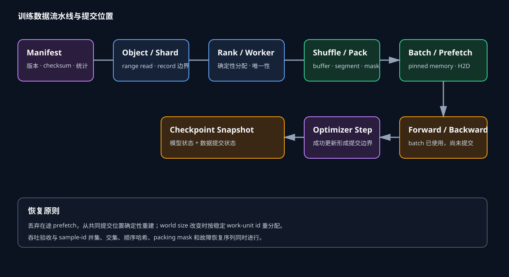

# 分片洗牌与恢复

训练数据管线既要持续供给 GPU，也要定义每个 step 消费了哪些样本。对象读取、worker 预取和 H2D 可以并发推进，因此“已经读取”与“已经用于一次成功更新”不是同一位置。恢复状态应以已提交 optimizer step 对应的数据边界为准，并明确在途样本是重放、丢弃还是精确恢复。

*图 1：manifest 固定对象集合，确定性调度把 shard 与样本分到 worker；packer 和 prefetch 可以领先，只有成功 step 才推进提交位置。作者绘制。*

## 数据契约与确定性分片

### 不可变 manifest 是起点

Manifest 为每个 shard 保存 `shard_id、uri、version、bytes、samples、tokens、checksum、format、index_uri`。训练 run 保存 manifest 自身的内容哈希。URI 相同而对象被覆盖时，version/checksum 能阻止静默读取新内容；只有 URI 没有内容身份，恢复结果无法复现。

Shard id 要稳定且与列举顺序分离。新增或删除数据时生成新 manifest，不能在旧列表中原地插入后仍沿用旧版本号。多源混合为每条 shard 标 source，并保存源权重、温度采样或配额日程。数据版本还包含 tokenizer、normalization、dedup 与过滤版本，因为同一原文经过不同处理会形成不同 token 序列。

启动阶段所有 rank 获取同一 manifest hash，可由 rank 0 广播摘要并让各 rank 校验。本地缓存命中也要验证内容身份；文件名相同不足以证明缓存正确。完整 checksum 可在首次填充时验证，后续读取使用文件大小、原子完成标记与周期抽检降低成本。

### 样本边界必须能独立验证

顺序 shard 的解析单位可以是 tar member、长度前缀 record 或带索引的压缩 frame。每条记录需要明确 offset、encoded length、decoded length 和 sample id。对象 range request 从中间开始时，起点必须落在合法边界；下载截断不能把残片交给 decoder。

长度前缀格式可将一条记录写为 `[length][payload][checksum]`。Reader 先验证 length 未超过剩余字节，再校验 payload。若对象在第 $k$ 条记录中途结束，前 $k-1$ 条可安全消费，第 $k$ 条报告损坏。JSONL 的换行边界较简单，payload 内换行、编码错误和末行无换行仍要统一处理。

样本 id 可由 `hash(dataset_version, shard_id, record_index)` 生成，不依赖 rank 与 worker。Packing 后的序列保存组成它的 sample id 与 token 区间。出现 loss 异常或版权删除请求时，可以从训练 token 追溯到原始记录。

### 两级洗牌的随机窗口

数据量过大时无法把所有样本索引放入内存，常采用 shard shuffle 加 buffer shuffle。对逻辑 epoch $e$，先用种子

$$
s_e=H(run\_seed,e,manifest\_hash)
$$

生成 shard 排列 $\pi_e$。每个 worker 顺序读取分到的 shard，再维护容量 $K$ 的样本 buffer：填满后随机弹出一个样本，并用新样本补位。$K$ 越大，局部顺序相关越弱，内存和恢复状态越大。

Buffer shuffle 不是全局均匀排列。两个相距超过若干 shard 的样本通常不会交换位置，源数据若按领域排序，较小 buffer 会保留长程相关。预处理阶段应先打散源顺序或生成足够多 shard；训练报告记录 shard 构建方法、shard shuffle seed 与 buffer 大小。

确定性要求随机选择只由稳定坐标决定。Python 进程启动顺序、worker PID 和读取完成先后不能成为隐式种子。异步下载若按“谁先完成就先入 buffer”，对象存储尾延迟会改变样本顺序。需要严格复现时，下载可以乱序完成，交付给 shuffle 阶段仍按逻辑 shard 序号提交。

### 跨 rank 唯一性

设 world size 为 $P$，每 rank 有 $W$ 个 worker，全局 worker 数 $G=PW$，全局 worker id 为 $g=rW+w$。最简单分配为排列后第 $i$ 个 shard 交给 $g=i\bmod G$。每个 shard 只有一个 owner，样本天然不跨 worker 重复。

Shard token 数差异很大时，模分配可能失衡。可将 shard 按 token 数做确定性 greedy partition：依次把下一 shard 放到当前累计 token 最少的 worker，tie-break 使用 worker id。分配结果由 manifest、epoch seed 和 $G$ 唯一确定。保存完整 assignment 可加快恢复，也要校验算法版本。

当 shard 数少于 worker 数，部分 worker 空闲。把同一 shard 拆给多个 worker 时，必须按 record index 再分片，例如 `record_index mod G`；压缩格式若不支持随机 seek，各 worker 重复解压会浪费 CPU 与网络。更稳妥的方式是在数据准备阶段增加 shard 数。

尾部 batch 还会引入重复。某些 sampler 为让每个 rank step 数一致，会补齐索引；补齐项必须标记并明确是否参与 loss。`drop_last` 会丢掉尾部样本，但不重复。选择哪种语义取决于同步训练约束，指标要同时报告唯一样本数、训练 token 数和补齐 token 数。

**World size 改变时怎样分配**

按旧 rank 保存本地 shard offset，只能恢复到相同 $P,W$。弹性恢复若改变 world size，可基于全局 work unit 重新分配。Work unit 可以是 `(epoch, shard_position, record_range)`，其完成状态按稳定 id 保存。新 worker 集合从尚未提交的 unit 继续。

逐样本完成位图很精确，状态可能很大；只在 shard 边界提交，状态小但故障时重放整个 shard。折中方案把 shard 切成固定 record block，例如每 4096 条一个 unit。恢复最多重放一个 block，并能在不同 world size 间重新散列。

参数更新同步要求各 rank 拿到相同数量 batch。新 world size 若改变 global batch，应配套调整 microbatch、梯度累积与学习率语义。数据恢复只保证样本分配，不能单独保证优化轨迹不变。

**Packing、预取与提交边界**

**Packing 的状态比样本游标更多**

固定长度 $L$ 的 packer 读取可变长 token 文档，把它们放入序列。状态至少包含当前未完成序列、已取出但尚未放置的文档、超长文档 offset、source 调度器状态和随机选择状态。只保存上游 record index，会在恢复时丢掉这些已读 token或重复整条文档。

例如 $L=2048$，依次读取长度 `[1500,900,700]`。第一条放入当前序列，第二条若禁止切分则不能填入剩余548 token，可能先完成带 padding 的序列，再把900与700拼成下一条；若允许切分，第二条前548 token填满第一条，余352 token进入下一条。两种策略产生不同 position、EOS 与 loss mask。

文档边界要进入模型输入。独立文档 packing 常在每条文档重置 position id，并使用 block-diagonal attention mask；连续语料训练可能允许跨边界 attention。EOS 插入会占用长度，loss mask可决定是否预测首token或padding。吞吐统计中的“有效token”要排除padding和被mask位置。

**Prefetch 形成多个游标**

设 DataLoader 有 8 个 worker，每个预取 2 个 batch，训练进程还缓存 4 个 batch，则消费游标前方可能已有 20 个 batch。对象层可能又提前下载数个 shard。读取游标说明数据已经进入系统，提交游标说明相应梯度更新已经成功，两者差值就是故障时可能重放的窗口。

精确恢复可以序列化所有在途 batch，但 checkpoint 体积、暂停时间和版本兼容性都会增加。常见做法保存确定性生成状态与提交位置，丢弃在途数据，恢复时从提交位置重新生成。这样可能重复 I/O 和 tokenize，不会重复已提交训练样本。

异步 checkpoint 还要绑定数据提交位置。模型状态在 step $t$ 的快照必须配套 step $t$ 的数据状态；后台写盘期间训练已走到 $t+k$，不能把较新的数据游标写进旧模型 checkpoint。二者以同一 checkpoint id 原子发布。

预取队列必须按字节而非只按对象个数设上限。压缩 shard 的大小可能相近，解压后的 record 数、token 数和 packing 中间量却差数倍。设下载、解压、tokenize、packing 与 ready 队列的字节上限分别为 $Q_o,Q_d,Q_t,Q_p,Q_r$，主机侧可控驻留量近似为

$$
M_{pipe}\le Q_o+Q_d+Q_t+Q_p+Q_r+M_{work},
$$

其中 $M_{work}$ 是各阶段正在处理、尚未进入队列的对象。只限制队列而遗漏 worker 手里的活跃对象，仍可能在并发解压大 shard 时突然 OOM。每个 worker 的最大活跃输入和输出也应进入预算。

背压沿消费方向反向传播。Ready 队列达到高水位后，packer停止领取新样本；packing 队列随后填满，tokenizer再暂停；对象下载只有在下游释放空间后继续。这里需要可等待的有界队列，不能在满时直接丢对象，也不能让上游把结果暂存在无界 future 列表。等待时间分别计入各阶段的 blocked 指标，才能分清它是瓶颈还是被下游限速。

高低水位可以避免生产者在阈值附近频繁启停。若 ready 上限为 8 GiB，可在达到 8 GiB时暂停，在降到 6 GiB后恢复。2 GiB回差需要覆盖恢复下载与解压期间 GPU 的消费量。GPU 每秒消耗 1 GiB、对象冷启动 p99 为 1.5 秒时，回差至少约 1.5 GiB，再留解码抖动余量。水位按实测 p99 调整，而不是照搬 batch 个数。

队列状态还影响恢复边界。已进入 ready 队列的 batch 仍未提交；checkpoint 若选择丢弃在途工作，只保存生成它们所需的确定性状态和已提交 batch id。若选择保存 ready 队列，则要连同 batch 顺序、packing mask、数据版本与缓冲内容一起序列化，恢复成本接近重新读取。训练数据通常更适合重建在途队列，把可重放窗口控制在明确上限。

慢消费者与故障消费者需要分开处理。GPU 因 checkpoint 暂停时，背压正常传回下载端；训练进程已经退出时，worker继续等待只会占用租约和缓存。控制面向队列传播 cancel，worker在安全点释放对象与凭证，未提交 unit回到可分配状态。取消操作不推进提交游标，新进程仍从共同 checkpoint重建同一批数据。

自适应预取可以根据 ready 队列耗尽次数和对象延迟调整并发，但调整量要受内存与连接数双重约束。连续三个窗口出现 GPU data wait，可逐级增加下载或解码并发；ready长期接近上限且生产者大多 blocked，则降低并发。控制器一次只改一个阶段，否则下载、解压与tokenize同时扩张，很难知道哪项带来收益，还可能把内存峰值一并放大。

反馈窗口不能短于流水线端到端延迟。启动一次对象请求后，数据经过解压、解析和packing才进入ready队列；若控制器在结果到达前再次加并发，会形成过冲。记录 work unit从调度到ready的时间分布，用其p95作为最短观察窗口，再设置并发上下限。每次变化写入运行日志，恢复后从保守默认值重新爬升，避免把故障前的拥塞状态继承给新进程。

多节点同时自适应时还会争抢共享对象服务。每个节点只看本地data wait，可能一起增加请求，把后端推入限流，再一起降低，形成集群级振荡。作业级控制面可以下发总并发预算，节点按GPU消费率分配；后端返回限流或错误率升高时优先收缩总预算，而非让各节点独立重试。预算变化还要保留原因、时间与作用范围，便于复盘吞吐突变。

## 提交边界与故障语义

一次 step 的数据经过 forward/backward 后，仍可能因 loss scale overflow 跳过 optimizer update。数据是否视为已消费需要预先定义。多数训练会继续推进数据，即使该step跳过更新；若希望重放，则所有 rank必须回滚相同 batch。日志同时记录 batch id 和 update-applied 标志。

集体通信失败时，部分 rank 可能已完成本地 backward，参数更新却没有全局提交。恢复应回到最近 checkpoint 的共同 step，不使用单 rank 本地游标。训练进程可周期性把 `(global_step,batch_sequence_hash)` 汇总，提前发现 rank 数据分叉。

一个安全 checkpoint 发布流程是：冻结 step $t$ 的模型与数据状态；各 rank 写临时分片；校验大小与checksum；写完整 manifest；通过原子对象或版本指针发布。恢复端只读取已发布 manifest，忽略临时分片。

### 手算一次分片与恢复

有 12 个 shard，epoch seed 得到排列 `[7,2,9,0,5,11,3,8,1,10,6,4]`。world size=2，每 rank 2个worker，故 $G=4$。按模分配：worker0 得 `[7,5,1]`，worker1 得 `[2,11,10]`，worker2 得 `[9,3,6]`，worker3 得 `[0,8,4]`。rank0拥有worker0/1，rank1拥有worker2/3，shard集合无交集。

每 shard 1000条样本，每个 worker 已提交1个完整 shard，并在下个 shard 读取到 record 300。若只按 shard 边界提交，checkpoint位置是每 worker完成1个shard，恢复会重读在途的300条，但它们尚未用于成功step，不会重复训练。若其中200条已经进入已提交batch，提交状态必须推进到对应record block，否则这200条会重复。

采用256条一个work unit时，record 0--255已提交，256--299在途。恢复从256开始，最多重读44条I/O；训练语义没有重复。World size改为3、每rank1 worker时，剩余unit按新$G=3$重新分配，已提交unit集合保持不变。

### 吞吐模型与预取估算

每个阶段服务率分别为对象读取 $R_o$、解压 $R_d$、解析/tokenize $R_t$、packing $R_p$、H2D $R_h$，单位均换算为有效token/s。稳态上限为

$$
R_{pipe}\le\min(R_o,R_d,R_t,R_p,R_h).
$$

有重叠时，阶段时间不能直接相加；GPU可见的是消费时队列为空的时长。对象平均吞吐足够而p99延迟很高时，预取容量 $Q$ 可按 $Q/R_{consume}$ 可覆盖的秒数分析。要覆盖2秒尾延迟、集群每秒消费500万token，至少需要1000万token的就绪缓冲，再加安全余量。

压缩比4:1把对象字节降为四分之一，若解压CPU只能提供300万token/s，而GPU需要500万，瓶颈转到CPU。增加GET并发无效；可增加解压worker、选择更快codec、预先tokenize或使用节点缓存。每项调整都要看CPU利用、NUMA流量和队列阻塞方向。

假设单batch有200万token、GPU每step耗时0.4秒，消费率500万token/s。对象读取加解析p99为1.2秒，至少要准备3个batch覆盖该延迟。若每batch host表示占1.5 GB，8个worker各预取2个会占24 GB，再加训练进程队列和pinned副本，很快超过节点内存预算。

更高效的方案可能是对象层预取压缩shard，解析层只保留3--4个ready batch，H2D层双缓冲。不同层用不同表示，不能用一个“prefetch=16”概括。监控分别给出压缩字节、decoded token、ready batch与pinned bytes。

Worker数增加也不是线性收益。Tokenizer、解压库可能内部多线程，进程数乘内部线程会过度订阅CPU。对象客户端连接池、文件描述符和内核page cache也有上限。扩展实验逐步增加worker，记录阶段吞吐与GPU data wait，达到平台后停止。

### 缓存、验收与恢复状态

### 缓存与一致性

节点SSD缓存键包含对象内容身份，写入使用临时文件、fsync与原子rename，完成标记只能在checksum通过后出现。进程崩溃留下的临时文件不作为命中。多个worker请求同一shard时用single-flight或文件锁合并下载，失败者释放锁并让等待者重试。

缓存热态会掩盖后端容量问题，测试要分冷启动、稳定热态和大规模同时启动。多作业共享缓存时记录byte hit rate、回源字节和淘汰。一次性数据流命中率低，缓存写入本身会增加SSD带宽，此时直接流式读取可能更合适。

**正确性、性能与运行监控**

小规模数据集为每条样本生成唯一id，跑完整逻辑epoch，聚合所有rank输出。若语义要求不重复不遗漏，则集合大小应等于manifest样本数，交集为空；顺序哈希在相同seed与拓扑下应一致。改变worker启动时序、对象返回延迟后，顺序仍应一致。

Packing测试使用人工长度与已知token，逐位置核对input、target、position、segment、attention与loss mask。样本跨序列切分时验证offset，空文档、超长文档、损坏record和末尾不足batch分别覆盖。

恢复测试在下载中、record解析后、packer半满、batch入队、H2D完成、backward完成和optimizer提交后终止。恢复输出与不中断基线比较已提交batch id序列；允许重放I/O时，训练提交序列仍应一致。

每个batch记录对象等待、解压、解析、tokenize、packing、collate、pinned copy、H2D和GPU data wait。异步阶段用队列时间线关联，避免把后台工作重复相加。报告有效token/s，同时给原始样本/s、存储GB/s、CPU核数、对象并发和缓存状态。

慢shard不能直接跳过来提高吞吐。若容错策略允许跳过损坏对象，跳过列表必须进入训练数据版本与最终统计。重试要有上限，持续失败由所有rank形成一致决定，避免某rank前进而其他rank等待同步。

Manifest hash、epoch/cycle、global worker映射、当前shard/unit、提交位置和batch序列哈希属于正确性状态。对象请求延迟、重试、checksum失败、各队列深度、CPU利用、pinned bytes、H2D时间和data wait属于性能状态。两类指标使用同一个run与step坐标关联。

告警关注持续空队列、rank间batch hash不一致、重复sample id、checksum失败、packer丢弃率突增和提交游标长期不前。平均吞吐正常时，单rank周期性等待仍会被同步step放大，因此保留rank级p95/p99。

**最小可恢复状态**

固定world size且允许丢弃prefetch时，最小状态包括manifest hash、逻辑epoch、shard排列算法与seed、每个global worker已提交work unit、shuffle buffer生成状态、source mixer状态、packer残留和batch序号。若buffer可从work unit起点确定性重放，可以只保存起点与随机计数器，以额外读取换较小checkpoint。

允许world size变化时，状态不能以旧rank为唯一键。已提交work unit使用全局稳定id，未提交unit重新分配；source配额与global token计数也以全局值保存。恢复前先验证新global batch和累积策略是否保持优化语义。

**一套端到端配置**

对象存储保存1 GiB左右seekable压缩shard，manifest记录SHA-256、样本/token数和索引。每个shard切成4096 record的work unit。Epoch seed确定shard排列，unit按consistent hash分给global worker；worker内部使用65536样本buffer shuffle。Packer生成8192 token序列，保存sample id区间和segment mask。

每rank四个worker，对象层预取两个shard，ready batch队列深度4，H2D双缓冲。Checkpoint在成功optimizer step边界捕获模型、optimizer与数据提交状态，后台写完后发布manifest。故障恢复丢弃在途队列，从最近提交unit与packer状态重建。

验收以固定合成manifest运行三次：正常运行、随机延迟GET、随机杀死worker。三次已提交batch序列哈希一致；再改变world size，要求已提交unit不重复，剩余unit覆盖完整。性能测试分别使用冷缓存和热缓存，GPU data wait低于既定比例，且没有通过丢样本获得吞吐。

**语料处理与对象读取**

## 多语料混合的确定性

预训练常把网页、代码、书籍和论文按权重混合。若每次先随机选择数据源，再从对应源取样，恢复状态包括每个源的局部位置、全局选择器随机计数和已经消耗的配额。只保存总样本数无法重建各源比例，因为相同总数可以对应许多源序列。

一种可复现方法把全局样本位置 $j$ 映射为伪随机数 $u_j=H(seed,j)$，再按累计权重选择source。每个source内部用自己的确定性shard排列和游标。权重随训练阶段变化时，schedule版本和切换step也进入状态。这样，worker完成先后不会改变source选择。

按token权重和按文档权重差别很大。代码文件平均长度若是网页文档的四倍，文档数各50%会让代码token约占80%。Manifest提供每源token统计，mixer明确权重单位。Packing跨源拼接时还要决定能否同序列混合，并保留source标签用于抽样审计。

### 去重、过滤与在线跳过

训练前去重通常输出新的不可变数据版本，manifest记录去重规则与父版本。运行时若再次按语言、长度或质量过滤，过滤决定必须确定且可追踪。模型服务、远端黑名单或随时间变化的规则会让同一manifest在两次运行中产生不同样本序列。

损坏样本可按稳定sample id写入跳过集合。各rank应使用同一跳过集合版本；某worker本地遇到decode异常就继续，而其他worker没有相同决定，会改变rank batch数并可能导致同步等待。错误策略可以终止run，也可以发布新skip manifest并在共同边界重启。

过滤率会放大读取需求。目标每秒500万有效token、过滤率20%时，解析层至少处理625万候选token/s。若过滤发生在解压后，网络和CPU都支付被丢弃样本的成本。高选择性规则适合在离线构建shard时执行，并把统计写入manifest。

### Tokenizer 放在线上还是离线

离线tokenize把文本转为token id，训练路径省去CPU计算，shard更容易按token计数和packing。代价是数据版本与tokenizer强绑定，词表或normalization变化需要重建。Token id可用uint16还是uint32取决于词表大小，特殊token与文档边界必须在格式中明确。

在线tokenize保留原文灵活性，CPU服务率和尾延迟会进入训练关键路径。Fast tokenizer内部也会多线程，DataLoader多进程与其线程池相乘可能导致过度订阅。基准应在真实文本长度分布上测token/s，并记录长文p99，而非只测短句平均值。

混合方案可离线保存原文offset、预计算token长度或常用tokenizer结果，实验性tokenizer在线处理。无论选择哪条路径，sample id应能关联原始记录与tokenized记录，便于核对packing和追溯异常。

### Range request 与多进程边界

对象存储range request可只取索引指向的字节区间，前提是容器和压缩格式支持独立解码。每次请求太小会让固定延迟主导；合并相邻record能提高有效带宽。合并窗口不能跨过未授权对象边界，也要限制失败重试的数据量。

重试需要幂等。请求带对象version，接收到的字节数与Content-Range必须符合预期，数据写入临时buffer并完成checksum后才交给parser。超时请求即使客户端放弃，服务端流量仍可能继续；并发重试过多会放大后端压力，因此使用有界并发和退避。

读取失败不应临时换到同路径的最新对象。副本切换必须保持内容hash相同。多区域对象存储可在manifest中列出等价副本，reader验证checksum后接受，来源区域仅影响性能指标。

Map-style dataset由sampler生成索引，主进程通常把索引交给worker；IterableDataset会在每个worker复制dataset对象，需要在`get_worker_info`中主动分片。若每个副本都从头迭代，同一rank内部就会重复数据。分布式环境还要再乘rank坐标。

Persistent worker跨epoch保留进程，可以减少启动成本，也会保留dataset内部状态。Epoch seed与新assignment必须显式传入；只在构造函数里读取一次epoch，后续排列不会变化。Worker异常重启后，它需要从可恢复work unit开始，不能把PID当状态身份。

多进程队列会序列化batch。大Python对象带来pickle和复制成本，连续tensor、共享内存或预分配buffer更合适。共享buffer必须有生命周期协议，消费者H2D未完成前，生产者不能覆盖同一页。

### Packing 算法的利用率

定义packing利用率

$$
U=\frac{\text{参与 loss 的 token}}{\text{分配的序列位置}}.
$$

长度2048的batch有8条序列，若有效token总计14336，则$U=87.5\%$。吞吐报告若使用分配token，会把padding也算作训练工作；有效token/s应乘利用率，并排除仅用于attention边界但不参与loss的位置。

First-fit、best-fit与按长度bucket会产生不同利用率和随机性。按长度排序可减少空位，也会让相似长度样本集中。可在有限窗口内做best-fit，窗口大小进入采样语义。为了追求满pack而无限等待某种长度，会阻塞流水线并扩大状态。

超长文档切片时，相邻chunk是否保持连续、是否重叠、边界是否插EOS都会改变目标。重叠chunk提高上下文覆盖，却重复训练部分token；统计需分别给原始唯一token和实际训练token。

**一致性验证与运行协调**

**Batch 序列哈希**

每个batch可按有序sample id、token区间、padding与packing边界计算摘要。各rank将摘要与global step写入轻量日志，周期性聚合。相同配置重复运行时，摘要序列可快速发现随机状态或异步交付引起的偏差。

摘要不替代原始数据checksum。对象checksum验证内容，sample id验证记录身份，batch hash验证训练消费顺序，三者覆盖不同层。只比较loss难以发现少量重复，因为优化噪声可能掩盖数据错误。

隐私数据不宜把原文写入日志，稳定id和带密钥摘要可以保留核对能力。日志访问权限、保留期限和删除流程与数据治理一致。

**故障注入矩阵**

对象层注入超时、截断、checksum错误和404；解析层注入非法长度、坏编码和decoder异常；worker层注入进程退出与长暂停；训练层在batch出队、H2D、backward和optimizer边界终止。每种注入记录预期的重试、终止或恢复行为。

网络抖动测试应允许请求完成顺序变化，同时要求严格模式下交付顺序不变。吞吐模式若允许非确定性交付，需要证明样本集合与跨rank唯一性仍满足约束，并在配置中声明复现级别。

恢复测试不能只启动成功。至少执行到下一个checkpoint，验证数据提交位置继续单调推进，临时对象得到清理，旧worker lease不会阻止新worker接管。

**计算吞吐与数据吞吐联验**

GPU profiler显示空闲区间时，用batch id关联DataLoader时间线。若ready队列为空且对象队列也空，可能是调度没有产生work；对象队列积压而ready为空，瓶颈位于下载后的解压或解析；ready有数据但GPU等待，则检查训练线程、pinned copy和stream同步。

数据优化要在固定模型step形态下比较。增大microbatch会提高GEMM效率，也会降低batch请求频率；若同时改动，无法判断data wait改善来自流水线还是消费模式。先用合成计算消费者测管线极限，再接入真实模型验证重叠。

长期运行记录每十分钟的有效token/s、data wait、过滤率与重试率。缓存逐渐变热或对象服务负载变化会形成阶段性差异，短基准不足以预测数周训练。

## Manifest 的发布与回滚

Manifest生成过程先扫描对象并计算统计，写入带内容hash的候选文件，验证每个shard可读、样本数求和一致、checksum无冲突，再发布稳定版本指针。训练只能读取已发布版本。候选文件未完成时即使路径可见，也不会被调度器接受。

版本指针更新应原子完成。对象存储没有目录rename语义时，可以写不可变manifest，再更新一个很小的引用对象；reader读取引用后按version获取manifest，并验证hash。缓存引用需要短TTL或显式版本参数，避免不同rank看到不同版本。

回滚只移动新run使用的版本指针，已经启动的run继续持有原manifest hash。删除旧数据前先查询引用关系和保留策略。某个shard被判定有问题时，生成去除它的新版本，并记录影响样本/token数，不在原对象上直接修补。

### 租约与重复执行

动态work queue可用lease把unit分给worker。Lease包含unit id、owner、过期时间和attempt。Worker完成后提交结果；超时未续租的unit可被重新分配。旧worker稍后恢复并提交时，协调器只接受当前attempt，防止同一unit推进两次提交位置。

训练同步batch比离线ETL更严格。一个rank的unit被重新执行时，其他rank已经进入下一step会造成序列错位。因此lease失败通常触发整个训练组从共同checkpoint重启，而非让单rank独自补进度。动态队列主要用于下载和预处理，optimizer step边界仍是全局协调点。

Exactly-once很难由消息传递直接保证，稳定unit id加幂等提交可得到等价效果。重复执行的读取和tokenize允许发生，提交集合只接纳一次；指标分别记录attempt数与有效unit数，避免把重试计算成有效吞吐。

### 格式、安全与交付

### 数据格式升级

Record schema升级可能新增字段、改变token dtype或压缩方式。Manifest逐shard记录schema version，reader为受支持版本选择decoder。一个run可以禁止混合版本，也可以允许多版本但统一输出batch schema。静默猜测字段会把格式错误变成训练数据错误。

索引与payload要共同版本化。旧索引指向重新压缩后的对象时，offset已经失效；manifest将对象checksum与index checksum配对。Decoder升级后用一组固定golden shards做逐sample id与token序列对照，保证性能改写没有改变内容。

大规模迁移可先生成双格式shard，抽样运行相同batch hash，再切换manifest。新格式吞吐提高时，也要比较压缩率、解码CPU、range读取和损坏恢复粒度，避免只优化单项顺序读取。

### 数据安全与访问控制

Worker使用短期凭证读取manifest允许的对象，权限限制到具体版本或prefix。日志不打印带签名URL、原文和凭证；sample id足够用于大部分诊断。节点缓存继承数据敏感级别，作业结束后的保留与擦除按策略执行。

多个租户共享节点时，缓存键和目录权限阻止跨租户读取。加密对象在客户端解密会增加CPU和buffer，密钥服务尾延迟也可能进入冷启动路径。基准包含凭证获取、解密与密钥轮换场景。

删除请求需要从原始sample id追踪到manifest与shard。不可变对象可以通过发布新版本排除相应记录，并在保留期结束后删除旧对象。已训练模型的治理超出数据reader范围，但数据血缘必须提供受影响run清单。

**容量规划案例**

一个256卡训练每卡每秒消费2万有效token，集群需求为512万token/s。预tokenized数据每token平均2.2字节，packing利用率90%，过滤与重试合计损失3%，对象最低吞吐约

$$
512\times10^4\times2.2/(0.9\times0.97)\approx12.9\ \text{MB/s}.
$$

这个数字看起来很小，因为token id紧凑；解压后若每token还带position、segment与mask，主机内存流量可高出许多倍。每节点8卡，单节点消费16万token/s。若一个ready batch覆盖0.5秒、展开后占600 MB，四batch队列占2.4 GB，双份pinned staging再增加约1.2 GB。

对象p99延迟3秒时，每节点至少缓存48万token的就绪数据。若单shard含5亿token，一个shard足以覆盖很久，却使故障重读和worker平衡过粗；将其切为数千万token级shard更适合256卡并发。最终大小由请求开销、并发unit数和恢复粒度共同确定。

**交付检查清单**

数据版本具备不可变manifest、对象与索引checksum、schema/tokenizer/过滤版本；每条样本有稳定id和可验证边界。Shard数量足以覆盖global worker，分配算法有版本和tie-break，epoch或cycle seed可重建。

Packer记录切分、EOS、position、attention与loss mask语义，吞吐使用有效token。Prefetch各层有字节上限和队列指标，pinned memory不超过节点预算。Checkpoint将模型step与数据提交状态绑定发布，故障恢复丢弃在途工作并从共同边界重建。

验收包括跨rank集合交并、batch顺序hash、packing逐token测试、world size变化、对象损坏与worker退出。性能结果注明缓存状态、对象大小、并发、CPU/NUMA、网络和消费速率。只有正确性测试保持通过，吞吐变化才可归因于系统优化。

**周期结束与尾部处理**

逻辑epoch结束时，各worker剩余样本数通常不同。同步训练需要预先规定尾部策略：丢弃不完整global batch、用明确标记的样本补齐，或跨epoch继续组batch。丢弃会改变每个source的实际权重，补齐会产生重复，跨epoch则让epoch边界不再对应清空状态。训练统计分别记录读入、过滤、进入packer、参与loss、丢弃和补齐的token数。

Shuffle buffer在输入耗尽时按确定性随机顺序排空，不能按容器当前布局直接输出。Packer残留可padding提交，也可携带到下一cycle；选择进入配置与恢复状态。分布式rank必须形成相同step数，某rank提前耗尽时不能自行重启迭代器，否则会与其他rank消费不同cycle。

周期边界适合执行全量唯一性检查：聚合sample-id摘要、source token配额和跳过集合，比较manifest预期。检查通过后发布周期完成标记；恢复看到该标记，从下一cycle种子开始，避免重复排空尾部buffer。

**参考资料**

- [PyTorch DataLoader](https://docs.pytorch.org/docs/stable/data.html)
- [PyTorch DistributedSampler](https://docs.pytorch.org/docs/stable/data.html#torch.utils.data.distributed.DistributedSampler)
- [TorchData StatefulDataLoader](https://pytorch.org/data/main/torchdata.stateful_dataloader.html)
- [WebDataset](https://github.com/webdataset/webdataset)
- [Amazon S3 consistency model](https://docs.aws.amazon.com/AmazonS3/latest/userguide/Welcome.html#ConsistencyModel)
