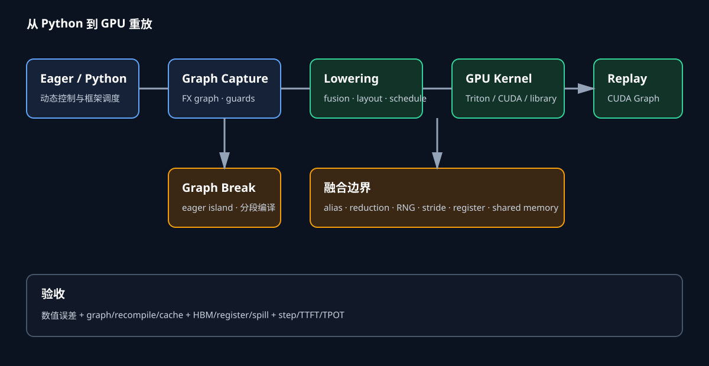

# 图捕获与融合边界

`torch.compile` 的执行路径可写成 `eager → graph capture → AOTAutograd → lowering → kernel`。TorchDynamo观察Python字节码并生成FX图，guard描述图可复用的输入条件；AOTAutograd为训练构造前向与反向；Inductor选择布局、融合与代码生成，GPU端可生成Triton kernel或调用cuBLAS等库。CUDA Graph位于更靠近运行时的位置，记录一组已确定的GPU操作并重放。

*图1：动态Python与graph break位于捕获边界，编译区域经过lowering形成kernel；稳定launch区间还可被CUDA Graph捕获。作者绘制。*

## Eager 的实际成本

Eager逐算子建立输出、调度kernel并维护autograd元数据。单个大GEMM持续数毫秒时，数微秒launch占比很低；decode中的小矩阵与逐元素算子可能只有十几微秒，CPU提交、Python调度与同步会直接限制GPU利用率。

设一段有40个kernel，每次launch平均5微秒，GPU工作总计300微秒，串行提交开销上界约200微秒。融合将40个kernel减至10个，launch约50微秒；CUDA Graph重放还能把一组launch压缩为一次较低开销提交。真实执行存在异步队列，不能直接把两者相加，时间线仍能给出优化上限。

### 捕获与 guard

Dynamo捕获执行过的Python路径。Tensor shape、dtype、device、stride，模块属性与影响控制流的Python值可能形成guard。后续输入满足guard便复用编译结果，不满足时重编译或回退。查看recompile原因比只看cache目录更能定位变体爆炸。

数据相关分支如`if x.sum()>0`需要从GPU取值参与Python控制，通常产生graph break。日志打印、第三方C扩展、动态容器变更和不受支持操作也可能切图。可以把动态决策移到图外，把稳定tensor计算封装成编译区域；不能为了大图改变程序语义。

### Dynamic shape

静态shape允许固定tile、展开循环与精确内存规划，但每种batch/sequence可能编译新变体。符号shape用范围guard覆盖多个尺寸，kernel内部需要mask或动态循环，部分优化受限。Bucket将实际长度向上取整，减少变体并增加padding。

长度分布中50%请求小于256、40%位于257--1024、10%位于1025--4096时，只设4096桶会浪费大量token；可用256、1024、4096三档。每档分别统计请求命中、padding、编译时间与CUDA Graph显存，不能只取平均长度。

Stride也会触发变体。相同shape的连续tensor与transpose view具有不同地址映射。编译器可能生成通用stride kernel，也可能guard连续布局。数据入口统一layout可减少编译数，但额外contiguous copy要进入成本。

### Lowering 与调度

高层图经过分解，将复合算子转为编译器理解的primitive，再形成loop IR。调度器依据依赖、设备、布局和估算成本决定融合组。外部库GEMM通常保持独立，pointwise epilogue可由库epilogue或后续Triton融合完成。

Lowering必须保存alias与mutation语义。View共享storage，原地写可能影响其他别名。若编译器错误提前读取或延迟写回，数值会改变。Functionalization可把部分mutation转换为函数式表示，仍需在图出口恢复可观察别名关系。

### 融合合法性

Producer-consumer融合要求consumer所需producer值能在同一program中生成，且不违反依赖顺序。逐元素链按相同index映射最简单。Reduction输出由多个元素共同产生，融合consumer时要决定在哪个线程拥有结果，并处理同步。

随机算子还要保持随机流约定。融合dropout与后续加法可能改变Philox计数映射；若项目要求给定seed逐元素复现，counter坐标必须稳定。只要求统计等价时也要验证分布与梯度。

异常、NaN传播和signed zero可能受重排影响。`a*b+c`变为FMA只舍入一次，与分开运算不同；快速exp近似也会改变softmax。合法性包含框架允许的数值容差，并非只看代数等价。

**内存布局**

融合省下中间张量写读。两个BF16逐元素算子处理$N=16$百万元素，中间一次写加一次读约节省$4N=64$MB。若GPU有效HBM带宽1TB/s，纯带宽下界约64微秒，再加一次launch。

Consumer若按转置方向访问，融合后地址可能不合并。独立transpose先付一次重排，后续GEMM获得连续布局；强行融合transpose与复杂consumer可能产生跨步读取。比较对象是完整链路字节与kernel效率。

Broadcast输入可在多个输出中复用。小向量若缓存于L2/register，融合收益高；过多broadcast值同时存活会提高register。布局分析同时看stride、对齐、向量化宽度和tile边界mask。

**资源边界**

Fused kernel的临时值生命周期更长，register/thread上升会降低每SM并发block。register超过物理上限会spill到local memory，local实际位于显存层次，可能抵消中间张量节省。Shared memory也限制驻留block数。

可用占用近似比较：若融合前两个kernel各使用32 registers/thread并达到8个block/SM，融合后使用96 registers只能驻留2个block，隐藏延迟能力显著下降。最终结果依赖架构、block size与指令，需查看编译资源和profile。

融合还可能减少并行任务数。大reduction与小pointwise合并后，pointwise只能跟随reduction的block组织；独立执行原本可覆盖更多元素。编译器成本模型需要允许拆分。

**Triton kernel**

Triton以program instance处理一个block。`program_id`选择tile，`tl.arange`生成lane offset，load/store mask处理边界，`tl.dot`映射矩阵指令。BLOCK大小、num_warps与num_stages决定并行度、register和流水。

一个fused bias+GELU读取矩阵$X$与bias，计算$z=X+b$和近似GELU后只写输出。Eager路径写出$z$再读回，融合省中间字节。若bias沿列广播，地址连续；若输入是非连续view，需要按stride寻址。

Autotune为实际shape运行候选。Benchmark需预热、同步并避免把编译时间混入kernel时间。候选输出先与参考实现比较，边界shape覆盖不能整除BLOCK的情况。

**Autotune cache**

缓存键至少包括kernel源码或IR hash、shape/stride、dtype、关键常量、GPU compute capability、Triton/Inductor版本与编译选项。动态shape可按区间共用配置，但区间两端都要验证性能。

缓存miss会触发候选编译和运行，在线请求因此出现长延迟。服务可在部署阶段预热主要bucket，将版本匹配的cache随镜像或制品分发。硬件型号不同的节点分别生成cache，不能假定同一tile最优。

坏缓存需可失效。编译器升级、驱动变化或kernel逻辑修改均改变namespace。命中率、调优耗时和选中配置进入启动日志，便于区分编译冷启动与模型加载。

**CUDA Graph**

CUDA stream capture记录kernel、memcpy和依赖，instantiate得到可重放graph executable。重放要求使用兼容的地址与执行结构，因此常预分配静态input/output buffer，每次把新数据复制到固定地址再replay。

捕获期间不允许的CPU同步、动态分配或某些库调用会失败。RNG需要图安全状态，训练还要处理optimizer和梯度buffer。捕获前先warmup，让lazy初始化、内存池和算法选择完成。

多batch bucket各自捕获会占额外显存。实际batch可padding到最近捕获尺寸，mask掉无效槽；超过最大尺寸则eager。收益由命中率、padding计算和额外显存共同决定。

CUDA Graph 适合「GPU 工作重复且 CPU 提交进入关键路径」的区间。重放通过一次 `cudaGraphLaunch` 提交整张图，省掉 Python、C++ dispatcher 与逐 kernel driver launch；它不会减少 GEMM 的 FLOPs，也不会自动消除 HBM 流量。若单次 attention 已持续数毫秒，而 CPU 能提前填满设备队列，graph 的收益通常很小。若 decode 层由几十个 5–20 微秒 kernel 组成，CPU 与 driver 的空档便可能占到可见比例。

PyTorch 捕获要求重放时沿用相同虚拟地址。输入不能换成新 tensor 后直接期待图读取它，需要把新数据复制进捕获时使用的 static input buffer；输出也可能在每次重放时覆盖同一地址。图私有内存池会保留捕获期间用到的地址，直到 `CUDAGraph` 和相关 tensor 生命周期结束。多个互斥执行且生命周期明确的图可以共享 pool hint，减少重复预留；存在并发重放或未表达依赖时，共享会造成地址别名风险。

CUDA 的 graph memory node 还能捕获 `cudaMallocAsync`/`cudaFreeAsync` 一类 stream-ordered 分配。分配节点产生的虚拟地址在 graph 生命周期内稳定，物理页却可以在生命周期不重叠的 graph allocation 之间复用。「地址稳定」服务于 kernel 参数复现，不能据此推断每张图永久独占一套物理显存。容量测量要同时记录 PyTorch private pool 的 reserved byte 与设备实际 resident byte。

**Piecewise capture**

动态attention或通信操作无法进入完整CUDA Graph时，可在其前后捕获稳定子图。边界张量地址与stream依赖固定，动态算子在图外运行。Piecewise减少大部分launch，又保留变长KV与调度灵活性。

分段过多会重新暴露CPU提交，分段过大则增加捕获失败与shape变体。Profile按段统计replay、eager island和同步。Graph break与CUDA Graph分段属于不同层次：前者发生在PyTorch捕获，后者发生在GPU执行捕获。

## 训练与推理

训练图包含backward、随机算子、梯度累积和optimizer。AOTAutograd可联合考虑保存与重算，融合减少activation流量，也可能增加重算。参数更新使部分地址内容变化，但预分配地址仍可稳定。

推理无backward，decode shape小且重复，launch占比高，CUDA Graph收益常更明显。Prefill长度变化大、attention工作重，融合与专用attention kernel更重要。在线调度还要处理请求加入退出，bucket mask必须保证空槽不读写其他请求状态。

### 数值误差

归约树变化会改变浮点加法顺序。长度4096的FP16/BF16归约若低精度累加，误差可能显著；fused kernel通常用FP32 accumulator，再按输出dtype写回。参考测试同时比较forward与gradient。

Softmax用在线max/sum融合时应保持稳定公式。测试logit包含`[-10000,0,10000]`、大量相同值和长序列。LayerNorm测试近常数输入，因为方差接近零时误差敏感。GELU近似要与配置的精确版本匹配。

容差不能只给固定`1e-3`。输出接近零时看绝对误差，大值看相对误差，向量方向可看cosine；训练还跑若干step比较loss与更新范数。

### 可复算案例

考虑$X\in\mathbb{R}^{8192\times4096}$，BF16，共约67.1MB。Eager执行bias add、GELU、dropout、residual add，假设产生三个同尺寸中间张量。每个中间至少一次写与一次读，约$3\times2\times67.1=402.6$MB额外HBM流量。

融合kernel读取X、bias、residual，生成随机mask并只写最终输出。忽略小bias，主要流量约读取X与residual、写output，即201.3MB；相对eager还省约402.6MB。有效带宽1.2TB/s时理论节省约0.336ms，加上减少3次launch。

若融合使register从40增到120，occupancy从6个block/SM降到2个，实际带宽可能从1.2TB/s降到0.6TB/s。融合路径的201.3MB约0.336ms，eager基础流量加中间流量约603.9MB/1.2TB/s=0.503ms，仍可能获益；若spill新增300MB，融合总流量501.3MB/0.6TB/s约0.836ms，反而更慢。

### Graph break诊断

先统计编译图数量、break位置与原因，再看每段调用频次。偶发初始化break影响小，层内每次迭代break会阻断融合并反复往返Python。修复方式可能是替换不支持操作、把纯Python逻辑移出热路径或注册custom op。

Custom op需要声明schema、alias/mutation与fake/meta实现，使捕获阶段能推导shape。实现错误会让编译器作出非法重排。对复杂动态操作，明确graph break比伪造错误语义安全。

### 验收矩阵

正确性覆盖dtype、连续/非连续stride、最小与非整除shape、动态范围、NaN/Inf、空张量、forward/backward和随机seed。编译覆盖首次编译、cache命中、guard失败、fallback与软件升级失效。

性能覆盖编译时间、峰值编译内存、kernel时间、端到端step、TTFT/TPOT、register、spill、occupancy、HBM字节和CUDA Graph命中。训练保持global batch与数据顺序，推理保持请求到达与输出token。

优化被接受的条件是数值语义在容差内、边界安全回退、常见shape获得端到端收益、编译与缓存成本能在生命周期内摊销。Kernel数量下降本身不构成结果。

**Dynamo 怎样处理 Python frame**

Dynamo在Python frame执行时检查字节码，将可追踪的tensor操作记录为FX节点，并为影响结果的外部状态建立guard。局部变量中的普通整数如果参与shape或分支，也可能成为专用化条件。一次函数调用并不必然对应一张图：循环能展开或符号化时进入图，遇到不支持字节码或数据依赖控制时在当前位置结束图，再从后续位置继续捕获。

FX graph保留算子与数据依赖，节点还带FakeTensor推导出的shape、dtype、device与stride信息。捕获阶段通常不执行真实大张量计算，fake/meta实现必须准确。Custom op缺少meta kernel时，编译器无法规划输出；meta返回错误stride时，lowering可能选择错误布局。

Guard集合过细会形成recompile storm。比如Python列表长度、模块标志或标量值每次变化，虽然tensor主体shape相同，也可能生成新图。日志应按guard原因聚合编译次数，区分正常bucket专用化与无意义状态抖动。

**AOTAutograd 与反向图**

AOTAutograd在编译期追踪forward和backward，把原始图分为前向输出、需要保存的中间值与反向计算。Partitioner可以决定哪些中间值保存、哪些在反向重算。保存减少FLOPs却占显存和HBM带宽，重算相反。

考虑`linear → bias → GELU`。Backward需要GELU输入与linear输入。若前向融合且不保存bias输出，反向可从linear输出重新加bias，省一个大张量写入，增加一次逐元素加法。若linear输出本身也不保存，就要重算GEMM，成本通常太高。决策按字节与FLOPs分别评估。

梯度累积让参数grad buffer跨microbatch存活，编译器不能把它当临时storage复用。`set_to_none`、in-place accumulation和DDP bucket view又会改变alias。Forward数值正确并不能证明训练图正确，验收必须比较输入梯度、参数梯度和一步optimizer更新。

**Inductor 的融合组与外部调用**

Inductor把pointwise、reduction和template kernel放入scheduler。Pointwise producer常内联到consumer；多个consumer可能选择重复计算producer，也可能materialize共享结果。重复计算适合代价很小的表达式，可避免写读；昂贵producer或消费者很多时，materialize更合理。

GEMM通常由ATen/cuBLAS、CUTLASS模板或Triton模板承担。Bias、activation等epilogue若模板支持，可在写回前融合。把任意操作塞进GEMM kernel会影响tile与流水，编译器需要保留外部库调用作为候选。

Reduction融合分为水平与垂直方向。相同输入的多个reduction可共享读取；reduction后的pointwise可由拥有归约结果的线程执行。两个不同归约轴或需要全局同步的阶段通常要拆kernel，并用中间结果连接。

**Memory planning 手算**

训练层中有三个BF16临时张量A、B、C，大小分别256、384、256MB。A生命周期在算子4结束，C从算子6开始，二者可复用同一256MB块；B与两者重叠，峰值从896MB降到640MB。若异步通信直到算子8仍读取A，A与C就不能复用，错误规划会在通信尚未结束时覆盖数据。

Alignment和dtype也限制复用。一个需要256字节对齐的Triton workspace不能随意放入只保证64字节对齐的区域。CUDA Graph捕获要求重放地址稳定，memory planner在捕获尺寸内固定arena布局；新shape超出arena时应选择另一图或回退，不能在重放中动态扩容。

峰值分析要同时画分配与真实驻留。Caching allocator保留已释放块，`reserved`高于`allocated`；图捕获还可能使用private pool。融合省掉logical tensor后，若private pool或workspace变大，进程显存未必同比下降。

**Dynamic shape 的约束传播**

符号维度可带范围与整除约束，例如$1\le B\le128$、$S\bmod16=0$。这些信息允许编译器生成有界循环、选择向量宽度并省去部分mask。输入违反范围时产生新图或回退。

形状关系比单维范围更重要。Attention中Q/K/V共享batch与head，矩阵乘要求reduction维相等；reshape要求元素总数保持。Symbolic solver证明关系后才能安全消除检查。无法证明时保留runtime assertion，断言失败要给出原始维度而非只报kernel地址。

动态输出shape更难，例如`nonzero`数量由数据决定。它可能要求设备到主机同步或两阶段kernel，常形成捕获边界。可以预分配上界并携带有效长度，也会增加计算和显存。选择取决于上界松紧和运行频率。

`torch.compile(dynamic=None)` 默认先为观察到的尺寸建立特化结果，发生 shape guard failure 后再尝试生成能覆盖变化维度的动态图。`dynamic=True` 会更早采用符号 shape，但某些算子、布局选择和控制流仍会迫使维度特化。排查时同时打开 guard 与 recompile 日志，区分「同一符号范围内复用」和「每个尺寸生成新变体」。达到单个 code object 的重编译上限后可能回退 eager，这种回退会在延迟曲线上形成突刺。

CUDA Graph 的静态执行要求比 Dynamo 的符号 shape 更严格。一个 Inductor kernel 可以接受符号 batch，并不表示同一 CUDA Graph 能用不同 grid、地址和 workspace 重放。常见做法是把 shape 范围映射到少量 bucket：每个 bucket 拥有 static buffer、编译结果与 graph instance，有效长度通过 tensor 参数和 mask 传入。越界请求选择更大 bucket 或走 eager/compile fallback，不能在旧图重放过程中扩容。

假设 batch 分布为 1–8，精确尺寸各建一张图需要 8 套 graph 与私有池；用 `[1, 2, 4, 8]` 四档可将图数减半。若每套 pool 额外保留 600 MiB，显存从 4.8 GiB 降到 2.4 GiB。均匀分布下实际 batch 总和为 36，bucket 执行量为 $1+2+4+4+8+8+8+8=43$，padding 计算约增加 19.4%。图数、额外显存、padding 与命中率必须放在同一张表里选择。

**Recompile 成本案例**

服务收到batch size 1到64。若每个精确size编译一次，每次编译8秒，共512秒，且每个变体缓存kernel与CUDA Graph显存。设置bucket `[1,2,4,8,16,32,64]` 只需7个变体，padding平均成本取决于请求分布。

假设80%请求batch不超过8，15%位于9--32，5%位于33--64。用上述桶时，小batch padding有限；若只用8、32、64三个桶，batch9会补到32，计算放大3.56倍。编译数量减少4个不一定值得。把每桶请求量乘padding FLOPs，再加编译与图显存，才能选择边界。

训练常见shape较稳定，数据末个batch或可变序列仍可能触发变体。`drop_last`、长度bucket或动态shape各有语义与成本。为避免重编译而丢弃数据，也属于训练配置变化，必须记录。

## Layout propagation

Inductor可让producer直接生成consumer偏好的布局，省去显式transpose。若输出还有第二个consumer偏好原布局，一个统一选择会让其中一路变慢。调度器可能复制轻量producer，为两个consumer分别生成布局，也可能materialize一次再转换。

矩阵$[M,K]$按行连续，后续算子若沿K归约，连续读取合适；若下一GEMM把它当转置权重，列方向可能更重要。Blocked layout把tile内部连续化，适合Triton程序，却不一定能被NCCL或外部库直接消费。

性能诊断要查看真实stride与生成代码中的offset。Profile里的copy/transpose kernel往往说明layout边界未被融合。消除一个copy后若主kernel访存效率下降，也需比较总时间。

### Multi-GPU collective 的编译边界

数据并行backward产生bucket梯度后启动all-reduce或reduce-scatter。编译器可以让某层grad就绪即发通信，并与更早层backward重叠。若过度融合多层backward，首个bucket更晚就绪，局部kernel变快却减少通信重叠。

张量并行中all-gather/reduce-scatter位于层内依赖链。Consumer fusion不能在通信完成前读取远端分片。分块collective允许chunk就绪即计算，需要通信库、stream event和kernel tile一致配合，语义比普通producer-consumer融合更严格。

CUDA Graph可捕获部分NCCL操作，但要求通信组、调用顺序与地址稳定，各rank必须一致进入replay。某rank因shape guard回退而其他rank重放，会导致collective顺序不一致。图选择需要跨rank形成共同决定。

NCCL 从 2.9 起支持将 collective、P2P 与 group operation 捕获进 CUDA Graph，最低 CUDA 版本和具体限制仍需按部署版本核对。「是否被 graph 捕获」是一次通信操作的集体属性：communicator 内所有 rank 都要以一致方式参与，重放包含该操作的 graph 也需要同一组 rank 共同进入。单 rank 本地 cache 命中不能直接决定 graph 路径，通常要先对 bucket id、graph availability 和错误状态做控制面一致化。

多 stream 捕获依靠 event 表达 fork 与 join。辅助 stream 等待捕获流中记录的 event 后会加入同一 capture graph；结束捕获前，辅助分支还要通过 event 回到 origin stream。遗漏 join 会留下无法由起始流到达的节点，错误依赖则可能让通信读取尚未完成的 buffer。时间线验收要确认 H2D、计算、collective 和 D2H 的依赖边，而不只是看到 graph 成功实例化。

一组四 rank 实验可以直接验证这一约束：固定 shape 的 all-reduce 在 warmup 后捕获，重放一百次，记录 CPU 提交、collective 区间和端到端 step；随后让 rank 3 的输入越过 bucket 上界。正确实现会在进入 collective 前让四个 rank 共同选择 fallback。若 rank 0–2 继续重放而 rank 3 单独 eager，三者等待旧 sequence、rank 3 发起新 sequence，最终表现为 timeout，根因却是 graph 选择没有形成集体决策。

### Autotune 的测量噪声

候选kernel首次运行包含cache、时钟与lazy初始化影响。Autotuner先warmup，多次测量并使用稳健统计。共享GPU、温度与功耗限制会改变结果；编译节点选出的tile不一定适合生产节点。

正确性检查不能只比较候选之间。所有候选可能共享同一个错误lowering，因此还要对eager或高精度reference。包含原子操作的kernel可能非确定，比较使用容差与统计重复。

候选空间过大时调优时间超过收益。可按shape特征筛选block，使用离线数据库或启发式默认。运行频率低的长尾shape直接用通用配置，热点shape才做max autotune。

### Cache 的部署生命周期

编译cache可分图捕获结果、生成源码、二进制kernel、autotune选择和CUDA Graph实例。前几项可跨进程持久化，CUDA Graph实例绑定当前进程地址和上下文，通常需要启动时重新捕获。

制品元数据记录模型hash、PyTorch/Triton/CUDA/driver、GPU架构与编译flags。部署节点校验后加载；不匹配则冷编译。Cache损坏应回退并重建，不能让服务直接使用来源不明二进制。

滚动发布时可在流量切换前完成warmup和主要bucket捕获。启动SLO包括模型加载、编译、autotune与图捕获。只报告稳定态TPOT会遗漏扩容期间的可用性。

### CUDA Graph 地址稳定

捕获时kernel参数中的device pointer会进入graph。重放前把新输入复制到固定static buffer，输出也写入固定buffer或通过可更新节点参数管理。若直接传入每次新分配tensor，地址变化会破坏假设。

KV cache采用paged布局时，页表内容可以变化但页表buffer地址保持。Graph读取本步更新后的页表，从而支持不同物理页；页表容量和kernel循环上界仍需满足捕获尺寸。请求数超过bucket时选择更大图或eager。

训练optimizer若动态创建state，应在捕获前warmup初始化。梯度设为None可能改变分配，固定grad buffer更易捕获。图重放与checkpoint复制并发时，用stream event保护buffer生命周期。

地址稳定还包括别名关系。若捕获时输出 tensor 与 workspace 共享一段可复用 storage，而图外代码在重放前把该地址交给另一个 live tensor，kernel 会静默覆盖新对象。PyTorch private pool 用保守的池生命周期避免这种冲突；手工共享 pool 时，只有图按捕获顺序执行、前一图输出在后一图使用且不存在并发，才能安全复用。两个图分别重放一百次通过数值检查，仍未覆盖交错执行的别名问题。

可用指针实验验证：记录 static input、每个大 workspace 和输出的 `data_ptr`，warmup、capture 与一百次 replay 期间地址应保持不变；在图间插入大 tensor 分配与 checkpoint D2H，确认它们不会占用 graph pool 的活跃区间。显存曲线同时报告 allocated 与 reserved，避免把 private pool 的预留误判为泄漏。

**第二个可复算案例**

Decode层包含20个小kernel，每个GPU执行8微秒，CPU提交每个约4微秒。理想异步情况下GPU工作160微秒，CPU连续提交80微秒；若依赖与同步让GPU间出现总计40微秒空档，层时长约200微秒。

Inductor融合为8个kernel，GPU总工作因更大kernel降到135微秒，提交32微秒，空档约12微秒，层时长147微秒。再用CUDA Graph重放，提交约8微秒且空档降到3微秒，层时长约138微秒。相比200微秒加速约1.45倍。

如果batch增大使原GPU工作变成1200微秒，CPU空档仍40微秒，融合与Graph的相对收益明显下降。该例说明decode小batch与训练大矩阵应采用不同优先级。

**故障定位实例**

开启compile后延迟偶发从20毫秒升到4秒，日志显示新sequence length触发guard失败与autotune。处理方式是统计线上shape，预编译主要bucket，并让长尾shape使用dynamic通用kernel；不能只把日志关闭。

融合后loss在数千步缓慢偏移，单次forward误差合格。进一步比较parameter gradient发现LayerNorm reduction改用低精度累加，长向量误差积累。修正accumulator为FP32后梯度恢复。数值验收需要包含backward与短训练。

CUDA Graph偶发输出旧请求数据，原因是static input buffer只覆盖有效token区域，padding槽保留上次内容且mask错误。修复需要每次初始化无效槽并验证mask，不能依赖请求恰好填满bucket。

**完整上线记录**

每个编译区域记录FX graph hash、guards、dynamic约束、break原因、generated kernel与外部调用。每个kernel记录输入输出layout、dtype、tile、warps、stages、register、shared memory和autotune结果。每个CUDA Graph记录capture bucket、private pool显存、命中与回退。

数值基线保存eager/reference版本、容差、随机seed、极端输入与forward/backward结果。性能基线保存硬件、软件、频率状态、shape分布、预热、cache状态和端到端指标。升级PyTorch、Triton、CUDA或driver时重新运行矩阵。

生产监控关注graph命中、recompile、fallback、编译延迟、CUDA Graph命中、显存与请求p99。训练监控增加step、峰值显存、gradient误差和收敛；多GPU增加collective顺序与重叠。编译优化只有在这些边界内长期稳定，才构成可复用的系统能力。

**归约与归一化的融合案例**

LayerNorm输入为$X\in\mathbb{R}^{B\times H}$。每行先计算均值与方差，再归一化并执行仿射：

$$
\mu_b=\frac1H\sum_jX_{bj},\qquad
\sigma_b^2=\frac1H\sum_j(X_{bj}-\mu_b)^2,
$$

$$
Y_{bj}=\frac{X_{bj}-\mu_b}{\sqrt{\sigma_b^2+\epsilon}}\gamma_j+\beta_j.
$$

朴素实现可能分别产生均值、方差、normalized tensor与仿射输出。融合kernel按行把X tile读入，使用warp/shared reduction求统计，再直接生成Y，只把每行的均值与逆标准差保存给backward。中间normalized tensor不落HBM。

当$H$很大，一行不能由单个block高效处理，可能采用两阶段reduction。第一阶段输出partial sum，第二阶段合并并归一化。此时完整单kernel融合受全局同步限制；强制一个block处理整行会降低并行度。融合边界由$H$、dtype、shared memory和目标GPU共同决定。

数值上，一遍公式$E[x^2]-E[x]^2$在方差很小时容易消去，Welford算法更稳定，但合并顺序仍影响低位。测试使用近常数行、极大值和长H，并对照FP32 reference与backward梯度。

**Softmax 与 mask 的边界**

稳定softmax先求行最大值$m$，再求指数和$l$：

$$
m=\max_jx_j,\qquad l=\sum_j e^{x_j-m},\qquad y_j=e^{x_j-m}/l.
$$

Mask、scale与bias可在读取logit时融合，避免物化修改后的score。Causal mask由索引计算，padding mask从内存读取。无效位置必须在max与sum中一致排除；只在输出阶段置零会让分母错误。

序列长度不整除block时，越界lane的max输入使用负无穷，sum输入使用零。整行都被mask时要定义输出与梯度，避免$-\infty-(-\infty)$产生NaN。不同attention API对此语义可能不同，custom kernel按调用方契约实现。

Softmax后紧接dropout时可以融合随机mask与写回。Backward需要mask或可重建的Philox状态。保存完整bool mask增加显存；保存seed与counter并重算可省空间，要求forward/backward索引映射完全一致。

**GEMM epilogue 与主循环**

GEMM计算$C=AB$，bias、activation、residual与quantize常可放进epilogue。Accumulator tile在register中完成，写回前执行逐元素操作，省去C的多次往返。主循环tile选择主要由M/N/K和dtype决定，epilogue增加register与指令。

若C有多个消费者，一个需要激活后值，另一个需要原始pre-activation，epilogue不能只写一种结果。可以写两个输出，也可以保存C再分别处理。前者增加写带宽，后者增加kernel，需按消费者大小与使用频率选择。

量化epilogue还要统计scale。Per-tensor amax需要跨整个输出归约，难以在普通GEMM block间一次完成；per-row或per-block scale可由局部tile计算。Scale粒度既是数值配置，也是融合合法性条件。

## 通信重叠的反例

八层backward原本每层产生100MB梯度，单层计算2毫秒，bucket就绪即all-reduce3毫秒。通信能与下一层计算重叠，末尾只暴露约3毫秒。若把四层backward融合为一个8毫秒kernel，首个400MB bucket到8毫秒才就绪，虽然launch减少，通信启动推迟，step尾部可能增加。

较好的边界让计算融合不跨关键bucket ready点，或把融合kernel分块输出梯度。Profiler要显示grad ready、collective start/end与compute，不仅统计总通信时间。多GPU性能由裸露通信决定。

CUDA Graph重放也保持固定collective顺序。动态MoE路由若让通信shape变化，可用上界buffer与有效count，或把动态all-to-all留在图外。Padding通信会增加网络字节，是否值得取决于launch与调度占比。

### 编译时间和收益摊销

某训练作业编译90秒，稳定后每step由1.00秒降到0.96秒，每步省0.04秒，2250步收回编译时间。计划训练十万步时收益充足；只跑一千步的调参作业总时间反而增加。共享持久cache可以降低后续作业冷启动，但首次生产者仍要支付。

推理副本每小时扩缩，单次编译90秒可能严重影响容量。预编译制品、启动前warm pool和有限bucket更重要。若模型频繁更新导致cache hash变化，旧制品无法复用，应该将编译阶段纳入发布流水线。

摊销计算还包括autotune实际执行、CUDA Graph捕获、额外显存造成的副本密度变化，以及fallback长尾。平均吞吐提高而每机可放副本数下降时，集群成本未必降低。

### 最小复现实验

准备四组输入：连续静态shape、同shape非连续stride、多个动态batch、一个触发graph break的数据分支。分别运行eager与compile，导出graph、guards、break与generated kernel。对每组比较输出、gradient、kernel数和HBM流量。

再启用CUDA Graph，对bucket输入使用固定static buffer，确认重复replay读取的是新数据。插入随机数时比较seed重置与连续调用；插入多GPUcollective时让所有rank选择同一bucket，并故意制造一个rank越界，验证系统能够在进入collective前共同回退。

性能测试至少一百次稳定迭代，报告中位数与p95，并分开记录首次编译。Shape扫描覆盖tile边界前后，例如127、128、129；动态guard问题和mask错误往往只在这些位置出现。

### 检查表

捕获层确认图数量、break、guards、recompile与custom op meta；lowering层确认fusion group、外部调用、layout、memory planning和生成代码；kernel层确认tile、mask、register、shared、spill与数值累加；运行层确认cache、CUDA Graph、fallback、collective和端到端关键路径。

训练检查forward、backward、optimizer、AMP、重算与多GPU；推理检查prefill/decode、动态batch、KV页表、采样与p99。每个收益数字绑定shape分布、硬件、软件版本、预热和cache状态。

融合边界会随模型shape、编译器版本与硬件变化。固定测试矩阵和线上可观测性比手工指定永久融合列表更可靠；升级后重新验证，让成本模型在明确约束下重新选择。

### 从一次回归到根因

编译器升级后训练step从820毫秒升到910毫秒。图数量与break没有变化，kernel列表却多出两个`contiguous`。生成代码显示新的GEMM模板要求K维连续，而上游attention输出采用另一种blocked layout。旧版本由consumer直接读取该stride，新版本先重排。

若两个copy各移动400MB，在1TB/s有效带宽下至少增加0.8毫秒，仍不足以解释90毫秒回归。Profiler进一步显示copy与all-reduce争用HBM，使通信裸露增加35毫秒；新GEMM autotune又选中高register配置，单kernel增加40毫秒。根因由布局、资源和重叠共同构成。

修复候选包括让上游输出GEMM需要的布局、恢复能读取原stride的模板、限制autotune候选或在通信窗口外执行重排。每个候选都用完整时间线验证，不能只删除profile里最显眼的copy。

**可复现边界**

相同FX图不保证逐bit相同。GPU架构、Triton版本、autotune选择和归约调度会改变浮点顺序。项目若要求逐bit复现，应固定二进制kernel、关闭会改变配置的在线autotune，并使用确定性算法；性能会受到限制。

多数训练接受容差内数值与统计复现。此时仍要固定seed、数据顺序和配置，记录kernel版本，并以多次run的loss与指标分布比较。发现偏差时，先把compile路径与eager路径在固定batch上对齐，再逐层检查forward、gradient和optimizer更新。

CUDA Graph只重放已经捕获的执行，不自动提供确定性。原子归约、随机kernel与并发stream仍可能产生允许范围内的变化。复现声明应分别描述图选择是否稳定、kernel算法是否确定、随机流是否可恢复。

**最终判断**

图捕获扩大编译器可见范围，lowering把算子语义变成带layout与资源约束的循环，fusion减少中间字节，Triton/CUDA kernel落实tile，CUDA Graph减少重复launch。每层都有独立收益与失败边界，不能用“开启compile”概括。

稳定方案需要同时满足guard命中、动态shape可控、alias与随机语义正确、训练反向一致、collective顺序一致、cache可版本化、数值误差合格，并在真实shape分布中缩短端到端关键路径。任一条件变化，都应重新运行对应验收，而不是沿用旧结论。

**参考资料**

- [PyTorch torch.compile programming model](https://docs.pytorch.org/docs/stable/torch.compiler_programming_model.html)
- [PyTorch dynamic shapes](https://docs.pytorch.org/docs/stable/torch.compiler_dynamic_shapes.html)
- [TorchInductor](https://docs.pytorch.org/docs/stable/torch.compiler_inductor.html)
- [Triton fused softmax tutorial](https://triton-lang.org/main/getting-started/tutorials/02-fused-softmax.html)
- [NVIDIA CUDA Graphs](https://docs.nvidia.com/cuda/cuda-c-programming-guide/index.html#cuda-graphs)
- [PyTorch CUDA semantics: CUDA Graphs](https://docs.pytorch.org/docs/stable/notes/cuda.html#cuda-graphs)
- [PyTorch `torch.compile`](https://docs.pytorch.org/docs/stable/generated/torch.compile.html)
- [PyTorch Dealing with Recompilations](https://docs.pytorch.org/docs/main/user_guide/torch_compiler/compile/programming_model.recompilation.html)
- [NCCL: Using NCCL with CUDA Graphs](https://docs.nvidia.com/deeplearning/nccl/user-guide/docs/usage/cudagraph.html)
