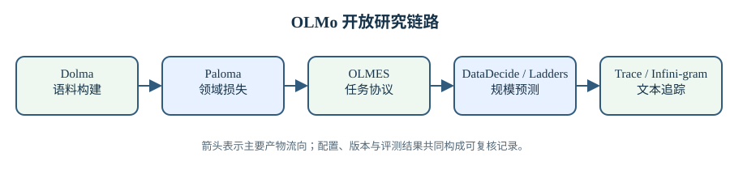

# OLMo 数据、评测与规模预测

模型报告中的一个分数，是数据、训练预算、评测协议和随机波动共同作用的结果。只公开最终权重和排行榜，无法回答模型为何得到这个分数，也无法判断下一次更换数据或扩大规模后会怎样变化。OLMo 的数据与评测工作把这条证据链拆开：Dolma 说明训练语料从哪里来、如何过滤和去重；Paloma 测量不同领域的语言建模损失；OLMES 固定下游评测协议；Infini-gram 与 OLMoTrace追踪训练文本和模型输出的关系；DataDecide 与 Model Ladders尝试用小实验预测大训练；Fluid Benchmarking 和 Signal and Noise 分析评测随训练变化时的有效性与噪声。

这些工作不能被压成“数据集”和“基准”两个目录。数据选择本身需要评测，小模型代理实验需要统计假设，评测结果又会反过来影响数据配比。因而本章按三个反馈循环组织：训练语料如何构建与查询，模型能力如何以可复现协议测量，小规模观测如何预测大规模结果。每篇对照译稿保留论文页标记与原始表格，技术解析则复算规模、权重和不确定性口径。

> 图 1: Dolma 构建训练分布，Paloma 与 OLMES 分别测量领域损失和任务表现，小模型实验预测规模变化，文本追踪回查输出与语料的关系。

图 1 解析：

- Dolma 的过滤与混合决定训练分布，Paloma 和 OLMES 从不同观察面测量模型变化，不能用单一总分替代。
- DataDecide 与 Model Ladders 把小规模观测用于候选排序和外推；预测成立需要模型族、预算与指标之间保持可检验关系。
- Infini-gram 与 OLMoTrace 提供字符串层面的检索证据。匹配结果适合定位复核对象，不能单独证明生成过程的因果来源。

直接入口：[Dolma 解析](dolma/dolma-analysis.md)、[Paloma 解析](paloma/paloma-analysis.md)、[OLMES 解析](olmes/olmes-analysis.md)、[Infini-gram 解析](infini-gram/infini-gram-analysis.md)、[OLMoTrace 解析](olmotrace/olmotrace-analysis.md)、[DataDecide 解析](datadecide/datadecide-analysis.md)、[Model Ladders 解析](model-ladders/model-ladders-analysis.md)、[Fluid Benchmarking 解析](fluid-benchmarking/fluid-benchmarking-analysis.md)、[Signal and Noise 解析](signal-and-noise/signal-and-noise-analysis.md)。

## 1. 训练语料的构建与追踪

### 1.1. Dolma 的开放数据管线

Dolma 汇集网页、代码、学术论文、百科和书籍等来源，并经过语言识别、质量过滤、敏感信息处理与去重。原始字节数、文档数和 tokenizer 处理后的 token 数描述不同阶段，不能互换。网页过滤会改变语言和主题分布，去重会让高频模板权重下降；最终三万亿 token 是经过多轮规则塑造的训练分布，与从互联网随机抽取的同分布样本不同。

去重也有多个层级。精确文档去重删除完全相同文本，近似去重识别局部修改和镜像页面，污染检查则比较训练材料与评测样本。阈值过松会保留大量重复并增加记忆，阈值过严可能删掉合法引用、代码模板和共享事实。Dolma 的技术解析需要同时记录算法、阈值、分片方式和保留比例，单独写“做过去重”不足以复现结果。

### 1.2. Infini-gram 与 OLMoTrace

Infini-gram 在大规模语料上建立可查询的 $n$-gram 索引，使研究者能够检查一个文本片段在训练库中出现多少次、后续 token 如何分布。有限阶 $n$-gram 只使用固定上下文，而 infini-gram 尝试寻找可用的最长匹配。它仍是字符串统计：匹配能够证明文本相似，不能证明模型生成时调用了某条训练记忆；没有匹配也不能证明语义内容从未出现。

OLMoTrace 把这种查询扩展到模型输出，将生成片段映射回海量训练文档。文档级匹配和 span 级匹配回答不同问题，分数还受常见短语、标点规范化与最小匹配长度影响。使用追踪工具时，应展示候选文档和匹配区间，而不是把聚合分数解释成因果归属。它适合发现需要人工复核的记忆案例，也能帮助数据治理定位应删除或授权的来源。

## 2. 从困惑度到统一任务评测

### 2.1. Paloma 的领域语言建模

Paloma 用多个领域和子领域语料评估语言模型拟合程度。交叉熵和困惑度依赖 tokenizer；不同词表把同一文本切成不同 token，直接按 token 比较会混入分词差异。bits per byte 将损失按原始字节归一，更适合跨 tokenizer 对照，但仍受文本预处理和字节编码影响。报告模型平均表现时，还要说明按文档、token、领域还是子领域加权。

领域损失能揭示总平均掩盖的变化。一个模型整体损失下降，可能在网页文本上改善而在学术或代码领域退化。训练规模扩大也未必让所有领域以同样速度受益。Paloma 的曲线适合检查数据配比和训练动态，却不能单独替代问答、推理与指令遵循评测，因为较好的下一个 token 预测不必然转化为特定任务格式下的正确答案。

### 2.2. OLMES 固定协议

OLMES 的目标是减少同名基准因实现差异产生的结果漂移。shot 数、示例选择、提示模板、答案选项顺序、归一化和答案抽取都可能改变分数。即使数据集相同，不同框架输出的数字也未必可比。OLMES 将任务配置、提示和指标作为版本化协议，使 OLMo 系列及外部模型能在共同设置下重跑。

多项选择任务还涉及条件概率口径。比较选项总对数概率会偏向短答案，按 token 或字符归一又会改变偏好；回答生成后再抽取字母，则受格式遵循影响。没有一种口径适合所有任务，重要的是固定并公开选择。宏平均同样隐藏任务权重，本章解析会保留各任务分数，避免只用一个平均值概括模型能力。

## 3. 用小实验决定大训练

### 3.1. DataDecide 的代理实验

DataDecide 用较小模型和较短训练比较候选数据配方，再预测大规模训练时哪一种更优。这个方法成立需要排名在规模变化后保持稳定。若两种数据对小模型的收益接近，随机种子和训练噪声就可能翻转排名；某些高难数据还可能只在模型容量足够后产生收益。因而小实验不仅要给平均分，还要给重复运行、置信区间和规模外推误差。

代理指标也决定选择结果。用验证损失挑数据，倾向改善目标验证分布；用下游平均分挑数据，则受基准组合和提示影响。DataDecide 在预先给定的候选和预算内提供决策信号，无法自动搜索所有可能的数据配方。真正的大训练仍需保留对照检查点，以验证代理排名是否迁移。

### 3.2. Model Ladders 的任务缩放律

Model Ladders 训练一组不同参数量和 token 数的小模型，拟合训练损失与下游指标之间的关系，再外推目标规模。直接从 FLOPs 拟合准确率常不稳定，因为准确率有上下界且在能力形成前接近随机。分阶段方法先预测交叉熵，再从交叉熵映射到任务表现，可以把训练规模与任务曲线分开，但第二步仍可能在阈值附近产生较大误差。

外推必须报告训练范围。目标规模离观测梯子越远，对函数形式的依赖越强；同一拟合在范围内残差小，不代表范围外可靠。任务分数还存在离散答案和样本有限造成的方差。解析中区分参数规模、训练 token、计算量和目标交叉熵，并检查每一步的不确定性如何传到最终预测。

## 4. 连续训练中的评测有效性

### 4.1. Fluid Benchmarking

传统基准在若干固定检查点评估模型，容易错过能力曲线中的拐点。Fluid Benchmarking 把评测视为随训练步变化的连续信号，检查单调性、平滑性、饱和与方差。一个基准若很早饱和，就无法区分后续模型；若相邻检查点大幅抖动，它也不适合判断小改动是否有效。

连续曲线仍受样本量和解码随机性影响。确定性多项选择也会因有限题目产生二项方差，生成任务还增加采样与判分噪声。平滑可以展示趋势，却可能隐藏短暂退化，不能替代原始点。有效基准应在目标训练区间保留足够斜率，同时让噪声小于希望检测的改进幅度。

### 4.2. Signal and Noise 的误差分解

Signal and Noise 将观测到的评测变化拆成真实训练信号与多种噪声，包括样本噪声、随机种子差异、训练步波动和预测模型误差。若改动带来的预期提升小于噪声标准差，单次运行的胜负没有足够证据。增加题目、重复种子或对曲线联合建模可以降低不确定性，但都会增加成本。

不同噪声不能用同一种办法消除。扩大评测样本降低有限题目方差，却不会消除训练随机种子差异；增加训练种子不能修复污染或错误答案；平滑曲线不能纠正评测协议偏差。论文提供的框架用于决定应把预算投入更多训练复现、更多评测样本还是更好的指标，而不是给所有实验套一个固定置信阈值。

## 5. 证据链的使用方式

### 5.1. 从数据到结论逐层核对

复现一项 OLMo 结果时，先锁定 Dolma 或其他训练混合的版本、过滤和 tokenizer，再记录模型配置与训练预算；随后用 Paloma 检查领域拟合，用 OLMES 固定任务协议；需要分析记忆时使用 Infini-gram 和 OLMoTrace；准备扩大训练前，再用 DataDecide 或 Model Ladders评估候选方案；最终以连续曲线和噪声分解判断差异是否稳定。每一层都提供证据，也都有不能推出的结论。

这条顺序避免两类常见误判。一类是看到下游分数提高便归因于某个数据源，却没有控制模型规模和训练 token；另一类是看到语料匹配便宣称模型复制了训练文档，却没有分析生成概率和替代来源。可靠结论需要从原始数据、训练日志、检查点和评测协议中找到相互支持的证据。

### 5.2. 版本化比单次发布重要

网页语料、评测题目和软件实现都会变化。数据集名称相同，不代表内容哈希相同；评测框架升级可能修正答案抽取，也可能改变历史可比性。每项结果应绑定数据版本、代码提交、模型检查点和任务配置。无法再下载的来源要记录缺失原因，不能用后来材料假装原始版本。

OLMo 的开放体系让这些版本能够被追踪，但其中的数字与配置仍需核验。数据统计可能在正文与表格间不一致，评测配置也可能含错误。技术解析和论文问题台账记录可复算的矛盾，结论以原始表格、代码与数据相互核对后的口径为准。评测结果应让每个数字都能回到其产生条件，排行榜会随模型和协议继续变化。

## 6. 不确定性怎样沿证据链传播

### 6.1. 数据比例的误差会进入训练结果

设语料由 $K$ 个来源组成，目标权重为 $w_k$，真正经过过滤、去重与 packing 后进入损失的 token 比例为 $\tilde w_k$。训练风险更接近

$$
L(\theta)=\sum_{k=1}^{K}\tilde w_k\,
\mathbb E_{x\sim D_k}[\ell(\theta;x)],
$$

而不是配置文件中的名义 $w_k$。长文档截断、不同来源的平均 token 数、过滤通过率和重复程度都会让两者偏离。因此数据报告需要同时给出抽样权重与实际有效 token 计数，领域损失的改变才能与真正输入模型的分布对应。

去重还会改变样本的有效权重。某段模板被复制一千次，在原始语料里对梯度的贡献也被放大；近似去重会降低这个权重，同时可能误删格式相似却语义不同的代码或法律条文。对去重阈值做小规模对照，并按领域报告删除率，比只报一个全局百分比更能暴露偏差。

### 6.2. 从任务样本到模型排名

一个任务有 $n$ 道题，若每题近似独立且正确概率为 $p$，经验准确率的标准误差约为 $\sqrt{p(1-p)/n}$。真实题目常按来源、模板或技能成组相关，有效样本数会小于 $n$。两个模型在同一题集上比较时，逐题配对差异能利用两者共同做对或做错的信息，直接把两个独立区间相加则会丢掉这种相关。

多任务平均又加一层权重。宏平均让每个任务同权，微平均让题数多的任务占更大比例，部署权重则应反映真实流量与错误成本。三种聚合能给出不同排名，并不意味某一种算错。报告各任务分数和聚合公式，才能知道最终差异是广泛改进，还是少数高权重任务在推动。

### 6.3. 预测链的区间不能只在终点补一次

Model Ladders 类方法先由规模预测损失，再由损失预测任务分数。两步都有参数估计误差与模型假设误差。若第一步得到 $\widehat L\pm\delta_L$，第二步映射为 $g(L)$，局部误差约被 $|g'(L)|$ 放大。当任务曲线在能力阈值附近很陡，很小的损失误差也可以变成很宽的分数区间。

所以预测不应只输出一个最终小数。拟合范围、候选函数、参数协方差、预留尺寸的回测残差和外推距离都要进入报告。若两个数据配方的大模型预测区间高度重叠，小试验已经完成了它的任务：它告诉我们当前证据还不足以排序。此时增加一个中间尺寸或更换更有斜率的评测，比强行选均值稍高的配方更合理。

证据链的最后一步是用真实大训练回填预测。新观测若落在区间内，可以更新拟合并继续监测残差；若连续落在同一侧，偏差可能来自模型族变化、数据迁移或某个中间规模已经跨过阈值。保留每次「预测在先、结果在后」的记录，可以防止看到结果后重选函数，也能区分一次偶然误差与系统性失配。

同样的原则适用于评测选择。若先测几十个任务，再只报改进最大的几个，排名已经吸收了选择偏差。预先固定主指标、能力分区与失败门槛，其余任务作为探索性证据完整报告，一个小幅改动才不会在大量候选里被偶然放大。

最终的审计记录应把训练数据哈希、检查点、评测配置和预测版本连在一起。只有这条链能重放，后来的数据修订或评测器更新才不会悄悄改写旧结论。
