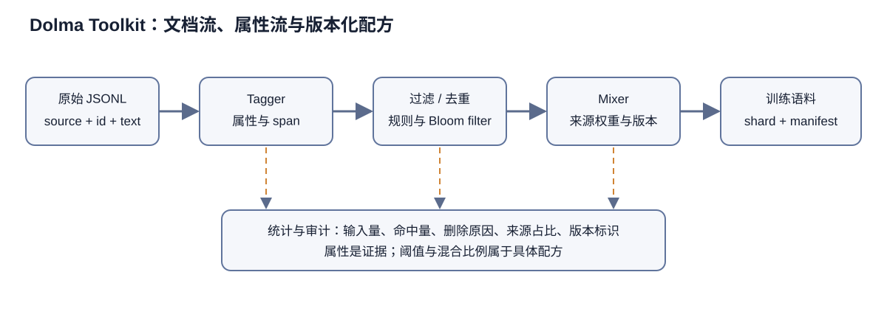

# Dolma Toolkit 技术解析：从文档流到可审计的训练语料

官方源码提交 `669f534823b08d266a8fff01f8a1c916a5a56576` 的数据处理机制分布在 `src/` 下的 Rust 实现, Python 工具入口, `docs/data-format.md`, `taggers.md`, `deduplication.md`, `mixer.md` 与 `parallel-processor.md`. README 所述三万亿 token 数据集是这套工具的一项产物.

> 图 1：原始 JSONL 文档经过稳定标识、Tagger 属性计算、过滤与去重，随后由 Mixer 按版本化配方输出训练语料；统计和审计记录横跨整条链路。

图 1 中的实线箭头表示文档内容的主要流向，虚线表示不直接改写正文、却会影响后续选择的属性与统计。`source + id` 是追踪单条文档的主键，Tagger 生成属性和统计，过滤规则据此决定保留或删除。Mixer 接收的是带来源、属性和版本信息的候选文档，不能假定输入已经绝对干净。图中没有给出任何固定阈值或数据比例，因为这些属于具体数据版本的配方，不能从工具仓库本身推出。

## 1. 文档和属性分离：避免为每次实验复制语料

Dolma 以 gzip JSONL 中的文档为基础对象。每行至少有稳定 `id`、`text` 和 `source`，可选 `added`、`created` 与 `metadata`。`source+id` 构成全局定位键，ID 要跨数据版本稳定。这让删除请求、评测 blocklist、人工审计和版本比较都能回到同一原始文档。若上游每次导出都重新编号，即便文本相同，追溯链也会断裂。

最关键的设计是 documents 与 attributes 分离。毒性、语言、质量、重复段落等信号不直接写回文档，而是保存为平行 JSONL。更新分类器时只重算属性，不复制庞大文本；最终 Mixer 再把多个属性合并并应用阈值。数据研究由此从“反复生成整套语料”变成“昂贵信号缓存一次，廉价配置试验多次”。

代价是严格的行对齐契约。属性文件必须与文档文件行数、排序完全一致。Mixer 不是按 `source+id` 做任意 join；一处漏行就可能把后续属性错配给错误文档。稳定 ID 负责审计，对齐顺序负责高吞吐读取，二者不能互相替代。生产管线应在每个 shard 写完后核对行数、首尾 ID、顺序摘要和压缩文件校验和。

span 属性以 `[start,end,score]` 指向文档字符区间。它允许段落级语言、毒性或重复信号，而不必拆文档。区间坐标绑定当时的精确文本；任何 Unicode 规范化、换行转换或清洗若发生在 tagger 与 Mixer 之间，offset 就会漂移。因此原文一旦进入属性计算阶段，应视为不可变对象，后续修改只能通过有版本的替换配置完成。

## 2. Tagger 与过滤：先产生证据，再决定阈值

Dolma 内置 Gopher、C4、OpenWebText 风格 tagger，也支持自定义 tagger。它提供统一的执行框架和常见信号，并未规定一条唯一正确的过滤链。长度、符号比例、语言概率、重复、敏感内容与质量分类器各自描述一个维度；最终保留规则属于数据配方。

把 tag 与 filter 分开有明显研究价值。分类器升级或阈值变化时，可以保留原始分数并重新 mix；研究者能画出阈值—保留量—下游性能曲线，而不是只剩一个布尔结果。属性名应编码 tagger 版本和语义，否则同名 `toxicity` 在模型升级后会悄悄改变含义。文档示例中的长属性名正体现这种版本意识。

过滤规则需要理解选择偏差。过强英语概率阈值可能删除代码、公式和多语文档；最小长度会压低短问答与标题；困惑度或词长规则可能偏向规范出版文本；成人与毒性分类器可能对身份词产生偏差。工具执行正确不等于配方中立。可审计数据集应同时公布每个规则的输入属性、阈值、命中量、交集量以及按来源/语言分层的保留率。

Mixer 的 include/exclude 使用 JSONPath。语义是匹配任一 include（或没有 include）且不匹配任何 exclude 才保留。多个条件的析取与合取很容易写反，特别是想表达“高质量且英语”时，放两个 include 可能变成“高质量或英语”。上线前应以手工构造的正反例运行配置测试，并保存 dryrun 展开的最终配置。

## 3. 去重：Bloom filter 的速度、顺序与误报

`dolma dedupe` 支持文档键去重和段落去重，核心使用 Rust Bloom filter。Bloom filter 以位数组和多个哈希判断“可能出现”；它不会漏掉已插入项，但会把少量未见项误判为已见。文档明确承认 false positive，因此被标为重复并不构成精确证据。目标误报率、预计元素数和实际插入量共同决定偏差。

文档级可以选 URL、内容哈希或其他 JSONPath 字段为 key。URL 去重只能消除同 URL 重复，无法识别镜像文本；内容哈希可识别完全相同文本，却对微小模板差异敏感。段落级按换行切段，可用完整段落或 Unicode word n-gram。n-gram 长度越短越能发现局部复用，也越容易误伤常见短语；stride 减少计算但可能跳过证据；threshold 从默认 1.0 降低会提高召回并扩大误删风险。

Bloom filter 是有状态结构，处理顺序决定哪份副本被视为首见。多源混合时，如果希望优先保留高质量学术文本而删除网页镜像，就必须先插入学术源或使用只读预计算 filter。否则并发调度或 glob 展开顺序可能让保留来源改变。复现去重必须固定输入 shard 的规范排序、来源优先级、filter 初始文件和哈希参数。

`read_only` 可对已知 blocklist 或评测集做污染检查而不修改 filter。这个模式把“建立参照集合”和“查询候选数据”分开，适合去污染。但 n-gram 命中只表示文本重叠，不自动证明答案泄漏；反之，改写与翻译污染也可能不命中。应报告规则与命中分布，而不能把单一百分比当成无污染证明。

去重阶段只生成属性, 真正删除在 Mixer 中进行. 研究者因此可以检查误报或调整阈值. 重建删除决定还需要去重属性, Bloom 参数和输入顺序; 只发布混合后的语料会丢失这条派生链.

## 4. Mixer：把信号变成版本化的数据产品

Mixer 接收多个 stream，每个 stream 指向 documents、要合并的 attributes、过滤规则、span 替换和输出。它在离线阶段构建确定的输出 shard，不承担训练时随机采样。不同来源的混合比例若通过上游文件选择、重复采样或截断实现，应在配置外显式记录，不能只从输出文件名猜测。

属性路径通过把 `documents` 替换为 `attributes/<name>` 推导。这一约定简化配置，也要求目录镜像严格一致。若路径中意外多次出现 documents、属性名拼错或某 shard 缺失，失败应当显式中止；静默跳过会改变数据规模。执行前可以枚举文档—属性一一对应关系，生成 manifest 后再开始处理。

span replacement 能删除、遮蔽或改写被属性标记的文本区间。多个区间可能重叠，替换会改变后续 offset，因此实现必须基于原坐标以确定顺序应用，而不是边改字符串边沿旧 offset 前进。替换文本支持原文占位符和 jq 字段选择，表达力很强，也带来配置注入与转义风险。尤其字面 `$` 与 selector 的区别应由测试覆盖。

输出 `max_size_in_bytes` 控制 shard 合并大小，影响后续并行加载和对象存储请求数，但不应改变文档内容。`discard_fields` 可减小体积；若删除 `id`、`source` 或关键 metadata，会破坏追溯与许可审计。最终训练格式即使只需 text，也建议保留外部 manifest 映射到稳定 ID。

## 5. 并发模型与失败语义

`BaseParallelProcessor` 把输入文件映射为独立任务。子类实现 `process_single` 与进度更新，示例逐行读取 gzip JSONL、跳过空文档并写目标。按文件并行具有天然边界：单个 worker 失败可以定位到 shard，内存不会随全量语料增长，本地和 S3 又能共享 smart_open 接口。

进度条通过 queue 汇总文件数、读取数和写入数。示例每一万行上报一次，结束再补最后一次。进度计数只提供可观测性，不能充当提交协议：worker 在写出一半后崩溃，计数可能已增加，目标文件却不完整。稳健实现应写临时文件，关闭并校验后再原子发布；远程对象存储没有本地 rename 语义时，需要唯一临时 key 和完成 manifest。

重试必须考虑幂等。对纯 tagger，相同输入与固定模型通常可覆盖同一输出；对共享 Bloom filter 去重，重复插入和任务顺序可能改变首见语义。并发 dedupe 若共享可变状态，需要明确锁、分片或合并策略。不能因为程序“支持 processes”就假定不同进程数产生逐位相同输出；应以小语料测试跨并发级别的 ID 保留集合。

高并发会同时打开大量 gzip 与 S3 流，文档因此提醒提高 `ulimit -n`。除此之外还会碰到对象存储限流、临时盘不足、网络超时和损坏 gzip。失败策略需要区分可重试 I/O、确定性坏行和配置错误：坏行若静默跳过会改变行对齐，尤其会让 attributes 整体错位。更安全的做法是中止 shard、记录字节位置与 ID，经人工决定修复或明确隔离。

本地 `work_dir.input/output` 允许先下载、处理、再上传，减少随机远程 I/O；未指定时工具创建并在完成后删除。故障时自动清理可能带走调试证据，生产运行应记录临时目录、磁盘预算、退出状态和失败 shard。S3 兼容只说明 API 形态，不保证列表一致性、原子覆盖或相同重试行为。

## 6. 统计：不能只数最终 token

数据管线至少要统计输入文档、读取成功、tag 成功、过滤命中、去重命中、span 替换、输出文档、字符与 token。每一步还应按 source、时间、语言与主要许可分层。只有最终 token 总数无法解释损失来自质量过滤、Bloom 误报、坏文件还是配置遗漏。

过滤器间高度重叠，单项命中数之和会超过删除总数。应提供瀑布式顺序统计和集合交集；若过滤顺序改变，瀑布数字会变，但最终集合可能相同。最可靠的审计制品是每个文档稳定 ID 对应的决定与原因，再从中聚合报表。

token 数依赖 tokenizer。Dolma Toolkit 处理的主要是文本和字符 span，三万亿 token 的说法必须绑定具体 tokenizer 与版本。Unicode 规范化、特殊 token、EOS 插入都会改变计数。若训练团队用另一 tokenizer，需重新统计，不能沿用 datasheet 数字。

统计还应包含 Bloom filter 装载率与理论误报率、实际抽样精确率、分类器分数分布和阈值附近样本。只公布目标误报率而不报告实际插入量会产生虚假精度；预计文档数严重偏小时，filter 饱和会使误报上升。

### 7. 复现与许可边界

复现一版 Dolma 派生数据需要固定源码 commit、Python/Rust 构建环境、输入对象 manifest 与校验和、所有 tagger 模型 revision、属性 schema、去重输入顺序和 Bloom 文件、Mixer 配置、进程数与失败重试记录，以及最终 shard 校验和。配置文件很重要，但配置引用的远程 glob 若随时间增长，结果仍会漂移；应先解析为不可变清单。

README 区分 Dolma Dataset 与 Toolkit，也区分许可：工具代码许可不能自动覆盖输入内容，Dolma 数据集采用 ODC-BY。各来源 metadata 中应尽可能保留代码许可、论文标识等信息。混合数据发布时还需考虑来源条款、署名、删除请求和个人信息，而不是只引用顶层 ODC-BY。

稳定 ID 为删除请求提供基础，但删除必须传播到属性、混合版本、tokenized shard 与后续模型训练记录。Blocklist 是数据治理状态，也要版本化。若某篇文档因请求在 v2 删除，旧 v1 是否继续分发、已训练 checkpoint 如何披露，都超出工具自动解决范围。

开放数据的可复现性也受到存储成本制约。三万亿 token 难以让每个研究者完整重跑，因此官方属性、manifest、分层统计和小规模可执行样例同样重要。它们不能替代全量管线，却能让外部检查 schema、过滤逻辑和失败语义。

### 8. 推荐的审计顺序

验证从 documents 的 schema, 稳定 ID, 来源和 shard manifest 开始. 小样本 tagger 用于核对 span offset, 属性行对齐和分数分布; 固定排序的 dedupe 测试用于抽样检查 Bloom 误报; Mixer dryrun 则展开配置, 用手工样本验证 include, exclude 与替换规则. 这些检查通过后再扩到多进程和远程存储, 并比较不同并发级别的输出 ID 集.

每阶段都应写独立输出而非覆盖输入，成功后发布 manifest。故障恢复从已验证 shard 继续，不能仅凭目标文件存在就跳过；半成品 gzip 也可能存在。发布前重新读取全部输出，核对 JSON、行数、ID 唯一性、属性对应、压缩完整性与总统计。

Dolma Toolkit 的核心价值是把语料整理从不可见脚本变成可组合数据流：文档保持稳定，tagger 缓存证据，deduper 标注重复，Mixer 决定最终版本，并行框架扩展到大规模。但它没有消除数据决策，只是让决策有机会被记录。真正可复现的数据集来自固定输入、版本化信号、明确顺序、可验证失败处理与许可追踪的共同作用。

### 9. 文档流的确定性与内容寻址

大规模语料经常由通配符发现输入。如果对象存储列举顺序不稳定，不同运行就可能以不同顺序处理 shard；普通 tagger 输出集合也许相同，Bloom 去重却可能保留不同副本。管线开始前应把 glob 展开成排序后的 manifest，给每个对象记录大小、etag 或强校验和。若对象后来被原地覆盖，即便路径相同也应视为新输入。

内容寻址能进一步收紧边界。对未压缩逻辑内容计算哈希可识别压缩时间戳不同但文本相同的 shard；对压缩字节计算哈希则适合验证传输完整性。二者用途不同，最好同时保存。最终数据版本 ID 可以由输入 manifest、配置、代码 commit 与工具环境摘要共同派生，而不是手工起一个容易重复的名称。

JSONL 的流式性质让单行损坏不会必然影响其他行，却会破坏属性对齐。修复策略不能简单“忽略 bad JSON 后继续”：文档端少一行、属性端仍保留一行就产生灾难性错配。应把坏 shard 隔离为整体失败，或在所有派生阶段使用同一份显式 reject manifest，并重新生成对应属性。拒绝记录要含来源路径、行号、异常类型和原始字节哈希。

### 10. Span 处理的细节

文本 span 通常用 Python 字符索引还是 UTF-8 字节 offset，是跨语言实现必须明确的问题。Rust 与 Python 若使用不同单位，含中文、emoji 或组合字符时边界会错。文档示例以 `text[0:300]` 表达，实际自定义 tagger 应通过多字节测试确认契约，不能只用 ASCII 样本。换行采用 `\n`、`\r\n` 还是规范化后的 `\n` 也会影响段落切分。

同一文档可能有多个属性提出重叠区间，例如毒性删除与重复段落删除。Mixer 需要定义合并优先级：取并集、按配置顺序，还是拒绝冲突。替换从高 offset 向低 offset 执行通常可避免前序修改移动后续坐标，但若 replacement 引用原文或其他字段，仍需以不可变原文本计算。发布配置应配套边界相接、嵌套、完全重叠与零长度 span 的单元测试。

删除 span 后产生的空白、双换行和残缺句可能影响 tokenizer 与质量分布。用占位符替换又可能让模型学习人工标记。因此，span replacement 在擦除隐私信息的同时，也引入了新的文本转换。应统计被替换字符、文档比例、替换后空文档以及再次质量过滤的数量，并抽样检查上下文。

### 11. 数据混合的权重与采样含义

Mixer 名称容易让人联想到按概率在线采样，但文档描述的是把 stream 处理成输出。若希望一个小型高质量源在训练中占更高权重，可能要在构建阶段重复、在 tokenizer 阶段设置权重，或由训练 loader 采样。三种方式对去重、epoch 定义和存储成本不同。数据说明必须写清权重在哪一层实现。

按字节、文档或 token 配比也不等价。代码文档平均很长，论坛帖可能很短；相同文档数会产生完全不同 token 比例。语言和质量过滤又会改变各源平均长度。最可靠做法是在最终 tokenizer 上统计每个 stream token，再根据训练预算计算期望暴露次数，并保留构建前后的两套占比。

来源间去重应在混合前还是混合后，同样取决于优先级。各源内部先去重能并行，却保留跨源镜像；全局去重消除镜像，但必须定义保留来源。高质量源优先可避免网页副本挤掉论文原文，反过来也可能影响许可分布。优先级属于数据政策，应在配置和 datasheet 中公开。

### 12. 性能测量与容量规划

README 的“可并发处理数十亿文档”描述能力方向，不是固定吞吐保证。实际速度由压缩比、平均文档长度、tagger 计算量、S3 带宽、临时盘、进程启动和 Bloom filter 内存决定。测量时应分别报告读取、解压、分类、序列化与上传时间，以及 CPU、内存、网络和磁盘峰值。

Bloom filter 容量尤其需要提前规划。给定预计元素数和目标误报率可以计算位数与哈希数；实际元素超过估计后误报率非线性上升。段落或 n-gram 的元素数远高于文档数，不能拿文档计数直接估算。运行中应监控已插入元素与位密度，到阈值就中止或扩容，而不是完成后才发现大量误删。

并发数也不是越大越好。gzip 解压吃 CPU，远程读取吃网络，tagger 可能用 GPU，输出又受对象存储限流。过多进程会增加上下文切换、打开文件数和重试风暴。应在代表性 shard 上扫描并发曲线，选择吞吐开始饱和前的点，并对单个慢 shard 设置可观察而非盲目杀死的超时。

### 13. 发布前的可验证清单

发布前首先冻结输入 manifest 与全部配置，确认工作树 commit 干净或保存补丁。其次验证每个 documents shard 都有预期 attributes，行数、顺序和 ID 抽样一致。第三检查 tagger 版本、分数范围、NaN 与缺失值。第四复核 Bloom 参数、加载的 filter 哈希、处理顺序和抽样误报。第五运行 Mixer 的手工规则测试与全量统计。

输出侧应完整解压读取，验证每行 schema、ID 唯一性、来源计数、字符/token 总量、最大文档与异常编码。把每个 shard 的字节数、行数、逻辑内容哈希和压缩字节哈希写入 manifest。随机抽样既要覆盖保留文档，也要覆盖被删除和被替换文档；只看最终好样本无法发现过度过滤。

许可与归因检查覆盖再分发条件, NOTICE, metadata 中的必要标识和删除联系渠道. datasheet 还要记录已知局限, 分类器偏差, Bloom 误报与无法公开的来源. 依赖私有模型或内部对象的步骤应单独标出, 使可复现范围与工具代码的开放范围保持一致.

### 14. 为什么失败语义也是数据质量

训练代码失败通常意味着一次作业中断；数据管线的部分失败却可能生成一个看似正常、长期流通的数据版本。某个 worker 少写一个 shard、一次 S3 上传被截断、某属性任务静默空输出，都可能只表现为最终 token 少一点。若没有 manifest 与强校验，问题会在数月后的模型差异中才暴露。

因此每个阶段需要“全部成功才发布”的提交语义。worker 输出先进入带 run ID 的暂存区，协调器确认任务数、校验和和统计后写完成 manifest，再由下游消费。下游只读取 manifest 列出的对象，不用通配符扫描暂存目录。失败重跑生成新 attempt，不覆盖仍在调试的旧对象；成功后再按保留策略清理。

统计异常也应触发失败，而非只写警告。例如某来源保留率突然从七成降到一成、属性文件平均大小接近零、重复率远超历史区间，都可能表示模板或路径错误。为这些指标设置宽松但明确的守卫，可以把数据质量从人工看图变成自动验收。守卫阈值本身也要版本化，避免为让作业通过而临时放宽却不留记录。

### 15. 语料配比就是训练分布

把网页、论文、代码、书籍和百科放进同一个目录，并不等于定义了训练集。真正进入优化目标的是 token 级采样分布。设来源 \(i\) 含有 \(N_i\) 个可用 token，训练时赋予采样权重 \(w_i\)，则单个 token 来自该来源的概率通常写成

\[
p_i=\frac{w_iN_i}{\sum_j w_jN_j}.
\]

这里的 \(w_i\) 不是一个无害的配置值。代码来源权重提高，模型看到的括号、标识符和程序结构随之增加；书籍权重提高，长篇连贯文本的比例会变化；高质量小语料被重复采样，训练轮数和记忆风险也会同时上升。模型后来表现出的能力与偏好，部分就是这组分布选择的结果。

仓库应同时报告原始文档数、过滤后文档数、原始 token 数、实际采样 token 数和预计重复轮数。只给百分比会掩盖小来源被循环几十次的事实，只给字节数又无法对应 tokenizer 下的训练负载。若训练过程中分阶段改变混合比例，还要把 \(p_i\) 写成随训练步变化的 \(p_i(t)\)，否则一个静态饼图无法描述实际数据课程。

### 16. 文档权重与token权重并不等价

按文档均匀抽样时，一篇短问答和一本长书拥有相同被选中概率；按 token 均匀抽样时，长文档占据更多训练位置。两者会产生完全不同的长度分布。若先抽来源、再抽文档、最后从文档截取序列，真正概率还取决于文档能切出多少训练块以及尾部怎样处理。

设文档 \(d\) 长度为 \(L_d\)，序列长度为 \(S\)。不跨文档打包时，它大约产生 \(\lceil L_d/S\rceil\) 个样本，最后一块的有效 token 较少；跨文档打包则几乎消除尾部浪费，却会让相邻来源出现在同一上下文中。若损失对 padding 屏蔽，按样本计数和按有效 token 计数又出现差异。

Dolma 的混合描述只有落到训练读取器上，才能知道权重最终作用在哪一层。审计时应沿着来源权重、分片顺序、文档抽样、序列打包和 batch 组成逐层计算实际暴露量。配置里写着 10% 代码，训练日志中未必恰好有 10% 的有效代码 token；短文档、截断和重复策略都会让两者偏离。

### 17. 过滤器改变的是联合分布

质量过滤常被描述为删除低质量文档，但过滤器依据的特征很少只与质量相关。语言识别置信度会随文本长度、方言和代码混排变化；困惑度偏好接近参考模型训练分布的文本；符号比例规则可能误伤数学公式、表格与代码。设保留事件为 \(K=1\)，过滤后的分布是

\[
p(x\mid K=1)=\frac{p(K=1\mid x)p(x)}{p(K=1)}.
\]

任何与特征 \(x\) 相关的保留概率都会重塑主题、语言、文体和难度的联合分布。因此，过滤率高不代表质量提升大，过滤率低也不代表影响小。若一个规则主要删除少数语言或特殊格式，它可能只移除很少 token，却显著缩窄能力覆盖。

评估过滤器时不能只随机查看被删文档。还要按语言、来源、长度、时间、领域和格式分层计算保留率，并抽查阈值附近的正反例。阈值附近最能揭示规则究竟依据了什么。若多个过滤器串联，还应保存每条文档首次失败的规则和全部触发规则，从而区分单个规则的边际贡献与规则间重叠。

### 18. 质量代理总会携带参考分布

网页质量无法被一个便宜函数直接观测，实践中只能依赖代理：语言模型困惑度、分类器分数、规则特征、域名信誉或人工标注模型。代理得分看似客观，背后都有训练样本和价值判断。以高质量百科、书籍训练的分类器，容易把类似正式书面语的网页排在前面；论坛中的口语经验、少数群体表达和新兴术语则可能被压低。

困惑度过滤尤其容易被误解。参考模型给出低困惑度，说明文本与它已学到的分布接近，既可能意味着语言通顺，也可能意味着模板重复、常见套话或训练集近邻。高困惑度可能来自乱码，也可能来自罕见知识、数学推导和低资源语言。将中间困惑度区间视为优质，需要通过下游实验和人工分层审计验证，不能从定义直接推出。

更稳妥的质量系统保留多个独立信号，而不是过早压成一个总分。语言流畅性、信息密度、毒性、模板化程度和来源可信度可以分别进入属性文件，具体模型版本再选择阈值。这样新的研究假设无需重新抓取和解析全部原文，也能看清某种选择舍弃了什么。

### 19. 规则串联具有顺序效应

如果所有过滤规则只返回布尔值且彼此独立，最终保留集合看起来与执行顺序无关。实际流水线中，规则会修改文本、依赖上一步产物或只对仍存活文档运行。先做正文抽取再判断符号比例，与先在原始 HTML 上判断会得到不同结果；先删除重复段落再计算语言置信度，也可能让短文档跌破阈值。

顺序还影响审计统计。文档先因语言规则被删除，后续毒性和质量分类器没有执行，那么“因毒性删除”的计数会被低估。要比较规则贡献，可以让 tagger 在未过滤文档上尽量独立地产生属性，再由 mixer 统一决策。计算昂贵的信号允许分阶段运行，但需要记录哪些属性缺失以及缺失原因。

对于会改写内容的规范化步骤，最好保留变换前后的内容摘要和 span 映射。这样才能区分文档原本触发规则，还是变换以后触发规则。流水线版本升级时，用一组固定探针文档逐阶段比较输出，顺序变化会在进入全量数据之前暴露。

### 20. 文本规范化不是无损清洁

Unicode 归一化、空白折叠、HTML 实体解码、控制字符删除和换行处理，都会改变文档字节。多数变化有利于训练，但某些字符承载语义：数学中的上标与组合符号、代码中的缩进、诗歌中的分行、表格中的对齐，以及不同语言的标点习惯。把所有连续空白压成一个空格，能减少网页布局噪声，也会破坏 Python 代码和 Markdown 结构。

规范化应按内容类型选择，而不是给整个语料套用同一函数。代码来源保留换行和缩进，网页正文可折叠多余空白，数学文档则谨慎处理 Unicode 等价形式。检测内容类型本身会出错，所以每种规则都要有保守回退。无法确定时保留原文，通常比不可逆地猜测更容易审计。

字符变换还会影响去重和污染检测。如果先规范化再计算摘要，格式不同的同一文本更容易相遇；过强规范化也可能把不同程序或公式合并。仓库应明确每种哈希基于原始文本、规范化文本还是 tokenizer 输出，并保存规范化版本号。否则哈希相同或不同都无法解释。

### 21. 精确去重只能找到字节近邻

对完整文档计算加密摘要可以可靠发现字节完全一致的副本，速度快、误判极低。然而网页转载常改变标题、广告、空白和段落顺序，精确摘要会把它们视为不同文档。反过来，若先进行激进清洁，同一模板下的短页面可能只剩少量公共文本，被错误合并。

精确去重适合消除抓取重试、镜像副本和重复分片。它的单位必须明确：整篇文档、段落还是固定 token 窗口。文档级去重保留嵌在不同页面中的公共段落，段落级去重则可能删除导航、许可证，也可能删掉确实需要重复出现的定义或代码片段。训练中重复的影响与重复长度、次数和位置有关，一项布尔标记无法概括。

内容摘要还可以构建谱系。同一原始对象经过解析和规范化后分别计算哈希，便能判断变化发生在抓取层还是处理层。发布时只暴露处理后数据，也应保存到原始来源记录的映射，以便版权删除、错误修正和来源统计能够向后追踪。

### 22. 近似去重依赖相似性的定义

MinHash、SimHash 或局部敏感哈希把文档映射到紧凑签名，再寻找相似候选。它们并没有直接定义重复，真正语义来自分词方式、shingle 长度、相似度阈值和候选召回策略。短 shingle 对局部转载敏感，也更容易把共享模板当成重复；长 shingle 更精确，却漏掉经过轻微改写的内容。

以 Jaccard 相似度为例，文档 shingle 集合为 \(A,B\)，则

\[
J(A,B)=\frac{|A\cap B|}{|A\cup B|}.
\]

网页 A 在长正文前后各带一段导航，交集占比可能仍很高；一篇短答案只增加一句解释，分母变化就足以跌出阈值。统一阈值对长短文档并不公平。可以按长度分桶设阈值，或结合重叠 token 的绝对数量，避免只看比例。

近似算法还有候选漏检率。最终没被标为重复，可能因为真实相似度低，也可能因为哈希桶没有相遇。用人工构造的改写对和真实转载簇测量召回率，才能知道当前配置能找到哪类重复。性能参数改变候选空间时，也属于数据版本变化。

### 23. 去重保留谁是一项价值选择

发现重复簇以后仍要决定保留哪一份。保留最早抓取版本、最长版本、质量分最高版本或来源优先级最高版本，会形成不同语料。最长版本可能包含更多正文，也可能只是广告更多；高质量分版本可能将边缘语言替换为主流来源；按输入顺序保留则让文件枚举顺序意外决定训练数据。

确定性选择规则至少应基于稳定键，并在完全平局时仍可复现。更重要的是记录簇成员、胜出原因和被移除文档的来源。只留下胜者会丢失传播信息，也让后来无法调整优先级。若版权方要求删除某个来源，簇内另一副本仍可能保留同一内容，因此删除审计需要沿重复簇传播。

跨来源去重还会改变混合比例。一篇论文同时出现在学术库和网页库，若总是优先保留学术来源，网页 token 下降而学术 token 上升。mixer 必须在去重完成后重新计算实际来源规模与采样概率，不能沿用去重前的计划比例。

### 24. Bloom filter 的误报会产生结构性偏差

Bloom filter 用多个哈希函数在位数组上记录已见元素，查询不会漏掉真正插入的元素，却可能把未见元素误判为已见。设位数组长度为 \(m\)、哈希函数数为 \(k\)、已插入元素数为 \(n\)，误报率近似为

\[
\left(1-e^{-kn/m}\right)^k.
\]

误报不是简单的均匀随机删样本。处理顺序决定哪些文档先占据位数组，后到来源承受更多误报；若来源按文件块顺序运行，后面的语言或时间段可能被系统性削弱。位数组接近饱和时，偏差会迅速扩大。

因此应按处理阶段记录填充率和估计误报率，并用一小部分精确集合抽查。来源顺序可以确定性地交错，降低单个来源永久占先的影响；更严格的版本给来源分别建表，再执行可审计的跨来源合并。只要改变容量、哈希函数、插入顺序或并发语义，输出集合就可能变化，数据版本也随之变化。

### 25. 段落去重会改变长文结构

互联网文本中免责声明、菜单和转载段落大量重复，段落级去重能显著减少无效 token。但模型学习长程结构依赖段落之间的关系。若从一本书或一篇教程中删除与别处重复的若干段，剩余上下文可能出现指代断裂、编号跳跃和论证缺口。单段看起来仍然通顺，整篇文档却不再完整。

一种处理是标注重复 span，而不是立即物理删除。mixer 可以按实验选择删除整篇、删除 span、降低权重或保留。删除 span 时加入边界标记未必合适，因为人为标记也会进入训练分布；直接拼接又可能产生假句子。更保守的规则是在重复比例过高时删除整篇，在低比例时保留原文并记录重复量。

评估段落去重不能只统计节省多少 token。还应测量文档平均段数、相邻段语义连贯度、标题与正文保留率，以及长文任务所需结构是否仍存在。若去重提升短基准却损害长上下文能力，总 token 效率并不是完整答案。

### 26. 污染检测需要从答案反推匹配单位

基准污染指训练语料包含测试题、答案或足以重建答案的近邻。整篇文档精确匹配只能抓到最明显副本。测试题可能嵌在讨论帖中，选项顺序被改动，答案单独出现在解析页，或者题目被翻译和轻微改写。污染检测必须根据基准结构选择匹配单位。

选择题可以组合题干与各选项生成若干 n-gram 指纹，并忽略选项标签；数学题需要区分通用公式与题目中特有常数、实体和措辞；代码题可规范化空白和变量名，但不能把所有同算法实现都判成测试泄漏。匹配阈值过低会把常识短句计为污染，阈值过高又漏掉改写。

检测结果最好分成精确命中、高置信近邻和需人工复核三层，并保留命中的训练文档位置。一个污染率数字无法说明模型是否看到了答案。题目正文命中、参考答案命中和完整解析命中的风险不同，应该分别统计。

### 27. 时间切分只能提供一层证据

用数据抓取日期早于基准发布日期来避免污染很直观，却不充分。基准题可能来自更早公开的考试、书籍或网站，发布论文只是重新整理；网页的抓取时间也不等于首次发布时间。反过来，发布日期之后抓取的页面不一定包含基准内容，全部删除会浪费大量新语料。

时间元数据应同时保存源页面声明日期、抓取日期、归档记录和数据集版本日期，并标注可信度。时间过滤可以缩小搜索范围，最终仍需内容匹配。对于持续更新的网页，还要识别抓取快照：同一 URL 在不同时间的正文可能不同，只记录 URL 无法证明当时看到了什么。

最强证据来自训练快照与评测样本的实际比对。若数据许可不允许公开原文，可以发布哈希方案、命中统计和审计代码，让有权限的使用者复核。时间边界、内容命中与下游敏感性实验三者结合，才能支持较可信的污染判断。

### 28. 污染率与性能增益没有线性关系

一套基准有 1% 样本命中训练集，不代表分数只会上升 1%。命中样本可能集中在高难子类，也可能通过共享模板帮助大量未命中题目。模型是否记住内容还取决于重复次数、训练阶段、文档上下文和模型容量。污染检测描述暴露，性能影响则需要另一个实验。

可以将样本按匹配强度分桶，比较命中与未命中样本的准确率，并控制难度、主题和长度。简单比较两组均值会有选择偏差：热门、容易的题更可能出现在网上，也更容易被模型答对。更可靠的分析寻找内容相近但污染状态不同的配对样本，或在训练数据消融中观察变化。

发布模型时应同时给出原始基准结果和清洁子集结果，并说明清洁规则。清洁子集样本少、分布也可能改变，因此它不是天然更真实的总分，只是从另一角度约束解释。如果两个结果差距很大，结论应停在污染敏感，而不是武断地把差值全部归因于记忆。

### 29. 数据谱系是一张有向图

一个发布分片往往由抓取文件经过解压、解析、规范化、标注、过滤、去重和混合而来。把每一步只记在 README 中，很难回答某条训练样本来自哪里。更合适的表示是有向无环图：节点是不可变数据对象或变换结果，边携带代码版本、配置摘要和运行环境。

叶节点可以是原始对象的 URI、抓取时间与内容哈希，中间节点记录变换后的分片哈希，根节点对应公开数据版本。文档级 ID 在每一步保持稳定，发生合并或切分时保存父子关系。这样某个错误解析器被发现后，可以沿图找出所有受影响发布物；收到删除请求时，也能定位派生副本。

谱系元数据不应依赖本地绝对路径，因为路径换机器就失效。使用内容寻址对象、相对清单和稳定版本标识，才能让另一个环境重建。数据规模太大时，不必为每个字符保存轨迹，但至少要做到文档级来源可追溯、分片级变换可验证、版本级配置可复现。

### 30. 可复现不等于重新下载今天的网页

网络来源会消失、重定向或改变内容。仓库即使公开全部抓取脚本，几年后重新运行也不会得到同一语料。严格复现需要冻结原始快照；若许可不允许分发，则至少保存内容摘要、抓取清单、时间和解析日志，使持有合法快照的人能够验证。

外部依赖同样会改变结果。语言识别模型、分词器、HTML 解析器和压缩库升级后，都可能让过滤分数或文本边界变化。锁定代码提交仍不足够，还要冻结模型权重摘要、依赖版本和关键运行参数。容器能保存软件环境，却无法替代消失的输入数据。

因此数据复现可分为三个层次：发布物字节可验证，给定原始快照可重建，重新抓取可获得统计相似分布。三者强度不同。Dolma 工具链最能支持的是第二层的变换透明性；对无法再分发的来源，需要诚实标出只能验证清单或统计，而不是宣称任何人都能从互联网原样重建。

### 31. tokenizer决定训练预算怎样落到语言上

数据仓库通常以字节或文档统计规模，训练却按 token 消耗算力。同样一段信息，在不同 tokenizer 下可能占用相差很大的 token 数。英语常见词若有完整词片会较短，低资源语言、罕见字符和混合代码可能被切得更碎。按 token 固定来源配比时，切分更碎的语言获得更多预测位置，却未必获得更多语义内容；按字节固定时，它又会消耗更多训练算力。

因此数据发布应提供目标 tokenizer 下的来源级统计，包括 token/字符比、文档长度分位数、未知或字节回退比例和特殊 token 出现情况。只用抽样估计也可以，但抽样必须覆盖不同语言与文档类型。tokenizer 更新后，原有混合比例需要重算，不能把同一份 JSONL 理解为相同训练分布。

分词还影响去重。字符 n-gram 能跨 tokenizer 比较，token n-gram 更贴近模型实际看到的序列，却绑定具体词表。若污染检测采用 token 匹配，模型版本换 tokenizer 后应重新执行。Dolma 的文档层工具与训练器之间，需要用明确的 tokenizer 摘要连接，才能把数据规模、污染结果和训练预算放在同一坐标系里。

### 32. 训练轮数应在文档层和token层同时观察

小型优质来源常通过上采样获得更大权重。若来源只有十亿 token，而计划暴露二百亿 token，平均每个 token 会被看到二十次。实际重复并不均匀：随机抽样会让部分文档出现更多次，短文档在按文档抽样时尤其容易被过度暴露。平均 epoch 数掩盖了长尾。

可以从每个文档的采样概率计算期望暴露次数，并报告分位数。若有放回抽样，文档 \(d\) 在 \(T\) 次抽取中从未出现的概率为 \((1-q_d)^T\)，出现次数近似服从二项分布。即便总体 token 预算等于一轮，仍会有文档没被抽到，也会有文档出现多次。确定性遍历再重排则具有不同覆盖性质。

重复暴露会提高记忆风险，但其效果还取决于相邻上下文和训练位置。同一文档每轮以相同边界出现，比每次重新打包更容易形成固定序列。数据清单应把物理副本、采样重复和跨来源近似重复分开统计，这三者在干预方式上不同。

### 33. 打包策略创造了原语料中不存在的邻接

为了提高利用率，训练器常把多个短文档拼进一个固定长度序列。若没有文档边界 token，模型会把上一篇结尾和下一篇开头视为连续文本；即使存在边界，注意力若可跨越边界，下一篇仍能条件于上一篇。随机打包产生大量人工邻接，这部分分布在原始文档中并不存在。

按来源内打包和跨来源打包也不同。前者保留局部领域一致性，后者可能让代码紧接新闻、论坛紧接论文。混合粒度越细，每个 batch 的来源比例越稳定，却越容易产生跨域上下文。若训练使用 document attention mask 隔离文档，人工邻接影响会下降，但位置编码和 batch 统计仍可能受长度组成影响。

Dolma 仓库给出的文档边界必须在导出格式中无歧义，训练侧再声明是否插入 EOS、是否允许跨文档注意和尾部如何处理。数据质量审计若只查看单篇文档，会漏掉打包后才出现的问题。抽取若干真实训练序列进行可视化，是连接仓库语义与优化输入最直接的检查。

### 34. 来源均衡不等于知识均衡

一个来源标签内部可能包含极不均匀的主题。网页语料既有技术文档，也有电商页、论坛和新闻；代码仓库按文件数统计时，自动生成文件和常见配置可能压过核心算法。把来源配比调得很漂亮，并不能保证知识领域、写作风格或语言分布平衡。

更细的审计会对文档建立多标签画像，例如语言、主题、时间、格式、长度和质量分桶，再观察联合分布。单变量直方图不足以发现“高质量西班牙语几乎全来自新闻”这种耦合。维度太多无法穷举时，可以选择对目标能力最关键的交叉表，并对稀有组合保留最低覆盖。

主题分类器同样带偏差，因此画像用于比较版本变化比宣称真实主题比例更可靠。固定同一个分类器跑新旧数据，若某类骤降，就能回查过滤规则。把分类结果作为属性保存，也让后续训练实验可以改变权重，而不用再次处理原文。

### 35. 域名不是质量标签

域名白名单和黑名单成本低，常被用作质量先验。然而同一域名里既可能有专家内容，也可能有用户垃圾；镜像站可能保存已经消失的高质量资料；新域名则因没有历史信誉被全部排除。域名规则把网站级判断施加到每篇文档，颗粒度非常粗。

域名还与语言、地区和经济资源相关。拥有稳定顶级域名和良好网页结构的机构更容易被质量规则保留，小型社区、个人站点和公共论坛则处于劣势。这会把可抓取性、页面设计和内容质量混在一起。审计应列出 token 贡献最高的域名、被整体删除的域名及其语言分布，并抽查长尾。

较稳妥的用法是把域名信誉作为一个特征，与文档级信号共同决策，且允许高质量文档覆盖较弱先验。对恶意站群和已知生成垃圾，域名聚类仍很有价值，但需要记录规则来源、更新时间和申诉或修订路径。

### 36. 低资源语言最容易在流水线中连环损失

低资源语言可能先因语言识别置信度低被删，再因参考模型困惑度高被删，随后因文档短、网页模板占比高继续被删。每一步看似只损失少量，串联后却几乎消失。最终统计若只列主要语言占比，很难看到这种连环效应。

应为每种语言建立漏斗：原始抓取、成功解析、完成标注、过滤后、去重后和最终采样分别有多少文档与 token。语言标签不确定时，保留概率分布或 `unknown` 类，不要强制归入最高分语言。混合语言文档也不宜简单按整篇多数语言处理，尤其是包含代码、术语和翻译对照的页面。

如果目标包含多语言能力，可以为低资源语言设置保留底线或独立阈值，但这会改变质量标准，应在模型评估中验证。公平要求先理解质量信号在各语言上的误差，再决定可接受的取舍；统一的数字阈值往往做不到这一点。

### 37. 代码语料的重复有自己的结构

代码中的许可证头、依赖锁文件、生成代码、测试夹具和 vendored 库会造成巨大重复。普通自然语言去重按词或字符 shingle 处理，可能被变量重命名和格式化轻易绕过，也可能把实现同一接口的不同代码误判为副本。抽象语法树、token 序列和文件路径提供了额外信号。

删除生成代码通常有利于降低重复，却要小心训练目标。如果模型需要理解 protobuf、客户端 SDK 或编译产物，这些文件并非毫无价值。更合理的做法是识别并单独标注，再按模型用途决定权重。许可证文本也可以从训练内容中删除，但许可证本身的存在必须保留在元数据中，不能因删掉头部而失去合规信息。

仓库级切分比文件级切分更适合污染检测和评估，因为同一项目的测试、文档和实现高度相关。若训练集与代码基准按文件去重，近邻文件仍可能泄漏答案。数据谱系需要保存仓库提交和相对路径，才能实施项目级排除。

### 38. 个人信息检测的召回与误伤

邮箱、电话号码、地址和身份标识可以通过规则或模型检测。高召回规则会把论文作者邮箱、示例电话号码和公开机构地址一并命中；高精度规则又会漏掉变体、拼写和上下文相关信息。隐私风险与文本价值不能只靠一个统一阈值解决。

处理动作也有层次：删除整篇、遮蔽 span、替换为类型占位符或限制发布。遮蔽保留其余正文，却可能留下足以重新识别个人的上下文；删除整篇更保守，也会系统性移除简历、论坛求助和地方新闻。属性文件应记录命中类型与位置，敏感原值则避免进入普通日志。

评估检测器需要按语言与来源构建测试集，并分别报告精确率和召回率。合成样本可覆盖格式边界，真实审计才能看到上下文歧义。隐私过滤规则升级后，应能够沿谱系定位旧版本受影响文档，而不是只能发布一个完全不透明的新语料。

### 39. 安全过滤会影响模型认识风险的能力

毒性、仇恨和暴力内容过滤可以减少有害模式暴露，但全部删除也会让模型缺少识别、讨论和拒绝相关内容所需的上下文。新闻报道、历史资料、医学说明和反仇恨讨论可能包含与有害文本相同的关键词。关键词计数尤其难区分使用与提及。

文档级分类器若只输出一个最大风险分数，会把局部引文扩展到整篇。span 级标注能支持更细决策：保留上下文、移除特定片段，或将教育性材料放入受控来源。任何选择都会形成特定安全分布，需要与后训练安全策略一起考虑。

审计不能公开敏感原文时，仍可报告来源、语言、类别、阈值附近误差和处理数量。对分类器无法覆盖的文化语境，应保留人工复核通道。安全过滤既是风险控制，也是模型世界知识的取样过程，不能只用删除率衡量成功。

### 40. 合成文本需要显式身份

网络中越来越多文本由模型生成，来源页面未必标注。合成内容可能格式整洁、困惑度低，恰好通过传统质量过滤，却包含同质表达、虚构引用和模型特有错误。若新模型继续大量学习旧模型输出，数据分布会逐渐收缩。

检测合成文本很难获得稳定高精度，检测器还会随生成模型变化而失效。仓库可以组合时间、来源、重复模板、元数据和分类器信号，但不应把低置信判断当作真值。已知合成数据应记录生成模型、提示、采样参数和目的；来源不明的数据则保留概率属性，供不同实验选择。

合成并非天然低质。经过验证的教材、推理轨迹或数据增强可能非常有用。关键是区分可追溯的定向合成与网络中不可追溯的模型回声，并分别评估事实性、多样性和重复率。一个简单的 `synthetic=true` 仍不足以描述它怎样产生。

### 41. 文档长度过滤会剪掉两端能力

极短文档常是菜单、广告和残片，极长文档可能是日志、拼接页面或整本书。按长度设上下界很有效，却会一并删除短问答、标题、词典条目、诗句，以及真正需要长程建模的书籍和代码仓库。长度与质量的关系强烈依赖来源。

阈值应在清洁和 tokenizer 之后定义清楚。字符长度、字节长度和 token 长度对多语言文本差异很大。对超长文档，可以按结构切分而非直接删除，但切分点会决定上下文完整性。章节、段落和代码符号边界通常比固定字符窗更合理，仍需保留父文档 ID 和片段顺序。

长度分布应在每个处理阶段比较，并关注分位数而非平均值。模型最终看到的是打包后的序列长度分布，因此还要把文档长度映射到训练块利用率。过滤规则节省存储，不一定同比节省有效训练 token。

### 42. 解析失败不是随机缺失

HTML、PDF、代码压缩包和扫描文档的解析成功率与来源质量、语言、年代和格式有关。只统计成功输出，会把解析器偏好误当作网络分布。旧网页、复杂公式、从右到左文字和无障碍结构不佳的页面更可能失败，从而形成系统性缺口。

每个输入对象都应有终态：成功、空文本、格式不支持、损坏、超时或异常。失败对象仍保留来源元数据与内容哈希，以便解析器升级后重试。若只在日志中写一条异常而不进入清单，发布规模看似完整，实际上无法计算覆盖率。

解析质量还需要内容级探针。成功返回非空文本不代表标题、段落和字符顺序正确。可以检查可见文本比例、异常字符率、重复行、段落长度和语言一致性，并对极值抽样。解析器的升级应在固定样本集上比较，而不是凭总体 token 增加就认定更好。

### 43. 质量分数需要校准而非只排序

分类器输出 0.8 并不天然意味着有八成概率是优质文本。不同语言、来源和长度下，分数分布可能漂移。若统一使用 0.8 阈值，各群体实际误报率会不同。先在分层人工样本上画可靠性曲线，才能判断分数怎样对应审阅标签。

人工标签本身也要定义。流畅、信息丰富、事实可靠和适合预训练是不同维度，标注员之间可能对论坛口语或专业符号分歧很大。保存多位标注和分歧，比强行给一个金标签更能揭示代理边界。模型升级时，固定校准集能区分真实改进与分数尺度变化。

排序用途与阈值用途不同。即使分数未校准，它也可能在同一来源内正确排序；跨来源混合时，尺度不可比会造成偏置。可以在来源内选分位数，再用下游消融确定配比。任何阈值都应伴随被保留和被删除样本的代表性审阅。

### 44. 下游消融才连接数据选择与模型能力

过滤器离线指标再高，也不能直接证明它改善预训练。最终问题是，在相同算力、模型、tokenizer 和训练配置下，更换数据选择会怎样改变损失与下游能力。完整规模实验昂贵，可以先用小模型或短训练做代理，但缩放后效果可能变化。

消融应一次改变一个可解释因素，例如仅改变质量阈值、去重策略或来源权重。若新版本同时换解析器、过滤器和混合比例，结果提升无法归因。训练 token 数要保持一致，否则删掉数据后少训练带来的损失会混入比较；wall-clock 也应记录，因为过滤后平均序列特征可能影响吞吐。

评测集合需覆盖预期收益和潜在损失。提高代码权重时既测代码，也测语言与知识保持；加强英语质量过滤时也测多语言覆盖。数据决策通常沿能力前沿移动，而不是所有指标一起变好。把这种取舍呈现出来，数据仓库才真正服务模型研究。

### 45. 反例集比随机样本更能检验规则

随机抽样适合估计总体错误率，却很少命中规则边界。为每类 tagger 建立反例集，可以长期检查最容易误判的对象：含大量公式的论文、代码与自然语言混排、引用有害词的新闻、短而高信息密度的答案、低资源语言和带复杂表格的页面。

反例不仅来自人工想象。每次审计发现误删或漏删，就将最小可复现实例加入集合，并记录期望属性与原因。规则版本升级必须在反例集上比较，若修好一种情况却破坏另一种，差异会立即出现。集合本身也要版本化，避免随着规则调整偷偷修改期望。

还可以用变形测试：对同一文档改变无关空白、Unicode 等价字符、段落顺序或包装 HTML，合理情况下质量判断应保持；加入一段模板广告后，正文属性不应完全翻转。变形关系比单个样本答案更能约束算法语义。

### 46. 统计面板要能解释token去了哪里

最终 token 总数只回答规模，不回答构成。一个可审计面板应沿流水线展示输入、解析成功、各规则命中、去重、混合和导出，并允许按来源、语言、长度、时间与质量桶下钻。各层计数要满足守恒关系，无法对上的差额必须有明确类别。

规则命中不能简单相加，因为同一文档可能触发多条。既要报告每条规则独立命中量，也要报告首次淘汰量和交集。对于 span 删除，文档数不变而 token 数下降，需要分别统计。去重簇则报告簇数、成员数、保留策略和跨来源流向。

版本对比比单版快照更有价值。新版本某语言 token 降低 30%，面板应能定位是解析、过滤、去重还是采样造成。把这些统计由清单自动生成，避免手工表格与实际发布物脱节；表中每个数字都应能追到一组文档 ID。

### 47. 随机性也要进入数据版本

抽样、分片、近似去重候选和并发处理都可能用到随机数。仅记录一个全局 seed 未必足够：线程调度改变调用顺序后，同一随机数流会分配给不同文档；增加一个来源也会让后续抽样全部变化。更稳妥的方式是从稳定文档 ID 和操作名称派生局部 seed。

确定性不意味着永远采用同一种随机样本。实验可以定义多个命名 seed，每个都产生可重放版本，用于估计数据抽样方差。关键是发布物清单直接记录最终成员，seed 只用于解释生成过程。若算法或输入集合变化，同一 seed 不应被误解为同一数据。

分布式执行还要保证归并顺序稳定。浮点质量分汇总、并列排序和先到先得去重都可能随 worker 数变化。使用稳定键打破平局，并将集合决策与执行时序解耦，才能让扩容只改变速度。

### 48. 分片边界影响故障恢复与训练顺序

数据分片常被视为存储细节，实际会参与随机化和恢复。若训练器按文件顺序读取，再在有限缓冲区内打乱，同一分片中的文档更容易相邻；来源各自成片会造成局部领域聚集。分片大小还决定故障重试粒度和校验成本。

理想分片包含稳定文档 ID 范围或内容哈希清单，文件名不能是唯一身份。重新压缩不应让逻辑版本变化，内容成员变化则必须产生新标识。每片记录文档数、有效字节、token 估计、来源构成和校验和，下载不完整可以在训练前发现。

若希望全局混合，可先生成确定性排列再分片；若保留来源局部性，则训练器需要明确跨片采样。无论选择哪种，发布统计应与实际分片清单一致。一个总目录下文件齐全，并不能证明训练器读到了计划中的比例。

### 49. 删除请求需要贯穿派生关系

训练数据发布后可能收到版权、隐私或错误内容删除请求。若只按 URL 查找，镜像、规范化副本、去重胜者和导出片段仍可能保留内容。数据谱系应支持从原始对象向所有派生节点传播撤回标记，并生成新版本差异清单。

已经训练完成的模型无法像数据文件一样删除某条样本影响。仓库至少需要准确回答哪些版本包含过该对象、出现次数和所在阶段，为后续风险评估或机器遗忘提供依据。删除历史不应悄悄改写旧版本哈希；旧版本可标记为撤回并停止分发，新版本产生新身份。

请求处理还要防止泄露。公开删除清单若直接列出敏感原文或个人标识，会造成二次暴露。可以发布不可逆摘要与类别统计，同时在受控环境保留可操作映射。合规机制因此也是谱系设计的一部分。

### 50. 许可统计不能停在来源首页

一个网站的服务条款、单篇内容许可和嵌入资源许可可能不同。代码仓库也可能包含多个许可证、无许可证文件和第三方依赖。把域名或仓库顶层许可直接传播到全部文档，会产生错误确定性。

许可属性应附带证据位置、检测方式和置信度。明确许可、公共领域、许可未知、条款限制和需要人工复核分别保留。文本过滤不能把许可证头删掉以后再推断许可；应先提取元数据，再决定训练内容中是否保留该段。

数据配方可以按使用场景选择允许集合，并报告因此损失的来源与语言覆盖。开放发布、内部研究和商业训练的边界不同，工具不应把法律判断编码成一个永久布尔值。它应提供可追溯证据，让具体使用者在自己的约束下构建版本。

### 51. 一个可信版本需要完整证据包

可交付的数据版本不只是若干压缩文件。它至少包含分片清单与校验和、来源和语言统计、各阶段保留漏斗、过滤器及模型摘要、去重配置与簇统计、混合权重、目标 tokenizer 统计、污染报告、许可与隐私说明，以及从最终文档 ID 回到来源记录的谱系。

这些信息应由流水线产物自动生成。人工 README 用来解释选择和限制，机器清单负责精确值。二者发生冲突时，以可验证清单为准，并修正文档。历史版本保留自己的证据包，新版不能覆盖旧版统计，否则过去模型的训练分布将无法解释。

最终检验很朴素：随机取一条训练文档，能否说明它从哪里来、经历了哪些变换、为什么被保留、以多大概率进入训练、是否与评测集相似，以及怎样在新版本中删除或替换。Dolma Toolkit 的意义，就在于把这条证据链变成数据构建本身的一部分。

### 52. 数据混合可以看成受约束优化

来源权重常靠经验设置，也可以把它写成一个受约束问题。目标是在固定 token 预算下提高若干能力，同时限制语言覆盖下降、重复暴露、许可风险和计算成本。令权重向量为 \(w\)，验证损失或能力代理为 \(L_k(w)\)，一种抽象形式是

\[
\min_w\sum_k\lambda_kL_k(w),\quad w_i\geq 0,\quad \sum_iw_i=1,
\]

并加入每个来源的最小覆盖与最大 epoch 约束。真正困难之处在于一次预训练才能观察 \(L_k\)，无法像普通凸优化那样反复求解。实践中可以用小规模 mixture 实验估计局部响应，再将结论带到大模型，同时保留不确定性。

权重变化并非独立。提高代码占比必然压缩其他来源；某来源经过去重后容量下降，维持权重就意味着更多重复。报告权重时应同时给出反事实：若某来源增加五个百分点，哪些来源减少、预计重复轮数怎样变化。这样配方才体现真实取舍，而不是一组孤立百分比。

### 53. curriculum让同一配方拥有时间结构

若训练全程使用固定混合，任意一步看到各来源的期望比例相同。课程式数据调度会在早期强调广泛网页，后期增加高质量、代码或数学数据。即使累计 token 比例相同，不同顺序也会改变优化轨迹；后期样本离最终参数更近，可能对模型行为有更直接影响。

配方因此需要记录每个训练区间的权重函数、切换条件和累计暴露。按 step 切换与按已见 token 切换在 batch 大小变化时并不等价。恢复训练时也要从正确课程位置继续，不能只恢复模型参数却重置数据调度器。

课程效果应与单纯上采样区分。比较实验保持各来源累计 token 相同，只改变次序，才能观察时间结构；保持次序而改变累计量，则测来源剂量。二者一起变化时，结果只能归因于整个方案。Dolma 输出稳定来源 ID 和分片清单，才允许训练侧准确实现这种分段分布。

### 54. 质量与多样性之间存在可测张力

提高质量阈值通常让语言更规整、错误更少，也会让文本风格趋同。多样性下降未必立刻反映在平均困惑度上，却可能削弱模型处理口语、噪声输入和罕见主题的能力。质量代理偏爱的中心分布不断被放大，最后会形成一个干净但狭窄的数据集。

多样性可以从词汇、主题、来源、文档嵌入和局部模式多个尺度测量。仅看唯一 token 数受规模影响很大；对固定样本量计算覆盖，或比较嵌入空间簇的占比更容易跨版本。嵌入模型自身仍有盲点，所以应结合离散元数据与人工反例。

过滤阈值实验应画出质量指标与覆盖指标的前沿，而不是只寻找一个最高质量分。某些低分桶可能包含大量垃圾，也包含不可替代的稀有知识。可对它们使用更严格去重、较低采样权重或来源特定规则，保留一部分覆盖，而非全部删除。

### 55. 数据价值随模型和训练阶段变化

一份语料对小模型有效，不保证对大模型同样有效。小模型容量有限，规整和重复的模式更容易学习；大模型可能从长尾知识与复杂结构中获益。训练早期需要覆盖基本语言模式，后期可能更看重高信息密度。数据价值随模型、已有能力与训练位置变化，无法视作文档的固有常数。

用单个参考模型困惑度评估全部数据，会把参考模型的能力边界写进新模型语料。它不熟悉的专业文本被判得更差，恰好阻止新模型获得超越它的知识。可以使用不同规模、不同语言背景的多个参考模型，并观察分歧。高分歧样本值得人工审阅，往往比所有模型一致判低的样本更有信息。

数据仓库应尽量保存原始属性，让后续模型重新解释，而不是只发布一次阈值后的残集。存储成本与再利用价值之间要取舍，但不可逆删除越早，未来修正空间越小。

### 56. 信息密度不能靠压缩率单独代表

文本压缩率、重复 n-gram 比例和词汇多样度经常被用作信息密度代理。高度重复的模板确实易压缩，但代码、表格、诗歌和规律性数学表达也可能易压缩。随机乱码难以压缩，却几乎没有可学习语义。压缩率只刻画统计可预测性的一部分。

较好的判断会组合局部重复、文档结构、语言模型分数和来源信号。对于百科条目，事实实体密度可能重要；对于教程，推导的连贯性比实体数量重要；对于代码，类型与调用关系比自然语言词汇多样度重要。统一信息分会把不同内容形态压扁。

代理最适合找极端异常，例如整页重复一句或近乎随机字节。进入中间区域以后，阈值的科学依据迅速减弱，应更多依靠分层抽样和训练消融。Dolma 的属性分离允许保留连续分数，避免在 tagger 阶段过早宣布文档有用或无用。

### 57. 聚类能发现单文档规则看不到的垃圾

站群和自动生成页面单篇可能语言通顺、长度正常、质量分也不低；把大量文档放在一起，才会看到共享模板、实体替换和异常发布节奏。对文档签名或嵌入聚类，可以发现这种群体结构。簇内文本高度相似且数量巨大时，训练贡献会远超其信息量。

聚类结果不能直接整簇删除。某些合法数据本来就模板化，例如法规、产品规格和函数文档。审计需要查看簇的来源集中度、时间分布、变量字段和语义价值。可以对模板簇限额采样，让模型看到结构而不被重复淹没；限额规则应按簇稳定 ID 执行，版本间才可比较。

单篇过滤、近似去重和簇级限额解决的是不同尺度的问题。近似去重关注成对相似，聚类关注许多略有变化的成员形成的质量总量。两者配合能避免每对都低于阈值、整体却高度冗余的情况。

### 58. 文档ID必须经得住流水线变化

若文档 ID 来自分片号和行号，一旦重新分片，所有身份都会改变，历史属性、删除请求和版本差异都无法连接。更稳定的 ID 可以由来源命名空间、原始对象稳定键和抓取快照共同派生；内容完全相同时再附加内容哈希，用于识别镜像。

只用内容哈希也有不足：正文修正一个字符就成为全新身份，同一内容来自不同许可来源又会被合并。来源身份与内容身份应分开保存。前者回答这次采集对象是谁，后者回答它与哪些对象包含相同字节。解析后片段还需要父 ID 与 span 范围。

稳定身份让属性可以增量计算。新增 tagger 只需输出 `doc_id -> property`，不必复制正文；旧属性也能与新 mixer 组合。若某步无法匹配 ID，流水线应失败，而不是按文件顺序盲目连接，后者会造成最危险的静默错位。

### 59. 增量更新不能破坏全局决策

大型语料不会每次从零构建，新增抓取往往只处理新分片。但去重、来源配比和质量分位数依赖全局集合。新文档加入后，旧文档可能不再是重复簇的最佳代表；按全局分位数设阈值时，旧样本保留状态也可能改变。简单追加会使版本语义逐渐偏离完整重算。

增量算法要明确哪些决策被冻结，哪些允许回溯。若旧版胜者永久保留，新文档只能被判为副本，处理顺序就成为版本政策；若允许新高质量副本替换旧文档，需更新簇成员、谱系和分片。混合器还要按新容量重新计算采样权重，而不是让新增来源自然多占份额。

可以定期运行全量对账：用当前规则在索引层重新计算集合，与增量结果比较差异。无需每次重写所有内容，但必须知道近似增量带来了多少偏差。版本说明应标注基线快照、增量区间和全量重算日期。

### 60. 反事实审计让阈值选择有依据

过滤完成后只看最终集合，很难判断阈值稍微移动会怎样。保留阈值附近上下各一段样本，计算来源、语言、主题和人工质量变化，就能画出保留量与误伤之间的局部曲线。若很小的阈值变化就让某种语言大量消失，当前决策非常脆弱。

对去重也可以做反事实：提高或降低相似度阈值，比较簇规模、跨来源合并和长文损失。对混合权重则估计每种来源的重复轮数与训练预算变化。这些分析不要求每个配置都完整导出语料，属性和索引足以先筛掉明显不合理方案。

最终选定配置后，反事实结果应随版本保存。它说明选择不是从无数配置中事后挑出一个最有利结果，也帮助下一版理解哪个约束最先成为瓶颈。数据配方因此从一次经验操作，变成可积累的实验记录。

### 61. 训练损失可以反向诊断数据分片

数据流水线的错误有时直到训练才暴露。某个分片的 loss 突然升高，可能包含乱码、错位编码或语言分布突变；loss 异常低则可能是大规模重复、空模板或已经高度记忆的内容。若训练日志只记录全局平均，这些信号会被正常 batch 淹没。

训练器可以把来源 ID、分片 ID 和少量数据属性带入日志，按桶统计损失、梯度范数与有效 token。这里不需要保存用户文本，稳定 ID 足以回到受控数据仓库调查。观察到异常后，还要与文档长度和模型训练阶段对齐：短样本 padding、课程切换和学习率变化都可能造成表面波动。

这种反馈不能直接用来删除高损失数据。高损失可能代表噪声，也可能代表模型尚未掌握的宝贵长尾。先抽查内容，再比较重复率、解析质量和后续学习曲线。数据仓库向训练系统提供谱系，训练系统把学习信号回流到数据审计，两者连接以后，质量判断才不只依赖训练前代理。

### 62. 数据版本之间需要可解释的迁移报告

新版本发布时说规模从两万亿 token 增至三万亿，只能说明变大。迁移报告应把变化拆成新增来源、旧来源更新、解析修复、规则变化、去重变化和 tokenizer 变化，并分别给出 token 增减。否则模型能力变化无法与数据变化对应。

对共享文档，可以比较处理后内容哈希和属性；对新增、删除文档，按来源与语言分层统计。过滤器升级造成的删除，要列出触发规则和阈值；近似去重变化则列出簇重组。若旧版没有足够谱系，迁移报告应明确哪些差异无法归因，而不是用总体数字填补。

最好保留一组跨版本锚点文档，逐阶段对比解析文本、属性和最终决策。锚点覆盖正常样本与已知反例，能够解释统计变化背后的具体行为。这样 Dolma 版本号表达的是一套可追踪的数据语义，而不只是一个新的下载目录。

### 63. 语料评价最终要回到适用范围

没有对所有模型和任务都最优的训练语料。面向通用语言模型的混合重视知识覆盖与文体广度，代码模型会提高仓库结构和许可证审计的重要性，多语言模型又必须接受某些质量代理在低资源语言上的更大不确定性。数据卡需要先说明预期用途，评价指标才有解释坐标。

同一份数据也不应因公开规模庞大就被视为完整世界。可抓取网络偏向联网程度高、容易索引和允许访问的群体；付费出版物、私人交流、口述知识和大量非数字内容天然缺席。过滤与去重在这个有偏样本上继续选择，无法恢复原本没有被观察到的知识。

因此，可信的数据仓库既展示保留了什么，也展示已知缺口、无法判断的来源和规则敏感区域。它不会用一个质量分掩盖选择，而是让模型研究者能够更换假设、重算配方并追踪后果。这正是工具链比单次数据发布更长久的价值。
