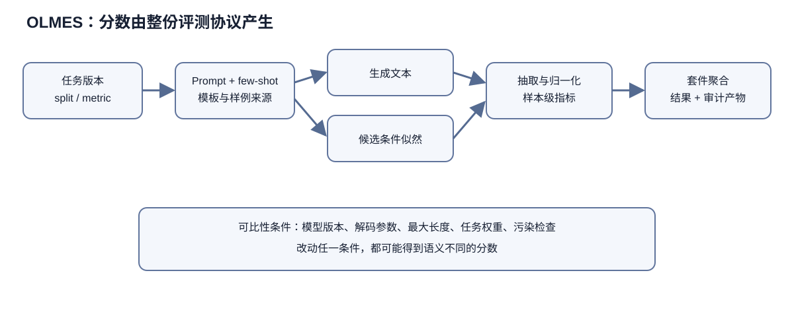

---
title: "OLMES 技术解析：把模型评测变成可版本化实验"
category: "开源仓库"
tags: ["OLMo", "OLMES", "模型评测", "Prompt", "指标", "可复现性"]
published: true
excerpt: "基于固定提交 5a51f50 的代码和配置，解析 OLMES 的任务注册、prompt/few-shot、生成与打分、答案抽取、聚合、污染和可比性边界。"
---

# OLMES 技术解析：把模型评测变成可版本化实验

OLMES 提交 `5a51f502d463b8cdc4a2dcad7d7096c41ff1197e` 的评测实现分布在 `oe_eval/configs/tasks.py`、`task_suites.py`、`models.py`、`tasks/base_task.py`、`aggregate_tasks.py`、`fewshot_sources.py`、各任务模块、`utilities/extraction_utils.py` 和输出文档。它沿用并扩展 lm-evaluation-harness 的设计，接口描述对应这一提交。

> 图 1：任务版本先固定数据切分、Prompt 和 few-shot，再选择生成或概率打分路径，经过答案抽取、归一化与样本指标，最后按套件规则聚合并保存审计产物。

图 1 中的每条边都会改变分数的含义。相同模型若更换 Prompt、few-shot 来源、最大生成长度或答案归一化规则，得到的已经是另一份评测协议。生成路径输出文本，概率路径输出候选的条件似然，两者不能在未说明归一化方式时直接拼成同一指标。图中也没有把最终分数画成“模型能力”的唯一读数：污染、采样随机性和任务权重仍需由结果文件与协议版本共同解释。

## 1. 评测是一份完整协议

同一个 ARC、MMLU 或 GSM8K 数据集，可以因 prompt、选项格式、shot 样例、答案归一化和指标选择而得到不同分数。OLMES 的核心价值是把这些常被散落在脚本里的选择注册成带名字的任务变体。`arc_challenge:mc::olmes` 不只是 ARC 数据集别名，而是数据 split、表述 regime、few-shot 来源、概率归一化与 primary metric 的组合。

README 的 ARC 示例同时尝试 multiple-choice 和 cloze 并报告最大值，说明“任务分数”甚至可能来自多个表述的选择规则。只引用 ARC Challenge 不能复现该数字；必须引用完整任务键和 OLMES commit。报告最大值可降低某一 prompt 对模型的不利影响，但也引入选择效应：如果比较系统只跑一种表述，数字不在同一协议下。

任务配置通过深层字典覆盖基础定义。常见字段包括 `task_name`、`split`、`num_shots`、`fewshot_source`、`context_kwargs`、`generation_kwargs`、`metric_kwargs` 和 `primary_metric`。深配置提高复用，却也使最终行为由多层合并决定。`--dry-run` 会暴露解析后的实验计划；复现应保存展开配置，而不只保存短任务名。

## 2. 任务注册和套件：名字携带版本语义

`configs/tasks.py` 是任务库入口，大量具体任务实现在 `tasks/oe_eval_tasks/`。基础任务类负责统一实例、请求和指标接口，具体模块处理数据字段、prompt 和答案。注册表把一份实现实例化成多个 variant，例如多选、阅读理解式 cloze、生成式、不同 OLMES regime。这避免复制代码，但要求变体配置足够明确。

套件位于 `task_suites.py`，把任务列表和聚合方式绑定。MMLU 套件展开各学科并以 macro 汇总；发布套件又分 base easy、main、heldout 与 adapt。套件名称因此是版本化实验单位，而不只是批量执行快捷方式。若未来增加或移除子任务，同名套件分数也会变化，所以必须绑定 commit。

`primary_metric` 决定命令行和汇总表突出哪个字段。一个任务可以同时产生 raw accuracy、长度归一化 accuracy、F1、exact match 或 judge 分数。主指标是报告政策，不是其他指标不存在。审计异常排名时应查看全指标与实例记录，避免某个归一化选择隐藏模型行为。

模型库也采用同样模式：既可直接给 Hugging Face ID，也可用注册键附加 `max_length`、模型路径和后端参数。直接 ID 看似透明，却会使用工具默认值；注册键看似简短，却继承额外配置。两者都应导出最终 `model_args`，并固定 Hugging Face revision，而不是依赖随时间变化的默认分支。

## 3. Prompt 与 few-shot：评测中最容易被低估的变量

Prompt 由任务文档、选项模板、chat template、上下文分隔符和 generation prefix 共同组成。基础模型通常使用纯文本 completion，instruct 模型可能通过 tokenizer chat template 包装 system/user/assistant。相同自然语言问题经包装后 token 完全不同，模型能力与模板适配被共同测量。

`fewshot_sources.py` 把 shot 集合独立命名。README 强调 ARC 使用 curated 5-shot，说明样例不是随机从 train split 抽取。固定样例消除运行间抽样噪声，并让所有模型面对同一上下文；但样例选择本身仍可能偏向某种推理或答案位置。复现必须保存 shot 内容、顺序和来源版本。

shot 数影响上下文长度、任务说明清晰度与答案先验。对小模型，过多 shot 可能挤压问题或分散注意；对 chat 模型，示例究竟作为多轮消息还是单条 user 文本，也会改变效果。命令行全局覆盖 `num_shots` 很方便，却可能对不同任务生成不等价协议。官方任务库配置通常比临时覆盖更可比。

选项顺序和标签也会造成偏差。模型可能偏爱 A、首项或某种换行格式。多选评测如果只比较选项文本 logprob，与比较标签 token logprob语义不同；cloze 又把候选接到上下文末尾。OLMES 论文标准化这些选择的动机，正是降低实现自由度。

`--inspect` 展示样例 prompt 并跑少量实例，是上线前必要检查。它能发现 chat template 重复套用、BOS/EOS 异常、答案泄漏、截断与选项缺失。5-instance 小跑不能证明指标正确，但能阻止大批量作业在明显错误模板上浪费算力。

## 4. 生成与概率打分是两类测量

多选任务常通过候选 continuation 的条件 loglikelihood 打分，不需要模型实际生成选项。不同候选长度不同，是否按 token 数归一化会改变排名；unconditional normalization 还会扣除候选自身先验，减少模型偏好常见短语带来的影响。配置中的 `acc_uncond` 等 metric 名必须按实现解释，不能简写成普通 accuracy。

论文把这种无条件归一化写成 $\ln P(a_i\mid q)-\ln P(a_i\mid u)$，其中 $u$ 只是通用前缀 `Answer:`。OLMES 只在 ARC-Challenge、CommonsenseQA 和 OpenBookQA 上采用它：这些任务的选项会出现 `Whirlpool bath` 一类先验概率很低的措辞，直接比较条件似然容易把措辞罕见误算成答案不可信。额外的无条件前向会增加成本，其他任务没有足够理由时就沿用各自的计分方法。归一化在这里属于逐任务确定的协议参数。

任务表述造成的差异甚至大过不少模型升级。论文中的 Llama 3 70B 在 ARC-Challenge 多项选择版本上得到 93.7%，换成阅读理解式补全后只有 69.0%；错误率从 6.3% 变成 31.0%，接近五倍。模型没变，变化的是问题怎样呈现、答案怎样计分。看到一张只写「ARC-Challenge」的榜单时，缺少表述方式和归一化字段，分数本身还不足以比较。

生成任务则受 `max_gen_toks`、temperature、top-p、stop sequence 和上下文截断控制。确定性 greedy 便于重复，但不一定代表产品采样行为；带采样评测需要种子和多次采样。README 安全评测示例显式给 2048，reasoning 模型给 32768，说明 token budget 本身就是协议的一部分。预算差异会把计算资源变成分数优势。

后端可以是 Hugging Face、vLLM 或 LiteLLM API。数学上相同的 greedy decode 仍可能因 tokenizer、浮点精度、张量并行、logits processor 和 stop 实现不同而产生差异。API 模型还可能在同名版本下被供应商更新。可比报告要记录后端、版本、dtype、并行设置、请求参数和服务端模型标识。

实例级 logprob 是 OLMES 相对只存总分的重要增强。它允许复核候选分数、归一化和 margin，也能发现 tokenizer 把某标签切成不同 token。但 logprob 字段在 API 后端可能不可得或精度受限，不能假设所有模型的实例记录完全对称。

## 5. 答案抽取与归一化

生成式数学、问答和代码任务必须把自由文本映射为可比答案。`utilities/extraction_utils.py` 集中部分抽取逻辑，各任务模块还可能实现专用规则。常见步骤包括去除包装、寻找最后答案、标准化大小写与空白、处理数值/分数，以及从 reasoning 后提取短答案。

抽取器会引入第二个模型之外的误差源。模型推理正确但格式不符可能判错；错误推理碰巧在末尾出现参考答案又可能判对。正则过宽会抓到题目中的数字，过窄则不支持合理表达。任务报告应抽样区分生成错误与 extraction error，并对规则写回归测试。

exact match 适合短答案，却对同义词、标点和单位敏感；F1 对 token overlap 宽松，却未必反映事实等价；数学等价需要符号化；代码需要执行测试。LLM judge 能处理开放回答，又引入 judge 模型、prompt、位置偏差与 API 漂移。OLMES 同时包含 SimpleQA、AlpacaEval 等外部 judge 时，API key 与 judge 版本成为复现依赖。

reasoning 模型常输出 `<think>` 或长链路，`process_output` 之类参数决定抽取前怎样处理。若一个模型公开隐藏 reasoning，另一个返回全部链路，统一正则可能不公平。应明确评测的是最终答案、完整响应还是安全风格，并保存原始输出以便重算指标。

## 6. 聚合：平均数背后的权重政策

从实例到任务通常计算均值或任务特定指标，从任务到 suite 又有 macro、micro 或自定义聚合。Macro 让每个子任务权重相等，micro 让样本多的任务权重大。MMLU 各学科规模不同，因此 macro 与整体样本准确率不会相同。聚合方式是价值选择，不能只写“平均”。

套件还可能包含多个 regime、选最大表述或按类别再平均。任何“先分组再平均”都与直接平均不同。`aggregate_tasks.py` 和 suite 的 `primary_metric` 是最终分数定义的一部分。复现论文表格时，应从保存的任务级结果按该提交代码重算，并对上游缺失任务设定明确策略。

失败任务不应静默从分母消失。如果某模型因上下文超限、API 拒绝或依赖缺失没跑一项，而聚合只对成功项平均，分数可能虚高。输出应标记计划任务数、成功数、失败数和跳过原因；严格复现应在任务集合不完整时拒绝生成官方 suite 总分。

置信区间同样重要。任务样本有限，分数差一两个点可能处于抽样噪声。固定 benchmark 不是从总体随机抽样的完美实验，但实例 bootstrap 至少能显示有限样本不确定性。多 prompt 取 max 又扩大选择偏差，比较小差异时尤其应报告各 variant，而不只给最大值。

### 7. 输出与审计链

OLMES 将结果写本地 workspace，也支持 Google Sheets、Hugging Face、S3 与 W&B。多后端写出方便协作，却不能让可变仪表盘成为唯一证据。应保留本地不可变原始结果、展开配置、环境信息和实例预测，再把汇总同步到外部系统。

实例级输出可用于错误分析和重新聚合，也可能包含受许可限制的题目、模型敏感输出或 API 数据。发布前需核对 benchmark 许可和隐私。只公开汇总避免泄露，却削弱外部审计；可折中发布哈希、索引、指标和允许公开任务的实例。

远程写入需要完成语义。多进程部分写入、网络重试和重复上传可能形成不完整或重复结果。聚合器应依据 run manifest，而不是扫描目录中所有文件。每次 run 应有模型 revision、任务配置哈希、代码 commit、开始结束时间和成功状态。

### 8. 可比性与污染

公平比较要求同一协议：相同数据 revision、split、few-shot、prompt、后端语义、token budget、抽取与聚合。模型上下文窗口不同可以统一上限，也可让各自用最大能力，两种问题不同。前者测标准预算下能力，后者测产品上限；报告必须说明。

污染是另一层。模型可能在预训练或后训练中见过题目、答案甚至 OLMES 的固定 few-shot。代码公开和 benchmark 长期流传使污染无法只靠发布日期排除。可用 n-gram 检索、训练数据追踪、heldout 套件和动态任务降低风险，但都不能给出绝对无污染证明。

固定 few-shot 本身也可能进入训练语料，导致模型学习任务格式。heldout 名称表示协议意图，不等于数据从未泄露。对开放模型，最好结合公开训练数据做检索；对闭源 API，只能依赖供应商披露和行为测试，结论应更谨慎。

LLM judge 还可能偏爱自身风格或训练家族。若被评模型与 judge 同源，分数可能受表达相似性影响。应随机化回答顺序、使用多 judge 或人工校准，并固定 judge prompt。API judge 更新后，旧结果不能无条件与新结果拼表。

### 9. 复现一条 OLMES 结果需要什么

最低材料包括 OLMES commit、完整命令和展开配置、Python lock/容器、模型权重与 tokenizer revision、任务数据集 revision、few-shot 内容、后端与硬件、随机种子、所有实例输出、聚合代码和失败清单。API 任务还需服务端模型版本、请求参数与时间，因为供应商可能更新。

先用 `--inspect` 确认 prompt，再 `--dry-run` 固化命令，随后跑小子集并人工核对 logprob、抽取与指标。全量运行后验证实例数等于预期、所有 suite 子任务齐全、无 NaN、无异常截断。最后从实例重新计算任务指标，再从任务重算 suite 汇总，与程序输出交叉检查。

不要用“仓库可运行”代替“论文数字可复现”。README 中 OLMo 3 引用仍是 TBD，已经说明快照可能处于开发中；外部数据与模型也会变化。固定 commit 解决评测代码版本，但只有外部资产 revision 和运行记录一起冻结，结果才成为可复查实验。

### 10. 标准化评测的贡献与局限

OLMES 最有价值的是把评测自由度显式化。任务变体说明 prompt 与打分不是无关细节；few-shot source 固定示例；primary metric 与 suite 配置固定报告口径；实例级记录让总分可以下钻。它把“跑 benchmark”提升为“执行版本化协议”。

它仍不能自动保证科学结论。注册表可能有错误，抽取器会偏，数据可能污染，LLM judge 会漂移，max-over-prompts 会产生选择效应。工具提供审计表面，不替代人工验证和不确定性报告。

阅读 OLMES 结果时，除了总分，还要追问任务键、任务变体、模型 revision、输出后端、答案抽取和聚合方式。只有这些问题有答案，跨模型和跨论文的比较才站得住。

### 11. 多选评测的概率细节

候选答案的 loglikelihood 通常是若干 token 对数概率之和。较长候选天然累加更多负数，因此 raw score 偏向短选项；按 token 数平均可缓解长度偏差，却会改变“整个字符串最可能”这一概率语义。无条件归一化尝试扣除答案文本自身常见程度，使分数更关注问题带来的证据。三种方法都合理，但回答的是不同问题。

选项标签也并非总是单 token。`A`、空格加 `A`、括号包裹的 `(A)` 在不同 tokenizer 中切分不同。如果评测只取第一个 token 概率，可能遗漏后续字符；如果比较完整文本，又受格式长度影响。正确性要以任务实现和实例 logprob 为证，不能从界面显示的 A/B/C/D 猜测。

模型输入还涉及 BOS、前导空格和 continuation 边界。某些 tokenizer 在句首与句中对同一词编码不同；context 与 continuation 分开编码再拼接，可能不同于整串一次编码。评测框架需要在边界上做一致处理，并用已知小模型回归测试。升级 Transformers 或 tokenizer 后即使模型权重不变，也应重跑边界测试。

多选与 cloze 的最大值规则为模型提供两次“机会”。如果所有模型都按同一规则执行，它是协议的一部分；但随着尝试 prompt 数增加，期望最大值会升高。未来增加第三种表述后，旧分数与新分数即便任务名近似也不可直接比较。更透明的做法是同时保存每个 variant 和选择后的主分数。

### 12. 生成预算、终止与截断

`generation_kwargs` 不只是温度。最大生成 token、停止字符串、EOS、重复惩罚和上下文截断都会影响答案。若停止字符串过早命中 reasoning 中的普通文本，答案会被截断；若模型没有输出预期 EOS，则耗尽预算，长回答可能占用远超其他模型的算力。应统计结束原因，而不是只看最终准确率。

上下文超过 `max_length` 时，截左、截右或拒绝样本含义不同。截左可能丢 few-shot 和题干开头，截右可能丢问题或选项。某些任务实现会动态减少 shot，这又让不同长度模型看到不同协议。评测输出应记录实际 prompt token 数、被截断标志和最终 shot 数。

reasoning 模型使用 32768 token 而普通模型使用 2048，比较的是各自推荐运行条件下的能力，不是等计算预算比较。若论文要主张算法效率，还应报告平均生成 token、延迟和推理 FLOPs。准确率相同而生成长度相差十倍，在部署与研究结论上都不等价。

采样任务需要区分一次样本准确率、pass@k、自一致性和多数投票。它们用同一模型却消耗不同样本数。套件 primary metric 必须把 k 和聚合写入名称或配置，避免把 pass@64 与 greedy accuracy 放在同一列而不说明预算。

### 13. 外部依赖和数据版本

Hugging Face datasets 的默认 revision 可能更新脚本、修正标签或撤下数据。固定 OLMES commit 不能冻结 Hub 资产。每次 run 应记录 dataset repo、config、split、revision、下载文件哈希和处理后的实例数。若上游数据没有可引用 commit，至少保存缓存指纹和生成 manifest。

任务模块有时带第三方依赖，仓库 `dependencies/` 包含 IFEval、安全评测和指标实现。依赖代码的许可、版本与安装脚本同样影响结果。安全脚本可能下载额外模型或工具；只执行主项目 `uv sync` 未必覆盖所有套件。评测计划应在启动前检查依赖，而不是让缺失任务在聚合阶段消失。

Google Sheets、W&B、S3 和 Hugging Face 输出会涉及认证与远程服务。认证失败不应影响本地结果正确性，但如果写出异常导致整个 run 重试，必须避免重复推理或覆盖完整文件。外部表格适合查看，不适合作为唯一原始记录；单元格格式化可能丢失高精度数值和实例细节。

### 14. 回归测试与校准模型

评测框架升级时，可选择若干小型公开模型作为校准锚点，在固定少量实例上保存 prompt、token ID、候选 logprob、抽取结果和指标。代码或依赖更新后逐字段比较，能快速定位变化发生在数据、模板、后端还是聚合。README 的 `--inspect` 小 Pythia 正有类似价值，但正式回归应固定模型 revision。

浮点后端之间允许微小 logprob 差异，但候选 margin 接近零时微差会翻转预测。测试不应只断言总准确率相同，还要标出低 margin 样本并采用合理数值容差。若大量翻转，需调查 tokenizer、padding、batching 或 dtype，而不是把差异归为随机噪声。

答案抽取器要有正例和反例：多个数字、带单位、负数、分数、boxed 答案、无最终答案、恶意重复标签等。聚合器要测试缺失任务、NaN、空 split 和权重。任务注册要测试深层覆盖是否保留未覆盖字段。评测代码本身也需要像训练代码一样接受严格测试。

### 15. 榜单治理与结果解释

当 OLMES 输出被用于公开榜单，协议升级需要新版本名。修复错误标签或抽取 bug 是必要的，但会改变历史分数；应保留旧结果、迁移说明和受影响任务，而不是原地覆盖。模型提交者也应提供权重 revision 与许可证，避免同名模型重新上传后结果无法追溯。

宏平均会让小任务拥有与大任务相同权重，这可能是为了领域平衡；发布时应同时提供各任务分数，支持按部署场景的权重重算。单一总分适合排序，却会掩盖能力结构与安全退化。模型选择若反复查看 heldout 并调参，heldout 实际已变成开发集，应另建最终保留集。

污染披露也应分级：明确见过测试答案、训练语料存在高 n-gram 重叠、只见过任务格式、未知。简单二元“污染/未污染”无法表达证据强弱。开放模型若能用 OLMoTrace 或训练索引检索，应发布查询方法和命中样本；闭源模型则应避免做无法验证的绝对声明。

评测的目标是帮助回答具体研究问题，排行榜只是结果的一种呈现方式。基础模型 BPB、多选知识、生成式推理、instruction following、安全和长上下文分别测量不同维度。把所有任务压成一个总分会方便传播，却可能误导模型选择。OLMES 的配置化结构最适合保留这些维度，避免在汇总时抹平差异。

### 16. 配置对象就是测量定义

评测配置应完整确定数据、样本选择、提示模板、few-shot示例、模型调用、答案抽取和指标聚合。最终分数可写成 $S=f(M,D,P,G,E,A)$：模型权重 $M$ 只是其中一项，数据 $D$、提示 $P$、生成或打分 $G$、抽取 $E$ 与聚合 $A$ 同样改变结果。

仓库把这些变量落成可序列化配置后，模型名加任务名已不足以标识一次运行。真正标识应包含展开后的配置、代码提交和外部依赖版本。默认值若未写入产物，未来更新会让同一命令产生新语义。

### 17. 任务注册表

注册表将稳定任务名映射到数据加载、模板、指标与默认参数。它提供发现与组合能力，也承担命名空间责任。若同名任务底层数据版本或模板改变，历史结果会失去可比性。破坏性变化应产生新版本名或协议版本。

别名可方便用户，却可能让不同名称指向同一任务，宏平均时重复计权。套件展开后需要去重并保存最终任务列表。注册阶段检查名称唯一、数据字段存在和指标兼容，比运行结束后发现空分数更可靠。

### 18. 任务族与实例

同一数据集可以注册多种实例：zero-shot、five-shot、MCF、CF、生成式或不同规范化。它们共享题目，却测量接口不同。把每个实例当独立任务平均，会给该数据集过高权重。

更清楚的层级是数据集、协议变体、运行实例。聚合先决定是否在变体内选择、平均或固定一个，再进入跨任务汇总。仓库的注册结构应让层级可见，避免名字平铺后丢失关系。

### 19. 套件展开

套件是任务集合加默认权重，可支持基础能力、安全或指令遵循评测。嵌套套件需要确定展开顺序、重复任务和参数覆盖优先级。配置合并若依赖字典顺序，会产生难以察觉差异。

运行开始时输出完全展开清单，包括每个任务版本、样本数与权重。这样论文表格中的一个套件名能回到具体测量。套件后续新增任务应升级版本，不能静默改变历史均值。

### 20. 数据加载的语义

数据加载不只是下载文件，还包括split选择、字段映射、过滤、排序和样本截断。数据平台默认revision变化，会修改输入。固定仓库提交而不固定数据revision，仍无法复现。

最终样本ID与内容哈希比上游名称更可靠。许可不允许重分发时，可发布ID、脚本和整体哈希。样本数差异是最早的异常信号，应在推理前失败，而非继续得到不可比分数。

### 21. 样本顺序

确定性概率评测中顺序原则上不影响单题结果，却影响动态batch、缓存、超时和随机few-shot。生成任务若随机种子由全局序列推进，改变排序会改变每题采样。分布式分片也可能漏题或重复。

稳定样本ID、显式排序和按ID派生seed能减少。聚合检查所有预期ID恰好出现一次。执行顺序可以为效率改变，语义顺序与随机性不应随之改变。

### 22. Few-shot示例注册

固定shot数不够，示例身份、顺序、标签平衡和模板都影响。仓库应保存示例ID而非每次随机抽取。若按seed抽样，数据版本变化仍可能让同一seed选到不同样本。

示例不得与目标重合或近重复。多组示例可测敏感性，但主协议先固定一组。任务构建器需要区分示例split与测试split，并在展开产物中保存渲染结果。

### 23. 提示模板的层级

提示可能由任务文本模板、模型聊天模板和运行时system消息三层组成。任一层增加空格、角色标记或结束token，都会改变输入token。模板源码相同，渲染引擎版本与字段缺失策略也可能不同。

复现最可靠的资产是最终渲染字符串与token ID抽样。隐私或许可限制时发布哈希和长度统计。仓库测试若只对模板源码快照，无法发现tokenizer聊天模板更新。

### 24. 模型适配器

不同后端暴露generate、loglikelihood或聊天接口。适配器将统一请求转换为后端调用，必须保持语义：是否加BOS、如何截断、padding方向、停止token和候选概率范围。适配器bug会影响一个模型族全部结果。

用小型确定模型与手算样例做跨后端对齐，比较token、logits和输出。吞吐优化不应改变答案。后端不支持某功能时明确标记，不能用近似实现混入同一榜单。

### 25. Tokenizer绑定

模型权重与tokenizer版本共同定义条件分布。特殊token、聊天模板和词表修改都可能改变。仅写模型仓库名，而默认revision漂移，会让结果复现失败。

加载后记录词表哈希、特殊token ID和模板哈希。多选候选的前导空格尤其敏感。若模型发布者修正tokenizer，旧新结果作为不同运行保留。

### 26. 上下文截断

few-shot加题目超过上下文时，系统可减少示例、截断题干或报错。每种策略改变任务。静默从左侧截断可能删system和早期示例，从右侧截断可能删候选。

协议应预定优先级并记录每题实际token长度与截断。报告截断率，按模型上下文差异处理。共同长度控制可比性，原生长度测系统能力，两种结果分开。

### 27. Probability request

概率任务需要明确待计分续写及其条件前缀。标签token前是否有空格、是否包含答案前缀和结束token都会改变loglikelihood。模型适配器应返回总log概率、有效token数和逐token值。

只保存最终候选分数无法诊断长度归一化和token错位。抽样核对第一个预测token是否正确shift，是基础回归测试。批量padding位置必须从loss排除。

### 28. 多选候选的总似然

候选 $y$ 的总分 $\sum_t\log p(y_t|x,y_{<t})$ 随长度减少。若候选是单字母标签，长度近似一致；若直接打分选项文本，短答案有结构优势。任务注册必须选择并说明。

平均token分数消除部分长度，却改变概率语义。最稳妥是设计对称标签并检查标签先验。无法对称时，报告不同合理规则敏感性。

### 29. 标签先验

模型可能偏爱A或某位置，与题目无关。空内容或中性提示下测得 $p(label|x_0)$，可用于PMI校正：$s(y)=\log p(y|x)-\log p(y|x_0)$。参考提示 $x_0$ 的选择本身是协议。

标签置换测试能观察偏置。若选项换位后语义预测不稳定，原分数包含接口能力。标准化规则可减少，不能保证所有模型完全公平。

### 30. CF与MCF

cloze形式让模型续写答案内容，更接近基础语言建模，却受候选词频与长度影响；multiple-choice形式输出标签，控制候选长度，却要求理解标签接口。不同训练阶段模型擅长的形式不同。

仓库若同时运行并取较高分，就把协议选择并入指标，产生乐观偏差。固定形式最便于比较；预注册选择规则或独立接口测试可折中。结果中保留每个形式分数。

### 31. 生成请求

生成任务配置包括温度、top-p、最大token、停止字符串、seed和候选数。贪心测最可能输出，采样测分布期望。best-of-n使用额外推理预算，不能与单次结果直接比较。

适配器还需统一是否回显prompt、是否保留特殊token和何时停止。原始输出必须保存，答案抽取只是派生。API后端版本变化会造成不可重复，调用日期和模型快照进入记录。

### 32. 停止条件

停止字符串可能在正文自然出现，导致过早结束；token级stop与字符串stop边界不同。多个stop的匹配优先级和是否保留终止文本也影响抽取。

回归样例覆盖stop跨token、多个命中和无命中。每题记录finish reason。超长截断与模型主动EOS需要区分，后者是行为，前者是预算限制。

### 33. 随机数语义

全局seed若随batch顺序推进，改变并发度会改变输出。按样本ID和第n次采样派生独立seed，使调度不影响。某些API不保证seed完全确定，需重复估计。

随机性还来自CUDA内核和采样实现。确定性要求与吞吐存在权衡。仓库应说明保证层级：配置复现、统计复现或逐token复现。

### 34. 答案抽取

抽取器把自由文本映射到标签或数值。取首个、末个或特定标记后的答案，会处理推理文本不同。正则过宽可从问题回显中抓答案，过窄会把合理表达判错。

人工标注子集测抽取精确率与召回，失败单列。抽取版本改变后，可用保存的原始输出重算，无需重新推理。仓库因此必须保留产物层。

### 35. 数字规范化

数学答案可能是分数、小数、科学计数和带单位形式。规范化器可解析后比较数值，在容差内判等。容差过宽会接受错误，过严会惩罚浮点表示。

符号答案还需变量假设和等价化。计算机代数能覆盖部分，不应接受未定义表达。任务注册绑定规范化规则与版本，不能跨基准共享一个粗糙函数。

### 36. 文本规范化

大小写、Unicode、空白和标点常被归一化。对开放问答有益，对专名、代码和格式任务可能删除关键信息。每个任务显式选择规范化链。

原始与规范化答案都保存。规范化函数组合顺序可能影响结果，例如先去标点再解析数字。回归测试覆盖正反例。规则变化属于分数语义变化。

### 37. 多答案与别名

知识问答可能有简称、旧名和多种拼写。参考答案集合提升召回，却可能包含歧义短别名。别名应带语言、时间或实体条件，不能无条件匹配子串。

模型回答多个候选时，是否只要包含一个便判对需要规定。宽松包含会奖励散弹式回答。要求最终唯一答案或同时惩罚矛盾更稳健。

### 38. 指标对象

准确率、F1、exact match和生成评审测量不同。任务注册需要保证预测与参考类型匹配。对多标签任务用单标签准确率会丢信息，对类别不平衡只看准确率也会误导。

指标实现保存每题充分统计量，便于重算宏微平均。只存最终百分比无法诊断。库应拒绝不兼容输出，而非返回NaN后静默忽略。

### 39. 宏平均与微平均

微平均合并样本，任务大者权重高；任务宏平均每项同权。若套件内多个相似任务，宏平均仍重复计权。层级聚合可先按能力簇，再跨簇平均。

权重是政策选择，配置中显式保存。发布分项和原始计数，让用户按部署需求重算。单个总分不能脱离权重解释。

### 40. 缺失任务

模型因上下文、接口或许可无法运行某任务时，删除该项会改变平均。可在共同子集比较，并把完整覆盖率单列；也可预定缺失惩罚。不能让每个模型用不同分母却同榜排序。

任务失败来自框架bug时应修复重跑，来自模型能力时可计错。运行日志与错误分类决定。空结果不能静默当0或跳过。

### 41. 不同尺度的聚合

准确率、F1和安全评分范围虽可能都是0到1，统计含义不同。直接平均隐含一单位同价值。基线校正或z-score会引入参考模型集合依赖。

最透明方式是分能力报告，综合分明确转换和权重。模型排名对合理权重敏感时，呈现Pareto前沿或条件赢家。仓库不应用默认平均掩盖。

### 42. 逐题产物

每题记录样本ID、渲染prompt、token长度、原始输出或候选log概率、抽取答案、参考、正确性和错误。它支持配对检验、抽取重算和争议审计。

数据许可可能限制prompt发布，可保存哈希和受控访问。结果目录结构稳定，schema版本化。指标脚本读取产物而非重新调用模型，推理与评分解耦。

### 43. Manifest

一次run的manifest列出模型revision、tokenizer、任务展开、数据哈希、代码提交、环境、硬件、精度和外部API。配置哈希指向不可变产物。人类可读摘要与机器JSON并列。

若某项未知，显式null和原因优于省略。复现者可判断差异风险。manifest本身也需schema版本，未来增加字段不破坏旧结果。

### 44. 日志与结果的区别

日志记录执行过程、警告和性能，结果记录测量事实。依赖日志解析最终分数很脆弱，格式变化会破坏。结构化结果由任务API直接写入，日志用于诊断。

警告如截断、解析失败和重试也应汇总成指标。大量警告即使最终分数存在，也降低可信度。运行成功不等于语义完整。

### 45. 分布式聚合

多进程评测将样本分片，各rank输出局部结果。最终合并必须检查ID唯一和完整，不能只平均rank均值，因为样本数可能不同。微平均从充分统计量汇总。

rank故障或重试可能重复样本。原子写入与完成manifest防止半结果被聚合。分布式只改变执行，不应改变随机样本与输出。

### 46. 缓存键

缓存模型输出可节省，但键必须包含模型、tokenizer、最终prompt、解码和后端版本。只按样本ID会在模板变化后误用旧输出。概率请求还需精度与候选定义。

内容哈希比路径可靠。缓存命中率进入日志，抽样验证输出。外部API响应可能非确定，即使键相同也只代表重用历史调用，需要标识。

### 47. 数据缓存

在线数据集更新或删除后，本地缓存可能保留旧版，使两台机器结果不同。manifest记录解析到的revision和文件哈希，不依赖“latest”。缓存清理不是复现方案。

受许可数据只能本地存在，仍可比对哈希。构建脚本验证数量与schema。数据更新作为新版本发布并桥接。

### 48. 外部Judge

安全或开放生成任务可能调用外部评审模型。Judge名称、快照、提示、温度和顺序都影响。API别名漂移时，固定OLMES提交也不能复现。

保存评审原始输出与解析分数，人工集校准偏差。多评审与顺序交换检查稳定。外部Judge结果单独标识，不能伪装成确定规则。

### 49. Judge位置偏置

成对评审可能偏爱第一个或第二个答案。随机交换顺序并比较一致性，双向都支持才判胜或设平局。单向调用更便宜，却可能系统偏置。

模型身份和格式应隐藏。长度也会影响，控制或分项。Judge投票增加成本但不消除同源偏差。人工审计关键分歧。

### 50. Judge版本校准

更换Judge后，在固定锚定回答上同时运行旧新版本，估计分数映射和排名变化。若只能访问新版本，历史结果无法严格重算，应分榜。

锚定集覆盖不同质量、长度和安全类别。仅均值一致不足，需看分项和成对翻转。外部依赖版本漂移是测量漂移。

### 51. 统计抽样单位

选择题按题、阅读理解按文章簇、多轮对话按会话重采样。把派生问题当独立会低估方差。任务实现需暴露group ID，统计工具据此bootstrap。

模型比较使用同一组ID配对。宏平均区间可在任务内重采样后再聚合，或任务与样本两层bootstrap。分母和权重保持与主指标一致。

### 52. 成对比较

两个模型在同题上的输赢最有信息。准确率可用McNemar或配对bootstrap，连续Judge分用成对差。独立标准误忽略难度相关。

分歧题保存便于错误审计。若差异由少数题驱动，区间与影响分析会暴露。总体分数相近不表示错误相同。

### 53. 多任务不确定性

任务数量少时，宏平均区间若只重采样题目，条件于现有任务，不代表新任务泛化。将任务也视为样本会得到更宽区间，但任务未必来自明确总体。

报告两种：固定套件测量精度和跨任务异质。结论是「在这套任务」还是「一般能力」，对应不同不确定性。仓库无法替论文选择外推范围。

### 54. 排名稳定性

对bootstrap样本重新聚合并排名，得到成对胜率与前k概率。相邻模型区间重叠时，单一名次夸大确定性。任务权重变化也可做敏感性。

榜单界面可显示性能组和分项，而非只排序。使用者按目标任务选择。标准化减少噪声，没有消除有限样本。

### 55. 多重比较

许多模型、任务和子集会产生偶然领先。主比较预先指定，其他结果完整报告。p值校正可用，效应量与区间更重要。

排行榜本质探索性，方法论文验证特定假设。仓库提供统计工具，不应自动给每对模型显著性星号。污染和协议偏差无法由校正解决。

### 56. 测试集调参

反复看任务分数调整模板、归一化和解码，评测已进入开发循环。即使模型权重不训练，最终结果也过拟合。保留未见任务或冻结新题用于最终验证。

仓库应支持标记dev与final套件，限制后者运行权限或次数。技术无法完全阻止人类泄漏，运行审计和研究规范共同作用。

### 57. Checkpoint选择

对多个checkpoint运行完整测试再挑最高者，使用测试反馈。开发集选择后，最终集一次评。若必须比较轨迹，明确探索性，不将最佳点当无偏终点。

选择函数和任务权重保存。综合最优可能牺牲关键安全项，设置回退门槛。仓库可自动检查，但门槛来自应用。

### 58. 污染检测接口

任务样本可导出规范文本与ID，供训练数据索引检查。匹配需要覆盖题目、答案和解释，按精确、近重复、语义分级。检测结果关联样本，支持清洁子集重算。

仓库自身不掌握所有模型训练数据，未命中不等于清洁。透明模型可更深入审计，闭源模型标记未知。比较时避免惩罚开放性。

### 59. 清洁子集聚合

删除污染题改变难度与领域分布。报告完整、严格清洁与疑似三组，并重新计算区间。过滤规则在看模型正确性前确定，对所有模型一致。

若排序翻转，结论依赖重合；若稳定，信心增加但不能证明无污染。清洁子集样本少时不做精细排名。原始ID列表保存。

### 60. 任务版本漂移

上游修正标签、删除样本或更新split，会改变分数。数据revision和最终哈希固定。新版本发布后在共同样本重跑锚定模型，建立桥接。

同一注册名不应静默指向新版。语义版本明确破坏性变化。历史结果继续可复现，最新结果另列。

### 61. 代码默认值漂移

库升级可能改变batch、最大长度、模板或后端精度。未显式配置的字段最危险。运行开始将所有默认展开并写manifest，未来复现不依赖当时代码默认。

配置schema迁移需要明确旧字段映射。无法等价迁移时保持旧执行环境或标记。默认值便利不能覆盖实验语义。

### 62. 指标实现漂移

归一化bug修复或抽取规则改进会改变历史输出分数。保存原始输出允许新指标重算；旧指标结果仍保留并标版本。论文引用精确指标版本。

修复前后在锚定集比较，列出受影响样本和总差。不能只覆盖CSV。严重bug可能使旧结果失效，明确撤回比悄悄修正更可信。

### 63. 模型后端漂移

Transformers、vLLM和API后端在聊天模板、量化、采样和停止上可能不同。相同权重不是相同运行。适配器记录后端及版本，并用回归模型跨实现对齐。

少量末位logit差通常不影响，大量答案变化需定位。性能优化合入前跑固定任务。后端可作为运行维度，不隐藏。

### 64. 硬件与精度

BF16、FP16、FP8或量化改变logits，边界选择题可能翻转。受控模型比较统一精度；部署比较使用原生配置并标识。硬件内核版本进入manifest。

设数值容差并保存候选margin。近零margin题对实现敏感，可单列。统计区间不包括系统性量化偏差。

### 65. 回归模型

选择小型公开模型、固定输出模型和故意异常模型组成校准组。固定输出验证指标基线，小模型检测模板与数据，异常模型测试错误处理。只用一个强模型可能掩盖接口变化。

每次提交运行小样本快照，定期完整回归。预期变更更新基线并附理由。回归保护执行稳定，不证明评测有效。

### 66. Golden样例

每个任务保留少量人工核验的prompt、token、原始输出和分数。它们覆盖前导空格、多答案、截断和特殊字符。代码变更后逐项对比。

Golden不应来自易变外部API，或保存录制响应。样例少，无法替代总体测试。作用是发现语义漂移的第一道防线。

### 67. 属性测试

答案规范化可测试幂等性：规范化两次等于一次；选项置换应同步改变标签而不改变语义；分布式合并顺序不应改变聚合。随机生成输入比固定样例覆盖更多边界。

属性本身需符合任务。浮点加法次序可能有容差，生成采样不要求逐token相同。将测量不变量写成测试，仓库规范更明确。

### 68. 失败注入

模拟API超时、部分rank故障、数据缺失和解析异常，检查系统是否明确失败或记录缺失。静默跳过会制造看似正常的高分。重试不得重复计样本。

结果manifest标出完成度与失败类型。排行榜只接受满足覆盖门槛的run。工程鲁棒直接保护统计分母。

### 69. 任务插件边界

新增任务插件需声明数据schema、请求类型、指标、分组和版本。插件不能依赖全局隐式状态。验证器运行样本检查，并要求最小文档与测试。

灵活插件促进扩展，也可能让质量不一任务混入核心套件。核心套件经过治理审核，实验插件单独命名。注册成功不等于测量可靠。

### 70. 安全评测

安全任务可能依赖外部Judge、拒答分类和类别权重。能力准确率与安全分数不能简单平均。安全协议还需同时测有害拒绝和无害帮助，防止一律拒答。

Judge/API环境变量、版本与提示必须固定。高风险样本访问控制。仓库执行结果只是自动测量，部署仍需红队与人工审查。

### 71. 指令遵循

IFEval类任务把自然语言约束转为可执行检查。可验证约束精确，却只覆盖格式、词数和特定规则；内容质量可能未测。模型可满足约束同时答非所问。

分开报告约束通过和回答正确。多个约束的严格全通过与平均通过含义不同。注册配置明确聚合。规则bug会系统影响。

### 72. 开放问答

Exact match稳定但严格，F1宽容词重叠，Judge能处理语义却有偏差。任务可同时输出多个指标，不应只挑最高。参考答案覆盖不足时人工审计。

生成长度与提示影响。抽取短答案模式可减少风格差，却改变用户交互。论文主张对应具体模式。仓库允许多协议，结果标签必须清楚。

### 73. 数学评测

数学答案抽取、LaTeX规范和数值等价复杂。模型可能在推理中给多个答案，最终标记决定。解析器应拒绝矛盾，不从任意位置捞正确数。

pass@k和单次准确率分开。执行验证器版本固定。污染风险高，题目和解法都检查。自动正确不证明推理过程可靠。

### 74. 代码评测

代码任务运行测试，沙箱、超时、语言版本和依赖定义结果。公开测试通过不保证隐藏输入。安全隔离属于协议。

pass@k依赖采样数与估计公式，不能与pass@1混用。保存代码、执行结果和错误类型。基准数据可能出现在训练仓库，污染分析重要。

### 75. 长文本任务

上下文截断、检索和答案位置决定长文本分数。模型最大长度不同，统一长度与原生长度是两种比较。位置分桶能发现lost-in-the-middle。

任务注册保存文档长度、答案位置和截断。只报平均会掩盖。缓存长prompt时确保模板和tokenizer进入键。

### 76. 多轮任务

自由运行时前轮错误进入历史，参考历史模式隔离每轮能力。仓库需显式选择。对话状态、工具结果和system消息都属于样本。

按会话聚合与bootstrap，不能把轮次独立。终止或拒答如何影响后续需规定。单轮套件结果不外推多轮。

### 77. 工具任务

模型输出工具调用，环境返回观察，再继续生成。工具schema、超时和版本改变轨迹。评测对象是模型还是完整代理需明确。

保存全轨迹和环境快照。成功率外报告调用错误、成本和步数。实时网页不可严格复现，缓存响应或标时间。普通generate接口不足。

### 78. 成本统计

每个run记录输入、输出token、请求数、GPU时间、峰值内存和API费用。准确率提升可能来自更长输出或更多采样。质量—成本前沿支持公平选择。

费用会随时间变化，token和硬件更稳定。理论FLOPs与实测延迟并列。成本不进入能力分数，作为另一维。

### 79. 延迟统计

均值隐藏长尾，报告中位、P95、超时和首token。batch与并发条件固定。评测框架慢不代表模型差，但部署系统比较包含。

超时若计错，分数受系统条件；另给无超时离线能力。两种场景分开。日志支持定位。

### 80. 榜单提交

提交包含结果、manifest和必要逐题证明。服务器验证schema、任务覆盖、协议版本与哈希。自报非标准配置分区展示。

防止只上传总分，无法审计。隐私任务可提交签名摘要并由受信环境验证。排行榜治理规则公开。

### 81. 榜单可比组

同权重不同量化、原生提示和标准提示可形成不同组。混在一张序表会误导。按协议、推理预算和外部工具分组，跨组只做参考。

用户仍可用筛选器比较分项。组越细样本少，需要平衡。分组规则事前、与结果无关。

### 82. 结果撤回与修正

发现bug、污染或错误模型版本时，保留旧记录并标失效，发布修正版与差异。静默删除破坏审计。论文引用若受影响，通知。

严重程度分级：不影响分数的元数据、少量题修正、协议失效。治理流程让标准长期可信。仓库issue与release关联。

### 83. 模型卡联动

模型卡引用精确OLMES版本、配置与结果产物。一个“OLMES分数”没有意义。分项、预算和限制相邻展示。

模型更新后新版本另跑，不能覆盖旧卡。权重、tokenizer和聊天模板链接。用户可沿结果回到运行证据。

### 84. 论文协议与仓库默认

论文描述某一时间的标准，仓库主分支会加入任务、修bug和改默认。当前README不能反向证明历史实验配置。复现论文需对应tag或commit及数据快照。

新仓库结果可代表最新版标准，引用时不要与论文表格直接拼接。版本桥接解释差异。论文主张边界由当时协议确定。

### 85. 最大值聚合的选择效应

若对MCF和CF取较高者，单模型分数带两个噪声观测的最大值，期望高于任一真实均值。模型越多、协议越多，赢家偏差越大。排行榜排名也会受各模型协议方差影响。

预注册按接口能力选一种、在开发集选择后冻结，或报告二者而不取最大，更易解释。仓库支持便利聚合时，应清楚标记。论文结论不能把最大值当单协议能力。

### 86. Per-task JSON的语义

逐任务配置允许覆盖shot、模板和metric，灵活也增加拼写和字段错误。未知任务名应立即报错，不能返回空结果。schema验证与自动补全减少。

展开后回显最终值，避免用户以为覆盖生效。示例文档也需回归，拼写错误会传播。配置是实验程序，不是普通说明文本。

### 87. 环境变量

外部服务密钥名称若文档不一致，运行可能切换后端或失败。环境变量只提供凭据，不应隐式决定模型与Judge版本。版本配置显式写入。

manifest不记录密钥本身，只记录服务、端点和版本。安全与复现兼顾。缺失凭据应失败，不用无声降级替代Judge。

### 88. README占位与引用

仓库文档中的TBD或旧引用不能作为正式论文证据。模型结果条目应链接稳定论文、模型卡和运行配置。占位信息进入发布版会让读者无法追溯。

文档问题不一定影响代码分数，但影响证据链。release检查链接与引用，历史快照保留。论文题名与arXiv ID从一手来源核对。

### 89. 核心不变量

同一任务配置在执行顺序、batch大小和分布式rank变化下应产生相同请求集合与聚合；同一原始输出在评分代码重跑下应相同；套件展开应确定。把这些写成测试。

随机生成任务在固定样本seed下也应稳定。外部API无法逐token稳定时，统计不变量取代。执行优化先验证不变量。

### 90. 评测失效的典型征兆

样本数突然变化、解析失败率上升、所有模型同步跳变、候选margin大量接近零、缓存命中异常和任务耗时突变，都可能是协议或依赖漂移。监控锚定模型比只看新模型更快发现。

自动报警后检查数据、模板、后端和指标。不要把同步提升直接当模型进步。仓库版本与运行日期对齐。

### 91. 结果解释的最小句式

性能陈述至少包含模型、协议版本、任务范围、推理设置、聚合和不确定性。缺少其中一项，数字难以复现。分项指出优势来源，限制指出未测能力。

仓库产物可自动生成这些元数据，论文作者再解释。自动化减少遗漏，不替代科学判断。最终主张不能超出任务覆盖。

### 92. 可执行语义的边界

代码能精确执行规则，不保证规则测到目标能力。一个解析稳定的选择题仍可能污染，一个可执行安全Judge仍可能偏置。软件正确性、测量效度和外部泛化是三层证据。

OLMES仓库最直接贡献是固定前两者中的执行部分，让协议差异可见、结果可重算。论文与使用者仍需判断任务代表性、统计与结论范围。标准化减少混杂，没有生成普遍真值。

### 93. 从任务名字走到测量对象

评测表里的一行通常写着 ARC、MMLU 或 GSM8K，看起来像一个不可再分的对象。真正执行时，它至少要拆成样本集合、输入构造、允许的输出空间、模型调用方式、答案解释器和统计量六部分。只要其中一部分变化，同名任务就可能测到不同东西。例如选择题可以让模型直接生成选项字母，也可以分别计算每个候选答案的条件似然；两种方式对指令遵循、长度偏置和分词方式的敏感度并不相同。

任务名适合作为目录索引，却不够资格充当实验定义。OLMES把测量对象落实为一组可执行配置：哪些字段进入提示词，候选项是否附带标签，答案前有没有空格，少样本示例怎样排列，最大生成长度是多少，最后又怎样从输出中取得答案。读者看到一个总分时，应能沿配置一直追到原始样本和模型响应。这个路径越短，复现实验时凭印象补齐的部分就越少。

这种拆解还揭示了基准的能力边界。若一个任务只要求在四个候选项中排序，它主要约束相对偏好，无法单独证明模型能自由生成同等质量的答案；若指标只检查最终数字，它又不会记录推导是否可靠。测量对象写清楚以后，结论自然会收敛到证据真正覆盖的范围。

### 94. 请求对象应当带有类型

评测框架向模型发送的请求并不只有一串文本。判别式任务需要若干候选续写及其对数概率；生成式任务需要停止串、最大长度、温度和采样参数；对话任务还可能需要角色序列与系统消息。若把这些都塞进松散字典，字段拼错或默认值变化往往要到结果异常时才会暴露。更稳妥的做法是让请求对象拥有明确类型，并在构造阶段验证必需字段与互斥关系。

例如，似然请求可以写成上下文、候选续写和归一化方式的三元组。生成请求则应明确最多生成多少新 token，不能用含糊的 `max_length` 同时指输入与输出总长。聊天请求还要保存套用模板之前的消息结构，因为模板展开后的字符串很难再判断某段内容原本属于 system、user 还是 assistant。保存两种表示，既能重放模型输入，也能检查语义是否在模板转换中丢失。

类型系统的意义是尽早拒绝无意义实验。选择题配置若同时要求自由采样和候选似然，运行前就应报错；需要 logprob 的任务遇到不提供该接口的后端，也应显式降级或停止。沉默地换成另一种评分方法，会产生格式完整、语义却已经改变的结果文件。

### 95. 上下文与续写的切分点

条件似然写作

\[
\log p_\theta(y\mid x)=\sum_{t=1}^{|y|}\log p_\theta(y_t\mid x,y_{<t}),
\]

公式很短，落到 tokenizer 上却有一个常被忽略的切分点：候选答案开头的空格究竟属于上下文还是续写。许多子词词表会把“空格加单词”编码成一个 token。若实现先分别编码上下文和续写，再拼接 token，结果可能不同于先拼接文本再整体编码；边界附近甚至会多出或少掉一个 token。对于只包含一个字母的候选答案，这个差异足以改变排序。

可复现实现应先定义文本级拼接规则，再记录实际进入评分区间的 token 边界。若后端只能接收字符串，就用统一前缀规则生成请求；若后端直接接收 token ID，则要检查连接后的解码结果与预期文本一致。回归测试不只覆盖英语单词，也要覆盖换行、标点、Unicode 和空字符串，因为这些位置最容易出现 tokenizer 特例。

此外，开头 token 的概率可能混入题干末尾格式的影响。比较候选时，所有候选必须共享完全相同的上下文 token。日志中保存边界两侧若干 token 及其可读形式，能迅速定位任务没变但分数变了的问题。这个细节很小，却位于概率定义和具体模型之间最关键的接缝处。

### 96. 长度归一化测量了另一种偏好

候选答案长度不同时，总对数似然天然更偏向短答案，因为每增加一个 token 通常都会累加一个负数。常见修正是使用平均对数似然：

\[
s_{\text{avg}}(y\mid x)=\frac{1}{|y|}\sum_{t=1}^{|y|}\log p_\theta(y_t\mid x,y_{<t}).
\]

它消除了线性长度惩罚，却也改变了问题：总似然询问哪条完整字符串更可能，平均似然询问哪条字符串的单 token 预测更容易。答案越长，后半部分往往可以依赖答案自身的前缀，平均值未必代表模型对整项知识更有把握。

归一化不能简单视为纠正后的正确答案。更合理的做法是根据任务生成机制选择评分量，并报告两者何时出现分歧。若标签只是 A、B、C、D，长度一致，总似然通常足够；若直接评分长短不同的自然语言选项，应明确长度处理。还可以引入带指数的长度惩罚

\[
s_\alpha(y\mid x)=\frac{\log p_\theta(y\mid x)}{|y|^\alpha},
\]

但 \(\alpha\) 也属于协议参数，不能在测试集上挑到最高分以后才固定。OLMES的价值正在于把这种不起眼的选择变成可见配置，让读者知道排行榜差异究竟来自模型还是评分口径。

### 97. 标签先验与内容证据

多项选择任务使用 A、B、C、D 作为输出时，模型可能对某些标签本身有稳定偏好。假设题目内容没有提供任何信息，模型仍可能因为预训练频率、指令模板或位置习惯，更愿意生成 A。直接比较 \(p(\ell_i\mid x)\) 时，内容证据和标签先验被混在一起。一个自然的校准形式是

\[
\tilde s_i=\log p(\ell_i\mid x)-\log p(\ell_i\mid x_0),
\]

其中 \(x_0\) 是不含题目内容、只保留格式的空上下文。第二项估计格式诱导的标签偏好。

关键问题在于怎样构造 \(x_0\)。删掉题干以后仍保留选项，测到的是位置和选项文本共同形成的先验；连选项也删掉，只保留回答前缀，测到的更接近纯标签先验。两者都能自洽，却对应不同的校准目标。若配置只写 `calibrated`，读者仍无法判断分数含义。

还可以把标签与选项位置随机置换，多次运行后再聚合。这样能够估计位置偏置，但同时改变了提示词分布，并增加调用量。严谨的报告应区分原始准确率、校准准确率和置换稳健性，不能挑其中最高的数字代表模型。校准是对测量误差的假设性修正，不是免费增加的模型能力。

### 98. CF与MCF为何会给出两张能力画像

以候选答案文本作为续写的 cloze format（CF），要求模型判断自然语言续写与题干的连贯性；以候选编号或字母作答的 multiple-choice format（MCF），则更依赖模型理解请选择一个标签的交互规范。两者使用同一批问题，却把知识提取和答题格式以不同方式耦合。基础模型可能在 CF 中表现更好，指令模型则可能因熟悉答题约定而在 MCF 中占优。

设同一个模型在两种协议下的得分为随机变量 \(X\) 与 \(Y\)。若事后报告 \(\max(X,Y)\)，即使两种协议都是无偏噪声，也有

\[
\mathbb E[\max(X,Y)]\geq \max(\mathbb E[X],\mathbb E[Y]).
\]

这就是协议选择带来的乐观偏差。模型越多、可选模板越多，偶然挑中高分配置的空间越大。将每个模型的更优协议用于排行榜，会把评测器调参能力误写成模型能力。

更稳妥的比较要么预先固定协议，要么并列呈现 CF 与 MCF，并把差值当作格式敏感性指标。若研究目的正是选择部署时最合适的交互方式，可以在独立验证集上选协议，再在封闭测试集上只运行一次。协议选择本身可以是研究对象，只是它必须与最终性能估计分开。

### 99. 少样本示例不是装饰

few-shot 示例同时承担格式说明、任务分布提示和局部学习信号。选择哪些样本、按什么顺序排列、标签是否均衡，都会改变后续预测。若示例从训练集随机抽取，只固定模型推理 seed 仍不够，还要固定抽样 seed、候选池版本和排序规则。数据加载器升级后返回顺序改变，也可能让同一个整数 seed 对应另一组示例。

示例数量增加并不保证信息增加。上下文空间有限时，更多示例会挤压题干或候选项；重复模式明显的示例还可能诱导模型沿错误捷径作答。对于分类任务，应检查每个标签是否出现以及示例难度是否极端。对于数学题，示例含完整推导还是只含答案，会改变任务究竟测推理、模仿还是答案抽取。

固定协议应为每条测试样本保存示例 ID，而不只保存 `num_fewshot=5`。这样才能判断两个后端是否真正看到了相同上下文。若需要研究 few-shot 方差，可以预先定义若干示例集合，对每个模型使用相同集合，然后将集合间波动作为结果的一部分。只跑一个随机上下文，容易把一次抽样运气当作模型差异。

### 100. 示例顺序会形成隐含的决策规则

模型对上下文末端往往更敏感，因此相同示例换序以后并不等价。最后一个演示的标签、措辞甚至答案长度，都可能影响测试样本。若按原始数据顺序取前 \(k\) 个示例，数据集作者的排序就无意间成为评测协议；若每次随机打乱，又会把不必要的方差引入排行榜。

一种可审计做法是对示例集合做确定性置换：由任务版本、测试样本 ID 和全局 seed 共同生成顺序。另一种做法是让所有测试样本共享同一组固定示例，优点是上下文差异更少，缺点是这组示例可能与某些测试题异常相近。没有一种排序天然最优，重要的是让规则先于结果确定。

顺序敏感性本身也能提供诊断信号。若模型在若干合法排列之间波动巨大，说明总分包含较强的上下文适配成分。此时多报一个小数位并没有意义，应先报告排列方差、最差表现和标签偏置。对比模型时使用配对排列，能让两者面对同一上下文扰动，减少无关噪声。

### 101. 截断规则决定谁被模型看见

当提示词超过上下文窗口，最直接的实现是从左侧删 token，直到长度合法。但左截断可能先删掉系统指令和早期示例，保留最后一道题；右截断则可能切掉候选答案或回答前缀。二者都能完成推理调用，却测量着不同任务。更糟的是，有些后端自行截断而不返回提示，调用方甚至不知道信息已经丢失。

任务层应先标记不可分割区域：当前问题与候选项通常必须完整保留，few-shot 示例可以按单个示例为单位从最早处移除，系统指令是否保留则由协议规定。只有在结构化裁剪后仍超长，才把样本记为无法执行，而不是切半句继续评分。每个结果文件还应保存原始 token 数、裁剪后 token 数和被移除的示例 ID。

比较不同上下文长度的模型时也要谨慎。若长上下文模型看到了十个示例，短上下文模型只看到三个，分数差异包含模型容量与输入信息量两部分。可以固定共同上下文进行公平比较，再另设各模型使用最大窗口的部署比较。两种问题都合理，但名称和结论不能混用。

### 102. 停止条件属于答案定义

生成式评测常在换行、特定分隔符或结束 token 处停止。停止串设置过早，模型刚输出解释开头就被截断；设置过晚，模型可能继续生成下一题、复述提示或修改先前答案。答案抽取器随后看到的文本不同，指标自然变化。因此，停止条件属于输出空间的定义，影响远不止推理速度。

多个停止串同时存在时，要定义命中位置和优先级。字符串可能跨 token 边界，也可能出现在代码、引文或数字格式内部。后端若只支持 token ID 停止，字符串级规则需要在客户端逐步检查；批处理时每条样本的结束位置又不同。实现必须保证停止串不进入有效答案，且原始未裁剪输出仍可用于审计。

对于只需短答案的任务，最大生成 token 数还会与停止规则共同作用。大量样本因长度上限结束，说明配置与任务不匹配；把这些输出一律算错会低估能力，一律重试又可能产生选择偏差。报告应区分正常停止、命中停止串、达到长度上限和后端错误。失败模式被分开以后，才知道应该改模型、改提示还是改执行器。

### 103. 答案抽取器也是一个模型

自由生成结果必须经过某种规则才能与参考答案比较。正则表达式、最后一行、`Final Answer:` 后的片段和外部 Judge，本质上都在根据输出推断模型最终主张。这个推断可能出错，因此抽取器也需要验证集、错误分类和版本控制。只报告最终准确率，会把模型错误与抽取错误压成同一个数字。

数学任务尤其容易出现多答案：模型先试算得到 12，随后纠正为 10；抽取第一个数字与最后一个数字将得出相反结论。文本问答还涉及冠词、标点、大小写、Unicode 规范化和同义表达。规范化过弱会把等价答案判错，过强又可能把语义不同的字符串合并。每条转换规则都应有成对的正例和反例测试。

可靠流程会同时保存原始输出、抽取结果、规范化结果和匹配依据。随机抽查只看总体样本还不够，应重点检查解析失败、多个候选、超长输出和模型间分歧样本。若更换抽取器，可以直接在既有原始输出上重算，避免重新调用模型造成额外随机性。逐样本产物由此成为测量证据，不能当作调试残渣随手丢弃。

### 104. 数值答案需要语义化规范

数字比较绝非删掉逗号后做字符串相等。`1/2`、`0.5`、`50%` 在某些题目中等价，`1.00` 与 `1` 通常等价；带单位的 `5 m` 和 `500 cm` 是否等价，则取决于任务有没有定义单位换算。科学计数法、负号字符、循环小数和区间答案又会增加边界情况。将所有输出粗暴提取为第一个浮点数，很容易误收题目复述或中间步骤。

可以先把候选答案解析成带类型的值，再根据题目元数据选择比较器。精确整数使用严格相等；浮点数使用明确的绝对或相对容差；分数先约分；集合与区间按数学对象比较。若解析失败，记录失败类别，而不是悄悄退回宽松字符串包含。容差也必须写进协议，因为在接近零的位置，相对误差和绝对误差给出的判断不同。

参考答案本身可能存在格式歧义。例如题目问百分比，标注写 `20`，模型输出 `0.2`，只有读取题意才能判断谁遵循了单位。自动评分无法可靠处理时，应把这类样本列为需人工审计的子集，并公布数量。强行让一个通用正则覆盖所有数学任务，只会把不可见的标注假设藏进分数。

### 105. 宏平均与微平均回答不同问题

设任务 \(j\) 有 \(n_j\) 个样本，正确数为 \(c_j\)。微平均为

\[
A_{\text{micro}}=\frac{\sum_j c_j}{\sum_j n_j},
\]

样本多的任务权重更高；宏平均为

\[
A_{\text{macro}}=\frac{1}{J}\sum_{j=1}^{J}\frac{c_j}{n_j},
\]

每个任务权重相同。若任务规模相差几十倍，两者可能讲出完全不同的故事。宏平均强调跨任务覆盖，微平均更接近从合并样本池随机抽一道题的期望正确率。

分层任务还会出现先对子类平均还是先对任务平均的问题。MMLU若先对所有样本求平均，样本多的学科占比更大；若先算每个学科再平均，则每个学科等权。套件继续把 MMLU 与其他基准平均时，又增加一层权重。结果页面只写 `average`，这些价值选择就全部消失了。

OLMES应把聚合树作为产物保存：叶子节点是样本，向上依次是子任务、任务族和总套件，每条边带权重与缺失处理。这样使用者可以从同一份逐样本结果重算不同汇总，而无需重跑推理。总分只是树上的一个视图，并非数据唯一正确的归宿。

### 106. 缺失结果会改变模型排序

现实运行中总有少量样本因显存不足、接口超时、内容过滤或解析异常而缺失。若聚合器直接跳过这些样本，得到的分母会随模型变化：长答案较多、容易触发过滤的模型只在较简单的剩余样本上计分，反而可能获得优势。若把所有缺失一律计零，执行基础设施的问题又会被算成模型能力。两种处理都带有假设，不能藏在数据清洗中。

首先应区分可重试的系统失败和模型产生的无效答案。前者在固定重试策略后仍失败，可报告覆盖率并从主比较中剔除整组受影响样本，让所有模型使用共同样本集；后者属于模型行为，通常应计入错误。内容过滤介于两者之间，需要同时说明平台策略与任务内容。若各模型缺失率不同，主表旁边必须给出样本覆盖率。

共同样本比较也有代价：最不稳定的后端决定了所有模型可用的数据范围。更完整的报告可以同时给出预注册的失败计零结果、共同样本结果和缺失原因分布。只要结论在几种合理口径下都一致，排名才算稳健。若排序随着缺失处理翻转，真正的结论就是证据不足，而不是从中挑一张最好看的表。

### 107. 置信区间要匹配抽样层级

对准确率做普通二项区间，隐含假设是每道题独立同分布。基准中的题目却常按文章、学科或数据来源成组，同一组样本共享背景与难度，错误也会相关。把几千道相关题当成几千次独立观测，会给出过窄的区间。若原始数据带有篇章或子任务 ID，应在最高相关层级进行 cluster bootstrap：先抽组，再保留组内全部样本。

比较两个模型时，配对结构同样重要。对同一批样本计算逐题差值，再对差值做 bootstrap，通常比给两个模型分别算区间更有检验力，因为题目难度被抵消了。对于宏平均套件，重采样还要重现原有聚合树：组内抽样后先算任务分，再按预定权重算总分。直接把所有样本摊平会偷偷改成微平均。

区间只描述给定抽样机制下的不确定性，不涵盖模板选择、Judge 版本、数据污染和任务代表性。报告 `±0.2` 并不意味着真实能力只差零点二。可以把样本统计误差与协议敏感性分栏呈现：前者来自重采样，后者来自预先确定的若干合法配置。这样读者能分辨模型差异究竟稳定在哪一层。

### 108. 多次比较会制造偶然冠军

当排行榜同时比较几十个模型、几十项任务和多个提示模板时，即使模型真实能力相同，也很容易出现某个格子看似显著领先。每看到一次小幅胜出就写成专项优势，相当于进行了大量未校正的假设检验。任务越碎、汇报越灵活，偶然故事就越容易成立。

一种办法是先规定主要指标和少量关键对比，把其余结果标为探索性分析。若确实要同时检验许多任务，可以控制族错误率或错误发现率，但统计校正无法修复事后选择问题。更直观的做法是报告效应量与配对区间，并检查优势是否在同类任务、不同模板和不同随机种子上重复出现。

排行榜中的第一名尤其需要差异阈值。若前五名区间高度重叠，把小数点后三位用于严格排序没有多少信息。可以展示并列区间或胜率矩阵：对 bootstrap 重采样的每次结果，统计模型 A 超过模型 B 的比例。它不会产生神奇的确定答案，却能把“点估计略高”和“多数合理重采样下都领先”区分开。

### 109. 校准揭示分数背后的信心结构

准确率只看最大概率候选是否正确，忽略概率分布本身。两个模型都答对八成题，其中一个在错误答案上仍给出接近一半概率，另一个却以百分之九十九的信心犯错；部署风险显然不同。若后端能返回完整候选概率，可计算负对数似然、Brier score 和分桶后的预期校准误差。

Brier score 对 \(K\) 分类写作

\[
\operatorname{BS}=\frac{1}{N}\sum_{n=1}^{N}\sum_{k=1}^{K}(p_{nk}-\mathbf 1[y_n=k])^2.
\]

它同时惩罚错误类别上的概率质量和对正确类别缺乏信心。校准曲线则比较预测置信度与实际正确率，但分桶边界、每桶样本数和自适应分桶方式都会影响图形，必须与结果一起保存。

对于只返回生成文本的接口，不能用采样频率轻易替代真实概率；有限次采样的方差很大，温度又改变了目标分布。可以单独研究答案稳定性，例如重复生成后同一答案所占比例，但应把它称为采样一致性。OLMES若把概率型与生成型指标分开，模型后端能力不同也不会被迫塞进同一口径。

### 110. 数据版本要落实到样本身份

只记录数据集名称和 split 不足以冻结输入。托管平台可能修订错题、调整字段、删除版权样本或重新生成缓存；同一个版本标签背后的远端脚本也可能变化。可靠清单应包含数据仓库 revision、加载脚本版本、过滤参数、最终样本数量，以及每条规范化样本的稳定哈希。

样本哈希不能简单对原始 JSON 做字符串摘要，因为字段顺序、空白和无关元数据会造成无意义变化。应先选定进入任务语义的字段，按固定编码规范序列化，再计算哈希。若模板渲染也需要冻结，可以另外保存渲染后提示的哈希。前者回答题目内容是否变化，后者回答实际输入是否变化，两层不能互相替代。

新版本修正标注后，不必假装它与旧版本完全相同。仓库可以生成样本级差异表：新增、删除、答案变化、文本变化和仅元数据变化分别统计，并让历史结果继续指向旧快照。这样既能吸收数据修复，又不会让过去的分数失去含义。版本迁移是一项显式实验，而非一次无声覆盖。

### 111. 可复现性有不同强度

最弱的一层是配置可读：别人知道大致用了哪些任务和参数。再往上是请求可重建：给定相同数据与代码，能够得到逐字节一致的模型输入。第三层是本地确定性：相同权重、软件栈和硬件设置产生一致输出。最强的一层要求跨后端或跨硬件仍得到统计等价结果。把这几层混称为可复现，会让承诺超过实际证据。

开源权重模型通常能接近第三层，但浮点归约、算子实现和并行策略仍可能让边界样本翻转。远端 API 往往只能做到请求可重建，服务端模型快照、批调度和解码实现未必可见。此时应保存请求、响应、时间戳、服务端返回的模型标识和重试轨迹，并用锚定样本定期检测漂移。

OLMES适合把复现声明写成机器可读等级，而不是一个布尔值。结果包可以标明数据与模板是否冻结、模型权重是否可得、推理是否确定、外部 Judge 是否依赖在线服务。使用者据此判断某项结果能被完整重放、只能重新评分，还是只能审计当时留下的响应。诚实标出复现边界，比给所有实验贴上同一个“可复现”标签更有价值。
