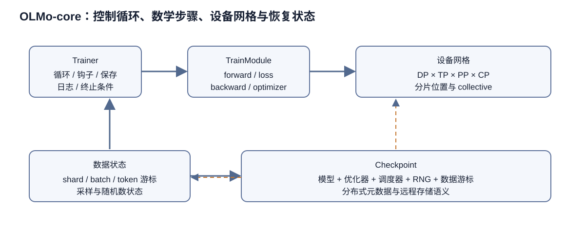

# OLMo-core 技术解析：把大模型训练拆成可组合、可恢复、可审计的系统

本文分析的唯一代码基线是本地官方快照 `data/sources/OLMo-core/repo`，提交 `5f6f58a133e7ef577d596295f2c8db4651c27857`。主要证据来自 `src/olmo_core/train/trainer.py`、`train/train_module/`、`train/checkpoint.py`、`distributed/`、`data/`、`nn/transformer/`、`src/scripts/official/` 与 `docs/source/guides/`。这很重要：OLMo-core 是持续演进的训练库，讨论“它支持什么”若不绑定提交号，很容易把未来接口、外部仓库能力或 README 的愿景误写成当前实现。

> 图 1：Trainer 管理循环和生命周期，TrainModule 定义前向、损失与优化步骤；设备网格承载数据、张量、流水线和上下文并行，数据游标与分布式状态共同进入 checkpoint。

图 1 把“谁决定下一步做什么”和“这一步具体算什么”分开。Trainer 沿控制箭头触发取数、前后向、优化、日志与保存，TrainModule 返回损失和待更新状态；并行网格改变张量分片与通信位置，却不应悄悄改变训练目标。恢复箭头同时指向模型、优化器、调度器、随机数状态和数据游标，因为只恢复权重并不能保证继续看到相同的 token 顺序。图中没有指定某个 OLMo 版本采用哪组并行维度，那必须回到发布配置和运行记录核对。

## 1. 训练系统的装配层

OLMo-core 的名称容易让人误以为它只是 OLMo 模型的内部实现。固定快照显示，它更准确的角色是“训练构件库”：模型结构、训练步骤、数据加载、分布式网格、checkpoint、回调、评测与启动器都被拆成可替换部件。README 把源码入口指向 `src/olmo_core`，官方模型训练脚本放在 `src/scripts/official`，两者之间形成清楚的边界：库提供机制，脚本给出某个已发布模型所采用的策略组合。

这种边界直接改善可审计性。只看一份巨型训练脚本，研究者很难判断某个参数究竟是模型定义、优化器规则、基础设施默认值还是实验特例；在 OLMo-core 中，模型配置位于 `nn/transformer/config.py`，训练包装配置位于 `train/train_module/transformer/config.py`，Trainer 的循环级配置位于 `train/config.py`，官方脚本负责把这些对象装配起来。配置仍然可能复杂，却至少可以沿类型和构造调用追踪来源。

README 展示了命令行覆盖 `--train_module.optim.lr=6e-3`。这体现了配置树的设计：实验脚本首先建立一套有类型的默认配置，命令行再对树中的精确路径覆盖。优点是同一脚本可以表达一族近邻实验，且最终运行参数可被记录；风险则是“脚本文件相同”不代表实验相同，复现时必须同时保存完整展开配置和命令行覆盖项。

OLMo-core 也不试图包办全生态。README 把评测指向 OLMo Eval 与 olmes，把数据预处理指向 Dolma，把常见推理交给 Transformers 和 vLLM。仓库内虽有 beta 生成模块，但训练仍是中心。这个克制的范围说明：复现 OLMo 发布模型需要一条跨仓库证据链，OLMo-core 负责训练执行层，并不自动保证数据构建、评测和部署的一致性。

## 2. Trainer 与 TrainModule：控制循环和数学步骤分离

`train/trainer.py` 中的 `Trainer` 是运行时编排中心。它持有 `TrainModule`、数据加载器、回调集合，以及步数、token 数、epoch 等状态。Trainer 负责“什么时候做什么”：获取 batch、推进训练、触发回调、判断终止、维护状态、协调保存与恢复。它不应知道具体 Transformer 怎样计算 logits、怎样切分参数或怎样调用优化器；这些属于 TrainModule。

`train/train_module/train_module.py` 定义抽象训练模块，Transformer 的普通路径实现在 `transformer/train_module.py`，流水线路径另有 `pipeline_train_module.py`。这样的分层让 Trainer 可以复用于非文本模态或不同模型，只要新的模块遵守训练步骤和状态接口。数据指南也明确指出，可以通过自定义 `DataLoaderBase` 将 Trainer 用于其他模态。换言之，Trainer 面向的是“可迭代、可保存状态的一批输入”和“能执行一步并暴露状态的训练模块”，而不是固定的 token 张量。

TransformerTrainModule 的责任比模型前向更广。配置文件中同时出现数据并行、张量并行、上下文并行、专家并行、activation checkpointing 等配置类型，说明 TrainModule 是把裸模型变成分布式可训练实体的地方。它必须在正确的设备网格上构造或包装模型，协调损失、反向、梯度同步、优化器更新以及混合精度相关行为。把这些放在 TrainModule 而非 Trainer 的意义在于：训练循环可以保持稳定，而并行策略和模型拓扑可以演进。

回调则承载横切关注点。仓库在 `train/callbacks/` 中提供 checkpointer 等回调，使保存、日志、评测或监控不必塞进主循环。回调模式的好处是扩展性和测试隔离；代价是行为分散，事件顺序会影响结果。例如一个回调若在优化器更新前后读取参数，语义完全不同。复现时不能只列“启用了哪些 callback”，还要保留注册顺序、触发间隔和各自状态。

Trainer 的状态并非只有 `step`。可靠恢复需要把训练进度与数据消费位置绑定起来。若模型和优化器恢复到第 N 步，但数据加载器从 epoch 开头重新开始，后续样本序列已经改变；若 scheduler 的内部计数没恢复，学习率轨迹也会分叉。因此仓库让 Trainer、TrainModule、DataLoader 和 callback 各自提供状态，再由 checkpoint 机制统一保存。这里的核心原则是：checkpoint 是整个状态机的快照，而不是一份可以推理的权重文件。

## 3. 相互制约的并行网格

`train/train_module/transformer/config.py` 分别定义数据并行、张量并行、上下文并行、专家并行与流水线并行配置。它们对应不同的切分对象：数据并行复制模型、切 batch 并同步梯度；张量并行在层内切矩阵计算和参数；上下文并行沿序列维切长上下文；专家并行把 MoE 专家分散到设备；流水线并行把层段放到不同 stage。代码把它们拆开，是因为每一维都有独立的通信模式、合法规模和失败条件。

数据并行也不是单一实现。配置中的 wrapping strategy 和 PyTorch 分布式能力表明，系统要区分复制、全分片等路径。全分片可以显著降低单卡参数、梯度和优化器状态占用，却增加聚合与重分片通信，并改变 checkpoint 的 state dict 形态。判断某份配置能否扩展，不能只看 GPU 数；还要看每个并行维度大小的乘积是否与 world size 一致、节点内外网络层次是否匹配，以及 batch 能否被数据并行维整除。

流水线训练有专门的 `pipeline/` 子包，包含 stage、schedule、点对点传输、executor 和 activation offload。这个结构说明流水线不是给普通模块外包一层包装就结束了。它需要明确层到 stage 的分配、microbatch 调度、相邻 stage 的发送接收，以及首尾 stage 对输入和损失的不同职责。调度选择还决定气泡比例和同时驻留的 activation 数量。GPU activation offload 能用主机内存换显存，但同时引入 PCIe 或互联搬运，吞吐收益取决于是否能与计算重叠。

张量并行和上下文并行都降低单卡张量规模，但通信发生位置不同。张量并行通常在注意力或前馈层的投影附近聚合部分结果；上下文并行需要在注意力计算中交换序列块。注意力后端因此不是无关紧要的实现细节。README 把 flash-attn、ring-flash-attn 和 TransformerEngine 列为可选依赖，意味着某个配置声称的后端只有在依赖、GPU 架构和版本组合都满足时才成立。缺少依赖时可能失败，也可能退回不同后端；两者都必须在实验记录中明确。

专家并行又增加 token 路由和 all-to-all。README 指出 dropless MoE 依赖 `grouped_gemm`，并在该依赖特定版本之后才可能免源码编译。这是一条典型的可复现边界：OLMo-core 的 Python 配置可以公开，但性能关键的外部 kernel、编译器和 CUDA ABI 仍会决定实际能否运行。代码开放不等于二进制环境天然可移植。

这些维度组合后，局部正确并不保证整体正确。举例说，某层可做 tensor parallel，不代表它在 pipeline stage 边界和 FSDP 包装顺序下仍有相同参数命名；MoE 的专家并行组也不能随意与数据并行组重合。OLMo-core 的配置类和构建流程承担大量合法性校验，用户不应绕过官方构造器后再把异常吞吐归因于模型。

## 4. Checkpoint：分布式状态、远程存储与恢复语义

`train/checkpoint.py` 定义 `CheckpointerConfig` 与 `Checkpointer`，分布式保存的底层能力位于 `distributed/checkpoint`。源码组织反映出两层职责：训练层决定保存哪些逻辑对象、何时保存以及保留策略；分布式层解决分片 state dict 如何在多个 rank 上写入和读回。checkpointer callback 再把它接入 Trainer 生命周期。

对大模型而言，“rank 0 写一个文件”通常不可行。参数与优化器状态可能本来就以分片形式存在，如果先聚合到单机，不仅额外占用内存，还形成网络与 I/O 热点。分布式 checkpoint 允许各 rank 保存自己的分片，并用元数据描述全局张量。恢复时，若设备网格或分片布局改变，能否重分片取决于底层 state dict 支持和对象命名的一致性，而不是所有 checkpoint 都天然可跨拓扑加载。

README 的退火示例直接从 URL 指向 checkpoint，仓库也包含通用 `io.py` 与文件系统缓存模块。这套设计同时覆盖对象存储、远程路径和本地 POSIX 文件。但远程可读仍不保证原子性。稳健保存必须避免读到半成品：通常需要临时位置、所有 rank 协调完成、最后发布完成标记或原子重命名。具体保证应以这个提交的实现为准；本文不把任何对象存储都宣称为强一致。

一个完整训练 checkpoint 至少涉及模型、优化器、学习率调度、Trainer 计数和数据加载器位置，启用有状态回调时还包括回调状态。随机数状态、梯度缩放器或并行库内部状态是否纳入，也要从实际 state dict 路径核对。仅加载模型参数然后称为“无缝续训”是不准确的；它更接近“以已有权重重新开始一段训练”。官方单独提供 anneal 脚本，也说明阶段切换可能有意改变数据、学习率和优化器设置，不应和故障恢复混为一谈。

checkpoint 的频率是可靠性与吞吐的权衡。间隔过大，故障时损失大量计算；过小则会让训练被存储带宽拖慢。异步保存若存在，还要考虑内存快照何时完成、后台写入失败如何上报以及下一次保存是否覆盖未完成任务。回调让策略可配置，但复现实验必须记录保存间隔、保留数、远程路径、是否异步和恢复点的完整性验证。

## 5. 数据管线：token 流如何变成可恢复的训练顺序

官方数据指南要求先把文本预分词为 token ID 的一维 NumPy 数组，特殊 token 已包含，padding 除外。Dolma 可以生成这种格式。NumPy memmap 可以按区间随机访问大文件，无需把全量 token 装入内存，这才是选择该格式的主要原因。代价是上游 tokenizer、EOS 插入规则、dtype 和文档边界信息必须在预处理阶段固定；训练库无法从纯 token 流恢复丢失的原文语义。

FSL 的最简单策略是 concatenate-and-chunk：把文档连接成 token 流再定长切片。它实现简单、token 利用率高，但带来两个统计语义问题。第一，文档会在样本边界被截断，模型在单个上下文中看不到完整文档；第二，一个样本可以跨多个文档，普通 causal attention 会让后文关注前一篇无关文档。`generate_doc_lengths=True` 配合模型的 `doc_lens`、`max_doc_lens` 可做文档内掩码，解决第二点但不自动修复第一点。

`NumpyPackedFSLDataset` 采用 OBFD 装箱，尽量在不切碎文档的条件下减少 padding。它改善上下文完整性，却需要训练开始前做打包计算；按源文件分别打包便于并行，也会使打包最优性受文件边界限制。`source_group_size` 允许跨相邻文件共同打包，是预处理开销、内存和紧凑度之间的控制杆。长文档仍必须选择截断或切分，这个选择会真实改变训练 token 分布，不能当作无关实现细节。

`NumpyPaddedFSLDataset` 为每篇文档填充到固定长度，从结构上避免跨文档注意，但短文档多时浪费算力。`NumpyInterleavedFSLDataset` 则有意把文档块交错，让相同文档片段在上下文中相距更远，用于训练长距离依赖；它不支持文档内掩码，因为掩码会抵消设计目标。几种数据集产生的 token 数可能相近，学习问题却不同，因此报告“使用同一语料”远远不够。

VSL 路径用 `NumpyVSLDataset` 实现按序列长度的课程。最小和最大长度必须是 2 的幂，同一 batch 内样本长度一致，总 token 数保持为全局 batch 大小。固定 token 预算使不同长度的 batch 在优化器尺度上更可比，但样本条数随长度改变，通信和 kernel 效率也会变化。`VSLCurriculum` 决定不同长度随 epoch 的采样概率，这属于训练配方的一部分，恢复时必须继续原来的课程位置。

自定义 DataLoader 的契约尤其值得注意：`_iter_batches` 返回的只能是当前 rank 的局部 batch，而且 token 数必须等于 `rank_batch_size`；`state_dict()` 和 `load_state_dict()` 必须使其从 epoch 中断位置继续。这是数据可复现的最低要求。若 loader 只保存 batch 编号，却没有保存 shuffle seed、源文件游标、mixture 调度或 packing 状态，恢复后的数据顺序仍可能改变。公开接口给了实现正确恢复的机会，但不会自动证明第三方 loader 做对了。

## 6. 模型、优化与 kernel 的边界

`nn/transformer/` 把模型配置、block、attention、feed-forward、归一化、RoPE 与模型主体拆开。训练模块再在其外施加并行与优化。这样的层次使同一个裸模型可以在不同并行策略下运行，也让 Hugging Face 转换和生成模块复用结构。然而，配置可组合并不意味着任意组合都经过验证；官方训练脚本仍是确认已发布模型真实配方的优先证据。

activation checkpointing 配置位于 Transformer 训练配置中，它通过重算前向中间值换取显存。它和“训练状态 checkpoint”名称相似，语义完全不同：前者是单步内的计算—显存权衡，后者是跨进程故障恢复的持久化。分析日志或配置时若混用两者，容易误判保存开销或显存来源。

README 列出的 float8 依赖 `torchao`，注意力可选后端依赖 flash-attn、ring-flash-attn 或 TransformerEngine，CuTe kernel 又依赖 QuACK。这些依赖意味着数值与吞吐结论绑定硬件和软件栈。float8 的缩放策略、累加精度、随机舍入以及 kernel 版本都可能影响收敛；注意力后端即使数学上等价，也可能在掩码、dropout、长序列边界或确定性上存在实现差异。因此“相同 OLMo-core commit”只是复现锚点之一，还必须固定 PyTorch、CUDA、驱动、可选库版本和容器摘要。

官方 Docker 镜像包含依赖却不安装 OLMo-core 本包，目的是让开发者挂载频繁变化的代码。这一安排也揭示镜像的证据边界：镜像 tag 不能单独确定训练代码，git commit 也不能单独确定二进制环境。最可靠的实验记录应同时包含镜像不可变 digest、源码 commit、展开配置、启动命令、节点与 GPU 拓扑。

## 7. 可复现性：仓库开放了什么，又没有保证什么

这个快照提供了比单一模型权重更强的复现基础。官方脚本给出模型配置的可执行实例；有类型配置让命令行覆盖可追踪；Trainer、TrainModule、DataLoader 和 callback 的状态接口支持整机恢复；测试、Ruff、mypy 和格式检查降低代码漂移；公开的数据策略文档解释了许多会改变训练分布的选择。提交号 `5f6f58a...` 使上述判断可回到同一份证据。

但仓库没有自动提供完整实验封印。第一，官方训练依赖数据文件与其确切顺序，公开 loader 不等于拿到同一数据快照。第二，Beaker 是 Ai2 基础设施路径，外部用户使用 `torchrun` 时需要自行映射调度、网络和存储。第三，README 明确警告官方镜像可能因硬件、驱动或 CUDA 不同而不可用。第四，部分高性能功能来自外部 kernel 项目，依赖版本与编译选项仍是变量。第五，评测在其他仓库中完成，训练成功不代表评测口径已复现。

因此复现 OLMo-core 实验至少要保存六类材料：源码提交与未提交补丁；容器 digest 和完整依赖锁；展开后的全部配置及命令行覆盖；数据清单、校验和、tokenizer 与混合权重；world size、各并行维度和物理拓扑；起始 checkpoint、保存策略与最终 checkpoint 校验和。若是从远程 checkpoint 继续退火，还应区分它是故障恢复、阶段转换还是仅加载模型权重。

最后需要区分“可运行”“可续训”和“可复现实验结果”。安装包并跑通小模型证明可运行；故障后数据顺序、优化器和 scheduler 均连续才叫可续训；在相同预算下得到统计一致的损失与下游结果，才接近实验复现。OLMo-core 的架构认真解决了前两层的大量工程问题，也为第三层提供审计入口，但不可能替代数据、硬件和完整实验记录。

## 8. 阅读源码的推荐路径

验证一份 OLMo 训练配方，最好从对应的官方实验脚本入手。脚本位于 `src/scripts/official/`，先列出模型、TrainModule、Trainer、DataLoader 和 callback 的实际配置；再进入 `train/train_module/transformer/config.py` 确认并行和 activation checkpointing；随后读 `trainer.py` 与 callback，确定一步训练、日志和保存的时序；再检查具体 DataLoader 的采样与状态恢复；最后才沿模型模块和可选 kernel 追数值路径。

这条路径也能防止“能力清单式”误读。仓库中存在一个类，不等于官方模型使用它；README 链接一个后端，不等于当前环境安装了它；配置允许某个并行维度，不等于任意拓扑都通过测试。应始终从官方脚本的实际实例化出发，再用库代码解释机制。

从软件设计看，OLMo-core 把研究训练中常被藏在内部平台里的决策显式化：数据怎样切、状态怎样存、并行怎样组合、阶段怎样启动。它让外部研究者有机会定位差异来自模型、数据还是系统。不过，透明性需要一条可核验链；固定 commit、配置、数据与环境共同存在时，这套构件才真正成为可复现基础设施。

还应把运行日志视为这条证据链的一部分。展开配置回答“计划运行什么”，日志回答“实际运行了什么”：每个 rank 是否加入预期设备网格、有效全局 batch 是否符合配置、数据吞吐和梯度范数是否异常、保存是否由全部分片成功完成，都只能从运行期证据确认。节点故障后的第一次恢复日志尤其关键，它应明确加载的 checkpoint、恢复出的步数和数据位置，而不能仅凭进程重新启动就认定续训正确。对公开复现实验而言，保留机器可读指标、标准输出和依赖清单，比只保存一张最终损失曲线更有价值。

大规模训练中的确定性通常不要求逐位完全相等。大规模 GPU 集合通信、融合 kernel 和浮点归约顺序可能造成微小差异；合理目标通常是状态连续、数据顺序受控，并在预先约定的统计容差内复现曲线。若研究问题本身对微小数值扰动敏感，则应额外启用确定性设置、固定随机种子并记录不可确定算子。OLMo-core 提供组织这些实验的骨架，但容差标准仍需由实验设计者明确。
