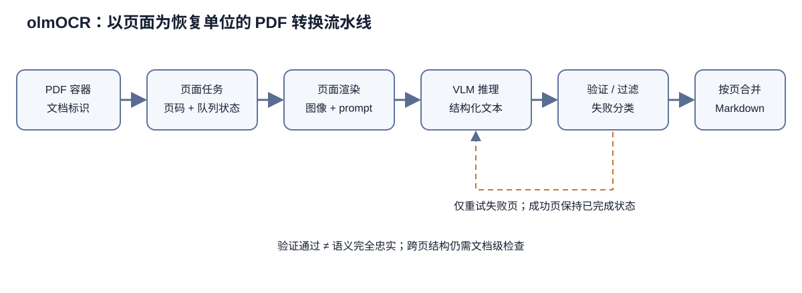

# olmOCR 技术解析：从 PDF 页面到可恢复的文档转换流水线

olmOCR 提交 `f7cfe4c22098b154c76b6ec950d1c0a464eecf8d` 的主要实现位于 `olmocr/pipeline.py`、`work_queue.py`、`pdf_info.py`、`prompts/`、`filter/`、`datatypes.py`、`bench/`、`tests/` 与数据渲染脚本。它的输出来自视觉语言模型，不能当作传统字符识别的确定性转写。

> 图 1：PDF 先拆成带文档和页码标识的任务，单页渲染后进入视觉语言模型，输出经格式验证、重试与过滤，再按页序合并为 Markdown 文档。

图 1 中页级任务是恢复和并发的最小单位：失败页可以单独重试，成功页不必重新推理。文档标识与页码沿整条链路保留，合并器才能在并行完成顺序不同的情况下恢复原始页序。验证器只能检查输出格式、重复、截断等可编码条件，不能证明转写忠实；跨页表格、脚注和段落延续也可能在页级切分时受损。因而最终 Markdown 仍需抽样核对原页，不能把“通过验证”解释成“内容完全正确”。

## 1. 页面级流水线，而不是一次把整本 PDF 喂给模型

PDF 是容器：页面可含文本层、矢量图、扫描图、旋转、嵌入字体和损坏对象。olmOCR 先枚举文档和页面，再把单页渲染为图像，构造含页面线索的 prompt，调用 VLM，验证响应，最后按原顺序合并为文档。页面级切分让显存和请求大小可控，也能只重试失败页；代价是跨页表格、段落与页眉识别需要后处理。

README 要求 poppler-utils 与字体，说明 PDF 光栅化依赖系统二进制和字体替换。相同 PDF 在不同 Poppler、字体包、DPI、颜色模式和裁切框下会生成不同像素。VLM 对版面与小字敏感，因此复现不能只固定模型权重，还要固定渲染环境和参数。

`olmocr/data/renderpdf.py` 与图像工具承载页面渲染。合理流程要读取 MediaBox/CropBox、旋转信息与页数，生成受尺寸上限约束的图片。分辨率过低会丢小字和上下标，过高则增加视觉 token、显存和延迟。极瘦、极小、超大页面在 `tests/gnarly_pdfs/` 有专门样本，证明几何边界是已知风险。

PDF 可能已有文本层。该文本可作为 prompt anchor，帮助模型辨识模糊字符和阅读顺序，但文本层也可能是错误 OCR、乱码或错列。anchor 应是辅助证据而非绝对真值。测试中包含 `failing_anchor`、`pdftotext_two_column_issue` 等文件，说明仓库主动覆盖 anchor 误导场景。

## 2. Prompt 把 OCR 定义成结构化生成任务

olmOCR 不只输出字符，还要删除页眉页脚、恢复自然阅读顺序、表达公式与表格。prompt 因而定义了任务规范：哪些内容保留，如何用 Markdown 表示，空白页怎样返回，何时认为内容截断。新闻中明确提到 prompt bug 修复带来约两点 benchmark 提升，说明提示是模型系统的一部分，而不是可随意替换的文案。

视觉输入与 anchor 结合会占用上下文。若页面文本极多，anchor 截断策略可能保留开头而丢末尾；生成上限又可能造成输出 cutoff。仓库有 cutoff detection 测试与 overrun 样例，表示管线会判断回答是否异常结束并重试。检测只能依据输出形式和停止原因估计，无法证明语义完整。

自然阅读顺序本身没有唯一真值。多栏论文通常先读左栏再右栏，侧栏、脚注、图注与跨栏表格可能有多种合理顺序。Markdown 也无法完整表达坐标与层级。olmOCR 的目标是适合语言模型训练的线性文本，而不是版面复刻；使用者若需坐标、字体或法律级档案转写，应保留 PDF 和其他结构化 OCR。

空白页幻觉是生成式 OCR 特有问题。传统 OCR 可能返回空，VLM 可能根据先验编造常见标题或段落。v0.3.0 新闻称修复空白文档幻觉，`empty_document` 测试保留了回归样本。稳健管线应结合像素内容、文本层和模型输出长度判断空白，而不只相信生成文本。

## 3. 任务队列：把百万页处理变成可恢复作业

`work_queue.py` 和 S3 work queue 测试显示，页面任务通过持久化队列分配给 worker。队列的价值是把发现、处理和提交解耦：worker 可横向扩展，崩溃页可重新领取，完成页可跳过。高吞吐 OCR 的主要难题往往来自数百万异构页面中的长尾与故障，单次推理只占其中一环。

可靠队列需要明确 claim、lease、heartbeat、complete 和 retry。worker 领取任务后若崩溃，lease 到期必须允许其他 worker 重试；若原 worker稍后恢复并写结果，就可能重复提交。输出以稳定文档/页 ID 幂等写入，并用 attempt 或条件更新拒绝陈旧结果，才能接近 exactly-once 效果。对象存储本身通常只提供至少一次工作流。

本地 workspace 同时保存中间状态、Dolma 和 Markdown。存在文件不应自动等于完成：半写 JSONL、空 Markdown 或下载到一半的 PDF 都可能残留。恢复逻辑应依据成功元数据、页数与输出校验，而不是简单 `Path.exists()`。`tests/test_s3_work_queue.py` 和 pipeline 测试是理解恢复语义的关键证据。

任务粒度按页便于重试，但文档提交必须等所有必要页完成。若个别页超过最大重试，系统需要明确是输出带缺页标记、隔离整篇文档，还是保留部分结果。静默拼接会把缺页变成无法察觉的数据损失。训练语料构建通常宁可隔离问题文档并记录失败，也不应伪造连贯性。

## 4. 模型推理：本地 vLLM 与远程 OpenAI 兼容接口

本地模式安装 GPU extra 并启动 vLLM，远程模式通过 `--server` 连接兼容 OpenAI API 的平台。两者共享请求协议，却不保证相同：模型 revision、tokenizer、视觉预处理、量化、dtype、tensor parallel、sampling 和 server 默认值都可能不同。复现应固定 endpoint 软件版本与完整启动参数。

README 推荐 FP8 模型并称减少重试。FP8 降低显存与提高吞吐，但量化可能改变低 margin token，从而影响字符、公式和表格。benchmark 数字绑定特定权重与推理配置。将 BF16 与 FP8 输出混在同一数据版本中，会引入难以追踪的系统差异。

采样温度也是质量参数。新闻记录更好的 temperature selection 带来性能改进。温度过低让模型稳定但可能反复卡在错误格式，适度采样让重试探索其他输出；温度过高则增加幻觉与不一致。若重试逐次改变温度，最终结果是一个选择策略，必须与模型一起版本化。

并发数受 GPU 显存、视觉 token、KV cache 和 server 队列约束。复杂页面比空白页占用更多生成 token，导致长尾。固定请求并发不等于固定显存；生产运行应监控 prompt/生成 token、OOM、排队时间、重试率和每页成本。README 的成本数字不能脱离硬件与失败分布外推。

## 5. 重试、恢复与失败分类

重试适用于暂时性网络错误、server overload、截断和部分格式错误，但不适合无限重复确定性坏 PDF。系统应区分下载失败、PDF 解析失败、渲染失败、模型拒绝、输出 cutoff、验证失败和写入失败，为每类设置上限与退避。否则一个损坏页会消耗大量 GPU 并阻塞队列。

重试次数影响数据选择。容易页面一次成功，困难页面可能经过多次采样后选中首个通过验证的输出；这相当于 rejection sampling。若比较模型质量，只统计最终成功页会隐藏重试成本和失败率。benchmark 与生产统计都应报告 first-pass、最终成功率、平均/分位重试和永久失败类别。

恢复还涉及模型版本。作业中途更新 server，前后页面会由不同权重生成。每个结果记录应保存模型 ID、revision、server 版本、prompt 版本、渲染哈希和采样参数。若必须升级，应创建新 run 或明确标注分界，不能只在 workspace 顶层写一个模型名。

输出写入要先临时文件、校验、再原子发布。JSONL/Dolma 结果包含 stable ID、文本与 metadata；Markdown 是派生视图。两种输出若分别写，崩溃可能只完成一个。恢复时应以结构化记录为权威并可重建 Markdown，或使用共同完成标记。

## 6. 输出验证与过滤

`filter/` 中的 coherency 与 filter 逻辑用于识别异常输出。可检查过度重复、乱码、内容稀少、可疑长度或其他启发式。验证器降低明显坏结果进入语料的概率，却可能误删真实的目录、代码、诗歌和表格。每条过滤规则都应有原因码与保留原始响应，方便回溯。

页面输出至少应通过 schema、非空策略、Unicode 合法性、长度上限、重复率和 cutoff 检测。文档合并还要验证页码覆盖、顺序与分隔。公式 Markdown/LaTeX 是否成对、表格列是否一致可作弱检查，但不能证明内容正确。强制“修复”不平衡符号可能反而篡改原文。

页眉页脚删除依赖跨页重复模式和模型判断。短文档只有一页时难以判断，重复正文标题也可能被误删。输出若用于检索或训练，残留页眉通常比删除正文危害小，因此阈值应偏保守并保留定位 metadata。

图像型文档的输出许可和隐私也需要检查。OCR 会把原本难检索的个人信息变成纯文本，提高泄露风险。生产管线应在 OCR 后另做 PII/许可过滤；olmOCR 负责转换，不自动赋予源 PDF 再分发权。

### 7. olmOCR-Bench 与单元测试

benchmark 位于 `olmocr/bench`，覆盖 7,000 多个局部测试而非只用全文编辑距离。类别包括表格、公式、多栏、页眉页脚、旧扫描和小字，能针对结构能力给出更可解释结果。局部测试降低参考全文制作成本，也意味着总体分数由测试分布与类别权重定义。

README 表格报告均值与不确定性，但某第三方条目显示 `±?`，说明并非所有外部结果都有完整误差估计。星号系统的运行条件应在 benchmark 文档核对。动态第三方版本、API 和硬件会漂移，表格是该快照记录而不是永久排行榜。

`tests/gnarly_pdfs/` 是工程价值很高的回归集：旋转、超细页、两栏、表格、手写、图像为主、重复引用、加载错误和输出 overrun 都有样本。普通单元测试还覆盖 anchor、cutoff、table parsing、pipeline、S3 queue、filter 和 GRPO。这些测试验证已知 bug 不复发，但不能覆盖任意 PDF 解析漏洞。

基准与生产目标要区分。bench 优化可能让模型针对固定局部模式提高，却不一定降低真实文库失败率。应另设时间隔离的 heldout 文档、按来源分层统计，并保留人工双盲比较。每次 prompt 或后处理更新都要同时看 benchmark、失败率和成本。

### 8. PDF 渲染的可复现边界

Poppler 版本、字体 fallback、抗锯齿和 DPI 会改变像素。缺失字体可能用宽度不同的替代字体，造成换行、表格和公式位置变化；扫描 PDF 则主要受图像解码与颜色处理影响。容器应固定 apt 包版本与字体文件哈希，而不只是 Python lock。

PDF 也可能包含恶意或异常对象。渲染器应有超时、内存与文件大小限制，并在隔离环境运行。密码保护、损坏 xref、巨型画布和嵌套对象必须分类失败。直接对不可信 PDF 调系统工具是一条安全边界，不能因来源是学术仓库就忽略。

PNG/JPEG 输入绕过部分 PDF 枚举，但仍有 EXIF 旋转、ICC 色彩、超大尺寸与多帧问题。统一转换为页面对象时应保存原始格式、尺寸和变换；否则无法解释模型为何看到旋转或缩放后的图像。

### 9. 复现一批转换结果

必须保存输入对象 manifest 与校验和、页数和 PDF metadata、容器 digest、Poppler/字体、渲染参数、prompt commit、模型/tokenizer revision、vLLM 与量化配置、采样和重试策略、过滤器版本、每页 attempt 记录、最终输出校验和。只保存命令行远远不够。

运行前抽取代表性文档做 golden test，保存渲染图片哈希和输出。全量后核对输入文档数、页面数、first-pass 成功、重试、永久失败、过滤、Markdown/Dolma 数量与页覆盖。随机抽样应覆盖成功、重试后成功和失败三类。

如果目标是训练数据，应保留页级 provenance，使生成文本能回到源 PDF、页码与转换版本。后续发现 prompt bug、删除请求或许可问题时，才能定向重建/移除，而不必丢弃整个语料。

### 10. 质量控制形成反馈循环

olmOCR 把生成式 OCR 工程化为页面渲染、任务队列、VLM 服务、重试验证和文档输出的反馈循环。它的优势是处理复杂阅读顺序、公式与表格，代价是输出具有模型随机性和幻觉风险。仓库用 gnarly PDFs、bench 和恢复队列正面处理这些问题。

评估这套系统不能只看单个 overall score。更完整的指标包括 first-pass 质量、最终质量、重试成本、永久失败、来源分层、渲染稳定性和可追溯性。固定提交只是起点；渲染器、字体、模型、server 和 prompt 共同定义一次 OCR 实验。

### 11. 页面合并与文档级语义

页面独立推理后必须恢复文档顺序。最简单做法按 page number 拼接并插入分隔，但文档语义可能跨页：段落在页尾断行、表格在下一页延续、脚注跨页、章节标题单独占页。若每页都要求独立完整 Markdown，模型可能在页尾补全不存在的句子，或在下一页重复表头。合并器应尽量保留边界，而不是用启发式“润色”掩盖断点。

页眉页脚的识别最好利用多页重复模式。单页模型可以按位置与样式猜测，但相同文本跨多页重复是更强证据。反过来，书名、章节标题和表头也会重复，删除规则需要结合位置和页面类型。任何跨页后处理都应保存原始页输出和变换日志，使误删能够撤销。

文档级 ID 应由稳定源标识或内容哈希派生，页 ID 则组合文档 ID 与页码。若输入 PDF 更新但路径不变，内容哈希必须变化；否则恢复逻辑会复用旧页。输出 metadata 至少包括源 URI、源校验和、页码、总页数、渲染尺寸、模型与转换版本。Markdown 文件名只是展示层，不应成为唯一主键。

Dolma 输出适合后续数据管线，因为文本、来源和 metadata 可以结构化保存。但 OCR 结果进入 Dolma 之前应明确是每页一个 document 还是整本一个 document。前者便于追踪与重试，后者保留长文结构；训练时的 packing 又可能重新切分。选择会影响去重、过滤和上下文分布，必须写进数据说明。

### 12. 调度公平性和长尾控制

真实文库的页面成本分布很长：空白页几乎不生成，密集小字、复杂表格和大图需要长响应，损坏 PDF 还会反复超时。如果队列严格按文档处理，一个巨型或困难文档可能占住 worker；按页调度能改善公平性，但同时增加对象与状态数量。可以按预计页面成本分桶，但估计器也会带来偏差。

服务端动态 batching 提高 GPU 利用率，长输出却可能拖慢同批短请求。合理指标不仅是平均页/秒，还包括 p50/p95/p99 延迟、队列等待和超时率。并发过高导致 OOM 后的批量重试，会产生看似高吞吐、实际浪费大量算力的振荡。自动控制应依据显存和尾延迟调整，而不是固定最大并发。

优先级队列可让小型交互任务先完成，也可能饿死批量归档。生产系统应区分用户优先任务和离线任务，并记录调度政策。benchmark 运行则应禁用会改变样本顺序或资源预算的动态优先策略，保证不同模型比较使用同一负载条件。

### 13. 验证器的精度和选择偏差

输出验证通常只能检测可观察异常。重复短语、空响应、截断、明显乱码容易识别；公式抄错一个符号、表格列交换、日期数字错误则可能完全通过。验证通过意味着“结构上可接受”，不等于“忠实转写”。对高风险文档仍需人工或双系统交叉核验。

若多次重试后选择第一个通过验证的响应，验证器成为隐式奖励函数。模型会被偏好成满足格式启发式的输出，而不一定是字符最准确的输出。可保存所有 attempt，在离线 benchmark 中比较“首个通过”“最高验证分”和人工最佳，估计选择策略的收益与偏差。

过滤掉全部失败页后再计算质量会产生幸存者偏差。应将永久失败作为错误计入覆盖率，或同时报告条件质量与端到端质量。系统 A 在容易页上 90 分但失败 20%，可能不如系统 B 的 88 分和 1% 失败。成本也要把失败 attempt 纳入。

coherency 模型或启发式自身可能受语言影响。对英语训练的连贯性检测器可能把非英语、代码、目录和数学证明判为异常。过滤统计应按语言与文档类型分层，并让未知语言走保守路径。否则“清理”会无意中把多语语料变成英语语料。

### 14. Benchmark 的测试单位与不确定性

olmOCR-Bench 的 7,000 多测试用例来自约 1,400 文档，测试并非独立同分布：同一文档内的多个断言共享页面质量。若直接把所有断言当独立样本计算误差，置信区间可能过窄。更合理的 bootstrap 单位通常是文档或页面，具体应遵循 bench 实现。

类别样本量与难度不同，总分如何加权决定优化方向。均匀按测试点会让测试点多的类别主导；先按类别平均再宏平均又会放大小类别的权重。README 同时列出类别分数和 overall，使总分背后的能力结构可见。复现时必须使用仓库聚合代码和固定测试清单。

第三方 API 评测还受服务日期、限流和不可见模型更新影响。表中 Mistral OCR 等结果应记录运行日期、API 参数、后处理和失败重试。若 API 不返回确定版本，结果只能视为当时服务快照。带星号与 `±?` 的条目尤其需要回到 benchmark 说明，不能自行补造误差。

训练使用 benchmark 调 prompt 或 RL reward 后，benchmark 不再是纯 heldout。v0.4.0 新闻称使用 RL 并提高 bench，具体训练是否直接使用 benchmark 单测要查论文与训练配置。无论如何，持续开发会逐渐对公开 benchmark 适配，应保留时间隔离的新文档做最终验证。

### 15. 安全、许可和运营边界

PDF 渲染和模型服务都处理不可信输入。除 Poppler 隔离外，还要限制 URL 下载协议、重定向、文件大小和内网访问，防止 SSRF 或压缩炸弹。远程 OpenAI 兼容 server 可能把文档发送给第三方，敏感文档使用前必须核对数据保留、地区和访问政策。

模型输出也可能包含 prompt injection 文本。OCR 的任务是转写页面，不应执行页面中的指令；但视觉语言模型可能遵循“忽略之前指令”等文字而偏离格式。系统 prompt、输出验证和对抗测试需要覆盖文档内指令。即使不执行工具，注入也可能让模型泄露固定 prompt 或生成非原文内容。

源码许可、模型许可、输入 PDF 版权和输出再分发是四件事。仓库链接 OLMo LICENSE，不代表任意扫描书籍都可公开。构建训练集时需保留来源和权利 metadata，支持 takedown。OCR 生成文本可能仍受原作品版权约束，不能因格式转换而视为无权利负担。

运营上还要保护日志。请求与错误日志可能包含页面文本、S3 URL、认证 header 或服务 token。trace 应脱敏并限制访问；公开复现可以发布哈希、参数和非敏感样例，不应发布密钥。失败截图也可能含个人信息。

### 16. 一套实际验收方案

第一阶段做环境验收：固定容器后，对几份 golden PDF 比较页面 PNG 哈希，确认 Poppler 与字体；启动 server 后记录模型 revision，用固定图片比较 token 化和输出。第二阶段做功能验收：覆盖空白、旋转、多栏、表格、公式、手写、小字、损坏 PDF 和图像输入，验证页数、错误分类与恢复。

第三阶段做故障注入：处理中杀 worker、让 server 返回 429/500、截断网络、填满临时盘、制造半写输出，再确认 lease 回收、幂等提交和 manifest 不把半成品标成功。第四阶段做规模验收：以代表性混合测吞吐、尾延迟、显存、重试和成本，逐步增加并发找到稳定区间。

第五阶段做质量验收：运行固定 bench，按类别检查变化，并人工双盲抽样真实文库。发布前从输入 manifest 到 Dolma/Markdown 做页覆盖对账，列出永久失败与跳过原因。若任何源文缺页或渲染失败，应记录并隔离，而不是生成占位内容冒充原文。

可审计的 OCR 数据产品应让每段文本都能回到具体 PDF 页面、具体渲染、具体模型请求和具体验证决定。olmOCR 提供了这条链的大部分构件；调用方还需保存中间证据，并在清单中列出失败页、重试结果与隔离文档。

### 17. PDF页面是多种坐标系的交汇点

PDF 保存的是一组绘制指令、字体、字符位置与嵌入对象，不能直接等同于一张已经排好版的图片。页面坐标通常以 point 为单位，原点方向又可能和图像像素坐标不同。渲染到宽 \(W\)、高 \(H\) 的位图后，原坐标 \((x,y)\) 需要经过缩放、旋转和裁剪变换，才能与视觉模型看到的位置对应。若页面带有 CropBox、MediaBox 或旋转标记，直接按宽高比例换算会产生系统偏移。

仓库要把渲染参数视为模型输入的一部分：使用哪个页面框、DPI、颜色空间、抗锯齿、背景色和旋转规则，都应进入任务摘要。相同 PDF 交给不同渲染器，字形边缘和透明图层可能不同；视觉编码器接收的像素随之变化。只保存原文件哈希而不保存渲染器版本，仍无法重放输入。

坐标映射还决定输出能否回到原页。若模型输出边界框，必须声明它位于原 PDF 坐标、渲染图像像素还是归一化空间。页面裁边后，映射要保留仿射矩阵，而不是事后凭尺寸猜测。这个矩阵也是高亮、人工复核和结构评测共同依赖的契约。

### 18. 分辨率选择是一种信息预算

提高 DPI 能让小字号、上标和细线更清楚，也让视觉 token、显存和推理时间快速增长。固定整页缩放时，大幅面海报与普通论文页被压到同样尺寸，前者的局部文字更小。按物理 DPI 渲染又会让不同页面产生不同像素数，batch 成本难以控制。

可以先用页面尺寸和文本对象统计估计所需分辨率，再对疑难页分块或二次渲染。分块提高局部清晰度，却切断跨块阅读顺序，表格和双栏段落也可能跨边界。重叠窗口能缓解切断，随后必须解决重复文本和坐标合并。分辨率策略因此与结构恢复算法相互依赖。

评测时应按字号、页面尺寸和扫描清晰度分层。平均分提升可能只来自普通正文，对小脚注、公式下标毫无改善。记录每页渲染像素、视觉 token 数与耗时，才能画出质量—成本曲线，选择满足目标文档的输入预算。

### 19. 原生文本层既是帮助也是噪声来源

许多 PDF 已包含字符和坐标，扫描件则可能附带旧 OCR 文本层。原生层可以为模型提供辅助线索、生成弱标签或直接处理简单页面，但它可能乱码、字符顺序错误、缺字或与图像不对齐。看到“可提取文本”不等于它可信。

可以比较文本层覆盖的字符框与渲染区域，检查异常 Unicode、重叠率、字符密度和阅读顺序，再决定是否进入提示。若把错误文本层直接喂给模型，模型可能服从文字提示而忽略图像；完全丢弃又浪费高质量数字文本。最稳妥的策略是保留两路证据，并在输出中记录模型主要依据。

弱标签生成尤其要防止循环验证：用 PDF 文本层生成参考答案，再用同一文本层帮助模型，评测会高估能力。扫描页、数字原生页和带 OCR 层页应分开报告，让改进究竟来自视觉识别还是文本复用一目了然。

### 20. 模型输入契约需要冻结多模态顺序

一次解析请求通常包含系统指令、页面图像、可选元数据和用户要求。聊天模板怎样插入图像占位符、图像在文字前后、是否带页码与尺寸，都会影响输出。多图模式下，页面顺序必须显式绑定，不能依靠上传顺序的偶然行为。

输入契约至少记录消息数组、模板版本、图像字节哈希、缩放方式、解码参数和模型标识。保存渲染图哈希比只存 PDF 哈希更接近真实输入；同时保留父 PDF 与页码，才能追溯来源。若远端接口重新压缩图像，还应记录客户端发送格式和服务端已知限制。

接口适配器要验证能力。某后端不支持多图、透明通道或特定尺寸时，应明确失败或执行已声明变换。悄悄降采样、删除第二张图或改变 prompt，会让同名运行失去比较意义。请求生成与模型调用分开保存，可在不重复渲染的情况下复查差异。

### 21. 输出格式定义了可恢复的结构

纯 Markdown 适合阅读，却难以无损表示页面元素、坐标、层级与跨页关系；严格 JSON 容易验证，但模型生成长嵌套对象时更容易出现括号和转义错误。仓库选择的格式实际上在表达能力、生成稳定性和后处理复杂度之间取舍。

若输出包含自然语言正文与结构字段，应规定转义、换行、空值、元素 ID 和坐标精度。表格可以保存为 HTML、Markdown 或单元格图，三者对合并单元格、脚注和跨页续表的支持不同。公式保留 LaTeX 的同时，最好关联页面 span，便于发现幻觉公式。

schema 必须版本化。新增字段可以向后兼容，改变字段语义则需要迁移器。解析器遇到未知字段不能直接丢弃，因为那可能是新版模型的重要信息。每个输出保存 schema 版本与验证结果，后续工具才知道自己能否安全消费。

### 22. 阅读顺序是一个图排序问题

双栏、侧栏、脚注、图注和浮动表格使页面元素没有唯一的简单从上到下顺序。可以把文本块视为节点，根据空间邻接、栏位、字体层级和语言连贯性建立有向边，再求一个满足约束的拓扑顺序。模型直接生成序列，相当于隐式完成了这张图的预测。

顺序错误不会明显改变字符识别率，却会破坏检索分块和训练文本。左栏第一段接到右栏末尾，单句仍像自然语言，长篇论证已经断裂。评测需要成对顺序约束：对于标注的块对 \((a,b)\)，检查输出中是否保持 \(a\prec b\)，并分别统计栏内与跨栏关系。

标题、正文、图注之间的层级能辅助排序，但不能用字号单独判断。学术海报的大字正文、报纸栏题和扫描缩放都会扰动。模型输出块 ID 与父子关系，再由确定性算法线性化，通常比只输出一串文本更容易审计。

### 23. 段落恢复需要区分视觉换行与语义换行

PDF 中每行末尾往往只是版面换行，直接保留会把段落切碎；全部合并又会吞掉标题、列表、诗歌和代码中的真实换行。英文断词还涉及行末连字符：`trans-` 接下一行 `former` 应合并，真正的复合词则要保留连字符。

恢复规则需要结合缩进、行距、字体、标点和语言模型连贯性。模型可以预测段落边界，但后处理仍要验证空段、异常短行和列表编号。对于代码与表格，应关闭普通段落合并，保留空间结构或输出专用节点。

评测可以同时比较字符内容和边界。只用编辑距离时，把整页合成一段仍可能得高分；只比段落数量又无法区分合理差异。边界 F1、段落内字符准确率和阅读顺序约束共同使用，才接近下游真正需要的结构。

### 24. 页眉页脚删除需要跨页证据

单页很难判断顶部文字是章节标题还是重复页眉。观察同一文档多页后，位置、字体和文本模式稳定重复的区域更可能是页眉页脚。页码虽每页变化，也具有固定位置和数字序列。页面独立推理若缺少邻页信息，容易保留噪声或删掉正文。

可以先逐页解析并保留候选区域，再在文档级聚类重复块。删除决定保存证据：出现页集合、位置方差、文本相似度和规则版本。首页、章节首页和奇偶页模板需要单独处理，不能要求每页完全一致。

下游用途也影响选择。用于忠实存档时，页眉页脚属于原文；用于语言模型预训练时，大量重复页码价值很低。仓库可以保存结构标记并让导出器决定是否纳入正文，从而避免一次不可逆删除替所有用途作答。

### 25. 表格需要保存二维关系

把表格按视觉顺序转成纯文本，单元格之间的行列关系很容易丢失。表头跨列、单元格合并、空白占位和跨页续表尤其困难。一个看似完整的数字序列，如果列对应关系错了，语义比漏掉几个字符更糟。

结构化表示可以为每个单元格保存行列范围、内容、表头关联和页面坐标，再按需要渲染成 HTML 或 Markdown。模型若只输出 Markdown，后处理应检查每行列数、分隔符和合并信息，无法表达的结构不要伪造成规整矩形。表题、脚注和单位也要关联到表对象。

评测除文本相似度外，还需比较单元格匹配和拓扑关系。先按坐标或内容对齐预测与参考单元格，再计算行列邻接、表头归属和内容准确率。大型表格可以局部正确，单一 exact match 会把所有部分信号抹掉。

### 26. 公式解析包含视觉与语法两层约束

公式中的上下标、分式、矩阵和多行对齐依赖二维布局。OCR 得到字符后，还要恢复 LaTeX 或其他结构表示。同一个公式可以有多种等价 LaTeX 写法，字符串完全相等并不合理；渲染图像相似又可能掩盖变量名错误。

验证器可以先检查语法能否解析和渲染，再比较规范化符号树、渲染相似度与关键 token。宏展开、空白和可交换项需要谨慎处理，过强的代数等价判断会把真正差异合并。公式编号与正文引用也应建立链接，避免编号被当作公式内容。

模型在低清图像上容易幻觉熟悉公式。若输出包含图中不存在的长推导，语言流畅度反而很高。坐标对齐、字符覆盖和局部重渲染能提供约束；低置信公式可触发更高 DPI 的局部二次识别，而不是整页无条件重跑。

### 27. 图像、图注与正文必须保持关联

文档解析不一定要理解图像内容，却至少要保留图像位置、图注和正文引用。若只输出文字，图注可能漂到错误段落，后续检索会把结论与另一张图混在一起。多栏页面中，最近的几何距离也不总代表归属。

模型可输出 figure 节点、边界框、caption 子节点和引用标识。文档级合并再解析“图 2”“Figure 3a”等引用，把正文段落连到对象。子图标签需要保留，图注中的 `(a)` 与图像区域对应关系对科学文档尤为重要。

过滤器不应因图片占比高就删除整页，图册、幻灯片和论文结果页本来就视觉密集。按目标用途分类后决定：预训练文本导出可以跳过纯图页，文档理解数据则应保留。页面类型预测由此成为路由信号，而不是统一质量分。

### 28. 跨页结构不能靠字符串拼接

章节可能跨页延续，列表、表格和脚注也会在页边界中断。逐页输出直接以换行拼接，会留下重复标题、断开的单词和两个半张表。文档级合并需要利用页码、块类型、字体与语言连续性判断关系。

跨页段落合并应保留原始页锚点，使用户仍能回到证据位置。若上一页以连字符结束、下一页小写开头，合并概率较高；若下一页出现标题样式，则应保持边界。规则不确定时保留分隔并标注候选关系，比不可逆合并更安全。

跨页表格要对齐列结构和重复表头，脚注则通常只关联当前页。模型逐页运行无法观察全部信息，因此合并器是解析语义的一部分。它的版本与参数应和页面模型一起进入输出清单。

### 29. 失败分类决定数据集最终偏向谁

页面超时、图像解码失败、输出不合法、内容为空和质量验证失败，若都归入一个失败计数，就无法判断缺失机制。复杂表格页更慢，低资源语言更易输出异常，扫描件更可能被判为空。简单跳过失败页会让最终数据偏向干净的英文正文。

每个输入页必须产生终态记录，即使没有正文。终态包含失败阶段、错误类型、重试次数、模型响应摘要和资源用量。可恢复系统从清单重新调度失败项，而不是重新枚举全部 PDF；永久失败也保留在分母中，才能计算覆盖率。

发布质量统计应按页面类型、语言、来源、分辨率和长度分层报告失败率。若某类页面失败过多，可以路由到专用解析器或人工处理。把难页从统计中删掉，只会得到一个看起来很高、适用范围却不断缩小的准确率。

### 30. 重试会带来选择效应

生成模型即使温度为零，也可能因后端实现和并行计算出现细微差异。遇到格式错误便重试，最后保留第一次通过验证的输出，相当于从多次样本中按验证器选择。重试次数越多，表面成功率越高，输出分布也越受验证器偏好影响。

应区分传输重试与语义重试。网络失败可发送同一请求，语义失败若改变 prompt、温度或分辨率，就是新的解析策略。每次尝试都保存父请求 ID 与选择原因，最终结果标明经历了几次。评测时可同时报告首轮成功率和重试后覆盖率。

若重试使用更强模型或更高分辨率，成本与质量应归入级联策略，而非算作基础模型单次表现。级联本身很实用，只要路由条件、最大预算和回退结果固定，便能公平比较。

### 31. 验证器会塑造训练标签分布

验证器可能检查 JSON 合法、重复 n-gram、异常字符、文本长度与页面覆盖。它拦下明显坏输出，也会误删罕见但真实的页面，例如目录、索引、乐谱或代码清单。若通过验证的输出被用作新训练数据，模型下一轮会更像验证器喜欢的格式。

因此每条拒绝规则都需要正反例和分层误报率。多个规则串联时保存全部触发原因，不只记录第一个。阈值附近的页面进入人工审计池，审阅结果再校准规则。验证器版本改变后，应在同一批历史输出上重跑，量化训练集成员变化。

对无法自动判断的结构错误，可以保留低置信标签而非直接删除。训练时按置信度加权或只用于特定目标。这样质量控制表达不确定性，也保留未来更强验证器重新判断的可能。

### 32. 置信度需要对应可观察错误

模型生成一个总置信度常常缺乏校准。更有用的是将置信分解到页面、块、行、公式和表格单元格，并与具体错误类型对齐。字符正确但阅读顺序错误的页面，不应只得到一个模糊的中等分。

可利用多种信号：生成 token 概率、多次解码一致性、图文覆盖、语法验证和不同模型之间的分歧。各信号尺度不同，需要在人工标注集上校准。低概率不总等于 OCR 错误，罕见人名和公式本来就难预测；图像证据与输出不一致更值得警惕。

校准结果要按页面类型分层。扫描书籍上的 0.8 与数字原生论文上的 0.8 可能对应不同错误率。将置信度用于路由时，报告在给定人工复核预算下能捕获多少错误，才能评价它是否真的有用。

### 33. 数据生成需要防止教师错误固化

用强视觉语言模型解析大规模 PDF，再把输出训练更小模型，是典型的数据生成路线。教师能快速扩大标签规模，也会把自己的幻觉、格式偏好和语言盲区传播给学生。学生在教师错误上得到稳定监督，甚至比教师更坚定。

生成数据应保留教师模型版本、请求、原始响应、验证结果和任何后处理。多教师分歧可以发现高风险页面；对公式、表格和低资源语言建立人工金标子集，用于估计教师误差。无法确定的页面降低训练权重或排除，而不是让格式通过等同于内容正确。

训练/验证切分要按文档或来源进行，不能把同一 PDF 的相邻页分到两侧。模板和字体高度相似，页面级随机切分会严重泄漏。若同一文档存在多个版本或扫描副本，还要用近似匹配聚类后整体切分。

### 34. 合成扰动要保持文档语义

为了覆盖旋转、模糊、压缩和噪点，可以对清晰页面施加合成扰动。它提供精确参考文本，却未必代表真实扫描退化。高斯噪声与手机拍摄的阴影、透视、纸张纹理和墨迹渗透差异很大。模型在合成噪声上进步，不保证真实档案同样改善。

扰动参数应保存，并按强度分层评测。几何变换后，原边界框也要通过同一矩阵更新；裁剪不能切掉内容后仍沿用完整参考答案。JPEG 压缩、缩放和旋转的顺序不同，会产生不同像素，应成为生成配方的一部分。

真实失败页可以反向指导扰动设计，但要避免把测试样本直接复制进训练。分析错误模式后生成新的版式和噪声组合，比在测试页上做轻微变体更干净。合成集与真实集分别报告，才能知道模型学到的是稳健视觉特征还是某套增强器。

### 35. Benchmark需要覆盖完整解析链

单一字符编辑距离偏重正文 OCR，无法评价标题层级、阅读顺序、表格、公式和图文关系。完整 benchmark 应包含元素检测、文字转写、结构关系和文档级合并，并允许分别定位错误。总分可以方便比较，但不能替代分项。

不同任务的分母也要清楚。按字符加权会让长正文支配结果，按页面平均则让一行标题页与密集表格页等权。可以先在页面类型内部汇总，再按预先定义的权重生成总分。权重表达目标用途，例如学术解析可提高公式与表格占比。

参考标注存在多种合理答案，尤其是段落边界和 Markdown 格式。评测器应规范化无关差异，并对结构等价提供容忍；语义不同的数字、变量和顺序则严格处理。每次 benchmark 更新都发布差异清单，旧结果不能悄悄套用新评分器。

### 36. 字符错误率会被大段正文稀释

字符错误率定义为编辑距离除以参考字符数：

\[
\mathrm{CER}=\frac{S+D+I}{N},
\]

其中替换、删除和插入分别为 \(S,D,I\)。它直观且容易计算，但一页有两千字正文和十个关键数字时，即使所有数字都错，CER 仍可能很低。科学文档的变量、单位和引用编号往往比普通词更重要。

可以按字符类型分层报告，单独统计数字、数学符号、标点、低频词和普通文字。实体与数值还可做 token 级 exact match。归一化规则要公开：Unicode 等价、空白、连字符和大小写是否忽略，都会改变结果。

页面级宏平均与全语料微平均都值得保留。前者关注典型页面，后者反映总体字符量。两者差距大时，通常说明错误集中在少数密集长页或大量短页。错误分布比一个 CER 更能指导改进。

### 37. 结构评测可以基于关系而非字符串

将预测与参考都解析成节点图，节点表示标题、段落、表格、图和公式，边表示先后、包含、引用与表头关系。先用文本、坐标和类型匹配节点，再计算节点识别与边关系的 precision、recall、F1。这样格式字符串不同但结构相同的输出仍可得分。

节点匹配本身可能一对多：模型把一个段落拆成两个，或把两个栏合成一个。评测器需要允许分裂与合并，并给出代价。若强制一一匹配，段落边界的小差异会让后续所有关系错位。采用最优匹配时，阈值与代价函数也要版本化。

图评测结果可回到具体页面显示错误边，便于人工判断。阅读顺序错、图注归属错和标题层级错在字符串指标中混在一起，在关系图里则是不同边类型。这样的诊断才真正连接模型改进与下游文档使用。

### 38. 评测集要按文档簇隔离

论文预印本与正式版、扫描书的不同版本、网站镜像和 OCR 重制版可能包含相同页面。仅按文件哈希切分，训练集与测试集仍会有近重复。页面模板、图表和文字都高度相似，模型无需泛化就能取得好成绩。

可以结合文档元数据、文本指纹、页面感知哈希和图像特征建立簇，再以簇为单位划分。阈值设置过宽会把同领域文档合并，过窄会漏掉裁剪或重新排版版本，因此需要人工核查大簇和跨 split 最近邻。

评测发布后，它本身会进入互联网和后续语料。数据构建时应维护已知 benchmark 指纹库，对新抓取持续扫描。版本报告列出命中与处理策略，避免时间推移后清洁测试集悄悄变成训练数据。

### 39. 模型版本与后处理版本应解耦

最终 Markdown 同时由视觉模型和确定性后处理产生。后处理可能修复转义、合并断词、删除页眉或重排节点。若只保存最终结果，分数变化无法判断来自模型还是规则。应保存原始响应、schema 解析结果和各阶段变换。

模型升级时，可以把新旧原始输出交给同一后处理器比较；后处理升级时，也能在固定原始输出上重算。两条轴分开以后，回归定位更直接。最终版本标识可由模型摘要、prompt 摘要、渲染摘要与后处理摘要组合生成。

确定性后处理也会有数据依赖，例如跨页页眉统计。重算单页时需要同一文档上下文，不能假设函数只依赖当前字符串。清单记录依赖范围，增量更新才知道哪些邻页需要一起刷新。

### 40. API模型只能做到证据可追溯

远端服务可能在相同模型名下更新权重、图像预处理和安全策略。即使请求完全一致，几个月后也未必返回同样结果。仓库无法冻结服务端，只能保存调用时间、返回的精确模型标识、请求与响应、参数、重试轨迹和供应商版本信息。

为检测漂移，可以定期运行一组锚定页面，覆盖正文、表格、公式、多语言和扫描噪声。锚点输出变化时，先暂停把新结果混入旧数据版本，再判断是否建立新解析版本。只看平均成功率可能漏掉某类页面退化。

本地开放权重提高了重放能力，仍受推理框架、视觉预处理、算子和硬件影响。可复现声明应分层：像素输入可重建、请求可重建、原始输出可重建、最终结构可重建。每层证据分别列出，比笼统写“可复现”更准确。

### 41. 成本统计必须以成功页面为分母

每页平均调用成本若把大量早期失败页也计入，可能显得很低；只统计成功页又会隐藏重试浪费。应同时报告输入页面数、首轮成功数、最终成功数、总视觉 token、生成 token、GPU 时间或 API 费用，以及每个最终可用页面的摊销成本。

页面复杂度对成本影响很大。按像素、文本密度、输出长度和类型分桶，能发现表格或长公式是否造成队列阻塞。P50 延迟无法描述少数超长页对批处理尾部的影响，还需 P95、P99 与超时率。

质量—成本曲线可比较单模型、高分辨率和级联策略。在相同覆盖率下比较结构分数，在相同质量下比较成本，避免某方案靠丢弃难页获得漂亮均值。工程统计由此服务于方法选择，而不只是运维看板。

### 42. 最小可审计产物

一次页面解析至少留下父文档哈希、页码、渲染图哈希与参数、完整请求、模型和后端版本、原始响应、结构化输出、schema 版本、验证结果、重试记录与资源统计。文档合并以后，再保存页面顺序、跨页关系、页眉页脚决定和最终导出哈希。

这些产物不必全部公开原文。受许可限制时可以发布清单、摘要、代码和分层统计，并在受控环境保留可回溯内容。关键是任何分数都能追到页面集合，任何页面都能追到变换链。失败页也进入清单，否则覆盖率无法验证。

随机抽一篇文档，若能够重建模型实际看到的页面、解释每个结构节点从何而来、找到被删除内容的理由，并用同一评测器重算分数，仓库的数据流才算闭环。olmOCR 的开放价值不仅是一次 OCR 输出，而是让文档到训练语料之间的决策可以逐层检查。

### 43. 页面分类应先于专用解析

封面、目录、正文、表格页、参考文献和空白页需要不同策略。统一 prompt 让模型自己推断类型很方便，却把路由错误藏进生成结果。显式页面分类可以选择分辨率、提示和验证器，也能统计各类覆盖。分类器不确定时保留多个候选路线，用较便宜的验证信号决定，而不是强制单标签。

分类标签必须来自可观察版式，不能把“解析困难”混成一种页面类型。表格页也可能含正文，目录页也可能带摘要。多标签比互斥标签更贴近真实文档。评测路由时既看分类准确率，也看路由后的端到端收益；偶尔分类错但两条路线输出相同，对最终系统影响很小。

类型分布会随来源改变。学术论文上的路由器直接用于历史报纸，置信度可能虚高。部署清单按来源报告类型与失败率，出现新簇时触发抽样审阅。页面分类由此成为数据流的入口诊断，而非又一个不可见模型。

### 44. 空白页判断要识别微小但关键的内容

扫描文档中存在真正空白页，也有只含页码、印章、手写批注或浅色水印的页面。基于平均像素或输出长度判空，很容易删除低对比度内容。渲染背景、自动裁边和二值化又会进一步影响判断。

可以组合前景像素比例、连通区域、原生对象数和模型短描述，并对阈值附近页面保留缩略图审计。页码是否需要保留取决于用途，但不能先误判为空再失去选择。空白决定应存为属性，导出器选择跳过，原始页身份仍在文档序列中。

页序对存档很重要。即使空白页不产生文本，也可以输出占位节点，避免后续页面编号整体错位。连续多个空白页还可能表示扫描失败或加密对象未渲染，需要与单个装订空页区分。

### 45. 旋转与方向检测需要保留变换链

PDF 页面可能带旋转元数据，扫描图像本身又可能横置或倒置。先应用元数据再做视觉方向检测，与忽略元数据直接检测，结果可能差九十度。方向模型对表格、竖排文字和纯图页面也容易误判。

每次旋转都应记录角度和作用坐标系，输出边界框通过逆矩阵映回统一页面坐标。若为了模型输入裁剪并旋转局部区域，还要组合全部仿射变换。没有这条链，文本看似正确，高亮位置却落到另一处。

中文竖排、书脊字和旋转表头不一定意味着整页方向错误。方向检测可先判断全局主体，再允许局部块携带自己的文字方向。评测分别检查转写和坐标，避免模型把内容读对就掩盖空间错误。

### 46. 颜色与透明度会改变可见文本

PDF 可以用透明图层、剪裁蒙版和叠印组合页面。屏幕上可见的文字不一定直接对应某个文本对象，隐藏 OCR 层又可能被提取工具读到。渲染器对颜色管理和透明混合的差异，会让浅色文字消失或背景变深。

统一转成 RGB 前应明确 alpha 与背景怎样合成。默认白底适合普通纸张，深色幻灯片若错误处理透明度，白字可能消失。灰度化节省输入，却会降低颜色编码表格和批注的可辨性。颜色策略可按页面类型选择，并成为输入摘要的一部分。

异常检测可以比较原生文本覆盖与渲染可见性：大量文本对象却几乎没有前景像素，说明隐藏层或渲染失败；视觉文字明显而文本对象为空，则属于扫描或轮廓字。两者应进入不同解析路线。

### 47. 字体缺失会制造可复现的乱码

PDF 嵌入字体不完整或使用自定义字符映射时，渲染器可能替换字形，文本提取也可能得到错误 Unicode。换一台机器后系统字体不同，同一页甚至会呈现不同符号。容器锁定程序版本仍不足以冻结字体环境。

输入清单应记录嵌入字体信息、替代字体警告和实际字体文件摘要。渲染日志中的缺字错误不能被吞掉。对公式和少数文字体，替代方框会让视觉模型无从恢复；这种页面应标为源渲染不完整，而不是归咎模型。

若图像渲染正确而 Unicode 映射错误，视觉 OCR 反而能修复文本层。反过来，字形已经渲染成方框时，再强的模型也没有证据。区分这两种失败能避免无意义重试，也让数据卡说明缺失发生在哪一层。

### 48. 加密与权限限制必须显式终止

部分 PDF 需要密码、禁止文本提取或只允许低质量打印。工具可能仍能打开封面，却在后续页返回空图；也可能忽略权限完成技术解析，但使用边界已不同。运行成功不能替代授权判断。

任务清单在入队前记录加密状态、权限位和解密方式。没有合法凭据时以明确终态停止，不把空输出混入质量失败。获得授权后使用的密钥不能写进普通日志，产物只保存凭据引用和访问策略。

权限语义与技术能力分开记录。某文件可以被渲染，不代表可发布派生文本；某文件禁止复制，也不一定禁止研究环境内部评测。仓库提供证据字段，具体数据版本再依据用途选择，而不是用一次全局过滤替代判断。

### 49. 文档语言识别应聚合页面证据

单页可能只有公式、参考文献或一张图，语言分类置信度很低。直接逐页路由会让同一文档在多个语言 prompt 间跳动。先对有足够正文的页面预测，再在文档级聚合，可以为稀疏页面提供先验，同时保留真正的双语章节。

混合语言文档需要 span 或块级标签。摘要双语、代码注释和翻译对照若强制单语言，模型可能错误规范字符或标点。语言信息用于选择 OCR 辅助规则时，低置信情况下应使用通用模型，不能删除未知语言。

评测按文字脚本和语言分别报告。拉丁字母覆盖许多语言，字符识别正确不代表词边界与阅读顺序正确。语言聚合算法及其版本进入文档清单，后续可判断某次退化是否由路由改变造成。

### 50. 手写批注与印刷正文属于不同层

档案和论文常有边注、签名、盖章与高亮。把它们直接插入正文，会打断原文；全部忽略又丢失重要信息。结构输出可以为印刷层、手写层和图章层建立独立节点，并用坐标与锚点连接。

手写识别的不确定性通常更高，验证器不应沿用印刷文本的字符规则。批注可能旋转、跨行或用箭头指向正文，阅读顺序不是简单位置排序。先检测区域与关系，再决定是否转写，比把整页交给单一线性生成更可控。

训练数据若教师无法可靠识别手写，应保留区域而不编造文字。空字符串与无法识别必须区分：前者表示确认没有文本，后者表示存在证据但内容未知。这种缺失语义对后续人工补标十分关键。

### 51. 列表结构承载逻辑关系

编号列表、项目符号和嵌套缩进表达层级。OCR 只保留每行文字时，`1.`、`l.` 和项目符号容易混淆，子项也可能被拍平成连续段落。对操作手册和法律文件，这会改变条件与责任范围。

结构 schema 应为列表、列表项和嵌套级别建节点，编号原文与规范序号分别保存。若页面跨页继续编号，文档合并器根据序列和缩进连接，而不是重新从一开始编号。异常跳号可能来自识别错误，也可能是原文如此，不能自动修正而不留痕。

列表评测比较项目内容、层级边和编号。Markdown 渲染一致并不保证层级一致，例如四个空格差异就会改变语义。将输出解析成树后评测，比比较标记字符串稳定。

### 52. 脚注与引用需要双向链接

脚注标记出现在正文，说明文字位于页底或文末。若解析只按视觉顺序，脚注会插在页面最后一句之后，读者不知道它对应哪里。模型应输出引用标记、脚注节点和二者关系，同时保留原编号与坐标。

上标数字容易与公式指数、文献引用混淆。判断需要字体、基线、周围语境和页面底部候选共同参与。跨页脚注或重复编号增加歧义，无法确定时可以保存候选边及置信度。

文献引用也类似，但通常指向参考文献列表。文档级解析可把 `[12]`、作者年份等标记链接到条目。对训练文本导出，可以选择保留人类可读标记；对知识检索，结构链接则能避免把引用号当作正文数字。

### 53. 目录可以成为结构校验器

目录列出章节标题和页码，本身常被当作普通文本。若将它解析为结构索引，就能验证后续标题是否出现、页码映射是否合理，并辅助跨页层级恢复。目录页码可能与 PDF 物理页码有偏移，需要从多个锚点估计映射。

标题措辞可能缩写，点线和页码也常识别错误，所以目录不能作为绝对真值。将目录项与正文标题做模糊匹配，未匹配项进入审计。若多数条目统一偏移两页，说明前言或封面造成页号差；零散错位更可能是 OCR 问题。

这种内部一致性检查不依赖外部标注，适合大规模质量控制。类似信号还包括图表目录、页内“见第 X 节”和连续页码。文档自身提供的冗余，可以约束页面模型的独立错误。

### 54. 重复页面检测要区分扫描副本与模板

批量扫描可能因进纸问题产生完全重复页、漏页或顺序颠倒。感知哈希能发现图像副本，文本哈希能发现重新渲染的同内容页。页眉模板相似不应让不同正文被合并，因此检测需要结合全页与正文区域。

同一页重复两次是否删除取决于来源。扫描错误可以标记一个副本，原始文档若故意重复表格则应保留。观察相邻页码、目录和重复位置能提供证据。任何自动删除都保存被删页到保留页的映射。

漏页更难发现，可从物理页码跳跃、章节断裂和目录项缺失推断。系统不能生成不存在的页面填补；它应在文档结构中插入缺页标记，使下游知道语义中断来自源文件，而非解析器漏输出。

### 55. 页面队列必须保持幂等

分布式 worker 可能在写完结果后、确认任务前崩溃，同一页随后被再次处理。若输出用随机文件名追加，就会出现两个版本；文档合并器可能重复正文。以输入页身份和解析版本构造确定键，可以让相同任务覆盖同一逻辑槽位。

幂等不代表盲目覆盖。新尝试的请求摘要与既有任务不同，说明配置漂移，应写入新版本或报错。相同请求产生不同响应时，两份原始结果都值得保留，最终选择依据必须记录。完成标志只有在输出关闭、校验并写入清单后才发布。

对象存储没有原子重命名时，可以先写唯一临时对象，再以条件写更新 manifest。消费者只读取清单中已提交对象，不扫描目录猜测完成状态。这样的工程约束直接保证数据集中每页出现一次且版本一致。

### 56. 缓存键应覆盖全部可见输入

缓存能避免重复渲染和推理，但键若只包含文件名和页码，prompt、模型或 DPI 改变后仍可能命中旧结果。完整键应由 PDF 内容摘要、页码、渲染配置、图像摘要、请求模板、模型版本、解码参数和后处理版本构成。

不同阶段分层缓存更灵活：渲染缓存只依赖 PDF 与渲染器，模型原始响应缓存依赖像素与请求，结构缓存再加入 parser，文档合并缓存加入全页集合。修改页眉规则时无需重新调用模型，修改 DPI 时则必须从渲染层失效。

缓存命中也写入运行清单，最终版本不能混用来源不明的旧对象。定期抽样重算并比较哈希，可发现缓存损坏或依赖遗漏。性能优化只有保持语义透明，才不会把历史偶然结果伪装成新实验。

### 57. 内容哈希不能替代页面身份

两本书可能包含完全相同的版权页，内容哈希相同，但它们在各自文档中的页序与许可上下文不同。只按图像或文本哈希作为主键会错误合并。页面身份应由父文档版本与逻辑页码确定，内容哈希用于建立相似关系。

同一 PDF 重新线性化或修改元数据后，文件哈希变化，实际页面像素可能完全一致。保存渲染哈希能复用页面级结果，同时谱系记录它来自哪个新文件。文本输出哈希又可发现不同像素产生相同解析。

多层身份让系统分别回答来源是否相同、视觉输入是否相同、解析文本是否相同。去重、缓存、许可和评测泄漏各自使用合适层级，避免一个哈希承担所有语义。

### 58. 人工审阅需要主动选择而非只看随机页

随机抽样能估计总体质量，但严重错误往往集中在稀有版式。审阅队列应结合低置信、验证器分歧、模型分歧、新来源、异常长度和结构复杂度选择样本，同时保留一部分纯随机样本用于无偏估计。

主动选择集上的错误率不能直接当总体错误率，因为它刻意挑难例。报告时按抽样概率加权，或将诊断集与估计集分开。审阅界面显示页面图、原始响应、结构输出和验证信号，避免审阅者只修可见文本却遗漏关系错误。

每项修订保留原输出、修订内容、错误类型和审阅者分歧。它既能训练下一版模型，也能校准验证器。高分歧样本说明规范本身含糊，应先完善标注规则，而不是强迫审阅者给出虚假的唯一答案。

### 59. 回归测试要同时覆盖局部与端到端

单元测试适合坐标变换、schema 解析、字符规范化和表格转换，能精确定位逻辑错误。端到端金样覆盖 PDF 渲染、模型请求、解析、验证和文档合并，能发现模块接口变化。两者缺一，都会留下盲区。

金样不必很大，但要包含旋转页、双栏、跨页表、公式、低资源语言、坏字体、透明层和预期失败。对生成模型，逐字节输出可能因无关措辞变化而不稳定，可断言结构不变量与质量阈值，同时保存差异供人工检查。

依赖升级前后在同一金样上生成结构化 diff：字符变化、节点增删、关系改变和失败状态分别统计。只比较最终文件哈希会告诉你发生变化，却不能判断变化性质。回归门槛应对关键数字和结构错误更严格。

### 60. 发布边界应明确哪些内容由模型补全

视觉模型可能根据语言常识补出模糊字符、缺失标点甚至整句。适度纠错提高可读性，也使输出不再是逐像素转写。若用于档案和证据检索，未经标记的补全风险很高；用于预训练，轻微规范化可能可以接受。

输出 schema 可以区分可见转写、规范化文本和推断补全，并为低证据 span 保存位置与置信度。模型若判断页边被裁掉，不应续写熟悉句子。验证器比较输出字符与可见区域覆盖，长而无对应区域的文本进入审计。

数据卡说明转写原则：是否修正拼写、展开缩写、恢复断词、翻译文字或描述图像。不同用途可从同一结构产物导出不同视图。把这些选择显式化，才能避免可读性提升被误认为识别准确率提升。

### 61. 版本迁移需要样本级差异

olmOCR 模型、prompt 或渲染器更新后，重新处理全部页面会得到新数据版本。迁移报告应统计成功状态变化、字符差异、结构节点变化、页面类型和来源分布，并对差异最大的页面抽样。总 benchmark 提升无法证明所有类别都改善。

同一页面的新旧结果共享稳定 ID，结构 diff 才能对齐。若 schema 更新，需要先将旧输出迁移到共同表示，再比较语义，而不是把新增字段全部算错误。无法迁移的字段明确列出。

发布者还应保留旧版本与工具，让使用旧语料训练的模型能够解释。新版本修复错误，不会让旧实验自动拥有修复后的数据。版本边界清楚以后，模型谱系才能准确指向其真实训练输入。

### 62. 端到端正确性的最终含义

文档解析的成功并非接口返回 200，也不是 Markdown 能打开。它意味着源页面被完整纳入清单，像素输入可重建，输出内容与可见证据对应，阅读顺序和结构关系满足目标用途，失败与不确定区域没有被隐藏，文档合并仍能追到原页。

这套标准允许某些页面明确失败。一个标记为字体缺失或扫描损坏的页面，比一段流畅但凭空补出的文字更可靠。覆盖率与正确率应一起优化，不能靠丢弃难例抬高质量，也不能靠接受幻觉追求全覆盖。

仓库将渲染、请求、生成、验证、合并和评测连成可版本化数据流，真正可复现的是这条变换关系。模型只是其中最复杂的一步；只要其他步骤仍然隐含，所谓端到端解析就无法被科学比较。

### 63. 分块解析需要解决重复与归属

高分辨率页面超过视觉模型输入预算时，常被切成重叠块。块内文字变大了，但一行文字可能同时出现在两个块中，表格横跨三块，图注也可能与图片分离。若简单拼接各块输出，重复段落和错序几乎不可避免。

每个块应保存页面坐标变换，输出节点先映回全页，再依据区域重叠、文本相似和结构类型合并。重复判定不能只看字符串：两个表格单元格可能文字相同却位于不同位置。坐标相近而文字略有差异时，可以选择置信更高版本，同时保存冲突供审计。

切块布局应由页面结构引导。先用轻量检测器寻找栏、表格和图片区，尽量不从元素中间切开；检测不可靠时使用规则网格与足够重叠。全页缩略图可作为额外上下文，让局部模型知道当前块处于哪一栏和哪个章节。评测单独统计跨块元素，才能知道局部清晰度提升是否抵消了合并错误。

### 64. 解码参数决定格式稳定与内容召回

文档转写通常希望确定输出，温度会设得很低。然而贪心解码可能在一次错误闭合括号后持续生成坏结构，适度 beam 或约束解码反而更稳。最大输出长度过小会截断密集页面，过大又允许模型在页面内容结束后继续幻觉。

长度预算可由页面文本密度、原生对象数和视觉块数估计，并设置硬上限。达到上限的结果不能当作普通成功，应标记截断并尝试分块。停止串若可能出现在代码或正文中，需要结构感知，而非简单字符串匹配。

约束 JSON 语法能保证可解析，不能保证字段内容忠实。模型可能在合法数组里重复段落或漏掉节点。解码策略评测同时观察 schema 成功率、内容准确率、覆盖率和成本。只优化合法率会把真正难题推给内容验证器。

### 65. 图文覆盖可以发现大段遗漏

解析结果可以重新映射到页面：每个输出块应对应一个视觉区域，页面中的显著文字区域也应被某个输出覆盖。利用文本检测器或原生字符框建立候选区域，计算预测区域的 precision 与 recall，能发现整栏遗漏和无依据生成。

覆盖信号并非真值。装饰文字、复杂公式和低对比度扫描可能被检测器漏掉，图片中的招牌也可能被检测到却不属于目标正文。它适合作为异常筛选器，与输出长度、页面类型和模型置信联合判断。极低覆盖触发重试，轻微缺口进入审阅。

重新渲染结构输出也是一种检查：将边界框、阅读顺序箭头和文本摘要叠到原页，人能快速发现错位。大规模运行不必保存全部可视化，只为异常页和固定探针生成，既控制存储又保留诊断能力。

### 66. 文档级一致性能够纠正局部识别

作者名、章节标题、变量符号和专有名词会在一篇文档中重复出现。页面模型可能在不同位置给出略有差异的拼写。文档合并后可建立词形候选，借助高置信出现纠正低置信出现，但必须避免把真实变体强行统一。

一致性规则只处理证据明确的局部差异，例如同一页眉、连续公式中的固定变量或目录与标题匹配。普通正文中的近似词不能因编辑距离小就替换。每次修正保留原值、依据节点和规则版本，使用户能恢复逐页原始输出。

一致性也能发现错误而不自动修复：连续页的章节编号倒退、表格列名突然变化、引用了不存在的图，都可产生警报。利用文档冗余做验证，通常比让模型再生成一次更可解释。

### 67. 训练样本切片要避免破坏结构节点

解析完成的长文档还要切成训练序列。按固定字符数截断可能从公式、表格或列表中间切开，使结构标记不配对。更合理的切片先尊重章节、段落和元素边界，再在超过上下文窗口时对大节点使用专门策略。

表格可以按行切片并重复表头，代码保留函数边界，跨页段落先合并再切。重复表头会增加训练 token，需要在元数据中区分原文与为了自包含而复制的上下文。节点 ID 和页锚点随切片保留，模型训练样本仍能追到视觉证据。

切片长度分布与打包策略共同决定训练利用率。为了填满窗口而拼接无关文档，会丢失页面结构带来的长程关系；全部保持整篇又可能产生大量短序列。数据导出应提供不同视图，让语言预训练、文档检索和多模态对齐按用途选择。

### 68. 评测不确定性应以文档为抽样单位

同一 PDF 的页面共享字体、版式和扫描条件，页面错误高度相关。将每页当作独立样本计算置信区间，会高估有效样本量。更合适的 bootstrap 先抽文档，再保留被抽中文档的全部页面；若关注来源泛化，还可以在来源层继续分层。

比较两个解析器时使用配对重采样，让它们面对同一批文档。每次重采样重算页面指标、结构指标和预定总分，得到差值分布。少数超长文档可能主导微平均，因此同时报告文档宏平均与字符微平均。

测试集规模不足时，小幅领先不应被写成普遍优势。按扫描件、数字原生、表格、公式和语言分层给出区间，能看到改进集中在哪里。若某层只有几篇文档，直接显示样本量与单文档结果，比给一个虚假精确的小数更诚实。

### 69. 一份解析结果可以支持多种忠实度视图

研究者需要便于训练的连续文本，档案工作者需要逐页忠实转写，检索系统需要标题、段落和坐标，阅读界面还要表格与图像。用一个 Markdown 文件同时满足所有需求，必然在某处丢信息。核心产物应是带来源锚点的结构图，其他格式由确定性导出器生成。

连续文本视图可以移除页眉、合并断词和跨页段落；忠实视图保留页界、原始拼写与无法识别标记；检索视图按语义块输出并携带页码。它们共享同一节点 ID，因此检索答案能回到原页，训练语料也能接受删除修订。

导出器版本同样影响数据。改变 Markdown 标题层级、表格序列化或空白规范，会改变 tokenizer 输入，即使核心结构没变。发布时分别标记核心解析版本与导出视图版本，使用者才能判断两个数据集是否真的相同。

### 70. 仓库的责任边界在可验证转换

olmOCR 无法保证损坏扫描中不存在的字符被恢复，也不能仅靠模型判断一份文档是否有权进入训练。它能做的是保留输入证据、声明模型与规则、识别已知失败、量化覆盖和误差，并让每次导出可追溯到页面。

当源 PDF 缺页、字体无法渲染或图像被过度压缩时，正确产物应记录缺失，而非根据上下文造出完整内容。当结构存在多种合理解释时，保存节点与候选关系，比过早压成唯一字符串更有生命力。后续模型或人工可以在同一证据上重新判断。

从这个角度看，仓库的核心是建立从页面证据到结构化语料的可检验函数，批量生成整洁的 Markdown 只是外在结果。页面渲染、输入契约、模型生成、验证、合并、评测和版本清单共同定义该函数，少掉任何一环，结果都难以复现。

这条函数还要允许局部重算。发现某个渲染器错误时，只重建受影响页面及其下游结构；改进表格解析器时，复用原始响应并重新生成表格节点；更新文档合并规则时，不必再次支付模型推理成本。每一层输入输出都有稳定摘要，变更范围才能被准确圈定。局部重算既降低实验成本，也避免新旧配置在同一发布物中悄悄混合。最终清单应证明所有页面来自同一组兼容版本，并列出任何经过迁移或回填的节点。抽样验收还要从最终文档反向追踪到渲染像素，再从像素追到原 PDF 对象；正向与反向路径都能走通，数据谱系才不是一张只供展示的流程图。
