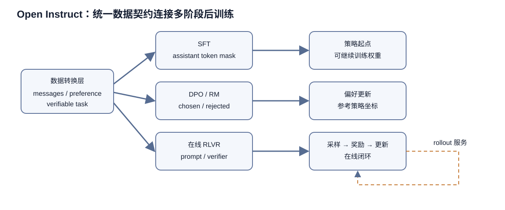

# Open Instruct 技术解析：从数据契约到 SFT、DPO 与在线 RLVR

本文固定分析 `data/sources/open-instruct/repo` 的提交 `11826255077617a46919ce75cadf1f3d53f30dac`。证据主要来自 `open_instruct/dataset_transformation.py`、`data_loader.py`、SFT/DPO/RM 与 `grpo_fast.py`，以及 `scripts/train/olmo3/`、`configs/`、`docs/olmo3.md` 和污染检查代码。Open Instruct 明确自称研究代码且不保证向后兼容，所以所有接口判断都只针对该提交。

> 图 1：统一数据转换把消息、偏好对和可验证任务送入不同阶段；SFT 产生策略起点，DPO 或奖励模型使用偏好数据，在线 RLVR 则把策略采样、验证奖励与参数更新连成闭环。

图 1 中三条训练路线共享稳定的数据语义和模型接口，各自采用不同的损失。SFT 需要明确哪些 assistant token 参与交叉熵；DPO 要保证 chosen 与 rejected 共用同一 prompt，并依赖参考策略定义相对变化；RLVR 每轮都由当前策略生成 rollout，再由验证器给出奖励，因此采样服务、训练集群和版本标识必须同步。箭头没有表示 SFT、DPO、RLVR 必须全部执行，也没有表示后一阶段必然优于前一阶段；具体组合取决于目标行为、数据覆盖和计算预算。

## 1. 多阶段后训练的共同底座是数据语义

Open Instruct 同时覆盖 SFT、奖励模型、DPO 和 RLVR。表面上它们是四套损失，真正共同的困难却是把来源各异的数据变成稳定语义：消息角色怎样排列，system prompt 是否注入，assistant 哪些 token 参与损失，chosen/rejected 是否共享完全相同的 prompt，RL prompt 如何携带可验证答案与环境信息。`dataset_transformation.py` 超过普通“map 一下字段”的范围，集中处理 chat template、特殊 token、截断、缓存版本、标签和数据来源。

源码注释直接列出三种主要目标：prompt-only、SFT 的 prompt+demonstration、RM/DPO 的 chosen+rejected。统一转换层的价值是让训练器消费明确张量，而不是各自在循环中猜测原始 schema。它也降低阶段间漂移：同一条 conversation 若在 SFT 与 DPO 中用不同模板渲染，偏好优化实际上是在另一个 token 分布上继续训练。

`TokenizerConfig` 和一组默认键定义字段契约。SFT 最终需要 `input_ids`、`attention_mask`、`labels`；assistant 以外的位置通常置为忽略标签。代码为转换缓存维护版本号，注释记录版本变化，例如工具列支持、generation 区间标签等。这个细节非常关键：Hugging Face datasets 的缓存可能让“代码已更新”但训练仍读旧 token 化结果。显式提升缓存版本，是把数据处理逻辑纳入可复现状态。

OLMo 3 文档暴露了真实教训：开头 `<think>` 曾因 prefix-based labeling 被误当 prompt 掩蔽。较新的 `` 区间能直接标注 assistant 生成范围，但块的起止、结束 token 和工具调用交接必须精确。只比较 labels 数量不足以证明归属正确；渲染文本相同也不证明 mask 相同。仓库宁可记录并丢弃所有权含糊的行，说明 silent corruption 比少量数据损失更危险。

## 2. SFT：损失掩码比“喂入对话”更重要

SFT 的基本目标是对 demonstration 中 assistant token 做交叉熵。用户、system、工具返回与格式 header 通常作为条件但不计损失。若 labels 边界错一位，模型可能被训练去生成用户提示、忽略 `<think>`，或学不到正确结束行为。Open Instruct 因而要求 fast tokenizer，并围绕 chat template 渲染与 assistant span 建立检查。

长样本策略同样改变目标。截断可能切掉回答尾部或结束 token；左截断保留末端，却可能丢失 system prompt 和问题前提。文档区分 `drop` 与 `terminate` 等行为，后者保存完整尾部但不应把已有工具交接 token 粗暴替换成 EOS。对工具使用模型而言，`<|im_end|>` 表示把控制权交还环境，普通 EOS 表示对话结束，二者混淆会直接破坏 agent 行为。

训练脚本仍有两条路径。README 对支持的 OLMo、OLMoE、Qwen3 推荐 GPU 效率更高的 OLMo-core SFT，传统脚本则基于 Hugging Face Trainer 改造。这样做是工程折中，不代表两个后端天然逐位等价。它们可能在数据打包、梯度累积、loss reduction、FSDP state dict 和 scheduler 边界上不同。阶段交接必须用实际 checkpoint 和 tokenizer 验证，不能只凭相同模型名。

配置脚本提供真实配方入口。`scripts/train/olmo3/` 分开 7B/32B、instruct/think、SFT/DPO/RL。脚本不是教程命令的简单展开：它通常还固定数据集 revision、模型与 tokenizer、batch、长度、学习率、分布式启动和输出路径。复现者应保存脚本 commit 与最终命令，因为环境变量和启动包装仍可覆盖脚本默认值。

## 3. DPO 与奖励模型：偏好样本必须共用参照坐标

DPO 数据含 chosen 和 rejected。转换层必须从二者提取共同 prompt，再分别渲染回答；如果 prompt 不同，chosen/rejected 的 log-prob 差就混入上下文差异，目标不再是同一条件下的偏好。长度处理也必须对称：只截断一边可能凭长度制造偏好信号。源码将 RM/DPO 转换放在统一模块中，正是为了集中约束这些不变量。

DPO 的核心是比较策略相对参考模型对两种回答的偏好差异。beta 控制偏离参考策略的强度。工程上需要同时获得 policy 与 reference 的 log-prob，显存压力显著高于普通 SFT；可以冻结参考模型、预计算参考 log-prob 或通过分片降低驻留成本，但不同实现的数值与吞吐不可直接类比。训练脚本中的 batch、梯度累积与序列长度决定实际 token 预算。

奖励模型把 chosen/rejected 映射为标量并优化排序。README 的模型表显示 Tulu 系列发布 RM，同时 RLVR 又可使用可验证奖励。二者不应混为一谈：RM 是学习到的偏好近似，可能继承标注偏差；verifier 对数学答案、代码测试或格式规则给出程序化信号，范围更窄但可审计。混合奖励时必须记录每项权重和聚合方式，否则同名“reward”无法复现。

## 4. RLVR：生成、验证、训练构成异步闭环

该提交的 RL 主入口是 `open_instruct/grpo_fast.py`。`data_loader.py` 不只是离线 batch loader，它包含 vLLM 配置、流式数据准备、rollout 结果组合、奖励统计和优势计算。每个 prompt 生成多条 response，配置项 `num_samples_per_prompt_rollout` 控制组大小；若设为 1，代码警告 GRPO 退化为 REINFORCE。因为组内只有一个样本时标准差恒为零，源码禁止同时开启零方差样本过滤。

组相对优势在代码中按 prompt reshape reward，计算组均值和标准差，再选择标准化 `(r-mean)/(std+1e-8)` 或只中心化。这样无需单独价值网络，但高度依赖组内多样性。采样温度过低或 verifier 过粗会让整组奖励相同；过滤零方差组可避免无信息梯度，却会改变有效 prompt 分布。训练日志因此既要看平均 reward，也要看被过滤组比例与实际 response 数。

rollout 通常由 vLLM 侧生成，训练侧更新 PyTorch policy。异步可重叠生成和训练，提高设备利用率，却产生 off-policy 陈旧性。代码记录生成所用 model step 的最小、最大、均值和 `num_steps_off_policy`，并能丢弃落后训练太多的结果。这不是纯性能细节：允许多陈旧决定优化目标相对当前 policy 的偏移，必须作为算法超参数记录。

数据类型为每个样本保留 `rollout_states`，其中含 reward、step_count、done 和 info；多轮或工具环境可把每轮状态带回。`reward_aggregator` 支持 `last` 或 `sum`，即取最后一轮或累加全部轮次奖励。两者代表不同任务定义：last 更强调最终结果，sum 会鼓励中间进展，也可能奖励拖长轨迹。多轮训练报告若不说明聚合器，数字不可比较。

## 5. 奖励系统：可验证不等于不会出错

`StreamingDataLoaderConfig` 明确包含 verifiable reward、R1 风格 format reward、可加格式奖励、代码 pass-rate 阈值和 evolving rubric reward。初始化校验要求至少启用一种奖励，并据启用项计算最大可能分数。把奖励拆成指标而非只返回总分，使日志可以发现模型是在提高正确率，还是只学会格式。

verifier 仍可能被利用。字符串答案需要归一化；数学等价性需要符号判断；代码测试的覆盖率决定“通过”是否真实；格式奖励可能诱导模型输出模板而非推理。`verification_reward` 默认量级若远大于格式奖励，会让最终正确性主导；若加法权重不当，模型可能用格式分补偿错误答案。任何奖励更新都会改变训练任务，应和数据、模型一样版本化。

代码环境还带来安全与隔离问题。仓库包含 environment 与 sandbox 测试，说明执行生成代码不是普通纯函数。生产复现必须记录镜像、超时、资源限制、网络策略和测试集 revision。相同答案在不同编译器或依赖版本中可能得到不同结果。所谓“可验证”只表示存在程序规则，不表示跨环境自动一致。

rollout trace 可写盘，配置要求开启保存时必须给 `rollouts_save_path`，并保存元数据。trace 是审计奖励黑客、终止原因和模板错误的最好材料，但也可能含原始 prompt、模型输出和敏感数据。路径、保留期与访问控制属于复现基础设施的一部分，不能因其是研究日志而忽略。

## 6. 分布式：训练集群与推理集群必须共同计账

README 的小例子用 8 GPU，RLVR 启动器则通过当前 commit 构建 Beaker 镜像并运行脚本。仓库 `configs/` 同时有 Beaker、DeepSpeed 与训练配置，实际运行会跨越 shell、容器、调度器和 Python。`build_image_and_launch.sh` 试图把源码 commit 固化进镜像，这是好做法，但若依赖下载未锁、基础镜像 tag 可变，commit 仍不足以完全定义环境。

RL 的资源核算不同于 SFT。训练 GPU 存 policy、优化器和梯度；rollout GPU 运行 vLLM；奖励可能还需要 judge 模型或 sandbox CPU。只报告训练卡数会掩盖真实算力。异步并发还要求稳定地把新权重同步到推理引擎，日志中的 model step 指标正是验证同步是否跟上的证据。

分布式 batch 有三层：每个 prompt 的采样数、每轮唯一 prompt 数、训练全局 batch。代码检查期望 response 数等于采样数乘全局 prompt 数，但过滤未完成、零方差或陈旧结果后实际数会下降。梯度归一化若仍按名义 batch，和按实际 token 归一化含义不同。复现报告应给出过滤前后计数、有效 token 和 optimizer step，而不是只给 epochs。

SFT/DPO 可用 DeepSpeed 等分片，OLMo-core SFT 又有另一套并行实现。checkpoint 是否可跨后端加载取决于权重命名和保存格式；优化器状态通常更难迁移。阶段链中 SFT 到 DPO 再到 RL 经常只需要模型权重，但 tokenizer、chat template 和特殊 token 表必须一起传递。只上传 `safetensors` 而漏掉 tokenizer 配置，会复现出形式正确、语义错误的输入。

## 7. 污染检查与评测边界

仓库提供 `decontamination/` 来测训练数据和评测集重叠，这是开放后训练不可缺的步骤。指令数据常从网页、竞赛解答和模型生成混合而来，精确重复只是污染下界；改写、翻译和答案泄漏也可能让评测失真。索引与搜索参数、规范化、n-gram 阈值及评测集版本都应随报告公开。

README 明确说内置评测已不维护，建议改用 OLMES。这是一条重要边界：不能看到仓库还有 eval 脚本，就假定它代表当前官方口径。复现 Tulu 3 应固定 OLMES commit、任务配置、prompt、归一化、采样参数和模型 tokenizer。训练仓库与评测仓库分离有利于职责清晰，也增加了跨仓库版本配对要求。

## 8. 可复现性：固定提交只是起点

该提交提供 `uv.lock`、大体积 requirements、Dockerfile、脚本和测试，优于只发若干命令。但 README 主动声明不保证向后兼容，说明配置名和执行路径会变化。复现应至少保存：源码 commit 与补丁；uv lock 和容器 digest；基础模型与 tokenizer revision；数据集 revision 与转换缓存版本；完整启动脚本和展开参数；分布式拓扑；reward/verifier 版本；每阶段输入输出 checkpoint 校验和。

OLMo 3 tokenizer 文档更证明“模型 ID”不是充分条件。7B Think 在阶段交接中出现模板微差，32B 又采用不同身份策略；3.2+ 才形成 dev/eval/release 的清晰分工。`chat_template.jinja` 与 `tokenizer_config.json` 同时存在时，Transformers 优先前者，两份不同步会让人工检查错对象。仓库提供 diff 工具，但执行结果仍应归档。

随机性也跨多个系统：prompt shuffle、vLLM sampling、分布式训练 dropout、环境执行与异步完成顺序。固定一个 seed 不能让异步 RL 逐位复现。更合理的目标是固定数据与版本，记录 rollout 分布和过滤统计，并用多个种子报告统计稳定性。若只能跑单次大实验，则至少保留足够 trace 解释异常跳变。

许可是另一条边界。代码是 Apache 2.0，不代表基础模型、训练数据和输出模型都继承同一许可。README 区分 V1 模型许可、基础模型许可和 V2 的 AI2 ImpACT。将训练脚本用于其他模型时，需要重新核对各资产条款，而不能只引用仓库 LICENSE。

## 9. 如何审计一条实际配方

复现最好从某个 `scripts/train/olmo3/*.sh` 开始，README 示例不足以确定完整配置。先解析基础模型、tokenizer、数据、最大长度、batch 和输出；再追到 Python 入口的参数类；随后检查 `dataset_transformation.py` 如何渲染、标注与截断；DPO 要确认共同 prompt 和 reference，RL 要确认采样数、奖励组成、优势归一化、陈旧阈值和过滤；最后核对启动器构建的镜像与资源拓扑。

运行前做三类小测试最划算。第一，抽取真实样本可视化 token 与 labels，确认 system/user 被 mask、assistant 和结束 token 被学习。第二，对同一 prompt 手算 verifier 与聚合 reward，检查总分和指标。第三，以极小模型跑 checkpoint 恢复和权重同步，观察 model step 陈旧性。它们无法替代大规模训练，却能提前发现最昂贵的语义错误。

Open Instruct 公开了阶段间最容易被忽略的连接组织：统一数据转换把消息变成可训练张量，SFT/DPO/RM 提供离线学习，vLLM rollout 与 verifier 构成在线 RL 闭环，脚本和容器把它们映射到集群。它也诚实留下研究系统的粗糙边界。使用这套仓库时，需要把 tokenizer、数据、奖励、异步策略和环境一起当作模型的一部分，照抄一条命令远远不够。

## 10. 数据转换中的缓存、来源与可观测性

数据转换的另一个工程重点是避免在大规模作业启动后才发现坏样本。405B 级别 SFT 若让数十节点等待单进程临时分词，成本极高，因此转换结果通常需要预计算或缓存。缓存键必须包含 tokenizer revision、chat template、最大长度、截断策略和转换代码版本；只按数据集名称缓存会在模板更新后静默复用旧结果。仓库用转换版本号主动失效旧缓存，是务实做法，但实验记录还应保存最终缓存指纹和每个源的行数。

`dataset_origin` 等来源字段让混合数据在训练后仍可分解统计。它既可检查某个源是否因超长或模板错误被大量丢弃，也可定位 loss 峰值来自哪个数据源。混合权重描述的是抽样前意图，实际经过过滤、截断和 packing 后的 token 占比才是模型看到的分布。完整报告应同时列出原始样本数、成功转换数、丢弃原因、训练 token 数和有效来源占比。

工具调用数据尤其需要结构验证。messages 中的 tool schema、assistant tool call 与 tool response 必须能配对，序列化格式要与发布 tokenizer 一致。如果转换只把对象转成字符串而不验证调用 ID 和轮次关系，模型会学到无法执行的形式。generation span 需要包含 assistant 生成的序列化调用，却不能把下一轮工具返回纳入损失；这正是区间标注优于“从某个固定前缀以后都算 assistant”的地方。

## 11. DPO、GRPO 超参数不能脱离采样分布解释

DPO 的 beta、GRPO 的组大小和采样温度共同决定优化信号尺度。较高温度扩大组内差异，可能提供更多可比较样本，也会增加无效答案；较大组提高相对排序分辨率，却使 rollout 成本线性增长。若 verifier 奖励近似二值，低成功率阶段往往整组全错，高成功率阶段又容易整组全对，两端都会产生零方差。课程式选择题目难度、动态采样或更细奖励可以缓解，但它们会改变目标数据分布，必须明示。

优势标准化还会让同一绝对奖励在不同组中产生不同梯度。某回答在弱组里略好就可能获正优势，在强组里相同得分却为负。这是组相对方法的设计而非 bug，也意味着不能仅用全局平均 reward 推断每步梯度。审计时应抽查每组原始分数、均值、标准差、优势和最终 mask，并确认 padding 与未完成 response 不参与归一化。

KL 控制是在线 RL 的另一安全栏。即使算法不显式训练价值网络，也需要防止 policy 快速偏离初始或参考模型。实际实现可能通过损失中的 reference log-prob、采样约束或其他正则实现；判断必须回到 `grpo_fast.py` 对应配置，不能从“GRPO”名称推断固定公式。报告应写清参考模型是否常驻、多久同步、KL 系数和 token 级 mask，否则不同实现挂着同名算法仍不可比较。

## 12. 故障恢复与阶段交接

在线 RL 的 checkpoint 比 SFT 更复杂。仅保存训练权重和优化器，恢复后可以继续更新，却未必能复现中断前的 rollout 队列；旧 worker 可能还在返回由过时 policy 生成的结果。可靠恢复要么丢弃所有飞行中的请求并从明确 step 重建队列，要么把请求 ID、生成 policy step 和消费状态持久化。源码提供陈旧结果判断，能够限制偏差，但运维层仍需保证重启后不会重复消费同一批结果。

阶段交接也需要显式验收。SFT 输出进入 DPO 前，应比较 tokenizer vocab 大小、special token ID、chat template 文件和一次固定对话的渲染结果；DPO 进入 RL 前，还应验证 vLLM 与训练端对同一 token 序列计算一致，确认权重同步没有遗漏新增 embedding。若模型做了 merge、格式转换或参数重命名，应保存转换脚本和转换前后抽样张量校验，而不是只记录最终目录。

评测 checkpoint 的选择不能只看训练 reward。verifier reward 可能过拟合，DPO loss 下降也不保证开放式质量提升。合理流程是在固定、无污染的验证集上同步观察任务成功率、格式、长度、KL 与通用能力；选择规则应在看最终测试集前确定。Open Instruct 把训练产物交给 OLMES 等外部评测，这种分离只有在版本和选择规则都记录时才真正降低自我评估偏差。

## 13. 从开放代码到开放实验

开放代码回答“系统可以怎样运行”，开放实验还要回答“这次究竟怎样运行”。后者需要不可变的数据清单、资源账单、失败与重启记录、被过滤样本统计，以及最终模型之外的中间 checkpoint。尤其 RLVR 会持续生成新数据，rollout 本身就是训练集；如果完全不保存或只保存成功样本，外部研究者无法判断能力提升来自策略学习、题目采样还是奖励漏洞。

隐私与安全又限制 trace 的公开程度。可行折中是公开聚合指标、哈希、脱敏样本和可重放的 verifier 测试，同时保留受控访问的完整日志。对代码执行任务，应公开 sandbox 镜像 digest 和测试依赖，不公开危险网络权限或密钥。开放并不要求泄露敏感信息，而要求明确哪些证据可得、哪些经过脱敏、哪些因政策不可发布。

最终，Open Instruct 展示的是后训练工程的因果链：模板决定模型看到的 token，数据筛选决定监督分布，采样策略决定探索范围，verifier 决定可优化目标，异步系统决定策略陈旧度，分布式归一化决定梯度尺度。任何一环变化都可能改变结果。固定提交便于审查实现，但只有把整条链的配置和运行事实一起保存，模型发布才从“可下载”走向真正意义上的可复现。
