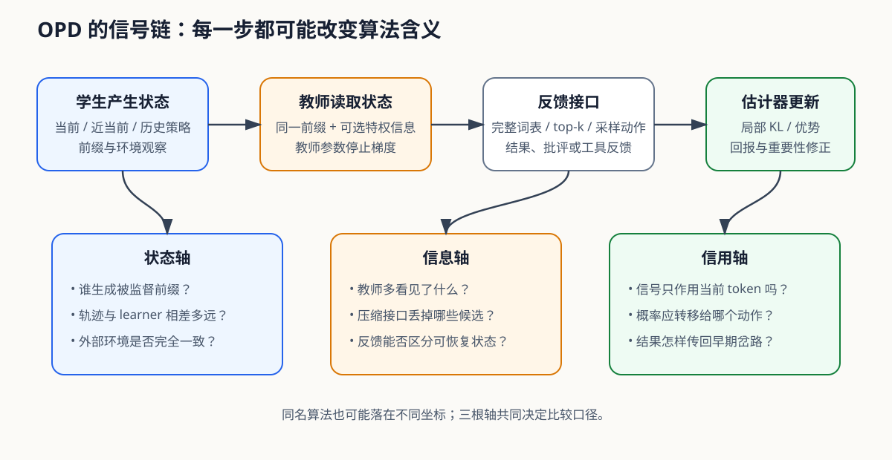

# OPD · On-Policy Distillation · 在线策略蒸馏

2025 年下半年, Thinking Machines Lab 的一篇文章引爆了整个世界, 让 OPD 突然成为研究热点, 也迅速进入各家大模型训练 pipeline. Kevin Lu 与 Thinking Machines Lab 在 2025 年 10 月 27 日发布了官方技术文章 [On-Policy Distillation](https://thinkingmachines.ai/blog/on-policy-distillation/), 并开放了配套的 [Tinker distillation recipe](https://tinker-docs.thinkingmachines.ai/cookbook/recipes/distillation/). 此前, GKD 已在 2023 年提出让学生生成轨迹、教师在这些轨迹上给反馈, 论文于 ICLR 2024 发表;Qwen3 技术报告在 2025 年又给出了强到弱蒸馏的训练结果. TML 把这些目标接入现成的 RL 训练循环, 给出代码、模型组合和成本对照, 让更多团队可以直接复现.

为什么这一步会突然有用? RL 和 SFT 正好各缺一半. RL 让学生自己 rollout, 所以训练会碰到学生部署时真正遇到的错误前缀;但一条几千 token 的回答通常只有一个结果奖励, 模型只知道「整题错了」, 不知道错误从哪一步开始. SFT 或离线蒸馏能逐 token 训练, 监督很密;但前缀来自人工答案或教师答案, 学生一旦在生成时走偏, 后面全是训练时没见过的状态. OPD 把两件事接起来: 学生先生成, 教师再对学生已经走到的每个前缀计算下一 token 概率. 前缀来自学生, 信号来自教师, 每个 token 都有反馈.

TML 的实现之所以传播得快, 还因为它离现有 RL 代码只差很少几步. rollout 仍由学生完成;训练器已经保存学生对已采 token 的 log-prob;再让冻结教师对同一条轨迹做一次并行 Prefill, 取教师 log-prob, 两者相减就是逐 token 的 reverse-KL 信号. TML 报告, 在它的同架构实验里, 蒸馏约用少 7–10 倍的梯度步数恢复 RL 教师水平, 累计训练计算量低约 50–100 倍. 这些倍率对应论文中的模型与训练配置. 工程上的吸引力来自现成接口: 学生 rollout 提供状态, 教师 log-prob 提供逐 token 稠密信号, 训练过程可以省去独立 reward model 和教师完整回答数据集.

「On-Policy」限定受监督前缀由当前学生产生, 「Distillation」限定反馈来自教师行为分布. 教师预先生成答案再做 SFT, 属于 off-policy 蒸馏;学生自己采样但只拿环境的 0/1 奖励, 属于 on-policy RL;旧检查点或回放池产生前缀, 则变成 near-policy 或混合方法. 教师可以是外部大模型, 也可以是同一模型加参考解、反馈或额外上下文形成的条件化教师. 判断一种方法是不是 OPD, 要看谁生成受监督状态, 以及教师在同一状态上给了什么.

OPD 也没有把困难消掉. 每批新 rollout 都要追加教师前向;完整词表蒸馏还要处理 $T\times|V|$ 的 logits. 更麻烦的是, 教师在自己的答案上很强, 不等于它能理解学生已经写坏的前缀. 学生更新后, 刚采集的轨迹也会变旧. 所以后面的技术分歧都从几个具体问题长出来: 教师和学生的思考方式是否兼容, 用 full-vocab、top-$k$ 还是单个采样 token, 轨迹能复用多久, 以及错误前缀上的教师信号还值不值得学.

> 图 1: OPD 由学生产生状态, 教师接口提供信息, 估计器形成更新;状态轴、信息轴和信用轴分别对应三类独立问题.

图 1 解析: 上半部分画出一批数据真实经过的四段流程, 下半部分给出阅读任意 OPD 方法时需要固定的三组坐标. 例如把 full-vocab 改成 sampled-token 主要改变信息轴;把新鲜 rollout 改成历史回放主要改变状态轴;把即时 log-ratio 改成 return-to-go 主要改变信用轴. 三处同时变化时, 最终分数无法单独归因.

## 1. 这座库按训练链拆, 不按缩写堆

OPD 的定义可以压成一句话: **学生产生受监督状态, 教师在这些状态上给出行为方向.** 这句话里有四个变量必须分开: 哪个学生版本产生前缀, 教师比学生多知道什么, 教师接口返回多少信息, 估计器怎样把反馈送进梯度. 本库的六章就沿这条训练链展开.

| 章节 | 负责的问题 | 典型内容 |
| --- | --- | --- |
| [01 · OPD 是什么](01-OPD是什么/01-OPD是什么.md) | 为什么固定示范会遇到状态分布偏移, OPD 与 SFT、DPO、RLVR 的边界在哪里 | 状态分布、条件分布、序列目标 |
| [02 · 怎样学习教师分布](02-怎样学习教师分布/02-怎样学习教师分布.md) | 训练器能读取教师概率时, 应怎样选择散度与状态来源 | [GKD](02-怎样学习教师分布/2.1-外部教师/2.1.1-GKD.md)、[MiniLLM](02-怎样学习教师分布/2.1-外部教师/2.1.2-MiniLLM.md)、[DistiLLM](02-怎样学习教师分布/2.1-外部教师/2.1.3-DistiLLM.md) |
| [03 · 反馈怎样变成梯度](03-反馈怎样变成梯度/03-反馈怎样变成梯度.md) | full-vocab、top-$k$、sampled-token、文本反馈和旧轨迹各自丢掉了什么 | [逐 token 信号](03-反馈怎样变成梯度/3.1-逐token信号怎么计算.md)、[黑盒教师反馈](03-反馈怎样变成梯度/3.3-黑盒教师怎样提供反馈.md)、[near-policy 回放](03-反馈怎样变成梯度/3.2-旧轨迹还能训练多久.md) |
| [04 · 同一个模型怎样教自己](04-同一个模型怎样教自己/04-同一个模型怎样教自己.md) | 没有外部强教师时, 参考解、示范、反馈和同题成功轨迹怎样形成信息增量;教师确定后又怎样校准推进强度与轨迹权重 | [OPSD](04-同一个模型怎样教自己/4.1-自蒸馏算法/4.1.2-OPSD.md)、[SDFT](04-同一个模型怎样教自己/4.1-自蒸馏算法/4.1.3-SDFT.md)、[SDPO](04-同一个模型怎样教自己/4.1-自蒸馏算法/4.1.4-SDPO.md)、[OPCD](04-同一个模型怎样教自己/4.1-自蒸馏算法/4.1.5-OPCD.md)、[G-OPD](04-同一个模型怎样教自己/4.2-目标校准与稳定性/4.2.1-G-OPD.md)、[SCOPE](04-同一个模型怎样教自己/4.2-目标校准与稳定性/4.2.2-SCOPE.md) |
| [05 · CoT 蒸馏与 RL](05-CoT蒸馏与RL.md) | 推理训练中怎样组合离线 CoT、结果反馈、OPD、self-play 与 RLVR | 冷启动、探索、过程反馈、长轨迹 |
| [06 · 怎样证明 OPD 有效](06-怎样证明OPD有效.md) | 如何排除教师更强、预算更多、回答更长和解码变化造成的假提升 | 可教性、支持集、因果消融、公平预算 |

第二章只处理真正可读到概率的白盒教师, 不再把 black-box、outcome 与 self-play 塞进同一棵方法子树. 黑盒接口怎样把文本、偏好或批评转成可优化信号, 属于第三章的反馈转换问题;环境结果与 self-play 怎样进入推理训练, 属于第四、五章的信息来源与训练组合问题. 这样每个节点只有一项主职责, 交叉关系通过链接表达.

## 2. 四个动作定义了一次 OPD 更新

当前学生快照 $\pi_{\theta_k}$ 先对输入 $x$ 采样回答 $y$. 第 $t$ 步状态写作 $s_t=(x,y_{<t})$. 教师 $\pi_T$ 读取同一个前缀, 返回完整分布、截断分布、已采 token 的 log-prob, 或者更弱的文本与结果反馈. learner 随后重新计算 $\pi_\theta(\cdot\mid s_t)$, 由估计器构造损失并更新参数. 大批量异步训练里, rollout 快照 $\theta_k$ 与反向传播时的 $\theta$ 往往已经不同.

这四步看起来简单, 实际上藏着三种不同的信息损失. 把完整 logits 压成 top-$k$, 丢掉的是教师尾部分布内部的相对关系;只保存已采 token, 丢掉的是其他候选动作的教师排序;把 rollout 停梯度, 丢掉的是当前动作改变未来状态分布的导数. 三者分别作用于词表、轨迹与优化目标, 不能用一句「采用近似 KL」含混带过.

黑盒教师又多一层转换. API 只返回文本时, 学生拿不到同一状态上的概率分布, 只能把教师续写当作新示范, 把教师判断变成偏好或奖励, 或让教师批评驱动重试. 这些方法仍可使用学生产生的状态, 却不再拥有白盒 OPD 的逐 token 分布目标. 本库保留它们, 是为了讲清信号怎样损失和转换, 不是把所有教师监督都改名为 OPD.

## 3. 什么时候值得用 OPD

学生至少要能进入可恢复状态. 若 rollout 几乎全是格式错误和无意义前缀, 教师只能在坏状态上修补表面文本, 离线 CoT 或 SFT 更适合冷启动. 教师也必须能理解学生的推理习惯. 独立答题更强, 不代表它面对学生已经写坏的前缀仍能给出可靠下一步. 训练前应从学生轨迹中截取正确、刚走偏、错误累积与格式崩坏四类前缀, 测教师续写后的任务成功率和正确动作 margin.

动作空间也要兼容. 教师与学生 tokenizer 不同时, 两边第 $i$ 个 logit 没有共同语义, 逐位置 KL 无法成立. 这时可以退到文本、字符或字节区间上的序列监督, 也可以让教师产生偏好或结果评价. 接口变了, 目标函数也要跟着变, 不能把跨词表的数值硬对齐.

计算成本主要来自学生顺序 Decode、教师 Prefill 和词表投影. 教师对一条已经生成完的回答可以并行评分, 所以追加一次教师前向未必让墙钟时间翻倍;大教师、长序列、完整词表和跨机传输仍会迅速抬高成本. 选 full-vocab、top-$k$ 还是 sampled-token, 应同时看教师尾部质量、正确替代动作的覆盖率和系统带宽.

OPD 的能力上限通常来自教师. 它适合把教师已经掌握的行为迁移到学生真正会访问的状态, 无法单靠模仿发现教师也不会的新策略. 可验证环境提供的结果奖励因此仍有价值: OPD 负责局部方向, RLVR 负责在教师支持之外探索. 两者的分工与组合放在第五章展开.

## 4. 怎样阅读实验结果

固定前缀 KD、学生前缀 OPD 与只有结果奖励的 on-policy RL 是最小对照. 三组要共享学生起点、prompt、教师和解码设置, 还要分别报告优化 token、学生生成 token、教师评分 token、总计算与墙钟时间. 只对齐训练步数会漏算 OPD 的教师开销, 只对齐 GPU 小时又会把并行实现差异混入算法结论.

任务分数之外, 还要观察长度、重复率、熵、师生 KL、学生成功率和旧能力. KL 下降只能说明学生靠近教师. 若回答同时变长、EOS 概率下降, benchmark 上的增益可能主要来自更多采样计算;若任务分数不变而熵持续收缩, 学生可能只学会了教师的输出偏好.

自蒸馏实验还要加入无特权信息、错误特权信息与正确特权信息三组教师. 三组收益相近时, 改善更可能来自额外计算或正则效果;只有正确特权条件稳定领先, 才能说明参考解、反馈或示范经过教师分布进入了学生更新. 第六章把这些检验整理成完整实验矩阵.

## 5. 主要来源

[DAgger](https://proceedings.mlr.press/v15/ross11a.html) 给出学习者状态分布与误差累积的模仿学习背景;[GKD](https://openreview.net/forum?id=3zKtaqxLhW) 把学生 rollout 与局部散度组合起来;[MiniLLM](https://arxiv.org/abs/2306.08543) 推导序列 reverse KL;[DistiLLM](https://arxiv.org/abs/2402.03898) 与 [DistiLLM-2](https://arxiv.org/abs/2503.07067) 继续处理支持集、稳定性和历史样本复用.[Thinking Machines Lab 的技术文章](https://thinkingmachines.ai/blog/on-policy-distillation/)与 [Tinker recipe](https://tinker-docs.thinkingmachines.ai/cookbook/recipes/distillation/) 展示了 OPD 如何进入现成 RL 训练循环,[verl 的 OPD trainer](https://github.com/verl-project/verl/blob/main/examples/on_policy_distillation_trainer/README.md)则适合核对 rollout、教师评分与 learner 的系统边界.
