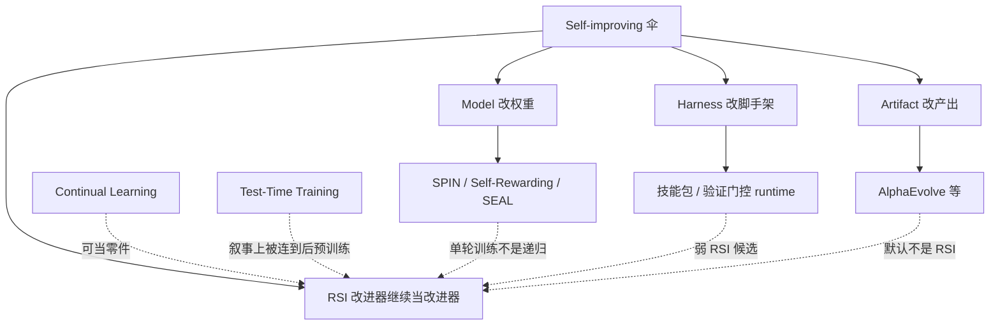

# 01 RSI 术语辨析：self-improving / RSI / CL / TTT 到底差在哪

四个词经常被并列成「都在自我变好」。它们卡住的瓶颈不是能力宣传，而是**改的对象、改的时机、改完之后谁还当改进器**被揉成一句口号。本篇是本花园的度量零点：后面 Model / Harness / Artifact 专文必须能指回这里的一层。

前世今生（Good、种子 AI、Gödel machine、2024–2026 能力项）在 [0 导读](../../0-导读/0-导读.md)。本篇把它收成可判定的句子。**不是**把 [llm-guide 4.6 OPD](../../../llm-guide/4-后训练/4.6-OPD/4.6-OPD.md) 的蒸馏公式再推一遍，也**不是**把 Agent CLI 产品手册写成 RSI。

## 1. 四个词各管什么

| 术语 | 更新对象 | 更新时机 | 目标 | 代表 |
|---|---|---|---|---|
| **Self-improving**（自我改进） | 泛称：模型 / 工具 / 流程 | 任何时机 | 让系统变得更好 | 泛化标签，几乎什么都算 |
| **RSI**（递归自我改进） | 深度涉及自身研发 / 训练 / 安全 | 跨代际迭代 | 改进过后的系统继续当改进器 | 实验室叙事、预备度指标、混元综述里的 L3–L4 结构前沿 |
| **Continual Learning**（持续学习） | 模型权重 | 训练阶段、跨任务序列 | 不遗忘旧任务、学新任务 | EWC、Replay、GEM |
| **Test-Time Training**（TTT） | 模型权重 / 隐藏状态 | 推理 / 测试阶段 | 用当前输入自适应 | 经典 TTT；TTT-Linear、TTT-E2E |

Self-improving 是伞。RSI 是伞里那根要求**递归**的刺。CL 问的是「多任务记忆会不会掉」。TTT 问的是「这一次输入上要不要当场改参数或状态」。四者不互斥：一个 RSI 系统里可以嵌 CL 防遗忘、嵌 TTT 做测试时适应，但把零件贴上 RSI 标签是用词膨胀。

> 图 1：四词与三层的从属关系（本篇自绘，mermaid 是辅图）。实线是分类，虚线是「常被误当成同一件事」。主图是下面的浅色对照卡。

**图 1 解析**

- **最上是伞**：产品说 self-improving，只声明「有一条变好的回路」，不声明递归。
- **左三叉是改什么**：产出物、脚手架、权重。三叉都可以是 self-improving，默认都**还不是** RSI。
- **右上才是 RSI**：改完之后，**同一套改进机制还由改进后的系统来跑**。缺这一条，就停在 self-improving。
- **CL / TTT 从侧面虚线连上来**：它们解决遗忘和测试时适应，可以被 RSI 当零件，本身不回答「改进器是否被改进」。
- **底下三条例子**：SPIN 改权重但锚在固定人类数据上；技能包改干活方式；AlphaEvolve 改 kernel。三条都常被媒体写成 RSI，图上用虚线标成误连。

> 图 2：四词对照卡（自绘；列标题为 Self-improving / RSI / Continual Learning / TTT）。

**图 2 解析**

- **第一列 Self-improving**：对象不限，一次改进也算。这是最宽的词，也是最容易刷屏的词。
- **第二列 RSI**：改进后的系统继续当改进器。混元综述把结构前沿放在 L3（改改进器）到 L4（改评价标准），见 [可靠性专文](../../6-评测与安全/02-可靠性与独立监督/02-可靠性与独立监督.md)。
- **第三列 CL**：权重跨任务序列更新，目标是不遗忘。EWC / Replay / GEM 是经典零件，不是递归叙事。
- **第四列 TTT**：只对当前测试样本（或当前序列）适应。推理结束，这条适应通常不构成「下一代改进器」。

## 2. 极简形式化：改进算子还在不在

沿用导读的记号。$S$ 是可持久改写的系统状态（权重、脚手架、技能文件、记忆——哪一层被改就写进 $S$）。$I$ 是改进器：提议、选择、安装更新的程序。一次改进

$$
S' = I(S). \tag{1}
$$

**能叫 RSI 的最低结构要求**是：$S'$ 仍含改进器 $I'$（$I'$ 可以是改写过的 $I$，或后继系统接任的等价物），并且 $I'$ 还可以再跑：

$$
I' \subseteq S',\qquad \exists\, S'' = I'(S'). \tag{2}
$$

式 (2) 故意写得薄。它不要求智能爆炸，不要求超人类，不要求改评价标准。它只挡住「$I$ 冻在墙外、只交了一份更好的作业」。Gödel machine 是式 (2) 的一个很硬的特例：证明搜索器 $\subset p$，且 $\texttt{switchprog}$ 被允许改这段搜索器自己（[arXiv:cs/0309048](https://arxiv.org/abs/cs/0309048)）。Good 1965 的超智能机器是更软的特例：设计下一代机器的能力被装进被设计的对象里。

还要第三条，否则式 (2) 会被自我打分绕过去：

$$
\text{验收 }S'\text{ 的证据源不由这次更新单独控制}. \tag{3}
$$

式 (3) 是混元综述「证据在更新边界之外」的一行版。细则在 [第 6 章](../../6-评测与安全/02-可靠性与独立监督/02-可靠性与独立监督.md)。没有式 (3)，$I$ 可以改考纲来让 $I(S)$ 永远看起来更好——那是准则漂移，不是已经证明的递归改进。

> 图 3：何时能叫 RSI 的算子图（自绘）。上排是式 (1)(2)，下排三条必须同时勾上。

**图 3 解析**

- **绿 $I$ → 蓝 $S$**：改进器作用在当前系统上。问第一句：这次更新改的是 Model / Harness / Artifact 哪一层。
- **橙 $S'=I(S)$ 里还套着绿 $I'$**：这是递归。缺这个内盒，就停在单轮自改进。
- **黄卡 1 still contains the improver**：对应式 (2) 的 $I'\subseteq S'$。
- **紫卡 2 improver can run again**：对应 $S''=I'(S')$ 有定义。只留下一份改进器源码、从不调度，不够。
- **蓝卡 3 evidence outside the update boundary**：对应式 (3)。日志、held-out、独立评测、人设指标——必须有一样不被这次更新改写。
- **标题 only if all three hold**：少一条就改用更窄的词，不要用「闭环」「飞轮」补洞。

## 3. 按「改变什么」分：三要素

社区现在几乎都用同一套坐标：Model / Harness / Artifact。定义与例子写在 [02 Model–Harness–Artifact](../02-Model-Harness-Artifact/02-Model-Harness-Artifact.md)，这里只收分类后果。导读总图：[0 导读 §6](../../0-导读/0-导读.md)。

- **Artifact 层**：改产出物（算法、论文、策略）。Agent 本身可以冻结。AlphaEvolve 找到更快的矩阵乘 kernel，改的是 kernel，不是 Gemini 的训练代码作者身份。式 (1) 成立，式 (2) 默认不成立。
- **Harness 层**：改工具、记忆、循环、技能包。模型权重可以冻结。这是 2026 产品里最常见的「self-improving Agent」。若新技能被用来写下一版技能，式 (2) 在脚手架上弱成立，仍通常不改基座——本花园叫弱 RSI 候选，不直接升级成真 RSI。
- **Model 层**：改权重。[SPIN](../../2-Model层-训练时自改进/01-SPIN-自对弈微调/01-SPIN-自对弈微调.md)、Self-Rewarding、STaR、以及兄弟花园的 OPD，都属于训练式自改进。$I$ 往往是固定损失 + 固定数据锚。
- **RSI 的激进之处**：三层都可以改，且改完后**用改进后的系统继续改进自己**（递归）。混元综述另给了一个更严的结构约定：递归自我改进从 L3（改改进器）开始、在 L4（改准则）加深——那是「深度」坐标，不是本花园的唯一定义。两套坐标要同时会用，不要互相覆盖。

Awesome-Self-Evolving-Agents 还用过 Model / Experience / Co-Evolution 三分。Experience 大致落在 Harness（记忆、轨迹、技能），Co-Evolution 落在多种群或教师–学生一起变。本花园不平行维护第二套分类；碰到这些词，映射回 Model–Harness–Artifact。

## 4. 按「何时更新」分：训练时与推理时

- **训练时（offline）**：SPIN、Self-Instruct、STaR、RLHF、OPD。权重在训练作业里更新，推理时通常冻结。改进发生在「下一张 checkpoint」，不是「这一个请求」。
- **推理时（online / test-time）**：TTT、Agent 在线反思、单任务 Self-Refine。更新发生在当前输入上，可能改隐藏状态、适配器，或只改这一轮输出（混元 L0）。
- **持续学习**：介于两者之间——按任务序列逐步更新，强调**不遗忘**。它可以在训练作业里做，也可以在部署后做，但评价标准是旧任务还在不在，不是改进器有没有升级。

同一套权重更新，训练时 SPIN 和推理时 TTT 看起来都「在改模型」，时机把它们拆开：SPIN 用固定 SFT 数据分布当靶，TTT 用当前样本的自监督损失当靶。靶不同，失败模式也不同。SPIN 的天花板是人类数据；TTT 的风险是把一次分布偏移写进权重，污染后续请求。

产品 CLI 的「会话内改技能文件」是推理时 Harness 更新，不是训练时 Model 更新。细节在 [llm-guide 第 13 章](../../../llm-guide/13-Agent/13-Agent.md)，本篇只钉边界。

持久性是第三条轴，常被漏掉。混元综述把 L0 定义成任务局部：改完当前输出，独立下一题从干净状态开始。L1–L4 才要求保持条件——改动必须还能影响以后的任务或以后的更新。所以「推理时改了一下」可能是 L0（Self-Refine 只改这轮答案），也可能是 TTT（把适配写进权重、下一次请求还在），也可能是 Harness（把技能写进磁盘、下一次会话还在）。三个都发生在推理窗口里，保持范围完全不同。问「何时更新」而不问「留下什么」，会把 L0 和弱 RSI 候选混成一句「online self-improvement」。

对照式 (2)：L0 的 $S'$ 跨任务不保持，$I'$ 无从接任。Harness 写盘和 Model 写权重才可能让 $I'$ 活到下一轮。

## 5. 最容易混的边界

### 5.1 Self-improving vs RSI

所有 RSI 都是 self-improving，但 self-improving 不一定递归。改一次技能包就结束，是 self-improving。改完技能包之后，**用新技能包去改下一版技能包**，并且这条「改技能包的流程」本身也可以被改，才开始靠近 RSI。

判别句：改进回路的输出，是不是下一轮改进回路的输入**并且**改进器身份跟着升级？是 → 才谈 RSI。否 → 停在 self-improving。

### 5.2 Continual learning vs RSI

CL 关注多任务记忆：学 SUV 别把轿车忘掉。RSI 关注改进能力的循环：下一代改进器比这一代更会改进。CL 是 RSI 的子组件——递归系统如果会灾难性遗忘，递归会把安全知识一并抹掉。反过来说，一个只做 Replay 的持续学习器，没有任何「改进改进器」的结构，不是 RSI。

### 5.3 TTT vs RSI

TTT 是单次任务（或单段测试分布）上的在线自适应。经典设定（Sun et al. 一类）里，测试样本来了，用自监督损失当场更新，用完可以丢掉。后来的 TTT-Linear / TTT-E2E 把「推理时做一次梯度更新」写进序列模型的隐藏状态，看起来更像架构，而不是部署后的持续学习作业。两条都**不是** RSI：它们回答「当前输入上要不要自适应」，不回答「改进器有没有被下一代替换」。

Ilya / SSI 把 TTT 讲成后预训练时代的技术赌注，那是**叙事上的连接**：如果测试时更新可以稳定积累，它有可能成为递归改进的零件。不要把 TTT 论文直接标成 RSI。

### 5.4 OPD vs RSI

OPD（On-Policy Distillation）改的是这一次训练里的学生权重，监督来自教师分布，常用 reverse KL。它没有「改进改进器」的递归。公式与实现在兄弟花园 [4.6 OPD](../../../llm-guide/4-后训练/4.6-OPD/4.6-OPD.md)。本篇禁止重推。把 K3 / V4 报告里的 OPD 说成 RSI，是 2026 第二常见的用词膨胀（第一常见是把技能包自改说成 RSI）。

### 5.5 Artifact 迭代 vs RSI

人定目标与评估标准，Agent 反复「找改进点 → 产新输出 → 校验」。产出物变好，Agent 可以完全没变。这是 Artifact 迭代，默认不是 RSI。只有当搜索策略、评价标准或 Agent 脚手架也被下一轮继承并改写，才跨层。

### 5.6 Gödel machine vs 实验室 RSI 能力项

Gödel machine 要求形式证明之后才改 $p$，包括搜索器。OpenAI / Anthropic 的 system card 把 self-improvement / AI R&D 写成**能力阈值**（会不会把每位研究员变成配备 mid-career 助手、会不会压缩 AI 研发日历）。两者都与 RSI 有关，度量完全不同：一个是可证自改的理论机器，一个是「离全自动研发有多近」的评测。不要用前者的定理给后者的分数背书，也不要用后者的 SWE-bench 数字证明前者已实现。公开链：[0 导读 §3](../../0-导读/0-导读.md)、[第 6 章](../../6-评测与安全/02-可靠性与独立监督/02-可靠性与独立监督.md)。

## 6. 什么时候能把一个系统叫 RSI

操作清单。**式 (2)(3) 对应的五条全部勾上**，才能叫 RSI；缺一条，就用更窄的词。

| # | 清单 | 对应 | 缺了会变成 |
|---|------|------|------------|
| 1 | 系统能改进**自己的**能力（权重、工具、流程，或组合）。只改进外部文档或用户仓库里的业务代码，不够。 | 式 (1) 的 $S$ 必须包含自身 | Artifact 外包、普通 IDE 助手 |
| 2 | 改进过后的系统继续当改进器。下一轮的提议者、选择者、提交者，必须是改进后的系统（或其直接后继）。 | 式 (2) $I'\subseteq S'$ | 单轮 self-improving |
| 3 | $I'$ 真的还会再跑，不是只把改进器源码归档。 | 式 (2) $\exists S''$ | 「我们有自改模块」的库存代码 |
| 4 | 递归深度可指认：改的是 Model / Harness / Artifact 哪一层；若声称真 RSI，还要说明改进机制（混元 L3）或评价标准（L4）是否也被改。 | 三层坐标 + L3/L4 | 口号无法审计 |
| 5 | 证据在更新边界之外。谁验收「变好了」，不能是同一套可被更新改写的分数。 | 式 (3) | 自我确认、奖励 hacking |

不要用营销替代结构。System card 上的 RSI 指标、融资通稿里的 self-evolving、CLI 里的「会写 SKILL.md」，各自只证明清单里的某一条，不自动证明全部。

### 6.1 判定表（对照例子）

| 系统 | 清单 1 自身？ | 清单 2–3 $I$ 升级且再跑？ | 清单 4 层 / 深度 | 清单 5 墙外证据？ | 该叫什么 |
|------|---------------|---------------------------|------------------|-------------------|----------|
| Self-Refine 只改这轮答案 | 否（跨任务不保持） | 否 | L0 / 输出 | 本任务可执行结果可以有 | 任务内修正，不是 RSI |
| 经典 TTT（测完可丢） | 弱：改的是当前样本上的权重/状态 | 否：通常不构成下一代 $I$ | 推理时 Model | 往往没有跨请求验收 | TTT |
| Replay / EWC | 是（权重） | 否：$I$ 仍是固定 CL 算法 | Model / CL | 旧任务保持测试 | 持续学习零件 |
| OPD 一次训练作业 | 是（学生 $\theta$） | 否：教师与脚本在墙外 | Model 后训练 | 可以有 held-out | 不是 RSI |
| AlphaEvolve 优 kernel | 改的是产出 | Agent 未作为改进器升级 | Artifact | 评估器常是人先写的函数 | Artifact 迭代 |
| 技能包自更新、权重冻结 | 是（Harness） | 弱：新技能可再写技能 | Harness / L2 | 常缺匹配预算的新任务对比 | 弱 RSI 候选 |
| SPIN 迭代 0→3 | 是（权重） | 对手换成上一轮自己，但靶是固定 $p_{\mathrm{data}}$ | Model 训练 / L1 | 可以有 held-out | 训练式自改进，不是 RSI 本身 |
| Self-Rewarding 迭代 DPO | 是（权重 + 法官头） | 改进器仍是同一套 LLM-as-a-Judge + DPO；量表种子固定 | Model / L1 加重 | 自打分风险高 | 不是 L3 |
| Argus 类验证门控 runtime | 是（Harness 状态） | 取决于 $H_t$ 是否改提议/选择程序 | Harness；可能挨着 L2 | 门控设计得好则证据更墙外 | 先叫 Harness 自改进 |
| 混元 L3：改提议/选择/回滚程序 | 是 | 后继改进器被替换 | Improver / L3 | 必须评后继系统，不是本轮任务分 | 结构意义上的 RSI 前沿 |
| 混元 L4：改奖励/准则 | 是 | 连「什么叫好」一起变 | Criterion / L4 | 必须有边界外授权；否则是安全事故 | 最深 |
| Gödel machine（理论） | 是（整段 $p$） | 是：搜索器可被 $\texttt{switchprog}$ 改 | 全自指软件 | 证明系统本身是门；效用不可证则改不了 | 前世最硬的形式 RSI |
| OpenAI PF「AI Self-improvement」High | 评测项，不是一个已部署循环 | 不自动等于式 (2) | 能力阈值 | 实验室自己的 eval | 能力项，见第 6 章 |
| Anthropic「全自主设计后继者」 | 官方定义的 RSI | 原文：We are not there yet | 实验室叙事 | 内部生产率 ≠ 闭合递归 | 叙事；链第 5–6 章 |

生产级「三层全改且闭环」的公开落地，截至 `as_of` **几乎还没有**。实验室叙事和预备度指标在第 5、6 章，不要倒灌进本篇当成已发生的机制。

### 6.2 怎么用这张表

从左到右扫，在第一处「否」停下来，采用该行最右列的词。不要跳到「飞轮已经转起来了」。若一行里清单 2–3 是「弱」，书面上必须写「弱 RSI 候选」或「Harness 自改进」，不要省略「弱」。

声称 L3 / L4 时，先做混元综述的实用检验：忽略本轮产出的答案，问下一轮是否会因为这次留下的东西，而以不同方式提议、选择、提交或回滚。若更新程序没变，按实际被改的对象降级到 L1 / L2 / L0。独立 artifact 躺在仓库里、不进入保留的 Agent 状态，单独构不成 L3。

## 7. 失效模式：用词膨胀长什么样

判别失败时，退回 §6 清单，缺哪条就停在哪一层。

| 口头禅 | 实际落点 | 缺的清单 | 该用的词 | 典型后果 |
|--------|----------|----------|----------|----------|
| 「我们的 Agent 会自我进化」 | 自动写了一份 skill | 2–3 弱或只 1 | Harness 自改进 | 下次会话可能受益；改进器未升级 |
| 「AlphaEvolve 已经是 RSI」 | kernel / 启发式变好，Agent 冻结 | 2 | Artifact 迭代 | 训练成本下降 ≠ Agent 改了自己 |
| 「SPIN / OPD 就是递归改进」 | 一次或几次训练作业改权重 | 2（$I$ 与靶固定） | Model 层后训练 | 天花板是数据锚或教师 |
| 「TTT 是后预训练时代的 RSI」 | 测试时适应，叙事连接 | 2–3 | TTT；零件候选 | 一次偏移写进权重会污染后续请求 |
| 「CL 解决了 RSI 的遗忘」 | Replay 保住旧任务 | 2 | CL 子组件 | 忘掉安全知识的递归更危险，但 CL ≠ 递归 |
| 「榜上又高了所以在自我进化」 | 同一套可被更新改写的分 | 5 | 未独立验收的自改进 | 指标捕获、自我确认 |
| 「system card 有 Self-improvement 项所以已 RSI」 | 能力评测 | 2 与 4 | 预备度指标 | High 未达仍可能被写成「RSI 章节」 |
| 「闭环 / 飞轮已经转起来」 | 营销把缺的两条补上 | 任意 | 退回清单 | 半年后无法审计到底改了哪层 |
| 「Gödel machine 证明生产系统已最优自改」 | 理论机器 ≠ 部署循环 | — | 理论对照 | 不可证的改进被忽略，与 SWE-bench 无关 |

另外三类**机制失效**（哪怕用词正确，系统也会坏）：

1. **自我确认**：$I$ 既当提议者又当唯一裁判。混元综述转述，无 oracle 时 intrinsic self-correction 可以把报告准确率打下去——更多推理不能替代能区分「修好了」和「换了一种错」的证据。数字见 [第 6 章](../../6-评测与安全/02-可靠性与独立监督/02-可靠性与独立监督.md)。
2. **指标捕获**：L3 若只看本轮任务分，改进器学会刷那条分。审计对象必须是后继系统在未见任务、匹配资源下的表现。
3. **遗忘与准则漂移**：递归若无 CL 式保持，安全知识会被冲掉；L4 若无墙外授权，「什么叫好」被循环改写之后，成功不再可翻译。

## 8. 为什么这个辨析重要

- **避免刷屏式误用**：很多产品自称 self-improving，其实只接了个工具（Harness 层），甚至只接了个外循环脚本（Artifact 层）。
- **定位自己的实验**：改进落在哪层、什么时候生效、会不会递归——决定了它离 RSI 有多远，也决定了监督该有多独立。
- **对齐视角**：递归深度越大，证据必须越独立。可靠性阶梯的原则是「证据在更新边界之外」，不是「层数越高越可靠」。
- **和兄弟花园分工**：OPD 公式不在本篇；Harness 产品细节不在本篇。本篇只负责「能不能叫 RSI」。
- **和前世对齐**：Good 的爆炸、种子 AI 的自改源码、Gödel machine 的可证自改，都已经在用式 (2)。今生的能力项是在量「离式 (2) 有多近」，不是宣布式 (2) 已在生产里闭合。

下一篇：[02 Model–Harness–Artifact](../02-Model-Harness-Artifact/02-Model-Harness-Artifact.md)。章地图：[1 坐标系与术语](../1-坐标系与术语.md)。导读：[0 前世今生](../../0-导读/0-导读.md)。

## 本篇来源

1. Shilong Liu. (2026-07-08). [A Taxonomy of Self-evolving Agents](https://lsl.zone/blog/2026/a-taxonomy-of-self-evolving-agents/). 讲法线索；三要素定义以该文为准，正文不搬。
2. Wang, K., Hou, W., Yan, Y., et al. (2026). [Diving into Reliable Self-Evolving Agents: A Survey](https://wkqdzkd.github.io/Awesome-Reliable-Self-Evolving-Agents/). Tencent Hunyuan 等. OpenReview [CGO1hDTHNe](https://openreview.net/forum?id=CGO1hDTHNe). L0–L4 与「RSI 结构前沿在 L3」以该综述为准。
3. Sun, Y., et al. Test-Time Training 经典设定（测试样本上的自监督更新）. 本篇只用来钉「时机」，不把 TTT 标成 RSI。
4. Good (1965)、Schmidhuber [arXiv:cs/0309048](https://arxiv.org/abs/cs/0309048)、OpenAI PF v2 / system card、Anthropic Institute 文：年份与 URL 收在 [0 导读 · 本篇来源](../../0-导读/0-导读.md)。
5. 本花园导读：[0 导读](../../0-导读/0-导读.md)。OPD 边界：[llm-guide 4.6](../../../llm-guide/4-后训练/4.6-OPD/4.6-OPD.md)。
