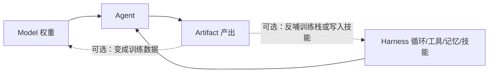

# 02 Model–Harness–Artifact：Agent 等于模型加脚手架

自进化文献共用三个词，说的经常不是同一层。**Model** 是会响应 prompt 的权重；**Harness** 是循环、工具、记忆、权限、技能包；**Artifact** 是 Agent 交出去的东西。一句话：**Agent = Model + Harness**，Agent 再产出 Artifact。

本篇把三层钉死，并各给一个不能再缩的例子。术语边界回 [01 术语辨析](../01-RSI-术语辨析/01-RSI-术语辨析.md)。**不是**把 [03 社区三层](../03-三层框架笔记/03-三层框架笔记.md) 再写一遍，也**不是**把 lsl.zone 博客改写成专文——两处只当讲法线索。产品级 CLI 细节在 [llm-guide 第 13 章](../../../llm-guide/13-Agent/13-Agent.md)。

## 1. 三要素：谁在响应、谁在循环、谁被交出去

- **Model**：LLM 等大脑。输入是 prompt（加工具结果），输出是 token。改 Model = 改权重或至少改可训练策略状态。
- **Harness**：把模型变成 Agent 的那一层。包括 ReAct 循环、工具 schema、记忆写入策略、沙箱、技能包、重试与验证、多 Agent 路由。没有 Harness，模型只是 API。
- **Artifact**：Agent 的产出物。编码 Agent 发现的 kernel、auto-researcher 写出的论文、机器人自进化系统学到的策略。Artifact 可以非常强，同时 Agent 完全没改。

三者关系：Model + Harness → Agent → Artifact。评价「这是不是 RSI」时，先问改的是箭头上的哪一段。改 Artifact 而 Agent 冻结，默认不是 RSI。改 Harness 而权重冻结，是中间层。改 Model，是训练式自改进；单轮仍不是递归。

> 图 1：三层叠放。下为 Model，中为 Harness，上为 Artifact；左侧括号把 Model 与 Harness 收成 Agent。

**图 1 解析**

- **底层 Model（蓝）**：SPIN、Self-Rewarding、STaR、[SEAL](../../2-Model层-训练时自改进/04-SEAL-自适配语言模型/04-SEAL-自适配语言模型.md) 都写在这里。改的是 $p_\theta$。SEAL 的内环还是一次测试时 LoRA。
- **中层 Harness（青）**：循环、工具、记忆、技能。Argus 的 verification-gated runtime、[STOP](../../3-Harness层-Agent运行时/05-STOP-自教优化器/05-STOP-自教优化器.md) 的改进器自指、[Gödel Agent](../../3-Harness层-Agent运行时/06-Godel-Agent-自指运行时/06-Godel-Agent-自指运行时.md) 的运行时 monkey patch、DGM 的档案，都落在这里。
- **顶层 Artifact（金）**：kernel、论文、策略。AlphaEvolve 的交卷物在这里。
- **左侧括号 Agent = Model + Harness**：这是 2026 编码榜看不懂「只报模型名」的原因——分数是两者的乘积。
- **右侧「produces」**：Agent 产出 Artifact。不要把产出物回流误认成 Agent 自改；回流要单独论证（是否写入 Harness 或权重）。

Shilong Liu（2026-07-08）用同一套三要素给现有工作分了三档：产物迭代优化、Harness 自改进、无黄金答案的模型学习。本篇跟这三档走例子，不跟博客的修辞走。

## 2. Artifact 层：AlphaEvolve 改的是算法，不是 Agent 自己

动机最简单：用强 LLM 为可自动打分的问题创造新产物。人定目标与评估函数，Agent 反复「提议代码 → 自动评测 → 进化保留」。循环可以跑很久，**Agent 的权重和脚手架都可以不动**。

机制、公式和白皮书数字的展开在 [03 AlphaEvolve](../../4-Artifact层-产物发现/03-AlphaEvolve-进化编码智能体/03-AlphaEvolve-进化编码智能体.md)。这里只留不能再缩的层判断。Google DeepMind 官方博客（2025-05-14）把 AlphaEvolve 写成「evolutionary coding agent」。循环可以拆成四段，全部发生在固定 Agent 之外的程序空间里：

1. **Prompt sampler** 从程序数据库里组装提示，告诉模型「现在要改哪段代码、上一轮分数是多少」。
2. **模型提议**：Gemini Flash 扩搜索宽度，Gemini Pro 给深度建议，输出的是程序（或 diff），不是新权重。
3. **自动评估器** 运行并打标量分。博客强调：只有进度能被清楚、系统地测量的领域（数学、系统软件）才适合这条路。
4. **程序数据库** 实现进化选择，决定哪些程序进入下一轮提示。

这是 Artifact 搜索，不是 Model 训练。评估器在循环里，但评估器是人先写好的函数，不是模型自己改考纲。硬件例子同样：AlphaEvolve 提过 Verilog 改写，必须先过功能正确性验证，才能进 TPU 设计流——验证门在墙外，产物在墙内。

官方给出的生产数字（以博客为准，不转述专栏）：

- 数据中心调度：给 Borg 找到一条启发式，上线逾一年，平均回收 Google 全球计算资源的 **0.7%**。
- Gemini 训练：把一个关键矩阵乘 kernel 加快 **23%**，从而使 Gemini 训练时间降约 **1%**。
- FlashAttention：低层 GPU 指令优化，该 kernel 实现最高 **32.5%** 加速。
- 数学：发现用 **48** 次标量乘做 $4\times 4$ 复数矩阵乘的算法，改进 Strassen (1969) 在该设定下的已知最好结果；对 50 余个开放问题，约 **75%** 复现当时最好结果，约 **20%** 改进已知最好。

这些数字说明 Artifact 循环可以反哺训练栈（更快的 kernel 让下一轮 Gemini 更便宜）。反哺**不等于** Agent 改了自己：被加速的是训练基础设施，发现者仍是那套固定的进化 Agent。若有一天进化框架的提示、选择算子、评估函数被下一轮 Agent 改写并接任，那才跨到 Harness / Improver。在此之前，把它叫做 RSI 是把「AI 优化了 AI 的训练成本」听成「AI 递归改进了自己」。

要把 AlphaEvolve 类系统升级成 RSI 声称，至少要能指出：下一轮搜索用的提示模板或选择算子，是不是上一轮 Agent 的产出且已经接任；评估函数是不是也被改、谁授权。博客写的是人类定义评估指标 + 固定模型族。缺这两条就停在 Artifact。

Analemma AI 的 FARS：lsl.zone 转述为连跑 417 小时、产出 166 篇全 AI 生成论文、成本约 18 万美元。本篇**未找到 Analemma 一手来源**，数字以 Shilong Liu 博客为二手，标 `[OM-FREEPLAY]` 不作独立核验。Recursive Superintelligence 找更好的 GPU kernel，同样是 Artifact；融资叙事见第 5 章，本篇不当机制。

## 3. Harness 层：改下次怎么干活，权重可以冻结

与 Artifact 的区别：Harness 优化的是**下次执行任何任务都会用到的脚手架**。踩一次坑，写成技能或记忆，以后同类任务受益。模型可以完全冻结——这正是它在 2026 成为「近期主战场」的原因：改权重贵，改技能文件便宜。

两类常见落点：

- **提示 / 记忆**：把规则写进 prompt、playbook 或记忆系统。名字里带 learning 也不改权重。若把 Harness 视为 Agent 的一部分，这些更新在功能上接近「参数更新」，但物理上不是梯度。
- **工具 / 技能**：生成可复用的代码工具或 `SKILL.md`。技能是更厚的上下文压缩：不必每次把过程细节塞进窗口。产品形态（Claude Code / Codex 等会写技能）落在 llm-guide 第 13 章；本花园关心的是**自改发生在 Harness，以及有没有验证门**。

验证门把 Harness 自改从「自我表演」里拉开。Argus 的做法：候选的 memory / skill / routing **不能因为某角色生成了就入库**，必须有任务原生证据和授权提交。见 [Argus：Verification-Gated](../../3-Harness层-Agent运行时/01-Argus-Verification-Gated/01-Argus-Verification-Gated.md)。没有这道门，Harness 自改进会迅速变成脚手架过拟合（混元 L2 的特征失败）。

和 Artifact 循环很容易看起来一样：两边都是「提议 → 打分 → 留下」。差别在**留下的东西下次还当 Agent 用不用**。AlphaEvolve 留下的是 kernel，下次换一道数学题，发现者 Agent 仍是原套 Gemini + 进化框架。技能包留下的是 `SKILL.md`，下次任何任务都可能加载它。前者闭合在产出物，后者闭合在脚手架。旧文把 Hermes「用满 5 次工具就写技能」当作 Harness 代表；产品规则以各家文档为准，本篇不把未打开的 README 数字写进来。

操作测试（写进实验记录里就能用）：改完之后，**换一道从未见过的独立任务**，Agent 是否仍然带着那次修改？否 → Artifact 或 L0。是，但权重没动、只是 prompt/技能/记忆/路由变了 → Harness。权重动了 → Model。下一轮「谁来提议修改」是否已经换成改进后的程序 → 才问 L3。

弱 RSI 候选：新技能被用来写下一版技能，循环闭合在 Harness 上。STOP 把「改进器程序」自己交给同一套手续；Gödel Agent 把 Agent 循环收成可 monkey patch 的递归函数。两者都是更干净的结构样本，机制见专文。仍然通常**不改基座权重**。本花园允许称之为「Harness 层自改进 / 弱 RSI」，不允许直接升级成「真 RSI」。真 RSI 还要求改进器或准则也被改，且证据在更新边界之外。

多 Agent 路由是 Harness 的扩展，不是第四层。lsl.zone 的讲法是：技能和记忆堆在单 Agent 里会语义打架（「squeeze」究竟是市场还是橙子），于是出现专家 Agent + 路由器。路由器本身若被自动改写且跨任务保持，仍是 L2；若「如何改路由器」也被改，才碰 L3。本篇不把多 Agent 写成新坐标系。

## 4. Model 层：SPIN 是训练式自改进的样板

第三档改权重，而且经常没有新的人类偏好。信号来自自己的生成、自己的打分、或「自己 vs 人类数据」。本花园的入口是 [SPIN](../../2-Model层-训练时自改进/01-SPIN-自对弈微调/01-SPIN-自对弈微调.md)：对手是上一轮自己，靶是人类 SFT 分布，损失在 logistic 选择下长得像 DPO，但不是 RLHF。

同层邻居：[Self-Rewarding 家族](../../2-Model层-训练时自改进/02-Self-Rewarding-家族/02-Self-Rewarding-家族.md)（裁判也是自己）、STaR（用对错过滤思维链）。OPD 也改权重，但是**教师分布蒸馏**，不是自对弈；公式回 llm-guide 4.6，不要在本层再开一章 OPD。

「无黄金答案」是这一档的题眼。有标准答案就退化成普通 SFT / RLVR。没有标准答案时，信号只能来自：伪标签（Self-Instruct）、内部一致性、自对弈（SPIN）、环境弱反馈、或自裁判（Self-Rewarding）。Tufa Labs 把后一条再往前推，见 [03 Tufa](../../2-Model层-训练时自改进/03-Tufa-Labs-自奖励/03-Tufa-Labs-自奖励.md)。TTT 在 lsl.zone 也被放进这一档，因为它在推理时改一个矩阵；本花园按 [01 术语](../01-RSI-术语辨析/01-RSI-术语辨析.md) 把它留在「时机」轴，避免 Model 层变成杂物抽屉。

Model 层单轮不是 RSI：SPIN 迭代 3 次之后，改进器仍是同一套「用 $p_{\mathrm{data}}$ 当赢家」的损失，没有改评价标准，也没有改提议程序。它证明「没有新偏好数据也能抬 7B SFT」，不证明递归。

> 图 2：实线是定义关系；虚线是「可能回流」，回流必须单独取证。

**图 2 解析**

- 实线不可省略：没有 Harness 就没有 Agent，没有 Agent 就谈不上 Agent 的 Artifact。
- 虚线不是默认开启。AlphaEvolve 的 kernel 加快了 Gemini 训练，是回流到**训练基础设施**，要论证是否改了发现者 Agent 自身，还差一步。
- 技能文件若把一次 Artifact 失败写成规则，虚线落到 Harness，这才是层间跳转。

> 图 3：上排是这一次留下的状态；下排是冻着的改进器。虚线只表示「靠墙外的 $I$ 才改得动」，没有箭头把 $I$ 装进 $S'$。

**图 3 解析**

- **Artifact $S'$**：kernel、论文、可执行世界。评估函数、提议模型、日程仍在墙外。
- **Harness $S'$**：技能、工具、运行时。元技能、审计条款、基座 $\theta$ 仍在墙外。
- **Model $S'$**：权重被推过。损失形式、数据锚、裁判仍在墙外。
- **墙标 $I$ not in $S'$**：单轮 $S'=I(S)$ 三列都有；缺的是 $I'\subseteq S'$。
- **不要把三列加成 RSI**：一层过线不等于三层都过；默认判定仍是否。

## 5. 边界正在模糊——以及仍然成立的「不是」

三层会互相送燃料：Artifact（更快 kernel）降低训练成本 → 更强 Model → 更好的 Harness 设计能力 → 更会搜 Artifact。这是**系统叙事**，不是已经闭合的 RSI 证明。判断仍按「这一次更新落在哪一层、下一轮改进器是不是升级后的系统」。

Shilong Liu 文末三问可以当实验记录模板，不搬原文修辞：进化的是什么、驱动它的反馈是什么、回路闭合在哪。闭合在基准上，得到的是更强刷榜器；闭合在可执行工程上，得到更好的软件；闭合在改进器程序上，才进入混元 L3。

本篇明确 **不是**：

- **不是**把 Artifact 迭代叫 RSI。Agent 没改自己。
- **不是**把「会写 skill」叫 RSI。那是 Harness，最多弱 RSI。
- **不是**把 OPD / SPIN / Self-Rewarding 叫 RSI。那是 Model 层训练，递归缺位或靶被钉死。
- **不是** Continual Learning，也**不是** TTT。二者可当零件。
- **不是** CS329A 讲义或专栏的目录搬家。社区讲法见 [03](../03-三层框架笔记/03-三层框架笔记.md) 与 lsl.zone；机制以本篇与论文为准。

编码评测把这一点打得很死：同一模型换 CLI，SWE-bench 会跳。那是 Harness 的存在证明，不是 Model 变强的证明。Kimi K3 一类报告把环境做成可组合 harness，就是承认分数绑在脚手架上。本花园第 3 章写「harness 作为自进化一层」，第 13 章兄弟花园写产品循环。两章不要互相抄目录。

2026-07 前后，社区专栏和 Shilong Liu 博客在三层划分上高度同构。这是讲法收敛，不是互抄的许可。本篇例子优先 DeepMind 官方博客与本花园已有专文，不搬专栏段落。

三层对照（备查，数字回各专文）：

| 层 | 改什么 | 本篇例子 | 默认是不是 RSI |
|----|--------|----------|----------------|
| Artifact | 产出物 | [FunSearch](../../4-Artifact层-产物发现/04-FunSearch-函数空间搜索/04-FunSearch-函数空间搜索.md) 的 cap set 程序；AlphaEvolve 的 kernel / 48 次复数矩阵乘 | 否 |
| Harness | 下次还用的脚手架 | [STOP](../../3-Harness层-Agent运行时/05-STOP-自教优化器/05-STOP-自教优化器.md)；[Gödel Agent](../../3-Harness层-Agent运行时/06-Godel-Agent-自指运行时/06-Godel-Agent-自指运行时.md)；[DGM](../../3-Harness层-Agent运行时/04-DGM-达尔文哥德尔机/04-DGM-达尔文哥德尔机.md)；[Argus 门控](../../3-Harness层-Agent运行时/01-Argus-Verification-Gated/01-Argus-Verification-Gated.md) | 弱候选 |
| Model | 权重 | [SPIN](../../2-Model层-训练时自改进/01-SPIN-自对弈微调/01-SPIN-自对弈微调.md)；[SEAL](../../2-Model层-训练时自改进/04-SEAL-自适配语言模型/04-SEAL-自适配语言模型.md)；[Absolute Zero](../../2-Model层-训练时自改进/06-Absolute-Zero-Reasoner/06-Absolute-Zero-Reasoner.md) | 训练式自改进，不是递归 |

下一篇机制：[SPIN 自对弈微调](../../2-Model层-训练时自改进/01-SPIN-自对弈微调/01-SPIN-自对弈微调.md)。安全：[可靠性与独立监督](../../6-评测与安全/02-可靠性与独立监督/02-可靠性与独立监督.md)。

## 6. 有大模型基础的人怎么把三层读完

先记住一句：单轮改进 $S'=I(S)$ 到处都有；RSI 还要改进过后的系统继续当改进器。本花园用三层回答「$S$ 是什么」，用 [01 术语](../01-RSI-术语辨析/01-RSI-术语辨析.md) 回答「$I$ 有没有被装进 $S'$」。有 Transformer / 后训练基础的读者，不必先补一段智能爆炸史——导读可以后翻——但必须先能指出：这次更新动的是权重、脚手架，还是交卷程序。

推荐顺序不是按公司，是按「误会从哪来」。

1. **先分清层**。本篇图 1、图 3 加上面那张表。把 AlphaEvolve 的 48 次乘听成「Gemini 在改自己」，就是把 Artifact 当成了 Model。把会写 `SKILL.md` 听成 RSI，就是把 Harness 当成了术语式 (2)。
2. **先把模仿和 RLVR 拆开，再看 Model 层的靶**。把 R1 听成 RSI，是把「$\theta$ 被 0/1 推过」听成「改进器进了 $S'$」。对照见 [04 模仿学习与 RLVR](../04-模仿学习与RLVR/04-模仿学习与RLVR.md)：Yue 等大 $k$ 时基座常反超；Venhoff 等纯 RL 混合模型约收回 76% 差距。然后才看靶有没有钉死。[SPIN](../../2-Model层-训练时自改进/01-SPIN-自对弈微调/01-SPIN-自对弈微调.md) 对手是上一轮自己，赢家分布仍是人类 SFT。[Self-Rewarding](../../2-Model层-训练时自改进/02-Self-Rewarding-家族/02-Self-Rewarding-家族.md) 的法官头和生成头共享权重，主实验新 prompt 还来自冻结的 Llama 2-Chat。[Tufa](../../2-Model层-训练时自改进/03-Tufa-Labs-自奖励/03-Tufa-Labs-自奖励.md) 把裁判冻死，Countdown 三个提示会被黑，积分自环 43% 超过 GPT-4o 的 42%——花园里最像 RLVR 的样板，裁判仍在墙外。[LADDER](../../2-Model层-训练时自改进/05-LADDER-递归拆题/05-LADDER-递归拆题.md) 用数值器做课程：Llama 3B 本科积分 1%→82%，同一 7B 在 MIT 资格赛 50%→73%，TTRL 再到 90%，答完一道把 $\theta$ 滚回。[SEAL](../../2-Model层-训练时自改进/04-SEAL-自适配语言模型/04-SEAL-自适配语言模型.md) 内环 LoRA 真改 $\theta$，外环 ReST-EM 配方在墙外。[Absolute Zero](../../2-Model层-训练时自改进/06-Absolute-Zero-Reasoner/06-Absolute-Zero-Reasoner.md) 连题也自己出，Coder-7B 总均 50.4，Python 解释器仍在墙外。[R-Zero](../../2-Model层-训练时自改进/07-R-Zero-挑战者解题器/07-R-Zero-挑战者解题器.md) 拆成挑战者 / 解题器两只克隆，多数票当金标，Qwen3-4B 数学均 +6.49，Iter 4 会塌。这些都改权重，都还不是递归。
3. **Harness 层先看门，再看元学习，再看自指**。[Argus](../../3-Harness层-Agent运行时/01-Argus-Verification-Gated/01-Argus-Verification-Gated.md) 只回答「生成的技能凭什么留下」：SWE-Bench Pro 约 78% 对 Direct Copilot 约 59%。[Self-Refine](../../3-Harness层-Agent运行时/12-Self-Refine-任务内迭代/12-Self-Refine-任务内迭代.md) 是最浅的 L0：同一只模型自评自改，七任务均分约 +20%，数学 GPT-4 92.9→93.1，跨题不留状态。[CRITIC](../../3-Harness层-Agent运行时/13-CRITIC-工具交互批评/13-CRITIC-工具交互批评.md) 仍是 L0，但批评要过搜索 / 解释器 / Perspective：ChatGPT 三套 QA 均 F1 +7.7、三套数学 +7.0，去掉工具几乎抹掉涨幅。[TextGrad](../../3-Harness层-Agent运行时/14-TextGrad-文本梯度/14-TextGrad-文本梯度.md) 把批评写成反传：GPQA 51→55，LeetCode-Hard 0.26→0.36，不改 $\theta$；实例优化是 L0，提示优化留下薄指令。[ProTeGi](../../3-Harness层-Agent运行时/21-ProTeGi-文本梯度束搜索/21-ProTeGi-文本梯度束搜索.md) 是前身：只改一条分类提示，相对 $p_0$ 均 +15.3%，摘要 31% 不进表。[GEPA](../../3-Harness层-Agent运行时/15-GEPA-遗传Pareto提示/15-GEPA-遗传Pareto提示.md) 用反思加 Pareto 搜模块提示：Qwen3 均 +12.44，相对 GRPO 的 LoRA 在 HotpotQA 上 +19；ACE 在 AppWorld 上测到同一优化器均 46.4。[Promptbreeder](../../3-Harness层-Agent运行时/16-Promptbreeder-自我指涉提示进化/16-Promptbreeder-自我指涉提示进化.md) 让 $M$ 进种群，$H$ 仍冻着：PaLM 2-L 零样本 GSM8K 83.9 对 OPRO 80.2，拓扑不改。[OPRO](../../3-Harness层-Agent运行时/17-OPRO-元提示优化/17-OPRO-元提示优化.md) 把历史分数写进冻着的元提示：同一只 PaLM 2-L 评分器上 80.2 对 Kojima 71.8；ADAS 表的 30.6 是另一套协议。[EvoPrompt](../../3-Harness层-Agent运行时/18-EvoPrompt-进化算子提示/18-EvoPrompt-进化算子提示.md) 冻 GA/DE 说明书、换任务提示种群：Alpaca 理解 DE 均 77.05，BBH 开发集从测试池切。[APE](../../3-Harness层-Agent运行时/19-APE-自动提示工程师/19-APE-自动提示工程师.md) 是这条提示搜索线的起点：24/24 不低于人手写，迭代三轮就平，默认关掉。[GrIPS](../../3-Harness层-Agent运行时/22-GrIPS-短语级编辑搜索/22-GrIPS-短语级编辑搜索.md) 是编辑派：人写说明书上做短语手术，Table 1 babbage +4.29。[TEMPERA](../../3-Harness层-Agent运行时/23-TEMPERA-测试时提示编辑/23-TEMPERA-测试时提示编辑.md) 把手术交给按查询的 PPO，SST-2 91.9 对邻居表 RLPrompt 90.1。[RLPrompt](../../3-Harness层-Agent运行时/24-RLPrompt-离散提示强化学习/24-RLPrompt-离散提示强化学习.md) 是生成派 RL：5 token SST-2 92.5、Yelp P. 95.1，TEMPERA 表上的 90.1 不要横加。[AutoPrompt](../../3-Harness层-Agent运行时/25-AutoPrompt-梯度引导触发词/25-AutoPrompt-梯度引导触发词.md) 更早、要梯度：共用触发词，RoBERTa 全量 SST-2 测试 91.4，不是邻居少样本表上的 56.7。[MIPROv2](../../3-Harness层-Agent运行时/20-MIPROv2-贝叶斯联合优化/20-MIPROv2-贝叶斯联合优化.md) 把指令和示范收成多段程序上的离散槽，TPE 冻着。[Voyager](../../3-Harness层-Agent运行时/10-Voyager-Minecraft技能库/10-Voyager-Minecraft技能库.md) 是更早的可执行技能库：冻 `gpt-4-0314`，160 步 63 种物品，钻石工具 1/3，自验证仍是 GPT-4。[Reflexion](../../3-Harness层-Agent运行时/11-Reflexion-言语反思记忆/11-Reflexion-言语反思记忆.md) 更浅一档里的窗口版：反思是滑动窗口里的句子，AlfWorld 130/134，HumanEval 91.0，MBPP Python 会掉到 77.1。[SkillEvolver](../../3-Harness层-Agent运行时/08-SkillEvolver-元技能/08-SkillEvolver-元技能.md) 冻 CLI，用部署失败写领域 `SKILL.md`：SkillsBench 83 题 29.9%→56.8%，元技能自己不改。[ACE](../../3-Harness层-Agent运行时/09-ACE-Agentic-Context-Engineering/09-ACE-Agentic-Context-Engineering.md) 冻 $\theta$ 和三角色，写条目化 playbook：AppWorld ReAct 42.4→离线 59.4，合并是非 LLM 代码。[ADAS](../../3-Harness层-Agent运行时/07-ADAS-Meta-Agent-Search/07-ADAS-Meta-Agent-Search.md) 用冻结 gpt-4o 元 Agent 搜 `forward`，MGSM 53.4%，higher-order 写在未来工作里。[STOP](../../3-Harness层-Agent运行时/05-STOP-自教优化器/05-STOP-自教优化器.md) 把改进器程序对自己递归，弱模型上会掉分。[Gödel Agent](../../3-Harness层-Agent运行时/06-Godel-Agent-自指运行时/06-Godel-Agent-自指运行时.md) 公平对照只认 Gödel-base 相对 ADAS 的 MGSM 11 个百分点，不要截 Gödel-free 的 90.6%。[DGM](../../3-Harness层-Agent运行时/04-DGM-达尔文哥德尔机/04-DGM-达尔文哥德尔机.md) 把单轨迹换成开放档案，SWE-bench 20%→50%。[Auto-Research](../../3-Harness层-Agent运行时/02-Karpathy-Auto-Research/02-Karpathy-Auto-Research.md) 只改 `train.py`，val_bpb 在墙外。这几篇 $\theta$ 都冻着。
4. **Artifact 层看评估器在谁手里**。[FunSearch](../../4-Artifact层-产物发现/04-FunSearch-函数空间搜索/04-FunSearch-函数空间搜索.md) 搜短函数，$n=8$ cap set 512，140 次里只有 4 次摸到。[AlphaEvolve](../../4-Artifact层-产物发现/03-AlphaEvolve-进化编码智能体/03-AlphaEvolve-进化编码智能体.md) 搜整文件，可以反哺训练栈，发现者仍可不改。[Polaris](../../4-Artifact层-产物发现/01-Polaris-科研智能体/01-Polaris-科研智能体.md) 交卷是论文。[MirroS](../../4-Artifact层-产物发现/02-MirroS-Physical-RSI/02-MirroS-Physical-RSI.md) 交卷是可执行世界，发现环按官方报告仍在墙外。
5. **评测先看过程，再看交卷分**。[RSIBench-Data](../../6-评测与安全/01-RSIBench-Data/01-RSIBench-Data.md) 冻住后训练栈，只让 Agent 改数据：14/24 后来超过第一次有效尝试，达峰后继续搜的 23 个里 18 个最终更差。发现有了，过程不可靠。[SEAGym](../../6-评测与安全/03-SEAGym-Harness评测环境/03-SEAGym-Harness评测环境.md) 冻 $M$、只改 $H_t$：AHE 验证 +17.1 可以伴随 TF-GRPO 的 OOD −2.5，中间快照可以塌成 $E_{16}$ 的 6/80。[04 System Card](../../6-评测与安全/04-System-Card-RSI/04-System-Card-RSI.md) 把 RSI Index 和 High 拆开：5.6 Sol 捆分 57.9，全家 Self-improvement 仍低于 High。
6. **最后才问可靠不可靠**。[可靠性阶梯](../../6-评测与安全/02-可靠性与独立监督/02-可靠性与独立监督.md) 把上面专文接到 L0–L4：产物发现不爬台阶，Argus 是 L2，STOP / DGM / Gödel Agent 是 L3-facing，RSIBench 测的是 L1 数据研究切片，没有任何一篇把考纲交给循环。System card 的 High 不是这把阶梯。

[Polaris](../../4-Artifact层-产物发现/01-Polaris-科研智能体/01-Polaris-科研智能体.md) 与 [MirroS](../../4-Artifact层-产物发现/02-MirroS-Physical-RSI/02-MirroS-Physical-RSI.md) 已在第 4 步：交卷分别是论文和可执行世界。实验室访谈若缺一手就留条，不要用专栏补数字。读完 1–6 步，已经能自己判断一条新闻是不是 RSI；剩下的是覆盖面，不是另一套坐标系。前世（Good、种子 AI、Gödel machine）和今生能力项的对照在 [0 导读](../../0-导读/0-导读.md)，本篇不重推证明搜索器。system card 上的 self-improvement 分数是能力阈值，和三层坐标不是同一把尺，判定见 [04](../../6-评测与安全/04-System-Card-RSI/04-System-Card-RSI.md)，型号表回 llm-guide 第 14 章。读新闻时先问改的是哪一层，再问证据在不在更新边界之外，两问都过了才碰「算不算 RSI」。

## 本篇来源

1. Shilong Liu. (2026-07-08). [A Taxonomy of Self-evolving Agents](https://lsl.zone/blog/2026/a-taxonomy-of-self-evolving-agents/). Agent = Model + Harness；三档分类的讲法来源。禁止搬正文。
2. AlphaEvolve team. (2025-05-14). [AlphaEvolve: A Gemini-powered coding agent for designing advanced algorithms](https://deepmind.google/blog/alphaevolve-a-gemini-powered-coding-agent-for-designing-advanced-algorithms/). Google DeepMind. 23% / 1% / 32.5% / 0.7% / 48 次乘以该页为准。
3. 社区三层线索（库内互参，不抄专栏）：[03](../03-三层框架笔记/03-三层框架笔记.md)。
4. FARS 的 417 小时 / 166 篇 / 18 万美元：仅见于 lsl.zone 转述。**未找到 Analemma 一手来源**。[OM-FREEPLAY]
