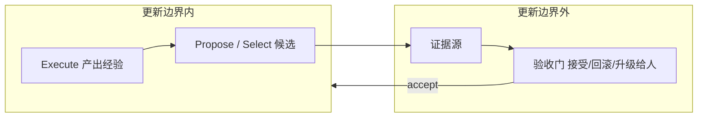

# 02 可靠性与独立监督：自改进越深，验收越要在墙外

自进化越深，风险越集中在一个矛盾上：**谁来验证「改进」确实变好了？** 模型既当改进者又当裁判时，它会优化「看起来更好」：奖励 hacking、自我确认的幻觉、把安全知识一并忘掉的遗忘。本篇把混元综述的 L0–L4 写成可操作的阶梯，核心原则只有一句——**证据必须在更新边界之外**。

坐标系见 [01 术语辨析](../../1-坐标系与术语/01-RSI-术语辨析/01-RSI-术语辨析.md)。**不是**能力排行榜：层数高不表示更可靠，只表示审计义务更重。实验室公开时间表以原文为准，本篇不写无法链到一手的「2028 年 60%」这类确定概率。

## 1. 更新边界：墙里能改，墙外才能判

混元综述（Wang et al., 2026, *Diving into Reliable Self-Evolving Agents*）问两个问题：自进化时**改了什么**，以及**什么证据**能支撑「变好了」。自进化深度 = 发生作用的最深进化目标。L0 只改当前任务输出；L1–L4 必须满足保持条件——改动进入后续独立任务或未来更新。

执行会产出经验，改进器提议修改，**外部审计**决定是否持久化。综述把这圈叫做执行–进化–评价（EEE）结构：墙内跑 Execute 与 Propose/Select，墙外跑 Audit（接受 / 回滚 / 升级给人）。历史 $H$ 若被循环改写，谱系就不再是审计工具。Figure 2 / 式 (3)–(5) 在 PDF 里把「候选生成、内部选择、外部验收」拆成三步，禁止用一次自打分同时干完三步。

审计由三件套构成，且必须留在相关更新边界之外：

- **外部目标**（external target）：事先声明「好」指什么。
- **证据源**（evidence source）：按声明的数据与程序出结果。
- **验收策略**（acceptance policy）：把结果映射为接受 / 拒绝回滚 / 升级给人。

综述的匹配审计原则：**任何更新都不应控制用来接受它自己的那份唯一证据**（no update should control the only evidence used for its own acceptance）。指导过候选生成或内部选择的分数，叫 development evidence，不应再当同一更新的最终门禁。

目录规模（GitHub README / 项目页，随仓库修订）：L0 42、L1 137、L2 257、L3 21、L4 30，另有跨层可靠性与开放问题条目；项目页写手稿使用 **549** 篇。分类按最深对象，不按算法名——反射、RL、进化搜索可以出现在多层。

作者单位写在 PDF 首页：Tencent Hunyuan、浙江大学、北京大学、清华大学；通讯与项目联系见 GitHub README。本篇把该综述当一手，不经过专栏转写。若只读项目页交互图、不打开 PDF §8，会漏掉「development evidence」和「晋升 ≠ 恢复」这两句。

## 2. L0–L4：改什么，证据要覆盖到哪

| 层级 | 进化目标 | 特征失败 | 墙外证据（阶梯配对） |
|---|---|---|---|
| **L0 Output** | 当前输出 / 任务内轨迹 | 自我确认 | 本任务可执行结果、来源、环境观察、固定量表或人审 |
| **L1 Model** | 可训练模型 / 策略 | 模型崩塌、遗忘、尾部变窄 | 更新后的迁移 / 保持 / 干扰测试；held-out；数据准入检查 |
| **L2 Scaffold** | 提示、技能、记忆、工作流、harness | 脚手架过拟合 | 匹配预算下与在任版本的新任务端到端对比；组件消融；谱系与可测回滚 |
| **L3 Improver** | 提议 / 选择 / 提交 / 回滚的程序 | 指标捕获 | 后继系统在未见任务、匹配资源下的表现；密封评测；独立恢复权 |
| **L4 Criterion** | 评价协议、奖励、约束、价值 | 准则漂移 | 受保护的结果度量、新旧准则交叉评、更新边界外的授权与硬约束 |

**关键原则**（综述摘要原句的操作化）：可靠的自进化**不取决于深度本身**，而取决于评价与监督是否独立于对应更新边界之外，并且覆盖相关任务、条件与约束。阶梯的「升高」只表示自进化深度，不打可靠性分。L0 的一次可执行测试，可以比 L3 上一个被改进器玩坏的基准更有信息量。

结构约定：该综述把 RSI 定义为保持性更新的最深目标达到改进器或准则——**L3 开始改改进机制，L4 再改判断标准**。这与本花园「三要素 + 改进器继续当改进器」兼容，但更严：Artifact 迭代和单轮 SPIN 在这套结构里到不了 RSI 前沿。不要用本花园的宽松口号覆盖综述的结构定义，两套都写进 [术语辨析](../../1-坐标系与术语/01-RSI-术语辨析/01-RSI-术语辨析.md)。

L3 的实用检验（综述 §7 附近）：先忽略本轮产出的答案或 solver，问下一轮是否会因为这次留下的东西，而以不同方式提议、选择、提交或回滚。若更新程序没变，就按实际被改的对象降级到 L1 / L2 / L0。独立 artifact（一篇论文、一个 kernel）躺在仓库里、不进入保留的 Agent 状态，单独构不成 L3。L4-facing 一词：核心实现仍低于 L4，但已经生成或使用准则相关产物、尚未改写生效中的判断语义——报的时候要写成条件归属，不要直接贴 L4。

> 图 1：可靠性阶梯。左低右高为 L0→L4；右侧虚线墙外是证据源与验收门。配对思想对应混元综述 Figure 8。

**图 1 解析**

- **台阶高度 = 深度，不是分数**。L4 不是「更强」，是「连判分规则都能被改」。
- **每级一张卡片**：上句进化目标，下句该级最低限度的墙外证据。
- **墙（Update boundary）**：墙内是循环可以改写的状态；证据源和验收门画在墙外。门被循环改写之日，就是自我证明之日。
- **L0 停在任务内**：害处通常随 episode 丢掉，好处也无法积累。L1 起错误会进权重或脚手架，必须先验收再晋升。
- **L3 / L4**：评的是后继改进器或新旧准则，不是这一轮任务分。只看当前 score 会把指标捕获当成成功。

L0 的特征失败有数字：综述转述，无 oracle 时 intrinsic self-correction 把 GPT-4 在 GSM8K 上的报告准确率从 **95.5% 降到 89.0%**，HotpotQA 从 **49% 降到 43%**；把自我反馈换成人类反馈，修复成功率从 **33.3% 升到 52.6%**。这些不证明推理时修正无用，只证明**更多推理不能替代能区分「修好了」和「换了一种错」的证据**。

逐级把「留下什么」写清，避免把深度当成能力：

- **L0**：改变 $(\text{输出}, \text{轨迹})$，保留的 Agent 状态跨独立任务不变。Self-Refine、ToT、链式验证大多停在这里。危害通常随 episode 丢弃；好处也无法积累。
- **L1**：改可训练状态。Self-Instruct / SPIN / Self-Rewarding / STaR 都在这里。错误伪标签会进权重，所以墙外至少要有 held-out 与遗忘检查。综述把 L1 按「谁发出训练信号」再拆：单模型自训练、竞争性自对弈、合作共进化。SPIN 更靠近第二类（时间错开的自己 vs 自己），Self-Instruct / STaR 靠近第一类，Self-Rewarding 的法官头是同一权重上的第二种技能，不是独立种群。拆开是为了看信号有多容易被伪造，不是为了另立分类法。
- **L2**：改脚手架。技能包、记忆策略、Argus 的 $H_t$ 都在这里。特征失败是过拟合某一套 benchmark × 记忆 × 工作流的交互。验收必须是匹配预算的新任务对比，加上可测回滚。
- **L3**：改的是以后如何提议、选择、提交、回滚。当前任务分足够好，可能只是改进器学会了刷那条分。审计对象是**后继系统**在未见任务上的表现。
- **L4**：改评价协议本身。新旧准则要交叉评；还要有更新边界外的授权。Writable criterion 是「更新控制用来接受自己的证据」的最深实例。

综述 Table 9 把「暴露给更新的证据」单列：L0 怕自评与生成测试；L1 怕自产伪标签；L2 怕被反复查询的 holdout；L3 怕当前适应度档案；L4 怕准则自己打出来的分。匹配控制不是「再加一个 LM 法官」，而是换控制权。

## 3. 对策：按库内已有机制对齐阶梯

旧文四条对策仍然成立，下面接到阶梯的哪一级、墙在哪。

### 3.1 验证门控（Verification-Gated）

Argus：只有通过外部验证的状态才允许写入下一轮——把「能不能改」和「改了什么」分开。记忆 / 技能 / 路由不能因某角色生成即入库。类比 git 的 CI：合并前必须过测试，测试脚本默认不在开发者随便改的范围。对应 L2 的「晋升前外部验收 + 可测回滚」。专文：[Argus](../../3-Harness层-Agent运行时/01-Argus-Verification-Gated/01-Argus-Verification-Gated.md)。

### 3.2 独立红队，而不是同一模型的自我表演

OpenAI GPT-Red：攻击者对抗**同时训练的 defender 群体**，单 defender 会让攻击模式坍缩。关键是攻击者与防御者是独立种群，不是 SPIN 那种时间错开的同一个 $p_{\theta_t}$。对应「证据源不被被测对象单方面改写」。专文：[GPT-Red](../../5-实验室与公司/05-OpenAI-GPT-Red/05-OpenAI-GPT-Red.md)。

### 3.3 对齐研究可以自动化，指标留在人设

Anthropic AAR：9 个并行 agent 做弱到强监督研究，用人类设定的 **PGR**（performance gap recovered）打分。研究者可以自动化，**地板 / 天花板和任务选择仍是人定的**。这是 L1/L2 自动化、L4 不交出去。专文：[Automated W2S Researcher](../../5-实验室与公司/04-Automated-W2S-Researcher/04-Automated-W2S-Researcher.md)。官方 *When AI builds itself* 把同一实验写进「Claude 能跑开放研究」的证据链，并标明人类仍选题、仍造量表。

### 3.4 不可变核心

安全护栏、价值观准则、审计日志、回滚权，放在自进化边界之外。L4 若可写，必须另有「受保护约束」和边界外授权。类似持续学习里的参数隔离：关键知识锁进不可写区。没有这条，L4 就是自己给自己改考纲。

晋升和恢复是两件不同的事。外部验收决定候选能不能成为在任版本；受保护的谱系、版本、回滚权管的是接受之后如何重建与停机。只有验收没有回滚，L1–L4 的一次坏晋升会变成永久状态。只有日志没有验收，只能事后讲故事。综述还要求：审计在被审组件被攻破之后是否仍能取证、仍能停机——独立性必须在威胁模型里写出来，不能靠「我们另外训了一个 verifier」口头保证。

四条合起来仍服从同一句：门控、红队、PGR、不可变核心，都是**把验收留在墙外**的不同工程形状，不是四个新算法。

## 4. 实验室公开时间表，以原文为准

旧摘要写「Anthropic 预测 2028 年前 RSI 概率 60%；OpenAI 时间表 2028-03 全自动研究员」。前者**未能在 Anthropic 官方页核到该概率**；后者是媒体对访谈的转述，不是本篇可当定理的数字。按死命令删除确定性表述，改成可链原文的说法。

**Anthropic 官方**（[When AI builds itself](https://www.anthropic.com/institute/recursive-self-improvement)）：把 RSI 写成「系统有能力完全自主设计并开发自己的后继者」。原文：「We are not there yet, and recursive self-improvement is not inevitable. But it could come sooner than most institutions are prepared for.」页内可核的是能力趋势与内部生产率，例如工程师合并代码量相对 2024 约 **8×**（并声明行数高估了真实生产率）、2026-05 合入代码 **80%+** 由 Claude 撰写、任务时长约每四个月翻倍——这些是「AI 在加速造 AI」，官方自己把它与「尚未闭合的全自主后继者」区分开。判断力、选题仍是缺口。

同一页还把缺口写具体：Claude 在「目标已给定的实验」上可以从 2025-05 的约 3× 加速走到 2026-04 的约 52×；在「选什么问题值得做」上，人类仍占优。AAR 那次弱到强实验：两个作者约一周恢复 PGR 约 23%，agent 累计约 800 小时、约 1.8 万美元恢复 97%——官方同时写结果没有干净迁移到生产尺度、人类仍选题仍造量表。把它读成「对齐研究已可全自动」会跳过原文自己划的边界。这些数字服务的是「执行在自动化、准则还在人手里」，正好是 §3.3 的阶梯位置，不是 L4 已发生。

**OpenAI 自动化研究员**：MIT Technology Review（2026-03-20）报道首席科学家 Jakub Pachocki 的公开时间表——先做可委派「人数日级」任务的研究实习生，再做能扛更大问题的全自动多 Agent 研究员，并写明 2028 仍不期望系统在所有方面达到人类。**以该报道与 OpenAI 当时口播为准做交叉，不要把二手「2028-03」写成已盖章的里程碑。** 库内 [GPT-Red 文](../../5-实验室与公司/05-OpenAI-GPT-Red/05-OpenAI-GPT-Red.md) 仍保留旧时间表摘录，引用时复核一手。

窗口期「现在设计独立监督，比落地后再补便宜」作为工程判断可以留；不要用未核概率给窗口期定量。

> 图 2：EEE 圈的墙。Propose 不得改 Ev 与 G。分工对应综述 Figure 3。

**图 2 解析**

- 左墙内：干活与提议。SPIN / Self-Rewarding / 技能写入都发生在这里。
- 右墙外：证据和门。单元测试、held-out、PGR、人类授权都属于这里。
- 回箭只有「门说 accept」之后才改墙内状态。门被墙内改写，图就坏了。

## 5. 本花园专文落在哪一级

阶梯是审计义务，不是本花园目录的镜像。专文按 Model / Harness / Artifact 分章，是为了让读者先问「改了哪一层」；混元 L0–L4 再问「证据要覆盖到哪」。两套叠在一起才不会把 FunSearch 的 512 和 STOP 的 $I_t$ 写成同一种自改进。

> 图 3：专文落点。L1 是权重；L2 是脚手架；L3 是改进器程序。产物发现不爬台阶。

**图 3 解析**

- **L1 Model**：[SPIN](../../2-Model层-训练时自改进/01-SPIN-自对弈微调/01-SPIN-自对弈微调.md) 把上一轮自己当对手，靶仍是人类 SFT 分布；[SEAL](../../2-Model层-训练时自改进/04-SEAL-自适配语言模型/04-SEAL-自适配语言模型.md) 内环 LoRA，外环 ReST-EM 配方在墙外。墙外至少要有 held-out 与遗忘检查。Self-Rewarding 的法官头和生成头共享权重，development evidence 很容易漏进终评。
- **L2 Scaffold**：[Argus](../../3-Harness层-Agent运行时/01-Argus-Verification-Gated/01-Argus-Verification-Gated.md) 把记忆和技能的写入挡住，直到任务原生证据过门。这是 L2 的验收形状，不是 L3：改进手续本身通常还是人写的。
- **L3-facing Harness**：[STOP](../../3-Harness层-Agent运行时/05-STOP-自教优化器/05-STOP-自教优化器.md) 把改进器源码交给同一套手续；[Gödel Agent](../../3-Harness层-Agent运行时/06-Godel-Agent-自指运行时/06-Godel-Agent-自指运行时.md) 用 monkey patch 改 $\pi$ 和 $I$；[DGM](../../3-Harness层-Agent运行时/04-DGM-达尔文哥德尔机/04-DGM-达尔文哥德尔机.md) 再加开放档案。三者 $\theta$ 都冻着，效用或基准仍由人钉死，所以是 L3 的脚手架切片，不是 L4。STOP 在弱模型上掉分、Gödel Agent 14% 试验最终更差、DGM 仍可能刷基准——都是「当前适应度档案被改进器看见」这一档的特征失败。
- **L4 未发生**：没有任何一篇专文把 $U$ / `evaluate` / PGR 地板交给循环去改。混元写 L4 要新旧准则交叉评加边界外授权。本花园现有样板全部停在「考纲在墙外」。
- **阶梯外的 Artifact**：[FunSearch](../../4-Artifact层-产物发现/04-FunSearch-函数空间搜索/04-FunSearch-函数空间搜索.md) 的 `priority` 和 [AlphaEvolve](../../4-Artifact层-产物发现/03-AlphaEvolve-进化编码智能体/03-AlphaEvolve-进化编码智能体.md) 的 kernel 是独立产物。综述原句：独立 artifact 不进入保留的 Agent 状态，单独构不成 L3。反哺 Gemini 训练栈加快 23%，要论证是否改了发现者自身，还差一步。

对照表（审计时用，不要当能力榜）：

| 专文 | 三层 | 阶梯 | 墙外至少要有 |
|------|------|------|----------------|
| SPIN / SEAL | Model | L1 | held-out、遗忘、数据准入 |
| Argus | Harness | L2 | 新任务对比、可测回滚 |
| STOP / Gödel Agent / DGM | Harness | L3-facing | 后继系统在未见任务上的分；密封评测 |
| FunSearch / AlphaEvolve | Artifact | 不爬阶 | 机器可执行的 $h$；发现者 $I$ 是否被改要另证 |
| AAR 的 PGR | 研究自动化 | 准则仍在人 | 地板 / 天花板不进循环 |

system card 上的 self-improvement / AI R&D 是**能力阈值**（离全自动研发有多近），和本篇阶梯不是同一把尺。前者可以很高而验收仍是 L0 的自我表演；后者可以在很浅的 L1 上已经把 held-out 做严。不要用 GPT-5.6 精读里的能力项给混元 L3 背书，数字回 llm-guide 第 14 章，本库只链不抄表。

下一篇同章：[RSIBench](../01-RSIBench-Data/01-RSIBench-Data.md)。术语回 [01](../../1-坐标系与术语/01-RSI-术语辨析/01-RSI-术语辨析.md)。实验室通稿里的时间表以 §4 原文为准，不把媒体日期写成里程碑。

## 本篇来源

1. Wang, K., Hou, W., Yan, Y., Jia, H., Zhong, Z., Ren, B., Chen, Y., Zhang, S., Shen, Y., Xiao, J., Yang, Y., Zhuang, Y., & Fan, H. (2026). [Diving into Reliable Self-Evolving Agents: A Survey](https://wkqdzkd.github.io/Awesome-Reliable-Self-Evolving-Agents/). Tencent Hunyuan / 浙江大学 / 北京大学 / 清华大学. PDF 与项目页；OpenReview [CGO1hDTHNe](https://openreview.net/forum?id=CGO1hDTHNe)；目录 https://github.com/wkqdzkd/Awesome-Reliable-Self-Evolving-Agents 。L0–L4、更新边界、匹配审计原则、549 篇规模以该一手为准。
2. Anthropic Institute. [When AI builds itself](https://www.anthropic.com/institute/recursive-self-improvement). RSI 定义与「尚未到达、并非不可避免」。
3. MIT Technology Review. (2026-03-20). [OpenAI is throwing everything into building a fully automated researcher](https://www.technologyreview.com/2026/03/20/1134438/openai-is-throwing-everything-into-building-a-fully-automated-researcher/). OpenAI 时间表的新闻一手，非 OpenAI 技术报告。
4. 库内机制互参：Argus、GPT-Red、AAR 专文（相对链接见 §3）；STOP / Gödel Agent / DGM / FunSearch / AlphaEvolve / SPIN / SEAL 落点见 §5。
