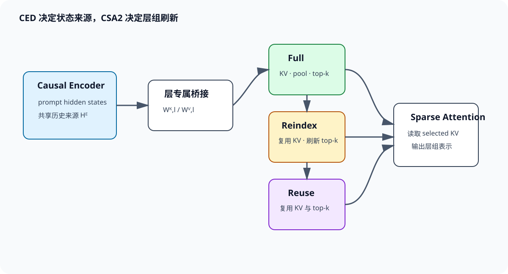

# CSA、HCA 与 CSA2: 压缩序列上的稀疏检索和跨层复用

DeepSeek V4 将长上下文 attention 的两个成本同时改写：先沿 token 轴压缩 KV，再让部分层只访问压缩序列中的少量位置。官方名称 **Compressed Sparse Attention（CSA）** 指「压缩后再稀疏选择」，**Heavily Compressed Attention（HCA）** 指「更强压缩后对全部压缩项做 attention」。下文中的 CSA 均指 DeepSeek V4 技术报告里的 Compressed Sparse Attention，与 Calibrated Sparse Attention、Consensus Sparse Attention 等同名缩写无关。

V4.1 Flash 进一步引入 **CSA2**. 每个 attention layer 静态标为 Full、Reindex 或 Reuse, 在层间共享 main KV、indexer K 与 top-k indices. decoder 中的 Hierarchical Sparse Indexer 还把后续索引限制在首个 Full layer 产生的候选池内. 这使「稀疏」从单层 selector 问题变成层组状态机: 哪一层产生完整缓存, 哪一层刷新索引, 哪一层只复用已有选择, 都由层类型决定.

公开技术报告、模型卡与代码给出了层模式、压缩率、缓存格式和张量 shape。生产 kernel 的 tile、流水线与集群调度尚无完整实现数据，相关性能只采用官方已经披露的测量结果。

## 1. V4 为什么先压缩 token 轴

### 1.1. 压缩发生在哪个维度

设原序列长度为 $n$, hidden states 为 $X\in\mathbb{R}^{B\times n\times d}$. 压缩率 $m$ 将连续或学习聚合后的 $m$ 个 token变成一个 compressed entry, 压缩序列长度为 $n_c=\lceil n/m\rceil$. compressed K/V 可写成 $K_c,V_c\in\mathbb{R}^{B\times H_{kv}\times n_c\times d_h}$.

DeepSeek V4 官方配置和 Transformers 文档给出 CSA 默认 $m=4$, HCA 默认重压缩率 $m'=128$. 在 1M token 时, CSA 的压缩序列约 250K entries, HCA 约 7813 entries. 压缩先把候选空间缩短, CSA 再在 $n_c$ 中做动态 top-k; HCA 则可以读取整个更短序列.

压缩不是简单 KV 量化. 量化降低每个元素的 bit 数, token压缩减少时间轴上的 entry 数. 两者可以叠加. 压缩 entry代表一段 token, selector命中它时读取的是聚合状态, 不再是原始块内每个 token的独立 KV. 因而压缩率直接决定细粒度信息损失与 cache容量.

### 1.2. CSA 的 indexer 和主 attention

CSA 延续 DSA 的检索结构, 但 indexer与主 attention都作用在压缩序列上. 对当前 query $q_t$, indexer为每个 compressed key $k^I_r$ 生成代理分数 $I_{t,r}$, selector返回 $k$ 个 compressed positions. 主 attention再对这些 positions的完整 compressed KV计算精确 softmax.

若不计压缩生成, indexer从扫描 $n$ 个 token降为扫描 $n/m$. 主 attention从访问原序列的 $k$ 个 token变为访问 $k$ 个 compressed entries. 这里的 $k$ 与原 token预算不能直接比较, 因为一个 entry汇总 $m$ 个 token的信息. 质量由压缩器能否保留块内关键细节决定, 性能由 $n/m$、top-k与 entry宽度共同决定.

CSA 的输入输出 shape 与普通 attention兼容: 输入仍为每个 token的 query, 输出仍为 $B\times n\times H_q\times d_h$. 历史轴变短, query轴在 Prefill仍有 $n$ 行. 因此逻辑关系约为 $O(nk)$, indexer若平坦扫描则约为 $O(nn_c)$, 即 $O(n^2/m)$.

### 1.3. HCA 为什么不需要 sparse selector

HCA 将 token轴压缩到约 $n/m'$, $m'$ 远大于 CSA 的 $m$. 当 compressed sequence已经足够短, 对全部 HCA entries做 attention可避免 indexer和top-k. 1M token在 $m'=128$ 下只有约7813个压缩项, 每个 query全读仍比原始百万历史短两个数量级.

HCA 提供密集覆盖的全局摘要, CSA 提供较细粒度的动态检索. 两者交错能减轻单一路线的缺陷: HCA不会漏掉 compressed entries, 但每个 entry信息粗; CSA entry更细, 却可能被 selector漏选. V4-Pro 的公开结构为61层, 前两层 HCA, 后续层在 CSA与HCA间交替, 末尾 MTP block使用滑动窗口. 具体变体应以对应模型配置为准.

**CSA 与 HCA 的分工是「稀疏地读较细压缩」和「完整地读重压缩」.** 它们都已经丢掉原 token级 KV, 不能把 HCA称为原序列 full attention, 也不能把 CSA等同于 V3.2 的 token-level DSA.

## 2. 层排布怎样改变 cache 与信息流

### 2.1. 交错层不是独立重复的模块

若每层都独立产生 compressed KV, 缓存仍随层数 $L$ 线性增长, 只是每层沿 token轴更短. V4 的混合层让不同压缩率承担不同信息路径, 层间 residual继续传递 token级 hidden state. attention读取压缩历史, 输出写回每个 query位置, 所以下一层仍处理长度 $n$ 的 hidden states.

这一区别常被误写成「序列永久缩短」. 实际缩短的是被读取的 K/V历史轴, query和残差流没有缩成 $n/m$. Prefill 的 Q投影与MLP仍按 $n$ token执行. attention FLOPS和 KV cache下降不会同比降低整模 FLOPS.

交错频率决定远程细节多久由 CSA刷新. 连续 HCA层只能访问重压缩全局状态, 细粒度恢复依赖后续 CSA. 连续 CSA层都有更细的候选, 但 indexer和cache更贵. 层排布因此同时是质量预算与系统预算.

### 2.2. Prefill 的压缩与索引顺序

Prefill拿到整段 $X$. 每个压缩模块先沿时间轴构造 entries, 写出 compressed main KV和可能独立的 indexer K. CSA indexer随后对 query rows和 compressed keys打分, top-k生成整数索引, sparse kernel读取选中 entries. HCA直接对全部重压缩 entries运行 attention.

压缩器必须服从 causal约束. query $t$ 不能读取包含未来 token的 compressed entry. 尾部未满组的 entry要带有效长度或只聚合可见前缀. 若同一压缩块内 query和key时间交叠, kernel需对边界块施加细粒度 causal处理, 不能把完整块都视为过去.

Prefill 的代理分数若物化为 $n\times n_c$, 1M上下文仍很大. 高效实现需要分块生成索引或层次筛选. 官方公开描述确认动态选择与优化 kernel, 但未把所有中间工作区和融合策略完全公开. 评测时应测峰值工作区, 不能只按最终 cache估算.

### 2.3. Decode 的追加状态

Decode每步产生一个新 hidden state. 压缩 entry通常在积累足够 token后完成, 未满组需要暂存聚合状态. 新 query读取历史 compressed cache; CSA还读取 indexer K并生成top-k. HCA读取全部重压缩cache. 单步主关系分别约为 $k$ 和 $t/m'$.

压缩引入更新延迟. 最近不足 $m$ 或 $m'$ 个 token若尚未形成稳定entry, 需要局部分支、未压缩tail或可更新entry保留. 公开报告中的实际机制应以官方实现为准; 如果模型卡未说明尾块处理, 不能自行假定均值池化或延后一整个块.

Decode 带宽构成包含 main compressed KV、indexer K、整数 top-k 和最近状态。CSA 的 indexer 仍可能比 sparse main attention 读取更多 entries；CSA2 继续压缩跨层重复索引与缓存。

## 3. CSA2 的 Full、Reindex 与 Reuse

### 3.1. 三种层模式各自持有什么

V4.1 Flash 官方模型卡说明, CSA2为每个 attention layer指定三种静态模式之一. **Full Mode** 建立层组的权威状态, 计算并缓存 main KV与indexer K, 同时生成top-k候选池或索引. **Reindex Mode** 复用共享的main KV与indexer K, 但用当前层query重新计算或刷新top-k. **Reuse Mode** 同时复用共享KV和已有top-k indices, 省掉本层indexer.

三种模式的输出仍回到各自层的 residual stream。层参数与 query 保持独立，跨层传递的状态包括历史表示和选择结果。Reindex 允许当前层 query 改变候选，Reuse 则依赖层间重要位置的稳定性。

可以把一个层组写成状态 $(K^{main},K^{idx},S)$. Full更新三者; Reindex保留前两者并更新 $S$; Reuse全部只读. 这种明确状态比模糊的「跨层KV共享」更容易核算: Full付投影、cache和索引, Reindex付索引, Reuse只付Sparse Attention.

### 3.2. Hierarchical Sparse Indexer 限制深层搜索域

decoder中的 Hierarchical Sparse Indexer让首个Full layer从全历史生成候选池 $C_t$, 后续Reindex layers只在 $C_t$ 内打分. 若全历史 compressed长度为 $n_c$, 候选池为 $c\ll n_c$, 深层indexer成本由 $O(n_c)$ 降为 $O(c)$, 不再随完整上下文同速增长.

Reindex在候选池内选最终top-k:

$$
S_t^{(l)}=\operatorname{TopK}\{I_{t,r}^{(l)}:r\in C_t\},k. \tag{1}
$$

Reuse layer直接令 $S_t^{(l)}=S_t^{(l_0)}$. 候选池召回是新的上限: Full若漏掉位置, 后续任何Reindex都无法恢复. 因而 $|C_t|$ 应大于最终 $k$, 用更多一次性候选换深层多次省算.

这一结构与HISA相似之处是粗召回加局部精排, 区别在候选池还跨层共享. 评测要分别报告 Full候选池对原索引的recall、Reindex后的top-k重合和Reuse层质量, 不能只给最终任务分.

### 3.3. KV 字节与 FP4

V4.1 Flash 将 CSA2跨层复用与 FP4 main KV cache组合. 官方模型卡给出的格式为 E2M1 main KV, 每16 channels一个E4M3 scale, 全局KV cache为每token 890 bytes, 约为V4 Flash的四分之一. API官方说明还给出 HBM为上一代四分之一、SSD存储为八分之一的产品口径.

890 bytes包含官方定义的全局cache口径, 不应拿它除以单层head维反推未公开的层数组合. indexer K、局部状态、scale和对齐是否计入某个具体统计, 要按报告表格口径. 量化降低main KV字节, top-k索引仍是整数, indexer K可能使用另一精度.

FP4误差发生在被选主KV的精确attention中; indexer量化误差发生在候选排序. 两者分别影响值重构与集合选择. Reuse会把一次top-k误差传播到多层, 所以CSA2对索引稳定性的要求高于每层独立重算.

## 4. 训练迁移与质量边界

### 4.1. 压缩器需要学会保留什么

压缩entry要同时服务未来不同query. 若只优化平均语言模型loss, 高频局部结构可能主导, 罕见实体在128倍压缩中消失. HCA依赖全量重压缩覆盖, CSA依赖较细压缩加selector. 训练必须让两条路径在交错层中形成互补.

从已有模型迁移时, 新增压缩器、共享KV和层模式会同时改变attention分布. 仅蒸馏单层输出不能保证长序列递推稳定. 应分阶段验证短上下文等价、长上下文召回和Decode累计误差. DeepSeek官方报告给出的训练方案属于模型整体, 不能缩成一个可直接套用的后处理.

### 4.2. Reuse 的失效不是平均相似度低

相邻层top-k平均IoU很高, 仍可能稳定漏掉某层新增的关键位置. Reuse组越长, 偏好漂移越可能积累. 代码、表格和多跳任务中, 某个深层head可能突然需要此前低分的定义; 已锁定的候选池无法响应.

诊断应按layer和query测对独立Reindex教师的recall, 特别关注组尾. 若误差随层深单调增加, 缩短Reuse组或插入Reindex. 若候选池已经漏选, 需要扩大Full候选或增加Full频率. 两种修复作用在不同层级.

### 4.3. token压缩与block选择的双重边界

CSA先把原token合并为entry, 再选entry. 原始关键token可能在压缩时已被稀释, 即使对应entry被top-k选中也无法完整恢复. 另一方面, selector可能漏掉保存良好的entry. 质量评测应将「压缩重构」和「索引召回」分开消融.

压缩率越大, cache和indexer越便宜, 单entry承载信息越多. top-k越大, selector召回越高, mainattention越贵. Full/Reindex频率越高,层间适应更好, cache与索引成本更高. 三组参数共同形成性能面, 不能分别取各自最激进值.

## 5. 工程验收

### 5.1. shape 与地址检查

实现需要记录每种层模式的main KV来源、indexer K来源、候选来源和压缩位置映射. 对batch、head、query position与compressed position逐项检查causal边界. Full到Reuse的共享引用必须在请求结束、prefix复用和分页迁移时保持生命周期一致.

小张量测试可显式构造压缩映射, 固定候选后比较Sparse Attention与朴素实现. Reindex应只改变整数索引, 不重写共享KV; Reuse应既不生成indexer分数也不改变索引. 模式切换若产生隐式复制, cache字节会偏离设计.

### 5.2. 性能拆分

Prefill分别测压缩、Full index、Reindex、Reuse attention、HCA attention和其他层. Decode测每步cache读字节、candidate pool大小、top-k与Sparse Attention. 端到端TTFT和TPOT还受MoE、MLP、通信与调度影响, attention倍数不会原样转化.

物理指标包含compressed entries数、候选池、最终top-k、唯一cache pages和量化scale字节. 若Sparse Attention的候选分散, gather可能比连续HCA更慢. 若Full layer过少,质量下降; 这两种问题不能用同一个「稀疏率」解释.

### 5.3. 来源与版本

DeepSeek V4、V4 Flash、V4.1 Flash结构不同. V4.1官方模型卡明确使用CSA2和三类层模式, 旧模型名在API中可能路由到新模型, 不能据API别名判断本地权重架构. 复现时固定具体checkpoint、config和报告版本.

公开模型代码与 Transformers 实现给出配置字段和 shape，官方技术报告给出设计与训练口径。生产 kernel、集群 cache 分层和服务调度没有公开实现数据，相应性能不进入结构结论。跨层共享的复现记录聚焦共享状态、刷新层和缓存口径。

### 5.4. 一个层组的成本明细

取原长度 $n=131072$, CSA压缩率 $m=4$, 得到 $n_c=32768$. 假设Full层建立候选池 $c=4096$, Reindex最终取 $k=1024$. 平坦indexer每个query比较32768个entries; 层次Reindex只比较4096个, 打分数量降为八分之一. Sparse Attention读取1024个compressed entries, 相当于原序列位置数的 $0.78125\%$, 但每个entry包含四token聚合信息.

若层组由1个Full、2个Reindex、5个Reuse组成, 平坦方案需要8次全压缩序列索引. CSA2只在Full做一次全域候选, 两个Reindex各扫4096候选, 五个Reuse不打分. 比较量从 $8\times32768=262144$ 降为 $32768+2\times4096=40960$. 主Sparse Attention仍执行8次, 整层组不会获得同倍加速.

若每层独立main KV为 $M$, indexer K为 $J$, 独立8层需 $8(M+J)$. 层组共享后接近 $M+J$ 加indices与query临时量. FP4再降低main KV元素字节. 这里没有计算residual、MLP与MoE状态, 只代表attention cache.

candidate pool若为每个Prefill query物化4096个32位indices, 131072 queries约需2GiB. 实现必须流式生成、分块处理或压缩表示. 官方资料未给出生产工作区时, 不能只按最终top-k的1024整数估算峰值.

### 5.5. 正确性与退化测试

构造三层小模型, 第一层Full, 第二层Reindex, 第三层Reuse. 固定共享 $K^{main},V^{main},K^{idx}$, 让第二层query不同. Reindex应产生不同indices但读取相同KV; Reuse应与来源层indices逐项一致, 即便自己的query若独立索引会选别处.

将candidate pool设为全部compressed positions, Hierarchical Reindex应退化为平坦indexer. 将最终 $k$ 设为pool大小, Sparse Attention应退化为对pool的dense attention. 两个退化测试能区分pool剪枝、top-k与attention kernel错误.

量化测试先固定indices比较FP4与高精度main KV输出, 再固定main KV比较量化indexer造成的indices变化. 一次同时量化两套状态, 无法区分值误差和召回误差. Reuse组还要检查误差是否随层位置累积.

### 5.6. 分布式布局

main KV跨层共享后, tensor parallel各rank持有的cache分片应与所有Reuse layers的query head映射一致. 若不同层使用不同head partition, 共享会引入all-to-all或复制. 静态layer modes有利于提前规划地址和通信组.

candidate pool和top-k indices比KV小, 可以复制到各rank, 也可按query heads分片. Full层若把indexer heads分到多个rank, 需要全局top-k或复制完整轻量indexer. 选择取决于indexer宽度与显存.

pipeline parallel若把一个层组切到不同stage, 共享KV就要跨stage传输. 部署通常应让Full及其Reindex/Reuse组共置. 因而layer pattern不仅决定质量, 也约束并行切分边界.

### 5.7. 与V3.2 DSA的区别

V3.2 DSA保存token级MLA latent KV和独立indexer K, 每层selector从全部历史token取2048. V4 CSA先把token轴压缩4倍, 再在compressed entries上选择. 选择单位、cache内容和训练结构都改变, CSA不是DSA后面简单加pooling.

HCA没有DSA式top-k, 它完整读取128倍重压缩序列. HCA误差来自压缩而不来自候选漏选; CSA两类误差都有. V4交替两种层, 让重压缩全覆盖与较细稀疏检索互补.

CSA2将单层CSA变成层组协议. Reuse不运行selector, Reindex只在Full候选池搜索. V4.1 Flash不能用统一 $O(nk)$ 描述每层, 必须按三种模式核算.

### 5.8. 三轴消融

增大压缩率减少cache和indexer长度, 可能损害块内细节. 缩小candidate pool减少深层索引, 可能限制层间偏好. 增加Reuse减少刷新, 可能让候选陈旧. 三者作用不同, 消融应一次改变一轴.

质量轴含长检索、多证据、代码引用和多轮agent; 缓存轴含main KV、indexer K、scale、indices与工作区; 算力轴含压缩投影、Full index、Reindex、Sparse/HCA attention. 只用最终KV bytes无法判断TTFT.

prefix cache也受益于较小层组状态, 但cache key必须编码checkpoint、层模式和量化格式. API中的旧模型名可能路由新模型, 不能把服务别名当成缓存兼容依据.

### 5.9. Prefill 与 Decode 的逐项成本

Prefill中, 压缩器先把一段原始token映射成较短entries. 这一步通常是规则批量计算, 可以与投影融合, 但仍需读入整段hidden states. Full层随后在完整压缩序列上建立候选池; Reindex层只在候选池内用当前query重排; Reuse层直接读取既有positions. 主attention每层仍要执行, 因为query、输出和残差属于当前层. 所以Reuse省掉的是选择器, 不是整层attention.

Decode每步只新增一个原始token, 压缩entry却可能跨越多个token. 在一个压缩组尚未填满时, 实现必须定义部分entry如何更新、什么时候固化以及因果query能看到哪些成员. 如果直接覆写已被其他请求或prefix共享的entry, 会破坏cache不可变性. 安全实现通常把未完成组作为请求私有尾部状态, 组满后再并入可共享页. 官方没有披露的具体布局应留作实现选择.

Full层的全域索引读取量随压缩历史增长, Reindex读取候选池, Reuse只读取最终top-k对应的main KV. 因而每token成本不是一个统一常数. 设三类层数分别为 $L_F,L_R,L_U$, 压缩长度为 $n_c$, 候选池为 $c$, 最终预算为 $k$, 忽略head维度时索引比较量近似

$$
C_{idx}\propto L_Fn_c+L_Rc,
$$

主attention读取量近似 $(L_F+L_R+L_U)k$. 如果Full层本身采用不同attention路径, 还要单列其主计算, 不能把索引比较量当作完整attention FLOPs. 这组公式适合检查量级, 不替代模型报告中的实际层模式.

批处理会进一步改变成本分布。不同请求的历史长度不同，Full 索引与 Reuse gather 形成不同 shape；padding 到最长请求会提高 kernel 规则性，也会吞掉部分稀疏收益。continuous batching 可按模式和长度分桶，同时避免把共享组拆成过多小 kernel。单请求 microbenchmark 与在线吞吐都需要报告。

### 5.10. 训练迁移的分阶段方法

若研究目标是从已有dense或DSA checkpoint探索CSA, 最稳妥的实验不是一次替换全部层. 第一阶段只加入压缩表示, 让HCA式全覆盖路径学习在压缩轴上保留信息; 第二阶段加入稀疏selector, 以原attention分布或输出作为蒸馏目标; 第三阶段才扩大层组并开启Reindex、Reuse. 每阶段都保留未压缩teacher, 才能判断误差由压缩、选择还是跨层陈旧造成.

压缩器训练目标不能只优化token重构. attention需要保留的是后续query可检索的信息, 其中包含少见实体、远距离代码符号和多证据关系. 可同时使用输出蒸馏、attention mass覆盖与语言建模损失, 但权重属于实验超参数. V4与V4.1 Flash的公开结果说明其原生结构可以训练, 并不公开保证上述迁移流程或任意初始化可复现同等性能.

开启FP4应放在结构稳定之后. 先以高精度确认Full候选池、Reindex排序和Reuse语义, 再分别量化main KV与indexer状态. selector分数靠近top-k边界时, 很小的量化扰动也会替换候选; main KV量化则在候选不变时改变attention输出. 两者需要不同校准集与容差.

### 5.11. 故障注入与线上可观测性

跨层共享容易产生结果合理但状态错误的静默故障. 可以有意把Reuse层indices错位一个token、交换两个层组的KV页、延迟一次partial entry提交, 检查断言与监控是否能发现. 必要元数据至少包括请求ID、来源Full层、压缩位置范围、有效长度、dtype与量化scale版本.

线上指标应按层模式聚合索引时延、候选页数、cache命中、组尾候选稳定度和数值异常. 只观察总token/s时, Reindex退化成全域搜索或Reuse意外重算都可能被其他阶段波动遮蔽. 对固定canary prompt定期比对高精度参考logits, 能及早发现cache生命周期和kernel版本问题.

异常回退也要保持语义完整. 若层次化索引器失败, 可以扩大候选池或切换平坦索引; 若共享页校验失败, 应重建整个层组状态, 而不是只重算当前层. 回退到更密集路径会增加显存和时延, 调度器必须预留容量并限制同时回退的请求数.

发布前还应做跨长度与跨batch回归. 在压缩边界前后分别选择序列长度, 覆盖空候选、候选不足、完整压缩组和未完成尾组; 再让不同长度请求共享一个batch, 检查padding位置不会进入top-k. 对每个案例保存Full、Reindex与Reuse的来源映射, 升级kernel或量化格式后逐项比较. 这些测试虽不直接提高基准分数, 却决定层组状态在长期服务中是否可靠.

## 6. CED 与 CSA2 如何拼成一张计算图

*图 1：Causal Encoder-Decoder 决定全局 KV 从哪里产生，CSA2 决定同一层组内何时建立、重索引和复用候选。两者共享状态，却解决不同维度的重复。*

### 6.1. CED 的生产者与消费者

DeepSeek-V4.1-Flash 于 2026 年 9 月 10 日正式发布。官方技术报告中的 **CED** 展开为 **Causal Encoder-Decoder**：40 层主干分成 20 层因果编码器与 20 层解码器。编码器先处理输入历史，解码器的全局 KV 由编码器 hidden states 经过层专属投影构造。这里的 encoder 仍是因果网络，不会让位置 $t$ 偷看未来 token。

设编码器输出为 $H^E$，解码器第 $l$ 层用于全局 attention 的状态写成

$$
K_l^D=H^E W_{K,l}^{bridge},\qquad
V_l^D=H^E W_{V,l}^{bridge}. \tag{21}
$$

共享的是源序列 $H^E$，投影 $W_{K,l}^{bridge},W_{V,l}^{bridge}$ 仍然随层变化。这样能让不同 decoder layers 读取同一历史来源，同时保留层特异的 K/V 空间。YOCO 早先已经提出 self-decoder 与 cross-decoder 的两段式结构；CED 沿着相同的「前段生产、后段消费」方向，把它与压缩稀疏 attention、层组复用和低比特 KV 放到一起。

CED 改变的是跨 decoder 段的数据依赖，CSA2 改变的是段内 attention 层怎样共享。把 CSA2 直接解释成 CED 会遗漏层组状态机；把 CED 说成一种 top-k 方案，也解释不了 prefill 为什么可以缩短执行路径。

### 6.2. Full、Reindex、Reuse 的状态机

一个 CSA2 层组可以把状态写成

$$
\mathcal S_g=(K_g^{main},V_g^{main},K_g^{idx},P_g,I_g), \tag{22}
$$

$P_g$ 是全域粗筛得到的候选池，$I_g$ 是最终 top-k indices。Full 层更新整组状态；Reindex 层保留 main KV、indexer K 与候选池 $P_g$，使用当前层 query 在池内生成新的 $I_l$；Reuse 层连 $I_l$ 也沿用已有结果。

这三种模式的差别可以落到读写集合：

| 模式 | main KV | indexer K | 候选池 | 最终 indices | 当前 query 重新打分 |
|---|---|---|---|---|---|
| Full | 新建 | 新建 | 新建 | 新建 | 全域 |
| Reindex | 复用 | 复用 | 复用 | 更新 | 池内 |
| Reuse | 复用 | 复用 | 复用 | 复用 | 无 |

层类型是模型配置的一部分，运行时不能依据当前负载随意把 Reindex 改成 Reuse。当前层 query 已变化，跳过重索引等于改变邻接图；反过来，把 Reuse 临时升级为 Reindex 会增加计算，也未必符合训练时数据流。

### 6.3. 层次化索引为何能摆脱全历史扫描

若 compressed sequence 有 $n_c$ 个 entries，普通 indexer 每个 Reindex 层都扫描 $n_c$。层次化索引先由组首 Full 层建立大小为 $r$ 的候选池，后续 Reindex 只在 $r$ 中选 $k$：

$$
C_{group}\approx n_c d_I+(L_R+1)r d_I+L_Akd_A, \tag{23}
$$

$L_R$ 是 Reindex 层数，$L_A$ 是组内执行 sparse attention 的层数。第一项只在组首承担，第二项随组内刷新次数增长，第三项是真正读取 selected KV 的主 attention。

取 $n_c=32768,r=4096,k=512$，一组含 1 Full、2 Reindex、5 Reuse。全域打分次数从 $8\times32768=262144$ 降到 $32768+2\times4096=40960$，为原来的 15.625%。主 attention 仍执行 8 次、每次读取 512 个 entries，因此 selector 的 6.4 倍缩减不会原样成为整组 6.4 倍加速。

候选池也引入两级召回。Full 粗筛若漏掉目标 entry，后续 Reindex 再准确也无法恢复；池内 recall 很高，只能证明精排没有继续丢失。评测同时保存 pool recall@$r$、final recall@$k$ 与组尾输出差，才能区分粗筛和复用误差。

### 6.4. CSA、HCA、CSA2 与 CED 的继承关系

V4 的 CSA 先以 $m=4$ 左右的压缩粒度形成较细 entries，再在这些 entries 上动态 top-k。HCA 采用约 $m'=128$ 的强压缩，对全部 entries 做 attention，没有 top-k 漏选。两者交错时，HCA 提供粗粒度全覆盖，CSA 恢复可查询的细节。

CSA2 继承了压缩序列与稀疏检索的基本思路，新增 main KV、indexer K 与 indices 的跨层复用，并让 Full/Reindex/Reuse 静态排布。CED 再把 decoder 全局 KV 的来源上移到 causal encoder hidden states。四个名称对应四个层次：CSA 是细压缩加稀疏选择，HCA 是重压缩全覆盖，CSA2 是跨层状态协议，CED 是前后段计算图。

从 V4 到 V4.1-Flash 的变化不能压成「top-k 更小」或「KV 量化更低」。序列压缩、候选层次化、跨层复用、encoder-decoder 桥接和 MXFP4 共同作用，任一单项的消融都不能代表完整系统。

### 6.5. Prefill、Decode 与持久状态

Prefill 时，causal encoder 为整段 prompt 产生 $H^E$ 和可桥接状态；CSA2 的 Full 层建立组状态，Reindex 在候选池内刷新，Reuse 直接消费。Decode 时每个新 token 仍穿过完整生成路径，新增 encoder/decoder 状态按配置追加，因而「prefill 路径缩短」不等于每个 decode step 只运行半个模型。

持久 cache 至少包含 main compressed KV、indexer K、量化 scale、候选池、final indices 与未完成压缩组。SWA 若采用 bounded replay 或另一存储层，还要单独管理 recent state。恢复会话时只加载 main KV 而遗漏候选版本，Reuse 层会拿旧 indices 访问新 cache；状态必须用统一的 prefix hash、模型版本与层组 generation 标记。

### 6.6. 一套跨层验收

正确性从单组开始：Full 生成 $\mathcal S_g$，Reindex 与逐层独立 indexer 比较候选，Reuse 与固定 indices 参考比较输出。随后跨 CED 边界，检查 bridge projection 的层号、RoPE 位置、量化 scale 与 causal mask。序列长度取压缩步长和 page size 的前后一项，覆盖未满组。

质量按组首、Reindex 后和组尾测 dense mass、候选 Jaccard 与 hidden-state 差异。组尾下降、组首正常，说明陈旧 indices 或共享 KV 逐层累积；候选一致而输出漂移，继续检查 FP4 重构、bridge projection 和 online softmax。

系统指标拆成 encoder prefill、bridge projection、Full index、Reindex、Reuse attention、HCA/CSA attention、SSD/HBM 搬运。模型卡给出的 890 bytes/token 是特定格式和结构的总口径，复现应从配置逐项重算，不能用单个数字替代自己的 cache layout。

### 6.7. 一个 1M 上下文的状态量

取原序列 $n=1{,}048{,}576$，CSA 压缩率 $m=4$，compressed sequence 为 262144 entries；HCA 压缩率 $m'=128$，只有 8192 entries。若 CSA 最终 top-k 为 512，它读取 compressed sequence 的 0.195%；HCA 全读 8192 entries，为原 token 数的 0.781%。两个百分比不能直接比较质量，因为一个 CSA entry 汇总 4 token，一个 HCA entry 汇总 128 token。

假设一个 CSA2 group 有 1 Full、2 Reindex、5 Reuse，Full 建 16384-entry pool，Reindex 在池内选 512。Full 的 indexer 全扫 262144 entries；两个 Reindex 共比较 32768 entries；五个 Reuse 不再打分。平坦的逐层索引需要 $8\times262144=2{,}097{,}152$ 次 entry 比较，CSA2 为 294912 次，比较量约降到 14.06%。

主 attention 仍要为 8 层各读 512 个 main KV entries，共 4096 次 entry 读取。若 main KV 每 entry 的压缩表示为 $b$ 字节，理想主读取为 $4096b$；indexer K 的全扫与池内扫另按维度 $b_I$ 计为 $294912b_I$。当 $b_I$ 很小，主 KV 可能主导；当 top-k kernel 或 pool 访问分散，selector 仍可能成为关键路径。

再加入 CED 后，prompt history 的 decoder global KV 由 encoder hidden states 经过层专属 bridge 得到。一次性批量投影会增加 prefill 尾部计算和写入；按需生成能降低初始 TTFT 的 cache 写入，却把工作推到首轮 decode。两种部署的总 FLOPs可能接近，TTFT 与首 token TPOT 分布不同，基准要标明 materialization 时点。

### 6.8. Reindex 的价值怎样单独测

将一个训练好的 Reindex layer 分别替换成 Reuse 和 Full-domain reindex。Reuse 给出完全省掉打分后的质量下界，full-domain 给出候选池没有粗筛瓶颈时的质量上界，原 Reindex 位于两者之间。记录三者 final top-k Jaccard、dense mass、输出差和耗时。

若 pool Reindex 与 full-domain 的差异集中在少数远程证据，增大 pool $r$ 或改变 Full 粗筛训练更有效；若两者候选近似、Reuse 明显退化，当前层 query 的重打分不可省。若三者质量接近，层组可能允许更多 Reuse，但修改静态模式后仍需继续训练验证，推理时临时切换会偏离训练图。

量化消融把 indexer K、main KV 分开恢复到 BF16。候选集合变化说明 indexer 量化影响排序；候选不变而输出改善说明 main KV 重构误差主导。Reuse 会重复使用一次量化后的 indices，Full/Reindex 会产生新的边界翻转，误差统计也应按模式分桶。

### 6.9. 与 HySparse2 的同坐标比较

CSA2 由学习型 indexer 产生候选，Full 建全域 pool，Reindex 用当前 query 刷新，Reuse 沿用已有 indices。HySparse2 的内层候选来自 full attention oracle，随后由 sparse layers 复用。前者用低维代理换掉周期性原序列 full scan，后者用 full layer 的真实 attention 换掉代理误差。

两者都采用前后段结构降低 prompt 重复工作。CED 的 decoder global KV 来自 causal encoder hidden states，并与 CSA2 层组协议结合；HySparse2 的 KV Bridging 只围绕 full layers，cross-decoder 内继续使用 oracle 与 KV Reuse。比较 TTFT 时要同时列出前段层数、bridge 投影、full 层比例和 selector 成本。

候选粒度也不同。CSA/HCA 工作在压缩 entries 上，一个 entry 已汇总多个原 token；HySparse2 强调 token-level selection，并把 recent window 合入同一集合。相同的 $k=512$ 或 $1024$ 对应的信息容量、物理 pages 和质量边界完全不同。统一比较时换算原 token 覆盖、entry 字节与实际 HBM 事务。

最终可用一张三轴表定位：选择信号是 proxy 还是 oracle，共享范围是层组还是 decoder 段，主 attention 读取压缩 entry、block 还是 token。方法名放在三轴交点之后，结构差异才不会被「跨层 KV 复用」这个总称抹平。

这三轴也直接对应评测字段：候选召回、共享状态字节，以及每层实际读取的物理条目数。

层组刷新间隔与候选池容量也需要一并记录。

## 7. 共享状态的版本与失效

### 7.1. Prefix Cache 不能只校验 token 前缀

普通 prefix cache 常以 token IDs、模型权重与位置配置构造键. CSA2 还要保证层组状态来自同一套 Full/Reindex/Reuse排布、相同压缩步长、候选池容量和量化格式. 两个服务实例即使加载同名权重, 一个改变了 pool大小或 indexer kernel的 tie-break, 复用旧 $P_g,I_g$ 后也可能得到不同邻接图.

因此缓存元数据至少包含模型 revision、稀疏配置哈希、层组编号、压缩 entry计数和 index格式版本. Main KV、indexer K、pool与 final indices应作为一个事务提交. 写入中途失败时, 不能保留完整 KV却缺少最后一组索引; 读取端若发现 generation不一致, 应从最近完整 Full边界重建, 而不是让 Reuse层消费半旧状态.

### 7.2. Speculative Decode 会产生分支状态

草稿模型一次提出多个 token后, 目标模型验证其中一部分. 被拒绝的 token可能已经进入未满压缩组、更新 indexer K或触发新的 Full pool. 回滚必须覆盖这些派生状态. 只回退主 KV长度, 保留后来生成的压缩摘要或候选池, 下一步 selector会看到不属于当前序列的内容.

一种实现是为未确认 token维护临时尾部, 接受后再合并到持久状态. 另一种实现给每项状态附逻辑长度, 回滚时统一截断. Full层建立的 pool如果依赖被拒绝 token, 即使索引本身只指向更早位置, query状态已经改变, 仍需失效并重算. 共享层越多, 一次错误状态传播的范围越大.

### 7.3. 位置编码与压缩坐标

压缩 entry代表一组原 token, 主 attention仍需要明确它在 RoPE或其他位置编码中的坐标. 取组首、组尾、中心或学习到的位置, 会改变长距离相位. CED bridge若从 encoder hidden state生成 decoder K, 还要确认使用 encoder位置、decoder消费层的位置变换, 还是已经在 hidden state中吸收的位置关系.

Cache迁移时必须保存逻辑原 token区间, 不能只保存 entry顺序. 左截断、sliding window或文档打包会让 entry编号与绝对位置脱钩. 若 main KV已经旋转而 indexer K未旋转, 两者的位置元数据也可能不同. 验收用同一内容放在不同绝对 offset, 比较 Full层候选、Reindex结果与 bridge输出, 能暴露位置被错误重置的问题.

### 7.4. 层组刷新间隔是一条质量—成本曲线

设组长为 $G$, 其中一个 Full、$R$ 个 Reindex, 其余为 Reuse. Selector比较量近似为:

$$
C_{sel}(G,R)=n_cd_I+Rrd_I. \tag{24}
$$

增大 $G$ 会让一次 Full状态服务更多层, 单层平均成本下降; 若 $R$ 不同步增加, indices陈旧时间变长. 增大 $R$ 能用当前 query修正排序, 仍受 Full候选池限制. 候选池 $r$ 增大提高粗召回, 同时增加每次 Reindex成本和状态字节.

实验应固定总层数, 扫描 $(G,R,r,k)$ 并报告组首与组尾的概率质量覆盖. 组尾退化随深度单调扩大, 通常指向共享时间过长; 各位置都缺同一批远程 entry, 更可能是 pool太小; pool recall高而 final recall低, 则要检查 Reindex容量或 indexer表达. 这比只给一个默认层表更能说明设计为何成立.

系统侧同时记录每组 Full峰值时间、Reindex分位数、Reuse主 attention时间和状态容量. Full层形成周期性延迟尖峰时, 平均吞吐仍可能很好, 单请求TPOT尾延迟却出现规律抖动. 调度器可以错开不同请求的 Full层, 但不能改变模型内部层顺序; 只能通过请求批次组合平滑设备负载.

层表调整还会改变训练梯度路径. Reuse层增多以后, indexer参数收到更新的层数减少, 共享 main KV承担更长的跨层责任. 因而从已有 checkpoint修改 $G$ 或 $R$, 需要继续训练并重新观察各层梯度、候选覆盖和 loss曲线. 单纯在推理配置里延长复用间隔, 得到的是另一个计算图, 不能用原层表的质量结果替它背书.

实际部署也要保留这组训练配置.

## 8. Token 压缩到底保存了什么

### 8.1. 压缩是一个有损信道

设原始一组 $m$ 个 hidden states 为 $X_g=[x_{gm},\ldots,x_{gm+m-1}]$, 压缩器输出一个 entry $z_g=f(X_g)$. 只要 $z_g$ 的维度小于整组输入的总维度, 映射就不可能对所有输入可逆. 两段不同文本可以得到相同或近似的 $z_g$, 后续 attention无法从中恢复已经被合并掉的区别. 因而 CSA 的第一道误差发生在 selector之前.

压缩器需要保存未来 query可能调用的信息, 原 token表面值只是其中一种. 一个姓名在当前层看起来不重要, 几千 token后可能成为问题答案. 压缩发生时尚不知道未来所有 query, 只能依靠训练分布形成保留先验. 普通 pooling通常为当前分类任务生成摘要, 这里的压缩状态则要供任意未来位置寻址.

可以把理想压缩写成对未来 query集合 $Q_{>g}$ 的充分统计量: 给定 $z_g$, 原组 $X_g$ 中与后续预测有关的信息都能被恢复. 真实模型无法知道无限未来, 也没有有限维严格充分统计量, 所以只能在数据分布上近似. 高频依赖更容易进入压缩表示, 稀有字符串、数字和只出现一次的约束更容易被平均掉.

这解释了为何压缩质量不能只用 entry重构误差衡量. 两个表示在欧氏距离上很接近, 仍可能一个保留实体拼写、另一个保留主题均值; 对语言模型的作用差异很大. 更合适的测试是固定后续 query, 分别使用原 token级 KV和压缩 entry计算输出, 再检查关键答案 logit、检索概率与任务结果.

### 8.2. 一个 entry 怎样承载多个 token

最简单的均值池化会把组内 token等权相加. 若关键 token只占一个位置, 信号幅度约缩小到 $1/m$. 学习型压缩可让组内权重依赖内容, 例如为实体、数字或分隔符分配更高权重; 但单个 entry仍只能表达有限数量的独立方向. 当一组同时包含多个互不相关的事实, 它们会竞争表示容量.

多通道 entry能缓解竞争. 每组输出 $p$ 个 compressed tokens, 等效压缩率由 $m/p$ 决定. 不同通道可以学习保存语义、词法和边界信息, 代价是 cache与attention读取同步增大. 另一种方法把局部卷积或因果 attention放进压缩器, 先在组内交互再投影; 它提高表达力, 也增加 Prefill计算和 Decode更新状态.

压缩 entry用于 key 与 value时承担不同职责. Key要让相关 query找到该组, value要在选中后提供可用内容. 一个表示很适合检索, 未必适合重构答案. 若 K/V共享过多参数, 优化可能偏向易学的相似度; 若完全分开, cache和训练复杂度又增加. 应分别测「对应组是否被高分召回」和「固定选中该组后输出是否接近原attention」.

### 8.3. 因果压缩不能偷看组内未来

Prefill可以一次看到整段输入, 但位置 $t$ 的输出仍只能依赖 $j\le t$. 若压缩块覆盖 $[a,a+m-1]$, 位于块中间的 query不能读取由整个块生成的 entry, 因为其中混入了后续 token. 一个安全做法只让完整结束的历史块进入全局压缩cache, 当前未满块走局部原始路径.

另一种做法为块内不同前缀维护可更新状态 $z_{a:r}$, query $r$读取对应前缀版本. Prefill中这会产生多种边界状态, kernel更复杂; Decode则天然逐步更新. 若训练时用完整块entry、推理时用未满前缀entry, 两个阶段存在分布差异. 尾块处理必须写进计算图和测试, 不能留给实现自行猜测.

块边界还会改变语义. 同一句话跨越两个块时, 每个entry只看到半句; 将序列整体平移一位, 压缩结果就可能变化. 可用多相位分组、重叠块或局部分支缓解边界敏感, 代价分别是多份状态、重复计算和额外cache. 测试应让同一证据落在组首、组中、组尾和跨组位置, 比较召回与答案稳定性.

### 8.4. 压缩率与有效信息容量

把 $m=4$ 和 $m'=128$ 只看作长度缩短倍数会遗漏表示宽度. 一个 HCA entry若比CSA entry更宽或使用不同压缩器, 它的有效容量不一定严格相差32倍. 真正的预算是 entry数量乘每entry维度、精度与通道数, 再加压缩器计算.

可定义每原 token的长期状态字节

$$
b_{token}=\frac{p(d_Kb_K+d_Vb_V)+b_{scale}}{m}. \tag{25}
$$

$p$ 为每组entry数, $d_K,d_V$ 为宽度, $b_K,b_V$ 为每元素字节. 这个式子便于比较cache容量, 仍无法表达信息质量. 同样的 $b_{token}$ 可以来自少量宽entry或大量窄entry, 前者偏向组内聚合, 后者保留更细地址.

因此合理消融要固定至少一种资源: 固定cache字节比较不同 $m,p,d$; 固定attention读取字节比较不同entry数量; 固定训练计算比较压缩器复杂度. 只增大 $m$ 得到的显存下降当然成立, 却无法说明这是不是同等质量下最好的分配.

## 9. 跨层共享为何可能成立

### 9.1. Residual Stream 提供共同坐标

Transformer每层都在 residual stream上做增量更新. 若相邻层变化较小, 同一历史位置在多层中的语义表示保持一定连续性, 重要位置也可能相近. 跨层共享正是利用这种连续性: Full层生成的 main KV与候选, 在若干后续层仍具有解释力.

设层间更新为 $x^{(l+1)}=x^{(l)}+\delta^{(l)}$. 当 $\|\delta^{(l)}\|$ 相对较小, query-key分数的排序只会有限变化; cutoff margin较大的候选尤其稳定. 若某层发生功能转换, $\delta^{(l)}$ 在相关子空间很大, 排名会重排, Reuse就更危险. 因而复用能力与层间表示漂移、排序margin共同相关.

平均 hidden-state cosine很高仍不足以证明候选稳定. top-k只关心边界附近的相对顺序, 一个很小的定向变化就能交换大量近分位置. 应直接测跨层 score rank correlation、top-k重合和教师质量覆盖, 并按margin分桶. 表示相似度适合解释原因, 候选指标才对应实际行为.

### 9.2. 共享 KV 与共享 indices 是两种假设

共享 main KV假设后续层可以用当前query读取较早层生成的历史表示. 共享 indices假设后续层连「读哪些位置」都大致相同. 后者更强. Reindex复用KV但重新排序, 允许当前层改变关注位置; Reuse同时锁定地址, 只剩当前层query与共享KV重新计算精确attention.

这两种误差也不同. 共享KV的误差即使候选正确仍会改变logit与value; 共享indices的误差表现为目标位置根本不在集合中. 消融时先给所有层独立indices但共享KV, 再恢复各层KV但共享indices, 可以判断质量损失主要来自表示陈旧还是地址陈旧.

若共享KV已经无法服务深层query, 增加Reindex频率帮助有限, 因为它只能在旧表示上重新排序. 若KV仍好而indices漂移, 插入Reindex就有效. 把两种问题都归结为「复用太久」会导致错误调参.

### 9.3. 层功能分化决定刷新点

浅层常偏词法与局部结构, 中层形成实体和关系, 深层更贴近任务输出; 这只是常见趋势, 具体模型仍需测量. 当层功能发生转换, 候选分布也容易改变. Full或Reindex放在这些边界附近, 比机械地每隔固定层刷新更有依据.

可以先用独立模型记录层间候选距离 $D_l=1-J(S_l,S_{l-1})$, 再寻找持续升高的区域. 若某些层在多种任务上都出现峰值, 它们是潜在刷新点. 若峰值随任务变化, 静态层表只能折中, 需要更大的候选池或动态置信回退.

训练后候选分布会适应既定层表, 所以不能只在原稠密模型上测一次就确定最终结构. 更可靠的过程是提出初始分组、继续训练、重新测漂移, 再调整分组. 层表和权重共同定义模型, 不是可以独立替换的部署参数.

### 9.4. 复用让误差变相关

逐层独立selector即使每层都有少量错误, 错误位置可能不同, 后续层有机会重新找回证据. Reuse让多个层共享同一集合, 一次漏选会在整个组中持续. 单层平均召回相同, 相关错误通常比独立错误更危险.

假设关键位置每层独立漏选概率为 $p$, $G$ 层中至少一层读到它的概率为 $1-p^G$. 若整个组复用一次选择, 读到概率只有 $1-p$. 多层并不会增加恢复机会. 真实层间并不独立, 这个简化例子仍说明共享省算同时降低了选择多样性.

可给Reuse组加入少量每层补充候选 $E_l$, 最终集合为 $S_g\cup E_l$. 共享大集合承担稳定证据, 小集合允许层特有搜索. 成本介于Reuse与Reindex之间. 是否值得采用取决于层特有差集携带多少教师质量, 可在独立indexer日志上先估计上限.

## 10. 候选池是一道不可逆的门

### 10.1. 两级选择的召回上限

Full层先从全域压缩序列选候选池 $C_t$, Reindex再从中选最终集合 $S_t^{(l)}$. 相对某层独立全域教师 $T_t^{(l)}$, 最终召回满足

$$
\frac{|S_t^{(l)}\cap T_t^{(l)}|}{|T_t^{(l)}|}\le
\frac{|C_t\cap T_t^{(l)}|}{|T_t^{(l)}|}. \tag{26}
$$

右侧由Full候选池决定. Reindex模型再强也无法越过这个上限. 因此分析Reindex失败时先看pool recall; pool已覆盖才讨论精排能力.

候选池针对多个后续层, 合理教师应是组内需求的并集或加权聚合. 若只模仿Full层自己的top-k, Full不关心而深层需要的位置可能永远进不了池. 训练候选池时可汇总组内独立教师分数, 或让最终任务梯度回传到Full selector. 前者监督明确但计算贵, 后者端到端却容易让常见层压制稀有需求.

### 10.2. Pool 大小怎样随组长增长

设组内每层理想集合大小为 $k$, 相邻层有比例 $\rho$ 的候选重合. 一个粗略并集大小为

$$
|\cup_{l=1}^{G}T^{(l)}|\approx k+(G-1)k(1-\rho). \tag{27}
$$

当 $\rho=0.9$, $G=8$, 并集约 $1.7k$; 当 $\rho=0.5$, 约 $4.5k$. 候选池只略大于k时, 前者尚可, 后者必然牺牲某些层. 因而pool预算应与组长和跨层多样性联动, 不能跨模型照抄固定比例.

式 (27)忽略重复结构和重要性权重, 但提供了直觉: 延长Reuse组不仅让indices更陈旧, 还扩大Full需要预留的潜在地址集合. 若pool保持不变, 节省更多计算的同时召回上限会下降.

### 10.3. Pool 应该追求覆盖还是排序

候选池的职责是粗召回, 最终排序交给Reindex. 训练它时过分优化前几名顺序, 可能浪费容量; 更重要的是让所有潜在高价值位置进入较大的 $C_t$. 可用集合覆盖损失、教师概率质量或分层阈值监督, 而不是只对Full层top-k做精确排序.

但pool也不能完全无序. Reindex扫描成本与 $|C_t|$ 成正比, pool过大就接近平坦索引. 当不同位置的组内最大教师质量差异明显, 应优先保留可能成为关键候选的entry. 一个自然分数是 $u_j=\max_l a^{(l)}_j$, 强调任一层强需求; 求和分数则偏向多层反复使用的位置. 两者对应覆盖长尾与服务共性的取舍.

### 10.4. 候选池的物理表示也有成本

逻辑上 $C_t$ 是一组整数, 实现中却可能为每个query、head或batch分别保存. 若Prefill每个query都有独立大pool, 工作区很快超过main KV. 流式tile可让pool只在片上或短期workspace存在, 生成最终top-k后立即释放; 跨层复用又要求它活得足够久, 两个目标存在冲突.

可以共享块级pool、在层内展开token, 或只持久化压缩后的bitset/区间. 候选若集中, 区间编码省空间; 若分散, 整数数组更直接. 表示方式还影响Reindex访问是否连续. 论文中的pool大小是算法参数, 部署还要给出物理字节、生命周期和页面分散度.

跨请求prefix复用时, prompt部分pool可能缓存, 新生成query的pool仍依赖当前query, 不能直接共享. 只有与特定query位置绑定的候选状态才可复用. 将「共享历史KV」误写成「共享所有候选」会产生错误cache键.

## 11. HCA 是另一条长期记忆通路

### 11.1. 全覆盖不等于无损

HCA对所有重压缩entries做attention, 消除了selector漏选, 但128倍压缩已经把大量token合并. 它保证每个粗摘要都有机会参与, 无法保证摘要仍含原始细节. 所以HCA适合承担全局主题、文档存在性和粗关系, 精确字符串与局部顺序更依赖CSA或近端窗口.

可以把HCA输出看成低分辨率全景, CSA输出看成按query取出的若干高分辨率区域. 交错层让模型在全景中保持覆盖, 再从细压缩序列提取细节. 若两条通路训练良好, HCA还能提示后续CSA该去哪个区域寻找; 这种作用通过residual stream发生, 未必表现为显式共享索引.

### 11.2. 重压缩会改变 softmax 竞争

原始attention中一段128 token会贡献128个logits, HCA中可能只剩一个entry. softmax归一化的竞争单位改变, 长段落不再仅因token多而获得更多总质量, 单entry的logit尺度则需要重新校准. 压缩器与投影必须让不同长度、不同信息密度的块得到合适权重.

若每个entry代表的有效token数不同, 例如尾块不足128, 可在logit中加入长度修正或让表示编码有效长度. 不修正也可能由训练吸收, 但长度分布变化时会暴露偏差. 对相同内容分别放入完整块和尾块, 比较attention质量, 可以检测这种问题.

### 11.3. CSA 与 HCA 如何互相补错

假设关键事实被CSA压缩器保存, selector却漏掉. HCA若在更粗entry中保留了该事实的语义, 后续层仍可能得到弱信号, 再通过query变化让下一次CSA选中相关区域. 反过来, HCA把细节抹掉时, CSA能直接读取较细entry补回. 互补的前提是两条压缩器没有以完全相同方式丢失信息.

若CSA和HCA共享过多底层压缩参数, 它们的错误可能高度相关; 独立参数增加互补性, 也增加训练和cache. 可测同一关键token在两条通路的保留情况: 固定HCA、屏蔽CSA, 再反向屏蔽, 最后同时开启. 联合收益大于任一路径说明互补真实存在.

### 11.4. 层排布决定纠错周期

连续多个CSA层可能对同一候选池形成局部聚焦, HCA层插入后提供一次全域粗覆盖. HCA间隔越长, 被CSA持续漏掉的区域越久无法影响residual; 间隔越短, 重压缩attention成本上升, 细粒度处理层数减少.

层表应按纠错需求评估. 在受控样本中故意让CSA pool漏掉答案块, 观察经过一个HCA层后答案信号是否恢复; 再改变HCA间隔, 测恢复所需层数. 若HCA对精确任务几乎无法纠错, 增加其频率意义有限, 应扩大CSA pool或改压缩器.

## 12. CSA2 的训练目标怎样拆开

### 12.1. 压缩蒸馏先建立可读记忆

从已有模型迁移时, 可先让compressed KV在固定query下逼近token级attention输出. 这一步让压缩器学会保存主模型已经使用的信息. 若直接同时启用稀疏选择和跨层共享, 输出误差来源混在一起, selector可能为了补偿坏压缩而学到奇怪的候选偏置.

压缩蒸馏可以包含输出匹配、attention质量和任务logit. 输出匹配约束局部层行为, 任务logit保留最终功能. 单纯匹配attention矩阵并不总可行, 因为压缩前后key数量不同; 可把原token教师概率按压缩组求和, 得到entry级教师质量, 再与compressed attention比较.

### 12.2. Pool 教师应覆盖整个层组

Full候选池服务后续多个层, 监督若只来自Full层会天然短视. 可在训练时周期性运行组内独立全域indexer, 收集各层教师集合并训练pool覆盖. 完整计算很贵, 但不必每步执行; 固定探针或间歇教师足以暴露长期偏差.

组内教师聚合还要处理冲突. 某位置只对一个深层head关键, 在总平均中权重很小. 使用逐层最大值、对低覆盖层加权或优化最差层概率质量, 能保护这种需求. 对平均指标的优化最容易, 也最可能牺牲长尾层.

### 12.3. Reuse 层需要在训练中真实复用

若训练时每层独立索引、推理时才切成Reuse, 模型从未学会适应陈旧候选. 正确训练图应让Reuse层实际消费共享indices, 使query投影、residual与后续层共同补偿缺失连接. 这也意味着改变层模式后需要继续训练.

可以在训练初期用较短Reuse组, 再逐步延长到目标配置. 课程能降低突然锁定候选的冲击, 同时可能让模型依赖训练早期更频繁的刷新. 最终阶段必须在真实层表上训练足够久, 并观察组尾质量是否稳定.

### 12.4. 量化应进入训练闭环

CSA2与FP4 main KV结合时, 训练只用BF16而部署突然量化, 共享误差会在多层重复出现. 量化感知训练或后期模拟能让投影适应E2M1表示与scale粒度. Indexer K若采用另一精度, 也要单独模拟排序翻转.

量化噪声对Full、Reindex、Reuse的影响不同. Full建立pool时的indexer误差决定整组上限; Reindex误差只改变当前刷新后的若干层; main KV误差影响组内每次读取. 可按状态生命周期分配精度: 长期共享且影响大的状态保留更高精度, 临时状态更激进. 最佳分配要在总字节固定下比较.

## 13. 一套可手算的误差分解

### 13.1. 从原 token 到最终输出的四道门

关键token $j$ 要影响Reuse层 $l$ 的query, 至少经历四步: 被压缩器写入entry $r$; entry进入Full候选池 $C$; 最终indices $S$保留它; 共享KV中的value对当前query仍有用. 用事件 $A,B,C,D$ 表示四步, 成功概率可写为

$$
P(success)=P(A)P(B\mid A)P(C\mid A,B)P(D\mid A,B,C). \tag{28}
$$

式 (28)提供的是诊断顺序, 无须把模型随机性强行估成独立概率. 压缩已经丢失时扩大pool无效; pool漏选时增强Reindex无效; indices正确而共享value陈旧时增加刷新KV才有效.

### 13.2. 乘法效应为何容易被平均数掩盖

假设四步对关键样本的成功率分别为0.98、0.97、0.99、0.98, 每项看起来都很高, 乘积约0.92. 若一个任务需要同时找回三个相互独立证据, 粗略成功率又降到 $0.92^3\approx0.78$. 多级近似叠加时, 每一级的「只损失一点」会在多证据任务上放大.

实际误差可能正相关: 难压缩的稀有事实也更难被pool召回, 乘积估计甚至偏乐观. 所以评测除了逐级平均, 还要统计同一样本在几道门上连续失败的比例. 若错误高度集中, 改善第一道门可能同时提高后续指标.

### 13.3. 层间陈旧度可以直接度量

设Reuse层独立教师分布为 $p^{(l)}$, 共享来源层分布为 $p^{(g)}$. 可用教师质量损失

$$
E_l=1-\sum_{j\in S_g}p_j^{(l)} \tag{29}
$$

衡量共享集合对当前层漏掉多少质量. $E_l$ 随离Full距离增长, 表示候选陈旧; 从组首就高, 表示pool与该任务不匹配; 只在少数head升高, 表示共享聚合牺牲了特定功能.

再把共享KV替换为当前层独立KV, 保持 $S_g$ 不变, 可分离地址陈旧与表示陈旧. 两次输出差的差额给出近似贡献. 这种干预比只看Jaccard更有解释力, 因为相同集合上的KV内容也可能已经不适合深层.

### 13.4. 一个三层反例

设Full层关注主题token $a,b$, pool容量为2, 因此 $C=\{a,b\}$. 第二层需要由 $a$ 推出关系 $c$, 第三层需要直接读取原历史中的定义 $d$. Reindex层即使query已经精准指向 $d$, 也只能在 $a,b$ 中排序; Reuse更没有机会. 前两层输出可能与教师很接近, 最终答案仍因 $d$ 不在pool而失败.

把pool扩成3并加入 $d$ 可以修复, 也可以让HCA粗摘要把 $d$ 的含义提前写入residual. 两条修复路径分别增加细粒度地址容量和利用全局摘要. 如果 $d$ 在128倍压缩中同样消失, HCA无能为力, 只能调整CSA压缩或pool监督. 这个小例子说明不同旋钮对应不同失败阶段.

## 14. 从算法复杂度走到真实延迟

### 14.1. 一个层组的算术模型

设压缩长度 $n_c=n/m$, Full全域索引宽度 $d_I$, pool大小 $r$, 最终候选 $k$, 层组含 $G$ 层和 $R$ 次Reindex. selector计算约为

$$
C_{idx}\approx n_cd_I+Rrd_I, \tag{30}
$$

主attention计算约为 $Gkd_A$. HCA层若压缩长度 $n_h=n/m'$, 计算约为 $n_hd_H$. 这几个量加总才是attention部分, 压缩器与投影还要另算.

与逐层CSA的 $Gn_cd_I$ 相比, CSA2在 $r\ll n_c$ 时显著减少索引. 但 $Gkd_A$ 没随Reuse下降, 所以总加速受主attention占比限制. 如果k较大或gather低效, indexer省得再多也不会等比例反映在TPOT.

### 14.2. 字节模型比 FLOPs 更接近 Decode

Decode每步query很少, 扫描indexer K和读取稀疏main KV常由内存带宽限制. 粗略字节为

$$
B\approx n_cb_I+Rrb_I+Gkb_M+B_{scale}+B_{index}. \tag{31}
$$

跨层共享让main KV只存一份, 但每层仍读取被选entry; cache容量下降和每步读取下降不是同一比例. 若共享entry能在L2中跨层保留, 物理HBM读取可能进一步减少; 若MoE和其他层把cache挤出, 仍需反复读.

因此报告890 bytes/token回答长期容量, 无法直接推出每token生成读多少字节. TPOT需要结合候选数、层数、cache命中、量化反解码与页面分布测量.

### 14.3. Full 层会形成周期性尖峰

Reuse层不跑indexer, Reindex只扫pool, Full要扫全压缩历史并建立状态. 层内时间因此不均匀. 对单请求而言, 每经过Full层就出现较长阶段; 多请求batch中不同请求处在同一模型层, 尖峰无法像流水线任务那样随意错开.

如果Full kernel与MoE通信争用带宽, 平均层耗时相加还会低估尾延迟. profiler应画逐层时间而非只给attention平均值. 优化目标可以是降低Full峰值, 即使总FLOPs稍高, 因为交互服务更在意TPOT抖动.

### 14.4. Prefill 工作区可能成为真正上限

长Prefill中, 即使最终cache很小, 压缩生成、候选pool和top-k归并都需要临时空间. 若为每个query物化 $r$ 个indices, 工作区为 $O(nr)$; 1M上下文下不可接受. 流式算法必须边处理query tile边生成最终结果, 只持有局部heap或分块候选.

跨层复用又要求某些indices跨层保存, 可只保存最终k而在Reindex时重新扫描pool表示, 或保存较大pool换计算. 这形成时间—空间交换. 峰值显存测试应覆盖最长Prefill和实际batch, 不能从Decode cache大小推断.

## 15. 质量与效率的联合验收

### 15.1. 四组基线缺一不可

第一组是原token级稠密或迁移前模型, 给出能力参照. 第二组只启用token压缩、不做稀疏选择, 测压缩本身损失. 第三组每层独立索引并使用独立KV, 测理想稀疏结构. 第四组启用Full/Reindex/Reuse和量化, 得到最终系统. 相邻组差异分别对应压缩、稀疏和共享量化.

若拿最终CSA2只与原模型比较, 看到的总差无法指导改进. 例如压缩组已经丢失大部分质量, 再优化Reuse没有意义. 四级基线即使只在小模型或短评测集运行, 也能建立因果归因.

任务应覆盖三类记忆.

精确记忆测试实体、数字、代码变量和原句复制; 聚合记忆测试全文主题、计数与多段归纳; 组合记忆测试跨文档多跳和约束满足. CSA理论上更擅长第一类, HCA偏第二类, 两者协作服务第三类. 任务只覆盖needle会夸大细粒度检索, 只看摘要又看不出地址容量.

每类还要改变证据位置、块边界、重复干扰和证据数量. 同一答案模板反复测试会让位置先验混入. 长度增长时同时报告每类曲线, 才能看出固定pool与k在哪种信息结构上先饱和.

系统测量还要固定服务条件.

TTFT固定输入长度、batch和并行布局; TPOT固定KV长度、输出长度与请求并发; throughput说明是否包含Prefill. 量化格式、page大小、prefix命中率和speculative decoding都要列出. 否则CSA2的收益可能被其他服务优化混入.

延迟之外记录HBM峰值、SSD状态、每步读字节、Full/Reindex/Reuse分层时间和失败回退比例. 若动态回退频繁扩大pool, 平均算法参数已不能代表实际负载. 对最坏1%请求单独给出配置分布.

多个配置共同构成 Pareto 前沿.

扫描压缩率、pool、k、组长和Reindex数, 为每个配置测质量与延迟, 再取Pareto前沿. 某点若在质量和速度上同时被另一点超过, 没有部署理由. 前沿还能显示哪一段最陡: 若再省一点延迟会损失大量质量, 极限压缩已经越过合理区间.

不同任务会得到不同前沿. 代码可能需要更细entry和更频繁Reindex, 摘要可以接受更强HCA. 生产配置可以按请求类型路由, 前提是分类可靠且模型在多种层表上训练过. 静态单一层表则选择覆盖主要负载的折中点.

最终验收还要看尾部失败.

平均概率质量很高, 仍可能有少数query的关键证据在压缩、pool或Reuse任一步消失. 对每条样本记录最低pool recall、组尾质量和关键证据覆盖, 查看尾部分位数. 极端长上下文系统的用户痛点往往来自静默漏答, 平均指标无法替代尾部分析.

失败样本应按四道门归类, 再决定补数据、改压缩器、扩大pool、插入Reindex或提高KV精度. 如果没有这套归因, 参数搜索只会把某类错误转移到另一类. CSA2的复杂度恰恰要求实验记录与状态协议同样分层.

## 16. 位置、边界与时间尺度

压缩attention同时存在三套坐标: 原token位置、compressed entry位置、层组中的刷新位置. 原token位置决定因果关系和RoPE相位, entry位置决定cache地址与候选排序, 刷新位置决定一组indices在哪些层有效. 三套坐标一旦混用, 小张量测试可能正常, 长序列或cache恢复时才会暴露偏移.

设第 $r$ 个entry覆盖原区间 $[a_r,b_r]$. 对query $t$, 它可见的必要条件是 $b_r\le t$; 若允许当前未满块, 就需要一个只含 $[a_r,t]$ 的前缀版本. 单用entry序号 $r\le\lfloor t/m\rfloor$ 判断, 在padding、变长batch和左截断后可能出错. 最稳妥的元数据是保存逻辑起止位置或能够无歧义恢复它们的映射.

RoPE进一步要求明确代表位置. 若entry key由多个已旋转token聚合, 其相位混合与先聚合再旋转不同. 前者保留各token相对相位却难以用单一位置解释, 后者需要为entry指定代表坐标. 压缩器可以在未旋转空间工作, 再给entry施加学习位置; 也可以直接学习吸收相位. 无论采用哪条路线, 长度外推都要覆盖超过训练范围的entry坐标.

位置误差常呈周期性. 当压缩率为4, 证据相对块边界的offset只有0到3; HCA压缩128时有128种相位. 把测试证据逐token平移, 绘制答案分数对offset的曲线, 能看到某些边界是否系统性差. 只随机采样位置会把周期波动平均掉.

时间尺度也有三层. 未满压缩组每个Decode step更新; Full pool按层组刷新; prefix cache可能跨多个请求长期保存. 更新越慢的状态越需要严格版本控制. 一个新token只应改动尾部聚合与当前query状态, 不应无故重写已完成历史entry; 模型revision变化则必须让所有旧状态失效.

Sliding window与左截断会让绝对位置继续增长, 物理cache却搬移或循环覆盖. entry的逻辑位置不能跟随物理page重编号. indexer返回的是逻辑候选还是page内offset, 必须在接口中明确. Full生成pool后若cache发生驱逐, pool中的地址还要同步重映射或失效.

文档打包增加另一类边界. 两个独立样本拼在同一序列时, 压缩块不能跨文档混合, 否则后一文档的entry含前一文档尾部; attention mask即使阻止读取, 压缩状态已经污染. 应在文档边界强制结束当前组, 新文档重新开始, 并把较短尾块的有效长度交给后续attention.

跨层共享状态还要与gradient checkpointing一致. 训练反向重算某层时, 必须重建与正向完全相同的pool和tie-break; 随机top-k、非确定排序或动态量化scale变化会让梯度路径不一致. 保存全部indices增加显存, 重算则要求确定性. 这是训练内存与复现之间的具体交换.

位置与边界测试可形成一张矩阵: 长度取 $m-1,m,m+1$ 及page边界前后; query放在组首、组尾; batch包含不同有效长度; 再叠加prefix命中、左截断和speculative rollback. 每格比较压缩映射、pool、final indices和输出. 这些测试不需要大模型, 却能提前发现最难排查的状态错误.

## 17. 多头、多查询与共享粒度

CSA2所说的跨层复用还要回答「哪些heads共享」. Query heads可能很多, main KV heads因GQA或MLA更少, indexer heads又有独立数量. 最终indices可以全层共享、按KV head分组或按query head分组. 粒度越细, 选择更准确, 索引和gather状态越大.

全层一个候选集合将所有query heads的重要性压成一个排序. 若不同heads分别负责局部语法、远程实体和代码符号, 并集容量容易膨胀. 按组候选允许每组使用较小k, 总读取却可能增加: 四组各读512个entry, 最坏并集达到2048. 物理kernel若能合并重复地址, 实际读量取决于组间重合.

候选共享的目标可写为带容量约束的覆盖问题. 对head $h$ 的教师质量 $a_{hj}$, 寻找大小k的集合 $S$ 最大化

$$
U(S)=\sum_h w_h\sum_{j\in S}a_{hj}. \tag{32}
$$

简单求和分数能解这个线性目标, 但平均效用可能让少数head几乎零覆盖. 加入约束 $\sum_{j\in S}a_{hj}\ge\tau_h$ 后, 问题更接近公平覆盖; 若k太小, 约束本身不可行. 训练中看到某些head长期低覆盖时, 应先判断容量可行性, 再责怪indexer.

MLA让主KV以latent形式共享, 当前query通过投影恢复各head需求. CSA压缩发生在latent序列上时, 一个entry需要服务所有解耦后的query方向. 这提高cache效率, 也让压缩表示承担更广的未来查询集合. 与普通MHA逐head压缩相比, latent压缩的错误会影响更多heads, 但跨head冗余也提供更强压缩机会.

跨层共享又叠加一层多任务性: 同一main KV既服务组内多个层, 又服务每层多个heads. 可把每个「层—head」视为一个消费者, 统计其概率质量覆盖. 只看全层平均会双重掩盖长尾. 更有用的表格列出最低分位、最差消费者以及它在不同任务上的稳定性.

候选池也可采用分层粒度. Full阶段生成全层共享的较大pool, Reindex按head组在pool内选择不同final indices, Reuse则复用各组结果. 这样全历史扫描只做一次, 细粒度差异保留到第二级. 代价是pool必须覆盖所有组需求, final index状态随head组数增长.

若不同head组的候选重合很高, kernel可先求并集读取main KV, 再为各组应用mask. 这减少HBM事务, 增加片上索引与mask处理. 若候选几乎不重合, 强行求并集会让每组计算许多无关entry. 实现应记录并集大小与各组k之比, 由数据决定执行策略.

Reindex频率也可按head组不同. 稳定的局部heads长期Reuse, 任务相关heads更常刷新. 静态不规则层表会增加kernel分支和状态元数据, 但可能在同等成本下提高质量. 在考虑这种复杂方案前, 先测每组跨层Jaccard与质量损失, 确认差异足够大.

最终共享粒度由三项决定: head需求多样性、候选物理重合和kernel对变长集合的支持. 只从模型结构看heads数量, 推不出最优粒度. 算法日志与执行profile必须在同一批请求上对齐.

## 18. 与相邻技术路线的边界

CSA与DSA都使用学习型indexer, 选择单位不同. DSA面向原token级或MLA latent token位置, CSA先把时间轴压缩为entries. 在相同k下, CSA每个候选覆盖更长片段, 地址更粗; indexer扫描长度变短, cache也更小. 因此CSA的收益包含压缩与稀疏两部分, 质量损失也有两处来源.

HISA从全token或indexer key建立层级粗筛, 通常仍在最终阶段返回token级候选. CSA的压缩entry本身就是主attention读取单位, 即使选择正确也无法回到原token细节. 两者都出现「粗后细」, 但HISA的粗表示主要服务搜索, CSA压缩状态还承担value记忆. 这一区别决定了前者可以用精排恢复细节, 后者只能依靠压缩器保存细节.

YOCO类结构通过cross-decoder共享KV, 核心是让一部分层生成全局记忆, 后续层反复读取. CSA2与它共享「一次写、多层读」的方向, 但又加入compressed entries、学习型pool和Full/Reindex/Reuse协议. 讨论继承关系时应拆成KV来源、选择机制与层间刷新三项, 不能看到共享KV就视为同一结构.

HySparse2借助full attention层产生oracle候选, sparse层复用. Oracle分数来自主attention, 省去代理indexer偏差, 却要周期性支付full层读取. CSA2用低维indexer在压缩序列上建立pool, 全域扫描更便宜, 候选质量取决于代理训练. 二者的关键交换是「昂贵真实信号」和「便宜学习代理」.

NSA等训练原生稀疏结构把block选择、局部窗口和selected attention写进模型训练. 它们的选择粒度通常围绕block或token, CSA则额外压缩主KV. 如果把CSA2式跨层复用加入NSA, 需要验证block selector在层间是否稳定; 名称可以组合, 误差也会叠加. 没有联合实验时不能从各自结果推断组合收益.

KV eviction路线如H2O删除被判定不重要的历史状态, 目标是缩小长期cache. CSA压缩所有历史并保留较粗表示, 候选之外的entry仍可在未来被选. Eviction一旦删除就失去地址, 风险更接近不可逆记忆裁剪. 两者可组合, 但删除compressed entry前要考虑它已经汇总多个原token, 单次误判覆盖范围更大.

线性attention用固定状态概括全部历史, HCA虽重压缩, 状态数量仍随长度增长. 前者在无限长度下容量固定, 后者保持可寻址entry. HCA的成本为 $O(n/m')$ 每query, 线性状态可为常数; HCA能定位粗时间段, 线性状态通常难以恢复任意位置. 这是两类全局摘要的根本区别.

Sliding window保留最近token原始精度, CSA/HCA负责远程历史. 最近窗口解决尾块、局部语法和新生成状态, 同时避免每个短依赖都占pool. 窗口太小会把局部负担推给压缩记忆, 太大则增加每层固定读量. 它应被算入总候选和cache, 不能在比较中当作免费组件.

这些路线可以用四个问题定位: 长期状态是否随长度增长; 主读取单位是token、block还是compressed entry; 选择信号来自代理还是主attention; 地址在多少层之间共享. 回答完四个问题, 名称差异通常已经清楚, 也能看出组合后会新增哪一道误差.

## 19. 如何读 DeepSeek 公布的数字

技术报告中的压缩率、cache bytes、吞吐与质量各自回答不同问题. 压缩率描述逻辑entry数量; cache bytes还取决于维度、精度、层共享和scale; 吞吐依赖kernel、并行和batch; 质量来自完整训练配方. 从其中一个数字无法反推出另外三个.

例如890 bytes/token是特定模型结构下的全局KV口径. 它不能证明任意CSA2实现都达到同样容量, 也不能直接与只统计main tensor、不含scale或局部状态的数字比较. 复现者应从config逐项列出每token状态, 再说明与官方口径可能存在的差项.

官方API的速度还包含服务栈: prefix cache、请求调度、量化kernel、并行拓扑和可能的speculative decoding. 模型结构提供上限条件, 线上吞吐并非纯attention实验. 要验证CSA2本身, 需要固定其他组件, 比较逐层CSA、共享KV、再加入indices复用的增量.

训练报告中的上下文长度表示模型见过或评测过的范围, 不保证每个位置与任务同等可靠. 1M上下文下的needle成功, 也不代表多文档联合推理能利用1M全部信息. 对压缩模型尤其要问证据数量、块边界和干扰相似度, 因为这些变量直接挑战entry容量.

Full、Reindex、Reuse层表是checkpoint的一部分. 模型卡给出某个排布时, 不能把Reuse任意增加后仍引用原质量. 同理, 修改pool或top-k虽然权重可加载, 计算图已经变化. 合法的工程探索应明确这是新配置, 重新测质量并视需要继续训练.

论文中的理论复杂度通常忽略常数和工作区. $O(nk)$ 不包括生成compressed entries、低维全扫、top-k与gather; $O(n^2/m)$ 也没有表达矩阵化Prefill可获得的吞吐. 复杂度适合判断长度趋势, 实测曲线决定目标硬件上的交叉点.

引用官方资料时还要绑定版本. V4、V4 Flash与V4.1 Flash的名称接近, 架构与量化口径却有变化; API别名可能随服务升级映射到新checkpoint. 文章中的每个数字应指向技术报告、模型卡或文档的具体版本, 不能用当前API行为回填旧模型结构.

Kernel tile、cache分层、SSD预取和集群调度会显著影响性能, 目前公开资料没有给出这些生产细节. 最终加速倍数不足以唯一反推出内部实现. 分析可以列出可能的实现空间和需要测量的指标, 具体设计仍以公开代码或后续技术资料为准.

真正可靠的结论分三层. 第一层是公开结构事实, 如压缩粒度、层模式和cache格式; 第二层是由结构可推导的关系, 如pool对Reindex召回构成上限; 第三层是需要实验验证的判断, 如某种层表更适合代码. 三层证据分开, 技术分析才能既深入又不越过资料边界.

把这些结论放进一个具体例子会更清楚. 假设原上下文为262144 token, CSA以4倍压缩形成65536个entries, HCA以128倍压缩形成2048个entries. 某个8层组由1个Full、2个Reindex和5个Reuse构成, Full pool为8192, 最终k为512. Full首先扫描65536个indexer keys, 随后两个Reindex各扫描8192个pool entries, selector总比较数为81920. 逐层平坦CSA则需要 $8\times65536=524288$ 次比较. 选择阶段降到约15.6%, 八层主attention仍各读512个main entries, 一共4096次读取.

如果每个CSA entry的main KV物理宽度为 $b_M$ 字节, indexer key为 $b_I$ 字节, 理想Decode读取量近似 $81920b_I+4096b_M$, 还未计scale、indices和cache miss. 当 $b_I$ 很窄而 $b_M$ 较宽, main读取占比上升; 当k继续减小, Full扫描又成为主项. MISA式减少indexer heads、HISA式缩小扫描域和CSA2式跨层复用, 都是在处理后一部分, 它们对main读取没有同样倍数的影响.

现在让pool从8192缩到1024, selector比较数变成67584, 相比81920只再降约17.5%; pool却只比最终k大一倍, 留给组内层差异的空间很小. 若八层教师集合重合率为0.8, 式 (27)给出的粗略并集约为 $512+7\times102.4\approx1229$, 已超过pool容量. 即使indexer排序完美, 也无法让pool同时覆盖所有层. 这个算例说明极端缩pool的质量风险可能早于算力收益.

反过来把pool扩大到16384, 两次Reindex让selector比较数成为98304, 仍远低于逐层平坦CSA. 较大pool给层特有候选留出空间, 物理工作区和Reindex带宽同步增加. 最优点取决于跨层候选重合与目标硬件: 若pool entries连续且驻留cache, 增量可能便宜; 若pool分散到大量pages, 每次Reindex都要随机读, 逻辑比较数会低估代价.

压缩误差也能在这个例子中独立观察. 取一个四token组「变量 x 的值为 9173」, 设计后续query分别询问变量名、数值和句子主题. 若compressed entry只保留主题, 三个query中只有第三个能恢复; pool无论多大都无法找回9173. 若entry保留完整信息而indexer不给高分, 固定把该entry加入候选便能恢复. 这个干预把压缩失败和选择失败清楚分开.

再看跨层共享. Full层query可能询问当前主题, 深层query经过若干推理后才知道需要9173. Full pool若只根据当前query构建, 该entry很可能缺席. 训练pool覆盖组内未来需求, 或让HCA先把「存在一个数值约束」写入residual, 都可能提高成功率. 前者增加pool监督, 后者依赖粗摘要保留线索. 两条路径需要分别消融, 因为它们对精确数值的保证不同.

对代码场景, 四token组可能含类型、变量、运算符和常数. 把它们合成一个entry后, key需要同时响应「这个变量在哪里定义」和「谁使用这个常数」等查询. 若压缩宽度不足, 两种检索方向会竞争. 增加entry通道、降低压缩率或保留词法旁路都能改善, 资源成本各不相同. 这也解释了为什么相同CSA配置在自然语言摘要和仓库级代码任务上可能落在不同Pareto位置.

多轮对话还有身份与时间问题. 同一个名字在不同轮次指代不同对象, 主题相似的压缩entries容易被indexer混淆. Entry若编码轮次、说话人和绝对位置, selector可以区分; HCA重压缩若把多轮混成一个摘要, 冲突信息可能相互覆盖. 评测应包含改口、否定和后续修正, 确认模型读取最新有效事实, 而非只召回最早的高频表述.

长推理则考验组内层功能变化. 浅层先定位题目条件, 中层组合关系, 深层回看某个边界条件. Full pool若只覆盖第一步显著token, 后面条件会被挡在门外. 增加Reindex次数只有在pool已含该条件时有效. 看到组尾错误时同时比较pool recall与full-domain Reindex, 能立即判断刷新频率和pool容量谁是真正瓶颈.

一套最小记录应为每个query保存压缩组映射、Full pool、各Reindex final indices、Reuse来源、每层教师质量覆盖和输出误差. 大模型全量保存代价很高, 可以只对固定探针和低比例影子流量记录. 线上普通请求保留聚合统计: pool margin、候选分散度、组尾覆盖预测和回退次数. 这样既能观察长期漂移, 也不需要存储用户内容.

当输入域变化时, 首先漂移的可能是压缩器, 也可能是indexer. 新领域的固定探针若在强制候选下仍失败, 说明entry没保存信息; 强制候选成功而自然pool失败, 说明选择先验不适配; pool与indices都正常而深层输出退化, 再检查共享KV和层表. 这一顺序比笼统地追加继续训练更省实验预算.

因此CSA2的完整配置可以视为一份记忆协议: 压缩器规定写入粒度, Full规定全域扫描时点, pool规定后续层可访问的地址上限, Reindex规定允许重新排序的时点, Reuse规定计算复用范围, HCA提供粗粒度全覆盖, 量化格式规定每份状态的数值精度. 任一字段变化都会改变模型看到的历史, 也应触发新的质量与系统验收.

反事实验的第一步是替换压缩状态. 在相同query和候选下, 一路使用模型生成的compressed KV, 另一路使用由原token级attention聚合得到的高精度教师输出. 若教师路径明显恢复, 压缩器是主要瓶颈; 两路都失败, 继续看候选容量或主模型适应. 这个实验无需改变selector, 避免候选变化干扰结论.

第二步固定compressed KV, 将自然pool替换成组内各层教师候选的并集. 若深层质量恢复, Full pool监督或容量不足; 若pool已覆盖而Reindex仍选错, 问题落在池内排序. 再把Reindex结果直接换成当前层教师top-k, 能区分代理indexer与共享main KV. 每一步只替换一个状态, 误差来源会逐渐缩小.

第三步针对Reuse. 保持main KV和pool不变, 分别让组内每层独立Reindex、按原层表刷新、整组只用Full indices. 三条曲线给出刷新频率的质量上界、实际点与激进下界. 如果三者接近, 当前组有扩大Reuse的空间; 如果独立Reindex显著领先, 继续压缩刷新只会把地址陈旧放大.

第四步针对HCA互补. 关闭HCA输出、关闭CSA输出、两者同时开启, 并在关键证据上做定向屏蔽. 若两条单路各能解决不同样本, 混合层确有互补; 若错误集合高度重合, 两种压缩可能丢失同类信息. 此时增加HCA频率无法修复, 应改变压缩训练或让CSA保留更细地址.

第五步检查量化. 依次将main KV、indexer K、压缩器累积状态和scale恢复到高精度, 每次保持其他部分不动. Main KV恢复后候选不变而输出改善, 属于value重构; indexer K恢复后pool或final indices变化, 属于排序边界; 累积状态恢复后只在长Decode改善, 说明误差沿更新传播. 这种逐项恢复比比较「全FP4」和「全BF16」更能指导精度预算.

第六步改变证据而保持表面结构. 将实体换成新名字、数字换成相同位数、代码变量做一致重命名, 再把证据平移到不同压缩offset. 若候选随关键词消失, indexer依赖词法捷径; 若只在某些offset失败, 边界处理或压缩相位更可疑; 若改名稳定但多证据组合失败, pool容量和共享集合冲突应优先检查.

反事实验还需要成本对照. 教师并集、独立Reindex和高精度KV都比部署配置昂贵, 它们的作用是给出质量上界, 并不直接构成候选方案. 确认瓶颈后再寻找低成本修复: 扩pool、插入少量Reindex、为稀有信息增加压缩通道, 或仅提高影响最大的状态精度. 先定位再优化, 能避免同时改动多个旋钮后无法解释收益.

最后把每次实验记录成状态转换: 输入配置、替换了哪一份状态、候选覆盖变化、输出变化、任务变化和额外成本. 多个checkpoint沿用同一表格, 可以观察问题随训练如何迁移. 早期可能由压缩主导, 压缩学稳后pool成为上限, 再往后共享与量化进入尾部. CSA2不是一次调完的静态技巧, 它是一组会随模型能力共同演化的约束.

这份记录还应包含失败样本的首次分叉层. 同一个输入分别运行部署配置与教师配置, 从浅到深比较hidden state、pool和indices, 找到两条轨迹第一次显著分离的位置. 分叉发生在压缩写入之后, 就回查entry内容; 发生在Full层, 回查pool; 只在组尾扩大, 回查Reuse陈旧度. 首次分叉比最终logit差异更接近故障源, 也能防止后续层的误差放大遮住起点.

对于组合修复, 顺序同样重要. 先提高压缩质量, 再重新训练pool, 最后调整Reindex频率; 否则pool会围绕旧压缩表示学习, 前一步更新后又要重做. 量化通常放在结构稳定以后校准, 因为pool与层表变化会改变状态分布和scale范围. 每轮只改变一组因果相邻的参数, Pareto前沿才具有可比性.

当所有反事实上界仍低于目标质量, 说明问题超出了参数微调范围: 当前压缩粒度和共享协议提供的信息容量不足. 此时应降低压缩率、增加entry通道、缩短层组, 或为精确任务保留原token旁路. 承认结构容量的边界, 比继续堆训练token更接近问题本身.

## 参考资料

- [DeepSeek V4 Technical Report](https://arxiv.org/abs/2606.19348)
- [DeepSeek V4 官方模型文档](https://huggingface.co/docs/transformers/model_doc/deepseek_v4)
- [DeepSeek V4.1 Flash Technical Report](https://arxiv.org/abs/2609.19969)
- [DeepSeek V4.1 Flash 官方模型卡](https://huggingface.co/deepseek-ai/DeepSeek-V4.1-Flash)
- [DeepSeek 官方发布说明](https://api-docs.deepseek.com/news/news260910/)
