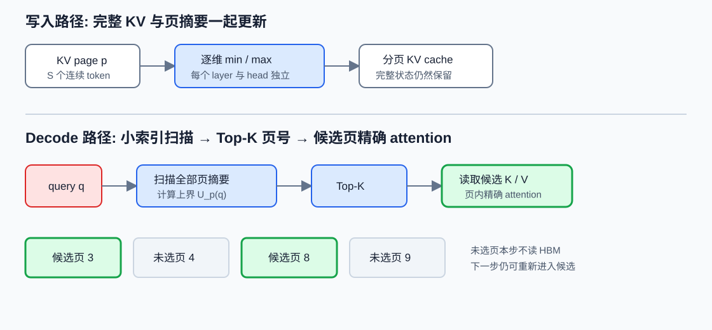

# Quest：用 min/max 上界筛选 KV 页

长上下文 decode 每次只生成一个 token，却要在每一层读取历史所有 key 和 value。以 FP16 Llama-2-7B、32K 上下文为例，Quest 论文按 32 层、32 个 KV head、head dimension 128 计算出约 16 GB KV；论文在 RTX 4090 上的测量中，加载这些 KV 至少需要约 11 ms，并占单步推理时间的一半以上。点积规模已经很窄，同一批历史状态被每个新 query 重新从 HBM 读取，带宽等待因而占据主要时间。

[Quest](https://arxiv.org/abs/2406.10774)选择保留完整 KV，再按当前 query 动态挑页。它没有沿用「过去重要，所以以后也重要」的累计分数，而是给每个 KV 页维护一个很小的 key 包围盒：逐维最小值与最大值。当前 query 到来后，包围盒给出页内最大点积的上界；系统按这个上界取 Top-K 页，只加载候选页的完整 K/V 并执行 attention。完整 cache 仍在，所以这一步漏掉的页没有被永久删除，下一个 query 还可以重新选择。

> 图 1: KV 写入时为每页增量维护 key 的逐维 min/max, Decode 时先扫描摘要并取 Top-K 页, 再读取候选页的完整 K/V.

图 1 解析:

- 蓝色摘要只含 key 的逐维上下界, 体积约为完整 K+V 的 $1/S$, 其中 $S$ 是每页 token 数.
- Top-K 输出的是物理页编号; attention kernel 按页表直接读取候选, 未选页仍保存在 cache 中.
- 上界筛选可以产生假阳性, 候选页内部的 QK、softmax 与 AV 仍按原定义计算.

## 1. 为什么重要性必须跟着 query 变化

### 1.1. 同一个历史 token 会突然变得重要

考虑 prompt 中出现过 `A is B. C is D.`，模型继续生成到 `A is`。在先前许多步里，`B` 的 attention 权重可能都很低；当前 query 表达对 `A` 的补全需求时，`B` 才突然成为高分位置。累计权重、最近窗口或一次性 prompt 压缩都可能在问题出现前把它判成低价值，而 query-aware 选择会在每一步重新估计候选。

论文用 LongChat-7B 的 attention map 展示了这种变化，并以稠密 attention 的 Top-10 token 为参照比较召回。H2O、TOVA 等 eviction 路径可能已删除未来才会变得关键的 KV；Quest 保留完整 cache，只决定当步读哪些页。两者即使使用相同 token budget，失败性质也不同：eviction 是状态不再存在，Quest 是当前候选没召回。

这一区分还能解释为什么历史 attention 分数很难充当未来价值。第 $t$ 步的权重由 $q_t$、历史 key 与当步 softmax 分母共同决定，累计量记录的是已经发生过的 query 分布。未来任务突然要求复述一个早期编号时，新的 $q_{t+r}$ 可能与那一页高度匹配；过去长期低分没有给出反证。Quest 每步重新扫描页摘要，付出的代价是持续索引开销，换来对这种相关性突变的响应。

### 1.2. 稀疏程度也随层变化

Quest 在 PG19 上以困惑度增加不超过 0.01 为约束测量各层可删除比例。论文报告前两层可利用的稀疏度低于 10%，后续多数层超过 90%，因此实验默认前两层使用完整 KV，仅在后续层应用 Quest。跳过两层来自论文两类模型与评测设置下的实测结果，换模型后需要重新测量，不能当作固定架构规则。

部署新 checkpoint 时应重新画每层预算曲线。若某层需要较大候选才能维持召回，直接使用稠密 attention 可能比运行摘要扫描和大 Top-K 更快。按层设置预算也优于全模型统一压缩率：前层保留传播所需的广覆盖，后层再使用更强的 query-aware 稀疏。

head 之间也会出现类似差异。某些 head 稳定读取局部标点、sink 或固定位置，另一些 head 才承担内容检索；把所有 head 的候选召回取平均，会让少数关键 head 的漏选被大量简单 head 稀释。更稳妥的诊断是先按 layer-head 画预算与 attention mass 曲线，再决定是否共享页集合。共享候选能减少地址分歧，代价是并集变大或个别 head 被迫接受别人的排序。

稀疏预算还会随生成阶段变化。问题刚进入上下文时，query 可能持续读取指令页与最近页；开始组织答案后，引用位置会移动到正文证据；生成格式化尾部时，局部页再次占主导。固定 K 的实现简单，但各步的实际需求不同。可变预算若由页分数间隔或累计上界决定，需要额外停止条件，并保证不同 batch 项仍能高效执行；否则节省的页会被控制流分歧抵消。

## 2. Min/max 上界从哪里来

### 2.1. 逐维区间给出点积上界

设页 $p$ 含 $S$ 个 key，单个 key 为 $k^{(r)}\in\mathbb{R}^{d_h}$，$r=1,\ldots,S$。对第 $j$ 个维度，页摘要保存

$$
m_{p,j}=\min_r k_j^{(r)},\qquad M_{p,j}=\max_r k_j^{(r)}. \tag{1}
$$

当前 query 为 $q\in\mathbb{R}^{d_h}$。任意页内 key 的第 $j$ 维贡献 $q_jk_j^{(r)}$ 都不会超过区间两个端点中的较大者：

$$
u_{p,j}(q)=\max\bigl(q_jm_{p,j},q_jM_{p,j}\bigr). \tag{2}
$$

当 $q_j\ge0$ 时，式 (2) 选择 $M_{p,j}$；当 $q_j<0$ 时选择 $m_{p,j}$。逐维相加得到页分数

$$
U_p(q)=\sum_{j=1}^{d_h}u_{p,j}(q). \tag{3}
$$

对页内任意 $r$，每个维度都有 $q_jk_j^{(r)}\le u_{p,j}(q)$，所以

$$
q^\top k^{(r)}\le U_p(q),\qquad
\max_r q^\top k^{(r)}\le U_p(q). \tag{4}
$$

式 (4) 是 Quest 选择器的数学依据。RoPE 已作用后的 key 与当前 query 进入同一坐标系，摘要必须对应 attention 实际使用的 key；若实现对 cache 中 key 采用不同旋转或反量化路径，索引与主 attention 的坐标约定也要同步。

softmax 不影响上界排序的第一步，因为指数函数对 logit 单调。页内最高未缩放点积的上界除以同一个 $\sqrt{d_h}$，仍是缩放后最高 logit 的上界。不过 attention 概率还依赖所有候选的分母，Quest 无法仅靠单页 min/max 得到某页最终概率质量的严格上界。它筛的是「页内可能出现很大 logit」，不是「这一页必然贡献多少输出」。

### 2.2. 一个二维手算

取一页三个 key：

$$
k^{(1)}=(1,4),\qquad k^{(2)}=(3,-2),\qquad k^{(3)}=(-1,1).
$$

逐维最小值和最大值为 $m=(-1,-2)$、$M=(3,4)$。令 query 为 $q=(2,-1)$。第一维 $q_1>0$，取 $2\times3=6$；第二维 $q_2<0$，取 $(-1)\times(-2)=2$。页上界是

$$
U_p(q)=6+2=8. \tag{5}
$$

三个真实点积依次为 $-2$、$8$、$-3$，式 (5) 在这个例子中恰好等于页内最大值。换一组 key，$k^{(1)}=(3,4)$、$k^{(2)}=(-1,-2)$，摘要不变，真实点积变为 2 与 0，上界仍是 8。原因是第一维最大值 3 与第二维最小值 -2 来自不同 token；包围盒角点 $(3,-2)$ 并不存在。

**Min/max 分数保证不低估页内最大点积，却不保证上界足够紧。** 页内各维极值来自不同 token 时会出现假阳性。Top-K 预算有限时，许多松上界页可能排在真正关键页之前，所以 Quest 的候选召回仍是经验结果，不是由式 (4) 自动保证的定理。

高维空间会放大这项松弛。若 $d_h=128$，式 (3) 可以从 128 个不同 token 分别取得有利端点，最终分数对应一个页内从未出现过的合成向量。真实 key 在各维之间有相关结构，轴对齐包围盒没有保存这种相关性。减小 page size 会减少页内异质性；使用更复杂的摘要可以更紧，却会增加索引字节和评分算力。Quest 选择 min/max，正是把摘要扫描控制在简单逐维乘法与 reduction 上。

### 2.3. 从页上界到候选召回

设真实最关键 token 位于页 $p^*$。式 (4) 保证 $U_{p^*}$ 不低于该 token 的点积；然而另一些页的真实点积较小，上界却可能更大。只有当 $p^*$ 的上界进入前 K，关键 token 才会参与第二阶段 attention。page size 增大往往使包围盒更松，K 增大则提高召回并增加流量。

召回应按真实稠密 attention 做参照。对每层每 head，取真实 Top-R token，映射到物理页，再检查 Quest Top-K 页覆盖了多少。还要报告 attention mass recall，即候选页包含的稠密 softmax 权重总和。前者关心最高分 token，后者关心被删除概率质量；两项都高，任务仍可能因多步误差累积而下降，所以还需长程任务验证。

一个四页小例子可以看清「上界正确但召回失败」。设页 A 的真实最大 logit 为 10、上界为 10；页 B、C 的真实最大值只有 3 和 2，上界却分别为 14 和 12；页 D 的真实最大值为 1、上界为 4。若 $K=2$，排序会选 B、C，真正包含全局最高 logit 的 A 被排除。把预算提到 3 才召回 A。式 (4) 没有失效，问题来自假阳性消耗了有限名额。

这一例子也说明无法用「上界覆盖真实值」直接证明 exact top-k。若要获得严格召回，可以先按上界排序，再维护当前已读取页中的第 R 大真实 logit；只有尚未读取页的最高上界低于这个阈值时才停止。这样的 branch-and-bound 会给出更强保证，读取页数却变成数据相关量，最坏情况仍扫描并读取全部页。Quest 采用固定预算，选择了稳定执行时间与经验召回，而没有提供 exact top-k 证书。

候选 attention 会在选中集合 $C$ 内重新做 softmax。令稠密概率为 $p_j$，被排除位置的总概率质量为 $\epsilon=\sum_{j\notin C}p_j$，并假设 $\lVert v_j\rVert\le V_{max}$。稠密输出和候选输出分别为

$$
o=\sum_jp_jv_j,\qquad
o_C=\sum_{j\in C}\frac{p_j}{1-\epsilon}v_j. \tag{6}
$$

两者相减后，候选内权重放大带来的误差至多为 $\epsilon V_{max}$，删除集合的直接贡献也至多为 $\epsilon V_{max}$，因而

$$
\lVert o-o_C\rVert\le2\epsilon V_{max}. \tag{7}
$$

式 (7) 说明 attention mass recall 比单纯 Top-R token recall更接近输出误差：若候选覆盖了 99% 稠密概率质量，单层 value 混合有可解释的上界；但该界通常较松，也没有覆盖输出投影、残差和多层累积。Quest 的 min/max 排序直接逼近高 logit 页，最终仍应测 $\epsilon$，不能只数命中了几个最高分 token。

## 3. 索引怎样随 KV cache 更新

### 3.1. Prefill 建页与 Decode 追加

prefill 产生整段 prompt 的 K/V，并按 $S$ 个 token 一页写入 cache。每写入一个 key，就对对应页、layer、head 的 min/max 做逐维更新：

$$
M_{p,j}\leftarrow\max(M_{p,j},k_j),\qquad
m_{p,j}\leftarrow\min(m_{p,j},k_j). \tag{8}
$$

满页封口后摘要不再变化。decode 新 token 写入尾页时继续执行式 (8)；尾页满后分配新物理页，并用 $-\infty$、$+\infty$ 分别初始化 max 与 min。官方代码的页写入测试同时覆盖 prefill 和单 token decode，候选摘要按 head 与 feature dimension 保存，说明索引更新属于 cache append 路径，而非每次查询重新扫描页内 key。

摘要张量的逻辑 shape 可写成 $[L,P,H_{kv},2,d_h]$，其中 2 对应 min/max。batch 的页表再把每条请求的逻辑页映射到全局物理页池。实际实现可以按 layer 分配或复用工作区，但不能把不同 layer 的 key 极值合并，因为每层投影空间不同。页复制、prefix fork 或 beam search 共享物理 KV 时，摘要也应跟随物理页共享，避免复制一份已经封口的统计量。

更新式只需读取新 key 与当前页摘要，成本对上下文总长度为常数。摘要精度需要单独验证：若 KV 使用量化格式，min/max 可以在量化域维护，也可以反量化后维护；前者更省，量化尺度与零点会影响上界的保守性，后者增加转换和存储。论文的「与量化兼容」表示两种技术可以叠加，不代表任意量化索引都自动保持式 (4)。

尾页还有一个容易遗漏的边界。假设 page size 为 16，当前页只有 5 个有效 token，剩余 11 个槽位可能尚未初始化。min/max 只能由 5 个真实 key 更新，候选 attention 也必须携带 `last_page_len=5`；若填充值参与摘要或 softmax，会产生虚假的极值与非法 attention mass。官方页测试显式计算最后一页长度，复现时应把长度为 1、15、16、17 的序列都纳入正确性用例。

### 3.2. 完整状态仍在，索引只是读取入口

Quest 不会因某一步未选择某页而删除物理 KV。下一步 query 改变后，全部页摘要重新参与排序。这个设计保住未来召回机会，也意味着峰值 cache 容量没有降低。若系统把冷页 offload 到 CPU，Quest 选中冷页后还要承担 PCIe 传输；此时页上界可充当预取入口，但论文 GPU 常驻结果不能直接当作分层存储延迟。

完整保留也让错误更容易定位。把 page budget 提高到总页数，Quest 应退化为完整读取，并与稠密分页 attention 在容差内一致；若此时结果仍不一致，问题落在页表、位置、数值精度或 kernel，而非候选算法。这个稠密回退是必要的调试路径，也能测出摘要与 Top-K 的纯额外开销。

prefix sharing 也需要区分物理页和逻辑页。多个请求可以引用同一前缀物理页，min/max 摘要随物理页共享；每条请求的 query 和候选 Top-K 不共享。页的引用计数决定何时释放，某条请求未选中该页不改变其他请求对它的所有权。

beam search 或 speculative decoding 会产生更多分支。多个 beam 在分叉前共享相同页与摘要，分叉后各自追加尾页；候选排序使用各 beam 的 query。speculative draft 一次提出多个 token 时，后续 query 依赖前面草稿 token，不能用第一个 query 的页集合替代整个验证块，除非验证 kernel 明确定义了逐位置候选。这里的状态共享属于 cache 管理，候选共享属于近似策略，两者不应混在一起。

## 4. HBM 流量与 block size

### 4.1. 读取比例逐项推导

令单个 key 或 value 向量占 $M$ bytes，上下文含 $L$ 个 token，每页 $S$ 个 token，共有 $P=L/S$ 页，选中 $K$ 页。稠密 attention 读取 K 与 V，流量近似为

$$
T_{dense}=2ML. \tag{9}
$$

Quest 首先读取每页两条 key 摘要，即 min 与 max：

$$
T_{index}=2MP=\frac{2ML}{S}. \tag{10}
$$

随后读取 $K$ 个候选页的完整 K/V：

$$
T_{selected}=2MKS. \tag{11}
$$

忽略 Top-K 索引与输出写回，Quest 相对稠密读取比例为

$$
\rho=\frac{T_{index}+T_{selected}}{T_{dense}}
=\frac{1}{S}+\frac{KS}{L}
=\frac{1}{S}+\frac{K}{P}. \tag{12}
$$

取 $L=65536$、$S=16$，token budget 为 4096，所以 $K=4096/16=256$ 页。式 (12) 得到 $1/16+4096/65536=1/8$，理想 KV 读取降低 8 倍。这里的 4096 是 token budget，不是 4096 个页；若真选 4096 页，就等于读完整 64K cache。

再落到字节。若单个 head 的 $d_h=128$ 且 KV 为 FP16，则一个 key 或 value 向量占 $M=256$ bytes。单层单个 KV head 的完整 64K K/V 读取是 $2\times256\times65536=32$ MiB；摘要读取是 2 MiB，256 个候选页再读 2 MiB，合计 4 MiB。层数和 head 数会同时放大两条路径，比例仍为 $1/8$。索引、页号和输出写回没有计入这 4 MiB，所以硬件计数应略高于公式值。

### 4.2. Page size 的两端代价

式 (12) 似乎鼓励增大 $S$，因为索引项 $1/S$ 会下降；候选 token budget $B=KS$ 固定时，第二项 $B/L$ 不变。但较大的页把更多 key 放进同一个轴对齐包围盒，上界更松，有限 K 下候选召回可能下降。若为了恢复召回而提高 $B$，第二项随之反弹。

小页让摘要更紧，索引容量和扫描量按 $1/S$ 增长。Top-K 项数也增多，page table 更长，kernel 处理更多离散块。物理 page size 还要与 attention tile、cache line 和线程块对齐；逻辑页 12 token 若 kernel 按 16 token tile 读取，公式中的 $S=12$ 会低估实际字节。评测应同时报告逻辑 page size、物理 tile 和有效末页长度。

可以把 page size 与 token budget 做二维扫描。固定 $B=2048$ 时，$S=8,16,32$ 分别对应 $K=256,128,64$ 页；索引比例依次是 $1/8,1/16,1/32$，候选比例都为 $B/L$。若质量随 $S$ 增大下降，原因主要落在上界松弛与块内混入，而非候选 token 数改变。若速度没有随索引比例下降，则 Top-K、页表或 kernel tile 已成为瓶颈。

### 4.3. 为什么 8 倍流量不等于 8 倍端到端加速

论文报告最高 7.03 倍 self-attention 加速与 2.23 倍端到端推理加速，两个数字对应不同范围。模型每步还有 QKV 投影、输出投影、FFN、归一化、采样、调度和 kernel 启动；Quest 又新增摘要扫描与 Top-K。只有 attention 占比较高、上下文足够长时，流量下降才接近子模块速度收益。

论文在 32K、2048 token budget 下报告 FP16 权重端到端约 1.74 倍，4-bit AWQ 权重约 2.23 倍。权重量化降低了其他权重读取，KV attention 在总时间中的占比变大，所以同一 KV 优化表现出更高的整体收益。换硬件、batch 或模型宽度后，占比会改变，不能把 2.23 倍当作固定常数。

可以用 Amdahl 关系检查数字是否合理。假设稠密 decode 中 attention 占 60%，Quest 把 attention 时间降到原来的 $1/7.03$，其余 40% 不变，则整体时间比例约为

$$
0.4+\frac{0.6}{7.03}=0.485, \tag{13}
$$

对应约 2.06 倍加速。若 attention 只占 40%，整体约为 $1/(0.6+0.4/7.03)=1.52$ 倍。权重量化降低非 attention 时间后，attention 占比上升，2.23 倍便更容易出现。这项手算不复刻论文具体 breakdown，只用于核对子模块与端到端数字的量级关系。

多 batch 时还要重算比例。KV 读取可被更多并发隐藏，FFN 的矩阵乘法利用率也会提高，attention 与非 attention 的占比一起变化。单请求延迟最受带宽影响，不等于高吞吐服务一定获得相同倍数。报告应同时给出 batch size、并发序列长度和每步 active token 数。

## 5. 分页 KV、批处理与 GQA

### 5.1. 候选页直接进入 attention

较差的实现会先把 Top-K 页 gather 到新的连续张量，再调用普通 attention。这样至少多出一次候选 KV 的读写和临时 buffer，且不同请求的候选大小会制造分配开销。Quest 的官方路径基于 FlashInfer 的分页 attention：Top-K 返回页编号，attention kernel 按编号从原 cache 读取 K/V，未选页不进入主数据流。

正确性测试要比较两条路径：完整 KV 加显式页 mask 的参考 attention，以及直接 sparse-load 的分页 kernel。输出误差之外还需检查最后一页、候选重复、页编号乱序和 batch 中零长度/短长度请求。若 Top-K 含当前未写满页，kernel 只能读取有效 token，填充槽不能进入 softmax。

多页 softmax 要使用同一行的全局最大值与归一化和。每个候选页可以先求局部最大值，再用 online softmax 规则合并；不能对每页单独 softmax 后平均，因为那会让每页总概率都变成 1。候选页的物理顺序不应改变输出，随机打乱页号后仍应与同一 mask 的参考实现一致。

### 5.2. Continuous batching 的 ragged 形状

设 batch 中请求 $r$ 有 $P_r$ 页、预算 $K_r$。摘要扫描总量是 $\sum_rP_r$，候选读取总量是 $\sum_rK_rS$。把所有请求 padding 到 $P_{max}$ 或 $K_{max}$ 会引入无效工作，尤其当长短请求混在同一轮。分页索引应用 indptr 描述每条请求的区间，调度器则可按页数或预算分桶。

Top-K 的尾延迟也不能只看平均 5–10 微秒。batch 增大后，需要同时处理 layer、head 与 request 三个维度的分数；候选数量不同会造成线程块工作不均。端到端基准应记录 p50/p95 每 token 延迟，并说明摘要扫描和 Top-K 是否与其他层重叠。

例如两个请求分别有 4096 页与 256 页，若统一 padding 到 4096 页，短请求的摘要扫描会产生 3840 个空项；若候选预算分别为 256 页与 32 页，又统一调用固定 256 页 kernel，短请求会为 224 页填充买单。ragged indptr 能消除逻辑空项，GPU 是否仍以最大形状分配线程块则要从 kernel profile 判断。

### 5.3. MHA、GQA 与 head 共享

MHA 中每个 query head 有自己的 key head，页摘要与页分数自然按 head 独立计算。GQA 让一组 query head 共享同一 key/value head，但组内 query 不同，最相关页也可能不同。可以为每个 query head 单独选页，再让共享 KV head 读取候选并集；也可以先聚合组内页分数，使用统一候选。前者召回更细，后者访存更规则。

Quest 公开 kernel 覆盖 MHA，尚未实现 GQA。迁移到 GQA 模型时必须定义组内合并规则、候选预算按 query head 还是 KV head 计数，并重新测试实际 HBM 字节。若组内候选并集接近完整页集，GQA 的共享关系会削弱读取稀疏收益。

取 8 个 query head 共享 1 个 KV head。若每个 query head 独立选择 64 页，最坏并集可达 512 页；统一选 64 页只读一次，却可能漏掉某个 head 独有的相关页。折中办法包括按组聚合上界取较大值、给每个 head 一部分私有预算再合并，或让相近 query 共享候选。无论采用哪条路径，attention 输出仍按 query head 独立计算，页集合共享不能顺手写成注意力权重共享。

若用组内最大页分数 $U_{g,p}=\max_{h\in g}U_{h,p}$，任一 head 高估的页都会进入共享排序，假阳性会在 head 轴上再次累积；若用均值，少数 head 的强相关页可能被其他 head 稀释。候选并集保持每个 head 的原排序信息，但读页数上限随组大小增长。GQA 迁移的核心取舍由此落在同一个问题上：共享 KV 节省存储，而 query 仍保留多样性，页选择必须决定这份多样性占多少带宽。

Context Parallel 会把历史位置分散到多张卡，页摘要也随 KV 分片。每张卡可以用本地 query 计算页上界并取局部候选，但「每卡 Top-K」会让总预算随设备数增长；若每卡只取 $K/N$，真实前 K 又可能集中在一张卡。严格的全局 Top-K 需要交换页分数或局部候选，再广播最终页号。通信的数据量远小于搬运完整 KV，却会进入每个 decode step 的关键路径。报告多卡收益时，应把这次 collective 与远程页读取计入，不能只测单卡候选 attention。

Tensor Parallel 若按 head 切分，设备各自拥有部分 KV head，可以独立选择并计算局部 attention，最后在输出投影处合并；此时各卡页集合不同是合法的。若按 hidden dimension 切分同一个 head，单卡只掌握点积的一部分，局部 min/max 上界也只是部分和；得到全页分数需要跨卡归约。分片方式决定索引放在哪里，也决定 Quest 节省的是本地 HBM、互连流量，还是两者同时减少。

## 6. 失败模式与可复算评测

### 6.1. 上界松、预算小与多证据聚合

第一类失败来自松上界。页内 key 分布跨越很大范围时，min/max 组合出许多不存在的角点，假阳性页挤占 Top-K。第二类失败来自预算不足：单个 passkey 只需召回一个页，多文档总结、代码依赖和多跳问答可能同时需要大量页，固定 1K token budget 会截断证据集合。第三类失败来自层差异，前层或特定 head 本就不稀疏，强行使用统一比例会破坏信息传播。

还有 softmax 重归一化。即使候选覆盖真实最高分 token，删除大量低分项也会改变分母；这些项单个权重小，总和却可能不小。attention mass recall 比 Top-R token recall更能暴露这个问题。需要时可扩大预算、为前层回退稠密，或给局部窗口与 sink 保留固定页，再把剩余预算用于 query-aware 候选。

固定保留最近窗口和 sink 还能降低最坏行为。设总预算为 2048 token，可先留 512 个最近 token 与 4 个 sink，再用剩余 1532 个名额对应的整页预算做 Quest。这样局部语言连续性不完全依赖 min/max 排序，远距页仍由当前 query 决定。代价是动态预算变小，组合策略必须在相同总读取量下与纯 Quest 比较。

多证据任务还会出现「每页都不够高，但合起来才有用」的情况。十个页各自包含一条约束，任何单页最高 logit 都排不到前 K，模型却需要同时聚合十条约束才能作答。Min/max 排序按单页最大点积估分，没有表示页与页之间的互补关系。扩大预算、分阶段生成或让后续层重新检索可以缓解，却无法从单步页分数中提前证明完整性。因而 passkey 的高召回只能证明单证据检索能力，不能代替多页组合评测。

位置编码外推也会改变页分数分布。长到训练范围之外时，RoPE 缩放、数值精度和 key 方向都会影响 min/max 松弛；Quest 只能从现有 key 中筛选，无法修复基础模型在超长位置本来就失真的表示。评测应先确认 full attention 在目标长度上的质量，再计算稀疏差额。把基础模型的长上下文失败归到候选漏选，会得到错误的预算结论。

同一组实验还应保留不同随机种子与不同文档顺序，检查候选是否只对固定位置或固定提示格式有效。

### 6.2. 质量实验怎样避免平均值遮住漏选

论文评测包含 PG19 困惑度、10K/100K passkey 与六项 LongBench，并让问题或指令按 token 进入 decode，以暴露未来 query 改变后 eviction 无法恢复的问题。复现时还应改变证据深度、页内位置与相似干扰项。若关键数字恰好落在页边界，只测单一位置会高估或低估某个 page size。

PG19 主要检查连续语言建模，局部依赖占比较高。论文用 4096 token budget 测 32K 文本，Quest 的困惑度接近 full cache；这能说明截断后没有明显破坏常规预测，无法单独证明稀有远距事实一定召回。passkey 正好补上这一缺口：10K LongChat 在 64 token budget、100K Yarn-Llama-2 在 1024 token budget 时，论文表格中的 Quest 接近或达到满分，而几种提前淘汰方法在问题到来前已经丢掉答案页。

LongBench 的实验把材料先 prefill，再把问题与指令逐 token 喂入，以模拟 query 在 decode 中逐渐变化。论文在 NarrativeQA、HotpotQA、Qasper、TriviaQA、GovReport 与 MultiFieldQA 上比较多个预算，并报告 Quest 在约 1K token budget 时可接近 full cache。这个设置比把问题一并塞进 prefill 更能检验 query-aware 选择，因为选择器必须随着问题 token 更新候选。

这些结果仍受基础模型、prompt 拆分与任务长度约束。LongChat-7B-v1.5-32K 和 Yarn-Llama-2-7B-128K 的层/head 分布不代表新模型；passkey 只需找一个短答案，也比多证据综合容易。复现新模型时应保留论文任务作为对照，再增加模型目标场景，尤其是需要同时引用多页的总结、代码修改和长对话约束。

一组可复算的实验至少报告：每层与每 head 的候选页召回、attention mass recall、任务准确率、预算、page size、前几层是否稠密、模型的 KV head 结构。对相同请求同时运行 full attention，才能区分基础模型本来答错与 Quest 漏选。若 full attention 也失败，不能把错误归到稀疏选择。

还应加入「相关性反转」样本：prompt 前部放两个相似实体，后文先反复讨论实体 A，使 A 的历史权重占优，生成末尾再突然询问实体 B 的编号。累计重要性容易偏向 A，Quest 应随当前 query 转向 B 所在页。把 B 放在页首、页中和页尾，可以同时检查 page boundary 与 min/max 召回。

消融需要分别关闭三件事。把 query-aware 分数换成固定页排序，可以测当前 query 的贡献；把 min/max 上界换成读取完整 key 后的 oracle 页分数，可以测摘要松弛；保留候选不变而换回普通 gather，可以测专用分页 kernel 的贡献。三项一起改变时，质量或速度回退无法归因。

### 6.3. 系统实验必须核对真实字节

kernel 侧分别测摘要更新、criticality estimation、Top-K 与候选 attention；端到端再加入模型其余部分。长度扫描应覆盖索引开销大于收益的短上下文交叉点，以及预算固定后 Quest 增长速度变慢的长上下文区间。batch、page size、token budget 和量化格式都要保持明确。

性能计数器应验证式 (12)：摘要扫描接近多少字节，候选 K/V 实际读了多少，是否存在 gather 临时量，未选页有没有被通用 kernel 读取。**Quest 的收益来自少搬 KV，而非只把 attention 矩阵标成稀疏。** 若 HBM 流量不降，候选召回再漂亮也不会得到论文所示的 decode 加速。

最终报告最好给出一张长度扫描图：横轴从 2K 到模型上限，纵轴同时画 full attention、摘要扫描、Top-K 和候选 attention 的时间。短上下文区域可能由固定开销主导，超过某个交叉点后 full attention 随 $L$ 增长，候选 attention 主要受固定 budget 控制，摘要扫描按 $L/S$ 缓慢增长。只有这条曲线能说明 Quest 在真实流量长度分布中覆盖多少请求，而单个 32K 点无法回答部署收益。

官方仓库给出的 kernel 基准覆盖 `page_budget` 从 64 到 512，并提供 batch decode、单元测试与 PyTorch 参考结果；端到端脚本基于 LongChat-7B-v1.5-32K 和 Yarn-Llama-2-7B-128K。复现时应保存 commit、CUDA、GPU 与 FlashInfer 版本，因为分页接口和 kernel 调度会变化。结果若只剩算法脚本而没有对应 CUDA 路径，只能证明候选逻辑，不能证明系统加速。

上线监控还要区分选择失败与服务退化。候选页召回需要稠密参考，无法对每个生产 token 都计算；可以抽样请求或在离线回放中计算。在线则记录摘要扫描、Top-K、候选 attention 的时间与实际页数，监测预算是否因回退频繁膨胀。质量报警出现后，用保存的请求在 full attention 下重放，确认问题是否随恢复全部页而消失。

## 7. 页摘要、量化与缓存生命周期

### 7.1. 未满页需要增量更新

对每个 KV head和维度, Quest页摘要保存当前页的最小值与最大值. 新 key $k_t$ 进入未满页 $p$ 时更新:

$$
m_{p,r}\leftarrow\min(m_{p,r},k_{t,r}),\qquad
M_{p,r}\leftarrow\max(M_{p,r},k_{t,r}). \tag{13}
$$

页第一次写入时令 $m=M=k_t$. 页填满后摘要变为只读, 可以随 prefix cache共享. 当前尾页继续追加, 多个会话分支不能共同修改同一摘要; fork时要么复制尾页, 要么使用copy-on-write. 只复制 K/V却让两个分支共享可变 min/max, 会让一个请求的候选受另一个请求影响.

Rollback也要恢复摘要. 已填满并整体回滚的页可以直接移除; 回滚落在尾页内部时, 仅靠当前 min/max无法删除被撤销 token的贡献. 若被撤销 key恰好提供某维极值, 摘要会继续覆盖不存在的点. 解决办法是重新扫描尾页有效 key生成摘要, 或为 speculative token保留临时摘要, 接受后再合并. 页面较小时重扫通常直接可靠.

### 7.2. KV量化会改变上界含义

若 attention实际读取量化后重构的 key $\hat k$, 页摘要可以基于原始 $k$ 或重构值 $\hat k$. 基于 $\hat k$ 时, 式 (13)对实际点积保持区间上界; 基于原始值时, 量化误差可能让重构值落到区间外. 可以给每维区间扩张误差界 $\epsilon_r$:

$$
[m_{p,r}-\epsilon_r,\ M_{p,r}+\epsilon_r]. \tag{14}
$$

扩张保证安全, 上界会更松, 假阳性页增加. 每页/每通道 scale越粗, $\epsilon_r$越大. 另一种做法是在写入量化 cache后, 直接从量化码与scale更新重构区间, 让selector与主 attention使用完全相同的 key语义.

Value量化不影响页选择分数, 会影响候选 attention输出. 消融时分别恢复 K和V精度: 候选集合变化来自 K摘要与打分, 候选不变而输出改善来自主 QK或V重构. 将二者一起切换只能看到总质量, 无法判断应把更高bit预算给哪一侧.

### 7.3. 摘要压缩本身有代价

每页若保存 min和max, 摘要元素数为原 K cache的 $2/S$, $S$ 是页内token数. page size 16时约为 K元素的12.5%, page size 64时约3.125%, 未计scale与对齐. 摘要通常比完整KV小很多, 在大量层和并发请求下仍是需要核算的常驻状态.

摘要dtype也影响扫描. FP16 min/max稳定但字节较多; FP8摘要减少带宽, 需要保持区间外包. 普通舍入可能把最小值向上或最大值向下, 上界不再严格. 若要保守, min采用向负无穷方向量化, max向正无穷方向量化, 或额外扩大一个量化步长. 保守量化增加假阳性, 不会漏掉因摘要收缩造成的候选.

摘要布局应按 criticality kernel的读取顺序排列. 若一个 query head连续扫描所有页, 按 head-page-dim布局容易合并; GQA若组内 query heads共享 KV head, 同一摘要会被多次读取, 留在L2的机会增加. 布局转换不能在每个decode step临时进行, 应在页写入时一次形成.

### 7.4. Prefix复用与页表映射

Quest selector返回逻辑页号, PagedAttention通过block table映射到物理页. Prefix cache让多个请求的逻辑页指向同一物理页, 摘要也应绑定物理页内容, 避免为每个请求重复保存. 当前请求的候选表仍是query相关状态, 不能随prefix直接共享.

页面迁移或offload时, 摘要可留在GPU帮助先选页, 选中后再把完整KV从主机或远端搬回. 这样才真正减少链路流量. 若摘要随KV一起offload, 每步为了选页先搬摘要仍可行, 延迟取决于摘要大小和链路; 若先搬全部KV再计算criticality, Quest已经失去主要价值.

物理页回收必须同时释放摘要. 复用槽位写入新请求前先初始化min/max, 否则旧极值会让新页上界异常高, 长期占据候选. 单元测试应让同一物理槽经历分配、填满、释放、再分配, 并与新分配页的摘要逐维比较.

这项检查也应覆盖实际量化页.

## 参考资料

- [Tang et al., Quest: Query-Aware Sparsity for Efficient Long-Context LLM Inference](https://arxiv.org/abs/2406.10774)
- [Quest 官方实现](https://github.com/mit-han-lab/Quest)
- [FlashInfer](https://github.com/flashinfer-ai/flashinfer)
- [Kwon et al., Efficient Memory Management for Large Language Model Serving with PagedAttention](https://arxiv.org/abs/2309.06180)
