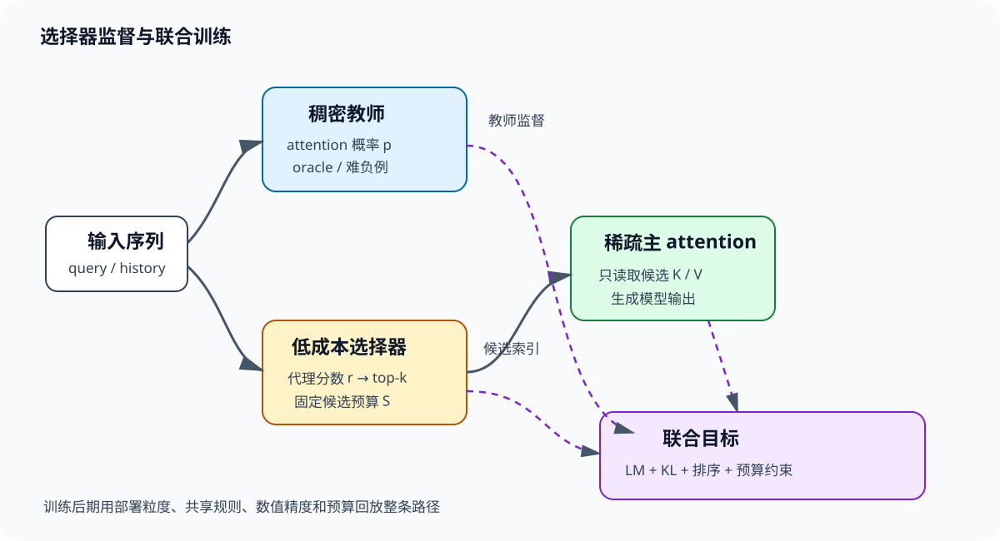

# 监督与联合训练

一个选择器真正要学的东西，可以压成一句话：用很便宜的表示，把主 attention 最舍不得丢掉的位置排进有限预算。训练同时面对检索与生成两个目标。检索目标要求候选集合覆盖关键证据，生成目标要求稀疏模型仍能预测下一个 token。单独优化检索会得到高召回却不会用证据的模型，单独优化生成又可能让路由依赖数据捷径。

*图 1：稠密路径生成概率与集合标签，选择器在预算约束下输出候选，稀疏主干完成语言模型目标。训练后期应让前向路径逐渐收敛到部署结构。*

## 1. oracle 到底教什么

### 1.1. 从 attention 分布构造集合

对第 $i$ 个 query，稠密教师 logits 与概率写成

$$
z_{ij}=\frac{q_i^\top k_j}{\sqrt d}+m_{ij},\qquad
p_{ij}=\frac{e^{z_{ij}}}{\sum_{s\le i}e^{z_{is}}}. \tag{1}
$$

$m_{ij}$ 包含因果与 padding mask。若部署预算为 $k$，最朴素的 oracle 是 $G_i=\operatorname{TopK}(p_i,k)$。选择器产生低成本分数 $r_{ij}$，再得到 $S_i=\operatorname{TopK}(r_i,k)$。集合召回为

$$
R_i@k=\frac{|S_i\cap G_i|}{|G_i|}. \tag{2}
$$

它容易解释，却把教师 top-k 内部的权重差异抹平。假设教师前四项概率为 $(0.70,0.20,0.06,0.04)$，预算 $k=2$。候选 A 选中第 1、3 项，recall 为 $1/2$，概率质量为 $0.76$；候选 B 选中第 2、3 项，recall 同样为 $1/2$，概率质量只有 $0.26$。集合指标完全相同，输出风险显然不同。

因此还要计算

$$
C_i=\sum_{j\in S_i}p_{ij}, \tag{3}
$$

即候选覆盖的教师概率质量。$C_i$ 直接关联被裁掉的 attention mass，但也不是最终任务质量的充分条件：两个 value 可能几乎相同，漏掉其中一个影响很小；也可能一个低概率 value 恰好携带唯一变量值。集合召回、质量覆盖和任务正确率要并列报告。

### 1.2. token、块与 GQA 的标签不可混用

MoBA 与 NSA 的 selection 以连续块为单位。若块 $b$ 覆盖位置集合 $B_b$，可以把 token 概率求和为块标签

$$
P_{ib}=\sum_{j\in B_b}p_{ij}. \tag{4}
$$

求和适合估计整个块的概率质量；取最大值更重视块中单个尖峰；用块表示与 query 重新打分则训练的是代理相关性。三种定义会给出不同 oracle。实际 kernel 会读完整块，评测既要报告逻辑命中的关键 token，也要报告随块带入的总 token 数。

GQA 又多一层共享。同一 KV head 对应多个 query heads，部署若只允许一组共享候选，教师标签也应在组内聚合。可用各 head 块质量之和

$$
P^{\mathrm{group}}_{ib}=\sum_{h\in\mathcal H_g}P^{(h)}_{ib}. \tag{5}
$$

它偏向服务多数 heads，少数检索 head 的唯一证据可能被淹没。训练时同时保留 per-head oracle 与 group oracle：前者给出质量上界，后者对应真实访存。两者差距很大时，问题来自共享粒度，而非 selector 容量。

### 1.3. 正例之外要设计困难负样本

随机负样本常常太容易。远处无关文本与 query 的主题差异明显，选择器只学关键词匹配便可分开；长上下文里真正危险的是同主题、同实体、同模板的错误片段。例如代码仓库里出现十次同名函数，文档里每章都有相同标题，工具轨迹里反复出现近似 JSON。

困难负样本可以来自教师 top-k 边界附近、同一文档的重复段、相邻块以及旧版本答案。边界样本训练排序精度，相邻块暴露块表示的模糊性，重复段检验位置与语义能否共同消歧。负样本池还要随长度增长；32K 内只有一个同名实体，扩到 1M 后可能出现几十个，训练难度已经改变。

### 1.4. oracle 也会泄漏与漂移

若用答案 token 的 hidden state 回头标注 prompt 中的证据，标签可能含有训练时才知道的未来信息。自回归 selector 在位置 $i$ 只能使用 $x_{\le i}$ 产生的状态，教师标签也必须遵守同一因果边界。离线预处理时尤其容易出错：整段编码后再抽取 query 表示，双向信息或答案后缀可能悄悄进入标签。

教师还会随着主干更新而变化。联合训练开始时，稠密 checkpoint 的 attention 是一套 oracle；主干适应稀疏图后，query、key 与 head 功能都会漂移。始终使用旧标签，selector 可能准确模仿一套已经不存在的分布。每步重跑当前稠密教师最及时，也最昂贵。折中方案包括周期性刷新、教师参数的指数滑动平均，以及固定一部分探针 batch 比较新旧 oracle 的 Jaccard 与概率质量。

不同层的 attention 也不能合成一份通用标签。浅层常偏局部与词法，深层可能检索实体、指令或中间结论；同一个位置在相邻层的重要性会改变。跨层共享 selector 时，标签聚合规则就是模型假设：求和偏向多层共同需要的位置，取最大值保护只在单层突出的证据，分层蒸馏则保留差异但增加参数和缓存。共享带来的节省必须与单层 oracle 的损失一起测量。

## 2. 损失怎样穿过 top-k

### 2.1. KL 蒸馏训练低维 indexer

DSA 的 Lightning Indexer 用低维 key 与多组 query 表示给全部历史位置打分。稠密预热阶段可以把主 attention 分布作为教师。令选择器概率

$$
\hat p_{ij}=\operatorname{softmax}_j(r_{ij}/\tau), \tag{6}
$$

则蒸馏损失可写成

$$
\mathcal L_{\mathrm{KL}}=
\sum_i\sum_{j\le i}p_{ij}\log\frac{p_{ij}}{\hat p_{ij}}. \tag{7}
$$

温度 $\tau$ 控制教师尾部是否可见。温度过低时，梯度几乎只来自最大项，边界排序学得慢；温度过高时，大量无关位置占据损失。若稠密矩阵无法长期保存，可以只保留教师 top-$m$ 与一个 tail mass，但 $m$ 必须大于部署 $k$，否则 selector 从未看到最危险的近邻负样本。

DSA 的公开训练路线先用稠密 attention 预热 indexer，再启用 token 选择并联合优化全部参数。预热解决冷启动：随机 selector 若直接控制主 attention，早期候选近似随机，主干输入随 step 剧烈变化。联合阶段则让主干适应被裁剪后的分布。两阶段之间的 $k$、长度和学习率切换都可能造成 loss 台阶，需要单独记录。

### 2.2. 排序损失直接盯住边界

KL 拟合完整概率形状，但部署只关心谁跨过第 $k$ 名。对正例 $j^+$ 与困难负例 $j^-$，可以用 margin loss

$$
\mathcal L_{\mathrm{rank}}=
\frac1{|mathcal P_i|}\sum_{(j^+,j^-)\in\mathcal P_i}
\max(0,\gamma-r_{ij^+}+r_{ij^-}). \tag{8}
$$

手算一个例子：$\gamma=0.2$，正例分数 $0.7$，负例 $0.65$，损失为 $0.15$；负例降到 $0.4$ 后损失归零。它把梯度集中在排序不够安全的 pair 上。若只采最容易的负例，损失很快为零；若永远只采最难一个，又容易追逐教师噪声。可混合边界负例、随机负例与同主题负例。

cutoff margin

$$
\Delta_i=r_{i,(k)}-r_{i,(k+1)} \tag{9}
$$

也值得监控。$\Delta_i$ 很小时，FP8 量化、并列排序和不同 kernel 的归约顺序都可能翻转候选。平均 recall 没变，不代表这些翻转不会集中发生在关键 query 上。

### 2.3. soft routing 与 straight-through

soft routing 令 $g_{ij}=\operatorname{softmax}(r_i/\tau)_j$，用 $g$ 对所有候选加权。它的梯度干净，计算仍接近稠密。训练早期可用较高温度保持探索，随后降低温度，使分布接近 hard selection。温度降得太快会冻结错误排序；一直很高又让主干依赖许多部署时会消失的小权重。

straight-through 用 hard mask $h$ 做前向，用 soft gate $g$ 近似反向：

$$
\tilde h=\operatorname{stopgrad}(h-g)+g. \tag{10}
$$

数值上 $\tilde h=h$，所以前向只看选中候选；对 $r$ 求导时，stop-gradient 项消失，梯度沿 $g$ 返回。这个估计让训练形状贴近部署，却把离散跳变当作连续变化，梯度有偏。应与纯教师监督、扩大候选训练做消融，而不是把「有梯度」等同于「梯度正确」。

### 2.4. 候选探索给集合外样本一次机会

hard top-k 的另一种训练办法是在预算外加入少量探索位置。设部署预算为 $k$，训练前向取 $k$ 个高分位置，再从其余位置按概率或分桶抽取 $e$ 个探索样本。探索样本参与教师排序或主 attention，但不计入部署质量。随着训练进行，$e$ 从较大值退火到零。

均匀随机探索在百万候选中很难撞到关键位置。更有效的抽样来自三处：教师高分而学生漏掉的位置，学生 cutoff 附近的位置，以及距离、主题、文档段落分桶后的代表项。第一类直接纠错，第二类稳定排序边界，第三类防止训练只覆盖高频距离。抽样概率进入 loss 时需做重要性校正，否则频繁被抽中的位置会被过度加权。

假设候选空间有 1024 块，部署 $k=16$，再抽 16 个均匀探索块。某个唯一漏选证据被碰到的概率只有 $16/(1024-16)\approx1.59\%$。若先用教师或粗索引缩到 64 个困难块，再从剩余 48 个里抽 16 个，概率升到 $33.3\%$。探索是否有效，取决于采样池是否含有有价值的错误，单纯增加若干随机块效果很弱。

### 2.5. NSA、MoBA 与 KDA 的边界

NSA 的压缩分支对全局压缩条目做 attention，其权重汇总成 selection 的块重要性。压缩输出本身参与最终结果，因此这条全局路径能正常接收语言模型梯度；选中的原始块补充细节，滑窗保证局部连接。hard top-k 的集合边界仍不可导，但压缩分支不会因某个原始块漏选就完全失去全局信号。训练时应分别观察三个 gate、压缩质量和 selected-block recall。

MoBA 把块视作 attention experts。query 对块打 gate 分数，选中块与当前块进入精确 attention。它可以在 full 与 sparse 模式之间切换，适合先以较宽候选训练再收紧；代价是切换后每个 query 的归一化集合变化。若 full 阶段的 gate 只作旁路打分，主干可能从未承受漏选，切到 hard top-k 时仍会掉点。

Kimi Delta Attention（KDA）通过门控递归状态保存历史，属于线性 attention。它没有为每个 query 从全部历史 token 中产生 hard top-k 集合，因而 recall@$k$、候选负载均衡和随机 gather 不是它的核心训练指标。KDA 更关心有限状态能否写入、擦除并保留关联记忆，以及周期性 full attention 怎样弥补状态压缩。把它列在同一章的意义是划清训练问题，而非声称所有长上下文结构都有一个 selector。

## 3. 联合目标与预算手算

### 3.1. 四项损失各管一件事

一个可操作的联合目标是

$$
\mathcal L=
\mathcal L_{\mathrm{LM}}
+\lambda_d\mathcal L_{\mathrm{KL}}
+\lambda_r\mathcal L_{\mathrm{rank}}
+\lambda_b\mathcal L_{\mathrm{budget}}. \tag{11}
$$

$\mathcal L_{\mathrm{LM}}$ 校正最终预测，KL 保留教师概率结构，排序损失盯住 top-k 边界，预算项限制选择规模。四个数相加后得到的总 loss 很难诊断，日志中必须拆开。$\lambda_d$ 太大时，学生被迫复现教师的细小尾部差异；$\lambda_r$ 太大时，分数 margin 增大但概率校准变差；$\lambda_b$ 太大时，选择器可能为了省预算放弃困难 query。

预算项若写成平均 gate 数，只控制均值。设四个 query 的候选数为 $(2,2,2,10)$，平均为 4；定长 kernel 的预算若是 4，前三行浪费槽位，最后一行仍要截掉 6 个。更接近部署的约束是对超预算部分惩罚：

$$
\mathcal L_{\mathrm{over}}=
\frac1N\sum_i\max(0,\sum_jg_{ij}-k)^2. \tag{12}
$$

它仍不能生成固定形状，所以后期要用真实 hard top-k 前向。

### 3.2. 一次预算与质量手算

假设 8 个历史块的教师质量为

$$
p=(0.30,0.22,0.16,0.11,0.08,0.06,0.04,0.03),
$$

部署选择 3 块。oracle 覆盖 $0.68$。学生排序选中第 1、2、5 块，recall@$3=2/3$，质量覆盖为 $0.60$。若每块 64 token，主 attention 读取 192 token；加上 128-token 固定窗口，实际读取 320 token。上下文为 8192 token 时，主 attention 的逻辑读取比例为 $320/8192=3.90625\%$。

若 selector 为每块读取一个 32 维 BF16 摘要，8 块只读 $8\times32\times2=512$ 字节；扩到 1M token、块长 64 时共有 15625 块，单 query 摘要读取约 0.95 MiB。主 attention 虽保持 320 token，selector 扫描成本却随长度增长。训练损失只约束候选质量，不会自动消除这部分带宽。

把长度从 8192 扩到 131072，仍选 3 个全局块与 128 个窗口 token，主读取比例降到约 $0.244\%$。比例更稀疏并不意味着任务更容易：候选块从 128 个增至 2048 个，困难负样本增加 16 倍。长度外推必须同时看 selector 召回与扫描成本。

### 3.3. 概率质量可以控制自适应预算

固定 $k$ 对尖锐分布很浪费，对平坦分布又可能不够。若 selector 已经过概率校准，可以选择最小集合 $S_i$，使累计代理质量达到阈值 $\rho$：

$$
k_i=\min\left\{m:\sum_{j\in\operatorname{TopM}(r_i,m)}\hat p_{ij}\ge\rho\right\}. \tag{13}
$$

例如排序概率为 $(0.55,0.25,0.10,0.06,0.04)$，$\rho=0.9$ 时需要 3 项；另一行是 $(0.22,0.21,0.20,0.19,0.18)$，同一阈值需要 5 项。这能把预算给更困难的 query，前提是 $\hat p$ 的校准在长度外仍可靠。

实际 kernel 可把 $k_i$ 量化到几个档位，如 64、128、256、512，再按档位组 batch。这样比完全 ragged 更容易获得规则 tile，也比全批统一最大值少浪费。日志中要同时给平均 $k$、P95/P99 $k$ 和每档请求比例；只报平均值会隐藏少数超长行造成的尾延迟。

### 3.4. 预算课程不能和长度课程绑死

若长度从 8K 提到 32K，同时把 $k$ 从 16 降到 4，质量下降无法归因。更清楚的实验分三组：固定长度只退火 $k$，固定 $k$ 只增加长度，最后再联合调度。证据距离和干扰块数量也分别控制，才能判断模型怕远距离，还是怕相似负样本。

训练时可以先用 $k_{train}=2k_{deploy}$，随后逐步缩小。每个阶段都在部署 $k$ 上跑旁路评测，否则大候选掩盖的问题会在最后一次切换集中爆发。若模型只在大预算下稳定，应回到标签与负样本，而非继续增加退火步数。

## 4. 训练—推理一致性

### 4.1. 一致的是数据流，不只是参数

训练保存 BF16 selector key，推理量化成 FP8；训练每个 head 独立选取，推理按 GQA 组共享；训练输出任意 token 索引，kernel 按页或块扩张；训练允许候选 512 个，服务配置截成 256 个。参数完全相同，实际邻接图已经不同。

最直接的检查是把部署 selector 与 kernel 索引器接回训练框架，在同一 batch 保存三组集合：教师 oracle、训练实现候选、部署实现候选。逐层计算交集、概率质量和输出误差，再按 query 类型分桶。只比较最终 perplexity 会把少量严重漏检淹没在大量局部 token 中。

并列分数要有确定规则。top-k 在 cutoff 处出现相同值时，不同设备可能返回不同索引；activation checkpointing 的 backward 若重算出另一集合，梯度会对应错误前向。可固定次级排序键，或在 forward 保存索引而不重算。保存索引增加 activation，重算则要求随机状态、量化与归约顺序完全可复现。

### 4.2. 索引缓存与参数版本要同步

选择器 key 常在 token 写入时计算并缓存。训练中参数每步更新，若一条长序列被切成多个 micro-batch，旧 token 的缓存可能来自旧参数，新 token 来自新参数；两者被同一个 query 打分，分数尺度未必一致。完整序列并行训练通常一次构造全部 key，在线继续训练或带状态训练则必须定义缓存版本。

可选方案有三种：每次参数更新后重算活跃序列索引；在一个序列完成前冻结 selector key 投影；或用慢速 EMA 参数生成缓存，使跨 step 漂移更小。第一种精确但贵，第二种限制优化频率，第三种引入教师滞后。无论采用哪种，训练模拟和服务端都要遵循同一更新边界。

跨层共享也需要版本标记。上游层生成的候选交给若干下游层复用时，下游梯度若无法回到候选生成器，训练目标应显式包含这些层的联合 oracle。否则 selector 只对产生索引的那一层准确，下游层只能被迫适应一组并不合适的固定候选。

### 4.3. teacher forcing 会放大路由偏差

语言模型训练看到真实前缀，生成时看到自己的历史输出。早期生成错误会改变后续 query 表示，selector 随之访问不同证据。普通自回归模型已有这种暴露偏差；动态路由又增加一层离散放大：query 轻微变化可能让第 $k$ 与第 $k+1$ 名交换。

可以用带噪 query、短段自由生成或学生轨迹蒸馏检验稳定性。语义相近的 query 应保住关键块，同时允许次要候选随表达变化。记录 Jaccard、质量覆盖差与 cutoff margin，比只看 router logit 的均方误差更贴近部署。

### 4.4. 稀疏 backward 也要兑现

训练原生稀疏只有在 forward、backward 都沿稀疏边执行时才节省训练成本。若 forward 选少量块，backward 为了方便又物化稠密 mask 或完整分数矩阵，显存和计算仍可能平方增长。NSA 强调训练、prefill 与 decode 的硬件对齐，正因为反向 kernel 也是完整方法的一部分。

训练报告应列出每层保存的索引、softmax 统计量和压缩状态，区分逻辑 FLOPs 与实测 step time。selector 教师若周期性运行稠密 attention，还要按频率摊入平均训练成本。

## 5. 长度外推与召回验收

### 5.1. 三类召回指标

第一类是集合 recall@$k$，用于快速比较排序。第二类是式 (3) 的概率质量覆盖，能区分教师强弱项。第三类是证据召回：数据已知答案依赖哪些 span，检查候选是否覆盖这些 span。三者回答不同问题。

还可计算 selected attention 与 dense attention 的输出差

$$
E_i=\frac{\|o_i^{\mathrm{sparse}}-o_i^{\mathrm{dense}}\|_2}
{\|o_i^{\mathrm{dense}}\|_2+\epsilon}. \tag{13}
$$

输出差包含 value 冗余信息，但仍停留在单层。最终要用长文问答、代码定位、多证据合成和 agent 轨迹回放验证。平均指标之外报告最差分位数，尤其关注低 margin、高熵与证据极远的 query。

### 5.2. 长度网格怎样设计

至少在训练长度内、训练长度边界和数倍外推长度上画曲线，例如 8K、32K、128K、512K。每个长度保持任务难度有可比版本，再增加固定数量与随长度增长的干扰项。若只把无关填充重复到更长，容易高估外推能力。

固定 $k$ 曲线揭示候选竞争加剧；固定保留比例曲线揭示质量需要多少计算；固定概率质量阈值曲线揭示每个 query 需要多少自适应预算。三条曲线一起看，才能决定线上采用定长 top-k、分桶预算还是质量阈值。

### 5.3. 失败模式对应哪些日志

路由塌缩表现为少数块访问频率极高、候选熵下降、不同 query 集合趋同；先检查负载损失和局部数据捷径。边界抖动表现为 $\Delta_i$ 接近零、量化前后候选交集下降；检查分数尺度、难负样本和确定排序。长度退化表现为短序列 recall 稳定、长序列随负样本数快速下降；需要扩大训练候选池与相似干扰，而非只调位置编码。

辅助损失下降但 LM 质量变差，常见原因是教师 attention 并非唯一合理路径，selector 过度拟合某个 head 的概率形状，或预算迫使主干失去可替代信息。训练正常、部署突然退化，则先对比候选粒度、共享规则、量化和最后一页 mask，避免把实现偏差误诊成模型能力。

### 5.4. 多证据任务要测联合覆盖

单点 passkey 命中一次便可答对，容易掩盖 selector 只会抓最显眼证据。若答案需要 $a,b,c$ 三段信息，逐段召回率分别为 $0.95,0.9,0.9$，粗略独立假设下三段同时命中的概率只有 $0.95\times0.9\times0.9\approx76.95\%$。单段指标看起来都很高，完整推理仍可能频繁断链。

数据应标注证据组，并计算 all-evidence recall、至少命中一个证据的 any-recall 以及证据出现的最远距离。对于存在多套等价证据的问题，标签用若干可接受集合表示；强迫模型命中某一套固定 span，会把合理路径误判为错误。代码任务还要覆盖定义、调用点与修改点同时检索，工具轨迹则覆盖早期观察、后续状态和最终约束。

## 6. 让每个实验都能回到具体原因

### 6.1. 最小消融矩阵

一组紧凑消融应包含：无辅助损失、仅 KL、仅排序、KL 加排序；soft routing、straight-through 与 hard teacher selection；随机负样本与困难负样本；独立 head 与 GQA 共享候选；训练长度内与长度外。每组固定主 attention 预算和实际块大小。

DSA 类 indexer 还要区分稠密预热 token 数与稀疏联合训练 token 数。NSA 类结构分别关掉 compression、selection 和 window，观察某条保护路径是否掩盖选择器失败。MoBA 类结构比较 full 到 sparse 的切换时点与候选数。KDA 不进入这套 top-k 消融，它应测试状态容量、门控和 full-attention 层比例。

训练过程可以明确写成四个状态。状态 A 只收集教师统计，确认不同层和 head 的分布是否值得压缩；状态 B 冻结主干，训练 selector 到召回与 margin 达标；状态 C 开启稀疏前向，以较宽预算联合优化；状态 D 收紧到部署预算，并接入真实量化与 kernel。每次状态切换只改变一组变量，还要留出固定 token 数的重叠评测窗口。

状态 B 中 selector loss 下降而 recall 不动，通常是概率尾部主导 KL，可提高教师温度的同时增加边界排序样本。recall 上升而质量覆盖不动，说明命中的多是低质量 oracle 项，应按教师概率加权。状态 C 中 LM loss 突升、selector 指标稳定，问题多半落在主干尚未适应、attention 归一化集合改变或 value 路径。状态 D 才退化，则优先检查预算、量化和 kernel 索引。

这套状态机也便于计算成本。假设稠密预热 20B token、宽预算联合训练 100B、部署预算训练 200B，报告中应分别列出三段吞吐与总 GPU 时。只报最后 200B 的稀疏吞吐，会漏掉为 selector 取得可靠起点所付出的稠密成本。若教师每 100 step 刷新一次，也把该 step 的额外计算摊回平均值。

### 6.2. 一张验收表

模型侧记录 LM loss、perplexity、下游准确率和长上下文任务；选择侧记录 recall@$k$、质量覆盖、证据召回、cutoff margin、候选熵和量化前后交集；系统侧记录 selector 时间、top-k 时间、主 attention 时间、HBM 字节、索引 activation 与通信不均衡；成本侧记录稠密教师频率和完整训练 step 吞吐。

所有指标都绑定长度、层、head 或 GQA 组、块大小和预算。一个「平均召回 95%」若没有这些条件，无法判断它对应 8K 还是 1M、token 还是 block、独立候选还是共享读取。

验收表还要保留分布，不只保留均值。对每层画 $C_i$ 与 $\Delta_i$ 的直方图，再按 query 位置、证据距离和任务类型切片。若总体质量覆盖为 0.97，但最后 10% 层只有 0.82，生成任务可能仍在深层整合时失败。若平均 cutoff margin 尚可，而少量长序列行接近零，线上尾部错误会集中在这些请求。

系统指标与选择指标用同一个样本 ID 对齐。某些 query 的候选分散在大量物理页上，逻辑 token 数相同，HBM 事务却更多；某些 batch 的 GQA 组并集过大，单 head recall 很高，实际读取没有下降。把 profiler 结果聚合到另一批数据上，会失去定位算法错误与布局代价的机会。

一个实用的回归门槛可以同时包含：长度内概率质量下降不超过给定阈值，长度外 all-evidence recall 不低于基线，P99 候选数不越过 kernel 档位，量化前后候选交集达到目标，端到端吞吐超过 full attention。具体数值由模型和业务决定，但不能用吞吐提升抵消证据召回失败，也不能用高召回掩盖预算溢出。

概率校准也应进入验收。把 query 按 selector 预测的覆盖置信度分桶，比较每桶真实教师质量；若模型声称有 0.9 覆盖的样本实际只有 0.6，自适应预算会过早停止。Expected Calibration Error 可以概括差距，可靠性图则能看出偏差集中在高置信还是低置信区。长度变化后重新画图，因为 32K 上校准良好的分数，面对 1M 候选时可能系统性过度自信。

线上没有稠密教师时，可以保留极小比例的影子流量，在离线环境重放完整 attention；正常请求只记录候选数、margin、距离分布、页数和耗时等不含正文的统计量。影子样本要覆盖长尾长度与低 margin 区间，随机均匀采样会被大量简单短请求占满。发现漂移后先冻结模型版本和 selector scale，再回放同一批输入，避免服务负载变化与模型变化混成一个原因。

对涉及隐私的线上数据，影子回放可以只保留经过授权的评测集与合成难例。候选统计按层和长度聚合，原始 token、页地址与用户标识都不落盘。这样仍能观察预算和边界漂移，又不会为了诊断 selector 建立另一份长上下文副本。

### 6.3. 从一次错误反推训练环节

假设长代码任务回答错了，稠密模型能答对。先把生成答案固定在错误前一 token，运行稠密教师与部署 selector。关键定义不在候选中，就查看教师是否把它列为高质量项；教师高、学生低，属于 selector 排序问题；教师也低，oracle 或主干 attention 已没有提供正确监督。关键定义已入选而输出仍错，则检查 sparse attention 数值、value 聚合和后续层是否再次丢失。

若错误只在 FP8 selector 出现，比较量化前后 $r_{i,(k)}$、$r_{i,(k+1)}$ 与 scale。大量翻转集中在小 margin 行，可用量化感知训练、分层 scale 或更稳的次级排序；直接扩大 $k$ 虽能止血，却会永久增加读取。若错误只在 batch 较大时出现，继续检查变长行 padding、候选缓冲区溢出和跨请求页表，训练 loss 无法覆盖这些实现问题。

若同一证据在 32K 能召回、128K 消失，固定 query 与正例分数，观察新增负样本中谁越过 cutoff。同主题重复块占满 top-k，说明难负样本不足；远距离正例分数系统下降，说明位置或表示外推存在偏差；selector 仍命中而 GQA 聚合后丢失，则共享规则压制了少数 head。三种现象需要完全不同的修复。

### 6.4. 可复现性落在索引细节上

复现实验至少保存 selector 参数版本、教师 checkpoint、温度、top-k 并列规则、负样本采样种子、块边界、最后一块有效长度和 GQA 聚合方式。若使用周期性 oracle，还要记录刷新间隔与每次刷新覆盖的 token。它们共同决定训练期间实际出现的稀疏图。

检查点除了模型与优化器状态，还要包含课程进度、当前预算、温度、EMA 教师和采样器状态。恢复训练时若预算退火回到初值，模型会突然看到更多候选；若教师 EMA 丢失，KL 目标会跳变；若随机负样本序列改变，短窗口内的 route loss 也难以逐步对齐。

端到端复现应固定一小组索引探针。每次保存 checkpoint 时，对同一输入输出逐层 top-k、分数 margin 与质量覆盖。模型质量出现回归后，可以沿 checkpoint 追到最早发生候选翻转的层和长度，不必只凭最终 benchmark 猜测原因。

### 6.5. 最终判断

router loss 收敛只完成了训练日志中的一项。部署数据流还要用规定预算召回证据，主干能够使用这组候选，长度增加后的退化也能被指标定位。oracle 给方向，代理梯度解决可训练性，预算把模型约束到可执行形状，联合训练让主干学会在缺边的图上工作。

四者的顺序也很重要：先确认教师标签与部署粒度一致，再选择 KL、排序或 straight-through；随后逐步收紧预算，最后用真实 kernel 回放候选。若一开始就把所有技巧堆进总 loss，训练即使稳定，也很难知道究竟是哪条路径支撑了结果。

## 7. 教师计算与分布式训练

### 7.1. 稠密教师会不会抵消训练节省

如果每个稀疏训练 step都额外运行完整稠密 attention产生教师, forward成本可能重新接近平方级. DSA式预热明确接受这笔开销, 目标是先获得可靠selector; 稀疏联合阶段则要检查教师分数是全量重算、只在候选上重算, 还是由周期checkpoint提供. 三种路径的监督强度和训练成本不同.

离线教师可以预先为固定语料保存 top位置与概率, 不必在学生训练时重复稠密前向. 代价是标签绑定教师checkpoint和当时的tokenization、位置与数据增强. 学生主干继续更新后, 旧教师描述的attention偏好可能不再匹配. 在线EMA教师跟随学生更及时, 需要维护额外参数或稠密计算.

周期性刷新是中间方案. 每隔 $R$ step运行一次稠密教师, 中间使用缓存标签. 平均教师开销约降到原来的 $1/R$, 标签陈旧度上升. 应记录刷新前后recall和LM loss是否跳变; 若每次刷新都出现明显冲击, 说明学生表示变化快, $R$ 太大或教师目标不稳定.

### 7.2. 不要保存平方概率矩阵

KL监督看起来需要教师整行分布, 长序列下直接保存 $n\times n$ attention不可接受. 一种做法是在FlashAttention重算中流式提取 top-$m$教师位置、对应logits与行log-sum-exp. 对选中位置 $j$, 概率可由:

$$
p_{ij}=\exp(s_{ij}-\operatorname{LSE}_i) \tag{17}
$$

恢复. 未保存的长尾可聚合为剩余质量, 或用采样负例近似. 这样标签容量为 $O(nm)$, $m$ 仍需说明. 只保留 top-$m$会丢掉尾部分布, KL含义已经从全分布蒸馏变成截断蒸馏.

Block selector可在tile内直接累计块质量, 保存 $O(N_qN_k)$ 的块矩阵仍可能很大. 进一步只保留每行 top blocks和LSE, 或边计算边产生困难负样本. 教师提取kernel需要与训练attention共享QK计算, 若另起一次完整前向, 省下的activation可能换成重复FLOPs.

### 7.3. Sequence Parallel 下怎样构造全局标签

历史token分散在 $P$ 张卡时, 每卡只拥有本地keys和局部教师候选. 全局 top-$m$可先在本地取 $m$ 项, 再交换最多 $Pm$ 项做merge. 这与分布式检索相同, 通信从全部分数降为候选对 `(score,index)`. 全局位置要带序列分片offset, merge后再广播学生需要的标签.

概率质量还需要全局LSE. 每卡先求局部最大值 $a_p$ 与指数和 $z_p$, all-reduce得到:

$$
a=\max_p a_p,\qquad
z=\sum_p e^{a_p-a}z_p. \tag{18}
$$

随后 $\operatorname{LSE}=a+\log z$. 只合并top候选而用本地分母, 会高估本地概率并给不同rank不一致的教师. 这个collective位于训练关键路径, 要进入step time.

若主attention heads按Tensor Parallel切分, 共享selector教师还要在head维聚合. 可以先各rank计算本地head贡献, 再归约token分数; 也可以让每rank生成局部重要token并合并集合. 前者更接近全局教师, 通信量大; 后者保留专用head峰值, 候选并集可能膨胀. 训练配置必须与部署时共享规则一致.

### 7.4. 路由负载与优化器状态

MoBA或少head indexer包含离散路由时, 某些块、head长期不被选, 对应参数收到的梯度稀少. 负载均衡损失可以提高使用率, 也可能强迫query选择并不相关的路径. 应同时观察路由频率和每条路径的独占教师召回: 低频但承载罕见证据的head不能仅因使用率低而裁剪.

路由参数通常远小于主模型, 可使用不同学习率与优化器组. 稠密预热阶段只有selector更新时, scheduler步数不应误推进主模型的退火; 联合阶段再分别设置. 检查点必须保存各组step和momentum. 恢复时若selector优化器被重置, 候选会在短期漂移, 主模型即使参数未变也会看到不同稀疏图.

梯度裁剪最好分组记录. 主LM梯度稳定而selector梯度频繁触顶, 可能来自极小cutoff margin或少数困难样本; 全局统一裁剪会顺带压低主模型更新. 反过来, selector loss数值较小也不表示梯度小, KL温度和候选数都会改变尺度.

## 参考资料

- [DeepSeek-V3.2 技术报告](https://arxiv.org/abs/2512.02556)
- [Native Sparse Attention](https://arxiv.org/abs/2502.11089)
- [MoBA: Mixture of Block Attention](https://arxiv.org/abs/2502.13189)
- [MoBA 官方实现](https://github.com/MoonshotAI/MoBA)
- [Kimi Linear / Kimi Delta Attention](https://arxiv.org/abs/2510.26692)
