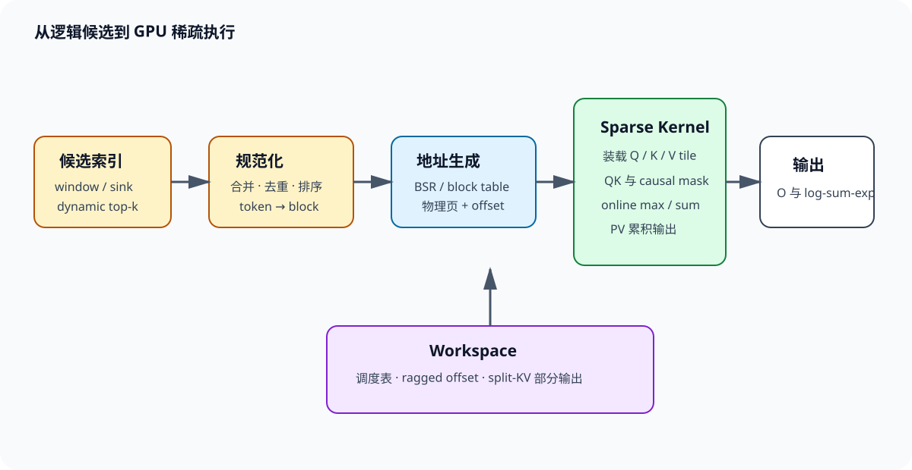

# 从索引到 Kernel

动态稀疏 attention 的最后一步，经常被画成 `gather → attention`。真正执行时，这个箭头里面塞着一条小型编译流水线：候选索引先合并、去重与排序，逻辑位置再映射到物理页，调度器按行长生成任务，kernel 逐 tile 装载 K/V 并维护 online softmax，必要时还要归并 split-KV 的部分输出。任何一段失去规则性，理论省下的乘加都会在访存或调度里还回去。

*图 1：候选从逻辑位置变成 BSR/页表任务，经过地址生成和连续 KV 装载，在片上完成 online softmax；workspace 同时承载调度表与 split-KV 部分结果。*

## 1. 候选索引的规范化

### 1.1. 合并、去重、排序

设动态选择集合为 $D_i$，局部窗口为 $W_i$，固定 sink 为 $A_i$，真正的候选是

$$
S_i=\operatorname{unique}(D_i\cup W_i\cup A_i). \tag{1}
$$

去重关系到数值正确性。同一个 key 若出现两次，softmax 分母会把它计算两遍，输出也获得双倍路径。简单覆盖、保留最大路由分数和累加分支 gate 的语义不同，必须在 attention 前确定。

按物理地址排序通常改善读取，但会改变浮点归约顺序。高精度参照允许微小误差，不能允许候选丢失。索引还要验证范围、因果性与 batch 所属；错误页号比普通数值误差危险，因为它可能读取另一请求的缓存。

### 1.2. 从 token 到 block table

元素索引可以直接 gather，也可以扩张到块：

$$
b_j=\left\lfloor j/B_k\right\rfloor. \tag{2}
$$

扩张后再次去重，生成每个 query block 的 `indptr` 与 `indices`。例如 token 候选 $(1,2,63,64,65,127)$，$B_k=64$，对应块 $(0,1)$；6 个逻辑候选变成最多 128 个物理 token。聚集候选非常划算，分散候选则可能放大读取。

Paged KV 再做一次映射。逻辑块号查请求的 block table 得到物理页，页内 offset 保留。页长与 kernel KV tile 不相等时，一个页可能拆成多个 tile，或多个小页组合成一次工作。FlashInfer 用 BSR 抽象统一页表与 block-sparse attention，`indptr` 表示行边界，`indices` 表示非零列块。

### 1.3. 一次具体的索引转换

假设 batch 中第 2 条请求有 10 个逻辑页，页长 16，物理页表为 $(41,7,83,19,\ldots)$。selector 返回 token $(18,23,70,71,72)$，先除以 16 得到逻辑页 $(1,4)$，页内位置分别是 $(2,7)$ 与 $(6,7,8)$；查表后物理页是 7 与 `pageTable[4]`。若 kernel 使用 64-token KV tile，还要按逻辑顺序组合四个页，不能把物理页号直接整除，因为逻辑相邻页在物理内存中可能完全分散。

这说明索引至少包含三套坐标：token 位置负责因果与位置编码，逻辑页表示请求内顺序，物理页用于取地址。按物理地址排序能改善访存，却不能拿物理顺序计算 RoPE 或 causal mask。实现常把物理地址和逻辑位置成对打包，避免热循环反复查表。

索引规范化应独立测试。随机生成 page table、重复 token、跨页候选和未写满尾页，用 CPU 参考构造最终位置集合；GPU 结果逐项比较。attention 输出偶尔会掩盖索引错误，例如两个 value 恰好相似，单独比较索引更容易定位。

## 2. gather 还是直接稀疏读取

### 2.1. gather 的双重流量

先把随机候选 gather 到连续 scratch buffer，随后运行 dense tile，优点是矩阵计算规则。代价是 K/V 先从原 cache 读一次、写入 scratch，再被 attention 读一次。若每 token 的 K/V 共 $B_{kv}$ 字节，候选 $k$，gather 路径额外流量近似

$$
T_{gather}\approx 2kB_{kv}, \tag{3}
$$

其中一次写、一次再读，尚未计原始读取。低 batch decode 本就受带宽限制，这份复制可能抵消稀疏收益。

直接 sparse-load 避免中间缓冲区，但地址离散会降低事务利用率。选择取决于候选是否能在多个 heads、多个 query 或多层复用。只用一次的候选通常偏向直接读；一个 GQA 组共同使用、相邻 query 共享的候选更可能值得 gather。

### 2.2. coalescing 的实际含义

假设一次内存事务取 128 字节，warp 需要 32 个 BF16 标量共 64 字节。连续地址可能由一次事务覆盖；32 个线程若落在 32 个随机 cache line，理论有效字节仍是 64，实际搬运却可接近 4096 字节，利用率只有 $64/4096=1.5625\%$。cache 命中会改善结果，但不能假定长 KV 全在 cache 中。

块索引把同一页内 K/V 连续交给 warp 或 TMA。候选排序后，相邻块还能复用页表和 L2 line。profile 中应同时看请求字节、DRAM 实际字节与 L2 hit rate；只按张量尺寸估算，会遗漏事务放大。

### 2.3. gather 的盈亏平衡

设直接稀疏读取的有效带宽为 $B_s$，连续 scratch attention 的带宽为 $B_c$，候选 K/V 数据量为 $T$。直接路径约为 $T/B_s$；gather 除原始读取外还要写入 scratch、随后再读，近似 $3T/B_c$。单次使用时，只有 $B_c>3B_s$，复制才可能靠更高连续带宽回本。

若 scratch 被 $r$ 个 query heads 复用，额外复制被摊薄，近似系数从 3 变为 $1+2/r$。$r=8$ 时为 1.25，GQA 共享候选便可能改变结论。复用要求 heads 使用同一 token 顺序、dtype 与位置变换；每个 head 各做一遍 gather 没有摊销。

scratch 还占 workspace，并引入生产者—消费者同步。小 batch 下，单独 gather kernel 的启动时间明显，可以把地址读取和 K/V 搬运融合进 attention。是否融合应由计时决定，源码里少一个 kernel 不代表数据少走一次 HBM。

## 3. 稀疏 tile 与 online softmax

### 3.1. 一个 query tile 的循环

kernel 为 $B_q$ 个 query 分配一个 CTA，读取其候选 KV blocks。每轮计算局部 logits

$$
Z_b=Q_{tile}K_b^\top/\sqrt d+M_b, \tag{4}
$$

随后得到局部最大值 $m_b$、局部指数和 $l_b$ 与 $P_bV_b$。累计状态 $(m,l,o)$ 用

$$
m'=\max(m,m_b),\quad
l'=e^{m-m'}l+e^{m_b-m'}l_b, \tag{5}
$$

$$
o'=e^{m-m'}o+e^{m_b-m'}P_bV_b. \tag{6}
$$

所有候选处理完再输出 $o'/l'$。这与 FlashAttention 的 IO-aware tiling一脉相承，区别在于 KV tile 列表来自稀疏索引。Triton 官方 fused-attention 教程也把行最大值、归一化和矩阵乘融合在 kernel 内。

### 3.2. mask 必须在指数之前生效

最后一页含无效槽位，prefill tile 还可能穿过 causal 对角线。它们的 logits 必须设为负无穷，再参与局部最大值与指数和。先算 softmax、后把输出清零会污染分母。候选为空时不能得到 $0/0$；系统应保证 local/sink fallback，或显式返回定义好的零输出并记录异常。

重复 block 若未清理，也会改变分母。跨分支需要不同 gate 时，更稳妥的方式是各分支独立 softmax 后门控合并；把重复 token 塞进同一个 softmax 再乘 gate，通常不等价。

### 3.3. split-KV 怎样严格归并

设两个 split 的状态为 $(m_1,l_1,o_1)$ 与 $(m_2,l_2,o_2)$，取 $m=\max(m_1,m_2)$：

$$
l=e^{m_1-m}l_1+e^{m_2-m}l_2,\qquad
o=e^{m_1-m}o_1+e^{m_2-m}o_2. \tag{7}
$$

最终输出为 $o/l$。$o_s$ 必须是未除以 $l_s$ 的累积量；若各 split 先归一化，再直接求和，会给不同分母相同权重。

手算两个 split：$(m_1,l_1,o_1)=(2,3,6)$，$(m_2,l_2,o_2)=(1,4,8)$。取 $m=2$，得到 $l=3+4/e\approx4.472$，$o=6+8/e\approx8.943$，输出约 2.0。分别归一化后相加会得到 $6/3+8/4=4$，显然不对。接口返回 log-sum-exp，既能支持归并，也供 backward 重建概率。

## 4. tile 利用率与 roofline 手算

### 4.1. 逻辑 FLOPs 和物理 FLOPs

单个 query head 对 $k$ 个 token 的 QK 与 PV 约需 $4kd$ FLOPs。若 $k=2048,d=128$，约为 $1{,}048{,}576$ FLOPs。块长 64，逻辑候选扩张后实际读取 2560 token，物理 FLOPs 变成约 $1{,}310{,}720$，tile 填充效率为 $2048/2560=80\%$。

tensor core 利用率还受 $B_q$ 影响。prefill 的 $B_q=64$ 可形成大矩阵，decode 的 $B_q=1$ 很难独自填满设备；continuous batching 会把不同请求的 query/head 组合起来。若候选数差异很大，一个 CTA 处理长行，其余 CTA 提前结束，SM active 时间仍被最长行决定。

### 4.2. 带宽上限

假设 BF16、一个 KV head 的 $d=128$，每 token 的 K+V 为 $128\times2\times2=512$ 字节。读取 2048 token 约 1 MiB。GPU 可持续带宽若为 3 TB/s，理想下限约

$$
t_{mem}=\frac{1\ \mathrm{MiB}}{3\times10^{12}}\approx0.35\ \mu s. \tag{7}
$$

这是单 head 单 query 的纯搬运下限，没有页表、索引、启动、softmax、cache miss 和并发竞争。若随机事务让有效带宽只有峰值的 20%，下限变成约 $1.75\ \mu s$。因此少读 4 倍 KV，并不自动得到 4 倍加速。

算术强度可粗写为

$$
I\approx\frac{4kd}{2kd\,s}=\frac{2}{s}, \tag{8}
$$

$s$ 是每元素字节数，BF16 时约 1 FLOP/byte。decode 明显偏带宽侧；prefill 中同一 K/V tile 被多个 query 复用，强度随 $B_q$ 上升，更可能进入计算受限区。稀疏 kernel 必须分别测两个阶段。

### 4.3. 固定成本要放回总时间

端到端时间可写成

$$
t_{total}=t_{route}+t_{topk}+t_{index}+t_{attn}+t_{reduce}+t_{launch}. \tag{9}
$$

假设 dense attention 为 100 微秒，稀疏 attention kernel 降到 25 微秒，但路由 12、top-k 10、索引 8、归并 5、额外启动 6 微秒，总计 66 微秒，加速只有 $100/66\approx1.52$ 倍，不是 kernel 的 4 倍。若排序在 CPU 引入同步，代价还会更高。

长度扫描可以找到交叉点。短上下文中路由与启动近似固定，dense FMHA 更快；长度增长后 KV 读取占主导，稀疏路径才拉开差距。benchmark 至少覆盖多个 batch、query 长度、KV 长度、候选率与候选聚集度，并在同一计时边界内包含索引。

roofline 还要使用实测可持续带宽与算力，不用厂商峰值代替。ECC、功耗、并发 kernel 与显存频率都会改变上限。先用简单 memcpy 和 GEMM 在同一进程测基线，再判断 sparse kernel 离机器屋顶有多远。

## 5. ragged batch、调度与 workspace

### 5.1. 为什么需要 plan/run

服务 batch 每步变化，但同一步的所有层通常共享请求长度与页表形状。Inspector-executor 模式先 `plan()`：读取长度、`indptr` 和容量上限，决定 CTA 任务、split 大小与部分输出地址；各层再 `run()`。规划成本跨层摊销，也让运行 kernel 保持简单。

FlashInfer 的 wrapper 要求调用方提供浮点与整数 workspace。CUDA Graph 捕获时地址必须稳定，路由索引仍由调用方维护生命周期。容量按最大 batch、最大 row blocks 与 split 数预留；超限时应拒绝、重新规划或进入明确 fallback，不能越界写入。

### 5.2. split-KV 与归并

一条超长候选行可以拆给多个 CTA，每个 CTA 输出局部 $(m_s,l_s,o_s)$，再用式 (5)(6)相同的重标定规则归并。这样提升并行度，却增加 workspace、第二个 kernel 和输出读写。短行无需 split，强行拆分只会增加固定成本。

ragged batch 的调度目标是减少 wave quantization。可按候选块数分桶，或让 persistent CTA 从全局队列领取下一项。分桶需要排序与恢复原顺序；队列方式带来原子竞争。profile 要看每 CTA 工作量分布，而非只看总 blocks。

### 5.3. workspace 不是免费内存

若 batch 有 1024 行，每行最多 128 个候选块，32 位 indices 约占 512 KiB；`indptr` 很小，split-KV 部分输出更大。假设每行拆 8 份、32 heads、head dimension 128，以 FP32 保存 $o_s$，仅部分输出就是 $1024\times8\times32\times128\times4=128$ MiB，尚未加入 $m,l$ 和调度表。

实现会按形状减少 split，或让多个阶段复用缓冲区。容量规划应给出上界与常态用量，不能把预留 workspace 排除在显存占用之外。多模型共卡时，过大的常驻 workspace 会挤压 KV cache，间接降低并发。

CUDA Graph 中，计划状态与调用方路由存储的生命周期不同。异步 `run()` 未结束就覆写 indices，会出现偶发错读。双缓冲或事件同步能解决，代价是更多内存或等待。压力测试要在高并发下反复更新索引，单步正确性不足以发现生命周期错误。

## 6. 反向、fallback 与诊断

### 6.1. 训练 backward

前向保存 log-sum-exp 与候选索引，backward 可重算局部 logits，无需保存 attention 矩阵。$dQ$ 由一个 query tile 独占较容易；$dK,dV$ 会被多个 query tiles 累加。原子加实现简单但顺序不确定，反排为 KV-centric 任务可减少冲突，却要构造转置索引。

候选若来自 hard top-k，attention backward 只覆盖选中边，selector 的梯度由蒸馏、代理梯度或其他目标负责。反向重新 top-k 可能因浮点并列得到另一集合，所以应保存 forward indices，或保证完全确定性重算。

$dK,dV$ 的归约策略可以用一个小例子理解。四个 query tiles 都选中同一 KV block，query-centric backward 会让四个 CTA 同时写这块梯度；使用原子加无需额外索引，但热点严重。KV-centric backward 先构造反向邻接表，让一个或少量 CTA 收齐四份贡献，写入更规则，却增加一次稀疏转置和列表读取。候选复用越高，后者越可能值得。

activation checkpointing 会重新执行前向局部计算。保存 `indices`、每行 log-sum-exp 与随机状态，便可重算 QK 和概率；若连索引也重算，top-k 并列、FP8 舍入或 selector dropout 都可能换边。梯度检查要覆盖候选边界接近、重复索引以及一个 KV block 被大量 query 共享的情况。

训练速度还受参数梯度同步影响。稀疏 attention 减少本层计算后，all-reduce、MLP 与优化器占比上升，kernel 的局部加速会被 Amdahl 定律压缩。报告 forward/backward kernel、完整层和完整训练 step 三个层级，才知道优化落到了哪里。

### 6.2. fallback 是正式路径

候选块占比接近 100% 时，dense FlashAttention 往往更快；FlashInfer 文档也建议已知稠密模式直接选择 dense FMHA。其他 fallback 条件包括 head dimension 不支持、block size 未编译、workspace 不足、空候选和设备架构不匹配。

每种 fallback 都记录原因、长度、batch 与耗时。线上只有总吞吐时，少数回退会被平均值遮住，却主导 P99。正确性测试还要强制触发每条回退，确认输出、mask 和 cache layout 与稀疏路径一致。

fallback 切换也有状态问题。sparse path 使用排序后的页表，dense path 可能使用原请求页表；二者必须共享相同的有效长度、RoPE 位置和 prefix 映射。若回退前已经 gather 出临时 KV，dense kernel 不应误把 scratch 当完整缓存。最安全的接口让两条路径都从同一逻辑 cache 描述开始，各自生成执行计划。

接近交叉点时可以引入迟滞：进入 sparse 的阈值与退回 dense 的阈值略有差别，避免 batch 形状轻微波动导致每步重编计划。计划缓存的 key 至少包含 GPU 架构、dtype、head dimension、块长、GQA 比例和容量档位，少一个维度都可能复用到不兼容 kernel。

### 6.3. profile 从哪里下手

第一组指标看访存：DRAM bytes、实际带宽、L2 hit rate、load efficiency。字节远高于理论值，通常是随机事务、重复候选或 gather scratch。第二组看计算：tensor core active、achieved FLOPs、tile 有效比例。带宽不高、tensor core 也低，常见原因是形状太小或控制流碎片。

第三组看调度：SM occupancy、active warps、CTA duration 分布与尾部 wave。少数 CTA 极慢说明 ragged 行不均；大量短 kernel 则说明融合不足或 plan 被重复执行。第四组看固定成本：top-k、排序、去重、页表构造和 workspace 清零。attention kernel 很快而端到端不快，问题通常藏在这里。

profile 前先稳定测量环境。GPU 锁定时钟或至少记录频率，预热 JIT 与 autotune，排除首次分配，把 H2D 数据准备移出计时边界；随后用 GPU event 测设备时间，用服务端时钟测端到端延迟。两组数字不同很正常，差值正好暴露 CPU 调度、同步和队列等待。

候选分布也要固定保存。随机生成同一稀疏率的 mask，无法复现真实 selector 的局部聚集、热门页与长尾行。可匿名保存每行块数、块间距、页复用次数和 GQA 并集大小，再生成具有相同统计量的合成索引。这样不保留正文，也能把线上布局带回 microbenchmark。

比较实现时统一输出精度、mask 语义与 workspace。一个内核用 FP8 KV、另一个用 BF16，或者一个包含 top-k、另一个接收现成 indices，吞吐数字没有可比性。warm-up、迭代次数、同步位置和统计量用 median 还是 P99 也应固定。

一次完整诊断应在同一批输入上依次记录 dense FMHA、只运行索引、固定候选 sparse kernel 和端到端路由。固定候选正确而动态路径慢，优化索引；固定候选也慢，再看块长、地址与调度；数值错误则先缩到单 batch、单 head、少量 blocks，与朴素 gather attention 比较每轮 $m,l,o$。

### 6.4. 一棵 profile 决策树

先比较理论 K/V 字节与 DRAM 实测字节。实测高很多，检查重复索引、页扩张、事务利用率和 scratch copy；两者接近而带宽低，查看并发度、行长分布和 cache/TLB stall。带宽接近硬件上限，说明处在 roofline 的内存侧，继续优化 tensor core 收益有限。

DRAM 字节不高、耗时仍长时，看 kernel 构成。top-k 或 index 占比高，考虑跨 head/层复用、融合或更粗粒度；归并占比高，减少 split；主 kernel tensor core active 低，检查 $B_q,B_k,d$ 对齐和块内有效比例。

端到端比 kernel 慢很多时，检查 CPU—GPU 同步、动态分配、plan 次数、CUDA Graph miss 与 fallback。P50 正常、P99 突增时，按候选块数、物理页数、最长行和回退原因切片。稀疏率相同的请求可以有完全不同的物理分散度，候选页数往往更能解释尾延迟。

最后做数值对照：固定同一候选，以 CPU FP64 或 dense mask 为参考；分别比较 logits、每 tile 最大值、log-sum-exp、输出和梯度。候选不同时先停在索引层，不把路由误差归咎于 softmax。算法、布局与数值三类问题由此分开。

### 6.5. 正确性用例矩阵

最小张量用例覆盖 $N=1$、候选为空、仅一个候选、候选等于全长和重复索引；边界长度覆盖 page size 前后各一项，如 15、16、17；块边界覆盖 query tile 与 KV tile 的非整倍数。数值用例加入极大正负 logits、全部相等 logits、FP8 scale 边界与全 mask 行。

布局用例覆盖连续 KV、随机物理页、共享 prefix、同逻辑页映射到高编号物理页，以及 batch 中一长多短。GQA 用例分别检查每个 query head 独立候选和 KV-head 组共享候选。split-KV 从 1、2、8 份变化，归并结果与不 split 参考比较。

训练用例除输出外还比较 $dQ,dK,dV$，并重复运行检查非确定性范围。多个 query 指向同一 KV block 能压测原子归约；forward 保存索引后修改 selector 参数，可以验证 backward 没有错误重算另一集合。fallback 用例强制触发每个原因，并确认回退计数准确。

性能回归与正确性回归分开设阈值。输出误差通过，不代表没有偷偷 dense fallback；速度通过，也可能来自漏读候选。CI 可以在小 GPU 上跑形状和数值，目标 GPU 定期跑带宽、TFLOPs、workspace 与 P99。每次修改索引格式、tile 或调度器，都同时更新两组基线。

### 6.6. 从 Triton 原型走到生产 kernel

Triton 很适合先验证数据流。program id 映射到 query row 或 query tile，从 `indptr[row]` 到 `indptr[row+1]` 遍历 block IDs；`tl.load` 根据物理页和 lane offset 读取 K/V，逐块更新 $m,l,o$。原型先保证任意 ragged 索引都正确，再逐步加入固定块长、`tl.multiple_of`、向量化载入和 autotune 配置。过早假定对齐，错误通常只在尾页或特定物理地址出现。

编译期常量包括 head dimension、$B_q,B_k$、dtype 和是否 causal。候选数与页表属于运行时。若把最大候选数编进 kernel，会为每个容量档位生成不同版本，减少循环分支，也增加编译缓存和分发复杂度。版本数量过多时，JIT 首次延迟和二进制体积都会成为服务问题。

生产实现还会利用异步搬运、warp specialization、TMA 与 tensor core pipeline。FlashAttention-3 在 Hopper 上把数据搬运、矩阵乘与 softmax 交错；稀疏索引使下一 tile 地址不再是简单递增，预取必须提前解析 block ID。索引依赖链太长时，tensor core 等待地址，理论流水线无法填满。可在一个 warp 预取索引和页表，另一些 warp 计算当前 tile，但寄存器与 shared memory 分配要重新平衡。

FlashInfer 的 inspector-executor 把动态调度移到 plan 阶段，运行 kernel 消费已经整理好的任务。Triton 原型若每个 program 自己扫描长 `indptr` 决定工作，会重复解析并造成负载不均。两者比较时，Triton 的索引准备时间也要计入；反过来，FlashInfer 的 plan 若能跨几十层复用，应按实际复用次数摊销。

从原型升级的顺序可以保持简单：先固定候选验证 online softmax，再加入随机物理页，随后加入 ragged batch 和 split-KV，最后接动态 selector 与 CUDA Graph。每一步都保存上一版作为正确性参照。一次把页表、量化、路由和异步流水全部接入，出现错误时几乎无法判断是哪一层坐标或状态出了问题。

最终接口应把语义参数与性能提示分开。因果 mask、有效长度、候选集合和位置属于语义，后端不能静默修改；tile、split 数、workspace 档位和调度策略属于性能选择，可以 autotune。这样更换 Triton、CUDA/CUTLASS 或其他后端时，模型看到的邻接图保持不变。

autotune 的缓存也要绑定输入分布。只用平均行长选出的配置，可能在长尾 batch 上造成 workspace 暴涨或最后一波空转。候选数的均值、P95、最大值和物理页分散度都可进入配置键；配置数量失控时，再按少数容量档位合并。线上发现新形状时先落到安全配置，后台测完再更新缓存，不能让用户请求承担长时间编译。

跨 GPU 架构搬运配置尤其危险。相同 tile 在 Ampere、Hopper 与 Blackwell 上面对不同的 shared memory、异步复制和 tensor core 比例，旧机器的最优值可能让新机器寄存器溢出。发布产物应保留架构标识、编译器版本和关键生成参数，profile 才能与实际二进制对应。

## 7. 一次 64K 上下文的完整核算

### 7.1. 从页级候选到 tile 任务

设单条请求已有 65536 个 token，page size 为 16，因此页表含 $65536/16=4096$ 页。模型采用 8 个 KV heads、32 个 query heads，head dimension 为 128，KV 保存为 BF16。selector 为每个 KV head 选择 256 页，并额外保留最近 16 页；去重后假设平均 264 页，其中 8 页同时被动态选择与窗口命中。

每个 KV head 的物理候选 token 为 $264\times16=4224$。若 kernel 的 KV tile 为 64 token，需要把逻辑相邻的 4 页编成一项；随机远程页无法合并，只能各自形成带 mask 的 64-token tile。假设 16 个窗口页合成 4 个完整 tiles，剩余 248 个动态页经过排序后有 96 组四页连续、40 组两页连续、72 个孤立页。对应任务数为

$$
4+96+40+72=212\ \text{KV tiles}. \tag{10}
$$

这些 tile 的物理计算容量是 $212\times64=13568$ token，而真实候选只有 4224 token，tile 有效率仅 $31.13\%$。这组数字说明 page size 16 与 $B_k=64$ 的组合对分散候选很不友好。若后端支持 $B_k=16$，任务数升到 264，索引与启动循环更多，物理 token 却降到 4224；究竟哪边快，要看小 tile 的 tensor core 利用率与地址开销。

### 7.2. HBM 字节与计算量

每个 token、每个 KV head 的 K+V 字节为

$$
B_{kv}=2\times128\times2=512\ \text{bytes}. \tag{11}
$$

理想页级读取为 $4224\times512=2{,}162{,}688$ 字节，约 2.063 MiB。8 个 KV heads 合计约 16.5 MiB。若 $B_k=64$ 路径真的把掩掉槽位也从 HBM 读入，物理读取变成 $13568\times512\times8\approx53$ MiB；若 kernel 按页内 mask 只发射有效载入，DRAM 可以接近 16.5 MiB，但矩阵 tile 仍可能为无效槽位发射乘加。

稠密 decode 读取量为 $65536\times512\times8=256$ MiB。于是逻辑压缩率为 $256/16.5\approx15.5$ 倍，粗 tile 全读后的物理压缩率只有 $256/53\approx4.83$ 倍。索引表每个候选页用 4 字节，$264\times8\times4=8448$ 字节，`indptr` 与页内 mask 也只有几十 KiB；索引容量很小，随机索引造成的事务效率才是主要问题。

32 个 query heads 共享 8 个 KV heads，即每组 4 个 query heads。对 4224 token 做 QK 与 PV，每 query head 约 $4\times4224\times128=2{,}162{,}688$ FLOPs，32 heads 共约 69.2 MFLOPs。若物理 tile 全算 13568 token，则升到约 222.3 MFLOPs。decode 的算术量仍不大，读取模式和 batch 并发决定时间。

### 7.3. workspace 与 split-KV

假设每个 KV head 的 212 个 tiles 拆成 4 个 splits，每个 split 处理约 53 tiles。32 个 query heads 分别输出局部状态，$o_s$ 用 FP32 保存，部分输出占

$$
4\times32\times128\times4=65536\ \text{bytes}. \tag{12}
$$

每个 split/head 还保存 $m_s,l_s$ 两个 FP32，总计 $4\times32\times2\times4=1024$ 字节。单请求约 65 KiB；batch 64 时约 4.06 MiB。再加入索引、任务描述和双缓冲，预留 6–8 MiB 比只按部分输出计算更稳妥。

四个 splits 的归并以式 (7)逐项重标定。举一组 head 的局部最大值 $(8,7,9,6)$ 与指数和 $(12,18,10,20)$，全局最大值为 9，合并分母为

$$
l=e^{-1}12+e^{-2}18+10+e^{-3}20\approx17.84. \tag{13}
$$

每份 $o_s$ 按同样系数缩放后求和，再除以 17.84。若某个 split 没有有效页，它的 $l_s=0$，不能让未初始化的 $m_s$ 参与最大值；任务规划阶段可以省掉空 split。

### 7.4. block size 与候选率的交叉点

下面是一组用于说明决策方法的示例表，时间单位为微秒，包含索引规范化与 attention，不代表任何固定 GPU 的通用结论：

| 候选率 | $B_k=16$ | $B_k=32$ | $B_k=64$ | Dense FMHA | 选择 |
|---:|---:|---:|---:|---:|---|
| 3.1% | 42 | 35 | 38 | 118 | 32-token block |
| 6.25% | 55 | 46 | 44 | 118 | 64-token block |
| 12.5% | 78 | 66 | 59 | 118 | 64-token block |
| 25% | 126 | 101 | 88 | 118 | 64-token block |
| 50% | 214 | 162 | 133 | 118 | Dense |

小候选率下，$B_k=16$ 少做无效乘加，却受索引循环和小 tile 限制；候选率上升后，$B_k=64$ 更容易利用 tensor core；到 50% 时，稠密内核的连续访问胜过稀疏路径。若真实候选高度分散，64-token 列可能整体上移，交叉点更早出现。调度表要以实测的候选率和聚集度查找，不能只抄表中数字。

### 7.5. CUDA Graph 的地址稳定条件

图捕获期间，Q/O、KV cache 池、workspace、`indptr`、`indices` 和任务计数器的设备地址都要保持稳定；内容和有效长度可以在 replay 前原地更新。grid shape 若固定为容量上限，kernel 读取有效任务数跳过多余 CTA。重新分配 indices、扩容 workspace 或换到另一份页表数组，都会破坏捕获时记录的地址。

双缓冲路由表时，可预先捕获两张图，分别绑定 buffer A 与 B；第 $t$ 步运行 A 时，另一个 stream 准备 B，第 $t+1$ 步交换。事件必须保证写 B 完成后才 replay，且 A 的 attention 完成后才能覆写。只交换 Python tensor 引用没有用，图中保存的是底层设备指针。

容量越界需要退出图模式，扩容并重新捕获。为了避免某条超长请求频繁破图，可按候选容量设置 128、256、512 页等档位，每档拥有固定 workspace 与图。请求进入最小可容纳档位，实际 `nnz` 仍由计数器决定。

### 7.6. 基准协议与三类故障

基准固定 GPU 型号、驱动、编译器、时钟策略、dtype、head 数、page/block size 与候选分布。JIT、autotune 和 cache 预热后，先运行不少于 100 次 warm-up，再记录至少 1000 次 GPU events；同时保存 median、P95、P99。端到端计时包括 selector、top-k、索引、plan、kernel 与归并，kernel-only 结果另列。dense 与 sparse 使用相同输入、mask、KV 布局和输出精度。

故障一表现为 DRAM bytes 比式 (11)高三倍、tensor core active 尚可。进一步发现候选先 gather 到 scratch，随后又被 attention 读取，且每个 query head 各复制一次。修复方向是让 GQA 组共享 scratch 或直接 sparse-load；继续调 tile 无法消掉复制流量。

故障二表现为 DRAM 带宽与 tensor core 都低，CTA duration 的 P99 是中位数十倍。候选统计显示多数行 32 blocks，少数行 800 blocks，静态一行一 CTA 让最后一波只剩几个 SM 工作。应拆长行、使用 persistent queue 或按行长分桶。提高 occupancy 参数可能增加更多空闲 warps，解决不了任务粒度不均。

故障三表现为 kernel-only 稳定在 45 微秒，端到端 P99 却偶发超过 2 毫秒。trace 显示候选数越过 workspace 档位后触发同步分配，并退出 CUDA Graph；偶发 dense fallback 又重建另一份 plan。修复方式是扩大常用档位、异步准备下一档 workspace，并把回退原因纳入调度。单看 kernel profile 完全看不到这类服务故障。

三类故障对应三条证据链：字节异常查数据路径，CTA 长尾查调度，端到端尖峰查图捕获、分配与 fallback。先用计数器确认类别，再进入源码，比看到「稀疏 kernel 慢」便重写矩阵乘更有效。

### 7.7. 同一案例中的 backward 冲突开销

把上述 64K 案例扩成训练 prefill。假设 query tile 为 64 token，一个训练 chunk 有 4096 个 query，因此每个 head 有 64 个 query tiles。若每个 query tile 都选择 264 页，热门的 16 个局部页会被多数相邻 query 重复访问，远程页则较分散。$dQ$ 的归属清楚：一个 CTA 处理一个 query tile 的全部候选，累积后写回自己的 64 行，不与其他 CTA 冲突。

$dV$ 与 $dK$ 的方向相反。同一个热门 KV page 可能收到 64 个 query tiles 的贡献；若每个 tile 直接对 BF16/FP32 梯度做原子加，单页包含 $16\times128=2048$ 个元素，64 份贡献意味着最多 $131072$ 次热点原子更新，K 与 V 各发生一次。远程冷页只被少数 tiles 选中，原子冲突小，统一采用一种策略会让热门页决定尾部时间。

两阶段归约可以先让每个 query CTA 把局部 $dK,dV$ 写入 workspace，再按 KV page 分组求和。若所有候选都保存局部梯度，容量非常大：64 query tiles、264 pages、16 tokens、128 维、K/V 两份 FP32，约

$$
64\times264\times16\times128\times2\times4\approx264\ \text{MiB/head}. \tag{14}
$$

显然不能照此物化。实用做法是按 KV block 分片，让一组 CTA 在片上或小型 partial buffer 中归约；或者只对高复用热门页走 KV-centric 路径，冷页继续原子加。前向统计的 page reuse count 正好可用于选择路径。

混合方案设阈值 $r_0$：复用次数 $r_b<r_0$ 的 block 直接原子累积，$r_b\ge r_0$ 的 block 写入按固定 split 数组织的 partial buffer。阈值太低会扩大 workspace 与归并开销，太高则热点原子仍然串行。对候选复用分布做扫描，可以画出 atomic time、reduce time 与 workspace 的三条曲线，再选交叉点。

$dQ$ 虽无写冲突，也可能因候选行长不同而负载不均；$dK,dV$ 的反向邻接表则会改变不均衡方向，热门页行很长。forward 与 backward 不应共用一套静态分桶。基准分别记录 $dQ$ kernel、$dK/dV$ kernel、稀疏转置、归并和 workspace 清零，才能看清训练反向究竟卡在矩阵乘、原子还是元数据。

数值上，原子加的顺序随调度变化，重复运行会出现末位差异；分段归约若固定树形顺序，可以提高确定性。验收同时给相对误差与重复运行方差。为了逐 bit 一致而把所有贡献串行，会牺牲大量性能；完全不约束顺序，又可能让低精度累积在长序列上漂移。常用折中是局部 FP32 累积、固定 split 内顺序，split 之间再做少量归并。

反向开销还应随 block size 一起重算。较大的 block 减少反向索引项，却让热门区域带入更多无效梯度乘加；较小的 block 降低填充，又扩大转置表和调度任务数。前向最优块长未必也是训练总步的最优块长。

## 参考资料

- [FlashAttention](https://arxiv.org/abs/2205.14135)
- [FlashAttention-2](https://arxiv.org/abs/2307.08691)
- [Triton Fused Attention 教程](https://triton-lang.org/main/getting-started/tutorials/06-fused-attention.html)
- [FlashInfer Attention API](https://docs.flashinfer.ai/api/attention.html)
- [FlashInfer Block Sparse 实现](https://github.com/flashinfer-ai/flashinfer/blob/main/flashinfer/sparse.py)
