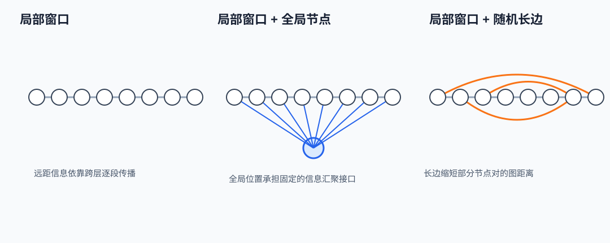

# 静态稀疏: Longformer, BigBird 与滑动窗口

标准自注意力让长度为 $n$ 的序列产生一个 $n\times n$ 的分数矩阵. 序列长度翻倍时, 分数数量变成四倍; 即使实现没有把完整矩阵写回显存, 点积和 softmax 仍然要处理平方级的候选关系. 长文档里真正有用的关系往往只占其中一部分: 邻近 token 需要稳定交换局部信息, 少数任务相关位置需要跨越全文, 其余远距离配对未必值得逐层逐头计算. 静态稀疏注意力把这项观察写进拓扑: 在看到输入内容以前, 先规定每个查询可以访问哪些键.

[Longformer](https://arxiv.org/abs/2004.05150) 把局部滑动窗口, dilation 和少量任务驱动的 global attention 组合起来, 面向长文档编码任务. [BigBird](https://arxiv.org/abs/2007.14062) 把稀疏图拆成局部边, 随机边和全局边, 并分析这种图在表达能力上的条件. 两者都把全连接注意力改成结构化子集, 但不能只用「从平方降到线性」概括. 哪些边留下, 信息经过几层才能到达远处, 全局节点承受多少流量, 稀疏布局能否映射到高效 kernel, 都会决定节省是否成立.

**静态稀疏的核心约束是先固定候选边, 再在候选边内部做内容相关的 softmax.** 它仍然计算 QK 分数, 仍然归一化并混合 Value; 被取消的是掩码外的配对, 不是注意力机制本身.

> 图 1: 相同的八个位置分别采用滑动窗口、全局节点和随机长边时, 候选边与跨区路径如何变化.

图 1 解析:

- 灰色短边构成固定局部窗口; 蓝色全局节点与所有位置相连; 橙色边表示预先采样并固定的跨区连接.
- 全局节点把普通位置之间的路径缩短到跨层两跳左右, 随机边只缩短它实际连接到的节点对. 两者都增加了局部窗口之外的边数.
- 图只画拓扑, 没有画 softmax 权重. 静态 mask 固定访问集合, 每条保留边的权重仍随输入变化.

## 1. 从全连接矩阵到稀疏图

**掩码精确定义了谁能读谁。**

设一层输入为 $X\in\mathbb{R}^{n\times d}$, $n$ 是 token 数, $d$ 是隐藏维度. 单个注意力头的投影为 $Q=XW_Q$, $K=XW_K$, $V=XW_V$, 其中 $Q,K\in\mathbb{R}^{n\times d_h}$, $V\in\mathbb{R}^{n\times d_v}$. 查询位置 $i$ 对键位置 $j$ 的未归一化分数为:

$$
s_{ij}=\frac{q_i^\top k_j}{\sqrt{d_h}}. \tag{1}
$$

全连接注意力允许 $j\in\{1,\ldots,n\}$. 静态稀疏注意力为每个查询位置 $i$ 指定邻居集合 $\mathcal{N}(i)$. 掩码 $M\in\{0,-\infty\}^{n\times n}$ 写成:

$$
M_{ij}=\begin{cases}
0,&j\in\mathcal{N}(i),\\
-\infty,&j\notin\mathcal{N}(i).
\end{cases} \tag{2}
$$

把式 (2) 加到式 (1), 再沿允许的键归一化:

$$
\alpha_{ij}=\frac{\exp(s_{ij})}{\sum_{t\in\mathcal{N}(i)}\exp(s_{it})},\qquad j\in\mathcal{N}(i), \tag{3}
$$

$$
o_i=\sum_{j\in\mathcal{N}(i)}\alpha_{ij}v_j. \tag{4}
$$

式 (3) 说明被保留的边仍由内容决定权重. 「静态」修饰的是集合 $\mathcal{N}(i)$, 不是权重 $\alpha_{ij}$. 同一位置在不同样本中访问的索引可以相同, 但分数和输出会随输入改变. 如果每个查询恰好保留 $m$ 个键, 分数数量从 $n^2$ 变成约 $nm$. 当 $m$ 不随 $n$ 增长时, 注意力关系数对序列长度呈线性增长.

把位置视为节点, 允许的配对视为有向边, 一层注意力只沿一条边传递信息. 经过两层后, 位置 $i$ 能接收二跳邻居的信息; 经过 $L$ 层后, 可达范围由稀疏图的 $L$ 跳邻域决定. 因而边数只回答计算量, 图直径和路径长度才回答远距离依赖需要多少层.

**线性边数不自动等于线性运行时间。**

全连接单头的 QK 点积约需 $n^2d_h$ 次乘加, AV 混合约需 $n^2d_v$ 次乘加. 若每行保留 $m$ 个位置, 两项分别变成约 $nmd_h$ 与 $nmd_v$. 注意力分数或 softmax 中间量的逻辑规模也从 $n^2$ 变成 $nm$. 投影 $XW_Q,XW_K,XW_V$ 的计算仍是 $O(ndd_h)$ 量级, 前馈网络也没有因稀疏掩码而改变.

运行时间还取决于边的排列. 连续窗口能按块读取 K 和 V, 地址规则, 数据复用较好. 任意随机边会产生 gather 和不连续访存; 如果框架先构造稠密 $n\times n$ 分数再用掩码填 $-\infty$, 算术工作一点也没有减少. 即便调用真正的 sparse kernel, 当 $n$ 较短或 $m$ 较大时, 索引处理, kernel 启动和边界填充也可能盖过少算的点积.

**复杂度结论必须同时注明「逻辑边数」与「实际执行布局」. $O(nm)$ 描述需要计算的关系, 不保证硬件以相同比例提速.** 连续块, 固定块大小和足够大的序列通常比逐元素不规则稀疏更容易兑现收益.

训练时还要保存反向传播需要的中间状态. 激活内存可随边数下降, 但 Q, K, V, 残差流和前馈层激活仍按 $n$ 增长. 推理时则要区分编码器一次性前向, causal Prefill 与逐 token Decode. Longformer 原始目标主要是编码长文档; 把同一个图直接搬到自回归 Decode, 缓存读取规律和可见方向都会变化, 不能从编码器实验直接推出生成吞吐.

### 1.1. 滑动窗口把局部性写进拓扑

**窗口宽度如何决定边数和感受野。**

对双向编码器, 设单侧半径为 $r$, 查询位置 $i$ 的局部邻居集合为:

$$
\mathcal{N}_{\mathrm{local}}(i)=\{j:1\le j\le n,\ |i-j|\le r\}. \tag{5}
$$

忽略序列两端后, 每个查询访问 $w=2r+1$ 个位置. 总边数接近 $nw$. 边界位置的邻居更少, 精确边数可按距离求和. 当 $n\ge 2r+1$ 时:

$$
|E_{\mathrm{local}}|=n(2r+1)-r(r+1). \tag{6}
$$

式 (6) 中, $n(2r+1)$ 假设每行都有完整窗口; $r(r+1)$ 正好扣除左右两端越界的边. 若 $n=8$, $r=1$, 理想数量为 $8\times3=24$, 两端各缺一条边, 所以实际有 $22$ 条. 全连接则有 $64$ 条. 这一例子很小, 但已经能区分「窗口宽度」和「单侧半径」两种容易混用的口径.

一层半径为 $r$ 的局部注意力只能读取相距不超过 $r$ 的位置. 若每层都使用同一窗口, 经过 $L$ 层后, 最远可经逐层中继到距离 $Lr$ 的位置. 对长度 $n$ 的序列, 两端发生信息交换所需的最少层数约为:

$$
L_{\min}=\left\lceil\frac{n-1}{r}\right\rceil \tag{7}
$$

式 (7) 给的是图上的最短路径下界, 不是模型一定能保真传递信息的保证. 每一跳都经过 softmax 混合, 投影, 残差和非线性, 长路径可能衰减或被其他内容干扰. 局部窗口保留了相邻结构, 代价是远距离关系从一层直达变成多层传播.

**窗口把每层成本限制为 $O(nw)$, 同时把远距离通信延迟提高到与图路径长度相关.** 只比较边数会漏掉这种层数代价.

**一个八位置手算。**

取 $n=8$, $r=1$, 只计算位置 $i=4$ 的一个注意力头. 省略位置编码, 并令 $\sqrt{d_h}$ 的缩放已经包含在分数中. 位置 4 只允许访问 $j\in\{3,4,5\}$. 假设三个分数分别为 $s_{43}=0$, $s_{44}=\ln 2$, $s_{45}=0$. softmax 分母为:

$$
Z_4=e^0+e^{\ln 2}+e^0=1+2+1=4. \tag{8}
$$

所以三个权重为:

$$
(\alpha_{43},\alpha_{44},\alpha_{45})=\left(\frac14,\frac12,\frac14\right). \tag{9}
$$

令 $v_3=(2,0)$, $v_4=(0,2)$, $v_5=(2,2)$. 逐维代入式 (4):

$$
o_4=\frac14(2,0)+\frac12(0,2)+\frac14(2,2)=(1,1.5). \tag{10}
$$

位置 1, 2, 6, 7, 8 没有参与分母, 也没有参与加权和. 即便位置 8 与位置 4 的内容高度相关, 当前层也没有计算 $q_4^\top k_8$. 因此静态窗口不会在被屏蔽的远处候选中「发现」相关项; 后续层只能通过已有路径把信息逐步传来.

再看两层传播. 第一层的位置 4 能包含位置 3 至 5 的信息. 第二层的位置 4 分别读取第一层的位置 3, 4, 5; 第一层的位置 3 已经读取位置 2, 第一层的位置 5 已经读取位置 6. 因而第二层的位置 4 最多依赖原始位置 2 至 6. 对称窗口下, 每增加一层, 理论感受野向两侧各扩展 $r$ 个位置. 残差连接使原位置表示继续存在, 但不会生成窗口外的新边.

**分块实现与边界效应。**

逐位置窗口的逻辑布局与 GPU 常见的块运算并不完全相同. 实现通常把序列分成固定大小的 block, 让一个查询 block 访问自己和相邻若干键 block. 这种 block-sparse 布局可能多算一些窗口边缘的配对, 但换来规则矩阵乘法和连续访存. 若每个 block 含 $b$ 个 token, 一个查询 block 访问 $c$ 个键 block, 每行的物理候选上限约为 $cb$, 不一定等于论文定义的精确 $w$.

padding 也会改变有效利用率. 长度不能整除 block 大小时, 末块补齐的 token 仍可能占据物理计算槽位, 随后再由 padding mask 清除. 批处理中各样本长度差异越大, 补齐损失越明显. 因此观察显存或吞吐时, 应同时记录真实 token 数, padded token 数, block 大小和窗口配置.

窗口边界还涉及方向. 双向编码任务可用 $|i-j|\le r$; causal 生成必须增加 $j\le i$, 此时邻居集合变成最近的 $r+1$ 个历史位置. 双向窗口每行约 $2r+1$ 个候选, causal 窗口每行最多 $r+1$ 个候选, 两者的边数, 可达路径和任务语义均不同. 把同一个参数名 `window_size` 放进两个实现, 数值相同也未必代表相同拓扑.

### 1.2. Longformer: 局部边, dilation 与任务全局边

**dilation 扩大跨度但留下采样空隙。**

Longformer 的局部窗口可引入 dilation. 设步长为 $\delta$, 单侧保留 $r$ 个采样位置, 邻居集合可写成:

$$
\mathcal{N}_{\mathrm{dilated}}(i)=\{i+k\delta:k\in\{-r,\ldots,r\}\}\cap\{1,\ldots,n\}. \tag{11}
$$

当 $\delta=1$ 时, 式 (11) 退回连续滑动窗口. 当 $\delta>1$ 时, 每行边数仍至多为 $2r+1$, 一层覆盖的坐标跨度则从 $r$ 增加到 $r\delta$. 代价是中间位置可能没有直接边. 例如 $r=2$, $\delta=3$, 位置 10 访问 $\{4,7,10,13,16\}$, 却不访问位置 9 或 11.

dilation 不能孤立配置. 如果所有层和所有头都使用相同 $\delta=3$, 按位置编号模 3 分组后, 边只连接同余位置, 图会分裂成三个互不连通的部分, 除非另有连续窗口或全局边连接它们. 混合不同 dilation, 保留部分非 dilation 头, 或周期性插入连续窗口层, 都能恢复局部密集性和跨同余类传播. **dilation 增加单层几何跨度, 但连通性取决于各层步长的组合, 不能只看最大覆盖距离.**

多层 dilation 的可达位置由步长组合决定. 两层步长分别为 $\delta_1$ 和 $\delta_2$, 每层单侧索引范围为 $[-r,r]$, 从位置 $i$ 可到达 $i+k_1\delta_1+k_2\delta_2$. 若 $\gcd(\delta_1,\delta_2)>1$ 且没有其他边, 仍可能保留周期性断连. 若其中一层 $\delta=1$, 局部位置至少能进入同一个连通分量, 但有限层数内是否覆盖全文仍取决于 $r$ 与层数.

**global attention 改变最短路径。**

Longformer 允许选定位置集合 $G$ 作为 global token. 普通局部查询除窗口外可以读取全局位置, 全局位置也可读取整个序列. 对称写法下, 邻居集合为:

$$
\mathcal{N}(i)=\begin{cases}
\{1,\ldots,n\},&i\in G,\\
\mathcal{N}_{\mathrm{local}}(i)\cup G,&i\notin G.
\end{cases} \tag{12}
$$

设全局位置数为 $g=|G|$. 局部边约有 $nw$, 普通位置到全局位置约有 $(n-g)g$ 条边, 全局查询到所有键有 $gn$ 条边. 去掉重复计数后, 总量仍可写成 $O(nw+ng)$. 当 $g$ 是与 $n$ 无关的小常数时, 总关系数保持线性; 若把大量位置标成全局, $ng$ 会逐渐回到平方级.

全局位置把图直径显著缩短. 普通位置 $a$ 在第一层把信息写入全局位置的表示, 普通位置 $b$ 在下一层读取更新后的全局表示, 因而任意两处通常可通过两层发生间接通信. 同一层的注意力并非顺序更新: $b$ 读取的是该层输入中的全局表示, 不能在同一层先让全局位置吸收 $a$, 再把新结果传给 $b$. 这就是为什么跨普通位置的全局中继通常至少需要两层.

global token 不是无条件的信息压缩器. 一个或少数向量要从全文混合信息, softmax 会在大量候选间竞争; 后续位置再从这些向量读取, 可能丢失精细的来源区分. 多头机制可以学习不同投影, 但全局带宽依然由 $g$, 头数和隐藏维度限制. 增大 $g$ 能提高带宽, 同时按 $ng$ 增加计算和显存.

**全局位置由任务语义指定。**

Longformer 在分类任务中可让起始分类位置使用 global attention, 使分类表示直接汇总全文. 在问答中, 问题 token 可以设为全局位置, 让文档各处与问题发生直接交互. 这种设计把任务先验写进掩码: 模型不必先通过多层局部传播才把问题带到远端段落.

任务指定也构成边界. 如果真正需要全局通信的位置没有被选中, 静态模式不会自行补边. 若训练时固定某类特殊 token 为全局, 推理输入必须保持相同语义和标记流程. 全局集合还会随样本变化, 但选择规则通常来自 token 类型或任务结构, 并非根据当前层的 QK 分数动态搜索.

从缓存看, 编码器前向没有跨请求保存 KV 的必要. 一层内部需要局部 K/V 和供全局查询读取的全部 K/V. 普通查询只消费窗口块与全局块, 全局查询则消费整个序列. 实现若为局部与全局使用不同投影参数, 还需要为相应位置计算额外的 Q, K, V 投影; 这部分为 $O(nd)$ 或 $O(gnd_h)$ 中的常数项, 不改变边数阶数, 却会影响 kernel 数量和内存布局.

**Longformer 的全局性来自被指定的位置和双向全局边, 不是局部窗口自然变成了全连接.** 任务收益依赖全局位置是否与信息汇聚需求一致.

## 2. BigBird: 局部, 随机与全局三类边

**块级稀疏图的组成。**

BigBird 把序列划分为 block, 再为每个查询 block 分配三类键 block. 局部边连接相邻 block, 保留邻域连续性; 随机边连接若干远处 block, 缩短典型路径并增加跨区域覆盖; 全局边让少数 block 与全部 block 互连. 若每个 block 含 $b$ 个 token, block 数为 $N=\lceil n/b\rceil$, 每个查询 block 访问 $c$ 个局部 block, $s$ 个随机 block 和 $g_b$ 个全局 block, token 级分数上限约为:

$$
|E|\lesssim N(c+s+g_b)b^2+g_bN b^2. \tag{13}
$$

用 $n\approx Nb$ 代换, 式 (13) 为 $O\bigl(n b(c+s+g_b)\bigr)$, 只要 $b,c,s,g_b$ 固定就随 $n$ 线性增长. 第二项表示全局查询 block 读取全部键 block; 第一项包含普通查询读取局部, 随机和全局键. 实现中的去重和边界 block 会让精确数略小.

三类边承担不同作用. 局部边稳定保留相邻 token 的结构. 全局边给出确定的短路径和集中汇聚位置. 随机边在不增加很多固定枢纽的情况下分散远距离连接, 降低只依赖少数全局节点的风险. **BigBird 用三类边共同提供局部覆盖、短路径与全局通信, 随机性只承担其中的远距捷径.** 删除任一类边后, 图的性质和任务偏置都会改变.

静态随机边通常在训练前或执行前按规则生成并复用, 所以仍属于静态稀疏. 边的索引可以随层或头改变, 但选择不依赖当前输入内容. 固定随机种子有利于复现和 kernel 规划; 每步重采样会引入额外随机性, 还可能破坏预先编译或缓存的布局.

**十二个 block 的手算。**

设 $N=12$, 每个 block 含 $b=4$ 个 token. 暂不处理边界, 每个普通查询 block 访问自己和左右各一个局部 block, 即 $c=3$; 再访问 $s=2$ 个随机 block; 另有 $g_b=1$ 个全局 block. 若各类目标均不重复, 一个普通查询 block 读取 $3+2+1=6$ 个键 block, 产生 $6\times4\times4=96$ 个 token 配对.

全连接情况下, 一个查询 block 对全部 12 个键 block产生 $12\times4\times4=192$ 个配对. 普通 block 的候选关系因此减半. 11 个普通查询 block 产生 $11\times96=1056$ 个配对; 一个全局查询 block 读取全部位置, 产生 $192$ 个配对; 合计上限为 $1248$. 全连接 $48$ 个 token 则有 $48^2=2304$ 个配对. 若局部, 随机和全局集合存在重叠, 去重后的实际配对少于 $1248$.

取查询 block 5. 局部集合为 $\{4,5,6\}$, 随机选择为 $\{1,10\}$, 全局 block 为 $\{0\}$, 这里 block 编号从 0 到 11. 查询 block 5 能在一层读取 block 10, 但另一个查询 block 的随机边可能完全不同. 两层后, block 5 可继续访问这些目标各自的邻居. 随机边使可达集合更快扩张, 却不保证某个指定远端 block 一层可达; 确定的一层全局访问仍由全局边提供.

这一手算也暴露 block 化的粒度代价. 查询 block 5 一旦选择键 block 10, 通常会计算两个 block 间全部 $4\times4=16$ 个 token 配对. 其中可能只有一个配对有用. 逐 token 稀疏能保留更精确的边, 但硬件执行更不规则. BigBird 选择 block 级布局, 是用一部分块内多算换规则计算.

**理论结论的适用条件。**

BigBird 论文给出的两个理论结论具有不同前提. 通用逼近定理讨论紧集 $[0,1]^{n\times d}$ 上的连续序列到序列函数, 距离采用 $L_p$ 形式且 $1<p<\infty$; 稀疏有向图必须包含以额外节点 0 为中心的 star graph, 即普通节点能连到自身和节点 0, 节点 0 能连到所有普通节点. 定理说对任意误差 $\epsilon>0$ 存在满足误差界的 sparse Transformer, 并未限定现实训练会找到该参数.

图灵完备结论使用 sparse encoder-decoder 构造, 并继承所引用完整 Transformer 证明的任意精度假设. 论文自己指出这项假设不现实: 固定精度模型是有界有限状态机. 因而「BigBird 是图灵完备的」不能缩写成固定深度、有限精度 BigBird checkpoint 能执行任意算法.

论文还给出反向边界: 在标准复杂度假设下, 有一类完整注意力可用 $O(1)$ 层完成的最远向量任务, 任何只有 $\tilde O(n)$ 条边的稀疏注意力都需要 $\tilde\Omega(n)$ 层. **线性边数可以保留渐近表达性, 不表示保留完整注意力的层效率.**

随机图性质同样是概率陈述. 当 block 数较少, 每个 block 的随机连接数太低, 或随机边发生较多重复时, 单个样本图可能覆盖不均. 增加随机边能改善连通性, 也线性增加计算. 固定某一次随机布局后, 模型可能学习适应该布局; 改变序列长度, block 划分或随机生成规则可能造成分布变化.

全局 block 的选择也要落到输入格式. 特殊起始 block 可以集中承担全局角色, 但全局 block 内多个 token 的位置和 padding 处理必须固定. 若把所有任务关键 token 分散在普通 block, 它们到全局 block 仍有直接边, 但信息在全局 block 内如何编码受投影和维度限制. 理论上的短路径不会消除有限向量容量.

### 2.1. 方法选择与系统边界

**三种拓扑放在同一组量上比较。**

| 拓扑 | 每行主要候选 | 远距离路径 | 布局规律性 | 主要代价 |
|---|---:|---:|---|---|
| 连续滑动窗口 | $w$ | 约 $O(n/w)$ 层级传播 | 高 | 远距离依赖需要多跳 |
| dilation 窗口 | $w$ | 跨度增大, 取决于步长组合 | 较高 | 可能跳过邻近位置或产生断连 |
| Longformer 局部加全局 | $w+g$ | 通常两层经全局位置中继 | 中等 | 全局位置带宽与 $ng$ 成本 |
| BigBird 局部加随机加全局 | 块级 $c+s+g_b$ | 随机短路径加确定全局路径 | 中等 | 随机 gather, 块内多算与复现约束 |

表中的路径是拓扑上界或典型行为, 不是语义信息无损传递的层数保证. 连续窗口适合强局部结构和规则 kernel. dilation 适合在固定边数下扩大跨度, 前提是其他层或头补足连续性. Longformer 适合能明确指出全局任务位置的长文档编码. BigBird 用随机边分散远距离连接, 在局部性之外增加更广的覆盖.

窗口大小不能只根据最大文档长度决定. 更直接的量是任务所需的最短直接依赖跨度, 网络深度以及可接受的中继层数. 如果证据与决策位置相距 $D$ 个 token, 连续窗口半径为 $r$, 只靠局部传播至少需要 $\lceil D/r\rceil$ 层. 若模型总层数小于这个值, 对应依赖在拓扑上就无法到达. 加全局边可以缩短路径, 但要求全局位置能承载这条信息.

**稀疏拓扑的选择是「边预算如何分配」: 给局部连续性, 给确定的全局带宽, 还是给分散的远距离覆盖.** 同样数量的边放在不同位置, 模型能力与执行效率会明显不同.

**Prefill, Decode 与 KV cache 要分开看。**

双向编码器一次处理完整输入, 所有查询同时存在. 滑动窗口能直接减少整层 QK 和 AV 的候选边. causal Prefill 也能使用只看左侧的窗口, 第 $i$ 个查询读取最近 $w$ 个历史键, 总边数约为 $nw$ 而不是 $n(n+1)/2$. 但每个历史 token 的 K 和 V 是否需要长期保存, 取决于后续 Decode 的窗口规则.

对纯 causal 滑动窗口 Decode, 新 token 只读取最近 $w$ 个 K/V. 超出窗口的历史 K/V 若以后永远不可见, 可以从 cache 中逐出, 单层 KV cache 从随生成长度增长变成上限约 $w$ 个位置. 如果还保留全局 token, 全局位置的 K/V 必须持续驻留; 若规则允许周期性全局位置, 驻留数量会随长度增长. 随机远程边在 Decode 中更麻烦: 未来查询可能访问哪些旧 block 若能预先确定, cache 可按这组需求保留; 若随机布局随未来位置生成, 提前丢弃旧 K/V 可能破坏可达边.

Longformer 与 BigBird 的原始双向结构还允许 token 访问右侧位置. 自回归生成不能使用未来 K/V, 所以必须改成有向 causal 图. 改图以后, 论文中的双向路径长度, 理论构造和原始任务结果不再原样成立. 编码器上的长文档准确率也不能直接当作 Decode 质量证据.

从访存看, Decode 每步查询数通常为 1, 算术密度低. 读取规则 K/V 块比执行不规则随机 gather 更容易利用带宽. 因而某个拓扑在 Prefill 节省大量 FLOPs, 不代表 Decode 同比例加速. 应分别测量 Prefill 延迟, Decode 每 token 延迟, cache 容量与实际显存带宽.

**常见失效模式与可检查量。**

最常见的失效是逻辑稀疏成立, 任务依赖或执行路径却不匹配. 窗口太小, 证据在有限层数内到不了决策位置; 窗口太大, 候选边接近全连接, sparse kernel 的额外开销失去意义. 全局位置太少, 多种远距离信息争用有限表示; 全局位置太多, $ng$ 项侵蚀线性优势. 随机边太少会覆盖不稳, 太多则增加 gather 和块内多算.

训练阶段应记录每层真实边数, padding 后边数, 各类边的重复率, 全局位置数和梯度稳定性. 仅记录名义窗口大小不足以解释显存. 对 block-sparse 实现, 还应记录 block 占用率: 被计算的 block 内有多少 token 配对后来被更细的 mask 清除. 占用率过低表示物理计算远高于逻辑边数.

评测阶段可以按依赖距离分桶, 比较答案所需证据与输出位置的间距. 若准确率在某个距离后明显下降, 再对照式 (7) 的层数可达范围, 能区分拓扑不可达与模型虽可达但未学会. 对 global attention, 可改变全局位置集合做消融; 对随机边, 应报告多个随机种子或固定布局, 避免把一次图采样当作稳定结论.

部署阶段要检查 kernel 是否真正跳过掩码外配对, 是否因序列长度回退到稠密实现, block 大小是否与硬件和批大小匹配. 峰值显存, 吞吐和端到端延迟都要测, 因为稀疏注意力只改变模型的一部分. 前馈网络, 归一化, 投影和通信可能在注意力加速后成为主要耗时.

**静态拓扑明确丢掉了什么。**

静态拓扑丢掉的是输入驱动的候选发现. 对于掩码外的 $(i,j)$, 系统既不计算分数, 也无法知道该配对本来会得到多高权重. 内容相关权重只能在预设邻域内部竞争. 动态稀疏或检索式方法会尝试根据内容选择远端键, 代价是选择器, 索引构建, 路由稳定性以及不规则执行.

静态模式的优势也来自这项限制. 邻居索引可预先生成, 训练和推理使用相同布局, 计算量上界清楚, block 规划较稳定. 连续窗口甚至不需要显式保存每条边的索引, 只需窗口参数和位置偏移. BigBird 随机边需要保存或可复现地生成索引, 但仍不依赖当前隐藏状态.

**静态稀疏提供的是可预测的计算预算, 不是对所有长距离关系的免费保留.** Longformer 用少量任务全局位置补局部窗口的路径长度, BigBird 再加入随机边扩展远距离覆盖. 两种设计都要求把数据中的依赖结构与图中的可达结构对齐.

**从依赖距离反推窗口和全局预算。**

配置窗口时可以先从模型深度与依赖距离反推, 而不是先挑一个整齐的窗口数. 设模型有 $L$ 层, 任务中大部分需要直接组合的信息相距不超过 $D$ 个位置. 如果完全依靠连续局部边, 单侧半径至少要满足 $Lr\ge D$, 即:

$$
r\ge\left\lceil\frac{D}{L}\right\rceil. \tag{14}
$$

例如模型有 $L=12$ 层, 需要让相距 $D=900$ 的位置在拓扑上可达, 则 $r$ 至少为 $75$, 双向内部窗口宽度约为 $151$. 对长度 $n=8192$ 的序列, 忽略边界时每层约计算 $8192\times151=1{,}236{,}992$ 条局部边; 全连接为 $8192^2=67{,}108{,}864$ 条边. 名义边数约降为全连接的 $1.84\%$. 这个比例只说明候选配对数量, 实际速度仍受 block 填充和其他子层限制.

式 (14) 只是可达条件. 如果依赖要经过 12 次混合才到达, 优化可能比一条短路径困难. 加入 $g=4$ 个全局位置后, 普通位置增加至多约 $4n$ 条读取全局的边, 全局查询增加约 $4n$ 条读取全文的边, 总增量数量级约为 $8n=65{,}536$. 相比上面的局部边数, 这个增量不大, 任意两个普通位置却能在两层内经全局位置建立路径. 收益是否出现, 取决于全局向量能否保留任务所需细节, 因而还要测量不同 $g$ 下的任务曲线, 不能仅依据图直径决定.

对依赖距离分布有长尾的任务, 可以把预算拆成两部分. 连续窗口覆盖高频的中短距离依赖, 全局或随机边处理少量长距离依赖. 设每行总边预算为 $m$, 分给局部窗口的数量为 $w$, 分给远程边的数量为 $m-w$. 增大 $w$ 会提高邻域分辨率, 却减少远程覆盖; 减小 $w$ 则可能破坏短语, 句子或局部结构. 最合理的分配要用真实数据中的依赖距离, block 占用率和任务消融共同确定.

层间也不必使用完全相同的分配. 底层可用较密的连续窗口建立局部表示, 中层加入 dilation 或随机边扩大覆盖, 高层使用任务全局位置集中汇聚. 这种安排仍是静态拓扑, 因为每层边型在读取输入前已经确定. 但分析可达性时必须把各层图按顺序复合: 只看任意一层的窗口或随机度数, 无法推出最终哪些原始位置能够影响输出.

**稀疏等价检查要比较数值而非名称。**

实现稀疏 attention 时, 最直接的正确性检查是在小序列上构造同一张布尔掩码, 分别运行稠密参考实现和 sparse kernel. 两者应使用相同的 Q, K, V, 相同的缩放因子, 相同的 padding 与 causal 方向. 对允许位置, 稠密参考把掩码外 logits 设为 $-\infty$; sparse kernel 只生成允许位置的 logits. 比较输出和梯度时要给出浮点容差, 并单独覆盖序列两端, 不整除 block 的末块, 全局位置与随机边重叠等情况.

softmax 的归一化集合必须一致. 常见偏差来自 block kernel 先计算整块, 却没有把块内不允许的元素清除; 或全局边与局部边重复后, 同一个键被放入分母两次. 重复边若没有去重, 式 (3) 的概率空间已经改变. 另一个偏差来自全掩码行: 若某个 padding 查询没有任何允许键, 直接对全 $-\infty$ 做 softmax 会产生非数. 实现需要跳过该行或明确输出零, 同时保证反向传播不污染其他位置.

数值等价通过后再测性能. 测量应固定模型维度, 头数, dtype, batch 和序列长度, 分别报告投影, 注意力核心与整层时间. 只测注意力核心能展示 kernel 上限, 整层时间才能回答实际收益. 还应做长度扫描: 短序列区域可能由调度开销主导, 超过某个长度后稀疏布局才开始占优. 交叉点会随硬件, 编译器, block 大小和窗口变化, 不能从复杂度符号中读出.

内存测量要区分已分配, 已保留和峰值激活. 框架的缓存分配器可能保留先前申请的显存, 使任务管理器读数看不出逻辑中间量下降. 更可靠的做法是在相同进程状态下重置峰值计数, 完成一次前向或训练步后读取峰值, 并同时记录实际边数. 若边数下降而注意力核心时间与峰值都不变, 通常意味着实现仍走稠密路径, block 填充吞掉收益, 或瓶颈已经转移到投影和前馈网络.

随机静态边还需要验证可复现性. 训练时若每步重采样, 它接近一种结构正则化; 推理固定一张图, 训练和部署分布会不同. 如果训练、评测都固定随机图, 模型可能适应特定捷径, 更换种子后质量下降. 因此配置里要保存随机种子、层号与 head号到邻接表的映射, 复现实验则至少比较若干独立种子.

分布式切分不能各 rank随意生成局部随机边. 同一逻辑 head迁移到另一 rank后, 邻接关系应保持一致; 序列并行下还要把全局 token位置映射到持有它的设备. 若随机边跨设备, 理论边数虽未变化, 通信会从规则 all-to-all变成按索引 gather. 性能报告要把这部分字节计入, 否则单卡结论无法解释集群训练.

### 2.2. 从拓扑定义走到可运行实现

**复杂度与生成质量不是同一个问题。**

Sparse Transformer 给出 $O(n\sqrt n)$ 的特定分解, Longformer 组合局部边与任务全局边, BigBird 则使用局部、随机和全局三类边。把这些定义展开成逐行邻接集合, 就能重新计算边数和路径距离, 但这些结构量不会直接给出下游任务分数。

Longformer 与 BigBird 的论文实验主要建立长文档编码证据。将这些拓扑用于 causal decode 属于结构推演, 双向编码结果不能直接证明生成质量。BigBird 的理论定理也按 star graph、函数域、$L_p$ 误差和任意精度等条件陈述，没有外推到任意随机 mask。

**代码路径决定真实交叉点。**

[Longformer 作者仓库](https://github.com/allenai/longformer)区分 TVM、自带 $n^2$ 和 sliding-chunks 三种注意力路径，并说明 sliding-chunks 版本内存更高且不支持 dilation 与 autoregressive attention。[BigBird 作者仓库](https://github.com/google-research/bigbird)区分 `original_full`、`simulated_sparse` 与 `block_sparse`，当前 block 配置使用三个窗口块、两个全局块和两个随机块，并受静态 tensor shape 约束。换用另一套 kernel 或布局后, 这些限制与性能交叉点都可能变化。

官方代码还建议长度小于 1024 时使用完整注意力，因为稀疏实现没有收益。这是该实现的工程建议，不是「稀疏算法在 1024 以下必然更慢」的普遍定理。硬件、block 与 kernel 改变后，交叉点需要重新测量。

### 2.3. 多层图的可达关系

第 $\ell$ 层邻接矩阵记为 $A^{(\ell)}$，约定 $A^{(\ell)}_{ij}=1$ 表示位置 $i$ 可以读取位置 $j$。残差连接让每个位置保留自身状态，可把单位阵加入邻接。经过 $L$ 层的结构可达矩阵为

$$
R^{(L)}=\mathbf 1\!\left[
(A^{(L)}+I)(A^{(L-1)}+I)\cdots(A^{(1)}+I)>0
\right].
$$

矩阵乘法在这里按布尔半环理解：乘法表示路径连接，加法表示至少存在一条路径。$R^{(L)}_{ij}=1$ 是位置 $j$ 影响位置 $i$ 的必要结构条件。它没有说明权重有多大，也没有说明有限维中间状态能否保存所需细节。

**滑动窗口的精确可达距离。**

因果窗口宽度为 $w$ 时，第 $i$ 个位置在一层内读取

$$
N(i)=\{j:\max(1,i-w+1)\le j\le i\}.
$$

一层最多向过去跨越 $w-1$。经过 $L$ 层，最远可达位置为 $i-L(w-1)$，有效感受野宽度

$$
W_L=1+L(w-1),
$$

直到被序列开头截断。这个结果可以用归纳证明：第 $L$ 层最早读取的中间位置为 $i-w+1$，该位置在前 $L-1$ 层最早覆盖 $i-w+1-(L-1)(w-1)=i-L(w-1)$。

若 $w=4096,L=32$，结构感受野约为 126977，接近 128K。靠近序列末位的早期证据在图上可达，却需要经过最多 32 次状态搬运。这个数字只能证明图上覆盖接近 128K；每一步都要决定保留什么，且中间表示维度固定，任务能力还要单独测量。

**Block attention 与 sliding window 不等价。**

互不重叠的 block attention 让每个 query 只读取所在块的历史。无论叠多少层，若所有层边界相同，信息都无法跨块，邻接矩阵是块对角结构。Sliding window 在块边界处仍保留跨界边，多层感受野持续扩张。

令组长为 $w$。位置 $w+1$ 在 block attention 中无法读取位置 $w$，尽管两者相邻；在 sliding window 中必然相连。平均边数可以接近，图连通性完全不同。将窗口 kernel 简化为独立分块若没有 shifted layer 或全局边，改变了模型定义。

若相邻层把块边界平移 $w/2$，组间可以交换信息。S²-Attn 就利用这类平移在微调时构造跨组路径。路径扩张速度与平移规则、head 分配和层数有关，不能继续用固定块对角矩阵分析。

**变化窗口的精确上界与构造。**

设第 $\ell$ 层的因果窗口允许当前位置读取自己以及前方 $w_\ell-1$ 个位置。对任意从位置 $i$ 出发的反向路径，第 $\ell$ 步最多向前移动 $w_\ell-1$，所以经过 $L$ 层后，最远只能到达

$$
i-\sum_{\ell=1}^{L}(w_\ell-1).
$$

这先给出一个上界。它也确实能够达到：第一层取允许集合中最远的 key，第二层再从该位置取最远 key，如此逐层走满窗口。于是忽略序列左端截断时，位置 $i$ 在 $L$ 层后的精确感受野长度为

$$
R_L=1+\sum_{\ell=1}^{L}(w_\ell-1).
$$

这个结论比笼统的「感受野随深度线性增长」多了一层用途。只要给出依赖距离 $d$，就能检查 $d\le R_L-1$ 是否成立；还能反推至少需要多少层。固定窗口 $w$ 时，最小层数是 $\lceil d/(w-1)\rceil$。如果证据距离为 32K、窗口为 2K，至少要经过 17 层注意力传播，才可能把最远证据送到 query。这里说的是结构下界，不保证模型真的学会连续中继。

窗口按层变化时，总窗口和决定最大跨度，窗口出现的先后却决定中间表示。以三层窗口 $(2,2,5)$ 与 $(5,2,2)$ 为例，最终都覆盖前方六个位置。前者直到第三层才接触远处原始表示，后者第一层已经聚合较远范围，随后两层只能在聚合后的表示上做局部加工。最终可达集合相同，计算图上的路径长度、非线性插入位置与压缩顺序不同。

双向窗口也可同样推导。若第 $\ell$ 层向左、向右分别允许 $a_\ell,b_\ell$ 个位置，则忽略边界后，可达区间为

$$
\left[i-\sum_{\ell=1}^{L}a_\ell,\ i+\sum_{\ell=1}^{L}b_\ell\right].
$$

边界处的区间被截断，但不会凭空向另一侧补齐。因此，固定总入度的实现若在开头把缺少的左邻居补成更多右邻居，它已经改变了拓扑，而不只是做边界优化。对于 causal 模型更不能补未来边，真实边数必须保留三角形修正项。

**偏移集合给出比最大跨度更强的判据。**

窗口拓扑的允许偏移是连续集合，因此区间内每个距离都可达。Stride 和 dilation 的偏移并不连续，只看最远偏移会高估覆盖。把第 $\ell$ 层的非负因果偏移集合记为 $D_\ell$，多层可达距离集合满足递推

$$
S_0=\{0\},\qquad S_\ell=\{s+d:s\in S_{\ell-1},d\in D_\ell\}.
$$

这个递推可以用 bitset 精确计算，不需要枚举所有路径。若每层偏移都是 $\{0,4,8\}$，无论叠多少层都只能到达 4 的倍数；最远距离持续增加，三个其余数类依旧为空。若某一层加入偏移 1，只能让最终集合多出一种组合位置；要填满整个区间，需要偏移集合在层间形成足够丰富的和集。

最大公约数是必要条件，却不是充分条件。偏移 $\{0,6,10\}$ 的最大公约数为 2，奇数必然不可达；加入 15 后总体最大公约数变为 1，但在有限层数下仍有大量小距离无法组合出来。经典硬币问题只讨论无限次使用偏移，Transformer 每层至多选一次该层允许偏移，约束更强。正确检查方式仍是按真实层表计算 $S_L$。

多头结构还要先决定怎样组合偏移。每个 head 的结果在层末混入同一位置表示，因此下一层可以从任一 head 已带回的信息继续传播；可以把一层的有效可达偏移近似写成各 head 偏移集合的并集。这个并集只能用于跨层可达分析，不能用来声称某个 head 在同一次 softmax 中比较了全部候选。若输出投影被分组或某些通道不互通，还需把通道状态加入图节点，普通 token 图会再次高估可达性。

## 3. 图直径、扩张性与瓶颈

无向图直径是任意节点对最短路径的最大值；因果 attention 是有向图，只允许过去流向未来，应使用有向可达距离。窗口图从位置 1 到位置 $n$ 的距离约为 $\lceil(n-1)/(w-1)\rceil$。加入少量跨距边可显著缩短平均距离，但最坏节点是否受益取决于边的覆盖。

随机边常被用来构造小世界效应。每个节点保留局部邻居并增加常数条随机远边时，典型路径可能从线性降到对数级。对 causal 图，随机边必须指向过去；早期节点无法从未来获得信息，但后期 query 可以沿反向时间方向快速跳到远处。随机采样的方差意味着某些区间仍可能形成稀疏瓶颈，所以要跨种子测量最短路径与割边。

**扩张边界衡量局部团是否被困住。**

对节点集合 $S$，边界 $\partial S$ 是从 $S$ 指向外部或从外部进入 $S$ 的边，具体方向按信息流定义。无向近似中的边扩张率可写为

$$
h(G)=\min_{0<|S|\le |V|/2}
\frac{|\partial S|}{|S|}.
$$

$h(G)$ 小表示存在一个大子集只有很少跨界边，信息容易被困在局部团。固定 block attention 的块边界扩张为零；滑动窗口的跨界边集中在边界附近，集合越长，单位节点边界越小；随机边提高大集合跨界连接的概率。

扩张率不会直接给语言模型准确率。它描述图的混合能力，没有考虑边权学习、位置方向和 token 内容。它仍能解释两张边数相同的图为何多层覆盖不同，并为随机种子检查提供比平均路径更严格的结构量。

**全局节点把直径缩短到常数。**

若有一个全局节点 $g$ 同时读取所有 token，且所有 token 下一层能读取 $g$，任意位置 $j$ 的信息可经 $j\to g\to i$ 两跳到达 $i$。编码器中的双向 global attention 很容易满足这一路径。因果生成模型必须尊重时间：位于序列开头的固定 sink 无法读取后来的 token，因此只能作为所有 query 可读的静态汇聚点，不能汇总未来出现的内容。

可以让每段末尾的摘要 token 读取本段，再让后续位置读取这些摘要。这样全局节点随时间生成，保持因果性；摘要槽数量和维度限制了可保存信息。ETC 使用 global-local attention 编码结构化输入，Longformer 的任务全局 token 常由问题或特殊位置指定，BigBird 理论则强调常数个 global token 对表达能力的作用。三者的「global」信息方向和任务接口并不完全相同。

**割、边不相交路径与故障余量。**

最短路径只看最快的一条路，无法区分「只有一条路」和「有一百条同样短的路」。对源位置集合 $A$ 与目标位置集合 $B$，如果删除节点集合 $C$ 后，所有从 $A$ 到 $B$ 的有向路径都消失，那么 $C$ 是一个顶点割。所有跨区信息都必须经过 $C$ 中的表示。Menger 定理在普通图上把最小顶点割大小与内部顶点不相交路径的最大条数联系起来，这给稀疏 attention 一个很直观的检查量：远距关系有多少条不共享中间 token 的通道。

局部窗口跨越一个人为文档边界时，通常有多条不同边连接左右两侧，边界附近多个 token 都能承担中继。一个单独 global token 虽然把任意两段路径缩成两跳，却把割缩到一个节点。前者路径较长、冗余较多；后者路径极短、容量和故障集中。把二者混合，往往比只追求最短直径更稳。

不相交路径也不能直接等同于可传输的实数维数。每个节点是 $d$ 维向量，attention 还要经过共享投影、softmax 与残差；多条路径可能学习到相同内容。不过，如果两条所谓独立路径在下一层立即汇聚到同一个摘要槽，它们只在汇聚前独立。分析应在逐层展开的计算图上进行，把同一 token 在不同层视为不同节点，否则会把残差和时序折叠掉。

一个可复算的压力测试是逐个关闭中间节点。先计算从证据到 query 的最小割候选，再在不重新训练的情况下屏蔽其中一个节点或一组边。若单点屏蔽让准确率接近随机，而替代拓扑在同等边数下缓慢下降，差异来自路径冗余。随后重新训练带屏蔽的模型，能判断网络是否可以迁移到备用路径。前者测当前权重依赖，后者测拓扑可塑性。

随机边常提高平均冗余，但保证形式要说清楚。每个 query 抽到若干远边，不代表任意指定证据都有多条短路径；高概率连通是对随机图事件或节点对分布的陈述。关键控制信息若必须确定到达，应由规则边或任务 global 兜底，不能把期望上的小直径当成逐样本保证。

**图对称性与位置辨识。**

规则拓扑往往具有平移或置换对称。无限滑动窗口中，把所有位置整体平移，邻接关系不变；相同大小的独立 block 之间也近似同构。若输入内容相同且没有任何位置编码，处于对称位置的 token 会经历相同计算，模型无法仅靠拓扑区分「第一块」和「第十块」。静态图提供相对邻接，并不自动提供绝对位置。

用图自同构描述更精确。若存在一个节点置换 $\pi$，使边集合在置换后不变，并且对应节点的输入表示也相同，那么共享参数的消息传播会保持这种等价关系。位置编码、边界截断、特殊 global token 与不同层 mask 都能打破部分对称。它们打破的是哪一种对称，决定模型能分辨哪些位置。

绝对位置编码可给每个位置唯一身份，但长度外推时可能没有训练过的绝对索引。旋转或相对位置机制更强调距离；若两个候选 key 与 query 的相对距离相同、内容也相同，而拓扑没有额外结构，二者仍难区分。文档段落 ID、层级节点和边类型 embedding 可以补充结构身份，同时也把模型绑定到解析规则。

边界是最常见的隐式锚点。窗口中的开头 token 入度较小，模型可通过多层传播感知离开头的距离；固定 block 的块首也有重复边界信号。这种位置线索并不一定符合任务语义，反而可能让模型记住训练长度或块内槽位。把同一内容整体平移、改变左侧无关前缀长度，再观察答案是否变化，可以检验模型使用的是内容关系还是拓扑坐标。

图对称还解释了为什么固定随机边会带来额外能力。固定随机图为不同位置赋予近似唯一的邻接指纹，间接打破平移对称；换随机种子后，指纹随之变化。若模型依赖这些指纹而不是稳健的远距传播，更换种子就会显著下降。因此随机种子鲁棒性也在测一种位置依赖。

### 3.1. Static pattern 的边数与覆盖分开计算

设每个位置读取宽度 $w$ 的局部窗口、$r$ 个随机历史位置和 $g$ 个全局位置。忽略开头边界与重复，普通 query 的入度约为 $w+r+g$，总边数为 $O(n(w+r+g))$。若 $g$ 个全局 query 还读取全部序列，会增加 $gn$ 条边，仍在 $g$ 为常数时保持线性。

边数只约束工作量。覆盖可从三个量观察：一层入度、多层可达节点数、最短路径分布。局部窗口入度高但远距路径长；随机边入度小却能扩大覆盖；全局节点以 $O(n)$ 边提供短路径，但形成信息压缩瓶颈。固定预算应明确分给哪类边。

**Sparse Transformer 的二维分解。**

Child 等人的 Sparse Transformer 将局部与 stride 模式分给不同 head，把长度 $n$ 的位置看成近似 $\sqrt n\times\sqrt n$ 网格。一类 head 读取局部块，另一类按固定步幅连接相同列。每个位置约有 $O(\sqrt n)$ 条边，总边数 $O(n\sqrt n)$；两类边组合后，位置可经少数层跨越大范围。

取 $n=m^2$，位置写成 $(a,b)$。局部边让同一行内位置交互，stride 边让同一列交互。从 $(a_1,b_1)$ 到 $(a_2,b_2)$ 可先沿一类边改变一个坐标，再沿另一类改变另一个坐标。这个直觉解释了因子分解如何用 $O(n\sqrt n)$ 边获得短路径，也说明任意删掉一类 head 会破坏覆盖。

实际自回归 mask 只允许按序过去位置，二维路径还需检查每一步的线性序号是否满足因果方向。图像生成的二维栅格与文本一维序列具有不同邻接语义，结构可以复用，归纳偏置不能直接等同。

**Dilation 的覆盖与空洞。**

Dilated window 每隔 $d$ 个位置取一个邻居，在相同边数下扩大单层跨度。若只使用一个 dilation，位置按模 $d$ 分成若干子序列，可能缺少跨余数类连接；通常要与连续局部边组合。多层采用不同 dilation 可以覆盖更多距离，但某些距离仍需要多跳。

把一层可用偏移集合记为 $D_\ell$，经过 $L$ 层可达偏移属于 Minkowski 和

$$
D_{1:L}=D_1+D_2+\cdots+D_L
=\{d_1+\cdots+d_L:d_\ell\in D_\ell\}.
$$

这个表示可以精确检查某个距离是否可达。若各层都只用偶数偏移，奇数距离永远不可达；加入连续局部边即可填补余数空洞。设计 dilation 时，最大跨度和偏移集合的最大公约数同样重要。

### 3.2. 因果方向改变随机与全局拓扑

双向编码器的边可以无向近似，因果生成模型的边只从历史流向当前。对位置 $i$ 随机选 $r$ 个历史 key，早期位置候选少，后期位置候选多。若均匀从 $[1,i]$ 采样，远距离区间按长度获得概率，近邻单个位置的概率随 $i$ 下降；局部窗口负责稳定近邻，随机边才适合覆盖远处。

**均匀随机会偏向长区间。**

把历史按对数距离分桶：$[1,2),[2,4),[4,8),\ldots$。均匀按 token 采样时，远距大桶因含更多位置获得更多边，最近小桶概率很低；局部窗口已经覆盖最近位置，这种互补可能合理。若希望每个距离尺度机会相近，可以先均匀选桶，再在桶内选位置，得到近似 log-uniform 分布。

不同分布改变最短路径和任务偏置。均匀 token 采样适合广泛覆盖，log-uniform 给多个尺度分配边，基于段落或文档采样则保留结构单位。随机边一旦固定，模型会适应这张图；训练每步重采样更像结构 dropout，推理固定图时需要检查分布转移。

**全局位置由谁指定。**

Longformer 在下游任务中可以把问题 token 或分类 token 设为 global，使其读取全序列并被全序列读取。这个接口依赖任务知道哪些位置重要。开放式生成没有预先标注的答案 query，全局位置可选文档标题、段落摘要、特殊 memory token 或固定周期位置。

规则选择具有稳定成本，却可能与当前任务无关；学习选择回到动态路由问题。若全局 token 只被其他位置读取而不先汇聚内容，它更接近 sink 或共享锚点；若先读取一段再被未来 token 读取，它才携带摘要。文档中应把这两个方向分别写出，避免用一个双向 global 图解释 causal decode。

### 3.3. 表达能力定理的适用边界

BigBird 证明其稀疏结构在特定条件下具有通用逼近能力并可图灵完备。Yun 等人进一步给出 Sparse Transformer 通用逼近的充分条件，说明每层 $O(n)$ 条连接也可以逼近与稠密 Transformer 同类的序列函数。它们回答「是否存在足够参数和构造」，没有给出有限深度、有限宽度、常规优化器与给定数据下所需样本或训练时间。

**存在性不等于同规模等价。**

一个稀疏网络可以通过更多层逐步搬运信息，模拟稠密层的一次全局聚合。若定理允许深度或宽度随精度增长，实际固定模型未必拥有这份余量。通用逼近还通常在紧集与任意给定误差下陈述，不表示某个预训练 checkpoint 裁剪后立即保持输出。

因此理论定理最可靠的用法是排除一个过强结论：「线性边数必然失去所有稠密表达能力」。它没有排除优化困难、路径过长和归纳偏置不适合任务。实验仍要在相同参数、训练 token 和计算预算下比较。

**随机图的高概率保证不是每张图保证。**

BigBird 的随机边分析使用概率事件。给定边数下，某些随机种子可能形成局部瓶颈；序列长度变化后重新采样，图性质也会变化。实现若使用伪随机函数按层和 head 生成边，应保存种子并测量多次运行方差。

模型训练会适应特定随机图。更换种子既改变图论性质，也拿走模型熟悉的路径。可以区分两种实验：同一权重更换图测结构鲁棒性，从头训练不同图测方法方差。二者回答的问题不同。

## 4. 静态拓扑的反例库

第一类反例针对窗口：开头给出随机键值，末尾询问，距离超过多层感受野。若没有全局或跨距边，结构上不可达。把证据移入感受野后恢复，能够直接定位图边界。

第二类针对固定 stride：把证据和 query 放在永远不同的余数类，并去掉局部跨类边。即使绝对距离不大，图也断开。改变一个位置让余数匹配即可恢复，说明失败来自周期结构。

第三类针对全局摘要：同一段放入多个相似实体，只给一个有限维 global token 汇聚，再询问其中任意一个精确字符串。随着实体数增加，摘要发生容量竞争；增加全局槽位或直接边应改善。这个反例区分「短路径存在」和「瓶颈能保存全部细节」。

**边界与 padding 反例。**

窗口在序列两端拥有不同入度。批处理中 padding 若被误当作普通 key，softmax 分母与梯度都会变化。测试长度取 $w-1,w,w+1,2w-1,2w,2w+1$，能覆盖块边界与尾块。Packed documents 还要让文档边界落在窗口中部，改变前一文档内容不应影响后一文档。

全局边与局部边重叠时必须去重。若同一 key 在候选表出现两次，softmax 相当于给它复制一个相同 logit，概率质量被放大。随机边也可能抽到局部或全局位置，生成邻接表时要集合化，再报告去重后的实际入度。

**图可达但训练失败的反例。**

构造长度固定、证据到 query 有唯一长路径的任务。结构上可达，路径中任意一跳漏传都会失败。再加入第二条边不相交路径，若质量明显提高，说明多路径冗余比单纯可达更重要。随机图平均路径短，却可能让某些样本只有一条脆弱路径。

还可固定图，逐步增加层数。若达到理论可达层数后准确率仍低，瓶颈在优化或状态压缩；若层数增加立即恢复，图距离是主要限制。与 full attention 一层参照配对，可以把任务本身难度与传播难度分开。

### 4.1. 用统一坐标比较经典静态路线

Sparse Transformer 的核心是因子分解与 stride，Longformer 是局部窗口、可选 dilation 和任务指定 global，BigBird 组合局部、随机与 global，ETC 则以 global-local 通道编码长且结构化的输入。统一坐标包括每层边集合、因果方向、边预算、多层直径、global 信息方向和任务接口。

在这个坐标中，线性复杂度只是第一列。Longformer 与 BigBird 都可有 $O(n)$ 边，前者的远距连接多由任务 global 提供，后者还加入随机边；ETC 的 global token 与结构输入绑定。将一个方法的实验结果迁到另一种 global 规则，需要重新验证。

**与动态路由的边界。**

静态图不看当前 token 内容，邻接表可提前生成，训练与推理拓扑容易一致。它的缺点是为所有输入支付相同远距边，并可能漏掉任务特定关系。动态路由按 query 选边，提高内容适应性，也引入索引、离散训练和负载不规则。

混合路线保留静态窗口作为稳定底座，再增加动态远边。静态部分给出局部可达和故障兜底，动态部分缩短关键证据路径。比较时分别报告两部分预算；只给总 top-$k$ 会看不出模型把多少边用于必需局部结构。

**与线性注意力的边界。**

线性 attention 用核技巧或递归状态改写全局聚合，不一定显式构造稀疏边。它可以让每个 query 接收全历史压缩状态，成本线性，却无法像 token 稀疏图那样直接寻址任意原 value。静态 sparse 保留选中 token 的精确 softmax，未选 token 只能经多跳或摘要影响。

二者可以混合：局部窗口保留精确细节，线性状态提供全局低秩通道。此时图表示需要增加状态节点，边数与状态维度共同决定成本。只把它称为「全局边」会漏掉压缩秩和递归更新。

### 4.2. 从邻接矩阵到加权传播

布尔可达只记录有没有路径。真实 attention 在每层产生行随机矩阵 $P^{(\ell)}$，每行非负且和为一，忽略 value 投影与非线性时，多层传播近似包含

$$
P^{(L)}P^{(L-1)}\cdots P^{(1)}V.
$$

矩阵元素给出所有路径权重乘积之和。两张图有相同最短路径，若一张图提供许多独立路径，另一张只有单一路径，前者通常更不容易因某一层权重偏低而断开。路径数量、共享瓶颈和权重分布是布尔可达后的第二层结构。

**过度混合与信息保真之间的张力。**

若每层都在规则图上做近似平均，重复乘法会让节点表示趋同，这与图神经网络中的 over-smoothing 类似。attention 权重依赖内容、残差保留自身、MLP 引入非线性，因此 Transformer 不等同于固定随机游走；静态拓扑仍限定了混合发生在哪些邻居之间。

扩张性高的图传播快，也更容易让全局信息迅速混合。对需要精确保留位置身份的任务，过快混合可能增加区分难度。位置编码与残差提供身份通道，专门 head 可以保持局部关系。拓扑设计不能只追求最小直径，还要保留局部结构与可寻址性。

考虑线性化传播 $h^{(\ell+1)}=(1-\eta)h^{(\ell)}+\eta Ph^{(\ell)}$，$P$ 为固定行随机矩阵。与常数向量正交的分量按 $P$ 的次大特征值控制衰减。谱间隔大时混合快，节点差异也衰减快；残差系数 $1-\eta$ 放慢这一过程。这个模型不用于预测真实网络数值，只用来说明「短图直径」与「保存局部差异」可能冲突。

**Cut bottleneck 会集中梯度。**

若两个长区间只通过少数全局 token 相连，所有跨区信息和梯度都经过这些节点。它们成为 vertex cut。设割集 $C$ 删除后图分成前后两部分，则任意跨区路径都包含 $C$；有限维 $h_C$ 要承载多种关系。

增加多个 global token 可以提高割容量，给不同 head 或语义分工；随机跨区边则绕开单一汇聚点。对比实验可固定总边数，把一个 global 节点的 $O(n)$ 边换成若干随机或段落摘要边，观察精确检索、多证据聚合与平均语言建模的差异。

**路径权重会随跳数成倍衰减。**

考虑一条长度为 $k$ 的唯一传播路径。若每一步分给正确前驱的 attention 权重都是 $p_j$，在线性化模型里，这条路径对终点的直接贡献包含乘积 $\prod_{j=1}^{k}p_j$。即使每步都有 $0.8$，经过 20 跳也只剩约 $0.012$。残差可以保存已经带回的信息，多头和多路径可以把贡献相加，乘积现象仍说明「图上可达」为何远弱于「信号容易到达」。

Softmax 候选数会影响这份压力。若相关 key 的 logit 只比普通 key 高固定差值，而每行候选从 128 增加到 4096，其归一化权重会被更多分母项稀释。扩大窗口增加了直接边，也提高了选择难度。减少候选的稀疏图可能让局部选择更尖锐，却把远距证据改成多跳。窗口大小是在单跳竞争和多跳衰减之间交换，并非越大或越小单调更好。

多条路径的贡献可能相加，也可能在 value 投影后互相抵消。设两条路径分别携带 $u$ 与 $-u$，简单求和得到零；网络可以通过不同通道和非线性避免抵消，但拓扑本身不保证。因而，路径计数是冗余的上界指标，真实有效路径还要结合注意力权重、value 方向与干预结果。

梯度沿同一计算图反向传播。长路径不仅让前向信号经历多次混合，也让负责早期路由的参数接收更间接的监督。中间层若把证据压掉，后层损失无法告诉更早位置哪一段细节应保留。辅助目标、摘要监督或更短跨距边能够缩短信贷分配路径，但会改变训练目标或边预算。

可以用「路径注入」实验测量衰减：在某一证据位置加入小扰动，计算目标 query 表示或正确 logit 的雅可比范数，再按图距离分桶。只看 attention map 会漏掉残差、MLP 和多层组合；雅可比也不是因果解释的全部，却比布尔可达多给出一层数值证据。若相同距离的节点差异很大，再结合最小割和路径数，通常能定位是权重选择还是拓扑瓶颈。

**容量上界不能只用节点数估计。**

把 $g$ 个全局槽称为「容量 $gd$」只是维数层面的粗略描述。有限精度下，每个向量能编码的信息还受数值范围和噪声限制；连续实数模型在数学上可以把大量离散信息编码进少数坐标，实际神经网络能否通过有限深度、有限精度稳定读写是另一回事。不能用实数无限精度反驳摘要瓶颈，也不能把 $gd$ 直接换算成可保存 token 数。

更有用的办法是构造同时查询。给模型 $m$ 个互相相似、位置随机的键值对，在末尾一次要求返回其中多个值。只返回一个值时，global 槽可以针对 query 选择性保留；同时返回所有值时，它必须保留更多可分离细节。逐步增加 $m$，画出准确率与槽位数 $g$、隐藏维度 $d$ 和路径类型的关系，能观察瓶颈何时出现。

如果每个 query 都能直接读取 global 槽，但 global 槽在看到 query 之前已经形成摘要，它不能针对当前问题重新压缩文档。编码器把问题 token 也设为 global 时，问题和文档可以交互；纯 causal 生成中，早期摘要不知道未来 query。这个时间顺序会改变摘要容量需求，是双向长文理解结果不能原样外推到自回归模型的根本原因之一。

多层全局槽允许迭代读写。第一层收集局部统计，第二层普通 token 读取摘要并重写表示，第三层 global 再次聚合，理论上比一次性压缩更丰富；与此同时，所有细节仍要沿允许边保留下来。报告 global token 数量而不报告它在哪些层双向连接，会把完全不同的通信协议放在一起。

### 4.3. Head 与层的拓扑调度

同一层的 head 可以采用不同邻接。令 head $h$ 的边集为 $E_h^{(\ell)}$，多头输出投影把各 head 结果混合。一个位置先在 stride head 获得远距信息，再经输出投影写回共享残差，下一层的局部 head 即可使用。这使跨 head 路径需要把「位置、head、层」一起考虑。

**Head 分工不等于边集合并集。**

若把所有 head 边取并集，会误以为单层任一 query 可以在同一个 softmax 中同时比较所有 key。实际每个 head 有独立 QK 分数和归一化，结果只在输出投影后合并。局部 head 的高权重与 stride head 的高权重不会直接竞争分母；这也是将两类边拆给 head 与在一个 head 中合并 mask 的语义差别。

设一半 head 用窗口 $E_l$，一半用 stride $E_s$。单层逻辑边总量约为 $H(E_l+E_s)/2$，而每个 head 入度较小。若把两类边都给全部 head，边量翻倍，每个 softmax 集合也变大。Sparse Transformer 的 factorized heads 同时利用了边结构与 head 分工。

**Layer schedule 决定何时全局交换。**

混合模型常让若干层 full，其余层 local。若每 $p$ 层出现一个 full layer，任意位置在该层后能够直接聚合全局历史；full 层之前的局部层仍局限在各自区域。Full 层放在浅层，后续局部层加工已经混合的信息；full 层放在深层，前面先提取局部特征，末尾整合。

相同 full 层数、不同位置会得到不同函数。对分类任务，靠后的全局层可能足够；对生成每一层都需要远距精确引用时，稀疏间隔更敏感。消融应保持 full 层数量不变，只改变层号，才能识别调度而非成本差异。

**周期、交替与多尺度窗口。**

窗口可以随层变化。浅层小窗口、深层大窗口让低层聚焦局部，高层扩大范围；指数增长窗口 $w_\ell=2^\ell w_0$ 能在少数层覆盖很远距离，总边由各层窗口和决定。窗口过大层仍可能主导成本。

交替 dilation 也能构造多尺度路径。偏移集合若包含 $1,2,4,\ldots,2^{L-1}$，理论上可用二进制组合覆盖一段距离；每层因果方向和每层只能选一个偏移会限制具体路径。把可达偏移用动态规划枚举，比凭「指数 dilation」口头判断更可靠。

## 5. 静态拓扑与任务结构

固定图的优势来自归纳偏置与任务结构吻合。文档通常具有局部连续性，窗口适合句法和相邻段落；问题 token 需要读取全文时，task global 提供直接接口；图像、音频和代码又有不同邻接。一个在长文编码上有效的 mask，不会自动适合自回归代码生成。

**文档层级可以直接映射为图。**

令普通 token 只读局部窗口，段落摘要读取段内全部 token，章节摘要读取段落摘要，文档 query 读取章节摘要。若层级分支因子为 $b$，树高约 $O(\log_b n)$，远距信息经摘要节点到达。边数近似线性，但每层摘要都压缩信息。

结构边需要文档解析或特殊 token。训练数据若没有稳定标题和段落边界，规则可能错位；模型也可能学会忽略摘要节点。可对边界加入扰动，检查性能依赖真实结构还是只依赖额外全局容量。

**代码需要作用域边，而不只需要距离。**

变量定义与使用可能相距很远，调用关系也跨文件。静态窗口只能通过多层传播；若预处理器能解析语法树或作用域，可增加定义—使用、调用—声明边。它们仍是输入确定后的静态图，不依赖 attention query 内容，但需要可靠解析。

代码不完整、宏、动态语言和生成中间状态会使解析失败。规则边应与局部窗口并存，解析缺失时仍有基础路径。评测可按解析成功率分桶，避免把只适用于完整仓库的收益外推到交互式半成品代码。

**对话与 agent 轨迹需要时间结构。**

对话中的系统指令、工具返回与当前用户问题具有不同角色。固定把系统 token 设为全局能保护指令可见性，工具结果可按调用段建立摘要。轨迹持续增长时，所有早期轮次全局可见又会恢复平方成本；层级摘要或有限全局槽需要处理旧信息覆盖。

静态角色边无法知道当前问题具体引用哪次工具结果。内容路由仍有价值。混合设计让规则边保证安全约束和最近交互，动态边检索任务相关历史，比单一路线更符合对话状态。

### 5.1. 训练是否让模型学会使用稀疏图

从零训练时，模型的全部梯度都沿稀疏边传播，有机会学会把信息写入窗口边界、global token 或 stride 通道。把稠密 checkpoint 直接换成静态 sparse mask，会拿走它原来依赖的直连边；即使新图多层可达，模型也未学会中继策略。

**稠密到稀疏的课程。**

可以先保留较大窗口或更多 full 层，再逐步收紧。每次改变 mask 后测量 attention 输出、语言模型 loss 和远距任务。若一步裁剪导致大幅下降，继续训练可能恢复，也可能说明预算低于任务需求；oracle mask 与更长训练能区分两者。

Mask dropout 在训练中随机关闭一部分允许边，让模型减少对单一路径依赖。它也增加梯度噪声，且训练时的随机图与推理固定图不同。更直接的方法是在固定 sparse 图上训练，并为关键关系提供多条结构路径。

**Global token 的学习压力。**

一个 global token 同时服务许多 query，其 value 表示收到的梯度来自多种任务。若没有辅助目标，模型可能只学到平均主题而非可寻址细节。增加多个 global token、给它们不同位置或类型 embedding，可以促进分工；最终是否分工要看 attention 与干预，而不能由槽位数量推断。

将某个 global token 屏蔽，观察哪些任务下降；交换两个 global token 的初始化或位置，检查功能是否固定；限制普通 token 只读某个槽，测量信息隔离。这些实验能区分真实路由接口与冗余参数。

**随机图的训练分布。**

固定随机图让模型能记住可用捷径，换种子后可能失效。每 step 重采样让模型面对图分布，鲁棒性更强，却使候选索引无法复用，训练 kernel 也更不规则。折中方法为每层准备少量图模板，batch 间切换，推理选择一个或合并少量模板。

训练与推理图分布必须记录。若论文在训练时重采样、评测时固定，应说明固定图如何选；若训练与评测同一图，应额外测试新图种子。随机边的收益既可能来自图性质，也可能来自结构正则化，消融需要拆开。

### 5.2. 两个可复算的拓扑算例

**窗口、随机与全局的边预算。**

取因果序列 $n=65536$，窗口 $w=1024$，每个普通 query 额外选 $r=16$ 个历史随机位置，并设 $g=4$ 个因果摘要位置。窗口精确边数为

$$
E_w=nw-\frac{w(w-1)}{2}
=66{,}584{,}064.
$$

随机边上限约 $nr=1{,}048{,}576$，与窗口或彼此重合后略少。若四个摘要 token 各读取此前所有位置，且后续 token 都可读已生成摘要，额外边依赖摘要放置。用上界 $2ng=524{,}288$，总边约 68.16M，只比纯窗口增加约 2.37%。

结构收益却不按 2.37% 衡量。随机边降低典型远距路径，摘要提供确定跨段通道。把同样 1.57M 边全部加宽窗口，可增加约 24 个邻居，最大单层距离只小幅变化。固定边数下比较路径分布，才能看出边类型的差异。

稠密 causal 边约 $2.148$B，上述图边比例约 3.17%。若 block size 为 64，随机 token 边分散，每条可能触发一个块，实际 tile 工作会高于逻辑比例；摘要与窗口规则连续，更容易兑现。

**不同窗口调度的总边与感受野。**

模型有 24 层。方案 A 每层窗口 2048，总边主项约 $24n\times2048$，最大结构感受野为 $1+24\times2047=49129$。方案 B 前 12 层窗口 1024，后 12 层窗口 3072，总窗口和同样是 $12\times1024+12\times3072=49152$，边数主项与 A 相同；最大感受野也由各层 $w_\ell-1$ 之和决定，接近相同。

两者行为仍不同。A 均匀扩大，B 先提取局部表示再用大窗口整合。对需要早期远距直接比较的任务，B 的前半网络受限；对局部特征先形成再整合的任务，B 可能更合适。相同总边和最终感受野没有唯一决定层间计算顺序。

再看方案 C：23 层窗口 1024，加一层 full。窗口边主项约 $23n\times1024$，full 层约 $n^2/2$；在 64K 时 full 一层的边数约等于 32 个宽 1024 的窗口层。C 的总边高于 A，却提供一次直接全局交换。它展示了全局层在长序列下为何昂贵，也解释了稀疏层数量不能代替加权边数。

**二维因子分解为何能在两步内覆盖。**

取长度 $n=16$，把位置按行优先排列为 $4\times4$ 网格：线性位置 $i=4a+b$，其中 $a,b\in\{0,1,2,3\}$。先暂时忽略因果方向。一类 head 连接同一行的四个位置，另一类 head 连接同一列的四个位置。从 $(a_1,b_1)$ 到 $(a_2,b_2)$，先沿行边到 $(a_1,b_2)$，再沿列边到 $(a_2,b_2)$，任意两点最多两跳。

每个位置在两类图中的邻居并集至多有 $4+4-1=7$ 个，自身被重复计算一次。全连接每个位置有 16 个候选。一般化到 $n=m^2$，两类各给 $m$ 个候选，单层逻辑边约 $2nm=2n^{3/2}$，明显低于 $n^2$，两类关系组合后仍有常数图直径。这里的两跳发生在两层传播中；同一层的两个 head 并行读取原始输入，列 head 不能立刻读取行 head 刚聚合的结果。

恢复因果方向后，路径不再对任意有序点成立。若目标线性位置 $i_2$ 晚于源位置 $i_1$，中间点 $(a_1,b_2)$ 可能比源更早，也可能比目标更晚。举例说，从 $(0,3)$ 到 $(1,0)$，按「先同行再同列」选择的中间点 $(0,0)$ 早于源，信息不能由源倒流过去；换成 $(1,3)$ 又晚于目标，同样违反因果顺序。双向图的两跳证明不能直接成为自回归图的两跳证明。

因果 Sparse Transformer 要按具体定义安排局部块、stride 与层次，使信息沿线性时间向后传播。有些节点对需要额外局部跳转，最坏距离也会增加。验证时可把每层边按 $j\le i$ 截断，再做逐层布尔矩阵乘法；若继续用无向网格直径，得到的是过于乐观的上界。

这个小例子还揭示边数常数项。两个 head 若各自拥有 $m$ 个候选，计算量按两个 softmax 计；若先把行列候选去重后交给一个 head，候选是 $2m-1$，边数接近，但归一化与参数分工已经改变。论文中的 $O(n\sqrt n)$ 不足以复现实验，仍需知道 head 分配、因果截断、自身边和层间模式。

**Dilation 的余数空洞手算。**

设四层因果 attention，每层允许偏移 $D=\{0,4,8\}$。从 query 向历史回溯，四层后的可达距离为

$$
S_4=\{0,4,8,12,16,20,24,28,32\}.
$$

虽然单条路径最远走到 32，距离 1、2、3 以及所有非 4 倍数都不可达。现在让每层再加入局部偏移 1，即 $D'=\{0,1,4,8\}$。四层能够选择的单位偏移最多四次，因此 0 到 4 连续可达；更远位置形成若干宽度有限的区间，还没有填满 0 到 32。局部边补洞的速度同样受层数约束。

换一种层表：四层偏移分别为 $\{0,1\}$、$\{0,2\}$、$\{0,4\}$、$\{0,8\}$。每个 0 到 15 的整数都有唯一二进制分解，因此全部可达，且每层只增加一条非自身边。它以极少边获得连续覆盖，却把距离的每个二进制位绑定到固定层。如果某层没有学会保留该次跳转，对应的一整类距离都会受影响；它的覆盖完备，路径冗余却很低。

再给每个尺度重复两层，可产生多种组合路径并扩大最远距离，代价是深度和边数增加。也可以保留连续小窗口，为短距离提供冗余，再用二进制 dilation 提供远跨度。这正是分析静态 mask 时要同时列出「可达集合、路径条数、最短跳数」的原因：任意一个量都不能代替另外两个。

边界处还会发生截断。位置 6 无法使用偏移 8，即使 mask 模板列出了这条边；因此不同 query 的实际 $S_L$ 不同。随机抽一个序列中部位置验证，会漏掉开头的结构退化。至少应分别检查小于最大偏移、接近一个 dilation 周期、以及接近最大长度的 query。

### 5.3. 静态图的验收表

结构验收先从邻接集合开始。对每层、head 和序列长度，生成允许边，检查因果方向、padding、文档边界、全局边方向、重复边和每行至少一个合法 key。随后计算实际边数、入度分布、最短路径、不可达节点对和随机种子方差。

模型验收使用距离分桶、边界平移和结构反例。窗口任务扫描证据距离，stride 任务扫描余数类，global 任务增加同时竞争的实体数，随机图任务跨种子。full attention、同边数替代图与目标 sparse 图配对，区分容量、边类型和训练差异。

系统验收把逻辑边映射成 block、tile 与通信。报告物理发射边、块内有效率、HBM 字节、单卡 kernel、整层、完整模型和多卡通信。稀疏图若只在 mask 上成立而 kernel 仍计算完整矩阵，模型输出可以正确，成本结论仍然失败。

最终记录训练图与部署图是否相同、权重是否为该图训练、全局位置如何产生、随机图是否固定以及 fallback 是否状态兼容。静态拓扑的可复现优势只有在这些配置被保存时才成立。

**拓扑扰动比单点成绩更能暴露脆弱性。**

固定 mask 在一个长度和一种排版上取得高分，只能说明模型适应了该计算图。将窗口边界平移半个 block、把段落整体向后移动、替换随机种子、交换 global token 位置，同时保持文本语义不变，就能观察预测对拓扑坐标的依赖。稳健性也并非要求所有扰动后的输出完全相同：删掉确有作用的语义路径，本就可能改变答案；关键在于性能变化能否与路径变化对应。

扰动需要保持边预算。若把 block 平移后顺便增加跨块边，性能提高无法归因于边界位置；若替换随机种子时重复边数量不同，实际入度也变了。先导出每行去重后的邻居数、距离直方图与多层可达率，再比较模型输出，才能确保扰动只改了目标因素。

还可以按强度画曲线：随机重连 1%、5%、10% 的远边；屏蔽一个、两个、四个 global 槽；将窗口逐步缩小；让结构解析边按一定概率出错。曲线斜率比单一删边实验信息更多。小扰动立即崩溃，说明权重依赖少数捷径；缓慢下降说明已有路径替代或信息分布更均匀。

训练分布内的扰动与外推扰动要分开。模型若训练时每步重采样随机边，对换种子稳定并不意外；固定图训练后换种子才真正测试结构迁移。训练长度 32K、评测长度 128K 时，随机图的度数相同但节点数量增加，最短路径分布也会改变，不能只称为「长度外推」。

最终应把结构指标和任务指标对齐。某次扰动让平均最短路径只增加 0.2，却恰好切断系统指令到末尾 query 的唯一确定边，安全任务可能大幅下降；另一种扰动明显增大最坏直径，但常见局部语言建模几乎不变。图统计解释通信条件，任务数据决定哪些条件真的被使用。

完成这些检查后，静态拓扑才从一张漂亮的稀疏示意图变成可证伪的模型定义。边集合回答单层能读谁，逐层可达集合回答最早何时接触，割与路径数回答通道是否脆弱，加权传播回答信号究竟剩下多少，kernel 映射回答纸面节省能否落到设备。五个问题都给出明确记录，方法之间才有可复算的比较基础。

长度继续增长时，还要按相同流程重新计算；有限长度上的连通和冗余不会自动延续到更长序列。尤其是固定数量的 global 槽与固定随机度数，它们的绝对预算没有随序列同步增长，平均每个 token 能分到的全局通信份额会持续下降。

## 6. 参考文献

- Iz Beltagy, Matthew E. Peters, Arman Cohan. [Longformer: The Long-Document Transformer](https://arxiv.org/abs/2004.05150). 2020.
- AllenAI. [Longformer author implementation](https://github.com/allenai/longformer).
- Manzil Zaheer et al. [Big Bird: Transformers for Longer Sequences](https://arxiv.org/abs/2007.14062). 2020.
- Google Research. [BigBird author implementation](https://github.com/google-research/bigbird).
- Rewon Child et al. [Generating Long Sequences with Sparse Transformers](https://arxiv.org/abs/1904.10509). 2019.
- Ashish Vaswani et al. [Attention Is All You Need](https://arxiv.org/abs/1706.03762). 2017.
- Joshua Ainslie et al. [ETC: Encoding Long and Structured Inputs in Transformers](https://arxiv.org/abs/2004.08483). 2020.
- Chulhee Yun et al. [$O(n)$ Connections are Expressive Enough: Universal Approximability of Sparse Transformers](https://arxiv.org/abs/2006.04862). 2020.
