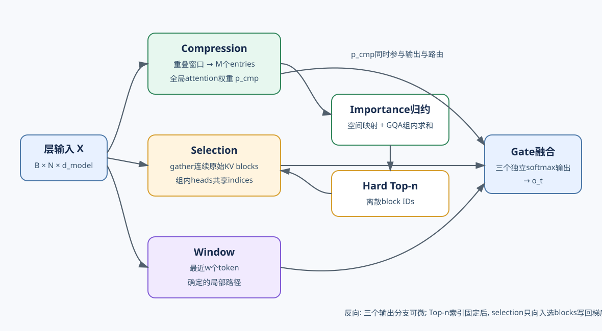

# NSA: 压缩、选择与滑窗的训练原生稀疏 attention

Native Sparse Attention(NSA)从预训练开始就采用稀疏attention结构, 无法当作推理插件直接追加到稠密checkpoint上. **它把历史信息分到压缩、选择和滑窗三条并行分支。** 压缩分支负责「全局摘要」, 选择分支恢复「远距细节」, 滑窗分支维持「局部依赖」. 三个分支分别softmax, 再由可学习gate合并输出. 论文的目标同时包含算法与硬件. Prefill和训练通常受算力限制, 需要减少实际QK与AV运算并支持反向传播; Decode通常受KV读取带宽限制, 需要让同一GQA组的query heads共享连续KV块. NSA的block设计让候选单位、GQA共享和kernel tile从训练开始对齐, 与token级top-k的物理执行不同.

## 1. 三分支计算图

### 1.1. 统一输出与独立归一化

对位置 $t$ 的query $q_t$, NSA构造三组KV, 分别记为 compression、selection与window. 输出为

$$
o_t=\sum_{c\in\{cmp,slc,win\}}g_t^c\operatorname{Attn}(q_t,\widetilde K_t^c,\widetilde V_t^c),
$$

其中gate由输入特征经过MLP与sigmoid得到. 每个分支拥有自己的K/V投影并单独计算softmax. 这点决定它不能等价改写为把三组positions拼起来做一次attention: 三个分母、三套表示和gate都会改变输出. 独立分支也是训练约束. 局部模式更容易学习, 若所有候选共用一套表示与softmax, recent tokens可能形成捷径, 压缩和远距选择得不到足够梯度. 专门的window分支吸收局部模式, 让另外两条分支分别学习全局摘要与远距细节. 代价是需要维护三套投影状态, 逻辑KV条目数不能只按最终候选求和.

### 1.2. 压缩分支

压缩分支用长度 $l$、步长 $d$ 的滑动块组织历史. 每一块的keys经过带块内位置编码的可学习MLP $\varphi$ 映射成一个compressed key, values同理:

$$
\widetilde K_t^{cmp}=\{\varphi(k_{id+1:id+l})\mid 0\le i\le\lfloor(t-l)/d\rfloor\}.
$$

论文通常取 $d<l$, 让相邻压缩块重叠, 减少边界处信息被切断. 实验配置为 $l=32,d=16$, 因而长历史大约每16个token产生一个压缩entry. 压缩attention读取全部entries, 保留对全历史的覆盖, 复杂度仍随长度线性增长, 但系数显著低于读取全部原token. 压缩不是平均池化. $\varphi$可学习, 且有块内位置信息, 目标是为后续query保存可检索语义. 一个entry无法无损恢复32个token的所有细节, 所以该分支承担粗粒度全局感知, 而不是替代精细检索.

**选择与滑窗分支。**

选择分支把原始KV划为长度 $l'$ 的连续块, 保留importance最高的 $n$ 个块. 论文实验取 $l'=64,n=16$, 即最多读取1024个原始token; 其中包含固定激活的首块与两个局部块. 连续block使加载和矩阵乘法能使用规则tile, 代价是关键token会带入同块邻居. window分支读取最近 $w$ 个token, 实验中 $w=512$. 它不依赖top-k, 为短程语法、邻近复制和最新状态提供确定路径. 由于window输出独立归一化并门控, 即使selection也选中局部块, 两条分支仍有不同语义, 不能为去重而随意删掉其中一份.

## 2. 压缩分数怎样驱动选择

### 2.1. 复用已经计算的注意力分数

NSA没有为selection增加一套独立轻量indexer. 压缩分支本来就计算

$$
p_t^{cmp}=\operatorname{Softmax}(q_t^T\widetilde K_t^{cmp}),
$$

这些分数同时提供粗粒度saliency. 当compression block与selection block使用相同划分时, 可以直接用压缩分数排序. 划分不同时, 论文根据两类块在序列上的空间覆盖关系聚合多个压缩分数, 得到selection block importance. 这样选择开销被并入一条必须存在的全局分支. 分数复用建立了明确耦合: 压缩表示既要贡献全局输出, 又要为原始token块排序. 如果压缩器保留了适合摘要的信息却无法区分细节块, selection recall会下降; 如果只为排序优化, compression输出可能变差. 原生训练让两类目标通过最终语言建模损失和分支梯度共同适配.

### 2.2. 不同block划分的映射

设压缩块长度为 $l$, 步长为 $d$, selection块长度为 $l'$, 且 $d$整除二者. 一个selection块会与多个重叠compression blocks相交. 论文把相应 $p_t^{cmp}$ 项求和得到 $p_t^{slc}[j]$. 这一步复用已有粗分数并按空间关系归约, 无需重新对原始keys做QK. 以 $l=32,d=16,l'=64$ 为例, 一个64-token选择块跨越多个起点间隔16的压缩窗口. 边界附近的压缩窗口还可能同时覆盖相邻选择块, 因而importance不是简单每四项分一组. 实现必须严格复现公式的索引偏移、序列开头处理和因果边界; 用直觉分桶会在块边界产生系统偏差. top-$n$之后, selected blocks按整数位置gather原始selection K/V. 候选个数大致固定, 但历史较短或固定首块、局部块与动态top块重叠时, 实际unique blocks会减少. kernel需要规定去重与顺序, 训练反向也要把梯度scatter回正确原位置.

**GQA组内共享选择。**

GQA中多个query heads共享一组KV heads. 若每个query head各选不同块, 实际KV读取是所有选择的并集, 算术稀疏却不一定减少带宽. NSA把同一GQA组内各query head的block importance相加, 形成共享排序, 然后所有heads读取同一批KV blocks. 这种聚合牺牲部分head专属性. 某个head独有的重要块可能被其他heads的总分压过, 但共享候选避免重复HBM读取, 还能把整组queries同时放入片上存储. 质量与物理效率的折中发生在选择规则本身, 不能等到kernel阶段再弥补. 验收时应同时测per-head oracle recall与group-union读取量. 独立head top-k的召回可作为质量上界, 共享top-k是实际路径. 若只比较FLOPs, 会遗漏GQA下候选并集导致的读放大; 若只比较字节, 又看不到少数专用head的质量损失.

## 3. 训练、Prefill与Decode一致性

### 3.1. 原生训练意味着什么

NSA论文用27B总参数、3B激活参数的MoE骨干进行实验, 30层, 4个GQA组与64个attention heads. NSA与Full Attention基线都在8k长度数据上预训练约270B tokens, 再用32k数据继续训练与监督微调. 论文报告训练损失稳定, 并在通用、长上下文与推理评测上比较. 这里的证据支持「三分支稀疏结构可端到端训练」, 不支持「任意稠密模型可无损改成NSA」. 三分支拥有独立KV、压缩MLP、gate与共享block选择, 参数和优化路径从训练开始就不同. 对已有checkpoint做迁移需要新增参数初始化、蒸馏和继续训练, 论文结果不能直接作为迁移保证. 原生还指稀疏存在于前向与反向. 若前向只计算selected blocks, 反向也应只对对应QK/AV路径计算梯度, 才能节省训练计算. top-n索引本身是离散的, 未入选blocks不会通过selection分支获得梯度, 但compression分支仍对全局压缩entries传播梯度, window分支则稳定局部学习.

### 3.2. Prefill为何能够稀疏

许多后处理方法需要先用稠密Prefill生成attention map或索引, 只在Decode稀疏. NSA的importance来自压缩分支自身, 而压缩分支本就是稀疏架构的一部分. Prefill可对每个query生成压缩分数、归约block importance并执行selected attention, 不需要先跑一遍完整原token attention. Prefill中query数多, attention通常compute-bound. 因此重点是减少实际矩阵乘法并保持Tensor Core利用率. 连续selection blocks允许按块加载KV; 压缩和window可沿用规则attention kernel. 但top-n、索引映射和不规则query-to-block关系仍有开销, 理论非零元素比例不会原样变成加速比. 因果训练还要求每个query只选可见blocks. selection block若跨过当前位置, 必须掩掉未来token; 压缩窗口若包含未来位置也不能供当前query使用. 短序列单元测试应覆盖块首、块中和块尾, 对比显式朴素实现的输出与梯度.

**Decode为何强调共享读取。**

Decode每步query很少, 主要成本是读取历史KV. NSA只读取全部compressed KV、固定window KV与少量selected original blocks. 当上下文足够长时, 读取量近似 $t/d+w+nl'$, 相比全历史 $t$ 降低; 压缩分支仍线性增长, 因而不是常数内存访问. 同一GQA组的heads共享selected blocks, kernel一次加载连续KV块到片上存储, 再与整组queries计算. 论文kernel把query/output循环放到grid调度, 内层顺序读取选中的连续块. 这种group-centric布局同时提高算术强度并避免每个head重复读取KV. Decode状态包含三套K/V以及压缩器尾部. 新token到来时, window追加并淘汰最旧项; selection原始KV需保留供未来块选择; compression每隔步长产生或更新entry. 因此NSA减少每步读取, 不必然减少所有KV存储. 计算cache字节时应分别列出三套投影、重叠压缩entry和量化元数据.

## 4. Kernel与成本核算

### 4.1. 为什么按block而不是token

随机token gather会形成大量短事务, 难以填满矩阵乘单元. 64-token选择块把每个index转成一段连续地址, kernel块 $B_k$只需满足 $B_k\mid l'$, 就能分块加载到SRAM. 多算同块低价值token换取更少事务和规则矩阵形状, 是NSA明确的硬件折中. block size太大时, 候选预算浪费在邻居上; 太小时, index数量、排序与事务数增加. 最佳值依赖head维度、dtype、page布局与设备. 论文在A100与特定配置上的结果不能自动外推到其他加速器, 复现应重新profile而不是只保持相同理论稀疏率.

### 4.2. 三条分支的实际开销

设历史长度为 $t$, 压缩步长为 $d$, window为 $w$, 选择 $n$ 个长度 $l'$ 的块. 单query参与attention的逻辑KV数量近似

$$
N_t\approx t/d+w+nl'.
$$

代入论文实验值, 长上下文时为 $t/16+512+1024$. 64k上下文约为5632个逻辑位置, 显著少于65536. 但三条分支分别softmax并有独立投影, 还存在压缩MLP、importance归约、top-n、索引和gate, 所以不能把 $65536/5632$ 直接称为端到端加速倍数. 训练要分别核算forward与backward, Prefill记录QK、AV和选择工作区, Decode记录HBM实际读取字节. selection blocks若分散在许多pages, 物理读取可能大于有效载荷; compression blocks重叠会增加构造计算; window与selected local blocks重复并不会消除双分支计算.

**可复现的性能实验。**

性能实验应固定模型shape、dtype、batch、GQA组数和序列长度, 比较Full Attention与NSA完整三分支. 只测selection kernel不能代表总结构, 只测端到端模型又会被MoE通信与MLP掩盖. 两类结果都要提供, 并报告warm-up、编译配置和峰值显存. 序列长度从短到长扫描能够找到交叉点. 短序列上top-n与三次launch可能比稠密kernel更贵; 长序列上压缩比例与固定选择预算才占优势. Decode还应扫描batch size, 因为更多并发query会提高算术强度, 改变带宽瓶颈. 训练验证不能省略梯度. 对小shape使用双精度朴素实现, 固定top-n indices后比较Q、K、V、压缩MLP和gate梯度; 再单独测试选择边界的离散变化. 最终用长序列观察反向workspace和是否出现数值溢出.

## 5. 质量边界与相邻路线

### 5.2. 三类失败分别来自哪里

压缩失败发生在重要细节没有进入compressed representation, 会同时削弱全局输出与block排序. 选择失败发生在importance映射或group聚合漏掉关键原始块. window失败发生在局部跨度超过 $w$ 或局部分支形成过强捷径. 三者可能在最终logit上叠加, 需要分支级消融定位. 可以记录gate分布、compressed attention质量、selected blocks相对于稠密oracle的覆盖率以及window距离直方图. gate低不必然代表分支无用, 因为少数关键query可能高度依赖它; 平均recall高也可能漏掉唯一证据. 测试集应包含多证据检索、长代码引用、长推理与局部复制. 固定激活首块和局部块为极端模式提供保底, 但也占用 $n$ 的预算. 当上下文包含大量分散证据时, 16个blocks可能不足; 增大 $n$ 提升召回, 同时线性增加selected attention与读取. 这是真实质量—成本旋钮, 不是仅调kernel就能消除的限制.

**与DSA、CSA/HCA的区别。**

DSA使用独立轻量indexer对历史token打分, 再从主MLA KV中读取token级top-k. 它的代理目标、索引K和主attention可分别训练与量化. NSA不另建selector, 而是复用compression attention分数, 候选单位是连续原始token blocks, 并保留独立window分支. CSA同样先压缩token轴再稀疏选择. V4公开报告中的CSA在压缩entries上执行主attention, 与NSA选择分支回读原始连续blocks不同. HCA对更强压缩后的全部entries做attention, 没有动态top-k漏选, 误差主要来自压缩. NSA则让compression全覆盖与selected原始细节并行存在. NSA与后续模型的人员或团队关系无法确定具体结构. 模型内部是否采用NSA, 仍取决于正式技术材料给出的公式、层结构和实验配置.

**与HySparse及跨层共享的区别。**

HySparse的oracle来自周期性full attention layer产生的真实block scores, 后续多个sparse layers跨层复用indices与该full层KV. NSA在每个层内由compression分支产生importance, 没有依赖上一full层的跨层oracle. 前者用full刷新换真实saliency, 后者用原生压缩分支保持所有层可训练稀疏. HySparse保留独立SWA分支, 与NSA专门的window分支有表面相似性; 但其global sparse分支共享上游full KV, NSA三分支拥有独立K/V并在本层训练. HySparse2进一步加入self/cross decoder的KV Bridging与Prefill早退, NSA论文没有这一跨decoder机制. 选型应先问是否拥有原生预训练机会. 若有, NSA可以让训练、Prefill和Decode使用同一稀疏结构; 若只有既有checkpoint, 后处理或继续训练路线更现实. 再问硬件是否能从连续block与GQA共享中获益, 以及业务是否接受固定block预算的召回边界.

**工程验收清单。**

工程验收先核对compression窗口数量、重叠关系、块内位置编码和因果边界. importance从compression映射到selection时, 序列开头、未满末块与固定激活块都要单独检查. GQA路径还要核对组内聚合、top-n稳定排序、去重与连续KV地址. 分支输出测试要确认三次softmax、三套K/V和gate顺序. 将某一gate置零应只移除对应分支; 将selected budget覆盖全部历史时, selection分支应退化为相应投影上的dense attention; window扩展到全历史时也应与该分支的dense参考对齐. 同一张验收表应列出质量、训练吞吐、Prefill TTFT、Decode时延、逻辑FLOPs、实际读字节和峰值显存. **NSA让粗粒度全局覆盖、细粒度连续块和局部窗口共同进入原生训练, 并按同一组block约束执行.** 缺少任一分支或只在Decode启用选择, 都不能直接沿用论文结论.

**一个短序列的完整手算。**

设历史长度为128, compression block长度32、stride 16, 则完整窗口起点为1、17、33、49、65、81、97, 共7个compressed entries. selection block长度64时只有前后两个原始块. 对位于序列末尾的query, compression分支对7个entries做attention; selection分支根据7个压缩权重向两个64-token块归约; window若为32则读取最近32个token. 假设归约后前块分数0.35、后块0.65, 动态预算只允许一个block, selection选择后64个token. 这个结果与直接对128个原始token取top-64不同: 后块内即使只有一个关键位置, 其余63个邻居仍会参与selection softmax. 同时window覆盖的最近32个token也位于后块, 但它们通过独立window K/V和独立softmax再次贡献. gate决定两种表示的组合, 不能对positions去重后只算一次.

再考虑因果位置70. 起点49的32-token compression窗口跨到token 80, 其中未来部分对该query不可见; 起点65窗口也未完整可见. 实现可只使用已经完整的窗口, 或对尾部做带mask的部分压缩, 但必须与训练定义一致. selection的第二个64-token块也只能访问65到70. 这说明「按块读取」仍需token级因果mask, 不能因block被选中就暴露完整物理块.

论文实际配置还固定首块与两个局部块. 当历史短到这些固定块覆盖全部序列时, 动态top-n会出现大量重叠, unique blocks少于16. 性能测试若始终按16乘64估算读取会高估短序列成本; kernel若不去重则会重复计算并改变独立selection分支内部的softmax质量. 两种行为都应由参考实现明确规定.

**梯度与选择稳定性。**

在固定indices条件下, selection attention对选中K/V与query完全可微, compression和window分支也有普通attention梯度. 不连续点发生在两个block importance交换排序的位置. 常规自动微分把top-n结果视为当前前向的离散路由, 未选block不会通过selection路径获得梯度; 它仍可能通过compression路径影响损失和未来importance. 因此训练诊断不只看总loss. 应记录候选集合在相邻checkpoint之间的Jaccard相似度、top-n边界分差、各分支gate和压缩分数熵. 如果边界分差长期接近零, 很小数值扰动就会频繁换块, 造成梯度噪声与不可复现排序. 稳定排序规则可确保相同输入得到相同indices, 却不能替代模型学习更清晰的importance.

混合精度会放大边界问题. compression score在低精度下归约到selection blocks, 多个GQA heads再求和, 累积顺序会影响接近的分数. 验收应以高精度归约作为参考, 分别比较importance误差、indices一致率与最终输出误差. 若只比较logits, 不容易判断是候选变化还是attention数值变化. 反向kernel还要处理同一原始block被batch内多个queries选中. gradient scatter可能产生原子写冲突或额外归约workspace. 训练速度报告应包含这一真实反向路径, 不能用固定随机indices且无梯度的前向microbenchmark代替.

**Cache布局与生命周期。**

三分支独立K/V意味着每个新token通常产生selection K/V与window K/V, compression K/V则按stride生成. window只需保留最近 $w$ 项; selection历史要保留, 因为未来任一query都可能选中远距block; compressed历史也要保留用于全局attention与importance. 忽略量化时, 长序列主要状态近似为

$$
M\approx 2b_eH_{kv}\left(nd_{slc}+wd_{win}+\frac{n}{d}d_{cmp}\right),
$$

其中三个分支的head维度可能不同, 不能直接合并成一个统一系数. 公式还未包含压缩尾部原始状态、索引、位置编码与scale. prefix cache复用需要三条分支来自同一checkpoint和同一blocking配置. 改变 $l,d,l',w$ 后, 旧compressed entries与selection block编号都不再兼容. cache key应编码这些结构参数以及K/V投影版本. 请求从共享前缀继续时, 未满compression窗口的原始尾部也必须恢复, 否则下一个entry会遗漏前缀token. continuous batching中不同请求的top-n blocks不同. selection kernel可把每个请求与GQA组作为调度单元, 但过多短任务会增加grid开销; 将它们合并又可能引入padding. 工程上应记录每次launch的有效queries、selected block数和加载字节, 用真实分布选择batch策略.

speculative decoding回滚时, window尾部、selection原始KV和compression部分窗口要同步截断. 已完成且完全位于确认前缀内的compressed entries可保留; 包含草稿token的entry必须重建. 这种生命周期规则是实现推论, 论文没有给出生产状态机, 因而需要逐token参考测试确认. 分布式部署还要保持GQA组与KV分片对齐. 如果同组query heads分散到多个tensor parallel rank, 先聚合importance再做全局top-n会引入通信; 若每个rank局部选择, 最终KV读取并集又可能扩大. 更合适的切分通常让共享一个KV head的queries共置, 但还需兼顾投影与输出通信. pipeline parallel不会改变层内三分支语义, 却要求每个stage保存本层完整的压缩尾部和原始selection cache. 这些布局成本应计入端到端结果, 不能只引用单卡kernel速度.

上线前可用故障注入验证状态管理: 改错一个selection block编号、丢弃一个未满compression尾部、交换两个GQA组的indices, 确认校验与canary输出能发现. 静默读错KV往往仍产生有限数值, 比显式崩溃更难定位. 元数据中保留请求、层、分支、位置范围与结构版本, 能把错误缩小到具体数据路径.

### 5.1. 从张量形状走到一次完整执行

**三条分支分别保存什么。**

设batch为 $B$, 序列长度为 $N$, query head数为 $H_q$, KV head数为 $H_{kv}$, 每个head维度为 $D$. 输入 $X\in\mathbb{R}^{B\times N\times d_{model}}$ 先经过三套K/V投影. selection分支得到 $K^{slc},V^{slc}\in\mathbb{R}^{B\times H_{kv}\times N\times D}$; window分支的投影shape相同, 推理时只保留最近 $w$ 个位置; compression分支先生成逐token的K/V, 再沿序列轴把长度 $l$、步长 $d$ 的窗口压成 $M$ 个entries:

$$
M=\left\lfloor\frac{N-l}{d}\right\rfloor+1,
\qquad
K^{cmp},V^{cmp}\in\mathbb{R}^{B\times H_{kv}\times M\times D}.
$$

当 $N=65536,l=32,d=16$ 时, $M=4095$. 这个数字比粗略写成 $N/d=4096$ 少1, 差别来自第一个完整窗口需要先容纳32个token. 流式实现还会保存不足32个token的尾部; 尾部达到窗口长度后生成entry, 随后每进入16个新token再生成一个. 因果训练若允许部分窗口, 计算定义会改变, 训练和推理必须采用同一种规则. GQA的映射可写为 $g(h)=\lfloor hH_{kv}/H_q\rfloor$, 第 $h$ 个query head只读取第 $g(h)$ 个KV head. 若 $H_q=64,H_{kv}=4$, 每16个query heads共享一个KV head. NSA在这16个heads之间归约block importance, 选出共同的block IDs. kernel据此加载一次K/V, 让16个query heads复用; 若每个head各自top-$n$, 最坏情况下会出现 $16n$ 个不同block, GQA原有的带宽收益会被候选并集抵消.

> 图 1: NSA从同一层输入生成compression、selection与window三条K/V路径, compression权重继续产生共享block索引, 三个attention输出经gate合并. 图1解析:

- compression attention覆盖全部压缩entries, 其softmax权重同时参与最终输出和block importance归约.
- top-$n$只决定selection分支读取哪些原始连续块, 不裁剪compression与window分支.
- 反向传播沿三个输出分支回到各自投影; 离散索引在当前step固定, selection梯度只写回被选block.

三条路径的投影独立, 所以cache也不能只保留一份原始K/V再临时切片. selection cache保留全部历史原始块, window cache只需循环保存最近 $w$ 项, compression cache保存 $M$ 个压缩entries和一个尚未封口的原始尾部. 若三个分支head维度都为128、KV head数为4、bf16每元素2字节, 64K序列中selection K/V约占 $2\times4\times65536\times128\times2=128$ MiB; window K/V约1 MiB; compression K/V约8 MiB. 这组数只计算单层裸张量, 未含页表、scale、对齐填充与临时workspace.

**selector的梯度到底走到哪里。**

令compression logits为 $a_{t,i}$, 压缩注意力权重为 $p_{t,i}=\operatorname{softmax}(a_t)_i$. 第 $j$ 个selection block的分数由与它相交的compression窗口归约:

$$
s_{t,j}=\sum_i R_{j,i}p_{t,i},
\qquad
I_t=\operatorname{TopN}(s_t,n),
$$

其中 $R_{j,i}$ 表示第 $i$ 个压缩窗口对第 $j$ 个原始块的贡献. 若窗口跨越两个selection blocks, 对应的一行会把权重分到两个block, 具体系数由论文的空间覆盖映射决定. GQA还会在top-$n$之前对组内query heads的 $s_{t,j}$ 求和. $I_t$ 是整数索引集合, gather出的原始K/V进入selection attention. 固定 $I_t$ 后, selection分支与普通attention一样可微. 选中block的K/V得到QK与AV两条梯度, query也从selection输出得到梯度; 未选block在这条路径上的梯度为0. `TopN`在排序交换点不连续, 常规反向不会对“某块差一点入选”产生梯度. NSA没有用straight-through estimator把离散索引伪装成连续变量.

compression分支解决了训练信号中断的一部分. $p_{t,i}$直接参与compression输出, 因此语言建模损失会更新compression Q/K/V和压缩MLP; 同一组权重又决定 $s_{t,j}$, 参数变化会在后续step改变候选集合. 这属于通过共享表示产生的间接适配, 不是对top-$n$求导. window分支始终可微, 在训练早期selection尚不稳定时仍能传递局部梯度. gate梯度也需要单独观察. 设三个分支输出为 $u^{cmp},u^{slc},u^{win}$, gate logits为 $z^c$, 且论文使用逐分支sigmoid $g^c=\sigma(z^c)$. 对某个分支有

$$
\frac{\partial L}{\partial z^c}
=\left\langle\frac{\partial L}{\partial o},u^c\right\rangle g^c(1-g^c).
$$

三个gate不要求和为1, 因而可以同时放大或同时减弱. 若某个 $z^c$过早进入sigmoid饱和区, $g^c(1-g^c)$接近0, 对应分支即使偶尔有用也难以恢复. 训练日志应按层、head组和token位置记录gate分布, 还要结合遮蔽分支后的loss变化; 单看平均gate会漏掉少量但关键的远距query.

**64K上下文的计算与读取手算。**

取论文常用配置 $N=65536,l=32,d=16,l'=64,n=16,w=512$, 暂时忽略固定块与动态块重叠. 对序列末尾的一个query, compression读取4095个entries, selection读取 $16\times64=1024$ 个原始位置, window读取512个位置, 合计5631个逻辑KV位置. 与Full Attention的65536个位置相比, QK和AV主体约为11.64分之一. 这个比例只描述attention主体. 若 $H_q=64,D=128$, 每个逻辑位置在所有query heads上的QK与AV合计约需 $4H_qD$ 次浮点运算, 三分支主体约为

$$
4\times64\times128\times5631\approx1.85\times10^8\ \text{FLOPs/query}.
$$

Full Attention对应约 $2.15\times10^9$ FLOPs/query. NSA还要计算压缩MLP、importance归约、组内reduce、top-$n$、三次online softmax与gate. Decode下这些固定工作占比更明显; Prefill含大量queries, block attention主体更容易把排序与launch开销摊薄. 带宽要按KV heads计算. 仍取 $H_{kv}=4,D=128$, bf16 K/V每个逻辑位置需要 $2\times4\times128\times2=2048$ 字节. 若三条分支具有相同head维度, 单步裸载荷约为 $5631\times2048=11.0$ MiB, Full Attention约128 MiB. 实际selection读取取决于页布局: 16个连续64-token blocks若各自跨页, 会额外读取对齐区域和页表; window通常连续, compression entries也规则排列. profiler应同时给出有效字节与HBM事务字节.

短上下文会出现另一种结果. 当 $N=2048$ 时, compression只有127个entries, 固定的selection预算最多1024个token, window又读512个token. 三条分支合计接近1663个位置, 再加排序与三套softmax, 相对Full Attention的优势很小. 如果固定首块、局部块和动态块大量重合, 去重会降低selection实际读取; 若实现保留重复索引, 相同block会在selection softmax中重复出现并改变输出, 已经不只是性能问题.

训练阶段还要乘上反向成本与保存状态. online softmax通常保存每行的log-sum-exp, selection保存block IDs, 压缩器保存反向所需激活. 朴素实现若为每个query保存完整4095维compression概率, workspace会随 $N^2/d$ 增长; fused kernel可重算部分统计量或分块保存, 用更多计算换显存. 所以训练报告需要列出峰值显存和backward时间, 单独的forward稀疏率无法代表可训练性.

**与DSA、MoBA和KDA放到同一组坐标。**

这些方法都减少长序列attention成本, 但它们削减的对象并不相同. 比较时可固定五个问题: 选择信号从哪里来、候选粒度是什么、训练时是否执行同一路由、局部信息由谁保证、部署时主要保存什么状态.

| 方法 | 选择或状态信号 | 稀疏粒度 | 训练路径 | 局部路径 | 部署状态与主要代价 |
|---|---|---|---|---|---|
| NSA | compression attention权重 | 连续原始token block | 三分支从预训练开始共同优化 | 独立window分支 | 原始selection KV、window KV、compressed KV; 三次attention与top-$n$ |
| DSA | 独立轻量indexer对历史token打分 | token级hard top-k | indexer先获得监督, 再与主干适配 | 由实现中的局部保留规则决定 | 主MLA KV加indexer状态; 随机token gather压力较大 |
| MoBA | query与block代表计算gating分数 | block级hard top-k | 稀疏路由进入训练, 当前block保持可见 | 当前因果block | 原始block KV与路由结果; block并行和负载分布影响吞吐 |
| KDA | recurrent线性状态按通道更新 | 没有候选集合 | 状态更新与读取连续可微 | 由局部分支或混合层补充 | 固定大小recurrent state; 状态容量和更新稳定性决定长程保留 |

NSA与DSA都包含hard选择, 训练信号来源不同. DSA的indexer拥有自己的表示和监督目标, 可以单独测索引召回; NSA让compression权重兼任全局attention和路由信号, 少了一次独立历史扫描, 也把压缩质量与选择质量耦合在一起. NSA以连续block换取规则访存, DSA的token级候选纯度更高, kernel需要处理更细碎的地址. MoBA与NSA都选择连续block, MoBA把block routing本身作为主attention的稀疏拓扑, 当前block提供确定的因果局部连接. NSA保留完整的compression和window输出, selected blocks只是三条并行路径之一. 相同的top-$k$ block数无法代表相同成本: NSA还读取compressed entries和window, MoBA则受block代表计算、路由负载与当前block处理影响.

KDA属于线性attention的recurrent路线. 它把历史压入随时间更新的状态, 每个token都参与状态更新, 没有“候选集合”“top-k召回”或“gather哪些KV”这几个步骤. 因而不能用selector recall评价KDA, 也不能把KDA的固定状态大小写成一种hard sparse attention. 对比指标应换成状态大小、每token更新成本、长程信息保留和并行训练方式. 混合模型可以让KDA承担全局状态, 再配局部softmax attention; 这与NSA用compression、selection和window分工的出发点相近, 计算图却完全不同.

**消融怎样定位三条路径。**

最直接的消融是分别关闭一个分支, 同时保持其余参数、训练token和推理预算不变. 关闭compression不仅去掉一个全局输出, 还会让selection失去importance来源, 因而不能把结果解释成单纯的“全局摘要贡献”. 若要测compression输出本身, 可以保留它产生的indices并把 $g^{cmp}$置0; 若要测路由作用, 则保留compression输出, 用随机块或固定块替换top-$n$. 两组实验回答不同问题.

selection消融可以逐步改变 $n$ 与 $l'$. 固定总selected tokens $nl'$ 时, 小块提高定位精度并增加索引数量, 大块提升连续加载效率并带入更多邻居. 固定block数只会同时改变信息预算和计算量, 难以区分质量变化来自哪一项. GQA共享消融应比较每head top-$n$、组内共享top-$n$和组内候选并集, 同时报per-head oracle recall与实际读取字节. window消融要按任务距离切片. 把 $w$ 从512降到256会影响局部复制、代码缩进、短程语法和最近对话状态; 长检索下降也可能来自证据附近的局部组合被破坏. 将window扩大到全历史可验证该分支投影的dense参考, 却不能代表完整NSA退化成Full Attention, 因为compression与selection仍经独立softmax和gate参与输出.

压缩器的消融应控制 $l/d$ 与entry数量. 把重叠窗口改成不重叠窗口会同时减少压缩构造计算并改变边界信息; 用平均池化替换可学习MLP则直接测试压缩表示能力. 除最终困惑度外, 还应记录compressed attention对远距证据的覆盖、selection block recall、top-$n$边界margin与分支遮蔽后的loss增量. 四类数结合起来, 才能区分“压缩内容丢了”“排序选错了”和“选对后gate没有使用”.

一次可复现的长上下文实验至少给出 $B,N,H_q,H_{kv},D,l,d,l',n,w$, dtype、块页大小和是否去重. 训练结果还需给出预训练token数、长度日程、Full Attention基线是否同数据同算力, 以及forward/backward分别采用何种kernel. 系统结果按训练、Prefill和Decode分开, 再报告端到端模型吞吐; 这样才能看出收益来自少算QK/AV、少读KV, 还是其他模块占比变化.

还可以用合成样本把错误定位到具体路径. 第一组样本把唯一证据放在selection block边界两侧, 逐个移动query位置, 观察importance映射是否随重叠窗口平滑变化. 第二组让同一GQA组的16个heads分别偏好不同block, 比较独立top-$n$、共享top-$n$与候选并集; 这组样本能直接暴露组内求和是否压掉少数head. 第三组把证据放在window之外但compression可见的位置, 再把compression gate置0, 检查模型是否确实依赖远距分支.

数值正确性应分两层验证. 小shape下用显式dense mask构造三条参考attention, 固定indices后逐项比较输出、log-sum-exp以及Q/K/V梯度. 随后放开top-$n$, 比较compression logits、block scores和最终indices. 前一层失败说明attention kernel或scatter有错; 后一层失败通常来自边界映射、GQA归约精度或排序规则. 两类误差混在最终logits中时, 一个错误候选就足以掩盖后面的数值问题.

性能曲线也要保留形状变化. 序列从2K扫到128K, batch从1扫到服务常用并发, 分别记录compression、selection、window、top-$n$和gate耗时. 若总时延在某个长度后不再近似线性, 通常需要检查selection pages是否过于分散、临时索引是否触发额外拷贝, 或并发请求的block数差异是否造成SM尾部空转. 这些数据最终会反过来约束 $l,d,l',n,w$ 的选择: 算法预算与硬件布局必须在同一组配置上验证.

线上监控可以沿用相同分解. 每层记录实际unique blocks、压缩entry数、三分支gate分位数和HBM读取量, 再按请求长度分桶. 候选数没有变化但读取量突然升高, 多半是物理页分散或前缀复用失效; 读取量稳定而长检索下降, 则优先检查importance分布与边界margin. 这样定位时可以直接落到路由、布局或模型质量中的一层.

**压缩分支是一条可寻址的全局记忆。**

**7.1. 重叠窗口改变了 token 的统计权重.** 当压缩块长度 $l=32$、步长 $d=16$ 时，序列内部token通常出现在两个compressed entries中，靠近首尾的token出现次数较少。重叠能缓解块边界，让跨越16倍数位置的短语至少在某个窗口中完整出现；它也让中部信息通过两条压缩路径影响attention，形成隐含的覆盖权重差异。 若压缩器近似线性，一个内部token对所有entries的总贡献可能约为边界token的两倍。学习型MLP和位置编码可以校正，前提是训练长度和padding分布覆盖这些边界。测试同一证据放在序列开头、中部、尾部与不同block offset，能检查重叠是否产生位置偏置。

重叠还增加构造成本。长度n大约产生 $n/d$ 个entries，每个entry读取l个原始状态，朴素压缩工作约为 $nl/d$。在32/16配置下，输入读取约为2n。若用卷积式滑窗复用中间结果可降低常数，仍要保存块内位置关系。压缩attention省下的QK不能与构造成本混在一起。 **7.2. 一份表示承担输出与路由.** Compressed key先与query打分，得到compression branch的attention质量；同一批分数再聚合成selection block importance。于是它有两个目标：为压缩value提供正确读取权重，同时给原始KV块排序。一个只保留主题的key可能适合全局摘要，却分不清两个包含相似主题、只有细节不同的blocks；一个极度强调词法尖峰的key适合检索，作为全局语义memory又可能不稳定。

可把损失梯度分成直接路径与间接路径。直接路径来自compression output对最终loss的影响，连续可微；间接路径经过top-n indices，硬选择对未选项通常没有普通梯度。Selection分支仍会推动当前入选块中的原始KV学习，却难以直接告诉compressed key“另一个块本应入选”。原生训练的优势在于长期共同适应，不表示离散路由问题自动消失。 训练中扩大候选、使用软教师或周期性稠密oracle，可以给边界外blocks更多信号；这些属于可能的训练策略，不能在没有论文证据时当成NSA默认实现。分析重点是认清双重职责，再用compressed output质量与selection recall分别验收。 **7.3. 压缩容量决定全局下限.**

Selection只读固定数量原始blocks，未选历史仍可通过compression branch影响输出。因此压缩memory是NSA的全局下限：即使细节块漏选，模型仍可能知道相关主题、文档或粗关系。它与window共同让selection无需承担全部信息。 固定维度entry不可能无损保存32个token。若一块含多个实体、数字和顺序关系，压缩器要决定哪些特征值得未来query使用。重叠让信息有两次编码机会，却不增加每个query最终读取的独立原始细节。多证据任务仍可能需要selection补回。 压缩率由stride而非block长度单独决定。减小d增加entries和全局读取，降低信息间隔；增大l但保持d会让每个entry看到更宽上下文，构造更贵、局部信息竞争更强。$l$ 与 $d$ 是表示范围和采样密度两个旋钮，不能只报告“16倍压缩”。 **8. Selection 分数的空间映射.**

**重叠覆盖形成一张线性映射。**

将query t的compressed probabilities写成向量 $p_t\in\mathbb R^{N_c}$，selection block importance可写成

$$
r_t=A p_t, \tag{9}
$$

矩阵A由compression窗口与selection blocks的空间重叠关系决定。若一条compression窗口覆盖两个selection blocks，权重可分配给两边；若直接向所有相交块累加，同一概率会被重复计算。具体A必须按论文定义实现。 线性形式便于测试。对很短序列显式构造A，检查每个compression entry的质量流向哪些selection blocks；再与kernel归约比较。序列开头、尾部未满块和causal截断会让A的行列数变化，最容易出现off-by-one。 若A只含0/1，block得分与被多少compression windows覆盖相关。内部selection block通常接收更多完整窗口，边界block较少。归一化每列覆盖数可消除这种先验，却改变论文算法。复现应先严格一致，再通过受控实验判断边界偏置。

**Top-n 之前还要处理固定块。**

首块与局部blocks固定激活，为attention sink、开头指令和最近上下文提供保底。若它们计入总n，动态槽位减少；若在动态top-n之外追加，总token预算增加。短序列中固定集合大量重叠，去重时机也会改变最终数量。 合理执行顺序要由定义确定：先把固定blocks mask为已选，再从其余blocks取剩余名额；或先全局top-n，再做并集。前者保持总block数，后者可能超过n。两种结果在长序列平均差异不大，边界样本和性能口径会不同。 固定首块还可能形成捷径。模型知道它永远可见，倾向把全局摘要写入BOS附近；这能提高稳定性，也让所谓动态检索的一部分能力来自sink中继。屏蔽首块或打乱其内容可以测量依赖程度，但部署结构若固定保留它，不必追求完全消除。

**离散集合的容量冲突。**

同一query可能需要多个语义独立blocks。固定n限制可访问地址数，即使ranking完全正确也无法覆盖超过n个分散证据。Block长度64还意味着每条证据带入邻居，真正用于独立地址的容量至多n。 定义达到教师概率质量阈值 $\tau$ 所需最小block数

$$
n_\tau(t)=\min\left\{n:\sum_{j\in U(TopBlocks_n)}a_{tj}\ge\tau\right\}. \tag{10}
$$

若 $n_{0.95}$ 随证据数或上下文长度增长，固定16会形成结构上限。平均语言建模中attention可能尖锐，长文归纳与多证据验证更容易触及上限。 动态n可依据importance margin或累计质量调整，训练与kernel会面对变长形状。实际系统可只允许8、16、32几个档位。模型若只用固定16训练，推理时扩大集合会改变softmax分母，质量也未必严格单调，动态预算应进入训练分布。 **9. GQA 共享选择是一道集合优化.**

**求和分数优化平均覆盖。**

同组H个query heads对block j的importance为 $r_{hj}$，NSA用聚合分数 $R_j=\sum_h r_{hj}$ 排序。选定集合S最大化

$$
\sum_{j\in S}\sum_h r_{hj},\qquad |S|=n. \tag{11}
$$

这恰好优化组内总质量，却没有保证每个head的最低覆盖。一个分布尖锐但只在少数样本活跃的head，平均贡献可能输给多个普通heads共享的blocks。 因此要同时报告平均和最差head覆盖。若最差head承担远程复制或代码符号，少数失败会在特定任务集中出现。增加n、按head子组选择或给稀有head加权都能缓解，读取并集与元数据同步增加。

**独立 Top-k 的并集是质量上界。**

让每个head独立选n个blocks，再取并集，提供不受共享预算约束的候选上界。并集大小介于n与Hn之间，实际值反映head需求重合。若并集接近n，共享几乎免费；若接近Hn，固定共享集合必然牺牲专属性。 可画“并集大小—概率质量”曲线：先为每head选择较小预算，再逐步合并。它比单一Jaccard更直接回答多读多少blocks能恢复多少质量。Kernel也能利用组间重复，只加载唯一blocks。 独立集合不一定是部署候选，因为随机读取和排序开销可能很高。它主要作为诊断：共享质量下降来自容量冲突，还是compressed importance本身没有找到教师blocks。

**共享读取怎样转化成带宽收益。**

同一GQA组共享KV，本就希望一次加载供多个query heads使用。若heads选不同blocks，KV cache物理仍只有一份，但kernel需要加载并集，再为各head应用不同mask；片上复用下降，控制流更复杂。共享S让所有heads使用规则矩阵tile。 理论FLOPs按H个heads乘n blocks计算，不因共享集合直接减少；主要收益来自K/V只从HBM加载一次、地址元数据更少、矩阵形状一致。Prefill中query rows多，算力占比可能更高；Decode中每步query少，读取复用尤其重要。 性能实验应比较三条路径：完全共享S；每head独立S但合并唯一KV；每head独立加载。第一条展示NSA实际设计，第二条分离集合约束与理想kernel，第三条是简单基线。只比较第一和第三会把算法与实现收益混在一起。

**三次 Softmax 的信息分工。**

**10.1. 独立归一化保护弱通路.** 假设远程selection logits整体比local logits低2，但其中含关键证据。统一softmax会让大量local token占据分母，远程概率很小；独立softmax让selection分支内部仍产生归一化输出，再由gate决定整条通路权重。模型可以在分支级保留远程信息。 Compression同理。它的entries是聚合表示，logit尺度未必与原始KV相同。独立归一化避免三种表示强行校准到同一数值范围。代价是每个分支即使整体不相关，也会产生和为1的输出，只能靠gate抑制。 Gate若采用sigmoid，各分支权重互不排斥。三个gate都高时输出范数增大，后续输出投影与归一化可以适应；若用softmax gate，三者总和固定，会形成竞争。NSA的具体gate是计算图的一部分，复现不能替换为看似更自然的混合而仍声称等价。 **10.2. 分支重复不是重复计算同一语义.**

Recent token可能同时出现在window、selected block与覆盖它的compressed entry中。三次出现分别使用原始window表示、selection表示和压缩摘要，softmax上下文也不同。重复地址不代表输出可去重。 Window负责当前层局部模式，selection关注少数原始远程块，compression提供全局粗景。模型可能在同一token上抽取不同特征。强行把候选并集只算一次，会删除分支专用K/V和独立分母，得到另一种架构。 系统层可复用底层输入读取或融合投影，前提是不改变数学结果。比如同一hidden state同时生成window与selection K/V时可合并GEMM，输出仍要按分支存储。优化应通过数值对照确认。 **10.3. Gate 的可解释边界.**

Gate大小能显示模型在某个query上偏向哪条通路，但不能直接等同于因果贡献。某分支输出范数很小，即使gate高，实际影响仍低；两个分支输出方向相反还会抵消。更可靠指标是门控后向量范数、屏蔽分支造成的logit变化与任务结果。 按距离和任务统计仍有价值。局部复制时window贡献应突出，远程精确查询selection增强，全局归纳compression更重要。若所有任务都被一条分支垄断，其他分支可能训练不足，或数据不需要其能力。 分支dropout可迫使模型避免单一路径依赖，但会改变训练算法。没有论文支持时，应作为后续实验而非NSA事实。默认结构能否自然分工，需要从公开消融和复现指标判断。

**离散路由怎样参与训练。**

**11.1. 硬 Top-n 的梯度盲区.** Top-n集合在排序不变的小邻域内是常数。Selection attention对选中blocks可微，importance稍微变化却不改变集合，selection loss无法通过索引边界给出连续梯度。只有compression output路径持续训练所有compressed entries。 这造成“路由靠共享表征间接学习”的特点。Compressed key为了自身attention变好而调整，selection排序随之改善；一旦某个未选block对compression output也贡献很低，它很难从selection需求获得信号。长尾精确证据是压力点。 观察训练中的候选翻转率与cutoff margin可判断稳定性。翻转率极高表示边界噪声大，极低且召回差表示错误排序已经固化。二者都不能由总loss单独发现。 **11.2. 原生训练会重组信息路径.** 模型可学习把难检索信息写进固定首块、compressed summary或后续容易命中的锚点。这样即使原始证据block未选，任务仍完成。这是稀疏结构下形成的信息中继，不必要求每层复现稠密attention。

因此用稠密教师top-block recall评估很有帮助，却不是唯一目标。Recall较低、任务质量接近，可能说明模型建立了不同计算图；也可能是评测不依赖长程信息。通过屏蔽锚点、交换证据位置和线性探针追踪信息，才能区分。 训练长度也会塑造路径。主要在8K训练后扩到32K，模型学到的compression密度和固定selection容量可能对更长序列继续外推，也可能因干扰blocks增长而失效。应画 $n_\tau$、margin与任务质量随长度变化。 **11.3. 训练与推理 Kernel 必须同构.** 若训练为方便使用稠密mask模拟block sparse，数学输出可相同，反向计算和数值顺序却不同；推理换成专用kernel后，低精度归约与top-n tie可能改变indices。更重要的是训练没有获得预期算力收益。

原生稀疏的完整主张包含结构从预训练存在，以及前反向都能按稀疏块执行。验证训练kernel需比较输出、QKV梯度、压缩MLP梯度和gate梯度，再测实际吞吐与工作区。固定indices的数值测试和动态选择测试应分开。 Checkpoint还要保存所有分支投影、压缩位置参数与gate。只转换主attention权重会丢失路由能力。配置中的l、d、l'、n、w与GQA grouping同样属于权重语义，修改后应继续训练并重新评测。 **12. Prefill 的二维稀疏图.**

**每个 Query 拥有不同 Blocks。**

Prefill中n个queries分别生成selection集合，稀疏图是query-block二部图。即使每行恰好16 blocks，整张图的block模式可能高度不规则。Kernel需把相同或相近模式的query tiles分组，才能复用KV。 相邻queries的语义和compression分数通常平滑，候选blocks可能大量重合。利用这种时间局部性可以缓存block或合并query范围；但强制多个queries共享集合会改变算法。先测候选Jaccard，再决定是否有无损的物理复用空间。 全Prefill索引若物化为 $n\times16$ 个block IDs，1M长度、32位索引约64MiB，尚可但不含中间importance。真正大的部分是compressed score或归约工作区，应tile化边算边消费。

**因果边界块的特殊处理。**

Query位于selection block中间时，固定局部block可能包含未来token。物理上可加载完整64-token tile，逻辑mask必须将未来位置设为 $-\infty$. 计算量会包含无效项，序列很短或大量query靠近边界时比例明显。 Compression重叠窗口也有类似问题。只使用完整历史窗口最简单，当前尾部最多31个token只能由window与selection原始路径覆盖；若生成部分compressed entry，压缩器输入长度与训练分布变化。实现选择会影响最近全局摘要的更新延迟。 显式小例子应覆盖query在每个offset。比较朴素逐位置mask与kernel，不只检查输出，还检查未来token梯度严格为零。任何边界泄漏在语言模型训练中都会造成虚假低loss。

**Prefill 的排序成本。**

每个query对约n/d个compressed entries打分，这是NSA保留的 $O(n^2/d)$ 项；selection与window分别为 $O(nnl')$ 和 $O(nw)$. 当上下文继续增长，compression attention最终主导，NSA并未把总体变成严格线性。 优势来自d=16降低平方项常数，并让entries更紧凑。与DSA低维indexer不同，compression分支还输出有用value，扫描成本同时购买全局语义。比较两者时应把这份输出价值计入，不能只看选择器MACs。 如果目标上下文远超训练长度，压缩平方项仍可能不可接受，需再叠加层级索引或状态化全局分支。那会形成新架构，质量结论需要重新验证。 **13. Decode 的状态机.**

**新 Token 如何更新三套状态。**

每步生成后，原始selection KV追加一个位置，window环形cache追加并淘汰，compression压缩器更新当前重叠窗口。Stride为16意味着不是每步都完成新entry；系统需保留最近31个原始输入或等价增量状态。 当步数跨过stride边界，新compressed entry写入，下一query可见的global长度增加一。更新前后kernel shape变化，可能形成周期性小延迟。若压缩MLP每次从32个token重算，边界步成本更高；增量复用取决于压缩器结构。 状态版本必须一起回滚。Speculative token被拒绝时，selection/window KV、未满compression buffer、已完成entry与位置计数都要恢复。只截断原始KV会留下包含拒绝token的compressed memory。

**读取量随长度怎样变化。**

单步逻辑读取约为 $t/d+w+nl'$. 在配置16、512、16、64下，t=8192时为2048；t=65536时为5632；t=1M时约67072。极长上下文下compression全扫重新成为大项，固定selection与window占比下降。 与Full attention相比，渐近读取比例趋近1/d，即约6.25%，再加compressed entry宽度与三分支投影差异。端到端TPOT不会精确达到16倍，因为MLP、MoE、通信、top-n和softmax固定成本未缩减。 长度分段策略可以在短序列用Full或简化kernel，超过交叉点再启用NSA。若模型权重原生依赖三分支，直接切Full并不等价；可以只切执行方式，保持数学计算，或训练支持多个模式。

**Page 布局与连续 Blocks。**

Selection block最好与KV page边界对齐。若page为16 token，64-token block跨4页且地址规则；若page为128，一个block只占半页，两个相邻block共享页。请求的逻辑block起点还受packing offset影响。 Compressed KV与原始KV增长速率不同，适合独立page池；window用环形小buffer。把三者混在同一分页系统会产生碎片和不同生命周期冲突。Cache统计要按状态类型给占用与命中。 GQA组共享indices后，可以把选中pages广播给同组heads。多GPU序列并行时，各rank先算本地block分数，再选全局top-n；或复制compressed keys避免通信。前者传候选分数与IDs，后者增加cache副本，需按长度权衡。

**失败诊断与反事实验。**

**14.1. 先替换候选再改模型.** 任务失败时，用稠密教师为selection提供blocks，保持NSA的compression、window、K/V与gate不变。若恢复，问题在importance、空间映射或共享GQA集合；若不恢复，候选预算、分支表示或模型训练更可疑。 再把n扩大到覆盖全部blocks，selection分支退化为该投影上的dense attention。若仍与Full基线不同，三分支参数化与gate本身造成差异。这是结构允许的结果，不应继续归咎于top-n。 对compression可固定selection教师并屏蔽compression output，只保留它生成分数。质量变化显示全局摘要的直接贡献；再反过来保留output、使用教师选择，分离两项职责。 **14.2. 三类症状对应三条路径.** 只在远程精确复制失败，先看selection关键block召回；全文主题失败而原始block召回正常，compression value更可疑；短程语法或最新状态失败，检查window投影、mask和gate。多证据任务三路都可能参与，需要逐分支屏蔽。

错误随block offset周期波动，通常指向空间映射或边界；随长度平滑下降，可能是compressed干扰增加或固定n容量；只在batch混合出现，检查padding与seq_lens；训练正常、专用推理kernel异常，优先做固定indices数值对照。 Gate极端饱和提供线索，不直接定罪。某分支gate低可能因输出范数更大，或其信息已被其他分支写入residual。屏蔽实验和梯度范数能确认是否真正失活。 **14.3. 最坏样本比平均 Recall 更重要.** 平均block recall 95%可能由大量简单local query贡献，真正远程query的召回很低。应按证据距离、head、任务、长度和group分桶，并报告最低分位。唯一答案block漏选会让任务失败，即使其余15个blocks全部与教师一致。 多证据覆盖需单独定义：所有必要blocks同时入选的比例，而非逐block平均。若每个证据独立召回0.95，四证据同时覆盖约0.81；相关错误可能更糟。任务级覆盖更贴近最终能力。

线上无法运行稠密教师时，可监控cutoff margin、compressed score熵、候选距离、不同heads投票分歧和page分散度。低margin与高分歧请求可走更大n的安全档，前提是模型训练见过该预算。 **15. 与硬件共同设计的真实含义.**

**算法单位就是 Kernel 单位。**

NSA选择64-token连续block，因为这同时是语义候选和矩阵tile。算法若改成任意token top-k，理论有效位置增加，原kernel的数据复用和规则shape消失。选择规则从一开始就包含了硬件约束。 GQA共享集合也一样。它从算法层限制每组heads访问相同blocks，换取一次KV加载。若先训练独立head选择、部署时强行合并，会产生训练—推理差异。共同设计要求约束从预训练计算图就存在。 Window与compression都是规则分支，selection承担有限不规则性。三者组合把大部分工作映射到成熟dense/block kernels，只把top-n与gather留作控制。评价实现时应分别看规则路径是否达到硬件峰值，以及不规则控制占多少。

**理论稀疏率为何不能直接变成速度。**

Attention只占模型一部分；三分支有独立投影、softmax和gate；top-n可能同步；selected blocks分散；训练反向还要scatter梯度。Amdahl定律决定总加速低于attention非零元素缩减比。 另一方面，Full baseline在超长序列可能无法运行或使用较低效分块，NSA规则block kernel能获得额外实现优势。报告倍数必须给出同硬件、同精度、同batch与同编译配置，不能把理论FLOPs和另一套基线时间混合。 功耗与显存带宽也可成为约束。Decode减少HBM读取通常同时降低能耗；Prefill增加top-k控制可能降低Tensor Core占用。完整评测包含吞吐、延迟、峰值显存和能量，业务侧再选择权重。

**下一代硬件会改变最优点。**

更大的片上存储允许缓存更多blocks或多个GQA heads，随机gather代价下降时更细粒度选择可能占优；带宽相对算力继续变紧时，GQA共享与连续读取更重要。Block=64是某代硬件和模型shape上的解，不是NSA定义不可改变的常数。 修改block size会联动compression-to-selection映射、训练分布、top-n预算和kernel tile，不能只重新编译。真正硬件迁移需要从checkpoint继续训练或至少验证质量，避免将物理优化当作语义等价变换。 可移植实现应把l、d、l'、n、w与tile参数分层：前五项属于模型配置，tile属于等价执行选择。只有tile可在不改变数学结果时自动调优，其余变化进入模型版本。

**把三分支成本写成同一套公式。**

**16.1. Prefill 的主项.** 长度n时，compressed entries约为 $n/d$。Compression attention对全部queries与entries计算，QK/AV主项约为 $2n^2d_h/d$；selection每query读取 $nl'$ 个原token，主项约为 $2nnl'd_h$；window约为 $2nwd_h$。忽略heads与常数，总attention主项为

$$
C_{pre}\approx2nd_h\left(\frac nd+nl'+w\right). \tag{12}
$$

这里第二个n是选择block数量，容易与序列长度混淆，可把它改记为 $N_b$. 代入 $d=16,N_b=16,l'=64,w=512$，括号为 $n/16+1536$。当n远大于24576时，compression平方项超过两个固定稀疏分支总和。 式 (12)未计压缩MLP。约n/d个entries各处理l个token，若MLP宽度与head维相当，成本近似 $O(nl/d)$. 它随n线性，不改变超长渐近主项，训练中仍可能有显著常数。重叠读取和块内位置编码也在这里。 **16.2. Decode 的带宽模型.** 单步只生成一个query，算术量与读取条目都近似

$$
N_{read}(t)=t/d+N_bl'+w. \tag{13}
$$

三套KV宽度可能不同，应写成字节

$$
B(t)=\frac td b_{cmp}+N_bl'b_{slc}+wb_{win}+B_{meta}. \tag{14}
$$

$B_{meta}$包含indices、scale与page表。若三分支均使用相同head宽度，条目数可作粗比较；独立投影维度不同时必须按字节。 Decode还要写入新状态。Selection原始KV与window KV每步追加，compression entry每d步产生。平均写字节小于读取，超长prefix从低层存储恢复时写入与迁移可能影响TTFT。容量账与每步带宽账要分开。 **16.3. 三个交叉点.** 第一个交叉点是NSA相对Full attention何时更快。短序列上三次softmax、top-n与launch占比高，Full fused kernel可能领先；长度增长后稀疏主项获胜。第二个交叉点是compression何时超过selection+window，由 $t/d=N_bl'+w$ 给出，默认值约24576。 第三个交叉点发生在整模：attention缩短后，MoE、MLP、通信与采样成为瓶颈。假设attention原占60%，NSA让其缩到四分之一，端到端上限为 $1/(0.4+0.6/4)\approx1.82$ 倍。继续压selection只能影响已经缩小的部分。

这些交叉点随batch、dtype和硬件移动。Prefill矩阵化程度高，Decode受带宽限制，不能共享同一长度阈值。基准要分别扫描，不用一个“长上下文加速”数字概括。 **17. 三分支如何组成跨层信息流.**

**Compression 提供粗定位。**

Compression branch每层都能看到整个历史的低分辨率表示。它可以把“哪篇文档可能相关”“前面是否出现某实体”等粗信息写入residual。下一层query据此变化，再由该层自己的compression分数选择更合适的原始blocks。逐层重新路由给模型形成搜索过程的机会。 与HySparse跨层复用固定oracle不同，NSA每层根据当前query刷新selection。代价是每层都跑compression全局扫描，收益是深层新需求可以访问此前低分blocks。多跳任务中，这种逐层自适应尤其重要。 若compression表示已经丢掉区分两个相似blocks的特征，下一层仍无法正确路由。Selection读回的原始细节可更新query，形成“粗定位—精读—再定位”的迭代，但第一步至少要把相关区域送入候选。

**Selection 把细节写入 Residual。**

一旦某个原始block被选中，其value通过selection输出进入当前位置residual。后续层无需再次选同一block，也可能使用已经写入的信息。这让逐层top-n集合不必完全重合，多个层可以依次读取不同证据。 信息中继降低单层预算压力。16个blocks每层、30层理论上可探索很多区域，实际query位置的计算路径受residual容量和训练影响。若早层读取错误干扰，后层也可能围绕错误信息继续搜索。追踪关键证据何时首次可从hidden state解码，有助于理解搜索过程。 固定首块可作为共享工作台：不同位置把摘要写入sink，再被后续query读取。它提高信息传播效率，也可能让模型对特殊token过度依赖。屏蔽实验要注意分布外影响，最好比较训练过的有/无固定首块变体。

**Window 保持局部计算不断链。**

语言模型每层都需要相邻token交互。若局部依赖也参与top-n竞争，远程blocks增多时可能挤掉最近上下文；反过来，最近token通常高分，又会占满selection。独立window把局部图固定下来，让selection预算专注长程。 Window还是压缩尾部的补偿。新的32-token压缩窗口尚未完整时，最近内容已经通过window可见。Stride导致global memory离散更新，局部路径提供连续时间响应。Selection也可能选尾部block，但window不依赖排名。 w层层堆叠后，局部感受野可以跨越多于w的距离：上一层在窗口边缘写入信息，下一层继续传播。理论可达距离约随层数增长，实际信号会衰减。局部扩散不能替代精确远程检索，却解释了某些中距离任务不依赖selection。 **18. 数据分布决定稀疏图学成什么.**

**短样本会弱化 Selection 监督。**

当历史短到固定首块、局部blocks和window覆盖大部分序列，动态top-n几乎没有竞争。模型可以依赖window与固定blocks完成训练，compressed routing质量不受压力。训练token很多，若绝大部分来自短序列，有效长程监督仍然不足。 应统计每个query的可选block数、动态槽位数和证据距离，而不只统计最大context length。Packing多个短文档能增长序列，却可能让跨文档attention无意义；真正长依赖数据才推动selection学习。 课程从8K扩到32K时，compressed entries与干扰blocks增加，原有分数尺度和固定16预算面临新分布。继续训练需要足够多远程依赖，让模型重新校准，而非仅把短文随机拼长。

**Hard Negatives 决定路由分辨率。**

随机无关文档容易由主题区分，compressed summary足以路由；同主题文档、重复模板和相似代码函数更难，需要细节特征。若训练缺少hard negatives，长上下文needle可以成功，真实仓库或多文档问答仍会选错block。 可以构造同名实体不同属性、相似函数不同边界条件、重复章节不同数字等样本。保持query与正确证据关系不变，逐步提高干扰相似度，观察importance margin与召回。Margin比单点准确率更能显示模型是否真正分开候选。 压缩器的双重职责在hard negatives上最紧张：全局语义相近，路由需要保留微小差异；entry容量不足时，增加训练未必解决。降低stride、增加压缩宽度或让selection有独立特征才改变容量。

**多语言、代码与数字需要分桶。**

不同数据类型的证据形态不同。自然语言常以短语和段落聚集，64-token block较合适；代码定义可能短而分散，block带入大量无关行；数字与ID对词法精确度敏感，压缩摘要容易丢失。统一平均会隐藏结构偏好。 多语言tokenization改变64 token对应的字符与语义长度。某语言一个block覆盖较短文本，另一语言覆盖更长段落，选择粒度不同。评测应按token口径和原始字符跨度同时报告。 训练采样也会让gate形成领域偏置。若代码主要出现在长样本，模型可能学会代码query提高selection gate；这可能是合理适应，也可能导致短代码误路由。交叉长度与领域测试能拆开两个因素。

**从论文结果到可复现实验。**

**19.1. 质量基线要控制训练预算.** NSA与Full Attention比较时，模型规模、激活参数、数据、训练tokens和上下文课程都需一致。若一方训练更久或使用不同长数据，最终任务差异无法只归因于稀疏结构。原生架构尤其依赖从头适应，公平基线成本高但必要。 还应设置三分支消融：去compression、去selection、去window，以及替换为统一softmax或独立head选择。每个消融改变计算量，质量比较旁边要列实际成本。只报告最终NSA与Full，看不出哪条分支贡献主要能力。 Dense oracle只用于小规模诊断。它可给selection block上界和概率质量，不能作为正式速度路径。若NSA任务质量接近而oracle recall不高，进一步查信息中继与任务是否真正需要远程证据。 **19.2. 系统基线要控制 Kernel 成熟度.**

Full Attention通常有高度优化FlashAttention，NSA需要compression、selection与window多个kernels。若Sparse实现不成熟，算法优势被工程差距掩盖；若Full基线版本老旧，又会夸大收益。双方应使用同代编译、相同精度和合理调优。 分别报告算子微基准和整模。微基准固定QKV shape测forward、backward、workspace与HBM；整模加入投影、gate、MoE和通信，测训练tokens/s、TTFT和TPOT。两层结果共同说明优化空间与实际收益。 候选分布要来自真实模型，不用均匀随机indices替代。真实blocks可能集中，cache友好；也可能随任务分散。随机模式只能测最坏或合成行为，无法代表端到端。 **19.3. 一张完整验收表.** 结构字段包括l、d、l'、n、w、heads、GQA groups、固定blocks与gate形式。质量字段包括compression任务贡献、selection dense mass、per-head最低覆盖、多证据全覆盖率、window距离分桶与最终任务。系统字段包括各分支时间、top-n、实际读字节、pages、工作区和峰值cache。

训练字段记录长度分布、真正长依赖比例、候选翻转率、cutoff margin、分支gate与梯度范数。数值字段记录dtype、归约精度、tie规则、输出和梯度误差。状态字段覆盖Decode更新、rollback、prefix cache与分布式top-k。 当这些字段随checkpoint一起保存，复现者才能判断差异来自权重、配置、kernel还是数据。NSA的贡献包含计算图与执行约束，两部分缺一都会让论文数字失去可比性。 先做一个64K上下文的成本算例。取 $d=16,w=512,N_b=16,l'=64$，每个query读取4096个compressed entries、1024个selected tokens和512个window tokens，总计5632个逻辑位置，约为Full Attention的8.59%。这个比例只覆盖attention中的QK/AV条目，不含三套投影、compression MLP、top-n、gate和模型其他模块。 如果compressed entry宽度只有原始KV的一半，按字节折算为2048个原始等价位置，总读取等价量变成3584，约5.47%；若entry与原始KV同宽，仍是8.59%。因此“16倍压缩”描述entry数量，不直接等于16倍带宽。表示宽度与量化格式决定实际字节。

把长度增到1M，compressed entries约65536，加上1536个固定稀疏位置，总计67072，约为原长度的6.40%。比例逐渐逼近 $1/d=6.25%$。Selection与window在超长序列中的相对成本很小，质量作用仍可能关键；继续减n对总带宽帮助有限，优化compression扫描更有价值。 反过来看24K附近，compressed entries1536，恰好与selection加window相等。此处三分支读取各占一半，任何一边的kernel低效都能左右TPOT。把n从16降到8会使固定部分从1536降到1024，总条目从3072降到2560，只减16.7%，却可能让多证据容量减半。 训练Prefill的情况不同。64K长度下compression分支约处理 $65536\times4096$ 的query-entry关系，仍是2.68亿级；selection约6711万，window约3355万。Compression已占逻辑attention关系的73%。Kernel若只优化selected block而忽略compression，整体训练加速上限很快触顶。 重叠压缩构造还要读取约2倍原始token。相对数亿attention关系，这在线性长度下不占主项；短序列、较宽MLP或多层独立构造时仍会影响。Profile应在交叉长度两侧测量，而非从64K结果推回2K。

第二个算例关注GQA容量。假设一个组有4个query heads，每个head的教师top blocks分别为：$\{A,B,C,D\}$、$\{A,B,E,F\}$、$\{A,G,H,I\}$、$\{A,J,K,L\}$. 每head预算4时，并集有12个blocks，其中A被全部共享，B被两个heads共享，其余只服务一个head。 若实际共享预算仍为4，至少8个并集blocks无法进入。求和排序通常保留A、B，再从其余并列项选两个。前两个heads得到较高覆盖，后两个可能只命中A。平均block recall尚可，最差head只有25%。这类冲突来自集合容量，compressed分数再精确也无法消除。 把共享预算扩到12可恢复全部教师，但读取从4 blocks增到12。按64-token计算，组内每query从256增到768个selected tokens；仍可能比每head独立加载16个blocks的简单实现更省，因为并集去掉重复。合理点要在最差head质量与唯一block数之间选择。

若A是attention sink而不含任务信息，求和聚合会稳定浪费一个槽位。固定首块本来就已保证A可见，动态top-n再选它会重复。实现若把固定集合从动态候选中排除，可以释放容量；如果算法定义允许重复后去重却不补足，实际unique数反而减少。这个细节会直接影响算例。 再给每个head的block质量加权。第四个head对J的概率为0.9，其余heads分布平坦；求和若仍让J落选，平均总质量可能只小幅下降，第四head功能完全丢失。报告最差概率质量和任务角色，才能发现平均目标牺牲的专用head。 第三个算例展示重叠映射。序列前96个token产生compression窗口 $[1,32]$、$[17,48]$、$[33,64]$、$[49,80]$、$[65,96]$. Selection blocks为 $[1,64]$ 与 $[65,128]$. 中间窗口 $[49,80]$ 同时跨两个selection blocks，其分数如何分配决定边界证据偏向。

若把 $[49,80]$ 的全部质量同时加给两块，总selection质量超过1，排序仍可用但不同blocks因跨界窗口数量不同产生先验。若按重叠长度各分一半，保持质量守恒，却让位于窗口某一端的关键token被平均。若按max关系分配，又需要知道窗口内部哪个token重要，compression分数本身没有给出。 论文公式选择一种明确映射，复现必须照做。教学上最重要的是看到compressed attention对窗口打分，而selection要对另一套blocks排序，中间并非天然一一对应。空间映射自身就是一个粗粒度归因假设。 将关键token放在位置64与65，二者语义相邻，却位于不同selection blocks。覆盖它们的compression窗口集合也不同。逐位置平移实验若出现周期16或64的质量波动，可分别指向compression stride与selection边界。两种周期叠加时，曲线会呈现更复杂图样。

Window能掩盖靠近query的边界错误。证据位于最近512 token时，即使selection映射选错，window分支仍读取；将相同证据移到513以外，失败突然出现。评测距离应在 $w-1,w,w+1$ 以及selection block边界前后密集采样。 多文档packing还会让compression窗口跨文档。若mask规定文档间不可见，压缩器不能把两个文档token放进同一entry再试图靠后续mask分开，因为信息已经在MLP中混合。数据管线要在文档边界重置窗口或为压缩器提供分段mask，产生较短尾块。 较短尾块的表示分布又与完整32-token窗口不同。Padding到32并mask、使用长度编码或专门尾块投影都可处理；训练与推理必须一致。大量短文档packing会增加尾块比例，让这一实现细节影响模型质量。

故障定位从最便宜的确定性检查开始。固定一组小张量和indices，分别跑朴素三分支与优化kernel，比较每个分支的logits、row max、softmax分母、输出和gate后结果。此时不运行top-n，先排除QK/AV、mask与布局错误。 第二步加入compression MLP，用显式循环生成重叠entries，核对窗口起点、块内位置和因果尾部。对每个原token施加单位脉冲，观察它影响哪些entries，可以直接得到实际覆盖矩阵。任何多一格或少一格都能在这个测试中出现。 第三步显式构造矩阵A，给compressed scores输入简单序列 $[1,2,3,\ldots]$，比较selection importance。再加入固定blocks、去重和top-n tie。分数设计成严格递增、全部相等和只在跨界窗口非零三类，覆盖常见边界。

第四步检查GQA聚合。每个head只给一个不同block高分，验证求和、共享top-n和KV加载；再让多个heads指向同一block，确认物理只加载一次而每head输出正确。Tensor parallel下还要让高分heads分布在不同ranks，检查全局归约。 第五步才比较NSA与稠密教师。记录compression output差、selection概率质量、window贡献和最终hidden state。若候选替换为教师后恢复，回到映射与分数；若教师候选也失败，检查固定预算、分支K/V和gate；若朴素正确而kernel失败，问题仍在实现。 第六步运行任务反事实。把证据平移、改名、增加相似干扰、拆成多个blocks，再控制距离跨过window。每个变化只触碰一个结构假设。长上下文benchmark的单个总分无法提供同样定位能力。

第七步做性能剖析。分别记录compression构造、compression attention、importance映射、top-n、selected attention、window attention、gate和投影。Prefill与Decode分开，读取逻辑条目、HBM事务、Tensor Core利用率和launch时间。看到总时间后直接优化最大项，避免被理论FLOPs引导到次要kernel。 训练稳定性还需观察梯度。固定indices时做有限差分或双精度参考；动态路由时记录候选翻转，不要求跨离散边界的数值梯度连续。Compression MLP同时收到输出路径梯度，检查它在未选blocks是否仍有非零信号；selection K/V只在入选位置收到该分支梯度是预期行为。 如果训练早期window gate迅速饱和、compression与selection gate接近零，模型可能走局部捷径。增加长依赖数据比单纯惩罚gate更直接；正则会强迫使用分支，却不保证分支学到正确内容。先确认数据中的答案确实需要远程信息。

若compression gate正常而selection recall低，双重职责可能偏向全局摘要。查看compressed key能否线性区分相似blocks；若不能，表示容量或训练数据是问题。若能区分但空间映射后排序错，A与block定义更可疑。把问题拆到表示和映射两层，修改才有针对性。 若selection recall高而任务仍差，检查候选内softmax和value。Block中大量邻居可能稀释关键token，尤其当关键logit不尖锐；减小block或提高query-key分辨率能改善。Window重复的local tokens也通过另一分支加入，gate组合可能覆盖远程输出。 极限长度下若质量平滑下降且compressed score熵上升，固定entry宽度面对更多相似摘要，路由margin缩小。减小stride会增加采样密度，却同时拉长compression attention；增加表示宽度提高区分能力，增加每entry字节。两种修复位于不同资源轴。

最终报告不应只写“NSA达到约某倍稀疏率”。更准确的描述包含目标长度下 $t/d$、$N_bl'$ 与w各占多少，compressed entry宽度，GQA共享后唯一blocks，Prefill的平方项，Decode的实际字节，以及三分支在关键任务中的因果贡献。这样读者才能判断默认配置为何有效，也能知道换模型和硬件后该从哪里重新调。 长度课程也应按这套分解记录。模型从8K扩到32K时，window始终512，selection始终1024个原始token，两条固定分支覆盖比例分别降为原来的四分之一；compression entries从约512增到2048，仍完整覆盖历史。模型对长度增长的适应主要发生在compression分数面对更多候选、固定selection容量面对更低比例这两处。

如果长训练只增加位置范围，没有增加远程证据密度，模型可以继续依赖window，loss看起来平稳。有效课程应让答案所需距离随长度增长，并加入相似干扰blocks。记录不同距离上的selection gate与关键block召回，能判断结构是否真的利用了新增上下文。 从32K外推到128K时，compression分支关系数再增16倍，因为query和entry两轴都变长；selection与window只随query数增4倍。训练吞吐的瓶颈会明显向compression转移。Kernel在32K均衡不代表128K仍均衡，编译tile和并行切分也要重新profile。 序列并行可以把query轴分给不同ranks，各自仍需访问全体compressed keys；复制compressed KV增加每rank内存，分片则每层需要归并softmax统计。Selection原始KV也可能按序列分片，global top-n blocks分布在不同ranks。通信模式与Full Attention相似但数据量和不规则性不同。

对分片softmax，所有ranks先求本地row max，再all-reduce全局max，随后归并exp sum与输出。Compression branch全扫较规则，适合这种方法；selection只访问少数blocks，若跨rank分散，all-to-all gather可能比算术更贵。把请求的KV pages按候选局部性迁移是一种系统优化，不改变模型结果。 训练反向还需把selected K/V梯度scatter回拥有它们的ranks。多个query选择同一block时可先本地累加，减少原子操作；不同GQA groups选择重叠blocks时仍要正确求和。梯度通信量取决于实际候选重合，随机合成indices难以代表。 Pipeline parallel更简单地按层切分，因为NSA没有HySparse式跨层KV共享；每层三套状态归本stage所有。负载平衡仍会受序列长度影响：compression attention随n平方增长，所有层大致相同；MoE层与attention组合决定stage时间。跨层独立结构提高切分自由度，是每层重复全局扫描换来的系统优势之一。

Checkpoint恢复需要三套cache只在推理服务层面处理，训练checkpoint主要保存权重与优化器。Prefix cache则必须保存原始selection KV、window所需尾部、completed compressed entries和未完成压缩窗口输入。Window KV可以从原始KV重建的前提是两条分支投影相同；NSA独立投影下通常不能直接复用。 若服务只保存completed entries而丢掉未满32-token缓冲，恢复后下一entry缺少前缀token。由于stride16与长度32重叠，至少要保留最近 $l-d=16$ 个参与下一窗口的hidden states或等价压缩状态。仅按stride保存16也要确认新窗口所需完整输入如何取得。 Prefix在不同batch位置恢复时，绝对位置与block内位置都要一致。Compression MLP使用块内位置编码，窗口起点由原序列offset决定；左侧插入system prompt会改变所有后续分组。Cache key必须绑定完整token前缀与位置配置，不能只按文本片段哈希。

量化三套KV时敏感性不同。Compression K误差会改变全局输出和selection排序，影响两条路径；selection K误差只改变已选blocks内的精确权重，selection V误差改变读取内容；window误差主要影响局部。相同bit宽不是自然最优，compression状态往往值得更保守。 量化测试先固定indices，分别量化三分支，观察输出；再量化compression K并重新生成indices，测集合翻转。前一步隔离连续数值误差，后一步包含离散路由放大。若混在一起，少数block交换会让输出误差分布出现长尾，难以用MSE解释。 Scale粒度同样影响带宽。Per-channel更准，scale元数据和反量化指令更多；per-block与64-token selection tile容易对齐；compressed entries由重叠窗口生成，分布可能随位置变化。应在实际kernel中联合测量精度与速度，而非离线量化误差最小就定方案。

NSA的cache容量不一定像跨层共享路线那样大幅下降，因为每层保留selection原始KV，另有window与compression投影。它主要减少attention计算和每步实际读取。若部署首要瓶颈是长期KV容量，需配合GQA、更窄表示、量化或cache eviction；不能从稀疏读取直接推断存储同比下降。 这一区分对成本估算很重要。Selection未来可能选任意原始block，所以全历史selection KV必须可访问；window只是其中最近部分的独立表示；compression另存约n/d entries。单层持久条目数粗略为 $n+n/d+w$，甚至略多于单套Full KV，具体字节取决于分支宽度。NSA用更多结构化状态换更少读取，并非天然的KV删除算法。 若把selection原始KV也驱逐，未选历史将永久不可恢复，结构转为“NSA加cache eviction”。Compression branch可提供粗信息，却无法保证精确细节。驱逐策略需要单独训练或验证，原论文质量不能直接覆盖组合方案。

同样，跨层共享selection KV能降低容量，却改变当前层query读取的memory格式，接近HySparse的假设。组合后每层独立刷新indices仍可保留，K/V则来自上游层。候选与memory误差需要重新拆分，不能把两篇论文的加速比相乘。 从研究路线看，NSA给出一个很清楚的基线：全局粗记忆、动态原始细节和固定局部上下文在每层并存，所有分支从预训练共同适应。后续任何简化都应说明删除了哪条通路、用什么状态补偿、把误差移到哪里。保留这个坐标系，比争论某个方法是否“真正稀疏”更有用。 NSA可以由四个坐标完整定位：主attention读取compressed entries、连续原始blocks与window tokens；候选信号来自compression分数；同一结构从预训练开始存在；kernel按block与GQA group组织执行。任何一项被替换，计算图或物理成本都会变化。

这四个坐标也提供了迁移检查。只保留三类候选、改用独立indexer，选择信号已经变化；训练时用Full Attention、Decode才启用blocks，训练结构不一致；每head独立选token再由普通gather执行，硬件约束改变；把三个集合并入一次softmax，分支表示和归一化改变。它们都可能成为有效新方法，却需要自己的训练与实验。

一条受控样本可以串起完整链路：远处放置唯一数字，附近放置语义相似的错误数字，另在开头放任务指令。Compression应覆盖全局并给正确区域足够importance，selection应选中正确原始block，window应处理问题附近语法，gate应在答案位置组合三路。移动证据、增加干扰、跨越block边界与window边界，分别观察哪一步变化。 若compression识别了正确区域、selection也命中，输出仍采用错误数字，应检查block内精确attention与Value；若selection漏选而compression output足以给出主题却无法给出数字，表现符合容量分工；若window中的错误数字压过远程证据，检查gate与独立归一化；若训练路径正确、优化kernel错误，固定indices对照会立刻暴露。

这类样本比单纯needle更有诊断价值，因为它同时要求全局定位、细节辨别与局部抗干扰。再把单证据扩成多个分散数字，可以逐步触及16-block容量；把数字换成代码定义和多语言实体，可以检查tokenization与领域变化。结构极限会以可解释方式出现，而不是只留下一个下降的总分。

当原理、训练和执行三条证据相互对应时，NSA的优势才完整：压缩通路让每层保留全局视野，selection把有限读取集中到原始细节，window稳定局部依赖，连续block与GQA共享让稀疏真正落到硬件。相应边界也同样明确：压缩扫描仍随长度增长，固定blocks限制分散证据，三套状态增加存储，硬路由存在梯度盲区。 这套分析也给出了扩展NSA时的底线：新增层级索引、跨层复用或cache驱逐之前，必须保留三条分支各自承担的信息职责，并重新测量被改变路径的召回、数值误差和物理读写。算法复杂度下降只有在这些证据仍成立时才有意义。

## 6. 参考资料

- [Native Sparse Attention: Hardware-Aligned and Natively Trainable Sparse Attention](https://arxiv.org/abs/2502.11089)
