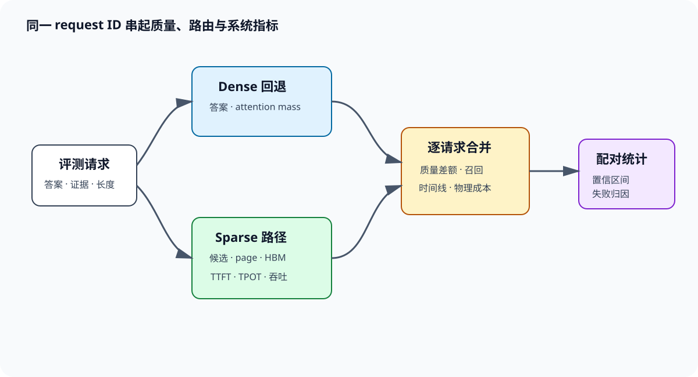

# 质量与系统联合评测

联合评测的关键是让同一条请求贯穿四层：任务层知道答案和证据，模型层知道 dense 与 sparse 输出，路由层知道候选覆盖，系统层知道真实字节和时间。四张各自漂亮的汇总表无法互相解释；逐请求 join 后，才能回答「这个错误是否由证据漏选造成」「这次加速是否来自少读 KV」。

*图 1：同一请求分别进入 dense 回退与 sparse 路径，任务质量、候选覆盖和系统时间线按 request ID 汇合，最终进入配对统计与失败归因。*

## 1. 数据记录与 Full Attention 对照

### 1.1. 逐请求 schema

每条记录至少包含 `request_id`、任务、样本 ID、token 长度、证据 span、证据深度、证据数、干扰类型、随机种子、dense/sparse 答案与分数。路由字段包含每层每 head 的候选数、证据召回、dense mass、block/page 数和 cutoff margin；系统字段包含 selector、top-k、index、prefill、decode、归并、队列时间与 HBM 字节。 原始候选可能暴露正文位置或占用大量空间，可保存聚合统计，并在受控离线环境保留少量可回放样本。配置与代码 commit 单独写 manifest，结果表引用 manifest hash，避免同名实验使用不同 kernel 或 prompt。

### 1.2. 四格配对结果

对准确率任务，将样本分成：dense/sparse 都对 $n_{11}$，dense 对 sparse 错 $n_{10}$，dense 错 sparse 对 $n_{01}$，两者都错 $n_{00}$。质量差额为

$$
\Delta Acc=\frac{n_{01}-n_{10}}{N}. \tag{1}
$$

若 $N=1000,n_{10}=42,n_{01}=17$，sparse 比 dense 低 2.5 个百分点。只报 sparse 的 78% 无法知道基座本身是多少。McNemar 检验关注 $n_{10}$ 与 $n_{01}$，比把两组当独立样本更合适。 开放生成用相同 judge、相同顺序随机化和盲评；自动 F1/ROUGE 与人工抽样并列。dense 失败样本仍保留，因为 sparse 偶尔通过压缩或去噪改正错误，这些 $n_{01}$ 能揭示结构差异。

## 2. 质量任务矩阵

### 2.1. Needle、RULER 与 LongBench

Needle 网格用于连通性诊断。长度 $L\in\{4K,8K,16K,32K,64K,128K\}$，深度 $d\in\{0.1,0.3,0.5,0.7,0.9\}$，每格至少多个随机种子。针的措辞、实体和背景主题轮换；加入不存在的 key 检查幻觉。答案 exact match，另保存容错规范化规则。 RULER 官方实现支持可配置长度与任务复杂度，13 个任务分属四类，适合测单针、多 key、多 query、变量追踪与聚合。记录每个子任务曲线，不用一个平均分盖住变量追踪崩溃。LongBench 有 21 个中英文与代码任务，LongBench-E 还平衡不同长度区间；使用官方 prompt、最大生成长度与 metric，注明是否发生 head-tail 截断。 真实任务与合成任务相互校验。合成任务能精确标注证据位置，适合路由归因；真实任务包含摘要、代码和多文档推理，能发现「证据进入候选但模型仍不会组合」的问题。

### 2.2. 长度、深度、证据数分离

一次只改变一个主变量。固定 64K 改证据深度，得到位置敏感曲线；固定深度改长度，得到候选竞争曲线；固定长度改证据数与相似干扰，得到联合召回曲线。把三项同时增加，分数下降后无法归因。 深度用 token 位置而非字符比例计算。prompt 模板、问题和预留输出也计入窗口，实际证据距 query 的 token 数单独保存。对 sliding window 方法，距离决定结构可达性；对动态选择器，总候选数量与相似负例决定排序难度。

**多证据联合覆盖。**

样本证据集合为 $E_i=\{e_1,\ldots,e_m\}$。any recall 检查至少一段进入候选，all recall 要求全部进入：

$$
R^{all}_i=\mathbb 1[E_i\subseteq S_i]. \tag{2}
$$

还可记录覆盖比例 $|E_i\cap S_i|/|E_i|$。答案要求比较、合取或排序时，all recall 更接近最低条件。存在多套等价证据时，用若干可接受集合，命中任一完整集合即可。

## 3. 路由诊断

### 3.1. attention mass 与证据召回

dense 教师分布 $p_{ij}$ 下，候选质量覆盖为

$$
C_i=\sum_{j\in S_i}p_{ij}. \tag{3}
$$

若候选以 block/page 执行，同时计算逻辑 token mass 与物理扩张后的 mass。高 $C_i$、低证据召回说明 dense attention 本身没把标注证据视为高权重，或任务需要多层传播；低 $C_i$、答案仍对说明存在冗余路径，不能把 attention mass 当唯一真值。 按层与 head 报告 $C_i$ 的均值、P10 和失败样本分布。平均 0.95 可能由浅层局部 head 抬高，关键深层只有 0.6。GQA 共享候选还要比较 per-head oracle 与组共享候选，量化共享造成的损失。

### 3.2. 候选稳定性

对不改变答案的 prompt 改写、段落重排和无关填充，计算候选 Jaccard 与证据覆盖差。稳定性不要求候选完全相同，而要求关键证据不因小扰动掉出。cutoff margin 小的 query 单独成桶，检查 FP8 selector 与不同 top-k kernel 是否翻转排序。 候选预算记录平均、P95、P99 和最大值。阈值路由常在难样本上扩大候选，质量稳定却可能抬高尾延迟。固定 top-k 则系统稳定，质量风险集中在平坦分布。二者用质量—实际 KV 字节曲线比较。

## 4. 系统基准

### 4.1. microbenchmark 的计时边界

四个边界分别测：dense FMHA；固定 indices 的 sparse kernel；索引规范化加 sparse kernel；selector 到输出的完整 attention。每组统一 QKV 投影、RoPE、mask 和输出投影是否计入。JIT、autotune 与首次分配在正式计时前完成，GPU event 记录设备时间。 输入形状覆盖 prefill 的多 query、decode 的单 query、不同 GQA 比例、候选率和候选聚集度。随机均匀 mask 之外，使用真实路由统计生成长尾行、热门页与共享 prefix。报告 median/P95/P99、DRAM bytes、带宽、FLOPs、L2 hit、workspace 和峰值显存。

### 4.2. TTFT、TPOT 与吞吐

TTFT 从请求到达到首 token 可见，分解为 queue、schedule、prefill、首步 decode。TPOT 定义为后续输出 token 的平均时间，ITL 还保留逐 token 分布。固定输出长度 $O$ 时，总时间近似

$$
T\approx TTFT+(O-1)\times TPOT. \tag{4}
$$

例如 TTFT 从 800 ms 降到 400 ms，TPOT 从 20 ms 降到 16 ms，输出 101 token 时，总时间由 2800 ms 降到 2000 ms，加速 1.4 倍；只报 prefill 2 倍会高估用户收益。 吞吐同时给 requests/s、input tokens/s、output tokens/s。batch 与并发固定时比较延迟；SLO 固定时比较最大吞吐。稀疏路径节省显存后可能容纳更大 batch，这属于容量收益，应与同 batch 的 kernel 收益分开。

**HBM 与索引成本。**

理论 KV 字节由物理读取 token 数、KV heads、head dimension 和 dtype 计算，profiler 的 DRAM bytes 用来检查事务放大。索引成本包含 selector key 读取、score、top-k、去重、排序、页表与 workspace 清零。总 attention 时间为

$$
t=t_{selector}+t_{topk}+t_{index}+t_{kernel}+t_{reduce}. \tag{5}
$$

每项既报绝对时间也报占比。kernel 加速 5 倍而 selector 占 40%，端到端上限受 Amdahl 定律约束。

## 5. 服务负载

### 5.2. open-loop

按 Poisson 或回放真实时间戳注入请求，扫描到达率，例如 1、2、4、8、16 req/s。系统过载后继续到达，请求进入队列，P99 会在饱和点附近急升。每个点运行足够长时间覆盖稳态，丢弃启动阶段，报告完成数、拒绝数、队列长度和 SLO 达标率。

**closed-loop。**

设置 1、4、16、64 个客户端，每个客户端收到完整响应后发送下一条。它限制在途请求数，适合交互业务的并发扫描。与 open-loop 使用相同输入长度和输出长度分布，结果分别命名，不能把 closed-loop 的低排队时延当固定到达率表现。 continuous batching 参数、最大 tokens/batch、chunked prefill、调度优先级和 prefix cache 命中率全部固定。稀疏 selector 的 ragged 候选可能改变 batch 组成，因此还要保存实际 batch size、padding、候选最大/平均比。

### 5.1. 统计置信区间

**配对 bootstrap。**

对 $N$ 条请求有差值 $d_i=q_i^{sparse}-q_i^{dense}$。从索引 $1..N$ 有放回抽样 $N$ 次，计算均值，重复 10000 次，取 2.5% 与 97.5% 分位数作为 95% 区间。抽样单位是原始样本；同一文档派生多个深度版本时，应按文档 cluster bootstrap，避免把相关样本当独立证据。 若平均差为 -0.8 分，区间 $[-1.4,-0.2]$，下降虽小但数据支持稳定负差；区间 $[-1.1,0.5]$ 则无法排除无差异。实际可接受阈值应预先设定，例如非劣界 -1 分，再判断区间下界是否越界。

**延迟分位数。**

时延重尾，不用正态均值区间描述 P99。按请求 bootstrap，重新计算 P50/P95/P99；open-loop 还可按时间窗口 block bootstrap，保留突发相关性。报告样本数与区间，少量请求算出的 P99 可信度很低。 多长度、多任务同时检验会增加偶然显著结果。主指标与主长度在实验前指定，其余作为分层诊断；需要作强结论时使用多重比较修正。结果表保留 effect size，不只给 p 值。

**失败归因矩阵。**

| 质量 | 证据召回 / mass | kernel | 端到端 | 首要检查 |
|---|---|---|---|---|
| 下降 | 下降 | 正常 | 正常 | selector、候选预算、长度外推 |
| 下降 | 正常 | 正常 | 正常 | 候选内 attention、层间传播、训练适配 |
| 正常 | 正常 | 慢 | 慢 | block 扩张、gather、tile、带宽 |
| 正常 | 正常 | 快 | 慢 | top-k、索引、plan、队列与 fallback |
| 波动 | margin 很小 | 波动 | 尾延迟高 | 量化翻转、ragged 长尾、动态编译 |

**7.1. 从单条失败开始.** dense 对 sparse 错时，先检查标注证据是否进入任何关键层候选。未进入，比较 selector score、cutoff margin 与相似负例；已经进入，再比较候选内 logits、mass、value 输出和后续层是否丢失。dense 也错时，该样本用于任务难度分析，不直接计为 sparse 特有故障。 质量正常而系统不快时，对照逻辑 token、物理 page、DRAM bytes。实际字节远高于逻辑值，检查页扩张和随机事务；kernel 快而端到端慢，拆 selector、top-k、CPU plan 与 CUDA Graph miss。P50 快、P99 慢时，按最大候选行、fallback 与 workspace 扩容切片。 **7.2. 一次可复算汇总.** 假设 64K RULER 子集 1000 条，dense 92.0%，sparse 90.8%，配对 bootstrap 的 $\Delta=-1.2$，95% 区间 $[-1.9,-0.5]$。dense 对 sparse 错 31 条，其中 24 条 all-evidence recall 为 0；剩余 7 条证据已覆盖。于是主要质量损失可定位到漏选，同时保留 7 条候选内失败继续分析。 同批请求 dense TTFT P50/P99 为 900/1450 ms，sparse 为 520/1100 ms；TPOT 为 19/31 ms 与 14/29 ms。kernel-only 加速 3.4 倍，完整 attention 加速 2.1 倍，端到端 TTFT 加速 1.73 倍。HBM 字节下降 4.6 倍，selector+index 占 sparse attention 时间 27%。这些数字共同说明收益存在，也明确了质量代价和下一处性能瓶颈。

**64K 联合评测手算。**

**8.1. 样本与候选.** 构造 600 条 64K 样本，其中单证据、双证据、四证据各 200 条。每组证据深度在 10%、30%、50%、70%、90% 均匀分配，每格 40 条；一半样本加入 16 个同主题干扰块。dense 与 sparse 使用同一 checkpoint、greedy decode 和最大输出 64 token。 假设 sparse 每个 query 选择 256 个 16-token pages，另保留 16 个窗口页，去重后平均 266 页，即 4256 个物理 token。相对 65536 token，逻辑读取率为 $4256/65536\approx6.49\%$。kernel 以 64-token tile 运行，真实路由统计显示平均需要 190 tiles，即物理计算容量 12160 token，tile 有效率 $4256/12160\approx35.0\%$。 若 8 个 BF16 KV heads、head dimension 128，每 token K+V 为 $2\times128\times2=512$ 字节。理想 sparse KV 读取约

$$
4256\times512\times8\approx16.6\ \mathrm{MiB}, \tag{6}
$$

dense 则为 256 MiB。profiler 实测 31 MiB 表明事务、页扩张与元数据使字节约为理想值 1.87 倍，但仍比 dense 少 8.26 倍。若报告只写 6.49% 候选率，会让读者误以为字节减少 15.4 倍；联合表必须同时保留三组数。 **8.2. 质量与路由配对.** dense 答对 552 条，sparse 答对 535 条。四格计数设为 $n_{11}=526,n_{10}=26,n_{01}=9,n_{00}=39$，于是 dense 92.0%，sparse 89.17%，差额

$$
\Delta Acc=(9-26)/600=-2.83\ \text{个百分点}. \tag{7}
$$

26 条 dense 对 sparse 错的样本中，18 条 all-evidence recall 为 0，5 条只覆盖部分证据，3 条完整覆盖。前 23 条检查 selector 与预算，其余 3 条进入候选内数值和层间传播分析。9 条 sparse 独有成功也要人工抽样，检查压缩去噪、答案格式差异或 dense 偶发生成错误。 按证据数拆分后，单、双、四证据 sparse 准确率为 94%、90%、83.5%，对应 all-evidence recall 为 98%、93%、84%。accuracy 与 all recall 同步下降，支持联合覆盖是主要瓶颈。若 any recall 始终超过 99%，只报 any recall 会完全掩盖多证据断链。 **8.3. 系统总时间.** 固定输出 65 token，dense TTFT 820 ms、TPOT 18 ms，sparse TTFT 480 ms、TPOT 13 ms。总时间分别为

$$
T_d=820+64\times18=1972\ \mathrm{ms},
$$

$$
T_s=480+64\times13=1312\ \mathrm{ms}. \tag{8}
$$

完整请求加速 1.50 倍。sparse TTFT 内部为 selector 65 ms、top-k/索引 38 ms、attention 290 ms、其余 87 ms；selector 与索引合计占 21.5%。若只优化 290 ms 的 attention，即使无限加速，TTFT 下限仍是 190 ms。 这组结果不能直接宣称 sparse 更优，因为质量下降 2.83 点。下一轮应画 budget sweep：128、256、384、512 pages 分别给出准确率、all recall、TTFT 与 DRAM bytes，找满足预设非劣界的最小预算。联合评测的产物是一条质量—成本前沿，而非单个最快配置。

**可复算的预算扫描。**

**9.1. 同一模型扫候选预算.** 每个预算使用相同 600 条样本与请求顺序。示例结果如下：

| pages | 准确率 | $\Delta Acc$ | all recall | TTFT P50 | DRAM bytes |
|---:|---:|---:|---:|---:|---:|
| 128 | 84.5% | -7.5 | 78.0% | 390 ms | 19 MiB |
| 256 | 89.2% | -2.8 | 91.7% | 480 ms | 31 MiB |
| 384 | 91.2% | -0.8 | 96.8% | 565 ms | 44 MiB |
| 512 | 91.7% | -0.3 | 98.2% | 650 ms | 58 MiB |
| Dense | 92.0% | 0 | 100% | 820 ms | 256 MiB |

若非劣界预设为 -1 个百分点，384 pages 是表中第一个满足质量要求的配置，TTFT 加速约 1.45 倍。128 pages 虽最快，质量差额明显越界；512 pages 质量更接近 dense，速度收益缩小。预算选择由约束决定，不能挑某一列最大的数字。 **9.2. 长度改变后重扫.** 固定 384 pages 从 16K 扩到 128K，候选比例从 37.5% 降到 4.69%，速度更有利，selector 难度却上升。每个长度都重算质量差额与 all recall。若 16K 的 $\Delta=-0.2$、32K 为 -0.4、64K 为 -0.8、128K 为 -3.1，不能用四档平均 -1.125 概括；128K 已越过可用边界。 也可以保持候选比例固定，但那会让 pages 随长度线性增长，复杂度与服务成本随之上涨。固定预算与固定比例回答不同问题，两条曲线都值得报告。自适应阈值路由再额外报告 pages 的 P50/P95/P99，防止均值隐藏难样本扩容。

**benchmark 的控制变量。**

**10.1. 模型与生成.** Full 与 sparse 使用同一权重；若 sparse 经过继续训练，增加两个基线：训练前 dense 与训练后 dense。前者衡量整体改造，后者把训练收益与稀疏推理损失拆开。tokenizer、chat template、system prompt、stop token、temperature、top-p、最大输出与 repetition penalty 完全一致。 长输入发生截断时，保存截断前后 token 数和策略。LongBench 常见 head-tail 截断会直接改变证据可见性；模型窗口足够时关闭截断，必须截断时 dense/sparse 使用同一结果。RULER 的生成器版本、任务集合和每档样本数写入 manifest。 judge 模型会带来额外随机性与位置偏差。可 exact match 的任务优先使用规则；开放题固定 judge 版本与 prompt，交换答案顺序复评一部分样本。人工核验集中在 dense/sparse 不一致样本，而非只看随机总体样本。 **10.2. 硬件与软件.**

记录 GPU 完整型号、数量、互连、显存容量、功耗上限、驱动、CUDA、框架和 kernel commit。锁频不可用时保存每轮实际频率与温度。MIG、其他进程与共享云实例会污染尾延迟，应隔离或明确说明。 dense 基线使用当前优化实现，并与 sparse 统一 dtype、KV layout、GQA、quantization、CUDA Graph 和 prefix cache。一个路径使用 FP8 KV、另一个使用 BF16，字节与速度没有直接可比性。workspace 预留与最大 batch 同样计入显存。 基准顺序交错，例如 ABBA，而非先跑完 dense 再跑 sparse，降低温度和系统负载漂移。每个配置至少独立启动多轮；同一进程内重复反映短期波动，重启后的重复还能暴露编译缓存和 allocator 状态。 **10.3. batch 与调度.** 离线测试固定 batch size，并报告实际有效 token 数；在线测试固定请求 trace 和调度器参数。continuous batching 的最大序列数、最大 batch tokens、chunked prefill 大小与优先级会改变 TTFT/TPOT 权衡。

稀疏方法可能以更小显存承载更多请求。等 batch 比较展示单请求效率，等显存比较展示容量收益，等 SLO 比较展示服务价值。三种口径分别命名。把 sparse 的最大 batch 与 dense 的小 batch 直接比较，会把容量和 kernel 两种收益混在一起。

**置信区间手算与停止规则。**

**11.1. 二项准确率的直觉.** 若 600 条样本准确率约 90%，独立近似下标准误差为

$$
SE\approx\sqrt{0.9\times0.1/600}\approx0.0122, \tag{9}
$$

单模型 95% 区间宽度约 $±2.4$ 点。配对设计利用同一样本，差值方差通常更小，但 0.3 点差异仍很难由 600 条样本确认。要论证极小非劣界，需更多样本或多次生成；不能把「看起来接近」写成等价。 多深度版本来自同一原文时相互相关。以原文为 cluster 有放回抽样，每次带上该原文的全部长度/深度变体，再算曲线与差额。普通逐行 bootstrap 会把有效样本数夸大，区间过窄。 **11.2. 性能样本.** 延迟基准在预热后采集 1000–10000 个请求。P99 位于样本尾部，1000 条只有约 10 个观察落在其上方，区间仍可能很宽。open-loop 以时间窗口分块重采样，保留排队相关性；把每条请求当独立样本会低估突发带来的不确定性。

实验在达到预设样本数或时间后结束。中途查看结果只用于健康检查，不因当前加速明显而提前停止。失败重跑规则也预先定义，例如硬件 Xid、进程崩溃或日志缺字段可作废；质量不好、P99 太高不属于作废理由。

**三类失败的复现实验。**

**12.1. selector 漏选.** 选择 dense 对 sparse 错、all recall 为 0 的样本，固定 query hidden state 和 dense 教师分布。依次扩大预算、改用教师 top-k、移除相似干扰。教师 top-k 能恢复答案，说明主干与 kernel 有能力完成任务；扩大预算恢复说明 cutoff 问题；移除干扰恢复说明负样本排序问题。三步形成可反驳链条。 **12.2. 候选覆盖但答案错误.** 固定 sparse 候选，用朴素 gather attention 与优化 kernel 比较输出。两者不一致进入 kernel 数值诊断；一致则逐层替换为 dense attention，寻找最早恢复答案的层组。若所有层候选都覆盖证据，仍可能因被裁掉的背景 mass 改变归一化或训练适配不足。 **12.3. kernel 快、服务慢.** 同一 trace 下逐步打开 selector、索引、CUDA Graph、continuous batching 与 prefix cache，形成瀑布表。kernel-only 45 微秒、完整 attention 90 微秒、服务单步 180 微秒时，分别核对 top-k/index 与调度/同步。Nsight 时间线和服务事件使用同一 request ID 对齐。

若 P99 只在候选超过 workspace 档位时出现，固定这批请求重放并预先扩容；尖峰消失即可验证分配假设。若扩容后仍存在，再检查 dense fallback、JIT 与 CPU plan。一次只改变一个开关，故障才有清楚归属。

**路由指标与最终输出之间的桥。**

**13.1. 输出扰动.** 候选质量覆盖 $C_i$ 很高时，仍可能漏掉方向特殊的 value。对同一 query 保存 dense 输出 $o_i^d$ 与固定候选输出 $o_i^s$，计算

$$
E_i=\frac{\|o_i^s-o_i^d\|_2}{\|o_i^d\|_2+\epsilon}. \tag{10}
$$

把 $E_i$ 与 $1-C_i$、证据召回和最终答案正确性作散点图。若 $C_i$ 高而 $E_i$ 大，检查被裁位置的 value 范数与方向；若单层 $E_i$ 小、深层 hidden state 差异持续扩大，残差和后续非线性在放大扰动。 还可做候选替换实验。保持候选数量不变，将 selector 候选依次替换成 dense top-k、随机候选和标注证据块。dense top-k 恢复质量，说明 selector 排序有改进空间；标注证据块仍无法恢复，说明任务依赖更广背景或主干未适应稀疏分布；随机候选与 selector 相近，则当前路由信号价值有限。 **13.2. 层组回退.** 逐层全开 dense 的成本很高，可以按层组回退。模型有 32 层时，以 4 层为组，先把第 1–4 层切回 dense，其余保持 sparse，随后测试 5–8 层，得到敏感层组。找到关键组后再逐层细分。

回退实验同时记录质量与 HBM。某个层组恢复 80% 的质量差额，只增加 10% 字节，可以形成混合部署方案；若每组贡献均匀，问题更像全局预算不足。回退顺序和候选缓存要固定，避免上游 dense 表示改变下游 selector 后无法比较。 **13.3. attention mass 的局限通过实验处理.** dense attention 权重是诊断参照，其可靠性由干预检验。把教师高 mass、低 mass 的位置分别遮掉，观察输出与答案变化；高 mass 遮掉影响更大时，教师排序在该任务上具有预测力。若相关性很弱，继续用 mass 作为唯一 oracle 会误导 selector 评测，此时提高证据标注和输出扰动的权重。 不同 head 的概率不可直接平均后声称覆盖。一个专门检索变量定义的 head 可能只有很小组权重，却决定代码答案。按 head 计算 mass 与输出扰动，再用 GQA 组实际共享规则聚合，能看到少数 head 是否被多数局部 head 淹没。

**服务负载的完整核算。**

**14.1. open-loop 饱和曲线手算.** 设服务在稀疏配置下稳定处理 12 req/s，dense 为 8 req/s。open-loop 以 2 req/s 递增注入。在 6 req/s 时两者队列接近零；10 req/s 时 sparse 仍稳定，dense 到达率超过服务率，队列持续增长。此时比较固定 5 分钟的 P99 会受到测试终止时间影响，应同时报告完成率与队列斜率。 以简化 M/M/1 直觉，利用率 $\rho=\lambda/\mu$ 接近 1 时，等待会非线性增长。sparse 在 $\lambda=10,\mu=12$ 时 $\rho=0.833$，dense 的 $
ho=1.25$ 已不稳定。饱和点本身就是结果，超过饱和点的时延只表示系统积压，不能当稳态延迟横向比较。 到达过程至少包含 Poisson、固定间隔和真实 burst trace。Poisson 便于复算，固定间隔消除到达方差，真实 trace 检查业务突发。每种 trace 使用相同 request ID 与输入长度序列，调度器看到的工作量才能配对。 **14.2. prefix 与长尾请求.** 构造 80% 8K、15% 64K、5% 128K 的长尾 trace，分别设置 0%、50%、90% prefix 命中。prefix 命中减少 prefill，却不一定减少 decode 的动态 selector 扫描；共享页还可能改善 cache locality。TTFT、TPOT 与 HBM 按命中状态分桶。

长请求会占据更多 KV cache 和 prefill 时间。chunked prefill 将其切片后与 decode 交错，可以改善短请求 TPOT，却延长长请求 TTFT。dense/sparse 使用相同 chunk size，再额外扫一组最优 chunk size，区分机制收益与调参收益。 调度公平性用每个长度桶的 slowdown 表示：请求实际时延除以独占运行时延。总体吞吐提高时，若 128K 请求 slowdown 急剧上升，系统在牺牲长请求。候选 ragged 还可能让同长度请求出现不同 slowdown，因此加入物理 page 数分桶。 **14.3. SLO 容量.** 预设 SLO，例如 TTFT P99 小于 1.5 秒、TPOT P99 小于 30 ms。逐步增加 open-loop 到达率，找到两项均达标的最大负载。dense 最大 6 req/s、sparse 最大 10 req/s 时，SLO 容量提升 $10/6=1.67$ 倍。 显存也形成容量约束。相同 GPU 上 dense 最多并发 32、sparse 最多 48 时，分别在各自最大并发测吞吐属于等显存结果；两者都并发 32 属于等 batch 结果。报告把两个数字放在不同列，避免将 48 对 32 的吞吐提升全部归到 kernel。

**训练评测。**

**15.1. 等 token、等算力与等质量.** 等 token 比较在相同训练 token 后的 loss 和任务质量，能看稀疏结构的样本效率；等算力按 GPU-hours 或实际 FLOPs 对齐，允许更快结构训练更多 token；等质量比较达到目标 validation loss 所需的总时间。三种结果共同描述训练价值。 例如 dense 训练 100B token 用 1000 GPU-hours，loss 2.5；sparse 100B token 用 700 GPU-hours，loss 2.55。sparse 训练到 130B token、910 GPU-hours 后达到 loss 2.5。它在等 token 下质量略差，等质量下仍节省 9% 时间。只报单 step 快 30% 会遗漏多训练的 30B token。 **15.2. 完整 step 分解.** 记录数据等待、forward attention、其他 forward、backward attention、其他 backward、通信和优化器。sparse backward 的索引转置与 $dK/dV$ 归约单列。forward 加速后通信占比上升，完整 step 收益受 Amdahl 限制。 训练吞吐以有效非 padding tokens/s 计算。长短序列混批时，按最大长度 padding 会虚增 token 计数；packing 后保存每条序列边界，attention mask 也要阻止跨样本访问。稀疏索引构造不能错误跨越 packed sequence。 **15.3. 收敛与稳定性.**

每个配置运行多个训练种子，保存 loss、gradient norm、selector recall、候选熵和 fallback。均值 loss 接近而某个种子路由坍缩，仍是稳定性风险。曲线按 token 与 wall-clock 两个横轴绘制，分别展示统计效率和系统效率。 长度课程阶段切换时，在固定探针集运行 dense/sparse 配对评测。loss 台阶伴随 recall 下降，优先检查 selector；recall 稳定而 loss 上升，检查主干适配、学习率和归一化。训练结束后的一个总分无法定位阶段性退化。

**评测产物与自动回归。**

**16.1. 文件结构与校验.** 每次实验产出不可变 manifest、逐请求结果、逐层路由摘要、系统 trace、汇总表和环境信息。manifest 记录所有输入文件 hash；汇总脚本只读取逐请求表，不手工改数字。图表标注 experiment ID，可以回到原始行。 敏感正文不进入共享 trace。保留 token 数、证据 span 的匿名编号、候选距离和页复用统计；需要复现的公开 benchmark 保存样本 ID 与官方版本。内部数据用受控 runner 重新生成相同聚合指标。 **16.2. 回归门槛.** 小型 CI 每次改动运行 4K/16K 少量样本，检查 dense 对齐、候选召回、数值误差和 fallback；每日运行 64K 质量—系统联合集；发布前运行完整 LongBench、RULER、长度深度网格和 open-loop 服务 trace。 门槛采用绝对值与相对差：dense/sparse 输出最大误差、任务 $\Delta Q$、all recall、TTFT/TPOT P99、DRAM bytes 与 workspace。性能噪声较大时使用历史分布控制线，连续多次回归再报警；质量差异通常确定性更强，一次越过硬门槛便阻止发布。

**16.3. 结果表的最小字段.** 公开结果至少列模型、训练方式、长度、任务、样本数、dense/sparse 分数、配对差额与区间、候选预算、逻辑/物理读取、硬件、dtype、batch、TTFT、TPOT、吞吐、HBM 和计时边界。缺少样本数与区间，质量差难以解释；缺少物理读取与完整路径时间，加速难以复算。 同一篇报告的图表统一采用 manifest 中的配置名。预算 256 pages、block 16、GQA 共享与 selector FP8 都属于配置的一部分。只写方法名会让后续读者无法知道不同表格是否对应同一实现。 **16.4. 语义突兀会泄露位置.** 经典 needle 把一条城市与数字事实塞进风格完全不同的长文，模型可能依靠异常表达定位，而非稳定访问任意位置。更严格的版本让 haystack 全部由同形的 `KEY = VALUE` 记录组成，needle 与干扰项在格式和主题上保持一致，key 与 value 每轮随机生成。

位置网格加入 jitter。若每次 50% 深度都落在完全相同 token 附近，模型或 cache 布局可能对固定边界形成偶然优势。设目标深度 $d$，在 $[d-0.03,d+0.03]$ 随机取实际位置，同时保存 token offset。每个格子的颜色来自多次重复，而非一次成败。 不存在的 key 占 10%–20%，正确答案为明确的「未找到」。它衡量模型是否在长上下文压力下编造近似 value。只统计存在 needle 的召回，会奖励总是猜一个值的策略。报告把召回率、拒答准确率和宏平均分别列出。 **16.5. 多针与顺序关系.** 多针测试不能只一次问出十个互不相关的 value，因为答案长度和格式解析会成为新变量。可以将十个 query 拆成独立请求，共享同一 haystack；也可以保留联合请求，同时给出逐 key exact match、all-correct 和输出格式错误率。

顺序任务要求找出多个事件并按时间或位置排序。selector 命中全部证据只是最低条件，模型还要保留相对位置。记录 evidence recall、顺序准确率和答案准确率，能区分漏选与排序推理失败。 threading 任务让一个 needle 指向下一个 key，形成长度 2、4、8 的链。每一步的条件依赖前一步结果，单点召回 95% 时八步全对的粗略上限为 $0.95^8\approx66.3\%$。链长曲线比单针更容易暴露小概率漏选的累积影响。 **16.6. 真实任务中的证据标注.** LongBench 一类真实任务不总有完整 evidence span。可对 dense/sparse 不一致子集补充人工标注：答案依赖的最小 span、可替代 span、跨文档关系和无关高相似段。两名标注者独立完成，冲突由第三人裁决，并报告一致率。

摘要任务很难列出唯一证据，可把源文切成语义段，使用删除实验估计段落影响：遮掉某段后 dense 摘要的事实覆盖下降，该段成为候选证据。删除会改变上下文流畅性，结果只作诊断；最终仍以事实单元覆盖与人工检查为准。 代码任务记录符号定义、调用点、类型约束和目标修改位置。一个答案可能需要同时访问声明文件与测试文件，all-evidence recall 比单个 span 更合适。仓库路径与文件长度还可解释 page 分散度，连接质量失败和 HBM 随机读取。 多文档问答保存每份文档的角色：支持、反驳、背景、干扰。selector 只命中支持文档而漏掉反驳文档，答案可能显得合理却不完整。按角色计算 recall，能够发现总 evidence recall 相同、错误性质完全不同的样本。 **16.7. 一张发布前验收表.**

发布候选配置固定后，质量侧填写短上下文回归、LongBench 分类分数、RULER 长度曲线、needle 长度—深度网格、多证据 all recall、dense 配对差额及区间。路由侧填写 mass、证据召回、margin、候选 pages 分位数和量化前后交集。 系统侧填写 dense、固定候选和完整 sparse 三档时间，prefill/decode 分离，TTFT/TPOT/吞吐/P99 齐全；HBM、workspace、峰值显存、fallback 与 CUDA Graph miss 同时记录。服务侧填写 open/closed-loop 饱和点、SLO 最大负载和不同长度桶 slowdown。 任何红项都保留对应 request IDs 与复现命令。质量红项能回到证据、候选和层组；性能红项能回到 trace、kernel shape 和 workspace 档位。验收表的作用是把发布判断绑定到可重跑证据，避免同一个平均分覆盖互相冲突的局部结果。 **16.8. 首次运行不能混进稳态延迟.**

稀疏路径常包含JIT编译、autotune、CUDA Graph捕获、workspace分配和page table初始化. 首次请求若把这些开销全算进TTFT, 会夸大常规用户延迟; 完全删掉又会掩盖扩容、模型热更新或新shape到来时的真实尖峰. 报告应分成冷启动、预热后稳态和容量越界重规划三组. 冷启动从新进程或清空编译缓存开始, 记录模型加载以外的首次shape准备. 稳态先运行固定warm-up, 再在不触发新分配的条件下计时. 重规划测试让候选数或batch跨过容量档位, 测量退出Graph、扩容和重新捕获. 三组回答不同问题, 不能取一个平均值.

线上新版本灰度时, 编译缓存可能按GPU型号、驱动、kernel hash与shape键命中. Manifest要记录缓存状态. 两次实验若一边命中、一边重新编译, 端到端差额不能归因于算法. 对动态长度流量, 还要报告多少请求触发新shape, 以及shape归桶后Graph命中率. **16.9. Prefix cache 命中率会改变结论.** 长上下文服务中, prefix cache命中可以跳过大段Prefill. 稀疏方法若主要加速Prefill, 高命中流量中的收益会低于无缓存基准. KV读取型稀疏仍可能改善Decode, 两者要按实际命中率加权:

$$
E[T]=p_{hit}T_{hit}+(1-p_{hit})T_{miss}. \tag{11}
$$

$T_{hit}$还随复用前缀长度变化. 评测至少设置0%、目标线上比例和高命中三档, 同时确认prefix cache是否包含selector摘要、跨层indices等派生状态. 若命中后仍需扫描前缀重建索引, 这部分应计入 $T_{hit}$. Cache命中也影响显存容量. 多请求共享物理KV页时, resident bytes不能简单按请求相加; selector的query相关候选则通常不共享. 报告逻辑KV、唯一物理页、索引状态分别占多少, 才能比较 dense与sparse在真实共享负载下的并发上限. **16.10. 多个预算点会带来选择偏差.** 研究者常扫描许多 $k$、block size、层表与量化组合, 然后只报告最优点. 如果同一小验证集既选配置又给最终质量, 偶然噪声会被当成收益. 应把数据分成配置选择集和锁定后的报告集, 或使用嵌套重采样. 最终报告保留完整Pareto曲线, 不只保留获胜配置.

任务很多时也会出现多重比较. 某方法在20个子任务中偶然赢两项并不罕见. 与其只标单项显著性, 更适合报告宏平均配对区间、各类别方向一致性和预先定义的关键任务门槛. 若需要对多项假设作结论, 使用Holm等校正并注明检验族. 配置一旦锁定, 所有系统基准使用同一候选预算与回退规则. 不能在质量表选大 $k$, 性能表换小 $k$; 若展示两种配置, 明确标成不同工作点. 质量—速度Pareto前沿要求每个点都同时完成两侧测量. **16.11. 配对差额要保留失败方向.** 对每个样本记录 $d_i=Q_i^{sparse}-Q_i^{dense}$. 均值接近零可能由一半变好、一半变差抵消. 同时报告胜、平、负比例, 以及负例的任务类型、长度和证据结构. 对exact match, McNemar四格表能直接显示 dense对/sparse错与dense错/sparse对各有多少.

生成式评分还要固定解码. Greedy最适合隔离logit变化; sampling实验固定随机种子仍可能因候选集合变化导致随机消费路径分叉. 如果业务使用采样, 在确定性回归之外再运行多seed分布, 不用单次随机生成判断质量. 长任务失败往往相关, 例如同一文档拆出的多个问题同时受一个漏页影响. Bootstrap若把问题行当独立样本, 区间会过窄. 更稳妥的做法以文档或会话为cluster重采样, cluster内问题一起抽取. 服务trace也按请求或会话重采样, 不把同一请求的每个token当作独立延迟样本. **16.12. 版本回归按变化来源切片.**

一次发布可能同时更换模型权重、selector、kernel和驱动. 总结果变好无法说明每项都正确. 回归矩阵至少包含旧模型+旧kernel、旧模型+新kernel、新模型+参考kernel、新模型+新kernel. 参考kernel固定候选, 用来隔离实现; 稠密模型对照用来隔离稀疏算法. Kernel更新先跑固定indices数值与性能, selector更新再跑候选重合与任务, 模型更新重建稠密基线. 驱动或编译器更新需要重跑autotune和交叉点, 但不应改变固定候选数学输出超出容差. 按变化来源拆开, 线上回归才有明确回退对象.

**三层对照把选择误差与执行误差拆开。**

**17.1. Dense层给模型能力与数值基准.** 第一层运行相同模型权重、相同K/V精度、相同生成参数的dense attention。它回答两个问题：模型在完整上下文上能否完成任务，以及稀疏结果应该逼近哪个函数。若dense本身失败，该样本不能证明selector漏选；它仍可用于系统性能或分析模型能力上限。 Dense reference要与稀疏路径共享输入预处理、tokenizer、RoPE配置、停止条件和采样随机数。只替换attention邻接图。若dense使用BF16 KV、稀疏使用INT8 KV，质量差异同时含量化；若生成温度不同，闭环分叉也失去归因。 每条样本保存dense答案、任务分数、逐步logit摘要、选定层的attention概率或输出，以及完整运行成本。保存全部注意力矩阵通常不可行，可流式聚合块质量、证据质量和top-m位置。评测协议应说明dense侧保留了哪些oracle信息。 **17.2. 同预算oracle隔离结构上限.**

第二层使用与部署相同的块粒度、局部窗口、GQA共享规则和物理预算B，但候选由dense教师真实分数或已知证据产生。它给出“在这套结构约束下，最好的候选能做到什么”。若oracle也失败，扩大selector容量不会修复块过粗、预算过小或共享过强。 Oracle并不唯一。按teacher attention质量选块，逼近注意力分布；按删除块后的输出变化选块，更接近单层表示；按任务损失搜索候选，最贴近最终答案但成本最高。至少报告attention oracle，关键实验再加入输出感知oracle。不同oracle差距本身就是目标错配证据。 同预算必须按真实成本定义。selector选128个token，kernel扩张到80个页，oracle若只选128个token却不扩页，二者并不公平。应把预算写成触及页数、读取K/V字节或目标kernel档位，并让oracle遵守同一因果与尾块语义。

Oracle结果可分三种。Dense成功、oracle成功，说明结构预算可行；dense成功、oracle失败，说明预算或粒度达到内容上限；dense失败，模型能力不足。只有第一类适合衡量selector距离上限还有多远。 **17.3. 固定候选reference隔离kernel执行误差.** 第三层把真实selector候选冻结，用朴素gather加高精度attention计算输出，再与真实kernel比较。两条路径拥有完全相同的逻辑集合，差异只来自索引映射、mask、量化重构、online softmax、split归并或浮点顺序。 记dense输出为 $o^d$，同候选reference为 $o^r$，kernel输出为 $o^k$。选择误差与执行误差可分别度量

$$
E_{sel}=D(o^d,o^r),\qquad
E_{exe}=D(o^r,o^k). \tag{12}
$$

总差 $D(o^d,o^k)$通常不等于二者简单相加，但三点对照能判断主要来源。$E_{sel}$大、$E_{exe}$小应查候选；$E_{sel}$小、$E_{exe}$大应查kernel。 固定候选reference需要覆盖页扩张后的真实集合。若kernel按整页读取，reference也应读整页并应用相同mask；若reference仍按selector原始token集合计算，会把粒度差异误判成执行错误。 **17.4. 四种结果组合对应不同结论.** 对每条样本记录dense、oracle、selector-reference和真实kernel四个结果。Dense与oracle都成功、selector失败，属于路由能力不足；selector-reference成功、kernel失败，属于执行错误；oracle失败且dense成功，属于结构预算不足；四者都成功则进入性能对照。 还会出现selector成功、dense失败。可能是稀疏化偶然去掉干扰，也可能是采样随机性。不能把它简单计为“稀疏更强”。应固定解码或比较正确答案概率，并检查多个随机种子。若稀疏路径稳定改善，说明dense注意力含有有害上下文，值得作为独立现象研究。

汇总表应保留方向计数，而不只给平均差。记dense正确selector错误为 $n_{10}$，dense错误selector正确为 $n_{01}$。两者相抵后净准确率变化可能很小，但$n_{10}$暴露的回归仍然很多。发布门槛可以同时限制净变化与单向回归率。 **17.5. 归因需要逐层干预而非相关性.** 候选质量低与最终失败相关，并不能证明某一层导致失败。可只在一个层组使用oracle候选，其余层保持真实selector，观察答案或logit是否恢复。逐层组扫描形成敏感度曲线，定位真正瓶颈。 反向干预也有价值：所有层使用oracle，只把某层换回selector。若质量立即下降，该层候选关键；若无变化，低recall可能被残差或其他层补偿。两种干预结合，可避免只看attention mass做过度解释。

Kernel归因同理。固定所有层候选，只替换一个层组的真实kernel为reference实现。执行误差在哪一层出现、是否被后续放大，可以由隐藏状态差和最终logit差同时观察。干预代价高，可在失败样本子集运行。

**多轴网格与统计推断。**

**18.1. 长度与证据距离要分开控制.** 上下文长度L增加时，证据距离d、干扰块数N和位置编码外推往往同时变化。评测网格应固定其中两项扫描第三项。例如固定L，把证据放在10%、50%、90%深度；固定绝对距离，增加证据之后的无关尾部；固定深度比例，扩大总长度。 若只比较8K近证据与128K远证据，下降原因无法归属。可将任务结果写成 $Q(L,d,N)$，至少采样若干正交组合，再用分层模型或切片曲线观察主效应与交互。长度外推常与干扰数量交互，单变量曲线不够。 真实任务无法完全控制距离，可按标注证据的最远位置、跨度和相对深度分桶。没有证据标注的样本不能进入证据距离结论，可保留在总体任务质量中。 **18.2. 干扰难度比无关填充更重要.**

重复随机文本只增加长度，selector很容易排除。困难干扰应与证据共享实体、主题、格式或关系，同时给出错误属性。可分为词汇相似、实体冲突、时间版本、结构重复和推理角色相似五类。 对每类干扰分别增加数量，观察候选margin、证据召回与任务成功。若长度增长只有同主题干扰才导致退化，问题来自排序竞争；若任何填充都退化，可能是位置外推或索引扫描数值分布变化。 反事实干扰可检验模型是否读了正确证据。把错误块的值替换为另一答案，selector若持续选择它，输出应随之改变；若候选变化但输出不变，主干可能忽略该块。候选与任务之间的因果链由此更清楚。 **18.3. 预算与块粒度形成二维曲面.**

固定候选块数K时，块长B增大会增加读取token；固定读取token时，B增大会减少可选择块数。只扫K会把两种效应混在一起。应在多个 $(B,K)$ 组合上报告质量与真实字节。 定义逻辑预算 $C_{log}=KB$，真实流量由事务与元数据修正。相同 $C_{log}$ 下，小B提供更精细选择但索引多，大B带入更多无关token但kernel规则。质量—时间曲面能找到每种长度上的合适粒度。 预算网格还应包含局部窗口与动态预算的分配。总页数固定时，扫描 $K_{local}:K_{global}$；多证据远程任务可能偏向global，语言建模和代码局部补全偏向local。单一分配无法代表全部任务。 **18.4. 质量指标要连接概率覆盖与任务成功.**

候选覆盖teacher概率质量C、证据联合召回R、层输出误差E和任务成功Y构成一条指标链。先画 $Y$ 对C、R、E的条件曲线，再观察是否存在明显阈值。平均C很高但Y仍差，可能因为少数关键query低覆盖或teacher注意力并非充分解释。 对多证据样本，any-recall与all-recall同时报告。若m段证据分别以概率 $r_j$ 命中，独立近似下联合命中为 $\prod_jr_j$，证据数增加会迅速放大单段漏检。真实命中并不独立，所以最终使用直接统计的all-recall。 任务指标应保留原始定义，例如exact match、pass@1、执行成功或轨迹完成。用模型裁判时固定裁判版本、提示与随机性，并抽样人工核对。路由指标不能替代任务指标，任务指标也无法单独定位路由问题。 **18.5. 配对统计与区间比单点均值可靠.**

同一批样本运行dense与sparse，分析配对差 $d_i=q_i^s-q_i^d$。均值区间可用配对bootstrap：按样本重采样，始终成对保留两个系统结果。若任务包含同一文档的多个问题，应按文档簇重采样，避免把相关样本当独立观测。 准确率差可报告McNemar方向计数与置信区间。性能分位数使用请求级bootstrap，并保留时间顺序做block bootstrap以应对负载相关。只给P99点估计，在尾部样本很少时波动会很大。 多预算、多长度同时比较会产生选择偏差。若从几十个点挑最漂亮一个，需要独立验证集确认，或报告完整曲线与同时置信带。调参集与最终测试集分开，避免在测试任务上选择K。

**闭环生成、系统代价与内容上限。**

**19.1. 首分叉把闭环错误定位到可比较前缀.** 教师强制评测给dense和sparse相同token前缀，适合比较每步logit与候选。自由生成一旦采样不同token，后续query、KV和路由全部变化，逐步差异不再是同一条件下的比较。 定义首分叉位置

$$
t^*=\min\{t:y_t^s\ne y_t^d\}. \tag{13}
$$

在 $t<t^*$ 时两条轨迹共享前缀，可以分析该步之前的候选质量、logit差和margin。首分叉之后评估最终任务结果与轨迹性质，不再把后续候选逐项归因给最初kernel。 贪心解码使首分叉确定，采样解码则应共享随机数并比较分布。相同uniform随机数配合各自概率分布可减少采样噪声；还可直接测正确token概率与KL，避免一次随机选择夸大差异。 **19.2. 分叉不等于失败，未分叉也不保证正确.** 两条轨迹可在措辞上分叉但都完成任务，也可能完全一致地答错。应联合记录首分叉、最终任务成功、答案等价类和生成长度。分叉率描述行为敏感度，任务差描述实际影响。

对失败样本，可在首分叉步把sparse候选替换为oracle或dense attention，继续生成。若轨迹恢复，说明该步附近的稀疏误差具有因果作用；若仍失败，分叉可能只是表象，早期hidden state差异已积累或模型本身能力不足。 还可做教师续写：首分叉后强制使用dense token，使两条路径重新共享离散前缀，观察hidden与logit差是否衰减。它区分一次局部扰动与持续路由偏差。 **19.3. 系统结果要覆盖延迟、吞吐与真实字节.** 端到端时间拆成selector、top-k、索引、attention、归并与其他模型部分。TTFT主要受prefill影响，TPOT关注decode；吞吐在给定并发和SLO下测量。kernel加速必须落到至少一个端到端指标。 HBM指标同时给理论K/V字节、硬件DRAM字节和L2命中。理论字节下降而DRAM不降，说明事务放大、scratch或重复读取；DRAM下降而延迟不降，说明调度、计算或固定成本占主导。

路由成本包含selector计算、全历史索引扫描、排序、去重、页表映射与计划。若多个层共享结果，按真实复用次数摊销。把预计算索引成本排除在计时外，会高估在线收益。 **19.4. Pareto前沿比单一综合分更诚实.** 每个配置形成质量Q、P99延迟T、吞吐H、显存M和能耗E的向量。配置A若质量不低且所有成本不高于B，并至少一项严格更好，则A支配B。未被支配的点组成Pareto前沿。 综合分需要人为权重，适合已知业务目标，难以作为通用结论。完整前沿展示不同预算的交换关系，并给出dense与oracle位置。若新方法的点全部被简单窗口或dense低预算基线支配，就没有证明其价值。

前沿应带置信区间。两个点差异落在统计噪声内时，不能宣称严格支配。还需在多个长度与任务族分别画前沿，避免一个平均图掩盖特定场景退化。 **19.5. 内容上限与可证伪标准.** “实在没有更多内容可写”在评测里对应可测的内容上限：同预算oracle已经明显失败，或提高预算仍无法让模型接近dense。前者说明稀疏结构装不下所需证据，后者说明dense能力、任务标注或模型架构是瓶颈。此时继续细调selector没有科学依据。 发布主张应写成可被推翻的条件。例如“128K、读取12.5%页面时质量无显著下降且P99降低30%”，必须给任务集、区间、硬件和计时边界。若置信区间跨过质量门槛、真实kernel低于reference、或路由成本使端到端收益消失，主张失败。

反例集应包含多证据、同名实体、证据跨块、极远位置、平坦attention、ragged长尾、低margin和量化边界。方法在平均任务上成功、在某类反例稳定失败，结论应限定适用范围，不能用总体均值抹平。 最终验收同时满足四层：dense证明模型有能力，同预算oracle证明结构可行，selector-reference证明选择接近上限，真实kernel证明执行等价且系统收益兑现。任何一层缺失，都无法把“质量保持”和“速度提升”归到同一个稀疏方案上。

评测的基本单位需要在开始前固定。一个样本可以是一道问题、一次完整生成、一个query token或一条服务请求，它们的独立性不同。任务准确率以问题为单位，路由覆盖常以query为单位，延迟以请求为单位。把百万个query当成百万个独立质量样本，会把置信区间缩得过窄，因为同一文档、同一生成轨迹中的query高度相关。

更稳妥的层级是“数据源—文档—问题—生成步—层—head”。重采样在结论对应的最高独立层级进行：比较任务质量时按文档或问题采样；比较每步路由时先在轨迹内聚合，再按问题采样；比较服务延迟时按到达请求采样，并对时间相关使用block bootstrap。协议需把聚合顺序写清。 样本选择也要在运行前冻结。先按任务族、长度、证据数、干扰类型和答案形式分层，再在每层随机抽样。看到某个预算结果后补充“更适合该方法”的样本，会产生选择偏差。确需增加新反例时，应作为新的测试版本完整重跑所有基线。

证据标注至少区分必要证据、充分证据和辅助证据。必要证据缺失会让答案无法推出；多组充分证据只需命中一组；辅助证据提高置信度但并非逻辑必需。把所有相关段落都要求命中会低估允许替代路径的方法，把只含答案字符串的段落标成证据又会高估浅层匹配。 可用最小充分集合表示多解标签：$\mathcal G_i=\{G_{i1},\ldots,G_{im}\}$，候选S的证据成功定义为存在r使 $G_{ir}\subseteq S$。若证据跨块，命中规则应说明需要覆盖全部token、任一重叠还是达到某个比例。块扩张后的集合与原始selector集合分别计算，可看出质量来自精确路由还是块带入。

人工标注无法覆盖大规模数据，可在小型金标准集上估计自动标注器的精确率与召回率。自动证据指标只作为弱信号，最终任务结果仍独立评估。若标注器偏好词面相同段落，selector也使用词面特征，两者误差会相关，证据召回看起来虚高。 稠密teacher attention不是客观证据标签。它描述该模型在该步的内部权重，可能分散、冗余或包含无功能相关。报告时将“teacher质量覆盖”与“人工证据覆盖”分栏，不把前者命名为事实召回。两者不一致的样本尤其有分析价值。

同预算oracle的构造要避免偷看部署之外的信息。它可以使用teacher分数来估计结构上限，但如果主张是一个在线可实现的方法，oracle结果只能叫上限，不能与真实基线混为可部署方案。表格中用明确标记区分oracle、离线方法和在线方法。 Oracle搜索若在测试答案上直接优化任务成功，会对测试集过拟合。可在开发集搜索块选择规则，在测试集固定规则；或者只把逐样本搜索当理论上限，不据此选择最终超参数。逐样本知道答案的oracle通常比任何可实现selector强很多。

公平基线至少包括dense attention、局部窗口、局部加sink、随机同预算、距离优先、静态块模式和一个动态内容选择基线。每条基线使用相同模型权重与后训练状态。若某方法需要额外训练，其训练token、数据与算力另列，避免把模型训练差异归功于稀疏结构。 等预算可以有多种定义。等逻辑token衡量算法选择效率，等HBM字节衡量带宽，等端到端延迟衡量实际服务，等显存衡量容量。一个方法可能在等token下更快，却因索引开销在等延迟下需要更小K。主结论应选择与使用场景相符的预算，并补充其他口径。 等HBM字节要计入selector索引读取、K/V、量化scale、页表、scratch与split输出。理论张量大小只能作为分项，真实硬件计数器提供总量。若某些元数据命中cache，仍应说明测得的是DRAM字节而非全部片上流量。

等延迟比较需要在同一负载点进行。低并发下两个系统都未饱和，吞吐差异不明显；高并发下队列等待主导，微小服务时间差会放大P99。可画到达率从低到饱和的曲线，在相同P99 SLO下比较最大可承载吞吐。 open-loop按外部到达过程发请求，适合观察排队与过载；closed-loop每个客户端等待响应再发下一条，吞吐会被延迟反馈限制。两种负载回答不同问题，不能把closed-loop稳定吞吐当作给定到达率下的容量。 请求分布需包含输入长度、输出长度、prefix命中、预算档位和任务类型的联合关系。简单独立采样会生成现实中很少出现的组合。长输入可能对应短回答，agent轨迹可能短输入长输出，prefix命中又与热门任务相关。联合分布会影响TTFT、TPOT与cache复用。

性能测试的预热阶段应排除JIT、autotune和首次分配，冷启动结果则单独报告。若线上经常切换模型或遇到新shape，冷启动频率不是零；可按实际配置命中率把冷热成本加权，而非只展示热态。 GPU时钟、功耗、驱动、编译器和后台负载会影响微秒级差异。每个比较点交替运行基线与新方法，减少时间漂移；固定或记录时钟，重复多轮。若差异小于轮次间波动，结论应写成无法区分，而非挑最好一次。 延迟分位数估计需要足够尾部样本。测P99时，一千请求只有约十个样本落在最慢1%，区间会很宽。应增加请求量并用bootstrap估计区间。极端异常如果来自真实内存扩容或fallback，不应随意删除；若来自外部系统故障，要预先定义剔除规则。

吞吐报告应同时给完成token/s、完成请求/s和每GPU指标。不同输出长度会让请求吞吐与token吞吐方向相反。稀疏方法若改变生成长度，固定时间窗口的token/s也会被行为差异影响，因此还需用固定输出长度的性能回放隔离算子速度。 固定输出回放使用dense或数据集给定token序列，所有系统执行相同decode步数。这种模式适合系统对照，却不代表自由生成的实际工作量。自由生成结果另行报告总时延和长度分布，两者结合才能解释线上收益。 能耗可用GPU功率随时间积分，至少在稳定长窗口采样。峰值功率下降不等于能耗下降，慢得更多可能总焦耳反而上升。多GPU评测还要加入互连与主机功耗，若无法准确测量，明确限定为设备侧估计。

质量网格不必穷举所有笛卡尔积，可使用分层设计保证主效应可辨认，再为怀疑有交互的轴增加组合点。例如长度×预算、干扰×证据数、块长×聚集度是高价值交互；颜色或提示词微小变化可在鲁棒性子集中抽样。 每个网格单元应保证足够样本。总样本很多并不能补救某个关键长长度单元只有十条。功效分析可根据允许质量下降阈值和基线方差估计需要的样本数；稀有任务无法达到时，报告宽区间并避免强结论。 非劣检验比“p值不显著”更符合质量保持主张。预先设容忍界 $\delta_Q$，检验sparse-dense质量差的置信区间下界是否高于 $-\delta_Q$。没有显著差异可能只是样本不足，不能自动证明非劣。

性能提升也设最小有意义差异 $\delta_T$。新方法延迟区间若只比基线低1%，但运行噪声与维护复杂度更大，未必值得发布。质量与性能门槛在实验前登记，避免看结果后移动标准。 多个任务的汇总不要只做微平均。大数据集会支配微平均，小任务中的灾难性退化被淹没。可同时报告任务等权宏平均、按业务流量加权平均和每任务最差变化。发布门槛往往需要“总体非劣且任何关键任务不低于下限”。 长度曲线也应检查单调性。预算固定时，质量未必严格随长度下降，但若某一长度档突然断崖，常提示位置编码边界、容量档切换或workspace fallback。将曲线与系统事件对齐，可区分模型退化和实现切换。

证据深度曲线需要随机化内容到位置的分配。若难问题碰巧总在后部，深度效应会与题目难度混淆。合成任务可对同一内容生成多个位置版本；真实任务则用匹配或回归控制难度特征。 干扰数量曲线可以拟合召回随候选池增长的变化。若正例分数分布稳定、负例极值上升，cutoff margin会缩小。记录正例排名、最高负例分数与margin，比只看最终召回更能验证这一机制。 预算曲线的横轴最好使用实测成本，同时保留K标签。对于自适应预算，报告平均、P50、P95、P99与最大K；平均点可能与任何真实请求都不相似。质量也按K档切片，观察高预算是否真正分配给困难样本。

Pareto分析前先统一方向和不确定性。质量越高越好，延迟、字节、显存与能耗越低越好。只有在区间意义下稳定支配，才称强支配；区间重叠的点保留在候选前沿，避免用噪声删除潜在配置。 业务选择可在前沿上施加约束，例如质量下降不超过0.5个百分点、P99低于200毫秒，然后在可行点中最大化吞吐。权重只在可行域内使用，比把所有指标线性加成一个分数更易解释。 内容上限还可由边际收益判断。预算从K增到2K时oracle质量几乎不变且仍低于dense，问题可能是块表示、共享规则或dense注意力之外的模型限制；oracle随预算快速恢复，说明主要是容量不足。画oracle与selector两条预算曲线，二者垂直差代表选择能力，oracle与dense差代表结构上限。

块粒度上限用相似方式识别。在相同真实字节下缩小块长，oracle质量显著提高，粗块浪费了预算；质量不变而时间变差，小块没有提供有效精度。粒度结论必须绑定kernel，因为逻辑上更细未必物理上可承受。 真实kernel若与固定候选reference有差异，系统性能结果暂时不能用于质量主张。可以继续测速度用于调试，但发布表应标记实现未通过等价验收。用任务准确率偶然相同来放过数值错误很危险，错误可能在当前数据上被掩盖。 反例最有价值的用法是限定主张。若方法在单证据问答保持质量，在多段求和稳定失败，结论应明确适用于尖锐检索型注意力。随后比较同预算oracle：oracle也失败说明结构不适合，oracle成功则selector仍有改进空间。

失败案例展示要避免只挑最戏剧化样本。先定义错误类别，对每类随机抽取固定数量，附上dense/oracle/selector/kernel四层状态。定性阅读用于理解机制，比例仍由完整数据统计。 成功案例也需要反事实。selector命中证据且回答正确，替换或mask证据后答案是否变化？若不变，模型可能靠记忆或局部线索作答，候选命中只是相关。反事实能减少“看起来解释得通”的事后故事。 闭环首分叉统计按是否影响任务分组。记录无害措辞分叉、可恢复分叉、任务失败分叉和生成终止差异。首分叉越早通常传播空间越大，但早分叉不必然更严重；任务条件分布比单一平均$t^*$更有信息。

首分叉前可计算logit margin。Dense首选与次选差很小时，极小数值误差也会换token；margin大仍分叉，说明稀疏扰动显著。将分叉率按margin分桶，可区分模型本身决策不稳定与方法造成的大偏差。 采样生成中可使用相同Gumbel噪声做耦合抽样，两条分布越接近，产生相同token的概率越高。多次重复估计任务成功差与分叉分布。只用一个seed会把随机事件误认为确定退化。 Agent轨迹还要定义状态等价。调用参数顺序、自然语言解释可能不同，但工具动作和最终状态相同。首分叉可分为文本分叉、动作分叉和环境状态分叉，后两者通常更重要。环境返回也要冻结或回放，否则外部变化破坏配对。

代码生成评测使用相同测试环境与超时。稀疏输出可能更短或更长，编译时间与运行时间不属于模型推理性能，但属于任务成功成本，可另列。pass@k涉及多样采样时，固定采样数与随机种子，并用适当估计器。 长文总结缺少唯一答案，使用事实覆盖、幻觉率和人工/模型裁判组合。证据标注可检查摘要陈述是否有来源块。selector只保留部分文档时，遗漏事实与凭空编造要分开，两者对路由策略的含义不同。 隐私限制下不能保存完整prompt时，可保存不可逆样本ID、长度、证据位置、候选结构、阶段时延和结果标签。复算需要受控环境重新拉取原样本。若连样本版本都无法固定，结果只能视为在线观测，难以做严格回归。

数据集与代码版本都应有哈希。网页或动态题库会变化，模型裁判也会更新。任何一项变化都新建评测版本，不把新结果直接接到旧曲线上。版本差异表注明任务、模型、kernel和硬件分别改变了什么。 最终报告不需要把所有内部日志塞进正文，但必须让关键结论可追溯：每个表格点能找到配置、样本清单、原始配对结果和统计脚本；每个失败类别能找到匿名样本ID；每个速度点能找到计时边界与候选分布。可复算来自证据链，不来自表格小数位很多。

可以用一组完整假设数据检查协议是否闭合。设测试集有1200道题，按文档聚成300簇；长度分为32K、64K、128K三档，每档400题；每档再平分单证据、双证据、四证据和同名实体干扰。Dense答对1080题，准确率90%。所有后续系统都使用同一1200题与相同解码。 在读取12.5%页面的约束下，同预算attention oracle答对1068题，说明结构上限相对dense损失1个百分点；真实selector的高精度reference答对1044题，额外损失2个百分点；真实kernel答对1041题，又损失0.25个百分点。三段差异分别指向结构预算、选择器和执行路径，不能只汇总成89%到86.75%的总下降。 进一步看方向计数。Dense正确而selector-reference错误有54题，dense错误而selector-reference正确有18题，净差36题。若只报净下降3个百分点，会忽略4.5%的单向回归。Oracle在54个回归中能修复40个，表明大部分仍有可行同预算集合；剩余14个需要扩大预算或改变粒度。

真实kernel相对reference出现7个回归和4个反向改善。反向改善不能抵消执行等价要求，因为kernel应计算同一候选函数。逐条比较后若发现量化舍入在低margin答案上偶然翻转，仍应将其归入执行差异，并检查是否超过数值门槛。 按文档簇做10000次配对bootstrap。每次抽300个文档簇并带回其中所有问题，计算selector-reference与dense准确率差。若95%区间为 $[-3.9,-2.1]$ 个百分点，而预设非劣界为-0.5，质量非劣主张被拒绝。样本再多也不会改变点估计离门槛太远的事实。 若另一个预算点准确率差为-0.3个百分点，区间 $[-0.8,0.2]$，普通显著性检验可能说“没有显著差异”，非劣检验仍未通过，因为下界低于-0.5。需要更多样本缩窄区间，或提高预算改善点估计。

分层结果可能显示32K差-0.2、64K差-1.0、128K差-5.0个百分点。总体平均掩盖明显长度退化。再固定绝对证据距离后，128K差距缩到-1.5，说明部分问题来自远距离；加入同名干扰后又降到-4，说明负样本竞争与距离共同作用。 四证据子集的单段召回均约94%，all-recall却只有78%。Selector答错样本中，all-recall不足占多数；oracle all-recall达到93%。这组证据支持“共享预算未覆盖全部证据”的归因。若all-recall高而答案仍错，则应检查主干能否组合证据。 任务成功与teacher质量覆盖可按区间统计。覆盖 $C<0.8$ 时成功率45%，$0.8\le C<0.95$ 时82%，$C\ge0.95$ 时93%。高覆盖仍低于dense的96%条件成功率，说明attention mass无法解释全部差异。再加入输出误差E分桶，可判断value方向是否补充解释力。 系统侧设dense在64K decode的attention kernel为80微秒，完整一步为240微秒。Sparse kernel为22微秒，selector 15、top-k 8、索引6、归并4，共55微秒；完整一步变为215微秒，只提升11.6%。若只报kernel的3.64倍，会严重夸大服务收益。

硬件计数显示dense每步读取256 MiB，sparse理论K/V为32 MiB，实际DRAM却为70 MiB。放大来自页扩张1.4倍、事务1.3倍和scratch约一轮额外流量。真实字节仍下降3.66倍，但没有达到逻辑8倍。将三项分开后，优化方向才清楚。 到达率扫描显示每GPU每秒20个请求时两者P99接近；升到35时dense P99为420毫秒，sparse为300毫秒；升到45时dense过载，sparse仍维持480毫秒。若SLO为500毫秒，容量提升应以35到45的可承载到达率计算，而非用低负载平均延迟。 Prefix cache命中率改变TTFT构成。命中率0时稀疏prefill节省明显，命中率90%时大部分请求跳过长prefill，decode与路由成本占比上升。发布结果应给若干命中率场景或按真实分布加权，不能只挑最有利的冷prefix。

自适应预算下，平均读取12.5%可能由90%的请求读5%、10%的请求读80%组成。固定容量batch若按最大K执行，物理成本接近80%；ragged kernel虽按实际行长执行，长行仍可能决定尾波。必须同时给K分布与调度方式。 预算是否分配给困难样本可以用排序相关性检查。以oracle的小预算—大预算质量增益作为难度分数，以selector实际K为分配，计算Spearman相关与分桶平均。相关为正说明预算大致流向有收益的样本；相关接近零说明自适应机制只制造形状变化。 质量阈值策略还要检查校准。预测覆盖为0.95的query，teacher真实覆盖平均若只有0.86，停止规则过于激进。将预测覆盖分十桶，画真实覆盖及区间；长度外单独校准。排序recall高并不能保证累计概率可信。 评测selector路由开销时，应区分随全长度扫描的部分与随K增长的部分。可拟合

$$
t_{route}(L,K)=aL+bK+c. \tag{14}
$$

a反映索引扫描，b反映选择与规范化，c是启动。长度翻倍而K固定时，若总路由仍近似翻倍，声称“计算只依赖K”就被数据推翻。 attention kernel成本可近似写成

$$
t_{attn}(K,B,\rho)=
\alpha KB+\beta n_{tile}(K,B,\rho)+\gamma, \tag{15}
$$

$\rho$表示候选聚集度。第一项对应有效数据，第二项对应tile与地址任务，第三项为固定成本。用连续、分段和随机三种候选拟合，可检查一个只依赖稀疏率的模型为何失真。 模型不要求成为精确性能预测器，它的作用是生成可证伪预期。若物理排序提高聚集度后 $n_{tile}$不变、DRAM字节也不变，预期收益没有发生；若时间下降来自L2命中，应修正解释。每次优化都需要对应指标。 首分叉实验也可用假设数据复算。1000条贪心生成中有240条分叉，其中180条最终任务仍成功，60条失败；dense与sparse均失败的轨迹另有80条。分叉率24%不能直接说质量下降24%，真正新增失败需要与dense配对统计。

在60条有害分叉中，42条首分叉前一步的同预算oracle恢复dense token，说明候选选择是主要因素；8条oracle也无法恢复，预算或块粒度受限；10条selector-reference与kernel选择相同token但真实kernel分叉，指向执行误差。三层对照再次提供可操作分类。 首分叉位置分布若集中在容量档切换点，应检查系统事件，而非只分析文本内容。比如生成到第4097个token时页表扩容，所有任务类型都出现分叉，这更像尾页或新页摘要错误。将分叉位置与缓存生命周期事件联表很重要。 自由生成长度变化会影响性能总量。Sparse若更早输出EOS，端到端更快可能来自行为退化；若生成更长，TPOT改善却总时延增加。固定token回放给纯性能，自由生成给真实体验，二者差异必须解释。

任务判分也可能受长度影响。exact match对额外解释敏感，模型裁判可能偏好更长答案。Dense与sparse输出风格变化时，至少加入规范化答案或可执行测试，避免将格式差异误判为知识损失。 在Pareto图上，假设预算点为5%、10%、20%、40%。5%延迟最低但质量下降8点，10%下降3点，20%下降0.4点，40%与dense相同但延迟只改善2%。若质量门槛为-0.5，只有20%和40%可行；20%支配40%，成为候选配置。这个选择来自预设门槛与完整曲线。 若20%点的质量区间为 $[-0.9,0.1]$，它还未证明非劣，不能直接宣布最佳。可以增加样本，或选质量区间更稳的25%点。Pareto点的不确定性会改变发布选择，图中应画误差条或置信带。

跨硬件比较不应假设前沿保持。带宽更高、启动更低或支持更小tile的GPU会移动交叉点。每种目标硬件至少重测代表性预算；模型质量部分可复用，执行误差与系统前沿需要重新验证。 多GPU下还要报告通信。上下文并行可能让每卡只持有部分KV，selector分数与softmax状态需要归并。稀疏减少本地K/V，却可能增加不规则all-to-all或负载不均。只测单卡kernel无法支持多卡吞吐主张。 训练评测的等算力口径应包含dense teacher与selector辅助损失。Sparse前后向本体节省30%，若每十步跑一次昂贵teacher，平均step节省可能只剩15%。训练到同token与训练到同验证质量都报告，防止收敛变慢抵消单步收益。

训练稳定性不能只看最终loss。记录路由熵、候选重合、预算分布、梯度范数和恢复次数。偶发NaN、selector塌缩后自动重启或大量dense fallback都属于训练成本。成功的一次seed不足以证明稳定。 模型最终质量比较还需等训练数据顺序与token数。稀疏模型若多训练了20%，质量更高不代表结构更优；若目标是等墙钟，更多token本身就是效率收益，但要明确口径。等token、等FLOPs和等墙钟各回答一个问题。 回归门槛应分硬失败与趋势告警。索引集合不一致、跨请求读取、kernel-reference超容差属于硬失败；P99变差3%、某子集质量轻微下降可先告警并复测。把所有指标设成同一严重度会造成告警疲劳。

重复运行必须保存随机性来源。数据抽样seed、生成seed、selector随机探索、kernel非确定归约与服务到达过程分别记录。一个总seed无法保证分布式执行完全复现，但至少能重建输入与高层决策。 报告小数位应与区间匹配。准确率区间宽度1个百分点时展示四位小数没有意义；微秒延迟若跨轮波动5%，纳秒精度同样误导。有效数字体现测量分辨率。 负结果也应保留。例如某种更复杂selector提高oracle接近度，却因路由成本让端到端更慢；或者小块提升质量但kernel填充不足。它们定义了方法边界，并阻止后续重复走同一条无效路线。

协议的最终价值在于任何结论都有反向检查。质量下降能追到dense能力、结构上限、选择或执行；速度提升能追到字节、计算、调度或负载；闭环失败能追到首分叉前的同条件状态。三条证据链同时完整，联合评测才真正成立。 还要警惕跨指标的幸存者偏差。系统性能常只统计成功完成的请求，超时或OOM请求被排除后，P99反而变好。质量表则可能只保留能解析的输出。协议应把提交数、完成数、超时、取消、OOM、解析失败与有效评分数串成漏斗，所有失败都进入对应分母。

超时阈值必须在比较前固定。Dense若更慢，统一墙钟阈值可能让它更多超时；这是真实服务结果，但不适合隔离模型质量。可同时提供无严格超时的离线质量评测，以及带SLO超时的服务成功率，两者不要混成一个准确率。 批处理也可能改变数值。动态batch将不同请求组合，kernel任务顺序、split和浮点归并随同伴变化。将同一请求单独运行、与短请求混合、与长请求混合，输出应在容差内，任务结果不应系统性改变。若改变，性能调度已经侵入模型语义。 公平的dense基线必须经过合理优化。拿成熟稀疏kernel与朴素dense实现比较，只能说明实现差距。Dense应使用目标硬件上的主流高效attention路径，并包含相同Paged KV、量化和图捕获能力。Sparse特有的功能成本计入sparse，公共服务成本两边一致处理。

公平的稀疏基线也不能故意弱化。局部窗口的窗口大小按同一真实字节选取，静态模式使用合理sink和global token，动态基线完成必要调参。所有基线在独立开发集选超参数，测试集只运行冻结配置。 比较不同论文结果时，若模型、数据、硬件或计时边界不同，只能作背景，不能拼成横向排名。复现实验优先在同一代码路径实现多个候选策略，共享kernel和评测数据。这样质量差异来自集合，性能差异可进一步归到索引与分布。 任务污染会抬高dense与sparse共同分数，也可能降低上下文依赖。模型记住答案后，无需读取needle或证据，selector漏选仍答对。使用新生成事实、随机映射、时间切分或反事实版本，检查答案是否真正依赖提供的上下文。

对于可参数化合成任务，每个模板生成多个随机实例，按模板簇重采样。否则同一模板的上千变体会制造虚假的大样本量。模板数量、实例数量和随机空间都写入数据说明。 RULER类任务的总分应拆到子任务。检索、变量追踪、聚合和多跳对稀疏选择要求不同。总平均提升可能来自容易检索项占比变化。任务版本升级后重新计算权重，不能沿用旧总分直接对比。 LongBench等真实集的最大长度可能经过截断。应记录每条样本原长、实际输入长、截断方向与证据是否被截掉。Dense在证据已截掉的样本上失败不构成稀疏方法证据；selector也不应因“没有召回不存在的证据”被惩罚。

上下文构造顺序影响cache与位置。相同段落集合随机排列，可以测试位置鲁棒性；保留自然顺序则更符合真实文档。两种设置都可使用，但结论需要注明。对随机排列应同步更新证据位置与引用关系。 多轮对话中，长度与角色边界相关。近期用户指令、早期系统约束和工具结果的重要性不同。按消息角色与轮次分层统计候选覆盖，能发现selector只偏爱近端用户文本而漏掉早期约束。静态窗口在这类任务上的强弱也更容易解释。 代码仓库任务的长度单位除了token，还应记录文件数、符号数与依赖跳数。两个同为128K的样本，一个单文件重复文本，一个跨百个文件，检索难度差别很大。候选结果按文件、函数和token三个粒度评估，可看块边界是否切碎符号。

数学长推理需要区分题目证据和模型自己生成的中间状态。Decode阶段选择历史输出时，漏掉某个早期推导步骤可能导致首分叉；外部文档证据召回无法覆盖这种失败。可标注关键中间变量出现位置，评估自生成记忆。 系统稳定性要覆盖持续运行。短microbenchmark看不到内存碎片、计划缓存增长、JIT版本累积和页回收竞态。长时间压测记录显存、workspace、cache项数与错误率随时间变化。吞吐稳定但内存持续增长也不能通过发布。 容量测试应逐渐提高并发直到出现OOM或SLO失守，记录最大安全区间。稀疏attention减少每步读取，不一定减少完整KV容量；若额外索引与workspace占用显存，最大并发甚至可能下降。容量收益不能从带宽收益推断。

Prefix共享可减少KV容量，却会改变页复用与物理局部性。评测共享比例0%、50%、90%时，既看显存，也看候选并集和cache命中。某方法可能在无共享时占优，在高共享时dense已经充分复用，差距缩小。 结果异常时先检查输入与配置哈希。很多“回归”来自tokenizer、最大长度、RoPE、量化scale或停止词变化。只有配置完全配对后，才进入selector与kernel归因。自动比较哈希能省掉大量无效分析。 最终表格每个点至少包含模型版本、数据版本、长度桶、证据类型、预算定义、块长、GQA规则、KV精度、selector时间、真实kernel时间、端到端时间、DRAM字节、workspace、任务分数及区间。字段多的原因是每一项都可能改变结论。

表格之外保留二维曲线和少量失败案例。表格负责精确复算，曲线负责观察交叉点与退化形状，案例负责理解机制。三者互补，任何一个都不能独自支撑完整主张。 当结果没有跨过预设质量或性能门槛，应直接标记未通过，并保留最接近的配置及失败原因。把门槛后的结果改写成“有潜力”会削弱协议的可证伪性。补充更多实验可以增加证据，不能改变实验已经给出的边界。若后续方法越过门槛，应建立新版本结果，并保留旧配置作为配对基线。

评测协议本身也要接受回归测试。用一组人工构造记录验证聚合代码：已知方向计数能否得到正确准确率差，按簇bootstrap是否整簇抽样，超时是否进入分母，Pareto程序能否删除被支配点，预算字段是否按真实字节换算。统计脚本出错会让所有模型结论一起偏移，因此它与kernel一样需要小型oracle。 发布之后的新流量只能用于监控和下一版数据建设，不能悄悄并入已经公布的测试集再重报同一版本结果。发现旧集覆盖不足时，新建版本、冻结新增样本并重跑所有基线。这样曲线变化来自模型和实现，或明确来自数据版本，不会混在一起。

一份合格的联合评测应让读者回答三个问题：模型少看了哪些内容，少看的内容造成了多少任务损失，省下的读取在真实系统里换来了多少收益。三者分别有对照、有区间、有反例，结论才经得住复算。

## 6. 参考资料

- [LongBench 官方仓库](https://github.com/THUDM/LongBench)
- [RULER 官方仓库](https://github.com/NVIDIA/RULER)
- [RULER 论文](https://arxiv.org/abs/2404.06654)
- [LongBench 论文](https://arxiv.org/abs/2308.14508)
- [Native Sparse Attention](https://arxiv.org/abs/2502.11089)
